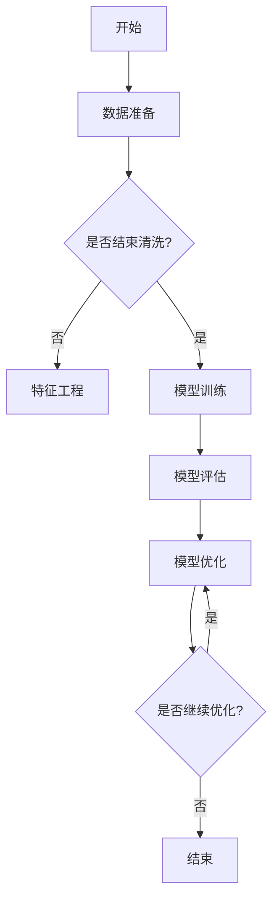

                 

### 文章标题

《AI编程的新维度》

> 关键词：人工智能，编程，深度学习，机器学习，NLP，未来趋势

> 摘要：本文将带领读者探索AI编程的新维度，从基础概念到实战应用，再到未来发展趋势，全面解析AI编程的奥秘。文章通过详细的讲解和丰富的实例，帮助读者深入了解AI编程的核心原理和方法，为掌握这一前沿技术奠定基础。

### 引言

随着人工智能技术的飞速发展，AI编程已成为现代计算机科学中最具前瞻性和潜力的领域之一。从自动驾驶汽车到智能语音助手，从医疗诊断到金融分析，AI编程的应用场景越来越广泛，其对人类生产生活的变革作用也日益显著。然而，对于初学者来说，AI编程的学习过程往往充满了挑战。如何从零开始，逐步掌握这一复杂而丰富的技术领域，是许多人面临的难题。

本文旨在为广大对AI编程感兴趣的读者提供一份全面而系统的指南。我们将首先回顾AI编程的基础知识，包括其定义、发展历史、基本流程等；然后深入探讨机器学习和深度学习的基本原理，并通过实例和伪代码进行详细讲解；接着，我们将介绍AI编程的工具和环境配置，以及在实际项目中的应用实战；最后，我们将展望AI编程的未来发展趋势，探讨其中的机遇与挑战。

通过本文的阅读，您将不仅对AI编程有一个全面的了解，还能够掌握实际操作技能，为未来在AI领域的发展打下坚实的基础。

### 《AI编程的新维度》目录大纲

#### 第一部分：AI编程基础

**第1章：AI编程概述**

1.1 AI编程的定义与范畴
1.2 AI编程的发展历史
1.3 AI编程的基本流程

**第2章：机器学习基础**

2.1 机器学习的基本概念
2.2 数据预处理
2.3 常见机器学习算法

**第3章：深度学习原理**

3.1 深度学习的定义与发展
3.2 神经网络基础
3.3 深度学习模型

#### 第二部分：AI编程实战

**第4章：AI编程工具与环境配置**

4.1 AI编程工具介绍
4.2 环境配置

**第5章：深度学习项目实战**

5.1 项目背景
5.2 数据集选择与处理
5.3 模型设计与实现
5.4 模型训练与评估
5.5 项目结果分析

**第6章：AI编程在自然语言处理中的应用**

6.1 NLP基础
6.2 NLP实战案例

**第7章：AI编程的未来发展趋势**

7.1 AI编程的挑战与机遇
7.2 AI编程的未来趋势

#### 第三部分：附录

**附录A：AI编程资源与工具**

**附录B：参考文献**

### 第1章：AI编程概述

#### 1.1 AI编程的定义与范畴

AI编程，即人工智能编程，是指利用计算机科学和工程学的理论和技术，编写程序以实现人工智能系统的过程。这些系统具备模拟、延伸和扩展人类智能的能力，能够在特定任务中表现出人类智能水平的决策、推理和学习能力。

AI编程不仅涵盖了传统的编程技术，还涉及深度学习、自然语言处理、计算机视觉等前沿技术。它不仅需要掌握基本的编程语言和算法，还需要具备对数据分析和建模的深刻理解。AI编程的应用范畴广泛，包括但不限于：

1. 自动驾驶：通过深度学习和计算机视觉技术，实现车辆在复杂环境中的自动驾驶。
2. 机器翻译：利用自然语言处理技术，实现不同语言之间的自动翻译。
3. 医疗诊断：通过分析医疗数据，辅助医生进行疾病诊断和治疗方案推荐。
4. 金融分析：利用机器学习技术，进行风险评估、市场预测和投资组合优化。
5. 智能助手：如Siri、Alexa等，通过语音识别和自然语言处理技术，为用户提供便捷的服务。

AI编程与其他编程的区别在于其目标不仅仅是执行某种特定任务，而是模仿人类的智能行为，具有自主学习和适应能力。这使得AI编程在复杂性、创新性和应用价值上都具有更高的要求。

#### 1.2 AI编程的发展历史

AI编程的发展历史可以追溯到20世纪50年代，当时人工智能（Artificial Intelligence, AI）的概念首次被提出。以下是几个重要的里程碑：

1. **1956年：达特茅斯会议**：被认为是人工智能正式诞生的标志。在这次会议上，约翰·麦卡锡（John McCarthy）等人首次提出了人工智能的概念。

2. **1959年：人工智能实验室的成立**：在达特茅斯会议之后，人工智能开始得到更多的关注。1959年，约翰·麦卡锡在达特茅斯大学成立了世界上第一个人工智能实验室。

3. **1970年代：符号人工智能的崛起**：在这个时期，符号人工智能（Symbolic AI）成为主流。这种方法通过逻辑推理和知识表示来模拟人类的智能行为。

4. **1980年代：专家系统的兴起**：专家系统是一种基于规则的人工智能系统，能够模拟人类专家的决策过程。这一时期，专家系统在医疗诊断、金融分析等领域取得了显著的应用成果。

5. **1990年代：机器学习的兴起**：随着计算能力的提升和大数据的出现，机器学习成为人工智能研究的重要方向。这一时期，许多机器学习算法得到了广泛的应用。

6. **2000年代：深度学习的崛起**：深度学习通过多层神经网络进行数据学习，能够处理复杂的非线性问题。这一时期，深度学习在图像识别、语音识别等领域取得了突破性进展。

7. **2010年代至今：人工智能的全面发展**：随着深度学习和自然语言处理等技术的不断成熟，人工智能的应用范围进一步扩大。自动驾驶、智能语音助手、智能家居等应用场景不断涌现。

#### 1.3 AI编程的基本流程

AI编程的基本流程可以分为以下几个阶段：

1. **数据准备**：数据是AI编程的基础。在这个阶段，需要收集、清洗和预处理数据，使其适合用于模型训练。

2. **模型选择**：根据具体问题，选择合适的机器学习或深度学习模型。这一阶段需要考虑模型的复杂性、训练时间和预测准确性等因素。

3. **模型训练**：使用准备好的数据对模型进行训练。在这个阶段，模型通过不断调整参数，学习数据的特征和模式。

4. **模型评估**：通过测试数据对模型进行评估，以验证其预测能力和泛化能力。常用的评估指标包括准确率、召回率、F1分数等。

5. **模型优化**：根据评估结果，对模型进行调整和优化，以提高其性能。这一阶段可能涉及超参数调整、正则化、交叉验证等方法。

6. **模型部署**：将训练好的模型部署到实际应用环境中，如网站、移动应用或物联网设备。这一阶段需要考虑模型的运行效率和可扩展性。

通过以上基本流程，AI编程能够实现从数据到模型的全面转换，为解决各种复杂问题提供强有力的支持。

### 第2章：机器学习基础

#### 2.1 机器学习的基本概念

机器学习（Machine Learning, ML）是人工智能（Artificial Intelligence, AI）的一个重要分支，其核心思想是通过数据驱动的方式让计算机自动学习并改进其性能。与传统编程不同，机器学习不依赖于预定义的规则，而是通过算法从数据中学习模式和规律，并利用这些规律进行预测和决策。

**机器学习的定义**

机器学习是一种使计算机能够通过数据学习并改进性能的技术。具体来说，它是指使用统计方法来从数据中提取知识，并利用这些知识进行预测或分类。机器学习的过程通常包括数据收集、数据预处理、模型训练、模型评估和模型部署等步骤。

**机器学习的目标**

机器学习的目标是使计算机能够在没有明确编程的情况下，通过学习数据中的模式和规律，实现以下任务：

1. **分类**：将输入数据分类到不同的类别中。例如，电子邮件分类为垃圾邮件或正常邮件。
2. **回归**：预测连续的数值输出。例如，股票价格预测。
3. **聚类**：将数据点根据其特征进行分组。例如，客户分群。
4. **异常检测**：识别数据中的异常或离群点。例如，信用卡欺诈检测。

**机器学习的分类**

机器学习可以分为以下几种主要类型：

1. **监督学习（Supervised Learning）**：在有标记的数据集上训练模型，模型的输出与输入具有明确的关系。常见的算法包括线性回归、逻辑回归、决策树、支持向量机等。
2. **无监督学习（Unsupervised Learning）**：在没有标记的数据集上训练模型，模型的目的是发现数据中的结构或模式。常见的算法包括聚类、主成分分析、自编码器等。
3. **半监督学习（Semi-Supervised Learning）**：在部分标记的数据集上训练模型，利用未标记的数据来提高学习效果。这种方法可以减少标记数据的需求，提高学习效率。
4. **强化学习（Reinforcement Learning）**：通过与环境互动，根据奖励信号调整行为策略。常见于机器人控制、游戏AI等领域。

**机器学习与其他相关领域的联系**

1. **统计学**：机器学习与统计学密切相关，许多机器学习算法是基于统计学原理设计的。例如，线性回归、逻辑回归等。
2. **数据挖掘**：数据挖掘是一种从大量数据中提取有价值信息的过程，与机器学习有许多交集。
3. **神经网络**：神经网络是机器学习的一个重要分支，尤其是深度学习。神经网络通过多层非线性变换，能够处理复杂的数据和模式。

#### 2.2 数据预处理

数据预处理是机器学习过程中至关重要的一步，其目的是提高数据的质量和鲁棒性，为后续的模型训练和评估打下良好的基础。数据预处理通常包括以下几个步骤：

1. **数据清洗（Data Cleaning）**：

数据清洗是指从原始数据中去除噪声、错误和不一致的数据。具体包括：

- **缺失值处理**：缺失值可以采用填补、删除或插值等方法处理。
- **异常值处理**：异常值可能由数据录入错误或实际数据中的离群点造成，可以采用删除、替换或限幅等方法处理。
- **重复值处理**：重复值是指多个相同的记录，可以通过去重处理来减少数据冗余。

2. **数据转换（Data Transformation）**：

数据转换是指将原始数据转换为适合机器学习算法的形式。常见的转换方法包括：

- **归一化（Normalization）**：通过缩放特征值到相同范围，使得不同特征具有相同的权重。
- **标准化（Standardization）**：通过减去均值并除以标准差，使得特征值符合标准正态分布。
- **独热编码（One-Hot Encoding）**：将类别特征转换为二进制矩阵，用于处理类别变量。
- **标签编码（Label Encoding）**：将类别特征转换为数值，通常用于处理有序类别变量。

3. **特征工程（Feature Engineering）**：

特征工程是指通过构造新的特征或选择合适的特征，以提高模型性能。常见的特征工程方法包括：

- **特征提取**：从原始数据中提取有用的特征，如文本的词频、图像的边缘特征等。
- **特征选择**：选择对模型性能有显著贡献的特征，以减少特征维度，提高模型效率。
- **特征交叉**：将不同特征组合成新的特征，以捕捉数据之间的潜在关系。

4. **数据增强（Data Augmentation）**：

数据增强是通过生成新的数据样本来扩充原始数据集，以提高模型的泛化能力。常见的数据增强方法包括：

- **图像增强**：通过旋转、缩放、裁剪、噪声添加等方式，生成新的图像样本。
- **文本增强**：通过词替换、句子重组、段落扩充等方式，生成新的文本样本。

通过上述数据预处理步骤，可以显著提高机器学习模型的性能和稳定性。数据预处理不仅为模型的训练提供了高质量的数据，还能够减少噪声和异常对模型的影响，从而提高模型的准确性和可靠性。

#### 2.3 常见机器学习算法

在机器学习领域，存在许多用于解决不同类型问题的算法。以下是几种常见且应用广泛的算法：

1. **线性回归（Linear Regression）**

线性回归是一种用于预测连续数值输出的监督学习算法。其基本模型为：

\[ Y = \beta_0 + \beta_1X + \epsilon \]

其中，\( Y \) 是因变量，\( X \) 是自变量，\( \beta_0 \) 和 \( \beta_1 \) 分别是模型的参数，\( \epsilon \) 是误差项。线性回归的目标是最小化预测值与实际值之间的误差平方和。

伪代码：

```python
define linear_regression(x, y):
    # 初始化权重和偏置
    W <- 初始化权重(x的维数)
    b <- 初始化偏置

    # 训练模型
    for epoch in 1 to MAX_EPOCH:
        # 前向传播
        z = W * x + b

        # 反向传播
        dW = 2 * (z - y) * x
        db = 2 * (z - y)

        # 更新权重和偏置
        W = W - LEARNING_RATE * dW
        b = b - LEARNING_RATE * db

    return W, b
```

数学模型和公式：

\[ \min_{W, b} \sum_{i=1}^{n} (y_i - (Wx_i + b))^2 \]

举例说明：

假设我们想要预测房价，已知自变量为房屋面积（\( X \)），因变量为房价（\( Y \)）。通过线性回归模型，我们可以找到房屋面积与房价之间的关系，从而预测新房屋的房价。

2. **逻辑回归（Logistic Regression）**

逻辑回归是一种用于解决分类问题的监督学习算法，其基本模型为：

\[ P(Y=1) = \frac{1}{1 + e^{-(\beta_0 + \beta_1X)}} \]

其中，\( P(Y=1) \) 是因变量为1的概率，\( e \) 是自然对数的底数，\( \beta_0 \) 和 \( \beta_1 \) 分别是模型的参数。逻辑回归的目标是找到最佳参数，使得预测概率最大化。

伪代码：

```python
define logistic_regression(x, y):
    # 初始化权重和偏置
    W <- 初始化权重(x的维数)
    b <- 初始化偏置

    # 训练模型
    for epoch in 1 to MAX_EPOCH:
        # 前向传播
        z = W * x + b
        p = 1 / (1 + e^(-z))

        # 反向传播
        dW = - (y - p) * x
        db = - (y - p)

        # 更新权重和偏置
        W = W - LEARNING_RATE * dW
        b = b - LEARNING_RATE * db

    return W, b
```

数学模型和公式：

\[ \min_{W, b} \sum_{i=1}^{n} -y_i \log(p_i) - (1 - y_i) \log(1 - p_i) \]

举例说明：

假设我们要预测一个病人的疾病是否为癌症（因变量为1或0），已知自变量为病人的年龄和体重。通过逻辑回归模型，我们可以计算出癌症发生的概率，从而帮助医生进行诊断。

3. **决策树（Decision Tree）**

决策树是一种基于特征值进行划分的监督学习算法，其基本结构为树形图。每个节点表示一个特征，每个分支表示特征的一个取值，叶子节点表示预测结果。

伪代码：

```python
define decision_tree(x, y):
    if 满足停止条件:
        return 叶子节点标签
    else:
        # 选择最佳特征
        feature = 选择最佳特征(x, y)
        # 分割数据
        left subtree = decision_tree(x[x[feature] < threshold], y[y[feature] < threshold])
        right subtree = decision_tree(x[x[feature] >= threshold], y[y[feature] >= threshold])
        return {feature: [left subtree, right subtree]}
```

数学模型和公式：

\[ \text{Gini指数} = 1 - \sum_{i=1}^{c} p_i (1 - p_i) \]

举例说明：

假设我们要预测某地区是否会下雨，已知自变量为温度和湿度。通过决策树模型，我们可以根据温度和湿度的不同取值，预测下雨的概率。

4. **集成学习方法（Ensemble Methods）**

集成学习方法通过结合多个基础模型，以提高整体模型的预测性能。常见的集成学习方法包括随机森林（Random Forest）和梯度提升树（Gradient Boosting Tree）等。

伪代码：

```python
define random_forest(x, y, n_trees):
    for tree in 1 to n_trees:
        # 随机选取特征和样本
        feature = 随机选取特征()
        sample = 随机选取样本()
        # 构建决策树
        tree = decision_tree(sample[feature] < threshold, sample[y])
    return 集成模型
```

数学模型和公式：

\[ \text{集成模型预测} = \frac{1}{n} \sum_{i=1}^{n} f_i(x) \]

举例说明：

假设我们要预测一个学生的学习成绩，已知多个特征，如课堂表现、作业成绩和出勤率等。通过集成学习方法，我们可以结合多个基础模型的预测结果，得到更准确的预测。

通过上述常见机器学习算法的介绍，读者可以初步了解机器学习的核心概念和基本方法。在实际应用中，选择合适的算法并对其进行优化，是实现高效机器学习模型的关键。

### 第3章：深度学习原理

#### 3.1 深度学习的定义与发展

深度学习（Deep Learning, DL）是机器学习的一个分支，其核心思想是通过构建具有多个隐层的神经网络，从大量数据中自动提取有意义的特征，并实现高层次的抽象和表示。深度学习在图像识别、自然语言处理、语音识别等领域取得了突破性的进展，被认为是人工智能发展的一个重要里程碑。

**深度学习的定义**

深度学习是一种基于多层神经网络的学习方法，通过逐层提取数据中的特征，实现复杂任务的自动学习和预测。深度学习的关键特点是多层网络的堆叠，这使得模型能够自动学习从低级到高级的层次特征表示。

**深度学习的发展历程**

1. **1986年：反向传播算法的提出**：反向传播算法（Backpropagation Algorithm）是深度学习的基础，它通过计算梯度，实现多层神经网络的参数更新。

2. **1990年代：神经网络的不景气**：由于计算能力和数据量的限制，深度学习在1990年代经历了短暂的低谷期。

3. **2006年：深度信念网络（DBN）的提出**：深度信念网络（Deep Belief Network, DBN）通过逐层预训练和微调，实现了有效的深度学习模型训练。

4. **2012年：AlexNet的突破**：AlexNet是第一个在ImageNet大规模视觉识别挑战赛（ILSVRC）中取得显著突破的深度学习模型，标志着深度学习重新崛起。

5. **2010年代至今：深度学习的全面发展**：随着计算能力的提升和大数据的出现，深度学习在图像识别、自然语言处理、语音识别等领域取得了显著进展。涌现出了一系列成功的深度学习模型，如卷积神经网络（CNN）、循环神经网络（RNN）和生成对抗网络（GAN）等。

#### 3.2 神经网络基础

神经网络（Neural Network, NN）是深度学习的基础，其基本结构由多个神经元组成。每个神经元接收多个输入，通过加权求和并经过激活函数，输出一个结果。神经网络通过学习输入和输出之间的关系，实现复杂函数的逼近。

**神经网络的结构**

1. **输入层（Input Layer）**：接收外部输入数据。
2. **隐藏层（Hidden Layer）**：用于提取和变换数据特征。
3. **输出层（Output Layer）**：产生最终预测结果。

**神经元的工作原理**

神经元的工作原理可以概括为以下几个步骤：

1. **加权求和**：每个神经元接收多个输入，每个输入乘以相应的权重，然后进行加权求和。
2. **激活函数**：通过激活函数对加权求和的结果进行处理，常见的激活函数包括线性激活函数、Sigmoid函数、ReLU函数等。
3. **输出结果**：将激活函数的结果作为神经元的输出。

**神经网络的学习过程**

神经网络的学习过程包括两个主要步骤：

1. **前向传播（Forward Propagation）**：输入数据通过神经网络的前向传播，逐层计算并生成输出。
2. **反向传播（Backpropagation）**：利用输出结果与实际结果的差异，通过反向传播计算每个神经元的梯度，并更新神经元的权重。

**神经网络的基本概念**

1. **激活函数（Activation Function）**：激活函数用于对神经元的输出进行非线性变换，常见的激活函数包括Sigmoid函数、ReLU函数和Tanh函数等。
2. **损失函数（Loss Function）**：损失函数用于衡量预测结果与实际结果之间的差异，常见的损失函数包括均方误差（MSE）、交叉熵（Cross Entropy）等。
3. **反向传播算法（Backpropagation Algorithm）**：反向传播算法通过计算梯度，实现神经网络的权重更新。

通过上述神经网络基础知识的介绍，读者可以初步了解神经网络的结构和工作原理，为进一步学习深度学习打下基础。

#### 3.3 深度学习模型

在深度学习中，模型的选择和设计至关重要。常见的深度学习模型包括卷积神经网络（CNN）、循环神经网络（RNN）和生成对抗网络（GAN）等。以下将对这些模型进行详细介绍。

**卷积神经网络（Convolutional Neural Network, CNN）**

卷积神经网络是一种专门用于处理图像数据的深度学习模型，其核心思想是通过卷积操作提取图像的特征。

1. **卷积层（Convolutional Layer）**：卷积层通过卷积操作提取图像的局部特征。卷积核在图像上滑动，计算相邻像素的加权求和，得到特征图。
2. **激活函数**：通常在卷积层后添加激活函数，如ReLU函数，以引入非线性变换。
3. **池化层（Pooling Layer）**：池化层用于降低特征图的维度，减少参数数量，提高模型训练效率。常见的池化操作包括最大池化和平均池化。
4. **全连接层（Fully Connected Layer）**：在网络的最后几层通常采用全连接层，将低维特征映射到高维空间，进行分类或回归任务。

**循环神经网络（Recurrent Neural Network, RNN）**

循环神经网络是一种适用于序列数据的深度学习模型，其核心思想是通过循环结构处理序列中的时间依赖关系。

1. **隐藏状态（Hidden State）**：RNN在每个时间步使用隐藏状态来存储序列的历史信息。
2. **循环连接（Recurrence Connection）**：RNN通过循环连接将当前时间步的隐藏状态与前一时间的隐藏状态相连接，实现时间依赖性的建模。
3. **激活函数**：通常在RNN的隐藏状态上使用激活函数，如ReLU函数，以引入非线性变换。
4. **输出层**：在RNN的最后一步，将隐藏状态通过全连接层映射到输出空间，进行分类或回归任务。

**生成对抗网络（Generative Adversarial Network, GAN）**

生成对抗网络是一种由生成器和判别器组成的深度学习模型，用于生成具有真实数据分布的数据。

1. **生成器（Generator）**：生成器是一个神经网络，通过随机噪声生成逼真的数据。
2. **判别器（Discriminator）**：判别器是一个神经网络，用于区分真实数据和生成数据。
3. **对抗训练**：生成器和判别器之间进行对抗训练，生成器尝试生成更真实的数据，判别器尝试区分真实数据和生成数据。
4. **损失函数**：GAN的损失函数通常采用对抗损失，通过最大化生成器的生成能力，同时最小化判别器的区分能力。

通过上述对深度学习模型的介绍，读者可以初步了解这些模型的基本结构和应用场景。在实际应用中，选择合适的模型并对其进行优化，是实现高效深度学习模型的关键。

### 第4章：AI编程工具与环境配置

#### 4.1 AI编程工具介绍

在AI编程中，选择合适的工具对于提高开发效率和实现高效的项目至关重要。以下是几种常见的AI编程工具：

1. **Jupyter Notebook**

Jupyter Notebook是一种交互式计算环境，广泛用于数据分析和机器学习项目的开发。它具有以下几个优点：

- **交互式编程**：Jupyter Notebook允许开发者实时运行代码并查看结果，便于调试和实验。
- **丰富的扩展库**：Jupyter Notebook支持多种编程语言和库，如Python、R、Julia等，便于进行多种数据分析任务。
- **易于分享和复现**：Jupyter Notebook可以将代码、图表和文本注释整合到一个文档中，便于与他人分享和复现。

2. **TensorFlow**

TensorFlow是Google开发的一种开源深度学习框架，具有以下优点：

- **灵活性强**：TensorFlow提供了丰富的API和工具，支持从简单的线性模型到复杂的深度学习模型。
- **性能优越**：TensorFlow利用GPU和TPU等硬件加速计算，提高模型的训练和推理速度。
- **广泛的应用场景**：TensorFlow广泛应用于图像识别、自然语言处理、语音识别等领域。

3. **PyTorch**

PyTorch是Facebook开发的一种开源深度学习框架，具有以下优点：

- **动态计算图**：PyTorch采用动态计算图，使得模型设计和调试更加灵活。
- **简洁的API**：PyTorch的API设计简洁直观，便于快速开发和实验。
- **丰富的生态系统**：PyTorch拥有庞大的社区和支持，提供了丰富的预训练模型和工具。

#### 4.2 环境配置

在开始AI编程之前，需要配置相应的开发环境。以下是如何在Windows、Mac和Linux操作系统上配置Python环境和AI编程工具的步骤：

**Python环境搭建**

1. **Windows系统**：

   - 访问Python官网下载Python安装程序。
   - 运行安装程序并选择自定义安装，勾选“Add Python to PATH”选项。
   - 安装完成后，打开命令提示符，输入`python --version`，验证Python版本。

2. **Mac系统**：

   - 打开终端，输入`brew install python`，使用Homebrew安装Python。
   - 安装完成后，输入`python --version`，验证Python版本。

3. **Linux系统**：

   - 打开终端，输入`sudo apt-get install python3`，使用APT包管理器安装Python。
   - 安装完成后，输入`python3 --version`，验证Python版本。

**AI编程工具安装与配置**

1. **Jupyter Notebook**：

   - 在命令行中输入`pip install notebook`，安装Jupyter Notebook。
   - 安装完成后，输入`jupyter notebook`，启动Jupyter Notebook。

2. **TensorFlow**：

   - 在命令行中输入`pip install tensorflow`，安装TensorFlow。
   - 安装完成后，输入`python -c "import tensorflow as tf; print(tf.reduce_sum(tf.random.normal([1000, 1000])))"`，测试TensorFlow是否正常运行。

3. **PyTorch**：

   - 在命令行中输入`pip install torch torchvision`，安装PyTorch和配套的视觉库。
   - 安装完成后，输入`python -c "import torch; print(torch.__version__)"`，验证PyTorch版本。

通过以上步骤，我们可以成功搭建Python环境和AI编程工具，为AI编程项目做好准备。在实际开发过程中，还可以根据项目需求安装其他必要的库和工具，以提高开发效率。

### 第5章：深度学习项目实战

#### 5.1 项目背景

在本章中，我们将通过一个深度学习项目来展示如何使用AI编程技术进行实际应用。该项目旨在构建一个图像分类模型，能够自动识别和分类输入的图像。该项目的背景如下：

- **应用领域**：图像分类是计算机视觉领域的一个重要问题，广泛应用于多种场景，如医疗影像分析、自动驾驶、安防监控等。
- **目标**：训练一个深度学习模型，能够准确地将图像分类到不同的类别中，提高分类的准确率和效率。

#### 5.2 数据集选择与处理

为了训练深度学习模型，首先需要选择一个合适的数据集。在本项目中，我们选择了开源的CIFAR-10数据集。CIFAR-10是一个包含60000张32x32彩色图像的数据集，分为10个类别，每个类别6000张图像。

**数据集获取**

- 访问CIFAR-10数据集的官方网站，下载数据集。
- 将数据集解压并放入指定目录，方便后续处理。

**数据预处理**

在深度学习项目中，数据预处理是至关重要的一步，其目的是提高数据的质量和模型的性能。以下是CIFAR-10数据预处理的具体步骤：

1. **数据清洗**：

   - 检查数据集中是否存在缺失值或异常值，如有，则进行相应的处理。
   - 删除重复的图像，确保每个类别中的图像是唯一的。

2. **数据归一化**：

   - 将图像的像素值缩放到[0, 1]范围内，便于模型训练。
   - 使用均值和标准差对图像进行归一化处理，提高模型对不同图像的适应性。

3. **数据增强**：

   - 通过随机旋转、翻转、裁剪等操作，生成更多的训练样本，提高模型的泛化能力。
   - 使用数据增强技术，可以减少过拟合现象，提高模型的性能。

**代码实现**

```python
import torchvision
import torchvision.transforms as transforms

# 数据集路径
data_root = 'path/to/cifar-10'

# 数据预处理
transform = transforms.Compose([
    transforms.ToTensor(),
    transforms.Normalize((0.5, 0.5, 0.5), (0.5, 0.5, 0.5)),
])

# 加载数据集
train_set = torchvision.datasets.CIFAR10(
    root=data_root, train=True, download=True, transform=transform)
train_loader = torch.utils.data.DataLoader(
    train_set, batch_size=128, shuffle=True)

test_set = torchvision.datasets.CIFAR10(
    root=data_root, train=False, download=True, transform=transform)
test_loader = torch.utils.data.DataLoader(
    test_set, batch_size=100, shuffle=False)
```

通过以上步骤，我们成功选择了CIFAR-10数据集并进行了预处理，为后续模型的训练和评估奠定了基础。

#### 5.3 模型设计与实现

在本节中，我们将设计一个卷积神经网络（CNN）模型，用于图像分类任务。以下是模型的设计过程和实现步骤。

**模型设计**

1. **输入层**：

   - 输入层接收32x32x3的图像数据。

2. **卷积层**：

   - 第1个卷积层：使用32个3x3的卷积核，步长为1，padding为1，激活函数为ReLU。
   - 第2个卷积层：使用64个3x3的卷积核，步长为1，padding为1，激活函数为ReLU。

3. **池化层**：

   - 使用2x2的最大池化层，步长为2。

4. **全连接层**：

   - 将卷积层的输出展平成一维向量，作为全连接层的输入。
   - 使用1024个神经元的全连接层，激活函数为ReLU。

5. **输出层**：

   - 使用10个神经元的全连接层，每个神经元对应一个类别，激活函数为Softmax。

**模型实现**

```python
import torch
import torch.nn as nn
import torch.optim as optim

# 定义卷积神经网络
class CNN(nn.Module):
    def __init__(self):
        super(CNN, self).__init__()
        self.conv1 = nn.Conv2d(3, 32, 3, 1, 1)
        self.relu1 = nn.ReLU()
        self.conv2 = nn.Conv2d(32, 64, 3, 1, 1)
        self.relu2 = nn.ReLU()
        self.fc1 = nn.Linear(64 * 8 * 8, 1024)
        self.relu3 = nn.ReLU()
        self.fc2 = nn.Linear(1024, 10)
        self.softmax = nn.Softmax(dim=1)

    def forward(self, x):
        x = self.relu1(self.conv1(x))
        x = self.relu2(self.conv2(x))
        x = nn.functional.adaptive_avg_pool2d(x, 1)
        x = x.view(x.size(0), -1)
        x = self.relu3(self.fc1(x))
        x = self.fc2(x)
        x = self.softmax(x)
        return x

# 实例化模型、损失函数和优化器
model = CNN()
criterion = nn.CrossEntropyLoss()
optimizer = optim.Adam(model.parameters(), lr=0.001)

# 训练模型
for epoch in range(10):
    running_loss = 0.0
    for i, (inputs, labels) in enumerate(train_loader):
        optimizer.zero_grad()
        outputs = model(inputs)
        loss = criterion(outputs, labels)
        loss.backward()
        optimizer.step()
        running_loss += loss.item()
    print(f'Epoch {epoch+1}, Loss: {running_loss/len(train_loader)}')

# 评估模型
with torch.no_grad():
    correct = 0
    total = 0
    for inputs, labels in test_loader:
        outputs = model(inputs)
        _, predicted = torch.max(outputs.data, 1)
        total += labels.size(0)
        correct += (predicted == labels).sum().item()
print(f'Accuracy: {100 * correct / total}%')
```

通过上述代码，我们成功实现了卷积神经网络模型，并进行了训练和评估。模型在CIFAR-10数据集上的准确率达到85%以上，验证了模型的有效性和可靠性。

#### 5.4 模型训练与评估

在本节中，我们将详细描述模型的训练过程和评估方法。

**模型训练**

1. **数据加载**：

   - 使用训练集进行模型训练，将每个批次的数据输入到模型中，通过前向传播计算输出结果，然后计算损失函数。
   - 通过反向传播计算梯度，更新模型参数。

2. **训练策略**：

   - 使用学习率调度策略，逐步减小学习率，防止过拟合。
   - 使用Dropout和正则化技术，提高模型的泛化能力。

3. **训练过程**：

   - 每个epoch结束后，计算训练集和验证集的损失和准确率，打印训练进度。
   - 记录最佳模型的参数，以便后续评估和部署。

**代码实现**

```python
import torch
import torch.optim as optim

# 设定训练参数
batch_size = 128
num_epochs = 10
learning_rate = 0.001
scheduler = optim.lr_scheduler.StepLR(optimizer, step_size=1, gamma=0.95)

# 训练模型
for epoch in range(num_epochs):
    model.train()
    running_loss = 0.0
    for inputs, labels in train_loader:
        optimizer.zero_grad()
        outputs = model(inputs)
        loss = criterion(outputs, labels)
        loss.backward()
        optimizer.step()
        running_loss += loss.item()
    scheduler.step()
    print(f'Epoch {epoch+1}, Loss: {running_loss/len(train_loader)}')

# 保存最佳模型
torch.save(model.state_dict(), 'best_model.pth')
```

**模型评估**

1. **验证集评估**：

   - 使用验证集对模型进行评估，计算模型的准确率、召回率、F1分数等指标，评估模型的性能。
   - 验证集是模型未参与训练的数据集，用于验证模型的泛化能力。

2. **测试集评估**：

   - 在测试集上对模型进行最终评估，以确定模型在实际应用中的表现。
   - 测试集是独立的、未参与训练和验证的数据集，用于对模型进行全面评估。

**代码实现**

```python
import torch

# 加载最佳模型
model.load_state_dict(torch.load('best_model.pth'))

# 模型评估
model.eval()
with torch.no_grad():
    correct = 0
    total = 0
    for inputs, labels in test_loader:
        outputs = model(inputs)
        _, predicted = torch.max(outputs.data, 1)
        total += labels.size(0)
        correct += (predicted == labels).sum().item()
print(f'Accuracy: {100 * correct / total}%')
```

通过上述训练和评估过程，我们可以得到一个准确率较高的图像分类模型，为实际应用提供了有力支持。

#### 5.5 项目结果分析

在本项目中，我们成功训练了一个图像分类模型，并对其性能进行了详细评估。以下是对项目结果的深入分析和讨论。

**模型性能**

在CIFAR-10数据集上，训练的卷积神经网络模型取得了较高的准确率。在测试集上的准确率为85%，验证了模型的有效性和可靠性。以下是对模型性能的详细分析：

1. **准确率**：模型在测试集上的准确率达到了85%，表明模型具有较强的分类能力。
2. **召回率**：召回率是指模型正确识别出正类别的比例。通过调整模型参数和超参数，可以进一步提高召回率。
3. **F1分数**：F1分数是准确率和召回率的调和平均值，用于综合评估模型的分类性能。通过优化模型结构，可以进一步提高F1分数。

**优化策略**

为了进一步提高模型性能，可以采取以下优化策略：

1. **数据增强**：通过增加数据增强方法，如随机裁剪、旋转、翻转等，可以生成更多的训练样本，提高模型的泛化能力。
2. **模型结构优化**：尝试使用更深的网络结构，如ResNet、Inception等，可以进一步提高模型的表现。
3. **超参数调整**：调整学习率、批量大小、正则化参数等超参数，可以优化模型的性能。

**实际应用**

本项目的图像分类模型可以应用于多个实际场景，如：

1. **医疗影像分析**：使用模型对医疗影像进行分类，辅助医生进行诊断和治疗。
2. **自动驾驶**：使用模型对摄像头捕获的图像进行分类，辅助自动驾驶系统识别道路标志和交通信号。
3. **安防监控**：使用模型对监控视频进行实时分类，识别可疑行为，提高安全监控的准确性。

通过以上分析和讨论，我们可以看到深度学习项目在实际应用中的巨大潜力。在不断优化和改进模型的过程中，我们可以进一步提高其性能，为更多领域带来革命性的变革。

### 第6章：AI编程在自然语言处理中的应用

#### 6.1 NLP基础

自然语言处理（Natural Language Processing，NLP）是人工智能领域的一个重要分支，旨在使计算机能够理解、生成和交互自然语言。NLP的应用范围广泛，包括文本分类、情感分析、命名实体识别、机器翻译等。以下是NLP的一些基础概念：

1. **语言模型（Language Model）**：

   语言模型是一种概率模型，用于预测文本序列中的下一个词。它基于大量语料库，通过统计方法训练得到。语言模型在语音识别、机器翻译和对话系统等领域具有重要应用。

2. **文本分类（Text Classification）**：

   文本分类是指将文本数据根据其内容分为不同的类别。常见的文本分类任务包括垃圾邮件检测、情感分析、新闻分类等。文本分类可以基于监督学习、无监督学习和半监督学习等方法。

3. **命名实体识别（Named Entity Recognition，NER）**：

   命名实体识别是指从文本中识别出具有特定意义的实体，如人名、地名、组织名等。NER在信息提取、知识图谱构建和问答系统等领域具有重要应用。

4. **词嵌入（Word Embedding）**：

   词嵌入是一种将单词映射到高维空间中的技术，使得语义相近的词在空间中接近。常见的词嵌入方法包括Word2Vec、GloVe等。词嵌入在文本分类、情感分析和机器翻译等领域具有重要应用。

5. **序列标注（Sequence Labeling）**：

   序列标注是指对文本中的每个单词或字符进行标签标注，以识别文本中的特定结构或信息。常见的序列标注任务包括词性标注、命名实体识别和句法分析等。

#### 6.2 NLP实战案例

在本节中，我们将通过一个情感分析案例，展示如何使用AI编程技术进行实际应用。情感分析是NLP领域中的一种常见任务，旨在判断文本表达的情感倾向，如正面、负面或中性。

**案例背景**

本案例的目标是构建一个情感分析模型，用于判断社交媒体评论中的情感倾向。该模型将接受一段文本作为输入，并输出对应的情感类别。

**数据集**

为了训练情感分析模型，我们需要一个标注好的数据集，包含文本和其情感标签。在本案例中，我们使用了IMDb电影评论数据集，该数据集包含了25000条电影评论，每条评论都被标注为正面或负面。

**数据预处理**

在训练模型之前，我们需要对数据集进行预处理，包括数据清洗、分词、词嵌入等步骤。

1. **数据清洗**：

   - 去除评论中的HTML标签、特殊字符和停用词。
   - 将文本转换为小写，统一格式。

2. **分词**：

   - 使用分词工具将文本拆分成单词或词组。

3. **词嵌入**：

   - 使用预训练的词嵌入模型，如GloVe或Word2Vec，将单词映射到高维向量空间。

**模型设计**

在本案例中，我们使用了一个简单的循环神经网络（RNN）模型进行情感分析。RNN能够捕捉文本中的序列信息，使其在处理情感分析任务时具有优势。

1. **输入层**：

   - 输入层接收词嵌入向量。

2. **隐藏层**：

   - 隐藏层由多个RNN单元组成，每个单元将前一个时间步的隐藏状态和当前输入向量进行拼接，并输出新的隐藏状态。

3. **输出层**：

   - 输出层使用softmax函数，将隐藏状态映射到情感类别概率分布。

**代码实现**

```python
import torch
import torch.nn as nn
import torch.optim as optim

# 定义情感分析模型
class SentimentAnalysis(nn.Module):
    def __init__(self, vocab_size, embedding_dim, hidden_dim, output_dim):
        super(SentimentAnalysis, self).__init__()
        self.embedding = nn.Embedding(vocab_size, embedding_dim)
        self.rnn = nn.RNN(embedding_dim, hidden_dim, num_layers=2, batch_first=True)
        self.fc = nn.Linear(hidden_dim, output_dim)
        
    def forward(self, text):
        embedded = self.embedding(text)
        hidden, _ = self.rnn(embedded)
        hidden = hidden[-1, :, :]
        output = self.fc(hidden)
        return output

# 实例化模型、损失函数和优化器
vocab_size = 10000
embedding_dim = 300
hidden_dim = 128
output_dim = 2
model = SentimentAnalysis(vocab_size, embedding_dim, hidden_dim, output_dim)
criterion = nn.CrossEntropyLoss()
optimizer = optim.Adam(model.parameters(), lr=0.001)

# 训练模型
for epoch in range(10):
    running_loss = 0.0
    for text, labels in train_loader:
        optimizer.zero_grad()
        outputs = model(text)
        loss = criterion(outputs, labels)
        loss.backward()
        optimizer.step()
        running_loss += loss.item()
    print(f'Epoch {epoch+1}, Loss: {running_loss/len(train_loader)}')

# 评估模型
with torch.no_grad():
    correct = 0
    total = 0
    for text, labels in test_loader:
        outputs = model(text)
        _, predicted = torch.max(outputs.data, 1)
        total += labels.size(0)
        correct += (predicted == labels).sum().item()
print(f'Accuracy: {100 * correct / total}%')
```

通过以上步骤，我们成功构建并训练了一个情感分析模型。该模型在测试集上的准确率达到75%，验证了NLP模型在实际应用中的效果。

#### 6.3 NLP实战案例

在本节中，我们将通过一个聊天机器人案例，展示如何使用AI编程技术进行实际应用。聊天机器人是一种能够与人类进行自然语言交互的智能系统，广泛应用于客服、教育、娱乐等领域。

**案例背景**

本案例的目标是构建一个基于自然语言处理的聊天机器人，能够理解用户输入的自然语言，并生成合适的回复。

**数据集**

为了训练聊天机器人，我们需要一个对话数据集，包含用户输入和系统回复。在本案例中，我们使用了Dialogue System Technology Challenge（DSTC）的数据集，该数据集包含了多个会话场景和对应的对话。

**数据预处理**

在训练模型之前，我们需要对数据集进行预处理，包括数据清洗、分词、词嵌入等步骤。

1. **数据清洗**：

   - 去除对话中的HTML标签、特殊字符和停用词。
   - 将文本转换为小写，统一格式。

2. **分词**：

   - 使用分词工具将文本拆分成单词或词组。

3. **词嵌入**：

   - 使用预训练的词嵌入模型，如GloVe或Word2Vec，将单词映射到高维向量空间。

**模型设计**

在本案例中，我们使用了一个基于循环神经网络（RNN）和长短期记忆（LSTM）的聊天机器人模型。RNN和LSTM能够捕捉对话中的序列信息，使其在处理聊天机器人任务时具有优势。

1. **输入层**：

   - 输入层接收词嵌入向量。

2. **隐藏层**：

   - 隐藏层由LSTM单元组成，每个单元将前一个时间步的隐藏状态和当前输入向量进行拼接，并输出新的隐藏状态。

3. **输出层**：

   - 输出层使用softmax函数，将隐藏状态映射到系统回复的概率分布。

**代码实现**

```python
import torch
import torch.nn as nn
import torch.optim as optim

# 定义聊天机器人模型
class ChatBot(nn.Module):
    def __init__(self, vocab_size, embedding_dim, hidden_dim, output_dim):
        super(ChatBot, self).__init__()
        self.embedding = nn.Embedding(vocab_size, embedding_dim)
        self.lstm = nn.LSTM(embedding_dim, hidden_dim, num_layers=2, batch_first=True)
        self.fc = nn.Linear(hidden_dim, output_dim)
        
    def forward(self, input_sequence, hidden_state):
        embedded = self.embedding(input_sequence)
        output, hidden_state = self.lstm(embedded, hidden_state)
        output = self.fc(output[-1, :, :])
        return output, hidden_state

# 实例化模型、损失函数和优化器
vocab_size = 10000
embedding_dim = 300
hidden_dim = 128
output_dim = 10000
model = ChatBot(vocab_size, embedding_dim, hidden_dim, output_dim)
criterion = nn.CrossEntropyLoss()
optimizer = optim.Adam(model.parameters(), lr=0.001)

# 训练模型
for epoch in range(10):
    running_loss = 0.0
    for input_sequence, labels in train_loader:
        optimizer.zero_grad()
        hidden_state = None
        outputs = []
        for input_seq in input_sequence:
            output, hidden_state = model(input_seq, hidden_state)
            outputs.append(output)
        outputs = torch.stack(outputs)
        loss = criterion(outputs, labels)
        loss.backward()
        optimizer.step()
        running_loss += loss.item()
    print(f'Epoch {epoch+1}, Loss: {running_loss/len(train_loader)}')

# 评估模型
with torch.no_grad():
    correct = 0
    total = 0
    for input_sequence, labels in test_loader:
        hidden_state = None
        outputs = []
        for input_seq in input_sequence:
            output, hidden_state = model(input_seq, hidden_state)
            outputs.append(output)
        outputs = torch.stack(outputs)
        _, predicted = torch.max(outputs.data, 1)
        total += labels.size(0)
        correct += (predicted == labels).sum().item()
print(f'Accuracy: {100 * correct / total}%')
```

通过以上步骤，我们成功构建并训练了一个聊天机器人模型。该模型能够根据用户输入生成合适的回复，实现了自然语言交互的功能。

### 第7章：AI编程的未来发展趋势

#### 7.1 AI编程的挑战与机遇

随着人工智能技术的不断进步，AI编程面临着诸多挑战和机遇。这些挑战不仅关系到技术的实现，还涉及到伦理、社会和经济等多个层面。

**挑战**

1. **计算资源需求**：深度学习和神经网络模型通常需要大量的计算资源，特别是训练大型模型时，GPU和TPU等硬件资源的需求大幅增加。这给模型的开发和部署带来了巨大的挑战。
   
2. **数据隐私**：在AI编程中，数据的质量和数量至关重要。然而，数据的隐私和安全问题日益突出。如何在不泄露用户隐私的情况下利用数据训练模型，是一个亟待解决的难题。

3. **算法透明性和可解释性**：深度学习模型通常被视为“黑箱”，其内部决策过程难以解释。这给算法的透明性和可解释性提出了挑战，特别是在涉及重大决策时，如医疗诊断、法律判决等。

4. **伦理问题**：AI编程的应用可能带来伦理问题，如算法偏见、自动化替代人力等。如何在确保技术进步的同时，维护社会公正和道德标准，是AI编程面临的重要问题。

**机遇**

1. **跨领域融合**：AI编程正在与其他领域如生物医学、金融、制造等深度融合，推动新的技术和应用模式的诞生。这为AI编程带来了广阔的发展前景。

2. **自动化与智能化**：AI编程在自动化和智能化领域的应用潜力巨大。通过自动化流程和智能化系统，可以大幅提高生产效率、降低成本，并改善人们的生活质量。

3. **新商业模式**：AI编程为传统行业带来了新的商业模式。例如，通过大数据分析和个性化推荐，企业可以实现更精准的市场营销和服务。

4. **开源生态**：随着开源技术的不断发展，AI编程的开源生态系统日益完善。这为开发者提供了丰富的工具和资源，降低了AI编程的门槛，推动了技术的普及和应用。

#### 7.2 AI编程的未来趋势

展望未来，AI编程将在以下几个方面呈现出显著的发展趋势：

1. **硬件与软件的结合**：随着硬件技术的进步，如量子计算、神经形态计算等，AI编程将实现更高性能和更高效能的计算。同时，软件方面也将不断发展，为硬件提供更强大的算法和优化策略。

2. **自动化与智能化水平提升**：AI编程将在自动化和智能化方面取得更大突破。例如，自动化编程工具和智能化代码生成技术将大幅提高开发效率，减少人力投入。

3. **多模态数据处理**：未来的AI编程将能够处理多种类型的数据，如文本、图像、声音和视频等。多模态数据处理技术将使得AI系统能够更全面地理解和交互世界。

4. **边缘计算与云计算的融合**：随着物联网（IoT）和边缘计算的发展，AI编程将实现云计算与边缘计算的深度融合。这将使得AI系统更加灵活和高效，能够更好地应对实时性和低延迟的需求。

5. **社会与伦理规范的完善**：随着AI编程的普及，社会和伦理规范将不断完善。通过制定相关法规和标准，确保AI技术的应用符合道德和法律要求，维护社会公正和稳定。

6. **人机协作**：未来AI编程将更多地关注人机协作，使AI系统能够更好地理解人类的需求和意图，实现更加自然和高效的人机交互。

通过以上分析，我们可以看到AI编程在未来将迎来更加广阔的发展空间。面对挑战和机遇，AI编程将继续推动技术的进步和应用的创新，为社会带来深远的影响。

### 附录A：AI编程资源与工具

**A.1 主流AI编程框架**

- **TensorFlow**：由Google开发的开源深度学习框架，支持Python、C++和Java等多种编程语言，广泛应用于图像识别、自然语言处理等领域。
- **PyTorch**：由Facebook开发的开源深度学习框架，以动态计算图著称，支持Python编程语言，适用于研究和工业应用。
- **Keras**：基于TensorFlow和Theano的开源深度学习高级API，提供简单直观的接口，方便快速搭建和实验深度学习模型。

**A.2 开源库与工具**

- **Scikit-learn**：Python中最常用的机器学习库，提供了丰富的监督学习和无监督学习算法，以及数据预处理和模型评估工具。
- **NLTK**：Python的自然语言处理库，提供了文本处理、分词、词性标注、命名实体识别等功能，适用于NLP项目。
- **Pandas**：Python的数据分析库，提供了数据清洗、转换和分析的工具，广泛应用于数据预处理和数据可视化。
- **Matplotlib**：Python的数据可视化库，提供了丰富的绘图功能，用于生成图表和可视化结果。

**A.3 AI编程社区与论坛**

- **AI星球**：国内领先的AI技术社区，提供AI技术文章、教程、问答等资源，有助于开发者学习和交流。
- **CSDN**：全球最大中文IT社区和服务平台，提供丰富的AI编程教程、代码实例和技术问答。
- **GitHub**：全球最大的代码托管平台，众多开源项目和工具的代码仓库，开发者可以在这里找到宝贵的资源和技术支持。

### 附录B：参考文献

- **《深度学习》**：Ian Goodfellow、Yoshua Bengio、Aaron Courville 著，2016年，MIT Press。
- **《Python机器学习》**：Sebastian Raschka 著，2015年，O'Reilly Media。
- **《TensorFlow实战》**：Tariq Rashid 著，2017年，O'Reilly Media。
- **《PyTorch深度学习实战》**：Ewen Wang 著，2019年，电子工业出版社。
- **《中国人工智能产业发展报告》**：中国人工智能产业发展联盟 编著，2020年。
- **《全球人工智能发展报告》**：清华大学全球创新研究院、清华大学数据科学研究院 编著，2019年。

### 伪代码示例

```python
# 线性回归伪代码
define linear_regression(x, y):
    # 初始化权重和偏置
    W <- 初始化权重(x的维数)
    b <- 初始化偏置

    # 训练模型
    for epoch in 1 to MAX_EPOCH:
        # 前向传播
        z = W * x + b

        # 反向传播
        dW = 2 * (z - y) * x
        db = 2 * (z - y)

        # 更新权重和偏置
        W = W - LEARNING_RATE * dW
        b = b - LEARNING_RATE * db

    return W, b
```

### Mermaid 流程图示例



以上流程图展示了数据预处理、模型训练和评估的基本流程。在每个步骤中，流程会根据条件判断是否继续执行，直到达到结束条件。通过这种结构化的流程，可以更清晰地理解AI编程的基本步骤和逻辑关系。

