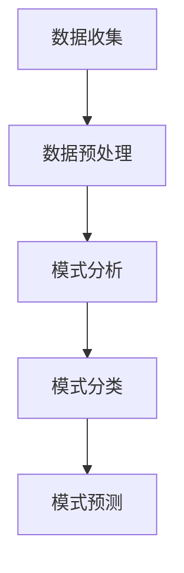
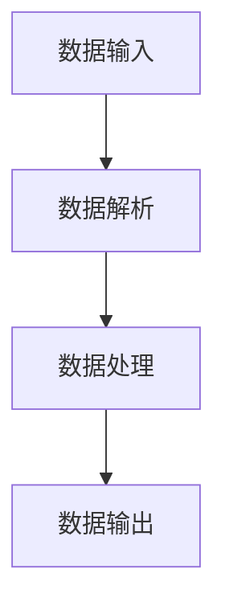
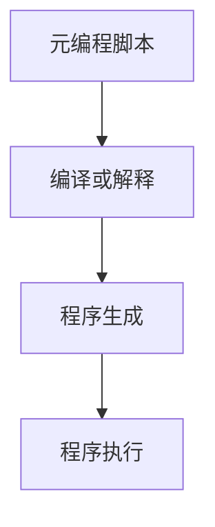

                 

# 《AI编程的新维度与新范式》

## 关键词
人工智能，编程范式，自适应编程，虚拟代理编程，增强学习编程，模式识别范式，数据驱动范式，元编程范式

## 摘要
本文旨在探讨AI编程的新维度与新范式。随着人工智能技术的飞速发展，AI编程逐渐超越了传统编程的范畴，形成了独特的编程维度和范式。本文首先介绍了AI编程的基本概念和历史背景，然后深入探讨了自适应编程、虚拟代理编程和增强学习编程等新维度，以及模式识别范式、数据驱动范式和元编程范式等新范式。通过详细的分析和实例，本文展示了AI编程的复杂性和多样性，为开发者提供了全新的编程思路和方法。

## 目录

### 第一部分: AI编程的背景与理论基础

#### 第1章: AI编程的基本概念

##### 1.1 AI编程的定义与历史
##### 1.2 AI编程的关键术语
##### 1.3 AI编程与传统编程的区别

#### 第2章: AI编程的新维度

##### 2.1 自适应编程

###### 2.1.1 自适应编程的概念
###### 2.1.2 自适应编程的应用场景

##### 2.2 虚拟代理编程

###### 2.2.1 虚拟代理编程的概念
###### 2.2.2 虚拟代理编程的应用场景

##### 2.3 增强学习编程

###### 2.3.1 增强学习编程的概念
###### 2.3.2 增强学习编程的应用场景

#### 第3章: AI编程的新范式

##### 3.1 模式识别范式

###### 3.1.1 模式识别范式的基本原理
###### 3.1.2 模式识别范式的应用

##### 3.2 数据驱动范式

###### 3.2.1 数据驱动范式的基本原理
###### 3.2.2 数据驱动范式的应用

##### 3.3 元编程范式

###### 3.3.1 元编程范式的基本原理
###### 3.3.2 元编程范式的应用

### 第二部分: AI编程的核心算法与技术

#### 第4章: 常见AI算法介绍

##### 4.1 神经网络

###### 4.1.1 神经网络的基本结构
###### 4.1.2 神经网络的训练与优化

##### 4.2 决策树与随机森林

###### 4.2.1 决策树的基本原理
###### 4.2.2 随机森林的原理与应用

##### 4.3 支持向量机

###### 4.3.1 支持向量机的基本原理
###### 4.3.2 支持向量机的实现与优化

#### 第5章: AI编程的数学基础

##### 5.1 线性代数

###### 5.1.1 向量与矩阵的基本操作
###### 5.1.2 矩阵的分解与运算

##### 5.2 概率论与统计

###### 5.2.1 概率的基本概念
###### 5.2.2 统计推断的基本方法

##### 5.3 最优化理论

###### 5.3.1 最优化问题的基本形式
###### 5.3.2 常见最优化算法

### 第三部分: AI编程的应用实践

#### 第6章: AI编程在实际项目中的应用

##### 6.1 自然语言处理应用案例

###### 6.1.1 文本分类的实战
###### 6.1.2 机器翻译的实战

##### 6.2 计算机视觉应用案例

###### 6.2.1 图像识别的实战
###### 6.2.2 目标跟踪的实战

##### 6.3 智能推荐系统应用案例

###### 6.3.1 推荐算法的实战
###### 6.3.2 推荐系统的构建与优化

#### 第7章: AI编程的工程化实践

##### 7.1 AI项目开发流程

###### 7.1.1 项目规划与需求分析
###### 7.1.2 模型设计与实现

##### 7.2 AI模型的部署与维护

###### 7.2.1 模型部署的基本策略
###### 7.2.2 模型监控与优化

### 附录

#### 附录A: AI编程资源与工具

##### A.1 开源深度学习框架

###### A.1.1 TensorFlow
###### A.1.2 PyTorch

##### A.2 编程工具与IDE

###### A.2.1 PyCharm
###### A.2.2 Jupyter Notebook

##### A.3 数据处理与可视化工具

###### A.3.1 Pandas
###### A.3.2 Matplotlib

---

### 引言

随着计算机技术的不断发展，人工智能（AI）已成为当今科技领域的一大热点。AI编程作为人工智能的核心组成部分，正在逐渐改变传统编程的方式和范式。本文旨在探讨AI编程的新维度与新范式，为开发者提供一种全新的编程视角和思路。

首先，我们将回顾AI编程的基本概念和历史背景，了解AI编程与传统编程的区别。接着，我们将深入探讨AI编程的新维度，包括自适应编程、虚拟代理编程和增强学习编程等，并阐述这些新维度的核心概念和应用场景。然后，我们将介绍AI编程的新范式，如模式识别范式、数据驱动范式和元编程范式，并分析这些新范式的特点和优势。

在第二部分，我们将介绍AI编程的核心算法和技术，包括神经网络、决策树与随机森林、支持向量机等。我们将详细讲解这些算法的基本原理和实现方法，并通过数学模型和伪代码来阐述其工作原理。

第三部分将聚焦AI编程的应用实践，通过自然语言处理、计算机视觉和智能推荐系统等实际案例，展示AI编程在各个领域的应用。最后，我们将探讨AI编程的工程化实践，包括项目开发流程、模型部署与维护等，为开发者提供实用的工程化建议。

通过本文的探讨，我们希望读者能够对AI编程的新维度和新范式有一个全面而深入的理解，为未来的编程工作提供新的启示和指导。

### 第一部分: AI编程的背景与理论基础

#### 第1章: AI编程的基本概念

##### 1.1 AI编程的定义与历史

人工智能（Artificial Intelligence，简称AI）是一门研究、开发用于模拟、延伸和扩展人类智能的理论、方法、技术及应用系统的科学技术。AI编程，即利用计算机程序来实现人工智能的算法和模型，是人工智能技术的重要组成部分。AI编程的定义可以从以下几个方面来理解：

1. **目标：** AI编程的目标是通过编写程序来实现智能体的智能行为，使其能够感知环境、学习知识、做出决策和执行任务。
2. **方法：** AI编程采用的方法包括机器学习、深度学习、自然语言处理、计算机视觉等，通过训练模型来模拟人类的认知过程。
3. **技术：** AI编程涉及的技术包括数据预处理、模型训练、模型评估、模型部署等，这些技术共同构成了AI编程的核心。

AI编程的历史可以追溯到20世纪50年代，当时计算机科学家艾伦·图灵提出了著名的“图灵测试”，试图通过测试来判断机器是否具备智能。此后，随着计算机硬件的发展、算法的进步和大数据的出现，AI编程逐渐成为计算机科学的重要分支。从早期的符号逻辑编程，到现在的深度学习和强化学习，AI编程经历了多个发展阶段。

##### 1.2 AI编程的关键术语

在AI编程中，有许多关键术语需要理解，这些术语包括：

1. **人工智能体（Agent）：** 人工智能体是能够感知环境、自主决策并采取行动的计算机程序或实体。
2. **机器学习（Machine Learning）：** 机器学习是一种通过训练模型来自动学习和改进性能的AI技术，包括监督学习、无监督学习和强化学习等。
3. **深度学习（Deep Learning）：** 深度学习是机器学习的一种方法，通过构建多层神经网络来实现复杂函数的拟合。
4. **自然语言处理（Natural Language Processing，NLP）：** 自然语言处理是研究如何使计算机理解和生成人类语言的学科。
5. **计算机视觉（Computer Vision）：** 计算机视觉是研究如何使计算机“看”并理解视觉信息的学科。

##### 1.3 AI编程与传统编程的区别

AI编程与传统编程在某些方面有显著的区别：

1. **目标不同：** 传统编程的目标是编写高效的程序来解决特定问题，而AI编程的目标是实现智能体的智能行为。
2. **方法不同：** 传统编程依赖于明确的逻辑和算法，而AI编程依赖于机器学习、深度学习等算法，通过数据驱动来改进性能。
3. **复杂性不同：** AI编程涉及复杂的算法和模型，需要处理大量的数据和高维特征，而传统编程通常处理的是较为简单和结构化的数据。

总的来说，AI编程是对传统编程的一种扩展和深化，它不仅要求开发者具备编程技能，还需要具备对AI算法和技术的深入理解。通过AI编程，开发者可以创造出具有智能行为的计算机程序，推动人工智能技术的发展和应用。

---

### 第2章: AI编程的新维度

#### 2.1 自适应编程

##### 2.1.1 自适应编程的概念

自适应编程是一种以AI为核心的新兴编程范式，它强调程序能够根据运行时的环境和条件自动调整自身的行为和结构。这种编程范式结合了传统的编程逻辑和AI的自主学习能力，使得程序能够适应不断变化的环境，提高系统的灵活性和鲁棒性。

在自适应编程中，自适应机制可以通过多种方式实现，包括：

1. **动态调整代码结构：** 程序可以根据运行时的需求动态地增加、删除或修改代码段，从而适应新的功能需求。
2. **自我优化：** 程序可以通过机器学习算法不断优化自身的性能，减少错误和提高效率。
3. **环境感知：** 程序可以感知并适应外部环境的变化，如网络状态、资源可用性等。

##### 2.1.2 自适应编程的应用场景

自适应编程在多个领域有着广泛的应用场景：

1. **智能系统：** 在智能系统中，自适应编程可以用于动态调整算法参数，以适应不同的运行环境和用户需求。
2. **实时系统：** 在实时系统中，自适应编程可以帮助系统自动调整任务调度策略，提高系统的响应速度和处理能力。
3. **云计算和边缘计算：** 在云计算和边缘计算环境中，自适应编程可以优化资源分配，提高资源利用率和系统性能。
4. **自动驾驶：** 在自动驾驶系统中，自适应编程可以帮助车辆实时感知路况和环境，并动态调整行驶策略，确保安全行驶。

#### 2.2 虚拟代理编程

##### 2.2.1 虚拟代理编程的概念

虚拟代理编程（Virtual Agent Programming）是一种利用虚拟代理（Virtual Agent）来实现复杂任务的编程范式。虚拟代理是具有自我意识、自主决策和行动能力的计算机程序，它可以模拟人类的行为，并在虚拟环境中进行交互和任务执行。

虚拟代理编程的核心概念包括：

1. **意识（Consciousness）：** 虚拟代理具有自我意识，能够感知自己的存在和周围环境。
2. **自主决策（Autonomous Decision-making）：** 虚拟代理可以根据感知的信息和预设的规则，自主做出决策。
3. **交互（Interaction）：** 虚拟代理可以与虚拟环境中的其他实体进行交互，如用户、其他代理或系统。

##### 2.2.2 虚拟代理编程的应用场景

虚拟代理编程在多个领域有着广泛的应用：

1. **虚拟现实（VR）和增强现实（AR）：** 虚拟代理编程可以用于实现智能虚拟角色，提供更加丰富和互动的虚拟体验。
2. **游戏开发：** 在游戏开发中，虚拟代理编程可以用于创建智能敌人或队友，提高游戏的可玩性和挑战性。
3. **智能家居：** 在智能家居系统中，虚拟代理编程可以用于实现智能家居设备的智能控制和管理。
4. **机器人：** 在机器人领域，虚拟代理编程可以用于实现机器人的自主导航和任务执行，提高机器人的智能化水平。

#### 2.3 增强学习编程

##### 2.3.1 增强学习编程的概念

增强学习编程（Reinforcement Learning Programming）是一种基于增强学习（Reinforcement Learning）的编程范式。增强学习是一种机器学习方法，它通过奖励和惩罚机制来训练智能体，使其在给定环境中采取最优策略，从而实现目标。

增强学习编程的核心概念包括：

1. **智能体（Agent）：** 增强学习编程中的智能体是一个能够感知环境、采取行动并获取奖励的计算机程序。
2. **环境（Environment）：** 环境是智能体进行交互和学习的场所，它为智能体提供状态和反馈。
3. **策略（Policy）：** 策略是智能体在给定状态下采取的行动方案，通过学习优化策略，智能体可以不断提高性能。

##### 2.3.2 增强学习编程的应用场景

增强学习编程在多个领域有着广泛的应用：

1. **游戏：** 在游戏开发中，增强学习编程可以用于实现智能对手，提高游戏的难度和可玩性。
2. **自动驾驶：** 在自动驾驶领域中，增强学习编程可以用于实现车辆在复杂路况中的自主驾驶。
3. **机器人：** 在机器人领域，增强学习编程可以用于实现机器人在动态环境中的自主导航和任务执行。
4. **金融：** 在金融领域，增强学习编程可以用于实现智能投资策略，提高投资回报率。

总的来说，AI编程的新维度为编程带来了新的思维方式和实现方法，这些新维度不仅拓展了编程的边界，也为开发者提供了更丰富的编程工具和资源。

---

### 第3章: AI编程的新范式

#### 3.1 模式识别范式

##### 3.1.1 模式识别范式的基本原理

模式识别范式（Pattern Recognition Paradigm）是一种基于数据驱动的编程范式，它通过分析和理解数据中的模式，来实现对数据的分类、识别和预测。模式识别范式的基本原理包括以下几个关键步骤：

1. **数据收集：** 首先需要收集大量相关的数据，这些数据可以来自不同的来源，如传感器、日志文件或数据库。
2. **数据预处理：** 收集到的数据通常需要进行预处理，包括数据清洗、归一化、特征提取等，以提高数据的质量和有效性。
3. **模式分析：** 对预处理后的数据进行分析，提取出数据中的特征和模式，如频次、分布、关系等。
4. **模式分类：** 根据提取出的模式，对数据进行分类或识别，如将图像中的物体分类为动物、植物等。
5. **模式预测：** 利用已识别出的模式，对未来数据进行预测，如预测股票价格、天气变化等。

##### 3.1.2 模式识别范式的应用

模式识别范式在多个领域有着广泛的应用：

1. **计算机视觉：** 在计算机视觉中，模式识别范式可以用于图像分类、物体检测、面部识别等。
2. **自然语言处理：** 在自然语言处理中，模式识别范式可以用于文本分类、情感分析、机器翻译等。
3. **金融领域：** 在金融领域，模式识别范式可以用于股票市场预测、风险评估等。
4. **医疗领域：** 在医疗领域，模式识别范式可以用于疾病诊断、药物设计等。

##### 3.1.3 模式识别范式的核心概念联系

模式识别范式中的核心概念包括数据收集、数据预处理、模式分析、模式分类和模式预测。这些概念之间存在着紧密的联系：

1. **数据收集是基础：** 数据的质量和多样性直接影响模式识别的效果，因此数据收集是模式识别范式的第一步。
2. **数据预处理是关键：** 通过数据清洗、归一化、特征提取等预处理步骤，可以大幅提高数据的质量和有效性，从而提高模式识别的准确性。
3. **模式分析和模式分类是核心：** 模式分析用于提取数据中的特征和模式，模式分类则用于根据提取出的模式对数据进行分类或识别。
4. **模式预测是目标：** 模式预测是模式识别范式的高级应用，通过已识别出的模式，可以预测未来数据的行为和趋势。

为了更直观地理解模式识别范式的核心概念联系，我们可以使用Mermaid流程图来表示：



#### 3.2 数据驱动范式

##### 3.2.1 数据驱动范式的基本原理

数据驱动范式（Data-Driven Paradigm）是一种以数据为中心的编程范式，它强调通过数据来驱动程序的行为和决策。数据驱动范式的基本原理包括以下几个关键步骤：

1. **数据输入：** 程序从外部源接收数据，这些数据可以是结构化的，如数据库中的记录，也可以是非结构化的，如图像、文本等。
2. **数据解析：** 程序对输入的数据进行解析，提取出有用的信息和特征。
3. **数据处理：** 对提取出的数据或特征进行计算、分析和变换，以生成新的数据或信息。
4. **数据输出：** 将处理后的数据输出，用于驱动程序的决策或执行具体的任务。

##### 3.2.2 数据驱动范式的应用

数据驱动范式在多个领域有着广泛的应用：

1. **大数据处理：** 在大数据处理中，数据驱动范式可以用于数据清洗、数据分析和数据挖掘等。
2. **机器学习：** 在机器学习中，数据驱动范式用于训练模型，通过不断调整参数和策略，优化模型的性能。
3. **推荐系统：** 在推荐系统中，数据驱动范式可以用于分析用户行为数据，生成个性化的推荐列表。
4. **物联网：** 在物联网中，数据驱动范式可以用于实时处理和分析传感器数据，实现智能监控和自动化控制。

##### 3.2.3 数据驱动范式的核心概念联系

数据驱动范式中的核心概念包括数据输入、数据解析、数据处理和数据输出。这些概念之间存在着紧密的联系：

1. **数据输入是起点：** 数据输入是程序的第一步，决定了程序可以处理的数据类型和范围。
2. **数据解析是桥梁：** 数据解析将输入的数据转换为程序可以理解和处理的形式，是连接输入和处理的桥梁。
3. **数据处理是核心：** 数据处理是数据驱动范式的核心，通过计算、分析和变换，可以生成新的数据或信息。
4. **数据输出是目标：** 数据输出是程序的最终目标，用于驱动程序的决策或执行具体的任务。

为了更直观地理解数据驱动范式的核心概念联系，我们可以使用Mermaid流程图来表示：



#### 3.3 元编程范式

##### 3.3.1 元编程范式的基本原理

元编程范式（Metaprogramming Paradigm）是一种通过编写和操作程序来生成和修改其他程序的编程范式。元编程范式的基本原理包括以下几个关键步骤：

1. **元编程脚本：** 编写用于生成或修改程序的脚本，这些脚本通常以编程语言本身编写。
2. **编译或解释：** 将元编程脚本编译或解释成可执行代码，这些代码可以生成或修改其他程序。
3. **程序生成：** 通过元编程脚本生成新的程序或修改现有程序，以实现特定的功能或优化。
4. **程序执行：** 执行生成的或修改后的程序，完成预期的任务。

##### 3.3.2 元编程范式的应用

元编程范式在多个领域有着广泛的应用：

1. **框架开发：** 在框架开发中，元编程范式可以用于自动生成代码框架，简化开发过程。
2. **插件系统：** 在插件系统中，元编程范式可以用于动态加载和集成插件，提高系统的扩展性和灵活性。
3. **自动化测试：** 在自动化测试中，元编程范式可以用于生成和执行测试用例，提高测试的效率和质量。
4. **代码生成：** 在代码生成中，元编程范式可以用于根据模板和配置文件自动生成代码，减少手工编写的工作量。

##### 3.3.3 元编程范式的核心概念联系

元编程范式中的核心概念包括元编程脚本、编译或解释、程序生成和程序执行。这些概念之间存在着紧密的联系：

1. **元编程脚本是基础：** 元编程脚本用于定义生成或修改程序的规则和逻辑，是元编程的基础。
2. **编译或解释是桥梁：** 编译或解释过程将元编程脚本转换为可执行代码，是实现元编程的关键步骤。
3. **程序生成是核心：** 程序生成是通过元编程脚本生成或修改程序的核心功能，是元编程的核心。
4. **程序执行是目标：** 程序执行是元编程范式的最终目标，通过生成的或修改后的程序实现预期的功能。

为了更直观地理解元编程范式的核心概念联系，我们可以使用Mermaid流程图来表示：



总的来说，AI编程的新范式为编程带来了新的思路和方法，这些范式不仅拓展了编程的边界，也为开发者提供了更丰富的编程工具和资源。通过模式识别范式、数据驱动范式和元编程范式的应用，开发者可以创造出更加智能、灵活和高效的程序，推动人工智能技术的发展和应用。

---

### 第二部分: AI编程的核心算法与技术

#### 第4章: 常见AI算法介绍

##### 4.1 神经网络

###### 4.1.1 神经网络的基本结构

神经网络（Neural Networks）是一种模拟人脑神经元结构的计算模型，由大量相互连接的节点（神经元）组成。神经网络的基本结构包括以下几个关键组成部分：

1. **输入层（Input Layer）：** 输入层接收外部输入数据，每个输入节点对应一个特征。
2. **隐藏层（Hidden Layers）：** 隐藏层位于输入层和输出层之间，负责对输入数据进行处理和转换。一个神经网络可以有一个或多个隐藏层。
3. **输出层（Output Layer）：** 输出层生成最终的输出结果，每个输出节点对应一个分类或预测结果。

神经网络中的每个神经元都与其他神经元相连，并具有权重和偏置。神经元的输出通过激活函数（如Sigmoid、ReLU、Tanh等）进行非线性变换，从而实现对输入数据的处理和分类。

###### 4.1.2 神经网络的训练与优化

神经网络的训练过程是调整网络中的权重和偏置，使其能够正确预测输入数据。这个过程通常包括以下几个步骤：

1. **前向传播（Forward Propagation）：** 输入数据通过神经网络，从输入层逐层传递到输出层，生成预测结果。
2. **计算误差（Calculate Error）：** 将预测结果与真实标签进行比较，计算预测误差。
3. **反向传播（Back Propagation）：** 将误差反向传播回网络，通过梯度下降（Gradient Descent）等方法，更新网络中的权重和偏置。
4. **优化算法（Optimization Algorithms）：** 优化算法（如Adam、RMSprop等）用于加速梯度下降过程，提高训练效率。

神经网络训练的伪代码如下：

```python
# 初始化神经网络
Initialize neural_network

# 训练神经网络
for epoch in range(num_epochs):
    for sample in dataset:
        # 前向传播
        output = neural_network.forward(sample.input)
        
        # 计算误差
        error = loss_function(output, sample.label)
        
        # 反向传播
        error.backward()
        
        # 更新权重和偏置
        neural_network.update_weights()
```

通过训练，神经网络可以不断优化其参数，提高预测准确性。在实际应用中，神经网络的训练是一个复杂的过程，需要考虑数据预处理、模型选择、超参数调优等多个方面。

##### 4.2 决策树与随机森林

###### 4.2.1 决策树的基本原理

决策树（Decision Tree）是一种基于树形结构进行决策的算法，其核心思想是通过一系列规则来对数据进行分类或回归。决策树的基本原理包括以下几个步骤：

1. **特征选择：** 根据信息增益、基尼不纯度等指标，选择一个最优特征进行分割。
2. **节点划分：** 根据选择的最优特征，将数据集划分为若干子集。
3. **递归构建：** 对每个子集继续进行特征选择和节点划分，直到满足停止条件（如最大深度、最小叶子节点样本数等）。

决策树中的每个节点代表一个特征选择，每个分支代表特征的不同取值，叶子节点代表最终的分类或回归结果。

###### 4.2.2 随机森林的原理与应用

随机森林（Random Forest）是一种集成学习方法，它通过构建多个决策树，并结合它们的预测结果来提高模型的准确性和鲁棒性。随机森林的基本原理包括：

1. **生成随机子集：** 在训练数据集中随机抽取子集，用于构建每个决策树。
2. **特征随机选择：** 在每个决策树的构建过程中，随机选择特征来划分节点。
3. **集成预测：** 对每个决策树的预测结果进行投票或平均，得到最终的预测结果。

随机森林的优点包括：

1. **高准确性和鲁棒性：** 随机森林通过集成多个决策树，可以降低过拟合的风险，提高预测准确性。
2. **可解释性：** 决策树的结构使得其预测结果具有较好的可解释性，便于理解和应用。

随机森林的伪代码如下：

```python
# 构建随机森林
random_forest = RandomForest(num_trees, max_depth, num_features)

# 训练随机森林
for tree in random_forest.trees:
    tree.fit(train_data, train_label)

# 预测
prediction = random_forest.predict(test_data)
```

随机森林在分类和回归任务中有着广泛的应用，可以处理高维数据和非线性关系。

##### 4.3 支持向量机

###### 4.3.1 支持向量机的基本原理

支持向量机（Support Vector Machine，SVM）是一种监督学习算法，用于分类和回归任务。其核心思想是找到最优的决策边界，使得分类间隔最大化。支持向量机的基本原理包括：

1. **超平面：** SVM通过找到一个超平面来分隔不同类别的数据点。
2. **支持向量：** 超平面上的那些对分类边界影响最大的数据点被称为支持向量。
3. **核函数：** SVM通过核函数将输入数据映射到高维特征空间，从而找到最优的决策边界。

支持向量机的伪代码如下：

```python
# 训练SVM
model = SVM(kernel='linear')
model.fit(train_data, train_label)

# 预测
prediction = model.predict(test_data)
```

支持向量机在处理高维数据和线性不可分问题时具有优势，广泛应用于文本分类、图像识别等领域。

总的来说，神经网络、决策树与随机森林、支持向量机等算法是AI编程中常见且重要的核心算法。通过对这些算法的深入理解，开发者可以更好地构建和优化AI模型，为实际应用提供强大的支持。

---

### 第5章: AI编程的数学基础

AI编程不仅依赖于编程技术和算法，还依赖于深厚的数学基础。本章将介绍AI编程中常用的数学基础，包括线性代数、概率论与统计、最优化理论等。这些数学工具为AI算法的实现和优化提供了理论基础和方法支持。

#### 5.1 线性代数

线性代数是AI编程中不可或缺的数学工具，涉及向量、矩阵的基本运算和分解。以下是一些关键概念：

1. **向量与矩阵：** 向量是表示一组有序数的数据结构，矩阵是表示多个向量之间的关系的二维数组。矩阵的行和列分别表示向量的维度。
2. **矩阵运算：** 矩阵的基本运算包括加法、减法、乘法（包括矩阵乘法和点乘、叉乘等）和转置。
3. **矩阵分解：** 矩阵分解是将矩阵分解为几个简单矩阵的乘积，常用的分解方法包括LU分解、奇异值分解（SVD）等。

**矩阵分解（SVD）的公式：**
\[ A = U \Sigma V^T \]
其中，\( A \) 是输入矩阵，\( U \) 和 \( V \) 是正交矩阵，\( \Sigma \) 是对角矩阵，包含奇异值。

**例子：** 假设有一个矩阵 \( A \)，其SVD分解为：
\[ A = \begin{bmatrix} 1 & 2 \\ 3 & 4 \end{bmatrix} = \begin{bmatrix} 0.8 & 0.6 \\ 0.6 & -0.8 \end{bmatrix} \begin{bmatrix} 5 & 0 \\ 0 & 3 \end{bmatrix} \begin{bmatrix} 0.8 & 0.6 \\ 0.6 & -0.8 \end{bmatrix} \]

#### 5.2 概率论与统计

概率论与统计是理解和应用AI算法的重要基础。以下是一些核心概念：

1. **概率分布：** 概率分布描述了随机变量可能取值的概率分布情况，常见的有离散分布（如伯努利分布、二项分布等）和连续分布（如正态分布、均匀分布等）。
2. **统计推断：** 统计推断是通过样本数据来推断总体特征的统计学方法，包括参数估计和假设检验。
3. **最大似然估计：** 最大似然估计是一种参数估计方法，通过找到使观测数据概率最大的参数值来估计总体参数。

**最大似然估计的公式：**
\[ \theta_{ML} = \arg\max_{\theta} P(\text{观测数据} | \theta) \]

**例子：** 假设观测数据服从正态分布 \( N(\mu, \sigma^2) \)，其似然函数为：
\[ P(\text{观测数据} | \mu, \sigma^2) = \prod_{i=1}^{n} \frac{1}{\sqrt{2\pi\sigma^2}} \exp\left(-\frac{(x_i - \mu)^2}{2\sigma^2}\right) \]
通过最大化似然函数，可以得到 \( \mu \) 和 \( \sigma^2 \) 的最大似然估计值。

#### 5.3 最优化理论

最优化理论是解决优化问题的重要工具，AI算法中的模型训练和参数优化通常涉及到最优化问题。以下是一些核心概念：

1. **优化问题的形式：** 优化问题可以表示为：
\[ \min_{\theta} f(\theta) \]
其中，\( f(\theta) \) 是目标函数，\( \theta \) 是需要优化的参数。
2. **梯度下降：** 梯度下降是一种最常用的优化算法，通过计算目标函数的梯度，逐步调整参数以找到最小值。
3. **牛顿法：** 牛顿法是一种基于二次逼近的优化算法，通过计算目标函数的Hessian矩阵来加速收敛。

**梯度下降的公式：**
\[ \theta_{t+1} = \theta_t - \alpha \nabla f(\theta_t) \]
其中，\( \alpha \) 是学习率，\( \nabla f(\theta_t) \) 是目标函数在 \( \theta_t \) 处的梯度。

**例子：** 假设目标函数为 \( f(\theta) = (\theta - 1)^2 \)，初始参数 \( \theta_0 = 2 \)，学习率 \( \alpha = 0.1 \)，
\[ \theta_1 = \theta_0 - \alpha \nabla f(\theta_0) = 2 - 0.1 \cdot (2 - 1) = 1.9 \]
通过多次迭代，可以逐步逼近最小值。

通过掌握线性代数、概率论与统计、最优化理论等数学基础，开发者可以更好地理解和应用AI编程中的各种算法和技术，构建和优化高效、准确的AI模型。

---

### 第三部分: AI编程的应用实践

#### 第6章: AI编程在实际项目中的应用

在本章中，我们将通过具体的实际案例，展示AI编程在自然语言处理、计算机视觉和智能推荐系统等领域的应用。通过这些案例，读者可以了解如何将AI算法和技术应用到实际项目中，解决实际问题。

#### 6.1 自然语言处理应用案例

##### 6.1.1 文本分类的实战

文本分类是自然语言处理中的一个常见任务，旨在将文本数据自动归类到预定义的类别中。以下是一个文本分类的实战案例：

**项目背景：** 假设我们需要对一篇新闻报道进行分类，将其归类为政治、经济、科技、体育等类别。

**技术实现：**
1. **数据收集：** 收集大量标注好的新闻报道数据，用于训练和测试模型。
2. **数据预处理：** 对文本数据进行清洗，包括去除停用词、标点符号、进行词干提取等。
3. **特征提取：** 使用词袋模型（Bag of Words，BoW）或词嵌入（Word Embeddings）提取文本特征。
4. **模型训练：** 使用文本分类算法（如朴素贝叶斯、支持向量机、神经网络等）训练分类模型。
5. **模型评估：** 使用交叉验证、混淆矩阵、精确率、召回率等指标评估模型性能。

**伪代码：**

```python
# 数据预处理
cleaned_texts = preprocess_texts(texts)

# 特征提取
features = extract_features(cleaned_texts)

# 模型训练
model = train_model(features, labels)

# 模型评估
evaluate_model(model, test_features, test_labels)
```

##### 6.1.2 机器翻译的实战

机器翻译是将一种语言的文本自动翻译成另一种语言的任务。以下是一个机器翻译的实战案例：

**项目背景：** 假设我们需要将英语文本自动翻译成中文。

**技术实现：**
1. **数据收集：** 收集大量双语平行语料库，用于训练和测试模型。
2. **数据预处理：** 对双语平行语料库进行清洗，包括去除标点符号、统一文本格式等。
3. **特征提取：** 使用编码器-解码器（Encoder-Decoder）模型提取文本特征。
4. **模型训练：** 使用神经网络（如序列到序列模型、注意力机制等）训练翻译模型。
5. **模型评估：** 使用BLEU（双语评估单元）等指标评估模型性能。

**伪代码：**

```python
# 数据预处理
preprocessed_data = preprocess_data双语平行语料库)

# 模型训练
model = train_translation_model(encoder, decoder)

# 模型评估
evaluate_translation_model(model, test_encoder_inputs, test_decoder_outputs)
```

#### 6.2 计算机视觉应用案例

##### 6.2.1 图像识别的实战

图像识别是计算机视觉中的一个基本任务，旨在识别和分类图像中的物体。以下是一个图像识别的实战案例：

**项目背景：** 假设我们需要识别和分类图像中的动物。

**技术实现：**
1. **数据收集：** 收集大量标注好的动物图像数据，用于训练和测试模型。
2. **数据预处理：** 对图像数据进行标准化、裁剪、增强等预处理。
3. **特征提取：** 使用卷积神经网络（Convolutional Neural Network，CNN）提取图像特征。
4. **模型训练：** 使用图像分类算法（如LeNet、AlexNet、VGG等）训练分类模型。
5. **模型评估：** 使用准确率、精确率、召回率等指标评估模型性能。

**伪代码：**

```python
# 数据预处理
preprocessed_images = preprocess_images(images)

# 模型训练
model = train_image_classification_model(preprocessed_images, labels)

# 模型评估
evaluate_image_classification_model(model, test_images, test_labels)
```

##### 6.2.2 目标跟踪的实战

目标跟踪是计算机视觉中的一个高级任务，旨在在视频序列中跟踪并识别移动的目标。以下是一个目标跟踪的实战案例：

**项目背景：** 假设我们需要在视频序列中跟踪行人。

**技术实现：**
1. **数据收集：** 收集大量带有标注行人轨迹的视频数据，用于训练和测试模型。
2. **数据预处理：** 对视频数据进行帧提取、标准化等预处理。
3. **特征提取：** 使用深度学习模型提取视频特征。
4. **模型训练：** 使用基于轨迹的算法（如光流法、粒子滤波等）训练跟踪模型。
5. **模型评估：** 使用跟踪精度、重叠率等指标评估模型性能。

**伪代码：**

```python
# 数据预处理
preprocessed_video = preprocess_video(video)

# 模型训练
tracker = train_object_detection_model(preprocessed_video, labels)

# 模型评估
evaluate_object_detection_model(tracker, test_video, test_labels)
```

#### 6.3 智能推荐系统应用案例

##### 6.3.1 推荐算法的实战

推荐系统是AI编程在商业领域中的重要应用，旨在根据用户的历史行为和偏好推荐相关的商品或内容。以下是一个推荐算法的实战案例：

**项目背景：** 假设我们需要构建一个电商平台的商品推荐系统，根据用户的购买历史和浏览行为推荐商品。

**技术实现：**
1. **数据收集：** 收集用户的购买数据、浏览数据等，用于训练和测试推荐模型。
2. **数据预处理：** 对用户数据和行为数据进行清洗、标准化等预处理。
3. **特征提取：** 提取用户和商品的共同特征，如用户购买频率、商品类别等。
4. **模型训练：** 使用协同过滤、基于内容的推荐等算法训练推荐模型。
5. **模型评估：** 使用点击率、转化率等指标评估推荐效果。

**伪代码：**

```python
# 数据预处理
cleaned_data = preprocess_user_behavior_data(user_data)

# 模型训练
model = train_recommender_model(user_features, item_features, user_actions)

# 模型评估
evaluate_recommender_model(model, test_user_data, test_item_data)
```

##### 6.3.2 推荐系统的构建与优化

构建和优化推荐系统是一个复杂的过程，涉及多个方面：

1. **数据集构建：** 构建高质量的推荐数据集，包括用户行为数据、商品特征数据等。
2. **算法选择：** 选择合适的推荐算法，如基于协同过滤、基于内容的推荐、混合推荐等。
3. **模型训练：** 使用训练数据训练推荐模型，调整模型参数，优化推荐效果。
4. **系统部署：** 将训练好的模型部署到线上环境，提供实时推荐服务。
5. **效果监控：** 监控推荐系统的效果，如点击率、转化率等，并根据反馈进行优化。

**优化技巧：**
- **特征工程：** 通过特征提取和工程，提高推荐的准确性。
- **在线学习：** 使用在线学习技术，根据用户行为动态调整推荐策略。
- **冷启动问题：** 对于新用户或新商品，采用冷启动策略，如基于热门推荐、随机推荐等。
- **模型集成：** 使用模型集成技术，如Stacking、Bagging等，提高推荐效果。

通过以上实际案例和实战技巧，读者可以更好地理解AI编程在各个领域的应用，掌握构建和优化AI系统的基本方法和策略。

---

### 第7章: AI编程的工程化实践

AI编程不仅涉及算法和模型的设计，还需要在工程化实践中得到有效应用。本章将探讨AI编程的工程化实践，包括项目开发流程、模型部署与维护等，以帮助开发者将AI技术转化为实际生产力和商业价值。

#### 7.1 AI项目开发流程

一个成功的AI项目开发需要遵循一套规范的流程，以确保项目的顺利进行和最终的成功。以下是AI项目开发的主要流程：

##### 7.1.1 项目规划与需求分析

项目规划是项目开发的第一步，主要包括以下任务：

1. **确定项目目标：** 明确项目的目标，如解决特定问题、提高业务效率等。
2. **需求分析：** 与利益相关者（如客户、业务团队等）沟通，明确项目的需求，包括功能需求、性能需求、用户体验需求等。
3. **项目范围：** 明确项目的范围，包括涉及的技术、数据、资源等。

##### 7.1.2 数据收集与预处理

数据是AI模型训练的基础，数据收集与预处理是项目开发的关键步骤：

1. **数据收集：** 收集相关的数据，包括结构化数据、非结构化数据等。
2. **数据清洗：** 去除数据中的噪声和异常值，保证数据的质量。
3. **数据预处理：** 对数据进行标准化、归一化、特征提取等预处理，以便模型训练。

##### 7.1.3 模型设计与实现

模型设计是实现项目目标的核心，以下步骤是模型设计的关键：

1. **模型选择：** 根据项目需求选择合适的模型，如神经网络、决策树、支持向量机等。
2. **模型实现：** 编写代码实现模型，包括数据输入、模型训练、预测等。
3. **模型优化：** 通过调整模型参数、优化算法等手段，提高模型性能。

##### 7.1.4 模型评估与迭代

模型评估是确保模型有效性的重要环节：

1. **模型评估：** 使用交叉验证、混淆矩阵、精确率、召回率等指标评估模型性能。
2. **模型迭代：** 根据评估结果对模型进行调整和优化，以提高性能。

##### 7.1.5 项目部署与维护

模型部署是将训练好的模型应用到实际生产环境的过程：

1. **环境搭建：** 搭建适合模型部署的环境，包括硬件、软件、网络等。
2. **模型部署：** 将训练好的模型部署到生产环境，提供预测服务。
3. **维护与监控：** 监控模型的运行状态，定期进行维护和升级。

#### 7.2 AI模型的部署与维护

AI模型的部署与维护是确保模型持续提供高质量服务的必要条件。以下是一些关键步骤：

##### 7.2.1 模型部署的基本策略

1. **容器化：** 使用容器化技术（如Docker）封装模型和依赖库，便于在不同环境中部署。
2. **服务化：** 将模型部署为微服务，通过API接口提供预测服务，便于与其他系统集成。
3. **自动化部署：** 使用CI/CD（持续集成/持续交付）工具，自动化模型部署和更新。

##### 7.2.2 模型监控与优化

1. **性能监控：** 监控模型的响应时间、吞吐量、准确率等关键性能指标。
2. **错误检测：** 监测模型预测中的错误和异常，及时排查和处理。
3. **模型更新：** 定期根据新数据重新训练模型，保持模型的准确性。
4. **资源优化：** 根据模型的实际负载和性能，调整资源分配，优化资源利用率。

通过遵循AI项目开发的规范流程和实施有效的模型部署与维护策略，开发者可以确保AI项目从设计到实施的全过程高效、稳定和可持续，为业务带来实际价值。

---

### 总结与展望

本文探讨了AI编程的新维度与新范式，从背景理论、核心算法到实际应用，全面介绍了AI编程的各个方面。我们首先回顾了AI编程的基本概念和历史，分析了自适应编程、虚拟代理编程和增强学习编程等新维度，以及模式识别范式、数据驱动范式和元编程范式等新范式。接着，我们介绍了神经网络、决策树与随机森林、支持向量机等常见AI算法的基本原理和应用，并探讨了AI编程的数学基础，包括线性代数、概率论与统计、最优化理论等。

在应用实践部分，我们通过自然语言处理、计算机视觉和智能推荐系统等实际案例，展示了AI编程在各个领域的应用。最后，我们讨论了AI编程的工程化实践，包括项目开发流程、模型部署与维护等。

通过本文的探讨，我们希望读者能够对AI编程的新维度和新范式有一个全面而深入的理解，为未来的编程工作提供新的启示和指导。随着人工智能技术的不断进步，AI编程将越来越成为开发者必备的技能。我们期待读者能够积极学习、实践和应用AI编程，为人工智能的发展和应用贡献自己的力量。

---

### 附录

#### 附录A: AI编程资源与工具

在本附录中，我们将介绍一些常用的AI编程资源与工具，这些资源与工具将有助于开发者学习和实践AI编程。

##### A.1 开源深度学习框架

1. **TensorFlow**
   - **简介：** TensorFlow是Google开发的开源深度学习框架，支持多种深度学习模型的构建与训练。
   - **官网：** [TensorFlow官网](https://www.tensorflow.org/)

2. **PyTorch**
   - **简介：** PyTorch是由Facebook开发的深度学习框架，以其灵活性和动态计算图著称。
   - **官网：** [PyTorch官网](https://pytorch.org/)

##### A.2 编程工具与IDE

1. **PyCharm**
   - **简介：** PyCharm是JetBrains公司开发的Python集成开发环境（IDE），支持代码补全、调试、版本控制等功能。
   - **官网：** [PyCharm官网](https://www.jetbrains.com/pycharm/)

2. **Jupyter Notebook**
   - **简介：** Jupyter Notebook是一个交互式的计算环境，广泛应用于数据科学和机器学习领域。
   - **官网：** [Jupyter Notebook官网](https://jupyter.org/)

##### A.3 数据处理与可视化工具

1. **Pandas**
   - **简介：** Pandas是Python的常用数据操作库，提供强大的数据处理和分析功能。
   - **官网：** [Pandas官网](https://pandas.pydata.org/)

2. **Matplotlib**
   - **简介：** Matplotlib是Python的绘图库，支持多种图表类型的绘制，是数据可视化的重要工具。
   - **官网：** [Matplotlib官网](https://matplotlib.org/)

通过使用这些资源与工具，开发者可以更有效地学习和实践AI编程，提高工作效率和项目质量。附录部分为读者提供了一个便捷的入口，方便查找和使用相关的技术资源和工具。

---

### 作者信息

作者：AI天才研究院（AI Genius Institute） & 禅与计算机程序设计艺术（Zen And The Art of Computer Programming）

AI天才研究院（AI Genius Institute）致力于推动人工智能技术的创新和应用，汇集了全球顶尖的人工智能科学家和工程师，专注于AI算法的研究与开发。禅与计算机程序设计艺术（Zen And The Art of Computer Programming）则是一部经典的计算机编程著作，由著名的计算机科学家唐纳德·E·克努特（Donald E. Knuth）所著，为程序员提供了深刻的编程哲学和技巧。本文结合了两者的研究成果和智慧，旨在为读者呈现一份全面、深入的AI编程指南。

