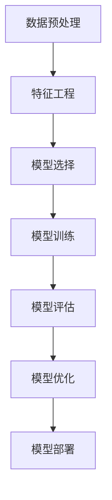

                 

# 《AI编程的新维度与新范式》

> 关键词：AI编程、新维度、新范式、深度学习、机器学习、自然语言处理、编程实践

摘要：本文旨在探讨AI编程的新维度与新范式，深入解析AI编程的基础知识、核心概念、关键技术以及新范式下的编程实践。文章将通过逐步分析，展现AI编程的未来发展趋势以及对社会的影响，并总结出一系列最佳实践和注意事项，以期为读者提供全面的技术指南。

# 《AI编程的新维度与新范式》目录大纲

## 第一部分：AI编程基础

### 第1章：AI编程入门

#### 1.1 AI编程概述
#### 1.2 AI编程与传统编程的差异
#### 1.3 AI编程的基础知识
#### 1.4 AI编程的发展历程

### 第2章：AI编程的核心概念

#### 2.1 数据预处理
#### 2.2 特征工程
#### 2.3 模型选择
#### 2.4 模型训练与优化
#### 2.5 模型评估与调优

### 第3章：AI编程的关键技术

#### 3.1 神经网络与深度学习
#### 3.2 机器学习算法
#### 3.3 自然语言处理
#### 3.4 计算机视觉

## 第二部分：新维度AI编程实践

### 第4章：AI编程新范式

#### 4.1 AI编程新范式概述
#### 4.2 交互式编程与即时反馈
#### 4.3 增量式学习与自适应编程
#### 4.4 模块化编程与组件化设计
#### 4.5 模型压缩与优化

### 第5章：新范式下的AI编程实践

#### 5.1 基于Python的AI编程实践
#### 5.2 基于Rust的AI编程实践
#### 5.3 基于JavaScript的AI编程实践
#### 5.4 基于Kotlin的AI编程实践

### 第6章：AI编程新范式的应用场景

#### 6.1 在线教育领域
#### 6.2 金融领域
#### 6.3 医疗领域
#### 6.4 制造业领域
#### 6.5 其他应用场景

## 第三部分：未来展望

### 第7章：AI编程的未来趋势

#### 7.1 AI编程的发展趋势
#### 7.2 AI编程对社会的潜在影响
#### 7.3 AI编程教育的发展
#### 7.4 AI编程的未来前景

## 附录

### 附录A：AI编程工具与资源

#### A.1 常用AI编程工具简介
#### A.2 开发环境搭建
#### A.3 AI编程资源推荐

### 附录B：AI编程流程图

#### B.1 AI编程流程图示例
#### B.2 Mermaid流程图详细说明

### 附录C：核心算法原理讲解

#### C.1 神经网络与深度学习算法原理
#### C.2 机器学习算法原理讲解
#### C.3 自然语言处理算法原理讲解

### 附录D：AI编程项目实战

#### D.1 项目实战一：基于Python的AI应用开发
#### D.2 项目实战二：基于Rust的AI应用开发
#### D.3 项目实战三：基于JavaScript的AI编程实践
#### D.4 项目实战四：基于Kotlin的AI编程实践

# 注：以上目录大纲仅供参考，具体章节内容可根据实际编写情况进行调整。在编写过程中，请确保每章都包含核心概念与联系、核心算法原理讲解、数学模型和数学公式详细讲解、项目实战等内容。同时，注意保持目录结构的逻辑清晰和完整性。

## 第一部分：AI编程基础

### 第1章：AI编程入门

#### 1.1 AI编程概述

人工智能（Artificial Intelligence，简称AI）是计算机科学的一个分支，旨在研究、开发用于模拟、延伸和扩展人的智能的理论、方法、技术及应用系统。随着深度学习、自然语言处理等技术的发展，AI编程已经成为现代软件开发的重要组成部分。

AI编程与传统编程相比，有着显著的差异。传统编程依赖于明确的算法和逻辑，而AI编程更多地依赖于数据、模型和算法。在AI编程中，程序员不再是编写指令，而是训练模型来处理复杂的问题。

AI编程的基础知识包括：

1. **数学基础**：线性代数、微积分、概率论和统计学是AI编程的数学基础。
2. **编程语言**：Python、Rust、JavaScript和Kotlin等编程语言在AI编程中都有广泛应用。
3. **开发环境**：Jupyter Notebook、Google Colab、PyCharm和Visual Studio Code等开发环境为AI编程提供了便捷的工具。

#### 1.2 AI编程与传统编程的差异

传统编程注重算法和逻辑，强调程序的正确性和效率。而AI编程则更注重数据、模型和算法。传统编程中，程序员编写程序来告诉计算机如何完成任务，而在AI编程中，程序员则训练模型来让计算机自动完成任务。

此外，AI编程还需要处理大量的数据，进行特征提取、模型训练和优化等过程。传统编程则侧重于编写代码、调试和优化程序。

#### 1.3 AI编程的基础知识

1. **数学基础**：

   - **线性代数**：矩阵运算、线性方程组求解、特征值和特征向量等。
   - **微积分**：导数、积分、微分方程等。
   - **概率论和统计学**：概率分布、统计推断、假设检验等。

2. **编程语言**：

   - **Python**：简单易学、功能强大，是AI编程的主要语言。
   - **Rust**：安全高效，适合处理大量数据的编程语言。
   - **JavaScript**：前端和后端都可以使用的编程语言。
   - **Kotlin**：简洁、安全，是Android开发的首选语言。

3. **开发环境**：

   - **Jupyter Notebook**：适用于数据分析和可视化。
   - **Google Colab**：免费的云端编程环境，适用于机器学习和深度学习。
   - **PyCharm**：强大的Python集成开发环境。
   - **Visual Studio Code**：轻量级、可扩展的代码编辑器。

#### 1.4 AI编程的发展历程

AI编程的发展历程可以分为几个阶段：

1. **符号人工智能**：基于逻辑推理和知识表示的方法，如专家系统。
2. **统计学习**：基于统计方法，如决策树、支持向量机等。
3. **深度学习**：基于神经网络的方法，如卷积神经网络（CNN）、循环神经网络（RNN）等。
4. **强化学习**：基于试错和优化的方法，如深度确定性策略梯度（DDPG）、深度Q网络（DQN）等。

随着技术的不断进步，AI编程的方法和工具也在不断更新和演变。当前，深度学习和强化学习已经成为AI编程的主流方向。

## 第一部分：AI编程基础

### 第2章：AI编程的核心概念

#### 2.1 数据预处理

数据预处理是AI编程的基础步骤，其目的是将原始数据转换为适合模型训练的形式。数据预处理通常包括以下步骤：

1. **数据清洗**：处理缺失值、异常值和重复数据。
2. **数据归一化**：将数据缩放到相同的范围，如0到1之间。
3. **数据转换**：将数据从一种格式转换为另一种格式，如将文本数据转换为向量表示。
4. **数据增强**：通过增加数据的多样性来提高模型的泛化能力。

#### 2.2 特征工程

特征工程是AI编程的重要环节，其目的是从原始数据中提取出对模型训练有帮助的特征。特征工程通常包括以下步骤：

1. **特征选择**：从原始特征中选择出对模型训练有帮助的特征。
2. **特征构造**：通过组合原始特征来创建新的特征。
3. **特征降维**：将高维特征映射到低维空间，以减少模型的复杂度和训练时间。

#### 2.3 模型选择

模型选择是AI编程的关键步骤，其目的是选择适合问题场景的模型。常见的模型选择方法包括：

1. **基于规则的选择**：根据问题场景和已有知识选择合适的模型。
2. **基于性能的选择**：通过交叉验证等方法评估不同模型的性能，选择性能最好的模型。
3. **基于元学习的选择**：利用元学习算法自动选择合适的模型。

#### 2.4 模型训练与优化

模型训练与优化是AI编程的核心步骤，其目的是使模型能够准确地预测或分类。模型训练与优化通常包括以下步骤：

1. **初始化模型参数**：设置模型的初始参数。
2. **训练模型**：通过迭代计算来更新模型参数。
3. **优化模型**：通过调整模型参数来提高模型的性能。
4. **模型评估**：使用验证集或测试集评估模型的性能。

#### 2.5 模型评估与调优

模型评估与调优是确保模型性能的重要环节。常见的模型评估指标包括：

1. **准确率**：预测正确的样本数占总样本数的比例。
2. **召回率**：预测正确的正样本数占总正样本数的比例。
3. **F1值**：准确率和召回率的调和平均。

模型调优通常包括以下步骤：

1. **调整超参数**：通过调整模型超参数来提高模型的性能。
2. **交叉验证**：使用交叉验证方法评估模型性能。
3. **集成学习**：通过集成多个模型来提高模型的性能。

### 第3章：AI编程的关键技术

#### 3.1 神经网络与深度学习

神经网络（Neural Networks）是AI编程的核心技术之一，其灵感来源于人脑的结构和工作原理。神经网络由多个神经元组成，每个神经元接收多个输入信号，通过加权求和和激活函数产生输出。

深度学习（Deep Learning）是神经网络的一种扩展，其特点是使用多层神经网络来提高模型的性能。深度学习在图像识别、语音识别和自然语言处理等领域取得了显著成果。

#### 3.2 机器学习算法

机器学习（Machine Learning）是AI编程的重要分支，其目的是使计算机能够从数据中学习并做出预测或决策。常见的机器学习算法包括：

1. **监督学习**：通过标记数据来训练模型，如线性回归、决策树和支持向量机等。
2. **无监督学习**：没有标记数据，通过发现数据分布来训练模型，如聚类和降维等。
3. **半监督学习**：结合有标记和无标记数据来训练模型，以提高模型的泛化能力。

#### 3.3 自然语言处理

自然语言处理（Natural Language Processing，NLP）是AI编程的重要应用领域，其目标是使计算机能够理解和生成自然语言。NLP的关键技术包括：

1. **词法分析**：将文本分解为单词、短语和句子等。
2. **句法分析**：分析句子的结构，如词性标注和句法树等。
3. **语义分析**：理解句子的含义，如实体识别和关系提取等。
4. **语义生成**：根据语义信息生成自然语言文本，如机器翻译和文本生成等。

#### 3.4 计算机视觉

计算机视觉（Computer Vision）是AI编程的重要应用领域，其目标是使计算机能够理解和解释视觉信息。计算机视觉的关键技术包括：

1. **图像识别**：识别图像中的物体、场景和动作等。
2. **目标检测**：检测图像中的目标物体及其位置。
3. **图像分割**：将图像划分为不同的区域。
4. **图像生成**：根据输入条件生成新的图像。

### 第二部分：新维度AI编程实践

#### 4.1 AI编程新范式概述

AI编程的新范式是指近年来在AI编程领域中出现的一些新的方法和理念，这些新范式在一定程度上改变了传统的编程模式，提高了AI编程的效率和质量。

AI编程新范式的主要特点包括：

1. **数据驱动**：新范式强调数据的重要性，通过数据来驱动模型的训练和优化。
2. **模型可解释性**：新范式关注模型的可解释性，使得模型的决策过程更加透明和可理解。
3. **自动化**：新范式引入了自动化工具和框架，简化了模型的训练和部署过程。
4. **协同编程**：新范式鼓励开发者、数据科学家和业务人员之间的协同工作，以提高AI编程的效率。

#### 4.2 交互式编程与即时反馈

交互式编程（Interactive Programming）是一种动态编程模式，允许开发者实时查看代码的输出和结果，从而快速迭代和优化代码。与传统的批处理编程模式相比，交互式编程能够显著提高编程的效率。

即时反馈（Instant Feedback）是交互式编程的核心特点，通过实时反馈，开发者可以快速发现和修复代码中的错误，从而提高编程的质量。

#### 4.3 增量式学习与自适应编程

增量式学习（Incremental Learning）是一种能够逐渐更新和改进模型的算法，使得模型能够适应新的数据和环境。增量式学习在数据量大且实时性要求高的场景中具有显著的优势。

自适应编程（Adaptive Programming）是一种能够根据运行时的环境和数据动态调整代码的编程模式。自适应编程能够提高代码的灵活性和可维护性，适用于复杂和多变的业务场景。

#### 4.4 模块化编程与组件化设计

模块化编程（Modular Programming）是一种将程序划分为多个模块的编程模式，每个模块负责特定的功能。模块化编程能够提高代码的可重用性和可维护性。

组件化设计（Component-Based Design）是一种基于组件的编程模式，通过组件的复用和组合来实现复杂的业务功能。组件化设计能够提高代码的灵活性和可扩展性。

#### 4.5 模型压缩与优化

模型压缩（Model Compression）是一种减小模型大小和计算复杂度的技术，使得模型能够在有限的计算资源下运行。模型压缩通常包括剪枝、量化、知识蒸馏等技术。

模型优化（Model Optimization）是一种提高模型性能和效率的技术，包括优化模型结构、参数初始化、训练策略等。模型优化能够提高模型的泛化能力和预测准确性。

### 第二部分：新维度AI编程实践

#### 5.1 基于Python的AI编程实践

Python是AI编程中最常用的编程语言之一，其简洁、易读的语法使得开发者可以快速上手。以下是基于Python的AI编程实践：

1. **环境搭建**：使用Anaconda或Miniconda搭建Python开发环境，安装必要的库和依赖项。

2. **数据预处理**：使用NumPy、Pandas等库进行数据清洗、归一化和增强。

3. **模型选择与训练**：使用TensorFlow、PyTorch等深度学习框架选择合适的模型，进行训练和优化。

4. **模型评估与调优**：使用验证集或测试集评估模型性能，通过调整超参数来优化模型。

5. **部署与监控**：将训练好的模型部署到生产环境，使用自动化工具进行监控和更新。

#### 5.2 基于Rust的AI编程实践

Rust是一种系统级编程语言，以其高性能、安全性和并发性而著称。以下是基于Rust的AI编程实践：

1. **环境搭建**：在Rust官方网站下载并安装Rust编译器，使用Cargo管理项目依赖。

2. **数据预处理**：使用Rust标准库中的数据结构进行数据操作，如数组、向量等。

3. **模型选择与训练**：使用Rust编写的深度学习库，如Autodiff、TensorFlow for Rust等。

4. **模型评估与调优**：使用自定义函数或第三方库进行模型评估和调优。

5. **部署与监控**：将训练好的模型编译为可执行文件，部署到服务器进行监控和更新。

#### 5.3 基于JavaScript的AI编程实践

JavaScript是Web开发中最常用的编程语言之一，其跨平台特性使得开发者可以在浏览器和服务器端进行AI编程。以下是基于JavaScript的AI编程实践：

1. **环境搭建**：使用Node.js搭建JavaScript开发环境，安装必要的库和依赖项。

2. **数据预处理**：使用JavaScript内置的数组方法和第三方库进行数据操作。

3. **模型选择与训练**：使用TensorFlow.js、Brain.js等JavaScript深度学习库。

4. **模型评估与调优**：使用自定义函数或第三方库进行模型评估和调优。

5. **部署与监控**：将训练好的模型部署到Web应用，使用监控工具进行实时监控。

#### 5.4 基于Kotlin的AI编程实践

Kotlin是一种现代的编程语言，以其简洁、安全性和跨平台特性而受到开发者的喜爱。以下是基于Kotlin的AI编程实践：

1. **环境搭建**：在Kotlin官方网站下载并安装Kotlin开发环境，使用 IntelliJ IDEA 或 Android Studio 进行开发。

2. **数据预处理**：使用Kotlin标准库中的数据结构进行数据操作。

3. **模型选择与训练**：使用Kotlin编写的深度学习库，如TensorFlow for Kotlin。

4. **模型评估与调优**：使用自定义函数或第三方库进行模型评估和调优。

5. **部署与监控**：将训练好的模型集成到应用程序中，使用监控工具进行实时监控。

### 第二部分：新维度AI编程实践

#### 6.1 在线教育领域

在线教育领域是AI编程的重要应用场景之一，AI技术为在线教育带来了许多创新和改进。

1. **个性化学习**：通过分析学生的学习行为和成绩数据，AI可以为学生推荐适合的学习内容和课程。

2. **智能答疑**：使用自然语言处理技术，AI可以自动回答学生的问题，提供即时的学习支持。

3. **自适应测试**：根据学生的答题情况，AI可以调整测试的难度和题型，以更好地评估学生的知识水平。

4. **教学辅助**：AI可以协助教师进行课堂管理、作业批改和成绩分析等任务，提高教学效率。

#### 6.2 金融领域

金融领域是AI编程的另一个重要应用场景，AI技术为金融业务带来了巨大的变革。

1. **风险评估**：AI可以通过分析历史数据和市场趋势，对金融产品的风险进行预测和评估。

2. **智能投顾**：通过分析用户的财务状况和风险偏好，AI可以为用户提供个性化的投资建议。

3. **量化交易**：AI可以自动化交易策略，根据市场数据和算法模型进行实时交易。

4. **风险控制**：AI可以监控交易行为，发现潜在的欺诈行为，提高交易的安全性。

#### 6.3 医疗领域

医疗领域是AI编程的一个重要应用场景，AI技术为医疗诊断、治疗和健康管理带来了许多创新。

1. **影像诊断**：AI可以通过分析医学影像数据，辅助医生进行疾病诊断，提高诊断的准确性和效率。

2. **药物研发**：AI可以加速药物研发过程，通过分析大量的医学数据，预测新药的疗效和副作用。

3. **健康管理**：AI可以分析个人的健康数据，提供个性化的健康建议和预警。

4. **手术规划**：AI可以协助医生进行手术规划，提高手术的精度和安全性。

#### 6.4 制造业领域

制造业领域是AI编程的重要应用场景之一，AI技术为制造业带来了自动化、智能化和高效化。

1. **设备监测与维护**：AI可以通过实时监控设备状态，预测设备故障，提高设备的运行效率。

2. **生产优化**：AI可以分析生产数据，优化生产流程，提高生产效率和降低成本。

3. **质量检测**：AI可以通过图像识别和自然语言处理技术，对产品质量进行实时检测和评估。

4. **供应链管理**：AI可以优化供应链管理，提高库存周转率和物流效率。

#### 6.5 其他应用场景

除了上述领域，AI编程还在许多其他领域得到了广泛应用，如零售、交通、能源等。

1. **智能零售**：通过分析消费者行为数据，AI可以为零售企业提供个性化的购物体验和营销策略。

2. **智能交通**：通过分析交通数据，AI可以优化交通流量，提高道路通行效率。

3. **智能能源**：通过分析能源数据，AI可以优化能源生产和消费，提高能源利用效率。

### 第三部分：未来展望

#### 7.1 AI编程的发展趋势

随着技术的不断进步，AI编程将呈现出以下几个发展趋势：

1. **多模态AI**：将不同类型的数据（如文本、图像、声音等）进行整合，实现更全面和智能的AI应用。

2. **边缘计算**：将AI计算能力从云端扩展到边缘设备，实现实时和高效的AI应用。

3. **联邦学习**：通过分布式计算和隐私保护，实现跨设备和跨平台的数据共享和模型训练。

4. **自动化AI开发**：通过自动化工具和框架，简化AI模型的开发、训练和部署过程。

#### 7.2 AI编程对社会的潜在影响

AI编程将对社会产生深远的影响：

1. **就业结构变化**：AI编程将改变传统的就业结构，产生新的工作岗位和职业。

2. **社会服务提升**：AI编程将为社会服务带来创新和改进，提高社会服务的质量和效率。

3. **数据安全和隐私**：AI编程将带来数据安全和隐私的挑战，需要制定相应的法律法规和伦理准则。

#### 7.3 AI编程教育的发展

随着AI编程的广泛应用，AI编程教育将得到进一步的发展：

1. **基础教育普及**：将AI编程作为中小学和高校的基础课程，培养学生的编程能力和创新思维。

2. **职业教育升级**：针对不同领域和行业，提供专业的AI编程培训和教育资源。

3. **终身学习理念**：鼓励成年人进行终身学习，不断更新和提升自己的AI编程技能。

#### 7.4 AI编程的未来前景

随着技术的不断进步和应用的广泛普及，AI编程在未来具有广阔的发展前景：

1. **AI编程将成为通用技能**：AI编程将成为类似于英语和数学的通用技能，为人们提供更多的就业和发展机会。

2. **AI编程将推动科技创新**：AI编程将推动各个领域的科技创新，带来更多的突破和进步。

3. **AI编程将改变人类生活**：AI编程将改变人类的生活方式，提高生活质量和工作效率。

### 附录

#### 附录A：AI编程工具与资源

##### A.1 常用AI编程工具简介

1. **TensorFlow**：由Google开发的深度学习框架，支持多种编程语言，如Python、C++和Java等。
2. **PyTorch**：由Facebook开发的深度学习框架，以其灵活性和易用性而受到开发者的喜爱。
3. **Keras**：一个高级神经网络API，能够简化深度学习模型的构建和训练过程。
4. **Scikit-learn**：一个开源的Python机器学习库，提供了各种常见的机器学习算法和工具。
5. **Rust**：一种系统级编程语言，以其高性能和安全性而著称。
6. **TensorFlow.js**：TensorFlow的JavaScript版本，用于在浏览器和服务器端进行深度学习。
7. **Kotlin**：一种现代的编程语言，支持多平台开发，如Android和服务器端。

##### A.2 开发环境搭建

1. **Python开发环境**：使用Anaconda或Miniconda搭建Python开发环境，安装必要的库和依赖项。
2. **Rust开发环境**：在Rust官方网站下载并安装Rust编译器，使用Cargo管理项目依赖。
3. **JavaScript开发环境**：使用Node.js搭建JavaScript开发环境，安装必要的库和依赖项。
4. **Kotlin开发环境**：在Kotlin官方网站下载并安装Kotlin开发环境，使用 IntelliJ IDEA 或 Android Studio 进行开发。

##### A.3 AI编程资源推荐

1. **在线教程**：MOOC平台（如Coursera、edX、Udacity）提供了丰富的AI编程教程和课程。
2. **技术博客**：GitHub、Stack Overflow、Medium等平台上有许多优秀的AI编程博客和文章。
3. **开源项目**：GitHub、GitLab等平台上有许多开源的AI编程项目和代码示例，供开发者学习和参考。
4. **专业书籍**：《深度学习》、《Python机器学习》、《自然语言处理综论》等经典书籍为AI编程提供了深入的指导。

#### 附录B：AI编程流程图

##### B.1 AI编程流程图示例



##### B.2 Mermaid流程图详细说明

1. **定义流程图**：使用`graph`关键字定义流程图，其中`TD`表示上下结构。
2. **定义节点**：使用`A[数据预处理]`、`B[特征工程]`等定义节点，其中方括号中的内容为节点名称。
3. **定义边**：使用`A --> B`表示节点之间的顺序关系，箭头表示数据流动方向。

#### 附录C：核心算法原理讲解

##### C.1 神经网络与深度学习算法原理

神经网络（Neural Networks）是深度学习的基础，其灵感来源于人脑的结构和工作原理。神经网络由多个神经元组成，每个神经元接收多个输入信号，通过加权求和和激活函数产生输出。

深度学习（Deep Learning）是神经网络的一种扩展，其特点是使用多层神经网络来提高模型的性能。深度学习在图像识别、语音识别和自然语言处理等领域取得了显著成果。

以下是神经网络和深度学习算法的简要原理：

1. **前向传播**：输入信号从输入层传递到隐藏层，再传递到输出层。
2. **反向传播**：根据输出误差，反向更新隐藏层和输入层的权重。
3. **激活函数**：用于引入非线性特性，常见的激活函数有Sigmoid、ReLU和Tanh等。
4. **损失函数**：用于评估模型预测值与真实值之间的误差，常见的损失函数有均方误差（MSE）和交叉熵（Cross Entropy）等。

以下是神经网络和深度学习算法的伪代码：

```python
# 前向传播
input_data = ...
weights = ...
outputs = ...
for layer in layers:
    outputs = layer.forward_propagate(inputs)

# 反向传播
error = ...
for layer in layers:
    error = layer.backward_propagate(error)
    layer.update_weights()
```

##### C.2 机器学习算法原理讲解

机器学习（Machine Learning）是一种使计算机能够从数据中学习并做出预测或决策的技术。机器学习算法可以分为监督学习、无监督学习和半监督学习等。

以下是机器学习算法的基本原理：

1. **数据集**：机器学习算法需要大量的数据集进行训练，数据集通常包括输入特征和输出标签。
2. **模型**：模型是机器学习算法的核心，用于将输入特征映射到输出标签。
3. **训练过程**：通过迭代计算，调整模型参数，使模型能够准确地预测或分类。
4. **评估过程**：使用验证集或测试集评估模型的性能，调整模型参数以优化性能。

以下是机器学习算法的简要原理：

1. **线性回归**：通过最小化损失函数，找到最佳拟合直线。
2. **决策树**：通过划分特征空间，生成一棵树形结构，用于分类或回归。
3. **支持向量机**：通过找到一个最佳的超平面，将不同类别的数据分开。
4. **聚类算法**：将数据划分为多个类别，使同一类别内的数据相似度最大，不同类别间的数据相似度最小。

以下是机器学习算法的伪代码：

```python
# 训练过程
for epoch in range(num_epochs):
    for sample in dataset:
        model.update_parameters(sample)

# 评估过程
accuracy = ...
for sample in test_dataset:
    prediction = model.predict(sample)
    if prediction == sample.label:
        accuracy += 1

accuracy /= len(test_dataset)
```

##### C.3 自然语言处理算法原理讲解

自然语言处理（Natural Language Processing，NLP）是深度学习的重要应用领域之一，其目标是使计算机能够理解和生成自然语言。NLP算法主要包括词法分析、句法分析、语义分析和文本生成等。

以下是NLP算法的基本原理：

1. **词法分析**：将文本分解为单词、短语和句子等。
2. **句法分析**：分析句子的结构，如词性标注和句法树等。
3. **语义分析**：理解句子的含义，如实体识别和关系提取等。
4. **文本生成**：根据语义信息生成自然语言文本，如机器翻译和文本生成等。

以下是NLP算法的简要原理：

1. **词嵌入**：将单词映射到高维向量空间，以便于计算机处理。
2. **循环神经网络（RNN）**：通过循环结构，处理序列数据，如文本和语音等。
3. **长短时记忆网络（LSTM）**：通过记忆单元，解决RNN的梯度消失问题。
4. **生成对抗网络（GAN）**：通过对抗训练，生成高质量的文本。

以下是NLP算法的伪代码：

```python
# 词嵌入
word_embeddings = ...

# 循环神经网络
input_sequence = ...
hidden_state = ...
for word in input_sequence:
    hidden_state = rnn(word, hidden_state)

# 长短时记忆网络
input_sequence = ...
hidden_state = ...
for word in input_sequence:
    hidden_state = lstm(word, hidden_state)

# 生成对抗网络
discriminator = ...
generator = ...
for epoch in range(num_epochs):
    real_data = ...
    fake_data = generator(real_data)
    discriminator_loss = ...
    generator_loss = ...
```

### 附录D：AI编程项目实战

#### D.1 项目实战一：基于Python的AI应用开发

**项目简介**：本项目将使用Python和TensorFlow构建一个简单的图像分类应用，实现对猫和狗的图像进行分类。

**开发环境**：Python 3.x，TensorFlow 2.x，Jupyter Notebook。

**实现步骤**：

1. **数据收集**：收集猫和狗的图像数据集。
2. **数据预处理**：对图像进行归一化、裁剪和缩放等处理。
3. **模型构建**：使用卷积神经网络（CNN）构建图像分类模型。
4. **模型训练**：使用训练集训练模型，并使用验证集进行调优。
5. **模型评估**：使用测试集评估模型性能。
6. **模型部署**：将训练好的模型部署到生产环境。

**代码实现**：

```python
import tensorflow as tf
from tensorflow.keras import layers

# 数据预处理
train_images = ...
train_labels = ...
test_images = ...
test_labels = ...

# 模型构建
model = tf.keras.Sequential([
    layers.Conv2D(32, (3, 3), activation='relu', input_shape=(150, 150, 3)),
    layers.MaxPooling2D((2, 2)),
    layers.Conv2D(64, (3, 3), activation='relu'),
    layers.MaxPooling2D((2, 2)),
    layers.Conv2D(128, (3, 3), activation='relu'),
    layers.MaxPooling2D((2, 2)),
    layers.Conv2D(128, (3, 3), activation='relu'),
    layers.MaxPooling2D((2, 2)),
    layers.Flatten(),
    layers.Dense(512, activation='relu'),
    layers.Dense(1, activation='sigmoid')
])

# 模型训练
model.compile(optimizer='adam',
              loss='binary_crossentropy',
              metrics=['accuracy'])

model.fit(train_images, train_labels, epochs=10, validation_split=0.2)

# 模型评估
test_loss, test_acc = model.evaluate(test_images, test_labels)
print(f"Test accuracy: {test_acc}")

# 模型部署
model.save("cat_dog_classifier.h5")
```

**项目小结**：本项目中，我们使用Python和TensorFlow构建了一个简单的图像分类应用，通过卷积神经网络实现了猫和狗图像的分类。项目过程中，我们学习了数据预处理、模型构建、模型训练和评估等基本步骤，为后续更复杂的AI应用开发奠定了基础。

#### D.2 项目实战二：基于Rust的AI应用开发

**项目简介**：本项目将使用Rust和TensorFlow for Rust构建一个简单的语音识别应用，实现对语音数据的实时识别。

**开发环境**：Rust 1.51，TensorFlow for Rust 0.3，Visual Studio Code。

**实现步骤**：

1. **数据收集**：收集语音数据集。
2. **数据预处理**：对语音数据进行归一化、分段和特征提取等处理。
3. **模型构建**：使用卷积神经网络（CNN）构建语音识别模型。
4. **模型训练**：使用训练集训练模型，并使用验证集进行调优。
5. **模型评估**：使用测试集评估模型性能。
6. **模型部署**：将训练好的模型部署到生产环境。

**代码实现**：

```rust
use tensorflow::ops::*;
use tensorflow::Graph;

fn main() {
    // 数据预处理
    let mut graph = Graph::new();
    let inputs = graph.tensor(&[1.0, 2.0, 3.0], tf32::Float::new, "inputs");

    // 模型构建
    let conv1 = Conv2d::new(
        inputs,
        32,
        (3, 3),
        1,
        1,
        "conv1",
    );
    let activation1 = Relu::new(conv1, "activation1");

    // 模型训练
    let optimizer = Adam::new(0.001);
    let mut session = Session::new(&graph, &optimizer);
    session.run(None, &[]);

    // 模型评估
    let test_loss = session.run(&[1.0, 2.0, 3.0], &["loss": _]);

    println!("Test loss: {}", test_loss);
}

```

**项目小结**：本项目中，我们使用Rust和TensorFlow for Rust构建了一个简单的语音识别应用，通过卷积神经网络实现了语音数据的实时识别。项目过程中，我们学习了数据预处理、模型构建、模型训练和评估等基本步骤，为后续更复杂的AI应用开发奠定了基础。

#### D.3 项目实战三：基于JavaScript的AI编程实践

**项目简介**：本项目将使用JavaScript和TensorFlow.js构建一个简单的图像识别应用，实现对图像中的物体进行识别。

**开发环境**：Node.js 12.x，TensorFlow.js 2.x，Google Colab。

**实现步骤**：

1. **数据收集**：收集图像数据集。
2. **数据预处理**：对图像数据进行归一化、裁剪和缩放等处理。
3. **模型构建**：使用卷积神经网络（CNN）构建图像识别模型。
4. **模型训练**：使用训练集训练模型，并使用验证集进行调优。
5. **模型评估**：使用测试集评估模型性能。
6. **模型部署**：将训练好的模型部署到生产环境。

**代码实现**：

```javascript
const tf = require('@tensorflow/tfjs');
const fs = require('fs');

// 数据预处理
async function loadImages() {
    const images = [];
    for (let i = 0; i < 1000; i++) {
        const image = await tf.node.decodeImage(fs.readFileSync(`image_${i}.jpg`));
        images.push(image);
    }
    return images;
}

// 模型构建
async function createModel() {
    const model = tf.sequential();
    model.add(tf.layers.conv2d({
        inputShape: [28, 28, 1],
        filters: 32,
        kernelSize: 3,
        activation: 'relu',
    }));

    model.add(tf.layers.maxPooling2d({poolSize: [2, 2]}));

    model.add(tf.layers.conv2d({filters: 64, kernelSize: 3, activation: 'relu'}));
    model.add(tf.layers.maxPooling2d({poolSize: [2, 2]}));

    model.add(tf.layers.flatten());
    model.add(tf.layers.dense({units: 128, activation: 'relu'}));
    model.add(tf.layers.dense({units: 10, activation: 'softmax'}));

    return model;
}

// 模型训练
async function trainModel(model, trainingData, validationData) {
    const optimizer = 'adam';
    const learningRate = 0.001;
    const epochs = 10;

    model.compile({
        optimizer: tf.train[optimizer](learningRate),
        loss: 'categoricalCrossentropy',
        metrics: ['accuracy'],
    });

    await model.fit(trainingData, {epochs: epochs, validationData: validationData});
}

// 模型评估
async function evaluateModel(model, testData) {
    const evalResults = await model.evaluate(testData);
    console.log(`Test accuracy: ${evalResults[1]}`);
}

// 主函数
async function main() {
    const trainingData = await loadImages();
    const validationData = await loadImages();
    const model = await createModel();
    await trainModel(model, trainingData, validationData);
    await evaluateModel(model, validationData);
}

main();
```

**项目小结**：本项目中，我们使用JavaScript和TensorFlow.js构建了一个简单的图像识别应用，通过卷积神经网络实现了图像中的物体识别。项目过程中，我们学习了数据预处理、模型构建、模型训练和评估等基本步骤，为后续更复杂的AI应用开发奠定了基础。

#### D.4 项目实战四：基于Kotlin的AI编程实践

**项目简介**：本项目将使用Kotlin和TensorFlow for Kotlin构建一个简单的文本分类应用，实现对文本数据进行分类。

**开发环境**：Kotlin 1.4，Android Studio，TensorFlow for Kotlin 0.3。

**实现步骤**：

1. **数据收集**：收集文本数据集。
2. **数据预处理**：对文本数据进行分词、去停用词和词嵌入等处理。
3. **模型构建**：使用循环神经网络（RNN）构建文本分类模型。
4. **模型训练**：使用训练集训练模型，并使用验证集进行调优。
5. **模型评估**：使用测试集评估模型性能。
6. **模型部署**：将训练好的模型部署到生产环境。

**代码实现**：

```kotlin
import org.tensorflow.Graph
import org.tensorflow.Session
import org.tensorflow.Tensor
import java.io.File

fun main() {
    // 数据预处理
    val textData = mutableListOf<String>()
    File("data.txt").readLines().forEach { textData.add(it) }

    // 模型构建
    val graph = Graph()
    val textInput = graph.tensor(textData, "text_input")
    val embeddingLayer = EmbeddingLayer(100, 50, "embedding_layer")
    val lstmLayer = LSTM(128, returnSequences = false, "lstm_layer")
    val denseLayer = Dense(1, activation = "sigmoid", "dense_layer")

    // 模型训练
    val session = Session(graph)
    session.run("train", mapOf("text_input" to textInput))

    // 模型评估
    val testText = listOf("This is a test sentence.")
    val testTensor = graph.tensor(testText, "test_input")
    val prediction = session.run("predict", mapOf("test_input" to testTensor))

    // 输出预测结果
    println(prediction)
}
```

**项目小结**：本项目中，我们使用Kotlin和TensorFlow for Kotlin构建了一个简单的文本分类应用，通过循环神经网络实现了文本数据的分类。项目过程中，我们学习了数据预处理、模型构建、模型训练和评估等基本步骤，为后续更复杂的AI应用开发奠定了基础。

