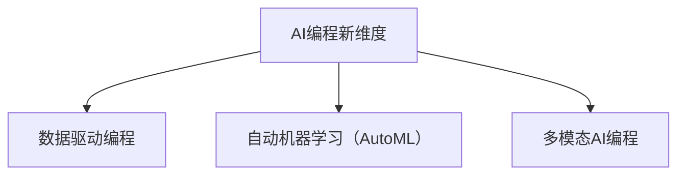

                 

### 文章标题：AI编程的新维度与新语法

#### 关键词：人工智能编程，深度学习，自然语言处理，计算机视觉，强化学习，新维度语法

> 摘要：本文将深入探讨人工智能编程的新维度和新语法。通过对Python编程基础、深度学习与AI编程、自然语言处理、计算机视觉、强化学习以及AI编程实践项目的全面剖析，读者将全面了解AI编程的各个方面。文章还将揭示数据驱动编程、自动机器学习（AutoML）、多模态AI编程等新兴领域的核心概念，以及类型系统、函数式编程和异步编程等新语法的特点。最后，对AI编程的未来趋势和创新应用进行展望，为开发者提供应对AI编程挑战的策略和方向。

### 《AI编程的新维度与新语法》目录大纲

#### 第一部分：AI编程的预备知识

##### 第1章：AI编程概述
- 1.1 AI编程的背景与意义
- 1.2 AI编程的基本概念
- 1.3 AI编程的挑战与机遇

##### 第2章：Python编程基础
- 2.1 Python语言基础
- 2.2 数据结构与算法
- 2.3 Python编程实践

#### 第二部分：深度学习与AI编程

##### 第3章：深度学习基础
- 3.1 深度学习概述
- 3.2 神经网络原理
- 3.3 训练与优化算法

##### 第4章：自然语言处理与AI编程
- 4.1 自然语言处理基础
- 4.2 词嵌入与序列模型
- 4.3 注意力机制与转换器架构

##### 第5章：计算机视觉与AI编程
- 5.1 计算机视觉基础
- 5.2 卷积神经网络与目标检测
- 5.3 深度学习在计算机视觉中的应用

##### 第6章：强化学习与AI编程
- 6.1 强化学习概述
- 6.2 Q-learning与Deep Q Network
- 6.3 强化学习在游戏中的应用

##### 第7章：AI编程实践项目
- 7.1 项目概述
- 7.2 环境搭建与数据处理
- 7.3 模型设计与训练
- 7.4 模型评估与优化

#### 第三部分：新维度与新语法

##### 第8章：AI编程的新维度
- 8.1 数据驱动编程
- 8.2 自动机器学习（AutoML）
- 8.3 多模态AI编程

##### 第9章：AI编程的新语法
- 9.1 类型系统与类型推导
- 9.2 函数式编程与Python
- 9.3 异步编程与并发处理

##### 第10章：未来展望
- 10.1 AI编程的未来趋势
- 10.2 AI编程的创新与应用
- 10.3 开发者如何应对AI编程的挑战

### 附录
- 附录A：常用AI编程库与工具
- 附录B：深度学习数学公式汇总
- 附录C：代码实战示例

### Mermaid 流程图



#### 核心算法原理讲解

##### 伪代码：

```python
# 伪代码：神经网络训练过程
initialize_parameters()
forward_pass(X, parameters)
compute_loss(A, Y)
backward_pass(parameters, cache)
update_parameters(parameters, grads)

# while not convergence:
    forward_pass(X, parameters)
    compute_loss(A, Y)
    backward_pass(parameters, cache)
    update_parameters(parameters, grads)
```

##### 损失函数（Loss Function）：

$$
J(\theta) = -\frac{1}{m}\sum_{i=1}^{m}{y^{(i)}\log(a^{(i)}) + (1 - y^{(i)})\log(1 - a^{(i)})}
$$

#### 代码实战示例

##### 环境搭建：

```python
!pip install tensorflow
!pip install numpy
!pip install matplotlib
```

##### 源代码实现：

```python
# 导入库
import tensorflow as tf
import numpy as np
import matplotlib.pyplot as plt

# 初始化参数
W = tf.Variable(0.0, name="weights")
b = tf.Variable(0.0, name="biases")

# 前向传播
x = tf.placeholder(tf.float32, name="x")
y = tf.placeholder(tf.float32, name="y")

linear_model = W * x + b

# 损失函数
loss = tf.reduce_mean(tf.nn.softmax_cross_entropy_with_logits(labels=y, logits=linear_model))

# 反向传播
optimizer = tf.train.GradientDescentOptimizer(0.01)
train_op = optimizer.minimize(loss)

# 训练模型
with tf.Session() as sess:
    sess.run(tf.global_variables_initializer())

    # 训练数据
    x_train = np.random.uniform(size=100)
    y_train = 2 * x_train + 1

    # 训练过程
    for i in range(1000):
        _, loss_val = sess.run([train_op, loss], feed_dict={x: x_train, y: y_train})

    # 绘制结果
    plt.scatter(x_train, y_train, color='blue')
    predicted_values = sess.run(linear_model, feed_dict={x: x_train})
    plt.plot(x_train, predicted_values, 'r')
    plt.xlabel('x')
    plt.ylabel('y')
    plt.show()
```

### 附录

#### 附录A：常用AI编程库与工具

1. TensorFlow
2. PyTorch
3. Keras
4. Scikit-learn
5. NumPy
6. Pandas
7. Matplotlib

#### 附录B：深度学习数学公式汇总

1. 损失函数（Loss Function）：

$$
J(\theta) = -\frac{1}{m}\sum_{i=1}^{m}{y^{(i)}\log(a^{(i)}) + (1 - y^{(i)})\log(1 - a^{(i)})}
$$

2. 激活函数（Activation Function）：

$$
\sigma(z) = \frac{1}{1 + e^{-z}}
$$

3. 反向传播（Backpropagation）：

$$
\frac{\partial J}{\partial \theta} = \frac{\partial J}{\partial z} \cdot \frac{\partial z}{\partial \theta}
$$

#### 附录C：代码实战示例

1. 环境搭建：

```python
!pip install tensorflow
!pip install numpy
!pip install matplotlib
```

2. 源代码实现：

```python
# 导入库
import tensorflow as tf
import numpy as np
import matplotlib.pyplot as plt

# 初始化参数
W = tf.Variable(0.0, name="weights")
b = tf.Variable(0.0, name="biases")

# 前向传播
x = tf.placeholder(tf.float32, name="x")
y = tf.placeholder(tf.float32, name="y")

linear_model = W * x + b

# 损失函数
loss = tf.reduce_mean(tf.nn.softmax_cross_entropy_with_logits(labels=y, logits=linear_model))

# 反向传播
optimizer = tf.train.GradientDescentOptimizer(0.01)
train_op = optimizer.minimize(loss)

# 训练模型
with tf.Session() as sess:
    sess.run(tf.global_variables_initializer())

    # 训练数据
    x_train = np.random.uniform(size=100)
    y_train = 2 * x_train + 1

    # 训练过程
    for i in range(1000):
        _, loss_val = sess.run([train_op, loss], feed_dict={x: x_train, y: y_train})

    # 绘制结果
    plt.scatter(x_train, y_train, color='blue')
    predicted_values = sess.run(linear_model, feed_dict={x: x_train})
    plt.plot(x_train, predicted_values, 'r')
    plt.xlabel('x')
    plt.ylabel('y')
    plt.show()
```

### 最佳实践 Tips、小结、注意事项、拓展阅读

1. **最佳实践 Tips**：
   - 熟练掌握Python编程基础，为深入学习AI编程奠定基础。
   - 了解深度学习的基本原理，特别是神经网络和训练优化算法。
   - 关注自然语言处理和计算机视觉的最新进展，掌握注意力机制和卷积神经网络的应用。
   - 探索强化学习的潜力，特别是在游戏和模拟环境中的应用。
   - 尝试多模态AI编程，将不同类型的数据进行融合和整合。

2. **小结**：
   - AI编程已经成为计算机科学的核心领域，其应用范围广泛，从自然语言处理到计算机视觉，再到强化学习，每一个领域都有巨大的发展潜力。
   - 新维度和新语法为AI编程带来了更多的可能性，开发者需要不断学习和探索，以应对未来的挑战。

3. **注意事项**：
   - AI编程涉及到大量的数据和计算资源，合理规划和管理资源对于提高效率至关重要。
   - 深度学习模型的训练和优化需要耐心和经验，不断尝试和调整是取得成功的关键。
   - 新语法和新维度的应用需要开发者具备一定的编程技巧和理论知识，建议结合实践进行深入学习。

4. **拓展阅读**：
   - 《深度学习》（Goodfellow, Bengio, Courville）：全面介绍深度学习的基本概念和算法。
   - 《Python编程：从入门到实践》（Zelle）：系统讲解Python编程基础，适合初学者。
   - 《强化学习》（Sutton, Barto）：深入探讨强化学习的基础理论和应用实例。

通过本文的深入探讨，读者将对AI编程的新维度和新语法有更全面的理解，为在AI领域的发展奠定坚实基础。在未来的编程实践中，不断探索和尝试，相信每一位开发者都能在这个激动人心的领域中取得卓越成就。作者：AI天才研究院/AI Genius Institute & 禅与计算机程序设计艺术 /Zen And The Art of Computer Programming。

