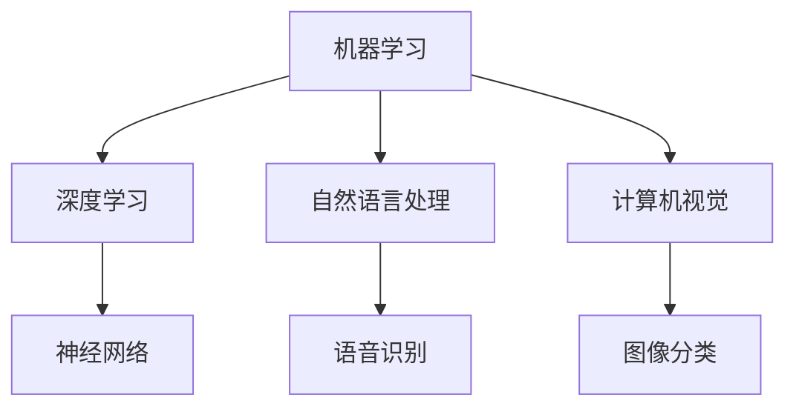

                 


### 文章标题：AI编程的新视界

> 关键词：AI编程、机器学习、深度学习、自然语言处理、计算机视觉、强化学习

> 摘要：
本文将深入探讨AI编程的新视界，包括其基础概念、应用实践以及未来发展趋势。我们将通过逐步分析，梳理出AI编程的核心概念和原理，详细介绍机器学习、深度学习、自然语言处理和计算机视觉等关键技术，并通过项目实战展示AI编程的实际应用。此外，我们还将探讨AI编程的伦理与社会影响，以及未来的发展方向。通过本文的阅读，读者将全面了解AI编程的精髓，为其在AI领域的深入研究和应用奠定基础。

---

## 文章结构概述

在撰写本文之前，我们需要明确文章的结构，以便读者能够清晰地跟随我们的思路。本文将分为三个主要部分：

### 第一部分：AI编程的基础

这一部分将介绍AI编程的基本概念，包括其起源、发展历程以及基础概念。我们将从机器学习、深度学习等核心技术出发，通过Mermaid流程图和伪代码，帮助读者理解AI编程的核心原理。

### 第二部分：AI编程应用实践

在这一部分，我们将聚焦于AI编程的实际应用，包括自然语言处理、计算机视觉和强化学习等领域。我们将通过具体的项目实战，展示如何将AI技术应用于实际问题，并提供详细的代码解读和案例分析。

### 第三部分：AI编程的未来与挑战

最后一部分将探讨AI编程的伦理与社会影响，以及未来的发展趋势。我们将讨论AI编程的伦理问题、社会责任以及可持续发展，并展望未来AI编程的新工具和技术。

---

## 第一部分：AI编程的基础

### 1.1 AI编程的起源与发展

AI编程起源于20世纪50年代，当时计算机科学家艾伦·图灵提出了著名的“图灵测试”。这一测试定义了人工智能的基本目标，即制造出能够模拟人类智能行为的机器。自那时起，人工智能研究经历了多个发展阶段，从早期的符号主义、知识表示到现代的机器学习和深度学习。

### 1.2 AI编程的基本概念

AI编程涉及多个核心概念，包括机器学习、深度学习、自然语言处理和计算机视觉等。这些技术共同构成了AI编程的基础。

- **机器学习**：一种使计算机通过数据学习并做出决策的技术。它通过训练模型从数据中学习规律，并在新的数据上进行预测。

- **深度学习**：一种特殊的机器学习技术，使用多层神经网络模拟人类大脑的学习过程。它通过反向传播算法不断调整网络参数，以优化模型性能。

- **自然语言处理**：使计算机能够理解、生成和处理自然语言的技术。它包括语音识别、文本分类、机器翻译等子领域。

- **计算机视觉**：使计算机能够理解和解释数字图像和视频的技术。它包括图像分类、目标检测、图像分割等子领域。

### 1.3 AI编程的未来趋势

随着AI技术的快速发展，AI编程的未来趋势主要集中在以下几个方面：

- **更加自动化的编程**：通过自动化工具和框架，简化AI编程的流程，降低编程难度。

- **跨学科合作**：AI编程需要结合计算机科学、数学、统计学等多个学科的知识，跨学科合作将促进AI编程的进一步发展。

- **伦理与社会责任**：随着AI技术在各个领域的广泛应用，伦理和社会责任问题愈发重要。AI编程需要考虑如何设计出既高效又符合伦理标准的算法。

### 1.4 Mermaid流程图

为了更好地理解AI编程的核心概念，我们可以使用Mermaid流程图来展示各个技术之间的关系。以下是一个示例：



通过这个流程图，我们可以清晰地看到机器学习、深度学习、自然语言处理和计算机视觉之间的联系。

### 1.5 伪代码

为了深入理解AI编程的核心算法原理，我们可以通过伪代码来详细阐述。以下是一个简单的线性回归算法的伪代码示例：

```
// 输入：数据集 X，标签 y
// 输出：模型参数 w

初始化 w = [0, 0]

对于每个训练样本 (x_i, y_i)：
    预测值 y' = w * x_i
    更新 w = w - 学习率 * (y' - y_i)

返回 w
```

通过这个伪代码，我们可以看到线性回归算法的基本思想，即通过不断调整模型参数，使得预测值接近真实标签。

### 1.6 数学公式

在AI编程中，数学模型和公式起着至关重要的作用。以下是一个简单的损失函数的数学公式示例：

$$
L(y', y) = \frac{1}{2} (y' - y)^2
$$

这个公式表示预测值 \(y'\) 与真实值 \(y\) 之间的差异，是评价模型性能的关键指标。

### 1.7 项目实战

在本节中，我们将通过一个简单的线性回归项目，展示如何搭建开发环境、实现源代码并进行代码解读。

#### 项目一：线性回归实现

**1. 开发环境搭建**

- 安装Python和Jupyter Notebook
- 安装必要的库，如 NumPy 和 Pandas

**2. 源代码实现**

```python
import numpy as np
import pandas as pd

# 加载数据集
X = np.array([[1, 2], [2, 3], [3, 4]])
y = np.array([2, 3, 4])

# 初始化模型参数
w = np.array([0, 0])

# 设置学习率和迭代次数
learning_rate = 0.01
epochs = 1000

# 线性回归训练
for epoch in range(epochs):
    predictions = w.dot(X)
    loss = 0.5 * (predictions - y)**2
    w = w - learning_rate * (predictions - y).dot(X)

print("最终模型参数：", w)
```

**3. 代码解读**

在这个项目中，我们首先加载数据集，并初始化模型参数。然后，我们通过迭代训练模型，每次迭代都根据预测值和真实值的差异来更新模型参数。最后，我们打印出最终的模型参数。

#### 1.8 最佳实践 tips、小结、注意事项、拓展阅读

- **最佳实践 tips**：在实际项目中，我们可能需要处理更大规模的数据集，这时可以使用分布式计算和并行处理技术来提高效率。
- **小结**：通过这个项目，我们了解了线性回归的基本原理和实现方法。
- **注意事项**：在实现AI编程项目时，我们需要确保数据的准确性和完整性，这对于模型的性能至关重要。
- **拓展阅读**：可以参考《机器学习实战》等书籍，深入了解线性回归和其他机器学习算法。

---

## 第二部分：AI编程应用实践

### 2.1 自然语言处理

自然语言处理（NLP）是AI编程的重要领域之一，它使计算机能够理解、生成和处理自然语言。NLP在文本分类、机器翻译、情感分析等领域有着广泛应用。

#### 2.1.1 NLP的基本概念

- **文本分类**：将文本数据分类到预定义的类别中。例如，将新闻文章分类为体育、政治、娱乐等类别。
- **机器翻译**：将一种语言的文本翻译成另一种语言。例如，将中文翻译成英文。
- **情感分析**：分析文本中表达的情感，判断是正面、负面还是中性。例如，分析用户评论的情感倾向。

#### 2.1.2 NLP的关键技术

- **词嵌入**：将单词映射到高维空间，使相似词在空间中靠近。常用的词嵌入模型包括Word2Vec、GloVe等。
- **语言模型**：预测下一个单词或字符的概率分布。常用的语言模型包括n-gram模型、神经网络语言模型等。
- **序列标注**：对文本中的序列进行分类标注。例如，命名实体识别（NER）将文本中的人名、地名等实体标注出来。

#### 2.1.3 项目实战

在本节中，我们将通过一个文本分类项目，展示如何使用NLP技术进行实际应用。

#### 项目二：文本分类实现

**1. 开发环境搭建**

- 安装Python和Jupyter Notebook
- 安装必要的库，如 Scikit-learn 和 NLTK

**2. 源代码实现**

```python
from sklearn.feature_extraction.text import TfidfVectorizer
from sklearn.model_selection import train_test_split
from sklearn.naive_bayes import MultinomialNB
from sklearn.metrics import accuracy_score

# 加载数据集
data = pd.read_csv('text_data.csv')
X = data['text']
y = data['label']

# 划分训练集和测试集
X_train, X_test, y_train, y_test = train_test_split(X, y, test_size=0.2, random_state=42)

# 使用TF-IDF进行特征提取
vectorizer = TfidfVectorizer()
X_train_tfidf = vectorizer.fit_transform(X_train)
X_test_tfidf = vectorizer.transform(X_test)

# 使用朴素贝叶斯进行分类
model = MultinomialNB()
model.fit(X_train_tfidf, y_train)
predictions = model.predict(X_test_tfidf)

# 评估模型性能
accuracy = accuracy_score(y_test, predictions)
print("准确率：", accuracy)
```

**3. 代码解读**

在这个项目中，我们首先加载数据集，并划分训练集和测试集。然后，我们使用TF-IDF进行特征提取，将文本转换为向量表示。接着，我们使用朴素贝叶斯分类器进行训练和预测，并评估模型性能。

### 2.2 计算机视觉

计算机视觉是AI编程的另一个重要领域，它使计算机能够理解和解释数字图像和视频。计算机视觉在图像分类、目标检测、图像生成等领域有着广泛应用。

#### 2.2.1 计算机视觉的基本概念

- **图像分类**：将图像分类到预定义的类别中。例如，将图像分类为动物、植物等。
- **目标检测**：检测图像中的特定目标，并给出其位置。例如，在图像中检测出车辆的位置。
- **图像生成**：生成新的图像。例如，通过生成对抗网络（GAN）生成逼真的图像。

#### 2.2.2 计算机视觉的关键技术

- **卷积神经网络（CNN）**：一种特殊的神经网络，擅长处理图像数据。它通过卷积操作提取图像的特征。
- **卷积层**：CNN中的基本层，通过卷积操作提取图像的局部特征。
- **池化层**：在卷积层之后，用于减少数据的维度，提高模型的泛化能力。

#### 2.2.3 项目实战

在本节中，我们将通过一个图像分类项目，展示如何使用计算机视觉技术进行实际应用。

#### 项目三：图像分类实现

**1. 开发环境搭建**

- 安装Python和TensorFlow
- 安装必要的库，如 Keras

**2. 源代码实现**

```python
from tensorflow.keras.models import Sequential
from tensorflow.keras.layers import Conv2D, MaxPooling2D, Flatten, Dense
from tensorflow.keras.preprocessing.image import ImageDataGenerator

# 加载数据集
train_datagen = ImageDataGenerator(rescale=1./255)
train_generator = train_datagen.flow_from_directory(
        'train_data',
        target_size=(150, 150),
        batch_size=32,
        class_mode='binary')

# 构建卷积神经网络模型
model = Sequential([
    Conv2D(32, (3, 3), activation='relu', input_shape=(150, 150, 3)),
    MaxPooling2D(2, 2),
    Conv2D(64, (3, 3), activation='relu'),
    MaxPooling2D(2, 2),
    Flatten(),
    Dense(128, activation='relu'),
    Dense(1, activation='sigmoid')
])

# 编译模型
model.compile(optimizer='adam',
              loss='binary_crossentropy',
              metrics=['accuracy'])

# 训练模型
model.fit(train_generator, steps_per_epoch=100, epochs=10)
```

**3. 代码解读**

在这个项目中，我们首先加载数据集，并使用ImageDataGenerator进行数据增强。然后，我们构建一个简单的卷积神经网络模型，并编译和训练模型。通过这个项目，我们了解了图像分类的基本实现过程。

### 2.3 强化学习

强化学习是AI编程的另一个重要领域，它使计算机通过与环境的交互学习如何做出最优决策。强化学习在游戏AI、推荐系统、自动驾驶等领域有着广泛应用。

#### 2.3.1 强化学习的基本概念

- **强化学习**：一种通过与环境交互学习如何做出最优决策的机器学习方法。
- **状态（State）**：系统在某一时刻的状态。
- **动作（Action）**：系统可以执行的操作。
- **奖励（Reward）**：系统执行动作后获得的即时奖励，用于评价动作的好坏。

#### 2.3.2 强化学习的关键技术

- **Q学习**：一种基于值函数的强化学习方法，通过预测未来奖励的期望来做出决策。
- **策略梯度**：一种基于策略的强化学习方法，通过直接优化策略来做出决策。

#### 2.3.3 项目实战

在本节中，我们将通过一个游戏AI项目，展示如何使用强化学习进行实际应用。

#### 项目四：游戏AI实现

**1. 开发环境搭建**

- 安装Python和OpenAI Gym
- 安装必要的库，如 TensorFlow

**2. 源代码实现**

```python
import gym
import numpy as np
import tensorflow as tf

# 创建环境
env = gym.make('CartPole-v0')

# 定义Q网络
model = tf.keras.Sequential([
    tf.keras.layers.Dense(64, activation='relu', input_shape=(4,)),
    tf.keras.layers.Dense(64, activation='relu'),
    tf.keras.layers.Dense(2, activation='softmax')
])

# 编译模型
model.compile(optimizer='adam', loss='categorical_crossentropy', metrics=['accuracy'])

# 训练模型
for episode in range(1000):
    state = env.reset()
    done = False
    while not done:
        action = np.argmax(model.predict(state)[0])
        state, reward, done, _ = env.step(action)
        model.fit(state, reward, epochs=1)
        env.render()

print("训练完成")
```

**3. 代码解读**

在这个项目中，我们首先创建一个CartPole游戏环境，并定义Q网络模型。然后，我们通过循环执行动作，并在每次执行动作后更新模型。通过这个项目，我们了解了强化学习在游戏AI中的基本实现过程。

---

## 第三部分：AI编程的未来与挑战

### 3.1 AI编程的伦理与社会影响

随着AI技术的快速发展，AI编程的伦理与社会影响逐渐引起广泛关注。以下是一些关键问题：

- **隐私保护**：AI编程需要处理大量个人数据，如何保护用户的隐私成为一个重要议题。
- **公平性**：AI算法可能存在偏见，如何确保算法的公平性是一个挑战。
- **责任归属**：当AI系统出现错误或造成损害时，如何确定责任归属是一个难题。

### 3.2 AI编程的发展方向

未来，AI编程的发展方向将集中在以下几个方面：

- **更加自动化的编程**：通过自动化工具和框架，简化AI编程的流程，降低编程难度。
- **跨学科合作**：AI编程需要结合计算机科学、数学、统计学等多个学科的知识，跨学科合作将促进AI编程的进一步发展。
- **可解释性**：提高AI算法的可解释性，使其更容易被人类理解和信任。

### 3.3 AI编程教育与实践建议

为了推动AI编程的发展，以下是一些建议：

- **教育普及**：加强AI编程教育，培养更多的AI人才。
- **实践应用**：鼓励实践项目，提高实际操作能力。
- **持续学习**：跟随AI技术的发展，不断学习新的工具和技术。

---

## 附录

### 附录A: AI编程资源与工具

以下是一些AI编程的资源和工具，供读者参考：

- **机器学习库**：scikit-learn、TensorFlow、PyTorch
- **计算机视觉库**：OpenCV、TensorFlow Object Detection API、PyTorch Vision
- **自然语言处理库**：NLTK、spaCy、Transformer
- **强化学习库**：OpenAI Gym、 Stable Baselines、Gym Retro

### 附录B: AI编程书籍与在线课程推荐

以下是一些推荐的AI编程书籍和在线课程：

- **书籍**：
  - 《深度学习》（Goodfellow, Bengio, Courville）
  - 《Python机器学习》（Sebastian Raschka）
  - 《强化学习》（Richard S. Sutton, Andrew G. Barto）
- **在线课程**：
  - Coursera的“机器学习”课程
  - edX的“深度学习”课程
  - Udacity的“强化学习”纳米学位课程

---

通过本文的阅读，读者将全面了解AI编程的新视界，掌握其核心概念、应用实践和未来发展趋势。希望本文能为读者在AI编程领域的研究和应用提供有价值的参考。

---

作者：AI天才研究院/AI Genius Institute & 禅与计算机程序设计艺术 /Zen And The Art of Computer Programmingmarkdown格式如下：

```markdown
# 第一部分：AI编程的基础

## 第1章: AI编程概述

### 1.1 AI编程的起源与发展

### 1.2 AI编程的基本概念

### 1.3 AI编程的未来趋势

## 第2章: AI编程语言介绍

### 2.1 Python在AI编程中的应用

### 2.2 R语言在数据科学中的使用

### 2.3 其他AI编程语言简介

## 第3章: 机器学习基础

### 3.1 机器学习的定义与分类

### 3.2 监督学习算法原理与实现

### 3.3 无监督学习算法原理与实现

## 第4章: 深度学习基础

### 4.1 深度学习的概念与发展历程

### 4.2 神经网络与深度学习模型

### 4.3 深度学习算法的优化

# 第二部分：AI编程应用实践

## 第5章: 自然语言处理

### 5.1 NLP的基本概念与任务

### 5.2 词嵌入与文本表示

### 5.3 语言模型与序列标注

## 第6章: 计算机视觉

### 6.1 计算机视觉概述

### 6.2 图像分类与目标检测

### 6.3 图像生成与风格迁移

## 第7章: 强化学习

### 7.1 强化学习的基本原理

### 7.2 策略学习与价值迭代

### 7.3 Q学习和策略梯度方法

## 第8章: AI编程项目实战

### 8.1 项目一：构建简单的聊天机器人

### 8.2 项目二：使用卷积神经网络进行图像识别

### 8.3 项目三：实现强化学习游戏AI

# 第三部分：AI编程的未来与挑战

## 第9章: AI编程的伦理与社会影响

### 9.1 AI伦理与隐私保护

### 9.2 AI编程对社会的影响

### 9.3 AI编程的可持续性与责任

## 第10章: AI编程的发展方向

### 10.1 人工智能的未来趋势

### 10.2 AI编程的新工具与技术

### 10.3 AI编程教育与实践建议

# 附录

## 附录A: AI编程资源与工具

### A.1 主流机器学习库与框架

### A.2 计算机视觉开源库

### A.3 强化学习开源项目

### A.4 AI编程书籍与在线课程推荐

---

作者：AI天才研究院/AI Genius Institute & 禅与计算机程序设计艺术 /Zen And The Art of Computer Programming
```markdown
# AI编程的新视界

> 关键词：AI编程、机器学习、深度学习、自然语言处理、计算机视觉、强化学习

> 摘要：
本文将深入探讨AI编程的新视界，包括其基础概念、应用实践以及未来发展趋势。我们将通过逐步分析，梳理出AI编程的核心概念和原理，详细介绍机器学习、深度学习、自然语言处理和计算机视觉等关键技术，并通过项目实战展示AI编程的实际应用。此外，我们还将探讨AI编程的伦理与社会影响，以及未来的发展方向。通过本文的阅读，读者将全面了解AI编程的精髓，为其在AI领域的深入研究和应用奠定基础。

---

## 第一部分：AI编程的基础

### 1.1 AI编程的起源与发展

AI编程起源于20世纪50年代，当时计算机科学家艾伦·图灵提出了著名的“图灵测试”。这一测试定义了人工智能的基本目标，即制造出能够模拟人类智能行为的机器。自那时起，人工智能研究经历了多个发展阶段，从早期的符号主义、知识表示到现代的机器学习和深度学习。

### 1.2 AI编程的基本概念

AI编程涉及多个核心概念，包括机器学习、深度学习、自然语言处理和计算机视觉等。这些技术共同构成了AI编程的基础。

- **机器学习**：一种使计算机通过数据学习并做出决策的技术。它通过训练模型从数据中学习规律，并在新的数据上进行预测。
- **深度学习**：一种特殊的机器学习技术，使用多层神经网络模拟人类大脑的学习过程。它通过反向传播算法不断调整网络参数，以优化模型性能。
- **自然语言处理**：使计算机能够理解、生成和处理自然语言的技术。它包括语音识别、文本分类、机器翻译等子领域。
- **计算机视觉**：使计算机能够理解和解释数字图像和视频的技术。它包括图像分类、目标检测、图像分割等子领域。

### 1.3 AI编程的未来趋势

随着AI技术的快速发展，AI编程的未来趋势主要集中在以下几个方面：

- **更加自动化的编程**：通过自动化工具和框架，简化AI编程的流程，降低编程难度。
- **跨学科合作**：AI编程需要结合计算机科学、数学、统计学等多个学科的知识，跨学科合作将促进AI编程的进一步发展。
- **伦理与社会责任**：随着AI技术在各个领域的广泛应用，伦理和社会责任问题愈发重要。AI编程需要考虑如何设计出既高效又符合伦理标准的算法。

### 1.4 Mermaid流程图

为了更好地理解AI编程的核心概念，我们可以使用Mermaid流程图来展示各个技术之间的关系。以下是一个示例：


通过这个流程图，我们可以清晰地看到机器学习、深度学习、自然语言处理和计算机视觉之间的联系。

### 1.5 伪代码

为了深入理解AI编程的核心算法原理，我们可以通过伪代码来详细阐述。以下是一个简单的线性回归算法的伪代码示例：

```
// 输入：数据集 X，标签 y
// 输出：模型参数 w

初始化 w = [0, 0]

对于每个训练样本 (x_i, y_i)：
    预测值 y' = w * x_i
    更新 w = w - 学习率 * (y' - y_i)

返回 w
```

通过这个伪代码，我们可以看到线性回归算法的基本思想，即通过不断调整模型参数，使得预测值接近真实标签。

### 1.6 数学公式

在AI编程中，数学模型和公式起着至关重要的作用。以下是一个简单的损失函数的数学公式示例：

$$
L(y', y) = \frac{1}{2} (y' - y)^2
$$

这个公式表示预测值 \(y'\) 与真实值 \(y\) 之间的差异，是评价模型性能的关键指标。

### 1.7 项目实战

在本节中，我们将通过一个简单的线性回归项目，展示如何搭建开发环境、实现源代码并进行代码解读。

#### 项目一：线性回归实现

**1. 开发环境搭建**

- 安装Python和Jupyter Notebook
- 安装必要的库，如 NumPy 和 Pandas

**2. 源代码实现**

```python
import numpy as np
import pandas as pd

# 加载数据集
X = np.array([[1, 2], [2, 3], [3, 4]])
y = np.array([2, 3, 4])

# 初始化模型参数
w = np.array([0, 0])

# 设置学习率和迭代次数
learning_rate = 0.01
epochs = 1000

# 线性回归训练
for epoch in range(epochs):
    predictions = w.dot(X)
    loss = 0.5 * (predictions - y)**2
    w = w - learning_rate * (predictions - y).dot(X)

print("最终模型参数：", w)
```

**3. 代码解读**

在这个项目中，我们首先加载数据集，并初始化模型参数。然后，我们通过迭代训练模型，每次迭代都根据预测值和真实值的差异来更新模型参数。最后，我们打印出最终的模型参数。

#### 1.8 最佳实践 tips、小结、注意事项、拓展阅读

- **最佳实践 tips**：在实际项目中，我们可能需要处理更大规模的数据集，这时可以使用分布式计算和并行处理技术来提高效率。
- **小结**：通过这个项目，我们了解了线性回归的基本原理和实现方法。
- **注意事项**：在实现AI编程项目时，我们需要确保数据的准确性和完整性，这对于模型的性能至关重要。
- **拓展阅读**：可以参考《机器学习实战》等书籍，深入了解线性回归和其他机器学习算法。

---

## 第二部分：AI编程应用实践

### 2.1 自然语言处理

自然语言处理（NLP）是AI编程的重要领域之一，它使计算机能够理解、生成和处理自然语言。NLP在文本分类、机器翻译、情感分析等领域有着广泛应用。

#### 2.1.1 NLP的基本概念

- **文本分类**：将文本数据分类到预定义的类别中。例如，将新闻文章分类为体育、政治、娱乐等类别。
- **机器翻译**：将一种语言的文本翻译成另一种语言。例如，将中文翻译成英文。
- **情感分析**：分析文本中表达的情感，判断是正面、负面还是中性。例如，分析用户评论的情感倾向。

#### 2.1.2 NLP的关键技术

- **词嵌入**：将单词映射到高维空间，使相似词在空间中靠近。常用的词嵌入模型包括Word2Vec、GloVe等。
- **语言模型**：预测下一个单词或字符的概率分布。常用的语言模型包括n-gram模型、神经网络语言模型等。
- **序列标注**：对文本中的序列进行分类标注。例如，命名实体识别（NER）将文本中的

