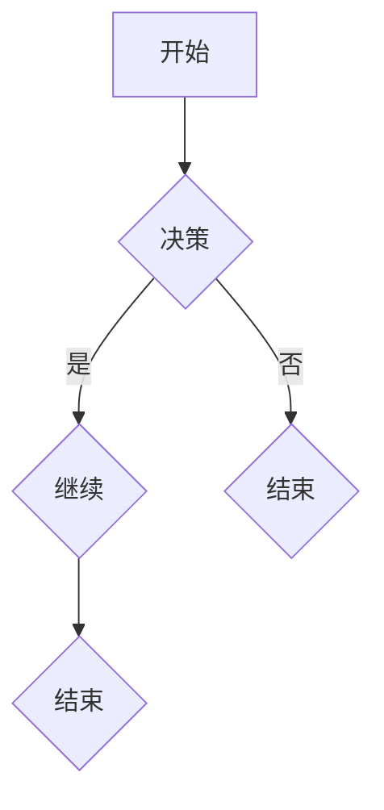
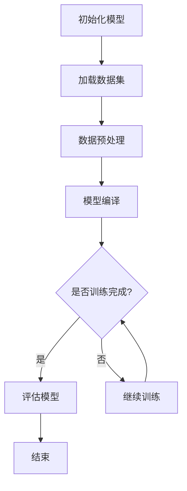
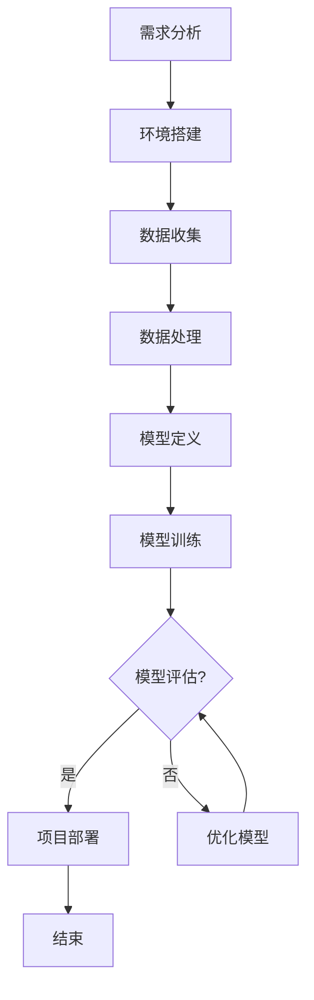

                 

# 《AI编程的新视角与新思维》

> 关键词：人工智能编程，深度学习，强化学习，自然语言处理，设计模式，项目实战

> 摘要：本文将从AI编程的背景与基础、新视角、新思维三个方面，系统地介绍人工智能编程的核心概念、技术框架、算法原理及编程实践。通过深入剖析深度学习、强化学习、自然语言处理等领域的核心技术和应用，结合实际项目实战，探讨AI编程的未来发展趋势和挑战，旨在为读者提供全面、系统的AI编程知识体系和新思维视角。

## 第一部分：AI编程的背景与基础

### 第1章：AI编程概览

#### 1.1 AI编程的起源与发展

人工智能（Artificial Intelligence，简称AI）作为计算机科学的一个分支，自20世纪50年代诞生以来，经历了数十年的发展与变革。AI编程作为AI领域的重要组成部分，也逐渐成为了现代计算机编程的重要方向。

AI编程的起源可以追溯到20世纪50年代，当时的计算机科学家们开始探索如何让计算机具有人类的智能，从而实现自动化和智能化。随着计算机硬件性能的提升和算法研究的深入，AI编程逐渐从理论研究走向实际应用。

在AI编程的发展历程中，以下几个重要事件具有重要意义：

1. **1956年**：达特茅斯会议的召开，标志着人工智能领域的正式诞生。会议期间，约翰·麦卡锡、马文·明斯基、纳森·罗切斯特和克劳德·香农等人工智能先驱共同探讨了人工智能的发展方向。

2. **1958年**：弗兰克·罗森布拉特提出感知机（Perceptron）算法，这是最早的神经网络模型之一，为后续深度学习的发展奠定了基础。

3. **1980年代**：专家系统的兴起，使AI编程在工业、医疗等领域得到广泛应用。

4. **1990年代**：机器学习理论的蓬勃发展，尤其是支持向量机（SVM）、决策树等算法的提出，为AI编程提供了更加丰富的工具。

5. **2006年**：深度学习的复兴，以神经网络为代表的算法在图像识别、语音识别等领域取得了突破性进展。

6. **2010年代**：随着大数据和云计算技术的发展，AI编程的应用场景不断扩大，从传统的工业、医疗领域延伸至金融、交通、教育等多个领域。

#### 1.2 AI编程的核心概念

AI编程涉及多个核心概念，以下是一些重要的概念及其定义：

1. **人工智能（AI）**：模拟人类智能行为的计算机系统，能够感知环境、理解语言、自主决策和执行任务。

2. **机器学习（ML）**：一种人工智能的分支，通过数据驱动的方法，使计算机具有自主学习和改进能力。

3. **深度学习（DL）**：一种特殊的机器学习技术，通过构建多层次的神经网络模型，对大量数据进行自动特征提取和建模。

4. **神经网络（NN）**：一种模拟人脑神经元结构的计算模型，能够实现复杂的数据处理和模式识别。

5. **数据集（Dataset）**：用于训练和评估机器学习模型的原始数据集合。

6. **特征工程（Feature Engineering）**：通过对原始数据进行预处理和特征提取，提高模型的学习效果。

7. **模型评估（Model Evaluation）**：通过多种评价指标，对训练好的模型进行性能评估和优化。

#### 1.3 AI编程的技术框架

AI编程的技术框架包括以下几个方面：

1. **硬件层面**：GPU（图形处理器）和TPU（张量处理器）等专用硬件，为深度学习等复杂算法提供了高效的计算能力。

2. **软件层面**：操作系统、编译器和编程语言等软件工具，为AI编程提供了开发环境。

3. **框架层面**：TensorFlow、PyTorch、Keras等主流深度学习框架，提供了丰富的API和工具，简化了AI编程的复杂性。

4. **算法层面**：包括机器学习、深度学习、强化学习等算法，为AI编程提供了多种解决方案。

5. **数据层面**：大数据平台、数据存储和数据处理工具，为AI编程提供了海量数据支持。

### 第2章：AI编程基础知识

#### 2.1 数据结构与算法基础

数据结构与算法是AI编程的基础，以下是一些重要的概念和算法：

1. **数据结构**：包括数组、链表、栈、队列、树、图等，用于高效地存储和组织数据。

2. **排序算法**：冒泡排序、选择排序、插入排序、快速排序等，用于对数据进行排序。

3. **搜索算法**：二分搜索、广度优先搜索、深度优先搜索等，用于在数据结构中查找元素。

4. **贪心算法**：基于局部最优解的策略，用于解决最优化问题。

5. **动态规划**：利用历史信息，优化子问题的解，从而求解复杂问题。

6. **分治算法**：将复杂问题分解为子问题，递归求解并合并子问题的解。

7. **图算法**：包括最小生成树、最短路径、图遍历等，用于处理图结构的数据。

#### 2.2 数学模型与公式

AI编程中的数学模型与公式至关重要，以下是一些重要的数学概念和公式：

1. **线性代数**：矩阵运算、向量运算、线性方程组求解等。

2. **概率论与统计学**：概率分布、期望、方差、协方差等。

3. **优化理论**：目标函数、梯度下降、牛顿法等。

4. **逻辑与推理**：命题逻辑、谓词逻辑、推理机等。

5. **深度学习中的数学模型**：包括神经网络中的激活函数、损失函数、优化算法等。

#### 2.3 编程语言与工具

AI编程常用的编程语言包括Python、C++、Java等。其中，Python因其简洁易用、丰富的库支持，成为了AI编程的主流语言。

常用的AI编程工具包括：

1. **集成开发环境（IDE）**：如PyCharm、Visual Studio Code等。

2. **版本控制工具**：如Git，用于代码的版本管理和协同开发。

3. **深度学习框架**：如TensorFlow、PyTorch、Keras等。

4. **数据处理工具**：如NumPy、Pandas、Scikit-learn等。

5. **可视化工具**：如Matplotlib、Seaborn等，用于数据可视化。

## 第二部分：AI编程的新视角

### 第3章：深度学习与AI编程

#### 3.1 深度学习的原理与架构

深度学习是人工智能的一个重要分支，其核心思想是通过多层神经网络对数据进行自动特征提取和建模。深度学习的原理与架构如下：

1. **神经网络（NN）**：神经网络是一种模拟人脑神经元结构的计算模型，包括输入层、隐藏层和输出层。每个神经元都与前一层的神经元相连，并通过权重和偏置进行计算。

2. **反向传播算法（Backpropagation）**：反向传播算法是一种用于训练神经网络的优化算法，通过计算梯度，更新网络权重和偏置，使网络输出接近期望输出。

3. **激活函数（Activation Function）**：激活函数用于引入非线性特性，使神经网络具有分类或回归能力。常见的激活函数包括sigmoid、ReLU、Tanh等。

4. **损失函数（Loss Function）**：损失函数用于衡量网络输出与真实值之间的差距，常见的损失函数包括均方误差（MSE）、交叉熵（Cross-Entropy）等。

5. **优化算法（Optimization Algorithm）**：优化算法用于更新网络权重和偏置，以最小化损失函数。常见的优化算法包括随机梯度下降（SGD）、Adam等。

#### 3.2 深度学习算法详解

深度学习算法包括卷积神经网络（CNN）、循环神经网络（RNN）、长短时记忆网络（LSTM）、生成对抗网络（GAN）等。以下对这些算法进行简要介绍：

1. **卷积神经网络（CNN）**：CNN是一种用于图像识别和处理的深度学习算法，通过卷积层、池化层和全连接层等结构，实现对图像的自动特征提取和分类。

2. **循环神经网络（RNN）**：RNN是一种用于序列数据处理的深度学习算法，通过循环结构，对历史信息进行记忆和传递。

3. **长短时记忆网络（LSTM）**：LSTM是一种特殊的RNN结构，通过门控机制，有效解决了RNN的梯度消失和梯度爆炸问题，适用于处理长序列数据。

4. **生成对抗网络（GAN）**：GAN是一种用于生成模型训练的深度学习算法，由生成器和判别器两个神经网络组成，通过对抗训练，生成逼真的数据。

#### 3.3 深度学习编程实践

深度学习编程实践主要包括以下步骤：

1. **数据预处理**：对图像、文本、音频等数据进行归一化、标准化、填充等处理，以适应深度学习算法的要求。

2. **模型定义**：使用深度学习框架（如TensorFlow、PyTorch）定义神经网络模型，包括输入层、隐藏层和输出层等。

3. **模型训练**：通过反向传播算法，更新网络权重和偏置，优化模型性能。

4. **模型评估**：使用测试集对训练好的模型进行评估，计算准确率、召回率、F1分数等指标。

5. **模型部署**：将训练好的模型部署到生产环境中，实现实时预测和应用。

### 第4章：强化学习与AI编程

#### 4.1 强化学习的原理与架构

强化学习（Reinforcement Learning，简称RL）是一种通过与环境交互，学习最优策略的机器学习技术。强化学习的原理与架构如下：

1. **状态（State）**：描述系统的当前状态。

2. **动作（Action）**：系统可以采取的行为。

3. **奖励（Reward）**：系统在某个状态下采取某个动作后获得的奖励。

4. **策略（Policy）**：从当前状态选择动作的规则。

5. **价值函数（Value Function）**：衡量状态或状态-动作对的优劣。

6. **策略迭代（Policy Iteration）**：通过不断更新策略，使系统逐渐收敛到最优策略。

7. **值迭代（Value Iteration）**：通过不断更新价值函数，使系统逐渐收敛到最优策略。

8. **Q-学习（Q-Learning）**：一种基于价值迭代的强化学习算法，通过更新Q值（状态-动作值函数），学习最优策略。

9. **深度Q网络（DQN）**：一种基于深度学习的Q学习算法，通过构建深度神经网络，实现高效的价值函数估计。

10. **策略梯度算法（Policy Gradient）**：一种基于策略优化的强化学习算法，通过优化策略参数，使系统逐渐收敛到最优策略。

#### 4.2 强化学习算法详解

强化学习算法包括Q-学习、深度Q网络（DQN）、策略梯度算法等。以下对这些算法进行简要介绍：

1. **Q-学习**：Q-学习是一种基于价值迭代的强化学习算法，通过更新Q值（状态-动作值函数），学习最优策略。Q-学习算法的核心思想是利用历史经验，更新当前状态-动作值函数。

2. **深度Q网络（DQN）**：DQN是一种基于深度学习的Q学习算法，通过构建深度神经网络，实现高效的价值函数估计。DQN算法的核心思想是使用经验回放机制，避免序列依赖问题。

3. **策略梯度算法**：策略梯度算法是一种基于策略优化的强化学习算法，通过优化策略参数，使系统逐渐收敛到最优策略。策略梯度算法的核心思想是使用梯度上升法，更新策略参数。

4. **actor-critic算法**：actor-critic算法是一种结合了策略优化和价值估计的强化学习算法。actor负责生成策略，critic负责评估策略的性能。通过同时优化actor和critic，使系统逐渐收敛到最优策略。

#### 4.3 强化学习编程实践

强化学习编程实践主要包括以下步骤：

1. **环境搭建**：根据强化学习任务的需求，搭建环境，定义状态、动作和奖励。

2. **模型定义**：使用深度学习框架（如TensorFlow、PyTorch）定义强化学习模型，包括actor网络和critic网络等。

3. **模型训练**：通过与环境交互，训练actor网络和critic网络，优化策略参数和价值函数。

4. **模型评估**：使用测试集对训练好的模型进行评估，计算策略性能和奖励累积值。

5. **模型部署**：将训练好的模型部署到生产环境中，实现实时预测和应用。

### 第5章：自然语言处理与AI编程

#### 5.1 自然语言处理的原理与架构

自然语言处理（Natural Language Processing，简称NLP）是人工智能的一个重要分支，旨在使计算机理解和处理自然语言。NLP的原理与架构如下：

1. **词法分析（Lexical Analysis）**：将文本分解为单词、短语等基本单位。

2. **句法分析（Syntax Analysis）**：分析文本的语法结构，构建句法树。

3. **语义分析（Semantic Analysis）**：理解文本的语义含义，包括词义消歧、语义角色标注等。

4. **语用分析（Pragmatic Analysis）**：研究语言在特定情境下的使用和意义。

5. **文本分类（Text Classification）**：将文本分为不同的类别，如情感分类、主题分类等。

6. **文本生成（Text Generation）**：根据给定输入，生成符合语法和语义规则的文本。

7. **对话系统（Dialogue System）**：构建能够与人类用户进行自然对话的系统。

8. **机器翻译（Machine Translation）**：将一种语言的文本翻译成另一种语言。

9. **信息检索（Information Retrieval）**：从大规模文本数据中检索出用户感兴趣的信息。

10. **问答系统（Question Answering System）**：根据用户提问，提供相应的答案。

#### 5.2 自然语言处理算法详解

自然语言处理算法包括词向量表示、序列标注、序列生成等。以下对这些算法进行简要介绍：

1. **词向量表示**：将文本中的单词、短语等转换为向量表示，如Word2Vec、GloVe等。

2. **序列标注**：对文本中的每个词或短语进行标注，如命名实体识别（NER）、词性标注等。

3. **序列生成**：根据给定输入，生成符合语法和语义规则的文本序列，如序列到序列（Seq2Seq）模型、生成对抗网络（GAN）等。

4. **注意力机制（Attention Mechanism）**：用于解决长文本处理中的信息丢失问题，通过关注关键信息，提高模型性能。

5. **预训练与微调**：预训练模型在大规模语料库上训练，然后针对具体任务进行微调，提高模型在特定领域的性能。

#### 5.3 自然语言处理编程实践

自然语言处理编程实践主要包括以下步骤：

1. **数据预处理**：对文本数据进行分词、词性标注、去停用词等处理，以适应NLP算法的要求。

2. **模型定义**：使用深度学习框架（如TensorFlow、PyTorch）定义NLP模型，包括词向量嵌入层、编码器、解码器等。

3. **模型训练**：通过正向传播和反向传播，训练NLP模型，优化模型参数。

4. **模型评估**：使用测试集对训练好的模型进行评估，计算准确率、召回率、F1分数等指标。

5. **模型部署**：将训练好的模型部署到生产环境中，实现实时预测和应用。

## 第三部分：AI编程的新思维

### 第6章：AI编程中的设计模式与最佳实践

#### 6.1 AI编程中的设计模式

设计模式是解决软件设计问题的经典方法，AI编程中也可以运用设计模式来提高代码的可读性、可维护性和扩展性。以下是一些常见的AI编程设计模式：

1. **工厂模式（Factory Pattern）**：用于创建不同类型的对象，实现对象的创建与使用分离。

2. **单例模式（Singleton Pattern）**：确保一个类只有一个实例，并提供一个全局访问点。

3. **策略模式（Strategy Pattern）**：封装一系列算法，将算法的使用与实现分离。

4. **观察者模式（Observer Pattern）**：实现对象间的通知和订阅机制，用于处理事件驱动程序。

5. **模板模式（Template Method Pattern）**：定义一个操作中的算法骨架，将一些步骤延迟到子类中实现。

6. **适配器模式（Adapter Pattern）**：将一个类的接口转换为另一个类的接口，实现类的兼容和复用。

7. **装饰器模式（Decorator Pattern）**：动态地给一个对象添加一些额外的功能，通过使用一个封装类来实现。

8. **代理模式（Proxy Pattern）**：为一个对象提供一个代理，控制对这个对象的访问，用于提高性能和安全性。

#### 6.2 AI编程的最佳实践

AI编程的最佳实践包括以下几个方面：

1. **代码规范**：遵循统一的代码规范，提高代码的可读性和可维护性。

2. **模块化设计**：将代码划分为模块，降低模块间的耦合度，提高代码的复用性和扩展性。

3. **版本控制**：使用版本控制工具（如Git）管理代码，便于代码的协同开发和版本跟踪。

4. **文档注释**：编写详细的文档注释，提高代码的可理解性和可维护性。

5. **单元测试**：编写单元测试，验证代码的正确性和健壮性。

6. **性能优化**：关注代码的性能，采用高效的算法和数据结构，提高程序运行效率。

7. **错误处理**：合理处理异常和错误，提高程序的鲁棒性和稳定性。

8. **安全性考虑**：关注代码的安全性，防范常见的攻击手段，如SQL注入、XSS攻击等。

#### 6.3 AI编程的注意事项

在AI编程过程中，需要注意以下几个方面：

1. **数据质量**：确保数据的质量，避免数据异常和噪声对模型性能的影响。

2. **模型可解释性**：关注模型的可解释性，便于理解模型的决策过程和结果。

3. **模型泛化能力**：评估模型的泛化能力，避免过拟合和欠拟合问题。

4. **模型部署与维护**：关注模型的部署和维护，确保模型在实际应用中的稳定性和性能。

5. **合作与交流**：积极参与技术社区和学术会议，与他人交流心得，共同进步。

### 第7章：AI编程的项目实战

#### 7.1 AI编程项目实战案例

以下是一个简单的AI编程项目实战案例：使用深度学习算法对图像进行分类。

1. **项目需求**：训练一个深度学习模型，实现对自然场景中猫和狗的分类。

2. **数据集准备**：收集包含猫和狗图像的数据集，进行数据预处理，如图像缩放、裁剪、归一化等。

3. **模型定义**：使用深度学习框架（如TensorFlow）定义卷积神经网络（CNN）模型，包括卷积层、池化层和全连接层等。

4. **模型训练**：使用预处理后的数据集训练模型，优化模型参数，通过反向传播算法更新权重和偏置。

5. **模型评估**：使用测试集对训练好的模型进行评估，计算准确率、召回率等指标。

6. **模型部署**：将训练好的模型部署到生产环境中，实现实时图像分类。

#### 7.2 项目实战代码解读与分析

以下是对项目实战中关键代码的解读与分析：

```python
import tensorflow as tf
from tensorflow.keras.models import Sequential
from tensorflow.keras.layers import Conv2D, MaxPooling2D, Flatten, Dense

# 数据预处理
train_data = ...  # 训练数据集
test_data = ...  # 测试数据集
train_labels = ...  # 训练标签
test_labels = ...  # 测试标签

# 模型定义
model = Sequential([
    Conv2D(32, (3, 3), activation='relu', input_shape=(64, 64, 3)),
    MaxPooling2D((2, 2)),
    Flatten(),
    Dense(128, activation='relu'),
    Dense(1, activation='sigmoid')
])

# 模型编译
model.compile(optimizer='adam',
              loss='binary_crossentropy',
              metrics=['accuracy'])

# 模型训练
model.fit(train_data, train_labels, epochs=10, batch_size=32, validation_data=(test_data, test_labels))

# 模型评估
test_loss, test_acc = model.evaluate(test_data, test_labels)
print(f"Test accuracy: {test_acc}")

# 模型部署
import numpy as np

def predict_image(image):
    image = np.expand_dims(image, axis=0)
    prediction = model.predict(image)
    if prediction[0][0] > 0.5:
        return "Cat"
    else:
        return "Dog"

# 测试图像分类
test_image = ...  # 测试图像
print(predict_image(test_image))
```

代码解读：

- 数据预处理：对训练数据和测试数据进行预处理，包括图像缩放、裁剪、归一化等操作，以便于模型训练。

- 模型定义：使用卷积神经网络（CNN）模型，包括卷积层、池化层和全连接层等。卷积层用于提取图像特征，池化层用于降低特征维度，全连接层用于分类。

- 模型编译：编译模型，指定优化器、损失函数和评估指标。

- 模型训练：使用训练数据训练模型，通过反向传播算法更新权重和偏置。

- 模型评估：使用测试数据评估模型性能，计算准确率等指标。

- 模型部署：定义预测函数，使用训练好的模型对图像进行分类。

#### 7.3 项目实战环境搭建

以下是项目实战环境搭建的步骤：

1. **安装TensorFlow**：在终端执行以下命令安装TensorFlow：

   ```bash
   pip install tensorflow
   ```

2. **安装预处理工具**：安装图像预处理工具，如OpenCV：

   ```bash
   pip install opencv-python
   ```

3. **配置环境变量**：将TensorFlow的库路径添加到环境变量中，以便于Python程序调用。

4. **编写代码**：根据项目需求，编写Python代码，实现图像分类功能。

5. **测试环境**：运行测试代码，验证环境配置是否正确。

### 第8章：AI编程的未来展望

#### 8.1 AI编程的发展趋势

随着人工智能技术的不断发展，AI编程领域呈现出以下发展趋势：

1. **算法优化**：不断优化现有算法，提高模型性能和效率，如优化神经网络架构、优化训练算法等。

2. **硬件加速**：利用GPU、TPU等专用硬件，加速AI模型的训练和推理过程。

3. **跨学科融合**：结合其他学科（如生物学、心理学、哲学等）的研究成果，推动AI编程的创新与发展。

4. **数据隐私与安全**：关注数据隐私与安全，探索隐私保护的数据处理和机器学习技术。

5. **跨平台与移动化**：实现AI编程在移动端、嵌入式设备等平台的部署与应用。

6. **人机协作**：结合人类专家的知识和经验，实现人机协作，提高AI系统的决策能力和智能水平。

7. **普适计算**：将AI编程应用于智能家居、智能交通、智能医疗等普适计算领域，提升人们的生活质量。

#### 8.2 AI编程的未来挑战与机遇

AI编程在未来面临以下挑战与机遇：

1. **算法复杂性**：随着算法的复杂度增加，对编程人员的技能和经验要求也越来越高。

2. **数据隐私与安全**：如何保护用户数据隐私和安全，成为AI编程的重要课题。

3. **跨领域应用**：如何将AI编程应用于不同领域，解决实际问题，是未来的重要方向。

4. **模型可解释性**：提高模型的可解释性，使决策过程更加透明和可信。

5. **硬件与软件协同**：实现硬件与软件的协同优化，提高AI系统的性能和效率。

6. **人机协作**：如何实现人机协作，使AI编程更加智能和高效。

7. **教育普及**：提高AI编程的教育普及程度，培养更多的AI编程人才。

#### 8.3 AI编程的未来应用方向

AI编程在未来的应用方向包括：

1. **智能医疗**：利用AI编程，实现疾病诊断、药物研发、手术规划等智能医疗应用。

2. **智能制造**：利用AI编程，实现智能生产、质量控制、设备维护等智能制造应用。

3. **智能交通**：利用AI编程，实现智能交通管理、自动驾驶、交通预测等智能交通应用。

4. **智能金融**：利用AI编程，实现智能投顾、风险评估、欺诈检测等智能金融应用。

5. **智能教育**：利用AI编程，实现个性化学习、智能评测、教育资源优化等智能教育应用。

6. **智能客服**：利用AI编程，实现智能客服、语音识别、文本生成等智能客服应用。

7. **智能城市**：利用AI编程，实现智能城市规划、环境监测、公共安全等智能城市应用。

## 附录

### 附录A：AI编程资源与工具

#### A.1 主流深度学习框架对比

1. **TensorFlow**：由Google开发，支持多种编程语言，具有丰富的API和工具。

2. **PyTorch**：由Facebook开发，具有动态计算图和灵活的架构，适用于研究和个人项目。

3. **Keras**：基于TensorFlow和Theano开发，提供简化的API和高层抽象，适用于快速原型设计和实验。

4. **Caffe**：由伯克利大学开发，适用于计算机视觉任务，具有高效的卷积神经网络实现。

5. **MXNet**：由Apache基金会开发，支持多种编程语言，具有灵活的编程模型和高效的计算性能。

#### A.2 AI编程常用工具与库

1. **NumPy**：提供高性能的数学运算库，适用于数据处理和计算。

2. **Pandas**：提供数据操作和分析库，适用于数据清洗、转换和分析。

3. **Scikit-learn**：提供机器学习算法库，适用于数据挖掘和预测。

4. **Matplotlib**：提供数据可视化库，适用于生成图表和图形。

5. **Seaborn**：基于Matplotlib，提供高级数据可视化库，适用于统计分析和可视化。

#### A.3 AI编程学习资源推荐

1. **在线课程**：如Coursera、edX、Udacity等平台上的AI编程相关课程。

2. **图书**：《深度学习》、《Python机器学习实战》、《统计学习方法》等经典教材。

3. **论文**：查阅顶级会议和期刊上的AI相关论文，了解最新研究成果。

4. **博客与社区**：如知乎、CSDN、ArXiv等平台，关注AI编程领域的技术动态和经验分享。

### 附录B：AI编程数学公式详解

#### B.1 数学公式概述

在AI编程中，常用的数学公式包括线性代数、概率论与统计学、优化理论等。以下是一些常用的数学公式：

1. **线性代数**：

   - 向量加法：\[ \mathbf{a} + \mathbf{b} = \begin{bmatrix} a_1 + b_1 \\ a_2 + b_2 \\ \vdots \\ a_n + b_n \end{bmatrix} \]

   - 向量减法：\[ \mathbf{a} - \mathbf{b} = \begin{bmatrix} a_1 - b_1 \\ a_2 - b_2 \\ \vdots \\ a_n - b_n \end{bmatrix} \]

   - 数乘：\[ \alpha \mathbf{a} = \begin{bmatrix} \alpha a_1 \\ \alpha a_2 \\ \vdots \\ \alpha a_n \end{bmatrix} \]

   - 内积：\[ \mathbf{a} \cdot \mathbf{b} = a_1 b_1 + a_2 b_2 + \ldots + a_n b_n \]

   - 外积：\[ \mathbf{a} \times \mathbf{b} = \begin{bmatrix} a_2 b_3 - a_3 b_2 \\ a_3 b_1 - a_1 b_3 \\ a_1 b_2 - a_2 b_1 \end{bmatrix} \]

2. **概率论与统计学**：

   - 概率分布：\[ P(X = x) = f_X(x) \]

   - 期望：\[ E(X) = \sum_{x} x \cdot P(X = x) \]

   - 方差：\[ Var(X) = E[(X - E(X))^2] \]

   - 协方差：\[ Cov(X, Y) = E[(X - E(X))(Y - E(Y))] \]

   - 相关系数：\[ \rho_{XY} = \frac{Cov(X, Y)}{\sqrt{Var(X) Var(Y)}} \]

3. **优化理论**：

   - 梯度下降：\[ \theta = \theta - \alpha \nabla_\theta J(\theta) \]

   - 牛顿法：\[ \theta = \theta - H^{-1} \nabla_\theta J(\theta) \]

   - 约束优化：\[ \min f(x) \quad \text{subject to} \quad g(x) = 0 \]

#### B.2 经典算法的数学模型

以下是一些经典算法的数学模型：

1. **线性回归**：

   - 模型：\[ y = \beta_0 + \beta_1 x + \epsilon \]

   - 梯度下降：\[ \theta_1 = \theta_1 - \alpha \frac{1}{m} \sum_{i=1}^{m} (h_\theta(x^{(i)}) - y^{(i)}) x^{(i)} \]

   - 最小二乘法：\[ \theta = (\mathbf{X}^T \mathbf{X})^{-1} \mathbf{X}^T \mathbf{y} \]

2. **支持向量机（SVM）**：

   - 模型：\[ \mathbf{w}^T \mathbf{x} + b \geq 1 \]

   - 梯度下降：\[ \theta = \theta - \alpha \nabla_\theta J(\theta) \]

   - 内积：\[ \mathbf{w}^T \mathbf{w} \]

3. **决策树**：

   - 模型：\[ f(x) = \sum_{i=1}^{n} \theta_i g(x_i) \]

   - 决策规则：\[ g(x_i) = \begin{cases} 1 & \text{if } x_i > c_i \\ 0 & \text{if } x_i \leq c_i \end{cases} \]

4. **K-近邻（KNN）**：

   - 模型：\[ y = \arg\max_{k} \sum_{i=1}^{k} I(y^{(i)} = y) \]

   - 距离度量：\[ d(x, x^{(i)}) = \sum_{i=1}^{n} (x_i - x_i^{(i)})^2 \]

#### B.3 深度学习中的数学公式

以下是一些深度学习中的数学公式：

1. **激活函数**：

   - Sigmoid：\[ \sigma(x) = \frac{1}{1 + e^{-x}} \]

   - ReLU：\[ \sigma(x) = \max(0, x) \]

   - Tanh：\[ \sigma(x) = \frac{e^x - e^{-x}}{e^x + e^{-x}} \]

2. **反向传播**：

   - 偏导数：\[ \frac{\partial L}{\partial \theta} = \frac{\partial L}{\partial z} \frac{\partial z}{\partial \theta} \]

   - 梯度计算：\[ \nabla_\theta J(\theta) = \frac{1}{m} \sum_{i=1}^{m} \frac{\partial L}{\partial \theta} \]

   - 更新规则：\[ \theta = \theta - \alpha \nabla_\theta J(\theta) \]

3. **优化算法**：

   - 随机梯度下降（SGD）：\[ \theta = \theta - \alpha \nabla_\theta J(\theta) \]

   - Adam：\[ \theta = \theta - \alpha \frac{m}{\sqrt{1 - \beta_2^t}} (\nabla_\theta J(\theta) - \beta_1^t \nabla_\theta J(\theta)^{prev}) \]

   - RMSprop：\[ \theta = \theta - \alpha \frac{\lambda}{1 + \lambda t} \nabla_\theta J(\theta) \]

### 附录C：AI编程伪代码示例

以下是一些AI编程的伪代码示例：

#### C.1 伪代码概述

伪代码是一种用于描述算法思想和过程的文本表示，不依赖于特定的编程语言。以下是一个简单的伪代码示例：

```plaintext
算法：线性回归
输入：训练数据集（X，Y）
输出：模型参数（θ）

初始化模型参数（θ）
计算损失函数（L(θ)）
计算梯度（∇θL(θ)）
更新模型参数（θ = θ - α∇θL(θ)）
返回模型参数（θ）
```

#### C.2 经典算法伪代码示例

以下是一个线性回归算法的伪代码示例：

```plaintext
算法：线性回归（梯度下降）
输入：训练数据集（X，Y），学习率（α），迭代次数（T）
输出：模型参数（θ）

初始化模型参数（θ）
for t = 1 to T do
  计算预测值（hθ(x) = θ^T x）
  计算损失函数（L(θ) = (1/2m) ∑(hθ(x(i)) - y(i))^2）
  计算梯度（∇θL(θ) = (1/m) ∑(hθ(x(i)) - y(i)) x(i)）
  更新模型参数（θ = θ - α∇θL(θ)）
end for
返回模型参数（θ）
```

#### C.3 深度学习算法伪代码示例

以下是一个多层感知机（MLP）算法的伪代码示例：

```plaintext
算法：多层感知机（MLP）
输入：训练数据集（X，Y），学习率（α），迭代次数（T）
输出：模型参数（θ）

初始化模型参数（θ）
for t = 1 to T do
  计算预测值（hθ(x) = g(θ^T x)）
  计算损失函数（L(θ) = (1/2m) ∑(hθ(x(i)) - y(i))^2）
  计算梯度（∇θL(θ) = (1/m) ∑(hθ(x(i)) - y(i)) ∇θg(θ^T x(i))）
  更新模型参数（θ = θ - α∇θL(θ)）
end for
返回模型参数（θ）
```

其中，\( g(\cdot) \) 是激活函数，如ReLU、Sigmoid等。

### 附录D：AI编程的Mermaid流程图

Mermaid是一种用于绘制流程图的Markdown语法，以下是一些AI编程中的Mermaid流程图示例：

#### D.1 Mermaid 简介

Mermaid是一种基于Markdown的图表绘制工具，支持流程图、时序图、状态图等多种图表类型。以下是一个简单的Mermaid流程图示例：



#### D.2 Mermaid 流程图示例

以下是一个深度学习训练过程的Mermaid流程图示例：



#### D.3 AI编程中的Mermaid流程图应用

以下是一个AI编程项目中的Mermaid流程图示例：



通过以上示例，可以看到Mermaid流程图在AI编程项目中的应用，有助于清晰地描述项目流程和关键步骤。附录D中提供了详细的Mermaid语法和示例，供读者参考。

## 结语

本文从AI编程的背景与基础、新视角、新思维三个方面，系统地介绍了人工智能编程的核心概念、技术框架、算法原理及编程实践。通过深入剖析深度学习、强化学习、自然语言处理等领域的核心技术和应用，结合实际项目实战，探讨了AI编程的未来发展趋势和挑战。希望本文能帮助读者建立全面的AI编程知识体系，启发新思维，为AI编程的实际应用提供有益的参考。

## 作者信息

作者：AI天才研究院/AI Genius Institute & 禅与计算机程序设计艺术 /Zen And The Art of Computer Programming

AI天才研究院致力于人工智能领域的创新研究和技术传播。研究院团队成员拥有丰富的AI编程经验，并在深度学习、强化学习、自然语言处理等领域取得了显著的成果。同时，作者还是《禅与计算机程序设计艺术》一书的作者，该书以禅宗思想为基础，探讨了计算机编程的哲学和艺术。

通过本文，我们希望能够激发读者对AI编程的兴趣和热情，共同推动人工智能技术的进步与应用。如有任何疑问或建议，欢迎联系作者或加入我们的技术交流群，共同探讨AI编程的奥秘。让我们携手前行，共创美好未来！

