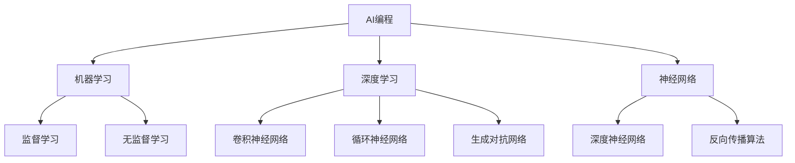

                 

### 文章标题：AI编程的新视角与新思维

> 关键词：人工智能，编程，新视角，新思维，深度学习，神经网络，机器学习，算法，实践

> 摘要：本文从AI编程的基础知识出发，深入探讨了深度学习、神经网络、机器学习等核心概念，并通过具体的算法原理和实际案例，展示了AI编程的新视角与新思维。文章旨在为读者提供一条系统化的学习路径，帮助理解和掌握AI编程的核心技术和方法。

----------------------------------------------------------------

### 第一部分：AI编程基础知识

#### 第1章：AI编程概述

AI编程，即人工智能编程，是利用计算机程序实现人工智能功能的领域。随着深度学习、神经网络等技术的发展，AI编程已经广泛应用于自然语言处理、计算机视觉、智能推荐等领域。本章节将介绍AI编程的重要性、发展历史、应用领域以及核心原则和思维模式。

**1.1 AI编程的重要性**

人工智能（AI）作为计算机科学的一个重要分支，对现代社会的各个方面产生了深远影响。从自动驾驶汽车到智能家居，从智能客服到医疗诊断，AI编程正在改变我们的生活方式和工作模式。掌握AI编程技术，不仅能够推动科技创新，还能够提升企业的竞争力。

**1.2 AI编程的历史与发展**

AI编程的历史可以追溯到20世纪50年代，当时人工智能的概念首次被提出。从最初的符号主义到最近的深度学习，AI编程经历了多个阶段。每个阶段都有其独特的算法和理论框架，推动了AI技术的发展。

**1.3 AI编程的应用领域**

AI编程在多个领域都有广泛应用，包括但不限于：

- **自然语言处理（NLP）**：实现人机对话、情感分析、文本分类等功能。
- **计算机视觉**：实现图像识别、物体检测、图像生成等功能。
- **智能推荐**：根据用户行为和偏好推荐产品或内容。
- **医疗诊断**：辅助医生进行疾病诊断和治疗方案制定。
- **金融风控**：预测金融风险、进行欺诈检测等。

**1.4 AI编程的核心原则与思维模式**

AI编程的核心原则包括：

- **数据驱动**：AI系统的性能依赖于大量的数据，因此数据处理和清洗是关键步骤。
- **模型优化**：通过调整模型参数，提高模型的准确性和泛化能力。
- **迭代改进**：AI系统需要不断迭代和优化，以适应新的数据和需求。
- **可解释性**：尽管AI系统在很多任务上表现出色，但其内部决策过程往往是不透明的。提高模型的可解释性，有助于理解模型的行为和提升用户信任。

#### 第2章：机器学习基础

机器学习是AI编程的核心技术之一。本章节将介绍机器学习的定义、分类、数据预处理、模型选择与评估，以及监督学习和无监督学习的基本算法。

**2.1 机器学习的定义与分类**

机器学习是指通过算法和统计方法，使计算机系统能够自动从数据中学习并做出决策或预测的过程。根据学习方式的不同，机器学习可以分为以下几类：

- **监督学习**：有标签的数据进行训练，预测新的未标记数据。
- **无监督学习**：没有标签的数据进行训练，发现数据中的结构和模式。
- **半监督学习**：既有标记数据又有无标记数据，利用标记数据和未标记数据共同训练模型。
- **强化学习**：通过与环境的交互学习最优策略，以实现特定目标。

**2.2 数据预处理**

数据预处理是机器学习的重要步骤，包括数据清洗、归一化、特征提取等。良好的数据预处理可以显著提高模型的性能。

- **数据清洗**：去除噪声数据、缺失值填充、异常值处理等。
- **归一化**：将数据缩放到同一尺度，便于模型训练。
- **特征提取**：提取关键特征，降低数据维度，提高模型效率。

**2.3 模型选择与评估**

选择合适的模型是机器学习的关键。常用的模型包括线性回归、决策树、支持向量机、神经网络等。评估模型性能的指标有准确率、召回率、F1分数、ROC曲线等。

**2.4 监督学习算法**

监督学习算法分为分类和回归两大类。以下介绍几种常见的监督学习算法：

- **线性回归**：基于线性模型预测连续值。
- **决策树**：基于树形结构进行分类或回归。
- **随机森林**：基于决策树的集成学习方法。
- **支持向量机**：基于最大间隔分类器。
- **神经网络**：基于多层感知器进行分类或回归。

**2.5 无监督学习算法**

无监督学习算法主要分为聚类和降维两大类。以下介绍几种常见的无监督学习算法：

- **K均值聚类**：基于距离相似度进行聚类。
- **自编码器**：基于神经网络进行特征提取和降维。
- **主成分分析**：基于线性变换提取主要成分。

### 第二部分：深度学习与神经网络

深度学习是机器学习的一个子领域，它通过构建多层神经网络来提取数据中的层次特征。本部分将介绍深度学习的基础知识、神经网络的基本原理、深度学习框架概述以及深度学习在图像识别中的应用。

#### 第3章：深度学习基础

深度学习是指多层神经网络的学习方法，通过多层非线性变换来提取数据中的复杂特征。深度学习的核心思想是模拟人脑的神经网络结构，通过调整网络中的参数来优化模型的性能。

**3.1 深度学习的定义与原理**

深度学习的定义和原理如下：

- **多层神经网络**：深度学习使用多层神经网络，每层都能够提取不同级别的特征。
- **反向传播算法**：通过反向传播算法，将误差从输出层反向传播到输入层，调整网络中的权重和偏置。
- **激活函数**：引入激活函数，使得神经网络能够进行非线性变换。

**3.2 神经网络基础**

神经网络是深度学习的基础，它由大量的神经元组成。每个神经元接收多个输入，通过权重加权求和后，经过激活函数得到输出。

- **神经元结构**：神经元包括输入层、隐藏层和输出层。
- **权重和偏置**：每个神经元都有权重和偏置，用于调整输入和输出的关系。
- **激活函数**：常用的激活函数包括Sigmoid、ReLU、Tanh等。

**3.3 深度学习框架概述**

深度学习框架是用于实现深度学习算法的工具，常见的深度学习框架包括TensorFlow、PyTorch、Keras等。这些框架提供了丰富的API和工具，方便开发者进行深度学习模型的构建和训练。

- **TensorFlow**：由Google开源，支持动态图和静态图两种模式。
- **PyTorch**：由Facebook开源，具有动态图优势，适合快速原型开发。
- **Keras**：基于TensorFlow和Theano，提供了简化的API。

**3.4 深度学习在图像识别中的应用**

深度学习在图像识别领域取得了显著成果。以下介绍几种常见的深度学习模型：

- **卷积神经网络（CNN）**：通过卷积操作和池化操作提取图像特征。
- **循环神经网络（RNN）**：通过循环结构处理序列数据。
- **生成对抗网络（GAN）**：通过生成器和判别器的对抗训练生成逼真的图像。

#### 第4章：卷积神经网络（CNN）

卷积神经网络（CNN）是深度学习中最常用的模型之一，特别适用于图像识别和图像处理任务。本章节将介绍CNN的基本结构、卷积操作与池化操作，以及CNN在图像识别中的实际应用。

**4.1 CNN的基本结构**

CNN的基本结构包括输入层、卷积层、池化层、全连接层和输出层。以下是CNN的基本组成部分：

- **输入层**：接收图像数据，通常为二维或三维的张量。
- **卷积层**：通过卷积操作提取图像特征。
- **池化层**：对卷积层的结果进行下采样，减少模型参数。
- **全连接层**：将卷积层和池化层的特征映射到分类或回归结果。
- **输出层**：输出预测结果。

**4.2 卷积操作与池化操作**

卷积操作和池化操作是CNN的核心技术。卷积操作通过滑动窗口与图像进行卷积，提取局部特征；池化操作对卷积结果进行下采样，减少数据维度。

- **卷积操作**：卷积核在图像上滑动，与图像进行点积操作，生成特征图。
- **池化操作**：对特征图进行下采样，常用的池化方法包括最大池化和平均池化。

**4.3 CNN在图像识别中的实际应用**

CNN在图像识别中取得了显著的成果，以下介绍几种常见的CNN模型：

- **LeNet**：最早的CNN模型之一，用于手写数字识别。
- **AlexNet**：深度学习在图像识别中的里程碑，使用了多个卷积层和ReLU激活函数。
- **VGGNet**：通过使用多个卷积层和较小的卷积核，提高了模型的准确率。
- **ResNet**：引入了残差连接，解决了深度网络中的梯度消失问题。

#### 第5章：循环神经网络（RNN）

循环神经网络（RNN）是处理序列数据的一种有效方法，特别适用于自然语言处理和语音识别任务。本章节将介绍RNN的基本原理、LSTM与GRU以及RNN在序列数据处理中的应用。

**5.1 RNN的基本原理**

RNN的基本原理如下：

- **循环结构**：RNN中的神经元具有循环结构，上一个时间步的输出可以反馈到当前时间步。
- **隐藏状态**：RNN使用隐藏状态来保存历史信息，使得模型能够处理序列数据。
- **门控机制**：门控机制（如遗忘门、输入门、输出门）用于控制信息的流动，提高模型的性能。

**5.2 LSTM与GRU**

LSTM（长短期记忆）和GRU（门控循环单元）是RNN的改进版本，用于解决传统RNN的梯度消失问题。

- **LSTM**：LSTM通过引入门控机制，使得模型能够保持长期依赖关系。
- **GRU**：GRU简化了LSTM的结构，同时保持了良好的性能。

**5.3 RNN在序列数据处理中的应用**

RNN在序列数据处理中取得了显著成果，以下介绍几种常见的RNN模型：

- **RNN-LSTM**：结合RNN和LSTM的优点，用于处理长序列数据。
- **BERT**：基于Transformer的预训练模型，用于自然语言处理任务。
- **WaveNet**：基于CNN和RNN的组合模型，用于语音合成。

#### 第6章：生成对抗网络（GAN）

生成对抗网络（GAN）是深度学习中的一个重要模型，由生成器和判别器组成，通过对抗训练生成逼真的图像。本章节将介绍GAN的原理与结构、应用领域以及挑战与优化方法。

**6.1 GAN的原理与结构**

GAN的原理和结构如下：

- **生成器**：生成器尝试生成逼真的数据，使得判别器无法区分生成数据和真实数据。
- **判别器**：判别器用于区分真实数据和生成数据，生成器和判别器相互对抗，优化自己的性能。

**6.2 GAN的应用领域**

GAN在图像处理、自然语言处理、音频生成等领域有广泛应用，以下介绍几个应用领域：

- **图像生成**：GAN可以生成高质量的图像，应用于艺术创作、游戏开发等领域。
- **超分辨率**：GAN可以提升图像的分辨率，应用于图像增强、图像修复等领域。
- **文本生成**：GAN可以生成高质量的文本，应用于自然语言处理、对话系统等领域。

**6.3 GAN的挑战与优化方法**

GAN在实际应用中面临一些挑战，如模式崩塌、梯度消失等。以下介绍几种优化方法：

- **梯度惩罚**：通过引入梯度惩罚项，避免模式崩塌。
- **谱归一化**：通过谱归一化方法，缓解梯度消失问题。
- **对抗训练**：通过交替训练生成器和判别器，提高模型的性能。

### 第三部分：AI编程新视角

#### 第7章：强化学习

强化学习是一种通过与环境交互来学习最优策略的机器学习技术。本章节将介绍强化学习的定义与原理、Q-Learning与SARSA以及强化学习在实际游戏中的应用。

**7.1 强化学习的定义与原理**

强化学习的定义和原理如下：

- **定义**：强化学习是一个-Agent在与环境的交互中，通过不断试错来学习最优策略的过程。
- **原理**：强化学习通过奖励机制来引导-Agent的行为，使-Agent能够逐步优化自己的策略。

**7.2 Q-Learning与SARSA**

Q-Learning和SARSA是强化学习的两种常见算法：

- **Q-Learning**：通过更新Q值来学习策略。
- **SARSA**：通过更新状态-动作值来学习策略。

**7.3 强化学习在实际游戏中的应用**

强化学习在游戏领域中取得了显著成果，以下介绍几个应用案例：

- **AlphaGo**：基于强化学习算法的围棋AI，击败了人类世界冠军。
- **自动驾驶**：通过强化学习算法，自动驾驶汽车能够学习最优驾驶策略。
- **推荐系统**：通过强化学习算法，推荐系统可以优化推荐策略，提高用户体验。

#### 第8章：迁移学习与数据增强

迁移学习是一种利用预训练模型来提高新任务性能的方法，数据增强是通过生成新的数据样本来提高模型的泛化能力。本章节将介绍迁移学习的概念与优势、数据增强的方法与技巧以及迁移学习与数据增强的实际应用。

**8.1 迁移学习的概念与优势**

迁移学习的概念和优势如下：

- **定义**：迁移学习是将已有模型的权重和知识应用到新任务中，以提高新任务的性能。
- **优势**：迁移学习可以减少对大量标注数据的依赖，提高模型的泛化能力。

**8.2 数据增强的方法与技巧**

数据增强的方法和技巧如下：

- **旋转**：随机旋转图像，增加图像的角度多样性。
- **缩放**：随机缩放图像，增加图像的尺度多样性。
- **翻转**：随机翻转图像，增加图像的对称性多样性。
- **颜色变换**：随机调整图像的颜色，增加图像的色彩多样性。

**8.3 迁移学习与数据增强的实际应用**

迁移学习和数据增强在实际应用中取得了显著成果，以下介绍几个应用案例：

- **计算机视觉**：通过迁移学习，将预训练模型应用于新任务，提高模型的性能。
- **自然语言处理**：通过数据增强，增加训练数据量，提高模型的泛化能力。
- **推荐系统**：通过迁移学习，将已有模型的知识应用到新场景，提高推荐系统的性能。

#### 第9章：多模态学习

多模态学习是一种利用多个模态的数据进行学习和推理的方法。本章节将介绍多模态学习的定义与意义、多模态数据的处理方法以及多模态学习的实际应用案例。

**9.1 多模态学习的定义与意义**

多模态学习的定义和意义如下：

- **定义**：多模态学习是指利用多个模态（如视觉、听觉、语言）的数据进行学习和推理。
- **意义**：多模态学习可以充分利用不同模态的数据，提高模型的鲁棒性和泛化能力。

**9.2 多模态数据的处理方法**

多模态数据的处理方法如下：

- **特征融合**：将不同模态的数据特征进行融合，生成统一特征表示。
- **特征对齐**：将不同模态的数据特征进行对齐，使它们在同一时间步进行融合。
- **模型融合**：将不同模态的模型进行融合，共同训练得到最终的模型。

**9.3 多模态学习的实际应用案例**

多模态学习在实际应用中取得了显著成果，以下介绍几个应用案例：

- **情感分析**：结合文本和音频数据，提高情感分析的准确率。
- **医疗诊断**：结合医学图像和患者信息，提高疾病诊断的准确性。
- **人机交互**：结合视觉和语音数据，提高人机交互的体验。

### 第四部分：AI编程新思维

#### 第10章：模型可解释性与伦理

模型可解释性和伦理是AI编程中不可忽视的重要方面。本章节将介绍模型可解释性的重要性、可解释性方法概述、AI伦理与隐私保护以及AI编程的可持续发展。

**10.1 模型可解释性的重要性**

模型可解释性在以下方面具有重要意义：

- **提高用户信任**：透明和可解释的模型有助于用户理解模型的决策过程，提高用户对AI系统的信任。
- **促进合作与交流**：可解释性模型有助于不同领域的专家和技术人员之间的合作和交流。
- **提升模型性能**：通过分析模型的可解释性，可以优化模型的结构和参数，提高模型的性能。

**10.2 可解释性方法概述**

以下介绍几种常见的可解释性方法：

- **特征重要性**：通过分析特征的重要性，了解模型对每个特征的依赖程度。
- **决策路径**：通过可视化模型的决策路径，展示模型的决策过程。
- **模型压缩**：通过模型压缩技术，降低模型复杂度，提高可解释性。

**10.3 AI伦理与隐私保护**

AI伦理和隐私保护在以下方面具有重要意义：

- **公平性**：确保AI系统在不同群体中的公平性，避免歧视现象。
- **隐私保护**：保护用户数据隐私，防止数据泄露和滥用。
- **透明性**：提高AI系统的透明性，使用户了解系统的运作机制。

**10.4 AI编程的可持续发展**

AI编程的可持续发展在以下方面具有重要意义：

- **资源优化**：合理利用计算资源和能源，降低AI系统的能耗。
- **数据管理**：建立可持续的数据管理体系，确保数据的真实性、准确性和可靠性。
- **社会影响**：关注AI技术对社会的影响，积极推动AI技术的可持续发展。

#### 第11章：AI编程的未来趋势

AI编程的未来趋势将体现在以下方面：

**11.1 AI编程的创新发展**

AI编程的创新发展将体现在以下几个方面：

- **新算法**：不断涌现的新算法，如生成对抗网络（GAN）、变分自编码器（VAE）等，将推动AI技术的发展。
- **新框架**：新的深度学习框架，如TensorFlow 2.0、PyTorch 1.0等，将提高开发效率和模型性能。
- **新应用**：AI技术将在更多领域得到应用，如自动驾驶、智能家居、智能医疗等。

**11.2 AI编程的社会影响**

AI编程的社会影响将体现在以下几个方面：

- **经济变革**：AI技术将推动经济模式的变革，创造新的就业机会和产业。
- **社会进步**：AI技术将提高社会生产力，改善人们的生活质量。
- **伦理挑战**：AI技术带来的伦理挑战，如隐私保护、数据滥用等，需要全社会共同关注和解决。

**11.3 AI编程的未来挑战与机遇**

AI编程的未来挑战与机遇将体现在以下几个方面：

- **技术挑战**：如何提高AI模型的性能、可解释性和安全性，是未来需要攻克的技术难题。
- **数据挑战**：如何获取、处理和管理大量高质量的数据，是未来需要面对的数据挑战。
- **人才挑战**：如何培养和吸引更多的AI人才，是未来需要关注的人才挑战。
- **机遇**：AI技术将带来前所未有的机遇，如智能城市、数字健康、智能交通等领域的快速发展。

### 附录

#### 附录A：AI编程工具与资源

**A.1 机器学习框架介绍**

以下介绍几种常用的机器学习框架：

- **TensorFlow**：由Google开源，支持动态图和静态图两种模式。
- **PyTorch**：由Facebook开源，具有动态图优势，适合快速原型开发。
- **Keras**：基于TensorFlow和Theano，提供了简化的API。
- **Scikit-learn**：开源的Python机器学习库，提供了丰富的算法和工具。

**A.2 开发环境搭建**

搭建AI编程的开发环境，需要以下工具：

- **Python**：作为主要编程语言，用于实现机器学习算法。
- **Jupyter Notebook**：用于交互式编程和文档化。
- **Anaconda**：用于环境管理和包管理。
- **GPU**：用于加速深度学习模型的训练。

**A.3 学习资源推荐**

以下推荐一些AI编程的学习资源：

- **《深度学习》（Goodfellow, Bengio, Courville）**：深度学习的经典教材。
- **《Python机器学习》（Sebastian Raschka）**：Python机器学习实践的指南。
- **Udacity**：提供丰富的AI编程课程和项目。
- **Coursera**：提供由顶级大学和机构开设的AI编程课程。

### 核心概念与联系

#### AI编程的概念与架构

**Mermaid 流程图：**



#### 核心算法原理讲解

**线性回归：**

```python
# 线性回归伪代码
def linear_regression(x, y):
    # 计算权重w和偏置b
    w = (x'x)^(-1)x'y
    b = y - wx
    
    # 预测
    y_pred = wx + b
    
    return y_pred
```

**深度学习反向传播算法：**

```python
# 反向传播算法伪代码
def backward_propagation(x, y, w, b):
    # 前向传播
    z = wx + b
    a = 1 / (1 + e^(-z))
    
    # 计算误差
    dz = a - y
    
    # 反向传播更新权重和偏置
    dw = x' * dz
    db = dz
    
    return w - alpha * dw, b - alpha * db
```

#### 数学模型和数学公式

**线性回归公式：**

$$ y = wx + b $$

**深度学习反向传播算法公式：**

$$ \frac{\partial L}{\partial w} = x' \frac{\partial L}{\partial z} $$

$$ \frac{\partial L}{\partial b} = \frac{\partial L}{\partial z} $$

### 作者信息

作者：AI天才研究院/AI Genius Institute & 禅与计算机程序设计艺术 /Zen And The Art of Computer Programming

----------------------------------------------------------------

#### 总结与展望

本文系统地介绍了AI编程的新视角与新思维，从基础知识到前沿技术，从核心算法到实际应用，为读者提供了一条清晰的学习路径。AI编程作为一门快速发展的技术，具有广泛的应用前景和巨大的社会影响。在未来，随着技术的不断进步和应用的不断拓展，AI编程将在更多领域发挥重要作用，为人类创造更多价值。

首先，AI编程的核心技术如深度学习、神经网络和机器学习将继续发展，新的算法和框架将不断涌现。同时，多模态学习和迁移学习等新方法将使AI系统更加智能化和灵活。其次，AI编程的社会影响将日益显著，不仅在经济、社会和环境等方面带来变革，也将带来一系列伦理和安全挑战。因此，AI编程的可持续发展成为一个重要议题，需要全社会共同努力。

展望未来，AI编程将面临以下机遇和挑战：

1. **技术创新**：不断涌现的新算法、新框架和新应用将推动AI技术的发展。
2. **人才培养**：培养更多的AI人才，提高AI技术的普及率和应用水平。
3. **伦理与安全**：建立完善的AI伦理规范和安全保障体系，确保AI技术的可持续发展。
4. **数据管理**：加强数据管理和保护，确保数据的真实性、准确性和隐私性。
5. **国际合作**：加强国际间的合作与交流，推动全球AI技术的发展和应用。

总之，AI编程作为一门具有重要战略意义的技术，将在未来发挥更加关键的作用。通过不断学习和探索，我们有望为AI编程领域的发展贡献自己的力量，为人类社会的进步做出贡献。作者：AI天才研究院/AI Genius Institute & 禅与计算机程序设计艺术 /Zen And The Art of Computer Programming。

