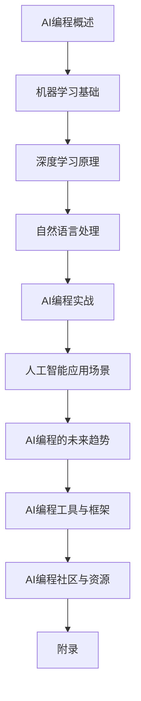

                 

### 文章标题: 《AI编程的新视野》

关键词：人工智能、编程、深度学习、自然语言处理、机器学习、编程实践

摘要：本文将深入探讨AI编程的新视野，从基础理论到实际应用，再到未来趋势，全面解析AI编程的核心知识和技术要点。

# 第一部分: AI编程基础知识

## 1.1 AI编程概述

### 1.1.1 人工智能的定义与发展历程

人工智能（Artificial Intelligence，简称AI）是模拟、延伸和扩展人类智能的科学和技术。其发展历程可以分为三个阶段：计算智能、感知智能和认知智能。

- **计算智能**：主要是指以逻辑推理和符号计算为代表的智能形式，如专家系统和逻辑推理机。
- **感知智能**：主要是通过传感器获取信息，进行感知和理解，如语音识别、图像识别和自然语言处理。
- **认知智能**：主要是模拟人类思维过程，进行知识获取、推理、决策和创造，如智能规划和智能机器人。

AI的发展历程可追溯到1950年，艾伦·图灵提出了著名的“图灵测试”。此后，人工智能经历了多个阶段，从最初的符号逻辑推理，到基于规则的专家系统，再到基于数据驱动的方法，如机器学习和深度学习。

### 1.1.2 AI编程与传统编程的区别

传统编程注重的是如何让计算机执行预定义的任务，而AI编程则更侧重于如何使计算机具备“思考”的能力，即让计算机能够从数据中学习，并基于学习到的知识进行决策和预测。

- **编程目标**：传统编程的目标是实现特定的功能，而AI编程的目标是实现智能体的自主学习和决策。
- **编程方法**：传统编程主要依赖于算法和流程控制，而AI编程则依赖于机器学习和深度学习算法。
- **编程语言**：传统编程语言如C、C++、Java等，而AI编程则更多使用Python、R、Julia等数据科学和机器学习专用语言。

### 1.1.3 AI编程的重要性

AI编程是当前技术发展的热点和前沿，具有重要的理论和实践意义：

- **推动科技创新**：AI编程为科技创新提供了强大的工具和平台，如自动驾驶、智能医疗、智能制造等。
- **提升生产力**：AI编程可以自动化许多重复性和复杂的任务，提高工作效率，降低成本。
- **改变各行各业**：AI编程正在改变金融、医疗、教育、制造等各个行业，推动产业升级和转型。

## 1.2 机器学习基础

### 1.2.1 机器学习的基本概念

机器学习（Machine Learning，简称ML）是一门研究如何让计算机从数据中学习规律，并对未知数据进行预测或决策的学科。其核心思想是通过训练模型，让模型能够对新的数据进行预测。

- **监督学习**：有标注的数据集，通过学习输入和输出之间的映射关系进行预测。
  $$
  y = f(x)
  $$
  
- **无监督学习**：无标注的数据集，通过学习数据之间的分布和结构进行聚类、降维等任务。
  $$
  \min_{\theta} \sum_{i=1}^{n} \| \theta^T x_i - y_i \|^2
  $$

- **强化学习**：通过与环境的交互，学习最优策略以最大化奖励。
  $$
  Q(s, a) = \sum_{s'} P(s'|s, a) \cdot \max_a' Q(s', a')
  $$

### 1.2.2 监督学习、无监督学习和强化学习

监督学习、无监督学习和强化学习是机器学习的三种基本类型，它们各有特点和应用场景。

- **监督学习**：适用于有标注的数据集，如分类和回归问题。
  - **分类问题**：将数据分为不同的类别，如文本分类、图像分类。
  - **回归问题**：预测一个连续的数值输出，如房价预测、股票价格预测。

- **无监督学习**：适用于无标注的数据集，如聚类和降维。
  - **聚类问题**：将数据分为不同的簇，如客户细分、图像分割。
  - **降维问题**：减少数据的维度，如主成分分析、自编码器。

- **强化学习**：适用于与环境的交互问题，如游戏、自动驾驶。
  - **策略学习**：学习最优的策略以最大化累积奖励。
  - **模型学习**：学习一个模型来预测环境状态和动作值。

### 1.2.3 机器学习的基本流程

机器学习的基本流程包括数据采集与预处理、特征提取与选择、模型选择与训练、模型评估与优化等步骤。

1. **数据采集与预处理**：收集数据，并进行数据清洗、归一化、缺失值处理等操作。
2. **特征提取与选择**：从原始数据中提取有用的特征，并进行特征选择，以减少数据的维度和提高模型的性能。
3. **模型选择与训练**：选择合适的模型，并使用训练数据集进行训练，以学习数据中的规律。
4. **模型评估与优化**：使用验证数据集对模型进行评估，并根据评估结果对模型进行优化。

## 1.3 深度学习原理

### 1.3.1 神经网络基础

神经网络（Neural Network，简称NN）是深度学习（Deep Learning，简称DL）的基础。神经网络由多个神经元（节点）组成，每个神经元通过权重连接到其他神经元，并接收输入信号。

- **神经元模型**：神经元接收多个输入信号，通过激活函数计算输出。
  $$
  z = \sum_{i=1}^{n} w_i x_i + b \\
  a = \sigma(z)
  $$
  其中，\(w_i\) 为权重，\(x_i\) 为输入，\(b\) 为偏置，\(\sigma\) 为激活函数。

- **多层神经网络**：由多个隐层组成，能够学习更复杂的函数。

### 1.3.2 深度学习模型架构

深度学习模型有多种架构，如卷积神经网络（CNN）、循环神经网络（RNN）、生成对抗网络（GAN）等。

- **卷积神经网络（CNN）**：适用于图像处理，通过卷积层提取特征，通过池化层减少参数。
  $$
  \text{输入} \rightarrow \text{卷积层} \rightarrow \text{激活函数} \rightarrow \text{池化层} \rightarrow \text{全连接层} \rightarrow \text{输出}
  $$

- **循环神经网络（RNN）**：适用于序列数据处理，通过循环结构保持长期依赖信息。
  $$
  h_t = \text{sigmoid}(W_h \cdot [h_{t-1}, x_t] + b_h) \\
  y_t = \text{sigmoid}(W_y \cdot h_t + b_y)
  $$

- **生成对抗网络（GAN）**：通过生成器和判别器的对抗训练生成逼真的数据。

### 1.3.3 深度学习算法详解

深度学习算法主要包括前向传播、反向传播、优化算法等。

- **前向传播**：从输入层传递信号到输出层，计算每一层的输出。
  $$
  z_l = \sum_{i=1}^{n} w_{li} x_i + b_l \\
  a_l = \sigma(z_l)
  $$

- **反向传播**：从输出层反向传播误差，计算每一层的梯度。
  $$
  \delta_l = \frac{\partial J}{\partial a_l} \odot \frac{\partial a_l}{\partial z_l} \\
  \nabla_w = \sum_{i=1}^{n} \delta_l x_i \\
  \nabla_b = \sum_{i=1}^{n} \delta_l
  $$

- **优化算法**：用于更新权重和偏置，如梯度下降、随机梯度下降、Adam优化器等。
  $$
  w_{\text{new}} = w_{\text{old}} - \alpha \nabla_w \\
  b_{\text{new}} = b_{\text{old}} - \alpha \nabla_b
  $$

## 1.4 自然语言处理

### 1.4.1 语言模型与词嵌入

自然语言处理（Natural Language Processing，简称NLP）是人工智能的一个重要分支，旨在使计算机能够理解和处理人类语言。

- **语言模型**：用于预测下一个单词的概率，如n-gram模型、神经网络语言模型。
  $$
  P(w_{t+1} | w_1, w_2, ..., w_t) = \prod_{i=1}^{t} P(w_i)
  $$

- **词嵌入**：将单词映射到高维空间，用于表示单词的语义信息，如Word2Vec、GloVe、BERT。

### 1.4.2 语义分析与生成

- **语义分析**：用于理解文本中的语义信息，如词性标注、句法分析、语义角色标注。
- **语义生成**：用于生成符合语义逻辑的文本，如机器翻译、问答系统、文本生成。

### 1.4.3 语音识别与生成

- **语音识别**：将语音信号转换为文本，如基于深度学习的语音识别系统。
- **语音生成**：将文本转换为语音，如基于深度学习的语音合成系统。

# 第二部分: AI编程实践与应用

## 2.1 AI编程实战

### 2.1.1 编程环境与工具

要开始AI编程，首先需要配置一个适合的开发环境。常用的编程环境有：

- **Python**：Python是AI编程中最常用的语言，具有丰富的库和框架，如TensorFlow、PyTorch等。
- **Jupyter Notebook**：Jupyter Notebook是一种交互式的开发环境，方便进行数据可视化和实验。

### 2.1.2 数据预处理与数据集构建

AI编程的第一步通常是数据预处理和数据集构建。

- **数据预处理**：包括数据清洗、归一化、缺失值处理等操作。
- **数据集构建**：从原始数据中提取有用的特征，并划分为训练集、验证集和测试集。

### 2.1.3 模型训练与优化

模型训练是AI编程的核心步骤。

- **模型选择**：根据任务选择合适的模型，如卷积神经网络、循环神经网络等。
- **模型训练**：使用训练数据进行模型训练，通过调整超参数和优化算法来提高模型性能。
- **模型优化**：通过交叉验证和网格搜索等技术，优化模型参数，提高模型性能。

### 2.1.4 模型部署与评估

模型训练完成后，需要将其部署到实际应用中。

- **模型部署**：将训练好的模型部署到服务器或设备上，以便实时进行预测。
- **模型评估**：使用测试集对模型进行评估，计算模型的准确率、召回率、F1值等指标。

## 2.2 自然语言处理项目实战

### 2.2.1 基于Python的文本分类项目

文本分类是自然语言处理中的一个重要任务，可以使用Python和Scikit-learn等库来实现。

- **项目目标**：将文本数据分为不同的类别，如新闻分类、情感分类等。
- **实现步骤**：
  1. 数据预处理：清洗文本数据，进行分词、去停用词等操作。
  2. 特征提取：将文本转换为向量，如TF-IDF、Word2Vec等。
  3. 模型训练：使用训练数据进行模型训练，如朴素贝叶斯、支持向量机等。
  4. 模型评估：使用测试集对模型进行评估，计算分类准确率等指标。

### 2.2.2 基于TensorFlow的聊天机器人项目

聊天机器人是自然语言处理的一个典型应用，可以使用TensorFlow和Keras等库来实现。

- **项目目标**：实现一个能够与用户进行自然对话的聊天机器人。
- **实现步骤**：
  1. 数据预处理：清洗对话数据，进行分词、去停用词等操作。
  2. 词嵌入：将单词转换为向量，使用预训练的词向量或自定义词向量。
  3. 模型训练：使用序列到序列模型进行训练，如循环神经网络（RNN）或长短期记忆网络（LSTM）。
  4. 模型评估：使用测试集对模型进行评估，计算聊天质量等指标。

### 2.2.3 基于Keras的图像识别项目

图像识别是计算机视觉中的一个重要任务，可以使用Keras和TensorFlow等库来实现。

- **项目目标**：使用卷积神经网络对图像进行分类。
- **实现步骤**：
  1. 数据预处理：加载和预处理图像数据，如归一化、缩放等。
  2. 模型构建：使用卷积神经网络（CNN）构建模型，如VGG、ResNet等。
  3. 模型训练：使用训练数据进行模型训练，通过反向传播算法更新权重。
  4. 模型评估：使用测试集对模型进行评估，计算分类准确率等指标。

## 2.3 人工智能应用场景

### 2.3.1 金融行业应用

人工智能在金融行业有广泛的应用，如风险控制、投资组合优化、欺诈检测等。

- **风险控制**：使用机器学习算法对金融风险进行预测和评估。
- **投资组合优化**：使用优化算法和机器学习算法，对投资组合进行优化，提高收益。
- **欺诈检测**：使用监督学习和无监督学习算法，检测和预防金融欺诈。

### 2.3.2 医疗健康应用

人工智能在医疗健康领域有巨大的潜力，如疾病诊断、药物研发、健康监测等。

- **疾病诊断**：使用深度学习和图像识别技术，对医学影像进行自动诊断。
- **药物研发**：使用机器学习算法，加速药物研发过程，提高成功率。
- **健康监测**：使用传感器和数据挖掘技术，对患者的健康状况进行实时监测和预警。

### 2.3.3 教育行业应用

人工智能在教育行业有广泛的应用，如个性化学习、智能评价、教育资源优化等。

- **个性化学习**：使用自适应学习系统和机器学习算法，为每个学生提供个性化的学习路径。
- **智能评价**：使用自然语言处理和图像识别技术，对学生的作业和考试进行自动评分。
- **教育资源优化**：使用数据分析技术，对教育资源进行优化配置，提高教育质量。

### 2.3.4 其他行业应用

人工智能在其他行业也有广泛的应用，如制造业、物流、零售等。

- **制造业**：使用机器人和智能控制技术，提高生产效率和质量。
- **物流**：使用优化算法和机器学习技术，优化物流路线和配送策略。
- **零售**：使用数据挖掘和推荐系统，提高销售额和客户满意度。

# 第三部分: AI编程新趋势

## 3.1 AI编程的未来趋势

### 3.1.1 大模型与预训练技术

大模型与预训练技术是当前AI编程的重要趋势。

- **大模型**：通过增加模型参数和训练数据量，提高模型的性能和泛化能力。
- **预训练技术**：在特定任务之前，先在大量无标注数据上进行预训练，提高模型在特定任务上的性能。

### 3.1.2 跨领域学习与泛化能力

跨领域学习与泛化能力是未来AI编程的重要研究方向。

- **跨领域学习**：通过将不同领域的数据和模型进行整合，提高模型在不同领域的适应能力。
- **泛化能力**：通过改进模型结构和训练方法，提高模型在不同任务上的泛化能力。

### 3.1.3 人工智能伦理与隐私保护

人工智能伦理与隐私保护是未来AI编程的重要挑战。

- **伦理问题**：如算法歧视、透明度、可解释性等。
- **隐私保护**：如数据安全、隐私泄露等。

## 3.2 AI编程工具与框架

### 3.2.1 TensorFlow 2.x 与 PyTorch 的使用

TensorFlow 2.x 和 PyTorch 是当前最流行的深度学习框架。

- **TensorFlow 2.x**：具有丰富的库和API，易于使用，支持自动微分和分布式训练。
- **PyTorch**：具有动态计算图和简洁的API，易于调试和推理，支持Python编程。

### 3.2.2 JAX 与 Julia 的优势

JAX 和 Julia 是新兴的AI编程工具。

- **JAX**：具有自动微分和高性能计算能力，适用于大规模模型训练和优化。
- **Julia**：具有高性能和易用性，适用于科学计算和机器学习。

### 3.2.3 其他常用框架介绍

其他常用的深度学习框架包括：

- **Keras**：基于TensorFlow的高层API，易于使用，适用于快速原型设计。
- **Caffe**：基于C++的深度学习框架，适用于图像识别和计算机视觉。
- **Theano**：基于Python的深度学习框架，已逐渐被TensorFlow和PyTorch取代。

## 3.3 AI编程社区与资源

### 3.3.1 开源社区与项目

AI编程有丰富的开源社区和项目。

- **GitHub**：许多AI项目开源在GitHub上，供开发者学习和贡献。
- **ArXiv**：人工智能领域的学术论文开源平台。

### 3.3.2 学术会议与研讨会

学术会议和研讨会是AI编程的重要交流平台。

- **NeurIPS**：人工智能领域的顶级会议，发布最新的研究成果。
- **ICML**：机器学习领域的顶级会议，涵盖广泛的研究主题。

### 3.3.3 在线课程与学习资源

在线课程和学习资源为AI编程提供了丰富的学习资源。

- **Coursera**：提供丰富的AI编程课程，包括机器学习、深度学习等。
- **Udacity**：提供实战项目课程，帮助开发者提升技能。

# 附录

## 附录 A: AI编程工具与资源指南

### A.1 编程环境配置指南

要开始AI编程，需要配置以下编程环境：

- **Python**：安装Python 3.x版本，建议使用Anaconda环境管理器。
- **Jupyter Notebook**：安装Jupyter Notebook，用于交互式编程和数据分析。
- **深度学习框架**：如TensorFlow、PyTorch等，根据项目需求选择合适的框架。

### A.2 常用库与框架使用手册

- **TensorFlow**：官方文档提供了详细的安装和使用指南。
- **PyTorch**：PyTorch官方文档详细介绍了如何安装和使用PyTorch。
- **Scikit-learn**：Scikit-learn官方文档提供了丰富的机器学习算法和工具。

### A.3 开源数据集介绍

常用的开源数据集包括：

- **MNIST**：手写数字数据集，常用于图像分类任务。
- **IMDb**：电影评论数据集，常用于文本分类任务。
- **CIFAR-10**：小型图像数据集，包含10个类别，常用于图像分类任务。

### A.4 AI编程资源推荐

以下是一些AI编程的推荐资源：

- **《深度学习》（Goodfellow, Bengio, Courville）**：深度学习领域的经典教材。
- **《Python机器学习》（Sebastian Raschka）**：Python机器学习实践教程。
- **《AI编程实战》（Jay Lyndsay）**：AI编程实战项目教程。
- **在线课程**：如Coursera、Udacity等平台上的AI编程课程。

# Mermaid 流程图

# 结束语

AI编程作为人工智能的核心技术之一，正日益成为各个行业的重要驱动力。本文从AI编程的基础知识、实际应用、未来趋势等方面进行了全面深入的探讨。希望通过本文，读者能够对AI编程有一个更加清晰和深入的认识，并能够在实际项目中运用AI编程技术，推动科技创新和产业升级。让我们共同迎接AI编程的新视野，开启智能时代的新篇章。

### 作者信息

**作者：AI天才研究院（AI Genius Institute）& 禅与计算机程序设计艺术（Zen And The Art of Computer Programming）**

AI天才研究院致力于推动人工智能技术的创新和发展，专注于研究深度学习、自然语言处理、计算机视觉等前沿技术。同时，我们倡导“禅与计算机程序设计艺术”，提倡用智慧和宁静的心态去编写优美的代码，创造卓越的技术作品。希望本文能够带给您对AI编程的新视野，激发您对技术的热情和探索精神。让我们携手前行，共同探索AI编程的无限可能。

