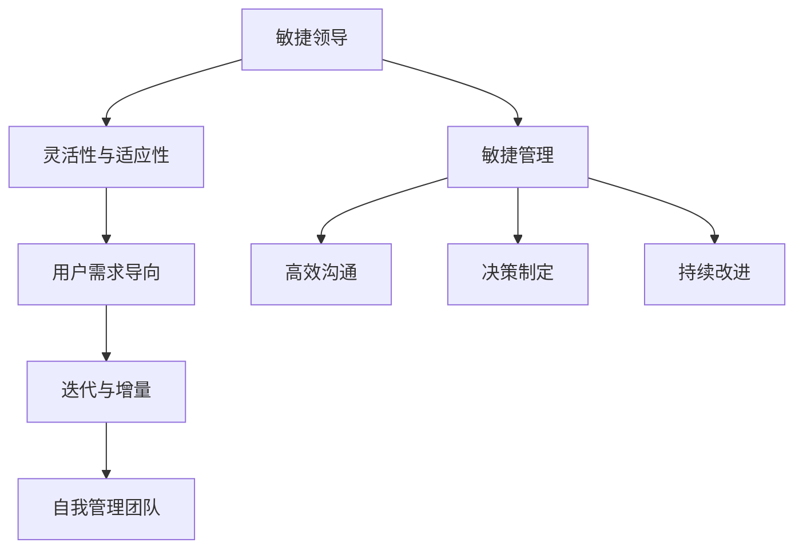
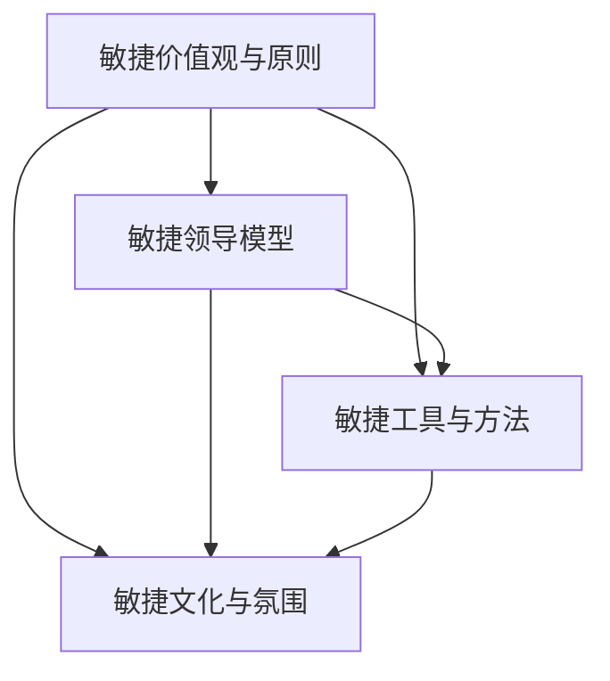

                 

### 文章标题

《敏捷领导框架：在快速变化中保持组织灵活性》

### 关键词

敏捷领导、组织灵活性、快速变化、管理策略、团队协作

### 摘要

在当今瞬息万变的市场环境中，敏捷领导成为组织保持竞争力的重要手段。本文详细阐述了敏捷领导框架的构成与核心能力，并通过实例分析了敏捷领导在不同组织中的应用与挑战。本文旨在为读者提供敏捷领导实践指南，帮助组织在快速变化中保持灵活性。

## 目录大纲

### 第一部分：敏捷领导框架概述

#### 第1章：敏捷领导与敏捷管理

##### 1.1.1 敏捷领导的概念与重要性

##### 1.1.2 敏捷管理与传统管理的比较

##### 1.1.3 敏捷领导的关键特征

#### 第2章：敏捷领导框架基础

##### 2.1.1 敏捷领导框架的构成

##### 2.1.2 敏捷价值观与原则

##### 2.1.3 敏捷领导与团队文化

#### 第3章：敏捷领导的核心能力

##### 3.1.1 视觉化沟通能力

##### 3.1.2 决策能力

##### 3.1.3 建立信任与协作能力

#### 第4章：敏捷领导在不同组织中的应用

##### 4.1.1 敏捷领导在初创企业的应用

##### 4.1.2 敏捷领导在大型企业的应用

##### 4.1.3 敏捷领导在跨国企业的应用

### 第二部分：敏捷领导实践指南

#### 第5章：敏捷领导实践策略

##### 5.1.1 设定愿景与目标

##### 5.1.2 管理变革与适应能力

##### 5.1.3 人才培养与激励策略

#### 第6章：敏捷领导工具与方法

##### 6.1.1 敏捷项目管理工具

##### 6.1.2 敏捷会议技巧

##### 6.1.3 敏捷团队协作工具

#### 第7章：敏捷领导案例分析

##### 7.1.1 案例一：如何在快速变化的市场中保持竞争优势

##### 7.1.2 案例二：敏捷领导在危机管理中的应用

##### 7.1.3 案例三：敏捷领导如何促进团队创新

#### 第8章：敏捷领导挑战与应对

##### 8.1.1 敏捷领导面临的挑战

##### 8.1.2 应对敏捷领导挑战的策略

##### 8.1.3 敏捷领导的可持续发展

### 第三部分：敏捷领导工具资源附录

#### 第9章：敏捷领导工具与资源

##### 9.1.1 敏捷领导相关书籍推荐

##### 9.1.2 敏捷领导在线课程与资源

##### 9.1.3 敏捷领导实践社区与论坛

### 附录部分

#### 第10章：敏捷领导工具与资源

##### 10.1 敏捷领导相关书籍推荐

##### 10.2 敏捷领导在线课程与资源

##### 10.3 敏捷领导实践社区与论坛

##### 10.4 敏捷领导工具指南

---

以下内容将按照目录大纲逐章展开，详细探讨敏捷领导框架的各个维度，旨在为读者提供系统的理解与实用的指导。

---

### 第一部分：敏捷领导框架概述

#### 第1章：敏捷领导与敏捷管理

#### 1.1.1 敏捷领导的概念与重要性

敏捷领导是一种应对快速变化环境的领导风格，强调灵活性和适应性。它不仅仅是一种管理方法，更是一种文化理念，旨在激励和引导团队在不断变化的环境中取得成功。

**核心概念与联系**

敏捷领导与敏捷管理密切相关。敏捷管理是一种以用户需求为导向，采用迭代、增量和自适应方式来开发和运营产品的管理理念。而敏捷领导则是这一理念在领导层面的具体实践，旨在确保团队能够在敏捷管理框架下高效运作。

**敏捷领导的核心概念架构 Mermaid 流程图**

**敏捷领导的重要性**

在快速变化的市场环境中，敏捷领导的重要性愈发凸显。以下是几个关键点：

1. **提高响应速度**：敏捷领导能够快速识别市场变化，并迅速作出调整，使组织能够更好地应对外部环境的挑战。
2. **增强团队凝聚力**：通过鼓励自主性和自我管理，敏捷领导能够提高团队的凝聚力和创造力。
3. **提升客户满意度**：敏捷领导能够更好地满足客户需求，从而提高客户满意度和忠诚度。
4. **促进创新**：在敏捷领导的文化下，团队成员更有可能提出创新的想法和解决方案。

#### 1.1.2 敏捷管理与传统管理的比较

敏捷管理与传统管理在理念和方法上存在显著差异。

**传统管理**

传统管理通常基于预定的计划和时间表，强调严格的控制和标准化流程。这种方法在稳定的环境中可能有效，但在快速变化的环境中容易变得僵化和低效。

**敏捷管理**

敏捷管理则更加强调灵活性和适应性，采用迭代和增量的方式来开发和运营产品。敏捷管理强调团队合作、用户反馈和持续改进。

**比较**

- **计划与适应**：传统管理倾向于依赖详细的计划，而敏捷管理则更注重对变化的适应。
- **控制与自主**：传统管理倾向于控制，而敏捷管理则鼓励团队成员自主决策和自我管理。
- **沟通与协作**：敏捷管理强调高效的沟通和团队协作，而传统管理可能忽视了这些方面。

**敏捷领导与传统领导的差异**

- **灵活性**：敏捷领导更注重灵活性，能够在变化中迅速调整，而传统领导可能更倾向于坚持原有的计划和目标。
- **文化**：敏捷领导强调建立一种以用户为中心、鼓励创新和协作的文化，而传统领导可能更注重绩效和效率。
- **决策**：敏捷领导倾向于快速决策，而传统领导可能需要更多时间来制定和执行决策。

**敏捷领导的优势**

- **快速响应**：敏捷领导能够更快地识别和响应市场变化。
- **团队协作**：敏捷领导鼓励团队成员之间的协作和沟通。
- **持续改进**：敏捷领导强调不断改进和优化，以适应不断变化的环境。

#### 1.1.3 敏捷领导的关键特征

敏捷领导具有以下关键特征：

- **用户导向**：敏捷领导始终关注用户需求，以用户为中心进行决策和行动。
- **团队合作**：敏捷领导鼓励团队合作，重视团队成员的角色和贡献。
- **快速决策**：敏捷领导能够在不确定性中迅速作出决策，并迅速采取行动。
- **持续改进**：敏捷领导持续评估和改进流程，以提高团队效率和产品质量。
- **适应性**：敏捷领导能够灵活应对变化，适应不断变化的环境。

通过了解敏捷领导的概念、特点以及与传统管理的差异，我们可以更好地理解敏捷领导的重要性。在接下来的章节中，我们将进一步探讨敏捷领导框架的构成和核心能力，帮助读者深入了解如何在快速变化的环境中成为一位成功的敏捷领导者。

### 第2章：敏捷领导框架基础

#### 2.1.1 敏捷领导框架的构成

敏捷领导框架是一种系统化的方法，它帮助领导者理解和应用敏捷原则，以在快速变化的环境中保持组织的灵活性和适应性。一个完整的敏捷领导框架通常包括以下几个关键组成部分：

1. **敏捷价值观与原则**：这些价值观和原则是敏捷领导框架的基石，为领导者的行为和决策提供了指导。例如，敏捷联盟提出的十二项价值观包括客户满意度、响应变化、可持续交付等。

2. **敏捷领导模型**：敏捷领导模型定义了敏捷领导者的角色和职责，以及如何与团队互动。常见的敏捷领导模型包括Scrum Master、Product Owner等。

3. **敏捷工具与方法**：这些工具和方法帮助领导者管理和优化团队的工作流程，例如看板（Kanban）、用户故事地图（User Story Mapping）等。

4. **敏捷文化与氛围**：敏捷领导框架强调建立一种以协作、开放和持续学习为核心的文化氛围。

**敏捷领导框架的核心构成与联系 Mermaid 流程图**

**敏捷价值观与原则**

敏捷价值观与原则是敏捷领导框架的灵魂，它们为领导者的行为提供了指导。以下是几个关键的敏捷价值观和原则：

- **客户满意**：始终关注并满足客户需求。
- **响应变化**：更快地响应变化，而不是坚持预定的计划。
- **持续交付**：持续交付有价值的产品，确保团队始终在正确的轨道上。
- **敏捷团队**：鼓励团队成员自主管理，协作解决问题。
- **可持续发展**：确保团队和个人能够在长期内保持高效和健康的状况。

**敏捷领导模型**

敏捷领导模型定义了敏捷领导者的角色和职责，以及如何与团队互动。以下是几个常见的敏捷领导模型：

- **Scrum Master**：负责确保团队遵循敏捷实践，消除障碍，促进团队协作。
- **Product Owner**：负责定义产品愿景和优先级，确保产品交付满足客户需求。
- **敏捷领导者**：不仅负责团队的管理，还承担着推动敏捷文化和价值观在组织内传播的重任。

**敏捷工具与方法**

敏捷工具与方法帮助领导者管理和优化团队的工作流程，以下是几个常用的工具和方法：

- **看板（Kanban）**：通过可视化工作流程，帮助团队识别并消除瓶颈。
- **用户故事地图（User Story Mapping）**：帮助团队理解用户需求，制定产品规划。
- **迭代与增量开发**：通过短期迭代，快速交付产品，并根据用户反馈进行改进。

**敏捷文化与氛围**

敏捷文化强调开放、协作和持续学习。以下是建立敏捷文化的一些关键点：

- **信任与尊重**：建立信任和尊重的团队环境，鼓励团队成员表达意见和反馈。
- **透明度**：保持信息的透明度，确保团队成员了解项目进展和决策过程。
- **持续反馈**：鼓励团队成员提供反馈，以便不断改进流程和产品。
- **持续学习**：鼓励团队成员不断学习和成长，以适应快速变化的环境。

通过了解敏捷领导框架的构成和关键组成部分，领导者可以更好地应用敏捷原则和方法，在快速变化的环境中保持组织的灵活性和适应性。

#### 2.1.2 敏捷价值观与原则

敏捷价值观与原则是敏捷领导框架的核心，它们为领导者的行为和决策提供了明确的指导。这些价值观和原则不仅适用于软件开发，还适用于其他类型的组织和管理。以下是几个关键的敏捷价值观与原则：

1. **客户满意**：敏捷领导首先关注的是满足客户需求。客户满意度是衡量敏捷团队成功与否的重要指标。领导者需要确保团队始终关注客户需求，并将客户反馈纳入产品开发的过程中。

2. **响应变化**：在快速变化的市场环境中，敏捷领导强调对变化的快速响应。领导者应该鼓励团队采用迭代和增量的方法，而不是坚持预定的计划。这种方法能够使团队更灵活地适应市场变化，确保产品始终符合市场需求。

3. **持续交付**：敏捷领导强调持续交付有价值的产品。这意味着团队需要不断地交付可用的软件，并确保产品始终在正确的轨道上。领导者需要确保团队能够持续交付高质量的成果，同时保持团队的高效和健康。

4. **敏捷团队**：敏捷领导鼓励团队自主管理。领导者应该赋予团队成员足够的自主权，让他们能够自行决定工作内容和进度。这种自主管理能够提高团队的创造力、责任感和工作效率。

5. **可持续发展**：敏捷领导重视团队和个人的长期发展。领导者需要确保团队和个人能够在长期内保持高效和健康的状况。这意味着领导者需要关注团队成员的福利、成长和职业发展。

6. **透明度**：敏捷领导强调信息的透明度。领导者应该确保团队成员了解项目的进展、决策过程和潜在的风险。这种透明度有助于建立信任，提高团队的协作效率。

7. **尊重与信任**：敏捷领导建立在尊重和信任的基础上。领导者应该尊重团队成员的意见和贡献，并信任他们能够完成工作任务。这种尊重和信任能够激发团队成员的积极性和创造力。

**敏捷价值观与原则的具体实践**

以下是几个具体的实践方法，可以帮助领导者更好地应用敏捷价值观与原则：

- **用户故事**：使用用户故事来定义产品需求和功能，确保团队始终关注客户需求。
- **迭代与回顾**：定期进行迭代和回顾会议，评估团队的表现，并根据反馈进行改进。
- **看板**：使用看板来可视化工作流程，帮助团队识别并消除瓶颈。
- **团队协作工具**：使用团队协作工具，如Slack、Trello等，确保团队成员能够实时沟通和协作。

通过坚持敏捷价值观与原则，领导者可以创建一个高效、协作和灵活的团队，从而在快速变化的市场环境中保持竞争优势。

#### 2.1.3 敏捷领导与团队文化

敏捷领导不仅是一种管理方法，更是一种文化理念。在敏捷环境中，团队文化扮演着至关重要的角色，它直接影响着团队的工作效率和成员的满意度。建立和维护一种健康的敏捷文化，需要领导者具备卓越的领导力和对团队成员的深刻理解。

**团队文化的重要性**

1. **协作与沟通**：敏捷文化强调团队成员之间的协作和沟通。在一个健康的团队文化中，成员能够自由地分享想法和意见，共同解决问题。这种开放和透明的沟通有助于提高团队的协作效率，减少误解和冲突。

2. **信任与尊重**：信任是敏捷文化的基础。领导者需要建立一种信任和尊重的氛围，让团队成员感受到他们的意见和贡献被重视。这种信任能够激发团队成员的积极性和创造力，提高团队的整体绩效。

3. **持续学习与成长**：敏捷文化鼓励团队成员不断学习和成长。领导者应该提供学习和发展的机会，帮助团队成员提升技能和知识。这种持续学习的文化能够使团队保持敏捷和竞争力。

4. **适应性**：敏捷文化强调快速适应变化。领导者需要帮助团队建立适应变化的思维模式，使团队能够在不确定性中迅速作出反应。这种适应性能够帮助团队在快速变化的市场环境中保持竞争优势。

**如何建立和维护敏捷文化**

1. **领导者示范**：领导者是团队文化的榜样。领导者需要通过自己的行为来示范敏捷价值观和原则，例如开放沟通、信任和尊重。领导者应该鼓励团队成员分享他们的想法和意见，并倾听他们的声音。

2. **透明度**：保持信息的透明度是建立敏捷文化的重要一环。领导者应该确保团队成员了解项目的进展、决策过程和潜在的风险。这种透明度有助于建立信任，提高团队的协作效率。

3. **持续反馈**：鼓励团队成员提供反馈，并定期进行回顾会议。这有助于团队识别和解决问题，并不断改进工作流程。领导者应该积极倾听团队成员的反馈，并采取相应的措施。

4. **培训与发展**：为团队成员提供培训和发展机会，帮助他们提升技能和知识。这不仅可以提高团队的专业能力，还可以增强团队成员的归属感和满意度。

5. **庆祝成就**：领导者应该庆祝团队的成就，并认可团队成员的贡献。这可以增强团队的凝聚力，激发成员的积极性和创造力。

通过建立和维护一种健康的敏捷文化，领导者可以创建一个高效、协作和灵活的团队，从而在快速变化的市场环境中保持竞争优势。敏捷文化不仅是团队成功的关键，也是组织长期发展的基石。

#### 第3章：敏捷领导的核心能力

在敏捷领导框架中，领导者需要具备一系列核心能力，以在快速变化的环境中有效地管理和激励团队。以下是敏捷领导的核心能力及其具体要求：

##### 3.1.1 视觉化沟通能力

视觉化沟通是敏捷领导的重要工具，它帮助领导者以直观、易懂的方式传达信息，促进团队成员之间的理解和协作。

**具体要求：**

1. **信息可视化**：领导者应该能够使用图表、图表和其他可视化工具，将复杂的信息以简单直观的方式呈现给团队成员。
2. **沟通技巧**：领导者需要具备良好的沟通技巧，确保信息传达清晰、准确，并能够激发团队成员的兴趣和参与度。
3. **反馈与调整**：领导者应该能够根据团队成员的反馈，及时调整和改进视觉化沟通的方式和内容。

**实践指南：**

- **使用看板（Kanban）**：看板是一种可视化工作流程的工具，领导者可以利用看板来展示项目进度、任务分配和瓶颈情况，帮助团队成员更好地理解和协作。
- **构建用户故事地图（User Story Mapping）**：用户故事地图是一种帮助团队理解用户需求、制定产品规划的可视化工具，领导者可以利用它来确保团队始终关注客户需求。
- **定期团队会议**：通过定期召开团队会议，领导者可以利用视觉化工具，如幻灯片、白板等，与团队成员分享项目进展、问题和计划，确保信息传递的准确性和及时性。

##### 3.1.2 决策能力

在敏捷环境中，领导者需要具备快速决策和灵活调整的能力，以应对不断变化的市场需求和团队状况。

**具体要求：**

1. **快速决策**：领导者应该能够在不确定性中迅速作出决策，并采取行动。
2. **风险评估**：领导者需要具备评估风险的能力，确保在决策过程中考虑到潜在的影响和后果。
3. **适应调整**：领导者应该能够根据新的信息或反馈，灵活调整决策和计划。

**实践指南：**

- **基于数据做决策**：领导者应该基于数据和分析结果，而不是直觉或个人偏好，作出决策。
- **建立决策框架**：领导者可以建立一套决策框架，包括明确决策标准、决策流程和责任人，以确保决策过程的透明和高效。
- **快速迭代**：采用迭代方法进行决策，根据反馈和新的信息，不断调整和优化决策。

##### 3.1.3 建立信任与协作能力

建立信任和促进团队协作是敏捷领导的关键任务，它有助于提高团队的整体绩效和幸福感。

**具体要求：**

1. **建立信任**：领导者需要通过行动和沟通建立信任，让团队成员感受到他们的价值和贡献被认可。
2. **促进协作**：领导者应该鼓励团队成员之间的合作和知识分享，以实现共同的目标。
3. **解决冲突**：领导者需要具备解决团队冲突的能力，确保团队保持高效和和谐。

**实践指南：**

- **透明沟通**：领导者应该保持信息的透明度，确保团队成员了解项目进展和决策过程，以建立信任。
- **鼓励知识分享**：领导者可以组织团队会议、研讨会和培训等活动，鼓励团队成员分享经验和知识，促进团队协作。
- **建立反馈机制**：领导者应该建立反馈机制，鼓励团队成员提供意见和建议，并确保这些反馈得到重视和响应。
- **解决冲突**：领导者应该采取积极的措施解决团队冲突，例如组织对话、调解和调停，以确保团队保持高效和和谐。

通过提升视觉化沟通能力、决策能力和建立信任与协作能力，敏捷领导者可以有效地管理团队，提高组织的灵活性和适应性，在快速变化的市场环境中取得成功。

### 第4章：敏捷领导在不同组织中的应用

敏捷领导不仅仅适用于初创企业，也同样适用于大型企业和跨国企业。不同类型的组织在应用敏捷领导时，需要根据自身的特点和环境进行调整。以下将详细探讨敏捷领导在这些不同组织中的应用。

#### 4.1.1 敏捷领导在初创企业的应用

初创企业通常面临快速变化和资源限制的挑战，敏捷领导在这里尤为重要。

**敏捷领导的关键优势：**

- **快速响应**：初创企业需要快速响应市场需求，敏捷领导能够帮助团队在短时间内调整方向和策略。
- **资源优化**：敏捷领导强调资源的有效利用，初创企业在资源有限的情况下，可以更高效地分配和利用资源。
- **创新能力**：敏捷领导鼓励团队成员的创新思维和实验，有助于初创企业在竞争激烈的市场中脱颖而出。

**实践策略：**

- **设立愿景和目标**：初创企业领导者需要明确公司的愿景和目标，并与团队成员分享，确保大家朝同一方向努力。
- **快速迭代**：采用快速迭代的方法，不断推出产品版本，并根据用户反馈进行调整，确保产品始终符合市场需求。
- **持续学习和适应**：初创企业领导者应该鼓励团队成员持续学习和适应，以应对不断变化的市场环境。

#### 4.1.2 敏捷领导在大型企业的应用

大型企业通常拥有复杂的组织结构和多样化的业务，应用敏捷领导需要更多的规划和协调。

**敏捷领导的关键优势：**

- **组织灵活性**：敏捷领导能够帮助大型企业更好地适应市场变化，减少因组织结构僵化带来的效率损失。
- **跨部门协作**：敏捷领导强调跨部门协作，有助于打破部门壁垒，提高整体效率。
- **创新驱动**：敏捷领导鼓励大型企业的创新思维，推动组织持续改进和创新发展。

**实践策略：**

- **建立敏捷团队**：在大型企业中，领导者可以建立多个敏捷团队，每个团队负责特定的业务模块，确保业务模块能够快速响应市场变化。
- **跨部门协作平台**：建立跨部门协作平台，如敏捷看板（Agile Board），确保不同部门之间的沟通和协作。
- **敏捷转型**：进行全面的敏捷转型，包括流程优化、组织结构调整和文化建设，以适应敏捷领导的要求。

#### 4.1.3 敏捷领导在跨国企业的应用

跨国企业面临的是跨文化、跨地域的管理挑战，敏捷领导在这里同样具有重要作用。

**敏捷领导的关键优势：**

- **文化融合**：敏捷领导能够促进不同文化背景下的团队协作，增强企业的文化融合能力。
- **全球协调**：敏捷领导帮助跨国企业实现全球范围内的协调和协作，提高整体运营效率。
- **快速响应**：敏捷领导能够帮助跨国企业快速响应全球市场的变化，保持竞争优势。

**实践策略：**

- **建立全球敏捷团队**：在跨国企业中，建立多个全球敏捷团队，每个团队负责特定的全球业务领域，确保业务模块能够快速响应市场需求。
- **跨文化培训**：为跨国团队的成员提供跨文化培训，帮助他们了解和理解不同文化的特点和沟通方式。
- **全球化协作工具**：使用全球化协作工具，如Slack、Microsoft Teams等，确保团队成员能够实时沟通和协作，无论他们位于世界哪个角落。

通过在不同类型的组织中灵活应用敏捷领导，企业可以更好地应对快速变化的市场环境，提高组织的灵活性和创新能力，从而在竞争激烈的市场中保持竞争优势。

### 第5章：敏捷领导实践策略

在敏捷领导实践中，领导者需要制定一系列策略，以实现敏捷目标，并在快速变化的环境中保持团队的灵活性和适应性。以下是一些关键策略：

#### 5.1.1 设定愿景与目标

**愿景与目标的重要性**

敏捷领导的首要任务是明确组织的愿景和目标，这为团队提供了明确的方向和动力。愿景是对组织未来状态的一种描述，而目标是实现愿景的具体步骤。

**实践步骤：**

1. **确定愿景**：领导者需要与团队成员一起确定组织的愿景，确保愿景能够激励和凝聚团队。愿景应该简洁明了，具有可操作性。

2. **制定目标**：在确定愿景后，领导者需要制定具体的、可衡量的目标，这些目标应与愿景一致，并能够推动组织向愿景迈进。

3. **分解目标**：将目标分解为可管理的子目标，以便团队可以逐步实现。每个子目标都应该有明确的时间表和责任人。

4. **沟通愿景与目标**：确保团队成员了解组织的愿景和目标，并理解他们在实现这些目标中的作用。这有助于提高团队的凝聚力和责任感。

#### 5.1.2 管理变革与适应能力

**变革管理的挑战**

在敏捷环境中，变革是常态。领导者需要管理这些变革，并帮助团队适应新的变化。

**实践步骤：**

1. **识别变革需求**：领导者需要识别组织内部的变革需求，这可能源于市场变化、技术进步或内部效率问题。

2. **制定变革计划**：在识别变革需求后，领导者需要制定详细的变革计划，包括变革的目标、时间表、责任人和所需资源。

3. **沟通变革计划**：与团队成员沟通变革计划，确保他们了解变革的必要性和预期的结果。这有助于减少对变革的抵触情绪。

4. **提供培训和支持**：为团队成员提供必要的培训和支持，帮助他们适应新的工作流程和职责。

5. **评估变革效果**：在变革实施后，领导者需要定期评估变革的效果，并根据反馈进行调整。这有助于确保变革的有效性和持续性。

#### 5.1.3 人才培养与激励策略

**人才培养的重要性**

敏捷领导者不仅需要关注当前的工作任务，还需要关注团队成员的长期发展。有效的人才培养和激励策略能够提高团队的士气和生产力。

**实践步骤：**

1. **识别人才需求**：领导者需要识别团队中当前和未来的人才需求，包括技能、经验和潜力。

2. **制定人才培养计划**：根据人才需求，领导者可以制定详细的人才培养计划，包括培训、职业发展和晋升路径。

3. **提供发展机会**：为团队成员提供多样化的职业发展机会，如跨部门项目、领导力培训和海外工作机会。

4. **激励与认可**：建立激励与认可机制，对团队成员的成就和贡献进行公开认可和奖励，以激励他们保持高水平的绩效。

5. **持续反馈**：定期与团队成员进行一对一的反馈会议，了解他们的职业发展需求和困难，并提供必要的支持。

通过制定并实施这些策略，敏捷领导者可以有效地引导团队在快速变化的环境中保持灵活性，实现组织的愿景和目标。

### 第6章：敏捷领导工具与方法

敏捷领导不仅需要坚实的理论基础，还需要一系列工具和方法来支持实践。以下是敏捷领导中常用的工具和方法：

#### 6.1.1 敏捷项目管理工具

敏捷项目管理工具是支持敏捷领导实践的关键，以下是一些常用的工具：

1. **看板（Kanban）**
   - **定义**：看板是一种可视化工作流程的工具，它通过卡片和看板板来展示任务的状态和进度。
   - **应用场景**：适用于需要控制工作量和避免过度工作的团队，有助于团队识别和消除瓶颈。
   - **核心功能**：任务卡片、列表示工作状态、工作量限制。

2. **用户故事地图（User Story Mapping）**
   - **定义**：用户故事地图是一种帮助团队理解用户需求、制定产品规划的工具。
   - **应用场景**：适用于产品规划和迭代开发，有助于团队确定功能优先级和用户旅程。
   - **核心功能**：用户故事卡片、用户旅程、优先级排序。

3. **敏捷看板（Agile Board）**
   - **定义**：敏捷看板是一种结合了看板和任务管理的工具，通常用于敏捷团队的协作和进度跟踪。
   - **应用场景**：适用于跨部门团队，提供任务分配、进度监控和协作平台。
   - **核心功能**：任务卡片、列表示工作状态、协作工具。

#### 6.1.2 敏捷会议技巧

敏捷会议技巧是确保团队高效沟通和协作的关键，以下是一些常用的敏捷会议：

1. **每日站会（Daily Stand-up）**
   - **定义**：每日站会是一种简短的每日会议，团队成员轮流分享工作进展、遇到的障碍和计划。
   - **应用场景**：适用于敏捷团队，有助于保持团队的同步和问题快速解决。
   - **核心技巧**：简短、聚焦、轮流发言。

2. **迭代回顾会议（Retrospective Meeting）**
   - **定义**：迭代回顾会议是每个迭代结束时进行的会议，团队讨论哪些做得好，哪些需要改进。
   - **应用场景**：适用于每个迭代结束，有助于团队持续改进和成长。
   - **核心技巧**：开放反馈、聚焦改进、行动计划。

3. **需求评审会议（Requirement Review Meeting）**
   - **定义**：需求评审会议是团队评审和讨论产品需求，确保需求清晰、可行的会议。
   - **应用场景**：适用于需求管理，确保团队能够明确和理解客户需求。
   - **核心技巧**：需求澄清、优先级排序、讨论和反馈。

#### 6.1.3 敏捷团队协作工具

敏捷团队协作工具是支持敏捷实践的核心，以下是一些常用的团队协作工具：

1. **Trello**
   - **定义**：Trello是一种基于看板的协作工具，通过卡片和看板板来组织任务和项目。
   - **应用场景**：适用于任务管理、项目规划和团队协作。
   - **核心功能**：任务卡片、列表示工作状态、协作工具。

2. **JIRA**
   - **定义**：JIRA是一种全面的敏捷项目管理工具，提供任务跟踪、敏捷规划、报告和分析功能。
   - **应用场景**：适用于敏捷团队，支持Scrum和Kanban方法。
   - **核心功能**：任务跟踪、敏捷规划、报告和分析。

3. **Slack**
   - **定义**：Slack是一种实时通信工具，支持团队内部和跨团队的沟通。
   - **应用场景**：适用于团队协作、实时沟通和信息共享。
   - **核心功能**：即时消息、频道、文件共享、协作工具。

通过使用这些敏捷工具和方法，领导者可以更好地管理团队工作流程，促进沟通和协作，实现敏捷目标。

### 第7章：敏捷领导案例分析

#### 7.1.1 案例一：如何在快速变化的市场中保持竞争优势

**案例背景**

某全球知名的科技公司（以下简称为“公司”）成立于2000年，主要从事互联网服务和软件产品开发。随着互联网行业的快速发展，市场竞争日益激烈，公司面临前所未有的挑战。为了在快速变化的市场中保持竞争优势，公司决定采用敏捷领导框架，以提升团队效率和产品竞争力。

**实施过程**

1. **确定愿景与目标**：公司领导层与团队成员共同确定了公司的愿景，即成为全球领先的互联网科技公司，并制定了具体的短期和长期目标。

2. **组建敏捷团队**：公司按照敏捷框架组建了多个敏捷团队，每个团队负责特定的产品模块或项目。

3. **培训与转型**：公司为团队成员提供了全面的敏捷培训和转型指导，确保团队成员熟悉敏捷方法和工具。

4. **实施敏捷工具与方法**：公司采用了敏捷看板、Trello等工具来管理任务和项目，并定期召开每日站会和迭代回顾会议，确保团队同步和持续改进。

**效果分析**

通过实施敏捷领导框架，公司在以下几个方面取得了显著成效：

- **响应速度提升**：敏捷团队的组建和敏捷工具的应用，使公司能够更快地响应市场变化，缩短了产品开发周期。

- **团队协作增强**：敏捷方法促进了团队成员之间的协作和沟通，提高了团队的整体工作效率。

- **产品质量提升**：通过迭代开发和持续改进，产品的质量得到了显著提升，客户满意度也相应提高。

- **竞争优势增强**：敏捷领导框架的实施使公司在激烈的市场竞争中保持了优势，市场份额不断扩大。

**总结**

该案例表明，敏捷领导框架在快速变化的市场环境中具有显著的优势。通过敏捷领导，公司能够更快地适应市场变化，提高团队效率和产品质量，从而在竞争中保持优势。

#### 7.1.2 案例二：敏捷领导在危机管理中的应用

**案例背景**

某知名电商平台（以下简称为“平台”）在全球疫情期间面临了前所未有的挑战。由于疫情导致的供应链中断和物流困难，平台出现了大量订单延误和客户投诉。为了应对这一危机，平台决定采用敏捷领导框架，通过快速响应和调整，缓解危机并恢复运营。

**实施过程**

1. **建立危机应对团队**：平台组建了专门的危机应对团队，由敏捷领导者带领，负责协调各部门资源，快速响应和解决问题。

2. **确定危机应对策略**：敏捷领导者与团队共同制定了危机应对策略，包括调整供应链、优化物流流程、加强客户沟通等。

3. **实施敏捷工具与方法**：平台采用了敏捷看板、JIRA等工具来管理危机应对任务，确保任务分配清晰、进度可控。

4. **持续沟通与调整**：敏捷领导者定期与团队成员沟通，了解问题进展和资源需求，根据实际情况进行调整。

**效果分析**

通过实施敏捷领导框架，平台在以下几个方面取得了显著成效：

- **响应速度提升**：敏捷团队的快速响应和调整，使平台能够迅速应对危机，缩短了问题解决时间。

- **资源优化**：通过敏捷工具和方法，平台能够更有效地分配和利用资源，提高运营效率。

- **客户满意度提升**：平台通过加强与客户的沟通，及时解决客户问题，提高了客户满意度。

- **运营恢复**：在敏捷领导的指导下，平台逐步恢复了正常运营，并加强了应对未来类似危机的能力。

**总结**

该案例表明，敏捷领导框架在危机管理中具有显著的作用。通过敏捷领导，企业能够快速响应和调整，优化资源利用，提高客户满意度，从而在危机中恢复运营并增强应对未来挑战的能力。

#### 7.1.3 案例三：敏捷领导如何促进团队创新

**案例背景**

某初创科技公司（以下简称为“公司”）专注于人工智能技术的研发。由于市场竞争激烈，公司需要不断创新以保持竞争优势。为了促进团队创新，公司决定采用敏捷领导框架，通过激发团队成员的创造力和协作精神，推动产品创新。

**实施过程**

1. **设立创新目标**：公司领导层与团队成员共同设立了创新目标，包括技术突破、产品创新和市场拓展。

2. **组建创新团队**：公司组建了多个创新团队，每个团队负责特定的创新项目，鼓励团队成员跨部门协作。

3. **提供创新支持**：公司为创新团队提供了充足的资源支持，包括技术培训、资金和实验设备。

4. **实施敏捷方法**：公司采用了敏捷方法，如用户故事地图、迭代开发和持续反馈，确保创新项目的顺利推进。

**效果分析**

通过实施敏捷领导框架，公司取得了以下成效：

- **创新成果显著**：创新团队在短时间内推出了多个具有市场竞争力的新产品，提升了公司的整体竞争力。

- **团队凝聚力增强**：创新团队在合作中建立了深厚的信任和合作关系，提高了团队的凝聚力。

- **员工满意度提升**：公司为员工提供了创新机会和支持，增强了员工的归属感和满意度。

- **市场拓展成功**：通过创新产品的推出，公司在市场上取得了显著的拓展成果，市场份额不断增长。

**总结**

该案例表明，敏捷领导框架在促进团队创新方面具有显著的作用。通过敏捷领导，企业能够激发团队成员的创造力和协作精神，推动产品创新，提升整体竞争力。同时，敏捷领导框架有助于提高员工的满意度和团队的凝聚力，为企业长期发展奠定坚实基础。

### 第8章：敏捷领导挑战与应对

在敏捷领导的实践中，领导者可能会面临各种挑战，包括团队协作问题、文化转变困难、资源分配不均等。以下将详细讨论这些挑战以及应对策略。

#### 8.1.1 敏捷领导面临的挑战

1. **团队协作问题**

   - **沟通障碍**：敏捷环境中，团队需要频繁沟通和协作。然而，由于地理位置、工作时间和文化差异，团队成员之间的沟通可能会出现障碍，影响团队效率和协作。
   - **责任不清**：在敏捷团队中，责任和角色可能更加灵活。然而，如果团队成员对职责分工不明确，可能会导致工作重叠或责任缺失，影响项目进度和效果。

2. **文化转变困难**

   - **传统思维**：许多组织仍然沉浸在传统的管理思维中，对敏捷领导和文化转变持怀疑态度。这种传统思维可能会阻碍敏捷实践的推广和执行。
   - **文化阻力**：团队成员可能对敏捷文化的变化感到不适应，担心失去既有的工作方式和地位。这种文化阻力可能会影响团队的协作和创新能力。

3. **资源分配不均**

   - **资源短缺**：在敏捷环境中，团队需要灵活的资源分配来应对变化。然而，如果资源短缺，团队可能会面临无法顺利推进项目的问题。
   - **资源错配**：即使资源充足，如果资源分配不合理，可能会导致某些团队资源过剩，而其他团队资源不足，影响整体工作效率。

#### 8.1.2 应对敏捷领导挑战的策略

1. **解决团队协作问题**

   - **增强沟通**：建立多渠道沟通机制，如实时聊天工具、视频会议和邮件，确保团队成员能够及时沟通和协作。
   - **明确责任**：制定清晰的职责分工，确保每个团队成员都了解自己的职责和角色。定期回顾和调整职责，以适应团队的变化。

2. **促进文化转变**

   - **领导示范**：领导者通过自己的行为和沟通方式，展示敏捷文化的重要性，以身作则，推动团队成员接受敏捷文化。
   - **培训和教育**：为团队成员提供敏捷文化相关的培训和教育，帮助他们了解敏捷领导和文化转变的必要性。
   - **建立支持系统**：为团队成员提供心理支持和辅导，帮助他们适应敏捷文化，减轻文化转变带来的压力。

3. **优化资源分配**

   - **需求评估**：定期评估团队的资源需求，确保资源分配与实际需求相符。根据项目优先级和资源利用率，合理分配资源。
   - **动态调整**：建立灵活的资源分配机制，允许团队根据实际情况动态调整资源分配。例如，采用跨团队资源调配或临时资源池，以应对突发需求。
   - **透明度**：保持资源分配的透明度，让团队成员了解资源的分配情况和原因。这有助于减少资源分配不均引起的团队矛盾。

通过实施上述策略，敏捷领导者可以有效地应对敏捷领导实践中的挑战，提高团队协作效率，推动文化转变，优化资源分配，从而在快速变化的环境中保持组织的灵活性和适应性。

#### 8.1.3 敏捷领导的可持续发展

敏捷领导不仅关注当前的团队效率和业绩，还注重组织的长期发展。为了确保敏捷领导的可持续发展，领导者需要关注以下几个方面：

1. **文化培养**：建立一种以敏捷文化为核心的组织氛围，鼓励持续学习和创新。领导者可以通过组织培训、研讨会和内部交流等方式，促进团队成员对敏捷价值观和原则的认同和实践。

2. **领导力发展**：领导者需要不断提升自身的领导能力，包括沟通、决策、协作和变革管理等。通过参与领导力发展计划，领导者可以学习新的管理方法和技能，以更好地适应敏捷领导的要求。

3. **组织架构调整**：随着组织的发展和变化，领导者需要不断调整组织架构，以适应敏捷领导的需求。这包括重新定义团队结构、职责分工和决策流程，确保组织能够灵活应对外部环境的变化。

4. **资源优化**：领导者需要确保组织的资源分配合理，以支持敏捷领导的实践。通过优化人力、财务和技术资源，领导者可以确保团队能够在敏捷环境中高效工作。

5. **持续改进**：敏捷领导强调持续改进，领导者需要定期评估敏捷实践的效果，并根据反馈进行调整。通过持续改进，组织可以不断优化流程和策略，提高敏捷领导的效果。

通过关注文化培养、领导力发展、组织架构调整、资源优化和持续改进，敏捷领导者可以确保组织的敏捷领导实践能够持续发展，并在长期内保持组织的竞争力和创新能力。

### 附录部分

#### 第9章：敏捷领导工具与资源

为了帮助读者深入了解和应用敏捷领导框架，本章节将介绍一系列敏捷领导相关的书籍、在线课程和社区资源。

##### 9.1.1 敏捷领导相关书籍推荐

- **《敏捷领导力：如何在不确定的世界中导航》（Agile Leadership: The One Thing That Changes Everything）**
  - 作者：杰夫·萨瑟兰（Jeff Sutherland）
  - 简介：本书详细阐述了敏捷领导力的核心原则和实践方法，帮助领导者应对不确定性和快速变化的环境。

- **《敏捷管理：赋能团队，提升绩效》（The Agile Manager: How to Create Agile Companies in a Disruptive Age）**
  - 作者：马克·麦克库姆（Mark McCutcheon）
  - 简介：本书探讨了敏捷管理在企业和组织中的应用，提供了实用的策略和工具，帮助领导者提升团队绩效和创新能力。

- **《敏捷革命：如何在快速变化的市场中成功》（The Agile Revolution: How to Succeed in a Rapidly Changing Market）**
  - 作者：戴维·安德森（David Anderson）
  - 简介：本书通过实际案例，展示了敏捷革命如何帮助企业适应市场变化，实现持续成长和竞争优势。

##### 9.1.2 敏捷领导在线课程与资源

- **Coursera上的“敏捷领导与管理”课程**
  - 简介：本课程由斯坦福大学提供，涵盖了敏捷领导的核心原则、实践方法和领导力发展等方面。

- **Udemy上的“敏捷领导：打造高效的敏捷团队”课程**
  - 简介：本课程由敏捷专家马克·麦克库姆主讲，提供了系统的敏捷领导知识和实践技巧。

- **LinkedIn Learning的“敏捷领导力”课程**
  - 简介：本课程由LinkedIn Learning提供，包括敏捷领导的基本原则、敏捷方法的应用以及领导力发展等内容。

##### 9.1.3 敏捷领导实践社区与论坛

- **敏捷联盟（Agile Alliance）社区**
  - 简介：敏捷联盟是全球最大的敏捷社区之一，提供丰富的敏捷资源和网络交流平台。

- **敏捷实践社区（Agile Practices Community）**
  - 简介：这是一个国际性的敏捷社区，旨在分享敏捷实践、最佳经验和案例研究。

- **敏捷领导论坛（Agile Leadership Forum）**
  - 简介：敏捷领导论坛是一个专门针对敏捷领导者的在线论坛，讨论敏捷领导的相关话题和挑战。

##### 9.1.4 敏捷领导工具指南

- **JIRA**
  - 简介：JIRA是一款功能强大的敏捷项目管理工具，支持敏捷迭代和任务跟踪。

- **Trello**
  - 简介：Trello是一种基于看板的协作工具，适用于任务管理和团队协作。

- **Asana**
  - 简介：Asana是一个综合性的项目管理工具，提供任务分配、进度跟踪和协作功能。

- **Slack**
  - 简介：Slack是一个流行的即时通讯工具，支持团队实时沟通和协作。

通过利用这些书籍、在线课程、社区资源和工具指南，读者可以深入学习和实践敏捷领导，提升自己在快速变化环境中的领导能力。

### 附录部分：敏捷领导工具与资源

为了帮助读者更好地理解和实践敏捷领导，本章节提供了详细的敏捷领导工具与资源推荐，包括书籍、在线课程、实践社区以及工具指南。

#### 9.1 敏捷领导相关书籍推荐

1. **《敏捷领导力：如何在不确定的世界中导航》（Agile Leadership: The One Thing That Changes Everything）**
   - **作者**：杰夫·萨瑟兰（Jeff Sutherland）
   - **简介**：本书由敏捷方法的创始人之一杰夫·萨瑟兰撰写，详细介绍了敏捷领导力的核心原则和实际应用，帮助领导者应对不确定性和快速变化。

2. **《敏捷管理：赋能团队，提升绩效》（The Agile Manager: How to Create Agile Companies in a Disruptive Age）**
   - **作者**：马克·麦克库姆（Mark McCutcheon）
   - **简介**：马克·麦克库姆在这本书中提供了敏捷管理的实用策略，帮助领导者建立敏捷团队，提升组织的绩效和创新能力。

3. **《敏捷革命：如何在快速变化的市场中成功》（The Agile Revolution: How to Succeed in a Rapidly Changing Market）**
   - **作者**：戴维·安德森（David Anderson）
   - **简介**：本书通过真实案例展示了敏捷革命如何帮助企业适应市场变化，实现持续成长和竞争优势。

4. **《精益创业：新创企业如何实现持续迭代》（The Lean Startup）**
   - **作者**：埃里克·莱斯（Eric Ries）
   - **简介**：埃里克·莱斯在这本书中提出了精益创业的方法，强调快速迭代和用户反馈的重要性，对于希望应用敏捷领导的企业具有指导意义。

#### 9.2 敏捷领导在线课程与资源

1. **Coursera上的“敏捷领导与管理”课程**
   - **提供方**：斯坦福大学
   - **简介**：本课程由斯坦福大学提供，涵盖敏捷领导的核心原则、实践方法和领导力发展。

2. **Udemy上的“敏捷领导：打造高效的敏捷团队”课程**
   - **提供方**：敏捷专家马克·麦克库姆
   - **简介**：本课程由马克·麦克库姆主讲，提供系统的敏捷领导知识和实践技巧。

3. **LinkedIn Learning的“敏捷领导力”课程**
   - **提供方**：LinkedIn Learning
   - **简介**：本课程提供敏捷领导的基本原则、敏捷方法的应用以及领导力发展等内容。

4. **edX上的“敏捷项目管理和Scrum”课程**
   - **提供方**：麻省理工学院
   - **简介**：麻省理工学院提供的这门课程涵盖了敏捷项目管理的基本原则和实践，特别强调了Scrum方法。

#### 9.3 敏捷领导实践社区与论坛

1. **敏捷联盟（Agile Alliance）**
   - **简介**：敏捷联盟是全球最大的敏捷社区，提供丰富的敏捷资源和网络交流平台，包括会议、研讨会和在线论坛。

2. **敏捷实践社区（Agile Practices Community）**
   - **简介**：这是一个国际性的敏捷社区，旨在分享敏捷实践、最佳经验和案例研究，促进敏捷思想的传播和应用。

3. **敏捷领导论坛（Agile Leadership Forum）**
   - **简介**：敏捷领导论坛是一个专门针对敏捷领导者的在线论坛，讨论敏捷领导的相关话题和挑战。

4. **Scrum.org社区**
   - **简介**：Scrum.org是一个专注于Scrum方法和敏捷实践的学习和交流平台，提供认证考试、课程和社区讨论。

#### 9.4 敏捷领导工具指南

1. **JIRA**
   - **简介**：JIRA是由Atlassian公司开发的一款功能强大的敏捷项目管理工具，支持敏捷迭代和任务跟踪。

2. **Trello**
   - **简介**：Trello是一款基于看板的协作工具，通过卡片和列表示工作状态和进度，适用于任务管理和团队协作。

3. **Asana**
   - **简介**：Asana是一个综合性的项目管理工具，提供任务分配、进度跟踪和协作功能，帮助企业团队高效地管理工作任务。

4. **Notion**
   - **简介**：Notion是一个多功能的协作平台，支持笔记、数据库、任务管理等功能，适用于团队协作和个人知识管理。

5. **Slack**
   - **简介**：Slack是一款流行的即时通讯工具，支持团队实时沟通和协作，提高团队的沟通效率和协作能力。

通过以上书籍、在线课程、实践社区和工具指南，读者可以全面了解敏捷领导的理论和实践，提升自己的敏捷领导能力，并在实际工作中应用这些知识，推动组织在快速变化的环境中持续成长。

