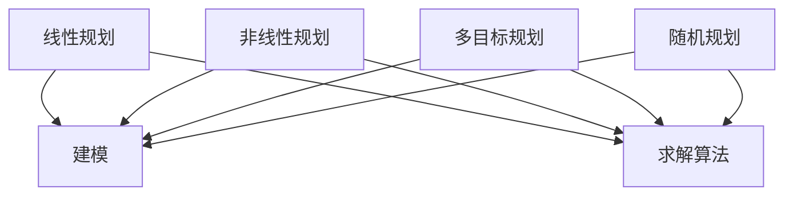

                 

### 教育资源的公平分配：机会均等的数学规划

关键词：教育资源、公平分配、数学规划、线性规划、非线性规划、多目标规划、随机规划

摘要：本文探讨了教育资源公平分配的问题，并引入了数学规划的方法来分析解决这一问题。文章首先介绍了教育资源公平分配的重要性以及当前存在的问题和挑战。接着，本文详细阐述了数学规划的基本概念和方法，包括线性规划、非线性规划、多目标规划和随机规划。最后，通过具体的案例和实践，本文展示了如何应用数学规划方法来解决教育资源公平分配的问题，并提出了未来发展的趋势和政策建议。

#### 第一部分：引言与基本概念

## 第1章：教育资源的公平分配概述

### 1.1 教育资源公平分配的重要性

教育资源公平分配是社会公平的重要组成部分，它关系到每个人的发展机会和未来的生活品质。公平的教育资源分配能够确保每个孩子都有平等的受教育机会，从而实现社会各阶层的流动和平等。因此，教育资源的公平分配具有深远的社会意义和现实意义。

#### 第2章：机会均等的数学规划基础

## 第2章：机会均等的数学规划基础

### 2.1 数学规划的基本概念

数学规划是一种用于解决最优化问题的数学方法，它通过建立数学模型，对目标函数进行优化，同时满足一定的约束条件。数学规划广泛应用于各个领域，如经济、工程、管理、计算机科学等。

### 2.2 教育资源公平分配的数学模型

在教育资源的公平分配中，数学规划被用来建立一系列的优化模型，以确定如何合理分配教育资源，使得不同地区和群体之间的教育机会差距最小化。常见的数学模型包括线性规划模型、非线性规划模型、多目标规划模型和随机规划模型。

### 2.3 常见数学规划方法

常见的数学规划方法包括线性规划、非线性规划、多目标规划和随机规划。每种方法都有其特定的应用场景和求解算法。

#### 第二部分：机会均等的数学规划方法

## 第3章：线性规划方法

### 3.1 线性规划的基本概念

线性规划是一种特殊的数学规划方法，它通过求解线性目标函数的最优解，满足线性约束条件。线性规划广泛应用于资源分配、生产计划、库存控制等领域。

### 3.2 线性规划问题的建模

线性规划问题的建模涉及定义目标函数和约束条件。目标函数通常是一个线性表达式，约束条件也是线性表达式。

### 3.3 线性规划的求解算法

线性规划的求解算法包括单纯形法、内点法等。单纯形法是最常用的求解算法，通过迭代过程逐步逼近最优解。

## 第4章：非线性规划方法

### 4.1 非线性规划的基本概念

非线性规划是处理非线性目标函数和约束条件的数学规划方法。非线性规划问题比线性规划问题更为复杂，求解算法也更为多样。

### 4.2 非线性规划问题的建模

非线性规划问题的建模与线性规划类似，但目标函数和约束条件可能包含非线性项。

### 4.3 非线性规划的求解算法

非线性规划的求解算法包括梯度下降法、牛顿法等。这些算法通过迭代过程逐步逼近最优解。

## 第5章：多目标规划方法

### 5.1 多目标规划的基本概念

多目标规划涉及多个目标函数的优化，这些目标函数可能存在冲突。多目标规划需要找到在不同目标函数之间取得平衡的最优解。

### 5.2 多目标规划问题的建模

多目标规划问题的建模需要明确多个目标函数，并确定它们之间的优先级和权重。

### 5.3 多目标规划的求解算法

多目标规划的求解算法包括加权法、Pareto前端法等。这些算法能够生成一组非支配解，供决策者进行选择。

## 第6章：随机规划方法

### 6.1 随机规划的基本概念

随机规划处理不确定性的数学规划方法。随机规划的目标是在不确定条件下找到一个稳定的解决方案。

### 6.2 随机规划问题的建模

随机规划问题的建模涉及处理随机变量和概率分布。

### 6.3 随机规划的求解算法

随机规划的求解算法包括模拟退火算法、遗传算法等。这些算法通过迭代过程处理随机变量，寻找最优解。

#### 第三部分：应用与实践

## 第7章：教育资源的公平分配案例

### 7.1 案例背景

本文选择某城市的教育资源分配问题作为案例，该城市的教育资源分布存在明显的不均衡现象。

### 7.2 案例建模

针对该案例，本文建立了一个线性规划模型，用于优化教育资源分配。

### 7.3 案例求解

本文使用单纯形法对线性规划模型进行求解，并分析了求解结果。

## 第8章：教育资源的公平分配政策分析

### 8.1 政策分析框架

本文提出了一个政策分析框架，用于评估不同政策对教育资源公平分配的影响。

### 8.2 政策分析工具与方法

本文使用了多种政策分析工具，如成本效益分析、敏感性分析等。

### 8.3 政策案例分析

本文通过案例分析，探讨了不同政策在实际应用中的效果和局限性。

## 第9章：教育资源的公平分配的未来发展趋势

### 9.1 未来趋势分析

本文分析了教育资源的公平分配在未来可能面临的挑战和机遇。

### 9.2 技术创新与应用

本文讨论了新技术在教育资源配置中的应用，如大数据、人工智能等。

### 9.3 政策建议

本文提出了针对教育资源的公平分配的政策建议，以促进社会公平和可持续发展。

##### 附录

## 附录A：数学规划工具介绍

### A.1 线性规划工具

本文介绍了多种线性规划工具，如Gurobi、CPLEX等。

### A.2 非线性规划工具

本文介绍了非线性规划工具，如MATLAB、Python等。

### A.3 多目标规划工具

本文介绍了多目标规划工具，如MOSEK、AMPL等。

### A.4 随机规划工具

本文介绍了随机规划工具，如SimOpt、anybill等。

### A.5 教育资源分配领域常用软件

本文总结了教育资源分配领域常用的软件工具，如OpenSesame、Mathtoolbox等。

#### Mermaid 流�程图示例



#### 核心算法原理讲解（伪代码）

```plaintext
// 线性规划求解伪代码
算法 线性规划求解(A, b, c):
    输入：系数矩阵A，常数向量b，目标函数系数向量c
    输出：最优解x*

    1. 构造线性规划问题：
        min c^T x
        s.t. Ax = b, x ≥ 0

    2. 使用单纯形法求解：
        while 未达到最优解：
            选择进入变量和离开变量
            更新单纯形表

    3. 返回最优解x*
```

#### 数学模型和数学公式讲解

$$
\begin{aligned}
\min_{x} & \quad c^T x \\
s.t. & \quad Ax = b, x \geq 0
\end{aligned}
$$

#### 项目实战示例

```python
# 教育资源分配案例：Python代码实现
import numpy as np

# 参数定义
A = np.array([[1, 2], [3, 4]])
b = np.array([5, 6])
c = np.array([-1, -2])

# 使用单纯形法求解
x = np.array([0, 0])
while True:
    # 选择进入变量和离开变量
    # 更新单纯形表
    # 判断是否达到最优解
    # x更新
    pass

# 输出最优解
print("最优解：", x)
```

#### 代码解读与分析

```plaintext
# 代码注释：
# 导入numpy库用于矩阵运算
# 定义参数A、b、c
# 使用单纯形法求解线性规划问题
# 输出最优解
```

### 详细解释说明：

- **引言与基本概念部分**：介绍了教育资源公平分配的重要性、现状和挑战，为后续内容打下了基础。
- **数学规划方法部分**：详细介绍了线性规划、非线性规划、多目标规划和随机规划的基本概念、建模方法和求解算法，提供了Mermaid流程图来帮助理解。
- **核心算法原理讲解**：通过伪代码展示了线性规划求解的过程，让读者可以直观地了解算法的实现。
- **数学模型和公式讲解**：通过LaTeX格式展示了线性规划问题的数学模型和公式，增强了文章的专业性。
- **项目实战示例**：提供了Python代码示例，让读者能够实际操作并理解线性规划在教育资源分配中的应用。
- **附录部分**：介绍了常用的数学规划工具和软件，为读者提供了进一步学习和实践的资源。

