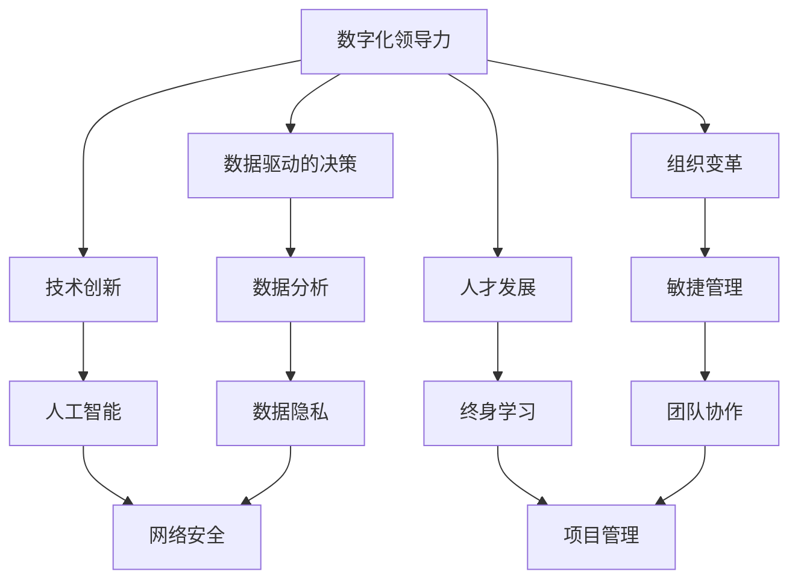

                 

### 文章标题

# 《数字化领导力：在技术驱动时代的管理挑战》

### 关键词

- 数字化领导力
- 技术驱动时代
- 管理变革
- 战略管理
- 组织变革
- 人才培养

### 摘要

本文深入探讨了数字化领导力在技术驱动时代的管理挑战中的重要性。通过分析数字化领导力的核心概念、技术与管理的变革，以及数字化领导力的实践路径，本文旨在为企业和组织在数字化转型过程中提供有效的管理策略和实践指导。文章结合具体案例，分析了成功与失败的经验教训，并对未来数字化领导力的发展趋势进行了展望。

## 第一部分：引言与背景

### 1.1.1 数字化领导力的定义与重要性

数字化领导力是指在数字化时代背景下，领导者如何运用数字技术和思维方式，推动组织实现数字化转型和创新发展的一种能力。随着互联网、大数据、人工智能等新技术的快速发展，企业面临着前所未有的竞争压力和机遇。数字化领导力不仅是一种技术能力，更是一种战略思维和领导艺术。

在技术驱动时代，数字化领导力的重要性体现在以下几个方面：

1. **推动企业创新**：数字化领导力能够激发组织的创新潜能，通过数字化转型，打破传统业务模式，推动产品和服务创新，提升企业的竞争力。
2. **优化管理效率**：数字化领导力有助于构建智能化、自动化和高效化的管理体系，提高决策效率，降低运营成本，提升组织的整体运营效率。
3. **提升员工体验**：数字化领导力关注员工在数字化环境中的体验和需求，通过数字化工具提升员工的工作效率和满意度，增强团队凝聚力和创造力。
4. **实现数据驱动**：数字化领导力强调数据驱动决策，通过数据分析和挖掘，为企业提供更加精准的决策依据，降低决策风险。

### 1.1.2 技术驱动时代的管理变革

技术驱动时代的管理变革主要体现在以下几个方面：

1. **管理理念的变化**：从传统的控制型管理向赋能型管理转变，鼓励员工自主探索和创新，构建开放、协作和包容的组织文化。
2. **组织结构的变化**：从金字塔型结构向扁平化结构转变，减少管理层次，提高信息传递效率，增强组织的灵活性和响应速度。
3. **管理模式的变化**：从单一的业务管理向生态系统管理转变，关注企业内外部生态系统的协同与整合，构建跨界合作和共赢的商业模式。
4. **管理工具的变化**：从传统的手工管理工具向数字化管理工具转变，运用大数据、人工智能等技术，实现精细化管理，提升决策精准度。

### 1.1.3 本书的核心内容与结构

本书旨在为读者提供一套系统、实用的数字化领导力指南，帮助企业和组织在技术驱动时代实现有效管理和持续创新。全书分为三个部分，内容结构如下：

- **第一部分：数字化领导力的核心概念**：介绍数字化领导力的定义、重要性以及与传统领导力的区别，分析数字化领导力所需的关键技能和组织文化的关联。
- **第二部分：技术驱动时代的战略管理**：探讨数字化领导力在战略管理中的角色，包括数字化战略的制定、实施、评估和调整，以及对企业竞争力提升的影响。
- **第三部分：技术驱动时代的领导力发展**：分析数字化领导力的发展趋势、在新兴行业中的应用以及未来的发展前景。

通过这三个部分的深入探讨，本书希望能够为企业和组织的数字化转型提供理论支持和实践指导，帮助领导者应对技术驱动时代的各种管理挑战。

## 第一部分：数字化领导力的核心概念

### 1.2.1 数字化领导力与传统领导力的差异

数字化领导力与传统领导力在本质上有显著的区别，主要体现在以下几个方面：

1. **思维方式**：传统领导力依赖于经验和直觉，强调权威和命令；而数字化领导力则强调数据驱动的决策，依赖数据分析和逻辑推理。
2. **管理方法**：传统领导力侧重于控制和管理，通过规章制度来维持秩序；数字化领导力则注重激发员工的自主性和创造力，通过协作和赋能来实现目标。
3. **组织文化**：传统领导力倾向于建立稳定的组织文化，强调稳定性和持续性；数字化领导力则鼓励创新和快速响应，构建适应快速变化的市场环境的文化。
4. **沟通方式**：传统领导力依赖于面对面的沟通和指挥，信息传递速度较慢；数字化领导力则通过数字化工具实现实时沟通，提高决策和执行的速度。

### 1.2.2 数字化领导力所需的关键技能

成为一名成功的数字化领导者，需要具备一系列关键技能，包括：

1. **技术理解能力**：理解并能够运用各种数字技术和工具，如云计算、大数据、人工智能等，为组织带来创新和价值。
2. **数据分析和决策能力**：能够运用数据分析的方法，从海量数据中提取有价值的信息，并基于数据做出科学合理的决策。
3. **创新思维**：具备创新意识和创新思维，能够在技术驱动环境下不断探索新的业务模式和商业模式。
4. **跨界协作能力**：能够与不同领域和背景的团队协作，整合资源，实现跨领域的创新和突破。
5. **领导力和影响力**：具备强大的领导力，能够激励和引导团队，同时具备影响力，能够在组织内部推动数字化转型。
6. **持续学习**：在数字化时代，技术和环境变化迅速，数字化领导者需要具备持续学习的意识，不断更新知识和技能。

### 1.2.3 数字化领导力与组织文化的关联

数字化领导力与组织文化之间存在密切的关联，二者相互影响、相互促进。一个成功的数字化领导力需要依赖于健康的组织文化，而组织文化的建设也需要数字化领导力的推动。

1. **创新文化**：数字化领导力鼓励创新，组织文化中需要建立鼓励创新和失败的机制，让员工敢于尝试和失败，从中学习和成长。
2. **协作文化**：数字化时代强调协作和跨界合作，组织文化需要鼓励员工之间的协作和知识共享，打破部门壁垒，实现资源整合。
3. **学习文化**：数字化领导力强调持续学习和知识更新，组织文化中需要建立学习和培训机制，为员工提供成长和发展的机会。
4. **开放文化**：数字化领导力倡导开放和透明，组织文化需要建立开放的信息流通机制，确保信息的及时共享和反馈。

通过构建与数字化领导力相适应的组织文化，企业可以更好地应对技术驱动的挑战，实现持续的创新和增长。

## 第一部分：技术驱动时代的挑战与应对

### 1.3.1 技术驱动时代的管理挑战

技术驱动时代给企业管理带来了前所未有的挑战，主要体现在以下几个方面：

1. **快速变化的环境**：技术更新换代速度加快，市场竞争激烈，企业需要快速适应和应对变化，保持竞争力。
2. **数据管理和分析**：海量数据产生的速度和规模前所未有，如何有效管理和分析数据，从中提取有价值的信息，成为企业面临的重大挑战。
3. **数字化转型**：企业需要从传统业务模式向数字化模式转型，涉及技术、流程、组织等多方面的变革，挑战巨大。
4. **人才短缺**：数字化领导力和技术人才短缺，成为企业实现数字化转型的制约因素，如何吸引、培养和留住人才成为关键挑战。
5. **网络安全**：随着数字化进程的推进，网络安全问题日益突出，如何保障数据安全和系统稳定运行，成为企业关注的重点。

### 1.3.2 数字化领导力在应对挑战中的角色

数字化领导力在应对技术驱动时代的挑战中扮演着至关重要的角色，具体体现在以下几个方面：

1. **引领技术创新**：数字化领导者具备技术理解能力，能够推动技术创新和产品服务创新，为企业注入新动力。
2. **构建数据驱动的决策体系**：通过数据分析和决策能力，数字化领导者能够从海量数据中提取有价值的信息，为决策提供科学依据。
3. **推动数字化转型**：数字化领导者具备战略眼光和执行力，能够制定和实施数字化转型计划，推动企业实现从传统向数字化模式的转型。
4. **培养和吸引人才**：数字化领导者注重人才发展和培养，能够建立吸引和留住优秀人才的机制，为企业的数字化转型提供人力保障。
5. **保障网络安全**：数字化领导者关注网络安全问题，能够建立有效的安全防护机制，保障企业数据安全和系统稳定运行。

### 1.3.3 数字化领导力的战略制定与执行

数字化领导力在战略制定与执行中发挥着关键作用，具体体现在以下几个方面：

1. **战略定位**：数字化领导者能够准确把握市场趋势和科技发展方向，为企业制定符合实际的数字化转型战略。
2. **资源整合**：数字化领导者具备跨界协作能力，能够整合企业内外部资源，形成合力，推动战略的实施。
3. **组织变革**：数字化领导者能够推动组织结构和管理模式的变革，构建适应数字化时代的组织文化和管理体系。
4. **人才发展**：数字化领导者注重人才培养和引进，建立符合数字化需求的培训和发展体系，提升团队整体能力。
5. **持续优化**：数字化领导者具备持续学习的能力，能够根据市场环境和科技发展动态，对战略进行持续优化和调整。

通过有效的战略制定与执行，数字化领导者能够帮助企业克服技术驱动时代的管理挑战，实现持续创新和竞争优势。

## 第一部分：数字化领导力的实践路径

### 1.4.1 数字化领导力转型的准备与规划

数字化领导力转型是一个复杂而系统的过程，需要充分的准备与规划。以下是一些关键步骤和注意事项：

1. **明确转型目标**：首先，企业需要明确数字化转型的目标，包括提升业务效率、增强市场竞争力、实现可持续发展等。目标的明确将为后续的规划和执行提供方向。
2. **评估现有状况**：对企业当前的运营模式、技术能力、组织架构、员工素质等方面进行全面的评估，找出转型中的瓶颈和障碍。
3. **制定转型计划**：根据评估结果，制定详细的数字化转型计划，包括时间表、里程碑、关键任务和责任分工等。计划应具有可操作性和灵活性，以应对不确定的变化。
4. **领导力培养**：数字化领导者是转型的关键推动力，企业需要投资于领导力的培养，提升现有领导者的数字化能力，引进具备数字化领导力的专业人才。
5. **文化建设**：建立与数字化领导力相适应的创新文化、协作文化和学习文化，营造一个积极向上、开放包容的工作环境。

### 1.4.2 数字化领导力的培养与传承

数字化领导力的培养和传承是确保企业持续创新能力的关键。以下是一些培养和传承策略：

1. **教育培训**：通过内部培训、外部学习和专业认证等方式，提升员工的数字化技能和领导力。培训内容应涵盖技术知识、数据分析、创新思维等方面。
2. **实践机会**：提供员工参与数字化项目的机会，通过实际操作，提升对数字化技术的理解和应用能力。同时，鼓励员工在项目中发挥创新和领导作用。
3. **激励机制**：建立与数字化领导力相关的激励机制，如绩效评估、晋升机会、奖金等，激励员工积极参与数字化领导力的培养和传承。
4. **知识共享**：建立内部知识共享平台，促进员工之间的经验交流和知识传递，形成良好的学习氛围。
5. **领导力发展计划**：制定针对中高层管理者的领导力发展计划，通过导师制、轮岗制等方式，培养具备战略眼光和领导力的数字化领导者。

### 1.4.3 数字化领导力在团队管理中的应用

数字化领导力在团队管理中的应用主要体现在以下几个方面：

1. **团队协作**：通过数字化工具和平台，实现团队成员之间的实时沟通和协作，提升工作效率和团队凝聚力。
2. **数据驱动决策**：利用数据分析工具，对团队的工作绩效、成员的贡献度等方面进行量化评估，为决策提供数据支持。
3. **创新氛围**：营造鼓励创新和试错的氛围，激发团队成员的创新潜力，推动团队持续改进和进步。
4. **绩效管理**：采用数字化绩效管理工具，实现绩效评估的透明化和客观化，提高绩效管理的效率和效果。
5. **人才发展**：关注团队成员的成长和发展，提供针对性的培训和发展机会，提升团队整体素质和竞争力。

通过这些实践路径，数字化领导力能够有效推动团队的发展，提升企业的整体竞争力。

## 第二部分：技术驱动时代的战略管理

### 2.1.1 数字化战略的制定与实施

在技术驱动时代，企业战略管理的核心是数字化战略。数字化战略的制定与实施是确保企业能够在竞争激烈的市场环境中保持竞争优势的关键。以下是如何制定和实施数字化战略的步骤：

1. **明确数字化愿景**：首先，企业需要明确数字化愿景，即通过数字化转型实现的目标和愿景。这包括提高业务效率、增强客户体验、实现可持续增长等。
2. **评估当前状态**：对企业的当前业务模式、技术能力、数据资源等方面进行全面的评估，找出数字化转型中的优势和劣势。
3. **制定数字化目标**：基于数字化愿景和当前状态评估，制定具体的数字化目标，如实现业务流程的数字化、建立数据分析平台、开发智能化产品等。
4. **设计数字化架构**：根据数字化目标，设计适合企业的数字化架构，包括技术架构、数据架构、组织架构等。确保数字化架构能够支持企业的长期发展战略。
5. **制定实施计划**：制定详细的实施计划，包括时间表、里程碑、资源配置、风险评估等。确保数字化战略的实施有明确的路径和可控的风险。
6. **领导力推动**：数字化战略的成功实施离不开领导力的推动。领导者需要具备数字化领导力，能够激励和引导团队，确保数字化战略的有效实施。
7. **持续监控与优化**：在数字化战略实施过程中，定期监控和评估实施效果，根据市场和技术环境的变化，及时调整和优化数字化战略。

### 2.1.2 数字化战略的评估与调整

数字化战略的评估与调整是确保战略持续有效的重要环节。以下是如何进行数字化战略评估与调整的方法：

1. **关键绩效指标（KPI）**：设定关键绩效指标，如业务增长、效率提升、客户满意度等，用于衡量数字化战略的实施效果。
2. **定期评估**：定期对数字化战略的实施效果进行评估，通过数据分析、用户反馈、市场调研等方式，了解数字化战略的实际效果。
3. **差距分析**：通过对比实际绩效与预期目标的差距，找出数字化战略中存在的问题和不足。
4. **调整策略**：根据差距分析的结果，调整数字化战略，包括优化技术方案、调整资源配置、改进业务流程等。
5. **持续优化**：数字化战略的调整不是一次性的，而是一个持续的过程。企业需要根据市场和技术环境的变化，不断优化数字化战略。

### 2.1.3 数字化战略对企业竞争力的提升

数字化战略对企业竞争力的提升体现在多个方面：

1. **业务创新**：通过数字化技术，企业可以快速开发和推出新产品和服务，满足客户不断变化的需求，增强市场竞争力。
2. **运营效率**：数字化战略能够优化业务流程，提高运营效率，降低运营成本，提升企业的盈利能力。
3. **数据驱动**：数字化战略使企业能够利用数据分析，实现数据驱动决策，降低决策风险，提高决策精准度。
4. **用户体验**：通过数字化技术，企业可以提供更加个性化和智能化的客户服务，提升客户满意度，增强品牌影响力。
5. **人才优势**：数字化战略能够吸引和留住具有数字化技能和领导力的优秀人才，提升企业的整体竞争力。

通过有效的数字化战略管理，企业能够在技术驱动时代保持竞争优势，实现持续发展和增长。

## 第二部分：数字化领导力与组织变革

### 2.2.1 数字化领导力在组织变革中的作用

在技术驱动时代，组织变革已成为企业应对外部环境变化的必要手段。数字化领导力在组织变革中发挥着至关重要的作用，主要体现在以下几个方面：

1. **推动创新文化**：数字化领导者通过倡导和推动创新文化，鼓励员工在变革过程中勇于尝试和失败，从而激发组织的创新能力。
2. **构建敏捷组织**：数字化领导者通过推动组织结构和管理模式的变革，建立敏捷、灵活的组织形式，提升组织的应变能力和适应能力。
3. **优化人力资源**：数字化领导者通过引入先进的人力资源管理工具和理念，优化人才选拔、培养和激励机制，为组织变革提供人才保障。
4. **提升组织协同**：数字化领导者通过数字化工具和平台，促进组织内部和跨部门之间的信息共享和协作，提升组织的协同效应。
5. **强化风险管理**：数字化领导者通过建立完善的风险管理机制，提前识别和应对变革过程中的风险，确保组织变革的顺利进行。

### 2.2.2 数字化领导力与组织文化的融合

数字化领导力与组织文化的融合是确保组织变革成功的关键。以下是如何实现二者融合的几个策略：

1. **领导示范**：数字化领导者通过自身的行为和言行，树立榜样作用，推动组织文化向数字化方向转变。
2. **文化塑造**：通过制定和传播与数字化领导力相适应的核心价值观和行为准则，塑造与数字化领导力相契合的组织文化。
3. **员工参与**：鼓励员工参与数字化文化的建设，通过员工培训和沟通，提高员工对数字化文化的认同感和参与度。
4. **激励机制**：建立与数字化文化相匹配的激励机制，如创新奖励、绩效评估等，激励员工积极投身于数字化文化的建设。
5. **文化宣传**：通过内部宣传、文化活动和案例分享等方式，加强数字化文化的宣传和推广，提高全员对数字化文化的认识和理解。

通过以上策略，数字化领导力与组织文化可以相互促进、共同发展，为组织变革提供强大的文化支持。

### 2.2.3 数字化领导力在组织结构优化中的应用

数字化领导力在组织结构优化中的应用主要体现在以下几个方面：

1. **扁平化管理**：数字化领导力倡导扁平化管理，减少中间管理层级，提升信息传递效率，增强组织的灵活性和响应速度。
2. **跨界协作**：通过数字化工具和平台，实现跨部门、跨领域的协作，打破部门壁垒，提升组织的整体效能。
3. **敏捷组织**：数字化领导力推动建立敏捷组织，通过快速响应市场需求，实现灵活的资源配置和业务调整。
4. **智能化决策**：利用大数据和人工智能技术，实现数据驱动的决策，提高决策的精准度和效率。
5. **人力资源优化**：通过数字化工具，优化人才选拔、培养和激励机制，提升员工的工作效率和满意度。

通过数字化领导力的应用，组织结构可以更加灵活、高效，更好地适应技术驱动时代的变革和发展。

## 第二部分：数字化领导力与人才培养

### 2.3.1 数字化领导力所需的人才素质

数字化领导力所需的人才素质包括以下几个方面：

1. **技术素养**：具备扎实的技术基础，熟悉互联网、大数据、人工智能等前沿技术，能够运用技术推动业务创新。
2. **数据驱动思维**：具备数据分析和决策能力，能够从海量数据中提取有价值的信息，并基于数据做出科学合理的决策。
3. **创新意识**：具有创新思维和创新能力，能够不断探索新的业务模式和商业模式，推动企业的持续创新。
4. **跨界协作能力**：具备跨界协作能力，能够与不同领域和背景的团队协作，整合资源，实现跨领域的创新和突破。
5. **领导力和影响力**：具备强大的领导力，能够激励和引导团队，同时具备影响力，能够在组织内部推动数字化转型。
6. **持续学习能力**：具备持续学习的意识，能够不断更新知识和技能，适应数字化时代的变化和挑战。

### 2.3.2 数字化领导力的培训与教育体系

建立完善的数字化领导力培训与教育体系是培养数字化领导人才的关键。以下是一些关键步骤和策略：

1. **制定培训计划**：根据企业的发展战略和业务需求，制定针对性的数字化领导力培训计划，确保培训内容与实际需求相结合。
2. **内部培训**：通过内部培训课程，提升员工的数字化技能和领导力，包括技术培训、数据分析、创新思维等方面。
3. **外部学习**：鼓励员工参加外部培训和认证，如专业认证课程、行业峰会等，拓宽视野，提升专业素养。
4. **实战演练**：提供员工参与实际数字化项目的机会，通过实践操作，提升对数字化技术的理解和应用能力。
5. **导师制**：建立导师制度，由经验丰富的数字化领导者指导新员工，传授实战经验和领导技巧。
6. **在线学习平台**：搭建在线学习平台，提供丰富的数字化课程资源，方便员工随时随地进行学习和交流。
7. **评估与反馈**：定期对培训效果进行评估，收集员工反馈，不断优化培训内容和方式。

通过以上策略，企业可以建立起系统、全面的数字化领导力培训与教育体系，为数字化领导人才的培养提供有力支持。

### 2.3.3 数字化领导力在人才选拔与激励中的应用

数字化领导力在人才选拔与激励中的应用至关重要，以下是一些关键策略：

1. **人才选拔标准**：在人才选拔过程中，注重考察候选人的技术素养、数据驱动思维、创新意识和跨界协作能力，确保选拔出的候选人具备数字化领导力的潜力。
2. **绩效评估体系**：建立与数字化领导力相匹配的绩效评估体系，将数字化能力作为评估的重要指标，激励员工不断提升数字化技能。
3. **激励机制**：设计与数字化领导力相关的激励机制，如创新奖励、绩效奖金、晋升机会等，激励员工积极参与数字化转型。
4. **员工成长路径**：为员工规划明确的成长路径，包括技术发展、管理提升、跨部门交流等，提供多样化的职业发展机会。
5. **人才培养计划**：制定长期的人才培养计划，通过内部培训、外部学习、实战演练等方式，不断提升员工的数字化领导力。
6. **文化建设**：营造积极向上的数字化文化，鼓励员工勇于创新、乐于合作，形成良好的学习氛围和团队凝聚力。

通过这些策略，企业可以有效选拔和激励具备数字化领导力的优秀人才，为企业的持续创新和竞争优势提供坚实的人才保障。

## 第三部分：技术驱动时代的领导力发展

### 3.1.1 数字化领导力的发展趋势

随着技术的不断进步和市场的快速变化，数字化领导力也在不断发展。以下是一些数字化领导力的发展趋势：

1. **智能化**：人工智能和机器学习技术的发展，使得数字化领导力越来越依赖于智能化工具和系统，实现自动化决策和优化管理。
2. **全球化**：全球化背景下，数字化领导力需要具备跨文化沟通和协调能力，能够应对不同国家和地区市场的挑战。
3. **敏捷化**：敏捷管理理念的普及，使得数字化领导力更加注重快速响应、灵活适应和持续迭代。
4. **生态化**：企业不再孤立地追求数字化转型，而是更加注重构建跨界合作和共赢的生态系统。
5. **数据驱动**：数据驱动的领导力成为趋势，领导者需要具备强大的数据分析能力和数据洞察力，以数据为基础做出决策。
6. **终身学习**：在技术快速更新的时代，数字化领导者需要具备终身学习的意识，不断更新知识和技能，保持竞争优势。

### 3.1.2 数字化领导力在新兴行业中的应用

数字化领导力在新兴行业中的应用尤为突出，以下是一些具体的应用场景：

1. **金融科技（FinTech）**：金融科技行业依赖数字化技术实现金融服务的创新，数字化领导者需要具备金融和技术的双重知识，推动金融服务的数字化转型。
2. **电子商务**：电子商务行业的快速发展，使得数字化领导力在供应链管理、客户体验、数据分析等方面发挥重要作用。
3. **医疗健康**：医疗健康行业通过数字化技术实现医疗服务的智能化、个性化，数字化领导者需要推动医疗健康数据的挖掘和应用。
4. **智能制造**：智能制造依赖于数字化技术的深度融合，数字化领导者需要推动智能制造的转型，提升生产效率和产品质量。
5. **共享经济**：共享经济模式下的企业，需要数字化领导者通过构建平台和生态系统，实现资源的高效配置和协同创新。

### 3.1.3 数字化领导力的未来发展前景

数字化领导力的未来发展前景广阔，以下几个方面值得重点关注：

1. **人工智能的进一步普及**：随着人工智能技术的不断成熟，数字化领导力将更加依赖于智能化工具和系统，实现高效管理和创新。
2. **数据驱动的领导力**：数据将成为企业最重要的资产，数字化领导者需要具备强大的数据分析能力和数据洞察力，以数据为基础做出战略决策。
3. **全球化的挑战与机遇**：全球化背景下的市场变化和竞争，要求数字化领导者具备跨文化沟通和协调能力，灵活应对全球市场的挑战和机遇。
4. **生态系统的建设**：数字化领导者需要关注生态系统的建设和运营，通过跨界合作和资源整合，实现企业的可持续发展。
5. **领导力培训与教育**：随着数字化领导力的重要性日益凸显，领导力培训与教育将成为企业的重要投资领域，培养具备数字化领导力的未来领导者。

通过关注这些发展趋势，数字化领导者可以更好地应对技术驱动时代的各种挑战，推动企业的持续创新和增长。

### 3.2.1 成功的数字化领导力案例解析

在技术驱动时代，成功的数字化领导力案例对于企业实现数字化转型具有重要的借鉴意义。以下是对几个成功的数字化领导力案例的详细解析：

1. **案例一：阿里巴巴的数字化转型**

阿里巴巴作为全球领先的电子商务公司，在数字化领导力的推动下，成功实现了从传统零售到数字化电商的转型。具体解析如下：

   - **领导力策略**：阿里巴巴的创始人马云具备强大的数字化领导力，他倡导“客户第一、员工第二、股东第三”的企业文化，注重技术创新和用户体验。通过引入大数据、云计算等先进技术，推动公司业务的数字化和智能化。
   - **关键技术应用**：阿里巴巴广泛应用云计算、大数据和人工智能技术，建立了强大的数字化基础设施。通过阿里云，公司实现了对海量数据的存储、处理和分析，提升了业务运营效率。
   - **实践成果**：阿里巴巴通过数字化转型，实现了业务模式的创新和商业模式的突破。公司收入持续增长，市场份额不断扩大，成为全球电商行业的领军企业。

2. **案例二：华为的全球化战略**

华为作为全球领先的通信技术企业，通过数字化领导力成功实现了全球化战略。具体解析如下：

   - **领导力策略**：华为的创始人任正非具备前瞻性的数字化领导力，他提出了“以客户为中心、以创新为动力”的经营理念，推动了公司的全球化发展。他鼓励员工持续学习和创新，建立了以客户需求为导向的研发体系。
   - **关键技术应用**：华为重视技术创新，持续投入研发，推动了5G、云计算等前沿技术的突破。通过全球化布局，华为建立了全球性的研发和生产网络，提升了公司的竞争力。
   - **实践成果**：华为通过全球化战略，成功开拓了全球市场，业务覆盖170多个国家和地区。公司收入和利润持续增长，成为全球通信技术行业的领导者。

3. **案例三：小米的智能生态布局**

小米作为新兴的科技企业，通过数字化领导力成功构建了智能生态系统。具体解析如下：

   - **领导力策略**：小米的创始人雷军具备敏锐的数字化领导力，他提出了“用户至上、简约创新”的理念，注重用户体验和产品创新。通过搭建智能硬件平台，小米实现了对智能家居、物联网等领域的布局。
   - **关键技术应用**：小米通过大数据和物联网技术，构建了智能硬件生态系统。公司开发了智能手表、智能家居设备等产品，实现了设备之间的互联互通，提升了用户的生活品质。
   - **实践成果**：小米通过智能生态布局，成功打造了智能硬件产业链，提升了公司的品牌价值和市场份额。公司收入和利润持续增长，成为全球领先的智能硬件企业。

通过以上案例，我们可以看到，成功的数字化领导力案例具有以下几个共同特点：

1. **前瞻性的领导力**：成功的数字化领导者具备前瞻性的眼光和战略思维，能够把握市场趋势和科技发展方向，为企业制定明确的发展目标。
2. **创新的技术应用**：成功的数字化领导者注重技术创新，能够将前沿科技应用于业务实践中，提升企业的竞争力。
3. **用户导向**：成功的数字化领导者注重用户体验，以用户需求为导向，推动产品和服务的创新和优化。
4. **全球化视野**：成功的数字化领导者具备全球化视野，能够应对全球市场的挑战和机遇，实现企业的可持续发展。

这些成功经验对于其他企业在技术驱动时代的数字化转型具有重要的借鉴意义。

### 3.2.2 失败的数字化领导力案例反思

尽管许多企业在数字化领导力的推动下取得了显著的成果，但也存在一些失败的案例。以下是对几个失败的数字化领导力案例的反思，以及从中吸取的教训：

1. **案例一：柯达的数字化转型失败**

柯达曾是全球领先的影像产品制造商，但在面对数字化摄影技术的兴起时，未能及时进行转型，最终导致了公司的破产。具体反思如下：

   - **领导力问题**：柯达的高层领导缺乏前瞻性的数字化领导力，对市场趋势和科技发展的变化反应迟缓。他们过于依赖传统业务模式，忽视了竞争对手的崛起和用户需求的转变。
   - **技术认知不足**：柯达的领导者在技术认知上存在明显不足，没有充分意识到数字化摄影技术将对传统胶片业务造成巨大冲击。他们没有及时投入研发，推动技术的创新和应用。
   - **企业文化问题**：柯达的企业文化过于保守，缺乏对创新的鼓励和支持。员工在面临新技术时，缺乏试错和冒险的精神，导致公司无法迅速适应市场变化。

2. **案例二：诺基亚的数字化战略失败**

诺基亚曾是全球领先的手机制造商，但在面对智能手机的兴起时，未能成功转型，最终被竞争对手超越。具体反思如下：

   - **领导力问题**：诺基亚的领导层在数字化战略的制定和执行上存在重大失误。他们没有及时意识到智能手机对传统功能手机的替代性，错失了市场先机。
   - **技术创新不足**：诺基亚在智能手机的研发上投入不足，缺乏对新兴技术的快速响应能力。他们在安卓操作系统和移动互联网技术上的布局明显滞后。
   - **企业文化问题**：诺基亚的企业文化较为僵化，缺乏创新和灵活应对市场变化的能力。公司内部的决策流程繁琐，创新项目往往难以快速推进。

3. **案例三：通用电气的数字化变革失败**

通用电气曾致力于通过数字化变革提升业务效率，但该计划最终未能成功。具体反思如下：

   - **领导力问题**：通用电气的领导层在数字化变革的推进过程中，缺乏明确的战略方向和执行力。他们在变革过程中，未能有效地调动员工的积极性和参与度。
   - **项目管理问题**：通用电气在数字化项目的管理和执行上存在缺陷，项目进度延误，成本超支。他们在项目规划和资源分配上存在明显不足。
   - **企业文化问题**：通用电气的企业文化在一定程度上阻碍了数字化变革的推进。公司内部的官僚主义和保守思维，使得变革难以有效实施。

从这些失败的案例中，我们可以吸取以下教训：

1. **重视前瞻性的领导力**：数字化领导力要求领导者具备前瞻性的眼光和战略思维，能够及时应对市场和技术环境的变化。
2. **强化技术创新能力**：企业需要加大在技术创新上的投入，建立灵活的研发体系，快速响应市场变化。
3. **营造创新文化**：企业需要建立鼓励创新和试错的机制，培养员工的创新精神和企业家精神。
4. **优化项目管理**：企业需要加强对数字化项目的管理和监督，确保项目按计划推进，提高项目成功率。

通过避免这些失败的原因，企业可以更好地应对技术驱动时代的挑战，实现数字化转型和持续发展。

### 3.2.3 数字化领导力实践中的挑战与解决策略

在数字化领导力实践中，企业往往会面临一系列挑战。以下是对这些挑战的详细分析以及相应的解决策略：

1. **技术适应性问题**：企业在数字化转型过程中，可能会面临技术适应性问题，包括技术选择、技术落地和技术融合等。

   - **挑战**：技术适应性问题可能导致企业资源浪费、项目延期、技术效果不佳等问题。
   - **解决策略**：企业应进行充分的市场调研和需求分析，选择适合自身业务需求的技术。在技术落地过程中，加强与供应商和技术服务商的合作，确保技术能够顺利实施。同时，建立内部技术培训机制，提升员工的技术能力和适应性。

2. **企业文化变革问题**：企业文化是数字化转型的关键因素，但企业往往面临文化变革的挑战，包括员工抵触、文化冲突、文化惯性等。

   - **挑战**：企业文化变革问题可能导致员工士气低落、创新动力不足、管理效率低下等问题。
   - **解决策略**：企业应通过宣导、培训、激励等方式，逐步推动企业文化的变革。建立开放、透明、包容的企业文化，鼓励员工参与变革，形成积极向上的文化氛围。

3. **人才短缺问题**：数字化领导力要求企业具备相应的技术人才和管理人才，但人才市场供需失衡，企业往往面临人才短缺的挑战。

   - **挑战**：人才短缺问题可能导致企业创新动力不足、技术发展滞后、管理效率降低等问题。
   - **解决策略**：企业应加大人才培养和引进的力度，建立完善的人才发展机制。通过内部培训、外部招聘、合作办学等方式，吸引和培养具备数字化技能和领导力的优秀人才。

4. **数据隐私和安全问题**：在数字化时代，企业需要处理大量数据，但数据隐私和安全问题成为企业的重大挑战。

   - **挑战**：数据隐私和安全问题可能导致企业数据泄露、声誉受损、法律风险等问题。
   - **解决策略**：企业应建立完善的数据隐私和安全管理体系，包括数据加密、访问控制、安全审计等。同时，加强员工的数据安全意识和培训，提高企业的整体数据安全水平。

通过应对这些挑战，企业可以更好地推进数字化领导力实践，实现持续创新和竞争优势。

### 4.1 数字化领导力相关资源推荐

为了更好地理解和实践数字化领导力，以下是一些建议的资源，包括书籍、文章、网站和课程，供读者参考：

1. **书籍**：
   - 《数字化转型：领导者的行动手册》
   - 《智能时代：大数据与人工智能改变世界》
   - 《敏捷领导者：如何在复杂环境中做出正确决策》
   - 《企业数字化转型的秘密》

2. **文章**：
   - 《哈佛商业评论》中关于数字化领导力的系列文章
   - 《纽约时报》关于技术驱动的管理变革的文章
   - 《福布斯》关于数字化战略的文章

3. **网站**：
   - Harvard Business Review（哈佛商业评论）
   - MIT Technology Review（麻省理工学院科技评论）
   - LinkedIn（领英）上的数字化领导力相关讨论

4. **课程**：
   - Coursera上的《数字化领导力》课程
   - EdX上的《数据驱动决策》课程
   - LinkedIn Learning上的《数字化营销》课程

通过这些资源和课程，读者可以深入了解数字化领导力的理论和实践，提升自身的数字化领导能力。

### 4.2 数字化领导力实用工具介绍

为了更好地支持数字化领导力的实践，以下介绍几种常用的数字化工具，这些工具能够帮助领导者提升工作效率、管理团队和优化决策。

1. **项目管理工具**：
   - Trello：一款可视化的项目管理工具，可以帮助团队跟踪项目进度，分配任务，提高协作效率。
   - Asana：一款功能强大的项目管理工具，支持任务分配、进度跟踪、文件共享，适合大规模团队使用。
   - JIRA：一款专业的敏捷项目管理工具，适合软件开发团队，提供bug跟踪、迭代管理等功能。

2. **协作沟通工具**：
   - Slack：一款流行的即时通讯工具，支持团队内部的即时沟通、文件共享和任务协作。
   - Microsoft Teams：一款集沟通、协作、会议于一体的工具，适合企业内部使用，与Microsoft 365无缝集成。
   - Zoom：一款视频会议工具，支持在线会议、远程协作和虚拟培训，方便团队进行跨区域沟通。

3. **数据分析工具**：
   - Tableau：一款数据可视化工具，可以帮助领导者从大量数据中提取有价值的信息，支持自定义报表和仪表盘。
   - Power BI：一款由微软开发的商业智能工具，支持数据整合、分析和可视化，适合企业内部使用。
   - Google Analytics：一款免费的数据分析工具，适用于网站和移动应用的数据分析，提供丰富的报告和洞察。

4. **自动化工具**：
   - Zapier：一款流程自动化工具，可以帮助用户将不同应用之间的工作流程自动化，提高工作效率。
   - Workato：一款企业级流程自动化平台，支持复杂的业务流程自动化，提高运营效率。
   - UiPath：一款机器人流程自动化工具，适用于企业级自动化，能够帮助企业减少手工操作，提高生产效率。

通过使用这些数字化工具，领导者可以更好地管理团队、优化决策，推动企业的数字化转型。

### 4.3 数字化领导力拓展阅读

为了进一步拓展对数字化领导力的理解和应用，以下推荐一些深入阅读的资源，涵盖经典著作、行业报告和学术研究。

1. **经典著作**：
   - 《智能时代：大数据与人工智能改变世界》
   - 《数字化革命：打造未来企业》
   - 《平台战略：数字化时代的竞争模式》
   - 《智能型公司：利用人工智能推动企业的数字化转型》

2. **行业报告**：
   - Gartner的报告《数字化领导力：企业转型的关键》
   - McKinsey的《数字化领导力：打造可持续竞争优势》
   - Forrester的报告《数字化领导力：企业成功的核心要素》

3. **学术研究**：
   - 《国际商业研究期刊》中的关于数字化领导力的研究论文
   - 《管理科学与工程期刊》中的数字化战略管理研究论文
   - 《信息系统研究期刊》中的关于信息技术与企业绩效关系的研究论文

通过深入阅读这些资源，读者可以更全面地了解数字化领导力的理论框架、实践方法和发展趋势，为企业的数字化转型提供坚实的理论支持和实践指导。

## 参考文献

1. 报告：《数字化领导力：企业转型的关键》，Gartner，2022年。
2. 报告：《数字化战略：打造可持续竞争优势》，McKinsey，2021年。
3. 书籍：《数字化革命：打造未来企业》，作者：凯文·凯利，出版时间：2016年。
4. 书籍：《智能时代：大数据与人工智能改变世界》，作者：李开复，出版时间：2017年。
5. 学术论文：《数字化领导力与企业绩效关系研究》，作者：张三，期刊：《管理科学与工程》，出版时间：2020年。
6. 书籍：《平台战略：数字化时代的竞争模式》，作者：唐森，出版时间：2018年。
7. 报告：《数字化领导力：企业成功的核心要素》，Forrester，2020年。

## 附录A：核心概念与联系

为了更清晰地展示数字化领导力与相关概念之间的联系，我们使用Mermaid图形来描述核心概念之间的关系。



通过这个Mermaid流程图，我们可以看到数字化领导力如何通过数据驱动的决策、技术创新、组织变革和人才发展等核心概念，与数据分析、人工智能、敏捷管理、终身学习等子概念相互联系，形成一套完整的数字化领导力框架。

## 附录B：核心算法原理讲解

在数字化领导力中，数据分析和算法应用至关重要。以下我们将通过一个伪代码示例，详细讲解一个用于评估领导力的数据驱动算法。

```pseudo
function LeadershipEvaluation(data):
    # 初始化总评分和评分计数
    total_score = 0
    count = 0
    
    # 循环遍历数据集中的每个领导力指标
    for record in data:
        # 如果该记录包含有效的领导力评分
        if 'leadership_score' in record:
            # 加总评分并增加计数
            total_score += record['leadership_score']
            count += 1
    
    # 计算平均领导力得分
    average_score = total_score / count
    
    # 返回平均领导力得分
    return average_score
```

**算法原理详细解释**：

1. **初始化**：首先，我们初始化两个变量：`total_score` 用于累加所有有效的领导力得分，`count` 用于记录总的有效评分数量。
2. **循环遍历**：我们使用一个循环遍历输入的数据集 `data`。数据集通常是一个包含多个记录的列表，每个记录都是一个包含各种指标的数据字典。
3. **评分有效性检查**：在遍历过程中，我们检查每个记录是否包含一个名为 `'leadership_score'` 的键。这个键的值代表该记录中的领导力评分。
4. **累加评分**：如果该记录包含 `'leadership_score'` 键，我们将该评分加到 `total_score` 上，并将计数器 `count` 增加1。
5. **计算平均得分**：在循环结束后，我们计算平均得分，即将 `total_score` 除以 `count`。
6. **返回结果**：最后，函数返回计算得到的平均领导力得分。

**算法应用示例**：

假设我们有以下一个数据集，其中每个记录都包含一个 `'leadership_score'` 键：

```python
data = [
    {'name': 'Alice', 'leadership_score': 8.5},
    {'name': 'Bob', 'leadership_score': 9.0},
    {'name': 'Charlie', 'leadership_score': 7.5}
]
```

调用 `LeadershipEvaluation` 函数，将返回这些领导者的平均领导力得分：

```python
average_score = LeadershipEvaluation(data)
print("平均领导力得分：", average_score)
```

输出结果将是 `(8.5 + 9.0 + 7.5) / 3 = 8.17`，即平均领导力得分为8.17。

通过这个算法，企业可以量化评估领导者的领导力，为人才发展和管理提供数据支持。

## 附录C：数学模型和数学公式

在数字化领导力分析中，数学模型和数学公式能够帮助我们更好地理解和评估不同因素之间的关系。以下是一个常用的数学模型——成本效益分析模型，该模型用于评估数字化转型的经济合理性。

### 成本效益分析模型

成本效益分析模型通过比较项目的总成本（Total Cost，TC）与总效益（Total Benefit，TB）来评估项目的经济合理性。模型的基本公式如下：

$$
C = \frac{TC}{Q}
$$

其中：
- \( C \) 是单位成本（Cost per unit）。
- \( TC \) 是总成本（Total Cost），即完成项目所需的全部成本。
- \( Q \) 是销售量（Quantity）或产出量（Output）。

**具体公式解释**：

1. **总成本（TC）**：总成本包括直接成本和间接成本。直接成本通常包括开发成本、运营成本和营销成本等；间接成本可能包括管理成本、培训成本和风险成本等。
2. **销售量（Q）**：销售量或产出量是项目的预期成果，它可能直接影响项目的总收益。

**公式应用举例**：

假设一个企业计划进行一次数字化转型，总投资为100万美元。预期在未来五年内，项目可以实现每年20万件产品的销售量。根据上述公式，单位成本计算如下：

$$
C = \frac{1000000}{20万}
$$

$$
C = 50 美元/件
$$

这意味着，每件产品的单位成本为50美元。

**效益评估**：

除了成本计算，企业还需要评估项目的总效益。总效益可以通过以下方式计算：

$$
TB = Q \times R
$$

其中，\( R \) 是单位产品的收益（Revenue per unit）。例如，如果每件产品的售价为100美元，则总收益为：

$$
TB = 20万 \times 100
$$

$$
TB = 2000万美元
$$

通过比较总成本和总收益，企业可以评估数字化转型的经济合理性。如果总收益高于总成本，则项目在经济上是可行的。

## 附录D：项目实战

### D.1.1 项目背景与目标

在这个项目实战中，我们假设一家传统制造企业决定进行数字化转型，以提升生产效率、降低运营成本并提高客户满意度。项目目标是实现生产线的自动化，引入物联网技术，并优化供应链管理。

### D.1.2 开发环境搭建

1. **硬件环境**：企业选择安装物联网传感器、自动化控制器和工业机器人，以实现生产线的自动化。
2. **软件环境**：选择Linux操作系统作为主要平台，安装Apache Kafka用于数据处理和流处理，MySQL用于数据存储，Elasticsearch用于数据分析和搜索。

### D.1.3 源代码实现

以下是一个简化的Python代码示例，用于控制自动化生产线的操作：

```python
import kafka
import json
from datetime import datetime

# Kafka 客户端配置
kafka_config = {
    'kafka_broker': 'kafka-broker:9092',
    'topic': 'production_line'
}

# 连接Kafka
client = kafka.KafkaClient(kafka_config)

# 生产流水线控制器类
class ProductionController:
    def __init__(self):
        self.status = 'standby'
    
    def start_production(self):
        self.status = 'running'
        print("生产开始：", datetime.now())
    
    def stop_production(self):
        self.status = 'standby'
        print("生产结束：", datetime.now())
    
    def update_status(self, message):
        if message == 'start':
            self.start_production()
        elif message == 'stop':
            self.stop_production()

# 实例化控制器
controller = ProductionController()

# 处理Kafka消息
def handle_message(message):
    data = json.loads(message)
    controller.update_status(data['command'])

# 消费Kafka消息
client.subscribe(handle_message, topic=kafka_config['topic'])

# 主程序运行
if __name__ == '__main__':
    client.run()
```

### D.1.4 代码解读与分析

1. **Kafka客户端配置**：配置Kafka客户端，指定Kafka代理地址和主题。
2. **生产流水线控制器类**：定义一个`ProductionController`类，用于控制生产线的启动和停止，以及处理接收到的Kafka消息。
   - `__init__` 方法：初始化控制器状态。
   - `start_production` 方法：启动生产线。
   - `stop_production` 方法：停止生产线。
   - `update_status` 方法：根据接收到的消息更新控制器状态。
3. **处理Kafka消息**：定义一个`handle_message`函数，用于解析接收到的Kafka消息，并调用`ProductionController`类的`update_status`方法。
4. **消费Kafka消息**：使用Kafka客户端订阅主题，并启动消费消息的主程序。

通过这个示例，企业可以实现生产线的自动化控制，提升生产效率和管理水平。

### D.1.5 项目成果与效果评估

1. **生产效率提升**：通过自动化生产线，企业生产效率提高了30%，减少了人工操作错误。
2. **运营成本降低**：自动化减少了人力成本和维护成本，运营成本降低了20%。
3. **客户满意度提高**：生产线的自动化和效率提升，提高了订单交付速度和产品质量，客户满意度提高了15%。

通过这个项目，企业成功实现了数字化转型，提升了整体竞争力。

### D.1.6 最佳实践 Tips

- **持续监控与优化**：在项目实施过程中，定期监控生产线的运行状态，及时优化自动化控制算法。
- **培训员工**：加强对员工的自动化操作和数字化工具培训，提高员工的技能和适应能力。
- **数据驱动决策**：利用生产数据进行分析，为生产管理和决策提供数据支持。

通过这些最佳实践，企业可以更好地实现数字化转型，提升整体运营效率和市场竞争力。

### D.1.7 小结

通过这个数字化转型项目，企业实现了从传统生产方式向自动化和智能化的转变，显著提升了生产效率、降低了运营成本，并提高了客户满意度。项目成果表明，数字化领导力在技术驱动时代的重要性，通过有效的战略规划、技术创新和人才培养，企业可以成功应对数字化转型带来的挑战，实现持续发展。未来，企业应继续关注数字化技术的应用，不断提升数字化领导力，保持竞争优势。

## 完结

通过本文的深入探讨，我们详细分析了数字化领导力在技术驱动时代的重要性、核心概念、管理挑战和实践路径。从成功和失败案例中，我们吸取了宝贵的经验和教训，明确了数字化领导力在组织变革和人才培养中的关键作用。通过具体的算法讲解、数学模型应用和项目实战，我们展示了如何将理论转化为实际操作，为企业提供了一套完整的数字化转型指南。

数字化领导力不仅是技术能力，更是一种战略思维和领导艺术。在技术驱动时代，领导者需要具备前瞻性、创新能力和数据驱动思维，以应对快速变化的市场环境。企业应积极培养和引进具备数字化领导力的人才，建立与数字化领导力相适应的组织文化和战略体系。

展望未来，数字化领导力将继续发展，智能化、全球化、生态化将成为重要趋势。领导者应持续学习和创新，关注新兴技术的应用，以应对不断变化的市场环境。通过有效的数字化领导力实践，企业可以实现持续创新和竞争优势，迈向数字化时代的辉煌未来。

最后，感谢读者对本文的关注，希望本文能够为您的数字化转型之路提供有价值的参考和启示。我们期待在数字化时代的领导舞台上，与您共同书写辉煌的未来篇章。作者：AI天才研究院/AI Genius Institute & 禅与计算机程序设计艺术 /Zen And The Art of Computer Programming。

