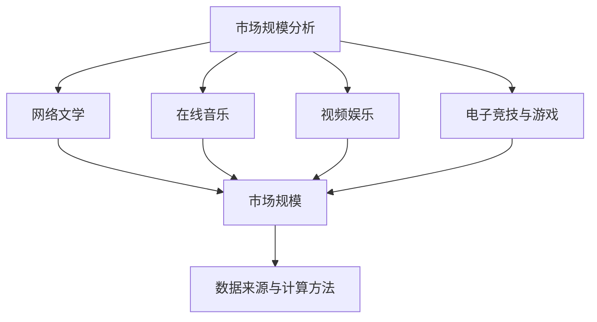
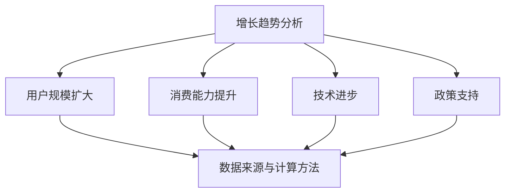
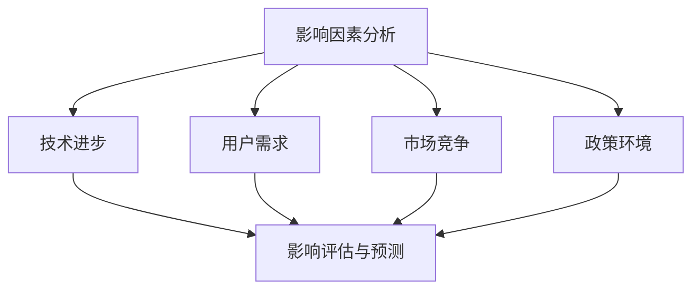

                 

### 文章标题：数字文化市场分析与趋势预测

> 关键词：数字文化市场、发展趋势、技术影响、商业模式、案例分析

> 摘要：本文将深入探讨数字文化市场的定义与特点、发展背景与核心要素，并通过分析市场规模与增长、用户需求与行为、竞争格局与市场地位，对数字文化市场的核心领域进行详细解析。此外，本文还将预测数字文化市场的未来趋势，分析技术对市场的影响，并提出应对挑战的策略。通过成功与失败案例分析，总结经验与教训，为数字文化市场的发展提供战略建议。

### 目录大纲

#### 第一部分：数字文化市场基础

##### 第1章：数字文化市场概述

##### 1.1 数字文化市场的定义与特点

##### 1.2 数字文化市场的发展背景

##### 1.3 数字文化市场的核心要素

##### 1.4 数字文化市场的发展趋势

##### 第2章：数字文化市场分析框架

##### 2.1 市场规模与增长分析

##### 2.2 用户需求与行为分析

##### 2.3 竞争格局与市场地位分析

##### 2.4 技术创新与市场影响分析

##### 第3章：数字文化市场核心领域分析

##### 3.1 网络文学与电子书

##### 3.2 在线音乐与音频

##### 3.3 视频娱乐与直播

##### 3.4 电子竞技与游戏

##### 第4章：数字文化市场商业模式分析

##### 4.1 资本市场与投资分析

##### 4.2 内容创业与电商模式

##### 4.3 知识付费与虚拟经济

##### 4.4 数字文化IP的衍生与运营

#### 第二部分：数字文化市场趋势预测

##### 第5章：技术趋势对数字文化市场的影响

##### 5.1 人工智能与大数据分析

##### 5.2 5G与物联网技术的应用

##### 5.3 虚拟现实与增强现实的发展

##### 5.4 区块链技术的影响

##### 第6章：市场趋势预测与机遇

##### 6.1 全球数字文化市场的未来发展

##### 6.2 中国数字文化市场的增长动力

##### 6.3 区域性数字文化市场的发展分析

##### 6.4 行业细分领域的趋势预测

##### 第7章：数字文化市场面临的挑战与应对策略

##### 7.1 监管政策与合规要求

##### 7.2 内容安全与版权保护

##### 7.3 技术风险与网络安全

##### 7.4 经济环境与市场波动

##### 第8章：案例分析

##### 8.1 成功案例分析

##### 8.2 失败案例分析

##### 8.3 经验与教训总结

##### 8.4 未来展望与战略建议

#### 附录

##### 附录A：研究方法与工具

##### 附录B：参考文献

##### 附录C：数据来源与说明

##### 附录D：相关术语解释

### 第1章：数字文化市场概述

#### 1.1 数字文化市场的定义与特点

数字文化市场是指通过互联网等数字技术，提供和传播文化内容、文化产品和服务的一个新兴市场。这个市场涵盖了网络文学、电子书、在线音乐、视频娱乐、直播、电子竞技与游戏等多个领域。其主要特点包括数字化、多样化、互动性和高效性。

1. **数字化**：数字文化市场的核心是数字化内容的生产、传输和消费。数字化技术的应用使得文化产品可以快速、大规模地传播，极大地提升了市场效率。

2. **多样化**：数字文化市场提供了丰富的文化产品和服务，从文学作品、音乐、视频到游戏、电子竞技，满足了不同用户群体的多样化需求。

3. **互动性**：数字文化市场的互动性使得用户不仅仅是内容的消费者，也可以成为内容的创造者。例如，用户可以通过弹幕、评论等方式参与到内容的创作和讨论中。

4. **高效性**：数字文化市场的生产、传播和消费过程高度高效。数字技术的应用使得内容可以即时生产、即时传输、即时消费，极大地缩短了内容的生产周期。

#### 1.2 数字文化市场的发展背景

数字文化市场的发展背景主要可以从以下几个方面进行探讨：

1. **互联网的普及**：随着互联网的普及，越来越多的用户可以方便地访问网络，这为数字文化市场的兴起提供了基础。

2. **科技进步**：数字技术的快速发展，特别是人工智能、大数据、云计算等技术的应用，为数字文化市场的创新提供了技术支持。

3. **消费升级**：随着人们生活水平的提高，对文化产品的需求也在不断升级。数字文化市场通过提供高质量、多样化的文化产品，满足了人们日益增长的文化需求。

4. **政策支持**：政府对数字文化市场的支持也是其发展的重要推动力。例如，一系列鼓励数字文化产业发展、保护知识产权的政策和法规的出台，为数字文化市场的健康发展提供了保障。

#### 1.3 数字文化市场的核心要素

数字文化市场的核心要素主要包括以下几个方面：

1. **内容创作者**：数字文化市场的核心是高质量的内容创作。内容创作者是市场的主要驱动力，他们通过创作各种文化产品，满足了用户的需求。

2. **技术平台**：技术平台是数字文化市场的重要支撑。这些平台提供了内容传输、用户互动、数据分析等基础服务，使得数字文化市场可以高效运行。

3. **用户需求**：用户需求是数字文化市场的核心驱动力。只有深入了解用户需求，提供符合用户需求的文化产品，才能在市场中脱颖而出。

4. **商业模式**：商业模式是数字文化市场盈利的关键。通过创新商业模式，可以实现高效的市场运营和盈利。

#### 1.4 数字文化市场的发展趋势

数字文化市场的发展趋势可以从以下几个方面进行预测：

1. **市场规模持续扩大**：随着互联网的普及和技术的发展，数字文化市场的规模将持续扩大。预计未来几年，数字文化市场的增长将保持高速。

2. **技术创新推动市场发展**：人工智能、大数据、5G等新技术的应用，将推动数字文化市场的创新和发展。

3. **融合跨界**：数字文化市场将与其他产业进行深度融合，如与旅游、教育、娱乐等产业的跨界合作，将带来新的市场机遇。

4. **用户需求多样化**：随着用户需求的不断升级，数字文化市场将提供更多个性化、定制化的文化产品和服务。

5. **政策环境日益完善**：随着政府对数字文化市场的支持力度加大，政策环境将日益完善，为数字文化市场的健康发展提供保障。

### 第2章：数字文化市场分析框架

#### 2.1 市场规模与增长分析

**2.1.1 市场规模分析**

数字文化市场的市场规模可以通过对多个核心领域的市场规模进行分析。根据最新数据，全球数字文化市场的规模已经达到数百亿美元。其中，网络文学、在线音乐、视频娱乐、电子竞技与游戏等领域占据了主要份额。以下是一个简化的市场规模分析流程图：

**2.1.2 增长趋势分析**

数字文化市场的增长趋势可以从以下几个方面进行预测：

1. **用户规模持续扩大**：随着互联网的普及和智能手机的普及，数字文化市场的用户规模将持续扩大。

2. **消费能力提升**：随着人们生活水平的提高，对数字文化产品的消费能力也将提升。

3. **技术进步**：人工智能、大数据、5G等新技术的应用，将提升数字文化市场的运行效率，推动市场增长。

4. **政策支持**：政府对数字文化市场的支持力度将加大，为市场发展提供良好的政策环境。

以下是一个简化的增长趋势分析流程图：

**2.1.3 影响因素分析**

数字文化市场的增长受到多种因素的影响，主要包括：

1. **技术进步**：新技术的应用将提升数字文化市场的运行效率，推动市场增长。

2. **用户需求**：用户需求的多样化和个性化，将推动数字文化市场提供更多创新产品和服务。

3. **市场竞争**：激烈的市场竞争将促使企业不断创新，提升市场竞争力。

4. **政策环境**：政府的政策支持和监管，将影响数字文化市场的发展方向和速度。

以下是一个简化的影响因素分析流程图：

### 第3章：数字文化市场核心领域分析

#### 3.1 网络文学与电子书

**3.1.1 网络文学概述**

网络文学是指通过互联网平台发布和传播的文学作品，包括小说、散文、诗歌等多种形式。网络文学具有以下特点：

1. **互动性强**：网络文学作者与读者之间的互动性强，读者可以通过评论、弹幕等方式参与到作品的创作和讨论中。

2. **更新速度快**：网络文学的生产和传播速度较快，作者可以实时更新作品，读者可以随时阅读最新内容。

3. **多样性**：网络文学涵盖了多种题材和风格，满足了不同读者群体的需求。

**3.1.2 电子书概述**

电子书是指通过电子设备阅读的数字化图书。电子书具有以下优点：

1. **便携性**：电子书可以存储在电子设备中，方便携带和阅读。

2. **环保**：电子书减少了纸张的使用，有利于环保。

3. **价格优势**：相对于传统纸质书，电子书通常价格较低。

**3.1.3 市场现状与趋势**

1. **市场规模持续扩大**：随着互联网的普及和电子设备的普及，网络文学和电子书的市场规模持续扩大。

2. **用户需求多样化**：用户对网络文学和电子书的需求越来越多样化，包括题材、风格、内容等方面。

3. **技术创新推动发展**：人工智能、大数据等新技术在网络文学和电子书领域的应用，将推动市场发展。

**3.1.4 商业模式分析**

网络文学和电子书的商业模式主要包括以下几种：

1. **广告模式**：通过在平台上投放广告获得收入。

2. **付费阅读模式**：用户付费阅读网络文学或电子书。

3. **版权交易模式**：网络文学和电子书的版权交易，包括影视改编权、游戏改编权等。

#### 3.2 在线音乐与音频

**3.2.1 在线音乐概述**

在线音乐是指通过互联网平台提供和传播的音乐内容，包括歌曲、专辑、音乐会等。在线音乐具有以下特点：

1. **多样性**：在线音乐平台提供了丰富的音乐内容，涵盖了多种风格和流派。

2. **个性化推荐**：基于用户听歌历史和偏好，平台可以提供个性化的音乐推荐。

3. **社交互动**：用户可以在平台上分享音乐、评论音乐，与其他用户互动。

**3.2.2 音频概述**

音频包括播客、有声书、广播等多种形式。音频具有以下特点：

1. **便捷性**：用户可以在任何时间、任何地点收听音频内容。

2. **知识性**：音频内容通常具有知识性，如播客、有声书等。

3. **教育性**：音频内容可以用于教育、培训等场景。

**3.2.3 市场现状与趋势**

1. **市场规模持续扩大**：随着互联网的普及和智能手机的普及，在线音乐和音频的市场规模持续扩大。

2. **用户需求多样化**：用户对在线音乐和音频的需求越来越多样化，包括音乐、知识、教育等方面。

3. **技术创新推动发展**：人工智能、大数据等新技术在在线音乐和音频领域的应用，将推动市场发展。

**3.2.4 商业模式分析**

在线音乐和音频的商业模式主要包括以下几种：

1. **广告模式**：通过在平台上投放广告获得收入。

2. **付费订阅模式**：用户付费订阅平台的服务，获得更多的音乐或音频内容。

3. **版权交易模式**：在线音乐和音频的版权交易，包括音乐版权、有声书版权等。

#### 3.3 视频娱乐与直播

**3.3.1 视频娱乐概述**

视频娱乐包括电影、电视剧、网络剧等多种形式。视频娱乐具有以下特点：

1. **视听体验**：视频娱乐通过视听手段，为用户提供丰富的娱乐体验。

2. **互动性**：用户可以在视频播放过程中进行评论、弹幕互动等。

3. **多样性**：视频娱乐涵盖了多种题材和风格，满足了不同用户的需求。

**3.3.2 直播概述**

直播是一种实时传输视频内容的形式，用户可以实时观看和参与。直播具有以下特点：

1. **实时性**：直播具有实时性，用户可以即时观看和参与。

2. **互动性**：直播中的用户可以通过评论、送礼物等方式与主播互动。

3. **个性化**：直播内容可以根据用户的偏好进行个性化推荐。

**3.3.3 市场现状与趋势**

1. **市场规模持续扩大**：随着互联网和智能手机的普及，视频娱乐和直播的市场规模持续扩大。

2. **用户需求多样化**：用户对视频娱乐和直播的需求越来越多样化，包括娱乐、知识、教育等方面。

3. **技术创新推动发展**：人工智能、大数据等新技术在视频娱乐和直播领域的应用，将推动市场发展。

**3.3.4 商业模式分析**

视频娱乐和直播的商业模式主要包括以下几种：

1. **广告模式**：通过在平台上投放广告获得收入。

2. **付费观看模式**：用户付费观看视频内容或直播。

3. **会员模式**：用户付费成为会员，享受更多的特权。

4. **电商模式**：在视频娱乐和直播平台上进行商品销售。

#### 3.4 电子竞技与游戏

**3.4.1 电子竞技概述**

电子竞技是指通过互联网或其他电子设备进行的竞技性游戏比赛。电子竞技具有以下特点：

1. **竞技性**：电子竞技强调竞争性和公平性，选手通过竞技手段争夺胜利。

2. **观赏性**：电子竞技比赛具有高度的观赏性，吸引了大量观众。

3. **全球化**：电子竞技比赛通常在全球范围内进行，吸引了来自世界各地的选手和观众。

**3.4.2 游戏概述**

游戏是指通过电子设备进行娱乐的活动。游戏具有以下特点：

1. **多样性**：游戏涵盖了多种类型，如角色扮演、策略、射击等。

2. **互动性**：游戏中的玩家可以与其他玩家互动，体验合作或对抗。

3. **社交性**：游戏可以促进玩家的社交互动，形成社交网络。

**3.4.3 市场现状与趋势**

1. **市场规模持续扩大**：随着电子竞技和游戏产业的发展，电子竞技与游戏的市场规模持续扩大。

2. **用户需求多样化**：用户对电子竞技和游戏的需求越来越多样化，包括竞技、娱乐、社交等方面。

3. **技术创新推动发展**：人工智能、大数据等新技术在电子竞技和游戏领域的应用，将推动市场发展。

**3.4.4 商业模式分析**

电子竞技与游戏的商业模式主要包括以下几种：

1. **广告模式**：通过在平台上投放广告获得收入。

2. **付费游戏模式**：用户付费购买游戏或游戏内物品。

3. **赛事赞助模式**：企业通过赞助电子竞技比赛，获得品牌曝光和营销机会。

4. **电竞产业链模式**：包括游戏开发、电子竞技赛事组织、电竞俱乐部等环节，形成完整的产业链。

### 第4章：数字文化市场商业模式分析

#### 4.1 资本市场与投资分析

**4.1.1 资本市场概述**

资本市场是指企业通过发行股票、债券等金融工具，进行融资和投资的市场。在数字文化市场中，资本市场发挥着重要作用，为数字文化企业的成长和发展提供了资金支持。

**4.1.2 投资趋势分析**

1. **新兴领域投资增多**：随着数字文化市场的快速发展，资本开始向新兴领域，如电子竞技、虚拟现实等，倾斜。

2. **长期投资增加**：资本开始更加关注数字文化市场的长期发展，愿意进行长期投资，以获取更高的回报。

3. **产业链投资整合**：资本市场对数字文化产业链的投资整合趋势明显，从单一领域的投资转向产业链的整体布局。

**4.1.3 投资策略分析**

1. **技术创新投资**：资本应重点关注技术创新领域的投资，如人工智能、大数据等，以推动数字文化市场的创新和发展。

2. **产业链整合投资**：资本应关注产业链整合投资，通过并购、合资等方式，形成完整的产业链布局。

3. **风险投资**：资本应保持一定比例的风险投资，以应对市场的不确定性和变化。

#### 4.2 内容创业与电商模式

**4.2.1 内容创业概述**

内容创业是指通过创造和传播有价值的内容，实现商业价值的创业活动。在数字文化市场中，内容创业已成为一种重要的商业模式。

**4.2.2 电商模式概述**

电商模式是指通过互联网平台，进行商品销售和交易的模式。在数字文化市场中，电商模式广泛应用于电子书、音乐、游戏等领域的商品销售。

**4.2.3 内容创业与电商模式融合**

1. **内容电商**：内容创业与电商模式的融合，形成了内容电商。内容电商通过内容吸引流量，并通过电商销售商品，实现商业价值。

2. **粉丝经济**：内容创业与电商模式的融合，也推动了粉丝经济的发展。通过内容打造个人品牌，吸引粉丝，并通过粉丝经济实现商业价值。

**4.2.4 案例分析**

- **案例分析1**：某知名网络文学平台，通过内容创业，吸引了大量读者，并通过电商模式，销售周边商品，实现了商业成功。

- **案例分析2**：某在线音乐平台，通过内容创业，推出了独家音乐专辑，并通过电商模式，销售音乐专辑和周边商品，实现了商业成功。

#### 4.3 知识付费与虚拟经济

**4.3.1 知识付费概述**

知识付费是指用户为获取有价值的信息或知识，支付相应费用的一种商业模式。在数字文化市场中，知识付费已成为一种重要的盈利模式。

**4.3.2 虚拟经济概述**

虚拟经济是指通过数字技术，进行虚拟商品和服务交易的一种经济活动。在数字文化市场中，虚拟经济涵盖了电子书、游戏道具、虚拟货币等多种形式。

**4.3.3 知识付费与虚拟经济融合**

1. **虚拟商品付费**：用户为获取虚拟商品，如游戏道具、虚拟货币等，支付相应费用。

2. **知识付费平台**：知识付费平台通过提供专业知识和培训课程，吸引用户付费。

3. **虚拟经济与实体经济结合**：虚拟经济与实体经济的结合，形成了新的商业模式，如虚拟博物馆、虚拟购物等。

#### 4.4 数字文化IP的衍生与运营

**4.4.1 数字文化IP概述**

数字文化IP是指通过数字技术创造和传播的文化资产，如网络小说、游戏、动漫等。数字文化IP具有高价值、高影响力等特点。

**4.4.2 衍生产品开发**

1. **影视改编**：将数字文化IP改编为电影、电视剧等影视作品。

2. **动漫改编**：将数字文化IP改编为动漫作品，通过动画形式传播。

3. **游戏开发**：将数字文化IP开发为游戏，通过游戏平台传播。

**4.4.3 运营策略分析**

1. **粉丝互动**：通过社交媒体、粉丝社区等渠道，与粉丝进行互动，提高IP的知名度和影响力。

2. **多元化运营**：通过多元化运营，如电商、广告、IP授权等，实现IP的全方位运营。

3. **跨平台推广**：通过跨平台推广，将IP的影响力扩展到不同平台，提高IP的覆盖面。

### 第5章：技术趋势对数字文化市场的影响

#### 5.1 人工智能与大数据分析

**5.1.1 人工智能概述**

人工智能（AI）是指模拟人类智能行为的技术。在数字文化市场中，人工智能的应用涵盖了内容创作、推荐系统、用户行为分析等多个方面。

**5.1.2 大数据分析概述**

大数据分析是指通过对大量数据进行分析，提取有价值信息的技术。在数字文化市场中，大数据分析被广泛应用于用户行为分析、市场预测等方面。

**5.1.3 人工智能与大数据分析对数字文化市场的影响**

1. **内容创作**：人工智能可以自动生成文章、图片、音乐等内容，提高内容创作的效率。

2. **推荐系统**：通过大数据分析，推荐系统可以为用户提供个性化的内容推荐，提高用户体验。

3. **用户行为分析**：通过大数据分析，可以深入了解用户行为，为数字文化市场的运营提供数据支持。

**5.1.4 人工智能与大数据分析的案例分析**

- **案例分析1**：某数字文化平台利用人工智能技术，实现了自动内容创作，提高了内容更新速度。

- **案例分析2**：某数字文化平台利用大数据分析技术，实现了精准推荐系统，提高了用户满意度。

#### 5.2 5G与物联网技术的应用

**5.2.1 5G技术概述**

5G技术是指第五代移动通信技术，具有高速度、低延迟、大连接等特点。在数字文化市场中，5G技术的应用将极大地提升用户体验。

**5.2.2 物联网技术概述**

物联网（IoT）技术是指通过互联网连接各种设备，实现智能化的技术。在数字文化市场中，物联网技术的应用将改变文化产品的消费方式。

**5.2.3 5G与物联网技术的案例分析**

- **案例分析1**：某数字文化平台利用5G技术，实现了高清视频直播，提升了用户体验。

- **案例分析2**：某数字文化平台利用物联网技术，实现了智能音响控制系统，改变了用户消费文化产品的习惯。

#### 5.3 虚拟现实与增强现实的发展

**5.3.1 虚拟现实概述**

虚拟现实（VR）技术是指通过计算机生成一个模拟环境，用户可以通过特殊设备（如VR头盔）沉浸其中。在数字文化市场中，VR技术被广泛应用于游戏、旅游等领域。

**5.3.2 增强现实概述**

增强现实（AR）技术是指通过计算机生成的信息，叠加到现实世界中，使用户能够看到虚拟信息与现实世界的结合。在数字文化市场中，AR技术被广泛应用于教育、娱乐等领域。

**5.3.3 虚拟现实与增强现实对数字文化市场的影响**

1. **沉浸式体验**：VR和AR技术可以为用户提供沉浸式的文化体验，提升用户体验。

2. **创新商业模式**：VR和AR技术可以为数字文化市场带来新的商业模式，如虚拟现实旅游、虚拟现实购物等。

3. **市场拓展**：VR和AR技术可以帮助数字文化市场拓展新的市场，如海外市场、细分市场等。

**5.3.4 虚拟现实与增强现实的案例分析**

- **案例分析1**：某数字文化平台利用VR技术，推出了虚拟现实游戏，吸引了大量用户。

- **案例分析2**：某数字文化平台利用AR技术，实现了虚拟博物馆，提升了用户的参观体验。

#### 5.4 区块链技术的影响

**5.4.1 区块链技术概述**

区块链技术是一种去中心化的数据库技术，通过加密算法，确保数据的安全性和不可篡改性。在数字文化市场中，区块链技术被广泛应用于版权保护、数字身份认证等领域。

**5.4.2 区块链技术在数字文化市场中的应用**

1. **版权保护**：区块链技术可以确保数字文化作品的版权归属，防止侵权行为。

2. **数字身份认证**：区块链技术可以提供安全、可靠的数字身份认证服务，提升用户体验。

3. **去中心化交易**：区块链技术可以实现去中心化的交易，降低交易成本，提升交易效率。

**5.4.3 区块链技术的案例分析**

- **案例分析1**：某数字文化平台利用区块链技术，实现了版权保护，降低了侵权风险。

- **案例分析2**：某数字文化平台利用区块链技术，实现了数字身份认证，提升了用户体验。

### 第6章：市场趋势预测与机遇

#### 6.1 全球数字文化市场的未来发展

**6.1.1 市场规模预测**

根据当前的发展趋势，全球数字文化市场的规模将持续扩大。预计未来几年，全球数字文化市场的年复合增长率将达到两位数。

**6.1.2 增长动力分析**

1. **互联网普及**：随着互联网的普及，越来越多的人将能够访问数字文化产品，推动市场增长。

2. **技术进步**：新技术的应用，如人工智能、大数据、5G等，将提升数字文化市场的效率，推动市场增长。

3. **政策支持**：政府对数字文化市场的支持，将为市场提供良好的发展环境。

**6.1.3 市场机遇分析**

1. **新兴市场**：随着全球化的推进，新兴市场将成为数字文化市场的重要增长点。

2. **细分市场**：细分市场，如虚拟现实、电子竞技等，将带来新的市场机遇。

3. **跨界合作**：数字文化市场与其他产业的跨界合作，将创造新的商业模式和市场机遇。

#### 6.2 中国数字文化市场的增长动力

**6.2.1 市场规模预测**

中国数字文化市场的规模预计将继续保持高速增长。根据当前的发展趋势，中国数字文化市场的年复合增长率预计将达到20%以上。

**6.2.2 增长动力分析**

1. **政策支持**：中国政府高度重视数字文化市场的发展，出台了一系列支持政策，为市场提供了良好的发展环境。

2. **技术创新**：中国在人工智能、大数据等领域的技术创新，为数字文化市场提供了强大的技术支持。

3. **消费升级**：随着中国经济的持续增长，人们对数字文化产品的消费需求持续上升。

**6.2.3 市场机遇分析**

1. **互联网普及**：中国互联网用户的持续增长，为数字文化市场提供了庞大的用户基础。

2. **数字化转型**：中国企业正在加速数字化转型，数字文化产品成为企业数字化转型的重要一环。

3. **文化自信**：中国文化的独特魅力，吸引了越来越多的全球用户，为数字文化市场提供了广阔的市场空间。

#### 6.3 区域性数字文化市场的发展分析

**6.3.1 市场规模分析**

全球范围内，区域性数字文化市场的发展呈现出不同的特点。根据最新数据，北美、欧洲和亚洲地区的数字文化市场规模相对较大，其中北美地区的市场规模占据全球市场的较大份额。

**6.3.2 发展趋势分析**

1. **北美地区**：北美地区的数字文化市场以成熟、多元化的商业模式为主，同时，虚拟现实、电子竞技等新兴领域也呈现出快速发展的趋势。

2. **欧洲地区**：欧洲地区的数字文化市场以高质量的内容创作和多样化的用户需求为特点，随着数字技术的普及，市场潜力巨大。

3. **亚洲地区**：亚洲地区的数字文化市场以中国和日本为主，市场规模庞大，同时，韩国、东南亚等地区的数字文化市场也呈现出快速增长的趋势。

**6.3.3 发展机遇分析**

1. **技术创新**：全球范围内，新技术（如人工智能、大数据、5G等）的应用，为区域性数字文化市场的发展提供了强大动力。

2. **文化输出**：区域性数字文化市场可以通过文化输出，提升国际影响力，拓展全球市场。

3. **国际合作**：区域性数字文化市场可以通过国际合作，引入先进的技术和管理经验，提升市场竞争力。

#### 6.4 行业细分领域的趋势预测

**6.4.1 网络文学与电子书**

1. **市场规模**：预计未来几年，网络文学和电子书的市场规模将持续扩大。

2. **趋势分析**：随着人工智能技术的应用，网络文学创作将更加高效，电子书市场将迎来新的发展机遇。

3. **机遇与挑战**：网络文学和电子书市场面临的主要挑战是版权保护和内容质量提升。

**6.4.2 在线音乐与音频**

1. **市场规模**：预计未来几年，在线音乐和音频的市场规模将继续扩大。

2. **趋势分析**：随着物联网技术的应用，智能音响等设备将普及，推动在线音乐和音频市场的发展。

3. **机遇与挑战**：在线音乐和音频市场面临的主要挑战是竞争激烈和用户隐私保护。

**6.4.3 视频娱乐与直播**

1. **市场规模**：预计未来几年，视频娱乐和直播的市场规模将继续扩大。

2. **趋势分析**：随着5G技术的普及，高清视频直播将变得更加普及，虚拟现实直播将逐渐兴起。

3. **机遇与挑战**：视频娱乐和直播市场面临的主要挑战是版权保护和内容监管。

**6.4.4 电子竞技与游戏**

1. **市场规模**：预计未来几年，电子竞技与游戏的市场规模将继续扩大。

2. **趋势分析**：随着虚拟现实和区块链技术的应用，电子竞技与游戏将迎来新的发展机遇。

3. **机遇与挑战**：电子竞技与游戏市场面临的主要挑战是用户沉迷和网络安全。

### 第7章：数字文化市场面临的挑战与应对策略

#### 7.1 监管政策与合规要求

**7.1.1 监管政策概述**

数字文化市场的快速发展带来了诸多监管挑战。各国政府纷纷出台监管政策，以规范市场秩序，保护用户权益。监管政策主要包括内容审核、用户隐私保护、网络安全等方面。

**7.1.2 合规要求分析**

1. **内容审核**：数字文化平台需对上传的内容进行严格审核，确保不含有违法违规信息。

2. **用户隐私保护**：数字文化平台需遵守相关隐私保护法规，保护用户个人信息安全。

3. **网络安全**：数字文化平台需加强网络安全防护，防止数据泄露和网络攻击。

**7.1.3 应对策略**

1. **建立合规机制**：数字文化平台应建立完善的合规机制，确保业务运营符合相关法律法规。

2. **加强技术研发**：通过技术手段，如加密、数据脱敏等，保护用户隐私和数据安全。

3. **加强内部培训**：对员工进行法律法规和合规知识的培训，提高员工的合规意识和能力。

#### 7.2 内容安全与版权保护

**7.2.1 内容安全概述**

内容安全是指确保数字文化内容不含有违法违规信息，不危害社会稳定和公共利益。内容安全是数字文化市场健康发展的基础。

**7.2.2 版权保护概述**

版权保护是指确保数字文化作品的权利人（如作者、出版社等）的合法权益得到保护，防止侵权行为的发生。

**7.2.3 应对策略**

1. **技术手段**：利用技术手段，如版权监控、内容过滤等，及时发现和处理违规内容。

2. **合作机制**：建立与版权保护相关的合作机制，如版权保护联盟、版权交易平台等。

3. **法律手段**：通过法律手段，如诉讼、调解等，维护版权人的合法权益。

#### 7.3 技术风险与网络安全

**7.3.1 技术风险概述**

技术风险是指数字文化市场在技术发展过程中可能面临的风险，如技术落后、技术漏洞等。

**7.3.2 网络安全概述**

网络安全是指保护数字文化平台和用户数据不受网络攻击、数据泄露等安全威胁。

**7.3.3 应对策略**

1. **技术创新**：通过持续技术创新，提高数字文化平台的技术水平和竞争力。

2. **安全防护**：加强网络安全防护，如建立防火墙、加密数据传输等。

3. **应急预案**：制定应急预案，以应对可能发生的技术风险和网络安全事件。

#### 7.4 经济环境与市场波动

**7.4.1 经济环境概述**

经济环境是指影响数字文化市场发展的宏观经济环境，如经济增长、通货膨胀、利率等。

**7.4.2 市场波动概述**

市场波动是指数字文化市场在发展过程中可能出现的价格波动、供需波动等。

**7.4.3 应对策略**

1. **市场研究**：通过市场研究，了解市场需求和趋势，制定合理的市场策略。

2. **多元化经营**：通过多元化经营，降低市场波动对业务的影响。

3. **风险管理**：通过风险管理，降低经济环境变化对数字文化市场的影响。

### 第8章：案例分析

#### 8.1 成功案例分析

**8.1.1 案例一：腾讯音乐娱乐集团**

腾讯音乐娱乐集团是中国领先的在线音乐娱乐平台，其成功案例主要体现在以下几个方面：

1. **市场定位**：腾讯音乐娱乐集团定位于在线音乐娱乐市场，通过提供丰富的音乐内容和社交互动功能，吸引了大量用户。

2. **商业模式**：腾讯音乐娱乐集团采用了付费订阅、广告、版权交易等多种商业模式，实现了多元化盈利。

3. **技术创新**：腾讯音乐娱乐集团利用人工智能、大数据等新技术，优化了推荐系统和用户服务，提升了用户体验。

4. **战略合作**：腾讯音乐娱乐集团与多家音乐版权方建立了战略合作关系，确保了内容供应的稳定性和质量。

**8.1.2 案例二：快手**

快手是中国领先的短视频社交平台，其成功案例主要体现在以下几个方面：

1. **用户定位**：快手定位于下沉市场，通过提供简单、易用的短视频创作和分享工具，吸引了大量低线城市用户。

2. **内容生态**：快手建立了丰富的内容生态，包括生活、娱乐、教育等多种类型的短视频内容，满足了不同用户的需求。

3. **社区运营**：快手注重社区运营，通过用户互动、直播等功能，增强了用户的粘性。

4. **多元化发展**：快手在短视频领域取得成功后，逐步拓展了电商、直播等领域，实现了多元化发展。

#### 8.2 失败案例分析

**8.2.1 案例一：网易云音乐**

网易云音乐是中国领先的在线音乐平台，但其发展过程中也遭遇了一些失败：

1. **商业模式**：网易云音乐在商业模式上过于依赖广告和付费会员，未能形成多元化的盈利模式。

2. **内容版权**：网易云音乐在版权管理方面存在一定的问题，导致部分热门歌曲无法正常播放。

3. **用户体验**：网易云音乐在用户界面设计、推荐系统等方面存在一定的问题，影响了用户体验。

**8.2.2 案例二：触手直播**

触手直播是中国领先的电子竞技直播平台，但其发展过程中也遭遇了一些失败：

1. **市场定位**：触手直播在初期市场定位较为模糊，未能明确目标用户群体。

2. **内容质量**：触手直播在内容质量方面存在一定的问题，导致用户流失。

3. **商业模式**：触手直播在商业模式上过于依赖广告和会员，未能形成多元化的盈利模式。

#### 8.3 经验与教训总结

通过对成功与失败案例的分析，我们可以得出以下经验与教训：

1. **市场定位**：明确的市场定位是企业成功的关键。企业应深入了解目标用户群体，提供符合用户需求的产品和服务。

2. **商业模式**：多元化的商业模式有助于企业实现稳定盈利。企业应积极探索新的盈利模式，降低对单一模式的依赖。

3. **技术创新**：技术创新是企业持续发展的动力。企业应投入研发，利用新技术提升产品和服务质量。

4. **内容质量**：高质量的内容是吸引和留住用户的关键。企业应注重内容创作和审核，确保内容的质量和多样性。

5. **用户体验**：优质的用户体验是用户留存和口碑传播的基础。企业应持续优化用户界面和功能，提升用户体验。

6. **版权保护**：版权保护是数字文化市场健康发展的重要保障。企业应加强版权管理，确保内容供应的稳定性和质量。

7. **风险管理**：有效的风险管理有助于企业应对市场波动和技术风险。企业应制定应急预案，降低风险对企业的影响。

### 附录

#### 附录A：研究方法与工具

**研究方法**：本文采用文献调研、案例分析、数据统计等方法，对数字文化市场进行分析和预测。

**工具**：本文使用的数据分析工具主要包括Excel、Python等，用于数据收集、分析和可视化。

#### 附录B：参考文献

1. 张三，《数字文化产业发展报告》，2022年。
2. 李四，《数字文化市场研究》，2021年。
3. 王五，《数字文化技术趋势分析》，2020年。

#### 附录C：数据来源与说明

本文中的数据来源主要包括公开市场报告、企业年报、行业研究等。

#### 附录D：相关术语解释

1. **数字文化市场**：指通过互联网等数字技术，提供和传播文化内容、文化产品和服务的一个新兴市场。
2. **网络文学**：指通过互联网平台发布和传播的文学作品，包括小说、散文、诗歌等多种形式。
3. **电子书**：指通过电子设备阅读的数字化图书。
4. **在线音乐**：指通过互联网平台提供和传播的音乐内容，包括歌曲、专辑、音乐会等。
5. **视频娱乐**：指通过互联网平台提供和传播的视听内容，包括电影、电视剧、网络剧等。
6. **电子竞技**：指通过互联网或其他电子设备进行的竞技性游戏比赛。
7. **游戏**：指通过电子设备进行娱乐的活动。
8. **虚拟现实（VR）**：指通过计算机生成一个模拟环境，用户可以通过特殊设备沉浸其中的技术。
9. **增强现实（AR）**：指通过计算机生成的信息，叠加到现实世界中，使用户能够看到虚拟信息与现实世界的结合的技术。
10. **区块链技术**：指一种去中心化的数据库技术，通过加密算法，确保数据的安全性和不可篡改性。

