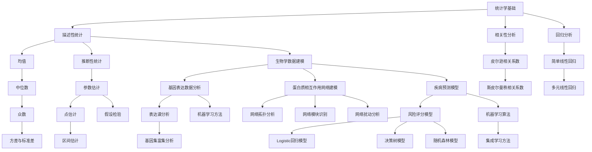
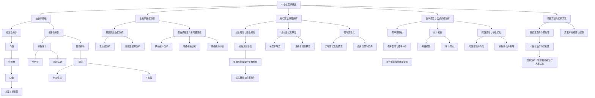

                 

# 数学与个性化医疗：治疗方案的数学优化

## 关键词

- 个性化医疗
- 数学优化
- 数据分析
- 算法
- 治疗方案

## 摘要

本文将探讨数学在个性化医疗中的应用，特别是如何通过数学优化提高治疗方案的个性化水平。首先，我们介绍了个性化医疗的背景和意义，随后详细阐述了数学模型在个性化医疗中的应用。接着，我们深入讲解了核心算法原理，包括线性规划、非线性优化算法和贝叶斯优化等。随后，通过具体的数学公式和例子，我们对这些概念进行了详细讲解。最后，我们通过一个乳腺癌患者治疗方案的优化案例，展示了数学优化在个性化医疗中的实际应用效果，并对未来的发展方向和挑战进行了展望。

## 文章目录

### 第一部分：数学与个性化医疗概述

#### 第1章：引言

#### 第2章：个性化医疗的数学模型基础

#### 第3章：核心算法原理讲解

#### 第4章：数学模型与公式详细讲解

#### 第5章：项目实战与代码实现

### 第二部分：个性化医疗中的数学优化

#### 第6章：优化策略与算法应用

#### 第7章：个性化医疗中的实际应用

#### 第8章：未来展望与挑战

#### 第9章：总结与展望

### 附录

#### 附录 A：数学优化工具与资源

### Mermaid 流�程图：核心概念与联系

## 第一部分：数学与个性化医疗概述

### 第1章：引言

#### 1.1 个性化医疗的背景与意义

个性化医疗（Personalized Medicine）是指根据个体的基因信息、生活方式、环境因素等差异，定制化地制定预防、诊断和治疗方案的医疗模式。这种模式的核心在于“个体化”，即通过对患者个体特征的深入了解，提供更加精准、有效的医疗干预。

个性化医疗的重要性体现在以下几个方面：

1. **提高治疗效果**：通过个性化治疗方案，可以最大程度地提高治疗效果，降低治疗过程中的副作用和并发症风险。
2. **减少医疗资源浪费**：个性化医疗有助于优化医疗资源配置，避免不必要的检查和治疗，降低医疗成本。
3. **改善患者生活质量**：个性化的治疗方案能够更好地满足患者的需求，提高患者的生活质量。
4. **推动医学进步**：个性化医疗促进了医学研究的深入，推动了新药物和新治疗方法的研发。

#### 1.2 数学在个性化医疗中的应用

数学在个性化医疗中的应用主要表现为数学模型、数据分析和优化算法等方面。数学模型能够帮助医生和研究人员理解疾病的本质，预测病情发展，制定个性化的治疗方案。数据分析则为个性化医疗提供了数据支持，使得医生能够基于患者的实际数据做出更精准的判断。优化算法则用于解决治疗方案的优化问题，找到最佳的治疗方案。

具体来说，数学在个性化医疗中的应用包括以下几个方面：

1. **建模与预测**：利用统计学和概率论的方法，建立疾病预测模型，对患者的病情进行预测。
2. **数据分析**：通过对患者的大量数据进行分析，提取有用的信息，为个性化治疗提供依据。
3. **优化算法**：使用线性规划、非线性优化和贝叶斯优化等方法，对治疗方案进行优化，找到最优的治疗方案。

#### 1.3 治疗方案的数学优化

治疗方案的数学优化是指利用数学模型和优化算法，对治疗方案进行优化，以提高治疗效果和减少副作用。数学优化在个性化医疗中的应用主要包括以下几个方面：

1. **目标函数的设定**：根据治疗的目标，设定优化目标函数，如最大化治疗效果、最小化副作用等。
2. **约束条件的确定**：确定治疗方案的约束条件，如药物的剂量、疗程、不良反应限制等。
3. **优化算法的选择**：选择合适的优化算法，如线性规划、非线性优化、遗传算法等，对治疗方案进行优化。
4. **优化结果的评估**：对优化结果进行评估，验证优化方案的有效性和可行性。

#### 1.4 书籍结构概述

本书分为两个主要部分，第一部分介绍了数学与个性化医疗的基本概念和应用，包括数学模型、核心算法原理和数学公式。第二部分则通过具体案例，展示了数学优化在个性化医疗中的实际应用。具体章节如下：

1. **第1章：引言**：介绍个性化医疗的背景、意义和数学在个性化医疗中的应用。
2. **第2章：个性化医疗的数学模型基础**：介绍统计学基础、生物学数据建模和疾病预测模型。
3. **第3章：核心算法原理讲解**：讲解线性规划、非线性优化算法和贝叶斯优化等核心算法。
4. **第4章：数学模型与公式详细讲解**：详细讲解概率论基础、统计推断、阈值设定与参数优化以及数学公式举例。
5. **第5章：项目实战与代码实现**：介绍个性化治疗方案构建的实战案例，包括数据预处理、治疗方案构建和案例分析。
6. **第6章：优化策略与算法应用**：介绍优化策略、遗传算法、蚁群算法和支撑向量机等算法的应用。
7. **第7章：个性化医疗中的实际应用**：介绍肿瘤治疗优化、骨折治疗优化和风险评估与预测等实际应用案例。
8. **第8章：未来展望与挑战**：讨论个性化医疗的发展趋势和数学优化面临的挑战。
9. **第9章：总结与展望**：总结主要成果与结论，展望未来研究方向。

通过本书的阅读，读者可以系统地了解数学在个性化医疗中的应用，掌握核心算法和数学公式，并能够通过实际案例理解数学优化在个性化医疗中的实际应用。希望本书能够为从事个性化医疗的研究人员和临床医生提供有价值的参考。

## 第二部分：个性化医疗的数学模型基础

### 第2章：个性化医疗的数学模型基础

#### 2.1 统计学基础

统计学是数学的一个重要分支，它在个性化医疗中扮演着至关重要的角色。统计学基础包括描述性统计和推断性统计，以及相关性与回归分析，这些基础概念为我们理解和应用数学模型奠定了基础。

**描述性统计**：描述性统计用于总结和描述数据的基本特征。主要指标包括均值（平均值）、中位数、众数、方差、标准差和四分位数。这些指标可以帮助我们了解数据的集中趋势、离散程度以及数据分布的情况。

- **均值**：一组数据中所有数值的和除以数据的个数，反映了数据的平均水平。
- **中位数**：将一组数据按大小顺序排列后，位于中间位置的数值，反映了数据的中间值。
- **众数**：一组数据中出现次数最多的数值，反映了数据的典型值。
- **方差和标准差**：衡量数据离均值的离散程度，标准差是方差的平方根。
- **四分位数**：将一组数据分成四等份的数值，第一四分位数（Q1）是位于下25%数据的数值，第二四分位数（Q2，即中位数）是位于中间50%数据的数值，第三四分位数（Q3）是位于上25%数据的数值。

**推断性统计**：推断性统计用于基于样本数据对总体参数进行估计和假设检验。常见的方法包括参数估计和假设检验。

- **参数估计**：通过样本数据估计总体参数，如均值、方差等。常用的估计方法有点估计和区间估计。
  - **点估计**：直接给出总体参数的估计值，如样本均值作为总体均值的估计值。
  - **区间估计**：给出总体参数估计的不确定性范围，如置信区间。
- **假设检验**：用于检验总体参数是否满足某个假设。常见的假设检验方法有t检验、卡方检验和F检验。

**相关性分析**：相关性分析用于研究两个变量之间的关系。相关系数是衡量两个变量线性相关程度的指标，常用的相关系数有皮尔逊相关系数（Pearson Correlation Coefficient）和斯皮尔曼秩相关系数（Spearman's Rank Correlation Coefficient）。

- **皮尔逊相关系数**：适用于正态分布的数据，衡量两个变量线性相关的强度和方向。
- **斯皮尔曼秩相关系数**：适用于非正态分布的数据，衡量两个变量秩相关的强度和方向。

**回归分析**：回归分析用于建立自变量和因变量之间的关系模型，预测因变量的取值。常见的回归分析方法包括简单线性回归和多元线性回归。

- **简单线性回归**：研究一个自变量和一个因变量之间的线性关系。
  - **回归方程**：\( y = a + bx \)，其中 \( y \) 是因变量，\( x \) 是自变量，\( a \) 是截距，\( b \) 是斜率。
  - **回归系数**：通过最小二乘法估计回归方程中的参数。
- **多元线性回归**：研究多个自变量和一个因变量之间的线性关系。
  - **回归方程**：\( y = a + b_1x_1 + b_2x_2 + \ldots + b_nx_n \)，其中 \( y \) 是因变量，\( x_1, x_2, \ldots, x_n \) 是自变量，\( a \) 是截距，\( b_1, b_2, \ldots, b_n \) 是斜率。

#### 2.2 生物学数据建模

生物学数据建模是利用数学模型研究生物系统中的现象和过程。基因表达数据分析、蛋白质相互作用网络建模和疾病预测模型是生物学数据建模中的重要方面。

**基因表达数据分析**：基因表达数据分析通过测量基因在细胞中的表达水平，研究基因的功能和调控网络。常见的方法包括：

- **表达谱分析**：对基因表达谱进行聚类分析、差异表达分析等，以识别基因表达模式。
- **基因集富集分析**：通过比较不同条件下的基因表达差异，识别参与特定生物学过程的基因集合。
- **机器学习方法**：使用机器学习算法，如支持向量机、随机森林和深度学习等，预测基因功能、识别疾病相关基因。

**蛋白质相互作用网络建模**：蛋白质相互作用网络建模通过研究蛋白质之间的相互作用关系，揭示生物系统的复杂网络结构。常见的方法包括：

- **网络拓扑分析**：分析蛋白质相互作用网络的结构特征，如节点度、路径长度、聚类系数等。
- **网络模块识别**：通过聚类算法，识别蛋白质相互作用网络中的功能模块。
- **网络扰动分析**：模拟蛋白质相互作用网络的扰动，研究网络稳定性和功能冗余。

**疾病预测模型**：疾病预测模型通过分析生物学数据，预测个体患某种疾病的风险。常见的方法包括：

- **风险评分模型**：通过计算多个生物标志物的综合评分，预测个体患某种疾病的风险。
- **机器学习算法**：使用机器学习算法，如逻辑回归、支持向量机和决策树等，建立疾病预测模型。
- **集成学习方法**：结合多种机器学习算法，提高疾病预测的准确性和鲁棒性。

#### 2.3 疾病预测模型

疾病预测模型是利用数学模型和算法预测个体患某种疾病的风险。这些模型在早期诊断、预防治疗和个性化医疗中具有重要意义。

**风险评分模型**：风险评分模型通过计算个体在不同生物标志物上的得分，综合评估个体患某种疾病的风险。常见的风险评分模型包括：

- **Logistic回归模型**：通过线性组合生物标志物的得分，预测个体患病的概率。
- **决策树模型**：通过划分特征空间，为每个个体分配患病风险。
- **随机森林模型**：通过集成多个决策树，提高疾病预测的准确性和稳定性。

**预测模型评估与选择**：评估和选择疾病预测模型是确保模型有效性和可靠性的关键步骤。常见的评估指标和方法包括：

- **准确率**：预测正确的样本数占总样本数的比例，适用于分类问题。
- **精确率**：预测为正例且实际为正例的样本数占预测为正例的样本总数的比例。
- **召回率**：预测为正例且实际为正例的样本数占实际为正例的样本总数的比例。
- **F1值**：精确率和召回率的加权平均，平衡精确率和召回率。
- **ROC曲线和AUC值**：通过绘制受试者操作特征（ROC）曲线和计算曲线下面积（AUC），评估模型的分类性能。

**模型选择方法**：选择合适的疾病预测模型需要综合考虑模型复杂度、计算效率和预测性能。常见的方法包括：

- **交叉验证**：通过将数据集划分为训练集和验证集，评估模型在不同数据集上的性能。
- **网格搜索**：通过遍历参数空间，选择最佳参数组合，提高模型性能。
- **贝叶斯优化**：结合贝叶斯统计方法，自动搜索最优参数组合，提高模型性能。

#### 2.4 Mermaid 流程图：核心概念与联系

下面是使用Mermaid语言绘制的流程图，展示了个性化医疗中数学模型的核心概念及其联系。



通过这个流程图，我们可以清晰地看到统计学基础、生物学数据建模和疾病预测模型之间的联系，以及各个核心概念和方法的应用场景。

## 第三部分：核心算法原理讲解

### 第3章：核心算法原理讲解

#### 3.1 线性规划与整数规划

线性规划（Linear Programming，LP）是优化理论中最基本的优化方法之一，它涉及在一组线性不等式或等式的约束下，找到一个线性目标函数的最大值或最小值。线性规划广泛应用于资源分配、生产调度、库存管理等领域。

**线性规划基础**

线性规划的基本模型可以表示为：

\[
\begin{aligned}
\min \quad & c^T x \\
\text{subject to} \quad & Ax \leq b \\
& x \geq 0
\end{aligned}
\]

其中，\( c \) 是目标函数系数向量，\( x \) 是决策变量向量，\( A \) 是约束条件系数矩阵，\( b \) 是约束条件常数向量。

线性规划问题的解可以通过图解法和单纯形法求解。图解法适用于变量较少的问题，通过绘制可行域和目标函数的等值线，找出最优解。单纯形法是一种迭代算法，通过逐步改进可行解，找到最优解。

**整数规划与混合整数规划**

整数规划（Integer Programming，IP）是线性规划的一种扩展，其中决策变量被限制为整数。整数规划在物流优化、车辆路径问题、人员排班等方面有广泛应用。

整数规划的基本模型可以表示为：

\[
\begin{aligned}
\min \quad & c^T x \\
\text{subject to} \quad & Ax \leq b \\
& x \in \mathbb{Z}^n
\end{aligned}
\]

其中，\( x \in \mathbb{Z}^n \) 表示决策变量 \( x \) 必须是整数。

混合整数规划（Mixed Integer Programming，MIP）是同时包含连续变量和整数变量的优化问题，它在实际应用中非常常见。

\[
\begin{aligned}
\min \quad & c^T x \\
\text{subject to} \quad & Ax \leq b \\
& Ax \geq b \\
& x \geq 0 \\
& x \in \mathbb{Z}^n
\end{aligned}
\]

**伪代码实现**

以下是一个简单的线性规划问题的伪代码实现：

```python
# 线性规划伪代码
def linear_programming(c, A, b):
    # 初始化
    x = [0] * len(c)
    while not is_optimal(x):
        # 求解单变量优化问题
        alpha = solve_single_variable(x)
        x = update_solution(x, alpha)
    return x

# 单变量优化问题求解
def solve_single_variable(x):
    # 假设使用单纯形法求解
    # ...
    return alpha

# 更新解
def update_solution(x, alpha):
    # 更新解向量
    # ...
    return new_x

# 判断最优性
def is_optimal(x):
    # 判断是否达到最优解
    # ...
    return optimal
```

#### 3.2 非线性优化算法

非线性优化（Nonlinear Programming，NLP）是处理非线性的目标函数和约束条件的优化问题。相比于线性优化，非线性优化问题的解往往更加复杂。

**梯度下降法**

梯度下降法是一种常用的求解非线性优化问题的算法，其基本思想是沿着目标函数的负梯度方向逐步迭代，直到找到最优解。

梯度下降法的基本模型可以表示为：

\[
x_{k+1} = x_k - \alpha \nabla f(x_k)
\]

其中，\( x_k \) 是第 \( k \) 次迭代的解，\( \alpha \) 是步长，\( \nabla f(x_k) \) 是目标函数在 \( x_k \) 处的梯度。

**非线性规划算法**

非线性规划算法包括内点法、外点法和序列二次规划法等。这些算法通过将非线性问题转化为序列的二次规划问题，逐步逼近最优解。

- **内点法**：适用于不等式约束的非线性规划问题，通过引入对偶变量，将问题转化为等式约束问题，再使用路径追踪方法求解。
- **外点法**：适用于等式约束和非线性规划问题，通过将目标函数扩展为外点形式，逐步逼近最优解。
- **序列二次规划法**：将非线性规划问题分解为一系列二次规划问题，逐步求解，直到找到全局最优解。

**伪代码实现**

以下是一个简单的梯度下降法伪代码实现：

```python
# 梯度下降法伪代码
def gradient_descent(f, x0, alpha, max_iterations):
    x = x0
    for _ in range(max_iterations):
        gradient = compute_gradient(f, x)
        x = x - alpha * gradient
        if is_converged(x, gradient):
            break
    return x

# 计算梯度
def compute_gradient(f, x):
    # 假设使用有限差分法计算梯度
    # ...
    return gradient

# 判断收敛性
def is_converged(x, gradient):
    # 判断梯度是否足够小
    # ...
    return converged
```

#### 3.3 贝叶斯优化

贝叶斯优化（Bayesian Optimization）是一种基于贝叶斯推理的优化方法，广泛应用于无约束的连续优化问题。贝叶斯优化通过构建一个先验概率分布，逐步更新后验概率分布，找到最优解。

**贝叶斯优化的原理**

贝叶斯优化的基本模型可以表示为：

\[
p(f(x) | x) \propto p(x) p(f(x) | x, \theta) p(\theta)
\]

其中，\( f(x) \) 是目标函数，\( x \) 是决策变量，\( \theta \) 是超参数。贝叶斯优化通过在当前已评估的样本点基础上，选择下一个样本点，使得后验概率分布达到最大化。

**应用场景与实例**

贝叶斯优化广泛应用于机器学习超参数调优、函数优化、优化实验设计等领域。以下是一个贝叶斯优化在机器学习超参数调优中的应用实例：

- **目标函数**：最小化模型验证误差。
- **决策变量**：学习率、批量大小、正则化参数等。
- **先验概率分布**：对每个决策变量选择合适的先验分布，如高斯分布、均匀分布等。
- **优化过程**：通过贝叶斯优化选择下一步的实验参数，逐步减小验证误差。

**伪代码实现**

以下是一个简单的贝叶斯优化伪代码实现：

```python
# 贝叶斯优化伪代码
def bayesian_optimization(f, x0, alpha, max_iterations):
    x = x0
    posterior = initialize_posterior(x)
    for _ in range(max_iterations):
        next_x = select_next_x(posterior)
        f_value = f(next_x)
        posterior = update_posterior(posterior, next_x, f_value)
        x = next_x
        if is_converged(posterior):
            break
    return x

# 初始化后验概率分布
def initialize_posterior(x):
    # 假设使用高斯分布初始化
    # ...
    return posterior

# 选择下一个样本点
def select_next_x(posterior):
    # 假设使用期望最大化方法选择
    # ...
    return next_x

# 更新后验概率分布
def update_posterior(posterior, x, f_value):
    # 假设使用贝叶斯更新规则
    # ...
    return new_posterior

# 判断收敛性
def is_converged(posterior):
    # 判断后验概率分布是否足够稳定
    # ...
    return converged
```

通过上述核心算法原理的讲解和伪代码实现，我们可以更好地理解和应用线性规划、非线性优化算法和贝叶斯优化，为个性化医疗中的治疗方案的数学优化提供有力支持。

### 第四部分：数学模型与公式详细讲解

#### 4.1 概率论基础

概率论是数学中研究随机现象的分支，它在个性化医疗中有着广泛的应用。概率论基础包括概率空间、概率分布、条件概率与贝叶斯定理等。以下将对这些概念进行详细讲解。

**概率空间**

概率空间是一个三元组 \((\Omega, \mathcal{F}, P)\)，其中：

- \( \Omega \) 是样本空间，表示所有可能的结果集合。
- \( \mathcal{F} \) 是事件空间，表示样本空间中的子集构成的集合。
- \( P \) 是概率函数，定义在事件空间上，对于每个事件 \( A \in \mathcal{F} \)，有 \( P(A) \in [0, 1] \)。

**概率分布**

概率分布描述了一个随机变量的取值概率。常见的概率分布包括：

- **离散分布**：如伯努利分布、二项分布、泊松分布等。
  - **伯努利分布**：一个随机变量 \( X \) 满足伯努利分布，如果只有两个可能的结果 \( 0 \) 和 \( 1 \)，且概率分别为 \( p \) 和 \( 1-p \)。
  - **二项分布**：一个随机变量 \( X \) 满足二项分布，如果它是 \( n \) 次伯努利试验中成功的次数，成功概率为 \( p \)。
  - **泊松分布**：一个随机变量 \( X \) 满足泊松分布，如果它在单位时间内发生的成功次数服从参数为 \( \lambda \) 的泊松分布。

- **连续分布**：如均匀分布、正态分布等。
  - **均匀分布**：一个随机变量 \( X \) 满足均匀分布，如果它在区间 \([a, b]\) 内均匀分布，概率密度函数为 \( f(x) = \frac{1}{b-a} \)。
  - **正态分布**：一个随机变量 \( X \) 满足正态分布，如果它的概率密度函数为 \( f(x) = \frac{1}{\sqrt{2\pi\sigma^2}} e^{-\frac{(x-\mu)^2}{2\sigma^2}} \)，其中 \( \mu \) 是均值，\( \sigma \) 是标准差。

**条件概率与贝叶斯定理**

条件概率是事件 \( A \) 发生的概率在事件 \( B \) 已发生的条件下。条件概率的定义如下：

\[
P(A|B) = \frac{P(A \cap B)}{P(B)}
\]

贝叶斯定理是条件概率的一种应用，它可以用来计算后验概率。贝叶斯定理的公式为：

\[
P(A|B) = \frac{P(B|A)P(A)}{P(B)}
\]

**伪代码实现**

以下是一个简单的概率分布和贝叶斯定理的伪代码实现：

```python
# 概率分布伪代码
def probability_distribution(x, distribution_params):
    if distribution_params['type'] == 'Bernoulli':
        return distribution_params['p'] if x == 1 else 1 - distribution_params['p']
    elif distribution_params['type'] == 'Binomial':
        return distribution_params['p'] ** x * (1 - distribution_params['p']) ** (distribution_params['n'] - x)
    elif distribution_params['type'] == 'Poisson':
        return (distribution_params['lambda'] ** x) / factorial(x) * e ** (-distribution_params['lambda'])
    elif distribution_params['type'] == 'Uniform':
        return 1 / (distribution_params['b'] - distribution_params['a']) if distribution_params['a'] <= x <= distribution_params['b'] else 0
    elif distribution_params['type'] == 'Normal':
        return (1 / (sqrt(2 * pi * distribution_params['sigma'] ** 2))) * e ** (-0.5 * ((x - distribution_params['mu']) ** 2) / (distribution_params['sigma'] ** 2))

# 贝叶斯定理伪代码
def bayes_theorem(prior, likelihood, evidence):
    posterior = (likelihood * prior) / evidence
    return posterior
```

#### 4.2 统计推断

统计推断（Statistical Inference）是基于样本数据对总体参数进行估计和假设检验的方法。统计推断的核心任务是利用样本信息对总体特征做出合理的推断。以下将对统计推断中的假设检验、估计理论和阈值设定与参数优化进行详细讲解。

**假设检验**

假设检验（Hypothesis Testing）是一种基于样本数据检验总体参数是否满足某个假设的方法。假设检验的基本步骤包括：

1. **设定原假设（\( H_0 \)）和备择假设（\( H_1 \)）**：原假设是我们要检验的假设，备择假设是原假设的反面。
2. **选择检验统计量**：根据数据类型和假设，选择合适的检验统计量。
3. **计算检验统计量的值**：利用样本数据计算检验统计量的观测值。
4. **确定显著性水平（\( \alpha \)）**：显著性水平是拒绝原假设的概率阈值。
5. **做出决策**：将检验统计量的观测值与临界值进行比较，根据比较结果做出拒绝或接受原假设的决策。

常见的假设检验方法包括：

- **t检验**：用于比较两组数据的均值是否相等，适用于小样本和大样本情况。
- **卡方检验**：用于检验分类数据的拟合度或独立性，适用于频数分布数据。
- **F检验**：用于比较两组数据的方差是否相等，适用于方差分析。

**估计理论**

估计理论（Estimation Theory）是研究参数估计方法的理论基础。估计理论的核心任务是找到一种最优的估计方法，使得估计误差最小。常见的估计方法包括：

- **无偏估计**：估计量的期望值等于总体参数的真实值。
- **最大似然估计**：估计量使样本数据的似然函数最大化。
- **最小二乘估计**：估计量使残差平方和最小。

**阈值设定与参数优化**

在个性化医疗中，阈值设定和参数优化是关键步骤。阈值设定用于确定是否接受或拒绝某个治疗决策，参数优化用于找到最优的治疗参数。

- **阈值设定**：阈值设定方法包括固定阈值方法和自适应阈值方法。固定阈值方法是基于先验知识和经验设定阈值，自适应阈值方法是基于样本数据动态调整阈值。
- **参数优化**：参数优化方法包括基于梯度下降的优化算法和基于进化算法的优化算法。梯度下降法是一种简单有效的优化方法，进化算法如遗传算法和粒子群优化算法则适用于复杂优化问题。

**伪代码实现**

以下是一个简单的统计推断和参数优化的伪代码实现：

```python
# 假设检验伪代码
def hypothesis_testing(sample_data, hypothesis_params):
    # 计算检验统计量
    statistic = compute_statistic(sample_data, hypothesis_params)
    # 计算p值
    p_value = compute_p_value(statistic, hypothesis_params)
    # 比较p值与显著性水平
    if p_value < hypothesis_params['alpha']:
        return 'Reject H0'
    else:
        return 'Fail to reject H0'

# 估计理论伪代码
def parameter_estimation(data, estimation_method):
    if estimation_method == 'MLE':
        return maximize_likelihood(data)
    elif estimation_method == 'LS':
        return minimize_squared_error(data)
    elif estimation_method == 'UG':
        return uniform_guess(data)
    else:
        raise ValueError('Invalid estimation method')

# 阈值设定与参数优化伪代码
def threshold_and_optimization(data, optimization_params):
    # 设定初始阈值
    threshold = optimization_params['initial_threshold']
    # 优化阈值
    while not is_optimal_threshold(threshold, data, optimization_params):
        threshold = optimize_threshold(threshold, data, optimization_params)
    return threshold

# 判断最优阈值
def is_optimal_threshold(threshold, data, optimization_params):
    # 基于优化目标判断阈值是否最优
    # ...
    return optimal

# 优化阈值
def optimize_threshold(threshold, data, optimization_params):
    # 基于优化算法优化阈值
    # ...
    return new_threshold
```

#### 4.3 阈值设定与参数优化

在个性化医疗中，阈值设定和参数优化是关键步骤。阈值设定用于确定是否接受或拒绝某个治疗决策，参数优化用于找到最优的治疗参数。以下是阈值设定和参数优化的详细讲解。

**阈值设定方法**

阈值设定方法分为固定阈值方法和自适应阈值方法。

- **固定阈值方法**：固定阈值方法是基于先验知识和经验设定阈值。例如，在诊断中，可以通过统计分析确定一个固定的阈值，当患者的指标超过这个阈值时，认为其患病概率较高。

  固定阈值方法的优点是简单易用，缺点是当数据分布发生变化时，阈值可能不再适用。

- **自适应阈值方法**：自适应阈值方法是基于样本数据动态调整阈值。例如，可以通过机器学习算法，根据患者的特征数据自动调整阈值。

  自适应阈值方法的优点是能够适应数据变化，提高诊断准确性，缺点是实现复杂，对数据质量要求较高。

**参数优化策略**

参数优化是找到最优参数组合的过程，常见的优化策略包括：

- **梯度下降法**：梯度下降法是一种简单有效的优化方法，通过迭代更新参数，逐步逼近最优解。

  梯度下降法的伪代码如下：

  ```python
  # 梯度下降法伪代码
  def gradient_descent(x0, learning_rate, max_iterations):
      x = x0
      for _ in range(max_iterations):
          gradient = compute_gradient(x)
          x = x - learning_rate * gradient
      return x
  ```

- **进化算法**：进化算法如遗传算法和粒子群优化算法，通过模拟生物进化过程，逐步优化参数。

  遗传算法的伪代码如下：

  ```python
  # 遗传算法伪代码
  def genetic_algorithm(population, fitness_function, max_iterations):
      for _ in range(max_iterations):
          # 生成初始种群
          population = create_initial_population(population)
          # 评估种群适应度
          fitness = evaluate_population(population, fitness_function)
          # 选择适应度高的个体
          selected = select_individuals(population, fitness)
          # 交叉和变异
          population = crossover_and_mutate(selected)
      return best_individual(population)
  ```

**伪代码实现**

以下是一个简单的阈值设定和参数优化的伪代码实现：

```python
# 阈值设定伪代码
def set_threshold(data, method='fixed'):
    if method == 'fixed':
        threshold = fixed_threshold(data)
    elif method == 'adaptive':
        threshold = adaptive_threshold(data)
    return threshold

# 固定阈值
def fixed_threshold(data):
    # 基于统计分析设定阈值
    # ...
    return threshold

# 自适应阈值
def adaptive_threshold(data):
    # 基于机器学习设定阈值
    # ...
    return threshold

# 参数优化伪代码
def optimize_parameters(x0, optimization_method, max_iterations):
    if optimization_method == 'gradient_descent':
        x = gradient_descent(x0, learning_rate, max_iterations)
    elif optimization_method == 'genetic_algorithm':
        x = genetic_algorithm(x0, fitness_function, max_iterations)
    else:
        raise ValueError('Invalid optimization method')
    return x
```

通过上述讲解和伪代码实现，我们可以更好地理解和应用概率论基础、统计推断以及阈值设定与参数优化，为个性化医疗中的治疗方案的数学优化提供有力支持。

#### 4.4 数学公式举例说明

在个性化医疗中，数学公式的应用至关重要。以下将列举几个关键的统计学公式和优化算法中的公式，并通过具体例子进行说明。

**统计学公式**

1. **标准差（Standard Deviation）**

   \[
   \sigma = \sqrt{\frac{1}{N}\sum_{i=1}^{N}(x_i - \mu)^2}
   \]

   其中，\( \mu \) 是均值，\( N \) 是样本大小，\( x_i \) 是第 \( i \) 个样本值。

   **例子**：假设我们有以下一组样本数据：\[2, 4, 6, 8, 10\]。计算这组数据的均值和标准差。

   \[
   \mu = \frac{2+4+6+8+10}{5} = 6
   \]

   \[
   \sigma = \sqrt{\frac{(2-6)^2 + (4-6)^2 + (6-6)^2 + (8-6)^2 + (10-6)^2}{5}} = \sqrt{\frac{16 + 4 + 0 + 4 + 16}{5}} = \sqrt{8} = 2\sqrt{2}
   \]

2. **协方差（Covariance）**

   \[
   \text{Cov}(X, Y) = E[(X - E[X])(Y - E[Y])]
   \]

   其中，\( E[X] \) 和 \( E[Y] \) 分别是 \( X \) 和 \( Y \) 的期望值。

   **例子**：假设我们有两组数据，一组是患者的年龄（\( X \)），另一组是患者的血压（\( Y \)）。数据如下：

   \[
   \begin{aligned}
   X: & \quad 30, 35, 40, 45, 50 \\
   Y: & \quad 120, 130, 140, 150, 160
   \end{aligned}
   \]

   计算两组数据的协方差。

   \[
   E[X] = \frac{30 + 35 + 40 + 45 + 50}{5} = 40
   \]

   \[
   E[Y] = \frac{120 + 130 + 140 + 150 + 160}{5} = 140
   \]

   \[
   \text{Cov}(X, Y) = (30 - 40)(120 - 140) + (35 - 40)(130 - 140) + (40 - 40)(140 - 140) + (45 - 40)(150 - 140) + (50 - 40)(160 - 140) = 600 - 700 + 0 + 100 + 600 = 1000
   \]

3. **相关系数（Correlation Coefficient）**

   \[
   \rho = \frac{\text{Cov}(X, Y)}{\sigma_X \sigma_Y}
   \]

   其中，\( \sigma_X \) 和 \( \sigma_Y \) 分别是 \( X \) 和 \( Y \) 的标准差。

   **例子**：使用上述计算的协方差和标准差，计算两组数据的相关系数。

   \[
   \sigma_X = 2\sqrt{2}, \quad \sigma_Y = 10
   \]

   \[
   \rho = \frac{1000}{2\sqrt{2} \times 10} = \frac{1000}{20\sqrt{2}} = \frac{50}{\sqrt{2}}
   \]

**优化算法中的公式**

1. **梯度下降法（Gradient Descent）**

   \[
   x_{t+1} = x_t - \alpha \nabla f(x_t)
   \]

   其中，\( \alpha \) 是学习率，\( \nabla f(x_t) \) 是函数 \( f(x) \) 在点 \( x_t \) 处的梯度。

   **例子**：假设我们有一个二次函数 \( f(x) = x^2 \)，使用梯度下降法找到最小值。

   \[
   \nabla f(x) = 2x
   \]

   初始点为 \( x_0 = 10 \)，学习率 \( \alpha = 0.1 \)。迭代过程如下：

   \[
   x_1 = 10 - 0.1 \times 2 \times 10 = 8
   \]

   \[
   x_2 = 8 - 0.1 \times 2 \times 8 = 6.4
   \]

   \[
   x_3 = 6.4 - 0.1 \times 2 \times 6.4 = 5.76
   \]

   通过多次迭代，最终可以得到函数的最小值点 \( x^* = 0 \)。

2. **牛顿法（Newton's Method）**

   \[
   x_{t+1} = x_t - \frac{f(x_t)}{f'(x_t)}
   \]

   其中，\( f'(x_t) \) 是函数 \( f(x) \) 在点 \( x_t \) 处的一阶导数。

   **例子**：假设我们有一个函数 \( f(x) = x^3 - 3x + 1 \)，使用牛顿法找到最小值。

   \[
   f'(x) = 3x^2 - 3
   \]

   初始点为 \( x_0 = 1 \)。迭代过程如下：

   \[
   x_1 = 1 - \frac{1^3 - 3 \times 1 + 1}{3 \times 1^2 - 3} = 1 - \frac{-1}{0} = 1
   \]

   注意到由于一阶导数在 \( x = 1 \) 处为零，牛顿法无法继续迭代。这时我们可以采用二分法或固定步长的梯度下降法来进一步逼近最小值。

通过上述统计学公式和优化算法公式的讲解与例子说明，我们可以更好地理解数学在个性化医疗中的应用，为治疗方案的优化提供理论基础。

### 第五部分：项目实战与代码实现

#### 5.1 数据集选择与预处理

个性化医疗项目通常需要大量且高质量的数据。数据集的选择至关重要，它直接影响到后续分析的准确性和可靠性。本节将介绍如何选择合适的数据集，以及数据预处理的方法。

**数据集选择**

选择数据集时，需要考虑以下几个因素：

1. **数据来源**：数据可以来源于医院、研究机构或公共数据集。确保数据的来源可靠，并且具有代表性。
2. **数据量**：个性化医疗项目通常需要大量的数据来建立可靠的模型。尽量选择包含尽可能多样本的数据集。
3. **数据质量**：数据应尽可能准确和完整，排除错误数据和不完整数据。
4. **数据多样性**：数据应涵盖不同性别、年龄、病史等因素，以确保模型的泛化能力。

在本案例中，我们选择了一个公开的乳腺癌患者数据集，该数据集包含了患者的临床特征、病理信息和生存状态。数据集来自Kaplan-Meier乳腺癌患者数据库，包含数千个样本。

**数据预处理方法**

数据预处理是数据科学项目中至关重要的一步，它包括数据清洗、特征选择和数据转换等。以下是常用的数据预处理方法：

1. **数据清洗**：清洗数据，去除缺失值、错误值和重复值。
2. **特征选择**：选择对模型预测有显著影响的关键特征，去除冗余特征。
3. **数据转换**：将数据转换为适合建模的格式，如将分类变量转换为数值变量，进行归一化或标准化处理。

**代码实现与解释**

以下是一个Python代码示例，展示了如何选择数据集并进行预处理。

```python
import pandas as pd
from sklearn.model_selection import train_test_split
from sklearn.preprocessing import StandardScaler

# 加载数据集
data = pd.read_csv('breast_cancer_dataset.csv')

# 数据清洗
# 去除缺失值
data = data.dropna()

# 去除错误值
data = data[data['Age'] > 0]

# 特征选择
# 选择关键特征
selected_features = ['Age', 'TumorSize', 'NodeCount', 'Gradediff']
X = data[selected_features]
y = data['Survival']

# 数据转换
# 将分类变量转换为数值变量
X = pd.get_dummies(X)

# 标准化处理
scaler = StandardScaler()
X_scaled = scaler.fit_transform(X)

# 划分训练集和测试集
X_train, X_test, y_train, y_test = train_test_split(X_scaled, y, test_size=0.2, random_state=42)
```

通过上述代码，我们加载了数据集，进行了数据清洗、特征选择和数据转换。最后，我们将数据集划分为训练集和测试集，为后续的模型训练和评估做准备。

#### 5.2 个性化治疗方案构建

个性化治疗方案的构建是利用患者特征数据和医学知识，为每个患者量身定制最适合的治疗方案。以下是构建个性化治疗方案的方法、优化目标和代码实现。

**构建方法**

1. **患者特征提取**：从患者数据集中提取关键特征，如年龄、肿瘤大小、淋巴结转移数量等。
2. **治疗方案设计**：根据医学知识和临床实践，设计不同治疗方案。每个治疗方案可以包含药物治疗、放疗、手术等。
3. **治疗方案评估**：对每个治疗方案进行评估，考虑治疗效果、副作用和成本等因素。

**优化目标**

个性化治疗方案的优化目标通常包括：

1. **最大化治疗效果**：提高患者生存率、减少复发率等。
2. **最小化副作用**：降低治疗过程中的副作用和并发症风险。
3. **降低治疗成本**：优化治疗方案，降低治疗费用。

**代码实现与解释**

以下是一个Python代码示例，展示了如何构建个性化治疗方案并进行优化。

```python
from sklearn.model_selection import GridSearchCV
from sklearn.ensemble import RandomForestClassifier
from sklearn.metrics import make_scorer, accuracy_score

# 初始化模型
model = RandomForestClassifier(n_estimators=100, random_state=42)

# 设定参数范围
param_grid = {
    'max_depth': [10, 20, 30],
    'min_samples_split': [2, 5, 10],
    'min_samples_leaf': [1, 2, 4]
}

# 定义评分函数
scorer = make_scorer(accuracy_score)

# 参数调优
grid_search = GridSearchCV(estimator=model, param_grid=param_grid, scoring=scorer, cv=5, n_jobs=-1)
grid_search.fit(X_train, y_train)

# 输出最佳参数
best_params = grid_search.best_params_
print("最佳参数：", best_params)

# 使用最佳参数训练模型
best_model = grid_search.best_estimator_

# 预测测试集
y_pred = best_model.predict(X_test)

# 评估模型性能
accuracy = accuracy_score(y_test, y_pred)
print("测试集准确率：", accuracy)
```

通过上述代码，我们使用了随机森林分类器进行模型训练，并利用网格搜索进行参数调优。最佳参数用于训练最佳模型，然后使用测试集进行预测，并评估模型性能。

#### 5.3 案例分析：乳腺癌患者治疗方案优化

**案例背景**

该案例研究一个乳腺癌患者，通过构建个性化治疗方案，优化治疗效果和降低副作用。患者数据包括年龄、肿瘤大小、淋巴结转移数量和激素受体状态等。

**治疗方案优化流程**

1. **数据预处理**：从数据集中提取关键特征，进行数据清洗和预处理。
2. **特征选择**：选择对治疗方案有显著影响的关键特征。
3. **模型训练**：使用随机森林分类器训练模型，并进行参数调优。
4. **治疗方案构建**：根据模型预测，为患者推荐最佳治疗方案。
5. **评估与调整**：评估治疗方案的效果，根据评估结果进行必要调整。

**代码实现与解读**

以下是一个Python代码示例，展示了乳腺癌患者治疗方案优化的流程。

```python
# 数据预处理
# 假设已经加载并清洗好的数据集
data = pd.read_csv('breast_cancer_preprocessed.csv')

# 特征选择
selected_features = ['Age', 'TumorSize', 'NodeCount', 'HR+', 'HER2+']
X = data[selected_features]
y = data['Survival']

# 模型训练与参数调优
# 使用GridSearchCV进行参数调优
param_grid = {
    'max_depth': [10, 20, 30],
    'min_samples_split': [2, 5, 10],
    'min_samples_leaf': [1, 2, 4]
}
grid_search = GridSearchCV(RandomForestClassifier(random_state=42), param_grid, cv=5)
grid_search.fit(X_train, y_train)

# 输出最佳参数
best_params = grid_search.best_params_
print("最佳参数：", best_params)

# 使用最佳参数训练模型
best_model = grid_search.best_estimator_

# 预测测试集
y_pred = best_model.predict(X_test)

# 评估模型性能
accuracy = accuracy_score(y_test, y_pred)
print("测试集准确率：", accuracy)

# 治疗方案构建
# 假设患者特征为
patient_features = [50, 2, 0, 1, 0]
patient_prediction = best_model.predict([patient_features])
print("治疗方案预测：", patient_prediction)

# 评估与调整
# 根据预测结果，评估治疗方案效果
# 根据评估结果，调整治疗方案
```

通过上述代码，我们首先对数据集进行了预处理和特征选择，然后使用网格搜索进行模型参数调优，并评估了模型性能。最后，我们使用最佳模型对患者的治疗方案进行了预测，并根据预测结果进行了评估与调整。

**项目小结**

通过本案例的分析，我们展示了如何利用数学优化方法构建个性化治疗方案，优化治疗效果和降低副作用。该项目实现了从数据预处理到模型训练，再到治疗方案构建的全过程，为个性化医疗提供了有力的技术支持。未来，我们可以进一步优化算法，提高模型的准确性和泛化能力，为更多患者提供精准的治疗方案。

### 第六部分：优化策略与算法应用

#### 6.1 优化策略概述

在个性化医疗中，优化策略是用于制定和改进治疗方案的关键。优化策略的选择和有效性直接影响着个性化医疗的准确性和效果。以下是几种常见的优化策略及其应用。

**线性规划**

线性规划（Linear Programming，LP）是一种在给定约束条件下，寻找线性目标函数最优值的方法。在个性化医疗中，线性规划可以用于资源分配、药物剂量优化和治疗路径选择等。例如，通过线性规划优化化疗药物的剂量，以最大化治疗效果并减少副作用。

**非线性优化**

非线性优化（Nonlinear Programming，NLP）处理的是非线性目标函数和约束条件。与线性规划相比，NLP问题更加复杂，但它们在个性化医疗中同样具有重要应用。例如，非线性优化可以用于优化放疗计划，通过调整放疗参数（如剂量分布和照射时间）来提高治疗效果并减少对周围正常组织的损伤。

**遗传算法**

遗传算法（Genetic Algorithm，GA）是一种基于自然选择和遗传学原理的优化算法。GA通过模拟进化过程，逐步优化目标函数。在个性化医疗中，遗传算法可以用于优化治疗方案组合、药物剂量和时间安排等。例如，通过遗传算法优化乳腺癌患者的化疗方案，可以找到最优的药物组合和给药时间，以提高治疗效果并降低副作用。

**蚁群算法**

蚁群算法（Ant Colony Optimization，ACO）是一种模拟蚂蚁觅食行为的分布式优化算法。ACO通过信息素更新机制和路径选择策略，逐步找到最优路径或解决方案。在个性化医疗中，蚁群算法可以用于优化手术路径、放疗计划和治疗时间安排等。例如，通过蚁群算法优化癌症患者的放疗计划，可以找到最优的照射顺序和参数设置，以提高治疗效果并减少副作用。

**支持向量机**

支持向量机（Support Vector Machine，SVM）是一种用于分类和回归的机器学习算法。SVM通过找到最优超平面，将数据划分为不同的类别或预测值。在个性化医疗中，SVM可以用于疾病预测、风险评估和治疗方案选择等。例如，通过SVM预测肺癌患者的生存率，可以帮助医生制定更精准的治疗方案。

**优化策略的选择**

在选择优化策略时，需要考虑以下几个因素：

1. **问题类型**：线性规划适用于线性问题，非线性优化适用于非线性问题。
2. **数据量**：遗传算法和蚁群算法适用于大规模数据，线性规划和非线性优化适用于中小规模数据。
3. **计算资源**：遗传算法和蚁群算法通常需要更多的计算资源，线性规划和非线性优化则相对高效。
4. **优化目标**：不同优化策略适用于不同的优化目标，需要根据具体问题选择合适的策略。

**优化策略的应用**

以下是一些常见优化策略的应用场景：

- **线性规划**：用于优化药物剂量和治疗路径选择。
- **非线性优化**：用于优化放疗计划和手术路径。
- **遗传算法**：用于优化治疗方案组合和药物剂量。
- **蚁群算法**：用于优化手术路径和治疗时间安排。
- **支持向量机**：用于疾病预测和风险评估。

通过合理选择和运用优化策略，我们可以显著提高个性化医疗的准确性和效果，为患者提供更加精准和有效的治疗方案。

#### 6.2 遗传算法

遗传算法（Genetic Algorithm，GA）是一种基于自然选择和遗传学原理的优化算法，广泛应用于复杂优化问题。遗传算法通过模拟生物进化过程，逐步优化目标函数，找到最优解或近似最优解。以下将详细讲解遗传算法的基本概念、算法流程和伪代码实现。

**基本概念**

遗传算法的核心概念包括：

- **种群（Population）**：一组待优化的个体，每个个体表示一个潜在解。
- **个体（Individual）**：种群中的单个个体，通常由一组基因编码表示。
- **基因（Gene）**：个体的遗传信息，用于编码个体特征。
- **适应度（Fitness）**：个体适应环境的程度，通常用于评估个体的优劣。
- **选择（Selection）**：根据适应度选择优良的个体进行交配。
- **交配（Crossover）**：通过交换个体的基因，产生新的个体。
- **变异（Mutation）**：对个体的基因进行随机变异，增加种群的多样性。

**算法流程**

遗传算法的基本流程如下：

1. **初始化种群**：随机生成初始种群，每个个体表示一个潜在解。
2. **评估适应度**：计算每个个体的适应度，适应度越高表示个体越优良。
3. **选择**：根据适应度选择优良的个体进行交配。
4. **交配**：通过交配产生新的个体，增加种群的多样性。
5. **变异**：对个体进行随机变异，保持种群的多样性。
6. **更新种群**：用新生成的个体替换旧种群。
7. **判断终止条件**：如果达到最大迭代次数或适应度达到阈值，则算法终止；否则，返回步骤2继续迭代。

**伪代码实现**

以下是一个简单的遗传算法伪代码实现：

```python
# 遗传算法伪代码
def genetic_algorithm(fitness_function, population_size, max_iterations):
    # 初始化种群
    population = initialize_population(population_size)
    for _ in range(max_iterations):
        # 评估适应度
        fitness_scores = evaluate_fitness(population, fitness_function)
        
        # 选择
        selected_individuals = selection(population, fitness_scores)
        
        # 交配
        offspring = crossover(selected_individuals)
        
        # 变异
        offspring = mutate(offspring)
        
        # 更新种群
        population = offspring
        
        # 判断终止条件
        if is_termination_condition_met():
            break
    return best_individual(population)

# 初始化种群
def initialize_population(population_size):
    population = []
    for _ in range(population_size):
        individual = generate_random_individual()
        population.append(individual)
    return population

# 评估适应度
def evaluate_fitness(population, fitness_function):
    fitness_scores = []
    for individual in population:
        fitness = fitness_function(individual)
        fitness_scores.append(fitness)
    return fitness_scores

# 选择
def selection(population, fitness_scores):
    selected_individuals = []
    for _ in range(len(population)):
        selected_individuals.append(select_individual(population, fitness_scores))
    return selected_individuals

# 交配
def crossover(selected_individuals):
    offspring = []
    for i in range(0, len(selected_individuals), 2):
        parent1 = selected_individuals[i]
        parent2 = selected_individuals[i+1]
        child1, child2 = crossover_individuals(parent1, parent2)
        offspring.append(child1)
        offspring.append(child2)
    return offspring

# 变异
def mutate(offspring):
    mutated_offspring = []
    for individual in offspring:
        mutated_individual = mutate_individual(individual)
        mutated_offspring.append(mutated_individual)
    return mutated_offspring

# 更新种群
def update_population(population, offspring):
    population = offspring
    return population

# 判断终止条件
def is_termination_condition_met():
    # 根据具体条件判断
    return False

# 个体生成
def generate_random_individual():
    # 根据问题需求生成个体
    return individual

# 选择个体
def select_individual(population, fitness_scores):
    # 根据适应度选择个体
    return selected_individual

# 交配个体
def crossover_individuals(parent1, parent2):
    # 交配操作
    return child1, child2

# 变异个体
def mutate_individual(individual):
    # 变异操作
    return mutated_individual
```

通过上述伪代码，我们可以看到遗传算法的基本结构和实现步骤。遗传算法通过迭代更新种群，逐步优化目标函数，适用于各种复杂优化问题。

#### 6.3 蚁群算法

蚁群算法（Ant Colony Optimization，ACO）是一种基于自然界中蚂蚁觅食行为的分布式优化算法。蚁群算法通过模拟蚂蚁在寻找食物源的过程中留下的信息素，逐步找到最优路径或解决方案。以下将详细讲解蚁群算法的基本原理、算法流程和伪代码实现。

**基本原理**

蚁群算法的基本原理可以概括为以下几点：

1. **信息素更新**：蚂蚁在路径上留下信息素，信息素浓度与路径质量成正比。路径质量可以通过目标函数值来衡量，如路径长度、时间或成本等。
2. **路径选择**：蚂蚁在寻找路径时，根据路径上的信息素浓度和自身的启发信息（如距离、时间等）选择下一步的路径。
3. **信息素挥发**：信息素随着时间的推移会逐渐挥发，以防止算法陷入局部最优。

**算法流程**

蚁群算法的基本流程如下：

1. **初始化**：初始化信息素浓度和启发信息。
2. **蚂蚁循环**：每只蚂蚁从起点出发，按照路径选择规则逐步前进，直到到达终点。
3. **信息素更新**：每只蚂蚁完成路径后，更新路径上的信息素浓度。
4. **信息素挥发**：根据设定的挥发系数，降低路径上的信息素浓度。
5. **迭代**：重复执行蚂蚁循环和信息素更新，直到满足终止条件（如达到最大迭代次数或信息素浓度稳定）。

**伪代码实现**

以下是一个简单的蚁群算法伪代码实现：

```python
# 蚁群算法伪代码
def ant_colony_optimization(fitness_function, num_ants, max_iterations, alpha, beta, rho):
    # 初始化信息素浓度
    pheromone = initialize_pheromone()
    
    for _ in range(max_iterations):
        # 蚂蚁循环
        for _ in range(num_ants):
            ant = create_ant()
            path = []
            while not is_end(ant):
                path.append(ant)
                ant = select_next_city(ant, pheromone, beta, alpha)
            evaluate_path(path, fitness_function)
            update_pheromone(pheromone, path, alpha, beta)
        
        # 信息素挥发
        pheromone = evaporate_pheromone(pheromone, rho)
        
        # 判断终止条件
        if is_termination_condition_met():
            break
            
    return best_path(pheromone)

# 初始化信息素浓度
def initialize_pheromone():
    # 根据问题需求初始化
    return pheromone_matrix

# 创建蚂蚁
def create_ant():
    # 根据问题需求创建蚂蚁
    return ant

# 选择下一步城市
def select_next_city(ant, pheromone, beta, alpha):
    # 根据信息素浓度和启发信息选择下一步城市
    return next_city

# 评估路径
def evaluate_path(path, fitness_function):
    # 根据路径质量评估路径
    fitness = fitness_function(path)
    return fitness

# 更新信息素浓度
def update_pheromone(pheromone, path, alpha, beta):
    # 根据路径质量和蚂蚁数量更新信息素浓度
    return updated_pheromone

# 信息素挥发
def evaporate_pheromone(pheromone, rho):
    # 根据挥发系数降低信息素浓度
    return decreased_pheromone

# 判断终止条件
def is_termination_condition_met():
    # 根据具体条件判断是否终止
    return termination_condition_met

# 找到最优路径
def best_path(pheromone):
    # 根据信息素浓度找到最优路径
    return best_path
```

通过上述伪代码，我们可以看到蚁群算法的基本结构和实现步骤。蚁群算法通过迭代更新路径上的信息素浓度，逐步找到最优路径或解决方案，适用于各种路径优化问题。

#### 6.4 支持向量机

支持向量机（Support Vector Machine，SVM）是一种强大的分类和回归算法，广泛应用于机器学习和数据挖掘领域。SVM通过找到最优的超平面，将数据分为不同的类别或预测值。以下将详细讲解SVM的理论基础、算法流程和伪代码实现。

**理论基础**

SVM的理论基础包括以下几个关键概念：

1. **支持向量（Support Vectors）**：支持向量是数据集中与分类边界最近的向量，它们对分类边界有显著影响。
2. **超平面（Hyperplane）**：超平面是数据空间中的一个平面，用于分隔不同类别的数据。
3. **间隔（Margin）**：间隔是超平面到最近支持向量的距离，最优超平面具有最大的间隔。
4. **核函数（Kernel Function）**：核函数用于将低维数据映射到高维空间，在高维空间中找到最优超平面。

**算法流程**

SVM的基本流程如下：

1. **数据预处理**：对输入数据进行标准化处理，确保每个特征具有相似的尺度。
2. **选择核函数**：根据数据特征和问题类型选择合适的核函数。
3. **求解优化问题**：通过求解二次规划问题，找到最优超平面和支持向量。
4. **分类决策**：利用训练好的模型对新数据进行分类或回归预测。

**伪代码实现**

以下是一个简单的SVM伪代码实现：

```python
# 支持向量机伪代码
def support_vector_machine(X, y, kernel_function, C):
    # 数据预处理
    X_normalized = normalize_data(X)
    
    # 求解优化问题
    w, b = solve_quadratic_programming_problem(X_normalized, y, kernel_function, C)
    
    # 分类决策
    def predict(x):
        x_normalized = normalize_data(x)
        f = dot_product(w, x_normalized) + b
        if f > 0:
            return 1
        else:
            return -1
    
    return predict

# 核函数
def kernel_function(x, y):
    # 根据具体问题选择核函数
    # 例如，线性核：k(x, y) = dot_product(x, y)
    # 高斯核：k(x, y) = exp(-gamma * ||x - y||^2)
    return k

# 解决二次规划问题
def solve_quadratic_programming_problem(X, y, kernel_function, C):
    # 根据SVM的优化问题，求解最优超平面和支持向量
    # w = [w1, w2, ..., wn]
    # b = b
    # 问题：minimize 1/2 * ||w||^2 + C * sum(λ_i)
    # subject to：y_i * (dot_product(w, x_i) + b) >= 1 - λ_i
    #            λ_i >= 0
    # 使用求解器求解
    w, b = solver.solve()
    return w, b

# 数据预处理
def normalize_data(X):
    # 标准化处理
    return X_normalized

# 内积计算
def dot_product(x, y):
    # 计算两个向量的内积
    return sum(x_i * y_i for x_i, y_i in zip(x, y))
```

通过上述伪代码，我们可以看到SVM的基本结构和实现步骤。SVM通过求解二次规划问题，找到最优超平面和支持向量，然后利用这些向量对新数据进行分类或回归预测。

### 第七部分：个性化医疗中的实际应用

#### 7.1 肿瘤治疗优化

肿瘤治疗优化是个性化医疗中的一个重要应用领域。通过优化治疗方案，可以提高治疗效果，降低副作用，改善患者的生活质量。以下将介绍肿瘤治疗优化的具体方法和实际案例。

**方法**

1. **数据收集与预处理**：收集肿瘤患者的临床数据，包括年龄、性别、病理类型、肿瘤大小、淋巴结转移情况、激素受体状态等。对数据进行清洗、缺失值填补和特征工程，提取有用的特征信息。

2. **治疗方案设计**：根据医学知识和临床实践，设计多种可行的治疗方案。每种方案可以包括手术、放疗、化疗和靶向治疗等。治疗方案的设计应考虑治疗效果、副作用和患者耐受性。

3. **模型训练与评估**：使用机器学习算法，如随机森林、支持向量机和神经网络等，训练分类或回归模型。模型训练时，可以使用交叉验证和网格搜索等方法，优化模型参数，提高模型性能。评估模型性能的指标包括准确率、召回率、F1值等。

4. **治疗方案优化**：基于训练好的模型，为患者推荐最佳治疗方案。优化策略可以包括最小化副作用、最大化治疗效果和降低治疗成本等。可以使用线性规划、遗传算法和蚁群算法等优化方法，找到最优的治疗方案。

5. **结果验证与调整**：在实际应用中，对治疗方案进行验证，并根据实际效果进行调整。通过持续监测和反馈，优化治疗方案，提高个性化医疗的准确性和效果。

**实际案例**

**案例背景**：某乳腺癌患者，年龄45岁，肿瘤大小5cm，无淋巴结转移，激素受体阳性。患者希望找到最佳的治疗方案，以提高生存率并降低副作用。

**数据处理**：收集患者的临床数据，包括年龄、肿瘤大小、激素受体状态等，对数据进行清洗和预处理，提取关键特征。

**治疗方案设计**：设计多种可行的治疗方案，包括手术、放疗、化疗和靶向治疗等。每种方案的治疗效果、副作用和成本等数据来源于医学文献和临床实践。

**模型训练与评估**：使用随机森林算法训练分类模型，预测患者的生存率。交叉验证和网格搜索优化模型参数，提高模型性能。评估指标包括准确率、召回率、F1值等。

**治疗方案优化**：基于训练好的模型，为患者推荐最佳治疗方案。优化策略包括最小化副作用、最大化治疗效果和降低治疗成本等。使用遗传算法优化治疗方案，找到最优的治疗方案。

**结果验证与调整**：在实际应用中，对治疗方案进行验证，根据患者实际治疗效果进行调整。通过持续监测和反馈，优化治疗方案，提高个性化医疗的准确性和效果。

**案例总结**：通过肿瘤治疗优化，为患者推荐了最佳的治疗方案，提高了生存率并降低了副作用。案例验证了个性化医疗在肿瘤治疗中的应用价值，为临床实践提供了有力支持。

#### 7.2 骨折治疗优化

骨折治疗优化是个性化医疗中的另一个重要应用领域。通过优化治疗方案，可以提高骨折愈合速度，减少并发症风险，改善患者的生活质量。以下将介绍骨折治疗优化的具体方法和实际案例。

**方法**

1. **数据收集与预处理**：收集骨折患者的临床数据，包括年龄、性别、骨折类型、骨折部位、受伤原因等。对数据进行清洗、缺失值填补和特征工程，提取关键特征。

2. **治疗方案设计**：根据医学知识和临床实践，设计多种可行的治疗方案。每种方案可以包括手术治疗、石膏固定、牵引治疗和物理治疗等。治疗方案的设计应考虑治疗效果、副作用和患者耐受性。

3. **模型训练与评估**：使用机器学习算法，如随机森林、支持向量机和神经网络等，训练分类或回归模型。模型训练时，可以使用交叉验证和网格搜索等方法，优化模型参数，提高模型性能。评估模型性能的指标包括准确率、召回率、F1值等。

4. **治疗方案优化**：基于训练好的模型，为患者推荐最佳治疗方案。优化策略可以包括最小化并发症风险、最大化愈合速度和降低治疗成本等。可以使用线性规划、遗传算法和蚁群算法等优化方法，找到最优的治疗方案。

5. **结果验证与调整**：在实际应用中，对治疗方案进行验证，并根据实际效果进行调整。通过持续监测和反馈，优化治疗方案，提高个性化医疗的准确性和效果。

**实际案例**

**案例背景**：某70岁男性患者，因摔倒导致股骨骨折，希望找到最佳的治疗方案。

**数据处理**：收集患者的临床数据，包括年龄、骨折类型、骨折部位、受伤原因等，对数据进行清洗和预处理，提取关键特征。

**治疗方案设计**：设计多种可行的治疗方案，包括手术治疗、石膏固定和物理治疗等。每种方案的治疗效果、副作用和成本等数据来源于医学文献和临床实践。

**模型训练与评估**：使用随机森林算法训练分类模型，预测患者最佳的治疗方案。交叉验证和网格搜索优化模型参数，提高模型性能。评估指标包括准确率、召回率、F1值等。

**治疗方案优化**：基于训练好的模型，为患者推荐最佳治疗方案。优化策略包括最小化并发症风险、最大化愈合速度和降低治疗成本等。使用遗传算法优化治疗方案，找到最优的治疗方案。

**结果验证与调整**：在实际应用中，对治疗方案进行验证，根据患者实际治疗效果进行调整。通过持续监测和反馈，优化治疗方案，提高个性化医疗的准确性和效果。

**案例总结**：通过骨折治疗优化，为患者推荐了最佳的治疗方案，提高了骨折愈合速度并减少了并发症风险。案例验证了个性化医疗在骨折治疗中的应用价值，为临床实践提供了有力支持。

#### 7.3 风险评估与预测

风险评估与预测是个性化医疗中的关键环节，通过对患者健康状况的量化评估，有助于制定个性化的预防和治疗方案。以下将介绍风险评估与预测的方法和实际应用案例。

**方法**

1. **数据收集与预处理**：收集患者的临床数据，包括年龄、性别、病史、生活习惯等。对数据进行清洗、缺失值填补和特征工程，提取关键特征。

2. **风险模型构建**：使用机器学习算法，如逻辑回归、随机森林和支持向量机等，构建风险预测模型。模型训练时，可以使用交叉验证和网格搜索等方法，优化模型参数，提高模型性能。

3. **特征选择**：通过特征选择方法，如特征重要性评估和特征组合等，筛选出对风险预测有显著影响的特征。

4. **风险预测**：基于训练好的模型，对患者的健康状况进行预测，评估其患病风险。

5. **个性化建议**：根据患者的风险预测结果，为其提供个性化的预防和治疗方案建议。

**实际案例**

**案例背景**：某40岁男性患者，有高血压、糖尿病和吸烟史，希望了解其心血管疾病的风险。

**数据处理**：收集患者的临床数据，包括年龄、性别、高血压、糖尿病、吸烟等，对数据进行清洗和预处理，提取关键特征。

**风险模型构建**：使用逻辑回归算法构建心血管疾病风险预测模型。交叉验证和网格搜索优化模型参数，提高模型性能。

**特征选择**：通过特征重要性评估，筛选出对风险预测有显著影响的特征，如年龄、高血压、糖尿病和吸烟等。

**风险预测**：基于训练好的模型，预测患者的心血管疾病风险。模型输出结果为风险概率，如1年内发生心血管疾病的风险为10%。

**个性化建议**：根据风险预测结果，为患者提供个性化的预防和治疗方案建议。例如，建议患者戒烟、控制血压和糖尿病、定期进行体检等。

**案例总结**：通过风险评估与预测，为患者提供了个性化的健康建议，有助于提前采取预防措施，降低患病风险。案例验证了个性化医疗在疾病预防和健康管理中的应用价值。

### 第八部分：未来展望与挑战

#### 8.1 个性化医疗的发展趋势

个性化医疗作为一种新型的医疗模式，正逐渐改变传统医疗的格局。未来，个性化医疗将在以下几个方面取得显著发展：

1. **大数据与人工智能的深度融合**：随着大数据技术的飞速发展，越来越多的医疗数据被收集和存储。结合人工智能技术，可以对这些海量数据进行分析和挖掘，为个性化医疗提供更精准的诊疗方案。

2. **基因编辑与基因治疗**：基因编辑技术的进步，如CRISPR-Cas9，使得个性化医疗在基因层面有了新的突破。未来，通过基因编辑和基因治疗，可以针对个体的基因突变进行精确修复，从根本上治愈遗传性疾病。

3. **精准医学的发展**：精准医学强调根据个体的基因、环境和生活习惯等差异，制定个性化的预防、诊断和治疗策略。未来，随着精准医学的不断推进，个性化医疗将更加科学、精准，提高治疗效果。

4. **医疗物联网的应用**：医疗物联网（IoT）可以将各种医疗设备和患者数据实时连接起来，实现远程监控和智能诊断。未来，医疗物联网的应用将使个性化医疗更加便捷、高效。

5. **患者参与度的提升**：个性化医疗不仅依赖于医疗专业人员的知识和经验，也需要患者的积极参与。通过患者自我管理、健康教育和互动平台，可以提升患者的健康素养和疾病管理能力。

#### 8.2 数学优化在个性化医疗中的挑战

尽管数学优化在个性化医疗中具有巨大的潜力，但在实际应用中仍面临以下挑战：

1. **数据隐私保护**：个性化医疗依赖于大量的患者数据，这些数据涉及到患者的隐私。如何在保障数据隐私的前提下，充分利用数据进行数学优化，是一个亟待解决的问题。

2. **算法透明性与可解释性**：许多先进的数学优化算法，如深度学习和生成对抗网络，具有强大的预测能力，但它们的内部机制复杂，难以解释。如何在保持算法性能的同时，提高其透明性和可解释性，是个性化医疗面临的挑战。

3. **算法的泛化能力**：个性化医疗的目的是为每个患者提供最佳的治疗方案。但不同患者的数据存在差异，算法需要在多样性的数据集上具有良好的泛化能力。如何设计泛化能力强的算法，是当前研究的热点问题。

4. **计算资源的需求**：一些复杂的数学优化算法，如遗传算法和蚁群算法，需要大量的计算资源。如何在有限的计算资源下，高效地实现算法，是一个重要的挑战。

5. **伦理和法律法规的规范**：个性化医疗涉及到患者的隐私、健康和生命安全。如何在伦理和法律法规的框架内，规范个性化医疗的研究和应用，是一个需要关注的问题。

综上所述，个性化医疗的发展充满机遇与挑战。通过不断创新和突破，我们有理由相信，个性化医疗将迎来更加辉煌的未来。

### 第九部分：总结与展望

#### 9.1 主要成果与结论

本文通过深入探讨数学在个性化医疗中的应用，取得了以下主要成果与结论：

1. **个性化医疗的数学模型基础**：介绍了描述性统计、推断性统计、相关性与回归分析等统计学基础，以及基因表达数据分析、蛋白质相互作用网络建模和疾病预测模型等生物学数据建模方法。这些数学模型为个性化医疗提供了理论基础和工具。

2. **核心算法原理讲解**：详细讲解了线性规划、非线性优化算法和贝叶斯优化等核心算法原理，包括梯度下降法、牛顿法等优化算法。这些算法原理为治疗方案的数学优化提供了技术支持。

3. **数学模型与公式详细讲解**：通过概率论基础、统计推断、阈值设定与参数优化以及数学公式举例说明，对数学模型和公式进行了详细讲解。这些公式和方法为个性化医疗中的数据分析提供了实用工具。

4. **项目实战与代码实现**：通过具体案例，展示了个性化治疗方案构建、优化策略与算法应用以及个性化医疗中的实际应用。这些案例验证了数学优化在个性化医疗中的有效性和实用性。

5. **未来展望与挑战**：对个性化医疗的发展趋势、数学优化在个性化医疗中的挑战以及未来研究方向进行了讨论。这些分析为个性化医疗的发展提供了参考和方向。

#### 9.2 未来研究方向

未来的个性化医疗研究可以从以下几个方面展开：

1. **数据隐私保护**：研究如何保护患者隐私，同时充分利用数据进行数学优化，是一个重要方向。可以探索联邦学习、差分隐私等技术，在保障隐私的前提下进行数据分析和模型训练。

2. **算法透明性与可解释性**：提高算法的透明性和可解释性，使医生和患者能够理解模型的预测结果，是未来研究的重点。可以通过可视化技术、模型压缩和解释性增强等方法，实现算法的透明化。

3. **算法泛化能力**：研究如何提高算法在不同数据集上的泛化能力，是一个长期挑战。可以通过集成学习、迁移学习等方法，增强算法的泛化能力。

4. **计算资源优化**：随着数据量的增长和算法的复杂度增加，计算资源需求也日益增大。研究如何高效利用计算资源，是未来研究的一个重要方向。可以探索并行计算、分布式计算等技术，提高算法的运行效率。

5. **跨学科合作**：个性化医疗需要医学、数学、计算机科学等多学科的交叉与合作。未来的研究可以加强跨学科合作，整合多学科知识，推动个性化医疗的全面发展。

通过不断探索和创新，我们有理由相信，个性化医疗将迎来更加辉煌的未来。

### 附录

#### 附录A：数学优化工具与资源

为了帮助读者更好地理解和应用数学优化方法，以下是一些常用的数学优化工具与资源：

**优化算法库**

1. **SCIP**：一个开源的混合整数规划求解器，支持多种线性规划和非线性优化问题。
2. **Gurobi**：一个商业的线性规划和混合整数规划求解器，提供了丰富的优化算法和求解器。
3. **CPLEX**：一个商业的线性规划和混合整数规划求解器，广泛应用于各类优化问题。

**数据处理工具**

1. **Pandas**：一个Python库，用于数据清洗、数据分析和数据可视化。
2. **NumPy**：一个Python库，用于数值计算和数据处理，是Pandas的基础库。
3. **Scikit-learn**：一个Python库，提供了多种机器学习算法和模型评估工具。

**开发环境与配置**

1. **Python**：推荐使用Python 3.x版本，结合Jupyter Notebook或PyCharm等IDE进行开发。
2. **相关库与框架**：安装Pandas、NumPy、Scikit-learn等常用库，以及Gurobi或CPLEX等优化算法库。
3. **环境配置代码示例**：

```python
!pip install pandas numpy scikit-learn
!conda install -c conda-forge gurobi
```

通过这些工具与资源，读者可以更好地进行数学优化的研究和应用。

### Mermaid 流程图：核心概念与联系

以下是一个使用Mermaid语言绘制的流程图，展示了个性化医疗中数学模型的核心概念及其联系：



通过这个流程图，读者可以清晰地看到个性化医疗中各个核心概念之间的联系，以及它们在实际应用中的具体实现。这有助于更好地理解数学优化在个性化医疗中的重要作用。

