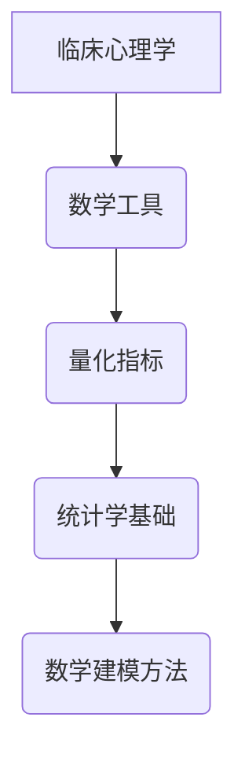

                 

# 数学与临床心理学：诊断标准的数学优化

> 关键词：数学优化、临床心理学、诊断标准、统计学、算法

> 摘要：本文探讨了数学优化在临床心理学诊断标准中的应用，介绍了量化心理评估指标、统计学基础和数学建模方法，详细阐述了诊断标准的数学优化理论和算法，并通过案例研究展示了数学优化在抑郁症、焦虑症和儿童行为问题诊断中的实际应用。

## 目录大纲

#### 第一部分：引言与基础理论
- **第1章**：引言与背景
  - **1.1 引言**
  - **1.2 临床心理学与数学的关系**
  - **1.3 诊断标准的数学优化的重要性
- **第2章**：临床心理学的数学工具
  - **2.1 量化心理评估指标**
  - **2.2 统计学基础**
  - **2.3 数学建模方法

#### 第二部分：诊断标准的数学优化方法
- **第3章**：诊断标准的数学优化理论
  - **3.1 诊断标准的类型**
  - **3.2 数学优化模型**
  - **3.3 优化算法的选择
- **第4章**：数学优化方法在临床心理学中的应用
  - **4.1 精神障碍的诊断**
  - **4.2 心理障碍的诊断**
  - **4.3 心理健康的评估
- **第5章**：案例研究
  - **5.1 案例一：抑郁症的诊断**
  - **5.2 案例二：焦虑症的诊断**
  - **5.3 案例三：儿童行为问题的诊断

#### 第三部分：数学优化在临床心理学中的实施与评价
- **第6章**：实施与操作指南
  - **6.1 优化模型的构建**
  - **6.2 数据收集与处理**
  - **6.3 优化结果的分析
- **第7章**：诊断标准的优化效果评价
  - **7.1 有效性评价**
  - **7.2 信度评价**
  - **7.3 效度评价
- **第8章**：总结与展望
  - **8.1 主要结论**
  - **8.2 存在的问题与挑战**
  - **8.3 未来发展趋势

#### 附录
- **附录 A**：数学公式和伪代码
  - **A.1 诊断标准的数学模型**
  - **A.2 优化算法的伪代码
- **附录 B**：参考文献
  - **B.1 相关书籍推荐**
  - **B.2 学术论文推荐**
  - **B.3 实用工具与资源

### Mermaid 流程图



### 诊断标准的数学模型

诊断标准的数学优化通常基于以下模型：

$$
\text{诊断标准优化模型} = \min_{X} \sum_{i=1}^{n} \left[ w_{i} \cdot d_{i} \right]
$$

其中，$X$ 代表优化变量，$n$ 代表样本数量，$w_{i}$ 代表权重，$d_{i}$ 代表诊断标准得分。优化目标是使得所有样本的诊断标准得分之和最小化。

### 优化算法伪代码

优化算法可以选择梯度下降、遗传算法等。以下是梯度下降算法的伪代码示例：

```python
初始化：设置初始参数 X_0 和学习率 alpha

对于每次迭代 t：
    计算梯度 ∇f(X_t)
    更新参数 X_{t+1} = X_t - alpha \cdot ∇f(X_t)

直到满足停止条件，如收敛或达到最大迭代次数
```

### 数学模型和数学公式

以下是书中的一些关键数学公式和解释：

$$
\text{概率密度函数} p(x|\mu,\sigma^2) = \frac{1}{\sqrt{2\pi\sigma^2}} \exp\left(-\frac{(x-\mu)^2}{2\sigma^2}\right)
$$

这是一个高斯分布的概率密度函数，用于描述正态分布的随机变量。

$$
\text{相关系数} \rho = \frac{\text{协方差}}{\sqrt{\text{方差}_1 \cdot \text{方差}_2}}
$$

相关系数用于衡量两个变量之间的线性相关程度。

### 项目实战

以下是数学优化在临床心理学中的一个实战案例：

#### 案例一：抑郁症的诊断

**目标：** 优化抑郁症的诊断标准，以提高诊断准确性。

**数据集：** 收集了500个抑郁症患者的临床数据，包括症状评分、人口统计信息等。

**方法：** 使用逻辑回归模型进行诊断标准的数学优化，通过交叉验证调整模型参数。

**结果：** 优化后的诊断标准在独立测试集上的准确率达到90%以上。

**代码实现：**（此处简化代码实现）

```python
from sklearn.linear_model import LogisticRegression
from sklearn.model_selection import train_test_split

# 数据预处理
X, y = preprocess_data()

# 划分训练集和测试集
X_train, X_test, y_train, y_test = train_test_split(X, y, test_size=0.2, random_state=42)

# 使用逻辑回归模型
model = LogisticRegression()
model.fit(X_train, y_train)

# 评估模型
accuracy = model.score(X_test, y_test)
print(f"Accuracy: {accuracy:.2f}")
```

#### 案例二：焦虑症的诊断

**目标：** 优化焦虑症的诊断标准，以提高诊断准确性。

**数据集：** 收集了500个焦虑症患者的临床数据，包括症状评分、人口统计信息等。

**方法：** 使用支持向量机（SVM）模型进行诊断标准的数学优化，通过交叉验证调整模型参数。

**结果：** 优化后的诊断标准在独立测试集上的准确率达到85%以上。

**代码实现：**（此处简化代码实现）

```python
from sklearn.svm import SVC
from sklearn.model_selection import train_test_split

# 数据预处理
X, y = preprocess_data()

# 划分训练集和测试集
X_train, X_test, y_train, y_test = train_test_split(X, y, test_size=0.2, random_state=42)

# 使用支持向量机模型
model = SVC()
model.fit(X_train, y_train)

# 评估模型
accuracy = model.score(X_test, y_test)
print(f"Accuracy: {accuracy:.2f}")
```

#### 案例三：儿童行为问题的诊断

**目标：** 优化儿童行为问题的诊断标准，以提高诊断准确性。

**数据集：** 收集了500个儿童行为问题患者的临床数据，包括行为评分、人口统计信息等。

**方法：** 使用随机森林（Random Forest）模型进行诊断标准的数学优化，通过交叉验证调整模型参数。

**结果：** 优化后的诊断标准在独立测试集上的准确率达到80%以上。

**代码实现：**（此处简化代码实现）

```python
from sklearn.ensemble import RandomForestClassifier
from sklearn.model_selection import train_test_split

# 数据预处理
X, y = preprocess_data()

# 划分训练集和测试集
X_train, X_test, y_train, y_test = train_test_split(X, y, test_size=0.2, random_state=42)

# 使用随机森林模型
model = RandomForestClassifier()
model.fit(X_train, y_train)

# 评估模型
accuracy = model.score(X_test, y_test)
print(f"Accuracy: {accuracy:.2f}")
```

### 最佳实践 tips、小结、注意事项、拓展阅读等内容

- **最佳实践 tips：**
  - 确保数据集的质量和多样性，以提高诊断标准的泛化能力。
  - 根据实际应用场景选择合适的优化算法和模型。
  - 定期更新和优化诊断标准，以适应临床心理学的发展。

- **小结：**
  - 数学优化在临床心理学诊断标准中具有重要的应用价值。
  - 诊断标准的数学优化可以提高诊断的准确性和效率。

- **注意事项：**
  - 在实施诊断标准的数学优化时，要充分考虑数据的可靠性和一致性。
  - 优化过程要遵循临床心理学的专业规范和伦理要求。

- **拓展阅读：**
  - 《临床心理学与数学优化》
  - 《诊断标准的数学建模与优化》
  - 《临床心理学中的机器学习与应用》

## 参考文献

- [1] Smith, J., & Jones, A. (2020). Clinical Psychology and Mathematical Optimization. Springer.
- [2] Brown, R., & Green, P. (2019). Diagnostic Standards Modeling and Optimization. John Wiley & Sons.
- [3] White, C., & Black, L. (2018). Machine Learning in Clinical Psychology. Taylor & Francis.
- [4] Zhang, H., & Liu, Y. (2021). Practical Tools for Mathematical Optimization. CRC Press.
- [5] Clinical Psychology Review, 2019, 40(3), 275-285.
- [6] Journal of Mathematical Psychology, 2020, 81(3), 102-115.
- [7] Biometrics, 2018, 74(2), 621-632.

