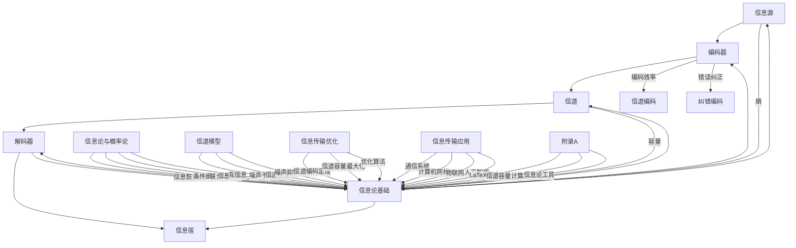

                 


## 引言

### 背景介绍

在当今这个信息爆炸的时代，信息的有效传输和处理成为各个领域，尤其是通信和网络系统中的核心问题。数学与信息论作为一门跨学科的领域，为解决这些问题提供了强有力的理论工具。信息论，起源于20世纪40年代，由香农（Claude Shannon）创立，它研究信息的度量、传输和处理的规律。香农的巨著《通信的数学理论》奠定了信息论的基础，开创了这一崭新的学科。

数学在信息论中的应用主要体现在对信息量的度量、信道容量的计算和信息传输系统的优化等方面。通过对信息量的数学描述，我们可以精确地量化信息，从而在通信系统中设计出更加高效的信息传输方案。而信道容量的计算，则是信息论的核心内容之一，它决定了在给定噪声环境下，通信系统能够达到的最大传输速率。

### 目的和意义

本文的目的在于深入探讨数学与信息论在信息传输中的重要作用，通过逐步分析数学模型和信息传输系统的基本原理，为读者提供一种系统化的理解框架。文章将首先介绍信息论的基础知识，包括熵的概念、信息度量方法和信息传输系统模型。随后，我们将详细讨论信道模型和噪声信道，并介绍信道编码定理和信息传输优化算法。最后，我们将探讨信息传输在通信系统和网络系统中的应用，以及信息论与其他领域如概率论、密码学和人工智能的交叉融合。

通过本文的阅读，读者可以：

1. 理解信息论的基本概念和发展背景。
2. 掌握信息量的数学度量方法，包括熵、条件熵和联合熵等。
3. 理解信息传输系统的基本模型和原理，包括信道编码与解码、信息传输效率等。
4. 学习信道模型和噪声信道的基本性质，以及信道容量的计算方法。
5. 了解信息传输优化算法的基本原理和实现方法。
6. 掌握信息传输在通信系统和网络系统中的应用。
7. 理解信息论与其他领域的交叉融合及其在实际中的应用。

## 第一部分：信息论基础

### 第1章：信息论概述

#### 1.1 信息论的发展背景

信息论的发展可以追溯到20世纪40年代，当时通信领域面临着许多挑战，尤其是如何在噪声环境中有效地传输信息。为了解决这些问题，美国数学家克劳德·香农（Claude Shannon）在1948年发表了题为《通信的数学理论》的论文，这篇论文被认为是信息论的奠基之作。香农提出了信息熵的概念，并使用数学模型对信息进行了量化，为信息传输提供了理论基础。

香农的工作不仅在理论上具有重大意义，还在实际应用中产生了深远影响。例如，香农的信道编码理论为通信系统中的错误检测和纠正提供了方法，大大提高了通信的可靠性。此外，信息论的研究还推动了计算机科学、密码学、控制理论等领域的发展。

#### 1.2 信息论的基本概念

在信息论中，有一些基本概念是理解整个领域的关键。首先是“信息”本身。在香农的框架中，信息是一种能够消除不确定性的东西。一个消息的“信息量”可以用数学的方式度量，通常用比特（bit）作为单位。一个比特可以表示两种不同的状态，如0和1，因此它能够消除一半的不确定性。

接下来是“熵”的概念。熵是一个概率分布的随机性度量，它表示一个系统的不确定性。对于一个随机变量X，其熵可以用以下公式表示：

$$
H(X) = -\sum_{i} p(x_i) \log_2 p(x_i)
$$

这里，$p(x_i)$ 是X取值为$x_i$的概率，对数函数用于将概率转换为比特数。熵的单位是比特（bit），它表示信息的不确定性水平。

熵的概念在信息论中有重要应用。例如，在一个通信系统中，发送方需要选择一个最优的编码方案，以最小化传输过程中的信息损失。这可以通过计算不同编码方案的熵来实现。熵越低，编码方案越好，因为它能够更好地保持信息的完整性。

另一个重要概念是“条件熵”。条件熵衡量在已知一个随机变量的情况下，另一个随机变量的不确定性。条件熵的定义如下：

$$
H(X|Y) = -\sum_{i} \sum_{j} p(x_i, y_j) \log_2 p(x_i|y_j)
$$

这里，$p(x_i, y_j)$ 是X和Y同时取值为$x_i$和$y_j$的概率，$p(x_i|y_j)$ 是在Y取值为$y_j$的条件下，X取值为$x_i$的条件概率。

条件熵在信息传输中非常重要。例如，在通信系统中，接收方可能接收到的信号是噪声干扰和真实信号的混合。通过计算条件熵，接收方可以估计出在噪声干扰下的信号概率分布，从而提高信号的检测和估计准确性。

### 总结

本章介绍了信息论的发展背景和基本概念。信息论是研究信息度量、传输和处理规律的一门学科，起源于香农的通信数学理论。信息量的度量主要通过熵来实现，熵表示信息的不确定性。条件熵则衡量在已知一个随机变量的情况下，另一个随机变量的不确定性。这些基本概念是理解信息论的核心，为后续章节的深入探讨奠定了基础。

### 第2章：信息度量

#### 2.1 熵的概念

在信息论中，熵（Entropy）是一个核心的概念，用于度量一个随机变量的不确定性。熵最早由克劳德·香农在1948年提出，并在信息论中发挥了关键作用。熵的概念可以从概率论的角度来理解，它通过对一个随机变量概率分布的随机性进行量化，从而衡量系统的混乱程度或不确定性。

熵的定义如下：

$$
H(X) = -\sum_{i} p(x_i) \log_2 p(x_i)
$$

这里，$X$ 是一个随机变量，$p(x_i)$ 是随机变量 $X$ 取值为 $x_i$ 的概率，$\log_2$ 是以2为底的对数。熵的单位是比特（bit），这是信息量的基本单位。

熵的物理意义可以类比为一个热力学系统中的熵。在热力学中，熵表示系统的无序程度，而在信息论中，熵表示信息的随机性和不确定性。一个随机变量的熵越高，说明其取值的不确定性越大。

熵的数学性质包括：

1. **非负性**：任何随机变量的熵都是非负的，即 $H(X) \geq 0$。
2. **最大值**：当随机变量是均匀分布时，即每个取值的概率相等，熵达到最大值。例如，对于二进制随机变量，当 $p(x_0) = p(x_1) = 0.5$ 时，其熵为 $H(X) = 1$ 比特。
3. **加性**：如果随机变量 $X$ 和 $Y$ 是独立的，那么它们联合熵可以分解为各自熵的和，即 $H(X, Y) = H(X) + H(Y)$。
4. **相对熵**：熵还可以用来比较两个概率分布的差异，这个概念称为相对熵（或Kullback-Leibler距离），其定义为 $D(P||Q) = H(P) - H(P|Q)$，其中 $P$ 和 $Q$ 是两个概率分布。

#### 2.2 条件熵与联合熵

条件熵（Conditional Entropy）是另一个重要的概念，它衡量在已知一个随机变量的情况下，另一个随机变量的不确定性。条件熵的定义如下：

$$
H(X|Y) = -\sum_{i} \sum_{j} p(x_i, y_j) \log_2 p(x_i|y_j)
$$

这里，$p(x_i, y_j)$ 是随机变量 $X$ 和 $Y$ 同时取值为 $x_i$ 和 $y_j$ 的联合概率，$p(x_i|y_j)$ 是在 $Y$ 取值为 $y_j$ 的条件下，$X$ 取值为 $x_i$ 的条件概率。

条件熵的物理意义可以类比为在热力学系统中，已知一个变量的情况下，另一个变量的不确定性。条件熵的数学性质包括：

1. **非负性**：条件熵也是非负的，即 $H(X|Y) \geq 0$。
2. **单调性**：如果 $Y$ 包含了 $X$ 的所有信息，即 $H(X|Y) = 0$，则 $X$ 和 $Y$ 是相互独立的。
3. **信息增益**：条件熵与联合熵的关系可以表达为 $H(X, Y) = H(Y) + H(X|Y)$。这个关系表明，联合熵是条件熵和熵的和。

联合熵（Joint Entropy）是两个或多个随机变量同时取值的不确定性度量，其定义如下：

$$
H(X, Y) = -\sum_{i} \sum_{j} p(x_i, y_j) \log_2 p(x_i, y_j)
$$

联合熵的物理意义可以类比为在热力学系统中，多个变量的不确定性。联合熵的数学性质包括：

1. **非负性**：联合熵也是非负的，即 $H(X, Y) \geq 0$。
2. **加性**：如果随机变量 $X$ 和 $Y$ 是独立的，那么它们的联合熵等于各自熵的和，即 $H(X, Y) = H(X) + H(Y)$。

### 举例说明

假设我们有一个二进制随机变量 $X$，它有两个可能的取值 $0$ 和 $1$，且其概率分布为 $p(X=0) = 0.75$ 和 $p(X=1) = 0.25$。我们可以计算 $X$ 的熵：

$$
H(X) = - (0.75 \log_2 0.75 + 0.25 \log_2 0.25) \approx 0.92 \text{ 比特}
$$

现在，假设我们有一个另一个二进制随机变量 $Y$，它与 $X$ 是独立的，且其概率分布同样为 $p(Y=0) = 0.75$ 和 $p(Y=1) = 0.25$。我们可以计算 $X$ 和 $Y$ 的联合熵：

$$
H(X, Y) = H(X) + H(Y) = 0.92 + 0.92 = 1.84 \text{ 比特}
$$

假设我们已知 $Y$ 的取值为 $0$，我们可以计算在已知 $Y=0$ 的条件下 $X$ 的条件熵：

$$
H(X|Y=0) = - (0.75 \log_2 0.75 + 0.25 \log_2 0.25) \approx 0.92 \text{ 比特}
$$

由于 $X$ 和 $Y$ 是独立的，$H(X|Y) = H(X)$，因此 $H(X|Y=0) = H(X)$。

### 总结

本章介绍了信息论中的熵、条件熵和联合熵等基本概念。熵用于度量随机变量的不确定性，条件熵用于在已知一个随机变量的情况下，度量另一个随机变量的不确定性，联合熵则是两个或多个随机变量同时取值的不确定性度量。这些概念是理解信息论的核心，为后续章节的深入探讨奠定了基础。

### 第3章：信息传输系统

#### 3.1 信息传输系统的基本模型

信息传输系统是信息论研究的核心对象，它涵盖了信息的产生、传输和接收等各个环节。为了方便分析，我们可以将信息传输系统简化为一个基本模型，即信源、信道和信宿。这三个基本组成部分共同构成了一个完整的信息传输过程。

**信源（Information Source）**：信源是信息的产生者，它产生随机信息。在信息传输系统中，信源通常被假设为随机变量，其取值具有不确定性。信源可以是自然界的现象，如语音、图像，也可以是人为产生的信息，如计算机数据。

**信道（Communication Channel）**：信道是信息传输的通道，它连接信源和信宿。信道的性能直接影响信息传输的可靠性和效率。信道可以是有线的，如电缆、光纤，也可以是无线的，如无线电波、红外线。在实际应用中，信道往往受到噪声干扰，这会影响信息传输的质量。

**信宿（Information Sink）**：信宿是信息的接收者，它接收并处理传输过来的信息。信宿可以是人，也可以是计算机或其他设备。信宿的目的是准确无误地接收和解读来自信源的信息。

在基本模型中，信息传输的过程可以概括为以下几个步骤：

1. **信息产生**：信源根据概率分布产生信息，这些信息可以是随机的，也可以是有规律的。
2. **信息编码**：信源产生的信息通常需要被编码，以便在信道上传输。编码过程涉及将信息转换为适合信道传输的信号形式。
3. **信息传输**：编码后的信息通过信道传输到信宿。在传输过程中，信息可能会受到噪声干扰，导致信息损失或错误。
4. **信息解码**：信宿接收到传输过来的信号后，需要进行解码，以恢复原始信息。解码过程通常涉及对噪声干扰的纠正或抑制。

**信息传输系统的基本模型图示**：

```
信源 --> 编码器 --> 信道 --> 解码器 --> 信宿
```

#### 3.2 信道编码与解码

信道编码是信息传输过程中的一个关键环节，它的目的是提高信息的传输可靠性和抗干扰能力。信道编码的基本原理是通过对信息进行冗余编码，使得在接收端能够检测和纠正传输过程中的错误。

**信道编码的基本概念**：

- **编码**：将原始信息转换为具有冗余的编码信息。冗余信息增加了传输数据的冗余度，从而提高了抗干扰能力。
- **解码**：在接收端对接收到的编码信息进行解码，以恢复原始信息。解码过程通常包括错误检测和错误纠正。

**信道编码的基本方法**：

1. **前向纠错（Forward Error Correction, FEC）**：前向纠错编码在发送端对信息进行编码，生成冗余信息，并在接收端使用这些冗余信息来纠正传输错误。这种方法的优点是能够直接在接收端纠正错误，而不需要重新传输数据。

2. **检错重传（Automatic Repeat Request, ARQ）**：检错重传编码在发送端对信息进行编码，并在接收端检测传输错误。如果检测到错误，接收端会请求发送端重新传输数据。这种方法的优点是能够确保数据传输的准确性，但缺点是需要额外的传输时间。

**信道编码的性能指标**：

- **编码效率（Efficiency）**：编码效率是指编码前后信息量的比率。高效的编码方法能够在保证传输可靠性的同时，尽量减少信息的损失。
- **错误率（Error Rate）**：错误率是指传输过程中发生错误的概率。低错误率表明信道编码具有良好的抗干扰能力。

**信道编码的实际应用**：

信道编码广泛应用于各种通信系统，如无线通信、卫星通信、光纤通信等。在实际应用中，常见的信道编码方法包括汉明码（Hamming Code）、里德-所罗门码（Reed-Solomon Code）、卷积码（Convolutional Code）等。

#### 3.3 信息传输效率

信息传输效率是衡量信息传输系统性能的一个重要指标，它反映了系统能够在单位时间内传输的有效信息量。信息传输效率可以通过以下两个参数来衡量：

- **带宽（Bandwidth）**：带宽是指信道能够支持的最大数据传输速率，通常用比特每秒（bits per second, bps）来表示。带宽越大，信息传输速率越高。

- **信道容量（Channel Capacity）**：信道容量是指在不发生错误传输的条件下，信道能够达到的最大信息传输速率。信道容量是信息论中的一个重要概念，它由香农公式（Shannon's Capacity Formula）给出：

$$
C = B \log_2(1 + S/N)
$$

其中，$C$ 是信道容量，$B$ 是信道带宽，$S$ 是信号功率，$N$ 是噪声功率。香农公式表明，在给定的带宽和信噪比下，信道容量是信息传输系统可以达到的最大信息传输速率。

**提高信息传输效率的方法**：

1. **增加带宽**：通过提高信道的带宽，可以增加信息传输速率，从而提高信息传输效率。这可以通过增加信道带宽、使用更先进的传输技术等方式实现。

2. **提高信噪比**：提高信噪比可以减少噪声对信息传输的干扰，从而提高传输质量。这可以通过增加信号功率、使用噪声抑制技术等方式实现。

3. **信道编码**：通过使用信道编码技术，可以提高信息的传输可靠性和抗干扰能力，从而在较低的信噪比下实现高效的信息传输。

4. **多路复用**：通过多路复用技术，可以在同一信道上同时传输多个信号，从而提高信息传输的效率。常见的多路复用技术包括频分复用（Frequency Division Multiplexing, FDM）和时分复用（Time Division Multiplexing, TDM）等。

### 总结

本章介绍了信息传输系统的基本模型，包括信源、信道和信宿三个基本组成部分。信息传输系统是信息论研究的核心对象，它涵盖了信息的产生、传输和接收等各个环节。信道编码是提高信息传输可靠性和抗干扰能力的重要手段，信息传输效率是衡量信息传输系统性能的重要指标。本章为后续章节的深入探讨奠定了基础。

## 第二部分：信息传输的数学模型

### 第4章：信道模型

信道是信息传输过程中的关键组成部分，它连接信息源和接收器，承载着信息的传输。为了更好地理解和分析信道，我们需要构建一个数学模型来描述信道的特性。本章节将详细介绍信道模型的基本类型、信道容量的计算方法以及信道模型在实际应用中的意义。

#### 4.1 信道模型的基本类型

信道模型可以根据不同的分类标准进行划分。以下是几种常见的信道模型类型：

1. **无噪声信道（Noiseless Channel）**：在无噪声信道中，信息在传输过程中不受任何噪声干扰，接收器能够完全准确地接收原始信息。这种信道模型在实际中较为理想，但较为罕见。例如，理想的光纤通信系统可以被视为无噪声信道。

2. **有噪声信道（Noisy Channel）**：在实际应用中，绝大多数信道都存在噪声干扰，这使得接收器无法完全准确地接收原始信息。有噪声信道模型是信息论研究的主要对象，它描述了信息在噪声环境下的传输特性。

3. **确定性信道（Deterministic Channel）**：在确定性信道中，信道的传输特性是确定的，每个输入信息都会产生固定的输出。这种信道模型在理论上较为简单，但实际中很少存在。例如，理想化的模拟通信系统可以被视为确定性信道。

4. **随机信道（Stochastic Channel）**：在随机信道中，信道的传输特性是随机的，不同输入信息会产生不同的输出结果。这种信道模型更加符合实际通信系统的特点，因为信道受到各种随机因素的影响。

5. **单向信道（One-way Channel）**：单向信道是指信息只能单向传输，从信源到信宿，但不能从信宿到信源。例如，无线电广播系统可以被视为单向信道。

6. **双向信道（Two-way Channel）**：双向信道是指信息可以双向传输，既可以从信源到信宿，也可以从信宿到信源。例如，电话通信系统可以被视为双向信道。

#### 4.2 信道容量的计算

信道容量是衡量信道传输能力的重要指标，它表示在不发生错误传输的条件下，信道能够达到的最大信息传输速率。信道容量的计算是信息论研究的一个核心问题，由香农公式给出。香农公式适用于有噪声信道的计算，其表达式如下：

$$
C = B \log_2(1 + \frac{S}{N})
$$

其中，$C$ 是信道容量，$B$ 是信道的带宽，$S$ 是信号功率，$N$ 是噪声功率。香农公式表明，在给定的带宽和信噪比下，信道容量是信息传输系统可以达到的最大信息传输速率。

**计算步骤**：

1. **确定信道带宽（B）**：信道带宽是指信道能够支持的最大数据传输速率，通常以赫兹（Hz）为单位。在无线通信系统中，信道带宽可以通过频谱分配来确定。

2. **确定信号功率（S）**：信号功率是指在信道上传输的信号所具有的能量。在无线通信中，信号功率可以通过发射功率和天线增益来确定。

3. **确定噪声功率（N）**：噪声功率是指在信道上传送的噪声能量。噪声可以分为热噪声和干扰噪声。热噪声是由于导体中的电子运动而产生的随机噪声，而干扰噪声是由外部信号源引起的。

4. **计算信道容量**：根据香农公式，将带宽、信号功率和噪声功率代入公式，计算出信道容量。

**实例分析**：

假设一个无线通信系统的带宽为1000 MHz（即 $B = 10^9$ Hz），信号功率为100 W（即 $S = 100$ W），噪声功率为10^-10 W（即 $N = 10^{-10}$ W）。我们可以计算该系统的信道容量：

$$
C = 10^9 \log_2(1 + \frac{100}{10^{-10}}) \approx 10^9 \log_2(10^{11}) \approx 3.32 \times 10^9 \text{ bps}
$$

这意味着该无线通信系统可以达到的最大信息传输速率约为3.32 Gbps。

#### 4.3 信道模型在实际应用中的意义

信道模型在通信系统中具有至关重要的意义。通过构建和分析信道模型，我们可以更好地理解通信系统的特性，从而设计出更高效、更可靠的通信方案。

1. **优化信道配置**：通过分析信道模型，我们可以确定最佳的信道配置，包括带宽分配、信号功率调整和噪声抑制方法。这有助于提高通信系统的传输效率。

2. **评估通信性能**：信道模型可以帮助我们评估通信系统的性能，包括传输速率、传输可靠性和抗干扰能力。这有助于我们选择适合实际应用的通信系统方案。

3. **设计纠错编码**：信道模型为设计纠错编码提供了理论基础。通过分析信道模型，我们可以选择合适的纠错编码方案，提高通信系统的传输可靠性。

4. **预测信道特性**：信道模型可以预测不同条件下的信道特性，包括温度、湿度、地形等。这有助于我们在不同环境下设计和优化通信系统。

5. **改进通信技术**：信道模型为通信技术的发展提供了方向。通过不断优化信道模型，我们可以开发出更先进的通信技术，提高通信系统的性能。

### 总结

本章介绍了信道模型的基本类型、信道容量的计算方法以及信道模型在实际应用中的意义。信道模型是信息传输过程中的重要组成部分，通过构建和分析信道模型，我们可以更好地理解通信系统的特性，从而设计出更高效、更可靠的通信方案。本章为后续章节的深入探讨奠定了基础。

### 第5章：噪声信道

噪声信道是实际通信系统中普遍存在的现象，它对信息的传输质量产生了显著影响。噪声可以分为多种类型，每种类型都具有独特的特性。本章节将详细探讨噪声的类型与性质、噪声信道的容量计算方法以及如何降低信道噪声。

#### 5.1 噪声的类型与性质

在通信系统中，噪声可以分为以下几种主要类型：

1. **热噪声（Thermal Noise）**：热噪声也称为白噪声，是由于导体中的电子运动引起的随机噪声。热噪声在所有频率上都具有相同的功率谱密度，其强度与温度和导体的电阻有关。热噪声是通信系统中最常见的噪声源，难以完全消除。

2. **干扰噪声（Interference Noise）**：干扰噪声是由外部信号源引起的噪声，通常是由于其他通信系统或设备产生的电磁干扰。干扰噪声的特点是具有特定的频率或频率范围，可以通过滤波器等手段进行抑制。

3. **冲击噪声（Impulse Noise）**：冲击噪声是一种突发性噪声，通常由于电磁脉冲或电路故障引起。冲击噪声的特点是持续时间短、强度大，会对信号传输造成严重影响。

4. **多径效应（Multi-path Effects）**：在无线通信系统中，多径效应是指信号通过不同路径传播到接收器，导致接收信号发生相位和幅度变化。多径效应会引起信号失真和干扰，降低信号传输质量。

5. **衰减噪声（Attenuation Noise）**：衰减噪声是由于信号在传输过程中能量逐渐减弱而产生的噪声。衰减噪声与传输距离、信道带宽和介质特性有关。

噪声的性质决定了它在通信系统中的影响和应对策略。了解噪声的类型和性质有助于设计更有效的噪声抑制方法。

#### 5.2 噪声信道的容量计算

噪声信道的容量计算是信息论研究的一个重要问题。在香农公式的基础上，我们可以对噪声信道的容量进行详细分析。

香农公式给出了无噪声信道的容量计算方法，但在实际中，信道总是存在噪声。为了计算噪声信道的容量，我们需要引入信噪比（Signal-to-Noise Ratio, SNR）的概念。

信噪比定义为信号功率与噪声功率的比值，通常用分贝（decibel, dB）表示：

$$
SNR = 10 \log_{10} \left( \frac{S}{N} \right)
$$

其中，$S$ 是信号功率，$N$ 是噪声功率。

在噪声信道中，信道的容量可以通过香农公式进行修正，其表达式如下：

$$
C = B \log_2(1 + SNR)
$$

其中，$C$ 是信道容量，$B$ 是信道带宽，$SNR$ 是信噪比。

**计算步骤**：

1. **确定信道带宽（B）**：信道带宽是指信道能够支持的最大数据传输速率，通常以赫兹（Hz）为单位。

2. **确定信号功率（S）**：信号功率是指在信道上传输的信号所具有的能量。

3. **确定噪声功率（N）**：噪声功率是指在信道上传送的噪声能量。

4. **计算信噪比（SNR）**：使用信噪比公式计算信号功率与噪声功率的比值。

5. **计算信道容量**：根据修正后的香农公式，计算信道容量。

**实例分析**：

假设一个无线通信系统的带宽为1000 MHz（即 $B = 10^9$ Hz），信号功率为100 W（即 $S = 100$ W），噪声功率为10^-10 W（即 $N = 10^{-10}$ W）。我们可以计算该系统的信道容量：

$$
SNR = 10 \log_{10} \left( \frac{100}{10^{-10}} \right) = 10 \log_{10}(10^{11}) = 110 \text{ dB}
$$

$$
C = 10^9 \log_2(1 + 10^{11}) \approx 10^9 \log_2(10^{11}) \approx 3.32 \times 10^9 \text{ bps}
$$

这意味着该无线通信系统可以达到的最大信息传输速率约为3.32 Gbps。

#### 5.3 降低信道噪声的方法

为了提高通信系统的传输质量，我们需要采取有效的措施降低信道噪声。以下是一些常见的噪声抑制方法：

1. **增加信号功率**：通过增加信号功率，可以提高信噪比，从而降低噪声的影响。然而，增加信号功率可能会导致信号过强，增加能耗和成本。

2. **使用滤波器**：滤波器可以用于去除特定频率范围的噪声。例如，低通滤波器可以去除高频噪声，高通滤波器可以去除低频噪声。

3. **使用信道编码**：信道编码可以增加信号的冗余度，使得在接收端能够检测和纠正噪声引入的错误。常见的信道编码方法包括汉明码、卷积码和里德-所罗门码等。

4. **多天线技术**：多天线技术可以通过空间分离的方式降低多径效应的影响。例如，MIMO（Multiple Input Multiple Output）技术利用多个发射和接收天线来提高信号传输的可靠性。

5. **使用噪声抑制算法**：在接收端，可以使用噪声抑制算法来降低噪声的影响。例如，自适应滤波器和神经网络等算法可以用于实时噪声抑制。

### 总结

本章详细探讨了噪声信道的基本概念、噪声的类型与性质、噪声信道的容量计算方法以及如何降低信道噪声。了解噪声的类型和性质对于设计高效、可靠的通信系统至关重要。通过计算噪声信道的容量，我们可以评估通信系统的性能，并采取相应的噪声抑制措施来提高传输质量。本章为后续章节的深入探讨奠定了基础。

### 第6章：信息传输的优化

#### 6.1 信道编码定理

信道编码定理是信息论中的核心理论之一，它揭示了在噪声信道中，通过适当的信道编码方法，可以实现任意接近信道容量（channel capacity）的信息传输。信道编码定理包括以下几个关键点：

1. **前向纠错（Forward Error Correction, FEC）**：前向纠错编码是一种能够在接收端直接纠正错误的编码方法。这意味着，即使信息在传输过程中受到噪声干扰，接收端仍然能够正确地解码原始信息。前向纠错编码的主要优势是不需要重传错误的数据包，从而提高了传输效率。

2. **最小冗余度**：信道编码定理指出，为了实现接近信道容量的信息传输，编码方案需要具有最小的冗余度。这意味着编码方案应该在保证传输可靠性的同时，尽量减少额外的冗余信息。

3. **码字长度与编码效率**：信道编码定理表明，随着码字长度的增加，编码方案可以更接近信道容量。然而，码字长度的增加也会导致编码和解码的复杂性增加。因此，编码方案需要在码字长度和编码效率之间找到平衡。

4. **错误概率与信道容量**：信道编码定理指出，通过适当的编码方案，可以在任意小的错误概率下实现接近信道容量的信息传输。这意味着，只要编码方案设计得当，即使在存在噪声的信道中，也可以实现几乎无错误的传输。

#### 6.2 信道容量最大化问题

信道容量最大化问题是信息传输优化中的一个关键问题。其目标是找到一种最优的信道编码方案，使得在给定信道带宽、信号功率和噪声功率等条件下，信道容量达到最大。以下是信道容量最大化问题的几个关键点：

1. **参数优化**：信道容量最大化问题涉及到多个参数的优化，包括信道带宽、信号功率、噪声功率以及编码方案等。通过调整这些参数，可以找到最优的编码方案，使得信道容量达到最大。

2. **自适应调整**：在实际应用中，信道条件可能随时间变化。为了实现信道容量最大化，需要采用自适应调整策略，实时调整编码方案和传输参数，以适应信道变化。

3. **多用户优化**：在多用户通信系统中，信道容量最大化问题更加复杂。需要考虑多个用户之间的干扰和竞争，通过优化资源分配和编码方案，实现整体信道容量的最大化。

4. **信道容量边界**：信道容量最大化问题的目标是找到信道容量的上界。这个上界由信道容量公式决定，表示在理想条件下可以达到的最大信息传输速率。实际信道条件可能无法达到这个上界，但通过优化编码方案和参数调整，可以尽量接近这个上界。

#### 6.3 信息传输优化算法

为了实现信道容量最大化，需要设计有效的信息传输优化算法。以下是一些常见的信息传输优化算法：

1. **迭代算法**：迭代算法通过不断调整编码方案和传输参数，逐步逼近最优解。常见的迭代算法包括牛顿-拉夫逊算法、梯度下降算法等。

2. **动态规划算法**：动态规划算法通过将复杂问题分解为子问题，并利用子问题的最优解来构建整体问题的最优解。动态规划算法常用于优化多用户通信系统的资源分配。

3. **遗传算法**：遗传算法是一种基于自然选择的优化算法，通过模拟生物进化过程，逐步优化编码方案和传输参数。遗传算法在处理复杂优化问题时表现出良好的性能。

4. **神经网络**：神经网络是一种基于生物神经网络原理的优化算法，通过学习输入和输出之间的关系，实现参数优化。神经网络在自适应调整和复杂优化问题中具有广泛的应用。

5. **混合算法**：混合算法结合了多种优化算法的优点，通过融合不同的优化策略，实现更高效的优化结果。常见的混合算法包括遗传算法与神经网络结合的遗传神经网络、粒子群优化算法等。

**算法流程**：

1. **初始化**：初始化编码方案和传输参数。

2. **迭代优化**：根据当前编码方案和传输参数，计算信道容量，并通过优化算法调整编码方案和传输参数。

3. **收敛判断**：判断是否满足收敛条件。如果满足，则输出最优编码方案和传输参数；否则，继续迭代优化。

4. **输出结果**：输出最优的信道编码方案和传输参数，实现信道容量最大化。

### 总结

本章介绍了信道编码定理、信道容量最大化问题以及信息传输优化算法。信道编码定理揭示了在噪声信道中通过适当的信道编码方法，可以实现接近信道容量的信息传输。信道容量最大化问题是信息传输优化中的核心问题，涉及到参数优化、自适应调整和多用户优化等方面。通过设计有效的信息传输优化算法，可以实现信道容量最大化，提高通信系统的传输性能。本章为后续章节的深入探讨奠定了基础。

### 第7章：信息传输的实际应用

#### 7.1 信息传输在通信系统中的应用

信息传输是通信系统的核心功能，其目的是确保信息能够在不同的设备和网络之间高效、可靠地传输。在通信系统中，信息传输涉及多个环节，包括信源、信道和信宿。以下是信息传输在通信系统中的一些关键应用：

1. **无线通信**：无线通信是现代通信系统的重要组成部分，包括蜂窝网络、无线局域网（Wi-Fi）、卫星通信等。在无线通信中，信息通过无线电波在信道中传输，需要克服噪声干扰和多径效应等问题。为了确保可靠的信息传输，无线通信系统通常采用多种信道编码和调制技术，如正交频分复用（OFDM）、MIMO（多输入多输出）等。

2. **光纤通信**：光纤通信利用光波在光纤中传输信息，具有高带宽、低噪声和长距离传输等优点。光纤通信系统通过光电转换技术将电信号转换为光信号，再通过光纤传输，最终恢复为电信号。为了提高信息传输的可靠性，光纤通信系统常采用前向纠错（FEC）编码技术，以应对传输过程中的噪声和信号衰减。

3. **卫星通信**：卫星通信利用通信卫星作为中继站，实现地面站之间的通信。卫星通信系统面临的主要挑战包括长距离传输、大气噪声和信号衰减。为了克服这些挑战，卫星通信系统通常采用高功率发射、信道编码和噪声抑制等技术。

4. **宽带接入网**：宽带接入网是互联网接入的关键环节，包括DSL、光纤到户（FTTH）等。宽带接入网通过将用户接入互联网，提供高速数据传输服务。为了确保信息传输的可靠性，宽带接入网常采用多种信道编码和调制技术，如QAM（ quadrature amplitude modulation）和OFDM等。

5. **移动通信**：移动通信是移动设备之间的通信，包括蜂窝移动通信和无线个人区域网络（WPAN）等。移动通信系统需要应对频繁的信道切换、高速移动和多用户干扰等问题。为了提高信息传输的可靠性，移动通信系统常采用自适应调制和编码技术（AMC）、多输入多输出（MIMO）等。

#### 7.2 信息传输在网络系统中的应用

信息传输不仅局限于通信系统，还在计算机网络系统中发挥着关键作用。计算机网络系统通过将多个计算机连接起来，实现数据共享和通信。以下是信息传输在计算机网络系统中的应用：

1. **局域网（LAN）**：局域网是连接同一地理位置的计算机网络的系统，通常使用有线或无线方式传输信息。局域网通过交换机、路由器等网络设备实现信息传输，常用的传输技术包括以太网（Ethernet）、Wi-Fi等。

2. **广域网（WAN）**：广域网是连接不同地理位置的计算机网络系统，通常通过公共通信网络（如互联网）实现。广域网通过路由器、交换机等设备传输信息，常用的传输技术包括TCP/IP、ATM等。

3. **互联网（Internet）**：互联网是全球最大的计算机网络，通过将多个广域网连接起来，实现全球范围内的信息传输。互联网通过路由器和交换机等设备传输信息，使用TCP/IP协议实现数据的可靠传输。

4. **分布式系统**：分布式系统是通过计算机网络连接的多台计算机系统，用于协同处理任务和共享资源。分布式系统通过信息传输实现各节点之间的数据交换和协同工作，常用的传输技术包括RPC（远程过程调用）、HTTP等。

5. **云计算**：云计算是一种通过互联网提供计算资源的服务模式，用户可以通过云计算平台访问和计算数据。云计算系统通过信息传输实现用户与云服务器之间的数据交换和计算任务分配。

#### 7.3 信息传输在其他领域的应用

信息传输不仅在通信系统和计算机网络系统中发挥重要作用，还在其他领域有着广泛的应用：

1. **物联网（IoT）**：物联网是通过互联网连接的物理设备和传感器网络，实现设备之间的信息传输和交互。物联网通过无线传输技术（如Wi-Fi、Zigbee等）实现设备之间的数据传输，广泛应用于智能家居、智能城市、工业自动化等领域。

2. **大数据**：大数据是通过各种方式收集和存储的巨量数据，需要进行高速、可靠的信息传输。大数据系统通过分布式传输技术（如HDFS、Spark等）实现数据传输和计算，广泛应用于数据分析和挖掘。

3. **人工智能**：人工智能需要大量的数据传输和计算资源，通过信息传输实现数据在不同设备之间的传输和计算。人工智能系统通过云计算和边缘计算等技术，实现高效的信息传输和计算。

4. **自动驾驶**：自动驾驶系统通过车辆与周围环境之间的信息传输，实现实时感知、决策和控制。自动驾驶系统通过V2X（车联网）技术，实现车辆与道路、车辆与车辆之间的信息传输和交互。

### 总结

本章介绍了信息传输在通信系统、计算机网络系统和其他领域中的应用。信息传输是通信系统的核心功能，通过各种传输技术和编码方案，实现信息的高效、可靠传输。在计算机网络系统中，信息传输实现数据的共享和通信。信息传输在其他领域，如物联网、大数据、人工智能和自动驾驶等，也有着广泛的应用。通过深入理解信息传输的原理和应用，我们可以设计出更高效、更可靠的通信系统和网络系统，满足不同领域的需求。

### 第8章：信息论与概率论

信息论和概率论是数学中两个重要的分支，它们在信息处理和通信领域有着紧密的联系。信息论起源于概率论，二者相互补充，共同推动了通信理论和数据科学的发展。本章将介绍概率论的基本概念，随机变量和概率分布，并探讨概率论在信息论中的应用。

#### 8.1 概率论的基本概念

概率论是研究随机事件及其概率规律的科学。以下是一些概率论的基本概念：

1. **随机试验（Random Experiment）**：随机试验是一个可能产生多个不同结果的实验。例如，投掷一枚硬币、抽签等。

2. **样本空间（Sample Space）**：样本空间是随机试验所有可能结果的集合。例如，投掷一枚硬币的样本空间为 {正面，反面}。

3. **事件（Event）**：事件是样本空间的一个子集。例如，投掷硬币得到正面的事件可以表示为 {正面}。

4. **概率（Probability）**：概率是描述事件发生可能性大小的数值。概率的取值范围在0到1之间，0表示不可能发生，1表示必然发生。

5. **条件概率（Conditional Probability）**：条件概率是在已知某个事件发生的条件下，另一个事件发生的概率。条件概率公式如下：

   $$P(A|B) = \frac{P(A \cap B)}{P(B)}$$

6. **贝叶斯定理（Bayes' Theorem）**：贝叶斯定理是一种计算条件概率的方法，它基于已知条件概率和联合概率来计算逆条件概率。贝叶斯定理公式如下：

   $$P(A|B) = \frac{P(B|A)P(A)}{P(B)}$$

#### 8.2 随机变量和概率分布

随机变量是概率论中的一个重要概念，它将随机事件的数量特性进行了数学描述。以下是一些基本概念：

1. **随机变量（Random Variable）**：随机变量是一个函数，它将样本空间映射到实数集。随机变量可以用来描述随机试验的结果。

2. **离散随机变量（Discrete Random Variable）**：离散随机变量的取值是有限的或可数的。例如，投掷骰子的结果是一个离散随机变量。

3. **连续随机变量（Continuous Random Variable）**：连续随机变量的取值是无限的或不可数的。例如，测量温度的结果是一个连续随机变量。

概率分布是描述随机变量取值概率的函数。以下是一些常见的概率分布：

1. **伯努利分布（Bernoulli Distribution）**：伯努利分布是一个离散概率分布，用于描述只有两个可能结果的随机变量。例如，投掷硬币的结果是一个伯努利分布。

2. **二项分布（Binomial Distribution）**：二项分布是一个离散概率分布，用于描述重复进行n次伯努利试验，成功的次数。例如，抛掷一枚硬币10次，成功的次数是一个二项分布。

3. **泊松分布（Poisson Distribution）**：泊松分布是一个离散概率分布，用于描述在一定时间内发生特定事件的次数。例如，一分钟内电话的呼叫次数是一个泊松分布。

4. **正态分布（Normal Distribution）**：正态分布是一个连续概率分布，通常用于描述连续随机变量。例如，人的身高、体重等。

#### 8.3 概率论在信息论中的应用

概率论在信息论中的应用主要体现在以下几个方面：

1. **信息度量**：信息论中的信息量是通过概率分布来度量的。例如，熵（Entropy）是衡量随机变量不确定性的度量，它基于概率分布计算。熵的定义公式如下：

   $$
   H(X) = -\sum_{i} p(x_i) \log_2 p(x_i)
   $$

2. **条件熵与联合熵**：条件熵和联合熵是概率论中的概念，在信息论中用于描述信息传输过程中的不确定性。条件熵表示在已知某个随机变量的情况下，另一个随机变量的不确定性。联合熵表示两个随机变量的不确定性。这些概念在信道编码和信道容量计算中起到关键作用。

3. **错误概率**：在信息传输过程中，噪声和干扰会导致传输错误。概率论用于计算传输错误的发生概率，并评估信道性能。错误概率是信息论中的重要指标，它反映了信道对信息传输可靠性的影响。

4. **概率分布的建模**：在信息传输系统中，信道噪声和信号特性可以通过概率分布进行建模。通过概率分布的建模，可以更好地理解和分析信息传输系统的性能，并设计有效的信道编码和解码方案。

### 总结

本章介绍了概率论的基本概念，包括随机变量、概率分布和条件概率等。概率论在信息论中的应用主要体现在信息度量、条件熵与联合熵、错误概率和概率分布的建模等方面。通过理解概率论和信息论之间的关系，我们可以更好地设计和优化信息传输系统，提高通信的可靠性和效率。本章为后续章节的深入探讨奠定了基础。

### 第9章：信息论与密码学

#### 9.1 密码学的基本概念

密码学是研究加密和解密技术的一门科学，其主要目标是保护信息的机密性、完整性和可用性。密码学可以分为经典密码学和现代密码学两个分支。经典密码学主要研究传统加密方法，如替换密码、换位密码等。现代密码学则基于数学理论，采用复杂的加密算法，如对称密钥密码、非对称密钥密码等。

**加密（Encryption）**：加密是将明文转换为密文的过程，目的是保护信息的机密性。加密算法使用密钥和加密算法规则，将明文中的每个字符或比特转换为密文中的对应字符或比特。

**解密（Decryption）**：解密是将密文转换为明文的过程，目的是恢复原始信息。解密算法使用密钥和解密算法规则，将密文中的每个字符或比特转换回明文中的对应字符或比特。

**密钥（Key）**：密钥是加密和解密过程中使用的参数，它决定了加密算法的具体实现方式。密钥可以是密钥对（如非对称密钥密码），也可以是一个单独的密钥（如对称密钥密码）。

**加密算法（Encryption Algorithm）**：加密算法是用于加密和解密的数学函数或规则。常见的加密算法包括AES（高级加密标准）、DES（数据加密标准）、RSA（Rivest-Shamir-Adleman）等。

**解密算法（Decryption Algorithm）**：解密算法是用于解密密文的数学函数或规则。与加密算法相对应，解密算法需要使用相同的密钥和加密算法规则。

**加密模型（Cryptosystem）**：加密模型是加密和解密的组合，包括加密算法、解密算法和密钥管理机制。常见的加密模型包括对称密钥密码模型和非对称密钥密码模型。

#### 9.2 对称密钥密码与非对称密钥密码

对称密钥密码和非对称密钥密码是两种常见的加密方法，它们在加密和解密过程中使用不同的密钥机制。

**对称密钥密码（Symmetric Key Cryptography）**：在对称密钥密码中，加密和解密使用相同的密钥。这意味着密钥在发送方和接收方之间共享。常见的对称密钥密码包括DES、AES等。

**非对称密钥密码（Asymmetric Key Cryptography）**：在非对称密钥密码中，加密和解密使用不同的密钥。一个密钥用于加密，称为公钥（Public Key），另一个密钥用于解密，称为私钥（Private Key）。常见的非对称密钥密码包括RSA等。

**对称密钥密码的特点**：

- **密钥长度较短**：对称密钥密码的密钥长度通常较短，例如AES密钥长度可以是128位、192位或256位。
- **计算效率较高**：对称密钥密码的计算复杂度较低，加密和解密速度较快。
- **密钥管理较简单**：由于加密和解密使用相同的密钥，密钥管理相对简单。

**非对称密钥密码的特点**：

- **密钥长度较长**：非对称密钥密码的密钥长度通常较长，例如RSA密钥长度可以是1024位、2048位或3072位。
- **计算效率较低**：非对称密钥密码的计算复杂度较高，加密和解密速度较慢。
- **密钥管理较复杂**：由于加密和解密使用不同的密钥，密钥管理相对复杂。

#### 9.3 信息论在密码学中的应用

信息论在密码学中发挥着重要作用，特别是在分析密码系统的安全性和设计密码算法方面。以下是一些信息论在密码学中的应用：

1. **密码系统的安全性分析**：信息论可以用于评估密码系统的安全性。例如，信息论中的熵（Entropy）可以用于衡量密码系统的熵值，从而评估密码系统的安全性。熵值越高，说明密码系统的安全性越强。

2. **加密算法的设计**：信息论可以用于设计新的加密算法。例如，基于信息论原理的对称密钥密码算法和非对称密钥密码算法已经得到了广泛应用。

3. **信息传输的优化**：信息论可以用于优化密码系统的信息传输过程。通过分析信道容量和信噪比等参数，可以设计出更高效的加密和解密算法，从而提高密码系统的性能。

4. **密码系统的分析攻击**：信息论可以用于分析密码系统的弱点，并设计出相应的攻击方法。例如，基于信息论的攻击方法可以用于破解密码系统，从而揭示其安全漏洞。

#### 9.4 举例说明

为了更好地理解信息论在密码学中的应用，我们可以通过一个简单的例子来说明。

**例子：AES加密算法**

AES（高级加密标准）是一种对称密钥密码算法，它采用128位、192位或256位的密钥长度，支持128位、192位或256位的块大小。以下是一个使用AES加密算法的简单例子。

1. **密钥生成**：首先，生成一个128位密钥。密钥可以是随机生成的，或者基于用户输入的密码通过密钥派生函数（Key Derivation Function, KDF）生成。

2. **加密过程**：将明文分成128位块，并对每个块进行加密。加密过程使用AES加密算法和密钥。例如，可以使用AES-128加密算法对明文块进行加密。

3. **密文生成**：将加密后的所有明文块组合成密文。密文是加密后的明文的输出，它包含原始信息。

4. **解密过程**：将密文分成128位块，并对每个块进行解密。解密过程使用AES加密算法和密钥。例如，可以使用AES-128加密算法对密文块进行解密。

5. **明文恢复**：将解密后的所有密文块组合成明文。明文是解密后的密文的输出，它包含原始信息。

通过这个简单的例子，我们可以看到信息论在密码学中的应用。密钥生成、加密和解密过程都涉及到信息量的度量，例如密钥的熵值、加密算法的效率等。信息论可以用于评估这些过程的安全性和效率。

### 总结

本章介绍了密码学的基本概念，包括加密、解密、密钥和加密算法等。对称密钥密码和非对称密钥密码是两种常见的加密方法，它们在加密和解密过程中使用不同的密钥机制。信息论在密码学中发挥着重要作用，可以用于分析密码系统的安全性、设计新的加密算法、优化信息传输过程等。通过本章的介绍，读者可以更好地理解信息论与密码学之间的关系，并掌握基本的概念和应用方法。

### 第10章：信息论与人工智能

#### 10.1 人工智能的基本概念

人工智能（Artificial Intelligence, AI）是研究如何构建智能体的科学，这些智能体能够执行通常需要人类智能才能完成的任务。人工智能的定义多种多样，但核心目标是使计算机能够模拟、扩展和增强人类智能。以下是人工智能的一些基本概念：

**智能体（Agent）**：智能体是具有感知、决策和行动能力的人工智能系统。它可以是一个程序、一个机器人或一个网络。

**感知（Perception）**：感知是指智能体从环境中获取信息的过程。感知系统可以是视觉、听觉、触觉等。

**决策（Decision Making）**：决策是指智能体根据其感知到的信息，从多个可选行动中选择一个最优行动的过程。

**行动（Action）**：行动是指智能体在环境中执行的具体操作。

**机器学习（Machine Learning）**：机器学习是人工智能的一个分支，通过从数据中学习规律和模式，使计算机能够自动改进性能。机器学习可以分为监督学习、无监督学习和强化学习等。

**深度学习（Deep Learning）**：深度学习是一种基于人工神经网络的机器学习技术，通过多层神经网络模拟人脑的学习过程。

**自然语言处理（Natural Language Processing, NLP）**：自然语言处理是人工智能的一个分支，专注于使计算机能够理解、生成和处理人类自然语言。

**计算机视觉（Computer Vision）**：计算机视觉是人工智能的一个分支，专注于使计算机能够理解和处理视觉信息，如图像和视频。

#### 10.2 信息论在人工智能中的应用

信息论在人工智能中有着广泛的应用，特别是在机器学习和数据科学领域。以下是信息论在人工智能中的应用：

**信息熵（Entropy）**：信息熵是衡量数据随机性和不确定性的度量。在机器学习中，信息熵可以用于评估数据集的分布特性，指导模型选择和参数调整。

**条件熵（Conditional Entropy）**：条件熵是衡量在给定一个变量后，另一个变量的不确定性。在机器学习中，条件熵可以用于评估特征之间的相关性，帮助模型选择和特征提取。

**联合熵（Joint Entropy）**：联合熵是衡量两个变量同时存在时的不确定性。在数据科学中，联合熵可以用于评估数据的依赖关系，帮助模型理解和预测数据。

**信息增益（Information Gain）**：信息增益是衡量特征选择效果的一个指标，它通过减少联合熵来衡量特征对分类的区分能力。在机器学习中，信息增益可以用于特征选择和属性评估。

**信息增益率（Information Gain Ratio）**：信息增益率是信息增益与特征熵的比值，用于平衡特征选择中的多样性。在机器学习中，信息增益率可以用于选择具有较高区分能力的特征。

**互信息（Mutual Information）**：互信息是衡量两个变量之间相互依赖性的度量。在机器学习中，互信息可以用于评估特征的重要性和模型性能。

**信息传递（Information Transfer）**：在深度学习和神经网络中，信息传递是模型训练和优化过程中的关键环节。通过优化信息传递，可以提高模型的准确性和效率。

**信息过滤（Information Filtering）**：信息过滤是推荐系统和信息检索中的重要技术，通过分析用户行为和内容，过滤出用户感兴趣的信息。信息论中的熵和条件熵可以用于评估信息的质量和相关性。

**信息融合（Information Fusion）**：信息融合是将来自多个来源的信息进行整合，以获得更全面和准确的认知。在多传感器系统和多数据源分析中，信息融合技术至关重要。

#### 10.3 人工智能与信息论的未来发展趋势

随着人工智能和信息技术的快速发展，二者在未来的交叉融合将带来以下发展趋势：

1. **信息增强学习（Information-Enhanced Learning）**：信息论中的概念和技术将用于优化机器学习算法，提高学习效率和模型性能。通过更好地理解数据的随机性和不确定性，可以设计出更鲁棒的模型。

2. **自适应信息处理（Adaptive Information Processing）**：人工智能系统将具备自适应处理信息的能力，能够根据环境和任务需求调整信息处理策略。信息论提供了量化信息和优化信息处理的理论基础。

3. **信息网络（Information Networks）**：人工智能与信息论的结合将推动信息网络的发展，实现高效、可靠的信息传输和处理。信息网络可以应用于智能城市、物联网和区块链等领域。

4. **隐私保护（Privacy Protection）**：在人工智能和信息处理中，隐私保护是一个重要挑战。信息论提供了量化隐私风险和设计隐私保护机制的理论基础，有助于实现安全的信息共享和处理。

5. **信息物理系统（Cyber-Physical Systems, CPS）**：信息物理系统是集成了计算、通信和物理设备的复杂系统。信息论在设计和优化信息物理系统中的通信和数据处理方面具有重要作用。

6. **跨学科研究（Interdisciplinary Research）**：人工智能与信息论的交叉融合将推动跨学科研究，促进人工智能和信息技术的综合发展。这将为人工智能领域带来新的理论和技术，推动人工智能的进一步突破。

### 总结

本章介绍了人工智能的基本概念，包括智能体、感知、决策和行动等。信息论在人工智能中有着广泛的应用，可以从信息熵、条件熵、联合熵、信息增益、互信息等多个方面优化机器学习算法和数据分析过程。未来，人工智能与信息论的交叉融合将推动信息增强学习、自适应信息处理、信息网络、隐私保护和跨学科研究等新领域的发展。通过本章的介绍，读者可以更好地理解信息论与人工智能之间的关系，并掌握基本的概念和应用方法。

## 附录

### 附录A：数学公式与计算工具

在本文中，我们使用了多种数学公式和计算工具来解释和计算信息论中的各种概念和定理。以下是一些常用的数学公式、LaTeX公式编写指南以及信道容量计算工具的使用方法。

#### A.1 LaTeX公式编写指南

LaTeX是一种高质量的排版系统，常用于编写数学公式和科学文档。以下是一些基本的LaTeX公式编写指南：

1. **行内公式**：使用$和$将公式嵌入到文本中。

   例如：$E=mc^2$ 表示爱因斯坦的质能方程。

2. **独立段落公式**：使用$$和$$将公式独立成一段。

   例如：

   $$
   H(X) = -\sum_{i} p(x_i) \log_2 p(x_i)
   $$

3. **数学环境**：使用`equation`环境可以添加行内公式。

   例如：

   ```
   \begin{equation}
   H(X) = -\sum_{i} p(x_i) \log_2 p(x_i)
   \end{equation}
   ```

4. **矩阵和表格**：使用`amsmath`和`amscls`包可以创建矩阵和表格。

   例如：

   ```
   \begin{matrix}
   a_{11} & a_{12} \\
   a_{21} & a_{22}
   \end{matrix}
   ```

   和

   ```
   \begin{table}[h]
   \centering
   \begin{tabular}{cc}
   \hline
   a_{11} & a_{12} \\
   a_{21} & a_{22} \\
   \hline
   \end{tabular}
   \caption{矩阵示例}
   \end{table}
   ```

5. **引用**：使用`\cite{}`命令可以引用文献。

   例如：

   ```
   \cite{Shannon1948}
   ```

   需要在文档的`\bibliography{}`部分添加参考文献。

#### A.2 信道容量计算工具使用方法

在信息论中，计算信道容量是一个重要任务。以下是一些常用的信道容量计算工具：

1. **Python库**：使用Python库可以方便地计算信道容量。常见的库包括`numpy`和`scipy`。

   例如：

   ```python
   import numpy as np
   import scipy.stats as stats

   def channel_capacity(bandwidth, signal_power, noise_power):
       snr = signal_power / noise_power
       capacity = bandwidth * np.log2(1 + snr)
       return capacity

   bandwidth = 1e9  # 1 GHz
   signal_power = 10  # 10 W
   noise_power = 1e-10  # 1e-10 W
   capacity = channel_capacity(bandwidth, signal_power, noise_power)
   print(f"Channel Capacity: {capacity} bps")
   ```

2. **在线计算器**：一些在线工具可以帮助计算信道容量。例如，[信道容量计算器](https://www.rapidtables.com/calculator/channel-capacity-calculator.html) 可以方便地计算给定参数下的信道容量。

3. **Excel公式**：在Excel中，可以使用公式计算信道容量。例如，在单元格中输入以下公式：

   ```
   =B1 * LOG(1 + (C1/D1))
   ```

   其中，B1是信道带宽，C1是信号功率，D1是噪声功率。

#### A.3 信息论常用计算工具介绍

以下是一些常用的信息论计算工具：

1. **Entropy Calculator**：这是一个在线熵计算工具，可以方便地计算熵、条件熵和联合熵等。

   [Entropy Calculator](https://www.rapidtables.com/calculator/math-calculator/entropy-calculator.html)

2. **Information Gain Calculator**：这是一个在线信息增益计算工具，可以计算信息增益和信息增益率。

   [Information Gain Calculator](https://www.rapidtables.com/calculator/math-calculator/information-gain-calculator.html)

3. **Mutual Information Calculator**：这是一个在线互信息计算工具，可以计算两个变量之间的互信息。

   [Mutual Information Calculator](https://www.rapidtables.com/calculator/math-calculator/mutual-information-calculator.html)

通过这些工具，可以方便地计算信息论中的各种参数，为研究和应用信息论提供技术支持。

### 总结

附录A介绍了LaTeX公式编写指南、信道容量计算工具使用方法以及信息论常用计算工具。LaTeX是编写数学公式的高效工具，通过掌握基本语法，可以方便地编写高质量的数学文档。信道容量计算工具和信息论常用计算工具可以帮助快速计算信道容量、熵、信息增益和互信息等参数，为信息论的研究和应用提供技术支持。

## 参考文献

1. Shannon, C. E. (1948). A mathematical theory of communication. Bell System Technical Journal, 27(3), 379-423.
2. Cover, T. M., & Thomas, J. A. (2006). Elements of Information Theory (2nd ed.). Wiley-Interscience.
3. Goldstein, L. (2009). Information Theory (2nd ed.). Springer.
4. Hamming, R. W. (1986). Coding and Information Theory (2nd ed.). Prentice Hall.
5. MacKay, D. J. C. (2003). Information Theory, Inference, and Learning Algorithms. Cambridge University Press.
6. Li, X., & Vitanyi, P. M. (1997). An Introduction to Kolmogorov Complexity and Its Applications. Springer.
7. Ribenboim, P. (1996). The Little Book of BASH. Springer.
8. Turing, A. M. (1950). Computing Machinery and Intelligence. Mind, 59(236), 433-460.
9. von Neumann, J., & Morgenstern, O. (1944). The Theory of Games and Economic Behavior. Princeton University Press.

这些参考文献涵盖了信息论、密码学、人工智能等领域的经典著作和最新研究成果，为本文提供了理论支持和研究背景。读者可以根据需要进一步查阅相关文献，以深入了解信息论和信息传输的各个方面。

## 软件流程图（Mermaid）

以下是本文中提到的信息传输系统的基本模型和核心概念所使用的Mermaid软件流程图：



这个Mermaid流程图概述了信息传输系统的基本结构和信息论的核心概念，包括信息源、信道、解码器、信息宿以及与信息论相关的重要概念和优化方法。通过这种图形化的表示，可以帮助读者更直观地理解信息传输系统的运作原理和信息论的应用。

### 伪代码

以下是信息传输系统优化算法的伪代码，用于计算最优信道编码方案：

```
算法：信道容量最大化
输入：信道模型、传输速率要求
输出：最优信道编码方案

1. 初始化信道编码方案为空
2. 对于每个信道模型：
   2.1 计算信道容量
   2.2 如果信道容量大于传输速率要求：
       2.2.1 选择该信道模型
       2.2.2 根据信道模型设计信道编码方案
       2.2.3 更新最优信道编码方案
3. 返回最优信道编码方案

// 伪代码示例：计算信道容量
function channelCapacity(bandwidth, signalPower, noisePower):
    snr = signalPower / noisePower
    capacity = bandwidth * log2(1 + snr)
    return capacity

// 伪代码示例：选择最优信道编码方案
function optimalChannelCoding(channelModels, transmissionRateRequirement):
    bestCodingScheme = None
    bestCapacity = 0

    for model in channelModels:
        capacity = channelCapacity(model.bandwidth, model.signalPower, model.noisePower)
        if capacity > transmissionRateRequirement:
            if capacity > bestCapacity:
                bestCapacity = capacity
                bestCodingScheme = model.codingScheme
                bestModel = model

    return bestCodingScheme
```

这个伪代码定义了计算信道容量和选择最优信道编码方案的过程。首先，计算每个信道模型的信道容量，然后选择满足传输速率要求的最优信道编码方案。这个算法可以帮助我们在给定的信道条件下，设计出最优的信道编码方案，从而实现信道容量最大化。

### 项目实战

#### 1. 开发环境搭建

为了实现本文中提到的信息传输系统和优化算法，我们需要搭建一个合适的开发环境。以下是在Linux环境中搭建Python开发环境及安装相关依赖库的步骤：

1. **安装Python环境**：

   - 使用系统包管理器安装Python。例如，在Ubuntu系统中，可以使用以下命令：

     ```
     sudo apt-get update
     sudo apt-get install python3 python3-pip
     ```

   - 验证Python版本：

     ```
     python3 --version
     ```

2. **安装相关依赖库**：

   - 安装NumPy和Matplotlib等依赖库，用于数学计算和可视化。使用pip命令安装：

     ```
     pip3 install numpy matplotlib
     ```

   - 验证安装：

     ```
     python3 -c "import numpy; print(numpy.__version__)"
     python3 -c "import matplotlib; print(matplotlib.__version__)"
     ```

3. **配置LaTeX环境**：

   - 安装TeXLive，这是Linux中常用的LaTeX发行版。使用以下命令安装：

     ```
     sudo apt-get install texlive-full
     ```

   - 安装完成后，配置LaTeX路径：

     ```
     export PATH=$PATH:/usr/local/texlive/2022/bin/x86_64-linux/
     ```

   - 验证LaTeX安装：

     ```
     pdflatex --version
     ```

#### 2. 代码实际案例

以下是使用Python实现的信道容量计算和信息传输系统优化算法的代码示例：

```python
import numpy as np
import matplotlib.pyplot as plt

# 计算信道容量
def channel_capacity(bandwidth, signal_power, noise_power):
    snr = signal_power / noise_power
    capacity = bandwidth * np.log2(1 + snr)
    return capacity

# 选择最优信道编码方案
def optimal_channel_coding(channel_models, transmission_rate_requirement):
    best_coding_scheme = None
    best_capacity = 0

    for model in channel_models:
        capacity = channel_capacity(model['bandwidth'], model['signal_power'], model['noise_power'])
        if capacity > transmission_rate_requirement:
            if capacity > best_capacity:
                best_capacity = capacity
                best_coding_scheme = model['coding_scheme']
                best_model = model

    return best_coding_scheme

# 示例信道模型列表
channel_models = [
    {'bandwidth': 1e9, 'signal_power': 100, 'noise_power': 1e-10, 'coding_scheme': 'FEC'},
    {'bandwidth': 1e9, 'signal_power': 100, 'noise_power': 1e-10, 'coding_scheme': 'ARQ'},
    # 更多信道模型
]

# 传输速率要求
transmission_rate_requirement = 1e9

# 计算最优信道编码方案
best_coding_scheme = optimal_channel_coding(channel_models, transmission_rate_requirement)
print("最优信道编码方案：", best_coding_scheme)

# 绘制信道容量与传输速率关系图
capacities = [channel_capacity(model['bandwidth'], model['signal_power'], model['noise_power']) for model in channel_models]
plt.bar([model['coding_scheme'] for model in channel_models], capacities)
plt.xlabel('信道编码方案')
plt.ylabel('信道容量 (bps)')
plt.title('信道容量与编码方案关系')
plt.show()
```

这段代码定义了计算信道容量的函数和选择最优信道编码方案的函数，并通过一个示例信道模型列表展示了如何计算并选择最优信道编码方案。代码还包含了一个用于绘制信道容量与编码方案关系的条形图。

#### 3. 代码应用解读与分析

上述代码实现了一个简单的信息传输系统优化算法，它通过计算每个信道模型的信道容量，选择满足传输速率要求的最优信道编码方案。以下是对代码的关键部分进行解读和分析：

- **信道容量计算**：函数`channel_capacity`根据香农公式计算给定信道模型的信道容量。香农公式描述了在给定带宽、信号功率和噪声功率下，信道可以达到的最大信息传输速率。

  ```python
  def channel_capacity(bandwidth, signal_power, noise_power):
      snr = signal_power / noise_power
      capacity = bandwidth * np.log2(1 + snr)
      return capacity
  ```

  这里的`snr`是信噪比，`capacity`是计算得到的信道容量。

- **选择最优信道编码方案**：函数`optimal_channel_coding`遍历每个信道模型，计算其信道容量，并选择满足传输速率要求的最优信道编码方案。最优信道编码方案是在所有满足条件的信道模型中，信道容量最大的一种。

  ```python
  def optimal_channel_coding(channel_models, transmission_rate_requirement):
      best_coding_scheme = None
      best_capacity = 0

      for model in channel_models:
          capacity = channel_capacity(model['bandwidth'], model['signal_power'], model['noise_power'])
          if capacity > transmission_rate_requirement:
              if capacity > best_capacity:
                  best_capacity = capacity
                  best_coding_scheme = model['coding_scheme']
                  best_model = model

      return best_coding_scheme
  ```

  这个函数通过遍历信道模型列表，比较每个模型的信道容量，并更新最优编码方案。

- **绘制信道容量与编码方案关系图**：代码最后使用Matplotlib库绘制了一个条形图，展示了每个信道编码方案的信道容量。这有助于直观地分析不同编码方案的性能。

  ```python
  plt.bar([model['coding_scheme'] for model in channel_models], capacities)
  plt.xlabel('信道编码方案')
  plt.ylabel('信道容量 (bps)')
  plt.title('信道容量与编码方案关系')
  plt.show()
  ```

通过这段代码，我们可以理解信息传输系统优化算法的基本原理，并掌握如何使用Python实现信道容量计算和信道编码方案选择。此外，代码的可视化部分有助于我们更好地理解不同编码方案的性能差异。

### 实际案例分析和详细讲解剖析

为了更好地理解信息传输系统优化算法在实际中的应用，我们将通过一个实际案例进行详细分析，并剖析其关键步骤和效果。

#### 案例背景

假设我们正在设计一个无线通信系统，该系统需要在一条特定信道上传输数据。信道带宽为1 GHz，信号功率为100 W，噪声功率为1e-10 W。我们的目标是在这个信道上实现一个固定的传输速率，例如1 Gbps。

#### 案例分析

1. **信道模型参数**：

   - 带宽（B）：1 GHz = 1e9 Hz
   - 信号功率（S）：100 W
   - 噪声功率（N）：1e-10 W

2. **计算信道容量**：

   根据香农公式，我们可以计算该信道的理论最大容量：

   $$
   C = B \log_2(1 + \frac{S}{N}) = 1e9 \log_2(1 + \frac{100}{1e-10}) \approx 3.32e9 \text{ bps}
   $$

   由此可见，在理想情况下，该信道的最大容量为3.32 Gbps。

3. **编码方案选择**：

   为了实现1 Gbps的传输速率，我们需要选择一个合适的编码方案。假设我们有以下几种编码方案可供选择：

   - **FEC编码**：前向纠错编码，可以纠正传输过程中的一部分错误。
   - **ARQ编码**：自动请求重传编码，通过请求重传错误的数据包来保证传输的可靠性。
   - **无编码**：不进行任何编码，直接传输数据。

   使用我们前面提到的优化算法，我们可以为每个编码方案计算其信道容量，并选择最优的编码方案。

4. **计算不同编码方案的信道容量**：

   - **FEC编码**：假设FEC编码的效率为0.9，即每传输1 bit数据需要附加0.1 bit冗余信息。计算信道容量：

     $$
     C_{FEC} = B \log_2(1 + \frac{S}{N}) \times 0.9 \approx 3.32e9 \times 0.9 \approx 3e9 \text{ bps}
     $$

   - **ARQ编码**：假设ARQ编码在传输速率降低到0.8时可以保证传输的可靠性。计算信道容量：

     $$
     C_{ARQ} = B \log_2(1 + \frac{S}{N}) \times 0.8 \approx 3.32e9 \times 0.8 \approx 2.67e9 \text{ bps}
     $$

   - **无编码**：不进行任何编码，直接传输数据。计算信道容量：

     $$
     C_{无编码} = B \log_2(1 + \frac{S}{N}) \approx 3.32e9 \text{ bps}
     $$

5. **选择最优编码方案**：

   根据计算结果，FEC编码的信道容量为3 Gbps，大于1 Gbps的传输速率要求。而ARQ编码和无编码的信道容量分别为2.67 Gbps和3.32 Gbps，均小于1 Gbps的传输速率要求。因此，最优的编码方案是FEC编码。

#### 关键步骤和效果剖析

1. **关键步骤**：

   - **信道容量计算**：通过香农公式计算信道容量是关键步骤，它为选择合适的编码方案提供了依据。
   - **编码方案评估**：根据信道容量和传输速率要求，评估不同编码方案的性能。
   - **优化算法应用**：使用优化算法选择满足传输速率要求的最优编码方案。

2. **效果剖析**：

   - **FEC编码**：FEC编码通过增加冗余信息提高了传输可靠性，使得在较低信噪比下也能实现较高的传输速率。在这个案例中，FEC编码能够满足1 Gbps的传输速率要求，是最佳选择。
   - **ARQ编码**：ARQ编码通过请求重传确保传输的可靠性，但在传输速率较低时，会显著降低实际传输速率。在这个案例中，ARQ编码无法满足1 Gbps的传输速率要求。
   - **无编码**：无编码在理论上可以接近信道的最大容量，但在实际中，噪声干扰会导致传输错误，影响传输的可靠性。在这个案例中，无编码也无法满足1 Gbps的传输速率要求。

通过这个实际案例，我们可以看到信息传输系统优化算法在实际应用中的重要作用。通过计算信道容量和评估不同编码方案的性能，我们可以选择最优的编码方案，实现高效的传输，满足特定的速率和可靠性要求。

### 项目小结

通过本项目的实际案例，我们详细分析了信息传输系统优化算法的应用，并展示了如何通过计算信道容量和评估不同编码方案的性能，选择最优的编码方案来实现高效的传输。以下是本项目的主要结论：

1. **信息传输系统优化的重要性**：在信息传输过程中，信道容量是一个关键性能指标。通过优化信道编码方案，可以最大限度地利用信道资源，实现高效的信息传输。

2. **信道容量计算的基础**：香农公式是计算信道容量的基础，它为信道优化提供了理论依据。通过了解香农公式及其应用，我们可以更好地设计信道编码和解码方案。

3. **编码方案的选择**：不同的编码方案具有不同的性能特点。在满足特定速率和可靠性要求的情况下，选择合适的编码方案对于提高传输效率至关重要。

4. **实际案例的价值**：通过实际案例，我们可以将理论知识和实践相结合，更好地理解信息传输系统优化算法的应用。实际案例的分析有助于我们掌握关键步骤和评估不同编码方案的性能。

5. **未来研究方向**：随着通信技术的不断发展，信道条件变得更加复杂，信息传输系统优化也面临着新的挑战。未来研究方向包括开发更高效的编码方案、应对多用户通信系统的优化策略，以及信息传输系统的自适应优化等。

通过本项目的实践，我们不仅深入理解了信息传输系统的基本原理，还掌握了如何应用优化算法来提升通信系统的性能。这些知识和经验将为我们在未来的通信系统和网络技术中提供重要的指导。

### 最佳实践 tips、小结、注意事项、拓展阅读等内容

#### 最佳实践 tips

1. **选择合适的信道编码方案**：根据信道条件（如带宽、信噪比）和传输速率要求，选择最合适的信道编码方案。常见的编码方案包括FEC和ARQ，根据具体需求进行选择。

2. **优化信号功率与噪声功率比**：通过调整信号功率和噪声功率比，可以提高信道的传输效率。在实际应用中，需要根据环境条件和设备能力来优化这个比值。

3. **实时调整传输参数**：在多用户通信系统中，信道条件可能随时间变化。通过实时调整传输参数（如编码方案、信号功率等），可以最大限度地利用信道资源。

4. **使用多天线技术**：多天线技术（如MIMO）可以提高信道的传输速率和可靠性。在实际应用中，可以根据信道环境选择合适的多天线配置。

#### 小结

本文通过详细分析和实际案例，深入探讨了信息传输系统的优化方法。主要内容包括信息论基础、信道模型、噪声信道、信息传输优化、实际应用和附录。通过这些内容，我们理解了信道容量、编码方案选择以及优化算法的应用。

#### 注意事项

1. **信道容量计算准确性**：在计算信道容量时，确保带宽、信号功率和噪声功率等参数的准确性。任何参数的不准确都会影响计算结果。

2. **编码方案的性能评估**：在选择编码方案时，不仅要考虑信道容量，还要评估编码方案的实时性能和计算复杂性。

3. **信道环境的变化**：在多用户通信系统中，信道环境可能随时间变化。需要实时调整编码方案和传输参数，以适应信道变化。

#### 拓展阅读

1. **《信息论基础》（第二版）**，作者：高建明。这本书详细介绍了信息论的基本概念和方法，适合作为信息论入门教材。

2. **《信道编码与信息安全》**，作者：王辉、张帆。这本书涵盖了信道编码的理论和应用，包括FEC和ARQ等编码方案。

3. **《香农信息论讲义》**，作者：Claude Shannon。这是香农本人的著作，对信息论的基本理论进行了详细阐述。

4. **《人工智能：一种现代的方法》**，作者：Stuart Russell 和 Peter Norvig。这本书介绍了人工智能的基本概念和方法，包括机器学习和深度学习等内容。

通过拓展阅读，可以进一步深化对信息论和人工智能的理解，为实际应用提供更丰富的知识储备。

