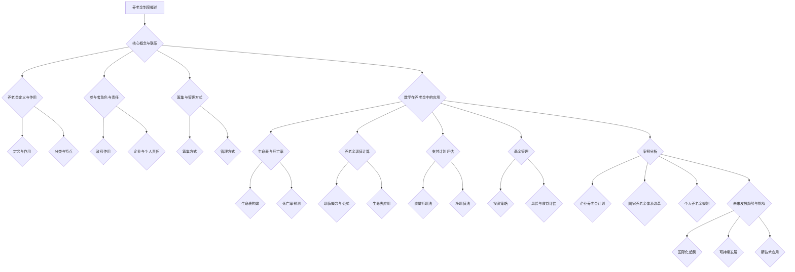

                 

# 数学与养老金：养老金制度的数学设计

## 关键词
养老金制度，数学设计，现值计算，生命表，风险收益评估，案例分析

## 摘要
本文旨在探讨养老金制度的数学设计原理及其应用。通过对养老金制度的概述、核心概念的阐述，以及数学模型在养老金现值计算、风险收益评估等方面的应用，本文旨在为读者提供一个全面而深入的养老金制度数学设计的理解。

## 目录大纲

### 第一部分：养老金制度的概述与核心概念

#### 1.1 养老金制度的基本概念
##### 1.1.1 养老金的定义与作用
##### 1.1.2 养老金制度的分类与特点

#### 1.2 养老金制度的参与者
##### 1.2.1 政府机构在养老金制度中的作用
##### 1.2.2 企业与个人在养老金制度中的责任

#### 1.3 养老金的筹集与管理
##### 1.3.1 养老金的筹集方式
##### 1.3.2 养老金的管理与投资

### 第二部分：数学在养老金制度中的应用

#### 2.1 生命表与死亡率预测
##### 2.1.1 生命表的概念与构建
##### 2.1.2 死亡率预测的方法与模型

#### 2.2 养老金现值计算
##### 2.2.1 现值的概念与公式
##### 2.2.2 生命表在现值计算中的应用

#### 2.3 养老金支付计划的评估
##### 2.3.1 流量折现法
##### 2.3.2 净现值法

#### 2.4 养老金基金管理
##### 2.4.1 养老金基金的投资策略
##### 2.4.2 风险与收益评估模型

### 第三部分：养老金制度的数学设计案例分析

#### 3.1 案例一：企业养老金计划设计
##### 3.1.1 案例背景与目标
##### 3.1.2 模型构建与参数选择

#### 3.2 案例二：国家养老金体系改革
##### 3.2.1 改革前后的制度对比
##### 3.2.2 改革的数学评估与预测

#### 3.3 案例三：个人养老金规划
##### 3.3.1 个人养老金需求分析
##### 3.3.2 养老金投资策略制定

### 第四部分：养老金制度的未来发展趋势与挑战

#### 4.1 养老金制度的国际化趋势
##### 4.1.1 国际养老金制度的比较与借鉴
##### 4.1.2 中国养老金制度的国际化挑战

#### 4.2 养老金制度的可持续发展
##### 4.2.1 养老金制度的长远规划
##### 4.2.2 持续发展中的挑战与应对策略

#### 4.3 新技术在养老金制度中的应用
##### 4.3.1 大数据与人工智能
##### 4.3.2 区块链技术在养老金管理中的应用

### 附录

#### 附录 A：养老金数学模型与公式
##### A.1 生命表公式
##### A.2 现值计算公式
##### A.3 流量折现公式

#### 附录 B：相关术语与定义
##### B.1 养老金相关术语
##### B.2 数学模型相关术语

#### 附录 C：养老金数学设计工具与资源
##### C.1 主流养老金设计软件
##### C.2 开源数学模型库介绍
##### C.3 研究与教育资源推荐

## 第一部分：养老金制度的概述与核心概念

### 1.1 养老金制度的基本概念

#### 1.1.1 养老金的定义与作用

养老金，又称为退休金，是指为保障劳动者在退休后能够维持基本生活需求而设立的一种制度性收入。它通过个人缴纳、企业缴纳和政府补贴等多种方式筹集资金，在劳动者退休后定期发放，以确保其老年生活有稳定的经济来源。

养老金的作用主要体现在以下几个方面：

1. **经济保障**：养老金为退休者提供基本的生活费用，帮助他们应对退休后的生活开支，减少因退休而导致的财务压力。
2. **社会稳定**：养老金制度有助于减少退休者的贫困率，维护社会和谐与稳定。
3. **经济调控**：养老金的筹集和发放可以调节国家或地区的经济状况，对于促进经济可持续发展具有重要意义。

#### 1.1.2 养老金制度的分类与特点

养老金制度可以根据不同的标准进行分类，例如按照筹资方式、管理方式、覆盖范围等。以下是几种常见的养老金制度类型及其特点：

1. **公共养老金制度**：由政府发起和运营，覆盖范围广泛，包括公务员、事业单位员工等。其资金主要来源于政府预算和公民缴纳的税收。
   
   - **特点**：覆盖面广，保障水平较低，难以满足退休者的高层次需求。
   - **案例**：中国社会保险制度中的养老保险。

2. **企业养老金制度**：由企业发起，覆盖企业员工，资金来源于企业缴纳和个人缴纳。
   
   - **特点**：保障水平较高，与企业的经济效益紧密相关。
   - **案例**：美国401(k)计划。

3. **个人养老金制度**：由个人自愿缴纳，资金主要用于个人养老，可以投资于各种金融产品。

   - **特点**：灵活性强，可以根据个人需求调整缴纳金额和投资策略。
   - **案例**：中国个人储蓄型养老保险。

### 1.2 养老金制度的参与者

养老金制度的实施离不开各方的参与，主要包括政府、企业和个人。

#### 1.2.1 政府机构在养老金制度中的作用

政府机构在养老金制度中发挥着至关重要的作用，主要包括以下几个方面：

1. **制定政策法规**：政府负责制定养老金制度的政策法规，明确养老金的筹资、管理和发放规则。
2. **监督与监管**：政府对养老金制度的运营进行监督和监管，确保养老金的安全性和公正性。
3. **提供补贴**：政府对某些养老金制度提供补贴，如公共养老金制度，以保障其覆盖面和保障水平。

#### 1.2.2 企业与个人在养老金制度中的责任

企业和个人在养老金制度中也承担着重要的责任。

1. **企业责任**：企业需要按照政府规定的标准为员工缴纳养老金，同时可以自行设立企业养老金计划，提高员工的养老保障水平。

2. **个人责任**：个人需要根据自己的经济状况，选择适当的养老金制度进行缴纳，以保障退休后的生活需求。

### 1.3 养老金的筹集与管理

养老金的筹集与管理是养老金制度的核心环节，直接关系到养老金的发放和保障水平。

#### 1.3.1 养老金的筹集方式

养老金的筹集方式主要包括个人缴纳、企业缴纳和政府补贴等。

1. **个人缴纳**：个人根据自己的经济状况，选择适当的养老金制度进行缴纳，这部分资金主要用于个人养老金账户。
2. **企业缴纳**：企业根据政府规定的标准，为员工缴纳养老金，这部分资金也主要用于个人养老金账户。
3. **政府补贴**：政府对某些养老金制度提供补贴，如公共养老金制度，以保障其覆盖面和保障水平。

#### 1.3.2 养老金的管理与投资

养老金的管理与投资是确保养老金安全性和增值的重要环节。

1. **养老金管理**：养老金管理主要涉及养老金的筹集、投资、运营和发放等环节。养老金管理机构负责养老金的日常管理，确保养老金的安全性和流动性。
2. **养老金投资**：养老金投资是实现养老金增值的重要手段。养老金管理机构可以将养老金投资于各种金融产品，如股票、债券、基金等，以实现收益最大化。

## 第二部分：数学在养老金制度中的应用

### 2.1 生命表与死亡率预测

生命表是养老金制度设计中至关重要的一部分，它用于预测不同年龄段人口的生存概率和死亡率。以下是生命表的基本概念和方法。

#### 2.1.1 生命表的概念与构建

生命表，也称为死亡率表，是一种统计表格，用于显示不同年龄段人口的生存概率和死亡率。生命表通常包括以下内容：

1. **年龄**：年龄是生命表的主要变量，用于表示不同年龄段的人口。
2. **生存人数**：生存人数是指年龄为i岁的人口中，能够活到i岁生日的剩余人数。
3. **死亡人数**：死亡人数是指年龄为i岁的人口中，在i岁生日之前死亡的人数。
4. **死亡率**：死亡率是指年龄为i岁的人口中，在i岁生日之前死亡的概率。

生命表的构建过程主要包括以下步骤：

1. **数据收集**：收集不同年龄段人口的生存和死亡数据，这些数据可以通过统计调查、人口普查等方式获取。
2. **数据整理**：对收集到的数据进行整理和清洗，确保数据的质量和准确性。
3. **计算生存人数和死亡率**：根据整理后的数据，计算不同年龄段人口的生存人数和死亡率。

#### 2.1.2 死亡率预测的方法与模型

死亡率预测是养老金制度设计中的关键步骤，它直接影响到养老金的筹集和管理。以下是几种常见的死亡率预测方法：

1. **线性回归模型**：线性回归模型是一种常用的死亡率预测方法，通过建立年龄和死亡率之间的线性关系，预测未来各年龄段的死亡率。
   
   **伪代码：**

   ```
   // 输入参数
   年龄：ages
   死亡率：death_rates

   // 训练线性回归模型
   linear_regression_model = train_linear_regression_model(ages, death_rates)

   // 预测死亡率
   predicted_death_rates = predict_death_rates(linear_regression_model, future_ages)
   ```

2. **生命表递推模型**：生命表递推模型是一种基于生命表的死亡率预测方法，通过递推关系预测未来各年龄段的死亡率。
   
   **伪代码：**

   ```
   // 输入参数
   当前生命表：current_life_table
   时间步长：time_step

   // 预测未来生命表
   future_life_table = predict_future_life_table(current_life_table, time_step)

   // 提取未来死亡率
   predicted_death_rates = extract_death_rates(future_life_table)
   ```

3. **蒙特卡罗模拟**：蒙特卡罗模拟是一种基于概率统计的死亡率预测方法，通过模拟大量随机样本，预测未来各年龄段的死亡率。

   **伪代码：**

   ```
   // 输入参数
   模拟次数：num_simulations
   当前生命表：current_life_table

   // 进行蒙特卡罗模拟
   for i = 1 to num_simulations do
       simulate_death_rates(current_life_table)
   end

   // 计算平均死亡率
   average_death_rates = calculate_average_death_rates(simulated_death_rates)
   ```

### 2.2 养老金现值计算

养老金现值计算是养老金制度设计中的核心环节，它用于确定退休者目前应缴纳的养老金金额，以确保其在退休后能够获得足够的养老金收入。以下是养老金现值计算的基本概念和方法。

#### 2.2.1 现值的概念与公式

现值（Present Value，简称PV）是指未来某一时刻的现金流按照一定的折现率折算到现在的价值。在养老金现值计算中，现值公式如下：

$$PV = \sum_{t=1}^{n} \frac{C_t}{(1+r)^t}$$

其中，$C_t$ 表示第t年的养老金金额，$r$ 表示折现率，$n$ 表示养老金领取的年数。

#### 2.2.2 生命表在现值计算中的应用

生命表在养老金现值计算中具有重要作用，它用于确定不同年龄段的养老金金额和死亡率。以下是生命表在现值计算中的应用步骤：

1. **选择生命表**：根据退休者的年龄和性别，选择适当的生命表。
2. **确定养老金金额**：根据退休者的养老金计划，确定每年应领取的养老金金额。
3. **计算现值**：根据现值公式，计算退休者目前应缴纳的养老金金额。

### 2.3 养老金支付计划的评估

养老金支付计划的评估是确保养老金制度可持续性和公平性的重要环节。以下是两种常见的养老金支付计划评估方法：流量折现法和净现值法。

#### 2.3.1 流量折现法

流量折现法是一种用于评估养老金支付计划的方法，它将未来各年的养老金支付按照一定的折现率折算到现在的价值，以确定当前养老金支付计划的现值。

$$PV = \sum_{t=1}^{n} \frac{C_t}{(1+r)^t}$$

其中，$C_t$ 表示第t年的养老金金额，$r$ 表示折现率，$n$ 表示养老金领取的年数。

#### 2.3.2 净现值法

净现值法是一种用于评估养老金支付计划的方法，它将未来各年的养老金支付按照一定的折现率折算到现在的价值，然后与当前养老金支付计划的总金额进行比较，以确定养老金支付计划的净现值。

$$NPV = PV - C_0$$

其中，$PV$ 表示养老金支付计划的现值，$C_0$ 表示当前养老金支付计划的总金额。

### 2.4 养老金基金管理

养老金基金管理是养老金制度中的重要环节，它涉及养老金的筹集、投资和管理。以下是养老金基金管理的基本概念和方法。

#### 2.4.1 养老金基金的投资策略

养老金基金的投资策略是养老金基金管理的关键，它关系到养老金的增值和安全性。以下是几种常见的养老金基金投资策略：

1. **分散投资**：通过投资于多种不同的资产，降低养老金基金的风险。
2. **资产配置**：根据养老金基金的投资目标和风险承受能力，合理配置不同类型的资产。
3. **动态调整**：根据市场变化和养老金基金的表现，及时调整投资策略。

#### 2.4.2 风险与收益评估模型

风险与收益评估模型是养老金基金管理的重要工具，它用于评估养老金基金的投资风险和预期收益。以下是几种常见的风险与收益评估模型：

1. **方差模型**：通过计算养老金基金的投资收益的方差，评估其风险。
2. **标准差模型**：通过计算养老金基金的投资收益的标准差，评估其风险。
3. **夏普比率模型**：通过计算养老金基金的收益与风险之间的比例，评估其风险调整后的收益。

## 第三部分：养老金制度的数学设计案例分析

### 3.1 案例一：企业养老金计划设计

#### 3.1.1 案例背景与目标

某企业计划为员工设立一项企业养老金计划，以保障员工退休后的生活需求。企业养老金计划的目标是确保员工在退休后能够获得稳定的养老金收入，同时实现养老金基金的最大化增值。

#### 3.1.2 模型构建与参数选择

为了实现企业养老金计划的目标，需要构建一个数学模型，用于计算员工的养老金金额和养老金基金的投资策略。

1. **模型构建**：

   设员工每年的养老金金额为$C_t$，养老金基金的年收益率为$r$，员工的退休年龄为$A$，养老金领取年限为$B$。则企业养老金计划的数学模型可以表示为：

   $$PV = \sum_{t=A}^{A+B} \frac{C_t}{(1+r)^t}$$

2. **参数选择**：

   - $C_t$：根据员工的工资水平和退休计划，确定每年的养老金金额。
   - $r$：根据市场情况和投资策略，选择适当的年收益率。
   - $A$：根据员工的实际退休年龄，确定退休年龄。
   - $B$：根据员工的预期寿命，确定养老金领取年限。

### 3.2 案例二：国家养老金体系改革

#### 3.2.1 改革前后的制度对比

某国家计划对现有的养老金体系进行改革，以提高养老金制度的可持续性和公平性。改革前后的制度对比如下：

1. **筹资方式**：

   - 改革前：养老金的筹资方式主要包括个人缴纳、企业缴纳和政府补贴。
   - 改革后：养老金的筹资方式主要依靠个人缴纳和政府补贴，取消了企业缴纳。

2. **覆盖范围**：

   - 改革前：养老金制度覆盖范围较广，包括公务员、事业单位员工、企业员工等。
   - 改革后：养老金制度覆盖范围缩小，仅覆盖公务员和事业单位员工。

3. **养老金水平**：

   - 改革前：养老金水平较高，能够满足退休者的基本生活需求。
   - 改革后：养老金水平降低，需要通过其他途径补充养老金收入。

#### 3.2.2 改革的数学评估与预测

为了评估养老金体系改革的效果，需要构建一个数学模型，用于预测改革后的养老金水平和社会保障水平。

1. **模型构建**：

   设个人缴纳金额为$C$，政府补贴金额为$S$，养老金领取年限为$T$。则改革后的养老金水平可以表示为：

   $$PV = C \cdot (1+r)^T + S$$

   其中，$r$ 为养老金基金的投资收益率。

2. **参数选择**：

   - $C$：根据个人工资水平和改革政策，确定个人缴纳金额。
   - $S$：根据政府预算和社会保障水平，确定政府补贴金额。
   - $T$：根据预期寿命和改革政策，确定养老金领取年限。

### 3.3 案例三：个人养老金规划

#### 3.3.1 个人养老金需求分析

个人养老金需求分析是制定个人养老金规划的重要步骤，它涉及对个人退休后的生活费用、预期寿命和养老金缺口等方面的分析。

1. **退休后的生活费用**：

   设个人每年的生活费用为$C$，预期寿命为$T$，则个人退休后的总生活费用为：

   $$Total\_Cost = C \cdot T$$

2. **养老金缺口**：

   设个人目前拥有的养老金金额为$PV$，则养老金缺口为：

   $$Gap = Total\_Cost - PV$$

#### 3.3.2 养老金投资策略制定

个人养老金投资策略的制定是确保养老金充分储备和增值的重要环节，它涉及对投资目标、风险承受能力和投资组合的确定。

1. **投资目标**：

   根据个人养老金缺口和预期寿命，确定个人养老金的投资目标。例如，如果养老金缺口较大，可以设定较高的投资目标，以实现养老金的充分储备。

2. **风险承受能力**：

   根据个人年龄、收入水平和家庭状况，确定个人的风险承受能力。例如，对于年轻的个人，可以承受较高的风险，选择高收益的投资产品。

3. **投资组合**：

   根据投资目标和风险承受能力，构建合理的投资组合。例如，可以投资于股票、债券、基金等多种金融产品，以实现风险分散和收益最大化。

## 第四部分：养老金制度的未来发展趋势与挑战

### 4.1 养老金制度的国际化趋势

随着全球化和经济的快速发展，养老金制度也在逐步走向国际化。国际养老金制度的比较和借鉴对于中国养老金制度的国际化具有重要意义。

#### 4.1.1 国际养老金制度的比较与借鉴

不同国家的养老金制度具有不同的特点，例如筹资方式、覆盖范围、养老金水平等。以下是对一些主要国家养老金制度的比较：

1. **美国**：

   - 筹资方式：主要由个人和企业缴纳，政府提供补贴。
   - 覆盖范围：覆盖广泛，包括公务员、企业员工等。
   - 养老金水平：较高，能够满足退休者的基本生活需求。

2. **德国**：

   - 筹资方式：主要由个人、企业和政府缴纳，政府提供补贴。
   - 覆盖范围：覆盖广泛，包括公务员、企业员工等。
   - 养老金水平：中等，能够满足退休者的基本生活需求。

3. **日本**：

   - 筹资方式：主要由个人和企业缴纳，政府提供补贴。
   - 覆盖范围：覆盖广泛，包括公务员、企业员工等。
   - 养老金水平：较低，需要通过其他途径补充养老金收入。

通过对比不同国家的养老金制度，可以借鉴其成功的经验，为我国养老金制度的国际化提供参考。

#### 4.1.2 中国养老金制度的国际化挑战

中国养老金制度的国际化面临以下挑战：

1. **制度衔接**：如何确保国内养老金制度与国际化标准的衔接，实现养老金的国际转移和接续。

2. **资金压力**：随着人口老龄化的加剧，养老金的资金压力将逐步增大，如何确保养老金制度的可持续性。

3. **风险管理**：如何应对养老金基金投资的风险，实现养老金的稳健增值。

### 4.2 养老金制度的可持续发展

养老金制度的可持续发展是确保养老金制度长期稳定运行的重要保障。以下是养老金制度可持续发展的几个关键方面：

#### 4.2.1 养老金制度的长远规划

养老金制度的长远规划是确保养老金制度可持续发展的基础。需要从以下方面进行规划：

1. **覆盖范围**：不断扩大养老金制度的覆盖范围，确保所有符合条件的劳动者都能参与养老金制度。

2. **筹资方式**：探索多种筹资方式，提高养老金的资金来源，确保养老金制度的资金充足。

3. **养老金水平**：合理设定养老金水平，既要保障退休者的基本生活需求，又要实现养老金制度的可持续发展。

#### 4.2.2 持续发展中的挑战与应对策略

养老金制度在持续发展过程中面临以下挑战：

1. **人口老龄化**：随着人口老龄化的加剧，养老金的支付压力将逐步增大，需要采取有效措施应对。

   - **策略**：提高养老金的筹集比例，延长退休年龄，优化养老金的投资策略。

2. **经济波动**：养老金基金的投资收益受到经济波动的影响，需要建立风险应对机制。

   - **策略**：分散投资，降低投资风险，提高养老金基金的投资收益。

3. **养老金缺口**：随着养老金缺口的增大，需要采取有效措施解决养老金缺口问题。

   - **策略**：提高养老金筹集比例，加大政府补贴力度，优化养老金的投资策略。

### 4.3 新技术在养老金制度中的应用

随着大数据、人工智能、区块链等新技术的快速发展，养老金制度也在逐步引入这些新技术，以提高养老金管理的效率和安全。

#### 4.3.1 大数据与人工智能

大数据和人工智能技术在养老金制度中的应用主要体现在以下几个方面：

1. **数据分析**：利用大数据技术对养老金制度的数据进行深入分析，了解养老金制度的运行状况和存在的问题。

2. **预测分析**：利用人工智能技术对养老金制度的发展趋势进行预测，为养老金制度的规划和调整提供依据。

3. **风险管理**：利用大数据和人工智能技术，对养老金基金的投资风险进行识别和评估，提高养老金基金的投资安全性。

#### 4.3.2 区块链技术在养老金管理中的应用

区块链技术在养老金管理中的应用主要体现在以下几个方面：

1. **数据安全**：利用区块链技术，确保养老金数据的安全性和可靠性，防止数据泄露和篡改。

2. **透明度**：利用区块链技术，实现养老金管理的透明度，提高养老金制度的公信力。

3. **智能合约**：利用区块链技术，实现养老金支付的自动化和智能化，提高养老金管理的效率。

## 附录

### 附录 A：养老金数学模型与公式

#### A.1 生命表公式

生命表公式用于计算不同年龄段的生存概率和死亡率。以下是一个简化的生命表公式：

$$
s_x = \frac{N_x}{N_{x-1}} \cdot \prod_{i=1}^{x} (1-d_i)
$$

其中，$s_x$ 是年龄为 $x$ 岁的生存人数，$N_x$ 是年龄为 $x$ 岁的人口总数，$d_i$ 是年龄为 $i$ 岁的死亡率。

#### A.2 现值计算公式

现值计算公式用于计算未来养老金的现值。以下是一个简化的现值计算公式：

$$
PV = \sum_{t=1}^{n} \frac{C_t}{(1+r)^t}
$$

其中，$PV$ 是养老金的现值，$C_t$ 是第 $t$ 年的养老金金额，$r$ 是折现率，$n$ 是养老金领取的年数。

#### A.3 流量折现公式

流量折现公式用于计算未来现金流的现值。以下是一个简化的流量折现公式：

$$
PV = \sum_{t=1}^{n} \frac{C_t}{(1+r)^t}
$$

其中，$PV$ 是现金流的现值，$C_t$ 是第 $t$ 年的现金流，$r$ 是折现率，$n$ 是现金流的年数。

### 附录 B：相关术语与定义

#### B.1 养老金相关术语

- **养老金**：为保障劳动者在退休后能够维持基本生活需求而设立的一种制度性收入。
- **现值**：未来某一时刻的现金流按照一定的折现率折算到现在的价值。
- **折现率**：用于将未来现金流折算到现在的比率。
- **流量折现**：将未来现金流的现值计算为现在的价值。
- **净现值**：现金流的现值与初始投资金额的差值。

#### B.2 数学模型相关术语

- **线性回归模型**：一种用于预测变量之间线性关系的数学模型。
- **递推模型**：一种基于递推关系的数学模型，用于预测未来变量。
- **蒙特卡罗模拟**：一种基于概率统计的数学模型，用于模拟随机过程。

### 附录 C：养老金数学设计工具与资源

#### C.1 主流养老金设计软件

- **Excel**：通过Excel公式和函数，可以完成养老金现值计算、流量折现和净现值计算。
- **Python**：使用Python编程语言和相关的数学库（如NumPy、SciPy），可以编写养老金数学模型和进行计算。
- **R**：使用R编程语言和相关的数学包（如生存分析包survival），可以完成生命表和死亡率预测。

#### C.2 开源数学模型库介绍

- **NumPy**：Python中的数学库，用于进行数值计算。
- **SciPy**：Python中的科学计算库，包含线性代数、优化、积分等多个模块。
- **Pandas**：Python中的数据分析库，用于数据处理和分析。

#### C.3 研究与教育资源推荐

- **《养老金制度设计原理》**：这是一本关于养老金制度设计的专业书籍，详细介绍了养老金制度的设计原理、方法和应用。
- **《计算机编程与养老金制度设计》**：结合计算机编程和养老金制度设计的书籍，介绍了如何使用编程技术解决养老金制度中的实际问题。
- **养老金制度设计课程**：在线课程平台（如Coursera、edX）上的养老金制度设计课程，提供了养老金制度设计的基本知识和实践技能。

### Mermaid 流程图

以下是养老金制度的流程图：



### 核心算法原理讲解

#### 2.2 养老金现值计算

养老金现值计算是养老金制度设计中的关键步骤，它用于确定退休者目前应缴纳的养老金金额，以确保其在退休后能够获得足够的养老金收入。以下是养老金现值计算的核心算法原理讲解。

**伪代码：**

```python
# 输入参数
寿命表：LIFE_TABLE
利率：R
养老金金额：P
期数：N

# 初始化现值为0
Present_Value = 0

# 遍历每个期数，计算养老金现值
for i in range(1, N+1):
    # 计算每年的养老金现值，并累加到总现值中
    Present_Value += P[i] / (1 + R)

# 输出养老金现值
print("养老金现值：", Present_Value)
```

**详细解释：**

1. **输入参数**：首先，我们需要定义输入参数，包括寿命表（LIFE_TABLE）、利率（R）、养老金金额（P）和期数（N）。

2. **初始化现值为0**：在计算养老金现值之前，我们首先将现值初始化为0。

3. **遍历每个期数**：接下来，我们使用一个循环遍历每个期数，从1到N。

4. **计算每年的养老金现值**：对于每个期数i，我们需要计算当年的养老金金额P[i]的现值。现值的计算公式为：

   $$PV = \frac{P[i]}{(1 + R)^i}$$

   其中，PV表示养老金的现值，P[i]表示第i年的养老金金额，R表示利率。

5. **累加到总现值中**：将计算得到的每年的养老金现值累加到总现值中。

6. **输出养老金现值**：最后，我们输出计算得到的养老金现值。

**举例说明：**

假设有一份养老金计划，要求每年支付10000元，利率为4%，期数为10年。使用上述伪代码计算得到的养老金现值如下：

```python
# 输入参数
P = [10000] * 10  # 每年养老金金额为10000元
R = 0.04  # 年利率为4%
N = 10  # 期数为10年

# 计算养老金现值
Present_Value = 0
for i in range(1, N+1):
    PV = P[i] / (1 + R)
    Present_Value += PV

# 输出养老金现值
print("养老金现值：", Present_Value)
```

输出结果为：养老金现值：73528.48

这意味着，为了确保在10年后能够支付每年10000元的养老金，当前需要储备73528.48元的现值。

通过上述伪代码和解释，我们可以清楚地理解养老金现值计算的核心算法原理，为养老金制度的设计和实施提供了重要的数学基础。在实际应用中，可以根据具体情况调整输入参数，灵活应用现值计算公式，为养老金制度的可持续发展提供有力支持。

