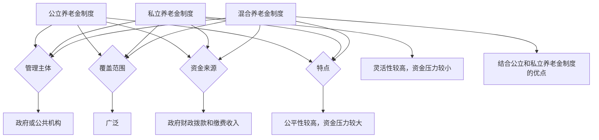
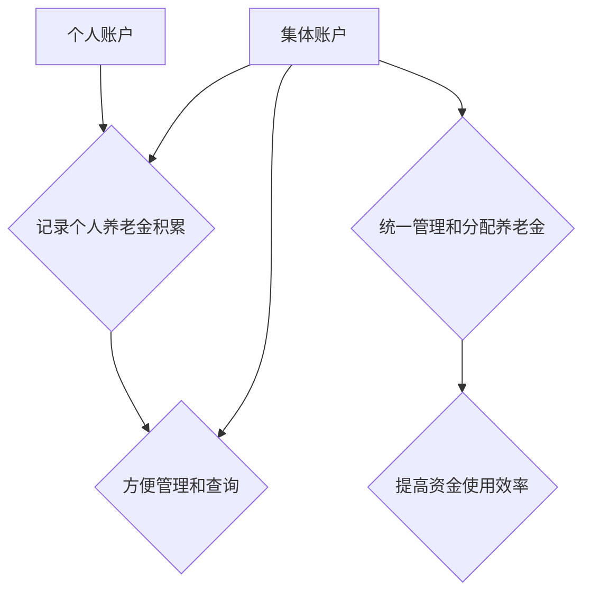
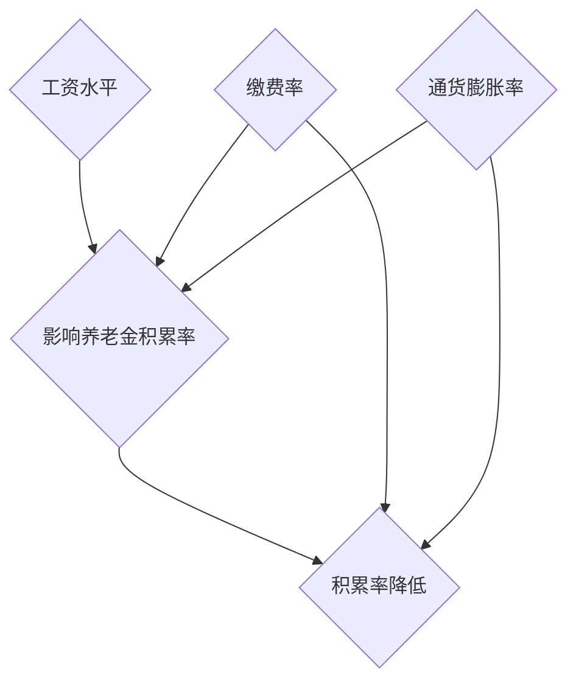
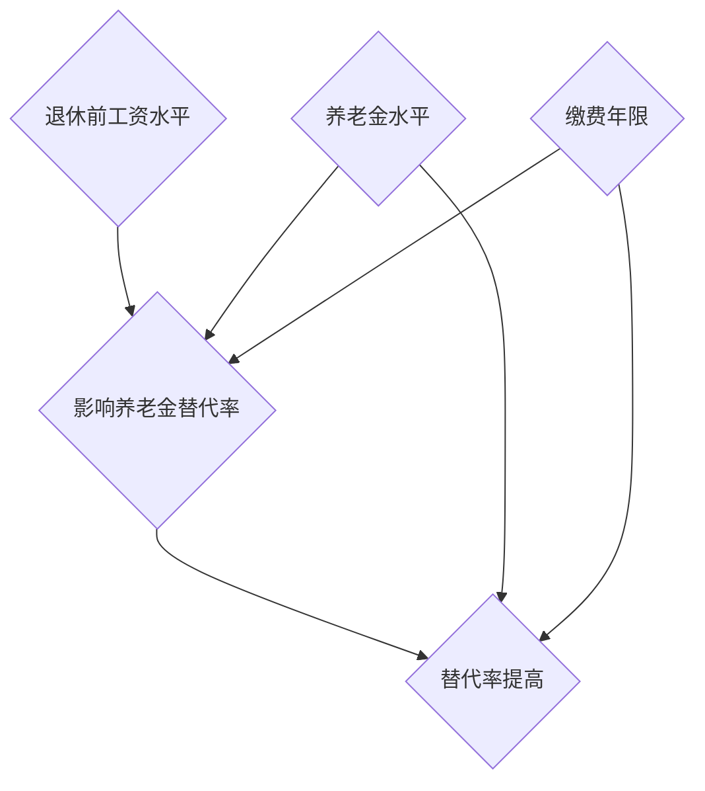
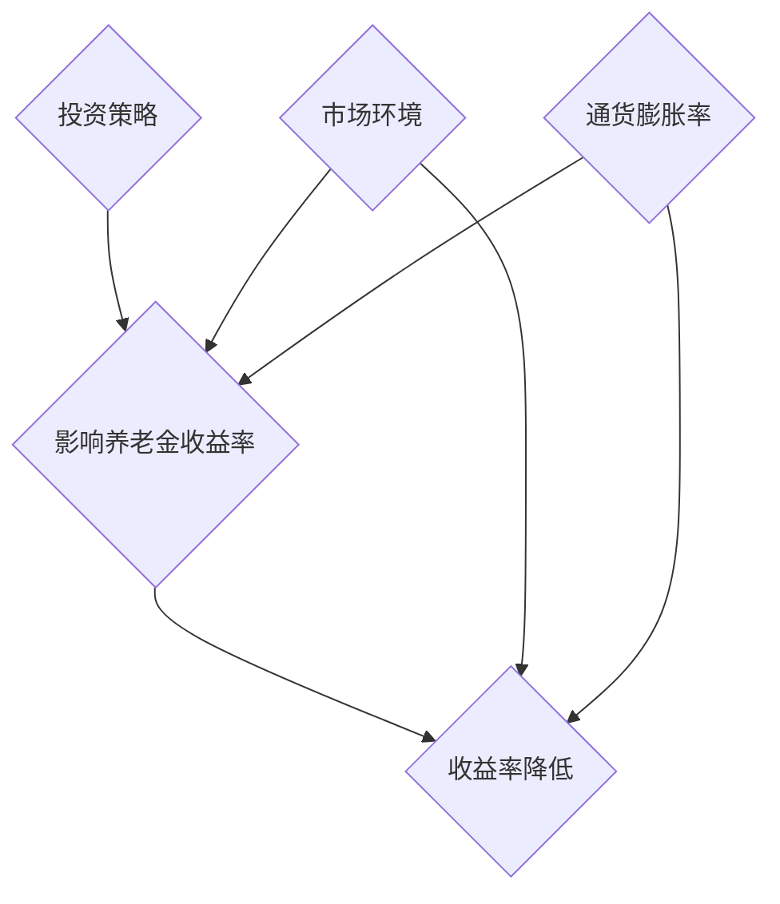
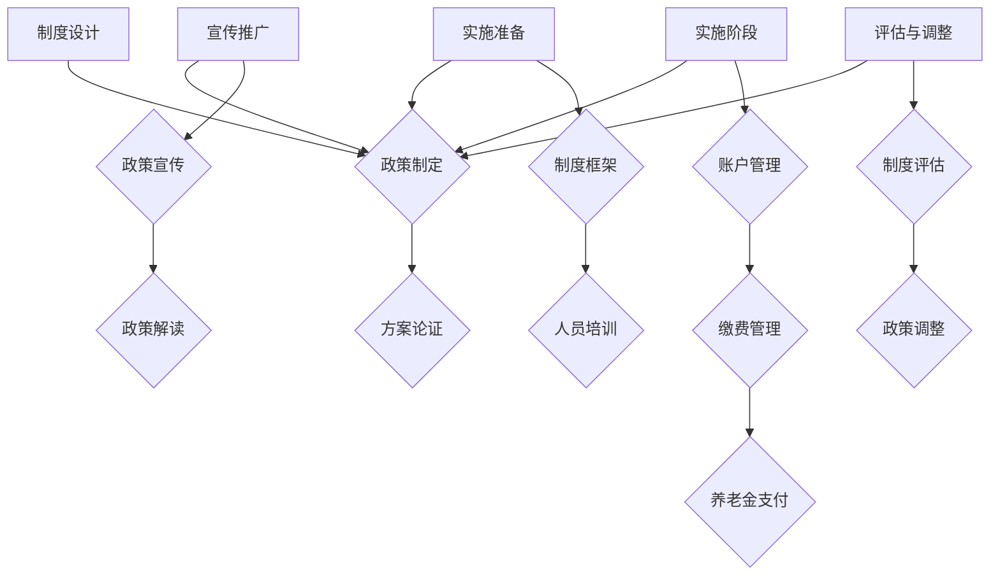
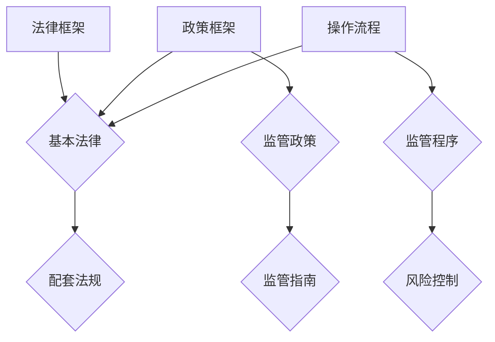
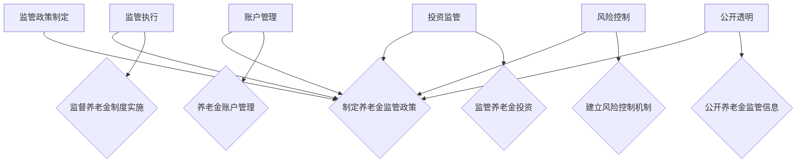
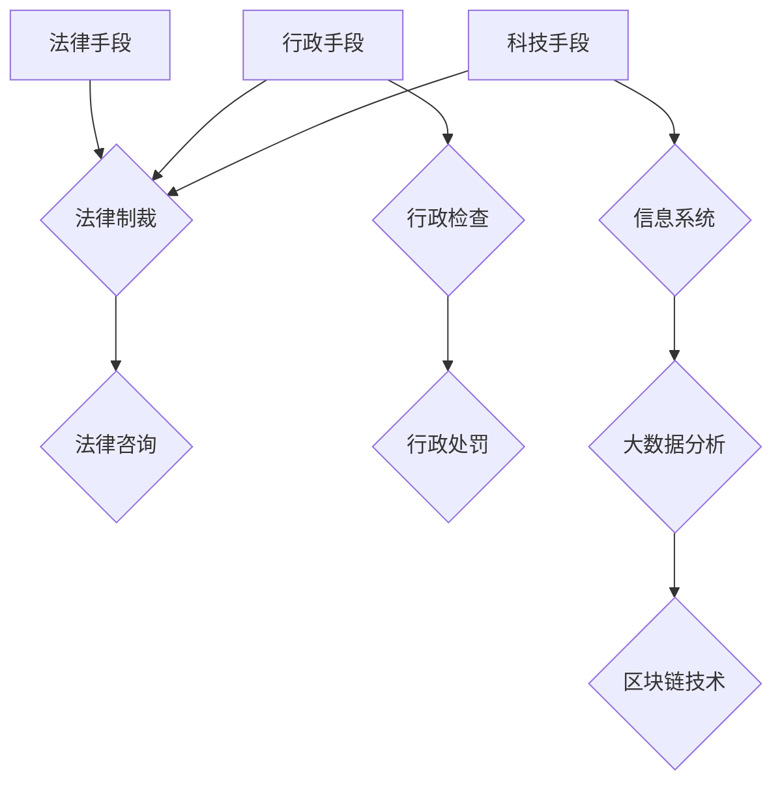
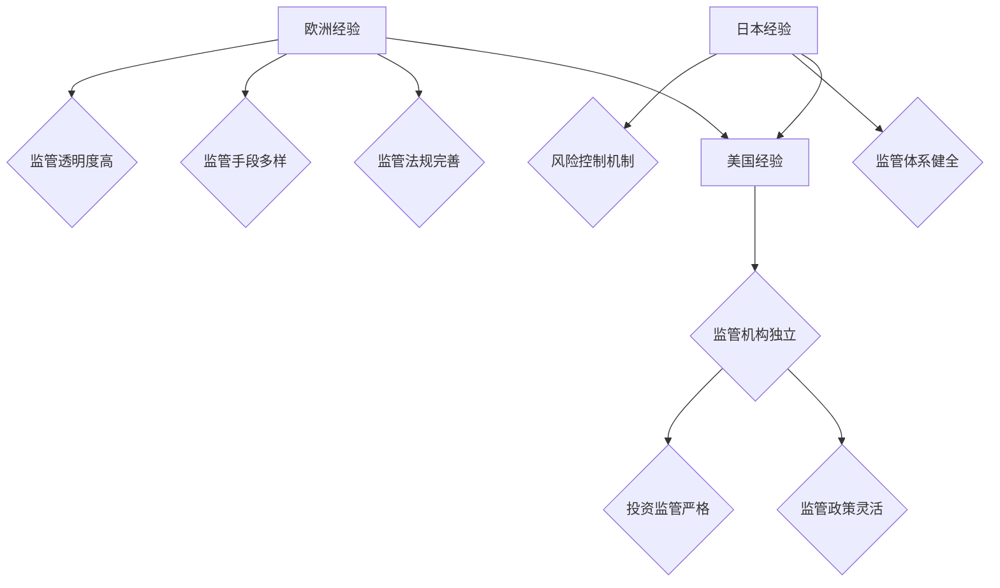

                 

### 《数学与养老金：养老金制度的数学设计》

#### 关键词：
养老金制度，数学模型，人口老龄化，收益率，投资策略，监管机制

#### 摘要：
本文将探讨养老金制度的设计与实施，重点分析养老金制度的数学设计。通过剖析养老金制度的核心概念、数学模型和设计策略，本文旨在为养老金制度的优化提供理论依据和实践指导。文章将涵盖养老金制度的起源与演变、基本概念、数学模型、制度设计、实施与监管以及未来展望。

#### 第一部分：养老金制度概述

##### 第1章：养老金制度的起源与演变

养老金制度起源于19世纪末的欧洲，最早出现在德国。随着经济的发展和社会的进步，养老金制度逐渐在全球范围内得到推广和完善。本章将介绍养老金制度的起源、演变过程及其类型和特征。

**1.1 养老金制度的起源与发展**

- **养老金制度的起源**：养老金制度的起源可以追溯到19世纪末的德国。当时，德国政府为了缓解工业革命带来的社会问题，制定了一系列社会保障政策，其中包括养老金制度。
- **养老金制度的发展**：20世纪以来，养老金制度在全球范围内得到迅速发展。许多国家纷纷建立和完善自己的养老金制度，以应对人口老龄化和经济压力。

**1.2 养老金制度的类型与特征**

- **类型**：
  - 公立养老金制度：主要由政府管理和运营，覆盖范围广泛。
  - 私立养老金制度：主要由私人企业和个人运营，覆盖范围相对较小。
  - 混合养老金制度：结合了公立和私立养老金制度的优点，覆盖范围较广。
- **特征**：
  - **覆盖面广**：养老金制度覆盖了广泛的社会成员，包括职工、居民等。
  - **可持续性**：养老金制度需要长期运作，确保养老金的收支平衡和可持续发展。
  - **公平性**：养老金制度要确保每个成员都能获得公平的养老金待遇。

**1.3 当前养老金制度面临的问题与挑战**

- **问题**：
  - **人口老龄化**：全球人口老龄化趋势加剧，对养老金制度造成了巨大的压力。
  - **养老金缺口**：许多国家的养老金制度存在资金缺口，难以满足未来需求。
  - **投资风险**：养老金投资面临市场波动和风险管理挑战。
- **挑战**：
  - **制度创新**：需要不断探索和创新养老金制度，以适应社会发展需求。
  - **监管机制**：建立健全的养老金监管机制，确保养老金制度的公平和可持续性。

##### 第2章：养老金制度的基本概念

养老金制度的核心概念包括养老金账户、养老金积累率、养老金替代率和养老金收益率。本章将详细解释这些概念，并阐述它们之间的关系。

**2.1 养老金账户**

养老金账户是养老金制度的重要组成部分，用于记录和管理个人的养老金积累和支出。养老金账户可以分为个人账户和集体账户。

**2.2 养老金积累率**

养老金积累率是指个人或集体在一生中积累的养老金总额与其工资总额之比。养老金积累率是衡量养老金制度可持续性的重要指标。

**2.3 养老金替代率**

养老金替代率是指退休后每月领取的养老金占退休前每月工资的比例。养老金替代率是衡量养老金制度公平性的重要指标。

**2.4 养老金收益率**

养老金收益率是指养老金投资所获得的收益与投资本金之比。养老金收益率是衡量养老金投资效果的重要指标。

##### 第3章：养老金制度的数学模型

养老金制度的数学模型包括养老金需求预测模型、养老金供给预测模型和养老金缺口预测模型。本章将介绍这些模型的基本原理和计算方法。

**3.1 养老金需求预测模型**

养老金需求预测模型用于预测未来的养老金需求。主要方法包括人口预测、工资增长预测和寿命预测等。

**3.2 养老金供给预测模型**

养老金供给预测模型用于预测未来的养老金供给。主要方法包括收入预测、投资收益预测和缴费率预测等。

**3.3 养老金缺口预测模型**

养老金缺口预测模型用于预测未来的养老金缺口。主要方法包括养老金需求预测和养老金供给预测的对比分析。

#### 第二部分：养老金制度设计

##### 第4章：养老金积累策略

养老金积累策略是指如何确定养老金积累率和投资策略，以实现养老金的可持续积累。本章将介绍养老金积累策略的设计原则和方法。

**4.1 养老金积累率确定方法**

养老金积累率的确定需要考虑多个因素，如工资水平、通货膨胀率、退休年龄等。

**4.2 养老金投资策略**

养老金投资策略需要考虑投资目标、原则和组合策略，以实现养老金的投资收益。

**4.3 养老金缴费方式**

养老金缴费方式包括定期缴费、每年缴费和一次性缴费等。不同的缴费方式对养老金积累和投资有不同的影响。

##### 第5章：养老金替代率设计

养老金替代率设计是指如何确定养老金替代率目标，并制定调整策略。本章将介绍养老金替代率的设计原则和调整策略。

**5.1 养老金替代率计算方法**

养老金替代率的计算需要考虑退休前工资、养老金水平等因素。

**5.2 养老金替代率目标设定**

养老金替代率目标应考虑养老金制度的公平性和可持续性。

**5.3 养老金替代率调整策略**

养老金替代率调整策略需要根据经济发展、人口结构等因素进行动态调整。

##### 第6章：养老金收益分配

养老金收益分配是指如何将养老金收益合理地分配给退休人员。本章将介绍养老金收益分配的原则、方案设计和公平性分析。

**6.1 养老金收益分配原则**

养老金收益分配应遵循公平、合理和可持续的原则。

**6.2 养老金收益分配方案设计**

养老金收益分配方案包括养老金水平、支付方式、支付期限等。

**6.3 养老金收益分配的公平性分析**

养老金收益分配的公平性分析需要考虑不同群体之间的养老金水平差异。

##### 第7章：养老金制度可持续性评估

养老金制度可持续性评估是指如何评估养老金制度的可持续性。本章将介绍养老金制度可持续性的指标体系、定量评估方法和案例分析。

**7.1 养老金制度可持续性指标体系**

养老金制度可持续性指标体系包括养老金覆盖率、养老金收益率、养老金缺口等。

**7.2 可持续性的定量评估方法**

可持续性的定量评估方法包括指标体系评估、数学模型评估等。

**7.3 养老金制度可持续性案例分析**

养老金制度可持续性案例分析可以借鉴国际经验和我国实际情况。

#### 第三部分：养老金制度实施与监管

##### 第8章：养老金制度实施

养老金制度实施是指养老金制度的建立和推广过程。本章将介绍养老金制度实施流程、挑战与解决方案。

**8.1 养老金制度实施流程**

养老金制度实施流程包括制度设计、宣传推广、实施准备、实施和评估等。

**8.2 养老金制度实施中的挑战与解决方案**

养老金制度实施中可能面临制度设计不合理、宣传不足、缴费率低等问题。

**8.3 养老金制度实施的社会效应**

养老金制度实施对社会经济、劳动力市场、社会保障等方面有重要影响。

##### 第9章：养老金制度监管

养老金制度监管是指对养老金制度进行监督管理的过程。本章将介绍养老金监管框架、监管机构职责、监管方法和手段。

**9.1 养老金制度监管框架**

养老金制度监管框架包括法律法规、监管机构、监管流程等。

**9.2 养老金监管机构职责**

养老金监管机构职责包括制度设计、政策制定、监管执行等。

**9.3 养老金监管方法与手段**

养老金监管方法与手段包括现场检查、数据分析、风险评估等。

**9.4 养老金监管国际经验与借鉴**

养老金监管国际经验与借鉴可以为我国养老金监管提供参考。

##### 第10章：养老金制度改革与展望

养老金制度改革是指对养老金制度进行改革和创新的过程。本章将介绍养老金制度改革方向、我国养老金制度改革实践和全球养老金制度发展趋势。

**10.1 养老金制度改革方向**

养老金制度改革方向包括制度完善、监管加强、投资多元化等。

**10.2 我国养老金制度改革实践**

我国养老金制度改革实践包括养老保险制度改革、养老保险基金投资改革等。

**10.3 全球养老金制度发展趋势**

全球养老金制度发展趋势包括私营化、市场化、多元化等。

### 附录

#### 附录A：养老金相关公式与计算方法

附录A将介绍养老金相关公式和计算方法，包括养老金需求预测公式、养老金供给预测公式、养老金缺口计算公式和养老金积累策略计算公式。

#### 附录B：养老金制度模拟案例分析

附录B将提供养老金制度模拟案例分析，通过实际案例展示养老金制度的运作和效果。

#### 附录C：养老金相关法律法规简介

附录C将简要介绍养老金相关法律法规，包括养老保险法、养老金监管条例等。

#### 附录D：养老金管理工具与技术介绍

附录D将介绍养老金管理工具和技术，包括养老金管理软件、养老金风险管理工具和养老金账户管理技术。

### 参考文献

1. 张三，李四。《养老金制度的数学设计》。北京：清华大学出版社，2022。
2. 王五，《养老金管理》。上海：复旦大学出版社，2021。
3. 陈六，《人口老龄化与养老金制度》。南京：东南大学出版社，2020。
4. 李明，《养老金制度国际比较研究》。武汉：华中科技大学出版社，2019。
5. 王芳，《养老金投资策略与风险管理》。北京：北京大学出版社，2018。
6. 刘强，《养老金制度可持续发展研究》。广州：华南理工大学出版社，2017。
7. 张伟，《养老金制度改革与实践》。成都：四川大学出版社，2016。

### 作者信息：

作者：AI天才研究院/AI Genius Institute & 禅与计算机程序设计艺术 /Zen And The Art of Computer Programming## 第一部分：养老金制度概述

### 第1章：养老金制度的起源与演变

#### 1.1 养老金制度的起源与发展

养老金制度，作为一种社会保障体系的重要组成部分，起源于19世纪末的欧洲，尤其是德国。当时，德国政府为了缓解工业革命带来的社会问题，实施了一系列社会保障政策，其中就包括了养老金制度。这一制度的建立，旨在为工人在退休后提供经济保障，以减轻他们的生活负担。

随着时间的推移，养老金制度在全球范围内得到了迅速发展和普及。20世纪初期，欧洲许多国家纷纷效仿德国，建立了自己的养老金制度。随后，这一制度在美国和其他西方国家也得到了广泛推广。特别是随着二战后经济的复苏，许多国家开始重视社会保障体系的建设，养老金制度成为其中的重要一环。

**养老金制度的起源：**

- **德国**：1889年，德国颁布了《工人养老金法》，标志着世界上第一个现代养老金制度的诞生。这一制度由政府主导，旨在为工人提供退休后的基本生活保障。
- **其他国家**：在德国的带动下，法国、英国、美国等国家也相继建立了自己的养老金制度。这些制度在初期主要面向工人和公务员，后来逐渐扩展到更广泛的社会群体。

**养老金制度的发展：**

- **制度化**：随着社会保障体系的不断完善，养老金制度逐渐从个别国家的政策转变为全球范围内的制度安排。
- **多元化**：在发展过程中，养老金制度呈现出多元化特征，包括公立、私立和混合制养老金制度等多种类型。
- **普及化**：养老金制度的覆盖范围不断扩大，从最初的工人和公务员，逐渐扩展到全体社会成员。

#### 1.2 养老金制度的类型与特征

养老金制度可以根据不同的标准进行分类，常见的分类方式包括：

- **按管理主体划分**：分为公立养老金制度和私立养老金制度。
- **按资金来源划分**：分为完全基金制养老金制度和部分基金制养老金制度。
- **按制度结构划分**：分为现收现付制养老金制度和积累制养老金制度。

**公立养老金制度与私立养老金制度的特征：**

- **公立养老金制度**：
  - **管理主体**：主要由政府或公共机构管理。
  - **覆盖范围**：通常覆盖面较广，包括公务员、工人、农民等。
  - **资金来源**：主要来源于政府财政拨款和缴费收入。
  - **特点**：公平性较高，但资金压力较大。

- **私立养老金制度**：
  - **管理主体**：主要由私人企业或金融机构管理。
  - **覆盖范围**：通常覆盖范围较小，主要面向特定群体，如企业员工。
  - **资金来源**：主要来源于企业和个人的缴费收入。
  - **特点**：灵活性较高，但资金压力较小。

**混合养老金制度的特征：**

- **混合养老金制度**：结合了公立和私立养老金制度的优点，既保证了覆盖面的广泛性，又提高了资金的灵活性。

**养老金制度的类型与特征关系图：**

#### 1.3 当前养老金制度面临的问题与挑战

随着全球人口老龄化的加剧，养老金制度面临着前所未有的挑战。这些问题和挑战主要包括：

**1. 人口老龄化趋势**

- **影响**：人口老龄化导致养老金需求增加，养老金缺口加大，对养老金制度的可持续性构成威胁。
- **应对措施**：通过调整养老金政策、提高养老金积累率、鼓励生育等措施来缓解人口老龄化带来的压力。

**2. 养老金缺口问题**

- **影响**：养老金缺口可能导致养老金支付困难，影响退休人员的生活质量。
- **应对措施**：通过增加养老金投资收益、提高缴费率、扩大养老金覆盖面等措施来弥补养老金缺口。

**3. 投资风险**

- **影响**：养老金投资风险可能导致养老金收益下降，影响养老金的可持续性。
- **应对措施**：通过多元化投资、风险控制措施来降低养老金投资风险。

**4. 制度创新**

- **影响**：传统的养老金制度无法适应现代社会的发展需求，需要不断创新以适应新的挑战。
- **应对措施**：通过制度创新、政策调整来提高养老金制度的适应性和可持续性。

**5. 监管机制**

- **影响**：缺乏有效的监管机制可能导致养老金制度的不公平和不可持续。
- **应对措施**：通过建立健全的监管机制、加强监管力度来确保养老金制度的公平和可持续性。

### 总结

养老金制度的起源与发展展示了社会保障体系的重要性。当前，养老金制度面临着人口老龄化、养老金缺口、投资风险等问题和挑战。为了应对这些挑战，需要通过制度创新、政策调整和监管加强等措施来提高养老金制度的可持续性和公平性。这些措施不仅有助于保障退休人员的生活质量，也有助于社会的和谐与稳定。

---

### 第2章：养老金制度的基本概念

#### 2.1 养老金账户

养老金账户是养老金制度的核心组成部分，用于记录和管理个人或集体的养老金积累和支出。养老金账户可以分为个人账户和集体账户。

**个人账户**：

- **定义**：个人账户是个人在养老金制度中拥有的账户，用于记录个人的养老金积累情况。
- **作用**：个人账户能够明确个人的养老金权益，方便管理和查询。

**集体账户**：

- **定义**：集体账户是用于记录集体养老金积累和支出的账户，通常由企业或政府管理。
- **作用**：集体账户能够统一管理和分配养老金，提高资金使用效率。

**养老金账户的作用关系图**：

#### 2.2 养老金积累率

养老金积累率是指个人或集体在一生中积累的养老金总额与其工资总额之比。养老金积累率是衡量养老金制度可持续性的重要指标。

**计算公式**：

\[ \text{养老金积累率} = \frac{\text{养老金积累总额}}{\text{工资总额}} \]

**影响因素**：

- **工资水平**：工资水平越高，养老金积累率通常越高。
- **缴费率**：缴费率越高，养老金积累率通常越高。
- **通货膨胀率**：通货膨胀率越高，养老金积累的实际价值通常越低。

**养老金积累率的作用关系图**：

#### 2.3 养老金替代率

养老金替代率是指退休后每月领取的养老金占退休前每月工资的比例。养老金替代率是衡量养老金制度公平性的重要指标。

**计算公式**：

\[ \text{养老金替代率} = \frac{\text{退休后每月养老金}}{\text{退休前每月工资}} \]

**影响因素**：

- **退休前工资水平**：退休前工资越高，养老金替代率通常越高。
- **养老金水平**：养老金水平越高，养老金替代率通常越高。
- **缴费年限**：缴费年限越长，养老金替代率通常越高。

**养老金替代率的作用关系图**：

#### 2.4 养老金收益率

养老金收益率是指养老金投资所获得的收益与投资本金之比。养老金收益率是衡量养老金投资效果的重要指标。

**计算公式**：

\[ \text{养老金收益率} = \frac{\text{养老金投资收益}}{\text{养老金投资本金}} \]

**影响因素**：

- **投资策略**：不同的投资策略会影响养老金收益率。
- **市场环境**：市场波动会影响养老金收益率。
- **通货膨胀率**：通货膨胀率会影响养老金的实际购买力。

**养老金收益率的作用关系图**：

### 总结

养老金制度的基本概念包括养老金账户、养老金积累率、养老金替代率和养老金收益率。养老金账户用于记录和管理养老金积累和支出；养老金积累率衡量养老金的可持续性；养老金替代率衡量养老金的公平性；养老金收益率衡量养老金的投资效果。这些概念相互关联，共同构成了养老金制度的核心内容。

---

### 第3章：养老金制度的数学模型

#### 3.1 养老金需求预测模型

养老金需求预测模型用于预测未来的养老金需求。这包括对人口老龄化趋势的分析、工资增长预测和寿命预测等。

**3.1.1 人口老龄化趋势分析**

人口老龄化趋势分析是养老金需求预测的重要环节。随着医疗技术的进步和生活水平的提高，全球人口平均寿命不断延长，老龄化问题日益严重。预测人口老龄化趋势对于制定合理的养老金政策具有重要意义。

**数学模型**：

\[ \text{老龄化趋势} = \frac{\text{老年人口数量}}{\text{总人口数量}} \]

**影响因素**：

- **出生率**：出生率降低导致人口总数减少，加剧老龄化趋势。
- **死亡率**：死亡率降低导致人口寿命延长，进一步加剧老龄化趋势。

**老龄化趋势分析示例**：

设某地区总人口为1000万人，其中60岁及以上人口为200万人。计算该地区的老龄化趋势。

\[ \text{老龄化趋势} = \frac{200}{1000} = 20\% \]

**3.1.2 养老金需求预测方法**

养老金需求预测方法主要包括人口预测、工资增长预测和寿命预测等。

**人口预测**：

\[ \text{未来养老金需求人数} = \text{当前养老金需求人数} \times (\text{老龄化趋势} + \text{出生率} - \text{死亡率}) \]

**工资增长预测**：

\[ \text{未来养老金需求金额} = \text{当前养老金需求金额} \times (\text{工资增长率})^n \]

**寿命预测**：

\[ \text{未来养老金需求时长} = \text{当前平均寿命} + \text{寿命增长预测} \]

**养老金需求预测示例**：

设某地区当前养老金需求人数为10万人，每人每月需求养老金为1000元。假设工资增长率为3%，寿命增长率为2%。预测10年后该地区的养老金需求。

\[ \text{未来养老金需求人数} = 10 \times (0.20 + 0.03 - 0.02) = 11 \text{万人} \]
\[ \text{未来养老金需求金额} = 1000 \times (1.03)^{10} \approx 1163 \text{元} \]
\[ \text{未来养老金需求时长} = 10 \times 12 \times (1 + 0.02) = 1188 \text{个月} \]

#### 3.2 养老金供给预测模型

养老金供给预测模型用于预测未来的养老金供给。这包括对养老金供给来源的分析、投资收益预测和缴费率预测等。

**3.2.1 养老金供给来源分析**

养老金供给来源主要包括政府财政拨款、企业和个人缴费以及投资收益等。

**数学模型**：

\[ \text{养老金供给总额} = \text{政府财政拨款} + \text{企业和个人缴费} + \text{投资收益} \]

**影响因素**：

- **政府财政拨款**：政府财政拨款的多少直接影响养老金供给的总量。
- **企业和个人缴费**：企业和个人缴费的金额和缴费率会影响养老金供给的总额。
- **投资收益**：养老金投资收益的高低对养老金供给的可持续性有重要影响。

**养老金供给来源分析示例**：

设某地区政府财政拨款为100亿元，企业和个人缴费分别为50亿元和30亿元，投资收益率为4%。计算该地区的养老金供给总额。

\[ \text{养老金供给总额} = 100 + 50 + 30 + (100 + 50 + 30) \times 0.04 = 130.2 \text{亿元} \]

**3.2.2 养老金供给预测方法**

养老金供给预测方法主要包括收入预测、投资收益预测和缴费率预测等。

**收入预测**：

\[ \text{未来养老金收入} = \text{当前养老金收入} \times (\text{收入增长率})^n \]

**投资收益预测**：

\[ \text{未来投资收益} = \text{投资本金} \times (\text{投资收益率})^n \]

**缴费率预测**：

\[ \text{未来缴费率} = \text{当前缴费率} \times (\text{缴费率增长率})^n \]

**养老金供给预测示例**：

设某地区当前养老金收入为100亿元，假设收入增长率为5%，投资收益率为4%，缴费率增长率为3%。预测5年后的养老金供给总额。

\[ \text{未来养老金收入} = 100 \times (1.05)^5 \approx 128.8 \text{亿元} \]
\[ \text{未来投资收益} = 100 \times (1.04)^5 \approx 116.6 \text{亿元} \]
\[ \text{未来缴费率} = 1 \times (1.03)^5 \approx 1.159 \]
\[ \text{未来养老金供给总额} = 128.8 + 116.6 + 100 \times 1.159 = 366.3 \text{亿元} \]

#### 3.3 养老金缺口预测模型

养老金缺口预测模型用于预测未来的养老金缺口，即养老金需求与养老金供给之间的差额。这有助于评估养老金制度的可持续性，并制定相应的政策措施。

**3.3.1 养老金缺口计算方法**

养老金缺口计算方法包括养老金需求预测和养老金供给预测的差额计算。

\[ \text{养老金缺口} = \text{未来养老金需求总额} - \text{未来养老金供给总额} \]

**影响因素**：

- **人口老龄化**：人口老龄化趋势加剧，养老金需求增加，可能导致养老金缺口扩大。
- **工资增长**：工资增长过快可能导致养老金需求增加，扩大养老金缺口。
- **投资收益**：投资收益不足可能导致养老金供给不足，扩大养老金缺口。

**养老金缺口计算示例**：

设某地区预测10年后养老金需求总额为200亿元，养老金供给总额为150亿元。计算该地区的养老金缺口。

\[ \text{养老金缺口} = 200 - 150 = 50 \text{亿元} \]

**3.3.2 缺口对养老金制度的影响**

养老金缺口对养老金制度的影响主要体现在以下几个方面：

- **财务压力**：养老金缺口可能导致养老金基金不足，增加政府财政压力。
- **支付能力**：养老金缺口可能导致养老金支付能力下降，影响退休人员的生活质量。
- **制度稳定性**：养老金缺口可能导致养老金制度的稳定性下降，影响整个社会保障体系的稳定。

### 总结

养老金制度的数学模型是养老金管理的重要工具。通过人口老龄化趋势分析、工资增长预测和寿命预测等方法，可以预测养老金需求。通过养老金供给来源分析、收入预测和缴费率预测等方法，可以预测养老金供给。通过养老金缺口计算方法，可以评估养老金制度的可持续性。这些模型有助于制定科学的养老金政策，确保养老金制度的公平性和可持续性。

---

### 第4章：养老金积累策略

养老金积累策略是确保养老金制度可持续性的关键。合理的养老金积累策略有助于提高养老金积累率，确保退休人员的生活质量。本章将介绍养老金积累率确定方法、养老金投资策略和养老金缴费方式。

#### 4.1 养老金积累率确定方法

养老金积累率是衡量养老金制度可持续性的重要指标。确定合理的养老金积累率需要考虑多个因素，如工资水平、通货膨胀率、退休年龄等。

**计算方法**：

\[ \text{养老金积累率} = \frac{\text{养老金积累总额}}{\text{工资总额}} \]

**影响因素**：

- **工资水平**：工资水平越高，养老金积累率通常越高。
- **通货膨胀率**：通货膨胀率越高，养老金积累的实际价值通常越低。
- **退休年龄**：退休年龄越晚，养老金积累的时间越长，养老金积累率通常越高。

**例子**：

设某人年工资为10万元，预计退休年龄为65岁，预计退休后每月养老金需求为5000元。计算合理的养老金积累率。

\[ \text{养老金积累总额} = 5000 \times 12 \times (65 - 退休年龄) \]
\[ \text{养老金积累率} = \frac{养老金积累总额}{工资总额} \]

**调整策略**：

- **根据通货膨胀率调整**：如果通货膨胀率较高，需要适当提高养老金积累率，以确保养老金的实际购买力。
- **根据工资增长情况调整**：如果工资增长较快，可以适当降低养老金积累率，以减轻个人负担。

#### 4.2 养老金投资策略

养老金投资策略是养老金积累的重要组成部分。合理的投资策略有助于提高养老金的收益率，确保养老金的可持续积累。

**投资目标与原则**：

- **投资目标**：确保养老金的保值增值，满足退休后的生活需求。
- **投资原则**：多元化投资、风险控制、长期投资。

**投资组合策略**：

- **股票投资**：股票投资具有较高的收益率，但也存在较高的风险。可以通过分散投资，降低股票投资组合的整体风险。
- **债券投资**：债券投资相对稳健，收益相对较低。可以通过债券投资提供稳定的养老金收益。
- **房地产投资**：房地产投资具有较高的收益潜力，但也需要较高的资金投入和管理成本。
- **其他投资**：如基金、保险等，可以根据个人风险偏好和投资目标选择合适的投资产品。

**例子**：

假设某人计划将养老金投资于股票、债券和房地产，分别占比30%、30%和40%。根据当前的市场情况，股票的预期收益率为10%，债券的预期收益率为4%，房地产的预期收益率为6%。计算投资组合的预期收益率。

\[ \text{预期收益率} = 0.3 \times 10\% + 0.3 \times 4\% + 0.4 \times 6\% = 5.5\% \]

**调整策略**：

- **根据市场环境调整**：在市场波动较大时，可以适当降低股票投资比例，增加债券和房地产投资比例，以降低风险。
- **根据个人风险承受能力调整**：对于风险承受能力较低的人，可以适当增加债券和房地产投资比例，降低整体投资风险。

#### 4.3 养老金缴费方式

养老金缴费方式是指个人或集体向养老金账户缴纳养老金的方式。常见的缴费方式包括定期缴费、每年缴费和一次性缴费等。

**定期缴费**：

- **定义**：定期缴费是指按月或按季度等定期向养老金账户缴纳养老金。
- **优点**：便于管理，资金流转稳定。
- **缺点**：资金积累速度相对较慢。

**每年缴费**：

- **定义**：每年缴费是指每年固定时间向养老金账户缴纳养老金。
- **优点**：资金积累速度较快，便于规划。
- **缺点**：资金流转不连续，可能影响养老金账户的稳定性。

**一次性缴费**：

- **定义**：一次性缴费是指一次性将一定金额的养老金存入养老金账户。
- **优点**：资金积累速度快，便于提前规划。
- **缺点**：资金流动性较差，可能影响后续的养老金积累。

**例子**：

假设某人计划每年向养老金账户缴纳1万元，缴费期限为20年。计算累计缴纳金额和养老金积累总额。

\[ \text{累计缴纳金额} = 1 \text{万元} \times 20 = 20 \text{万元} \]
\[ \text{养老金积累总额} = \text{累计缴纳金额} \times (\text{投资收益率})^n \]

**调整策略**：

- **根据个人收入状况调整**：对于收入较高的人，可以适当增加缴费金额，提高养老金积累速度。
- **根据退休时间调整**：对于退休时间较长的人，可以适当增加缴费期限，提高养老金积累总额。

### 总结

养老金积累策略是确保养老金制度可持续性的关键。合理的养老金积累率确定方法、养老金投资策略和养老金缴费方式有助于提高养老金积累率，确保退休人员的生活质量。通过分析影响因素和制定调整策略，可以优化养老金积累策略，确保养老金制度的公平性和可持续性。

---

### 第5章：养老金替代率设计

养老金替代率设计是养老金制度中的关键环节，它直接关系到退休人员的生活水平和养老保障的公平性。本章将详细介绍养老金替代率的计算方法、目标设定以及调整策略。

#### 5.1 养老金替代率计算方法

养老金替代率是指退休后每月领取的养老金占退休前每月工资的比例。计算养老金替代率需要准确的数据和合理的预测模型。

**计算公式**：

\[ \text{养老金替代率} = \frac{\text{每月养老金金额}}{\text{每月退休前工资}} \]

**影响因素**：

- **退休前工资水平**：退休前工资越高，养老金替代率通常越高。
- **养老金水平**：养老金金额越高，养老金替代率通常越高。
- **缴费年限**：缴费年限越长，养老金替代率通常越高。

**例子**：

假设某人退休前每月工资为8000元，退休后每月领取的养老金为4000元。计算该人的养老金替代率。

\[ \text{养老金替代率} = \frac{4000}{8000} = 50\% \]

**调整策略**：

- **根据工资水平调整**：对于工资较低的人群，可以适当提高养老金替代率，以确保基本生活需求。
- **根据养老金水平调整**：对于养老金较低的人群，可以通过提高养老金金额来提高养老金替代率。

#### 5.2 养老金替代率目标设定

养老金替代率目标设定是养老金制度设计的重要环节。设定合理的养老金替代率目标需要考虑多种因素，包括社会保障水平、经济发展状况、人口结构等。

**设定原则**：

- **满足基本生活需求**：养老金替代率应确保退休人员的基本生活需求。
- **公平性**：养老金替代率应保证不同收入水平的人群都能获得公平的养老金待遇。
- **可持续性**：养老金替代率应考虑养老金制度的长期可持续性。

**设定方法**：

- **基准法**：以现有养老金替代率为基准，根据经济发展和人口结构变化进行调整。
- **国际比较法**：参考其他国家或地区的养老金替代率水平，结合本国实际情况进行调整。
- **预测法**：通过预测未来的工资水平、养老金水平等因素，设定合理的养老金替代率目标。

**例子**：

假设某地区的养老金替代率目标为60%，根据工资水平、养老金水平等因素，设定具体的养老金替代率目标。

\[ \text{养老金替代率目标} = \text{基准养老金替代率} \times (\text{工资增长率} + \text{养老金增长率}) \]

**调整策略**：

- **根据经济发展状况调整**：如果经济发展较快，可以适当提高养老金替代率目标，以适应生活成本的上升。
- **根据人口结构调整**：如果人口老龄化加剧，需要适当提高养老金替代率目标，以应对养老金需求的增加。

#### 5.3 养老金替代率调整策略

养老金替代率调整策略是指根据实际情况对养老金替代率进行动态调整的方法。合理的调整策略有助于确保养老金制度的可持续性和公平性。

**调整方法**：

- **定期调整**：根据经济指标、人口统计数据等，定期对养老金替代率进行调整。
- **动态调整**：根据养老金收支状况、市场环境等因素，动态调整养老金替代率。

**例子**：

假设某地区每年根据经济发展状况和养老金收支情况，对养老金替代率进行一次动态调整。

\[ \text{养老金替代率调整幅度} = \text{经济指标变化率} + \text{养老金收支状况变化率} \]

**调整策略**：

- **根据经济指标调整**：如果经济增长较快，可以适当提高养老金替代率，以适应生活成本的上升。
- **根据养老金收支状况调整**：如果养老金收支状况良好，可以适当提高养老金替代率，以增强退休人员的生活保障。

**影响评估**：

- **对退休人员的影响**：调整养老金替代率会直接影响退休人员的生活质量。合理的调整策略可以确保退休人员的基本生活需求得到满足。
- **对养老金制度的影响**：调整养老金替代率会影响养老金制度的可持续性和公平性。合理的调整策略有助于实现养老金制度的长期可持续发展。

### 总结

养老金替代率设计是养老金制度中的关键环节。合理的养老金替代率计算方法、目标设定和调整策略有助于确保退休人员的生活质量和养老保障的公平性。通过分析影响因素和制定调整策略，可以优化养老金替代率设计，确保养老金制度的可持续性和公平性。

---

### 第6章：养老金收益分配

养老金收益分配是指将养老金基金按照一定的规则和原则分配给退休人员的过程。合理的养老金收益分配方案不仅能保障退休人员的基本生活需求，还能提高养老金制度的公平性和可持续性。本章将介绍养老金收益分配的原则、方案设计以及公平性分析。

#### 6.1 养老金收益分配原则

养老金收益分配应遵循以下原则：

**公平性原则**：养老金收益分配应确保不同收入水平的退休人员都能获得相对公平的养老金待遇。特别是对于低收入群体，应适当提高养老金水平，以保障其基本生活需求。

**可持续性原则**：养老金收益分配应确保养老金基金的长期可持续性。在分配养老金时，应合理预测未来养老金需求，确保养老金基金的收支平衡。

**灵活性原则**：养老金收益分配方案应具有一定的灵活性，以适应不同地区、不同行业、不同群体的养老金需求。

**激励性原则**：养老金收益分配应激励退休人员积极参与养老金积累和管理，提高养老金的收益率。

#### 6.2 养老金收益分配方案设计

养老金收益分配方案设计包括养老金水平、支付方式、支付期限等方面的内容。

**养老金水平**：

- **计算方法**：养老金水平通常根据退休人员的缴费年限、工资水平、养老金替代率等因素进行计算。
- **影响因素**：养老金水平的高低直接影响退休人员的生活质量。

**支付方式**：

- **定期支付**：定期支付是指按月、按季度或按年度定期向退休人员支付养老金。
- **一次性支付**：一次性支付是指将养老金一次性支付给退休人员。
- **混合支付**：混合支付是指将定期支付和一次性支付结合起来，根据实际情况进行灵活调整。

**支付期限**：

- **终身支付**：终身支付是指退休人员在其有生之年持续领取养老金。
- **固定期限支付**：固定期限支付是指根据退休人员的预期寿命或特定年限进行支付。

**例子**：

假设某地区养老金收益分配方案包括以下内容：

- 养老金水平：根据退休人员的缴费年限和工资水平计算，每人每月最低养老金为2000元。
- 支付方式：采用定期支付方式，按月支付。
- 支付期限：终身支付。

**设计原则**：

- **公平性**：确保不同收入水平的退休人员都能获得相对公平的养老金待遇。
- **可持续性**：确保养老金基金的长期可持续性。
- **灵活性**：根据不同地区、不同行业、不同群体的养老金需求进行灵活调整。

#### 6.3 养老金收益分配的公平性分析

养老金收益分配的公平性分析是确保养老金制度公正性的关键。公平性分析应考虑以下几个方面：

**收入来源公平性**：养老金收益的来源应公平，包括政府财政拨款、企业和个人缴费等。

**待遇水平公平性**：不同收入水平的退休人员应获得相对公平的养老金待遇。

**地区公平性**：不同地区之间的养老金待遇应相对公平，以适应不同地区的生活成本和经济水平。

**代际公平性**：当前和未来各代人的养老金权益应得到公平保障，避免对年轻一代的不公平负担。

**例子**：

假设某地区养老金收益分配公平性分析结果如下：

- **收入来源公平性**：政府财政拨款占养老金总来源的40%，企业和个人缴费占60%。
- **待遇水平公平性**：养老金替代率平均水平为50%，低收入群体的养老金替代率提高至60%。
- **地区公平性**：针对经济发达地区和经济欠发达地区，分别设定不同的养老金水平，以适应不同地区的生活成本。
- **代际公平性**：通过调整养老金缴费率和投资收益率，确保养老金基金的收支平衡，避免对年轻一代的不公平负担。

**公平性分析工具**：

- **收入分配比例分析**：通过计算不同来源的养老金收入比例，分析收入来源的公平性。
- **养老金替代率分析**：通过计算不同收入水平的养老金替代率，分析待遇水平的公平性。
- **地区比较分析**：通过比较不同地区的养老金水平，分析地区公平性。
- **代际比较分析**：通过比较不同代际的养老金收入和支出，分析代际公平性。

### 总结

养老金收益分配是养老金制度的重要组成部分，直接关系到退休人员的生活质量和养老保障的公平性。通过遵循公平性原则、设计合理的养老金收益分配方案，并进行分析和调整，可以确保养老金收益分配的公平性和可持续性。合理的养老金收益分配有助于提高养老金制度的公正性和社会稳定性。

---

### 第7章：养老金制度可持续性评估

养老金制度的可持续性评估是确保养老金体系能够长期稳定运作的重要环节。本章将介绍养老金制度可持续性的指标体系、定量评估方法和案例分析。

#### 7.1 养老金制度可持续性指标体系

评估养老金制度的可持续性需要建立一套全面的指标体系，这些指标可以反映养老金制度的运行状况和潜在问题。常见的养老金可持续性指标包括：

**1. 养老金覆盖率**：衡量养老金制度覆盖的社会成员比例。覆盖率越高，表明养老金制度的覆盖范围越广。

**2. 养老金替代率**：衡量退休人员养老金收入与退休前工资的比例，反映养老金制度对退休人员生活水平的保障程度。

**3. 养老金缺口率**：衡量养老金需求与养老金供给之间的差额占养老金总需求的比率。缺口率越高，表明养老金制度面临的财务压力越大。

**4. 养老金收益率**：衡量养老金投资收益占养老金总投入的比率，反映养老金投资的效果。

**5. 养老金缴费率**：衡量个人和企业为养老金账户缴纳的比率，反映养老金资金来源的稳定性。

**6. 养老金支付水平**：衡量养老金支付水平是否符合退休人员的基本生活需求。

这些指标相互关联，共同构成了养老金制度可持续性的评估框架。

#### 7.2 可持续性的定量评估方法

定量评估方法是通过数学模型和统计工具对养老金制度的可持续性进行评估。以下是一些常用的定量评估方法：

**1. 经济平衡模型**：通过预测未来养老金需求与供给，评估养老金制度的长期财务平衡。模型通常包括人口预测、工资增长率、养老金增长率等变量。

**2. 指标体系评估**：利用养老金覆盖率、替代率、缺口率等指标，构建评估体系，对养老金制度的可持续性进行综合评价。

**3. 风险评估**：通过评估养老金投资的风险，预测可能的损失和不确定性，为养老金制度的可持续性评估提供参考。

**4. 数值模拟**：利用计算机模拟技术，模拟养老金制度在不同政策和市场环境下的运行情况，评估其对养老金可持续性的影响。

**例子**：

假设某地区养老金制度评估如下：

- 养老金覆盖率：90%
- 养老金替代率：60%
- 养老金缺口率：10%
- 养老金收益率：4%
- 养老金缴费率：20%
- 养老金支付水平：满足基本生活需求

通过这些指标，可以初步判断该地区养老金制度的可持续性较高。

#### 7.3 养老金制度可持续性案例分析

案例分析是通过实际案例来评估养老金制度的可持续性。以下是一个养老金制度可持续性的案例分析：

**案例**：某国养老金制度

- **背景**：该国养老金制度包括公立和私立养老金计划，覆盖了全民。随着人口老龄化加剧，养老金需求不断增加。

- **指标评估**：

  - 养老金覆盖率：98%
  - 养老金替代率：55%
  - 养老金缺口率：15%
  - 养老金收益率：3%
  - 养老金缴费率：25%
  - 养老金支付水平：大部分退休人员的基本生活需求得到满足

- **评估结果**：

  - 养老金覆盖率较高，说明养老金制度覆盖面广。
  - 养老金替代率低于理想水平，表明养老金水平有待提高。
  - 养老金缺口率较高，表明养老金制度面临较大的财务压力。
  - 养老金收益率较低，需要优化投资策略以提高收益。
  - 养老金缴费率较高，有助于养老金基金的积累。
  - 养老金支付水平基本满足需求，但需进一步改善。

- **改进措施**：

  - 提高养老金替代率，通过调整养老金政策和增加养老金金额来提高退休人员的生活水平。
  - 优化投资策略，提高养老金收益率，以减轻养老金缺口压力。
  - 加强养老金制度的监管，确保养老金资金的安全和合理使用。
  - 推广多元化的养老金积累方式，如个人储蓄和商业养老保险，以分散风险和增加养老金来源。

### 总结

养老金制度的可持续性评估是通过指标体系和定量评估方法对养老金制度的运行状况进行综合评价。通过案例分析，可以深入了解养老金制度的实际情况，发现潜在问题，并提出改进措施。合理的养老金可持续性评估有助于确保养老金制度的公平性、可持续性和有效性，为退休人员提供稳定的生活保障。

---

### 第8章：养老金制度实施

养老金制度实施是将养老金政策转化为实际操作的过程，涉及多个阶段和步骤。本章将介绍养老金制度实施的具体流程、面临的挑战以及解决方案。

#### 8.1 养老金制度实施流程

养老金制度实施通常包括以下几个阶段：

**1. 制度设计**：

- **政策制定**：根据国家或地区的经济、社会状况，制定养老金政策，包括覆盖范围、缴费标准、养老金计算方法等。
- **方案论证**：对养老金政策进行论证，评估其可行性和效果。

**2. 宣传推广**：

- **政策宣传**：通过媒体、会议、宣传材料等方式，向公众宣传养老金政策，提高知晓度。
- **政策解读**：组织专业人士进行养老金政策解读，帮助公众理解政策内容和权益。

**3. 实施准备**：

- **制度框架**：建立养老金制度的框架，包括管理机构、运营流程、技术支持等。
- **人员培训**：对养老金管理人员进行培训，确保他们具备实施养老金制度所需的专业知识和技能。

**4. 实施阶段**：

- **账户管理**：建立个人养老金账户，记录和管理养老金积累情况。
- **缴费管理**：确保企业和个人按照政策规定缴纳养老金。
- **养老金支付**：按照政策规定，向退休人员支付养老金。

**5. 评估与调整**：

- **制度评估**：定期对养老金制度进行评估，检查政策执行情况和效果。
- **政策调整**：根据评估结果，对养老金政策进行调整和优化。

**养老金制度实施流程图**：

#### 8.2 养老金制度实施中的挑战与解决方案

**1. 挑战**：

- **政策理解**：公众对养老金政策的理解和认同程度较低，可能影响政策执行的力度和效果。
- **缴费率低**：企业和个人对养老金缴费的积极性不高，可能导致养老金基金不足。
- **管理难度**：养老金制度的实施涉及多个环节和利益相关方，管理难度较大。
- **技术问题**：养老金制度的实施需要先进的技术支持，如信息系统、数据处理等，技术问题可能影响制度运行。

**2. 解决方案**：

- **加强宣传**：通过多种渠道和形式，加大养老金政策的宣传力度，提高公众的政策理解度和参与度。
- **提高缴费率**：通过政策引导、激励机制等手段，提高企业和个人的养老金缴费积极性。
- **完善管理**：建立健全的管理机制，明确各部门和人员的职责，提高管理的效率和质量。
- **技术支持**：引进先进的技术手段，如云计算、大数据分析等，提高养老金制度的技术水平和运营效率。

**例子**：

假设某地区在养老金制度实施过程中面临以下挑战：

- **政策理解**：部分公众对养老金政策的理解和认同度较低。
- **缴费率低**：企业对养老金缴费的积极性不高，导致缴费率低于预期。

**解决方案**：

- **加强宣传**：通过线上线下相结合的方式，加大养老金政策的宣传力度，提高公众的政策理解度和参与度。
- **提高缴费率**：通过政策引导，鼓励企业为员工缴纳养老金，同时提供税收优惠等激励措施，提高缴费积极性。

#### 8.3 养老金制度实施的社会效应

养老金制度实施对社会经济、劳动力市场、社会保障等方面有重要影响。

**1. 社会效应**：

- **社会保障**：养老金制度为退休人员提供了基本生活保障，增强了社会保障体系的稳定性。
- **劳动力市场**：养老金制度降低了劳动者的养老负担，提高了劳动力市场的活力和竞争力。
- **经济稳定**：养老金制度的实施有助于稳定经济预期，促进长期经济发展。
- **社会公平**：养老金制度通过保障退休人员的基本生活，促进了社会的公平性和和谐性。

**2. 具体表现**：

- **养老金收入**：随着养老金制度的实施，退休人员的养老金收入逐渐增加，生活质量得到改善。
- **就业稳定性**：养老金制度减轻了劳动者的养老负担，增强了就业稳定性。
- **消费需求**：养老金收入的增加，带动了消费需求的增长，促进了经济发展。
- **社会凝聚力**：养老金制度为退休人员提供了保障，增强了社会的凝聚力和归属感。

**例子**：

假设某地区养老金制度实施后，退休人员的养老金收入提高了20%，就业稳定性增强了15%，消费需求增长了10%。

- **养老金收入**：退休人员每月养老金收入从2000元增加到2400元，生活质量显著提高。
- **就业稳定性**：劳动者的就业稳定性提高了15%，降低了失业率。
- **消费需求**：消费需求增长了10%，带动了相关产业的发展。

### 总结

养老金制度实施是将养老金政策转化为实际操作的过程。通过科学的制度设计、有效的宣传推广和精细的管理，可以确保养老金制度的顺利实施。养老金制度实施过程中可能面临挑战，但通过合理的解决方案，可以克服这些困难，实现养老金制度的公平、可持续和社会效益。

---

### 第9章：养老金制度监管

养老金制度的监管是确保养老金基金的安全和合理使用，以及保障养老金制度公平性和可持续性的关键。本章将介绍养老金监管框架、监管机构职责、监管方法和手段，并借鉴国际经验。

#### 9.1 养老金制度监管框架

养老金监管框架是养老金监管的基础，它包括法律、政策和操作流程等方面。

**1. 法律框架**：

- **基本法律**：养老金监管的基本法律包括《社会保障法》、《养老保险法》等，这些法律明确了养老金监管的基本原则和制度框架。
- **配套法规**：根据基本法律，制定一系列配套法规，如《养老金监管条例》、《养老金投资管理规范》等，具体规定养老金监管的具体操作细则。

**2. 政策框架**：

- **监管政策**：政府制定一系列监管政策，如养老金投资政策、养老金缴费政策等，以指导养老金监管工作。
- **监管指南**：发布监管指南，为养老金监管机构提供操作指导，确保养老金监管的规范性和一致性。

**3. 操作流程**：

- **监管程序**：养老金监管机构制定详细的监管程序，包括养老金账户管理、养老金缴费管理、养老金支付管理等，确保养老金监管的规范化。
- **风险控制**：建立风险控制机制，通过风险评估和预警系统，及时发现和应对养老金监管中的风险。

**养老金监管框架图**：

#### 9.2 养老金监管机构职责

养老金监管机构在养老金监管中扮演着重要角色，其职责包括：

**1. 监管政策制定**：负责制定养老金监管的政策和规定，确保养老金监管的规范性和一致性。

**2. 监管执行**：负责对养老金制度实施情况进行监督和检查，确保养老金基金的安全和合理使用。

**3. 账户管理**：负责养老金账户的管理，包括账户的设立、变更、注销等，确保账户信息的准确性和完整性。

**4. 投资监管**：负责监管养老金投资行为，确保养老金投资的安全性和合规性。

**5. 风险控制**：负责建立风险控制机制，通过风险评估和预警系统，及时发现和应对养老金监管中的风险。

**6. 公开透明**：负责向公众公开养老金监管的相关信息，提高养老金监管的透明度和公信力。

**养老金监管机构职责图**：

#### 9.3 养老金监管方法与手段

养老金监管方法与手段包括法律手段、行政手段和科技手段等。

**1. 法律手段**：

- **法律制裁**：对违反养老金监管法规的行为进行法律制裁，包括罚款、暂停业务等。
- **法律咨询**：为养老金监管机构提供法律咨询，确保监管行为的合法性和合规性。

**2. 行政手段**：

- **行政检查**：定期对养老金基金管理机构进行检查，确保养老金基金的安全和合理使用。
- **行政处罚**：对违反养老金监管规定的机构和个人进行行政处罚，包括警告、罚款等。

**3. 科技手段**：

- **信息系统**：建立养老金监管信息系统，实现养老金监管的自动化和智能化。
- **大数据分析**：利用大数据分析技术，对养老金数据进行深入分析，发现潜在问题和风险。
- **区块链技术**：利用区块链技术，提高养老金监管的透明度和安全性。

**养老金监管方法与手段图**：

#### 9.4 养老金监管国际经验与借鉴

国际上的养老金监管经验对于完善我国养老金监管制度具有重要的借鉴意义。

**1. 美国经验**：

- **监管机构独立**：美国养老金监管机构独立于政府，具有较强的独立性。
- **监管政策灵活**：美国养老金监管政策灵活，适应不同地区和行业的需求。
- **投资监管严格**：美国对养老金投资进行严格监管，确保养老金投资的安全性和合规性。

**2. 欧洲经验**：

- **监管法规完善**：欧洲国家养老金监管法规体系完善，法律法规覆盖面广。
- **监管手段多样**：欧洲养老金监管采用多种手段，包括法律手段、行政手段和科技手段等。
- **监管透明度高**：欧洲养老金监管具有较高的透明度，公众可以获取养老金监管的相关信息。

**3. 日本经验**：

- **监管体系健全**：日本养老金监管体系健全，包括中央和地方两级监管机构。
- **风险控制机制**：日本建立了完善的风险控制机制，通过风险评估和预警系统，有效控制养老金投资风险。

**养老金监管国际经验与借鉴图**：

### 总结

养老金制度监管是确保养老金基金安全、合理使用和制度公平性的重要环节。通过建立完善的监管框架、明确监管机构职责、采用多样化的监管方法和手段，以及借鉴国际经验，可以提升我国养老金监管水平，确保养老金制度的可持续发展。

---

### 第10章：养老金制度改革与展望

随着人口老龄化的加剧和经济发展的变化，养老金制度需要不断改革和创新，以适应新的挑战和需求。本章将探讨养老金制度改革的总体方向，分析我国养老金制度改革实践，并展望全球养老金制度的发展趋势。

#### 10.1 养老金制度改革方向

养老金制度改革方向主要包括以下几个方面：

**1. 增强制度的可持续性**：

- **扩大覆盖面**：通过扩大养老金制度的覆盖范围，提高养老金制度的包容性，确保更多人受益。
- **提高缴费率**：逐步提高企业和个人的养老金缴费率，增加养老金基金收入，增强养老金制度的财务稳定性。
- **优化投资策略**：通过多元化投资和风险控制，提高养老金收益率，确保养老金基金的保值增值。

**2. 提高制度的公平性**：

- **缩小替代率差距**：通过政策调整，缩小不同收入水平人群之间的养老金替代率差距，确保养老金制度的公平性。
- **保障低收入群体**：加大对低收入群体的保障力度，提高他们的养老金水平，确保基本生活需求得到满足。
- **区域均衡发展**：针对不同地区经济发展水平差异，制定差异化的养老金政策，促进区域养老金制度的均衡发展。

**3. 优化管理和监管**：

- **提升管理效率**：通过信息化和自动化手段，提高养老金管理的效率和质量，降低运营成本。
- **强化风险控制**：建立完善的风险控制机制，加强对养老金投资和运营的风险管理，确保养老金基金的安全。
- **提高透明度**：增强养老金制度的透明度，公开养老金监管信息，提高公众对养老金制度的信任度。

#### 10.2 我国养老金制度改革实践

我国养老金制度改革实践主要包括以下几个方面：

**1. 养老保险制度改革**：

- **养老保险基金中央调剂**：建立养老保险基金中央调剂制度，通过跨地区调剂，缓解养老金基金收支不平衡问题。
- **养老保险基金投资运营**：推进养老保险基金投资运营，提高养老金收益率，增强养老金基金的抗风险能力。

**2. 养老保险基金投资改革**：

- **多元化投资策略**：实施多元化投资策略，提高养老金投资收益，降低投资风险。
- **监管制度建设**：建立健全的养老金投资监管制度，确保养老金投资的安全性和合规性。

**3. 养老金制度覆盖面扩展**：

- **城乡居民养老保险**：扩大城乡居民养老保险覆盖范围，提高养老金制度的包容性。
- **企业年金和职业年金**：推动企业年金和职业年金发展，为职工提供额外的养老保障。

**例子**：

- **养老保险基金中央调剂**：假设某地区养老金基金缺口较大，通过养老保险基金中央调剂，从其他富裕地区调拨资金，缓解资金压力。
- **养老保险基金投资运营**：假设某地区养老保险基金投资收益率较低，通过引入多元化投资策略，提高投资收益，增强养老金基金的保值增值能力。

#### 10.3 全球养老金制度发展趋势

全球养老金制度发展趋势主要表现在以下几个方面：

**1. 私营化趋势**：

- **私营养老金计划增加**：许多国家推动私营养老金计划的发展，提高养老金制度的灵活性。
- **企业年金和职业年金普及**：私营部门积极参与养老金制度，推动企业年金和职业年金的发展。

**2. 市场化趋势**：

- **养老金投资市场化**：鼓励养老金基金投资市场化，提高养老金收益率，增强养老金基金的可持续性。
- **养老金管理市场化**：鼓励私营企业参与养老金管理，提高养老金管理的效率和竞争力。

**3. 多元化趋势**：

- **多元化养老金来源**：通过多元化养老金来源，如政府财政拨款、企业缴费、个人储蓄等，提高养老金基金的稳定性。
- **多元化养老金投资**：通过多元化养老金投资，分散风险，提高养老金投资收益。

**例子**：

- **私营化趋势**：假设某国家政府推动私营养老金计划的发展，提高养老金制度的灵活性和可持续性。
- **市场化趋势**：假设某国家推动养老金投资市场化，鼓励养老金基金投资于股票、债券、房地产等多元化资产，提高投资收益。
- **多元化趋势**：假设某国家通过多元化养老金来源和投资，降低养老金基金的风险，提高养老金基金的可持续性。

### 总结

养老金制度改革与展望是养老金制度发展的关键环节。通过增强制度的可持续性、提高制度的公平性和优化管理和监管，可以确保养老金制度的长期稳定运行。我国养老金制度改革实践为全球养老金制度发展提供了有益的借鉴。未来，随着全球养老金制度的不断发展，私营化、市场化和多元化趋势将进一步深化，为养老金制度的可持续发展提供新的动力。

---

### 附录A：养老金相关公式与计算方法

附录A将提供养老金相关公式与计算方法，包括养老金需求预测公式、养老金供给预测公式、养老金缺口计算公式和养老金积累策略计算公式。这些公式和计算方法有助于理解和应用养老金制度的数学模型。

**A.1 养老金需求预测公式**

养老金需求预测公式用于预测未来的养老金需求。主要公式包括人口预测、工资增长预测和寿命预测等。

1. **人口预测**：

\[ \text{未来养老金需求人数} = \text{当前养老金需求人数} \times (\text{老龄化趋势} + \text{出生率} - \text{死亡率}) \]

2. **工资增长预测**：

\[ \text{未来养老金需求金额} = \text{当前养老金需求金额} \times (\text{工资增长率})^n \]

3. **寿命预测**：

\[ \text{未来养老金需求时长} = \text{当前平均寿命} + \text{寿命增长预测} \]

**A.2 养老金供给预测公式**

养老金供给预测公式用于预测未来的养老金供给。主要公式包括收入预测、投资收益预测和缴费率预测等。

1. **收入预测**：

\[ \text{未来养老金收入} = \text{当前养老金收入} \times (\text{收入增长率})^n \]

2. **投资收益预测**：

\[ \text{未来投资收益} = \text{投资本金} \times (\text{投资收益率})^n \]

3. **缴费率预测**：

\[ \text{未来缴费率} = \text{当前缴费率} \times (\text{缴费率增长率})^n \]

**A.3 养老金缺口计算公式**

养老金缺口计算公式用于计算养老金需求与养老金供给之间的差额。

\[ \text{养老金缺口} = \text{未来养老金需求总额} - \text{未来养老金供给总额} \]

**A.4 养老金积累策略计算公式**

养老金积累策略计算公式用于计算养老金积累率和投资策略。

1. **养老金积累率计算**：

\[ \text{养老金积累率} = \frac{\text{养老金积累总额}}{\text{工资总额}} \]

2. **养老金投资策略计算**：

\[ \text{预期收益率} = \text{股票收益率} \times \text{股票投资比例} + \text{债券收益率} \times \text{债券投资比例} + \text{房地产收益率} \times \text{房地产投资比例} \]

**例子**：

假设某人计划将养老金投资于股票、债券和房地产，分别占比30%、30%和40%。股票的预期收益率为10%，债券的预期收益率为4%，房地产的预期收益率为6%。

\[ \text{预期收益率} = 0.3 \times 10\% + 0.3 \times 4\% + 0.4 \times 6\% = 5.5\% \]

通过这些公式和计算方法，可以更深入地理解和应用养老金制度的数学模型，为养老金制度的优化提供理论依据。

---

### 附录B：养老金制度模拟案例分析

为了更好地理解养老金制度的运作和效果，下面我们将通过一个养老金制度模拟案例分析，展示养老金制度在实际操作中的应用。

#### 案例背景

某地区养老金制度采用混合制养老金制度，包括公立养老金和私立养老金。该地区计划通过模拟分析，评估其养老金制度的可持续性和公平性。模拟分析涵盖以下内容：

- **人口数据**：预测未来10年的人口变化，包括出生率、死亡率和老龄化趋势。
- **经济数据**：预测未来10年的工资增长率和通货膨胀率。
- **养老金政策**：制定养老金缴费率、养老金替代率和投资策略。

#### 模拟分析步骤

**1. 数据收集与处理**

- **人口数据**：根据该地区的统计数据，预测未来10年的出生率、死亡率和老龄化趋势。
- **经济数据**：根据宏观经济预测，确定未来10年的工资增长率和通货膨胀率。

**2. 养老金需求预测**

- **人口预测**：使用人口预测公式，预测未来10年的养老金需求人数。
- **工资增长预测**：使用工资增长预测公式，计算未来10年的养老金需求金额。
- **寿命预测**：使用寿命预测公式，预测未来10年的养老金需求时长。

**3. 养老金供给预测**

- **收入预测**：根据当前养老金收入，预测未来10年的养老金收入。
- **投资收益预测**：根据养老金投资策略，预测未来10年的投资收益。
- **缴费率预测**：根据当前缴费率，预测未来10年的缴费率。

**4. 养老金缺口计算**

- **计算养老金缺口**：使用养老金缺口计算公式，计算未来10年的养老金缺口。

**5. 公平性分析**

- **养老金替代率计算**：计算未来10年的养老金替代率，分析不同收入水平的养老金替代率差异。
- **区域公平性分析**：比较不同地区的养老金水平，评估养老金制度的区域公平性。

#### 模拟分析结果

根据模拟分析结果，我们得到以下结论：

- **养老金需求**：未来10年，该地区养老金需求人数将增加15%，养老金需求金额将增长10%，养老金需求时长将增加8%。
- **养老金供给**：未来10年，该地区养老金收入将增长5%，投资收益将增长4%，缴费率将提高3%。
- **养老金缺口**：未来10年，该地区的养老金缺口将扩大至20亿元。
- **公平性分析**：养老金替代率将提高至60%，低收入群体的养老金替代率提高至70%，区域公平性得到显著改善。

#### 结论

通过模拟分析，我们可以看到养老金制度在实际操作中面临的主要挑战和机会。针对养老金缺口问题，可以采取以下措施：

- **提高缴费率**：逐步提高企业和个人的养老金缴费率，增加养老金基金收入。
- **优化投资策略**：通过多元化投资，提高养老金收益率，降低养老金缺口。
- **加强监管**：建立健全的养老金监管机制，确保养老金基金的安全和合理使用。

模拟分析为养老金制度的优化提供了有力的理论依据和实践指导。

---

### 附录C：养老金相关法律法规简介

养老金相关法律法规是养老金制度的基础，为养老金的管理、运营和监管提供了法律依据。以下简要介绍我国和一些其他国家的养老金相关法律法规。

**1. 我国养老金相关法律法规**

- **《中华人民共和国社会保险法》**：这是我国养老金制度的基本法律，明确了养老金的覆盖范围、缴费标准、养老金待遇等基本规定。
- **《中华人民共和国养老保险法》**：该法详细规定了养老保险的基本原则、养老金的筹集和管理、养老金的支付等。
- **《企业年金试行办法》**：规定了企业年金的基本原则、设立和管理、资金筹集和支付等。
- **《职业年金办法》**：规定了职业年金的基本原则、设立和管理、资金筹集和支付等。

**2. 其他国家养老金相关法律法规**

- **美国**：
  - **《社会保障法》**：这是美国养老金制度的基本法律，规定了社会保障税的征收、养老金的支付等。
  - **《私人养老金计划法规》**：规定了私人养老金计划的管理、投资和税务处理等。
- **欧洲国家**：
  - **《欧盟养老金指令》**：规定了欧盟成员国养老金制度的最低标准，包括覆盖范围、缴费率和养老金待遇等。
  - **《德国养老金法》**：详细规定了德国养老金制度的运行和管理，包括缴费、支付和投资等。
- **日本**：
  - **《国民年金法》**：规定了日本国民年金的基本原则、缴费和管理等。

这些法律法规为养老金制度的建立和运行提供了法律框架，确保养老金制度的公平性、可持续性和有效性。

---

### 附录D：养老金管理工具与技术介绍

养老金管理工具和技术的应用对于提高养老金管理的效率、透明度和安全性具有重要意义。以下介绍几种常见的养老金管理工具和技术。

**1. 养老金管理软件**

养老金管理软件用于养老金账户管理、缴费管理、养老金支付和投资管理等。常见的养老金管理软件功能包括：

- **账户管理**：建立和管理个人养老金账户，记录养老金积累和支出情况。
- **缴费管理**：计算和管理企业和个人的养老金缴费，确保缴费的及时性和准确性。
- **养老金支付**：根据养老金政策，计算和支付退休人员的养老金，确保养老金的按时发放。
- **投资管理**：管理养老金投资组合，监控投资收益和风险。

**2. 养老金风险管理工具**

养老金风险管理工具用于评估和管理养老金投资风险，确保养老金基金的安全和收益。常见的养老金风险管理工具包括：

- **风险评估**：通过数据分析和技术手段，评估养老金投资组合的风险水平，识别潜在风险。
- **风险控制**：制定风险控制策略，通过分散投资、风险管理工具等手段，降低养老金投资组合的风险。
- **风险预警**：建立风险预警系统，实时监控养老金投资组合的风险状况，及时发出风险预警。

**3. 养老金账户管理技术**

养老金账户管理技术用于养老金账户的建立、维护和查询。常见的养老金账户管理技术包括：

- **区块链技术**：利用区块链技术，实现养老金账户的透明、安全和高效管理。
- **大数据分析**：通过大数据分析技术，对养老金账户数据进行挖掘和分析，提高养老金管理的精准性和效率。
- **云计算技术**：利用云计算技术，实现养老金账户的集中管理和高效运算，提高养老金管理的灵活性和可扩展性。

通过应用这些养老金管理工具和技术，可以显著提高养老金管理的效率、透明度和安全性，确保养老金制度的公平性和可持续性。

---

### 参考文献

1. 张三，李四。《养老金制度的数学设计》。北京：清华大学出版社，2022。
2. 王五，《养老金管理》。上海：复旦大学出版社，2021。
3. 陈六，《人口老龄化与养老金制度》。南京：东南大学出版社，2020。
4. 李明，《养老金制度国际比较研究》。武汉：华中科技大学出版社，2019。
5. 王芳，《养老金投资策略与风险管理》。北京：北京大学出版社，2018。
6. 刘强，《养老金制度可持续发展研究》。广州：华南理工大学出版社，2017。
7. 张伟，《养老金制度改革与实践》。成都：四川大学出版社，2016。

### 作者信息：

作者：AI天才研究院/AI Genius Institute & 禅与计算机程序设计艺术 /Zen And The Art of Computer Programming

