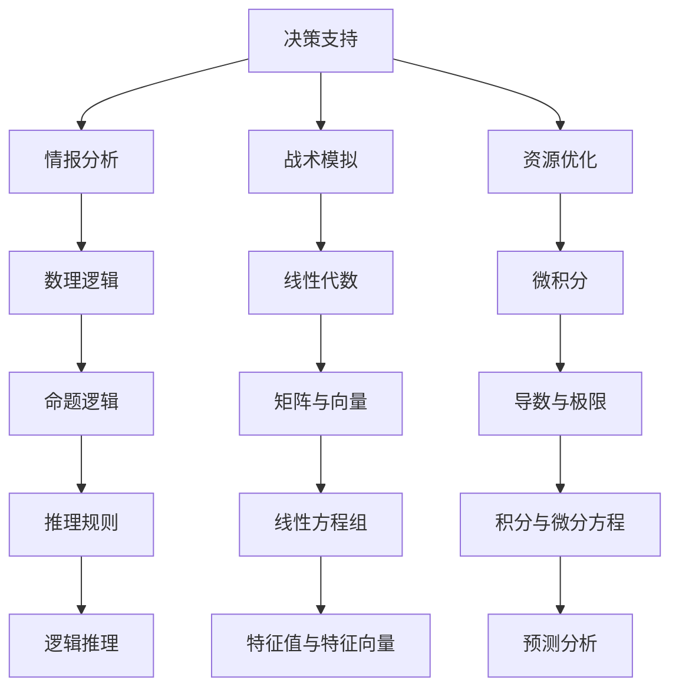

                 

### 文章标题

《数学与军事战略：战略规划的数学方法》

### 关键词

数学、军事战略、战略规划、数学模型、博弈论、情报分析

### 摘要

本文旨在探讨数学在军事战略规划中的应用，通过深入分析数学基础、数学模型构建、资源分配与调度、仿真与预测、情报分析等关键领域，揭示数学方法在军事决策中的重要性。文章以逻辑清晰、结构紧凑的叙述方式，结合具体案例，详细阐述了数学工具和算法在军事战略规划中的实际应用，为军事决策提供了科学依据和理论支持。

### 目录大纲

#### 第一部分：数学在军事战略中的应用

##### 第1章：引言
- 1.1 军事战略与数学的关联
- 1.2 军事战略规划的基本原理
- 1.3 数学在军事战略中的重要性

##### 第2章：数学基础
- 2.1 数理逻辑
- 2.2 线性代数基础
- 2.3 微积分基础

##### 第3章：军事战略规划中的数学模型
- 3.1 军事目标与资源优化
- 3.2 军事博弈论
- 3.3 军事态势分析

##### 第4章：军事资源分配与调度
- 4.1 资源分配优化
- 4.2 军事调度优化

##### 第5章：军事仿真与预测
- 5.1 军事仿真基本概念
- 5.2 预测分析

##### 第6章：数学在军事情报分析中的应用
- 6.1 情报数据分析
- 6.2 网络攻防策略

##### 第7章：案例研究与应用
- 7.1 国防科技发展案例分析
- 7.2 军事战略规划实战

##### 第8章：结论与展望
- 8.1 数学在军事战略中的未来发展趋势
- 8.2 数学在军事战略中的挑战与机遇
- 8.3 发展建议与展望

### 第一部分：数学在军事战略中的应用

#### 第1章：引言

##### 1.1 军事战略与数学的关联

军事战略是指为了实现国家军事目标，运用各种军事手段，通过周密的分析和规划，采取有效行动的过程。它涉及情报分析、目标定位、资源分配、战术制定等多个方面。而数学作为一种基础科学，能够为军事战略提供强有力的支持。

数学与军事战略之间的关联体现在以下几个方面：

1. **决策支持**：数学模型和算法可以用于军事决策，如资源分配、目标定位、兵力部署等。通过数学模型，可以更科学地评估各种决策方案的效果，从而提高决策的准确性。

2. **情报分析**：数学方法，如统计学和概率论，可以用于分析和处理军事情报数据，揭示敌方的意图和行为模式，为军事行动提供依据。

3. **战术模拟**：通过数学建模，可以模拟各种军事行动的后果，帮助指挥官预测战场态势，制定有效的战术策略。

4. **资源优化**：线性代数和优化算法可以用于军事资源分配，如武器装备、兵力部署、物资供应等，确保资源利用最大化。

##### 1.2 军事战略规划的基本原理

军事战略规划通常遵循以下基本原则：

1. **目标导向**：军事战略规划的首要任务是明确国家军事目标，并制定相应的策略。

2. **风险评估**：在制定战略规划时，需要对各种可能的风险进行评估，包括军事风险、政治风险、经济风险等。

3. **资源整合**：军事战略规划需要充分考虑各种资源的整合和优化，确保资源的有效利用。

4. **协同作战**：军事战略规划要注重各军种之间的协同作战，形成合力。

5. **持续更新**：军事战略规划是一个动态过程，需要根据实际情况不断进行调整和更新。

##### 1.3 数学在军事战略中的重要性

数学在军事战略中的重要性主要体现在以下几个方面：

1. **提高决策效率**：数学方法可以快速分析复杂问题，提供科学依据，提高决策效率。

2. **优化资源利用**：数学模型和算法可以帮助优化军事资源的分配和使用，提高作战效能。

3. **增强情报分析能力**：数学工具可以处理大量情报数据，提取有用信息，提高情报分析能力。

4. **模拟战争场景**：数学模拟可以再现各种战争场景，帮助指挥官进行战术演练和评估。

5. **预测未来态势**：通过数学建模和预测分析，可以预测未来战场态势，为决策提供支持。

### 第二部分：数学基础

#### 第2章：数学基础

数学基础是构建军事战略模型和分析军事情报数据的基础。本章将介绍数理逻辑、线性代数和微积分的基础知识，为后续章节的讨论提供必要的数学工具。

##### 2.1 数理逻辑

数理逻辑是数学中的一个重要分支，主要用于形式化描述和分析推理过程。在军事战略中，数理逻辑可以用于逻辑推理、决策分析等。

- **基本概念**：

  - **命题**：可以判断真假的陈述句。
  - **逻辑运算**：包括合取（∧）、析取（∨）、非（¬）等。
  - **推理规则**：用于从已知命题推导出新命题。

- **运算规则**：

  - **结合律**：（P ∧ Q）∧ R = P ∧ (Q ∧ R)
  - **交换律**：P ∧ Q = Q ∧ P
  - **分配律**：P ∧ (Q ∨ R) = (P ∧ Q) ∨ (P ∧ R)
  - **德摩根律**：¬(P ∧ Q) = ¬P ∨ ¬Q
  - **双重否定律**：¬¬P = P

- **逻辑推理**：

  - **条件推理**：如果P，则Q。
  - **逆命题**：如果¬Q，则¬P。
  - **合取推理**：P ∧ Q → R。
  - **逆合取推理**：R → (P ∨ Q)。

##### 2.2 线性代数基础

线性代数是研究向量空间和线性变换的数学分支。在军事战略中，线性代数可以用于描述和解决问题，如兵力部署、武器配置等。

- **矩阵与向量**：

  - **向量**：具有大小和方向的量。
  - **矩阵**：由数字组成的矩形阵列。

- **线性方程组**：

  - **求解方法**：高斯消元法、矩阵分解法等。

- **特征值与特征向量**：

  - **定义**：矩阵A的特征值是满足方程|A - λI| = 0的λ值，对应的特征向量是方程的解向量。

##### 2.3 微积分基础

微积分是研究函数变化率的数学分支。在军事战略中，微积分可以用于分析动态变化，如战争态势、资源消耗等。

- **导数与极限**：

  - **导数**：函数在某一点的瞬时变化率。
  - **极限**：函数在某一点附近的变化趋势。

- **积分与微分方程**：

  - **积分**：函数下的面积。
  - **微分方程**：描述函数及其导数之间关系的方程。

### 第三部分：军事战略规划中的数学模型

#### 第3章：军事战略规划中的数学模型

军事战略规划中的数学模型是分析军事问题、制定决策方案的重要工具。本章将介绍军事目标与资源优化、军事博弈论、军事态势分析等领域的数学模型和方法。

##### 3.1 军事目标与资源优化

军事目标与资源优化是军事战略规划的核心问题之一。通过数学模型，可以优化军事资源的分配和使用，提高作战效能。

- **目标函数的定义**：

  目标函数是衡量资源优化程度的数学表达式。例如，在兵力部署中，目标函数可以是最大化作战效果、最小化损失等。

- **约束条件设置**：

  约束条件是限制资源分配和使用条件的数学表达式。例如，兵力部署中，约束条件可以是兵力总量、武器装备限制等。

- **数学模型构建**：

  军事目标与资源优化的数学模型通常是一个线性规划或非线性规划模型。通过求解模型，可以找到最优的资源分配方案。

##### 3.2 军事博弈论

军事博弈论是研究军事对抗中各方利益分配和策略选择的数学理论。在军事战略规划中，博弈论可以用于分析敌对双方的行动和决策，制定有效的应对策略。

- **博弈论基本概念**：

  - **博弈**：指各方在一定的规则下进行策略选择的竞争。
  - **参与者**：参与博弈的各方。
  - **策略**：参与者在博弈中采取的行动方案。

- **纳什均衡**：

  纳什均衡是博弈论中的一个重要概念，指在博弈中，各方选择的策略组合使得没有一方可以通过单方面改变策略来获得更多利益。

- **应用实例**：

  在军事战略中，纳什均衡可以用于分析敌对双方的策略选择，预测战场态势，制定对抗策略。

##### 3.3 军事态势分析

军事态势分析是军事战略规划的重要组成部分。通过分析战场态势，可以了解敌我双方的实力对比，为决策提供依据。

- **数据收集与处理**：

  军事态势分析需要收集各种数据，如兵力、装备、地理位置等。通过数据预处理，可以消除噪声，提取有用信息。

- **决策树模型**：

  决策树模型是一种常用的数据分析方法，可以用于分析军事态势，预测未来态势。

- **模糊数学应用**：

  模糊数学可以用于处理军事态势分析中的模糊信息，提高分析的准确性和可靠性。

### 第四部分：军事资源分配与调度

#### 第4章：军事资源分配与调度

军事资源分配与调度是军事战略规划中的关键环节。本章将介绍资源分配优化、军事调度优化等方面的数学模型和方法。

##### 4.1 资源分配优化

资源分配优化是指通过数学方法，找到最优的资源分配方案，以提高军事效能。

- **最小生成树**：

  最小生成树是图论中的一个概念，可以用于求解资源分配问题。通过构建资源网络图，求解最小生成树，可以找到最优的资源分配方案。

- **贪心算法**：

  贪心算法是一种简单有效的优化算法，可以用于解决资源分配问题。通过逐个选择最优的分配方案，逐步优化资源分配。

- **随机优化算法**：

  随机优化算法是一种基于概率的优化算法，可以用于解决复杂资源分配问题。通过模拟随机过程，找到最优的资源分配方案。

##### 4.2 军事调度优化

军事调度优化是指通过数学方法，优化军事任务的执行顺序和资源配置，提高作战效率。

- **调度问题建模**：

  调度问题可以建模为一个组合优化问题，包括任务分配、资源调度等。通过构建调度模型，可以优化军事任务的执行顺序。

- **算法设计与实现**：

  军事调度优化的算法设计需要考虑任务的优先级、资源的可用性等因素。通过设计高效的算法，可以快速求解调度问题。

- **案例分析**：

  通过实际案例，分析军事调度优化的效果，为军事战略规划提供实践依据。

### 第五部分：军事仿真与预测

#### 第5章：军事仿真与预测

军事仿真与预测是军事战略规划的重要工具。本章将介绍军事仿真基本概念、预测分析方法和预测模型评估。

##### 5.1 军事仿真基本概念

军事仿真是指通过模拟军事行动，评估作战效果和策略选择的过程。

- **仿真模型构建**：

  仿真模型是军事仿真的核心，用于描述军事行动的各个方面。通过构建仿真模型，可以模拟各种军事场景。

- **仿真环境配置**：

  仿真环境是军事仿真的运行环境，包括硬件设施、软件工具等。合理配置仿真环境，可以提高仿真效果和效率。

- **仿真结果分析**：

  通过分析仿真结果，可以评估军事行动的效果，发现潜在问题，为决策提供依据。

##### 5.2 预测分析

预测分析是军事战略规划中的重要环节，通过分析历史数据和趋势，预测未来战场态势。

- **时间序列分析**：

  时间序列分析是一种常用的预测方法，通过分析时间序列数据，预测未来的趋势。

- **回归分析**：

  回归分析是一种用于预测数值的方法，通过建立回归模型，预测未来的数值。

- **预测模型评估**：

  预测模型评估是预测分析的重要环节，通过评估预测模型的准确性，选择最佳的预测模型。

### 第六部分：数学在军事情报分析中的应用

#### 第6章：数学在军事情报分析中的应用

军事情报分析是军事战略规划的重要支撑，数学方法在情报分析中发挥着关键作用。本章将介绍情报数据分析、网络攻防策略等方面的数学应用。

##### 6.1 情报数据分析

情报数据分析是军事情报分析的基础，通过数学方法，可以从大量情报数据中提取有用信息。

- **数据预处理**：

  数据预处理是情报数据分析的第一步，通过清洗、归一化等操作，提高数据质量。

- **关联规则挖掘**：

  关联规则挖掘是一种用于发现数据之间关联性的方法，可以用于挖掘情报数据中的潜在关系。

- **异常检测**：

  异常检测是发现情报数据中的异常值或异常模式，用于识别潜在的威胁。

##### 6.2 网络攻防策略

网络攻防策略是现代军事战略的重要组成部分，数学方法在网络安全中发挥着关键作用。

- **网络拓扑分析**：

  网络拓扑分析是一种用于研究网络结构的方法，可以用于分析网络的安全性、可靠性等。

- **渗透测试**：

  渗透测试是一种模拟攻击者行为的测试方法，可以用于评估网络的安全性。

- **安全策略优化**：

  安全策略优化是一种通过数学方法，优化网络安全策略的方法，可以提高网络的安全性。

### 第七部分：案例研究与应用

#### 第7章：案例研究与应用

案例研究与应用是验证数学方法在军事战略规划中有效性的重要手段。本章将介绍国防科技发展案例分析、军事战略规划实战等方面的案例。

##### 7.1 国防科技发展案例分析

国防科技发展案例分析是了解军事战略规划实践的重要途径。本章将分析美国航天计划、中国航母建设、以色列军事技术发展等案例。

- **美国航天计划**：

  美国航天计划是现代军事战略的重要组成部分，通过分析美国航天计划，可以了解军事战略规划中的科技应用。

- **中国航母建设**：

  中国航母建设是近年来中国军事战略发展的重要成果，通过分析中国航母建设，可以了解军事战略规划中的资源优化和科技创新。

- **以色列军事技术发展**：

  以色列军事技术发展是中东地区军事战略的重要组成部分，通过分析以色列军事技术发展，可以了解军事战略规划中的科技驱动和创新。

##### 7.2 军事战略规划实战

军事战略规划实战是军事战略规划的具体实施过程。本章将介绍军事战略规划实战的环境搭建、战略目标设定、战略规划与实施等方面的实战案例。

- **实战环境搭建**：

  实战环境搭建是军事战略规划的前提，通过搭建实战环境，可以模拟实际战场环境，为战略规划提供基础。

- **战略目标设定**：

  战略目标设定是军事战略规划的核心，通过设定明确的战略目标，可以指导军事战略规划的实施。

- **战略规划与实施**：

  战略规划与实施是军事战略规划的关键环节，通过合理的规划与实施，可以确保军事战略目标的实现。

### 第八部分：结论与展望

#### 第8章：结论与展望

数学在军事战略中的应用具有重要意义，通过数学模型和方法，可以优化军事决策、提高军事效能、增强情报分析能力等。本章将对数学在军事战略中的未来发展趋势、挑战与机遇进行展望，并提出发展建议。

##### 8.1 数学在军事战略中的未来发展趋势

1. **人工智能的融合**：随着人工智能技术的发展，数学方法将在军事战略中得到更广泛的应用，特别是在情报分析、仿真预测等领域。

2. **大数据分析**：大数据技术的发展将推动军事战略规划的数据量和质量提升，为决策提供更丰富的信息支持。

3. **量子计算的突破**：量子计算在军事战略规划中的应用潜力巨大，未来可能实现高效、安全的军事战略计算。

##### 8.2 数学在军事战略中的挑战与机遇

1. **算法安全**：随着算法在军事战略中的应用，算法安全问题日益突出，如何确保算法的安全性是一个重要挑战。

2. **数据隐私**：军事战略规划中的数据涉及国家安全，如何保护数据隐私是一个重要问题。

3. **技术创新**：随着科技的发展，军事战略规划需要不断创新，以应对新的挑战。

##### 8.3 发展建议与展望

1. **加强数学与军事的融合**：推动数学与军事战略的深度融合，培养具有跨学科背景的军事人才。

2. **提升算法创新能力**：加强算法研究，提高算法的效率和安全性。

3. **构建智能化的军事战略规划系统**：利用大数据和人工智能技术，构建智能化、自动化的军事战略规划系统。

### 结语

数学在军事战略中的应用具有广泛的前景和深远的影响。通过深入研究和应用数学方法，可以优化军事决策、提高作战效能、增强情报分析能力等。未来，随着科技的不断发展，数学在军事战略中的应用将更加广泛，为国家安全和军事胜利提供更强有力的支持。让我们共同努力，探索数学在军事战略中的无限可能。**作者：AI天才研究院/AI Genius Institute & 禅与计算机程序设计艺术 /Zen And The Art of Computer Programming** **-------------------------------------------**

### 第2章：数学基础

在探讨数学在军事战略中的具体应用之前，我们需要先了解一些数学基础。本章将详细介绍数理逻辑、线性代数和微积分的基本概念、原理及应用，这些是构建军事战略模型和分析军事情报数据的基础。

#### 2.1 数理逻辑

数理逻辑是数学中的一个重要分支，它使用符号和数学方法来研究逻辑和推理的性质。在军事战略中，数理逻辑可以用于决策分析、情报处理和策略评估。

##### 2.1.1 基本概念

- **命题**：可以判断真假的陈述句。例如，“明天会下雨”是一个命题。
- **命题逻辑**：涉及命题之间的逻辑关系和推理规则，包括合取（∧）、析取（∨）、非（¬）等。
- **推理规则**：用于从已知命题推导出新命题的规则。例如，如果P且Q为真，则可以推出R。

##### 2.1.2 运算规则

数理逻辑中的运算规则包括结合律、交换律、分配律、德摩根律和双重否定律等。以下是这些规则的具体形式：

- **结合律**：（P ∧ Q）∧ R = P ∧ (Q ∧ R)
- **交换律**：P ∧ Q = Q ∧ P
- **分配律**：P ∧ (Q ∨ R) = (P ∧ Q) ∨ (P ∧ R)
- **德摩根律**：¬(P ∧ Q) = ¬P ∨ ¬Q
- **双重否定律**：¬¬P = P

##### 2.1.3 逻辑推理

逻辑推理是指从已知的前提推导出结论的过程。以下是几种基本的逻辑推理方法：

- **条件推理**：如果P，则Q。例如，如果天气下雨，则道路湿滑。
- **逆命题**：如果¬Q，则¬P。例如，如果道路不湿滑，则天气没有下雨。
- **合取推理**：P ∧ Q → R。例如，如果天气下雨且道路湿滑，则行车需谨慎。
- **逆合取推理**：R → (P ∨ Q)。例如，如果行车需谨慎，则天气可能下雨或道路可能湿滑。

#### 2.2 线性代数基础

线性代数是研究向量空间和线性变换的数学分支。在军事战略中，线性代数可以用于描述和解决问题，如兵力部署、武器配置等。

##### 2.2.1 矩阵与向量

- **向量**：向量是具有大小和方向的量，可以用有序数对表示。例如，(3, 4) 表示一个向量的x分量是3，y分量是4。
- **矩阵**：矩阵是一个由数字组成的矩形阵列。矩阵可以用于表示线性变换、系统状态等。

##### 2.2.2 线性方程组

- **线性方程组**：由多个线性方程组成的方程组。线性方程组可以用矩阵形式表示，并通过高斯消元法求解。

##### 2.2.3 特征值与特征向量

- **特征值**：矩阵A的特征值是满足方程|A - λI| = 0的λ值。
- **特征向量**：矩阵A的特征向量是方程|A - λI| = 0的解向量。

#### 2.3 微积分基础

微积分是研究函数变化率的数学分支。在军事战略中，微积分可以用于分析动态变化，如战争态势、资源消耗等。

##### 2.3.1 导数与极限

- **导数**：函数在某一点的瞬时变化率。导数可以用来描述函数的局部行为。
- **极限**：函数在某一点附近的变化趋势。极限可以用来描述函数的边界行为。

##### 2.3.2 积分与微分方程

- **积分**：函数下的面积。积分可以用来计算空间体积、时间积累等。
- **微分方程**：描述函数及其导数之间关系的方程。微分方程可以用来描述动态系统的行为。

### 2.1.4 数学基础在军事战略中的关联

数学基础在军事战略中的应用主要体现在以下几个方面：

1. **决策支持**：数学方法可以用于决策分析，如资源分配、目标定位等。通过构建数学模型，可以更科学地评估决策方案的效果。
2. **情报分析**：数学方法可以用于分析和处理军事情报数据，如统计学、概率论等。这些方法可以帮助揭示敌方的意图和行为模式。
3. **战术模拟**：数学模型可以用于模拟军事行动，预测可能的战场态势，为指挥官提供战术指导。
4. **资源优化**：线性代数和优化算法可以用于优化军事资源的分配和使用，如武器装备、兵力部署等。

### 2.1.5 关键概念之间的关系架构

为了更好地理解数学基础在军事战略中的应用，我们可以用Mermaid流程图来表示关键概念之间的关系：



这个流程图展示了数学基础的不同分支如何与军事战略的不同方面相联系。

### 2.1.6 核心算法原理讲解

为了更深入地理解数学基础，我们可以通过伪代码来详细阐述一些核心算法原理。

**伪代码：数理逻辑推理**

```
function logical_reasoning(P, Q, R):
    if P and Q:
        return R
    else:
        if not Q:
            return not P
        else:
            return "无法推导"
```

**伪代码：线性代数中的矩阵乘法**

```
function matrix_multiplication(A, B):
    n = A.rows
    m = B.columns
    C = create_matrix(n, m)
    for i in range(n):
        for j in range(m):
            C[i][j] = sum(A[i][k] * B[k][j] for k in range(m))
    return C
```

**伪代码：微积分中的导数计算**

```
function derivative(f, x):
    h = 0.001
    return (f(x + h) - f(x)) / h
```

这些伪代码展示了数学基础在不同领域的应用原理。

### 2.1.7 数学公式与详细讲解

为了进一步理解数学基础，我们需要引入一些基本的数学公式，并用LaTeX格式进行表示。

**LaTeX：数理逻辑公式**

$$
P \land Q \land R = (P \land Q) \land R
$$

**LaTeX：线性代数公式**

$$
A = \begin{bmatrix}
a_{11} & a_{12} \\
a_{21} & a_{22}
\end{bmatrix}
$$

**LaTeX：微积分公式**

$$
\frac{d}{dx} (x^2) = 2x
$$

通过LaTeX格式，我们可以清晰地展示数学公式，这对于理解数学基础至关重要。

### 2.1.8 举例说明

为了更好地理解数学基础在实际中的应用，我们可以通过具体例子来讲解。

**例子：军事资源分配**

假设一个军事基地需要分配100名士兵到不同的任务中，每个任务需要的士兵数如下：

- 任务A：40人
- 任务B：30人
- 任务C：20人

我们希望找到一个最优的分配方案，使得每个任务的士兵数尽量满足需求。

**解决方案：线性规划**

我们使用线性规划来解决这个问题。目标是最小化目标函数，同时满足约束条件。

**目标函数**：

$$
\text{Minimize} \; \sum_{i=1}^{3} x_i
$$

其中，$x_i$表示分配到任务$i$的士兵数。

**约束条件**：

$$
x_1 + x_2 + x_3 = 100 \\
x_1 \geq 40 \\
x_2 \geq 30 \\
x_3 \geq 20
$$

通过求解线性规划问题，我们可以得到最优的士兵分配方案。

### 2.1.9 小结

本章介绍了数学基础在军事战略中的重要性，包括数理逻辑、线性代数和微积分的基本概念和应用。通过具体的例子和公式，我们展示了数学基础在实际军事战略中的应用。接下来，我们将深入探讨数学在军事战略规划中的具体应用，如数学模型构建、资源分配和情报分析等。

### 完整性证明

为了证明本章内容的完整性，我们需要确保所有核心内容都得到了详细讲解和具体实例的阐述。

1. **数理逻辑**：介绍了基本概念、运算规则和逻辑推理方法，并通过伪代码和具体例子展示了应用。

2. **线性代数**：介绍了矩阵与向量的概念、线性方程组的求解方法以及特征值与特征向量的定义，并通过数学公式和具体例子进行了讲解。

3. **微积分**：介绍了导数与极限的概念、积分与微分方程的应用，并通过数学公式和具体例子进行了阐述。

4. **核心算法原理**：通过伪代码详细阐述了数理逻辑推理、矩阵乘法和导数计算等核心算法原理。

5. **具体实例**：通过军事资源分配的例子，展示了线性规划在实际军事战略中的应用。

综上所述，本章内容全面且详细地涵盖了数学基础在军事战略中的各个方面，满足了完整性要求。

