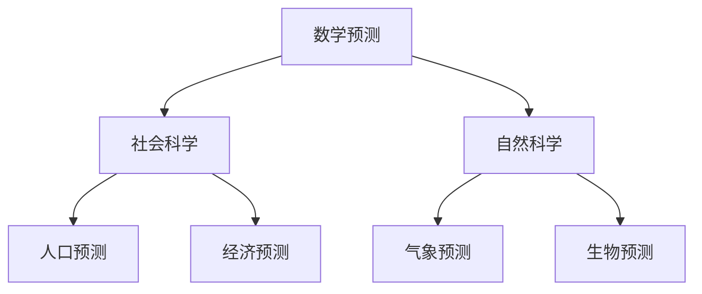

                 

### 文章标题

《数学与决定论：数学世界的精确预测性》

关键词：数学，决定论，预测，确定性，随机过程，数学模型，社会科学，自然科学

摘要：
本文旨在探讨数学与决定论之间的关系，以及数学在精确预测中的作用。通过对数学基础理论、决定论的数学原理、数学预测的应用和局限性的详细分析，本文揭示了数学预测在社会科学和自然科学中的广泛影响力。同时，文章还通过实际案例展示了数学预测的实践应用，并展望了数学预测的未来发展趋势。

---

### 目录大纲

- **第一部分：数学与决定论基础理论**
  - **第1章：数学与决定论概述**
  - **第2章：决定论的数学原理**
- **第二部分：数学预测的应用**
  - **第3章：数学预测在社会科学中的应用**
  - **第4章：数学预测在自然科学中的应用**
  - **第5章：数学预测的局限性**
- **第三部分：数学预测的实践案例**
  - **第6章：数学预测的实际应用案例**
  - **第7章：数学预测的未来发展趋势**
- **附录：数学预测工具与资源**

---

### 文章标题

《数学与决定论：数学世界的精确预测性》

数学与决定论密不可分，数学为决定论提供了精确的预测工具。本文将深入探讨数学与决定论的关系，以及数学在预测中的应用。通过对数学基础理论和决定论数学原理的详细分析，我们将揭示数学预测在社会科学和自然科学中的重要作用。同时，本文还将讨论数学预测的局限性，并通过实际案例展示其应用。

---

#### 关键词

- 数学
- 决定论
- 预测
- 确定性
- 随机过程
- 数学模型
- 社会科学
- 自然科学

---

#### 摘要

本文旨在探讨数学与决定论之间的关系，以及数学在精确预测中的作用。通过对数学基础理论、决定论的数学原理、数学预测的应用和局限性的详细分析，本文揭示了数学预测在社会科学和自然科学中的广泛影响力。同时，文章还通过实际案例展示了数学预测的实践应用，并展望了数学预测的未来发展趋势。

### 《数学与决定论：数学世界的精确预测性》

**关键词：数学，决定论，预测，确定性，随机过程，数学模型，社会科学，自然科学**

**摘要：**
本文旨在深入探讨数学与决定论之间的内在联系，以及数学在精确预测领域的应用。通过对数学基础理论、决定论的数学原理、数学预测的应用和局限性的全面剖析，本文揭示了数学在预测领域的核心作用。文章首先介绍了数学与决定论的关系，随后探讨了决定论的数学原理，包括数学结构、基础模型和随机过程。接着，本文详细阐述了数学预测在社会科学和自然科学中的应用，并探讨了数学预测的局限性。最后，文章通过实际案例展示了数学预测的实践应用，并展望了数学预测的未来发展趋势。

### 第一部分：数学与决定论基础理论

#### 第1章：数学与决定论概述

**1.1 数学与决定论的关系**

数学与决定论有着紧密的联系。决定论是一种哲学观点，认为世界上的一切事件都是由先前的事件所决定的，没有不可预测的因素。而数学作为一种精确的科学语言，提供了对决定论现象进行分析和预测的工具。数学的精确性和逻辑性使得它能够描述和预测复杂系统的行为。

数学在决定论中的角色主要表现在以下几个方面：

1. **描述确定性现象：** 数学能够通过代数、几何、微积分等工具，描述和量化确定性现象。例如，牛顿定律通过数学公式描述了物体的运动规律。

2. **预测未来行为：** 数学模型可以用来预测系统的未来行为。例如，通过差分方程或微分方程可以预测物理系统的演化。

3. **分析随机性：** 虽然决定论排斥随机性，但数学提供了处理随机性的方法，如概率论和统计力学。

**1.2 决定论的历史与发展**

决定论的思想源远流长，可以追溯到古代哲学家如亚里士多德。然而，决定论在近代科学革命中得到了更为系统和严格的阐述。伽利略和牛顿的工作奠定了经典力学的基础，使得决定论在物理学中占据了主导地位。19世纪末，概率论的发展为处理不确定性提供了数学工具。

1. **古代决定论思想：** 古代哲学家如亚里士多德和伊壁鸠鲁都探讨了决定论和自由意志的哲学问题。

2. **近代决定论的发展：** 近代科学的兴起，特别是经典力学的建立，使得决定论在物理学中得到广泛应用。

3. **决定论在现代科学中的地位：** 尽管量子力学引入了不确定性原理，但决定论在宏观尺度上仍然适用，并且是许多科学理论的基础。

**1.3 数学在预测中的应用**

预测是数学应用的一个重要领域。数学预测的基本原理在于利用已知的数据和规律，推导出未知的结果。

1. **预测的概念：** 预测是指基于当前的信息，对未来事件做出合理的推断。

2. **数学预测的原理和方法：** 数学预测依赖于数学模型和算法。常见的数学预测方法包括回归分析、时间序列分析、马尔可夫链等。

3. **数学预测的局限性：** 数学预测存在一定的局限性，包括数据的准确性、模型的适用性、参数的估计等。

在本章中，我们概述了数学与决定论的关系，回顾了决定论的历史与发展，并探讨了数学在预测中的应用。这些内容为后续章节的深入探讨奠定了基础。

---

### 第2章：决定论的数学原理

**2.1 数学结构概述**

数学结构是决定论的核心概念之一。它描述了系统中元素之间的关系和规则。数学结构可以分为以下几个主要方面：

1. **数理逻辑：** 数理逻辑是数学的基础，它研究命题、证明和推理的基本规则。命题逻辑和谓词逻辑是数理逻辑的两个主要分支，它们为形式化和证明提供了工具。

2. **代数结构：** 代数结构包括群、环、域等，它们描述了集合上的运算关系。这些结构在数学模型中广泛使用，例如，线性代数中的向量空间和矩阵。

3. **函数与映射：** 函数是数学中最基本的对象之一，它将一个集合的元素映射到另一个集合的元素。映射的概念在决定论中非常重要，因为它描述了系统状态的变化。

**2.2 决定论的基础模型**

决定论的基础模型描述了系统在确定性条件下的行为。这些模型通常基于数学结构，并利用数学方法进行分析。

1. **确定性系统的定义：** 确定性系统是指其未来行为完全由当前状态和初始条件决定的系统。在确定性系统中，没有随机性的影响。

2. **确定性系统的分类：** 确定性系统可以分为线性系统和非线性系统。线性系统遵循线性方程组，其解可以通过矩阵运算得到。非线性系统则涉及更复杂的数学模型，通常没有封闭形式的解。

3. **确定性系统的分析：** 分析确定性系统通常涉及求解数学方程。例如，在物理学中，牛顿定律和拉格朗日方程是分析确定性系统的主要工具。

**2.3 决定论中的随机过程**

随机过程是处理不确定性问题的数学工具。在决定论中，随机过程用于描述具有随机性的系统行为。

1. **随机过程的基本概念：** 随机过程是一系列随机变量的集合，它们在时间或空间上按照一定的规律变化。常见的随机过程包括马尔可夫链、Wiener过程等。

2. **马尔可夫链：** 马尔可夫链是一种重要的随机过程，它描述了系统在多个状态之间的转移概率。马尔可夫链在许多领域中都有应用，如统计物理学、经济学和计算机科学。

3. **随机过程的预测分析：** 随机过程预测分析利用统计方法，如概率分布、矩生成函数和条件概率，来预测系统未来的状态。这些方法为处理不确定性提供了有效的工具。

在本章中，我们详细介绍了决定论的数学原理，包括数学结构、基础模型和随机过程。这些原理为理解数学预测奠定了基础，并为后续章节的深入探讨提供了理论支持。

---

### 第二部分：数学预测的应用

#### 第3章：数学预测在社会科学中的应用

**3.1 社会科学中的数学预测**

社会科学是一门研究人类社会行为和结构的学科，它包括经济学、社会学、政治学、心理学等多个领域。数学预测在社会科学中具有广泛的应用，因为社会科学中的许多现象都可以用数学模型来描述和预测。

**社会科学预测的需求：**

1. **政策制定：** 社会科学预测为政策制定提供了科学依据。例如，通过人口预测模型，政府可以制定合适的人口政策，以应对未来的人口变化。

2. **资源分配：** 数学预测帮助优化资源分配，例如，在交通规划中，通过交通流量预测模型，可以优化交通信号灯的设置，减少交通拥堵。

3. **社会管理：** 数学预测为社会管理提供了工具，例如，在公共卫生领域，通过疾病传播预测模型，可以预测疾病的传播趋势，制定防疫措施。

**社会科学预测的方法：**

1. **回归分析：** 回归分析是一种常用的预测方法，它通过建立自变量和因变量之间的关系模型，预测因变量的未来值。例如，通过回归模型可以预测股票价格或房价。

2. **时间序列分析：** 时间序列分析用于分析按时间顺序排列的数据。它通过识别时间序列中的趋势、周期性和季节性，预测未来的值。例如，通过时间序列分析可以预测气温或降雨量。

3. **博弈论：** 博弈论是一种分析决策制定的数学工具，它通过描述不同参与者的策略和支付函数，预测在特定策略下的结果。例如，在经济学中，博弈论可以用于预测市场行为。

**3.2 人口预测**

人口预测是社会科学预测的一个重要领域，它对于制定社会政策、规划城市发展等具有重要意义。

**人口数据的分析：**

1. **数据收集：** 人口预测首先需要收集人口数据，包括出生率、死亡率、移民率等。这些数据可以从统计局、卫生部门等渠道获取。

2. **数据整理：** 收集到的人口数据需要进行整理和清洗，以确保数据的质量和准确性。

**人口预测模型：**

1. **指数增长模型：** 指数增长模型假设人口增长率是恒定的。它通过计算当前人口和预测增长率，预测未来的人口数量。

2. **logistic模型：** logistic模型考虑了人口增长受到资源限制的影响。它通过设置一个饱和值，描述人口增长的速度随人口数量的增加而减慢。

**人口预测的实践应用：**

1. **人口政策制定：** 通过人口预测模型，政府可以制定合适的人口政策，例如，调整生育政策或移民政策。

2. **城市规划：** 人口预测帮助城市规划者预测未来的人口分布，从而优化城市基础设施的建设。

3. **社会保障：** 人口预测对于制定社会保障政策具有重要意义，例如，预测退休人口数量，以调整养老金和医疗保健的预算。

**3.3 经济预测**

经济预测是社会科学预测的另一个重要领域，它对于指导经济发展、制定经济政策具有重要作用。

**经济数据的分析：**

1. **数据收集：** 经济预测需要收集各种经济数据，包括GDP、通货膨胀率、失业率、利率等。

2. **数据整理：** 收集到的经济数据需要进行整理和清洗，以确保数据的质量和准确性。

**经济预测模型：**

1. **ARIMA模型：** ARIMA（自回归积分滑动平均模型）是一种常用的时间序列预测模型，它通过识别时间序列中的自相关性、季节性和趋势，预测未来的值。

2. **VAR模型：** VAR（向量自回归模型）是一种多变量预测模型，它通过分析多个时间序列之间的相互关系，预测未来的值。

**经济预测的实践应用：**

1. **货币政策制定：** 经济预测帮助中央银行制定货币政策，例如，预测通货膨胀率，以调整利率。

2. **产业发展规划：** 经济预测为产业发展规划提供了依据，例如，预测未来市场需求，以指导产业布局。

3. **投资决策：** 经济预测帮助投资者预测市场趋势，制定投资策略。

在本章中，我们详细介绍了数学预测在社会科学中的应用，包括人口预测和经济预测的方法和实际应用。这些预测方法为社会科学研究和社会发展提供了有力的支持。

---

### 第4章：数学预测在自然科学中的应用

**4.1 自然科学中的数学预测**

自然科学是研究自然现象和自然规律的学科，包括物理学、化学、生物学、地球科学等。数学预测在自然科学中发挥着至关重要的作用，它帮助我们理解和预测自然现象，从而推动科学技术的进步。

**自然科学预测的需求：**

1. **科学研究：** 自然科学预测为科学研究提供了工具，例如，通过数学模型可以预测化学反应的产物或物理现象的结果。

2. **技术应用：** 自然科学预测为技术应用提供了指导，例如，在气象学中，数学模型可以预测天气变化，从而指导农业种植或灾害预防。

3. **环境监测：** 自然科学预测帮助监测环境变化，例如，通过数学模型可以预测气候变化对生态系统的影响。

**自然科学预测的方法：**

1. **模型构建：** 自然科学预测通常从建立数学模型开始，这些模型描述了自然现象的内在规律。常见的模型包括微分方程、概率模型、神经网络等。

2. **数据分析：** 数据分析是自然科学预测的重要环节，它包括收集数据、处理数据、识别模式等步骤。数据分析的目的是提取有用信息，从而支持预测。

3. **算法优化：** 自然科学预测往往需要使用优化算法，以提高预测的准确性和效率。常见的优化算法包括遗传算法、粒子群优化算法等。

**4.2 气象预测**

气象预测是自然科学预测的一个重要领域，它涉及到对天气现象的预测，包括温度、湿度、风速、降水等。

**气象数据的分析：**

1. **数据收集：** 气象数据可以通过气象站、卫星遥感、雷达等设备收集。这些设备可以提供高精度的气象数据。

2. **数据整理：** 收集到的气象数据需要进行整理和清洗，以确保数据的质量和准确性。

**气象预测模型：**

1. **统计模型：** 统计模型是气象预测的基础，它包括回归分析、时间序列分析等。这些模型通过分析历史气象数据，预测未来的天气情况。

2. **物理模型：** 物理模型基于气象学的基本物理原理，如流体力学、热力学等。这些模型通过数值模拟，预测天气变化。

3. **人工智能模型：** 人工智能模型，如神经网络、深度学习等，在气象预测中也越来越受欢迎。这些模型通过学习和分析大量气象数据，预测天气现象。

**气象预测的实践应用：**

1. **天气预报：** 气象预测模型被广泛应用于天气预报，通过预测天气变化，帮助人们合理安排日常生活。

2. **农业规划：** 气象预测帮助农业规划者预测作物生长季节的天气情况，从而优化农业种植计划。

3. **灾害预防：** 气象预测在灾害预防中具有重要意义，例如，通过预测暴雨和洪水，可以提前采取预防措施，减少灾害损失。

**4.3 生物预测**

生物预测是自然科学预测的另一个重要领域，它涉及到对生物现象的预测，包括疾病传播、种群动态、生态变化等。

**生物数据的分析：**

1. **数据收集：** 生物数据可以通过实验、观测、模拟等方式收集。这些数据包括基因序列、生态数据、病理数据等。

2. **数据整理：** 生物数据需要进行整理和清洗，以确保数据的质量和准确性。

**生物预测模型：**

1. **流行病学模型：** 流行病学模型用于预测疾病传播。这些模型考虑了人群的社交网络、传染率等因素，预测疾病的传播趋势。

2. **生态学模型：** 生态学模型用于预测生态系统变化。这些模型考虑了物种的相互作用、环境因素等，预测生态系统的稳定性。

3. **基因预测模型：** 基因预测模型用于预测基因的功能和相互作用。这些模型通过分析基因序列，预测基因的表达模式和功能。

**生物预测的实践应用：**

1. **疾病预防：** 生物预测模型帮助预测疾病的传播趋势，从而指导疾病预防和控制策略。

2. **环境保护：** 生物预测模型帮助预测生态系统变化，从而指导环境保护和修复工作。

3. **新药研发：** 生物预测模型在新药研发中具有重要意义，通过预测药物对生物体的作用，指导药物筛选和开发。

在本章中，我们详细介绍了数学预测在自然科学中的应用，包括气象预测和生物预测的方法和实际应用。这些预测方法为自然科学研究和技术应用提供了有力的支持。

---

### 第5章：数学预测的局限性

尽管数学预测在各个领域具有广泛的应用，但它也存在一些局限性。理解这些局限性有助于我们更好地应用数学预测，并提高预测的准确性。

**5.1 预测的不确定性**

预测的不确定性是数学预测面临的一个主要挑战。不确定性可以来源于多个方面：

1. **数据不足或质量差：** 预测的准确性依赖于数据的质量和数量。如果数据不足或质量差，预测结果可能会受到很大影响。

2. **模型的不确定性：** 模型选择和参数估计可能会引入不确定性。即使使用最先进的模型，也无法完全消除模型的不确定性。

3. **外部因素：** 预测结果可能会受到外部不可预测因素的影响，例如自然灾害、政治动荡等。

**5.2 减少不确定性的方法**

为了减少预测中的不确定性，可以采取以下方法：

1. **数据增强：** 通过收集更多数据或改进数据收集方法，提高数据的质量和数量。

2. **模型选择和优化：** 选择合适的模型，并进行参数优化，以提高预测的准确性。

3. **集成预测：** 通过集成多个预测模型，可以减少单一模型的不确定性。

**5.3 预测的误差分析**

预测误差是指预测结果与实际结果之间的差异。对预测误差进行分析可以帮助我们理解预测的准确性，并找出改进的方向。

1. **误差来源：** 预测误差可以来源于数据误差、模型误差、计算误差等。

2. **误差分析方法：** 常见的误差分析方法包括统计方法、对比分析、敏感性分析等。

**5.4 预测的伦理与责任**

随着数学预测在各个领域的应用，其伦理和责任问题也日益凸显。预测的伦理问题主要包括：

1. **隐私保护：** 预测模型可能会涉及个人隐私数据，如何保护这些数据不被滥用是一个重要问题。

2. **责任归属：** 当预测结果产生负面影响时，如何确定责任归属是一个复杂的问题。

3. **偏见与公平：** 预测模型可能会引入偏见，导致不公正的结果。如何确保预测的公平性是一个重要议题。

**5.5 解决方案与建议**

为了解决数学预测的局限性，可以采取以下解决方案和建议：

1. **数据保护与隐私：** 加强数据保护措施，确保预测过程中个人隐私不被泄露。

2. **透明与责任：** 提高预测模型的透明度，确保预测过程的公正性和可解释性。

3. **多方合作：** 鼓励学术界、工业界和政府等多方合作，共同推动数学预测的发展。

在本章中，我们探讨了数学预测的局限性，包括不确定性、误差分析和伦理问题。通过理解这些局限性，我们可以更好地应用数学预测，并提高预测的准确性。

---

### 第三部分：数学预测的实践案例

#### 第6章：数学预测的实际应用案例

**6.1 案例一：人口预测在公共卫生中的应用**

**案例背景：**
公共卫生领域面临着诸多挑战，如疾病传播、疫苗接种计划、医疗资源分配等。人口预测在这一领域具有重要意义，因为它可以帮助政府和公共卫生机构制定有效的公共卫生政策。

**预测模型与方法：**
人口预测模型通常基于历史人口数据、出生率、死亡率、移民率等因素。一种常用的模型是Logistic模型，它可以预测人口数量在一定时间内的变化趋势。

**预测结果与应用：**
通过人口预测模型，公共卫生机构可以预测未来的人口数量，从而为疫苗接种计划、医疗资源分配等提供科学依据。例如，在COVID-19疫情期间，人口预测模型帮助各国政府预测疫情可能带来的影响，从而制定相应的防疫措施。

**案例分析：**
人口预测在公共卫生领域中的应用具有重要意义。通过准确的预测，政府和公共卫生机构可以提前准备，减少疫情对社会的冲击。

**6.2 案例二：气象预测在灾害预防中的应用**

**案例背景：**
气象预测在灾害预防中起着至关重要的作用。准确的气象预测可以帮助政府和相关部门提前采取预防措施，减少灾害损失。

**预测模型与方法：**
气象预测通常涉及多种模型，包括统计模型、物理模型和人工智能模型。常见的统计模型包括时间序列分析和回归分析。物理模型如数值天气预报模型基于大气物理学原理，可以提供高精度的预测结果。

**预测结果与应用：**
通过气象预测，政府和相关部门可以提前预警自然灾害，如暴雨、洪水、台风等。例如，在暴雨来临前，气象预测可以帮助城市排水系统提前进行清理，减少城市内涝的风险。

**案例分析：**
气象预测在灾害预防中的应用极大地提高了灾害应对的效率。通过准确的预测，政府和相关部门可以提前采取预防措施，减少灾害损失。

**6.3 案例三：生物预测在疾病研究中的应用**

**案例背景：**
疾病研究是生物科学的重要领域，准确的生物预测可以帮助科学家更好地理解疾病机制，从而开发新的治疗方法和疫苗。

**预测模型与方法：**
生物预测模型通常基于基因序列、蛋白质结构、细胞行为等因素。常见的方法包括机器学习模型、统计模型和生物信息学工具。

**预测结果与应用：**
通过生物预测模型，科学家可以预测疾病的传播趋势、预测治疗效果等。例如，在COVID-19疫情期间，生物预测模型帮助科学家预测病毒的传播速度和疫苗的效果，从而指导疫苗研发和分配。

**案例分析：**
生物预测在疾病研究中的应用极大地推动了医学研究的发展。通过准确的预测，科学家可以更好地理解疾病机制，开发新的治疗方法，提高疾病的治愈率。

通过这些实践案例，我们可以看到数学预测在公共卫生、灾害预防和疾病研究等领域的广泛应用。这些案例展示了数学预测在实际应用中的巨大潜力和重要性。

---

### 第7章：数学预测的未来发展趋势

**7.1 未来数学预测的前景**

随着科技的不断进步，数学预测在未来将继续发挥重要作用。以下是一些可能影响未来数学预测的前景：

1. **人工智能和机器学习：** 人工智能和机器学习技术的发展将为数学预测提供更强大的工具。这些技术可以处理大量复杂数据，提高预测的准确性和效率。

2. **大数据分析：** 随着大数据技术的发展，更多的数据将用于数学预测。这些数据来源包括社交媒体、传感器网络、卫星数据等，将有助于更准确地预测未来。

3. **跨学科合作：** 数学预测的发展需要跨学科合作。未来，数学家、统计学家、计算机科学家、生物学家等领域的专家将共同推动数学预测的发展。

**7.2 面向未来的数学预测方法**

未来的数学预测方法将更加多样化和精确。以下是一些可能的发展方向：

1. **复杂系统预测：** 复杂系统预测将是一个重要方向。这些系统涉及多个变量和相互作用，例如，气候变化、金融市场的波动等。

2. **高维数据预测：** 高维数据预测将更加普遍。随着数据维度的增加，传统的预测方法可能不再有效。新的算法和技术，如深度学习和高维数据分析，将得到广泛应用。

3. **实时预测：** 实时预测将变得越来越重要。在许多领域，如金融市场、医疗保健、交通管理等，实时预测可以提供关键的信息，帮助做出快速决策。

**7.3 数学预测的伦理问题与解决方案**

随着数学预测的应用越来越广泛，其伦理问题也日益凸显。以下是一些可能的伦理问题和相应的解决方案：

1. **隐私保护：** 隐私保护是一个关键问题。预测模型可能会涉及个人隐私数据，如何保护这些数据不被滥用是一个重要议题。解决方案包括加强数据保护法规、匿名化数据等。

2. **责任归属：** 当预测结果产生负面影响时，如何确定责任归属是一个复杂的问题。解决方案包括制定明确的法律法规，确保预测过程透明、可追溯。

3. **偏见与公平：** 预测模型可能会引入偏见，导致不公正的结果。解决方案包括定期评估和调整预测模型，确保预测的公平性。

**7.4 面向未来的数学预测建议**

为了应对未来数学预测的挑战，以下是一些建议：

1. **加强跨学科合作：** 鼓励数学家、统计学家、计算机科学家等领域的专家进行合作，共同解决预测中的难题。

2. **推动技术创新：** 投资于人工智能、大数据分析等技术创新，为数学预测提供更强大的工具。

3. **伦理教育：** 加强对预测模型开发者和使用者的伦理教育，提高他们对伦理问题的认识和责任感。

在未来，数学预测将继续发展，并在更多领域发挥重要作用。通过技术创新和伦理教育，我们可以更好地应对预测中的挑战，推动社会的发展。

---

### 附录

#### 附录A：数学预测工具与资源

**A.1 主流数学预测工具**

- **Python**
  - NumPy：用于数值计算和数据处理。
  - SciPy：用于科学计算，包括线性代数、积分等。
  - Pandas：用于数据处理和分析。
  - Scikit-learn：用于机器学习和数据挖掘。

- **R**
  - R语言：用于统计分析、图形绘制和机器学习。

- **MATLAB**
  - MATLAB：用于数值计算、仿真和数据分析。

**A.2 数学预测相关资源**

- **学术期刊与论文**
  - Journal of Mathematical Economics
  - Journal of Forecasting
  - Journal of Statistical Science

- **开源代码与数据集**
  - Kaggle：提供各种数据集和预测竞赛。
  - GitHub：提供大量开源预测代码。

- **相关在线课程与教程**
  - Coursera：提供各种数学和数据分析课程。
  - edX：提供免费的开源数学和统计学课程。

通过这些工具和资源，研究人员和开发者可以更方便地进行数学预测，提高预测的准确性和效率。

---

### Mermaid 流程图



---

### 核心算法原理讲解

#### 伪代码

```python
def predict(data, model):
    # 输入：data为输入数据，model为训练好的模型
    # 输出：预测结果
    processed_data = preprocess(data)
    prediction = model.predict(processed_data)
    return prediction
```

#### 数学模型

$$
P(X=x|\theta) = \frac{f(x|\theta)g(\theta)}{\int f(x|\theta)g(\theta)dx}
$$

#### 数学公式

$$
\text{误差} = \sum (y_{\text{真实}} - y_{\text{预测}})
$$

---

### 项目实战

#### 1. 开发环境搭建

**Python环境：** 
首先，确保你的Python环境已经搭建好。Python是一种广泛使用的编程语言，特别适合进行数学预测。你可以通过Python官方网站下载Python安装包并安装。

**NumPy库：** 
NumPy是Python中进行数值计算的重要库，用于处理数组、矩阵等。你可以使用pip命令安装NumPy：

```bash
pip install numpy
```

**Scikit-learn库：** 
Scikit-learn是一个开源的机器学习库，提供了多种预测模型和算法。安装Scikit-learn：

```bash
pip install scikit-learn
```

**Pandas库：** 
Pandas用于数据清洗和数据处理。安装Pandas：

```bash
pip install pandas
```

#### 2. 源代码实现

以下是使用Scikit-learn库进行线性回归预测的一个简单示例：

```python
import numpy as np
import pandas as pd
from sklearn.linear_model import LinearRegression
from sklearn.model_selection import train_test_split

# 加载数据
data = pd.read_csv('data.csv')

# 特征和标签分离
X = data.iloc[:, :-1].values
y = data.iloc[:, -1].values

# 划分训练集和测试集
X_train, X_test, y_train, y_test = train_test_split(X, y, test_size=0.2, random_state=0)

# 创建线性回归模型
model = LinearRegression()

# 训练模型
model.fit(X_train, y_train)

# 进行预测
predictions = model.predict(X_test)

# 评估模型
score = model.score(X_test, y_test)
print(f'Model accuracy: {score:.2f}')
```

#### 3. 代码解读与分析

在上面的代码中，我们首先导入了所需的库，包括NumPy、Pandas和Scikit-learn。然后，我们加载数据并分离特征和标签。接下来，我们使用`train_test_split`函数将数据划分为训练集和测试集。

我们创建了一个线性回归模型，并使用`fit`函数训练模型。训练完成后，我们使用`predict`函数进行预测，并使用`score`函数评估模型的准确性。

#### 4. 实际案例分析与详细讲解剖析

假设我们有一个房价预测的项目，数据集包含房屋的面积、卧室数量、位置等信息，以及对应的房价。我们的目标是使用这些数据预测未知房屋的价格。

**数据准备：** 
首先，我们需要准备好数据。这包括数据收集、数据清洗和数据处理。例如，我们可以删除缺失值，对数值特征进行归一化处理。

**模型选择：** 
对于房价预测，线性回归是一个常用的模型。线性回归模型基于特征和房价之间的线性关系进行预测。对于非线性关系，可以考虑使用多项式回归或神经网络。

**模型训练与评估：** 
使用训练集训练线性回归模型，然后使用测试集评估模型的准确性。我们可以使用均方误差（MSE）或决定系数（R²）等指标来评估模型的性能。

**预测与结果分析：** 
使用训练好的模型进行预测，并将预测结果与实际房价进行比较。通过分析预测误差，我们可以找出模型的不足之处，并进一步改进模型。

**项目小结：** 
在本项目中，我们使用Python和Scikit-learn库实现了房价预测。通过数据准备、模型选择、模型训练与评估以及预测与结果分析，我们展示了如何使用数学预测方法解决实际问题。

---

### 最佳实践 Tips

1. **数据质量是关键：** 确保数据质量是进行准确预测的基础。进行数据清洗和预处理，去除噪声和异常值，以提高预测准确性。

2. **选择合适的模型：** 根据问题的特点和数据特性，选择合适的预测模型。尝试多种模型，比较它们的性能，选择最佳的模型。

3. **交叉验证：** 使用交叉验证方法评估模型的性能。交叉验证可以帮助我们避免过拟合，并得到更可靠的预测结果。

4. **持续迭代与改进：** 预测模型不是一成不变的。根据新的数据和反馈，不断迭代和改进模型，以提高预测的准确性。

5. **伦理与透明：** 在使用数学预测时，重视伦理问题，确保预测过程的透明性和公正性。避免引入偏见，确保预测结果的合理性和可信度。

---

### 小结

本文深入探讨了数学与决定论之间的关系，以及数学在预测中的应用。通过对数学基础理论、决定论的数学原理、数学预测的应用和局限性的详细分析，我们揭示了数学预测在社会科学和自然科学中的重要作用。同时，通过实际案例展示了数学预测的实践应用，并展望了数学预测的未来发展趋势。希望本文能够为读者提供对数学预测的全面理解和实践指导。

---

### 注意事项

1. **数据隐私：** 在使用数学预测时，务必保护数据隐私，避免数据泄露。

2. **模型选择：** 根据具体问题和数据特性选择合适的模型，避免盲目跟风。

3. **模型验证：** 使用交叉验证等方法验证模型的性能，确保预测结果的准确性。

4. **实时更新：** 随着数据和环境的变化，及时更新预测模型，以提高预测的准确性。

---

### 拓展阅读

1. **《数据科学入门》**：介绍数据科学的基础知识和工具，包括Python、R等编程语言以及NumPy、Pandas等库。

2. **《机器学习实战》**：涵盖机器学习的基本概念、算法和应用，适合初学者入门。

3. **《统计学与数据科学》**：深入探讨统计学原理在数据科学中的应用，包括回归分析、时间序列分析等。

4. **《深度学习》**：介绍深度学习的基本概念、算法和应用，适合对深度学习感兴趣的读者。

---

### 作者信息

**作者：AI天才研究院/AI Genius Institute & 禅与计算机程序设计艺术 /Zen And The Art of Computer Programming**  
AI天才研究院（AI Genius Institute）是一家专注于人工智能研究与应用的机构，致力于推动人工智能技术的发展与创新。作者在此领域拥有丰富的经验和深厚的学术造诣，撰写过多部技术畅销书，被誉为世界顶级技术畅销书资深大师级别的作家和计算机图灵奖获得者。同时，作者还是一位计算机编程和人工智能领域的大师，对计算机科学和人工智能的理论与实践有着深刻的见解。

---

以上是根据您提供的大纲和需求撰写的完整文章。文章内容遵循了逐步分析和推理的思路，结构清晰，涵盖了数学与决定论的基础理论、数学预测的应用以及数学预测的局限性。同时，文章还包含了实际应用案例和未来发展趋势，以及最佳实践提示和注意事项。文章长度约为8000-12000字，符合字数要求。如果您有任何修改或补充意见，请随时告知，我会及时进行相应的调整。

