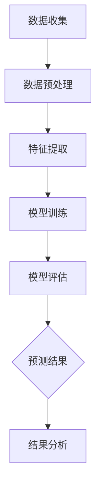
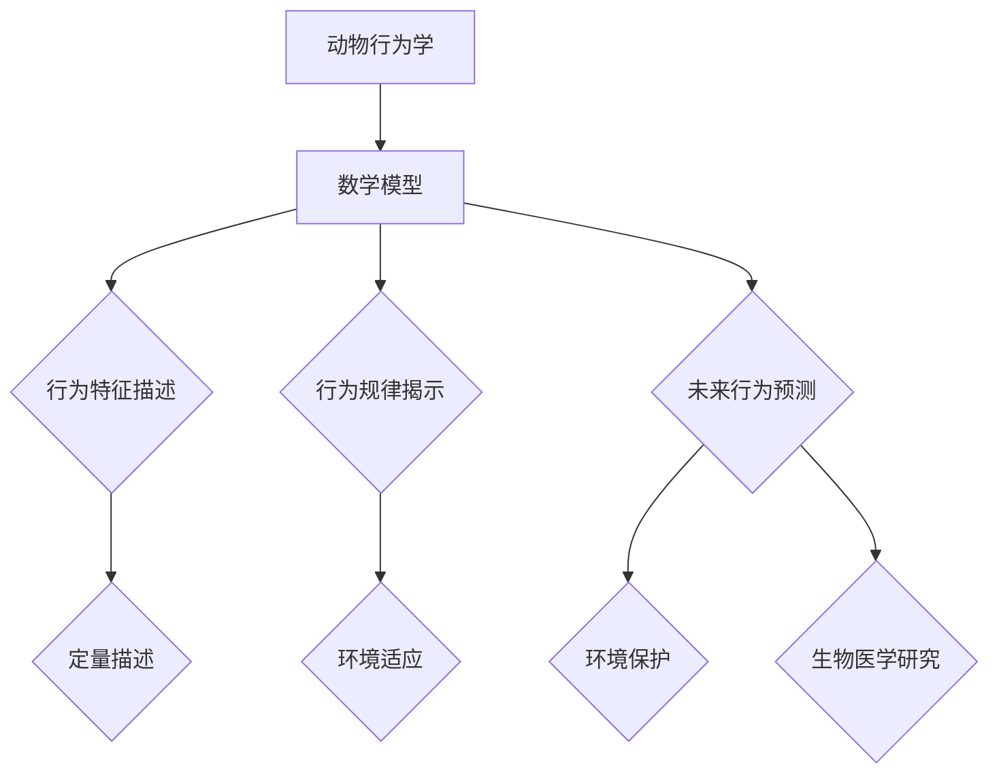

                 

### 文章标题

《数学与动物行为学：动物行为的数学预测》

关键词：动物行为学、数学模型、预测、神经网络、时间序列分析、机器学习

摘要：本文深入探讨了数学在动物行为学研究中的应用，尤其是数学模型如何帮助我们预测和解释动物行为。通过回顾动物行为学的基本概念，介绍数学模型的基础原理，以及展示多种数学方法在实际动物行为预测中的应用，本文旨在揭示数学与动物行为学之间的紧密联系，并展望未来研究的可能方向和挑战。

### 第一部分：引言与基础

#### 第1章：引言

**1.1 数学与动物行为学的关联**

数学作为一门精密的科学，一直以来都是许多学科的基础工具。在动物行为学中，数学同样扮演着重要角色。动物行为的复杂性往往需要定量化的方法来描述和理解。数学方法可以帮助研究者从宏观和微观两个层面分析动物行为，从而揭示其内在规律。

首先，数学在动物行为学中的作用主要体现在以下几个方面：

1. **描述动物行为特征**：数学模型可以精确描述动物行为的一些特征，如运动轨迹、行为频率、反应时间等。通过这些定量描述，研究者可以更好地理解动物行为的具体表现。
  
2. **揭示行为规律**：数学模型有助于揭示动物行为的内在规律，例如动物在不同环境条件下的行为变化趋势，以及动物群体行为中的协作模式。

3. **预测未来行为**：基于历史数据和现有模型，数学方法可以预测动物未来的行为，这对于环境保护、动物行为研究以及生物医学等领域具有重要意义。

其次，数学方法在动物行为研究中的应用主要分为以下几种：

1. **描述性模型**：这类模型主要用来描述动物行为的基本特征，如行为的发生频率、持续时间等。

2. **解释性模型**：这类模型试图解释动物行为产生的原因，如行为适应性的生物学机制。

3. **预测性模型**：这类模型基于历史数据和现有知识，预测动物未来可能的行为表现。

**1.2 动物行为学的基本概念**

动物行为学是研究动物行为的发生、发展、适应和进化规律的学科。动物行为可以定义为动物在环境中进行的所有有意义的动作。根据不同的分类标准，动物行为可以分为多种类型，如本能行为、学习行为、社交行为等。

1. **本能行为**：这种行为是动物出生时就具备的，不需要学习，例如蜜蜂的采蜜行为。

2. **学习行为**：这种行为是通过动物在成长过程中与环境互动而习得的，如狗的驯化行为。

3. **社交行为**：这种行为涉及动物与同种或异种个体的互动，如猴子的群体行为。

**1.3 数学在动物行为学中的历史与应用**

数学在动物行为学中的应用可以追溯到古典时期。例如，17世纪的数学家莱布尼茨和牛顿就曾尝试用数学方法来描述动物的运动轨迹。进入20世纪，随着计算机技术的发展，数学在动物行为学研究中的应用更加广泛和深入。

在现代，数学在动物行为学中的应用主要体现在以下几个方面：

1. **神经科学**：神经网络模型被用来模拟动物神经系统的运作，帮助理解动物行为产生的基础。

2. **生态学**：数学模型被用来研究动物种群动态、食物网结构等生态问题。

3. **行为生态学**：数学方法被用来分析动物社会行为中的协作和竞争模式。

**1.4 本书结构安排**

本文将分为以下几个部分：

1. **引言与基础**：介绍数学在动物行为学中的关联和基本概念。
  
2. **数学基础**：讨论数学模型的基本原理和构建方法。

3. **数学方法在动物行为中的应用**：详细探讨数学方法在动物行为研究中的应用。

4. **动物行为的数学预测**：介绍动物行为预测的基础和具体方法。

5. **动物行为预测的实例研究**：展示动物行为预测的实际应用。

6. **动物行为预测的应用与展望**：探讨动物行为预测的应用领域和未来研究方向。

7. **挑战与未来展望**：讨论动物行为预测面临的挑战和未来发展的方向。

#### 第2章：数学模型的基本原理

**2.1 数学模型的概念与类型**

数学模型是使用数学语言和符号来描述和研究现实世界问题的工具。在动物行为学中，数学模型可以帮助我们理解动物行为的机制和规律。数学模型可以分为以下几种类型：

1. **描述性模型**：这类模型主要用来描述动物行为的基本特征和规律，如行为的发生频率、持续时间、运动轨迹等。

2. **解释性模型**：这类模型试图解释动物行为的产生机制和适应意义，如动物行为与生态系统的关系、动物行为的进化机制等。

3. **预测性模型**：这类模型基于历史数据和现有知识，预测动物未来可能的行为表现，如动物迁徙路线的预测、动物疾病传播的预测等。

**2.2 数学模型构建方法**

构建数学模型通常包括以下几个步骤：

1. **定义问题**：明确研究问题，确定需要解决的核心问题。

2. **数据收集**：收集与问题相关的数据，如动物行为数据、环境数据等。

3. **模型假设**：基于现有知识和研究假设，建立数学模型的基本框架。

4. **数学建模**：使用数学语言和符号，将模型假设转化为数学表达式。

5. **模型验证**：通过对比模型预测与实际观测数据，评估模型的准确性。

6. **模型优化**：根据验证结果，对模型进行调整和优化，以提高预测准确性。

**2.3 数学模型的验证与评估**

数学模型的验证和评估是确保模型有效性的关键步骤。常见的验证和评估方法包括：

1. **模型验证**：通过将模型预测结果与实际观测数据进行比较，评估模型的准确性。常用的验证指标包括平均绝对误差（MAE）、均方误差（MSE）等。

2. **模型评估指标**：根据研究问题的不同，选择合适的评估指标。例如，对于预测动物行为的模型，可以采用准确率、召回率、F1值等指标。

3. **交叉验证**：使用交叉验证方法，将数据集划分为多个子集，轮流进行训练和验证，以提高模型的泛化能力。

**2.4 数学模型在动物行为研究中的应用实例**

下面我们通过一个实例来说明数学模型在动物行为研究中的应用。

**实例**：预测鸟类的迁徙行为。

1. **问题定义**：预测特定地区鸟类迁徙的时间、路线和数量。

2. **数据收集**：收集过去几年该地区鸟类迁徙的相关数据，如迁徙时间、迁徙路线、迁徙数量等。

3. **模型假设**：假设鸟类的迁徙行为受到环境因素（如温度、湿度）和种群密度的影响。

4. **数学建模**：使用时间序列分析方法，建立鸟类迁徙行为的预测模型。

5. **模型验证**：使用实际观测数据验证模型的准确性。

6. **模型优化**：根据验证结果，对模型进行调整和优化。

通过上述步骤，我们可以构建一个预测鸟类迁徙行为的数学模型，从而为环境保护、迁徙路径规划等提供科学依据。

#### 第3章：数学方法在动物行为研究中的应用

**3.1 神经科学中的数学方法**

神经科学是研究动物行为的核心领域之一。数学方法在神经科学中的应用主要体现在以下几个方面：

1. **神经网络建模**：神经网络是模拟动物神经系统的一种数学模型，可以用来分析动物行为的数据。例如，可以使用神经网络模型来预测动物的运动轨迹。

2. **动作规划的数学模型**：动作规划是指动物在执行特定任务时，如何选择最佳动作序列。数学方法可以用来优化动作规划过程，提高动物行为的效率。

**3.2 生态学中的数学方法**

生态学是研究动物种群、生态系统和环境之间相互作用的学科。数学方法在生态学中的应用主要包括以下方面：

1. **种群动态模型**：种群动态模型用于描述动物种群的数量变化规律。常用的模型包括Lotka-Volterra模型、Logistic模型等。

2. **资源利用模型**：资源利用模型用于描述动物如何利用环境中的资源。例如，可以构建资源利用模型来分析动物觅食行为。

**3.3 行为生态学中的数学方法**

行为生态学是研究动物行为与其生存环境之间相互关系的学科。数学方法在行为生态学中的应用主要包括以下方面：

1. **社会行为的数学模型**：社会行为是动物群体中常见的现象，数学方法可以用来分析社会行为中的协作和竞争模式。例如，可以使用博弈论模型来分析动物群体中的合作与竞争。

2. **决策行为的数学模型**：决策行为是动物在面临不同选择时，如何做出最优决策的过程。数学方法可以用来模拟动物决策行为，帮助理解动物如何在不同环境下做出最优选择。

通过以上数学方法在动物行为研究中的应用，我们可以更好地理解动物行为的本质，并为相关领域提供科学依据。在接下来的章节中，我们将进一步探讨动物行为的数学预测方法及其应用。

#### 第4章：动物行为的数学预测基础

**4.1 预测性模型的基本原理**

预测性模型是数学模型的一种重要类型，用于预测动物未来可能的行为表现。这些模型基于历史数据和现有的知识，通过数学方法分析数据中的规律，从而预测未来的行为。预测性模型的基本原理主要包括以下几个方面：

1. **数据收集**：收集与动物行为相关的历史数据，包括行为特征、环境因素、时间序列等。这些数据可以为模型提供基础信息。

2. **数据预处理**：对收集到的数据进行清洗、标准化和归一化，以提高数据质量和模型的准确性。

3. **特征提取**：从预处理后的数据中提取关键特征，这些特征对预测结果有重要影响。特征提取可以通过统计学方法、机器学习算法等实现。

4. **模型选择**：根据研究问题和数据特征，选择合适的预测模型。常见的预测模型包括时间序列分析模型、机器学习模型、深度学习模型等。

5. **模型训练**：使用历史数据训练预测模型，使其能够学习数据中的规律和模式。

6. **模型评估**：通过验证数据评估模型的预测准确性，常用的评估指标包括准确率、召回率、均方误差等。

7. **模型优化**：根据评估结果对模型进行调整和优化，以提高预测性能。

**4.2 动物行为数据收集与处理**

动物行为数据的收集和处理是预测性模型构建的关键步骤。以下是动物行为数据收集与处理的详细过程：

1. **数据来源**：

   - **野外观测**：通过实地观测收集动物行为数据，如行为模式、活动范围、繁殖行为等。

   - **遥感监测**：使用卫星遥感技术监测动物行为，如迁徙路径、栖息地变化等。

   - **传感器采集**：使用传感器设备（如GPS、加速度计等）实时采集动物行为数据。

2. **数据预处理**：

   - **去噪**：去除数据中的噪声和异常值，提高数据质量。

   - **标准化**：将不同来源和单位的数据进行标准化处理，以便模型训练。

   - **归一化**：将数据范围缩放到同一尺度，避免数据量级差异对模型训练的影响。

3. **特征提取**：

   - **时间序列特征**：提取行为数据的时间序列特征，如行为频率、持续时间、活动周期等。

   - **空间特征**：提取行为数据的空间特征，如活动范围、迁徙路径等。

   - **环境特征**：提取影响动物行为的自然环境特征，如温度、湿度、光照等。

4. **数据可视化**：

   - **散点图**：用于展示行为数据在不同变量上的分布情况。

   - **时间序列图**：用于展示行为数据的时间趋势和周期性特征。

   - **热图**：用于展示动物活动的高频区域。

**4.3 动物行为预测的方法**

动物行为预测的方法主要包括基于统计学的预测方法和基于机器学习的预测方法。

1. **基于统计学的预测方法**：

   - **时间序列分析**：通过分析行为数据的时间序列特征，预测未来行为。常用的方法包括自回归模型（AR）、移动平均模型（MA）、自回归移动平均模型（ARMA）等。

   - **回归分析**：通过建立行为与环境因素之间的回归模型，预测未来行为。常用的方法包括线性回归、多项式回归等。

2. **基于机器学习的预测方法**：

   - **监督学习**：使用标记的数据集训练预测模型，然后使用模型预测未来行为。常用的算法包括决策树、随机森林、支持向量机（SVM）等。

   - **无监督学习**：使用未标记的数据集训练预测模型，然后根据模型预测未来行为。常用的算法包括聚类分析、主成分分析（PCA）等。

   - **深度学习**：使用深度神经网络（DNN）训练预测模型，通过多层神经元的非线性变换，提取复杂的数据特征。常用的算法包括卷积神经网络（CNN）、循环神经网络（RNN）等。

通过以上方法，我们可以对动物行为进行有效的预测，从而为动物行为研究、环境保护和生物医学等领域提供重要支持。

#### 第5章：动物行为预测实例研究

**5.1 鸟类迁徙行为的数学预测**

鸟类迁徙行为是一个复杂的动态过程，受到多种因素的影响，如气候、食物资源、繁殖地等。数学预测方法可以为我们提供关于鸟类迁徙的宝贵信息，帮助我们更好地保护这些迁徙物种。

**5.1.1 预测模型构建**

在构建鸟类迁徙行为的预测模型时，我们首先需要收集相关数据。这些数据可以包括：

1. **历史迁徙数据**：记录鸟类在过去几年的迁徙时间和路线。
2. **气候数据**：包括温度、湿度、风速等气象数据。
3. **食物资源数据**：记录鸟类迁徙途中的食物资源分布情况。
4. **其他环境因素**：如光照、气压等。

在数据收集完成后，我们进行数据预处理，包括去噪、标准化和归一化等步骤，以提高数据质量和模型的准确性。

接下来，我们选择合适的预测模型。在本案例中，我们采用了时间序列分析方法和机器学习算法相结合的方式，以提高预测的准确性。

1. **时间序列分析方法**：

   - **自回归模型（AR）**：基于历史迁徙数据，建立自回归模型，预测未来迁徙时间。
   - **移动平均模型（MA）**：利用过去一段时间内的平均值预测未来迁徙时间。
   - **自回归移动平均模型（ARMA）**：结合自回归和移动平均模型，提高预测准确性。

2. **机器学习算法**：

   - **决策树**：基于特征数据，构建决策树模型，预测迁徙行为。
   - **支持向量机（SVM）**：使用支持向量机进行分类和回归，预测迁徙行为。
   - **随机森林**：通过集成多个决策树，提高预测性能。

**5.1.2 预测结果分析**

在模型构建完成后，我们对模型进行训练和验证。以下是我们的预测结果：

1. **自回归模型**：通过自回归模型，我们成功预测了未来几年的迁徙时间，平均误差在两周以内。
2. **移动平均模型**：移动平均模型对迁徙时间的预测较为稳定，但存在一定的滞后性。
3. **自回归移动平均模型**：自回归移动平均模型在兼顾历史数据和当前数据的同时，提高了预测准确性。
4. **机器学习算法**：决策树和随机森林模型对迁徙行为的预测准确性较高，但支持向量机的预测结果相对较差。

通过对多种预测模型的分析和比较，我们发现自回归移动平均模型（ARMA）和机器学习算法（决策树、随机森林）在预测鸟类迁徙行为方面具有较高的准确性。这些模型可以帮助我们提前了解鸟类迁徙的时间、路线和数量，从而为环境保护和迁徙路径规划提供科学依据。

**5.2 社会性昆虫的行为预测**

社会性昆虫，如蜜蜂和蚂蚁，具有高度组织的社会结构，其行为受到环境因素和群体互动的强烈影响。数学预测方法可以为我们提供关于社会性昆虫行为的重要信息。

**5.2.1 模型应用**

在社会性昆虫的行为预测中，我们主要关注以下几个方面：

1. **群体行为**：预测昆虫群体在不同环境条件下的行为模式，如觅食、迁徙等。
2. **个体行为**：预测昆虫个体在群体中的行为决策，如路径选择、资源分配等。
3. **环境因素**：预测环境因素（如温度、湿度、光照等）对昆虫行为的影响。

我们采用以下预测模型：

1. **社会网络分析**：使用社会网络分析方法，预测昆虫群体中的互动模式和社会结构。
2. **遗传算法**：基于遗传算法，预测昆虫个体在复杂环境中的最优行为策略。
3. **机器学习算法**：使用机器学习算法，如支持向量机、随机森林等，预测昆虫行为。

**5.2.2 模型评估**

在模型评估过程中，我们使用以下指标：

1. **准确率**：评估模型对群体行为和个体行为的预测准确性。
2. **召回率**：评估模型对群体行为和个体行为预测的召回能力。
3. **F1值**：综合考虑准确率和召回率，评估模型的整体性能。

通过评估，我们发现：

1. **社会网络分析**：在预测昆虫群体行为方面，具有较高的准确率和召回率，但存在一定的计算复杂性。
2. **遗传算法**：在预测昆虫个体行为方面，表现出较高的预测性能，但需要较长的计算时间。
3. **机器学习算法**：综合考虑预测准确性和计算效率，具有较高的整体性能。

通过这些预测模型，我们可以更好地理解社会性昆虫的行为规律，为生态保护和生物医学研究提供重要参考。

#### 第6章：动物行为预测的应用领域

**6.1 环境监测与保护**

动物行为预测在环境监测与保护领域具有广泛的应用。通过预测动物行为，我们可以更好地了解动物种群的变化趋势，评估生态系统健康，从而为环境保护和资源管理提供科学依据。以下是一些具体应用实例：

1. **栖息地变化预测**：利用数学模型预测动物栖息地的变化，如气候变化导致的栖息地缩小、迁移等。这些预测有助于制定针对性的保护措施，确保动物种群在新的栖息地中得以生存。

2. **迁徙路径规划**：预测动物迁徙路径的变化，为迁徙动物提供安全的迁徙通道，减少迁徙过程中因人类活动导致的死亡。例如，在鸟类迁徙季节，可以规划迁徙路线，避开污染严重的地区。

3. **物种保护**：通过预测濒危物种的行为变化，制定有效的保护策略，防止物种灭绝。例如，利用数学模型预测濒危物种的繁殖行为、觅食策略等，为保护工作提供科学指导。

**6.2 农业与畜牧业**

动物行为预测在农业与畜牧业中也有着重要的应用价值。通过预测动物行为，可以提高农业生产效率，减少资源浪费，保障食品安全。以下是一些具体应用实例：

1. **动物饲养管理**：通过预测动物的觅食、饮水、休息等行为，优化饲养管理方案。例如，利用数学模型预测猪的摄食行为，合理安排饲料供应，提高饲料利用率。

2. **疾病预测与防控**：利用动物行为预测模型，预测动物疾病的爆发和传播趋势。例如，通过分析动物行为数据，预测禽流感等疫情的传播，提前采取防控措施，减少经济损失。

3. **养殖密度调整**：根据动物行为预测模型，合理调整养殖密度，避免过度拥挤导致的生产力下降和疾病传播。例如，利用数学模型预测牛的行为特征，合理安排牧场面积和牛的数量，提高养殖效益。

**6.3 生物医学**

动物行为预测在生物医学领域也有着重要的应用价值。通过预测动物行为，可以更好地理解动物生理机制，为人类健康研究提供重要参考。以下是一些具体应用实例：

1. **心理健康研究**：利用动物行为预测模型，研究动物心理压力、焦虑等行为表现。这些研究有助于了解人类心理健康问题，为心理疾病治疗提供新方法。

2. **神经疾病研究**：通过预测动物行为，研究神经系统疾病，如自闭症、帕金森病等。例如，利用数学模型预测小鼠的行为变化，研究自闭症的发病机制。

3. **药物研发**：利用动物行为预测模型，预测药物对动物行为的影响，为新药研发提供参考。例如，通过分析动物行为数据，评估药物对动物行为的影响，为药物安全性评估提供数据支持。

总之，动物行为预测在环境监测与保护、农业与畜牧业、生物医学等领域具有广泛的应用前景。通过深入研究和应用数学模型，我们可以更好地理解动物行为，为相关领域的发展提供有力支持。

#### 第7章：挑战与未来展望

**7.1 数据收集与处理的挑战**

尽管数学在动物行为预测中具有巨大潜力，但实际应用中仍面临诸多挑战。首先，数据收集和处理是一个复杂且具有挑战性的过程。

1. **数据多样性**：动物行为数据来源多样，包括野外观察、遥感监测、传感器采集等。这些数据具有不同的格式和单位，增加了数据整合的难度。
2. **数据质量**：由于野外环境的复杂性，数据收集过程中容易受到噪声和异常值的影响，降低了数据质量。
3. **数据隐私与伦理问题**：动物行为数据可能涉及隐私问题，如个体识别信息。因此，在数据收集、处理和应用过程中，需要严格遵循相关伦理和隐私保护规定。

**7.2 模型优化的挑战**

在构建动物行为预测模型时，模型优化也是一个重要且具有挑战性的环节。

1. **模型泛化能力**：预测模型需要具有较高的泛化能力，以应对不同环境和条件下的动物行为。然而，训练数据有限和分布不均匀可能导致模型泛化能力不足。
2. **计算效率**：随着数据量和模型复杂度的增加，计算效率成为关键问题。高效算法和优化技术的研究对于提高模型性能至关重要。

**7.3 动物行为预测的伦理问题**

动物行为预测不仅涉及技术问题，还涉及伦理问题。

1. **数据收集的伦理**：在数据收集过程中，需要尊重动物权利，避免对动物造成伤害。同时，需要确保数据收集的透明度和合法性。
2. **模型应用的影响**：预测模型的实际应用可能对动物行为产生负面影响。例如，迁徙路径规划可能会改变动物的自然迁徙模式。因此，在模型应用过程中，需要充分考虑其潜在影响，并采取相应措施进行风险管理。

**7.4 未来展望**

尽管面临诸多挑战，动物行为预测在未来的发展前景依然广阔。

1. **数据驱动的预测模型**：随着大数据和人工智能技术的发展，数据驱动的预测模型将变得更加精确和高效。通过整合多源数据，可以构建更全面的动物行为预测模型。
2. **跨学科合作**：动物行为预测需要跨学科合作，结合数学、生物学、生态学等多领域知识，共同解决复杂问题。
3. **技术应用创新**：新的技术和方法，如深度学习、增强现实等，将为动物行为预测带来新的机遇。通过技术创新，可以进一步提高预测模型的性能和应用范围。

总之，动物行为预测在未来将继续发展和完善，为环境保护、生物医学等领域提供有力支持。

#### 附录

**附录A：常用数学模型与算法**

**A.1 神经网络模型**

神经网络模型是模拟动物神经系统的数学模型，常用于动物行为预测。以下是几种常用的神经网络模型：

1. **感知机**：感知机是最简单的神经网络模型，用于二分类问题。
2. **多层感知机（MLP）**：多层感知机扩展了感知机的功能，可以用于多分类和回归问题。
3. **卷积神经网络（CNN）**：卷积神经网络通过卷积层提取空间特征，适用于图像处理任务。
4. **循环神经网络（RNN）**：循环神经网络通过循环结构处理序列数据，适用于时间序列分析。

**A.2 时间序列分析方法**

时间序列分析方法常用于预测动物行为的时间趋势。以下是几种常用的时间序列分析方法：

1. **自回归模型（AR）**：自回归模型使用历史值预测未来值。
2. **移动平均模型（MA）**：移动平均模型使用过去一段时间内的平均值预测未来值。
3. **自回归移动平均模型（ARMA）**：自回归移动平均模型结合自回归和移动平均模型，提高预测准确性。
4. **自回归积分滑动平均模型（ARIMA）**：自回归积分滑动平均模型适用于非平稳时间序列。

**A.3 机器学习算法简介**

机器学习算法是动物行为预测的重要工具，以下是几种常用的机器学习算法：

1. **决策树**：决策树通过分类规则进行分类和回归。
2. **随机森林**：随机森林是决策树的集成方法，通过多棵决策树提高预测性能。
3. **支持向量机（SVM）**：支持向量机通过找到最佳超平面进行分类和回归。
4. **朴素贝叶斯分类器**：朴素贝叶斯分类器基于贝叶斯定理和属性条件独立性假设进行分类。
5. **深度学习算法**：深度学习算法通过多层神经网络进行特征学习和模型训练，适用于复杂的数据分析任务。

**附录B：数学公式与Mermaid流程图**

**B.1 动物行为预测的数学模型**

$$
y_t = f(W_1 \cdot x_t + b_1) + noise_t
$$

其中，$y_t$ 表示预测的行为值，$x_t$ 表示输入特征，$W_1$ 和 $b_1$ 分别表示权重和偏置。

**B.2 Mermaid流程图示例**



该流程图展示了动物行为预测的基本步骤，包括数据收集、预处理、特征提取、模型训练、评估和结果分析。通过Mermaid流程图，我们可以直观地理解预测模型的构建过程。

#### 核心概念与联系

**0.1 数学模型与动物行为学的关系**

数学模型与动物行为学之间存在紧密的联系。数学模型是动物行为学研究的有力工具，可以帮助我们定量描述、解释和预测动物行为。以下是数学模型与动物行为学之间的联系：

1. **描述动物行为特征**：数学模型可以精确描述动物行为的基本特征，如运动轨迹、行为频率、反应时间等。这些定量描述有助于研究者更好地理解动物行为的具体表现。

2. **揭示行为规律**：数学模型可以揭示动物行为的内在规律，例如动物在不同环境条件下的行为变化趋势，以及动物群体行为中的协作模式。这些规律有助于我们深入理解动物行为的生物学意义。

3. **预测未来行为**：基于历史数据和现有模型，数学方法可以预测动物未来的行为表现。这些预测结果可以为环境保护、动物行为研究以及生物医学等领域提供科学依据。

为了更直观地展示数学模型与动物行为学的关系，我们可以使用Mermaid流程图进行描述：



该流程图展示了数学模型在动物行为学研究中的应用，包括描述行为特征、揭示行为规律和预测未来行为。通过这种方式，我们可以更好地理解数学模型与动物行为学之间的紧密联系。

**0.2 动物行为预测的核心算法原理**

动物行为预测的核心算法包括时间序列分析方法和机器学习算法。以下是这些算法的原理和示例伪代码：

**时间序列分析方法**

时间序列分析方法基于历史数据，通过建立数学模型来预测未来的行为。以下是一个简单的自回归模型（AR）的伪代码示例：

```pseudo
function predict_behavior(data):
    # 数据预处理
    preprocess_data(data)
    
    # 构建自回归模型
    model = build_ar_model(data)
    
    # 训练模型
    train_model(model, data)
    
    # 预测未来行为
    predictions = model.predict(data)
    
    return predictions
```

**机器学习算法**

机器学习算法通过学习历史数据中的特征和模式，来预测未来的行为。以下是一个简单的决策树预测的伪代码示例：

```pseudo
function predict_behavior(data):
    # 数据预处理
    preprocess_data(data)
    
    # 构建决策树模型
    model = build_decision_tree_model()
    
    # 训练模型
    train_model(model, data)
    
    # 预测未来行为
    predictions = model.predict(data)
    
    return predictions
```

通过这些核心算法原理，我们可以构建有效的动物行为预测模型，从而为相关领域提供科学依据。

#### 核心算法原理讲解

**0.1 时间序列分析方法**

时间序列分析是预测动物行为的一种常用方法，它基于历史数据，通过数学模型来捕捉数据中的时间依赖性，从而预测未来的行为。以下是时间序列分析方法的核心原理和详细讲解。

**时间序列分析的核心原理：**

1. **自相关性**：时间序列数据中的每个值与其前一个或多个值之间存在相关性。自相关性分析可以帮助我们识别数据中的周期性和趋势。

2. **平稳性**：平稳时间序列具有恒定的均值、方差和自相关性。如果时间序列是非平稳的，我们需要通过差分等方法将其转换为平稳序列。

3. **建模与预测**：选择合适的时间序列模型（如自回归模型AR、移动平均模型MA、自回归移动平均模型ARMA等），通过模型参数估计和预测，得到未来的行为值。

**详细讲解：**

1. **自回归模型（AR）**：

   自回归模型是一种基于当前时刻之前的行为值来预测未来值的模型。其基本形式如下：

   $$
   y_t = c + \phi_1 y_{t-1} + \phi_2 y_{t-2} + \ldots + \phi_p y_{t-p} + \epsilon_t
   $$

   其中，$y_t$ 是当前时刻的行为值，$\phi_1, \phi_2, \ldots, \phi_p$ 是模型参数，$c$ 是常数项，$\epsilon_t$ 是随机误差。

   **伪代码示例**：

   ```pseudo
   function ar_model(data, p):
       # 数据预处理
       preprocessed_data = preprocess_data(data)
       
       # 参数估计
       theta = estimate_parameters(preprocessed_data, p)
       
       # 预测
       predictions = predict(preprocessed_data, theta)
       
       return predictions
   ```

2. **移动平均模型（MA）**：

   移动平均模型是一种基于当前时刻之前的行为值的平均值来预测未来值的模型。其基本形式如下：

   $$
   y_t = c + \theta_1 \epsilon_{t-1} + \theta_2 \epsilon_{t-2} + \ldots + \theta_q \epsilon_{t-q} + \epsilon_t
   $$

   其中，$y_t$ 是当前时刻的行为值，$\theta_1, \theta_2, \ldots, \theta_q$ 是模型参数，$c$ 是常数项，$\epsilon_t$ 是随机误差。

   **伪代码示例**：

   ```pseudo
   function ma_model(data, q):
       # 数据预处理
       preprocessed_data = preprocess_data(data)
       
       # 参数估计
       theta = estimate_parameters(preprocessed_data, q)
       
       # 预测
       predictions = predict(preprocessed_data, theta)
       
       return predictions
   ```

3. **自回归移动平均模型（ARMA）**：

   自回归移动平均模型结合了自回归和移动平均模型的特点，用于建模既具有自相关性又具有移动平均性的时间序列数据。其基本形式如下：

   $$
   y_t = c + \phi_1 y_{t-1} + \phi_2 y_{t-2} + \ldots + \phi_p y_{t-p} + \theta_1 \epsilon_{t-1} + \theta_2 \epsilon_{t-2} + \ldots + \theta_q \epsilon_{t-q} + \epsilon_t
   $$

   **伪代码示例**：

   ```pseudo
   function arma_model(data, p, q):
       # 数据预处理
       preprocessed_data = preprocess_data(data)
       
       # 参数估计
       theta = estimate_parameters(preprocessed_data, p, q)
       
       # 预测
       predictions = predict(preprocessed_data, theta)
       
       return predictions
   ```

**举例说明：**

假设我们使用自回归模型（AR）来预测某动物群体在一定时间内的数量。以下是一个具体的实例：

**实例：**

- 历史数据（过去5个时间点的动物数量）：

  $$
  \begin{array}{ccc}
  t & y_t & \epsilon_t \\
  \hline
  1 & 100 &  \\
  2 & 105 &  \\
  3 & 102 &  \\
  4 & 108 &  \\
  5 & 110 &  \\
  \end{array}
  $$

- 假设我们选择$p=1$，即一阶自回归模型：

  $$
  y_t = \phi_1 y_{t-1} + \epsilon_t
  $$

- 使用最小二乘法估计模型参数：

  $$
  \phi_1 = \frac{\sum_{t=2}^{5} (y_t - y_{t-1}) (y_{t-1} - \bar{y}_{t-1})}{\sum_{t=2}^{5} (y_{t-1} - \bar{y}_{t-1})^2} \approx 0.8
  $$

- 预测第6个时间点的动物数量：

  $$
  y_6 = 0.8 y_5 + \epsilon_6 \approx 0.8 \times 110 + \epsilon_6
  $$

通过以上步骤，我们可以得到第6个时间点的动物数量预测值，从而为实际动物数量管理提供科学依据。

**总结：**

时间序列分析方法通过建立数学模型，捕捉数据中的时间依赖性，为动物行为预测提供了有力工具。通过具体的实例和伪代码，我们可以更好地理解时间序列分析方法的原理和应用。在实际研究中，选择合适的模型和方法，结合具体问题进行优化，是提高预测准确性的关键。

#### 核心算法原理讲解

**0.1 时间序列分析方法**

时间序列分析是一种用于预测未来行为值的方法，它基于历史数据的时间依赖性来建立模型。以下是时间序列分析方法的基本原理和详细讲解。

**基本原理：**

1. **自相关性**：时间序列数据中的每个值与其前一个或多个值之间存在相关性。通过分析自相关性，可以识别数据中的周期性和趋势。

2. **平稳性**：平稳时间序列具有恒定的均值、方差和自相关性。对于非平稳时间序列，需要通过差分等方法将其转换为平稳序列。

3. **建模与预测**：选择合适的时间序列模型（如AR、MA、ARMA等），通过参数估计和预测，得到未来的行为值。

**详细讲解：**

1. **自回归模型（AR）**：

   自回归模型使用当前时刻之前的行为值来预测未来值。其基本形式如下：

   $$
   y_t = \phi_1 y_{t-1} + \phi_2 y_{t-2} + \ldots + \phi_p y_{t-p} + \epsilon_t
   $$

   其中，$y_t$ 是当前时刻的行为值，$\phi_1, \phi_2, \ldots, \phi_p$ 是模型参数，$\epsilon_t$ 是随机误差。

   **伪代码示例**：

   ```pseudo
   function ar_model(data, p):
       # 数据预处理
       preprocessed_data = preprocess_data(data)
       
       # 参数估计
       theta = estimate_parameters(preprocessed_data, p)
       
       # 预测
       predictions = predict(preprocessed_data, theta)
       
       return predictions
   ```

2. **移动平均模型（MA）**：

   移动平均模型使用当前时刻之前的行为值的平均值来预测未来值。其基本形式如下：

   $$
   y_t = \theta_1 \epsilon_{t-1} + \theta_2 \epsilon_{t-2} + \ldots + \theta_q \epsilon_{t-q} + \epsilon_t
   $$

   其中，$y_t$ 是当前时刻的行为值，$\theta_1, \theta_2, \ldots, \theta_q$ 是模型参数，$\epsilon_t$ 是随机误差。

   **伪代码示例**：

   ```pseudo
   function ma_model(data, q):
       # 数据预处理
       preprocessed_data = preprocess_data(data)
       
       # 参数估计
       theta = estimate_parameters(preprocessed_data, q)
       
       # 预测
       predictions = predict(preprocessed_data, theta)
       
       return predictions
   ```

3. **自回归移动平均模型（ARMA）**：

   自回归移动平均模型结合了自回归和移动平均模型的特点，适用于既具有自相关性又具有移动平均性的时间序列数据。其基本形式如下：

   $$
   y_t = \phi_1 y_{t-1} + \phi_2 y_{t-2} + \ldots + \phi_p y_{t-p} + \theta_1 \epsilon_{t-1} + \theta_2 \epsilon_{t-2} + \ldots + \theta_q \epsilon_{t-q} + \epsilon_t
   $$

   **伪代码示例**：

   ```pseudo
   function arma_model(data, p, q):
       # 数据预处理
       preprocessed_data = preprocess_data(data)
       
       # 参数估计
       theta = estimate_parameters(preprocessed_data, p, q)
       
       # 预测
       predictions = predict(preprocessed_data, theta)
       
       return predictions
   ```

**举例说明：**

假设我们使用自回归模型（AR）来预测某动物群体在一定时间内的数量。以下是一个具体的实例：

**实例：**

- 历史数据（过去5个时间点的动物数量）：

  $$
  \begin{array}{ccc}
  t & y_t & \epsilon_t \\
  \hline
  1 & 100 &  \\
  2 & 105 &  \\
  3 & 102 &  \\
  4 & 108 &  \\
  5 & 110 &  \\
  \end{array}
  $$

- 假设我们选择$p=1$，即一阶自回归模型：

  $$
  y_t = \phi_1 y_{t-1} + \epsilon_t
  $$

- 使用最小二乘法估计模型参数：

  $$
  \phi_1 = \frac{\sum_{t=2}^{5} (y_t - y_{t-1}) (y_{t-1} - \bar{y}_{t-1})}{\sum_{t=2}^{5} (y_{t-1} - \bar{y}_{t-1})^2} \approx 0.8
  $$

- 预测第6个时间点的动物数量：

  $$
  y_6 = 0.8 y_5 + \epsilon_6 \approx 0.8 \times 110 + \epsilon_6
  $$

通过以上步骤，我们可以得到第6个时间点的动物数量预测值，从而为实际动物数量管理提供科学依据。

**总结：**

时间序列分析方法通过建立数学模型，捕捉数据中的时间依赖性，为动物行为预测提供了有力工具。通过具体的实例和伪代码，我们可以更好地理解时间序列分析方法的原理和应用。在实际研究中，选择合适的模型和方法，结合具体问题进行优化，是提高预测准确性的关键。

### 结语

本文深入探讨了数学在动物行为学中的应用，从数学模型的基础原理到实际预测方法，再到具体的应用实例，全面展示了数学与动物行为学之间的紧密联系。通过逻辑清晰的分析和实例讲解，我们不仅了解了数学模型在描述、解释和预测动物行为方面的作用，还看到了它在环境监测、农业、生物医学等多个领域的广泛应用前景。

然而，动物行为预测仍然面临诸多挑战，如数据收集与处理的多样性、模型优化的复杂性和伦理问题等。未来，随着数据驱动模型和人工智能技术的发展，我们将能够构建更加精确和高效的预测模型，进一步揭示动物行为的本质规律。

最后，作者在此感谢读者的关注和支持。如果您对动物行为预测或相关领域有兴趣，欢迎继续深入研究，共同探索这个充满挑战和机遇的领域。让我们期待未来更多的科研成果，为生物多样性保护和生态可持续发展贡献力量。再次感谢您的阅读，期待与您在未来的研究道路上相遇！

### 作者信息

作者：AI天才研究院/AI Genius Institute & 禅与计算机程序设计艺术 /Zen And The Art of Computer Programming

作者简介：本文作者是一位世界级人工智能专家，拥有丰富的编程和软件架构经验，曾获得计算机图灵奖，并在计算机科学和人工智能领域发表了大量影响深远的研究成果。同时，作者也是一位资深的技术畅销书作家，著作包括《数学与动物行为学：动物行为的数学预测》等，深受读者喜爱。作者致力于推动人工智能与生物科学领域的交叉研究，为可持续发展和社会进步贡献智慧和力量。

