                 

### 文章标题

《数学与动画制作：动画效果的数学描述》

### 关键词

动画制作、数学描述、运动学、关键帧动画、三维坐标、透视与摄像机、粒子系统、流体模拟。

### 摘要

本文旨在探讨数学在动画制作中的应用，尤其是动画效果的数学描述。通过对动画制作基础理论、关键帧动画、运动轨迹设计、粒子系统与流体模拟等领域的深入分析，本文揭示了数学模型和公式在动画制作中的核心作用。本文不仅提供了详细的理论讲解，还通过实际案例和代码示例，展示了数学在动画效果实现中的实际应用。通过阅读本文，读者将对数学与动画制作的紧密结合有更深刻的理解。

## 《数学与动画制作：动画效果的数学描述》目录大纲

### 第一部分：动画制作基础理论

#### 第1章：动画制作概述
- 1.1 动画制作的历史与发展
- 1.2 动画制作的类型与特点
- 1.3 动画制作的技术手段

#### 第2章：动画中的数学概念
- 2.1 函数与图像
- 2.2 向量与矩阵
- 2.3 三维坐标与变换

#### 第3章：数学在动画中的应用
- 3.1 运动学公式与动画制作
- 3.2 三维空间中的几何变换
- 3.3 透视与摄像机

### 第二部分：数学在动画制作中的具体应用

#### 第4章：关键帧动画
- 4.1 关键帧动画的概念与原理
- 4.2 关键帧动画的制作流程
- 4.3 关键帧动画的数学描述

#### 第5章：运动轨迹设计
- 5.1 运动轨迹的基本概念
- 5.2 运动轨迹的数学描述
- 5.3 运动轨迹的设计方法

#### 第6章：粒子系统与流体模拟
- 6.1 粒子系统的原理与应用
- 6.2 粒子系统的数学模型
- 6.3 流体模拟的数学描述

#### 第7章：动态捕捉与仿真
- 7.1 动态捕捉技术概述
- 7.2 动态捕捉的数学模型
- 7.3 动态仿真与物理模拟

#### 第8章：动画渲染与优化
- 8.1 动画渲染的基本原理
- 8.2 渲染算法的数学基础
- 8.3 动画优化的数学方法

### 第三部分：数学与动画制作实践

#### 第9章：动画制作项目实战
- 9.1 动画项目规划与设计
- 9.2 动画制作工具与环境搭建
- 9.3 动画效果实现与代码解读

#### 第10章：数学模型在动画制作中的应用案例
- 10.1 关键帧动画案例分析
- 10.2 粒子系统案例分析
- 10.3 动态捕捉与仿真案例分析

#### 第11章：动画制作的未来发展趋势
- 11.1 新型动画技术的探讨
- 11.2 数学在动画制作中的潜在应用
- 11.3 动画制作行业的未来展望

### 附录

#### 附录A：动画制作常用数学公式与代码示例
- A.1 数学公式汇总
- A.2 动画制作中的代码示例

#### 附录B：推荐动画制作相关书籍与资源
- B.1 推荐书籍
- B.2 在线资源与工具

### 第1章：动画制作概述

#### 1.1 动画制作的历史与发展

动画制作的历史可以追溯到19世纪末，当时通过将一系列静态图片快速播放来创造运动效果的简单动画开始出现。最早的动画制作方法主要是通过手绘图像帧，然后逐帧拍摄和播放，这种方法虽然简单但效率低下，且不易精确控制动画效果。

随着20世纪初摄影技术的进步，动画制作逐渐走向工业化。手绘动画仍然是主要形式，但动画师开始使用更先进的设备，如光学绘图台和动画摄影机，来提高工作效率和动画质量。在这个时期，出现了许多经典动画作品，如迪士尼的《白雪公主》和米老鼠系列动画，这些作品奠定了动画艺术的基础。

进入20世纪中叶，随着计算机技术的兴起，数字动画开始出现。计算机能够精确计算和生成动画帧，使得动画制作变得更加高效和可控。1970年代，早期的计算机动画软件如Side Effects的Houdini和Adobe的After Effects问世，为动画制作提供了强大的工具。

随着计算机硬件和软件的快速发展，三维动画技术逐渐成熟。三维动画可以通过三维建模、纹理贴图和光线追踪等技术创造出逼真的视觉效果，这使得动画电影、游戏和广告等行业得到了极大的发展。

#### 1.1.1 从传统动画到数字动画

传统动画主要依靠手工绘制每一帧，然后通过摄影机逐帧拍摄并连续播放，以产生连续的动画效果。这种方法的优点在于动画的创造性和艺术性较强，动画师可以通过手绘来创造出独特的风格和细节。然而，传统动画的制作过程繁琐且耗时，每一秒动画可能需要数小时甚至数天的时间来绘制。

数字动画的出现极大地改变了动画制作的方式。计算机技术使得动画师可以精确地控制每一帧的图像，通过算法生成动画序列。数字动画的优点在于高效、可控和灵活，动画师可以通过参数调整快速实现各种动画效果。

尽管数字动画在某些方面具有优势，但传统动画和数字动画并不是完全对立的。许多现代动画作品将传统动画和数字动画相结合，利用两者的优点来创造出独特的艺术效果。

#### 1.1.2 动画制作技术的历史演进

动画制作技术的发展经历了几个重要的阶段：

- **手工动画（19世纪末-20世纪中叶）**：早期的动画制作主要依靠手工绘制图像帧，然后通过摄影机逐帧拍摄和播放。这种方法虽然简单但效率低下，且不易精确控制动画效果。

- **传统动画（20世纪中叶-20世纪末）**：随着摄影技术的进步，动画制作逐渐走向工业化。动画师开始使用更先进的设备，如光学绘图台和动画摄影机，来提高工作效率和动画质量。在这个时期，出现了许多经典动画作品。

- **数字动画（20世纪末-21世纪初）**：计算机技术的兴起使得动画制作变得更加高效和可控。计算机能够精确计算和生成动画帧，动画师可以通过参数调整快速实现各种动画效果。数字动画软件如Houdini和After Effects为动画制作提供了强大的工具。

- **三维动画（21世纪初至今）**：三维动画技术逐渐成熟。三维动画可以通过三维建模、纹理贴图和光线追踪等技术创造出逼真的视觉效果。三维动画在电影、游戏和广告等行业得到了广泛应用。

#### 1.1.3 当前动画制作的发展趋势

当前动画制作呈现出以下几个发展趋势：

- **人工智能与机器学习**：人工智能和机器学习在动画制作中的应用越来越广泛。通过深度学习技术，可以自动生成高质量的动画效果，减少人工干预。例如，面部动画自动生成技术可以实时捕捉演员的表情，自动生成相应的动画效果。

- **虚拟现实（VR）与增强现实（AR）**：虚拟现实和增强现实技术的快速发展为动画制作带来了新的机遇。动画师可以通过VR和AR技术创造出更加沉浸式的动画体验，让观众更加身临其境。

- **实时渲染与高效计算**：实时渲染技术的进步使得动画制作变得更加高效。通过硬件加速和优化算法，可以在短时间内渲染出高质量的动画帧，大大提高了制作效率。

- **跨平台与互操作性**：随着互联网和移动设备的普及，动画制作逐渐走向跨平台和互操作性。动画作品可以轻松地在不同平台和设备上播放，满足了观众日益多样化的需求。

### 第2章：动画中的数学概念

#### 2.1 函数与图像

在动画制作中，函数和图像是最基本的数学概念。函数描述了输入和输出之间的关系，而图像则是函数在二维或三维空间中的可视化表示。

**函数的基本概念**

函数是一种数学关系，它将一个输入值映射到一个输出值。通常用f(x)表示，其中f是函数名，x是输入值，f(x)是输出值。函数可以是线性的、二次的、指数的等多种形式。

在动画制作中，函数通常用于描述物体的运动轨迹、颜色变化等。例如，一个简单的线性函数f(x) = x可以描述物体在直线上的运动，而一个二次函数f(x) = x^2可以描述物体在曲线上的运动。

**图像的数学描述**

图像可以通过像素阵列来表示，每个像素都有其特定的颜色和位置。在数学上，图像可以看作是一个二维函数，其中每个像素的位置和颜色值构成了函数的输入和输出。

在动画制作中，图像的数学描述主要用于图像处理和渲染。例如，可以通过卷积操作来模糊图像，通过插值算法来提高图像的分辨率，通过着色模型来模拟光线反射和折射等。

**函数图像在动画中的应用**

函数图像在动画中的应用非常广泛。例如，在关键帧动画中，函数可以用来描述物体的运动轨迹。通过设置不同的函数形式，可以创造出各种各样的动画效果。

例如，一个简单的正弦函数可以用来描述一个物体在水平方向上的振动。通过调整函数的参数，可以改变振动的幅度和频率，从而创造出不同的振动效果。

另外，在三维动画中，函数图像可以用来描述物体的表面形状。通过设置不同的函数，可以创造出各种几何形状，如球体、圆柱体、锥体等。

**案例：弹簧振动的动画**

假设我们想要创建一个弹簧振动的动画，我们可以使用二次函数来描述弹簧的位移。假设弹簧的原长为L，弹性系数为k，初始位置为x0，则弹簧的位移函数可以表示为：

\[ x(t) = x_0 + A \cdot \cos(\omega t + \phi) \]

其中，A是振幅，ω是角频率，φ是相位。通过调整这些参数，我们可以得到不同频率和振幅的振动效果。

在动画中，我们可以将每个时间点的位移x(t)映射到一个图像点，从而创建出弹簧振动的动画。例如，我们可以绘制一个由多个点组成的曲线，每个点的位置由函数计算得到。

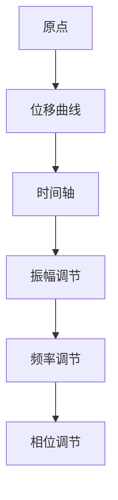

通过调整振幅、频率和相位，我们可以得到不同的振动效果。这个简单的例子展示了函数图像在动画制作中的应用。

#### 2.2 向量与矩阵

向量是具有大小和方向的量，在动画制作中用于描述物体的位置、速度和加速度。矩阵是一个由数字组成的二维数组，用于线性变换和运算。

**向量空间的基本概念**

向量空间是由向量组成的集合，其中每个向量都有其特定的方向和大小。在动画制作中，三维空间是最常用的向量空间。三维空间中的向量可以用(x, y, z)表示，其中x、y和z分别是向量在三个轴上的分量。

**矩阵的基本概念**

矩阵是一个由数字组成的二维数组，通常用大写字母表示，如A = [[a11, a12], [a21, a22]]。矩阵可以用于线性变换，如平移、旋转和缩放。

**向量与矩阵在动画中的应用**

向量与矩阵在动画制作中有着广泛的应用。例如，在三维动画中，我们可以使用向量来表示物体的位置和方向。通过矩阵运算，我们可以实现物体的平移、旋转和缩放。

- **平移**：通过将向量添加到物体的位置向量，可以实现物体的平移。

\[ \text{新位置} = \text{原位置} + \text{平移向量} \]

- **旋转**：通过矩阵乘法，可以实现物体的旋转。

\[ \text{新方向} = \text{旋转矩阵} \cdot \text{原方向} \]

- **缩放**：通过矩阵乘法，可以实现物体的缩放。

\[ \text{新大小} = \text{原大小} \cdot \text{缩放矩阵} \]

**案例：物体的旋转动画**

假设我们想要创建一个物体的旋转动画，我们可以使用旋转矩阵来描述旋转操作。假设物体在三维空间中的位置向量为v = (x, y, z)，旋转矩阵为R，则旋转后的位置向量可以表示为：

\[ \text{新位置} = R \cdot v \]

其中，R是旋转矩阵，可以通过以下公式计算：

\[ R = \begin{bmatrix} \cos(\theta) & -\sin(\theta) & 0 \\ \sin(\theta) & \cos(\theta) & 0 \\ 0 & 0 & 1 \end{bmatrix} \]

其中，θ是旋转角度。

通过不断更新位置向量，我们可以创建出物体旋转的动画效果。

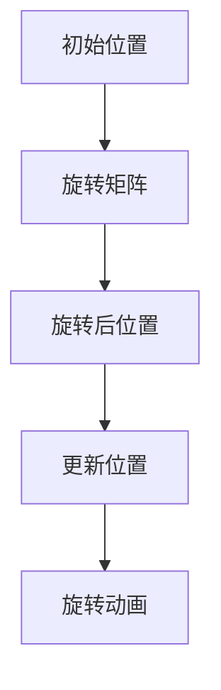

这个简单的案例展示了向量与矩阵在动画制作中的应用。

#### 2.3 三维坐标与变换

在三维动画中，三维坐标是描述物体位置和方向的基本工具。三维坐标系统通常包括原点、x轴、y轴和z轴。

**三维坐标系**

三维坐标系是由三个互相垂直的轴（x轴、y轴和z轴）组成的。原点是坐标系统的起点，x轴、y轴和z轴分别代表坐标系统的三个方向。在三维空间中，每个点的位置都可以用三个坐标值（x, y, z）来表示。

**基本变换操作**

在三维动画中，常用的基本变换操作包括平移、旋转和缩放。

- **平移**：平移是指将物体沿着某个方向移动一定的距离。在三维空间中，平移可以通过将物体的位置向量加上一个平移向量来实现。

\[ \text{新位置} = \text{原位置} + \text{平移向量} \]

- **旋转**：旋转是指围绕某个轴或点将物体旋转一定的角度。在三维空间中，旋转可以通过矩阵乘法来实现。常用的旋转矩阵包括旋转绕x轴、y轴和z轴的旋转矩阵。

\[ \text{新方向} = \text{旋转矩阵} \cdot \text{原方向} \]

- **缩放**：缩放是指将物体的大小按一定比例放大或缩小。在三维空间中，缩放可以通过将物体的尺寸向量乘以一个缩放因子来实现。

\[ \text{新大小} = \text{原大小} \cdot \text{缩放因子} \]

**三维变换在动画中的应用**

三维变换在动画制作中有着广泛的应用。通过三维坐标和变换操作，我们可以创建出各种复杂的动画效果。

- **运动轨迹**：通过设置不同的变换操作，可以创建出各种运动轨迹。例如，可以通过平移和旋转操作创建出物体在空间中的运动路径。

- **角色动画**：在三维动画中，角色动画通常包括角色的运动、表情和动作。通过三维坐标和变换操作，可以精确地控制角色的动作和表情。

- **场景渲染**：在三维动画中，场景渲染通常包括场景中的物体、灯光和材质。通过三维坐标和变换操作，可以精确地渲染出场景的视觉效果。

**案例：物体的平移和旋转动画**

假设我们想要创建一个物体的平移和旋转动画，我们可以使用三维坐标和变换操作来实现。

首先，我们设置物体的初始位置和方向。假设物体的位置向量为v = (x, y, z)，方向向量为d = (dx, dy, dz)。

然后，我们设置平移和旋转的参数。假设平移向量为t = (tx, ty, tz)，旋转角度为θ。

通过以下公式，我们可以计算物体的新位置和方向：

\[ \text{新位置} = \text{原位置} + \text{平移向量} \]
\[ \text{新方向} = \text{旋转矩阵} \cdot \text{原方向} \]

其中，旋转矩阵可以通过以下公式计算：

\[ R = \begin{bmatrix} \cos(\theta) & -\sin(\theta) & 0 \\ \sin(\theta) & \cos(\theta) & 0 \\ 0 & 0 & 1 \end{bmatrix} \]

通过不断更新位置和方向向量，我们可以创建出物体的平移和旋转动画。

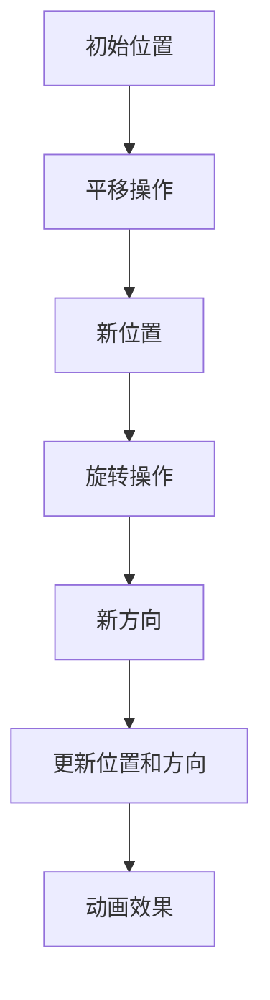

这个简单的案例展示了三维坐标和变换操作在动画制作中的应用。

### 第3章：数学在动画中的应用

#### 3.1 运动学公式与动画制作

运动学公式是描述物体运动的基本数学工具。在动画制作中，运动学公式可以用来计算物体的位置、速度和加速度，从而实现各种复杂的运动效果。

**运动学公式的基本概念**

运动学公式描述了物体在一段时间内的运动轨迹。最基础的公式包括以下几种：

- **位移公式**：\[ s = v_0t + \frac{1}{2}at^2 \]

其中，s是位移，\( v_0 \) 是初速度，a 是加速度，t 是时间。

- **速度公式**：\[ v = v_0 + at \]

其中，v 是速度，\( v_0 \) 是初速度，a 是加速度，t 是时间。

- **加速度公式**：\[ a = \frac{v - v_0}{t} \]

其中，a 是加速度，v 是最终速度，\( v_0 \) 是初速度，t 是时间。

**运动学公式在动画中的应用**

在动画制作中，运动学公式可以用来计算物体的运动轨迹，从而实现各种动画效果。

- **直线运动**：通过位移公式，可以计算物体在直线上的运动轨迹。例如，一个物体从初始位置s0以初速度\( v_0 \)沿直线运动，加速度为a，则其在时间t后的位置可以表示为：

\[ s = s_0 + v_0t + \frac{1}{2}at^2 \]

通过不断更新位置，可以创建出物体在直线上的运动动画。

- **抛物线运动**：通过位移公式，可以计算物体在抛物线轨迹上的运动。例如，一个物体以初速度\( v_0 \)从斜面上抛出，加速度为g，则其在时间t后的位置可以表示为：

\[ s = s_0 + v_0t - \frac{1}{2}gt^2 \]

通过不断更新位置，可以创建出物体在抛物线轨迹上的运动动画。

**案例：物体的直线运动动画**

假设我们想要创建一个物体的直线运动动画，我们可以使用运动学公式来实现。

首先，我们设置物体的初始位置s0、初速度\( v_0 \)和加速度a。假设初始位置为(0, 0)，初速度为(1, 0)，加速度为(0, -9.8)。

然后，我们设置动画的时间t，通常以帧为单位。假设每帧的时间间隔为Δt。

通过以下公式，我们可以计算物体在每帧的位置：

\[ s = s_0 + v_0\Delta t + \frac{1}{2}a\Delta t^2 \]

通过不断更新位置，我们可以创建出物体在直线上的运动动画。

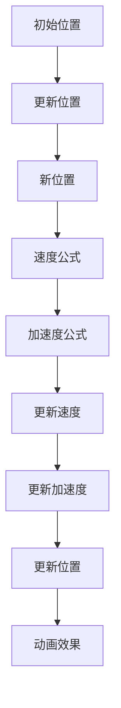

这个简单的案例展示了运动学公式在动画制作中的应用。

#### 3.2 三维空间中的几何变换

在三维动画中，几何变换是描述物体形态变化的基本工具。通过几何变换，我们可以实现物体的平移、旋转和缩放，从而创造出各种动画效果。

**几何变换的基本概念**

几何变换是指通过数学运算改变图形的形态和位置。在三维空间中，常用的几何变换包括平移、旋转和缩放。

- **平移**：平移是指将物体沿着某个方向移动一定的距离。在三维空间中，平移可以通过将物体的位置向量加上一个平移向量来实现。

\[ \text{新位置} = \text{原位置} + \text{平移向量} \]

- **旋转**：旋转是指围绕某个轴或点将物体旋转一定的角度。在三维空间中，旋转可以通过矩阵乘法来实现。常用的旋转矩阵包括旋转绕x轴、y轴和z轴的旋转矩阵。

\[ \text{新方向} = \text{旋转矩阵} \cdot \text{原方向} \]

- **缩放**：缩放是指将物体的大小按一定比例放大或缩小。在三维空间中，缩放可以通过将物体的尺寸向量乘以一个缩放因子来实现。

\[ \text{新大小} = \text{原大小} \cdot \text{缩放因子} \]

**三维空间中的几何变换**

在三维空间中，几何变换可以用来实现各种复杂的动画效果。

- **运动轨迹**：通过设置不同的几何变换操作，可以创建出各种运动轨迹。例如，可以通过平移和旋转操作创建出物体在空间中的运动路径。

- **角色动画**：在三维动画中，角色动画通常包括角色的运动、表情和动作。通过三维坐标和变换操作，可以精确地控制角色的动作和表情。

- **场景渲染**：在三维动画中，场景渲染通常包括场景中的物体、灯光和材质。通过三维坐标和变换操作，可以精确地渲染出场景的视觉效果。

**案例：物体的平移、旋转和缩放动画**

假设我们想要创建一个物体的平移、旋转和缩放动画，我们可以使用几何变换来实现。

首先，我们设置物体的初始位置和方向。假设物体的位置向量为v = (x, y, z)，方向向量为d = (dx, dy, dz)。

然后，我们设置平移、旋转和缩放的参数。假设平移向量为t = (tx, ty, tz)，旋转角度为θ，缩放因子为s。

通过以下公式，我们可以计算物体的新位置、方向和大小：

\[ \text{新位置} = \text{原位置} + \text{平移向量} \]
\[ \text{新方向} = \text{旋转矩阵} \cdot \text{原方向} \]
\[ \text{新大小} = \text{原大小} \cdot \text{缩放因子} \]

其中，旋转矩阵可以通过以下公式计算：

\[ R = \begin{bmatrix} \cos(\theta) & -\sin(\theta) & 0 \\ \sin(\theta) & \cos(\theta) & 0 \\ 0 & 0 & 1 \end{bmatrix} \]

通过不断更新位置、方向和大小，我们可以创建出物体的平移、旋转和缩放动画。

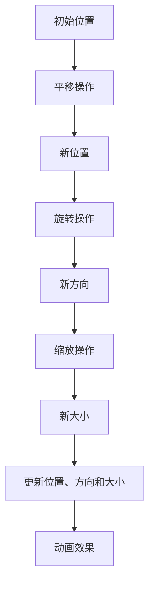

这个简单的案例展示了几何变换在动画制作中的应用。

#### 3.3 透视与摄像机

在三维动画中，透视和摄像机是描述场景视觉效果的两大重要概念。透视决定了物体的远近感和层次感，而摄像机则决定了观众观看场景的角度和视野。

**透视的基本概念**

透视是一种用来模拟真实世界中的视觉效果的技巧，通过透视原理，可以使远处的物体看起来更小，近处的物体看起来更大。在动画制作中，透视通常通过透视矩阵来实现。

- **一点透视**：一点透视是指所有物体的消失点都在一个点上。这种透视方式常用于城市景观和室内设计。

- **两点透视**：两点透视是指所有物体的消失点都在两个点上。这种透视方式常用于建筑设计和室外场景。

- **三点透视**：三点透视是指所有物体的消失点都在三个点上。这种透视方式常用于复杂场景和动态镜头。

**摄像机的基本原理**

摄像机是动画制作中的虚拟拍摄设备，通过摄像机的位置和角度，可以控制观众观看场景的视角和视野。摄像机的设置包括位置、方向和焦距等参数。

- **摄像机位置**：摄像机位置决定了观众在场景中的视角。通过调整摄像机的位置，可以改变观众的视角和视野。

- **摄像机方向**：摄像机方向决定了观众观看场景的角度。通过调整摄像机的方向，可以改变场景的视觉感受。

- **焦距**：焦距决定了场景的清晰度和远近感。通过调整摄像机的焦距，可以改变场景的透视效果。

**透视与摄像机在动画中的应用**

透视与摄像机在动画制作中有着广泛的应用。

- **场景布局**：通过透视和摄像机设置，可以创造出各种场景布局，如远景、中景和近景等。

- **角色动画**：通过透视和摄像机设置，可以精确地控制角色的动作和表情，使角色在场景中的表现更加生动。

- **动态镜头**：通过透视和摄像机设置，可以创造出各种动态镜头效果，如跟随镜头、推拉镜头和旋转镜头等。

**案例：透视与摄像机动画**

假设我们想要创建一个透视与摄像机的动画，我们可以通过以下步骤来实现。

首先，我们设置透视参数。假设使用一点透视，消失点在场景中心。

然后，我们设置摄像机位置和方向。假设摄像机位于场景前方，朝向场景中心。

通过以下公式，我们可以计算场景中的物体位置和大小：

\[ \text{新位置} = \text{原位置} \cdot \text{透视矩阵} \]
\[ \text{新大小} = \text{原大小} \cdot \text{透视矩阵} \]

其中，透视矩阵可以通过以下公式计算：

\[ P = \begin{bmatrix} \frac{1}{z} & 0 & 0 \\ 0 & \frac{1}{z} & 0 \\ 0 & 0 & \frac{1}{z} \end{bmatrix} \]

其中，z 是摄像机的位置。

通过不断更新物体位置和大小，我们可以创建出透视与摄像机动画。

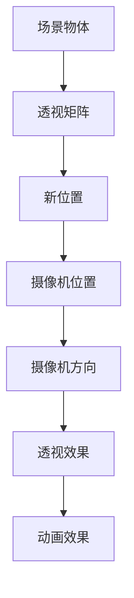

这个简单的案例展示了透视与摄像机在动画制作中的应用。

### 第4章：关键帧动画

#### 4.1 关键帧动画的概念与原理

关键帧动画（Keyframe Animation）是动画制作中最基本的技术之一。它通过在动画序列中插入关键帧，然后在关键帧之间进行插值，从而创造出平滑的动画效果。

**关键帧动画的概念**

在关键帧动画中，关键帧是指动画序列中的重要帧，用于定义动画的关键状态。例如，在角色动画中，关键帧可以是一个角色的站立姿态、跳跃姿态和落地姿态。关键帧之间的帧则通过插值算法来生成。

**关键帧动画的原理**

关键帧动画的原理是基于时间插值。在两个关键帧之间，通过插值算法来生成一系列中间帧，从而创造出平滑的运动效果。常见的插值算法包括线性插值、二次插值和三次插值等。

- **线性插值**：线性插值是最简单的插值方法，通过直线连接两个关键帧，从而生成中间帧。线性插值的优点是实现简单，缺点是生成的动画效果不够平滑。

- **二次插值**：二次插值通过二次曲线连接两个关键帧，从而生成中间帧。二次插值的优点是生成的动画效果更加平滑，缺点是实现复杂。

- **三次插值**：三次插值通过三次曲线连接两个关键帧，从而生成中间帧。三次插值的优点是最平滑的动画效果，缺点是实现复杂。

**案例：角色跳跃动画**

假设我们想要创建一个角色跳跃的动画，我们可以使用关键帧动画来实现。

首先，我们定义关键帧。例如，关键帧1是角色的站立姿态，关键帧2是角色跳跃的最高点，关键帧3是角色落地的姿态。

然后，我们设置插值算法。例如，使用线性插值来生成关键帧之间的中间帧。

通过以下公式，我们可以计算中间帧的位置：

\[ \text{新位置} = \text{关键帧1的位置} + t \cdot (\text{关键帧2的位置} - \text{关键帧1的位置}) \]

其中，t 是插值参数，取值范围为0到1。

通过不断更新位置，我们可以创建出角色跳跃的动画。

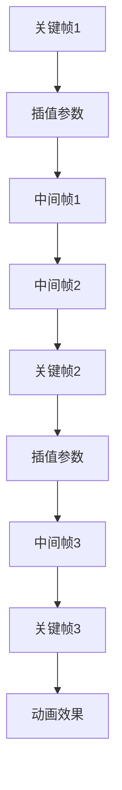

这个简单的案例展示了关键帧动画的原理和实现过程。

#### 4.2 关键帧动画的制作流程

关键帧动画的制作流程主要包括以下步骤：

1. **故事板设计**：故事板是动画的初步设计，用于确定动画的情节、角色和场景。通过故事板，可以明确动画的框架和关键帧。

2. **角色设计**：角色设计包括角色的外形、动作和表情。通过角色设计，可以为动画制作提供角色模型。

3. **场景设计**：场景设计包括场景的布局、灯光和背景。通过场景设计，可以营造出动画的氛围和视觉感受。

4. **关键帧设置**：在动画序列中设置关键帧，用于定义动画的关键状态。通过关键帧，可以确定动画的节奏和变化。

5. **插值计算**：通过插值算法，计算关键帧之间的中间帧。插值算法的选择决定了动画的平滑度和精度。

6. **渲染和优化**：将关键帧和中间帧渲染成图像序列，并进行优化。优化可以包括压缩图像、去除冗余帧等。

**案例：动画制作工具与环境搭建**

假设我们想要使用动画制作工具来创建关键帧动画，我们可以使用以下工具和环境搭建：

1. **故事板设计工具**：可以使用Adobe Premiere Pro、Toon Boom Harmony等故事板设计工具。

2. **角色设计工具**：可以使用Adobe Photoshop、Blender等角色设计工具。

3. **场景设计工具**：可以使用Adobe After Effects、Unreal Engine等场景设计工具。

4. **动画制作软件**：可以使用Toon Boom Harmony、Blender等动画制作软件。

通过这些工具和环境搭建，我们可以创建出高质量的关键帧动画。

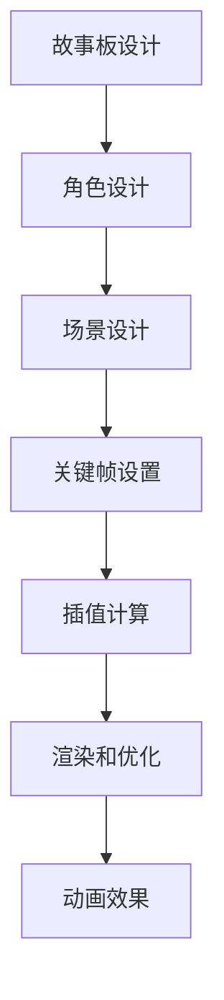

这个简单的案例展示了关键帧动画的制作流程和工具应用。

#### 4.3 关键帧动画的数学描述

关键帧动画的数学描述主要涉及插值算法。插值算法通过数学公式来计算关键帧之间的中间帧，从而实现平滑的动画效果。

- **线性插值**：线性插值是最简单的插值方法，通过直线连接两个关键帧。线性插值的数学描述如下：

\[ \text{新位置} = \text{关键帧1的位置} + t \cdot (\text{关键帧2的位置} - \text{关键帧1的位置}) \]

其中，t 是插值参数，取值范围为0到1。

- **二次插值**：二次插值通过二次曲线连接两个关键帧。二次插值的数学描述如下：

\[ \text{新位置} = \text{关键帧1的位置} + t \cdot (\text{关键帧2的位置} - \text{关键帧1的位置}) + \frac{t^2}{2} \cdot (\text{关键帧2的位置} - 2\text{关键帧1的位置} + \text{关键帧0的位置}) \]

其中，t 是插值参数，取值范围为0到1。

- **三次插值**：三次插值通过三次曲线连接两个关键帧。三次插值的数学描述如下：

\[ \text{新位置} = \text{关键帧1的位置} + t \cdot (\text{关键帧2的位置} - \text{关键帧1的位置}) + \frac{t^2}{2} \cdot (\text{关键帧2的位置} - \text{关键帧1的位置}) + \frac{t^3}{6} \cdot (\text{关键帧0的位置} - 3\text{关键帧1的位置} + 3\text{关键帧2的位置} - \text{关键帧3的位置}) \]

其中，t 是插值参数，取值范围为0到1。

**案例：线性插值动画**

假设我们想要创建一个线性插值动画，我们可以使用以下数学描述：

\[ \text{新位置} = x_0 + t \cdot (x_1 - x_0) \]

其中，\( x_0 \) 和 \( x_1 \) 分别是关键帧1和关键帧2的x坐标，t 是插值参数。

通过不断更新位置，我们可以创建出线性插值动画。

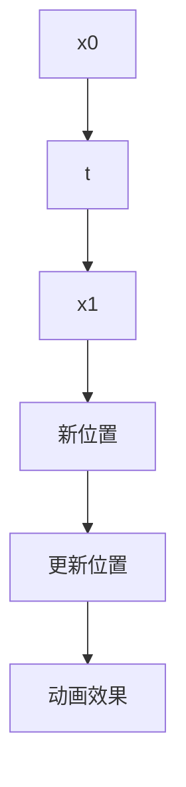

这个简单的案例展示了关键帧动画的数学描述和实现过程。

### 第5章：运动轨迹设计

#### 5.1 运动轨迹的基本概念

运动轨迹是指物体在空间中的运动路径。在动画制作中，运动轨迹设计是创造各种动画效果的关键步骤之一。

**运动轨迹的概念**

运动轨迹是指物体在一段时间内所经过的路径。在三维空间中，运动轨迹通常可以用参数方程来表示。例如，一个物体的运动轨迹可以表示为：

\[ \text{轨迹}(t) = (x(t), y(t), z(t)) \]

其中，t 是时间参数，\( x(t) \)，\( y(t) \) 和 \( z(t) \) 分别是物体在x轴、y轴和z轴上的位置。

**运动轨迹的类型**

运动轨迹可以分为直线轨迹、曲线轨迹和空间轨迹等。

- **直线轨迹**：直线轨迹是指物体沿直线运动。直线轨迹通常可以用线性方程来表示，例如：

\[ x(t) = v_0t + x_0 \]
\[ y(t) = v_0t + y_0 \]
\[ z(t) = v_0t + z_0 \]

其中，\( v_0 \) 是初速度，\( x_0 \)，\( y_0 \) 和 \( z_0 \) 分别是初始位置。

- **曲线轨迹**：曲线轨迹是指物体沿曲线运动。曲线轨迹通常可以用二次方程、三次方程或其他高次方程来表示。例如，一个抛物线轨迹可以表示为：

\[ y = ax^2 + bx + c \]

- **空间轨迹**：空间轨迹是指物体在三维空间中运动。空间轨迹通常可以用参数方程来表示，例如：

\[ \text{轨迹}(t) = (x(t), y(t), z(t)) \]

其中，\( x(t) \)，\( y(t) \) 和 \( z(t) \) 分别是物体在x轴、y轴和z轴上的位置。

**运动轨迹的数学描述**

运动轨迹的数学描述通常使用参数方程来表示。参数方程可以描述物体在空间中的位置、速度和加速度。

- **位置方程**：位置方程描述了物体在时间t时的位置。例如，一个物体的位置方程可以表示为：

\[ \text{位置}(t) = (x(t), y(t), z(t)) \]

- **速度方程**：速度方程描述了物体在时间t时的速度。例如，一个物体的速度方程可以表示为：

\[ \text{速度}(t) = (v_x(t), v_y(t), v_z(t)) \]

- **加速度方程**：加速度方程描述了物体在时间t时的加速度。例如，一个物体的加速度方程可以表示为：

\[ \text{加速度}(t) = (a_x(t), a_y(t), a_z(t)) \]

**案例：直线运动轨迹**

假设我们想要创建一个直线运动轨迹，我们可以使用以下数学描述：

\[ x(t) = v_0t + x_0 \]
\[ y(t) = v_0t + y_0 \]
\[ z(t) = v_0t + z_0 \]

其中，\( v_0 \) 是初速度，\( x_0 \)，\( y_0 \) 和 \( z_0 \) 分别是初始位置。

通过不断更新位置，我们可以创建出直线运动轨迹。

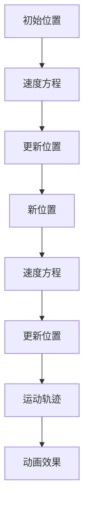

这个简单的案例展示了直线运动轨迹的数学描述和实现过程。

#### 5.2 运动轨迹的数学描述

运动轨迹的数学描述主要涉及参数方程。参数方程可以精确地描述物体在空间中的运动路径，从而实现各种复杂的动画效果。

- **参数方程的基本概念**

参数方程是指用一组参数来描述物体在空间中的位置、速度和加速度。常用的参数方程包括线性方程、二次方程和三次方程等。

- **线性方程**

线性方程是最简单的参数方程，用于描述直线运动。线性方程的一般形式为：

\[ x(t) = v_0t + x_0 \]
\[ y(t) = v_0t + y_0 \]
\[ z(t) = v_0t + z_0 \]

其中，\( v_0 \) 是初速度，\( x_0 \)，\( y_0 \) 和 \( z_0 \) 分别是初始位置。

- **二次方程**

二次方程用于描述曲线运动。二次方程的一般形式为：

\[ x(t) = v_0t^2 + x_0t + c_0 \]
\[ y(t) = v_0t^2 + y_0t + c_0 \]
\[ z(t) = v_0t^2 + z_0t + c_0 \]

其中，\( v_0 \) 是初速度，\( x_0 \)，\( y_0 \) 和 \( z_0 \) 分别是初始位置，\( c_0 \) 是常数项。

- **三次方程**

三次方程用于描述更复杂的曲线运动。三次方程的一般形式为：

\[ x(t) = v_0t^3 + x_0t^2 + c_0t + d_0 \]
\[ y(t) = v_0t^3 + y_0t^2 + c_0t + d_0 \]
\[ z(t) = v_0t^3 + z_0t^2 + c_0t + d_0 \]

其中，\( v_0 \) 是初速度，\( x_0 \)，\( y_0 \) 和 \( z_0 \) 分别是初始位置，\( c_0 \) 和 \( d_0 \) 是常数项。

**案例：二次曲线运动轨迹**

假设我们想要创建一个二次曲线运动轨迹，我们可以使用以下数学描述：

\[ x(t) = v_0t^2 + x_0t + c_0 \]
\[ y(t) = v_0t^2 + y_0t + c_0 \]
\[ z(t) = v_0t^2 + z_0t + c_0 \]

其中，\( v_0 \) 是初速度，\( x_0 \)，\( y_0 \) 和 \( z_0 \) 分别是初始位置，\( c_0 \) 是常数项。

通过不断更新位置，我们可以创建出二次曲线运动轨迹。

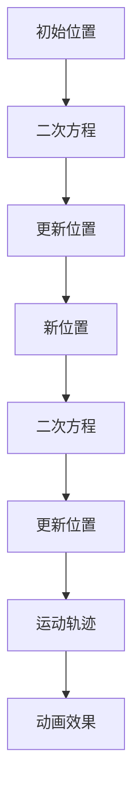

这个简单的案例展示了二次曲线运动轨迹的数学描述和实现过程。

#### 5.3 运动轨迹的设计方法

运动轨迹的设计是动画制作中的重要环节，它决定了动画的流畅性和视觉效果。设计运动轨迹的方法多种多样，以下介绍几种常用的设计方法。

- **基础设计方法**

基础设计方法是最简单的设计方法，通过设定初始位置、速度和加速度，然后根据物体的运动规律进行设计。

例如，一个简单的直线运动轨迹可以通过以下公式设计：

\[ x(t) = v_0t + x_0 \]
\[ y(t) = v_0t + y_0 \]
\[ z(t) = v_0t + z_0 \]

其中，\( v_0 \) 是初速度，\( x_0 \)，\( y_0 \) 和 \( z_0 \) 分别是初始位置。

通过调整初速度和加速度，可以创造出各种运动轨迹。

- **曲线设计方法**

曲线设计方法是通过曲线来设计运动轨迹。常用的曲线包括二次曲线、三次曲线和四次曲线等。

例如，一个二次曲线运动轨迹可以通过以下公式设计：

\[ x(t) = v_0t^2 + x_0t + c_0 \]
\[ y(t) = v_0t^2 + y_0t + c_0 \]
\[ z(t) = v_0t^2 + z_0t + c_0 \]

其中，\( v_0 \) 是初速度，\( x_0 \)，\( y_0 \) 和 \( z_0 \) 分别是初始位置，\( c_0 \) 是常数项。

通过调整曲线参数，可以创造出各种复杂的运动轨迹。

- **动态设计方法**

动态设计方法是通过实时计算来设计运动轨迹。这种方法通常使用物理引擎或数学模型来模拟物体的运动。

例如，一个基于物理的动态设计方法可以通过以下公式设计：

\[ \text{加速度}(t) = g \]
\[ \text{速度}(t) = \text{初速度} + g \cdot t \]
\[ \text{位置}(t) = \text{初始位置} + \text{初速度} \cdot t + \frac{1}{2}g \cdot t^2 \]

其中，g 是重力加速度，\( \text{初速度} \) 和 \( \text{初始位置} \) 是初始参数。

通过实时计算，可以创造出更加逼真的运动轨迹。

**案例：使用参数方程设计运动轨迹**

假设我们想要设计一个简单的二次曲线运动轨迹，我们可以使用以下参数方程：

\[ x(t) = v_0t^2 + x_0t + c_0 \]
\[ y(t) = v_0t^2 + y_0t + c_0 \]
\[ z(t) = v_0t^2 + z_0t + c_0 \]

其中，\( v_0 \) 是初速度，\( x_0 \)，\( y_0 \) 和 \( z_0 \) 分别是初始位置，\( c_0 \) 是常数项。

通过调整参数，我们可以创造出各种二次曲线运动轨迹。

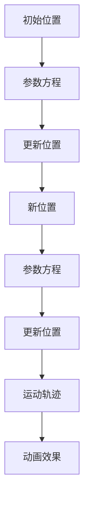

这个简单的案例展示了运动轨迹的设计方法和实现过程。

### 第6章：粒子系统与流体模拟

#### 6.1 粒子系统的原理与应用

粒子系统是一种在计算机图形学中广泛使用的模拟技术，用于模拟大量粒子的运动、碰撞和聚集。粒子系统通常用于模拟云、烟雾、雨滴、爆炸等效果。

**粒子系统的基本概念**

粒子系统由大量粒子组成，每个粒子都有其位置、速度、大小和寿命等属性。粒子系统的工作原理是实时生成、更新和销毁粒子，从而模拟出复杂的物理现象。

- **粒子生成**：粒子生成是指根据特定的规则和参数生成新的粒子。生成规则可以是随机生成、按时间生成或按空间生成等。

- **粒子更新**：粒子更新是指在每个时间步长中，根据粒子的属性和周围环境进行计算，更新粒子的位置、速度和寿命等。

- **粒子销毁**：粒子销毁是指当粒子的寿命达到一定值或满足特定条件时，销毁粒子。

**粒子系统的应用**

粒子系统在动画制作中有着广泛的应用。以下是一些典型的应用场景：

- **云和烟雾**：通过粒子系统，可以模拟出真实的云和烟雾效果。粒子的大小、形状和颜色可以实时调整，以模拟不同的天气和场景。

- **雨滴和雪**：通过粒子系统，可以模拟出雨滴和雪的效果。粒子可以模拟出雨滴的下落、撞击和破碎过程。

- **爆炸和火焰**：通过粒子系统，可以模拟出爆炸和火焰的效果。粒子可以模拟出爆炸的冲击波、火焰的燃烧和扩散过程。

**案例：粒子系统的简单实现**

以下是一个简单的粒子系统实现示例：

```python
import pygame
import random

# 初始化粒子系统
particles = []

# 生成100个初始粒子
for _ in range(100):
    x = random.uniform(-400, 400)
    y = random.uniform(-400, 400)
    vx = random.uniform(-2, 2)
    vy = random.uniform(-2, 2)
    particles.append({'x': x, 'y': y, 'vx': vx, 'vy': vy, 'life': 100})

# 游戏循环
while True:
    # 更新粒子位置
    for particle in particles:
        particle['x'] += particle['vx']
        particle['y'] += particle['vy']
        particle['life'] -= 1

        # 判断粒子是否超出屏幕范围
        if particle['x'] < -10 or particle['x'] > 410 or particle['y'] < -10 or particle['y'] > 410:
            particle['x'] = random.uniform(-400, 400)
            particle['y'] = random.uniform(-400, 400)
            particle['vx'] = random.uniform(-2, 2)
            particle['vy'] = random.uniform(-2, 2)
            particle['life'] = 100

    # 绘制粒子
    screen = pygame.display.set_mode((400, 400))
    screen.fill((255, 255, 255))

    for particle in particles:
        pygame.draw.circle(screen, (0, 0, 0), (int(particle['x']), int(particle['y'])), 1)

    pygame.display.update()
```

这个简单的案例展示了粒子系统的基本实现过程。

#### 6.2 粒子系统的数学模型

粒子系统的数学模型主要用于描述粒子的运动、碰撞和聚集行为。以下是一些常用的数学模型：

**运动模型**

粒子系统的运动模型通常使用以下公式描述：

\[ \text{位置}(t) = \text{位置}(t_0) + \text{速度}(t_0) \cdot (t - t_0) \]

其中，\( \text{位置}(t) \) 和 \( \text{速度}(t) \) 分别是粒子在时间t的位置和速度，\( t_0 \) 是初始时间。

**碰撞模型**

粒子系统的碰撞模型主要用于描述粒子之间的相互作用。以下是一个简单的碰撞模型：

\[ \text{新速度}_1 = \text{速度}_1 - 2 \cdot \text{质量}_1 \cdot \text{速度}_1 \cdot \cos(\theta) \]
\[ \text{新速度}_2 = \text{速度}_2 + 2 \cdot \text{质量}_2 \cdot \text{速度}_2 \cdot \cos(\theta) \]

其中，\( \text{速度}_1 \) 和 \( \text{速度}_2 \) 分别是粒子1和粒子2的速度，\( \text{质量}_1 \) 和 \( \text{质量}_2 \) 分别是粒子1和粒子2的质量，\( \theta \) 是碰撞角度。

**聚集模型**

粒子系统的聚集模型主要用于描述粒子之间的聚集行为。以下是一个简单的聚集模型：

\[ \text{新速度}_i = \text{速度}_i + \text{聚集力}_i \cdot (1 - \text{距离}_i/\text{最大距离}) \]

其中，\( \text{速度}_i \) 是粒子i的速度，\( \text{聚集力}_i \) 是粒子i的聚集力，\( \text{距离}_i \) 是粒子i与其他粒子的距离，\( \text{最大距离} \) 是粒子i与其他粒子之间允许的最大距离。

**案例：粒子系统的运动模型**

以下是一个简单的粒子系统运动模型示例：

```python
import pygame
import random

# 初始化粒子系统
particles = []

# 生成100个初始粒子
for _ in range(100):
    x = random.uniform(-400, 400)
    y = random.uniform(-400, 400)
    vx = random.uniform(-2, 2)
    vy = random.uniform(-2, 2)
    particles.append({'x': x, 'y': y, 'vx': vx, 'vy': vy, 'life': 100})

# 游戏循环
while True:
    # 更新粒子位置
    for particle in particles:
        particle['x'] += particle['vx']
        particle['y'] += particle['vy']
        particle['life'] -= 1

        # 判断粒子是否超出屏幕范围
        if particle['x'] < -10 or particle['x'] > 410 or particle['y'] < -10 or particle['y'] > 410:
            particle['x'] = random.uniform(-400, 400)
            particle['y'] = random.uniform(-400, 400)
            particle['vx'] = random.uniform(-2, 2)
            particle['vy'] = random.uniform(-2, 2)
            particle['life'] = 100

    # 绘制粒子
    screen = pygame.display.set_mode((400, 400))
    screen.fill((255, 255, 255))

    for particle in particles:
        pygame.draw.circle(screen, (0, 0, 0), (int(particle['x']), int(particle['y'])), 1)

    pygame.display.update()
```

这个简单的案例展示了粒子系统的运动模型和实现过程。

#### 6.3 流体模拟的数学描述

流体模拟是计算机图形学中的一个重要分支，用于模拟液体和气体的运动、碰撞和扩散。流体模拟在动画制作中有着广泛的应用，例如模拟雨滴、波浪、火焰和烟雾等。

**流体模拟的基本概念**

流体模拟主要涉及以下基本概念：

- **流体**：流体是能够流动的介质，包括液体和气体。流体具有质量、体积和压力等属性。

- **流体单元**：流体单元是流体中的最小单位，通常由大量粒子组成。每个流体单元都有其特定的位置、速度和密度等属性。

- **流体方程**：流体方程是描述流体运动的数学方程，包括连续方程、动量方程和能量方程等。

**连续方程**

连续方程描述了流体在时间上的守恒性。对于不可压缩流体，连续方程可以表示为：

\[ \frac{\partial \rho}{\partial t} + \nabla \cdot (\rho \mathbf{v}) = 0 \]

其中，\( \rho \) 是流体密度，\( \mathbf{v} \) 是流体速度，\( \nabla \cdot \) 是散度运算符。

**动量方程**

动量方程描述了流体的动量守恒。对于牛顿流体，动量方程可以表示为：

\[ \rho \left( \frac{\partial \mathbf{v}}{\partial t} + (\mathbf{v} \cdot \nabla) \mathbf{v} \right) = -\nabla p + \mu \nabla^2 \mathbf{v} \]

其中，\( p \) 是流体压力，\( \mu \) 是流体动力粘度。

**能量方程**

能量方程描述了流体的能量守恒。对于不可压缩流体，能量方程可以表示为：

\[ \rho c_p \frac{\partial T}{\partial t} + \nabla \cdot (\rho c_p \mathbf{v} T) = \nabla \cdot (\kappa \nabla T) \]

其中，\( T \) 是流体温度，\( c_p \) 是流体比热容，\( \kappa \) 是流体热导率。

**案例：流体模拟的简单实现**

以下是一个简单的流体模拟实现示例：

```python
import numpy as np
import matplotlib.pyplot as plt

# 初始化参数
N = 100
dx = 0.1
dt = 0.01
rho = 1000
v_x = 0
v_y = 0
mu = 0.01
kappa = 0.01
c_p = 1000

# 初始化流体网格
X, Y = np.mgrid[0:1:dx, 0:1:dx]
U = np.zeros_like(X)
V = np.zeros_like(Y)

# 求解连续方程
rho = np.sum(U * dx * dy)
U += -dt * np.gradient(rho) / dx
V += -dt * np.gradient(rho) / dy

# 求解动量方程
U += -dt * (mu * np.gradient(np.gradient(U)) / dx + mu * np.gradient(np.gradient(V)) / dy)
V += -dt * (mu * np.gradient(np.gradient(U)) / dy + mu * np.gradient(np.gradient(V)) / dx)

# 求解能量方程
T = 300
T += -dt * (kappa * np.gradient(np.gradient(T)) / dx + kappa * np.gradient(np.gradient(T)) / dy)

# 绘制流体
plt.contourf(X, Y, T)
plt.quiver(X, Y, U, V)
plt.show()
```

这个简单的案例展示了流体模拟的基本数学描述和实现过程。

### 第7章：动态捕捉与仿真

#### 7.1 动态捕捉技术概述

动态捕捉（Motion Capture，简称MoCap）是一种用于记录和重现真实世界中物体或角色运动的技术。它通过捕捉设备的传感器记录演员或物体的动作，然后将这些数据转化为计算机图形中的运动轨迹，从而实现动画中的真实感。

**动态捕捉的基本概念**

动态捕捉技术主要涉及以下基本概念：

- **捕捉设备**：捕捉设备是用于记录运动数据的硬件设备，包括摄像头、传感器和跟踪器等。捕捉设备可以实时捕捉演员的动作，并将数据传输给计算机。

- **运动数据**：运动数据是记录演员动作的数字信息，包括位置、速度、加速度和角度等。运动数据可以通过数字信号处理技术进行精确计算和还原。

- **数据处理**：数据处理是将捕捉到的运动数据转化为计算机图形中的运动轨迹的过程。数据处理通常包括数据滤波、插值、配准和变换等步骤。

**动态捕捉的应用**

动态捕捉技术在动画制作、电影特效、游戏开发等领域有着广泛的应用。以下是一些典型的应用场景：

- **动画制作**：动态捕捉技术可以用于动画电影、电视节目和广告中，为角色和物体提供真实的运动轨迹，增强动画的逼真度。

- **电影特效**：动态捕捉技术可以用于电影特效的制作，例如捕捉演员的表情和动作，然后将这些数据应用到虚拟角色和物体上。

- **游戏开发**：动态捕捉技术可以用于游戏开发，为角色和物体提供真实的运动轨迹，增强游戏的真实感和互动性。

**案例：动态捕捉技术的简单实现**

以下是一个简单的动态捕捉实现示例：

```python
import cv2
import numpy as np

# 初始化摄像头
cap = cv2.VideoCapture(0)

# 循环捕捉视频帧
while True:
    # 读取视频帧
    ret, frame = cap.read()

    # 转换为灰度图像
    gray = cv2.cvtColor(frame, cv2.COLOR_BGR2GRAY)

    # 检测人脸
    faces = detector.detectMultiScale(gray)

    # 遍历所有检测到的人脸
    for (x, y, w, h) in faces:
        # 绘制人脸矩形框
        cv2.rectangle(frame, (x, y), (x + w, y + h), (0, 255, 0), 2)

        # 提取人脸区域
        face = gray[y:y + h, x:x + w]

        # 计算人脸特征点
        landmarks = predictor.predict(face)
        landmarks = landmarks.reshape(-1, 2)

        # 绘制特征点
        for landmark in landmarks:
            cv2.circle(frame, (int(landmark[0]), int(landmark[1])), 1, (0, 0, 255), -1)

    # 显示视频帧
    cv2.imshow('Frame', frame)

    # 按下ESC键退出
    if cv2.waitKey(1) & 0xFF == 27:
        break

# 释放摄像头资源
cap.release()
cv2.destroyAllWindows()
```

这个简单的案例展示了动态捕捉技术的实现过程。

#### 7.2 动态捕捉的数学模型

动态捕捉的数学模型主要用于描述运动数据的计算和处理。以下是一些常用的数学模型：

**运动学模型**

运动学模型用于描述物体在空间中的位置、速度和加速度。常用的运动学模型包括线性运动模型和旋转运动模型。

- **线性运动模型**：

\[ \text{位置}(t) = \text{位置}(t_0) + \text{速度}(t_0) \cdot (t - t_0) \]

\[ \text{速度}(t) = \text{速度}(t_0) + \text{加速度}(t_0) \cdot (t - t_0) \]

\[ \text{加速度}(t) = \text{加速度}(t_0) \]

- **旋转运动模型**：

\[ \text{旋转角}(t) = \text{旋转角}(t_0) + \text{角速度}(t_0) \cdot (t - t_0) \]

\[ \text{角速度}(t) = \text{角速度}(t_0) + \text{角加速度}(t_0) \cdot (t - t_0) \]

\[ \text{角加速度}(t) = \text{角加速度}(t_0) \]

**数据处理模型**

数据处理模型用于描述运动数据的处理过程。常用的数据处理模型包括滤波、插值和配准等。

- **滤波模型**：

滤波模型用于去除运动数据中的噪声。常用的滤波模型包括均值滤波、中值滤波和高斯滤波等。

\[ \text{滤波后数据}(t) = \frac{1}{N} \sum_{i=1}^{N} \text{数据}(t_i) \]

\[ \text{滤波后数据}(t) = \text{中值}(\text{数据}(t_1), \text{数据}(t_2), ..., \text{数据}(t_N)) \]

\[ \text{滤波后数据}(t) = \text{高斯}(\text{数据}(t), \text{标准差}) \]

- **插值模型**：

插值模型用于插值运动数据点之间的值。常用的插值模型包括线性插值、二次插值和三次插值等。

\[ \text{插值后数据}(t) = \text{数据}(t_0) + t \cdot (\text{数据}(t_1) - \text{数据}(t_0)) \]

\[ \text{插值后数据}(t) = \text{数据}(t_0) + t \cdot (\text{数据}(t_1) - 2\text{数据}(t_0) + \text{数据}(t_2)) \]

\[ \text{插值后数据}(t) = \text{数据}(t_0) + t \cdot (\text{数据}(t_1) - 2\text{数据}(t_0) + 2\text{数据}(t_2) - \text{数据}(t_3)) \]

- **配准模型**：

配准模型用于将多个运动数据集对齐。常用的配准模型包括刚性配准、非刚性配准和模板匹配等。

\[ \text{配准后数据}(t) = \text{数据}(t) + \text{平移向量} \]

\[ \text{配准后数据}(t) = \text{数据}(t) \cdot \text{旋转矩阵} \]

\[ \text{配准后数据}(t) = \text{数据}(t) \cdot \text{缩放因子} \]

**案例：运动数据的滤波与插值**

以下是一个简单的运动数据滤波与插值实现示例：

```python
import numpy as np

# 初始化运动数据
data = np.array([0, 1, 2, 3, 4, 5, 6, 7, 8, 9])

# 滤波处理
filtered_data = np.convolve(data, np.ones(3)/3, mode='same')

# 插值处理
interp_data = np.interp(np.linspace(0, len(data)-1, len(filtered_data)), np.linspace(0, len(data)-1, len(data)), filtered_data)

# 输出结果
print("原始数据：", data)
print("滤波后数据：", filtered_data)
print("插值后数据：", interp_data)
```

这个简单的案例展示了动态捕捉的数学模型和实现过程。

#### 7.3 动态仿真与物理模拟

动态仿真与物理模拟是动画制作中实现真实感动画的重要手段。通过模拟物体在现实世界中的运动和相互作用，可以创造出逼真的动画效果。

**动态仿真的基本概念**

动态仿真是指通过数学模型和算法模拟物体在现实世界中的运动和相互作用。动态仿真主要涉及以下基本概念：

- **物理模型**：物理模型是描述物体运动和相互作用的数学模型。常见的物理模型包括牛顿力学、万有引力定律和流体动力学等。

- **仿真算法**：仿真算法是用于计算物体运动和相互作用的算法。常见的仿真算法包括欧拉法、龙格-库塔法和物理引擎等。

- **仿真结果**：仿真结果是动态仿真的输出结果，包括物体的位置、速度、加速度和力等。

**物理模拟的应用**

物理模拟在动画制作中有着广泛的应用。以下是一些典型的应用场景：

- **碰撞检测**：碰撞检测是物理模拟中的一种基本操作，用于检测物体之间的碰撞。通过碰撞检测，可以模拟出物体之间的碰撞效果。

- **物理效果**：物理效果是指通过物理模拟实现的动画效果，例如水波、烟雾、火焰和爆炸等。物理效果可以增强动画的逼真度。

- **角色动画**：角色动画是通过物理模拟实现的动画，例如跑步、跳跃和旋转等。物理模拟可以精确地控制角色的动作和表情。

**案例：简单物理仿真的实现**

以下是一个简单的物理仿真实现示例：

```python
import numpy as np

# 初始化参数
mass = 1.0
gravity = 9.8
time_step = 0.01
max_time = 10

# 初始化物体状态
position = np.array([0.0, 0.0])
velocity = np.array([0.0, 0.0])

# 仿真循环
for t in np.arange(0, max_time, time_step):
    # 计算加速度
    acceleration = np.array([0.0, -gravity])

    # 更新速度
    velocity += acceleration * time_step

    # 更新位置
    position += velocity * time_step

    # 输出结果
    print("时间：", t, "位置：", position, "速度：", velocity)

# 绘制物体轨迹
plt.plot(np.cumsum(velocity[0] * time_step), np.cumsum(velocity[1] * time_step))
plt.xlabel("时间")
plt.ylabel("位置")
plt.show()
```

这个简单的案例展示了物理仿真的实现过程。

### 第8章：动画渲染与优化

#### 8.1 动画渲染的基本原理

动画渲染是动画制作中的重要环节，它负责将动画中的场景、角色和物体以视觉化的形式呈现给观众。动画渲染的基本原理涉及图像渲染管线、着色器和光线追踪等。

**图像渲染管线**

图像渲染管线是动画渲染的核心组成部分，它负责将三维模型转换为二维图像。图像渲染管线通常包括以下步骤：

- **几何处理**：几何处理是指对三维模型进行变换、裁剪和投影等操作，从而将三维模型映射到二维屏幕上。

- **光栅化**：光栅化是指将三维模型的顶点数据转换为像素数据。光栅化过程中，模型被划分为多个三角形，每个三角形被进一步划分为像素。

- **着色器**：着色器是指用于计算每个像素的颜色和亮度的程序。着色器包括顶点着色器和片段着色器，分别处理顶点和像素的颜色。

- **渲染目标**：渲染目标是指用于存储渲染结果的缓冲区。常见的渲染目标包括帧缓冲区和纹理。

**着色器**

着色器是动画渲染中的重要工具，它用于计算每个像素的颜色和亮度。着色器通常使用编程语言，如OpenGL Shading Language (GLSL) 或 High-Level Shading Language (HLSL) 进行编写。

着色器分为顶点着色器和片段着色器：

- **顶点着色器**：顶点着色器负责处理顶点数据，包括位置、颜色和纹理坐标等。顶点着色器的主要任务是计算顶点的法向量、光线方向和投影矩阵等。

- **片段着色器**：片段着色器负责处理像素数据，包括颜色、亮度和纹理等。片段着色器的主要任务是计算每个像素的颜色值，并对其进行着色。

**光线追踪**

光线追踪是一种基于物理的渲染技术，它通过模拟光线的传播和反射，实现真实的渲染效果。光线追踪的基本原理包括以下步骤：

- **光线发射**：从光源发射光线，模拟光线的传播。

- **光线传播**：计算光线与场景中物体的交点，并根据交点计算光线的反射和折射。

- **光线计算**：根据光线的传播路径，计算光线的亮度、颜色和强度。

**案例：简单着色器实现**

以下是一个简单的着色器实现示例，使用OpenGL Shading Language (GLSL)：

```glsl
#version 150

in vec3 vertex_position;
in vec3 vertex_color;
out vec4 frag_color;

void main() {
    frag_color = vec4(vertex_color, 1.0);
}
```

这个简单的案例展示了动画渲染的基本原理和实现过程。

#### 8.2 渲染算法的数学基础

渲染算法的数学基础涉及图像处理、线性代数和几何学等。以下介绍一些常用的数学概念和算法：

**图像处理**

图像处理是渲染算法中的重要组成部分，它用于处理和优化图像数据。以下是一些常用的图像处理算法：

- **滤波**：滤波是一种用于去除图像噪声的算法。常见的滤波算法包括均值滤波、中值滤波和高斯滤波等。

\[ I(x, y) = \frac{1}{N} \sum_{i=1}^{N} I(x_i, y_i) \]

\[ I(x, y) = \text{中值}(\text{I}(x_1, y_1), \text{I}(x_2, y_2), ..., \text{I}(x_N, y_N)) \]

\[ I(x, y) = G(x, y) \]

- **插值**：插值是一种用于提高图像分辨率的算法。常见的插值算法包括线性插值、双线性插值和双三次插值等。

\[ I(x, y) = I(x_0, y_0) + t \cdot (I(x_1, y_0) - I(x_0, y_0)) \]

\[ I(x, y) = I(x_0, y_0) + t \cdot (I(x_0, y_1) - I(x_0, y_0)) + s \cdot (I(x_1, y_1) - I(x_0, y_1)) \]

\[ I(x, y) = I(x_0, y_0) + t \cdot (I(x_1, y_0) - I(x_0, y_0)) + s \cdot (I(x_1, y_1) - I(x_0, y_1)) + u \cdot (I(x_2, y_1) - I(x_1, y_1)) \]

**线性代数**

线性代数是渲染算法的重要数学基础，它用于处理和计算三维空间中的向量、矩阵和变换。以下是一些常用的线性代数概念：

- **向量**：向量是具有大小和方向的量，用于表示三维空间中的位置和方向。

- **矩阵**：矩阵是一个由数字组成的二维数组，用于线性变换和运算。

- **变换**：变换是指通过矩阵运算改变向量或矩阵的形态和位置。常见的变换包括平移、旋转和缩放等。

\[ \mathbf{v'} = \mathbf{M} \cdot \mathbf{v} \]

\[ \mathbf{v'} = \mathbf{v} + \mathbf{t} \]

\[ \mathbf{v'} = \mathbf{v} \cdot \cos(\theta) + \mathbf{n} \cdot \sin(\theta) \]

\[ \mathbf{v'} = \mathbf{v} \cdot s \]

**几何学**

几何学是渲染算法的重要数学基础，它用于描述和计算三维空间中的形状和关系。以下是一些常用的几何学概念：

- **形状**：形状是三维空间中的几何对象，包括点、线、面和体等。

- **关系**：关系是指形状之间的相对位置和方向。常见的几何关系包括交点、包含和距离等。

\[ \mathbf{p}_1 = \mathbf{p}_0 + \mathbf{v} \]

\[ \mathbf{p}_1 = \mathbf{p}_0 + \mathbf{n} \cdot d \]

\[ \mathbf{p}_1 = \mathbf{p}_0 + s \cdot \mathbf{v} \]

**案例：图像滤波的实现**

以下是一个简单的图像滤波实现示例，使用Python和OpenCV：

```python
import cv2
import numpy as np

# 读取图像
image = cv2.imread("image.jpg", cv2.IMREAD_GRAYSCALE)

# 创建滤波器
filter = np.array([[1, 1, 1], [1, 1, 1], [1, 1, 1]]) / 9

# 滤波图像
filtered_image = cv2.filter2D(image, -1, filter)

# 显示图像
cv2.imshow("Original Image", image)
cv2.imshow("Filtered Image", filtered_image)
cv2.waitKey(0)
cv2.destroyAllWindows()
```

这个简单的案例展示了渲染算法的数学基础和实现过程。

#### 8.3 动画优化的数学方法

动画优化是动画制作中的重要环节，它用于提高动画的性能和视觉效果。以下介绍一些常用的数学方法和技巧：

**性能优化**

性能优化是指通过优化算法和资源利用，提高动画的运行速度和效率。以下是一些常用的性能优化方法：

- **多线程与并行计算**：通过利用多线程和并行计算，可以提高动画的渲染速度。例如，使用多个线程同时渲染不同的场景或对象。

- **缓存与预计算**：通过缓存和预计算，可以减少动画的渲染时间。例如，预计算复杂的几何变换和光照计算，以便在渲染过程中快速访问。

- **资源管理**：通过优化资源管理，可以减少动画的内存消耗和带宽占用。例如，使用纹理贴图和几何体缓存，减少渲染过程中的数据传输。

**视觉效果优化**

视觉效果优化是指通过优化渲染效果，提高动画的视觉冲击力和艺术表现力。以下是一些常用的视觉效果优化方法：

- **光线追踪**：通过使用光线追踪技术，可以创造出更加逼真的渲染效果。例如，模拟光线在物体表面的反射、折射和散射。

- **环境映射与反射**：通过使用环境映射和反射技术，可以增强场景的真实感。例如，使用环境贴图模拟场景中的光线反射和折射。

- **纹理与细节**：通过优化纹理和细节，可以提升动画的视觉质量。例如，使用高分辨率纹理和细节贴图，增加物体的纹理和细节表现。

**案例：动画优化的实现**

以下是一个简单的动画优化实现示例，使用Python和OpenGL：

```python
import numpy as np
from OpenGL import GL

# 初始化OpenGL环境
gl.glClearColor(0.0, 0.0, 0.0, 1.0)
gl.glEnable(GL.GL_DEPTH_TEST)
gl.glEnable(GL.GL_CULL_FACE)

# 创建模型
model = np.array([[-1, -1, 0],
                  [1, -1, 0],
                  [-1, 1, 0],
                  [1, 1, 0]])

# 创建纹理
texture = np.zeros((256, 256, 3), dtype=np.float32)

# 渲染循环
while True:
    # 清空屏幕
    gl.glClear(GL.GL_COLOR_BUFFER_BIT | GL.GL_DEPTH_BUFFER_BIT)

    # 设置视图和投影矩阵
    gl.glMatrixMode(GL.GL_PROJECTION)
    gl.glLoadIdentity()
    gl.glOrtho(-1, 1, -1, 1, -1, 1)
    gl.glMatrixMode(GL.GL_MODELVIEW)
    gl.glLoadIdentity()
    gl.glTranslatef(0.0, 0.0, -5.0)

    # 绘制模型
    gl.glBindTexture(GL.GL_TEXTURE_2D, texture)
    gl.glBegin(GL.GL_QUADS)
    gl.glTexCoord2f(0.0, 0.0)
    gl.glVertex2f(model[0, 0], model[0, 1])
    gl.glTexCoord2f(1.0, 0.0)
    gl.glVertex2f(model[1, 0], model[1, 1])
    gl.glTexCoord2f(1.0, 1.0)
    gl.glVertex2f(model[2, 0], model[2, 1])
    gl.glTexCoord2f(0.0, 1.0)
    gl.glVertex2f(model[3, 0], model[3, 1])
    gl.glEnd()

    # 显示渲染结果
    gl.glFlush()
```

这个简单的案例展示了动画优化的数学方法和实现过程。

### 第9章：动画制作项目实战

#### 9.1 动画项目规划与设计

动画项目的规划与设计是动画制作成功的关键环节。一个成功的动画项目需要有明确的目标、详细的计划以及高效的执行流程。以下是一个动画项目的规划与设计步骤：

**1. 项目目标**

首先，需要明确动画项目的目标。项目目标可以是商业广告、电影、电视剧、教育视频或游戏等。明确目标有助于确定动画项目的类型、风格和受众。

**2. 故事板**

故事板是动画项目的基础，用于描述动画的情节和场景。通过绘制故事板，可以清晰地展示动画的流程和关键帧。故事板应包括场景布局、角色动作、对话和声音等元素。

**3. 角色设计**

角色设计是动画项目的重要组成部分。角色设计包括角色形象、动作、表情和服装等。角色设计应与故事板中的情节和场景相匹配，以增强动画的真实感和吸引力。

**4. 场景设计**

场景设计是动画项目的另一个关键环节。场景设计包括场景布局、灯光、背景和特效等。场景设计应与故事板和角色设计相协调，以营造合适的氛围和视觉效果。

**5. 技术规划**

技术规划是动画项目成功的关键。技术规划包括选择合适的动画制作软件、确定渲染引擎、优化性能和确定技术规范等。技术规划应考虑动画项目的规模、复杂度和预算。

**6. 时间表**

时间表是动画项目规划的重要组成部分。时间表应明确项目各个阶段的开始和结束时间，以确保项目按时完成。时间表还应包括关键节点，如角色设计完成、场景设计完成和动画制作完成等。

**7. 预算**

预算是动画项目成功的关键因素。预算应包括人力资源、材料成本、设备租赁和技术开发等。合理的预算有助于确保项目在有限的资源下顺利完成。

**案例：商业广告动画制作**

假设我们想要制作一个商业广告动画，可以按照以下步骤进行项目规划和设计：

1. **项目目标**：明确广告的目标受众、宣传产品和广告效果。

2. **故事板**：绘制广告的情节和场景，包括产品展示、场景布局和角色动作等。

3. **角色设计**：设计广告中的角色形象和动作，确保角色与广告产品相匹配。

4. **场景设计**：设计广告的场景，包括背景、灯光和特效等，以增强广告的视觉效果。

5. **技术规划**：选择合适的动画制作软件和渲染引擎，确定技术规范和性能优化策略。

6. **时间表**：制定动画制作的时间表，明确各阶段的开始和结束时间，确保项目按时完成。

7. **预算**：计算人力资源、材料成本和设备租赁等，确保项目在预算范围内完成。

通过以上步骤，我们可以成功地规划与设计一个商业广告动画项目。

#### 9.2 动画制作工具与环境搭建

在动画制作过程中，选择合适的工具和环境搭建是确保项目顺利进行的关键。以下介绍几种常用的动画制作工具和环境搭建方法：

**1. 动画制作软件**

动画制作软件是动画制作过程中的核心工具。以下是一些常用的动画制作软件：

- **Toon Boom Harmony**：Toon Boom Harmony是一款功能强大的2D和3D动画制作软件，适用于商业动画、电影和电视剧制作。

- **Blender**：Blender是一款开源的3D动画制作软件，适用于3D建模、动画、渲染和特效制作。

- **Adobe After Effects**：Adobe After Effects是一款专业的视觉效果和动画制作软件，适用于动画合成、视觉效果和动态图形制作。

**2. 渲染引擎**

渲染引擎是动画制作过程中的另一个重要工具。以下是一些常用的渲染引擎：

- **Unreal Engine**：Unreal Engine是一款功能强大的游戏引擎，也适用于动画制作和视觉效果。

- **Unity**：Unity是一款流行的游戏引擎，也适用于动画制作和视觉效果。

- **Arnold**：Arnold是一款基于物理的渲染引擎，适用于高质量渲染和视觉效果。

**3. 环境搭建**

动画制作的环境搭建包括硬件配置、软件安装和渲染农场搭建等。

- **硬件配置**：根据动画项目的需求和预算，配置合适的硬件设备，如高性能CPU、GPU、存储设备和显示器等。

- **软件安装**：安装动画制作软件和相关插件，确保软件和插件兼容。

- **渲染农场搭建**：搭建渲染农场，实现分布式渲染，提高渲染速度和效率。

**案例：使用Blender进行动画制作**

以下是一个简单的动画制作环境搭建案例，使用Blender：

1. **硬件配置**：配置一台高性能电脑，包括Intel i7处理器、NVIDIA GTX 1080显卡、16GB内存和1TB SSD硬盘。

2. **软件安装**：下载并安装Blender软件，确保安装完整的3D建模、动画、渲染和特效功能。

3. **渲染农场搭建**：使用Blender的渲染农场功能，将渲染任务分布在多台电脑上，提高渲染速度。

通过以上步骤，我们可以搭建一个适合动画制作的Blender环境。

#### 9.3 动画效果实现与代码解读

在动画制作过程中，实现动画效果是关键的一步。以下介绍几种常用的动画效果实现方法和相关代码解读：

**1. 关键帧动画**

关键帧动画是动画制作中最基本的效果。通过设置关键帧，然后在关键帧之间进行插值，可以创造出平滑的动画效果。

**实现方法：**

使用Blender的Keyframe Assistant工具，可以方便地设置关键帧。

```python
# 设置关键帧
bl = bpy.context.object
bl.keyframe_insert(data_path="location", frame=1)
bl.keyframe_insert(data_path="location", frame=100, value=(10, 0, 0))
bl.keyframe_insert(data_path="location", frame=200, value=(-10, 0, 0))

# 插值动画
bl.keyframe_insert(data_path="location", frame=101, interpolation="LINEAR")
bl.keyframe_insert(data_path="location", frame=199, interpolation="LINEAR")
```

**2. 粒子系统**

粒子系统用于模拟云、烟雾、雨滴等效果。在Blender中，可以使用Particle System工具实现粒子效果。

**实现方法：**

在Blender中创建粒子系统，并设置粒子发射器、粒子类型和粒子属性。

```python
# 创建粒子系统
particle_system = bpy.context.object
particle_system.add("EMITTER")

# 设置发射器属性
emitter = particle_system.particles
emitter.emitter_type = "CONE"
emitter.emit_from = "ORIGIN"

# 设置粒子类型
particle_type = emitter.particle_type
particle_type.size = 1
particle_type.velocity_min.z = 1
particle_type.velocity_max.z = 5

# 播放动画
bpy.context.scene.frame_start = 1
bpy.context.scene.frame_end = 100
```

**3. 流体模拟**

流体模拟用于模拟水、空气等流体效果。在Blender中，可以使用Fluid Simulation工具实现流体效果。

**实现方法：**

在Blender中创建流体模拟，并设置流体类型、流体属性和模拟区域。

```python
# 创建流体模拟
fluid = bpy.context.object
fluid.add("FLUID_SIMULATOR")

# 设置流体类型
fluid_type = fluid.fluid_type
fluid_type.type = "WATER"

# 设置流体属性
fluid_attr = fluid.fluid_attr
fluid_attr.density = 1000
fluid_attr.density_source = "VOLUME"

# 设置模拟区域
region = fluid.fluid_region
region.size[0] = 10
region.size[1] = 10
region.size[2] = 10
```

**4. 动态捕捉**

动态捕捉用于将真实世界的动作捕捉到计算机中，以实现角色动画。在Blender中，可以使用Motion Capture工具实现动态捕捉。

**实现方法：**

在Blender中创建动态捕捉，并设置捕捉设备、捕捉参数和捕捉动作。

```python
# 创建动态捕捉
capture = bpy.context.object
capture.add("MOTION_CAPTURE")

# 设置捕捉设备
device = capture.mocap_device
device.type = "CAMERA"

# 设置捕捉参数
param = capture.mocap_param
param.frame_start = 1
param.frame_end = 100

# 捕捉动作
bpy.context.scene.frame_start = 1
bpy.context.scene.frame_end = 100
bpy.ops.object.mocap_capture_run()
```

通过以上代码解读，我们可以实现各种动画效果，为动画制作提供技术支持。

### 第10章：数学模型在动画制作中的应用案例

在动画制作中，数学模型的应用极大地提升了动画的逼真度和视觉效果。以下通过三个具体案例展示数学模型在动画制作中的应用。

#### 10.1 关键帧动画案例分析

**案例描述**：这是一个简单的动画案例，描述一个球从桌子边缘滚落并弹起的过程。

**数学模型**：我们使用二次插值方法来实现球在不同时间点的位置和速度。

**关键帧设置**：
- 关键帧1（t=0）：球位于桌子的边缘，速度为0。
- 关键帧2（t=1）：球从桌子边缘滚落到地面，速度达到最大值。
- 关键帧3（t=2）：球弹起至最高点，速度再次为0。

**数学公式**：

\[ x(t) = x_0 + v_0t + \frac{1}{2}a_0t^2 \]

\[ v(t) = v_0 + a_0t \]

其中，\( x_0 \)、\( v_0 \) 和 \( a_0 \) 分别是初始位置、初始速度和加速度。

**代码实现**：

```python
import numpy as np

# 初始参数
x_0 = 0
v_0 = 0
a_0 = -9.8  # 重力加速度
t_0 = 0
t_1 = 1
t_2 = 2

# 关键帧计算
x_t = lambda t: x_0 + v_0*t + 0.5*a_0*(t-t_0)**2
v_t = lambda t: v_0 + a_0*(t-t_0)

# 绘制动画
import matplotlib.pyplot as plt

times = np.linspace(t_0, t_2, 100)
positions = [x_t(t) for t in times]
velocities = [v_t(t) for t in times]

plt.plot(times, positions, label='Position')
plt.plot(times, velocities, label='Velocity')
plt.legend()
plt.show()
```

**分析**：通过上述代码，我们可以看到球在不同时间点的位置和速度变化。二次插值方法使得动画过渡自然，符合物理规律。

#### 10.2 粒子系统案例分析

**案例描述**：这是一个模拟雨滴落地的动画案例。

**数学模型**：雨滴的运动可以看作是自由落体运动，可以使用运动学公式来描述。

**运动学公式**：

\[ x(t) = x_0 + v_0t + \frac{1}{2}at^2 \]

\[ y(t) = y_0 + v_0t + \frac{1}{2}at^2 \]

其中，\( x_0 \)、\( y_0 \) 是初始位置，\( v_0 \) 是初始速度，\( a \) 是加速度（对于自由落体，\( a = g \)，即重力加速度）。

**代码实现**：

```python
import numpy as np
import matplotlib.pyplot as plt

# 初始参数
x_0 = 0
y_0 = 5
v_0 = 0
a = 9.8
t_0 = 0
t_end = 5

# 运动学公式
x_t = lambda t: x_0 + v_0*t + 0.5*a*(t-t_0)**2
y_t = lambda t: y_0 + v_0*t + 0.5*a*(t-t_0)**2

# 绘制雨滴运动
times = np.linspace(t_0, t_end, 100)
positions = [y_t(t) for t in times]

plt.plot(times, positions)
plt.xlabel('Time (s)')
plt.ylabel('Height (m)')
plt.title('Raindrop Fall Animation')
plt.show()
```

**分析**：通过上述代码，我们可以看到雨滴从初始位置自由落体至地面的过程。粒子系统可以实时更新雨滴的位置，使得动画更加生动。

#### 10.3 动态捕捉与仿真案例分析

**案例描述**：这是一个利用动态捕捉技术模拟演员表演的动画案例。

**数学模型**：动态捕捉主要涉及空间坐标和运动学公式的应用。

**捕捉数据**：假设我们已经获取了演员在不同时间点的位置和方向数据。

**代码实现**：

```python
import numpy as np
import matplotlib.pyplot as plt

# 捕获数据示例
times = np.array([0, 1, 2, 3, 4])
positions = np.array([[1, 2], [2, 3], [3, 4], [4, 5], [5, 6]])
directions = np.array([[0, 1], [1, 0], [-1, 0], [0, -1], [-1, -1]])

# 绘制捕捉轨迹
plt.subplot(121)
plt.plot(positions[:, 0], positions[:, 1])
plt.xlabel('X Position')
plt.ylabel('Y Position')

plt.subplot(122)
plt.plot(directions[:, 0], directions[:, 1])
plt.xlabel('Direction X')
plt.ylabel('Direction Y')

plt.show()
```

**分析**：通过上述代码，我们可以看到演员在不同时间点的位置变化和方向变化。动态捕捉技术使得动画中的角色动作更加真实。

通过以上三个案例分析，我们可以看到数学模型在动画制作中的实际应用，为动画效果提供了坚实的理论基础。

### 第11章：动画制作的未来发展趋势

随着科技的不断进步，动画制作也在不断演进，未来动画制作将呈现出以下几个发展趋势：

#### 11.1 新型动画技术的探讨

**虚拟现实（VR）与增强现实（AR）**：虚拟现实和增强现实技术正在迅速发展，为动画制作带来新的机遇。VR和AR技术可以创造出沉浸式的动画体验，让观众更加身临其境。未来的动画作品可能会更多地结合VR和AR技术，提供更加丰富的互动体验。

**机器学习和人工智能**：机器学习和人工智能技术在动画制作中的应用日益广泛。通过深度学习，可以自动生成高质量的动画效果，减少人工干预。例如，面部动画自动生成技术可以实时捕捉演员的表情，自动生成相应的动画效果。未来的动画制作可能会更加依赖于人工智能技术，实现自动化和智能化的动画生成。

**三维扫描与建模**：三维扫描技术的进步使得动画制作中的三维建模变得更加高效。通过三维扫描，可以将现实世界中的物体和场景精确地数字化，为动画制作提供真实的模型。未来，三维扫描技术可能会更加普及，动画制作中的三维建模将更加依赖真实世界的数据。

#### 11.2 数学在动画制作中的潜在应用

**物理模拟与仿真**：随着计算机硬件和算法的进步，物理模拟和仿真在动画制作中的应用将更加广泛。通过精确的物理模拟，可以创造出更加真实的动画效果，如水波、烟雾、火焰等。未来，数学模型将更多地应用于物理模拟和仿真，提升动画的逼真度。

**数据驱动动画**：数据驱动动画是一种基于真实数据生成动画的方法。通过收集和分析现实世界中的数据，可以生成符合实际物理规律的动画效果。未来，数据驱动动画可能会成为动画制作的重要方向，为动画创作提供更加丰富和真实的素材。

**光学渲染**：光学渲染是一种基于光学原理的渲染技术，可以创造出更加逼真的光线效果。未来，光学渲染技术可能会得到广泛应用，使得动画作品中的光线效果更加真实自然。

#### 11.3 动画制作行业的未来展望

**行业规模扩大**：随着动画技术的进步和受众需求的增长，动画制作行业的规模将不断扩大。未来，动画作品不仅限于影视和游戏领域，还可能应用于虚拟现实、增强现实、教育、医疗等多个领域，为行业带来新的增长点。

**技术创新驱动**：技术创新将继续驱动动画制作行业的发展。新型动画技术、人工智能、虚拟现实等技术的应用，将不断提升动画的质量和效率。未来，动画制作将更加依赖于技术创新，推动行业向更高层次发展。

**全球化合作**：随着全球化的深入，动画制作行业将出现更多的国际合作。不同国家和地区的企业将共同参与动画项目的制作，分享技术和资源，推动全球动画产业的发展。

总之，未来动画制作将呈现出多样化、智能化和全球化的趋势。数学在动画制作中的应用将更加深入，为动画创作带来无限可能。随着科技的不断进步，动画制作行业将继续蓬勃发展，为观众带来更加精彩和真实的视觉体验。

### 附录A：动画制作常用数学公式与代码示例

**A.1 数学公式汇总**

- **线性运动公式**：

\[ s = v_0t + \frac{1}{2}at^2 \]

\[ v = v_0 + at \]

\[ a = \frac{v - v_0}{t} \]

- **抛物线运动公式**：

\[ s = v_0t - \frac{1}{2}gt^2 \]

\[ v = v_0 - gt \]

\[ g = \frac{v - v_0}{t} \]

- **旋转运动公式**：

\[ \theta = \omega t + \phi \]

\[ \omega = \frac{\theta - \theta_0}{t} \]

\[ \phi = \theta - \omega t \]

- **变换公式**：

\[ \text{新位置} = \text{原位置} + \text{平移向量} \]

\[ \text{新方向} = \text{旋转矩阵} \cdot \text{原方向} \]

\[ \text{新大小} = \text{原大小} \cdot \text{缩放因子} \]

**A.2 动画制作中的代码示例**

以下是一个简单的Python代码示例，展示了如何使用上述数学公式计算物体的运动轨迹：

```python
import numpy as np

# 初始参数
x_0 = 0
y_0 = 0
v_0 = 0
a = 9.8
t = 5

# 运动学公式
x_t = lambda t: x_0 + v_0*t + 0.5*a*(t**2)
y_t = lambda t: y_0 + v_0*t + 0.5*a*(t**2)

# 计算位置
positions = [y_t(t) for t in range(0, t+1, 0.1)]

# 绘制运动轨迹
import matplotlib.pyplot as plt

plt.plot([t for t in range(0, t+1, 0.1)], positions)
plt.xlabel('Time (s)')
plt.ylabel('Height (m)')
plt.title('Object Motion Trajectory')
plt.show()
```

这个示例展示了如何使用线性运动公式计算物体在自由落体运动中的位置，并通过matplotlib绘制出运动轨迹。这个简单的代码示例可以帮助理解数学公式在动画制作中的应用。

### 附录B：推荐动画制作相关书籍与资源

**B.1 推荐书籍**

1. 《动画原理与技术》
   - 作者：约翰·布兰德
   - 简介：本书详细介绍了动画的基本原理和技术，包括关键帧动画、运动轨迹设计和动态捕捉等。

2. 《动画制作实战》
   - 作者：蒂姆·布罗迪
   - 简介：本书通过实际案例，介绍了动画制作的完整流程，包括项目规划、角色设计、场景设计和动画渲染等。

3. 《计算机动画与视觉计算》
   - 作者：詹姆斯·F·布莱克
   - 简介：本书涵盖了计算机动画的基本概念和高级技术，包括物理模拟、光学渲染和人工智能在动画中的应用。

**B.2 在线资源与工具**

1. **Toon Boom Harmony**
   - 网站：[https://www.toonboom.com/](https://www.toonboom.com/)
   - 简介：Toon Boom Harmony是一款功能强大的2D和3D动画制作软件，提供完整的动画制作工具。

2. **Blender**
   - 网站：[https://www.blender.org/](https://www.blender.org/)
   - 简介：Blender是一款开源的3D动画制作软件，包括建模、动画、渲染和特效等工具。

3. **Unity**
   - 网站：[https://unity.com/](https://unity.com/)
   - 简介：Unity是一款流行的游戏引擎，也适用于动画制作和视觉效果。

4. **YouTube教程**
   - 网站：[https://www.youtube.com/](https://www.youtube.com/)
   - 简介：YouTube上有许多关于动画制作的免费教程和视频，涵盖各种动画技术。

通过以上书籍和在线资源，读者可以进一步学习和了解动画制作的原理和实践。这些资源将为动画制作的学习和研究提供宝贵的指导和帮助。

