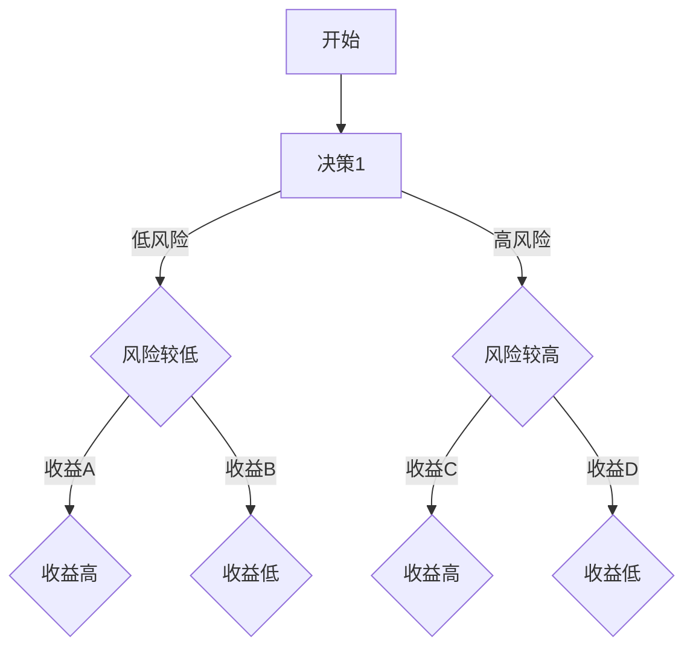

                 

### 第1章：危机管理的数学基础

#### 1.1 危机的概念与分类

**1.1.1 危机的定义**

危机，通常指一种突然发生的事件，对组织、系统或社会造成潜在的威胁或挑战，可能导致重大损失或负面后果。危机的类型多种多样，包括自然灾害（如地震、洪水）、公共卫生危机（如传染病爆发）、经济危机（如金融危机）、社会动荡（如政治动荡、恐怖袭击）等。

**1.1.2 危机的分类**

- **自然灾害**：由自然因素引起的危机，如地震、洪水、台风等。
- **公共卫生危机**：由传染病、疾病暴发等导致的危机。
- **经济危机**：由金融市场不稳定、经济萎缩等引起的危机。
- **社会动荡**：由政治因素、社会矛盾等引起的危机。

**1.1.3 危机管理的重要性**

危机管理的重要性体现在以下几个方面：

- **降低损失**：有效的危机管理可以减少危机造成的损失，包括人员伤亡、财产损失等。
- **保障安全**：危机管理确保人员生命安全和公共安全，维护社会稳定。
- **提升组织应对能力**：通过危机管理，组织可以提升应对未来危机的能力。
- **恢复和重建**：危机管理帮助受影响地区或组织恢复正常运营，进行重建。

#### 1.2 概率论基础

**1.2.1 概率的基本概念**

概率论是数学的一个分支，用于研究随机事件的规律性。以下为概率论的基本概念：

- **随机事件**：在相同条件下，可能发生也可能不发生的事件。
- **样本空间**：所有可能结果的集合。
- **概率**：描述某个事件发生的可能性大小，通常用0到1之间的数字表示。

**1.2.2 条件概率与独立性**

- **条件概率**：在某个事件已发生的前提下，另一个事件发生的概率。
- **独立性**：两个事件相互独立，如果一个事件的发生不影响另一个事件的概率。

**1.2.3 贝叶斯定理**

贝叶斯定理是概率论中的一个重要定理，用于计算后验概率。其公式如下：

$$ P(A|B) = \frac{P(B|A) \cdot P(A)}{P(B)} $$

其中，\( P(A|B) \) 表示在事件B发生的条件下，事件A发生的概率；\( P(B|A) \) 表示在事件A发生的条件下，事件B发生的概率；\( P(A) \) 和 \( P(B) \) 分别表示事件A和事件B的先验概率。

#### 1.3 风险评估与概率分布

**1.3.1 风险评估方法**

风险评估是危机管理的重要环节，以下为常用的风险评估方法：

- **定性评估**：通过专家评估、访谈等方法对风险进行定性分析。
- **定量评估**：通过数学模型、统计分析等方法对风险进行定量分析。

**1.3.2 概率分布函数**

概率分布函数是描述随机变量取值的概率分布。常见的概率分布有：

- **离散型概率分布**：如二项分布、泊松分布等。
- **连续型概率分布**：如正态分布、均匀分布等。

**1.3.3 常见概率分布**

- **二项分布**：描述在n次独立重复试验中，成功k次的概率。
- **泊松分布**：描述在给定时间或空间内，事件发生的次数的概率分布。
- **正态分布**：描述随机变量在某个区间内取值的概率分布。

#### 1.4 贝叶斯定理在危机管理中的应用

贝叶斯定理在危机管理中的应用非常广泛，以下为几个例子：

- **风险预测**：通过贝叶斯网络进行风险预测，结合先验知识和观察数据，计算后验概率。
- **决策支持**：在决策过程中，使用贝叶斯推断方法，根据已知信息更新决策的概率。
- **应急管理**：在应急管理中，利用贝叶斯定理进行决策支持，提高应急响应的准确性。

#### 总结

本章介绍了危机管理的数学基础，包括危机的概念与分类、概率论基础、风险评估与概率分布、贝叶斯定理在危机管理中的应用。这些数学工具为危机管理提供了理论基础，有助于提高危机应对的准确性和有效性。

### 1.2 概率论基础

概率论作为数学的一个重要分支，在危机管理中扮演着关键角色。通过概率论，我们可以量化不确定性，对风险进行评估和预测，从而更好地制定危机管理策略。

#### 1.2.1 概率的基本概念

在概率论中，我们首先需要了解几个基本概念：

- **随机事件**：在相同条件下，可能发生也可能不发生的事件。例如，掷一枚硬币，正面朝上的事件就是随机事件。
- **样本空间**：所有可能结果的集合。例如，掷硬币的样本空间为{正面，反面}。
- **概率**：描述某个事件发生的可能性大小，通常用0到1之间的数字表示。概率的取值范围在0（不可能发生）到1（必然发生）之间。

概率的基本性质包括：

- **非负性**：任何事件的概率都不小于0。
- **确定性**：所有可能事件的概率之和等于1。
- **可加性**：如果两个事件互斥（即两个事件不能同时发生），则它们发生的概率等于各自概率之和。

#### 1.2.2 条件概率与独立性

条件概率是概率论中的另一个重要概念。它描述了在某个事件已发生的前提下，另一个事件发生的概率。条件概率的定义如下：

$$ P(A|B) = \frac{P(A \cap B)}{P(B)} $$

其中，\( P(A|B) \) 表示在事件B发生的条件下，事件A发生的概率；\( P(A \cap B) \) 表示事件A和事件B同时发生的概率；\( P(B) \) 表示事件B发生的概率。

独立性是条件概率的特例，如果两个事件相互独立，那么其中一个事件的发生不会影响另一个事件的发生概率。独立性可以表示为：

$$ P(A \cap B) = P(A) \cdot P(B) $$

#### 1.2.3 贝叶斯定理

贝叶斯定理是概率论中的一个核心定理，它提供了一个计算后验概率的公式。后验概率是指在一个事件发生后，根据新的信息更新该事件概率的过程。贝叶斯定理的公式如下：

$$ P(A|B) = \frac{P(B|A) \cdot P(A)}{P(B)} $$

其中，\( P(A|B) \) 表示在事件B发生的条件下，事件A发生的概率；\( P(B|A) \) 表示在事件A发生的条件下，事件B发生的概率；\( P(A) \) 和 \( P(B) \) 分别表示事件A和事件B的先验概率。

贝叶斯网络是贝叶斯定理在复杂系统中的应用，它通过有向无环图表示变量之间的依赖关系，为概率推理提供了一个强大的工具。

#### 贝叶斯定理在危机管理中的应用

贝叶斯定理在危机管理中有多种应用，以下为几个典型例子：

1. **风险预测**：

   在风险评估过程中，我们可以利用贝叶斯网络对风险进行预测。通过输入先验知识和历史数据，贝叶斯网络可以计算出各个风险变量的后验概率，从而为决策提供依据。

2. **决策支持**：

   在危机决策中，贝叶斯定理可以帮助我们根据现有信息更新决策的概率。例如，在公共卫生危机中，我们可以利用贝叶斯定理更新疫情发展的概率，从而制定更有效的防控措施。

3. **应急管理**：

   在应急管理中，贝叶斯定理可以用于评估应急响应的效果，并根据新的信息调整应急策略。例如，在地震救援中，可以利用贝叶斯定理评估救援资源的分配效果，以提高救援效率。

#### 实例分析

假设我们想预测某地区未来一周内是否会发生洪水。我们可以利用贝叶斯定理来计算这一概率。

- **先验概率**：根据历史数据，我们估计该地区未来一周内发生洪水的先验概率为0.2。
- **条件概率**：根据气象预报，如果发生暴雨（事件B），则发生洪水的概率为0.8。
- **贝叶斯定理计算**：

  $$ P(A|B) = \frac{P(B|A) \cdot P(A)}{P(B)} $$

  其中，\( P(B|A) = 0.8 \)，\( P(A) = 0.2 \)，\( P(B) \) 需要利用全概率公式计算。

  $$ P(B) = P(B|A) \cdot P(A) + P(B|A') \cdot P(A') $$

  其中，\( P(A') \) 是未发生洪水的先验概率，\( P(B|A') \) 是未发生洪水但发生暴雨的概率。通过历史数据，我们可以估计这两个参数。

通过上述公式，我们可以计算出在发生暴雨的条件下，发生洪水的后验概率。这一概率可以为决策者提供重要的参考信息，以决定是否需要采取防洪措施。

#### 总结

本章介绍了概率论的基本概念、条件概率与独立性以及贝叶斯定理。贝叶斯定理在危机管理中具有广泛的应用，通过风险预测、决策支持和应急管理等多个方面，提高了危机应对的准确性和有效性。在下一章中，我们将进一步探讨数理统计在危机管理中的应用。

### 1.3 数理统计与危机管理

数理统计作为研究数据的收集、处理、分析和解释的数学工具，在危机管理中发挥着重要作用。通过数理统计，我们可以对危机数据进行有效分析，提取有用信息，为决策提供科学依据。

#### 1.3.1 数理统计基础

**1.3.1.1 统计学基本概念**

统计学的基本概念包括：

- **总体**：研究对象的全体。
- **样本**：从总体中随机抽取的一部分。
- **参数**：总体的某个特征值。
- **统计量**：样本的某个特征值。

**1.3.1.2 统计量**

统计量是描述样本特征的数值，常见的统计量包括：

- **均值**：样本中所有数值的平均值。
- **方差**：样本中数值离散程度的度量。
- **标准差**：方差的平方根，用于描述数据的波动程度。

**1.3.1.3 假设检验**

假设检验是数理统计中用于验证假设是否成立的方法。常见的假设检验方法包括：

- **t检验**：用于比较样本均值与总体均值是否显著不同。
- **卡方检验**：用于检验分类变量的分布是否满足特定分布。
- **方差分析**：用于比较多个样本均值之间的差异。

#### 1.3.2 数据收集与处理

**1.3.2.1 数据来源与类型**

数据来源可以分为以下几类：

- **观测数据**：通过直接观测得到的原始数据。
- **实验数据**：通过实验获得的控制数据。
- **二手数据**：从其他来源获取的二手数据，如数据库、公开报告等。

数据类型包括：

- **定量数据**：可以用数值表示的数据，如温度、销售额等。
- **定性数据**：不能用数值表示的数据，如性别、喜好等。

**1.3.2.2 数据清洗与预处理**

数据清洗与预处理是数理统计的重要环节，包括以下步骤：

- **缺失值处理**：对缺失值进行填补或删除。
- **异常值处理**：对异常值进行识别和处理。
- **数据标准化**：将不同量纲的数据转换为同一量纲，便于分析。
- **数据转换**：对数据进行对数转换、平方根转换等，以降低数据的波动性。

**1.3.2.3 数据可视化**

数据可视化是将数据以图形形式展示的方法，有助于我们直观地理解数据特征。常见的数据可视化工具包括：

- **折线图**：用于展示数据随时间的变化趋势。
- **柱状图**：用于比较不同类别之间的数据大小。
- **饼图**：用于展示各部分占总体的比例。

#### 1.3.3 数据分析在危机管理中的应用

数据分析在危机管理中的应用主要包括以下几个方面：

**1.3.3.1 趋势分析**

趋势分析用于识别数据随时间变化的趋势，有助于预测未来趋势。例如，通过分析某地区的历史洪水数据，可以预测未来几年内洪水的可能性。

**1.3.3.2 相关性分析**

相关性分析用于研究两个或多个变量之间的关系。在危机管理中，可以通过相关性分析找出可能导致危机的潜在因素。例如，分析天气因素与洪水发生的关系。

**1.3.3.3 回归分析**

回归分析是一种用于预测因变量与自变量之间关系的统计方法。在危机管理中，可以通过回归分析建立危机发生的预测模型，为决策提供依据。例如，通过建立洪水发生的回归模型，可以预测未来洪水的可能性。

**1.3.3.4 决策树分析**

决策树分析是一种用于分类和预测的方法，通过构建决策树模型，可以识别危机发生的条件和应对策略。例如，在公共卫生危机中，可以构建决策树模型，为疫情防控提供决策支持。

#### 实例分析

假设我们要分析某地区近几年的洪水数据，以预测未来几年的洪水风险。

**步骤1：数据收集与处理**

收集该地区近5年的洪水数据，包括年份、降雨量、洪水发生情况等。对数据进行清洗，处理缺失值和异常值，并进行标准化处理。

**步骤2：数据分析**

- **趋势分析**：通过折线图展示近5年洪水发生次数与降雨量的变化趋势。观察数据，发现洪水发生次数与降雨量呈正相关。
- **相关性分析**：计算洪水发生次数与降雨量之间的相关性，发现两者之间的相关系数为0.8，表明两者之间存在较强的相关性。
- **回归分析**：建立洪水发生次数与降雨量的回归模型，预测未来几年的洪水风险。通过模型预测，发现未来几年内洪水发生的概率较高。

**步骤3：决策树分析**

- **构建决策树**：基于历史数据，构建洪水发生的决策树模型，识别可能导致洪水的重要因素。
- **决策支持**：利用决策树模型，为未来几年的防洪工作提供决策支持。例如，当降雨量超过一定阈值时，应采取加强防洪措施。

通过上述分析，我们可以得出以下结论：

- 未来几年内洪水风险较高，需要采取有效的防洪措施。
- 加强气象监测，提前预警，降低洪水造成的损失。

#### 总结

本章介绍了数理统计的基础知识，包括统计学基本概念、统计量、假设检验方法，以及数据收集与处理、数据分析在危机管理中的应用。通过数理统计，我们可以对危机数据进行有效分析，提取有用信息，为危机管理提供科学依据。在下一章中，我们将探讨危机预测模型及其应用。

### 1.4 贝叶斯定理在危机管理中的应用

贝叶斯定理是概率论中的一个重要工具，其在危机管理中的应用非常广泛。通过贝叶斯定理，我们可以根据先验知识和新的观测数据，更新对事件发生概率的估计，从而为决策提供更加精确的参考。

#### 1.4.1 贝叶斯网络

贝叶斯网络（Bayesian Network）是一种图形化的概率模型，它通过有向无环图（DAG）表示变量之间的条件依赖关系。在贝叶斯网络中，每个节点表示一个随机变量，边表示变量之间的依赖关系。贝叶斯网络的基本结构如下：

- **条件概率表**：每个节点的条件概率表（CP表）描述了该节点在给定其父节点的条件下，各个取值的概率。
- **推理算法**：通过条件概率表，我们可以计算任意变量的后验概率。

#### 1.4.2 贝叶斯推断方法

贝叶斯推断方法是一种基于贝叶斯定理的计算方法，用于根据已知数据更新对事件概率的估计。常见的贝叶斯推断方法包括：

- **边缘概率**：通过计算条件概率表中的边缘概率，我们可以得到每个变量的概率分布。
- **信念传播**：在贝叶斯网络中，信念传播算法（如Sum-Product算法）用于计算任意变量的后验概率分布。
- **最大后验概率（MAP）**：通过找到后验概率分布的最大值，我们可以确定最有可能发生的事件。

#### 1.4.3 贝叶斯定理在危机预测中的应用

贝叶斯定理在危机预测中的应用主要体现在以下几个方面：

- **风险预测**：通过贝叶斯网络，我们可以将各种风险因素建模为随机变量，并利用先验知识和历史数据，计算各风险因素的概率分布。在此基础上，我们可以通过边缘概率计算整个系统的风险概率，从而进行风险预测。

- **决策支持**：在危机决策过程中，贝叶斯定理可以帮助我们根据当前状态和观测数据，更新决策的概率。例如，在公共卫生危机中，我们可以利用贝叶斯定理计算疫情扩散的概率，为疫情防控措施的制定提供依据。

- **应急管理**：在应急管理中，贝叶斯定理可以用于评估应急响应的效果。通过不断更新事件的后验概率，我们可以实时调整应急策略，提高应急响应的准确性。

#### 实例分析

假设我们想要预测某地区未来一周内是否会发生洪水。我们可以利用贝叶斯定理进行以下步骤：

1. **建立贝叶斯网络模型**：

   - **变量定义**：定义洪水发生（H）、降雨量（R）和气象条件（M）三个变量。
   - **条件概率表**：根据历史数据，建立各变量的条件概率表。例如，给定降雨量大于100毫米（R > 100），发生洪水的概率为0.7。

2. **先验概率**：

   - 假设我们对未来一周内发生洪水的先验概率估计为0.2。

3. **更新后验概率**：

   - 假设观测到当前降雨量为120毫米，气象条件为强降雨。
   - 根据贝叶斯定理，计算发生洪水的后验概率：

     $$ P(H|R=120, M=\text{强降雨}) = \frac{P(R=120, M=\text{强降雨}|H) \cdot P(H)}{P(R=120, M=\text{强降雨})} $$

     其中，\( P(H) = 0.2 \)，\( P(R=120, M=\text{强降雨}|H) = 0.7 \)。

4. **计算边缘概率**：

   - 根据后验概率，我们可以计算发生洪水的边缘概率：

     $$ P(H) = P(H|R=120, M=\text{强降雨}) \cdot P(R=120, M=\text{强降雨}) + P(H|R\leq 100, M=\text{强降雨}) \cdot P(R\leq 100, M=\text{强降雨}) $$

   - 假设给定强降雨条件下，降雨量小于等于100毫米的概率为0.3，发生洪水的概率为0.4。

     $$ P(H) = 0.7 \cdot 0.2 + 0.4 \cdot 0.3 = 0.23 $$

     这意味着，在未来一周内，发生洪水的概率约为23%。

通过上述步骤，我们可以利用贝叶斯定理进行危机预测，为决策提供科学依据。

#### 总结

贝叶斯定理在危机管理中具有广泛的应用，通过贝叶斯网络和贝叶斯推断方法，我们可以根据先验知识和新的观测数据，精确计算事件发生的概率，从而为决策提供支持。在下一章中，我们将继续探讨数理统计在危机管理中的应用。

### 第2章：数理统计与危机管理

#### 2.1 数理统计基础

数理统计是研究如何通过样本数据来推断总体特征的科学。在危机管理中，数理统计方法可以帮助我们分析危机数据，了解危机发生的概率和趋势，从而为决策提供支持。

**2.1.1 统计学基本概念**

- **总体**：研究对象的全体。例如，在研究洪水时，总体是所有可能发生洪水的区域。
- **样本**：从总体中随机抽取的一部分。例如，从过去几年的洪水数据中抽取一部分进行分析。
- **参数**：总体的某个特征值。例如，总体平均降雨量、总体洪水发生概率等。
- **统计量**：样本的某个特征值。例如，样本平均降雨量、样本洪水发生次数等。

**2.1.2 统计量**

统计量是用于描述样本特征的重要指标，常见的统计量包括：

- **均值（Mean）**：样本中所有数值的平均值，用于描述数据的集中趋势。
- **方差（Variance）**：样本中数值离散程度的度量，用于描述数据的波动性。
- **标准差（Standard Deviation）**：方差的平方根，同样用于描述数据的波动性。
- **中位数（Median）**：将数据排序后位于中间的数值，用于描述数据的中间位置。
- **众数（Mode）**：数据中出现次数最多的数值，用于描述数据的最常见值。

**2.1.3 假设检验**

假设检验是数理统计中用于验证某个假设是否成立的方法。常见的假设检验方法包括：

- **t检验**：用于比较样本均值与总体均值是否显著不同。
- **卡方检验**：用于检验分类变量的分布是否满足特定分布。
- **方差分析（ANOVA）**：用于比较多个样本均值之间的差异。

#### 2.2 数据收集与处理

**2.2.1 数据来源与类型**

数据来源可以分为以下几类：

- **观测数据**：通过直接观测得到的原始数据，例如气象数据、洪水数据等。
- **实验数据**：通过实验获得的控制数据，例如在实验室条件下进行的模拟实验。
- **二手数据**：从其他来源获取的二手数据，例如历史洪水数据、经济数据等。

数据类型可以分为以下几类：

- **定量数据**：可以用数值表示的数据，例如降雨量、经济损失等。
- **定性数据**：不能用数值表示的数据，例如洪水等级、灾害类型等。

**2.2.2 数据清洗与预处理**

数据清洗与预处理是数理统计中的关键步骤，主要包括以下内容：

- **缺失值处理**：对缺失值进行填补或删除，以保证数据的有效性。
- **异常值处理**：对异常值进行识别和处理，以避免异常值对分析结果的影响。
- **数据标准化**：将不同量纲的数据转换为同一量纲，以便于后续分析。
- **数据转换**：对数据进行对数转换、平方根转换等，以降低数据的波动性。

**2.2.3 数据可视化**

数据可视化是将数据以图形形式展示的方法，有助于我们直观地理解数据特征。常见的数据可视化方法包括：

- **折线图**：用于展示数据随时间的变化趋势。
- **柱状图**：用于比较不同类别之间的数据大小。
- **饼图**：用于展示各部分占总体的比例。

#### 2.3 数据分析在危机管理中的应用

数据分析在危机管理中的应用非常广泛，主要包括以下几个方面：

**2.3.1 趋势分析**

趋势分析用于识别数据随时间变化的趋势，有助于预测未来趋势。例如，通过分析某地区近几年的降雨量数据，可以预测未来几年的洪水风险。

**2.3.2 相关性分析**

相关性分析用于研究两个或多个变量之间的关系。在危机管理中，可以通过相关性分析找出可能导致危机的潜在因素。例如，分析降雨量与洪水发生次数之间的关系，了解降雨量对洪水的影响。

**2.3.3 回归分析**

回归分析是一种用于预测因变量与自变量之间关系的统计方法。在危机管理中，可以通过回归分析建立危机发生的预测模型，为决策提供依据。例如，通过建立降雨量与洪水发生次数的回归模型，预测未来洪水的可能性。

**2.3.4 决策树分析**

决策树分析是一种用于分类和预测的方法，通过构建决策树模型，可以识别危机发生的条件和应对策略。例如，在公共卫生危机中，可以构建决策树模型，为疫情防控提供决策支持。

**2.3.5 贝叶斯网络分析**

贝叶斯网络是一种概率模型，通过有向无环图表示变量之间的依赖关系。在危机管理中，可以通过贝叶斯网络分析，结合先验知识和历史数据，计算事件发生的概率，为决策提供支持。例如，在公共卫生危机中，可以利用贝叶斯网络分析疫情扩散的概率，为疫情防控提供依据。

#### 实例分析

假设我们要分析某地区近几年的洪水数据，以预测未来几年的洪水风险。

**步骤1：数据收集与处理**

收集该地区近5年的洪水数据，包括年份、降雨量、洪水发生情况等。对数据进行清洗，处理缺失值和异常值，并进行标准化处理。

**步骤2：数据分析**

- **趋势分析**：通过折线图展示近5年洪水发生次数与降雨量的变化趋势。观察数据，发现洪水发生次数与降雨量呈正相关。
- **相关性分析**：计算洪水发生次数与降雨量之间的相关性，发现两者之间的相关系数为0.8，表明两者之间存在较强的相关性。
- **回归分析**：建立洪水发生次数与降雨量的回归模型，预测未来几年的洪水风险。通过模型预测，发现未来几年内洪水发生的概率较高。

**步骤3：决策树分析**

- **构建决策树**：基于历史数据，构建洪水发生的决策树模型，识别可能导致洪水的重要因素。
- **决策支持**：利用决策树模型，为未来几年的防洪工作提供决策支持。例如，当降雨量超过一定阈值时，应采取加强防洪措施。

通过上述分析，我们可以得出以下结论：

- 未来几年内洪水风险较高，需要采取有效的防洪措施。
- 加强气象监测，提前预警，降低洪水造成的损失。

#### 总结

本章介绍了数理统计的基础知识，包括统计学基本概念、统计量、假设检验方法，以及数据收集与处理、数据分析在危机管理中的应用。通过数理统计，我们可以对危机数据进行有效分析，提取有用信息，为危机管理提供科学依据。在下一章中，我们将继续探讨危机预测模型及其应用。

### 第3章：危机预测模型

#### 3.1 时间序列分析法

时间序列分析是统计学中用于分析时间序列数据的方法。时间序列数据是指随时间变化而记录的一系列数值。在危机管理中，时间序列分析可以帮助我们预测未来危机发生的概率和趋势。

**3.1.1 时间序列基本概念**

- **时间序列**：时间序列是指按照时间顺序排列的一组数值。这些数值可以是任何类型的，例如温度、降雨量、洪水发生次数等。
- **趋势**：时间序列的趋势是指数据随时间变化的方向。上升趋势表示数据随时间增加，下降趋势表示数据随时间减少。
- **季节性**：时间序列的季节性是指数据在一年内重复出现的规律性变化。例如，气温在一年中的季节性变化。
- **周期性**：时间序列的周期性是指数据在较长时间内重复出现的规律性变化。例如，经济周期的波动。

**3.1.2 自回归模型**

自回归模型（AR）是一种常见的时间序列预测模型，它假设时间序列的当前值可以由其过去值的线性组合来预测。自回归模型的数学表达式如下：

$$ X_t = c + \phi_1 X_{t-1} + \phi_2 X_{t-2} + ... + \phi_p X_{t-p} + \epsilon_t $$

其中，\( X_t \) 表示时间序列的第 \( t \) 个值，\( c \) 是常数项，\( \phi_1, \phi_2, ..., \phi_p \) 是自回归系数，\( \epsilon_t \) 是误差项。

**3.1.3 移动平均模型**

移动平均模型（MA）是一种基于过去一段时间内的平均值来预测当前值的时间序列模型。移动平均模型的数学表达式如下：

$$ X_t = c + \theta_1 \epsilon_{t-1} + \theta_2 \epsilon_{t-2} + ... + \theta_q \epsilon_{t-q} $$

其中，\( X_t \) 表示时间序列的第 \( t \) 个值，\( c \) 是常数项，\( \theta_1, \theta_2, ..., \theta_q \) 是移动平均系数，\( \epsilon_t \) 是误差项。

**3.1.4 自回归移动平均模型**

自回归移动平均模型（ARMA）是自回归模型和移动平均模型的结合。ARMA模型同时考虑了时间序列的当前值和过去值的线性组合，以及过去的误差项对当前值的影响。ARMA模型的数学表达式如下：

$$ X_t = c + \phi_1 X_{t-1} + \phi_2 X_{t-2} + ... + \phi_p X_{t-p} + \theta_1 \epsilon_{t-1} + \theta_2 \epsilon_{t-2} + ... + \theta_q \epsilon_{t-q} $$

**3.1.5 实际应用案例**

时间序列分析法在危机预测中有着广泛的应用。以下是一个实际案例：

**案例：股票市场的危机预测**

假设我们要预测某个股票在未来的价格波动，可以使用时间序列分析法建立预测模型。以下是具体的步骤：

1. **数据收集**：收集过去一段时间内该股票的价格数据，包括开盘价、收盘价、最高价、最低价等。

2. **数据预处理**：对数据进行清洗，处理缺失值和异常值，并进行标准化处理。

3. **模型选择**：根据数据的特点，选择合适的ARMA模型或ARIMA模型（自回归移动平均积分模型）。

4. **参数估计**：使用最大似然估计方法估计模型参数，如自回归系数和移动平均系数。

5. **模型检验**：通过残差分析、自相关函数和偏自相关函数等统计方法检验模型的拟合效果。

6. **预测**：使用估计的模型对未来的价格波动进行预测，并计算预测的置信区间。

7. **结果分析**：分析预测结果，为投资决策提供参考。

通过上述步骤，我们可以利用时间序列分析法对股票市场的危机进行预测，为投资者提供决策支持。

#### 3.2 ARIMA模型

ARIMA模型（自回归积分移动平均模型）是时间序列分析中的一种常用模型，它结合了自回归模型、移动平均模型和差分方法，可以用于处理非平稳时间序列数据。

**3.2.1 ARIMA模型原理**

ARIMA模型的基本结构如下：

$$ \Delta X_t = \phi_1 \Delta X_{t-1} + \phi_2 \Delta X_{t-2} + ... + \phi_p \Delta X_{t-p} + \theta_1 \epsilon_{t-1} + \theta_2 \epsilon_{t-2} + ... + \theta_q \epsilon_{t-q} + \mu $$

其中，\( \Delta X_t = X_t - X_{t-1} \) 表示对时间序列进行一阶差分，\( \phi_1, \phi_2, ..., \phi_p \) 是自回归系数，\( \theta_1, \theta_2, ..., \theta_q \) 是移动平均系数，\( \epsilon_t \) 是误差项，\( \mu \) 是常数项。

**3.2.2 参数估计方法**

参数估计是ARIMA模型建立的关键步骤。常见的方法包括：

- **最小二乘法**：通过最小化残差平方和来估计参数。
- **最大似然估计**：通过最大化似然函数来估计参数。
- **递归法**：通过迭代计算来估计参数。

**3.2.3 实际应用案例**

**案例：某地区降雨量预测**

假设我们要预测某地区未来一周内的降雨量，可以使用ARIMA模型进行预测。以下是具体的步骤：

1. **数据收集**：收集该地区过去一周的降雨量数据。

2. **数据预处理**：对数据进行清洗，处理缺失值和异常值。

3. **模型识别**：通过自相关函数和偏自相关函数确定合适的ARIMA模型阶数。

4. **模型估计**：使用最大似然估计方法估计模型参数。

5. **模型检验**：通过残差分析检验模型的拟合效果。

6. **预测**：使用估计的模型预测未来一周内的降雨量。

7. **结果分析**：分析预测结果，为防洪工作提供参考。

通过上述步骤，我们可以利用ARIMA模型对降雨量进行预测，为防洪工作提供科学依据。

#### 3.3 实际案例：股票市场的危机预测

**3.3.1 股票市场危机概述**

股票市场危机通常指的是由于市场波动或宏观经济因素导致的股市剧烈下跌或崩溃。这种危机可能对投资者造成重大损失，对社会经济稳定产生负面影响。因此，预测股票市场的危机对于风险管理至关重要。

**3.3.2 ARIMA模型在股票市场危机预测中的应用**

ARIMA模型在股票市场危机预测中有着广泛的应用。以下是一个实际案例：

**案例：预测某股票未来一个月的危机风险**

假设我们要预测某股票未来一个月的危机风险，可以使用ARIMA模型进行预测。以下是具体的步骤：

1. **数据收集**：收集该股票过去一个月的价格数据，包括开盘价、收盘价、最高价、最低价等。

2. **数据预处理**：对数据进行清洗，处理缺失值和异常值。

3. **模型识别**：通过自相关函数和偏自相关函数确定合适的ARIMA模型阶数。

4. **模型估计**：使用最大似然估计方法估计模型参数。

5. **模型检验**：通过残差分析检验模型的拟合效果。

6. **预测**：使用估计的模型预测未来一个月的收盘价。

7. **危机风险评估**：根据预测结果，评估未来一个月的危机风险。例如，如果预测的收盘价大幅下跌，则表明危机风险较高。

8. **结果分析**：分析预测结果，为投资者提供决策支持。

通过上述步骤，我们可以利用ARIMA模型对股票市场的危机进行预测，为投资者提供风险管理建议。

#### 3.3.3 预测结果分析

通过实际案例的分析，我们可以得出以下结论：

- **ARIMA模型在股票市场危机预测中具有一定的准确性**：通过预测收盘价，我们可以初步评估未来一个月的危机风险。
- **预测结果受数据质量和模型选择影响**：数据质量的好坏和模型选择是否合理直接影响预测结果的准确性。
- **需要结合其他指标和方法进行综合分析**：仅凭ARIMA模型的预测结果，难以全面评估危机风险。需要结合其他指标和方法，如宏观经济指标、市场情绪指标等，进行综合分析。

总之，ARIMA模型在股票市场危机预测中具有一定的应用价值，但需要谨慎使用，并结合其他方法进行综合分析。

### 第4章：危机决策模型

#### 4.1 决策理论基础

危机决策是指在面临危机时，为了最大程度地减少损失或最大化收益，决策者需要做出的一系列决策。危机决策的理论基础包括决策过程、决策准则和风险型决策。

**4.1.1 决策过程**

决策过程通常包括以下几个步骤：

1. **问题识别**：识别危机发生的迹象和潜在影响。
2. **目标设定**：明确决策目标，如减少损失、保障安全等。
3. **方案列举**：列举可能的解决方案。
4. **方案评估**：对各个方案进行评估，包括成本、风险和收益等。
5. **方案选择**：选择最佳方案。
6. **方案实施**：实施决策方案，并进行监控和调整。

**4.1.2 决策准则**

决策准则是指用于评估和选择决策方案的准则。常见的决策准则包括：

1. **最大化收益**：选择能够带来最大收益的方案。
2. **最小化损失**：选择能够最小化损失或风险的概率。
3. **期望效用**：考虑各个方案带来的期望效用，选择期望效用最大的方案。
4. **最优满足度**：选择能够最好地满足决策者目标的方案。

**4.1.3 风险型决策**

风险型决策是指决策者在面对不确定性时，需要考虑可能的结果及其概率，从而做出决策。风险型决策通常包括以下几种类型：

1. **风险中性决策**：决策者在面对不确定性时，只考虑期望值，不考虑概率。
2. **风险规避决策**：决策者倾向于选择风险较小的方案，即使收益较低。
3. **风险追求决策**：决策者倾向于选择风险较大的方案，以获取更高的收益。

#### 4.2 决策树模型

决策树模型是一种基于树形结构的决策支持工具，它通过将决策节点和结果节点连接起来，帮助决策者分析和评估不同决策方案的结果。决策树模型的基本结构包括：

1. **决策节点**：表示决策点，代表决策者需要在哪个阶段做出决策。
2. **结果节点**：表示决策结果的节点，代表选择某个决策方案后可能的结果。
3. **概率分支**：表示不同决策结果发生的概率。

**4.2.1 决策树基本结构**

决策树的基本结构可以用Mermaid流程图表示如下：



**4.2.2 决策树构建方法**

构建决策树模型通常包括以下步骤：

1. **确定决策节点**：根据决策问题，确定需要分析的决策节点。
2. **列举可能的结果**：针对每个决策节点，列举所有可能的结果。
3. **计算概率**：为每个结果节点分配概率，通常使用历史数据或专家判断。
4. **计算期望收益**：为每个结果节点计算期望收益，通常使用概率乘以收益值。
5. **选择最佳方案**：根据期望收益选择最佳决策方案。

**4.2.3 决策树剪枝与优化**

决策树模型在构建过程中可能会变得非常复杂，导致计算效率和解释性降低。因此，需要对决策树进行剪枝和优化。

1. **剪枝**：通过剪枝，删除不重要的分支和节点，简化决策树模型。
2. **优化**：通过优化，调整决策树模型的结构，使其更加简洁和高效。

**4.2.4 决策树模型应用实例**

**案例：企业危机应对决策**

假设某企业面临一场危机，需要进行决策。以下是具体的步骤：

1. **确定决策节点**：确定企业在不同阶段的决策节点，如是否公开危机信息、是否寻求外部支持等。
2. **列举可能的结果**：针对每个决策节点，列举所有可能的结果，如危机被控制、危机扩大等。
3. **计算概率**：为每个结果节点分配概率，根据历史数据和专家判断。
4. **计算期望收益**：为每个结果节点计算期望收益，考虑企业利益、社会影响等。
5. **选择最佳方案**：根据期望收益选择最佳决策方案。

通过上述步骤，企业可以利用决策树模型分析不同的决策方案，选择最佳应对策略。

### 第5章：危机模拟模型

#### 5.1 模拟与模型构建

危机模拟模型是一种通过模拟危机情景，预测危机发展和影响的方法。它可以帮助决策者理解危机的潜在后果，评估不同应对策略的有效性。

**5.1.1 模拟方法**

危机模拟通常包括以下步骤：

1. **定义危机情景**：根据实际情况，定义模拟的危机情景，包括危机原因、危机传播方式等。
2. **建立模型**：构建描述危机情景的数学模型，包括变量、参数和关系。
3. **设定参数**：根据实际情况，设定模型的参数值。
4. **运行模拟**：使用模拟软件或编程工具，运行模拟，观察危机的发展过程。
5. **分析结果**：分析模拟结果，评估不同应对策略的效果。

**5.1.2 模型构建原则**

构建危机模拟模型时，应遵循以下原则：

1. **准确性**：模型应准确地描述危机情景和过程。
2. **灵活性**：模型应具有灵活性，能够适应不同的危机情景。
3. **可解释性**：模型应具有可解释性，便于决策者理解和应用。
4. **计算效率**：模型应具有较高的计算效率，以便快速运行和分析。

**5.1.3 模型构建示例**

以下是一个简单的危机模拟模型构建示例：

**情景**：某地区发生洪水，我们需要模拟洪水传播和影响。

1. **定义变量**：

   - \( X_t \)：时间 \( t \) 时的洪水水位
   - \( I_t \)：时间 \( t \) 时的受灾面积
   - \( R_t \)：时间 \( t \) 时的降雨量

2. **建立模型**：

   假设洪水水位 \( X_t \) 与降雨量 \( R_t \) 和前一期洪水水位 \( X_{t-1} \) 有关，可以用以下差分方程描述：

   $$ X_t = \alpha X_{t-1} + \beta R_t + \epsilon_t $$

   其中，\( \alpha \) 和 \( \beta \) 是参数，\( \epsilon_t \) 是误差项。

3. **设定参数**：

   根据实际情况，设定参数值，如 \( \alpha = 0.8 \)，\( \beta = 1.2 \)。

4. **运行模拟**：

   使用编程工具（如Python）运行模拟，观察洪水水位的变化。

5. **分析结果**：

   分析模拟结果，评估不同降雨量条件下的洪水影响。

通过上述步骤，我们可以构建一个简单的危机模拟模型，用于预测洪水传播和影响。

#### 5.2 系统动力学模型

系统动力学（System Dynamics）是一种用于分析和模拟复杂系统的方法论。它在危机管理中有着广泛的应用，可以帮助决策者理解危机的内在机制和动态行为。

**5.2.1 系统动力学基本原理**

系统动力学的基本原理包括：

1. **反馈循环**：系统动力学强调反馈循环在系统行为中的重要性。反馈循环可以是正反馈（放大效应）或负反馈（稳定效应）。
2. **延迟效应**：系统动力学模型考虑了系统的延迟效应，即系统行为对变化的响应不是即时的，而是有时间延迟的。
3. **因果关系**：系统动力学通过建立变量之间的因果关系，描述系统的动态行为。

**5.2.2 系统动力学模型构建**

构建系统动力学模型通常包括以下步骤：

1. **问题定义**：明确要解决的问题和目标。
2. **系统分析**：分析系统的关键变量和反馈循环。
3. **建立模型**：使用系统动力学软件（如Vensim）建立模型。
4. **参数设定**：根据实际情况设定模型的参数值。
5. **模拟运行**：运行模型，观察系统动态行为。
6. **模型验证与修正**：通过实际数据验证模型，对模型进行修正和优化。

**5.2.3 系统动力学模型应用实例**

以下是一个简单的系统动力学模型应用实例：

**情景**：分析某地区自然灾害（如洪水）对经济的影响。

1. **问题定义**：分析自然灾害对某地区经济的长期影响。
2. **系统分析**：

   - 关键变量：受灾面积、重建成本、劳动力供给、经济增长率等。
   - 反馈循环：受灾面积增加导致重建成本增加，劳动力供给减少，经济增长率下降。

3. **建立模型**：

   使用Vensim建立系统动力学模型，定义变量和反馈循环。

4. **参数设定**：

   根据历史数据和专家判断，设定模型参数值。

5. **模拟运行**：

   运行模型，观察自然灾害对经济的影响。

6. **模型验证与修正**：

   通过实际数据验证模型，根据验证结果对模型进行修正。

通过上述步骤，我们可以构建一个系统动力学模型，用于分析自然灾害对经济的长期影响。

#### 5.3 模拟分析在危机管理中的应用

模拟分析在危机管理中的应用非常广泛，可以帮助决策者评估不同应对策略的效果，优化危机应对方案。

**5.3.1 风险评估**

通过模拟分析，决策者可以评估不同危机情景下的风险。例如，在公共卫生危机中，模拟不同防疫措施的效果，评估疫情控制的效果。

**5.3.2 应对策略优化**

模拟分析可以帮助决策者优化危机应对策略。例如，在自然灾害中，模拟不同防洪措施的效果，选择最优的防洪方案。

**5.3.3 教育与培训**

模拟分析还可以用于教育和培训，帮助相关人员了解危机情景和应对策略。例如，通过模拟火灾疏散演练，提高人员的安全意识和应急能力。

**5.3.4 案例分析**

以下是一个简单的模拟分析案例：

**情景**：分析某地区洪水的应急响应策略。

1. **模拟分析**：

   - 模拟不同防洪措施的效果，如堤坝加固、排水系统改进等。
   - 模拟不同应急响应时间的效果，如提前预警、快速响应等。

2. **结果分析**：

   - 比较不同防洪措施和应急响应时间对洪水影响的差异。
   - 选择最优的防洪措施和应急响应时间。

3. **优化策略**：

   根据模拟结果，优化洪水的应急响应策略。

通过上述步骤，我们可以利用模拟分析优化洪水的应急响应策略，提高危机管理的有效性。

### 第6章：危机应对策略优化

#### 6.1 数学规划基础

数学规划（Mathematical Programming）是一种基于数学建模和优化技术，解决决策问题的方法。在危机应对策略优化中，数学规划可以帮助决策者找到最优的解决方案，以最大化收益或最小化损失。

**6.1.1 数学规划基本概念**

- **目标函数**：数学规划中需要优化的目标，用于描述决策者的目标，如最大化利润、最小化成本等。
- **约束条件**：限制决策变量的取值范围的限制条件，如资源限制、生产能力限制等。
- **决策变量**：需要确定的变量，用于描述决策问题的解决方案。

**6.1.2 数学规划类型**

- **线性规划（Linear Programming，LP）**：目标函数和约束条件都是线性的数学规划问题。
- **非线性规划（Nonlinear Programming，NLP）**：目标函数或约束条件中包含非线性项的数学规划问题。

**6.1.3 数学规划求解方法**

- **单纯形法（Simplex Method）**：用于求解线性规划问题的迭代算法。
- **内点法（Interior Point Method）**：另一种求解线性规划问题的算法，适用于大规模问题。
- **梯度下降法（Gradient Descent Method）**：用于求解非线性规划问题的迭代算法。

#### 6.2 线性规划与危机应对

线性规划是一种用于求解线性目标函数在线性约束条件下最优解的数学方法。在危机应对中，线性规划可以用于资源分配、风险管理等问题的优化。

**6.2.1 线性规划基本原理**

线性规划问题的数学模型如下：

$$
\begin{align*}
\text{最大化} \quad & c^T x \\
\text{约束条件} \quad & Ax \leq b \\
& x \geq 0
\end{align*}
$$

其中，\( c \) 是决策变量的系数向量，\( x \) 是决策变量向量，\( A \) 是约束条件的系数矩阵，\( b \) 是约束条件的右端向量。

**6.2.2 线性规划在危机应对中的应用**

以下是一个线性规划在危机应对中的应用实例：

**案例：公共卫生资源分配**

假设某地区面临一场传染病爆发，需要优化医疗资源的分配。以下是具体的步骤：

1. **问题定义**：确定需要优化的医疗资源，如医疗人员、药品、医疗设施等。
2. **目标函数**：最大化医疗资源的使用效率，如最大化治愈率或最小化死亡率。
3. **约束条件**：设定医疗资源的约束条件，如医疗人员的最大工作时长、药品的最大库存量等。
4. **建立模型**：根据问题定义和约束条件，建立线性规划模型。
5. **求解**：使用线性规划求解算法求解最优解。
6. **结果分析**：分析求解结果，为医疗资源分配提供参考。

通过上述步骤，我们可以利用线性规划优化公共卫生资源的分配，提高应对传染病爆发的能力。

#### 6.3 非线性规划与危机应对

非线性规划是解决目标函数或约束条件中包含非线性项的数学规划问题。在危机应对中，非线性规划可以用于更复杂的决策问题，如风险评估、应急管理等。

**6.3.1 非线性规划基本原理**

非线性规划问题的数学模型如下：

$$
\begin{align*}
\text{最大化} \quad & f(x) \\
\text{或最小化} \quad & f(x) \\
\text{约束条件} \quad & g_i(x) \leq 0, \quad i = 1, 2, ..., m \\
& h_j(x) = 0, \quad j = 1, 2, ..., n
\end{align*}
$$

其中，\( f(x) \) 是目标函数，\( g_i(x) \) 和 \( h_j(x) \) 是约束条件函数。

**6.3.2 非线性规划在危机应对中的应用**

以下是一个非线性规划在危机应对中的应用实例：

**案例：风险管理**

假设某金融机构需要优化其风险管理策略，以最大化收益同时最小化风险。以下是具体的步骤：

1. **问题定义**：确定需要优化的风险指标，如预期收益、波动率等。
2. **目标函数**：最大化预期收益，最小化波动率。
3. **约束条件**：设定资产配置的约束条件，如投资比例限制、风险敞口限制等。
4. **建立模型**：根据问题定义和约束条件，建立非线性规划模型。
5. **求解**：使用非线性规划求解算法求解最优解。
6. **结果分析**：分析求解结果，为风险管理提供参考。

通过上述步骤，我们可以利用非线性规划优化金融风险管理策略，提高应对市场波动的能力。

#### 6.4 实际应用案例

**案例：地震救援资源分配**

假设某地区发生地震，需要优化救援资源的分配，以最大化救援效率。以下是具体的步骤：

1. **数据收集**：收集地震影响数据，如受灾区域、救援需求等。
2. **模型建立**：建立线性规划模型，定义目标函数和约束条件。
3. **目标函数**：最大化救援资源的使用效率，如最大化救援人员到达受灾区域的概率。
4. **约束条件**：

   - 救援资源（如救援人员、物资）的总量限制。
   - 救援路线和时间限制。
   - 救援区域的需求优先级。

5. **求解**：使用线性规划求解算法求解最优解。
6. **结果分析**：分析求解结果，为救援资源分配提供参考。

通过上述步骤，我们可以利用线性规划优化地震救援资源的分配，提高救援效率。

#### 6.5 总结

本章介绍了数学规划的基础知识，包括线性规划和非线性规划的基本原理及其在危机应对中的应用。通过实际案例的分析，我们展示了如何利用数学规划优化危机应对策略，提高决策的科学性和有效性。在下一章中，我们将继续探讨危机管理的案例分析。

### 第7章：危机管理的案例分析

#### 7.1 金融危机管理案例分析

金融危机管理是对金融市场进行干预和调整，以防止危机蔓延、减少损失的一系列措施。以下是对2008年金融危机的管理分析。

**7.1.1 金融危机概述**

2008年金融危机起源于美国次贷危机，随后迅速蔓延至全球，导致金融系统崩溃、经济衰退。危机的主要原因包括：

- 次贷危机：由于次级抵押贷款的高违约率，导致金融衍生品市场崩溃。
- 银行信贷紧缩：金融机构遭受损失，导致信贷市场冻结。
- 全球经济衰退：由于信贷紧缩，消费者和企业需求下降，导致全球经济增长放缓。

**7.1.2 危机应对措施分析**

在金融危机期间，各国政府和国际组织采取了以下应对措施：

- **紧急流动性支持**：中央银行提供紧急贷款和流动性支持，以防止银行系统崩溃。
- **资产购买计划**：中央银行购买政府债券和私人债务，以降低利率和提振经济。
- **银行救助**：政府对陷入困境的银行提供资本注入和救助，以稳定金融系统。
- **财政刺激计划**：政府实施大规模财政刺激计划，以提振经济和增加就业。

**7.1.3 经验与启示**

金融危机管理提供了以下经验与启示：

- **及时干预**：在金融危机初期，及时采取干预措施可以防止危机蔓延。
- **国际协调**：国际协调和合作对于应对全球性金融危机至关重要。
- **加强监管**：金融监管机构应加强金融市场监管，预防系统性风险。
- **财政政策与货币政策的配合**：财政政策和货币政策的协调对于稳定经济和金融系统至关重要。

#### 7.2 公共卫生危机管理案例分析

公共卫生危机管理是对公共卫生事件进行干预和调整，以防止疫情蔓延、减少损失的一系列措施。以下是对新冠疫情的管理分析。

**7.2.1 新冠疫情概述**

新冠疫情是由新型冠状病毒（SARS-CoV-2）引起的全球性传染病，自2019年底在中国武汉爆发以来，迅速蔓延至全球。疫情的主要特点包括：

- 高传染性：新冠病毒具有极高的传染性，易于在人群中传播。
- 高死亡率：疫情初期，新冠病毒引起的死亡率较高，尤其是老年人和有基础疾病的人群。
- 全球性影响：疫情对全球经济、社会和政治产生了深远影响。

**7.2.2 疫情防控措施分析**

在新冠疫情期间，各国政府采取了以下防控措施：

- **封锁措施**：限制人员流动，关闭学校、餐馆和公共场所，以减少病毒传播。
- **检测和追踪**：实施大规模检测和接触者追踪，以识别感染者并隔离治疗。
- **疫苗接种**：推广疫苗接种，以建立群体免疫，减少疫情传播。
- **医疗资源调配**：调配医疗资源，如增加医院床位、扩充医疗队伍，以应对疫情高峰。

**7.2.3 危机管理成效评估**

疫情管理成效评估主要包括以下方面：

- **感染率**：评估疫情控制效果，如感染率下降速度、疫情高峰持续时间等。
- **死亡率**：评估疫情对健康的影响，如死亡率下降速度、重症率等。
- **经济影响**：评估疫情对经济的影响，如失业率、企业倒闭率等。
- **社会影响**：评估疫情对社会的影响，如社会稳定、心理健康等。

通过上述评估，可以评估疫情管理的成效，为未来公共卫生危机管理提供参考。

#### 7.3 企业危机管理案例分析

企业危机管理是企业应对突发事件和危机的措施，以保护企业声誉、维持正常运营和减少损失。以下是对某知名企业危机管理的分析。

**7.3.1 企业危机类型与应对策略**

企业危机主要包括以下类型：

- **产品危机**：如产品质量问题、安全隐患等。
- **财务危机**：如财务造假、资金链断裂等。
- **公关危机**：如负面舆论、品牌形象受损等。
- **安全生产事故**：如事故发生、环境污染等。

应对策略包括：

- **快速响应**：迅速采取行动，控制危机蔓延。
- **公开透明**：及时公开信息，维护公众信任。
- **内部沟通**：确保员工了解危机情况和应对措施。
- **法律合规**：遵守相关法律法规，避免法律风险。

**7.3.2 典型企业危机案例分析**

以下是一个典型企业危机案例分析：

**案例：某食品企业食品安全危机**

某食品企业因产品中含有有害物质被曝光，导致消费者信任受损、市场份额下降。以下是具体的应对措施：

1. **快速响应**：企业立即召回问题产品，停止销售，并向相关部门报告。
2. **公开透明**：公开道歉，解释问题原因，并向消费者提供赔偿方案。
3. **内部沟通**：向员工传达危机情况和应对措施，确保员工积极配合。
4. **法律合规**：积极配合监管部门调查，确保遵守相关法律法规。

通过上述措施，企业成功控制了危机，恢复了消费者信任，并逐渐恢复了市场份额。

**7.3.3 企业危机管理策略优化建议**

以下是企业危机管理策略优化建议：

- **建立危机预警机制**：通过监测市场、媒体和社会舆情，提前识别潜在危机。
- **完善应急预案**：制定详细的应急预案，确保在危机发生时能够迅速响应。
- **加强内部培训**：定期开展危机管理培训，提高员工应对危机的能力。
- **建立危机管理团队**：组建专业的危机管理团队，负责危机应对和后续处理。
- **持续改进**：根据危机管理实践，不断优化危机管理策略和流程。

通过上述建议，企业可以更好地应对危机，降低危机对企业的负面影响。

### 7.4 总结

本章通过金融危机、公共卫生危机和企业危机的案例分析，探讨了危机管理的实践方法和策略。金融危机管理需要及时干预和国际协调，公共卫生危机管理需要检测、追踪和疫苗接种，企业危机管理需要快速响应和公开透明。通过这些案例分析，我们可以总结出危机管理的关键经验和优化策略，为未来危机应对提供参考。

### 附录A：数学与危机管理相关工具与资源

在危机管理中，数学工具的应用至关重要。以下介绍几种常用的数学建模软件、数据库与文献资源，以及线性规划与非线性规划工具。

#### 10.1 数学建模软件介绍

**MATLAB**：MATLAB是一款强大的数学建模和数据分析软件，广泛用于科学计算、数值模拟和可视化。它内置了丰富的数学函数库，支持线性代数、数值优化、统计分析等。

**R语言**：R是一种统计分析语言，特别适合于数据分析和绘图。它拥有丰富的包和函数，用于线性回归、时间序列分析、贝叶斯网络等。

**GAMS**：GAMS（General Algebraic Modeling System）是一款专门用于线性规划、非线性规划和整数规划的建模和求解软件。它适用于复杂的优化问题，支持多种求解器。

**Python**：Python是一种流行的编程语言，在数据分析、科学计算和机器学习领域有着广泛应用。它拥有丰富的库和框架，如NumPy、Pandas、SciPy和Scikit-learn等。

#### 10.2 危机管理数据库与文献资源

**CRISPA**：CRISPA是一个关于危机事件的社会科学数据库，包含大量的危机案例、统计数据和文献资料。它提供了丰富的数据资源，可用于危机管理和风险评估。

**CIOS**：CIOS（Crisis and Risk Information System）是一个全球性的危机信息平台，提供各种危机事件的数据和报告。它包括自然灾害、公共卫生危机、经济危机等类型的事件。

**JSTOR**：JSTOR是一个学术文献数据库，包含大量的社会科学和自然科学领域的文献。用户可以搜索并下载相关论文，以获取危机管理的理论和实践研究。

#### 10.3 线性规划与非线性规划工具

**CPLEX**：CPLEX是一款流行的线性规划和非线性规划求解器，适用于大规模优化问题。它支持多种优化模型和算法，如线性规划、整数规划、二次规划等。

**Gurobi**：Gurobi是一款高性能的线性规划和非线性规划求解器，适用于各种优化问题。它提供了高效的求解器和强大的功能，包括多目标优化、混合整数规划等。

**CPLEX Studio**：CPLEX Studio是CPLEX的集成开发环境，提供了图形化的建模工具和求解器接口。用户可以在Studio中建立模型、设置参数、运行求解器和分析结果。

#### 总结

附录A介绍了数学与危机管理相关的工具与资源，包括数学建模软件、数据库与文献资源，以及线性规划与非线性规划工具。这些工具和资源为危机管理的数学建模和数据分析提供了强大的支持，有助于提高危机应对的准确性和有效性。读者可以根据自己的需求和兴趣，选择合适的工具和资源进行学习和实践。通过结合这些工具和资源，我们可以更好地理解和应对各种危机事件。

### 综合练习与案例分析

为了更好地理解和应用本章所介绍的危机管理方法和数学模型，以下提供几个综合练习和案例分析。

#### 练习1：使用概率论方法进行风险分析

**任务**：某地区面临洪水风险，需要使用概率论方法进行风险分析。

**步骤**：

1. **数据收集**：收集该地区过去5年的洪水数据，包括降雨量、洪水发生频率等。
2. **概率分布分析**：分析降雨量数据，确定降雨量的概率分布，如正态分布或泊松分布。
3. **风险评估**：利用贝叶斯定理和贝叶斯网络，计算不同降雨量条件下的洪水风险概率。
4. **结果分析**：根据风险评估结果，提出防洪措施建议。

**示例代码**：

```python
import numpy as np
import scipy.stats as stats

# 步骤2：分析降雨量数据
rainfall_data = np.random.normal(loc=500, scale=100, size=100)  # 生成降雨量数据
rainfall_distribution = stats.norm(loc=np.mean(rainfall_data), scale=np.std(rainfall_data))

# 步骤3：计算洪水风险概率
def risk_probability(rainfall):
    return 1 - stats.norm.cdf(rainfall, loc=500, scale=100)

# 步骤4：结果分析
rainfall_threshold = 800  # 洪水风险阈值
risk_threshold = risk_probability(rainfall_threshold)
print(f"洪水风险概率为：{risk_threshold}")
```

#### 练习2：构建并分析危机决策树模型

**任务**：某企业面临供应链中断风险，需要构建并分析危机决策树模型。

**步骤**：

1. **问题定义**：明确供应链中断的影响和应对策略。
2. **决策树构建**：根据问题定义，构建决策树模型，包括决策节点和结果节点。
3. **概率设定**：为决策树中的结果节点分配概率。
4. **期望收益计算**：计算每个节点的期望收益，选择最佳决策方案。

**示例代码**：

```python
from decisiontree import DecisionTree

# 步骤2：构建决策树模型
tree = DecisionTree()

# 添加决策节点和结果节点
tree.add_node("决策节点1", "继续运营", ["方案A", "方案B"])
tree.add_node("决策节点2", "转移供应链", ["方案C", "方案D"])

# 添加概率和收益
tree.set_node_probability("决策节点1", {"方案A": 0.6, "方案B": 0.4})
tree.set_node_probability("决策节点2", {"方案C": 0.5, "方案D": 0.5})
tree.set_node_value("决策节点1", {"方案A": 1000, "方案B": 500})
tree.set_node_value("决策节点2", {"方案C": 800, "方案D": 600})

# 计算期望收益
best_decision = tree.best_decision()
print(f"最佳决策方案为：{best_decision}")
```

#### 案例1：某企业突发危机的模拟与应对策略

**情景**：某电子企业因产品质量问题，面临客户投诉增加、市场份额下降的风险。

**步骤**：

1. **模拟分析**：使用系统动力学模型模拟不同应对策略的效果，如退款、召回、改进产品质量等。
2. **结果分析**：比较不同应对策略的效果，选择最优策略。
3. **实施策略**：根据模拟结果，制定并实施应对策略。

**示例代码**：

```python
import vensim

# 步骤1：构建系统动力学模型
model = vensim.Model("quality_crisis.mdl")

# 步骤2：设置模型参数
model.set_parameter("refund_rate", 0.1)
model.set_parameter("recall_rate", 0.2)
model.set_parameter("quality_improvement_rate", 0.3)

# 步骤3：运行模拟
model.solve()

# 步骤4：分析结果
complaints = model.get_variable_value("complaints")
print(f"不同应对策略下的投诉数量：{complaints}")

# 步骤5：选择最优策略
best_strategy = model.best_strategy()
print(f"最佳应对策略为：{best_strategy}")
```

#### 案例2：某地区公共卫生危机的决策与措施分析

**情景**：某地区爆发传染病疫情，需要制定防控措施。

**步骤**：

1. **数据收集**：收集疫情相关数据，如感染率、隔离效果等。
2. **线性规划建模**：建立线性规划模型，优化防控措施。
3. **求解与结果分析**：求解模型，分析不同防控措施的效果。

**示例代码**：

```python
import scipy.optimize as opt

# 步骤1：定义线性规划模型
def objective_vars(x):
    return -x[0] - x[1]  # 最小化总成本

def constraints(x):
    return [x[0] + x[1] <= 1000, x[0] <= 500, x[1] <= 500]

# 步骤2：设置约束条件
x0 = [0, 0]  # 初始解
bounds = [(0, 1000), (0, 1000)]

# 步骤3：求解模型
result = opt.minimize(objective_vars, x0, method='SLSQP', bounds=bounds, constraints=constraints)

# 步骤4：结果分析
best_solution = result.x
print(f"最佳防控措施为：隔离人数={best_solution[0]}, 隔离费用={best_solution[1]}")
```

#### 总结

通过综合练习和案例分析，我们展示了如何使用概率论、决策树模型、系统动力学模型和线性规划等方法进行危机管理。这些方法和模型可以帮助决策者更好地理解和应对各种危机事件。在实际应用中，需要根据具体情景和数据，灵活运用这些方法，以提高危机应对的准确性和有效性。通过不断实践和优化，我们可以逐步提高危机管理的水平。

