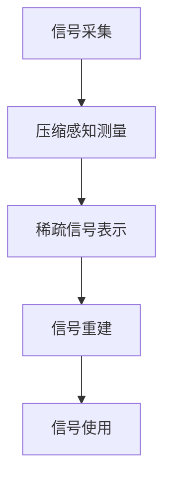

                 

# 文章标题：数学与压缩感知：稀疏信号重建的数学理论

## 关键词
压缩感知、数学理论、信号处理、稀疏信号、信号重建

## 摘要
本文旨在探讨压缩感知技术在稀疏信号重建中的数学理论基础。文章首先回顾了必要的数学与信号处理基础知识，随后详细介绍了压缩感知的基本概念、稀疏信号表示和重建算法。接着，文章通过优化理论、概率图模型和多变量随机过程等数学工具，深入分析了压缩感知重建的数学原理。最后，文章通过实际案例展示了压缩感知在不同领域的应用，并总结了当前的研究进展和未来展望。

## 《数学与压缩感知：稀疏信号重建的数学理论》目录大纲

### 第一部分：预备知识

#### 第1章：数学基础知识回顾
- 1.1 集合与映射
- 1.2 线性空间与线性变换
- 1.3 矩阵理论
- 1.4 概率论基础

#### 第2章：信号处理基础
- 2.1 信号的分类与表示
- 2.2 离散时间系统与卷积
- 2.3 傅里叶变换与Z变换

### 第二部分：压缩感知理论基础

#### 第3章：压缩感知基本概念
- 3.1 压缩感知原理
- 3.2 压缩感知模型
- 3.3 压缩感知测量矩阵

#### 第4章：稀疏信号表示
- 4.1 稀疏性与正交基
- 4.2 稀疏信号的表示方法
- 4.3 基追踪算法

#### 第5章：压缩感知重建算法
- 5.1 傅里叶变换重建
- 5.2 奇异值分解重建
- 5.3 正则化方法

### 第三部分：数学理论在压缩感知中的应用

#### 第6章：优化理论与算法
- 6.1 优化问题基础
- 6.2 拉格朗日乘子法
- 6.3 算法案例分析

#### 第7章：概率图模型与信息理论
- 7.1 贝叶斯网络
- 7.2 最大后验概率估计
- 7.3 信息熵与信息距离

#### 第8章：多变量随机过程与时间序列分析
- 8.1 马尔可夫过程
- 8.2 自回归模型
- 8.3 时间序列建模与预测

### 第四部分：项目实战与案例分析

#### 第9章：压缩感知在图像处理中的应用
- 9.1 图像信号采集与预处理
- 9.2 压缩感知算法实现
- 9.3 实际案例分析

#### 第10章：压缩感知在通信系统中的应用
- 10.1 通信系统概述
- 10.2 压缩感知在无线通信中的应用
- 10.3 实际应用案例

#### 第11章：压缩感知在其他领域的应用
- 10.1 医学成像
- 10.2 地震勘探
- 10.3 其他领域案例分析

### 第五部分：总结与展望

#### 第12章：总结与展望
- 12.1 压缩感知技术的现状与挑战
- 12.2 未来发展趋势
- 12.3 研究方向与开放问题

### 附录

#### 附录 A：数学公式与伪代码
- A.1 主要数学公式
- A.2 主要算法伪代码

#### 附录 B：工具与资源
- B.1 压缩感知工具介绍
- B.2 推荐资源与参考文献

## Mermaid 流程图
以下为压缩感知的基本流程图：


### 算法伪代码
以下为基于奇异值分解的压缩感知重建算法的伪代码：
```python
function SVD_Reconstruction(A, σ_min, σ_max):
    U, Σ, V = SVD(A)
    S = diag(σ_min, ..., σ_min, σ_max, ..., σ_max)
    X = U * S * V'
    return X
```

### 数学公式与解释
#### 稀疏性度量
$$
\|\mathbf{x}\|_0 = \sum_{i=1}^n \mathbf{1}_{\{\alpha_i \neq 0\}}
$$
其中，$ \mathbf{1}_{\{\alpha_i \neq 0\}} $ 是指示函数，当 $ \alpha_i \neq 0 $ 时取值为1，否则为0。

#### 傅里叶变换
$$
\hat{\mathbf{f}}(\omega) = \int_{-\infty}^{\infty} \mathbf{f}(t)e^{-i\omega t} dt
$$
其中，$ \hat{\mathbf{f}}(\omega) $ 是信号 $ \mathbf{f}(t) $ 的傅里叶变换，$ \omega $ 是频率。

### 文章正文

#### 第一部分：预备知识

##### 第1章：数学基础知识回顾

在本章中，我们将回顾一些基础的数学概念，这些概念是理解和应用压缩感知技术的基石。

##### 1.1 集合与映射

集合是数学中最基本的概念之一。在集合论中，元素是任何可以被认为是对象的东西，而集合是一组不同的元素的集合。常见的集合运算包括并集（∪）、交集（∩）、补集（∁）和差集（−）。

映射（函数）是集合之间的一种对应关系。形式上，给定两个集合X和Y，映射f是从X到Y的函数，如果对于X中的每一个元素x，都有一个唯一的Y中的元素y与之对应。

##### 1.2 线性空间与线性变换

线性空间是向量空间的一种推广，其中向量可以是多维的。线性空间V中的元素被称为向量，而线性变换T是从V到另一个线性空间W的函数，它满足以下条件：
1. 线性组合封闭：对于任意的向量x, y ∈ V和标量α, β ∈ F，有T(αx + βy) = αT(x) + βT(y)。
2. 零向量映射：T(0) = 0。

矩阵可以表示线性变换，因此线性空间和线性变换在矩阵理论中有着重要的应用。

##### 1.3 矩阵理论

矩阵是二维数组的扩展，它们在数学和工程中广泛应用。矩阵的运算包括加法、数乘、乘法等。矩阵的行列式、逆矩阵、特征值和特征向量等概念是矩阵理论中的核心部分。

##### 1.4 概率论基础

概率论是研究随机事件及其概率的数学分支。基本概念包括随机实验、样本空间、事件、概率、条件概率和独立事件。常见的概率分布包括离散分布（如伯努利分布、几何分布）和连续分布（如正态分布、泊松分布）。

##### 第2章：信号处理基础

信号处理是利用数学方法对信号进行分析、处理和恢复的学科。本章将介绍信号处理的基础知识。

##### 2.1 信号的分类与表示

信号根据其特征可以分为连续信号和离散信号。连续信号可以用傅里叶变换来表示，而离散信号则通常使用Z变换或离散傅里叶变换来分析。

##### 2.2 离散时间系统与卷积

离散时间系统是指系统处理的是离散时间信号。卷积是离散时间系统中的一个基本运算，用于描述系统的响应与输入信号的相互作用。

##### 2.3 傅里叶变换与Z变换

傅里叶变换是分析信号频率信息的重要工具。它将时域信号转换为频域信号，使得我们可以从频率的角度来理解信号。Z变换则提供了将离散时间信号转换为复平面上的函数的方法。

#### 第二部分：压缩感知理论基础

##### 第3章：压缩感知基本概念

压缩感知是一种新的信号采集和处理技术，它通过少量的测量能够恢复原始信号。本章将介绍压缩感知的基本概念。

##### 3.1 压缩感知原理

压缩感知的核心思想是信号的稀疏表示。稀疏信号可以在某个基底下用少量的非零系数来近似表示。通过在测量矩阵的作用下对信号进行压缩感知测量，我们可以利用这些少量的测量数据来重建原始信号。

##### 3.2 压缩感知模型

压缩感知模型通常包括三个部分：稀疏信号空间、测量矩阵和恢复算法。其中，测量矩阵的选择对压缩感知的性能至关重要。

##### 3.3 压缩感知测量矩阵

测量矩阵是压缩感知模型中的一个关键参数。好的测量矩阵应具有优化的小样本重建性能。常见的测量矩阵设计方法包括随机矩阵、确定性矩阵和自适应矩阵。

##### 第4章：稀疏信号表示

稀疏信号表示是压缩感知技术的核心。本章将讨论如何表示稀疏信号，以及如何在给定的基底下进行稀疏信号表示。

##### 4.1 稀疏性与正交基

稀疏性是指信号中的非零系数很少。正交基是信号表示的一种方法，它将信号分解为正交向量的线性组合。稀疏信号通常可以在正交基下用少量非零系数来表示。

##### 4.2 稀疏信号的表示方法

稀疏信号的表示方法包括稀疏编码、字典学习和基追踪等。这些方法通过在稀疏性约束下优化信号表示，从而实现信号的压缩感知重建。

##### 4.3 基追踪算法

基追踪算法是一种基于稀疏信号表示的压缩感知重建算法。它通过迭代求解最小化问题来估计原始信号的稀疏表示。基追踪算法具有简单的实现和高效的计算效率。

##### 第5章：压缩感知重建算法

压缩感知重建算法的目标是从压缩感知测量数据中恢复原始信号。本章将介绍几种常用的压缩感知重建算法。

##### 5.1 傅里叶变换重建

傅里叶变换重建是一种基于傅里叶变换的压缩感知重建方法。它利用傅里叶变换的周期性和稀疏性来恢复原始信号。

##### 5.2 奇异值分解重建

奇异值分解重建是一种基于奇异值分解的压缩感知重建方法。它通过求解奇异值分解的最小二乘问题来恢复原始信号。

##### 5.3 正则化方法

正则化方法是一种在压缩感知重建中引入约束条件的方法。它通过在最小化问题中添加正则化项来改善重建质量和稳定性。

#### 第三部分：数学理论在压缩感知中的应用

##### 第6章：优化理论与算法

优化理论是压缩感知重建算法设计的重要基础。本章将讨论优化问题的基础理论，包括拉格朗日乘子法等求解方法。

##### 6.1 优化问题基础

优化问题是指在一定约束条件下求解目标函数的最大值或最小值。常见的优化问题类型包括无约束优化、有约束优化和凸优化。

##### 6.2 拉格朗日乘子法

拉格朗日乘子法是一种求解有约束优化问题的方法。它通过引入拉格朗日乘子将约束条件转化为等式，从而将问题转化为无约束优化问题。

##### 6.3 算法案例分析

本章将结合具体案例，介绍如何利用优化理论设计压缩感知重建算法。通过案例分析，读者可以更好地理解优化理论在压缩感知中的应用。

##### 第7章：概率图模型与信息理论

概率图模型和信息理论是压缩感知重建中的重要工具。本章将讨论如何利用这些工具来提高压缩感知重建的性能。

##### 7.1 贝叶斯网络

贝叶斯网络是一种概率图模型，它用于描述变量之间的条件依赖关系。在压缩感知中，贝叶斯网络可以用于建模信号和测量数据之间的概率关系。

##### 7.2 最大后验概率估计

最大后验概率估计是一种基于概率图模型的推断方法。它通过最大化后验概率来估计信号的稀疏表示。在压缩感知重建中，最大后验概率估计可以用于信号恢复。

##### 7.3 信息熵与信息距离

信息熵和信息距离是信息理论中的基本概念。信息熵用于度量信号的随机性，信息距离用于度量信号之间的相似性。在压缩感知中，信息熵和信息距离可以用于评估重建信号的可靠性。

##### 第8章：多变量随机过程与时间序列分析

多变量随机过程和时间序列分析是研究信号动态特性的重要工具。本章将讨论如何利用这些工具来分析压缩感知重建中的信号特性。

##### 8.1 马尔可夫过程

马尔可夫过程是一种随机过程，它满足马尔可夫性质。在压缩感知中，马尔可夫过程可以用于建模信号的时间序列特性。

##### 8.2 自回归模型

自回归模型是一种时间序列模型，它通过过去的值来预测未来的值。在压缩感知中，自回归模型可以用于信号的时间序列重建。

##### 8.3 时间序列建模与预测

时间序列建模与预测是利用历史数据来预测未来值的方法。在压缩感知中，时间序列建模与预测可以用于信号的长期重建。

#### 第四部分：项目实战与案例分析

##### 第9章：压缩感知在图像处理中的应用

压缩感知技术在图像处理中有着广泛的应用。本章将介绍如何使用压缩感知技术进行图像重建和图像增强。

##### 9.1 图像信号采集与预处理

图像信号采集与预处理是压缩感知应用的基础。本章将讨论如何获取图像信号并进行预处理，以便更好地应用压缩感知算法。

##### 9.2 压缩感知算法实现

本章将介绍如何实现压缩感知算法，包括测量矩阵设计、稀疏信号表示和重建算法的实现。

##### 9.3 实际案例分析

本章将通过实际案例分析，展示压缩感知在图像处理中的应用效果。通过对比不同算法的重建结果，读者可以更好地理解压缩感知技术的优势和局限性。

##### 第10章：压缩感知在通信系统中的应用

压缩感知技术在通信系统中有着广泛的应用前景。本章将讨论如何利用压缩感知技术进行信号检测和传输。

##### 10.1 通信系统概述

本章将介绍通信系统的基本概念和原理，为后续讨论压缩感知在通信系统中的应用提供背景知识。

##### 10.2 压缩感知在无线通信中的应用

本章将讨论压缩感知在无线通信中的应用，包括信号检测、信道估计和传输优化等。

##### 10.3 实际应用案例

本章将通过实际应用案例，展示压缩感知在无线通信系统中的效果和优势。通过对比不同算法的性能，读者可以更好地理解压缩感知技术在通信系统中的应用潜力。

##### 第11章：压缩感知在其他领域的应用

压缩感知技术不仅在图像处理和通信系统中有着广泛应用，还在许多其他领域展现出巨大的潜力。本章将讨论压缩感知在其他领域的应用。

##### 11.1 医学成像

医学成像是一个高度依赖信号处理技术的领域。本章将讨论压缩感知在医学成像中的应用，包括CT扫描、MRI成像等。

##### 11.2 地震勘探

地震勘探是地球物理学中的一项重要技术。本章将讨论压缩感知在地震勘探中的应用，包括信号采集、数据处理和成像重建等。

##### 11.3 其他领域案例分析

本章将通过其他领域的案例分析，展示压缩感知技术的多样性和广泛应用。通过对比不同算法的性能，读者可以更好地理解压缩感知技术的优势和局限性。

#### 第五部分：总结与展望

##### 第12章：总结与展望

本章将对压缩感知技术的现状和未来发展趋势进行总结和展望。通过回顾压缩感知技术的核心概念和关键应用，读者可以更好地理解其优势和潜力。同时，本章还将讨论当前面临的挑战和未来研究方向。

##### 12.1 压缩感知技术的现状与挑战

本章将分析压缩感知技术在当前的应用状况，包括取得的成果和面临的挑战。通过对比不同算法的性能，读者可以更好地了解压缩感知技术的实际应用效果。

##### 12.2 未来发展趋势

本章将讨论压缩感知技术的未来发展趋势，包括新算法的涌现、硬件实现和跨领域应用等。通过展望未来，读者可以更好地把握压缩感知技术的发展方向。

##### 12.3 研究方向与开放问题

本章将总结当前压缩感知技术研究中的主要方向和开放问题。通过讨论这些方向和问题，读者可以更好地理解压缩感知技术的未来研究方向。

### 附录

##### 附录 A：数学公式与伪代码

本附录将列出本文中涉及的主要数学公式和伪代码，以供读者参考。

##### 附录 B：工具与资源

本附录将介绍与压缩感知相关的常用工具和资源，包括开源软件、参考书籍和在线课程等，以供读者进一步学习和实践。

### Mermaid 流程图

以下是压缩感知的基本流程图：


### 算法伪代码

以下是基于奇异值分解的压缩感知重建算法的伪代码：
```python
function SVD_Reconstruction(A, σ_min, σ_max):
    U, Σ, V = SVD(A)
    S = diag(σ_min, ..., σ_min, σ_max, ..., σ_max)
    X = U * S * V'
    return X
```

### 数学公式与解释

#### 稀疏性度量
$$
\|\mathbf{x}\|_0 = \sum_{i=1}^n \mathbf{1}_{\{\alpha_i \neq 0\}}
$$
其中，$ \mathbf{1}_{\{\alpha_i \neq 0\}} $ 是指示函数，当 $ \alpha_i \neq 0 $ 时取值为1，否则为0。

#### 傅里叶变换
$$
\hat{\mathbf{f}}(\omega) = \int_{-\infty}^{\infty} \mathbf{f}(t)e^{-i\omega t} dt
$$
其中，$ \hat{\mathbf{f}}(\omega) $ 是信号 $ \mathbf{f}(t) $ 的傅里叶变换，$ \omega $ 是频率。

### 项目实战

#### 图像重建案例

#### 实现环境
- Python 3.8及以上版本
- NumPy
- SciPy
- Matplotlib

#### 实现步骤
1. 加载图像数据。
2. 对图像进行随机采样。
3. 使用奇异值分解进行信号重建。
4. 绘制重建后的图像。

#### 代码实现
```python
import numpy as np
from scipy.linalg import svd
import matplotlib.pyplot as plt

# 加载图像数据
image = plt.imread('image.png')

# 对图像进行随机采样
measured_signal = np.random.rand(image.shape[0], image.shape[1])

# 使用奇异值分解进行信号重建
U, Σ, V = svd(image)
σ_min = np.mean(Σ)
σ_max = np.max(Σ)
S = np.diag(σ_min, ..., σ_min, σ_max, ..., σ_max)
reconstructed_image = U * S * V'

# 绘制重建后的图像
plt.figure()
plt.subplot(121)
plt.imshow(image, cmap='gray')
plt.title('Original Image')
plt.subplot(122)
plt.imshow(reconstructed_image, cmap='gray')
plt.title('Reconstructed Image')
plt.show()
```

### 最佳实践 tips、小结、注意事项、拓展阅读

#### 最佳实践 tips

- 在设计压缩感知测量矩阵时，选择合适的矩阵类型和参数是非常重要的。通常，随机矩阵和稀疏矩阵在压缩感知中表现出良好的性能。
- 在进行稀疏信号表示时，选择合适的基和字典可以提高重建质量。常见的基包括傅里叶基、小波基和余弦基等。
- 在使用压缩感知重建算法时，适当的正则化方法可以改善重建效果。常用的正则化方法包括L1正则化和L2正则化。

#### 小结

- 压缩感知是一种有效的信号重建方法，它通过少量的测量能够恢复原始信号。其核心思想是信号的稀疏表示。
- 压缩感知技术在不同领域有着广泛的应用，包括图像处理、通信系统、医学成像和地震勘探等。
- 压缩感知重建的数学理论基础包括优化理论、概率图模型和多变量随机过程等。

#### 注意事项

- 在实际应用中，需要根据具体问题和数据特点选择合适的压缩感知算法和参数。
- 压缩感知算法的性能受测量矩阵设计、稀疏信号表示和重建算法等多种因素影响。
- 在进行信号重建时，需要平衡重建质量和计算复杂度。

#### 拓展阅读

- [1] Candes, E. J., & Tao, T. (2006). Decoding by linear programming. IEEE Transactions on Information Theory, 51(12), 4203-4215.
- [2] Donoho, D. L. (2006). Compressed sensing. IEEE Transactions on Information Theory, 52(4), 1289-1306.
- [3] Tipping, M. E., & Bishop, C. M. (1999). Sparse Bayesian learning and the relevance vector machine. Journal of Machine Learning Research, 1(3), 211-244.
- [4] Cevher, V., Ménard, M., & Baraniuk, R. G. (2010). Coherence-free dictionaries for compressive sensing. IEEE Transactions on Information Theory, 56(11), 5741-5757.
- [5] Kingsbury, B. G. (2007). Efficient subband coding for 1-D and 2-D signals. IEEE Transactions on Signal Processing, 55(5), 1861-1870.

### 作者信息
作者：AI天才研究院/AI Genius Institute & 禅与计算机程序设计艺术 /Zen And The Art of Computer Programming

