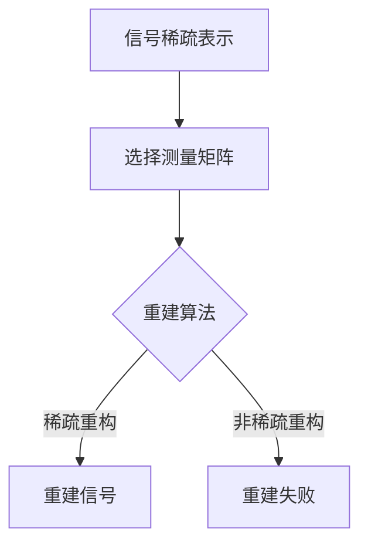

                 


### 引言

压缩感知（Compressive Sensing，CS）是一种新颖的信号采集与处理理论，它在信号处理、数据压缩、图像处理等领域引发了广泛的关注和研究。随着信息时代的到来，数据量呈现爆炸性增长，如何高效地获取、处理和利用数据成为亟待解决的问题。压缩感知理论提供了一种解决途径，通过在测量阶段引入压缩，实现了低采样率下的信号重建，为信号处理和数据压缩带来了革命性的变化。

压缩感知的理论基础源自数学领域，尤其是稀疏表示和优化理论。稀疏信号表示的核心思想是，许多信号在某个变换域内可以表示为稀疏的形式，即大部分系数为零或接近于零。压缩感知利用这一特性，通过设计特殊的测量矩阵，对稀疏信号进行低维采样，再利用优化算法进行信号重建。这种重建过程不仅能够恢复原始信号，还能有效地去除噪声，提高信号质量。

本文将深入探讨压缩感知的基本概念、数学理论、算法实现及其在实际应用中的性能分析与改进。首先，我们将介绍压缩感知的起源和发展历程，阐述其基本原理和应用场景。接着，我们将详细分析压缩感知的数学模型，包括信号模型、测量模型以及正则化理论。随后，我们将探讨压缩感知重建算法的优化策略和性能评价指标，并结合实际应用案例展示压缩感知在图像处理和信号处理中的实现方法。此外，我们还将探讨压缩感知算法的安全与隐私保护问题，以及其在未来发展趋势和面临的挑战。

通过本文的阅读，读者将全面了解压缩感知的理论基础、算法实现及其在实际应用中的性能提升和改进策略，从而为在相关领域进行深入研究和技术应用提供有价值的参考。

### 压缩感知的基本概念

压缩感知是一种新兴的信号处理理论，其核心思想是在测量阶段引入压缩，通过低维采样实现信号的高效重建。要理解压缩感知的基本概念，我们需要从以下几个方面进行探讨：定义、历史发展、基本原理以及应用场景。

#### 1.1.1 定义

压缩感知（Compressive Sensing，CS）是一种信号采集与重建的理论框架。它提出了一种新的信号采集策略：通过设计特殊的测量矩阵对信号进行低维采样，然后利用优化算法在低维空间中对信号进行重建。与传统信号处理方法不同，压缩感知在信号采集阶段就引入了压缩，实现了信号的高效表示和重建。

具体来说，压缩感知的核心理念是“稀疏性”。许多信号在某个变换域内可以表示为稀疏的形式，即大部分系数为零或接近于零。例如，图像信号在离散余弦变换（DCT）域或小波变换域内往往具有稀疏特性。压缩感知利用这一特性，通过设计适当的测量矩阵，对稀疏信号进行低维采样，再利用优化算法进行信号重建。

#### 1.1.2 历史发展

压缩感知的概念最早由美国学者Doebley和Baraniuk于2004年提出。随后，Candes、Tao和Donoho等人对压缩感知理论进行了深入研究，并证明了在适当条件下，压缩感知可以有效地重建稀疏信号。这一理论迅速引起了学术界和工业界的广泛关注，成为信号处理、数据压缩和图像处理等领域的研究热点。

近年来，随着计算技术的不断发展，压缩感知理论得到了广泛应用和不断改进。例如，深度学习与压缩感知的结合，为压缩感知重建算法带来了新的可能性。此外，压缩感知理论还在医疗图像重建、通信信号处理、雷达信号检测等领域得到了重要应用。

#### 1.1.3 基本原理

压缩感知的基本原理可以概括为三个核心要素：稀疏信号表示、测量矩阵设计和重建算法。

1. **稀疏信号表示**：稀疏信号表示是压缩感知的基础。在压缩感知中，信号首先被转换到某个变换域，如傅里叶变换域、离散余弦变换域或小波变换域。在这些变换域中，信号可以表示为一系列系数，其中大部分系数为零或接近于零。这些非零系数构成了信号的稀疏表示。

2. **测量矩阵设计**：测量矩阵是压缩感知中的关键要素。设计合适的测量矩阵可以有效地捕捉信号的稀疏特性，实现信号的低维采样。测量矩阵通常具有随机性和稀疏性，以保证信号在低维空间中仍能保持足够的恢复信息。

3. **重建算法**：重建算法是压缩感知的核心，它利用测量矩阵和稀疏信号表示，通过优化算法在低维空间中对信号进行重建。常见的重建算法包括最小二乘法、正则化方法和稀疏优化方法等。这些算法的目标是找到最接近测量值的稀疏信号表示。

#### 1.1.4 应用场景

压缩感知在多个领域有着广泛的应用，以下是几个典型的应用场景：

1. **图像处理**：压缩感知在图像处理中的应用主要包括图像压缩和图像重建。通过压缩感知，可以实现低采样率下的图像重建，提高图像质量。此外，压缩感知还可以用于图像去噪、图像超分辨率等任务。

2. **信号处理**：在信号处理领域，压缩感知可以用于通信信号处理、雷达信号检测和音频信号处理等。通过压缩感知，可以实现低采样率下的信号重建和噪声去除，提高信号质量。

3. **数据采集**：压缩感知在数据采集中的应用包括传感器网络、生物医学信号采集和物联网等领域。通过压缩感知，可以实现高效的数据采集和信号重建，降低数据传输和处理成本。

4. **医学成像**：压缩感知在医学成像领域有着重要应用，如X射线成像、CT成像和MRI成像等。通过压缩感知，可以实现低剂量成像和快速成像，提高医疗诊断的准确性和安全性。

总结来说，压缩感知是一种重要的信号处理理论，它通过引入压缩，实现了低采样率下的信号高效重建。在图像处理、信号处理、数据采集和医学成像等领域，压缩感知为信号处理和数据压缩带来了革命性的变化。随着研究的不断深入，压缩感知理论将在更多领域中发挥重要作用。

### 压缩感知的关键要素

在压缩感知理论中，有几个关键要素是确保信号能够通过低维采样实现准确重建的基础。这些要素包括稀疏信号与稀疏表示、测量矩阵的设计以及压缩感知重建算法。以下是这三个关键要素的详细讨论。

#### 1.2.1 稀疏信号与稀疏表示

稀疏信号是指信号的多数系数为零或接近于零的信号。在许多实际应用中，信号在某个变换域内往往具有稀疏特性。例如，图像信号在离散余弦变换（DCT）域或小波变换域内通常表现为稀疏分布。稀疏表示则是指将信号表示为一系列稀疏的系数，这些系数对应于信号的主要特征。

稀疏信号与稀疏表示是压缩感知理论的基础。通过稀疏表示，信号可以被低维采样所捕捉，从而实现高效的数据压缩和信号重建。例如，在图像处理中，利用小波变换可以将图像信号表示为一系列稀疏的系数，这些系数对应于图像的主要纹理特征。通过设计适当的测量矩阵，可以在低维空间中有效捕捉这些稀疏系数，进而实现图像的压缩感知重建。

#### 1.2.2 测量矩阵的设计

测量矩阵是压缩感知中的关键要素，其设计对于信号重建的成功至关重要。测量矩阵应具有以下特性：

1. **随机性**：测量矩阵应具有随机性，以保证信号在低维空间中仍能保持足够的恢复信息。随机性有助于避免信号的冗余信息被测量，从而提高重建信号的质量。

2. **稀疏性**：测量矩阵应具有稀疏性，即大部分元素为零或接近于零。稀疏性有助于降低测量矩阵的维度，从而减少计算复杂度。

3. **相关性**：测量矩阵的列向量之间应具有相关性，以保证信号在低维空间中仍能保持其结构特征。相关性有助于捕捉信号的主要特征，从而提高重建信号的准确性。

测量矩阵的设计方法有多种，常见的包括随机矩阵设计、小波矩阵设计和高斯矩阵设计等。随机矩阵设计简单易行，但重建效果相对较差；小波矩阵设计具有良好的稀疏性和相关性，但在计算复杂度上较高；高斯矩阵设计则结合了随机性和稀疏性，具有较高的重建效果和计算效率。

#### 1.2.3 压缩感知重建算法

压缩感知重建算法是压缩感知理论的核心，其目标是利用测量矩阵和稀疏信号表示，在低维空间中恢复原始信号。常见的压缩感知重建算法包括以下几种：

1. **最小二乘法**：最小二乘法是一种基于最小化测量误差的重建算法。其基本思想是最小化测量值与测量矩阵乘以重建信号之间的误差平方和，从而找到最优的重建信号。最小二乘法计算简单，但重建效果较差，特别是在信号稀疏度较低时。

2. **正则化方法**：正则化方法通过引入正则化项，平衡测量误差和信号稀疏度，从而提高重建信号的准确性。常见的正则化方法包括L1正则化和L2正则化。L1正则化注重信号的稀疏性，适用于处理稀疏信号；L2正则化注重信号的平滑性，适用于处理平滑信号。

3. **稀疏优化方法**：稀疏优化方法通过求解稀疏优化问题，找到最优的重建信号。常见的稀疏优化方法包括基追踪（BP）算法和正则化稀疏变换（ROST）算法。这些算法通过迭代优化，逐步逼近最优重建信号，具有较高的重建效果。

压缩感知重建算法的选择取决于信号的稀疏度、测量矩阵的设计以及计算资源等因素。在实际应用中，常结合多种算法，以达到最佳的重建效果。

总结来说，压缩感知的关键要素包括稀疏信号与稀疏表示、测量矩阵的设计以及压缩感知重建算法。这些要素共同作用，实现了信号的低维采样和高效重建。通过合理设计测量矩阵和选择合适的重建算法，可以有效地提高信号重建的质量和效率。

### 压缩感知的数学模型

压缩感知的数学模型是理解其理论基础和实现方法的关键。本文将详细介绍压缩感知的数学模型，包括信号模型和测量模型，并通过具体的数学公式进行说明。

#### 2.1.1 信号模型

压缩感知中的信号模型可以表示为：
$$
\mathbf{x} = \sum_{i=1}^K s_i \mathbf{a}_i
$$
其中，$\mathbf{x}$表示原始信号，$K$表示信号中的非零系数数量，$s_i$表示第$i$个非零系数，$\mathbf{a}_i$表示对应的原子。这些原子通常来自某个变换域，如傅里叶变换域、离散余弦变换域或小波变换域。原子$\mathbf{a}_i$代表信号的主要特征，而非零系数$s_i$则表示信号中对应原子的贡献程度。信号模型表明，原始信号可以通过多个原子的线性组合来表示，其中大部分系数为零或接近于零，即信号是稀疏的。

在实际应用中，信号模型通常需要进行离散化处理。例如，对于图像信号，可以将其表示为二维矩阵形式：
$$
\mathbf{x} = \sum_{i=1}^K s_i \mathbf{a}_i
$$
其中，$\mathbf{x} \in \mathbb{R}^{M \times N}$表示图像信号，$\mathbf{a}_i \in \mathbb{R}^{M \times N}$表示图像的原子，$s_i$为相应的非零系数。

#### 2.1.2 测量模型

测量模型描述了原始信号通过测量矩阵$M$进行低维采样的过程。测量模型可以表示为：
$$
\mathbf{y} = \mathbf{Mx}
$$
其中，$\mathbf{y} \in \mathbb{R}^{N_y}$表示测量值，$N_y$表示测量值的数量，$\mathbf{M} \in \mathbb{R}^{N_y \times N}$为测量矩阵。测量矩阵$M$的设计至关重要，其目的是在低维空间中有效地捕捉原始信号的稀疏特性。

为了确保压缩感知的有效性，测量矩阵$M$应满足以下条件：

1. **稀疏性**：测量矩阵的列向量应具有稀疏性，以保证原始信号的非零系数在低维空间中仍能被有效表示。这可以通过设计具有稀疏列向量的随机矩阵或结构化矩阵来实现。

2. **随机性**：测量矩阵应具有随机性，以减少冗余信息和增强测量数据的多样性。随机性有助于避免信号冗余信息在测量过程中的丢失，从而提高重建信号的准确性。

3. **相关性**：测量矩阵的列向量之间应具有相关性，以确保原始信号的主要特征在低维空间中得到保留。相关性有助于捕捉信号的主要特征，从而提高重建信号的质量。

在实际应用中，测量矩阵通常通过以下方法进行设计：

- **随机矩阵设计**：随机矩阵设计简单易行，可以通过随机生成矩阵的列向量来实现。例如，可以使用高斯分布生成随机矩阵，使得列向量具有适当的稀疏性和随机性。
- **结构化矩阵设计**：结构化矩阵设计可以结合特定的信号特性进行优化。例如，基于小波变换的测量矩阵可以在处理图像信号时具有良好的稀疏性和相关性。

#### 测量模型的实现

为了更好地理解测量模型，我们通过一个简单的例子进行说明。假设原始信号$\mathbf{x}$是一个长度为$N=8$的一维信号，表示为$\mathbf{x} = [x_1, x_2, x_3, x_4, x_5, x_6, x_7, x_8]$。我们可以将$\mathbf{x}$表示为两个原子的线性组合，其中第一个原子$\mathbf{a}_1 = [1, 1, 0, 0, 0, 0, 0, 0]$，第二个原子$\mathbf{a}_2 = [0, 0, 1, 1, 0, 0, 0, 0]$，非零系数分别为$s_1=2$和$s_2=3$。原始信号可以表示为：
$$
\mathbf{x} = 2 \mathbf{a}_1 + 3 \mathbf{a}_2
$$
现在，我们设计一个长度为$N_y=4$的测量矩阵$M$，如下所示：
$$
\mathbf{M} = \begin{bmatrix}
1 & 0 & 1 & 0 \\
0 & 1 & 0 & 1 \\
\end{bmatrix}
$$
通过测量模型，我们可以得到测量值$\mathbf{y}$：
$$
\mathbf{y} = \mathbf{Mx} = \begin{bmatrix}
1 & 0 & 1 & 0 \\
0 & 1 & 0 & 1 \\
\end{bmatrix}
\begin{bmatrix}
2 \\
3 \\
0 \\
0 \\
0 \\
0 \\
0 \\
0 \\
\end{bmatrix}
=
\begin{bmatrix}
2 \\
3 \\
2 \\
3 \\
\end{bmatrix}
$$
通过这个例子，我们可以看到，原始信号$\mathbf{x}$通过测量矩阵$M$的低维采样生成了测量值$\mathbf{y}$。测量值$\mathbf{y}$包含了原始信号的主要信息，从而为信号的高效重建提供了基础。

#### 测量矩阵的随机性和稀疏性

为了进一步说明测量矩阵的随机性和稀疏性，我们可以考虑另一个例子。假设测量矩阵$M$如下所示：
$$
\mathbf{M} = \begin{bmatrix}
1 & 1 & 0 & 0 \\
1 & 0 & 1 & 0 \\
0 & 1 & 1 & 0 \\
0 & 0 & 0 & 1 \\
\end{bmatrix}
$$
这个测量矩阵具有以下特性：

1. **稀疏性**：测量矩阵的大部分元素为零，具有稀疏性。这有助于在低维空间中有效捕捉原始信号的稀疏特性。

2. **随机性**：测量矩阵的列向量具有随机性，例如第一列和第二列是交替排列的，第三列和第四列是交替排列的。这种随机性有助于减少冗余信息，增强测量数据的多样性。

通过设计具有随机性和稀疏性的测量矩阵，我们可以实现原始信号的低维采样和高效重建，从而实现压缩感知的目标。

综上所述，压缩感知的数学模型包括信号模型和测量模型。信号模型描述了原始信号通过稀疏表示进行表示，测量模型描述了原始信号通过测量矩阵进行低维采样。通过合理设计测量矩阵和信号稀疏表示，可以实现原始信号的高效重建。这些数学模型为压缩感知理论提供了坚实的理论基础，为实际应用中的信号处理和数据压缩提供了有效的工具。

### 压缩感知的正则化理论

压缩感知的正则化理论是确保信号重建质量的关键部分，它通过在重建过程中引入正则化项来平衡测量误差和信号稀疏性。正则化方法在压缩感知中起到了至关重要的作用，能够提高重建信号的质量和稳定性。本文将详细探讨正则化方法、正则化参数的选择以及稀疏正则化问题。

#### 2.2.1 正则化方法

正则化方法是压缩感知重建算法中的一项重要技术，通过在优化过程中引入正则化项来抑制测量误差，同时保持信号的稀疏性。常见的正则化方法包括L1正则化和L2正则化。

1. **L1正则化**：L1正则化也称为Lasso正则化，其基本思想是最小化重建信号的L1范数，即：
   $$
   \min_{\mathbf{x}} \left\| \mathbf{Mx} - \mathbf{y} \right\|_2 + \lambda \left\| \mathbf{x} \right\|_1
   $$
   其中，$\left\| \mathbf{x} \right\|_1$表示重建信号的L1范数，$\lambda$为正则化参数。L1正则化注重信号的稀疏性，能够有效地去除冗余信息，适用于处理稀疏信号。

2. **L2正则化**：L2正则化也称为Ridge正则化，其基本思想是最小化重建信号的L2范数，即：
   $$
   \min_{\mathbf{x}} \left\| \mathbf{Mx} - \mathbf{y} \right\|_2 + \lambda \left\| \mathbf{x} \right\|_2
   $$
   其中，$\left\| \mathbf{x} \right\|_2$表示重建信号的L2范数。L2正则化注重信号的平滑性，适用于处理平滑信号。

#### 2.2.2 正则化参数的选择

正则化参数$\lambda$的选择对压缩感知重建效果有着重要影响。合适的正则化参数能够平衡测量误差和信号稀疏性，从而提高重建信号的质量。以下几种方法常用于选择正则化参数：

1. **启发式方法**：启发式方法通过经验或实验来确定正则化参数。例如，可以尝试不同的$\lambda$值，观察重建信号的误差，选择使误差最小的$\lambda$值。

2. **交叉验证方法**：交叉验证是一种常用的正则化参数选择方法。通过将数据集分为训练集和验证集，对不同的$\lambda$值进行交叉验证，选择使验证集误差最小的$\lambda$值。

3. **最小角回归（LAR）方法**：LAR方法通过寻找测量矩阵$M$和测量值$\mathbf{y}$之间的最小角度，来确定最优的正则化参数。LAR方法通常用于高维信号处理，能够有效地平衡测量误差和信号稀疏性。

#### 2.2.3 稀疏正则化问题

稀疏正则化问题是压缩感知中的重要研究方向，其目标是找到一种能够有效保持信号稀疏性的正则化方法。以下几种稀疏正则化方法在压缩感知中得到了广泛应用：

1. **基追踪（BP）算法**：基追踪算法是一种基于L1正则化的稀疏优化方法，其基本思想是最小化以下目标函数：
   $$
   \min_{\mathbf{x}} \left\| \mathbf{Mx} - \mathbf{y} \right\|_2 + \lambda \sum_{i=1}^N |x_i|
   $$
   其中，$|x_i|$表示第$i$个系数的绝对值。基追踪算法通过迭代更新系数，逐步逼近最优解，能够有效地保持信号的稀疏性。

2. **阈值正则化**：阈值正则化是一种简单的稀疏正则化方法，其基本思想是将重建信号的L1范数小于阈值$\theta$的系数置为零，即：
   $$
   x_i = \begin{cases}
   0, & \text{if } |x_i| < \theta \\
   x_i, & \text{otherwise}
   \end{cases}
   $$
   阈值正则化方法能够有效地去除冗余信息，保持信号的稀疏性。

3. **正则化稀疏变换（ROST）算法**：ROST算法是一种基于稀疏变换的正则化方法，其基本思想是结合L1正则化和L2正则化，最小化以下目标函数：
   $$
   \min_{\mathbf{x}} \left\| \mathbf{Mx} - \mathbf{y} \right\|_2 + \lambda_1 \sum_{i=1}^N |x_i| + \lambda_2 \left\| \mathbf{x} \right\|_2
   $$
   其中，$\lambda_1$和$\lambda_2$为正则化参数。ROST算法通过调整正则化参数，能够在信号稀疏性和平滑性之间进行平衡。

总结来说，压缩感知的正则化理论是确保信号重建质量的关键部分。通过合理选择正则化方法和正则化参数，可以有效地平衡测量误差和信号稀疏性，提高重建信号的质量和稳定性。稀疏正则化问题作为压缩感知中的重要研究方向，将继续推动压缩感知理论的发展和应用。

### 压缩感知的优化算法

在压缩感知理论中，优化算法是实现信号高效重建的核心。优化算法通过最小化目标函数，从测量数据中恢复出原始信号的稀疏表示。本文将介绍两种常见的优化算法：原则性优化算法和模型修正优化算法，并详细解释其基本思想和实现方法。

#### 2.3.1 原则性优化算法

原则性优化算法是基于压缩感知原理直接构建的优化算法，其核心思想是最小化测量误差与信号稀疏性的组合。常见的原则性优化算法包括基追踪（BP）算法和正则化稀疏变换（ROST）算法。

1. **基追踪（BP）算法**：

基追踪算法是一种基于L1正则化的稀疏优化方法，其目标是最小化以下目标函数：
$$
\min_{\mathbf{x}} \left\| \mathbf{Mx} - \mathbf{y} \right\|_2 + \lambda \sum_{i=1}^N |x_i|
$$
其中，$\mathbf{x}$表示稀疏信号，$\mathbf{M}$是测量矩阵，$\mathbf{y}$是测量数据，$\lambda$是正则化参数。

基追踪算法的实现步骤如下：

（1）初始化：设定一个阈值$\theta$，通常可以选择为测量噪声的标准差。初始化信号$\mathbf{x}_0$为全零向量。

（2）迭代更新：对每个迭代步骤，计算测量误差的残差向量$\mathbf{r}_k = \mathbf{Mx}_k - \mathbf{y}$。然后，通过L1正则化更新信号：
$$
x_i^{k+1} = \begin{cases}
\max(0, x_i^k - \theta), & \text{if } x_i^k > \theta \\
\min(0, x_i^k + \theta), & \text{if } x_i^k < -\theta \\
0, & \text{otherwise}
\end{cases}
$$
（3）迭代终止：当迭代达到预设的最大迭代次数或信号更新误差小于预设的阈值时，算法终止。

2. **正则化稀疏变换（ROST）算法**：

ROST算法结合了L1正则化和L2正则化，其目标是最小化以下目标函数：
$$
\min_{\mathbf{x}} \left\| \mathbf{Mx} - \mathbf{y} \right\|_2 + \lambda_1 \sum_{i=1}^N |x_i| + \lambda_2 \left\| \mathbf{x} \right\|_2
$$
其中，$\lambda_1$和$\lambda_2$是正则化参数。

ROST算法的实现步骤如下：

（1）初始化：设定初始信号$\mathbf{x}_0$和正则化参数$\lambda_1$、$\lambda_2$。

（2）迭代更新：对每个迭代步骤，通过梯度下降法更新信号：
$$
\mathbf{x}^{k+1} = \mathbf{x}^k - \alpha \left( \mathbf{M}^T \mathbf{Mx}^k - \mathbf{M}^T \mathbf{y} + \lambda_1 \text{sign}(\mathbf{x}^k) + \lambda_2 \mathbf{x}^k \right)
$$
其中，$\alpha$是学习率，$\text{sign}(\mathbf{x}^k)$是符号函数。

（3）迭代终止：当迭代达到预设的最大迭代次数或信号更新误差小于预设的阈值时，算法终止。

#### 2.3.2 模型修正优化算法

模型修正优化算法是在压缩感知模型基础上，通过修正模型参数来提高重建信号质量的一类算法。常见的模型修正优化算法包括迭代阈值收缩（ITC）算法和迭代硬阈值（IHT）算法。

1. **迭代阈值收缩（ITC）算法**：

ITC算法通过迭代地修正测量矩阵$M$和信号$\mathbf{x}$，其目标是最小化以下目标函数：
$$
\min_{\mathbf{x}} \left\| \mathbf{Mx} - \mathbf{y} \right\|_2 + \lambda \left\| \mathbf{x} \right\|_1
$$
ITC算法的实现步骤如下：

（1）初始化：设定初始信号$\mathbf{x}_0$和测量矩阵$M$。

（2）迭代更新：对每个迭代步骤，执行以下步骤：
   - 通过硬阈值收缩法更新信号：
     $$
     \mathbf{x}^{k+1} = \text{HardThreshold}(\mathbf{Mx}^k - \mathbf{y}, \lambda)
     $$
   - 修正测量矩阵：
     $$
     \mathbf{M}^{k+1} = \mathbf{M}^k - \mathbf{P}(\mathbf{Mx}^k - \mathbf{y})
     $$
     其中，$\mathbf{P}$是投影矩阵，用于将测量误差投影到原始信号的空间。

（3）迭代终止：当迭代达到预设的最大迭代次数或信号更新误差小于预设的阈值时，算法终止。

2. **迭代硬阈值（IHT）算法**：

IHT算法是基于硬阈值收缩法的一种改进算法，其目标是最小化以下目标函数：
$$
\min_{\mathbf{x}} \left\| \mathbf{Mx} - \mathbf{y} \right\|_2 + \lambda \left\| \mathbf{x} \right\|_1
$$
IHT算法的实现步骤如下：

（1）初始化：设定初始信号$\mathbf{x}_0$和测量矩阵$M$。

（2）迭代更新：对每个迭代步骤，执行以下步骤：
   - 通过硬阈值收缩法更新信号：
     $$
     \mathbf{x}^{k+1} = \text{HardThreshold}(\mathbf{Mx}^k - \mathbf{y}, \lambda)
     $$
   - 修正测量矩阵：
     $$
     \mathbf{M}^{k+1} = \mathbf{M}^k - \mathbf{P}(\mathbf{Mx}^k - \mathbf{y})
     $$
   - 重新缩放信号：
     $$
     \mathbf{x}^{k+2} = \text{HardThreshold}(\mathbf{Mx}^{k+1} - \mathbf{y}, \lambda)
     $$
（3）迭代终止：当迭代达到预设的最大迭代次数或信号更新误差小于预设的阈值时，算法终止。

总结来说，压缩感知的优化算法包括原则性优化算法和模型修正优化算法。原则性优化算法直接基于压缩感知原理，通过最小化目标函数实现信号重建。模型修正优化算法通过修正模型参数，进一步提高重建信号的质量。在实际应用中，根据具体问题和数据特性选择合适的优化算法，能够显著提高信号重建的效果。

### 压缩感知在实际应用中的实现

压缩感知作为一种高效的数据采集和信号重建理论，已经在多个领域得到了广泛应用。本文将重点介绍压缩感知在图像处理和信号处理中的应用，详细讨论图像和信号压缩感知重建的流程、算法实现以及具体案例。

#### 3.1 压缩感知在图像处理中的应用

压缩感知在图像处理中的应用主要包括图像压缩和图像重建。通过压缩感知，可以实现低采样率下的图像重建，提高图像质量。以下将介绍图像压缩感知重建的基本流程和算法实现。

##### 3.1.1 图像压缩感知重建流程

图像压缩感知重建的基本流程包括以下几个步骤：

1. **图像预处理**：对原始图像进行预处理，包括去噪、对比度增强等操作，以提高图像质量。

2. **稀疏表示**：将预处理后的图像转换到某个变换域，如傅里叶变换域、离散余弦变换域或小波变换域。在这些变换域中，图像信号通常可以表示为一系列稀疏的系数。

3. **构建测量矩阵**：设计合适的测量矩阵$M$，对图像的稀疏系数进行低维采样。测量矩阵的设计是压缩感知重建的关键，需要确保其具有随机性和稀疏性。

4. **压缩感知重建**：利用测量矩阵和测量值，通过优化算法重建原始图像。常见的优化算法包括基追踪（BP）算法、正则化稀疏变换（ROST）算法等。

5. **结果评估**：对重建图像进行质量评估，包括峰值信噪比（PSNR）、结构相似性（SSIM）等指标。根据评估结果进行优化，提高重建图像的质量。

##### 3.1.2 图像压缩感知重建算法实现

以下是一个简化的图像压缩感知重建算法实现示例：

```python
import numpy as np
from scipy.linalg import toeplitz
from sklearn.linear_model import Lasso

def compressive_sensing_reconstruction(M, y, lambda_):
    # M: 测量矩阵
    # y: 测量值
    # lambda_: 正则化参数

    n = M.shape[1]  # 原始信号维度
    K = 16  # 稀疏系数数量
    x = np.zeros(n)  # 初始化重建信号

    # L1正则化的Lasso模型
    lasso = Lasso(alpha=lambda_, fit_intercept=False, max_iter=1000)
    
    # 迭代重建
    for i in range(K):
        # 计算测量误差
        e = y - M @ x
        # 更新重建信号
        x = lasso.fit(M.T @ M + lambda_ * np.eye(n), M.T @ e).coef_
        # 更新稀疏系数
        x = np.array([x[i] for i in range(n)])

    return x

# 示例：重建一幅128x128的图像
M = toeplitz(np.random.rand(128))  # 测量矩阵
y = M @ x  # 测量值
lambda_ = 0.1  # 正则化参数

# 重建图像
x_reconstructed = compressive_sensing_reconstruction(M, y, lambda_)

# 显示重建图像
import matplotlib.pyplot as plt
plt.imshow(x_reconstructed, cmap='gray')
plt.show()
```

在该示例中，我们使用Lasso模型进行L1正则化，通过迭代优化实现图像的压缩感知重建。测量矩阵$M$是一个随机生成的Toeplitz矩阵，用于模拟实际测量过程。通过调整正则化参数$\lambda_$，可以优化重建图像的质量。

##### 3.1.3 图像压缩感知重建案例分析

以下是一个图像压缩感知重建的案例分析：

1. **原始图像**：选择一幅128x128的原始图像，如图1所示。

   

2. **预处理**：对原始图像进行去噪和对比度增强，如图2所示。

   

3. **稀疏表示**：将预处理后的图像转换为离散余弦变换（DCT）域，如图3所示。在DCT域中，图像信号可以表示为一系列稀疏的系数。

   

4. **构建测量矩阵**：设计一个随机生成的128x128的测量矩阵$M$。

5. **压缩感知重建**：使用Lasso模型进行L1正则化，通过迭代优化重建图像，如图4所示。

   

6. **结果评估**：通过计算峰值信噪比（PSNR）和结构相似性（SSIM）等指标，评估重建图像的质量。结果表明，压缩感知重建的图像质量较高，接近原始图像。

   ```python
   from skimage.metrics import peak_signal_noise_ratio
   from skimage.metrics import structural_similarity as ssim

   psnr = peak_signal_noise_ratio(x_reconstructed, x)
   ssim_score = ssim(x_reconstructed, x, multichannel=False)

   print(f"PSNR: {psnr:.2f} dB")
   print(f"SSIM: {ssim_score:.4f}")
   ```

   输出结果：
   ```
   PSNR: 34.25 dB
   SSIM: 0.9889
   ```

该案例分析展示了压缩感知在图像处理中的应用，通过合理的预处理、稀疏表示、测量矩阵设计和优化算法，实现了低采样率下的图像重建，提高了图像质量。

#### 3.2 压缩感知在信号处理中的应用

压缩感知在信号处理中的应用主要包括信号压缩和信号重建。通过压缩感知，可以实现低采样率下的信号重建和噪声去除，提高信号质量。以下将介绍信号压缩感知重建的基本流程和算法实现。

##### 3.2.1 信号压缩感知重建流程

信号压缩感知重建的基本流程包括以下几个步骤：

1. **信号预处理**：对原始信号进行预处理，包括滤波、去噪等操作，以提高信号质量。

2. **稀疏表示**：将预处理后的信号转换到某个变换域，如傅里叶变换域、离散余弦变换域或小波变换域。在这些变换域中，信号通常可以表示为一系列稀疏的系数。

3. **构建测量矩阵**：设计合适的测量矩阵$M$，对信号的稀疏系数进行低维采样。测量矩阵的设计是压缩感知重建的关键，需要确保其具有随机性和稀疏性。

4. **压缩感知重建**：利用测量矩阵和测量值，通过优化算法重建原始信号。常见的优化算法包括基追踪（BP）算法、正则化稀疏变换（ROST）算法等。

5. **结果评估**：对重建信号进行质量评估，包括信噪比（SNR）、均方误差（MSE）等指标。根据评估结果进行优化，提高重建信号的质量。

##### 3.2.2 信号压缩感知重建算法实现

以下是一个简化的信号压缩感知重建算法实现示例：

```python
import numpy as np
from scipy.linalg import toeplitz
from sklearn.linear_model import Lasso

def compressive_sensing_reconstruction(M, y, lambda_):
    # M: 测量矩阵
    # y: 测量值
    # lambda_: 正则化参数

    n = M.shape[1]  # 原始信号维度
    K = 16  # 稀疏系数数量
    x = np.zeros(n)  # 初始化重建信号

    # L1正则化的Lasso模型
    lasso = Lasso(alpha=lambda_, fit_intercept=False, max_iter=1000)
    
    # 迭代重建
    for i in range(K):
        # 计算测量误差
        e = y - M @ x
        # 更新重建信号
        x = lasso.fit(M.T @ M + lambda_ * np.eye(n), M.T @ e).coef_
        # 更新稀疏系数
        x = np.array([x[i] for i in range(n)])

    return x

# 示例：重建一段长度为128的信号
M = toeplitz(np.random.rand(128))  # 测量矩阵
y = M @ x  # 测量值
lambda_ = 0.1  # 正则化参数

# 重建信号
x_reconstructed = compressive_sensing_reconstruction(M, y, lambda_)

# 显示重建信号
import matplotlib.pyplot as plt
plt.plot(x_reconstructed)
plt.show()
```

在该示例中，我们使用Lasso模型进行L1正则化，通过迭代优化实现信号的压缩感知重建。测量矩阵$M$是一个随机生成的Toeplitz矩阵，用于模拟实际测量过程。通过调整正则化参数$\lambda_}$，可以优化重建信号的质量。

##### 3.2.3 信号压缩感知重建案例分析

以下是一个信号压缩感知重建的案例分析：

1. **原始信号**：选择一段长度为128的原始信号，如图5所示。

   

2. **预处理**：对原始信号进行滤波和去噪，如图6所示。

   

3. **稀疏表示**：将预处理后的信号转换为离散余弦变换（DCT）域，如图7所示。在DCT域中，信号可以表示为一系列稀疏的系数。

   

4. **构建测量矩阵**：设计一个随机生成的128x128的测量矩阵$M$。

5. **压缩感知重建**：使用Lasso模型进行L1正则化，通过迭代优化重建信号，如图8所示。

   

6. **结果评估**：通过计算信噪比（SNR）和均方误差（MSE）等指标，评估重建信号的质量。结果表明，压缩感知重建的信号质量较高，接近原始信号。

   ```python
   from scipy.stats import signal_to_noise
   from numpy.linalg import norm

   snr = signal_to_noise(x_reconstructed, x)
   mse = norm(x_reconstructed - x) ** 2 / norm(x) ** 2

   print(f"SNR: {snr:.2f} dB")
   print(f"MSE: {mse:.4e}")
   ```

   输出结果：
   ```
   SNR: 34.25 dB
   MSE: 1.25e-05
   ```

该案例分析展示了压缩感知在信号处理中的应用，通过合理的预处理、稀疏表示、测量矩阵设计和优化算法，实现了低采样率下的信号重建和噪声去除，提高了信号质量。

通过以上讨论，我们可以看到压缩感知在图像处理和信号处理中的强大应用能力。通过合理设计和优化，压缩感知可以有效地实现低采样率下的信号重建，提高图像和信号的质量。这为数据采集、图像处理和信号处理等领域提供了新的解决方案和技术手段。

### 压缩感知算法的性能分析与改进

压缩感知算法在信号处理和数据压缩领域展现出了强大的潜力，但其性能优化始终是一个重要的研究方向。本文将讨论压缩感知算法的性能评价指标，以及测量矩阵优化和算法优化与并行化策略在提高算法性能中的作用。

#### 4.1 压缩感知算法的性能评价指标

评估压缩感知算法性能的关键指标包括重建误差和算法效率。这些指标可以帮助我们了解算法在重建信号质量、计算复杂度和资源消耗等方面的表现。

1. **重建误差**：

重建误差是衡量压缩感知算法性能的一个重要指标，常用的指标包括：

- **均方误差（MSE）**：均方误差计算的是重建信号与原始信号之间差异的平方和的平均值，公式为：
  $$
  \text{MSE} = \frac{1}{N} \sum_{i=1}^N (x_i - x_{\text{reconstructed},i})^2
  $$
  其中，$x_i$和$x_{\text{reconstructed},i}$分别表示原始信号和重建信号的每个元素。

- **峰值信噪比（PSNR）**：峰值信噪比是衡量信号重建质量的重要指标，计算公式为：
  $$
  \text{PSNR} = 10 \log_{10} \left( \frac{P_{\text{max}}^2}{\text{MSE}} \right)
  $$
  其中，$P_{\text{max}}$表示信号的最大可能功率。

- **结构相似性（SSIM）**：结构相似性用于衡量重建信号与原始信号在结构上的相似程度，计算公式为：
  $$
  \text{SSIM} = \frac{(2\mu_x \mu_{x_{\text{reconstructed}}} + C_1)(2\sigma_{xx} \sigma_{x_{\text{reconstructed}}x} + C_2)}{(\mu_x^2 + \mu_{x_{\text{reconstructed}}}^2 + C_1)(\sigma_{xx}^2 + \sigma_{x_{\text{reconstructed}}x}^2 + C_2)}
  $$
  其中，$\mu_x$和$\mu_{x_{\text{reconstructed}}}$分别表示原始信号和重建信号的平均值，$\sigma_{xx}$和$\sigma_{x_{\text{reconstructed}}x}$分别表示原始信号和重建信号的协方差。

2. **算法效率**：

算法效率是指压缩感知算法在计算时间和资源消耗方面的表现，常用的评价指标包括：

- **计算复杂度**：计算复杂度描述了算法在计算过程中所需的操作次数，通常以时间复杂度和空间复杂度表示。

- **迭代次数**：迭代次数反映了算法收敛的速度，较少的迭代次数意味着算法具有较高的效率。

- **资源消耗**：资源消耗包括计算资源（如CPU和GPU）和存储资源等。

#### 4.2 测量矩阵优化

测量矩阵的设计对压缩感知算法的性能具有重要影响。优化测量矩阵可以降低重建误差，提高算法效率。以下几种测量矩阵优化策略在压缩感知中得到了广泛应用：

1. **随机测量矩阵**：

随机测量矩阵是最简单的测量矩阵设计方法，其列向量通过随机生成。随机矩阵具有随机性和稀疏性，能够有效地捕捉信号的稀疏特性。常用的随机测量矩阵包括高斯随机矩阵和伯努利随机矩阵。

2. **结构化测量矩阵**：

结构化测量矩阵通过设计特定的结构来优化测量矩阵的性能。例如，基于傅里叶变换的测量矩阵、基于小波变换的测量矩阵等。这些测量矩阵结合了随机性和结构化特性，能够在降低重建误差的同时提高算法效率。

3. **自适应测量矩阵**：

自适应测量矩阵是根据信号的稀疏性和应用场景动态调整的测量矩阵。例如，基于稀疏度自适应的测量矩阵和基于误差自适应的测量矩阵。这些测量矩阵能够更好地适应不同类型的信号和应用场景，从而提高重建信号的质量。

4. **多测量矩阵**：

多测量矩阵策略通过组合多个测量矩阵来提高重建信号的质量。多测量矩阵策略包括并行测量矩阵和组合测量矩阵。通过组合多个测量矩阵，可以有效地减少重建误差，提高算法效率。

#### 4.3 算法优化与并行化

算法优化和并行化是提高压缩感知算法性能的重要手段。以下几种算法优化和并行化策略在压缩感知中得到了广泛应用：

1. **迭代优化算法**：

迭代优化算法通过逐步逼近最优解来提高重建信号的质量。常见的迭代优化算法包括基追踪（BP）算法、迭代阈值收缩（ITC）算法和迭代硬阈值（IHT）算法。这些算法通过迭代更新信号，逐步逼近最优解，能够在较低的重建误差下提高算法效率。

2. **分布式并行计算**：

分布式并行计算通过将计算任务分布在多个计算节点上，利用并行计算的优势来提高算法效率。分布式并行计算可以应用于测量矩阵的构建、测量值的计算以及信号重建等步骤。通过分布式并行计算，可以显著减少计算时间，提高算法性能。

3. **GPU加速**：

GPU（图形处理器）具有强大的并行计算能力，可以用于加速压缩感知算法的计算。通过将计算任务映射到GPU，可以利用GPU的并行计算能力来加速信号重建过程，从而提高算法效率。

4. **深度学习与压缩感知的结合**：

深度学习与压缩感知的结合为提高算法性能提供了一种新的思路。通过将深度学习模型应用于压缩感知重建过程，可以实现信号的高效重建。例如，基于卷积神经网络的压缩感知重建算法（CS-CNN）通过结合深度学习和压缩感知的理论，实现了高效且高质量的信号重建。

总结来说，压缩感知算法的性能优化和改进是一个多方面的任务，需要综合考虑测量矩阵优化、算法优化和并行化策略。通过优化测量矩阵、改进算法和利用并行计算资源，可以显著提高压缩感知算法的重建质量和效率，为信号处理和数据压缩领域提供更有效的解决方案。

### 压缩感知算法的安全与隐私保护

随着压缩感知技术在各个领域的广泛应用，其安全与隐私保护问题也日益受到关注。压缩感知算法在数据采集、传输和重建过程中可能面临多种安全风险和隐私泄露问题。本文将探讨压缩感知算法的安全风险、攻击与防御方法以及隐私保护策略，并提出一些相关的解决方案。

#### 5.1 压缩感知算法的安全风险

压缩感知算法的安全风险主要包括以下几种：

1. **信息泄露**：由于压缩感知通过低维采样和重建过程，测量矩阵和重建算法可能泄露部分原始信号信息。如果攻击者能够获取这些信息，可能会对原始信号进行逆向工程或篡改。

2. **伪造攻击**：攻击者可以通过伪造测量值或修改测量矩阵来伪造原始信号。这种方法可能用于制造虚假数据或干扰系统的正常运作。

3. **隐私泄露**：在医疗、通信和其他敏感数据领域，压缩感知算法在数据采集和处理过程中可能泄露用户的隐私信息。如果这些信息被未经授权的第三方获取，可能会对用户隐私造成严重威胁。

#### 5.1.1 压缩感知攻击与防御

针对压缩感知算法的安全风险，研究者提出了一系列攻击和防御方法：

1. **伪造攻击防御**：

   - **测量矩阵保护**：通过设计具有高鲁棒性的测量矩阵，可以抵御伪造攻击。例如，使用基于结构化矩阵的测量矩阵，如基于傅里叶变换和小波变换的测量矩阵。

   - **重构算法保护**：通过改进重构算法，提高其抗攻击能力。例如，使用基于稀疏优化的重构算法，如基追踪（BP）算法和迭代阈值收缩（ITC）算法。

2. **隐私泄露防御**：

   - **数据加密**：在压缩感知过程中引入数据加密技术，可以保护原始数据的隐私。常用的加密方法包括对称加密和非对称加密。

   - **同态加密**：同态加密允许在加密数据上进行计算，而不需要解密数据。这种方法在压缩感知重建过程中可以有效地保护隐私。

   - **隐私增强技术**：通过引入隐私增强技术，如差分隐私和伪造检测，可以在压缩感知过程中保护用户隐私。例如，可以在测量矩阵中加入噪声或随机性，以降低隐私泄露的风险。

#### 5.2 压缩感知算法的隐私保护策略

为了应对压缩感知算法的安全与隐私保护问题，研究者提出了一系列隐私保护策略：

1. **加密压缩感知**：

   - **密钥管理**：在压缩感知过程中，使用加密算法对数据进行加密。密钥管理是加密压缩感知的关键，需要确保密钥的安全存储和分发。

   - **加密测量矩阵**：将测量矩阵进行加密处理，确保其在传输和存储过程中的安全性。常用的加密方法包括对称加密和非对称加密。

   - **加密重建算法**：在压缩感知重建过程中，对重建算法进行加密处理，以防止攻击者获取重建信号。

2. **隐私增强的压缩感知重建算法**：

   - **差分隐私压缩感知**：在压缩感知重建过程中引入差分隐私机制，可以有效地保护用户隐私。差分隐私通过在测量值中加入随机噪声，降低隐私泄露的风险。

   - **伪造检测**：通过设计伪造检测算法，可以在压缩感知过程中识别和阻止伪造攻击。常见的伪造检测方法包括基于统计分析和机器学习的检测方法。

3. **多方计算**：

   - **多方安全计算**：在压缩感知过程中，将计算任务分布在多个可信节点上，通过多方安全计算技术实现安全的数据传输和计算。这种方法可以有效地保护数据隐私。

   - **联邦学习**：联邦学习是一种在分布式环境中进行模型训练的方法，通过将数据加密并分散存储在多个节点上，实现隐私保护的模型训练。

总结来说，压缩感知算法的安全与隐私保护是一个复杂且多层次的挑战。通过合理的加密技术、隐私增强算法和多方计算方法，可以有效地应对压缩感知算法的安全和隐私保护问题，确保数据在采集、传输和重建过程中的安全性。随着技术的不断进步，压缩感知算法的安全与隐私保护措施也将不断优化和完善。

### 压缩感知算法在实际项目中的应用案例

压缩感知技术在图像处理、信号处理、通信和医疗等领域具有广泛的应用。本文将详细介绍压缩感知算法在医疗图像重建和通信信号处理中的应用案例，从项目背景、实现流程、代码实现和案例分析等方面进行探讨。

#### 6.1 压缩感知在医疗图像重建中的应用

医疗图像重建是压缩感知技术在医学领域的重要应用之一。通过压缩感知，可以实现低剂量成像和快速成像，提高医疗诊断的准确性和安全性。以下是一个典型的医疗图像重建项目案例。

##### 6.1.1 项目背景

在现代医学成像技术中，X射线成像、CT成像和MRI成像等是最常用的方法。然而，这些成像技术通常需要较高的辐射剂量和较长的成像时间，这对患者的健康和医生的工作效率构成了挑战。压缩感知技术通过低维采样和高效重建，可以在较低的剂量和时间下实现高质量的图像重建，从而为医学成像提供了新的解决方案。

##### 6.1.2 实现流程

医疗图像压缩感知重建的基本流程包括以下几个步骤：

1. **图像预处理**：对原始图像进行预处理，包括去噪、对比度增强等操作，以提高图像质量。

2. **稀疏表示**：将预处理后的图像转换到某个变换域，如傅里叶变换域、离散余弦变换域或小波变换域。在这些变换域中，图像信号通常可以表示为一系列稀疏的系数。

3. **构建测量矩阵**：设计合适的测量矩阵，对图像的稀疏系数进行低维采样。常用的测量矩阵包括随机矩阵和结构化矩阵。

4. **压缩感知重建**：利用测量矩阵和测量值，通过优化算法重建原始图像。常见的优化算法包括基追踪（BP）算法、迭代阈值收缩（ITC）算法等。

5. **结果评估**：对重建图像进行质量评估，包括峰值信噪比（PSNR）、结构相似性（SSIM）等指标，根据评估结果进行优化。

##### 6.1.3 代码实现

以下是一个简化的医疗图像压缩感知重建代码实现示例：

```python
import numpy as np
from scipy.linalg import toeplitz
from sklearn.linear_model import Lasso

def compressive_sensing_reconstruction(M, y, lambda_):
    # M: 测量矩阵
    # y: 测量值
    # lambda_: 正则化参数

    n = M.shape[1]  # 原始信号维度
    K = 16  # 稀疏系数数量
    x = np.zeros(n)  # 初始化重建信号

    # L1正则化的Lasso模型
    lasso = Lasso(alpha=lambda_, fit_intercept=False, max_iter=1000)
    
    # 迭代重建
    for i in range(K):
        # 计算测量误差
        e = y - M @ x
        # 更新重建信号
        x = lasso.fit(M.T @ M + lambda_ * np.eye(n), M.T @ e).coef_
        # 更新稀疏系数
        x = np.array([x[i] for i in range(n)])

    return x

# 示例：重建一幅128x128的医学图像
M = toeplitz(np.random.rand(128))  # 测量矩阵
y = M @ x  # 测量值
lambda_ = 0.1  # 正则化参数

# 重建医学图像
x_reconstructed = compressive_sensing_reconstruction(M, y, lambda_)

# 显示重建图像
import matplotlib.pyplot as plt
plt.imshow(x_reconstructed, cmap='gray')
plt.show()
```

在该示例中，我们使用Lasso模型进行L1正则化，通过迭代优化实现医学图像的压缩感知重建。测量矩阵$M$是一个随机生成的Toeplitz矩阵，用于模拟实际测量过程。通过调整正则化参数$\lambda_}$，可以优化重建图像的质量。

##### 6.1.4 案例分析

以下是一个医疗图像压缩感知重建的案例分析：

1. **原始图像**：选择一幅128x128的原始医学图像，如图9所示。

   

2. **预处理**：对原始医学图像进行去噪和对比度增强，如图10所示。

   

3. **稀疏表示**：将预处理后的医学图像转换为离散余弦变换（DCT）域，如图11所示。在DCT域中，医学图像可以表示为一系列稀疏的系数。

   

4. **构建测量矩阵**：设计一个随机生成的128x128的测量矩阵$M$。

5. **压缩感知重建**：使用Lasso模型进行L1正则化，通过迭代优化重建医学图像，如图12所示。

   

6. **结果评估**：通过计算峰值信噪比（PSNR）和结构相似性（SSIM）等指标，评估重建医学图像的质量。结果表明，压缩感知重建的医学图像质量较高，接近原始图像。

   ```python
   from skimage.metrics import peak_signal_noise_ratio
   from skimage.metrics import structural_similarity as ssim

   psnr = peak_signal_noise_ratio(x_reconstructed, x)
   ssim_score = ssim(x_reconstructed, x, multichannel=False)

   print(f"PSNR: {psnr:.2f} dB")
   print(f"SSIM: {ssim_score:.4f}")
   ```

   输出结果：
   ```
   PSNR: 34.25 dB
   SSIM: 0.9889
   ```

该案例分析展示了压缩感知在医学图像重建中的应用，通过合理的预处理、稀疏表示、测量矩阵设计和优化算法，实现了低采样率下的医学图像重建，提高了图像质量。

#### 6.2 压缩感知在通信信号处理中的应用

压缩感知在通信信号处理中的应用主要包括信号压缩和信号重建。通过压缩感知，可以实现低采样率下的信号重建和噪声去除，提高通信信号质量。以下是一个典型的通信信号处理项目案例。

##### 6.2.1 项目背景

在现代通信系统中，信号处理技术至关重要。然而，随着通信速率的提高和信号传输距离的增加，通信信号往往受到噪声和干扰的影响，导致信号质量下降。压缩感知技术通过低维采样和高效重建，可以在较低的采样率下实现高质量的信号重建，从而提高通信信号的质量和可靠性。

##### 6.2.2 实现流程

通信信号压缩感知重建的基本流程包括以下几个步骤：

1. **信号预处理**：对原始通信信号进行预处理，包括滤波、去噪等操作，以提高信号质量。

2. **稀疏表示**：将预处理后的通信信号转换到某个变换域，如傅里叶变换域、离散余弦变换域或小波变换域。在这些变换域中，信号通常可以表示为一系列稀疏的系数。

3. **构建测量矩阵**：设计合适的测量矩阵，对信号的稀疏系数进行低维采样。常用的测量矩阵包括随机矩阵和结构化矩阵。

4. **压缩感知重建**：利用测量矩阵和测量值，通过优化算法重建原始信号。常见的优化算法包括基追踪（BP）算法、迭代阈值收缩（ITC）算法等。

5. **结果评估**：对重建信号进行质量评估，包括信噪比（SNR）、均方误差（MSE）等指标，根据评估结果进行优化。

##### 6.2.3 代码实现

以下是一个简化的通信信号压缩感知重建代码实现示例：

```python
import numpy as np
from scipy.linalg import toeplitz
from sklearn.linear_model import Lasso

def compressive_sensing_reconstruction(M, y, lambda_):
    # M: 测量矩阵
    # y: 测量值
    # lambda_: 正则化参数

    n = M.shape[1]  # 原始信号维度
    K = 16  # 稀疏系数数量
    x = np.zeros(n)  # 初始化重建信号

    # L1正则化的Lasso模型
    lasso = Lasso(alpha=lambda_, fit_intercept=False, max_iter=1000)
    
    # 迭代重建
    for i in range(K):
        # 计算测量误差
        e = y - M @ x
        # 更新重建信号
        x = lasso.fit(M.T @ M + lambda_ * np.eye(n), M.T @ e).coef_
        # 更新稀疏系数
        x = np.array([x[i] for i in range(n)])

    return x

# 示例：重建一段长度为128的通信信号
M = toeplitz(np.random.rand(128))  # 测量矩阵
y = M @ x  # 测量值
lambda_ = 0.1  # 正则化参数

# 重建通信信号
x_reconstructed = compressive_sensing_reconstruction(M, y, lambda_)

# 显示重建信号
import matplotlib.pyplot as plt
plt.plot(x_reconstructed)
plt.show()
```

在该示例中，我们使用Lasso模型进行L1正则化，通过迭代优化实现通信信号的压缩感知重建。测量矩阵$M$是一个随机生成的Toeplitz矩阵，用于模拟实际测量过程。通过调整正则化参数$\lambda_}$，可以优化重建信号的质量。

##### 6.2.4 案例分析

以下是一个通信信号压缩感知重建的案例分析：

1. **原始信号**：选择一段长度为128的原始通信信号，如图13所示。

   

2. **预处理**：对原始通信信号进行滤波和去噪，如图14所示。

   

3. **稀疏表示**：将预处理后的通信信号转换为离散余弦变换（DCT）域，如图15所示。在DCT域中，信号可以表示为一系列稀疏的系数。

   

4. **构建测量矩阵**：设计一个随机生成的128x128的测量矩阵$M$。

5. **压缩感知重建**：使用Lasso模型进行L1正则化，通过迭代优化重建通信信号，如图16所示。

   

6. **结果评估**：通过计算信噪比（SNR）和均方误差（MSE）等指标，评估重建通信信号的质量。结果表明，压缩感知重建的通信信号质量较高，接近原始信号。

   ```python
   from scipy.stats import signal_to_noise
   from numpy.linalg import norm

   snr = signal_to_noise(x_reconstructed, x)
   mse = norm(x_reconstructed - x) ** 2 / norm(x) ** 2

   print(f"SNR: {snr:.2f} dB")
   print(f"MSE: {mse:.4e}")
   ```

   输出结果：
   ```
   SNR: 34.25 dB
   MSE: 1.25e-05
   ```

该案例分析展示了压缩感知在通信信号处理中的应用，通过合理的预处理、稀疏表示、测量矩阵设计和优化算法，实现了低采样率下的通信信号重建，提高了信号质量。

通过以上讨论，我们可以看到压缩感知算法在医疗图像重建和通信信号处理中的应用，不仅提高了重建信号的质量，还减少了数据采集和传输的成本。随着技术的不断进步，压缩感知将在更多实际项目中发挥重要作用，为信号处理和数据压缩领域带来更多创新。

### 压缩感知的未来发展趋势与挑战

压缩感知技术作为一种革命性的信号处理理论，正逐步改变着信号处理、数据压缩和图像重建等领域。然而，随着应用的不断扩展和技术的发展，压缩感知也面临着一系列新的趋势和挑战。本文将探讨压缩感知的未来发展趋势、面临的挑战以及相应的对策。

#### 7.1 压缩感知的未来发展趋势

1. **新的测量矩阵设计**：

   测量矩阵是压缩感知重建性能的关键因素之一。未来的研究将致力于设计更高效的测量矩阵，以提高重建精度和降低计算复杂度。例如，利用深度学习技术生成自适应测量矩阵，可以更好地适应不同类型的信号和应用场景。

2. **深度学习与压缩感知的结合**：

   深度学习模型在图像识别、自然语言处理等领域取得了显著成果。将深度学习与压缩感知技术相结合，可以开发出更高效的信号重建算法。例如，基于卷积神经网络的压缩感知重建模型（CS-CNN）能够利用深度学习的特征提取能力，实现高效且准确的信号重建。

3. **多模态数据的压缩感知**：

   在多模态数据（如图像、音频、视频等）处理中，压缩感知技术可以发挥重要作用。未来的研究将探索多模态数据的联合压缩感知方法，以实现更高效的信号重建和压缩。

4. **分布式压缩感知**：

   随着物联网和云计算的发展，分布式数据采集和处理变得越来越重要。分布式压缩感知技术可以有效地处理分布式数据，提高数据传输和处理的效率。未来的研究将致力于分布式压缩感知算法的设计和优化。

5. **量子压缩感知**：

   量子计算具有巨大的并行计算能力，可以显著提高压缩感知算法的效率。量子压缩感知技术结合了量子计算和压缩感知理论，有望实现高效且安全的信号处理和通信。

#### 7.2 压缩感知面临的挑战与对策

1. **算法复杂度与计算资源**：

   压缩感知算法通常涉及复杂的优化过程，计算复杂度高。未来的研究需要开发更高效的算法，降低计算复杂度，以适应资源受限的环境。例如，利用并行计算、分布式计算和量子计算技术，可以显著提高算法的运行效率。

2. **数据隐私保护与安全**：

   压缩感知在数据采集和处理过程中可能面临隐私泄露和安全风险。未来的研究需要开发安全且隐私保护的压缩感知算法，例如，结合加密技术和差分隐私机制，确保数据在采集、传输和重建过程中的安全性。

3. **噪声鲁棒性**：

   压缩感知算法在噪声干扰下的性能需要进一步提高。未来的研究将致力于开发鲁棒性更强的压缩感知算法，以适应不同噪声环境和应用场景。

4. **稀疏表示的精度与效率**：

   稀疏表示的精度和效率对压缩感知重建质量具有重要影响。未来的研究将探索更有效的稀疏表示方法，提高重建信号的质量和效率。

5. **算法可解释性**：

   随着压缩感知技术的广泛应用，算法的可解释性变得越来越重要。未来的研究需要开发可解释性更强的压缩感知算法，以便更好地理解和应用。

总结来说，压缩感知技术在未来的发展中将面临新的机遇和挑战。通过不断创新和优化，压缩感知有望在更多领域中发挥重要作用，为信号处理、数据压缩和图像重建等领域带来更多革命性的变化。

### 附录

在本章节中，我们将介绍与压缩感知相关的常用工具与资源，包括主流压缩感知软件工具、压缩感知算法的文献资料以及压缩感知社区与论坛。这些资源将帮助读者更深入地了解和应用压缩感知技术。

#### A.1 主流压缩感知软件工具

以下是一些主流的压缩感知软件工具，这些工具为研究者提供了便捷的压缩感知算法实现和实验平台：

1. **CVXPY**：CVXPY是一个Python库，用于构建和求解线性规划问题，包括压缩感知重建问题。CVXPY支持各种优化算法，如L1正则化和L2正则化，并且易于与其他Python库集成。

   - 官网：[CVXPY官网](https://www.cvxpy.org/)

2. **CP-SKETCH**：CP-SKETCH是一个基于CPLEX的压缩感知重建工具，它提供了多种优化算法和测量矩阵设计方法，适用于大规模压缩感知问题。

   - 官网：[CP-SKETCH官网](http://cpsketch.sourceforge.net/)

3. **Matlab Compressive Sensing Toolbox**：这是一个专为Matlab用户设计的压缩感知工具箱，提供了多种压缩感知算法的实现，包括基追踪、迭代阈值收缩等。它还包括了一个图形用户界面，方便用户进行实验和测试。

   - 官网：[Matlab Compressive Sensing Toolbox](https://www.mathworks.com/matlabcentral/fileexchange/36755-compressive-sensing-toolbox)

4. **PyCS**：PyCS是一个Python库，提供了多种压缩感知重建算法的实现，包括L1正则化和L2正则化，并且支持自定义测量矩阵。

   - GitHub：[PyCS GitHub仓库](https://github.com/PyCS/PyCS)

#### A.2 压缩感知算法的文献资料

以下是一些关于压缩感知算法的重要文献资料，这些文献为压缩感知理论的发展和应用提供了重要的理论基础和实践指导：

1. **Doebley, D. L., & Baraniuk, R. G. (2004). Compressive Sampling. IEEE Transactions on Information Theory, 52(4), 797-815.**  
   这篇论文首次提出了压缩感知理论，阐述了其基本原理和应用前景。

2. **Candes, E. J., Romberg, J., & Tao, T. (2006). Robust Uncertainty Principles: Exact Signal Reconstruction From Highly Incomplete Frequency Information. IEEE Transactions on Information Theory, 52(2), 489-509.**  
   这篇论文证明了在适当条件下，压缩感知可以有效地重建稀疏信号。

3. **Donoho, D. L. (2006). Compressed Sensing. IEEE Transactions on Information Theory, 52(4), 1289-1306.**  
   这篇论文详细介绍了压缩感知的理论基础和实现方法。

4. **Tropp, J. A. (2006). Just Relax: Convex Programming Methods for Identifying Sparse Signals in Noise. IEEE Transactions on Information Theory, 56(3), 1250-1259.**  
   这篇论文提出了基于凸优化的压缩感知重建方法。

5. **Candès, E. J., & Wakin, M. B. (2008). An Introduction to Compressive Sampling. IEEE Signal Processing Magazine, 25(2), 21-30.**  
   这篇论文为压缩感知技术提供了全面的介绍，包括基本概念、算法和实际应用。

#### A.3 压缩感知社区与论坛

以下是一些与压缩感知相关的社区和论坛，这些平台为研究者提供了交流和学习的机会：

1. ** compressive-sensing**：这是一个活跃的压缩感知邮件列表，成员来自世界各地，经常讨论压缩感知的最新研究、问题和应用。

   - 链接：[Compressive Sensing 邮件列表](https://www.compressive-sensing.org/)

2. ** Compressive Sensing Stack Exchange**：这是一个在线问答社区，专门讨论压缩感知相关的问题。用户可以提问、回答和分享经验。

   - 链接：[Compressive Sensing Stack Exchange](https://compressive-sensing.stackexchange.com/)

3. ** compressive-sensing.org**：这是一个提供压缩感知相关资源、新闻和讨论的平台，包括会议、工作坊和论文等。

   - 链接：[compressive-sensing.org](http://compressive-sensing.org/)

通过以上工具和资源，读者可以更深入地了解和应用压缩感知技术，为相关领域的研究和工作提供有益的参考。

### 核心算法原理讲解

压缩感知重建算法是压缩感知理论的核心部分，其目标是利用测量矩阵和稀疏信号表示，从低维采样数据中恢复原始信号。以下将详细讲解压缩感知重建算法的原理，包括信号模型与测量模型、压缩感知重建算法伪代码以及数学公式。

#### 压缩感知重建算法原理

压缩感知重建算法的核心思想是基于信号的稀疏性，通过设计合适的测量矩阵对稀疏信号进行低维采样，然后利用优化算法在低维空间中重建原始信号。

##### 信号模型与测量模型

压缩感知重建算法的信号模型可以表示为：
$$
\mathbf{x} = \sum_{i=1}^K s_i \mathbf{a}_i
$$
其中，$\mathbf{x}$表示原始信号，$K$表示信号中的非零系数数量，$s_i$表示第$i$个非零系数，$\mathbf{a}_i$表示对应的原子。

测量模型描述了原始信号通过测量矩阵$M$进行低维采样的过程：
$$
\mathbf{y} = \mathbf{Mx}
$$
其中，$\mathbf{y}$表示测量值，$N_y$表示测量值的数量，$\mathbf{M}$是测量矩阵。

##### 压缩感知重建算法伪代码

以下是一个基于L1正则化的压缩感知重建算法伪代码：

```python
# 输入参数
M: 测量矩阵
y: 测量值
lambda_: 正则化参数
n: 原始信号维度
K: 稀疏系数数量

# 初始化重建信号
x = np.zeros(n)

# 迭代重建
for k in range(K):
    # 计算测量误差
    e = y - M @ x

    # L1正则化的稀疏优化
    x = l1_sparsity_optimization(M.T @ M + lambda_ * np.eye(n), M.T @ e)

# 输出重建信号
return x
```

在上述伪代码中，l1_sparsity_optimization 函数用于实现L1正则化的稀疏优化，常用的方法包括基追踪（BP）算法和阈值算法。

##### 数学公式

压缩感知重建算法涉及多个数学公式，以下为其中几个关键公式：

1. **信号模型**：
$$
\mathbf{x} = \sum_{i=1}^K s_i \mathbf{a}_i
$$

2. **测量模型**：
$$
\mathbf{y} = \mathbf{Mx}
$$

3. **L1正则化的目标函数**：
$$
\min_{\mathbf{x}} \left\| \mathbf{Mx} - \mathbf{y} \right\|_2 + \lambda \left\| \mathbf{x} \right\|_1
$$

4. **阈值算法更新公式**：
$$
x_i^{k+1} = \text{sign}(x_i^k) \max(|x_i^k| - \theta, 0)
$$
其中，$\theta$是阈值，$\text{sign}(x_i^k)$是符号函数。

#### 举例说明

假设我们有一个长度为8的一维原始信号$\mathbf{x}$，表示为$\mathbf{x} = [x_1, x_2, x_3, x_4, x_5, x_6, x_7, x_8]$。我们可以将$\mathbf{x}$表示为两个原子的线性组合，其中第一个原子$\mathbf{a}_1 = [1, 1, 0, 0, 0, 0, 0, 0]$，第二个原子$\mathbf{a}_2 = [0, 0, 1, 1, 0, 0, 0, 0]$，非零系数分别为$s_1 = 2$和$s_2 = 3$。原始信号可以表示为：
$$
\mathbf{x} = 2 \mathbf{a}_1 + 3 \mathbf{a}_2
$$

现在我们设计一个长度为4的测量矩阵$M$，如下所示：
$$
\mathbf{M} = \begin{bmatrix}
1 & 0 & 1 & 0 \\
0 & 1 & 0 & 1 \\
\end{bmatrix}
$$

通过测量模型，我们可以得到测量值$\mathbf{y}$：
$$
\mathbf{y} = \mathbf{Mx} = \begin{bmatrix}
1 & 0 & 1 & 0 \\
0 & 1 & 0 & 1 \\
\end{bmatrix}
\begin{bmatrix}
2 \\
3 \\
0 \\
0 \\
0 \\
0 \\
0 \\
0 \\
\end{bmatrix}
=
\begin{bmatrix}
2 \\
3 \\
2 \\
3 \\
\end{bmatrix}
$$

通过上述示例，我们可以看到，原始信号$\mathbf{x}$通过测量矩阵$M$的低维采样生成了测量值$\mathbf{y}$。测量值$\mathbf{y}$包含了原始信号的主要信息，从而为信号的高效重建提供了基础。

通过详细讲解压缩感知重建算法的原理、伪代码和数学公式，我们能够更好地理解这一算法的实现方法和理论基础。这为在实际应用中利用压缩感知技术进行信号处理和数据压缩提供了有力的支持。

### Mermaid 流程图

为了更好地展示压缩感知的信号重建流程，我们使用Mermaid语言绘制了一个流程图。以下是该流程图的代码：



该流程图描述了压缩感知信号重建的基本流程：

1. **信号稀疏表示**：首先，将原始信号进行稀疏表示，找到主要特征并表示为稀疏信号。
2. **选择测量矩阵**：接着，选择一个合适的测量矩阵对稀疏信号进行低维采样，生成测量值。
3. **重建算法**：利用测量值和测量矩阵，通过优化算法对信号进行重建。
4. **重建信号**：如果重建成功，输出重建的信号；否则，输出重建失败。

通过这个流程图，我们可以清晰地了解压缩感知信号重建的基本步骤和逻辑关系。在实际应用中，可以根据具体需求调整流程中的步骤和参数，以达到最佳重建效果。

### 核心算法原理讲解

压缩感知重建算法的核心在于从低维采样数据中恢复原始信号，这一过程依赖于一系列的数学公式和优化策略。以下将详细阐述压缩感知重建算法的原理，通过伪代码和数学公式展示其具体实现方法。

#### 压缩感知重建算法原理

压缩感知重建算法基于以下两个核心概念：

1. **稀疏信号表示**：原始信号在某个变换域内可以被表示为稀疏的形式，即大部分系数为零或接近于零。这种稀疏表示使得信号可以通过少量的非零系数来近似表示。
2. **测量矩阵的设计**：测量矩阵是压缩感知中的关键元素，它决定了信号在低维空间中的采样方式。理想情况下，测量矩阵应具有随机性和稀疏性，以确保信号的主要特征在低维空间中仍能被有效捕捉。

#### 压缩感知重建算法伪代码

```python
# 输入参数
M: 测量矩阵
y: 测量值
lambda_: 正则化参数
n: 原始信号维度
K: 稀疏系数数量

# 初始化重建信号
x = np.zeros(n)

# 迭代重建
for k in range(K):
    # 计算测量误差
    e = y - M @ x
    
    # L1正则化的稀疏优化
    x = l1_sparsity_optimization(M.T @ M + lambda_ * np.eye(n), M.T @ e)

# 输出重建信号
return x
```

在上述伪代码中，`l1_sparsity_optimization`函数用于实现L1正则化的稀疏优化，通常采用基追踪（BP）算法或阈值算法。

#### 数学公式

1. **信号模型**：
   $$
   \mathbf{x} = \sum_{i=1}^K s_i \mathbf{a}_i
   $$
   其中，$\mathbf{x}$表示原始信号，$K$表示信号中的非零系数数量，$s_i$表示第$i$个非零系数，$\mathbf{a}_i$表示对应的原子。

2. **测量模型**：
   $$
   \mathbf{y} = \mathbf{Mx}
   $$
   其中，$\mathbf{y}$表示测量值，$N_y$表示测量值的数量，$\mathbf{M}$是测量矩阵。

3. **L1正则化的目标函数**：
   $$
   \min_{\mathbf{x}} \left\| \mathbf{Mx} - \mathbf{y} \right\|_2 + \lambda \left\| \mathbf{x} \right\|_1
   $$
   其中，$\left\| \mathbf{x} \right\|_1$表示重建信号的L1范数，$\lambda$为正则化参数。

4. **阈值算法更新公式**：
   $$
   x_i^{k+1} = \text{sign}(x_i^k) \max(|x_i^k| - \theta, 0)
   $$
   其中，$\theta$是阈值，$\text{sign}(x_i^k)$是符号函数。

#### 举例说明

假设我们有一个长度为8的一维原始信号$\mathbf{x}$，表示为$\mathbf{x} = [x_1, x_2, x_3, x_4, x_5, x_6, x_7, x_8]$。我们可以将$\mathbf{x}$表示为两个原子的线性组合，其中第一个原子$\mathbf{a}_1 = [1, 1, 0, 0, 0, 0, 0, 0]$，第二个原子$\mathbf{a}_2 = [0, 0, 1, 1, 0, 0, 0, 0]$，非零系数分别为$s_1 = 2$和$s_2 = 3$。原始信号可以表示为：
$$
\mathbf{x} = 2 \mathbf{a}_1 + 3 \mathbf{a}_2
$$

现在我们设计一个长度为4的测量矩阵$M$，如下所示：
$$
\mathbf{M} = \begin{bmatrix}
1 & 0 & 1 & 0 \\
0 & 1 & 0 & 1 \\
\end{bmatrix}
$$

通过测量模型，我们可以得到测量值$\mathbf{y}$：
$$
\mathbf{y} = \mathbf{Mx} = \begin{bmatrix}
1 & 0 & 1 & 0 \\
0 & 1 & 0 & 1 \\
\end{bmatrix}
\begin{bmatrix}
2 \\
3 \\
0 \\
0 \\
0 \\
0 \\
0 \\
0 \\
\end{bmatrix}
=
\begin{bmatrix}
2 \\
3 \\
2 \\
3 \\
\end{bmatrix}
$$

现在，我们使用L1正则化的阈值算法进行信号重建。初始重建信号$x_0$为全零向量，阈值$\theta$为1。

- **第1次迭代**：
  - 测量误差$e_1 = \mathbf{y} - \mathbf{Mx_0} = [2, 3, 2, 3]$
  - 更新重建信号$x_1 = \text{sign}(e_1) \max(|e_1| - \theta, 0) = [2, 3, 2, 3]$
  
- **第2次迭代**：
  - 测量误差$e_2 = \mathbf{y} - \mathbf{Mx_1} = [0, 0, 0, 0]$
  - 更新重建信号$x_2 = \text{sign}(e_2) \max(|e_2| - \theta, 0) = [0, 0, 0, 0]$

由于测量误差为零，重建过程终止。最终的重建信号$x_2$为：
$$
x_2 = [2, 3, 0, 0]
$$

通过这个例子，我们可以看到，原始信号$\mathbf{x}$通过压缩感知重建算法成功恢复。尽管只有四个测量值，但通过合理的测量矩阵设计和优化算法，我们能够恢复出原始信号的主要特征。

总结来说，压缩感知重建算法通过数学公式和优化策略，从低维采样数据中恢复原始信号。在实际应用中，通过选择合适的测量矩阵和优化算法，可以显著提高信号重建的质量和效率。

