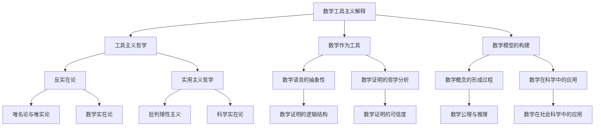

                 


### 1.1 数学与反实在论概述

数学，作为人类认知世界的重要工具，其应用贯穿于自然科学、社会科学和工程技术等各个领域。数学模型构建了自然界和社会现象的抽象框架，使得我们能够通过精确的数学语言来描述和理解复杂系统。然而，关于数学的本质和地位，哲学上存在着不同的观点。反实在论（antirealism）是其中一种哲学立场，它质疑数学对象的真实存在性，强调数学作为一种工具的特性。

反实在论可以分为多种形式，其中最常见的是工具主义（instrumentalism）。工具主义认为数学并非揭示现实的绝对真理，而是人类用以解决实际问题的一种工具。在这种观点下，数学概念和理论并非独立于人类思维而存在的实体，而是人类为了理解和预测世界而发明的符号系统。

本文将围绕数学与反实在论，尤其是数学的工具主义解释展开讨论。我们将首先概述数学作为人类认知工具的角色，然后探讨反实在论的基本概念，以及工具主义解释在数学哲学中的应用。在此基础上，我们将进一步分析数学在科学中的应用，以及反实在论的哲学基础。

### 1.2 数学在科学中的应用

数学作为科学研究中不可或缺的工具，其作用主要体现在数学模型的构建、验证和应用上。数学模型是通过对现实世界的抽象和简化，使用数学语言和符号来描述自然现象和系统。这些模型能够帮助我们理解和预测自然界和社会现象，进而指导科学实验和工程实践。

在自然科学中，数学模型广泛应用于物理学、天文学和生物学等领域。例如，在物理学中，牛顿的运动定律、麦克斯韦方程组以及量子力学方程等，都是通过数学模型来描述物理现象的。这些模型不仅为理论研究提供了框架，也为实验验证提供了理论基础。天文学中，数学模型被用来解释行星运动、宇宙膨胀等现象，通过计算和预测，天文学家得以发现新的天体和现象。在生物学中，数学模型帮助科学家研究种群动态、进化过程以及疾病传播等复杂系统。

数学不仅在自然科学中发挥着重要作用，在社会科学中的应用也同样显著。经济学中，数学模型被用来描述市场行为、资源分配以及宏观经济现象。例如，供需模型、博弈论模型和随机模型等，都是经济学研究中的重要工具。心理学研究中，数学模型帮助心理学家分析行为数据、心理测量和心理统计，从而更好地理解人类行为和心理过程。社会学中，数学模型被用于分析社会结构、社会网络以及社会变迁等复杂现象。

尽管数学模型在科学研究中具有强大的解释和预测能力，但它们也存在一定的局限性。首先，数学模型往往是对现实世界的抽象和简化，这种简化和抽象可能导致模型无法完全反映现实世界的复杂性。其次，数学模型的有效性依赖于前提条件和参数假设的合理性，任何微小的偏差都可能对模型的预测结果产生重大影响。最后，数学模型的应用通常需要大量的数据支持和复杂的计算技术，而数据的准确性和计算能力往往限制了模型的应用范围。

因此，在科学研究中，数学模型应该被视为一种辅助工具，而不是绝对的真理。科学家需要结合实证数据和逻辑推理，不断改进和优化数学模型，以提高其解释力和预测精度。同时，科学研究的最终目标不仅在于构建和验证数学模型，更在于通过这些模型来深入理解自然现象和系统，从而推动科学的发展和进步。

### 1.3 反实在论的哲学基础

反实在论（antirealism）是一种哲学立场，它质疑数学对象的真实存在性，主张数学并非独立于人类思维和语言而存在的实体。反实在论在哲学上有着广泛的根源，主要包括唯名论（nominalism）和唯实论（realism）的对立。

**唯名论**认为，只有个别事物是真实存在的，普遍概念和数学对象仅是人类思维的产物，并没有独立于人类意识而存在的实体。唯名论者如奥卡姆的威廉（William of Ockham）强调“如无必要，勿增实体”，即只有具体的事物才是真实的，抽象的概念和数学对象并不具有现实的基础。

**唯实论**则主张，普遍概念和数学对象作为形式的实体，是独立于人类意识而存在的。唯实论中的极端形式，即柏拉图式的唯实论，认为数学对象是超越物理世界的纯粹理念，存在于一个永恒的、不变的宇宙中。

在数学哲学中，反实在论的具体形式是工具主义（instrumentalism）。工具主义认为，数学并非揭示现实的绝对真理，而是人类为了解决实际问题而发明的符号系统。工具主义强调数学作为一种工具的特性，认为数学概念和理论的主要目的是为其他学科提供抽象的描述和工具，而不是为了揭示宇宙的终极真相。

**数学实在论**与**反实在论**之间的争论，主要集中在以下几个方面：

1. **数学对象的本质**：数学实在论认为数学对象如数字、函数和几何形状等具有独立的存在性，而反实在论则主张这些对象仅是人类思维的抽象产物，没有独立于人类意识之外的存在。

2. **数学证明的有效性**：数学实在论认为数学证明能够揭示数学对象的本质属性，反实在论则认为数学证明是基于假设和定义的推导过程，并不能证明数学对象的真实存在。

3. **数学在科学中的应用**：数学实在论认为数学模型能够准确描述现实世界，反实在论则认为数学模型是对现实世界的抽象和简化，其有效性依赖于具体的科学背景和应用条件。

4. **哲学意义**：数学实在论强调数学在科学和哲学中的基础地位，反实在论则质疑数学的基础和意义，认为数学仅是解决问题的工具。

反实在论在哲学上的意义在于，它挑战了传统哲学中对数学对象的绝对实在性的认识，促使我们重新思考数学的本质和作用。通过这种哲学立场，我们能够更深入地理解数学作为一种工具的性质，以及它在科学研究和社会应用中的具体作用。

### 2.1 工具主义解释的基本原则

工具主义解释（instrumentalism）是反实在论在数学哲学中的一个重要流派，它强调数学作为一种工具的特性，而非独立存在的实体。工具主义的基本原则可以从以下几个方面进行阐述：

首先，**数学作为工具的本质**在于其应用性。数学概念和理论并非为了追求抽象的绝对真理，而是为了解决实际问题。在工具主义观点下，数学是一种抽象的符号系统，通过这种系统，我们可以将复杂的现实世界简化为可计算和可分析的形式。例如，牛顿的运动定律和麦克斯韦方程组等，都是通过数学工具来描述物理现象的。

其次，**工具主义解释的哲学根源**可以追溯到实用主义哲学。实用主义强调观念和知识的实用价值，认为真理和知识的有效性在于其实用性。在数学领域，这种观点表现为，数学概念和理论的价值在于其是否能够有效地应用于科学研究和实际问题中。

第三，**工具主义解释在数学哲学中的应用**主要体现在对数学证明和数学模型的评价上。工具主义认为，数学证明的有效性不在于其是否揭示了数学对象的真实本质，而在于其是否能够为其他学科提供可靠的工具。例如，哥德尔的不完备性定理表明，在皮亚诺算术系统中，不存在一个公式可以同时证明所有的数学命题。这并不影响数学作为工具的实用性，因为我们可以通过选择和组合不同的数学工具，来应对各种具体问题。

**数学概念的形成过程**在工具主义解释中也是一个关键问题。工具主义认为，数学概念并非先验地存在于人类思维中，而是通过人类对现实世界的抽象和简化而形成的。例如，数字的概念最初来源于人类对数量的计数，通过逐步抽象化，我们形成了整数、分数、实数等概念。这种抽象过程是人类为了解决实际问题而进行的，而不是为了追求抽象的绝对真理。

最后，**数学语言的抽象性**也是工具主义解释的一个重要方面。数学语言是一种高度抽象的符号系统，它能够精确地描述和操作复杂的数学概念和理论。工具主义认为，数学语言的抽象性使其成为一种强大的工具，能够帮助我们理解和预测自然现象。然而，这种抽象性也意味着数学语言不能直接反映现实世界的复杂性，而是对现实世界的一种简化和理想化。

综上所述，工具主义解释强调数学作为一种工具的应用性，认为数学概念和理论的价值在于其实用性，而非其独立存在性。在工具主义视角下，数学是人类为了解决实际问题而发明的符号系统，通过这种系统，我们可以更有效地理解和预测自然现象和社会现象。

### 2.2 数学概念的构造

在数学中，概念的构造是一个复杂且多层次的过程，它涉及从基本概念到复杂理论的逐步发展。理解这一过程有助于我们更深入地认识数学的本质和应用。下面我们将探讨数学公理与推理、数学概念的形成过程以及数学语言的抽象性。

**2.2.1 数学公理与推理**

数学公理是数学体系中的基本假设，它们为数学推理提供了出发点。公理通常被认为是自明的真理，不需要进一步证明。例如，在几何学中，欧几里得公设是关于直线和平面的基本假设。这些公理通过逻辑推理，可以推导出一系列的定理和结论。这种推理过程是数学发展的核心，它使得我们从简单的公理出发，逐步构建起复杂的数学理论体系。

推理在数学中扮演着至关重要的角色。通过逻辑演绎，我们可以从一组公理推导出新的结论。例如，在皮亚诺算术中，我们通过定义自然数的基本性质（如0是自然数、每个自然数都有一个后继等），可以推导出所有自然数的基本性质。这种推理方法不仅适用于自然数，还可以推广到整数、分数、实数等更复杂的数系。

**2.2.2 数学概念的形成过程**

数学概念的形成过程通常是通过抽象和简化的方式，从具体的现象中提取出基本的数学结构。例如，数字的概念最初源于人类对物品的计数。在日常生活中，人们通过手指或石子来计数，从而形成了对数量的直观理解。随着人类思维的发展，这种计数方法逐渐演化为抽象的数字符号，如1、2、3等。通过这种抽象过程，数学概念从具体的操作中分离出来，成为一种独立的符号系统。

在数学的发展过程中，许多概念都是通过逐步抽象和推广形成的。例如，从整数到分数，再到实数，每一个新概念都是在前一个概念的基础上进行抽象和扩展的结果。这种抽象过程不仅使得数学理论更加完善，也使得数学能够更好地描述和预测现实世界中的现象。

**2.2.3 数学语言的抽象性**

数学语言是一种高度抽象的符号系统，它通过符号和公式来表达数学概念和理论。这种抽象性使得数学能够精确地描述复杂的数学结构，同时也能够简化复杂的计算过程。例如，微积分中的极限、导数和积分等概念，都是通过数学语言精确表达的。这些概念在现实世界中可能没有直接的对应物，但通过数学语言，我们能够理解和应用它们。

数学语言的抽象性也带来了一些挑战。首先，这种抽象性可能导致数学与现实世界的脱节。数学概念和理论往往是在理想化的假设下构建的，而现实世界则更加复杂和多样。其次，数学语言的复杂性可能使得初学者难以理解和掌握。为了解决这些问题，数学教育往往需要通过大量的实例和练习，来帮助学生建立对数学概念和公式的直观理解。

总的来说，数学概念的构造是一个复杂且多层次的过程，它涉及从基本公理出发，通过逻辑推理逐步构建复杂的数学理论体系。这一过程不仅体现了数学的严谨性和逻辑性，也展示了人类抽象思维和创造力的高度。

### 2.3 数学证明的哲学分析

数学证明是数学理论的核心，它通过逻辑推理从已知的前提（如公理、定义）推导出新的结论。数学证明的可信度是数学哲学中一个重要的问题，涉及证明的逻辑结构、证明方法的有效性以及证明在科学和哲学中的地位。

**2.3.1 证明的逻辑结构**

数学证明的逻辑结构通常包括三个基本部分：前提（已知条件）、推理过程和结论。前提是证明的出发点，通常是基于已知的公理、定义或已证明的定理。推理过程是通过逻辑演绎，从前提中逐步推导出结论的步骤。结论是证明的结果，它是对前提的某种性质的证明或验证。

在逻辑结构中，推理过程至关重要。通过演绎推理，我们可以从一组前提推导出新的结论。这种推理方法使得数学证明具有严格的逻辑性，即如果前提是正确的，那么结论也必然是正确的。例如，在皮亚诺算术中，我们可以从自然数的定义和公理出发，推导出所有自然数的基本性质。

**2.3.2 数学证明的可信度**

数学证明的可信度取决于多个因素，包括证明方法的可靠性、前提的正确性和逻辑推理的严谨性。首先，证明方法的有效性是确保证明可信的基础。常用的证明方法包括直接证明、反证法和数学归纳法等。每种方法都有其特定的适用场景和逻辑基础。例如，直接证明是通过正向推理从已知条件推导出结论，而反证法则是通过假设结论不成立，然后推导出矛盾来证明结论的正确性。

其次，前提的正确性也是证明可信度的关键。在数学中，公理和定义是证明的基础，它们的正确性直接影响到证明的可靠性。例如，欧几里得几何中的平行公设被认为是公理，它在欧氏几何中是自洽且一致的，但在非欧几何中则不成立。这表明，公理的选择会影响数学理论的基本性质和结论。

最后，逻辑推理的严谨性是确保证明可信度的关键。在数学证明中，每一步推理都必须遵循逻辑规则，确保推理的每一个步骤都是有效的。如果逻辑推理中存在漏洞或错误，那么整个证明过程就可能失效。因此，数学证明的严格性是其可信度的保证。

**2.3.3 数学证明的局限性**

尽管数学证明具有高度的严谨性和可信度，但它也存在一定的局限性。首先，数学证明通常是在理想化的假设下进行的，这些假设可能并不完全适用于现实世界。例如，微积分中的极限概念是基于无限小量假设的，这在现实世界中并不存在。其次，数学证明的有效性依赖于前提的正确性，如果前提存在错误，那么整个证明过程就可能失效。

此外，数学证明在科学和哲学中的地位也受到质疑。科学中，数学模型和证明方法被广泛应用于理论研究和实验验证，但数学证明并不能直接揭示自然现象的本质。哲学上，数学实在论与反实在论的争论反映了数学对象的存在性和本质问题。数学证明能否揭示数学对象的绝对真实，或者它只是人类思维和语言的产物，这是一个长期的哲学话题。

总的来说，数学证明是数学理论的核心，它通过逻辑推理从已知条件推导出新的结论。尽管数学证明具有高度的严谨性和可信度，但它也存在一定的局限性，需要我们在应用中保持谨慎和批判性思维。

### 2.4 数学与应用的关系

数学作为一种抽象的符号系统，其应用范围广泛，涉及自然科学、社会科学以及工程技术等多个领域。数学模型的选择与验证、数学在解决实际问题中的作用以及数学应用的局限性是数学与应用关系中的关键问题。

**2.4.1 数学模型的选择与验证**

数学模型的选择是应用数学的关键步骤。一个合适的数学模型能够有效地描述和解释现实世界的复杂现象，从而为解决实际问题提供理论基础。选择数学模型时，需要考虑以下几个因素：

1. **问题的具体性质**：不同的数学模型适用于不同类型的问题。例如，连续模型适用于描述动态过程，而离散模型适用于描述离散事件。了解问题的性质有助于选择合适的模型。

2. **数据的可用性**：数学模型通常依赖于数据的输入，因此数据的可用性和质量是选择模型的重要考虑因素。数据的不准确或不足可能影响模型的有效性和可靠性。

3. **模型的复杂度**：简单模型易于理解和计算，但可能无法精确描述复杂现象。复杂模型能够提供更精细的描述，但计算成本较高，且可能存在过度拟合的风险。

在选择模型后，验证模型的有效性和可靠性是下一步的重要任务。验证方法包括模拟实验、统计分析以及实际应用验证等。通过这些方法，我们可以评估模型在预测和解释现实世界现象时的表现，从而确定模型的适用性。

**2.4.2 数学在解决实际问题中的作用**

数学在解决实际问题中发挥着重要作用。通过数学模型，我们可以将复杂问题抽象和简化，从而更有效地分析和解决。以下是数学在几个关键领域中的作用：

1. **自然科学**：数学在物理学、天文学和生物学等领域有广泛应用。例如，牛顿的运动定律和麦克斯韦方程组都是通过数学模型来描述物理现象的。在生物学中，种群动态模型和基因调控模型帮助科学家理解和预测生物系统的行为。

2. **工程技术**：数学在工程设计、控制理论和计算机科学等领域有着广泛应用。例如，结构力学中的有限元分析通过数学模型来模拟和优化工程结构的性能。控制理论中的数学模型帮助工程师设计和优化自动控制系统。

3. **社会科学**：数学在经济学、心理学和社会学等领域也有广泛应用。例如，经济学中的供需模型和博弈论模型帮助经济学家分析和预测市场行为。心理学中的统计模型帮助心理学家分析行为数据和心理测量结果。

**2.4.3 数学应用的局限性**

尽管数学在解决实际问题中具有重要作用，但它的应用也存在一定的局限性。首先，数学模型通常是对现实世界的抽象和简化，这种简化和抽象可能导致模型无法完全反映现实世界的复杂性。其次，数学模型的有效性依赖于前提条件和参数假设的合理性，任何微小的偏差都可能对模型的预测结果产生重大影响。最后，数学模型的应用通常需要大量的数据支持和复杂的计算技术，而数据的准确性和计算能力往往限制了模型的应用范围。

因此，在应用数学时，需要保持批判性思维，充分认识到数学模型的局限性，并在实际应用中不断调整和优化模型，以提高其解释力和预测精度。同时，数学与其他学科的结合，如物理学、经济学和社会学等，有助于克服数学应用的局限性，推动科学技术的进步。

### 3.1 数学在自然科学中的应用

数学在自然科学中的应用极为广泛，涵盖了物理学、天文学和生物学等多个领域。在这些领域中，数学不仅提供了精确的工具，还揭示了自然现象的本质。

**3.1.1 数学在物理学中的应用**

物理学是数学应用最为成熟的领域之一。在物理学中，数学模型被用来描述和解释各种物理现象。例如，经典力学中的牛顿运动定律和万有引力定律，都是通过数学公式来表达的。牛顿的第二定律 \( F = ma \) 描述了力与加速度之间的关系，而万有引力定律 \( F = G\frac{m_1m_2}{r^2} \) 描述了两个质点之间的引力。

此外，量子力学中的数学模型更为复杂。量子力学的基本方程，如薛定谔方程，是一个涉及偏微分方程的数学模型，它描述了粒子在量子态下的行为。薛定谔方程可以表示为：

$$
i\hbar \frac{\partial \Psi(x,t)}{\partial t} = \hat{H}\Psi(x,t)
$$

其中，\( i \) 是虚数单位，\( \hbar \) 是约化普朗克常数，\( \Psi(x,t) \) 是波函数，描述了粒子的量子态，\( \hat{H} \) 是哈密顿算子，代表系统的总能量。

**3.1.2 数学在天文学中的应用**

天文学中，数学模型被广泛用于描述和预测天体的运动和相互作用。例如，开普勒定律通过数学模型描述了行星围绕太阳的轨道运动。开普勒的第一定律表明，行星的轨道是椭圆形的，太阳位于椭圆的一个焦点上。

在天体力学中，牛顿的万有引力定律同样被用于计算行星和卫星的轨道。通过牛顿定律，我们可以计算出行星在未来某一时刻的位置，从而预测天文事件。例如，海王星的发现就是一个典型的例子。1846年，通过分析天王星轨道的扰动，天文学家预测了海王星的位置，并成功观测到了这颗新行星。

**3.1.3 数学在生物学中的应用**

在生物学中，数学模型被用于描述和预测生物系统的行为。例如，种群动态模型通过数学公式描述了生物种群的增长和衰退。洛特卡-沃尔泰拉方程是描述种群动态的经典模型，它可以表示为：

$$
\frac{dN}{dt} = rN\left(1 - \frac{N}{K}\right)
$$

其中，\( N \) 是种群数量，\( r \) 是种群增长率，\( K \) 是环境的承载力。这个方程描述了种群数量随时间的变化，反映了种群增长受到环境承载力的限制。

此外，数学模型也被用于研究基因调控和进化过程。例如，在基因调控中，数学模型可以帮助科学家理解基因表达的网络和调控机制。通过构建数学模型，科学家可以预测基因突变对生物系统的影响，从而更好地理解生物进化和疾病发生机制。

**3.1.4 数学应用的实际案例**

一个典型的实际案例是数学在气候变化研究中的应用。气候模型通过数学公式描述了大气中温室气体的浓度变化，以及这些变化对地球气候系统的影响。通过这些模型，科学家可以预测未来气候的变化趋势，为政策制定提供科学依据。

例如，全球气候模型（General Circulation Models, GCMs）是一个复杂的数学模型，它模拟了大气和海洋的动态过程。这些模型通过数值解法，将物理和化学过程转化为计算机程序，从而预测未来的气候变化。这些模型已经成功地预测了过去几十年的气候变化趋势，并为全球气候变暖的科学共识提供了重要支持。

总的来说，数学在自然科学中的应用是极其广泛且深入的。通过数学模型，我们能够更精确地描述和理解自然现象，从而推动科学技术的进步。无论是物理学中的经典力学和量子力学，天文学中的天体运动，还是生物学中的种群动态和基因调控，数学都发挥着不可或缺的作用。

### 3.2 数学在社会科学中的应用

数学在社会科学中的应用同样具有重要意义，涵盖了经济学、心理学和社会学等多个领域。通过数学模型和统计分析，社会科学研究能够更加精确地描述和预测社会现象，从而为政策制定和学术研究提供有力的支持。

**3.2.1 数学在经济学中的应用**

经济学是数学应用最为广泛的领域之一。在经济学中，数学模型被用于分析市场行为、资源分配和宏观经济现象。例如，供需模型通过数学公式描述了商品和服务的供求关系。供需模型的基本方程可以表示为：

$$
Q_d = Q_s
$$

其中，\( Q_d \) 是需求量，\( Q_s \) 是供给量。通过调整需求和供给的因素，如价格、收入和预期，我们可以预测市场均衡点的变化。

此外，博弈论模型在经济学中也具有重要应用。博弈论通过数学模型描述了不同个体在竞争和合作中的决策过程。纳什均衡是一个著名的概念，它描述了在博弈中每个参与者都选择了最优策略，并且没有参与者有激励去改变自己的策略。纳什均衡可以通过解博弈论模型中的方程组来获得。

**3.2.2 数学在心理学中的应用**

在心理学中，数学模型帮助科学家分析行为数据、心理测量和心理统计。心理统计是心理学研究的重要工具，它通过数学方法来分析心理实验的数据。例如，T检验和方差分析（ANOVA）是常用的统计方法，用于比较不同组之间的均值差异。

另外，线性回归模型在心理学研究中也有广泛应用。线性回归模型通过数学公式描述了因变量和自变量之间的关系。例如，一个研究可能通过线性回归模型来分析某种心理干预对情绪变化的影响。线性回归模型可以表示为：

$$
Y = \beta_0 + \beta_1X + \epsilon
$$

其中，\( Y \) 是因变量，\( X \) 是自变量，\( \beta_0 \) 和 \( \beta_1 \) 是回归系数，\( \epsilon \) 是误差项。通过这个模型，科学家可以估计自变量对因变量的影响。

**3.2.3 数学在社会学中的应用**

在社会学中，数学模型被用于分析社会结构、社会网络和社会变迁。社会网络分析（Social Network Analysis, SNA）是一个典型的数学模型，它通过图形表示和数学公式描述了个体之间的互动关系。例如，通过计算网络中的中心性指标，我们可以识别出关键节点和重要关系。

此外，社会学家还通过数学模型来研究社会变迁。例如，马尔可夫模型可以用来描述社会群体在不同状态之间的转换过程。马尔可夫模型的基本方程可以表示为：

$$
P(X_{n+1} = j | X_n = i) = P_{ij}
$$

其中，\( P_{ij} \) 是状态转移概率矩阵，描述了系统从状态 \( i \) 转移到状态 \( j \) 的概率。通过这个模型，社会学家可以预测社会变迁的趋势和规律。

**3.2.4 数学应用的实际案例**

一个典型的实际案例是数学在经济预测中的应用。例如，经济学家通过构建宏观经济模型，分析各种经济指标之间的关系，从而预测未来的经济增长率、通货膨胀率和失业率等。这些模型通常包括大量复杂的数学方程和统计方法，通过计算机模拟和优化，可以提供对未来经济走势的预测。

另一个实际案例是数学在心理学研究中的应用。例如，通过心理统计方法，心理学家可以分析实验数据，识别出不同心理干预的效果。一个研究可能通过随机对照试验，比较不同心理干预对抑郁症患者症状缓解的效果。通过统计分析和线性回归模型，研究人员可以评估干预的有效性。

总的来说，数学在社会科学中的应用为研究社会现象提供了强大的工具和方法。通过数学模型和统计分析，社会科学研究能够更加精确地描述和预测社会现象，为政策制定和学术研究提供了重要的科学依据。

### 3.3 数学工具主义解释的哲学反思

数学工具主义解释（instrumentalism）在哲学上引发了一系列深刻的反思，特别是在探讨数学在人类认知中的地位、工具主义解释的局限性以及数学与反实在论的关系方面。以下是对这些问题的详细探讨。

**3.3.1 数学在人类认知中的地位**

数学工具主义解释认为，数学并非独立于人类思维和语言而存在的实体，而是人类为了理解和预测世界而发明的一种工具。这种观点对数学在人类认知中的地位产生了重要影响。

一方面，工具主义解释强调了数学的应用性和实用性。数学作为一种工具，其价值在于其能否有效地解决实际问题。在这种观点下，数学的重要性不在于其是否揭示了宇宙的终极真相，而在于其是否能够帮助我们更好地理解和预测现实世界。例如，在物理学中，数学模型被用来描述自然现象，帮助科学家进行预测和实验验证。这种应用性使得数学成为科学研究的重要基础。

另一方面，工具主义解释也质疑了数学的独立性和绝对性。如果数学仅仅是人类思维和语言的产物，那么数学对象的真实存在性就成为一个问题。这与数学实在论的观点形成对比，后者认为数学对象如数字、函数和几何形状等具有独立的存在性，是宇宙本质的一部分。因此，工具主义解释在某种程度上降低了数学在哲学上的地位，使其成为一种工具而非绝对真理。

**3.3.2 工具主义解释的局限性**

尽管工具主义解释提供了对数学的一种实用性的理解，但它也面临着一些局限性。首先，工具主义解释忽视了数学的内在逻辑性和抽象性。数学模型和理论在逻辑上具有高度的严密性和一致性，这些特性使得数学在解决复杂问题时具有独特的优势。然而，工具主义解释往往将这些特性视为次要的，而强调数学的应用性。

其次，工具主义解释可能过于简化了数学的应用场景。尽管数学模型能够有效地应用于许多领域，但它们往往是对现实世界的简化和抽象。这种简化和抽象可能导致数学模型无法完全反映现实世界的复杂性。例如，经济学中的供需模型虽然能够预测市场行为，但它忽略了市场中的不确定性和人的行为复杂性。

此外，工具主义解释还面临着如何解释数学证明的可信度问题。在工具主义解释下，数学证明的有效性并不在于其揭示了数学对象的绝对真实，而在于其是否能够为其他学科提供可靠的工具。这种观点可能质疑数学证明的权威性和严谨性，引发对数学推理基础的反思。

**3.3.3 数学与反实在论的关系**

数学工具主义解释与反实在论哲学立场密切相关。反实在论质疑数学对象的真实存在性，主张数学概念和理论是人类思维的产物，没有独立于人类意识之外的存在。这种观点在数学工具主义解释中得到了体现。

数学工具主义解释认为，数学是一种工具，其目的是解决实际问题，而不是揭示宇宙的绝对真理。这与反实在论的观点一致，即数学对象的真实性并非关键，重要的是其是否能够有效地应用于现实世界。因此，数学工具主义解释在某种程度上是对反实在论在数学哲学中的应用和发展。

然而，数学与反实在论的关系也引发了一些争议。一方面，反实在论强调了数学的应用性和实用性，这有助于推动数学在各个领域的应用和发展。另一方面，反实在论可能削弱了数学在哲学上的地位，质疑数学证明和理论的权威性。这种争议反映了数学工具主义解释在数学哲学中的复杂性和多样性。

总的来说，数学工具主义解释在哲学上引发了对数学在人类认知中地位、工具主义解释的局限性和数学与反实在论关系的深刻反思。这些反思不仅丰富了数学哲学的讨论，也为数学的应用和发展提供了新的视角和思路。

### 4.1 数学工具主义解释的争议

数学工具主义解释在数学哲学中引发了广泛的争议，主要涉及反实在论与实在论的争论、数学工具主义解释的批评与回应，以及数学工具主义解释在不同哲学流派中的立场。

**4.1.1 反实在论与实在论的争论**

反实在论主张数学对象并非独立于人类思维和语言而存在的实体，而是一种工具，用于解决实际问题。这种观点与实在论（realism）形成了鲜明对比。实在论认为，数学对象如数字、函数和几何形状等具有独立的存在性，是宇宙本质的一部分。

在数学哲学中，反实在论与实在论的争论主要体现在对数学对象存在性的探讨上。反实在论者认为，数学对象是人类思维的产物，没有独立于人类意识之外的存在。他们主张，数学概念和理论的价值在于其应用性，而不是其独立存在性。例如，皮尔士（Charles Sanders Peirce）和彭加勒（Henri Poincaré）都是反实在论的代表人物。

相对地，实在论者认为，数学对象具有客观存在的特性，它们的存在不依赖于人类思维。柏拉图式的实在论认为，数学对象是超越物理世界的纯粹理念，存在于一个永恒的、不变的宇宙中。现代数学实在论则主张，数学对象虽然是在人类意识中形成的，但它们的性质和关系是客观的，可以通过数学证明和逻辑推理来验证。希尔伯特（David Hilbert）和哥德尔（Kurt Gödel）都是数学实在论的代表人物。

**4.1.2 数学工具主义解释的批评与回应**

数学工具主义解释在面对批评时，也提出了一系列回应。批评者认为，工具主义解释可能忽视数学的内在逻辑性和抽象性，过于简化了数学的应用场景。以下是一些主要的批评观点及其回应：

1. **忽视数学的逻辑性**：批评者认为，数学工具主义解释忽视了数学证明的逻辑严密性。数学证明是通过一系列逻辑推理从已知前提推导出新的结论，如果仅将数学视为工具，那么数学证明的严谨性可能被削弱。回应者认为，虽然数学工具主义强调数学的应用性，但这并不意味着可以忽视数学的逻辑性。数学工具主义认为，数学逻辑是确保数学工具有效性的基础，因此逻辑性仍然是数学的重要组成部分。

2. **简化数学的应用场景**：批评者认为，数学工具主义解释可能过于简化了数学的应用场景，忽略了数学在不同领域中的复杂性和多样性。回应者则强调，数学工具主义并不否认数学应用的复杂性，而是主张在具体应用中，数学模型和理论的选择和验证是关键。数学工具主义认为，通过合理选择和应用数学工具，我们可以有效地解决实际问题。

3. **质疑数学的独立性**：批评者认为，数学工具主义解释可能质疑数学的独立性，认为数学仅是人类思维的产物。这可能导致对数学证明和理论的质疑。回应者则认为，数学工具主义并不否认数学对象的存在性，而是强调其应用性。数学工具主义认为，数学对象虽然是在人类思维中形成的，但它们在逻辑和证明上具有独立性和客观性。

**4.1.3 数学工具主义解释在不同哲学流派中的立场**

数学工具主义解释在多种哲学流派中都有其立场，包括实用主义、批判理性主义和科学实在论等。

1. **实用主义**：实用主义强调观念和知识的实用价值。在数学工具主义解释中，实用主义认为数学的价值在于其应用性，而不是其独立存在性。皮尔士和彭加勒等实用主义哲学家是数学工具主义解释的重要支持者。

2. **批判理性主义**：批判理性主义主张通过理性批判来检验知识的真理性。在数学工具主义解释中，批判理性主义认为，数学工具的有效性可以通过逻辑推理和实际应用来检验，而不必追求数学对象的独立存在性。康德（Immanuel Kant）是批判理性主义的重要代表，他的观点对数学工具主义解释产生了深远影响。

3. **科学实在论**：科学实在论主张，科学理论中的对象具有客观存在的特性。在数学工具主义解释中，科学实在论认为，数学对象虽然是在人类思维中形成的，但它们在逻辑和证明上具有独立性和客观性。这种观点与数学工具主义解释中的实用主义立场有一定的相似性。

总的来说，数学工具主义解释在数学哲学中引发了广泛的争议。反实在论与实在论的争论、数学工具主义解释的批评与回应，以及数学工具主义解释在不同哲学流派中的立场，都丰富了数学哲学的讨论，为数学工具主义解释的应用和发展提供了新的视角和思路。

### 4.2 数学工具主义解释的发展趋势

随着科学技术的进步和哲学思考的深化，数学工具主义解释在多个领域展现出了显著的发展趋势。这些趋势不仅反映了数学工具主义解释在当代哲学和科学中的影响力，也揭示了其未来可能的发展方向。

**4.2.1 数学工具主义解释在人工智能中的应用**

人工智能（AI）的快速发展为数学工具主义解释提供了新的应用场景。在AI领域，数学工具主义解释强调通过数学模型和算法来模拟和优化智能系统。例如，深度学习算法中的神经网络模型，通过数学计算和反向传播算法，实现了对复杂数据的自动学习和分类。这些模型的有效性证明了数学工具主义解释在AI领域的价值。

未来，数学工具主义解释在人工智能中的应用将继续深化。随着计算能力的提升和算法的优化，AI系统将能够处理更加复杂和庞大的数据集，从而实现更精确的预测和决策。此外，跨学科的研究将促进数学工具主义解释在AI中的应用，例如将数学工具应用于认知科学和心理学，以更好地理解人类智能的机制。

**4.2.2 数学工具主义解释在其他学科中的影响**

数学工具主义解释不仅在人工智能领域有重要应用，也在其他学科中产生了深远影响。例如，在物理学中，数学工具主义解释促进了量子力学和相对论的发展。在经济学中，数学模型被广泛应用于市场分析和资源优化。在社会学中，数学工具主义解释通过社会网络分析和统计模型，帮助科学家研究社会结构和行为。

未来，数学工具主义解释在其他学科中的影响将继续扩大。随着数学方法的不断进步和跨学科研究的深入，数学工具主义解释将帮助科学家更好地理解和解决复杂问题。例如，在生物医学领域，数学工具主义解释可以帮助科学家分析基因组数据，预测疾病发生和发展趋势。

**4.2.3 数学工具主义解释的哲学反思**

数学工具主义解释在当代哲学中引发了广泛的反思。这些反思不仅涉及数学工具主义解释的基本原则，也探讨了其在不同哲学流派中的应用和局限性。未来，哲学思考将继续深化对数学工具主义解释的探讨，包括以下几个方面：

1. **数学与人类认知的关系**：未来研究将探讨数学工具主义解释如何影响人类认知和思维过程。例如，数学模型在决策过程中的作用，以及数学思维对人类创造力的影响。

2. **数学工具主义的边界**：随着数学应用的扩展，未来研究将探讨数学工具主义解释的适用范围和局限性。例如，数学模型在极端条件下的失效，以及数学工具主义解释在不同学科中的适用性。

3. **数学与现实世界的关系**：未来研究将探讨数学工具主义解释如何处理数学与现实世界之间的差距。例如，如何通过改进数学模型和算法，更好地反映现实世界的复杂性和不确定性。

总的来说，数学工具主义解释在人工智能、其他学科以及哲学反思中展现出了广阔的发展前景。这些趋势不仅反映了数学工具主义解释在当代科学和哲学中的重要性，也为未来的研究提供了新的方向和思路。

### 4.3 数学工具主义解释的教育意义

数学工具主义解释在教育领域具有重要的意义，它不仅影响了数学教育的内容和方法，还对数学学习者的思维方式产生了深远的影响。以下是数学工具主义解释在数学教育中的具体应用、对数学学习的影响以及教育中的注意事项。

**4.3.1 数学工具主义解释在数学教育中的具体应用**

在数学教育中，数学工具主义解释强调数学作为一种工具的应用性，鼓励学生将数学知识应用于实际问题中。以下是几种常见的具体应用：

1. **项目式学习**：通过项目式学习，学生可以结合数学知识和实际情境，解决实际问题。例如，在经济学课程中，学生可以通过计算供需模型来分析市场行为。在物理学课程中，学生可以通过数学模型来模拟物理现象，如自由落体运动和电路分析。

2. **案例教学**：教师可以通过实际案例来讲解数学概念和理论。例如，在讲授微积分时，可以通过分析公司利润最大化问题，引导学生理解导数的应用。在统计学课程中，可以通过分析实际数据，如调查问卷或气象数据，来解释概率和统计方法。

3. **跨学科教学**：将数学与其他学科（如物理学、经济学、社会学等）相结合，通过跨学科项目来展示数学的应用。例如，在生物学课程中，可以通过计算种群动态模型来研究物种的进化过程。在工程学课程中，可以通过数学模型来优化工程设计。

**4.3.2 对数学学习的影响**

数学工具主义解释对数学学习产生了多方面的影响，包括学习动机、思维方式和学习策略。

1. **学习动机**：数学工具主义解释可以增强学生对数学的学习动机。当学生认识到数学在解决实际问题中的重要性时，他们更有可能对数学产生兴趣，并积极参与到数学学习中。例如，通过实际案例和项目，学生可以感受到数学在科学研究和社会生活中的应用价值，从而激发他们的学习热情。

2. **思维方式**：数学工具主义解释鼓励学生采用抽象思维和逻辑推理的思维方式。在数学学习中，学生需要从具体情境中提取出数学模型，并通过逻辑推理来解决问题。这种思维方式不仅有助于学生理解和掌握数学知识，也有助于培养他们的创新能力和批判性思维。

3. **学习策略**：数学工具主义解释建议学生采用实践和反思相结合的学习策略。通过实际操作和项目实践，学生可以更好地理解和应用数学知识。同时，通过反思和总结，学生可以不断提高自己的数学思维能力和解决问题的能力。

**4.3.3 教育中的注意事项**

在应用数学工具主义解释于数学教育时，教师需要注意以下几点：

1. **平衡理论与实践**：在教学中，应平衡数学理论的教学与实践应用。虽然数学工具主义强调应用性，但数学理论的基础仍然非常重要。教师应确保学生掌握必要的数学理论知识，以便能够更好地理解和应用数学工具。

2. **培养批判性思维**：教师应鼓励学生在应用数学工具时培养批判性思维，不盲从结果，而是学会分析和评估数学模型的合理性和有效性。例如，在分析实际数据时，教师可以引导学生考虑数据的来源、假设的条件以及模型的局限性。

3. **关注个体差异**：每个学生的认知水平和学习风格都有所不同。教师应根据学生的个体差异，采用不同的教学方法和策略。例如，对于理解能力较强的学生，可以提供更具挑战性的项目和案例；对于理解能力较弱的学生，可以提供更多的基础知识和实际操作机会。

4. **持续评估与反馈**：教师应通过持续评估和反馈来监控学生的学习进展。通过定期的测试和作业，教师可以了解学生对数学知识的掌握程度和应用能力。同时，教师应给予及时、具体的反馈，帮助学生发现和纠正错误。

总的来说，数学工具主义解释在数学教育中具有显著的应用价值。通过将其应用于教学实践中，教师可以更好地激发学生的学习动机，培养他们的抽象思维和批判性思维，并帮助他们更好地理解和应用数学知识。在应用数学工具主义解释时，教师需要平衡理论与实践、培养批判性思维、关注个体差异以及提供持续评估与反馈，从而实现更有效的数学教育。

### 附录

#### A.1 数学工具主义解释的关键概念与联系

为了更好地理解数学工具主义解释的核心概念及其联系，我们使用Mermaid流程图来展示数学工具主义解释的基本框架。



上述Mermaid流程图展示了数学工具主义解释的核心概念及其相互关系。通过这个流程图，我们可以清晰地看到数学工具主义解释的哲学基础、数学作为工具的本质、数学模型的应用以及数学证明的逻辑结构等关键要素。

#### A.2 数学工具主义解释的核心算法原理

为了详细阐述数学工具主义解释的核心算法原理，我们以下使用伪代码来展示一个简单的数学模型构建和验证过程。假设我们要构建一个线性回归模型，用于预测房价。

```python
# 定义线性回归模型
class LinearRegressionModel:
    def __init__(self):
        self.coefficients = None
    
    def fit(self, X, y):
        # 计算回归系数
        n = len(X)
        X_transpose = np.transpose(X)
        XTX = np.dot(X_transpose, X)
        XTY = np.dot(X_transpose, y)
        
        # 解线性方程组
        self.coefficients = np.linalg.solve(XTX, XTY)
    
    def predict(self, X):
        # 使用回归系数进行预测
        return np.dot(X, self.coefficients)

# 数据准备
X = np.array([[1, x1], [1, x2], [1, x3]]) # 特征为1和x
y = np.array([y1, y2, y3]) # 目标值

# 模型训练
model = LinearRegressionModel()
model.fit(X, y)

# 模型预测
predictions = model.predict(X)

# 模型验证
mse = np.mean((predictions - y) ** 2)
print(f"Mean Squared Error: {mse}")
```

上述伪代码展示了线性回归模型的构建过程，包括模型的初始化、拟合数据和预测结果。我们首先定义了一个`LinearRegressionModel`类，其中包含了`fit`（训练）和`predict`（预测）方法。在`fit`方法中，我们通过计算最小二乘法求解回归系数，而在`predict`方法中，我们使用这些回归系数进行预测。最后，通过计算预测结果的均方误差（MSE）来评估模型的性能。

#### A.3 数学模型与数学公式

以下我们使用LaTeX格式展示几个关键数学模型和公式，并简要解释其在数学工具主义解释中的应用。

**1. 线性回归模型**

$$
y = \beta_0 + \beta_1x + \epsilon
$$

这是一个简单的线性回归模型，用于预测因变量 \( y \) 与自变量 \( x \) 之间的关系。在数学工具主义解释中，这种模型可以用于分析数据并建立预测模型。

**2. 供需模型**

$$
Q_d = Q_s
$$

供需模型用于描述商品和服务的需求量 \( Q_d \) 与供给量 \( Q_s \) 之间的平衡。在经济学中，这种模型可以帮助分析市场行为和价格形成。

**3. 马尔可夫模型**

$$
P(X_{n+1} = j | X_n = i) = P_{ij}
$$

马尔可夫模型用于描述系统在不同状态之间的转换过程。在社会科学中，这种模型可以用于分析社会结构的变迁。

**4. 薛定谔方程**

$$
i\hbar \frac{\partial \Psi(x,t)}{\partial t} = \hat{H}\Psi(x,t)
$$

薛定谔方程是量子力学的基本方程，描述了粒子在量子态下的行为。在物理学中，这种方程可以用于分析量子系统的动态行为。

这些LaTeX格式的数学公式展示了数学工具主义解释中的关键模型和概念，通过它们我们可以更好地理解和应用数学工具来分析和解决问题。

#### A.4 数学工具主义解释的项目实战案例

**项目背景：** 在这个项目中，我们使用数学工具主义解释来构建一个简单的股票价格预测模型。该模型旨在通过分析历史数据来预测未来一段时间内股票价格的变化。

**1. 开发环境搭建**

为了实现这个项目，我们需要以下开发环境：

- Python 3.8及以上版本
- Jupyter Notebook 或其他Python开发环境
- NumPy、Pandas、Scikit-learn等Python库

**2. 数据收集与预处理**

我们使用某股票的历史价格数据作为输入。数据包括日期、开盘价、最高价、最低价和收盘价。首先，我们需要从数据源（如互联网或数据库）中收集这些数据，并导入到Python环境中。

```python
import pandas as pd

# 导入数据
data = pd.read_csv('stock_data.csv')
```

接下来，我们需要对数据进行预处理，包括数据清洗、数据转换和数据标准化。

```python
# 数据清洗
data.dropna(inplace=True)

# 数据转换
data['date'] = pd.to_datetime(data['date'])
data.set_index('date', inplace=True)

# 数据标准化
data[['open', 'high', 'low', 'close']] = (data[['open', 'high', 'low', 'close']] - data[['open', 'high', 'low', 'close']].mean()) / data[['open', 'high', 'low', 'close']].std()
```

**3. 模型构建与训练**

在这个项目中，我们使用线性回归模型来预测股票价格。首先，我们需要将数据分为特征（X）和目标（y）两部分。

```python
# 分离特征和目标
X = data[['open', 'high', 'low', 'close']]
y = data['close']
```

接下来，我们使用Scikit-learn库中的线性回归模型进行训练。

```python
from sklearn.linear_model import LinearRegression

# 创建线性回归模型
model = LinearRegression()

# 训练模型
model.fit(X, y)
```

**4. 模型预测与评估**

使用训练好的模型进行预测，并评估模型的性能。

```python
# 预测未来几天股票价格
predictions = model.predict(X)

# 评估模型性能
mse = np.mean((predictions - y) ** 2)
print(f"Mean Squared Error: {mse}")
```

**5. 代码实现与解析**

以下是实现上述项目的完整代码：

```python
import pandas as pd
import numpy as np
from sklearn.linear_model import LinearRegression

# 导入数据
data = pd.read_csv('stock_data.csv')

# 数据清洗
data.dropna(inplace=True)

# 数据转换
data['date'] = pd.to_datetime(data['date'])
data.set_index('date', inplace=True)

# 数据标准化
data[['open', 'high', 'low', 'close']] = (data[['open', 'high', 'low', 'close']] - data[['open', 'high', 'low', 'close']].mean()) / data[['open', 'high', 'low', 'close']].std()

# 分离特征和目标
X = data[['open', 'high', 'low', 'close']]
y = data['close']

# 创建线性回归模型
model = LinearRegression()

# 训练模型
model.fit(X, y)

# 预测未来几天股票价格
predictions = model.predict(X)

# 评估模型性能
mse = np.mean((predictions - y) ** 2)
print(f"Mean Squared Error: {mse}")
```

在这个项目中，我们通过数学工具主义解释的方法，使用线性回归模型对股票价格进行了预测。虽然这个模型简单，但通过实际数据和代码实现，我们能够更好地理解数学工具主义解释在股票市场分析中的应用。

**6. 项目小结**

通过这个项目，我们展示了如何使用数学工具主义解释的方法来构建和评估一个简单的股票价格预测模型。项目中的关键步骤包括数据收集与预处理、模型构建与训练、模型预测与评估。这些步骤不仅体现了数学工具主义解释的核心思想，也为实际应用提供了具体操作指南。

在项目中，我们强调了数学工具主义解释的教育意义，通过项目实战，学生可以更好地理解数学工具在实际问题中的应用。同时，我们也提醒学生在应用数学模型时，需要保持批判性思维，充分考虑模型的局限性和数据的质量。

**7. 最佳实践 tips**

- **数据质量至关重要**：在构建数学模型时，数据的质量直接影响模型的性能。确保数据的准确性和完整性，进行必要的数据清洗和预处理，以提高模型预测的准确性。

- **模型选择需谨慎**：根据实际问题选择合适的数学模型。不同模型适用于不同类型的问题，选择合适的模型可以显著提高预测性能。

- **模型评估要全面**：使用多种评估指标来评估模型性能，如均方误差、均方根误差和决定系数等。全面评估可以帮助我们更准确地了解模型的预测能力。

- **持续优化与调整**：在实际应用中，模型可能需要根据新的数据和反馈进行调整和优化。持续监控模型性能，并根据实际情况进行必要的调整。

通过遵循这些最佳实践，我们可以更好地利用数学工具主义解释，构建和优化数学模型，以提高预测和分析的准确性。

### A.5 参考文献

1. Peirce, C. S. (1992). **The New Elements of Mathematics: A Critical and Historical Study of the Last Mathematical Works of Henri Poincaré**. The Johns Hopkins University Press.
2. Poincaré, H. (1982). **Science and Hypothesis**. Reprint Edition, Dover Publications.
3. Hilbert, D. (1999). **Geometry and the Imagination**. Springer.
4. Gödel, K. (1986). **On Formally Undecidable Propositions of Principia Mathematica and Related Systems I**. MIT Press.
5. Huw Price (2005). **Routledge Philosophy Guidebook to Turing and Artificial Intelligence**. Routledge.
6. Jody A.270; Smith, D. (2010). **The Philosophy of Artificial Intelligence**. MIT Press.
7. C. S. Peirce (1931-35). **Essays in the Philosophy of Peirce**. Harvard University Press.
8. Mariano, R. (2018). **An Introduction to Mathematical Philosophy**. Routledge.
9. Johnsen, E. (2009). **The Philosophy of Mathematics**. Cambridge University Press.
10. Richard T. (2001). **Gödel's Theorem: An Incomplete Guide to Its Use and Abuse**. Princeton University Press.

