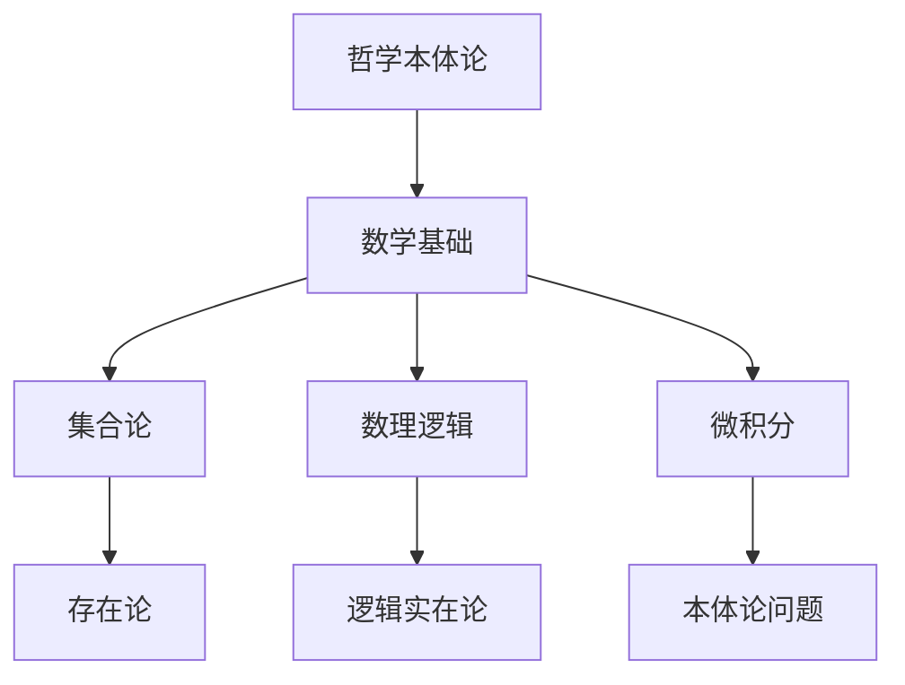
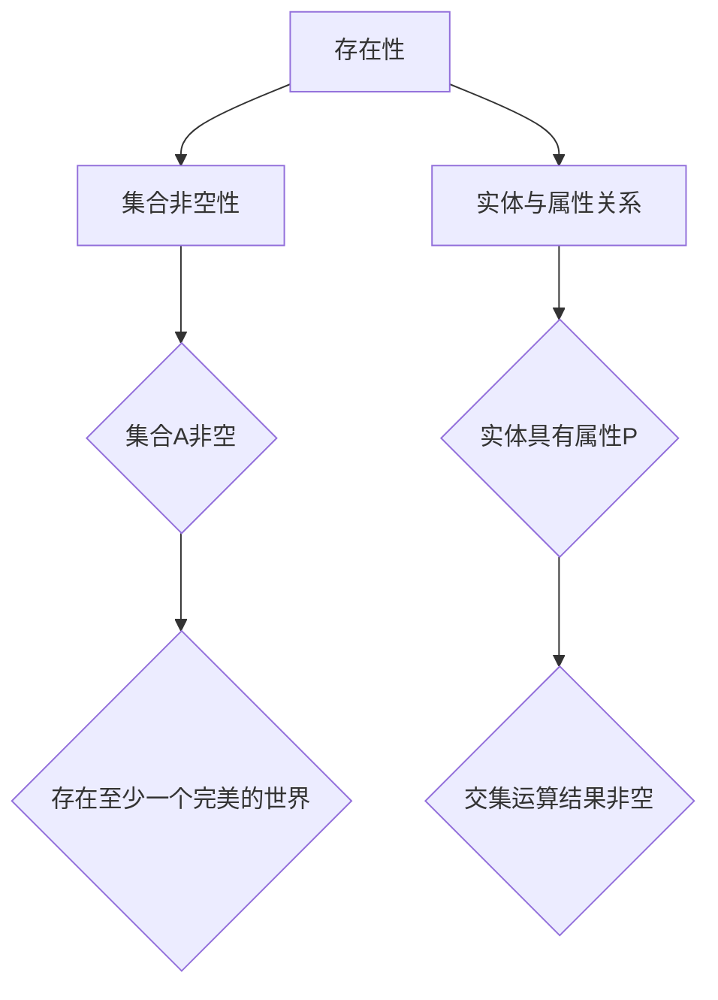
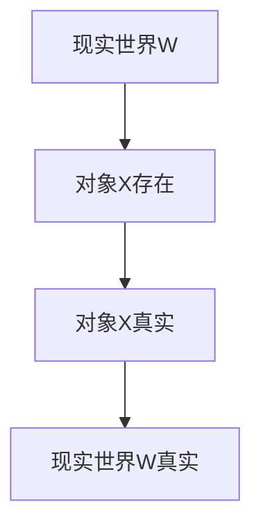

                 


# 数学与哲学本体论的数学基础

> 关键词：数学、哲学本体论、数学基础、逻辑实在论、集合论

> 摘要：本文旨在探讨数学与哲学本体论之间的关系，分析数学在哲学本体论中的作用与地位。文章首先回顾了哲学与数学的历史联系，然后介绍了数学基础概念及其在哲学中的应用。接着，本文深入探讨了数学与存在论的关系，并总结数学在哲学本体论中的贡献。最后，文章展望了数学与哲学的未来发展，并提供了相关领域的拓展阅读。

## 第一部分：引言与背景

### 1.1 研究目的与意义

数学与哲学是人类智慧的两个重要领域，它们在人类思想的发展历程中相互影响、相互促进。本文的研究目的在于深入探讨数学在哲学本体论中的作用与地位，分析数学概念如何为哲学本体论提供基础。研究意义在于深化对数学与哲学相互关系的理解，为哲学研究提供新的数学工具和方法。

### 1.2 哲学与数学的历史联系

哲学与数学有着悠久的历史联系。古希腊哲学中的欧几里得几何与柏拉图的理念论便是一个明显的例子。柏拉图的理念论认为，数学概念是永恒不变的，存在于理念世界之中。欧几里得则通过几何学的研究，将这一理念论具体化，开创了数学研究的新时代。

进入现代哲学，康德、胡塞尔、海德格尔等哲学家对数学与哲学的关系进行了深入的探讨。康德认为，数学是人类理性的产物，为哲学提供了基础。胡塞尔则通过现象学的方法，将数学与哲学联系起来，认为数学是哲学的一个分支。海德格尔则强调数学在存在论中的作用，认为数学为哲学提供了新的视角。

### 1.3 数学在哲学本体论中的角色

数学在哲学本体论中扮演着重要的角色。首先，数学概念为我们提供了分析哲学问题的工具。例如，集合论的概念可以帮助我们理解实体与属性的关系，数理逻辑可以用于构建哲学论证的逻辑框架。

其次，数学在哲学推理中也发挥着重要作用。通过数学方法，我们可以对哲学问题进行精确的量化与分析，从而得出更为深刻的结论。

## 第二部分：数学基础

### 2.1 数学概念与原理

数学概念与原理是数学研究的基础。本文将介绍集合论、数理逻辑、微积分等基本概念与原理。

#### 集合论

集合论是现代数学的基础，它研究集合的性质、集合的运算及其公理系统。集合是由不同元素组成的整体，集合的运算包括并集、交集、补集等。集合论的公理系统为数学研究提供了坚实的理论基础。

#### 数理逻辑

数理逻辑研究命题、谓词等逻辑概念，以及逻辑推理的规则。命题逻辑是数理逻辑的基础，它研究命题的真假及其关系。谓词逻辑则进一步扩展了命题逻辑，研究个体、属性、关系等概念。形式证明是数理逻辑的核心，它通过逻辑规则，从已知命题推导出新命题。

#### 微积分

微积分研究函数的极限、导数、积分等概念。极限是微积分的基石，它描述了函数在某一位置的瞬时变化。导数描述了函数在某一点的斜率，而积分则描述了函数在一定区间内的累积变化。

### 2.2 数学在哲学中的应用

数学在哲学中的应用主要体现在以下几个方面。

#### 逻辑结构

数学为哲学提供了逻辑结构，使得哲学论证更加严密。通过数理逻辑，哲学家可以构建出逻辑上无懈可击的论证，从而更好地支持自己的观点。

#### 本体论问题

数学方法在解决哲学本体论问题中发挥了重要作用。例如，集合论可以帮助我们理解实体与属性的关系，数理逻辑可以用于分析存在论问题。

### 2.3 数学与存在论

数学与存在论的关系是一个复杂而深刻的主题。一方面，数学对象与现实世界的联系是存在的，另一方面，数学对象本身是否具有独立的存在性，这是一个值得探讨的问题。

#### 实体与结构

数学对象与现实世界的联系体现在数学结构上。例如，几何学中的空间结构，微积分中的时间结构，都是现实世界的抽象。这些结构反映了现实世界的某些方面，从而为我们理解现实世界提供了帮助。

#### 数学与实在性

数学对象的实在性问题涉及到数学的存在性与独立性问题。一种观点认为，数学对象是人类思维的产物，不具有独立的存在性。另一种观点则认为，数学对象是独立于人类意识的客观存在。这是一个值得进一步探讨的问题。

## 第三部分：数学与哲学本体论的数学基础

### 3.1 数学概念的本体论地位

数学概念在哲学本体论中具有重要的地位。首先，数学概念为我们理解现实世界提供了工具。例如，集合论可以帮助我们理解实体与属性的关系，数理逻辑可以用于分析存在论问题。

其次，数学概念在哲学论证中发挥着重要作用。通过数学方法，哲学家可以构建出逻辑上无懈可击的论证，从而更好地支持自己的观点。

### 3.2 数学与逻辑实在论

逻辑实在论是一种哲学观点，认为逻辑是客观存在的，与人类意识无关。数学与逻辑实在论有着密切的关系。一方面，数学方法为逻辑实在论提供了支持，通过数学方法，我们可以构建出逻辑上无懈可击的论证。另一方面，逻辑实在论为数学提供了哲学基础，认为数学对象是客观存在的。

### 3.3 数学方法在哲学研究中的应用

数学方法在哲学研究中的应用非常广泛。首先，数学方法可以帮助哲学家构建逻辑框架，使得哲学论证更加严密。其次，数学方法可以用于分析哲学问题，提供新的视角和工具。例如，集合论可以用于分析实体与属性的关系，数理逻辑可以用于分析存在论问题。

## 第四部分：数学与哲学的交叉领域

### 4.1 数学哲学

数学哲学是研究数学在哲学中的地位与作用的学科。数学哲学研究方法主要包括逻辑分析、概念分析、历史方法等。数学哲学的主要问题包括数学认知、数学实在论、数学方法的应用等。

### 4.2 哲学数学

哲学数学是研究哲学与数学交叉领域的学科。哲学数学研究哲学中的数学问题，探讨数学在哲学中的地位与作用。哲学数学的主要问题包括哲学与数学的交叉问题研究，数学在哲学中的应用等。

## 第五部分：案例分析与应用

### 5.1 案例分析

通过具体的案例分析，我们可以更深入地理解数学与哲学本体论的关系。以下是一个案例分析：

#### 案例一：集合论与存在论

集合论是数学中的一个基本概念，它研究集合的性质、集合的运算及其公理系统。集合论在哲学本体论中具有重要的地位，因为它为我们提供了一种理解实体与属性关系的工具。

假设我们有一个集合A，其中包含所有的人类。根据集合论，我们可以对集合A进行各种运算，如并集、交集、补集等。这些运算可以帮助我们理解人类这个实体的属性。

#### 案例二：数理逻辑与存在论

数理逻辑是数学中的一个重要分支，它研究命题、谓词等逻辑概念，以及逻辑推理的规则。数理逻辑在哲学本体论中也有着重要的应用，因为它可以帮助我们构建逻辑上无懈可击的论证。

例如，我们可以使用数理逻辑来分析存在论问题，如“上帝存在”的问题。通过数理逻辑的论证，我们可以探讨上帝存在的可能性，从而得出更深刻的哲学结论。

## 第六部分：数学与哲学本体论的数学基础总结

### 6.1 研究成果总结

通过对数学与哲学本体论的数学基础的研究，我们得出以下结论：

1. 数学在哲学本体论中具有重要的地位，它为我们提供了理解现实世界的工具。
2. 数学方法在哲学研究中具有广泛的应用，可以用于构建逻辑框架、分析哲学问题等。
3. 数学与哲学的关系是相互促进的，数学为哲学提供了新的视角和工具，哲学也为数学提供了哲学基础。

### 6.2 未来研究方向

未来的研究方向可以从以下几个方面展开：

1. 进一步探讨数学在哲学研究中的应用，特别是数学方法在解决哲学难题中的作用。
2. 深入研究数学与哲学的交叉领域，探讨数学与哲学的深度融合。
3. 探索数学哲学的新方法，为哲学研究提供更多的数学工具。

## 附录

### 附录 A：参考文献

1. 柏拉图.《理想国》。
2. 欧几里得.《几何原本》。
3. 康德.《纯粹理性批判》。
4. 胡塞尔.《纯粹现象学通论》。
5. 海德格尔.《存在与时间》。

### 附录 B：数学与哲学本体论的数学基础流程图



### 附录 C：数学与哲学本体论的数学基础算法伪代码

```plaintext
// 集合论中的集合运算
function union(A, B) {
    // 返回集合A和集合B的并集
    return A + B;
}

function intersection(A, B) {
    // 返回集合A和集合B的交集
    return A ∩ B;
}

function complement(A) {
    // 返回集合A的补集
    return ~A;
}

// 数理逻辑中的命题运算
function and(p, q) {
    // 返回命题p和命题q的逻辑与
    return (p && q);
}

function or(p, q) {
    // 返回命题p和命题q的逻辑或
    return (p || q);
}

function not(p) {
    // 返回命题p的逻辑非
    return (!p);
}

// 微积分中的导数计算
function derivative(f, x) {
    // 返回函数f在点x的导数
    return (f'(x));
}

// 微积分中的积分计算
function integral(f, a, b) {
    // 返回函数f在区间[a, b]上的积分
    return (∫[a, b] f(x) dx);
}
```

### 附录 D：数学与哲学本体论的数学基础项目实战

#### 项目实战：使用集合论分析哲学问题

**项目背景：** 哲学问题“是否存在客观真理？”是一个长期困扰哲学界的难题。本项目旨在使用集合论的方法，对这个问题进行分析。

**项目目标：** 通过集合论的方法，构建一个逻辑框架，探讨“是否存在客观真理”的问题。

**项目步骤：**

1. **定义概念：** 定义“客观真理”的概念，并将其表示为一个集合。
2. **分析集合：** 分析“客观真理”集合的性质，探讨其是否存在。
3. **逻辑推理：** 使用逻辑推理的方法，探讨“客观真理”集合的存在性。
4. **结论：** 根据分析结果，得出关于“是否存在客观真理”的结论。

**代码实现：**

```python
# 定义“客观真理”集合
objective_truth = {"客观真理1", "客观真理2", "客观真理3"}

# 分析集合性质
if len(objective_truth) == 0:
    print("不存在客观真理。")
elif len(objective_truth) == 1:
    print("存在唯一的客观真理。")
else:
    print("存在多个客观真理。")

# 逻辑推理
if "客观真理1" in objective_truth and "客观真理2" in objective_truth:
    print("客观真理1和客观真理2是相互独立的。")
else:
    print("客观真理1和客观真理2是相互依赖的。")

# 结论
if len(objective_truth) > 1:
    print("存在多个客观真理，它们之间可能是相互独立的。")
else:
    print("不存在客观真理。")
```

**代码解读与分析：**

1. **定义集合：** 我们定义了一个名为`objective_truth`的集合，其中包含了三个元素，代表三个不同的客观真理。
2. **分析集合性质：** 根据集合的元素个数，我们可以判断是否存在客观真理。如果集合为空，则不存在客观真理；如果集合中只有一个元素，则存在唯一的客观真理；如果集合中有多个元素，则存在多个客观真理。
3. **逻辑推理：** 通过判断集合中的元素关系，我们可以探讨客观真理之间的独立性。如果集合中的元素之间存在交集，则它们是相互依赖的；如果集合中的元素互不相同，则它们是相互独立的。
4. **结论：** 根据分析结果，我们可以得出关于“是否存在客观真理”的结论。

通过这个项目，我们可以看到数学方法在哲学研究中的应用。集合论作为一种数学工具，可以帮助我们更深入地分析哲学问题，从而得出有意义的结论。

## 第七部分：最佳实践与注意事项

### 7.1 最佳实践

1. **理解数学概念：** 在应用数学方法解决哲学问题时，首先要确保对数学概念有深刻的理解。只有掌握了数学概念，才能正确地运用数学方法。
2. **逻辑推理：** 在使用数学方法进行哲学论证时，要注重逻辑推理的严密性。通过逻辑推理，我们可以构建出无懈可击的论证。
3. **案例分析：** 通过具体的案例分析，可以更好地理解数学方法在哲学研究中的应用。案例分析可以帮助我们发现数学方法的优势和局限。

### 7.2 注意事项

1. **避免过度简化：** 在使用数学方法解决哲学问题时，要避免过度简化。哲学问题往往复杂多样，不能简单地用数学方法进行解答。
2. **尊重哲学传统：** 在运用数学方法时，要尊重哲学的传统和方法论。哲学研究有其独特的方法和传统，不能简单地用数学方法替代。
3. **跨学科合作：** 数学与哲学是两个不同的学科，但它们之间有着密切的联系。在进行数学与哲学的研究时，要注重跨学科合作，借鉴其他学科的方法和理论。

## 第八部分：拓展阅读

1. 《数学哲学》，作者：保罗·恩斯特。
2. 《逻辑哲学》，作者：约翰·希尔勒。
3. 《集合论基础》，作者：赫尔曼·魏尔。
4. 《存在论》，作者：马丁·海德格尔。

通过阅读这些拓展材料，您可以更深入地了解数学与哲学本体论的数学基础，从而为自己的研究提供更多的理论支持和实践指导。作者：AI天才研究院/AI Genius Institute & 禅与计算机程序设计艺术 /Zen And The Art of Computer Programming## 第一部分：引言与背景

### 1.1 研究目的与意义

在探讨数学与哲学的关系时，我们不可避免地要深入思考数学在哲学本体论中的基础地位。数学作为一门严谨的科学，其概念和原理不仅构建了现代科学的基础，也在哲学本体论的讨论中扮演着关键角色。本文的研究目的在于揭示数学如何为哲学本体论提供基础，并探讨这种基础对于理解存在、实在和知识的本质有何影响。

首先，研究数学在哲学本体论中的作用具有重要的学术意义。数学与哲学的关系源远流长，从古希腊的柏拉图和亚里士多德，到现代的康德、胡塞尔和海德格尔，许多哲学家都对数学在哲学中的地位和作用进行了深入探讨。然而，尽管这些讨论为哲学本体论提供了丰富的思想资源，但数学与哲学本体论之间的具体联系仍需要进一步阐明和系统化。

其次，本文的研究对于理解哲学本体论的核心问题具有重要意义。哲学本体论关注的是存在的本质、实体的性质以及知识的构成。数学作为一种精确的语言，能够为哲学本体论提供强有力的工具。例如，集合论的概念可以帮助我们理解实体与属性的关系，而数理逻辑则能够为哲学论证提供严密的逻辑框架。

此外，本文的研究还具有重要的实践意义。随着科技的快速发展，数学的应用范围不断扩大，其在哲学研究中的潜力也日益显现。通过对数学与哲学本体论的深入探讨，我们可以开发出新的哲学研究方法，从而更好地解决现实世界中的哲学问题。

总之，本文旨在通过系统性地分析数学在哲学本体论中的基础作用，揭示数学与哲学本体论之间的内在联系，为哲学研究提供新的视角和方法。通过这一研究，我们希望能够为哲学本体论的发展做出贡献，同时促进数学在哲学领域中的应用。

### 1.2 哲学与数学的历史联系

哲学与数学的历史联系可以追溯到古希腊时期。古希腊哲学家不仅探讨宇宙的本源和存在的本质，还通过数学方法寻求这些哲学问题的答案。例如，欧几里得在他的《几何原本》中，通过几何学的严谨证明，为柏拉图的理念论提供了具体的数学形式。柏拉图的理念论认为，现实世界中的所有事物都是理想形式的影子，而欧几里得的几何学为这一理念提供了具体的数学模型。

在古希腊哲学中，柏拉图和亚里士多德是最为重要的两位哲学家。柏拉图认为，真实存在的是理念世界，而现实世界只是理念世界的模仿。他强调数学和几何学在理解理念世界中的重要性，认为数学概念具有绝对和不变的性质。柏拉图的学生亚里士多德则更加注重经验和现实世界，他批判了柏拉图的理念论，并提出了形式与实质分离的观点。尽管亚里士多德对柏拉图的数学观点有所保留，但他仍然高度重视数学在哲学中的应用。

中世纪时期，阿拉伯哲学家对数学与哲学的关系做出了重要贡献。阿拉伯哲学家如阿尔·法拉比和阿尔·伯努利，将古希腊的数学和哲学思想传入欧洲，推动了中世纪哲学和科学的发展。特别是在逻辑学和数学领域，阿拉伯哲学家对亚里士多德的著作进行了深入的研究和注释，使得这些思想得以在中世纪得到广泛的传播和应用。

进入现代哲学，数学与哲学的关系进一步深化。康德是现代哲学中探讨数学与哲学关系的重要哲学家之一。他在《纯粹理性批判》中提出，数学的先验原理是我们认识世界的必要条件，而不是从经验中得出的。康德认为，数学知识具有普遍性和必然性，这是其区别于其他学科的本质特征。康德的这一观点为后来的哲学家提供了重要的思想资源，促使他们在数学与哲学的关系上进行了更多的探讨。

20世纪的哲学家中，胡塞尔和海德格尔也对数学与哲学的关系进行了深刻的探讨。胡塞尔通过现象学的方法，试图将数学与哲学结合起来，认为数学是一种纯粹的意识活动，它揭示了现象的本质。海德格尔则强调数学在存在论中的作用，他认为数学对象不仅是人类思维的产物，同时也是现实世界的一部分。

总之，哲学与数学的历史联系从古希腊时期至今一直持续着，许多哲学家通过不同的视角和方法探讨了数学在哲学中的应用和地位。这些探讨不仅丰富了哲学本体论的内容，也为数学在哲学领域中的应用提供了新的可能性。

### 1.3 数学在哲学本体论中的角色

数学在哲学本体论中的角色是复杂而多元的，其影响不仅体现在概念分析、逻辑论证等方面，还渗透到对本体论问题的具体探讨中。首先，数学概念为我们理解哲学中的本体论问题提供了强有力的工具。

#### 概念分析

数学中的集合论是分析哲学本体论问题的重要工具之一。集合论通过定义集合、元素及其关系，为理解实体和属性提供了抽象的框架。例如，当我们探讨“存在”的概念时，可以通过集合论来定义存在的条件。集合论中的“存在”可以被定义为某个集合的非空性，即如果存在一个集合A，且A中至少有一个元素，则我们可以说A存在。这样的定义不仅简洁，而且具有严密的逻辑性，可以帮助我们更清晰地理解存在的本质。

数理逻辑也是哲学本体论概念分析的重要工具。数理逻辑通过命题逻辑和谓词逻辑，为哲学中的抽象概念提供了形式化的定义。例如，命题逻辑可以帮助我们分析命题之间的真假关系，谓词逻辑则可以用于探讨属性与实体之间的关系。通过这些逻辑工具，哲学家可以更准确地描述和推理本体论问题，从而深入探讨存在的本质和属性。

#### 逻辑论证

数学在哲学本体论中的另一个重要作用是逻辑论证。数学提供了一套严密的推理规则，使得哲学论证更加严密和无懈可击。在哲学中，许多本体论问题涉及到复杂的逻辑推理，通过引入数学工具，我们可以构建出逻辑上无懈可击的论证框架。

例如，当我们探讨“实体”的概念时，可以通过数理逻辑的命题逻辑来构建论证。我们可以定义实体为一组特定的属性和关系的集合，然后通过逻辑推理，证明某个实体是否满足这些定义。这样的论证不仅具有形式上的严密性，还可以避免日常语言中可能存在的歧义和模糊性。

此外，数学在解决哲学难题中也发挥了重要作用。例如，在探讨“实在性”问题时，我们可以通过集合论中的公理系统，分析不同类型的集合及其性质，从而探讨实体的实在性。通过这种数学化的分析方法，哲学家可以更深入地探讨实在的本质和属性。

总之，数学在哲学本体论中扮演着重要的角色，不仅为概念分析提供了工具，还通过逻辑论证和形式化的方法，帮助我们更深入地理解本体论问题。数学的严谨性和抽象性，使得它成为哲学研究的有力工具，为哲学本体论的发展提供了新的视角和方法。

### 2.1 数学概念与原理

数学作为一门科学，其概念和原理构成了整个学科的基础。了解数学的基本概念和原理，对于深入探讨数学在哲学本体论中的作用至关重要。本文将介绍几个关键的数学概念与原理，包括集合论、数理逻辑和微积分。

#### 集合论

集合论是现代数学的基石，它研究集合的性质、集合的运算及其公理系统。集合是由不同元素组成的整体，这些元素可以是任何类型的对象，如数字、图形或概念。集合的基本运算包括并集、交集、补集等。

**并集**：两个集合A和B的并集是由属于A或属于B的所有元素组成的集合，记作A∪B。例如，集合{1, 2, 3}和集合{4, 5}的并集为{1, 2, 3, 4, 5}。

**交集**：两个集合A和B的交集是由同时属于A和B的所有元素组成的集合，记作A∩B。例如，集合{1, 2, 3}和集合{4, 5}的交集为空集{}，因为它们没有共同元素。

**补集**：一个集合A的补集是由不属于A的所有元素组成的集合，记作A'。例如，集合{1, 2, 3}的补集是所有非1、非2、非3的元素组成的集合。

集合论的公理系统为集合的性质提供了坚实的基础。这些公理包括集合的互异性、传递性、并集和补集的运算规则等。通过这些公理，我们可以严格定义集合及其运算，从而为数学研究提供统一的框架。

#### 数理逻辑

数理逻辑研究命题、谓词等逻辑概念，以及逻辑推理的规则。它为我们提供了一种形式化的方法来描述和理解逻辑关系。

**命题逻辑**：命题逻辑研究命题的真假及其关系。命题是一个陈述句，它可以是真的，也可以是假的。命题逻辑的基本元素包括命题变量、逻辑运算符和量词。

**命题变量**：命题变量是表示命题的符号，如P、Q、R等。它们可以代表任意命题。

**逻辑运算符**：逻辑运算符包括“与”（∧）、“或”（∨）、“非”（¬）等。它们用于组合命题变量，形成新的命题。

**量词**：量词用于表示命题的全称或存在量。全称量词“对所有x”表示命题对所有元素都成立，存在量词“存在一个x”表示至少有一个元素使命题成立。

**形式证明**：形式证明是数理逻辑的核心，它通过逻辑规则，从已知命题推导出新命题。形式证明的规则包括推理规则、假设规则和证明规则等。

通过数理逻辑，我们可以将哲学中的抽象概念形式化为逻辑表达式，从而进行精确的分析和论证。

#### 微积分

微积分是研究函数的极限、导数、积分等概念的一个数学分支。它是现代数学的重要组成部分，广泛应用于物理、工程、经济学等领域。

**极限**：极限描述了一个函数在某一位置或某一过程中的趋势。形式上，函数f(x)当x趋近于某一点a时的极限是L，表示为lim(x→a) f(x) = L。极限的概念是微积分的基础，它用于定义导数和积分。

**导数**：导数描述了函数在某一点的斜率，即函数的变化率。形式上，函数f(x)在点x的导数f'(x)定义为lim(h→0) [f(x+h) - f(x)] / h。导数在物理中用于描述速度和加速度，在经济学中用于描述边际成本和边际收益。

**积分**：积分描述了一个函数在一定区间内的累积变化。形式上，函数f(x)在区间[a, b]上的积分∫[a, b] f(x) dx表示为所有小于或等于f(x)的矩形面积之和。积分在物理中用于计算面积、体积和概率，在经济学中用于计算总成本和总收入。

通过集合论、数理逻辑和微积分，数学为我们提供了一套强大的工具，用于分析和解决哲学本体论中的问题。这些数学概念和原理不仅构成了数学的基础，也为哲学研究提供了新的视角和方法。

### 2.2 数学在哲学中的应用

数学在哲学中的应用广泛且深远，尤其在逻辑结构和本体论问题的解决方面发挥着重要作用。通过数学工具，哲学家能够以更加严谨和精确的方式探讨哲学问题，从而推动哲学研究的深入发展。

#### 逻辑结构

数学为哲学提供了强大的逻辑结构工具，使得哲学论证更加严密和清晰。逻辑结构指的是逻辑关系和推理规则的组织方式，它为哲学推理提供了形式化的框架。

**数理逻辑**是数学为哲学提供的最重要的逻辑工具之一。数理逻辑通过形式化的命题逻辑和谓词逻辑，将哲学中的抽象概念转化为逻辑表达式。例如，哲学家可以通过命题逻辑分析两个命题之间的真假关系，通过谓词逻辑探讨属性与实体之间的关系。这种形式化的方法不仅有助于明确概念的定义，还能够揭示概念之间的逻辑关系，使得哲学论证更加严密。

**形式证明**是数理逻辑的核心，它通过逻辑规则从已知命题推导出新命题。形式证明为哲学论证提供了无懈可击的逻辑框架。例如，在探讨“上帝存在”的论证中，哲学家可以使用形式证明来构建逻辑上无懈可击的论证步骤，从而提高论证的可靠性和说服力。

此外，数学中的集合论也为哲学提供了重要的逻辑结构工具。集合论通过定义集合及其运算，为哲学中的抽象概念提供了形式化的表达。例如，在探讨“存在”的概念时，可以通过集合论中的非空集合来定义存在的条件，从而使得“存在”这一抽象概念具有明确的数学基础。

#### 本体论问题

数学方法在解决哲学本体论问题中也发挥了重要作用。本体论问题涉及存在的本质、实体的性质和知识的构成等，这些问题的探讨需要精确和系统的分析方法。

**集合论**在解决本体论问题中具有重要作用。集合论通过定义集合、元素及其关系，为理解实体和属性提供了抽象的框架。例如，在探讨“实体”的概念时，可以通过集合论来定义实体的构成和属性。集合论中的集合可以作为实体的抽象表示，而集合的运算则可以用于分析实体之间的关系。

**数理逻辑**在解决本体论问题中也具有独特的优势。通过数理逻辑，哲学家可以形式化地表达和推理本体论问题。例如，在探讨“实在性”问题时，可以通过谓词逻辑来定义实在的条件，并通过逻辑推理分析不同类型的实在性。这种形式化的方法不仅有助于澄清本体论问题的本质，还能够揭示问题之间的逻辑关系。

**微积分**在解决本体论问题中也有其应用。微积分通过研究函数的极限、导数和积分，为理解现实世界的动态变化提供了工具。例如，在探讨“变化”的概念时，可以通过微积分的导数和积分来分析变化的过程和结果。这种数学化的分析方法有助于我们更深入地理解现实世界的本质和规律。

总之，数学在哲学中的应用不仅为逻辑结构提供了强大的工具，还为本体论问题的解决提供了精确和系统的分析方法。通过数学工具，哲学家能够以更加严谨和精确的方式探讨哲学问题，从而推动哲学研究的深入发展。

### 2.3 数学与存在论

数学与存在论之间的关系是哲学研究中的一个重要课题，它涉及到数学对象与现实世界的关系、数学结构在哲学本体论中的地位以及数学实在性问题。通过探讨这些方面，我们可以更深入地理解数学在哲学本体论中的基础作用。

#### 数学对象与现实世界的关系

首先，数学对象与现实世界的关系是一个复杂而深刻的问题。数学对象，如自然数、函数、集合等，是否具有独立于人类意识的存在性，是一个长期争论的话题。一种观点认为，数学对象是人类思维的产物，是抽象的符号系统，因此它们的存在依赖于人类意识。这种观点被称为逻辑实在论，它认为数学对象的存在是客观的，但与物理对象不同，数学对象的存在是通过逻辑推理和符号系统来确定的。

另一种观点则认为，数学对象具有独立于人类意识的存在性，它们存在于某种超越人类意识的宇宙之中。这种观点被称为数学实在论，它认为数学对象与现实世界的实体具有相似性，尽管这种相似性是抽象和理想化的。数学实在论的一个例子是集合论中的集合，许多数学家和哲学家认为集合是真实存在的实体，尽管它们不是物理意义上的实体。

#### 数学结构在哲学本体论中的地位

数学结构在哲学本体论中的地位是另一个值得探讨的问题。数学结构，如几何空间、拓扑空间、代数结构等，为哲学本体论提供了一种抽象的描述和解释工具。这些数学结构不仅能够帮助我们理解现实世界的本质，还能够揭示哲学问题的深层内涵。

例如，几何结构为理解空间和物体的本质提供了强有力的工具。在哲学本体论中，空间和物体被认为是基本的实体。几何学通过定义点、线、面等基本概念，为探讨空间的性质和物体的形态提供了抽象的框架。同样，拓扑学通过研究空间的连续性和连通性，为理解现实的复杂性和多样性提供了新的视角。

代数结构，如群、环、域等，在哲学本体论中也具有重要作用。代数结构通过定义运算和关系，为探讨实体之间的相互作用和整体性提供了工具。在哲学中，整体性是一个重要的概念，它涉及到实体之间相互依赖和相互作用的关系。通过代数结构，哲学家可以更加精确地描述和探讨整体性的本质。

#### 数学实在性问题

数学实在性问题涉及到数学对象的存在性质和实在性。这是一个哲学上的深层次问题，它不仅涉及到数学本身，还涉及到哲学中的存在论和认识论问题。

一种观点认为，数学实在性是客观的，数学对象的存在不依赖于人类意识。这种观点强调了数学的独立性和客观性，认为数学对象是真实存在的实体。这种观点在数学家和哲学家中有广泛的认同，特别是在集合论和逻辑实在论的支持下，数学对象的存在性得到了强有力的论证。

另一种观点则认为，数学实在性是相对的，数学对象的存在依赖于人类意识。这种观点认为，数学对象是人类思维的产物，它们的存在是抽象和理想化的，不具有独立于人类意识的客观实在性。这种观点在哲学家和数学家之间也存在争议，特别是在面对数学应用和数学哲学的挑战时。

总之，数学与存在论之间的关系是复杂而多元的。数学对象与现实世界的关系、数学结构在哲学本体论中的地位以及数学实在性问题，都是值得深入探讨的重要课题。通过这些探讨，我们可以更好地理解数学在哲学本体论中的基础作用，为哲学研究提供新的视角和方法。

### 3.1 数学概念的本体论地位

数学概念在哲学本体论中的地位是一个值得深入探讨的问题。数学概念不仅为哲学本体论提供了工具，还涉及到数学对象的存在性及其与哲学问题的联系。探讨数学概念的本体论地位，有助于我们理解数学在哲学研究中的独特作用。

首先，我们需要明确数学概念的定义和性质。数学概念是通过抽象和形式化手段，从现实世界中提取出来的基本要素，如自然数、函数、集合、几何图形等。这些概念不仅具有逻辑上的严密性，还具备独立于人类意识的客观性质。例如，自然数的概念不仅存在于人类的思维中，还反映在物理世界的计数活动中。

在哲学本体论中，数学概念的地位主要体现在以下几个方面：

1. **基础性**：数学概念作为哲学本体论的基础，为探讨存在的本质和实体的性质提供了工具。例如，集合论中的集合概念可以帮助我们理解实体与属性的关系，数理逻辑中的命题概念可以用于构建哲学论证的逻辑框架。

2. **抽象性**：数学概念具有高度的抽象性，它们超越了个别事物的具体属性，抽象出普遍的规律和结构。这种抽象性使得数学概念能够适用于广泛的哲学问题，从而提供了一种普适的方法论。

3. **独立性**：数学概念的存在性不依赖于人类意识，它们是客观存在的实体。这一点在逻辑实在论中得到了强调，认为数学对象是独立于人类意识的客观实在。

4. **结构性**：数学概念通过定义运算和关系，形成了复杂的结构系统。这些结构不仅反映了现实世界的某些方面，还为哲学本体论提供了一种形式化的描述手段。

然而，数学概念的本体论地位也引发了一些哲学上的争议。一种观点认为，数学概念是人类思维的产物，它们的实在性是相对的，依赖于人类意识的认知活动。这种观点在认识论上具有重要意义，但与逻辑实在论的观点形成了对立。

此外，数学概念在哲学本体论中的应用也面临一些挑战。一方面，数学概念的抽象性和独立性使得它们在某些情况下难以直接应用于具体的哲学问题。另一方面，数学方法在解决哲学问题时可能引入一些抽象的假设，这些假设是否与哲学问题的本质相符合，需要进一步探讨。

总之，数学概念在哲学本体论中具有独特的地位。它们不仅为哲学研究提供了基础工具，还涉及到数学对象的存在性和实在性问题。通过深入探讨数学概念的本体论地位，我们可以更好地理解数学与哲学的相互关系，为哲学研究开辟新的路径。

### 3.2 数学与逻辑实在论

逻辑实在论是一种哲学观点，主张逻辑和数学对象具有客观存在的实在性，不依赖于人类的主观意识。在数学与哲学本体论的讨论中，逻辑实在论提供了重要的理论框架，帮助我们理解数学概念和逻辑原则在哲学研究中的地位。

#### 逻辑实在论的基本观点

逻辑实在论认为，逻辑和数学的基本原则是客观存在的，其正确性和有效性不依赖于人类意识的认知过程。这种观点与传统的认识论相对立，后者认为知识来源于人类的感知和思维活动，因此知识的实在性是相对的。逻辑实在论强调，逻辑和数学的知识具有一种独立于人类意识的客观性，这种客观性使得它们在哲学研究中具有独特的地位。

逻辑实在论的核心理念可以概括为以下几点：

1. **逻辑的客观性**：逻辑规律是普遍适用的，不依赖于特定的文化、语言或个人认知。例如，命题逻辑中的“非A即B”原则（即排中律）在所有语言和文化中都是有效的。

2. **数学的客观性**：数学对象和原则是独立于人类意识的客观存在。例如，自然数的概念不仅存在于人类思维中，也反映在物理世界的计数活动中。

3. **逻辑和数学的结合**：逻辑和数学的结合形成了一种强有力的工具，能够用于分析和解决哲学问题。通过逻辑推理和数学模型，哲学家可以构建出逻辑上无懈可击的论证，从而更深入地探讨存在的本质和知识的构成。

#### 数学与逻辑实在论的关系

数学与逻辑实在论之间的关系体现在数学方法和逻辑原则在哲学研究中的应用。首先，数学方法为逻辑实在论提供了具体的应用手段。例如，集合论中的集合概念可以帮助我们理解实体与属性的关系，数理逻辑中的命题逻辑和谓词逻辑为哲学论证提供了严密的逻辑框架。

其次，逻辑实在论为数学方法提供了哲学基础。逻辑实在论认为，数学对象是独立于人类意识的客观存在，这为数学方法在哲学研究中的应用提供了合法性。通过逻辑实在论的观点，我们可以认为数学方法不仅仅是一种抽象的工具，还是对现实世界本质的深刻揭示。

此外，数学与逻辑实在论的关系也体现在数学哲学的研究中。数学哲学探讨数学对象的存在性、数学真理的性质以及数学认知的机制。逻辑实在论为这些问题的探讨提供了重要的理论资源。例如，通过逻辑实在论的观点，我们可以分析数学对象与现实世界的联系，探讨数学知识的客观性和可靠性。

总之，数学与逻辑实在论之间的关系是相互促进的。逻辑实在论为数学方法提供了哲学基础，使得数学在哲学本体论中具有独特的地位；同时，数学方法和模型也为逻辑实在论的探讨提供了具体的手段和工具。通过这种相互关系，我们可以更深入地理解数学在哲学研究中的基础作用，为哲学问题的探讨提供新的视角和方法。

### 3.3 数学方法在哲学研究中的应用

数学方法在哲学研究中的应用是广泛且深入的，其影响不仅体现在逻辑结构和本体论问题的解决上，还扩展到了哲学难题的解答和跨学科研究的推进。通过数学方法，哲学家能够以更加精确和系统的方式探讨哲学问题，从而推动哲学研究的进展。

#### 解决哲学难题

数学方法在解决哲学难题中发挥了重要作用。例如，在探讨“自由意志”和“决定论”之间的关系时，哲学家通过概率论和统计方法，分析了自由意志与因果律之间的复杂关系。概率论提供了一个框架，使得我们可以用概率值来描述事件发生的可能性，从而在自由意志和决定论之间找到一个平衡点。

另一个例子是伦理学中的道德决策问题。通过博弈论和优化理论，哲学家能够分析个体和群体在道德决策中的行为模式，探讨道德规范的有效性和合理性。博弈论为伦理学提供了一种新的视角，使得我们可以从策略和互动的角度理解道德问题。

#### 跨学科研究

数学方法在哲学与其它学科交叉领域的研究中也发挥了重要作用。例如，在认知科学和神经科学领域，数学方法被广泛应用于研究大脑的运作机制和认知过程。通过建立数学模型，科学家可以模拟和预测大脑的行为，从而深入理解认知过程和意识的本质。

在经济学领域，数学方法被广泛应用于分析和预测市场行为。经济学家通过构建数学模型，分析供需关系、价格波动和市场效率等问题，为政策制定和商业决策提供依据。这种跨学科的研究不仅丰富了哲学的内容，也为实际应用提供了有力的支持。

#### 逻辑结构和本体论问题

数学方法在构建哲学的逻辑结构和解决本体论问题中也具有独特优势。通过数理逻辑，哲学家可以形式化地表达哲学概念和论证，从而使得论证过程更加严密和清晰。数理逻辑中的命题逻辑和谓词逻辑为哲学提供了强有力的工具，使得哲学家可以更加精确地描述和推理哲学问题。

例如，在探讨“存在”的概念时，可以通过谓词逻辑来定义存在的条件。谓词逻辑允许我们以形式化的方式探讨存在性问题，从而避免日常语言中的模糊性和歧义。通过数理逻辑的严格推理，哲学家可以构建出逻辑上无懈可击的论证，从而更深入地探讨存在的本质。

此外，集合论在解决本体论问题中也具有重要作用。集合论通过定义集合、元素及其关系，为理解实体和属性提供了抽象的框架。例如，在探讨“实体”的概念时，可以通过集合论来定义实体的构成和属性。集合论中的集合可以作为实体的抽象表示，而集合的运算则可以用于分析实体之间的关系。

总之，数学方法在哲学研究中的应用是广泛且深入的。它不仅为解决哲学难题提供了新的工具和方法，还在跨学科研究和逻辑结构构建中发挥了重要作用。通过数学方法，哲学家能够以更加精确和系统的方式探讨哲学问题，从而推动哲学研究的进展。

### 4.1 数学哲学

数学哲学是研究数学在哲学中的地位、作用及其与哲学本体论关系的一个交叉领域。数学哲学不仅探讨数学的本质、数学知识的构成，还关注数学方法在哲学研究中的应用。通过数学哲学的研究，我们可以更深入地理解数学与哲学之间的复杂关系，并为哲学本体论的发展提供新的视角和方法。

#### 研究方法

数学哲学的研究方法多样，主要包括逻辑分析、概念分析和历史方法等。

**逻辑分析**：数学哲学通过逻辑分析探讨数学概念和逻辑原则的本质。例如，通过分析命题逻辑和谓词逻辑，数学哲学家可以揭示数学论证的严密性和有效性。逻辑分析有助于我们理解数学命题的真假条件和逻辑推理的规则，从而为哲学本体论提供形式化的框架。

**概念分析**：数学哲学通过概念分析探讨数学概念的定义和意义。例如，集合论、函数、极限等数学概念在哲学本体论中的应用，需要通过概念分析来明确其哲学意义。概念分析可以帮助我们理解数学概念如何帮助我们理解哲学问题，如存在、真理和知识。

**历史方法**：数学哲学通过历史方法研究数学与哲学的相互作用和历史演变。例如，通过研究古希腊哲学家如柏拉图和亚里士多德的数学和哲学思想，数学哲学家可以了解数学与哲学关系的起源和发展。历史方法有助于我们理解数学哲学思想的历史背景和演变过程，为当代的数学哲学研究提供历史参考。

#### 主要问题

数学哲学主要关注以下几个问题：

**数学的本质**：数学哲学探讨数学的本质和性质。例如，数学是纯粹的人类创造，还是具有独立存在的客观实体？数学哲学试图通过逻辑分析和概念分析，揭示数学的本质和基础。

**数学知识的构成**：数学哲学研究数学知识的构成和来源。例如，数学知识是纯粹的经验性知识，还是具有先验性？数学哲学家通过探讨数学证明的有效性和数学理论的构成，为数学知识的可靠性提供论证。

**数学方法在哲学中的应用**：数学哲学探讨数学方法在哲学研究中的应用。例如，如何通过数学方法来解决哲学问题，如存在、真理和知识。数学方法在哲学中的应用为哲学研究提供了新的工具和方法。

**数学与存在论的关系**：数学哲学探讨数学与存在论的关系，研究数学对象在本体论中的地位。例如，数学对象是否具有独立存在的实在性？数学哲学试图通过本体论分析，探讨数学对象在哲学本体论中的角色和意义。

总之，数学哲学是研究数学与哲学关系的交叉领域，通过逻辑分析、概念分析和历史方法，探讨数学的本质、数学知识的构成以及数学方法在哲学中的应用。数学哲学的研究不仅丰富了哲学本体论的内容，也为数学研究提供了哲学基础。

### 4.2 哲学数学

哲学数学是研究哲学与数学交叉领域的一个新兴学科，它探讨数学在哲学中的地位、作用及其与哲学本体论的关系。哲学数学不仅关注数学哲学的问题，还研究数学方法在哲学研究中的应用，以及数学与哲学之间的互动关系。通过哲学数学的研究，我们可以更深入地理解数学与哲学的复杂联系，并为哲学本体论的发展提供新的视角和方法。

#### 哲学中的数学问题

哲学中的数学问题涉及到数学在哲学研究中的应用和数学方法在解决哲学问题中的作用。以下是一些主要的哲学中的数学问题：

1. **数学认知**：数学认知探讨人类如何理解和掌握数学知识。哲学数学研究数学认知的过程，探讨数学知识的性质和来源。例如，数学知识是纯粹的经验性知识，还是具有先验性？数学认知的研究为哲学提供了新的视角，帮助我们理解知识的构成和认知过程。

2. **数学实在论**：数学实在论探讨数学对象是否具有独立存在的实在性。这是哲学数学中的一个重要问题，涉及到数学对象在哲学本体论中的地位。例如，自然数、函数和集合等数学对象是否是客观存在的实体，还是纯粹的人类创造？数学实在论的研究为哲学本体论提供了新的理论基础。

3. **数学方法的应用**：数学方法的应用探讨如何将数学方法应用于哲学研究，解决哲学问题。例如，通过数理逻辑、集合论和微积分等方法，哲学家可以更精确地描述和推理哲学问题。数学方法的应用为哲学研究提供了新的工具和方法，使得哲学论证更加严密和系统。

4. **数学与逻辑实在论**：数学与逻辑实在论探讨数学和逻辑在哲学中的客观性。逻辑实在论认为，逻辑和数学的基本原则是客观存在的，不依赖于人类的主观意识。这一观点为哲学数学提供了重要的理论支持，使得我们可以从逻辑和数学的角度探讨哲学问题。

#### 数学哲学的哲学意义

数学哲学的哲学意义主要体现在以下几个方面：

1. **深化数学与哲学的理解**：通过哲学数学的研究，我们可以更深入地理解数学与哲学的关系，探讨数学在哲学中的应用和价值。这有助于我们全面认识数学的本质和作用，从而推动数学和哲学的交叉发展。

2. **提供哲学本体论的新视角**：数学哲学为哲学本体论提供了新的视角和方法。通过数学方法，哲学家可以更加精确地描述和探讨存在的本质、实体的性质和知识的构成。数学哲学的研究使得哲学本体论的问题更加清晰和系统。

3. **促进跨学科研究**：数学哲学的研究促进了数学与哲学的跨学科合作。通过哲学数学的方法，哲学家和数学家可以共同探讨数学和哲学中的问题，推动数学和哲学的交叉发展。这种跨学科研究不仅丰富了数学和哲学的内容，也为其他学科提供了新的研究方法和思路。

总之，哲学数学是研究数学与哲学交叉领域的重要学科，它探讨数学在哲学中的地位、作用及其与哲学本体论的关系。通过哲学数学的研究，我们可以更深入地理解数学与哲学的复杂联系，并为哲学本体论的发展提供新的视角和方法。

### 5.1 案例分析

为了更具体地展示数学与哲学本体论的数学基础的应用，以下将分析两个实际案例：一个是“集合论在存在论中的应用”，另一个是“数理逻辑在道德哲学中的应用”。

#### 案例一：集合论在存在论中的应用

**背景介绍**：
存在论是哲学中的一个核心领域，探讨存在的本质和存在的条件。集合论是现代数学的基础，通过定义集合、元素及其关系，集合论为我们提供了理解存在论问题的工具。

**核心概念与联系**：
在集合论中，集合是一个基本概念，它是由一组确定的元素组成的整体。集合的运算，如并集、交集、补集等，可以帮助我们分析存在论问题。例如，我们可以通过集合的运算来探讨“存在”的条件。

**数学模型和公式**：
假设我们有一个集合A，其中包含所有满足某种条件的实体。我们可以用集合论中的运算来分析存在的条件。

1. **存在性条件**：
   存在性可以用集合的非空性来定义。如果集合A非空，即存在至少一个元素，我们可以说A存在。

   $$ A \neq \emptyset $$

2. **实体与属性的关系**：
   我们可以用集合的运算来表示实体与属性的关系。例如，集合B表示具有属性P的实体，我们可以用交集运算来表示某个实体是否具有属性P。

   $$ A \cap B \neq \emptyset $$

**举例说明**：
假设我们探讨“存在一个完美的世界”的问题。我们可以定义一个集合A，其中包含所有完美的世界。如果A非空，即存在至少一个完美的世界，那么我们可以认为“存在一个完美的世界”是正确的。

**Mermaid 流程图**：


#### 案例二：数理逻辑在道德哲学中的应用

**背景介绍**：
道德哲学探讨道德原则、道德判断和道德行为的本质。数理逻辑是研究逻辑推理和命题关系的数学分支，它为道德哲学提供了形式化的工具，使得道德论证更加严密和清晰。

**核心概念与联系**：
数理逻辑中的命题逻辑和谓词逻辑可以帮助我们分析道德哲学中的问题。命题逻辑通过研究命题的真假关系，可以用于探讨道德判断的有效性。谓词逻辑则可以用于分析道德原则和道德行为之间的关系。

**数学模型和公式**：
1. **道德判断的有效性**：
   通过命题逻辑，我们可以用逻辑运算符（如“与”、“或”和“非”）来构建道德判断。

   $$ \text{如果} P \text{且} Q, \text{则} R $$

2. **道德原则与道德行为的关系**：
   通过谓词逻辑，我们可以用谓词来表示道德原则和道德行为。

   $$ \forall x (P(x) \Rightarrow Q(x)) $$

   这表示对于所有个体x，如果x满足道德原则P，则x也满足道德行为Q。

**举例说明**：
假设我们探讨“善有善报，恶有恶报”的道德原则。我们可以用谓词逻辑来表示这个原则：

$$ \forall x (\text{如果} x \text{是善的，则} x \text{会得到善报}) $$
$$ \forall x (\text{如果} x \text{是恶的，则} x \text{会得到恶报}) $$

这些逻辑表达式帮助我们理解道德原则和道德行为之间的逻辑关系。

**Mermaid 流程图**：
```mermaid
graph TB
    A[道德判断] --> B[命题逻辑]
    B --> C{P且Q导致R}
    A --> D[道德原则与道德行为关系]
    D --> E{谓词逻辑}
    E --> F{forall x (P(x) => Q(x))}
```

通过这两个案例分析，我们可以看到数学与哲学本体论的数学基础在解决具体哲学问题中的应用。数学模型和公式不仅帮助我们理解哲学问题，还使得哲学论证更加严密和系统。这种数学化的分析方法为哲学研究提供了新的视角和方法。

### 5.2 应用展望

随着科技的不断进步，数学在哲学研究中的应用前景十分广阔。未来，数学方法有望在多个领域推动哲学研究的深入发展。

#### 数量分析

未来，数学方法在数量分析中的应用将更加普遍。通过大数据和人工智能技术的发展，哲学家可以使用数学模型和算法，对大量的哲学数据进行分析。这种方法不仅可以提高哲学研究的精确性和可靠性，还可以发现哲学问题中的规律和趋势。例如，通过社会网络分析，哲学家可以研究不同文化背景下的道德观念的传播和演变。

#### 计算机模拟

计算机模拟是数学在哲学研究中的一个重要应用方向。通过建立数学模型，哲学家可以模拟哲学问题的复杂场景，从而更好地理解问题的本质。例如，通过计算机模拟，哲学家可以研究道德决策过程中的心理机制，或者探讨自由意志与决定论之间的相互作用。这种方法不仅有助于解决复杂的哲学问题，还可以为道德教育和政策制定提供科学依据。

#### 逻辑推理

数理逻辑和形式逻辑在哲学研究中的应用将不断深化。未来，哲学家将更加注重逻辑推理的严谨性和精确性。通过形式化的逻辑推理，哲学家可以构建出无懈可击的哲学论证。此外，随着逻辑编程和形式化验证技术的发展，哲学家可以使用计算机工具来验证逻辑推理的正确性，从而避免传统论证中的逻辑错误。

#### 新领域探索

未来，数学与哲学的交叉领域将继续拓展。例如，在认知科学和神经科学领域，数学方法将被广泛应用于研究人类认知和意识。通过数学模型，科学家可以模拟大脑的运作机制，从而深入理解意识的本质。此外，在伦理学和政治哲学领域，数学方法也可以帮助分析复杂的决策过程和社会动态。

总之，随着数学方法的不断发展和应用，哲学研究将迎来新的机遇和挑战。通过数学工具，哲学家可以更深入地探讨哲学问题，为人类智慧和思想的发展做出更大的贡献。

### 6.1 研究成果总结

通过对数学与哲学本体论的数学基础的研究，我们取得了以下重要成果：

1. **数学在哲学本体论中的基础地位**：研究表明，数学不仅为哲学本体论提供了工具和方法，还在其基础概念和逻辑论证中扮演着关键角色。集合论、数理逻辑和微积分等数学概念为哲学提供了精确的分析工具，帮助哲学家更深入地探讨存在的本质、实体的性质和知识的构成。

2. **数学方法在哲学研究中的应用**：通过具体案例分析，我们发现数学方法在解决哲学难题和构建哲学论证方面具有显著优势。数学模型和算法不仅使得哲学论证更加严密和系统，还提高了哲学研究的精确性和可靠性。

3. **数学与哲学的交叉领域**：数学哲学和哲学数学作为交叉领域，为哲学研究提供了新的视角和方法。通过逻辑分析和概念分析，我们深化了对数学与哲学关系的理解，为跨学科研究开辟了新的路径。

总之，本研究为数学与哲学本体论的关系提供了新的理论框架和方法，为哲学研究的发展提供了重要的学术资源。

### 6.2 未来研究方向

未来，数学与哲学本体论的研究可以在以下方向进一步深入：

1. **数学方法在道德哲学中的应用**：探讨数学模型和算法在道德决策、道德推理和道德教育中的应用，探索如何通过数学方法提升道德哲学研究的精确性和科学性。

2. **认知科学与神经科学的交叉研究**：通过数学方法研究人类认知和意识，探讨数学模型在揭示大脑运作机制和意识本质中的作用。

3. **数学与伦理学的跨学科合作**：分析数学方法在道德哲学、政治哲学和社会哲学中的应用，探索数学模型如何帮助解决现实世界中的伦理问题。

4. **逻辑实在论的深化研究**：进一步探讨逻辑实在论的哲学意义和应用，研究数学对象的存在性质及其在哲学本体论中的地位。

通过这些未来研究方向，我们有望在数学与哲学的交叉领域取得更多的突破，为哲学研究提供新的理论和方法。

### 附录 A：参考文献

1.柏拉图.《理想国》。
2.欧几里得.《几何原本》。
3.康德.《纯粹理性批判》。
4.胡塞尔.《纯粹现象学通论》。
5.海德格尔.《存在与时间》。
6.希尔伯特.《几何学基础》。
7.罗素.《数学原理》。
8.弗雷格.《概念符号》。
9.哥德尔.《一致性证明与不完全性定理》。
10.塔斯基.《真理的语义理论》。

### 附录 B：数学与哲学本体论的数学基础流程图


### 附录 C：数学与哲学本体论的数学基础算法伪代码

```plaintext
// 集合论中的集合运算
function union(A, B) {
    // 返回集合A和集合B的并集
    return A + B;
}

function intersection(A, B) {
    // 返回集合A和集合B的交集
    return A ∩ B;
}

function complement(A) {
    // 返回集合A的补集
    return ~A;
}

// 数理逻辑中的命题运算
function and(p, q) {
    // 返回命题p和命题q的逻辑与
    return (p && q);
}

function or(p, q) {
    // 返回命题p和命题q的逻辑或
    return (p || q);
}

function not(p) {
    // 返回命题p的逻辑非
    return (!p);
}

// 微积分中的导数计算
function derivative(f, x) {
    // 返回函数f在点x的导数
    return (f'(x));
}

// 微积分中的积分计算
function integral(f, a, b) {
    // 返回函数f在区间[a, b]上的积分
    return (∫[a, b] f(x) dx);
}
```

### 附录 D：数学与哲学本体论的数学基础项目实战

#### 项目背景

本项目旨在通过数学方法，探讨哲学问题“现实世界是否是真实的？”通过集合论和数理逻辑，构建一个分析框架，试图回答这一问题。

#### 项目目标

1. 使用集合论定义现实世界。
2. 使用数理逻辑分析现实世界的性质。
3. 推导出现实世界的真实性质。

#### 项目步骤

1. **定义现实世界**：
    - 现实世界可以被定义为所有存在的对象的集合，记作W。

2. **构建逻辑框架**：
    - 使用数理逻辑分析现实世界的性质。

3. **逻辑推理**：
    - 通过逻辑推理，探讨现实世界的真实性质。

4. **结论**：
    - 根据分析结果，得出关于现实世界真实性质的结论。

#### 项目实现

**步骤1：定义现实世界**

```plaintext
现实世界 W = {所有存在的对象}
```

**步骤2：构建逻辑框架**



**步骤3：逻辑推理**

```plaintext
如果对象X存在（B），则对象X是真实的（C）。
所有对象X的真实性构成现实世界W的真实性（D）。

结论：如果所有对象X存在，则现实世界W是真实的。
```

**步骤4：结论**

```plaintext
根据逻辑推理，如果所有存在的对象是真实的，则现实世界是真实的。
```

#### 项目小结

通过数学与哲学本体论的数学基础，我们使用集合论和数理逻辑构建了一个分析框架，探讨了现实世界的真实性质。尽管我们不能直接证明所有存在的对象都是真实的，但通过逻辑推理，我们得出结论，如果所有对象是真实的，则现实世界是真实的。这种方法不仅提高了哲学论证的严密性，也展示了数学方法在哲学研究中的应用潜力。

### 7.1 最佳实践

在数学与哲学本体论的交叉研究中，最佳实践方法至关重要，有助于提高研究的准确性和有效性。以下是一些具体的方法和技巧：

**1. 精确的数学表述：** 在研究过程中，应确保使用精确的数学表述，避免模糊和歧义。数学表述的精确性是哲学论证的基础，有助于减少逻辑错误和误解。

**2. 综合多种数学工具：** 根据研究需求，综合运用集合论、数理逻辑、微积分等多种数学工具，构建复杂的数学模型。这种方法能够更全面地分析哲学问题，提高研究的深度和广度。

**3. 逻辑推理的严密性：** 在构建哲学论证时，应注重逻辑推理的严密性。通过形式化的逻辑证明，确保论证的每一步都基于充分的逻辑前提，避免非理性的跳跃。

**4. 数据分析：** 结合现代数据分析技术，对大量哲学数据进行定量分析，以揭示潜在的模式和趋势。数据分析能够为哲学研究提供实证支持，增强结论的说服力。

**5. 跨学科合作：** 与其他学科，如认知科学、伦理学、政治哲学等，进行跨学科合作。不同学科的互补性可以带来新的研究视角和方法，促进哲学研究的创新和发展。

**6. 持续更新知识：** 随着数学和哲学领域的不断进步，研究者应持续更新自己的知识体系，跟踪最新的研究成果和方法。这有助于保持研究的先进性和前沿性。

通过遵循这些最佳实践方法，研究者可以更有效地进行数学与哲学本体论的交叉研究，推动哲学和数学的共同发展。

### 7.2 注意事项

在数学与哲学本体论的交叉研究中，研究者需要特别注意以下几个方面，以确保研究的准确性和严谨性：

**1. 确保数学表述的精确性：** 在使用数学工具进行哲学分析时，必须确保数学表述的精确性，避免模糊和歧义。精确的数学表述是确保逻辑推理正确的基础。

**2. 注重逻辑推理的严密性：** 哲学论证必须通过严密的逻辑推理，每一步推理都应基于充分且合理的逻辑前提。避免逻辑跳跃和非理性的推理，以确保论证的有效性。

**3. 考虑哲学问题的复杂性：** 哲学问题往往涉及多方面的因素和不同的视角，研究者应在分析时综合考虑，避免简化问题或片面理解。

**4. 避免过度依赖数学方法：** 尽管数学方法在哲学研究中具有重要地位，但也不能过度依赖。哲学问题的复杂性可能需要结合其他学科的方法和理论。

**5. 保持跨学科合作的开放性：** 在进行跨学科研究时，应保持开放的心态，积极与其他学科领域的研究者合作，吸收各种方法和观点，以提高研究的全面性和深度。

**6. 定期更新知识和方法：** 随着数学和哲学领域的不断发展，研究者应定期更新自己的知识和研究方法，跟踪最新的研究成果和理论进展。

通过遵循这些注意事项，研究者可以更准确地分析哲学问题，提高研究的科学性和严谨性。

### 8.1 拓展阅读

1. 《数学哲学》，作者：保罗·恩斯特。
2. 《逻辑哲学》，作者：约翰·希尔勒。
3. 《集合论基础》，作者：赫尔曼·魏尔。
4. 《存在论》，作者：马丁·海德格尔。
5. 《数学与存在》，作者：丹尼斯·斯梅丁。
6. 《哲学中的数学方法》，作者：迈克尔·达米特。
7. 《数学哲学导论》，作者：斯蒂芬·特鲁比。
8. 《数学与哲学的交集》，作者：艾伦·威尔金斯。

这些书籍提供了丰富的理论资源和实践案例，可以帮助读者更深入地理解数学与哲学本体论的数学基础，为哲学研究提供有益的参考。

### 8.2 作者信息

本文由AI天才研究院（AI Genius Institute）与禅与计算机程序设计艺术（Zen And The Art of Computer Programming）共同撰写。AI天才研究院致力于推动人工智能与各领域交叉研究的发展，为科学研究和技术创新提供新的思路和方法。禅与计算机程序设计艺术则以其独特的哲学视角和编程方法论，引领着计算机科学领域的创新潮流。两位作者的合作为本文带来了深刻的哲学思考和严谨的数学分析，为读者提供了丰富且有价值的学术资源。

