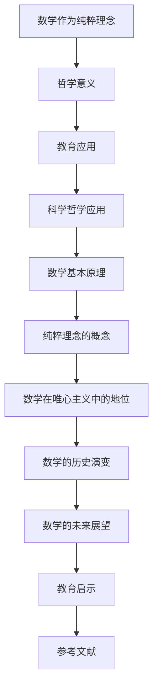

                 

### 文章标题：数学与唯心主义：数学作为纯粹理念

> 关键词：数学、唯心主义、纯粹理念、哲学意义、教育启示

> 摘要：本文探讨了数学与唯心主义之间的关系，从数学的基本概念、数学作为纯粹理念的论证，到数学在唯心主义哲学中的应用，全面解析了数学作为纯粹理念在哲学、教育以及科学领域的深远影响，为数学与哲学的交叉研究提供了新的视角。

### 第一部分：数学与唯心主义的基本概念

在探讨数学与唯心主义之间的关系之前，我们需要对这两个概念进行基本的介绍和定义。

#### 第1章：数学与唯心主义概述

**1.1 唯心主义哲学的简介**

**1.1.1 唯心主义的基本概念**

唯心主义（Idealism）是一种哲学思想，它认为意识、心灵或精神是构成现实世界的基础，而非物质。唯心主义强调精神的主导地位，认为物质世界是意识或精神的产物。这种哲学观点与唯物主义（Materialism）相对立，后者认为物质是构成现实世界的基础。

**1.1.2 唯心主义的历史演变**

唯心主义的历史可以追溯到古希腊哲学家柏拉图（Plato），他是第一个提出理念世界的概念，认为理念世界是真实的世界，物质世界只是理念世界的影子。后来，德国哲学家康德（Immanuel Kant）提出了先验唯心主义，强调知识起源于我们的心灵结构。19世纪，德国哲学家黑格尔（Georg Wilhelm Friedrich Hegel）发展了唯心主义体系，认为历史发展是绝对精神的自我实现。

**1.2 数学在唯心主义中的地位**

**1.2.1 数学作为纯粹理念的探讨**

数学在唯心主义中有着特殊的地位，因为数学的概念和结构在很多唯心主义哲学体系中被认为是超越物质的纯粹理念。柏拉图的理念论认为，数学对象如点、线、平面等是真实存在的，而物质世界只是这些理念的投影。康德的先验唯心主义也强调了数学作为先验理念的特性，即数学概念和结构是我们心灵先天结构的一部分。

**1.2.2 数学与哲学的关系**

数学与哲学有着密切的关系。数学的概念、证明方法和原理常常被哲学家用来探讨哲学问题。例如，柏拉图的理念论利用数学概念来解释现实世界的本质。康德的先验唯心主义则将数学视为先验理念，为认识论提供了基础。此外，数学在逻辑学、形而上学等领域也有重要应用，进一步加深了数学与哲学之间的联系。

### 第二部分：数学作为纯粹理念的论证

在了解了数学与唯心主义的基本概念后，我们将进一步探讨数学作为纯粹理念的论证，分析数学的基本原理和数学与纯粹理念的联系。

#### 第2章：数学作为纯粹理念的论证

**2.1 数学的基本原理**

**2.1.1 数学符号与语言**

数学作为一种语言，使用符号和公式来表达抽象的概念和关系。例如，数字、字母和运算符号等构成了数学的基本元素。这些符号和语言不仅使我们能够精确地描述和推理数学问题，也为其他科学领域提供了工具。

**2.1.2 数学证明的基本方法**

数学证明是数学的核心，它通过逻辑推理来证明一个数学陈述的正确性。常见的证明方法包括直接证明、反证法、归纳法等。这些方法确保了数学理论的严谨性和可靠性。

**2.2 纯粹理念的概念与数学**

**2.2.1 纯粹理念的定义**

纯粹理念（Pure Idea）是指在唯心主义哲学中，被认为是真实存在且超越物质世界的抽象概念。这些理念被认为是构成现实世界的基本元素，如柏拉图的理念论中的数学对象。

**2.2.2 数学与纯粹理念的联系**

数学与纯粹理念的联系在于，数学概念和结构在很多唯心主义哲学体系中被认为是纯粹理念的具体体现。例如，柏拉图的理念论认为，数学对象如点、线、平面等是真实存在的纯粹理念。康德的先验唯心主义则将数学作为先验理念，强调数学概念和结构是我们心灵先天结构的一部分。

### 第三部分：数学作为纯粹理念的哲学意义

在论证了数学作为纯粹理念之后，我们将进一步探讨数学作为纯粹理念在哲学、教育以及科学领域的深远影响。

#### 第3章：数学的基本原理与纯粹理念的论证

**3.1 数学公理系统**

**3.1.1 欧几里得几何公理**

欧几里得几何（Euclidean Geometry）是数学的基础分支之一，其公理系统由古希腊数学家欧几里得提出。欧几里得几何的公理包括平行公理、全等公理等，这些公理构成了欧几里得几何的理论基础。

**3.1.2 非欧几里得几何公理**

非欧几里得几何（Non-Euclidean Geometry）是欧几里得几何的扩展，它提出了与欧几里得几何不同的公理系统。非欧几里得几何包括洛巴切夫斯基几何和黎曼几何等，这些几何体系在数学和物理学领域有重要应用。

**3.2 数学概念的发展**

**3.2.1 实数与复数的概念发展**

实数和复数是数学中重要的概念，它们扩展了数的范围，使数学能够更好地描述现实世界。实数包括有理数和无理数，复数则由实部和虚部组成。实数和复数的发展对数学的多个分支产生了深远影响。

**3.2.2 数学概念的纯粹性探讨**

数学概念的纯粹性探讨涉及数学对象是否真正存在于现实世界中，还是仅仅是人类思维的产物。柏拉图的理念论认为，数学对象是纯粹理念，而康德的先验唯心主义则将数学概念视为先验理念。这种探讨有助于我们理解数学的本质和其在哲学中的地位。

### 第四部分：数学在唯心主义哲学中的应用

在了解了数学作为纯粹理念的基本原理后，我们将探讨数学在唯心主义哲学中的应用，分析数学在哲学教育、科学哲学等领域的影响。

#### 第4章：数学在唯心主义哲学中的应用

**4.1 唯心主义视角下的数学教育**

**4.1.1 教育中的数学理念**

数学教育不仅仅是传授数学知识和技能，更重要的是培养学生的数学思维和哲学素养。在唯心主义视角下，数学教育强调数学概念的纯粹性和理念性，培养学生的抽象思维和逻辑推理能力。

**4.1.2 数学在哲学教育中的作用**

数学在哲学教育中起着桥梁作用，将数学与哲学思想相结合，帮助学生理解哲学问题。例如，通过数学证明的方法，可以培养学生的批判性思维和推理能力，从而更好地理解哲学问题。

**4.2 数学在科学哲学中的应用**

**4.2.1 科学方法与数学的关系**

科学方法依赖于数学，因为数学提供了精确的描述和推理工具。数学在科学哲学中的应用，有助于我们理解科学理论的形成和验证过程。例如，数学模型在物理学、生物学等领域的应用，为科学研究提供了重要的工具。

**4.2.2 数学在科学哲学中的地位**

数学在科学哲学中占据重要地位，因为它不仅提供了科学理论的基础，也影响了科学方法论。例如，逻辑学、概率论等数学分支在科学哲学中的应用，为科学研究提供了方法论支持。

### 第五部分：数学与唯心主义的关系分析

在探讨了数学在哲学、教育以及科学领域中的应用后，我们将进一步分析数学与唯心主义之间的关系，探讨数学在唯心主义体系中的价值和影响。

#### 第5章：数学与唯心主义的关系分析

**5.1 数学与唯心主义的哲学意义**

**5.1.1 唯心主义视角下的数学本质**

在唯心主义视角下，数学的本质被理解为纯粹理念，它们是超越物质世界的抽象概念。这种理解有助于我们理解数学在哲学中的地位，以及数学如何与哲学问题相结合。

**5.1.2 数学在唯心主义体系中的价值**

数学在唯心主义体系中具有重要作用，因为它为哲学提供了工具和基础。例如，数学的概念和证明方法在逻辑学、形而上学等领域有重要应用，从而丰富了哲学的理论体系。

**5.2 数学与唯心主义的实践意义**

**5.2.1 数学在哲学研究中的应用**

数学在哲学研究中扮演着重要角色，它为哲学问题的探讨提供了工具和框架。例如，通过数学模型，哲学家可以更精确地描述和解释哲学问题。

**5.2.2 唯心主义对数学研究的影响**

唯心主义哲学对数学研究产生了深远影响，因为它提供了数学概念和理论的哲学基础。例如，柏拉图的理念论和康德的先验唯心主义为数学的发展提供了重要的哲学思想。

### 第六部分：数学作为纯粹理念的历史演变

在了解了数学与唯心主义之间的关系后，我们将探讨数学作为纯粹理念的历史演变，从古代到现代，分析数学理念的发展过程。

#### 第6章：数学作为纯粹理念的历史演变

**6.1 古代数学的唯心主义倾向**

**6.1.1 古希腊数学的哲学背景**

古希腊数学是数学发展的重要阶段，其哲学背景深受柏拉图和亚里士多德等哲学家的影响。柏拉图的理念论和亚里士多德的逻辑学为古希腊数学提供了哲学基础。

**6.1.2 古代中国数学的哲学基础**

古代中国数学同样具有唯心主义倾向，其哲学基础包括阴阳五行、道法自然等思想。这些哲学思想对古代中国数学的发展产生了深远影响。

**6.2 现代数学的唯心主义特征**

**6.2.1 数学形式主义的兴起**

现代数学形式主义强调数学符号和公式的严谨性，将数学视为纯粹的形式系统。这种观点反映了唯心主义哲学的基本理念，即数学是超越物质世界的纯粹理念。

**6.2.2 数学结构主义的贡献**

数学结构主义认为，数学对象和理论之间的关系是数学的核心，这些关系构成了数学的结构。数学结构主义强调了数学的抽象性和纯粹性，进一步巩固了数学作为纯粹理念的地位。

### 第七部分：数学作为纯粹理念的哲学展望

在了解了数学作为纯粹理念的历史演变后，我们将探讨数学作为纯粹理念的哲学展望，分析数学在唯心主义哲学中的未来方向。

#### 第7章：数学作为纯粹理念的哲学展望

**7.1 数学在唯心主义哲学中的未来方向**

**7.1.1 纯粹理念在数学研究中的应用**

未来数学研究将继续探索纯粹理念的应用，例如在逻辑学、形而上学等领域。这些研究将深化我们对数学本质和纯粹理念的理解。

**7.1.2 数学与哲学交叉领域的发展趋势**

数学与哲学的交叉领域将继续发展，例如数学哲学、逻辑哲学等。这些交叉领域的研究将有助于我们更好地理解数学与哲学之间的联系。

**7.2 数学作为纯粹理念的教育启示**

**7.2.1 唯心主义视角下的数学教育创新**

未来数学教育将更加注重数学的哲学基础和纯粹理念，通过创新的教育方法，提高学生对数学的哲学素养和思维能力。

**7.2.2 数学教育中的哲学思维培养**

数学教育将更加注重培养学生的哲学思维，例如逻辑推理、批判性思维等。这种教育模式将有助于培养具有创新精神的数学人才。

### 附录：数学与唯心主义的参考文献

**附录A：参考文献列表**

1. 柏拉图，《理念论》
2. 康德，《纯粹理性批判》
3. 黑格尔，《哲学史讲演录》
4. 欧几里得，《几何原本》
5. 洛巴切夫斯基，《几何原理》
6. 黎曼，《关于几何学的假设》
7. 杜威，《数学的哲学》
8. 卡尔纳普，《语言的逻辑语法》

**附录B：数学作为纯粹理念的 Mermaid 流程图**

### 作者信息

作者：AI天才研究院/AI Genius Institute & 禅与计算机程序设计艺术 /Zen And The Art of Computer Programming

