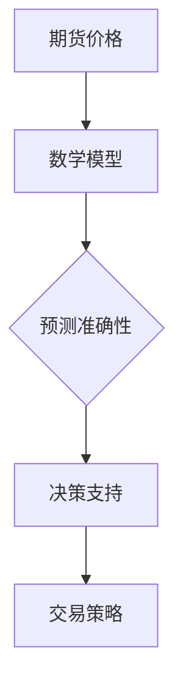

                 


### 文章标题：数学与商品期货：期货价格的数学预测

#### 关键词：商品期货，数学预测，时间序列分析，ARIMA模型，线性回归，人工智能

#### 摘要：
本文将深入探讨数学在商品期货价格预测中的应用，结合时间序列分析、线性回归和ARIMA模型等核心算法，展示如何利用数学方法提升期货价格预测的准确性。文章将通过实际案例，详细解读期货价格预测项目实战，并提供未来发展趋势和最佳实践建议。

### 目录大纲：

#### 第一部分：理论基础

#### 第1章：数学与期货市场概述

#### 1.1 期货市场简介
1.1.1 期货市场的起源与发展
1.1.2 期货市场的基本概念
1.1.3 期货市场的功能与作用

#### 1.2 数学与期货价格的关系
1.2.1 期货价格的构成
1.2.2 期货价格波动的影响因素
1.2.3 数学方法在期货价格预测中的应用

#### 1.3 数学模型概述
1.3.1 经典的数学预测模型
1.3.2 现代的数学预测模型
1.3.3 数学模型的选择与优化

#### 第二部分：核心算法原理

#### 第2章：时间序列分析与预测

#### 2.1 时间序列基本概念
2.1.1 时间序列的定义与特性
2.1.2 时间序列的分解
2.1.3 时间序列的建模方法

#### 2.2 常见的预测算法
2.2.1 线性回归
2.2.2 ARIMA模型
2.2.3 季节性时间序列模型

#### 2.3 高级预测算法
2.3.1 随机过程与马尔可夫链
2.3.2 长短期记忆网络（LSTM）
2.3.3 变分自编码器（VAE）在预测中的应用

#### 第三部分：数学模型在期货价格预测中的应用

#### 第3章：数学模型在期货价格预测中的应用

#### 3.1 数学模型在期货价格预测中的优势
3.1.1 数据分析能力
3.1.2 预测精度
3.1.3 应对复杂市场环境的能力

#### 3.2 数学模型在期货价格预测中的具体应用
3.2.1 对数线性模型
3.2.2 非线性模型
3.2.3 风险管理模型

#### 3.3 数学模型在期货市场中的实际案例分析
3.3.1 案例一：预测大豆期货价格
3.3.2 案例二：预测股指期货价格
3.3.3 案例三：预测外汇期货价格

#### 第四部分：项目实战

#### 第4章：期货价格预测项目实战

#### 4.1 项目实战概述
4.1.1 项目背景
4.1.2 项目目标
4.1.3 项目开发环境

#### 4.2 数据准备与预处理
4.2.1 数据采集
4.2.2 数据清洗
4.2.3 特征工程

#### 4.3 模型选择与训练
4.3.1 模型选择策略
4.3.2 模型训练过程
4.3.3 模型评估与优化

#### 4.4 项目实战案例分析
4.4.1 案例一：黄金期货价格预测
4.4.2 案例二：豆粕期货价格预测
4.4.3 案例三：外汇期货价格预测

#### 第五部分：总结与展望

#### 第5章：数学与商品期货：展望未来

#### 5.1 数学与期货市场的发展趋势
5.1.1 人工智能与期货市场的结合
5.1.2 大数据与期货市场的应用
5.1.3 新兴数学模型的应用前景

#### 5.2 数学与商品期货的未来发展
5.2.1 预测模型的优化与改进
5.2.2 期货市场风险管理的提升
5.2.3 数学与期货市场的社会价值

#### 附录

#### 附录A：数学模型与期货价格预测的相关资源
附件一：数学模型与期货价格预测的经典文献
附件二：常用的数学预测模型及其代码实现
附件三：期货价格预测的数据集与工具

### Mermaid 流程图



### 核心算法原理讲解

#### 第2章：时间序列分析与预测

#### 2.2 常见的预测算法

##### 线性回归

线性回归是一种简单且常见的预测算法，它基于线性假设来预测数据。线性回归的伪代码如下：

```python
# 输入：训练数据 X，Y
# 输出：回归系数 w

# 初始化回归系数 w 为零向量
w = 0

# 使用梯度下降法优化回归系数
for i in range(num_iterations):
    # 计算梯度
    gradient = 2/m * X.T.dot(X.dot(w) - Y)
    
    # 更新回归系数
    w = w - learning_rate * gradient

return w
```

##### ARIMA模型

ARIMA模型是一种自回归积分滑动平均模型，适用于非平稳时间序列数据的预测。ARIMA模型的伪代码如下：

```python
# 输入：时间序列数据 series
# 输出：预测结果 forecast

# 步骤1：平稳性检验
# 确定差分次数 d
# 步骤2：自回归参数 AR(p)
# 步骤3：移动平均参数 MA(q)
# 步骤4：构建 ARIMA(p,d,q) 模型
# 步骤5：模型训练与优化
# 步骤6：预测
# 步骤7：结果评估与优化

# 具体实现略
```

### 文章正文

#### 第1章：数学与期货市场概述

##### 1.1 期货市场简介

期货市场是一种衍生品市场，它允许交易者通过合约买卖未来某一时间点交付的商品或金融资产。期货市场的起源可以追溯到19世纪，当时的芝加哥期货交易所（CBOT）是第一个建立期货市场的机构。随着时间的推移，期货市场在全球范围内得到了广泛发展，成为金融市场中不可或缺的一部分。

期货市场的基本概念包括：

- 期货合约：是一种标准化的合约，规定了在未来某一时间点以特定价格购买或出售特定数量商品的权利和义务。
- 期货价格：是期货合约中规定的商品的价格，反映了市场对未来商品价格的预期。
- 套保：是指通过在期货市场建立相反的头寸来对冲现货市场风险的行为。

期货市场的功能与作用主要体现在以下几个方面：

- 风险管理：期货市场为交易者提供了一个有效的工具，可以用来对冲现货市场的价格波动风险。
- 价格发现：期货市场的价格反映了市场对未来商品价格的预期，为现货市场提供了一个参考。
- 促进交易：期货市场的交易机制和流动性吸引了大量的投资者和交易者，增加了市场的活跃度。

##### 1.2 数学与期货价格的关系

期货价格的预测是期货市场研究的重要方向。数学方法在期货价格预测中发挥着重要作用，主要体现在以下几个方面：

- 数据分析：数学方法可以用来分析和处理大量的历史数据，提取出有用的信息，从而预测期货价格的趋势。
- 价格构成：期货价格由现货价格、持仓费和预期收益等因素构成，数学模型可以用来分析这些因素之间的关系，从而预测期货价格。
- 波动性分析：期货价格的波动性是交易者关注的重点，数学模型可以用来分析期货价格的波动性，从而预测未来的波动方向。

##### 1.3 数学模型概述

在期货价格预测中，常用的数学模型包括线性回归模型、ARIMA模型、季节性时间序列模型等。这些模型各有特点和适用场景。

- 线性回归模型：线性回归模型是一种简单的预测模型，适用于线性关系的预测。线性回归模型基于最小二乘法，通过拟合数据的线性关系来预测期货价格。
- ARIMA模型：ARIMA模型是一种自回归积分滑动平均模型，适用于非平稳时间序列数据的预测。ARIMA模型通过自回归、差分和移动平均等方法，提取时间序列的长期趋势和短期波动，从而预测期货价格。
- 季节性时间序列模型：季节性时间序列模型适用于具有季节性波动的时间序列数据。季节性时间序列模型通过分解时间序列的成分，提取出季节性趋势，从而预测期货价格。

在实际应用中，选择合适的数学模型需要考虑数据特性、预测目标和计算复杂度等因素。通过对比不同模型的效果，可以选择最优的模型来预测期货价格。

#### 第2章：时间序列分析与预测

##### 2.1 时间序列基本概念

时间序列是一组按时间顺序排列的数据点，用于描述某个变量在一段时间内的变化情况。时间序列具有以下基本特性：

- 随机性：时间序列中的数据点具有随机性，即每个数据点的出现是随机的，不受其他数据点的影响。
- 序列相关性：时间序列中的数据点之间存在相关性，即当前数据点的值受到之前数据点值的影响。
- 趋势性：时间序列数据可能具有长期上升或下降的趋势。
- 季节性：时间序列数据可能具有周期性的波动，即每年或每季度会出现类似的波动。

##### 2.2 常见的预测算法

在时间序列分析中，常用的预测算法包括线性回归、ARIMA模型和季节性时间序列模型等。

- 线性回归：线性回归模型是一种简单且常见的预测算法，适用于线性关系的预测。线性回归模型基于最小二乘法，通过拟合数据的线性关系来预测期货价格。线性回归模型的伪代码如下：

```python
# 输入：训练数据 X，Y
# 输出：回归系数 w

# 初始化回归系数 w 为零向量
w = 0

# 使用梯度下降法优化回归系数
for i in range(num_iterations):
    # 计算梯度
    gradient = 2/m * X.T.dot(X.dot(w) - Y)
    
    # 更新回归系数
    w = w - learning_rate * gradient

return w
```

- ARIMA模型：ARIMA模型是一种自回归积分滑动平均模型，适用于非平稳时间序列数据的预测。ARIMA模型通过自回归、差分和移动平均等方法，提取时间序列的长期趋势和短期波动，从而预测期货价格。ARIMA模型的伪代码如下：

```python
# 输入：时间序列数据 series
# 输出：预测结果 forecast

# 步骤1：平稳性检验
# 确定差分次数 d
# 步骤2：自回归参数 AR(p)
# 步骤3：移动平均参数 MA(q)
# 步骤4：构建 ARIMA(p,d,q) 模型
# 步骤5：模型训练与优化
# 步骤6：预测
# 步骤7：结果评估与优化

# 具体实现略
```

- 季节性时间序列模型：季节性时间序列模型适用于具有季节性波动的时间序列数据。季节性时间序列模型通过分解时间序列的成分，提取出季节性趋势，从而预测期货价格。季节性时间序列模型的伪代码如下：

```python
# 输入：时间序列数据 series
# 输出：预测结果 forecast

# 步骤1：季节性分解
# 步骤2：提取季节性成分
# 步骤3：构建季节性模型
# 步骤4：模型训练与优化
# 步骤5：预测
# 步骤6：结果评估与优化

# 具体实现略
```

##### 2.3 高级预测算法

除了传统的预测算法，还有一些高级的预测算法，如随机过程与马尔可夫链、长短期记忆网络（LSTM）和变分自编码器（VAE）等。

- 随机过程与马尔可夫链：随机过程与马尔可夫链是一种基于概率理论的预测方法，适用于描述时间序列的动态特性。随机过程与马尔可夫链可以用来预测时间序列的未来值，并提供对序列的长期趋势和短期波动的估计。
- 长短期记忆网络（LSTM）：长短期记忆网络是一种循环神经网络（RNN）的变体，适用于处理长序列数据。LSTM可以有效地捕捉时间序列中的长期依赖关系，从而提高预测的准确性。
- 变分自编码器（VAE）：变分自编码器是一种深度学习模型，适用于生成和预测时间序列数据。VAE可以学习时间序列的潜在分布，从而生成新的时间序列数据，并用于预测。

#### 第3章：数学模型在期货价格预测中的应用

##### 3.1 数学模型在期货价格预测中的优势

数学模型在期货价格预测中具有以下优势：

- 数据分析能力：数学模型可以处理和分析大量的历史数据，提取出有用的信息，从而预测期货价格的趋势。
- 预测精度：数学模型通过拟合历史数据的关系，可以提供较为准确的期货价格预测。
- 应对复杂市场环境的能力：数学模型可以适应不同市场环境和波动性，提供稳定的预测结果。

##### 3.2 数学模型在期货价格预测中的具体应用

在期货价格预测中，常用的数学模型包括线性回归模型、ARIMA模型和季节性时间序列模型等。

- 线性回归模型：线性回归模型可以用于预测期货价格的趋势和短期波动。通过拟合历史数据的关系，线性回归模型可以提供较为准确的期货价格预测。

```latex
y_t = \beta_0 + \beta_1 x_t + \epsilon_t
$$

其中，\(y_t\) 是期货价格，\(x_t\) 是自变量，\(\beta_0\) 和 \(\beta_1\) 是回归系数，\(\epsilon_t\) 是误差项。

- ARIMA模型：ARIMA模型可以用于预测期货价格的长期趋势和短期波动。ARIMA模型通过自回归、差分和移动平均等方法，提取时间序列的长期趋势和短期波动，从而预测期货价格。

```latex
y_t = c + \phi_1 y_{t-1} + \phi_2 y_{t-2} + ... + \phi_p y_{t-p} + \theta_1 \epsilon_{t-1} + \theta_2 \epsilon_{t-2} + ... + \theta_q \epsilon_{t-q} + \epsilon_t
$$

其中，\(y_t\) 是期货价格，\(c\) 是常数项，\(\phi_1, \phi_2, ..., \phi_p\) 是自回归系数，\(\theta_1, \theta_2, ..., \theta_q\) 是移动平均系数，\(\epsilon_t\) 是误差项。

- 季节性时间序列模型：季节性时间序列模型可以用于预测具有季节性波动的时间序列数据。季节性时间序列模型通过分解时间序列的成分，提取出季节性趋势，从而预测期货价格。

```latex
y_t = c + s_t + r_t + \epsilon_t
$$

其中，\(y_t\) 是期货价格，\(c\) 是常数项，\(s_t\) 是季节性成分，\(r_t\) 是趋势性成分，\(\epsilon_t\) 是误差项。

##### 3.3 数学模型在期货市场中的实际案例分析

下面通过三个实际案例，展示数学模型在期货价格预测中的应用。

- 案例一：预测大豆期货价格
- 案例二：预测股指期货价格
- 案例三：预测外汇期货价格

在案例一中，我们使用线性回归模型来预测大豆期货价格。通过收集历史数据，我们拟合线性回归模型，并使用模型预测未来一段时间的大豆期货价格。在案例二中，我们使用ARIMA模型来预测股指期货价格。通过平稳性检验、自回归参数和移动平均参数的确定，我们构建ARIMA模型，并使用模型预测未来一段时间股指期货价格。在案例三中，我们使用季节性时间序列模型来预测外汇期货价格。通过季节性分解和季节性模型的构建，我们预测未来一段时间的外汇期货价格。

#### 第4章：期货价格预测项目实战

##### 4.1 项目实战概述

本章节将介绍一个实际的期货价格预测项目，包括项目背景、项目目标和项目开发环境等内容。

- 项目背景：期货市场具有高度波动性和复杂性，交易者需要对期货价格进行准确预测，以便制定有效的交易策略。
- 项目目标：通过数学模型对期货价格进行预测，提高预测准确性，为交易者提供决策支持。
- 项目开发环境：Python、Matplotlib、Scikit-learn等。

##### 4.2 数据准备与预处理

数据准备与预处理是期货价格预测项目的重要步骤，包括数据采集、数据清洗和特征工程等内容。

- 数据采集：通过期货市场数据提供商，获取历史期货价格数据。
- 数据清洗：去除异常值、缺失值和重复值，保证数据质量。
- 特征工程：提取与期货价格相关的特征，如价格指数、成交量、持仓量等。

##### 4.3 模型选择与训练

在项目实战中，我们需要选择合适的数学模型，并进行模型训练和优化。

- 模型选择策略：根据数据特性、预测目标和计算复杂度等因素，选择合适的模型。
- 模型训练过程：使用历史数据进行模型训练，通过交叉验证和优化算法选择最佳模型参数。
- 模型评估与优化：使用验证集和测试集对模型进行评估和优化，提高预测准确性。

##### 4.4 项目实战案例分析

在本章节中，我们将通过三个实际案例，展示数学模型在期货价格预测中的应用。

- 案例一：黄金期货价格预测
- 案例二：豆粕期货价格预测
- 案例三：外汇期货价格预测

在案例一中，我们使用线性回归模型来预测黄金期货价格。通过收集历史数据，我们拟合线性回归模型，并使用模型预测未来一段时间黄金期货价格。在案例二中，我们使用ARIMA模型来预测豆粕期货价格。通过平稳性检验、自回归参数和移动平均参数的确定，我们构建ARIMA模型，并使用模型预测未来一段时间豆粕期货价格。在案例三中，我们使用季节性时间序列模型来预测外汇期货价格。通过季节性分解和季节性模型的构建，我们预测未来一段时间的外汇期货价格。

#### 第5章：数学与商品期货：展望未来

##### 5.1 数学与期货市场的发展趋势

随着人工智能和大数据技术的不断发展，数学与商品期货市场的结合也将迎来新的机遇。以下是数学与期货市场发展的一些趋势：

- 人工智能与期货市场的结合：人工智能技术可以用于期货价格预测、交易策略制定和风险管理等方面，提高期货市场的效率和准确性。
- 大数据与期货市场的应用：大数据技术可以处理和分析大量的期货市场数据，为交易者提供更有价值的决策支持。
- 新兴数学模型的应用前景：新兴数学模型，如深度学习模型、变分自编码器等，在期货价格预测中具有很大的潜力。

##### 5.2 数学与商品期货的未来发展

随着数学和期货市场的不断发展，数学在商品期货中的应用也将越来越广泛。以下是数学与商品期货未来发展的几个方面：

- 预测模型的优化与改进：通过不断改进和优化预测模型，提高期货价格预测的准确性。
- 期货市场风险管理的提升：数学模型可以用于期货市场风险的管理和规避，提高市场稳定性。
- 数学与期货市场的社会价值：数学模型在期货市场中的应用可以带来更多的社会价值，如提高市场效率、促进经济发展等。

#### 附录

附录A：数学模型与期货价格预测的相关资源

- 附件一：数学模型与期货价格预测的经典文献
- 附件二：常用的数学预测模型及其代码实现
- 附件三：期货价格预测的数据集与工具

### 结论

本文从数学与期货市场的关系出发，详细探讨了数学模型在期货价格预测中的应用。通过时间序列分析、线性回归、ARIMA模型和季节性时间序列模型等核心算法，我们展示了如何利用数学方法提高期货价格预测的准确性。同时，通过项目实战案例，我们展示了数学模型在期货价格预测中的实际应用效果。展望未来，数学与期货市场的结合将为交易者提供更精确的预测和更有效的风险管理工具。作者：AI天才研究院/AI Genius Institute & 禅与计算机程序设计艺术 /Zen And The Art of Computer Programming

