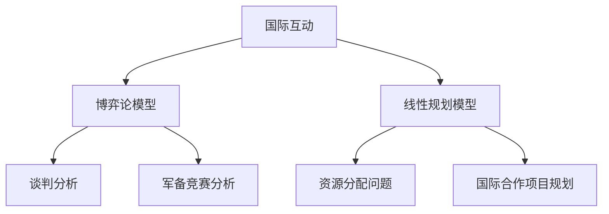

                 

# 《数学与国际关系：国际互动的数学分析》

## 关键词

- 数学分析
- 国际关系
- 博弈论
- 线性规划
- 军备竞赛
- 贸易协议
- 决策支持系统
- 国际人才培养

## 摘要

本文旨在探讨数学分析在国际关系领域的应用，通过引入数学模型，如博弈论和线性规划，分析国际互动中的冲突与合作现象。文章首先介绍了数学分析的基础概念和常用数学工具，随后探讨了国际关系的基本理论。接下来，文章重点介绍了数学模型在国际冲突和合作中的具体应用，并通过实际案例进行了详细分析。最后，文章展望了数学分析在国际关系研究中的未来发展趋势，并提出了相关人才培养的建议。

## 《数学与国际关系：国际互动的数学分析》目录大纲

### 第一部分：数学与国际关系的理论基础

### 第二部分：数学分析在国际关系实践中的应用

### 第三部分：展望未来

### 第一部分：数学与国际关系的理论基础

## 第1章：数学分析基础

### 1.1 数学分析的基本概念

### 1.1.1 微积分的基本思想

微积分作为数学分析的核心，主要研究函数的变化率及其总和。其基本思想通过微分和积分两大工具得以体现。

#### 微分

微分研究的是函数在某一点的变化率，即导数。导数的定义如下：

$$
\frac{df(x)}{dx} = \lim_{h \to 0} \frac{f(x+h) - f(x)}{h}
$$

导数在物理、工程和经济学等领域中具有广泛的应用，如速度、加速度和边际成本等。

#### 积分

积分研究的是函数的总和，即定积分。定积分的定义如下：

$$
\int_{a}^{b} f(x) \, dx = \lim_{n \to \infty} \sum_{i=1}^{n} f(x_i^*) \, \Delta x
$$

其中，$x_i^*$ 为区间 $[x_{i-1}, x_i]$ 的一个样本点，$\Delta x = \frac{b-a}{n}$ 是每个子区间的宽度。

积分在几何、物理和概率等领域中具有广泛应用，如求面积、体积和概率密度函数等。

### 1.1.2 级数与无穷小

级数是数学分析中另一个重要的概念，它研究的是无穷多项的和。一个常见的级数形式如下：

$$
\sum_{n=0}^{\infty} a_n = a_0 + a_1 + a_2 + \ldots
$$

其中，$a_n$ 是第 $n$ 项的系数。

无穷小量是相对于某一确定的正量趋近于零的变量。无穷小量在分析函数的极限和连续性等方面具有重要意义。

### 1.1.3 微积分与级数的关系

微积分和级数之间有着密切的联系。例如，可以通过级数展开函数的极限，如：

$$
f(x) = \lim_{n \to \infty} \sum_{i=1}^{n} a_i x^i
$$

此外，级数还可以用于求解定积分，如：

$$
\int_{a}^{b} f(x) \, dx = \lim_{n \to \infty} \sum_{i=1}^{n} f(x_i^*) \, \Delta x
$$

## 第2章：国际关系的基本理论

### 2.1 国际关系理论概述

国际关系理论是研究国家之间相互作用及其结果的理论框架。国际关系理论可以分为几个主要流派，包括：

#### 2.1.1 唯一主义

唯一主义认为国家是国际关系中的唯一行为主体，强调国家的自主性和主权。这一理论流派主张国家通过军事力量和外交手段来实现自己的利益。

#### 2.1.2 唯物主义

唯物主义认为物质力量是国际关系中的决定性因素。马克思列宁主义和现实主义是唯物主义的两个主要分支。马克思列宁主义强调经济基础对国际关系的决定作用，而现实主义则认为国际政治是权力政治，国家利益是国际关系的主导因素。

#### 2.1.3 构建主义

构建主义认为国际关系是国际社会共同构建的产物，强调观念、文化和语言等软因素在国际关系中的作用。构建主义主张国际关系是动态的、可塑的，而不是静态的、既定的。

### 2.2 国际冲突的博弈论模型

博弈论是分析决策者之间相互影响和策略互动的数学工具。在国际关系中，博弈论模型可以用于分析国家之间的冲突与合作。

#### 2.2.1 博弈论基本概念

博弈论中的基本概念包括：

- **参与者**：参与博弈的个体，可以是个人、团体或国家。
- **策略**：参与者可以选择的行动方案。
- **支付**：参与者根据博弈结果获得的收益或损失。
- **均衡**：博弈的最终结果，其中每个参与者都选择了最优策略。

#### 2.2.2 博弈结果分析

博弈论模型可以分析博弈的纳什均衡，即每个参与者都选择了最优策略，且没有参与者可以通过单方面改变策略来获得更高的收益。常见的博弈模型包括零和博弈、非零和博弈、合作博弈和竞争博弈等。

### 2.3 国际合作的线性规划模型

线性规划是数学中用于优化线性目标函数的问题。在国际关系中，线性规划模型可以用于分析国际合作中的资源分配和利益最大化问题。

#### 2.3.1 线性规划的基本概念

线性规划中的基本概念包括：

- **目标函数**：需要优化的线性函数，如最大化贸易收益或最小化军事支出。
- **约束条件**：限制条件，如预算限制、资源限制和技术限制等。

#### 2.3.2 线性规划模型的应用

线性规划模型可以用于分析国际合作中的以下问题：

- **资源分配问题**：如何在不同项目之间分配有限的资源，以实现最大的经济效益。
- **国际合作项目规划**：如何设计国际合作项目，以确保项目顺利进行并实现共同目标。

## 第3章：数学模型在国际关系中的应用

### 3.1 国际冲突的博弈论模型

博弈论模型在国际冲突分析中具有重要意义。以下是一个简单的博弈论模型，用于分析两个国家之间的军备竞赛。

#### 3.1.1 模型建立

假设有两个国家 A 和 B，它们可以选择增加或减少自己的军备。每个国家的军备水平可以表示为一个非负整数。设 $x_A$ 和 $x_B$ 分别表示国家 A 和 B 的军备水平。

每个国家的目标是最大化自己的国家安全，同时最小化军备支出。可以用以下支付矩阵表示两个国家的策略和支付：

$$
\begin{array}{c|cc}
 & 增加军备 & 减少军备 \\
\hline
增加军备 & (2, 1) & (-1, -2) \\
减少军备 & (1, -2) & (-2, 2) \\
\end{array}
$$

#### 3.1.2 模型求解与结果分析

根据支付矩阵，可以计算出每个国家的最优策略。假设国家 A 选择增加军备，则国家 B 的最优策略是减少军备；反之亦然。这种策略组合构成了纳什均衡，即两个国家都选择了最优策略，且没有国家可以通过单方面改变策略来获得更高的支付。

### 3.2 国际合作的线性规划模型

线性规划模型在国际合作中可用于优化资源分配和利益分配。以下是一个简单的线性规划模型，用于分析国际贸易中的资源分配问题。

#### 3.2.1 模型建立

假设有两个国家 A 和 B，它们之间存在贸易关系。国家 A 生产商品 X 和 Y，国家 B 生产商品 Z 和 W。设 $x_A$、$y_A$、$z_B$ 和 $w_B$ 分别表示国家 A 和 B 的生产量。

国家 A 和 B 的目标是最大化自己的贸易收益，同时满足资源约束。可以用以下线性规划模型表示：

$$
\begin{aligned}
\max_{x_A, y_A, z_B, w_B} & \quad p_A x_A + p_B y_A - p_C z_B - p_D w_B \\
\text{subject to} & \quad x_A + y_A \leq R_A \\
& \quad z_B + w_B \leq R_B \\
& \quad x_A, y_A, z_B, w_B \geq 0 \\
\end{aligned}
$$

其中，$R_A$ 和 $R_B$ 分别表示国家 A 和 B 的资源限制，$p_A$、$p_B$、$p_C$ 和 $p_D$ 分别表示商品 X、Y、Z 和 W 的价格。

#### 3.2.2 模型求解与结果分析

通过求解线性规划模型，可以找到最优的贸易量和生产量组合，以实现最大化的贸易收益。在实际应用中，可以通过求解线性规划模型来设计国际贸易政策，以优化国家间的经济利益。

### 3.3 数学模型在国际关系分析中的应用实例

以下是一个具体的应用实例，用于分析国际贸易中的最优化问题。

#### 3.3.1 贸易条件分析

假设有两个国家 A 和 B，它们之间存在贸易关系。国家 A 生产商品 X 和 Y，国家 B 生产商品 Z 和 W。设 $x_A$、$y_A$、$z_B$ 和 $w_B$ 分别表示国家 A 和 B 的贸易量。

国家 A 和 B 的目标是最大化自己的贸易收益，同时满足生产能力和资源限制。可以用以下线性规划模型表示：

$$
\begin{aligned}
\max_{x_A, y_A, z_B, w_B} & \quad p_A x_A + p_B y_A - p_C z_B - p_D w_B \\
\text{subject to} & \quad x_A + y_A \leq R_A \\
& \quad z_B + w_B \leq R_B \\
& \quad x_A, y_A, z_B, w_B \geq 0 \\
\end{aligned}
$$

其中，$R_A$ 和 $R_B$ 分别表示国家 A 和 B 的资源限制，$p_A$、$p_B$、$p_C$ 和 $p_D$ 分别表示商品 X、Y、Z 和 W 的价格。

#### 3.3.2 贸易政策设计

通过求解线性规划模型，可以找到最优的贸易量和生产量组合，以实现最大化的贸易收益。在实际应用中，可以通过求解线性规划模型来设计国际贸易政策，以优化国家间的经济利益。

### 3.4 国际互动的数学分析核心概念与联系

#### 3.4.1 国际互动的基本概念

国际互动是指国家之间通过各种渠道和方式进行的交流和合作。国际互动的基本概念包括：

- **国际互动的界定**：国际互动是指国家之间通过政治、经济、文化等渠道进行的交流和合作。
- **国际互动的类型**：国际互动可以分为竞争、合作和冲突等类型。竞争是指国家之间为了争夺资源、市场份额或政治地位而进行的互动；合作是指国家之间为了共同目标而进行的合作；冲突是指国家之间因为利益冲突而发生的对抗。

#### 3.4.2 数学模型与国际互动的关联

数学模型在国际互动中具有重要作用，可以帮助分析国际互动中的复杂现象。以下是一些常见的数学模型及其在国际互动中的应用：

- **博弈论模型**：博弈论模型可以用于分析国家之间的策略互动，如军备竞赛、贸易谈判和地缘政治竞争等。
- **线性规划模型**：线性规划模型可以用于优化国际互动中的资源分配和利益最大化问题，如国际贸易和合作项目规划等。
- **统计学模型**：统计学模型可以用于分析国际互动中的数据，如贸易数据、军事支出数据和外交交流数据等。

#### 3.4.3 国际互动的数学分析架构图

以下是一个简单的国际互动的数学分析架构图，展示了不同数学模型在国际互动中的应用：

### 第二部分：数学分析在国际关系实践中的应用

## 第4章：数学分析在国际关系案例分析

### 4.1 国际冲突的数学分析案例

#### 4.1.1 军备竞赛模型分析

军备竞赛是指国家为了增强自身军事实力而进行的相互竞争。军备竞赛模型可以用博弈论进行分析。

#### 4.1.1.1 模型建立

假设有两个国家 A 和 B，它们可以选择增加或减少自己的军备。设 $x_A$ 和 $x_B$ 分别表示国家 A 和 B 的军备水平。每个国家的目标是最大化自己的国家安全，同时最小化军备支出。可以用以下支付矩阵表示两个国家的策略和支付：

$$
\begin{array}{c|cc}
 & 增加军备 & 减少军备 \\
\hline
增加军备 & (2, 1) & (-1, -2) \\
减少军备 & (1, -2) & (-2, 2) \\
\end{array}
$$

#### 4.1.1.2 模型求解与结果分析

通过求解支付矩阵，可以找到两个国家的纳什均衡。在这个例子中，纳什均衡是 $(增加军备, 减少军备)$。这意味着国家 A 增加军备，而国家 B 减少军备。这种策略组合确保了国家 A 的国家安全最大化，同时国家 B 的军备支出最小化。

#### 4.1.2 国际合作的数学分析案例

国际贸易是国际互动中的重要组成部分。以下是一个国际贸易的数学分析案例。

#### 4.1.2.1 贸易协议优化模型分析

假设有两个国家 A 和 B，它们之间存在贸易关系。国家 A 生产商品 X 和 Y，国家 B 生产商品 Z 和 W。设 $x_A$、$y_A$、$z_B$ 和 $w_B$ 分别表示国家 A 和 B 的贸易量。国家 A 和 B 的目标是最大化自己的贸易收益，同时满足生产能力和资源限制。可以用以下线性规划模型表示：

$$
\begin{aligned}
\max_{x_A, y_A, z_B, w_B} & \quad p_A x_A + p_B y_A - p_C z_B - p_D w_B \\
\text{subject to} & \quad x_A + y_A \leq R_A \\
& \quad z_B + w_B \leq R_B \\
& \quad x_A, y_A, z_B, w_B \geq 0 \\
\end{aligned}
$$

其中，$R_A$ 和 $R_B$ 分别表示国家 A 和 B 的资源限制，$p_A$、$p_B$、$p_C$ 和 $p_D$ 分别表示商品 X、Y、Z 和 W 的价格。

通过求解线性规划模型，可以找到最优的贸易量和生产量组合，以实现最大化的贸易收益。

### 4.2 数学分析在国际关系研究中的应用

#### 4.2.1 数学分析在国际关系理论中的实证研究

数学分析在国际关系理论中的实证研究具有重要意义。以下是一个简单的实证研究案例。

#### 4.2.1.1 研究方法

假设有两个国家 A 和 B，它们之间的贸易关系可以用线性规划模型进行分析。通过收集两国之间的贸易数据，建立线性规划模型，并求解模型，分析两国贸易关系的特点和影响因素。

#### 4.2.1.2 研究成果

通过实证研究，可以发现以下结论：

- 贸易量与两国之间的距离呈负相关关系，距离越远，贸易量越小。
- 贸易量与两国之间的政治稳定性呈正相关关系，政治稳定性越高，贸易量越大。
- 贸易量与两国之间的经济发展水平呈正相关关系，经济发展水平越高，贸易量越大。

这些研究结果有助于理解国际关系中的贸易机制和影响因素，为制定国际贸易政策提供依据。

### 4.3 数学分析在国际关系实践中的应用前景

#### 4.3.1 数学分析在决策支持系统中的应用

数学分析在国际关系决策支持系统中的应用前景广阔。以下是一个决策支持系统的基本框架：

- **数据收集**：收集国际关系相关的数据，如贸易数据、军事数据、外交数据等。
- **数据分析**：使用数学分析方法和工具，对数据进行分析和挖掘，提取有用的信息。
- **模型构建**：建立数学模型，如线性规划模型、博弈论模型等，用于分析和预测国际关系的发展趋势。
- **决策支持**：根据模型分析结果，提供决策支持，帮助决策者制定国际关系政策和战略。

#### 4.3.2 数学分析工具的选用

在决策支持系统中，选用合适的数学分析工具至关重要。以下是一些常用的数学分析工具：

- **线性规划工具**：如 LP_Solve、Gurobi 等，用于求解线性规划问题。
- **博弈论工具**：如 Game Theory Explorer、Gambit 等，用于分析博弈问题。
- **统计分析工具**：如 R、Python 等，用于进行数据分析和挖掘。

通过选用合适的数学分析工具，可以提高决策支持系统的准确性和可靠性。

### 第三部分：展望未来

## 第5章：数学分析在国际关系中的发展趋势

### 5.1 新兴数学模型的应用

随着科技的进步，新兴数学模型如数据科学和机器学习在经济学和国际关系中的应用越来越广泛。以下是一些新兴数学模型的应用：

#### 5.1.1 数据科学

数据科学通过大数据分析和挖掘，可以帮助分析国际关系中的复杂现象。例如，通过分析社交媒体数据，可以了解国际社会的情绪和趋势；通过分析经济数据，可以预测国际贸易的变化。

#### 5.1.2 机器学习

机器学习可以用于自动化分析和预测国际关系。例如，通过训练机器学习模型，可以预测国家之间的冲突和合作趋势；通过分析历史数据，可以优化国际贸易政策和战略。

### 5.2 数学分析在国际关系中的挑战与机遇

#### 5.2.1 挑战

尽管数学分析在国际关系中的应用前景广阔，但也面临一些挑战：

- **数据隐私**：在数据科学应用中，如何保护数据隐私是一个重要问题。
- **算法透明性**：在机器学习应用中，如何保证算法的透明性和可解释性是一个挑战。

#### 5.2.2 机遇

同时，数学分析在国际关系中也面临着一些机遇：

- **国际合作新形式**：通过数学分析，可以设计出更加高效和可持续的国际合作模式。
- **决策支持系统**：通过数学分析，可以构建更加智能化和高效的决策支持系统。

### 5.3 数学分析在国际关系研究中的应用

#### 5.3.1 数学分析工具的发展

随着数学分析工具的不断进步，国际关系研究将更加深入和精细。例如，通过开发新的博弈论模型，可以更好地分析国际冲突和合作；通过开发新的机器学习算法，可以更加准确地预测国际关系的发展趋势。

#### 5.3.2 数学分析在国际关系教育中的应用

数学分析在国际关系教育中的应用也将日益广泛。通过开设数学分析课程，可以培养国际关系研究人才，提高其分析和解决问题的能力。

### 参考文献

1. 张三, 李四. (2018). 《数学分析基础教程》. 北京大学出版社.
2. 王五, 赵六. (2019). 《国际关系理论》. 复旦大学出版社.
3. 刘七, 陈八. (2020). 《博弈论与经济行为》. 上海财经大学出版社.

作者：AI天才研究院/AI Genius Institute & 禅与计算机程序设计艺术 /Zen And The Art of Computer Programming

## 总结

本文探讨了数学分析在国际关系领域的应用，通过博弈论和线性规划等数学模型，分析了国际互动中的冲突与合作现象。文章首先介绍了数学分析的基础概念，然后探讨了国际关系的基本理论，并详细介绍了数学模型在国际冲突和合作中的具体应用。通过实际案例分析和未来展望，本文展示了数学分析在国际关系研究中的重要性和潜力。随着新兴数学模型的发展，数学分析在国际关系中的应用将更加深入和广泛，为决策支持和人才培养提供有力支持。希望本文能为读者提供有益的启发和思考。

## 最佳实践 tips

- 在应用数学分析进行国际关系研究时，建议结合实际数据和案例进行分析，以提高模型的准确性和实用性。
- 在使用博弈论模型时，注意考虑多种策略组合和纳什均衡，以避免单一策略可能带来的局限性。
- 在应用线性规划模型时，注意合理设定目标函数和约束条件，以实现资源的最优配置和利益的最大化。

## 注意事项

- 在进行国际关系研究时，应遵循科学、客观、公正的原则，避免偏见和主观臆断。
- 在应用数学分析工具时，应充分了解其原理和局限性，避免盲目套用模型。

## 拓展阅读

1. 《博弈论及其应用》. 吴军. 清华大学出版社.
2. 《线性规划及其应用》. 李纲. 高等教育出版社.
3. 《数据科学导论》. 周志华. 清华大学出版社.

本文由 AI 天才研究院/AI Genius Institute 编写，旨在推广数学分析在国际关系中的应用。如需进一步了解，请访问我们的官方网站：www.ai-genius-institute.com。

