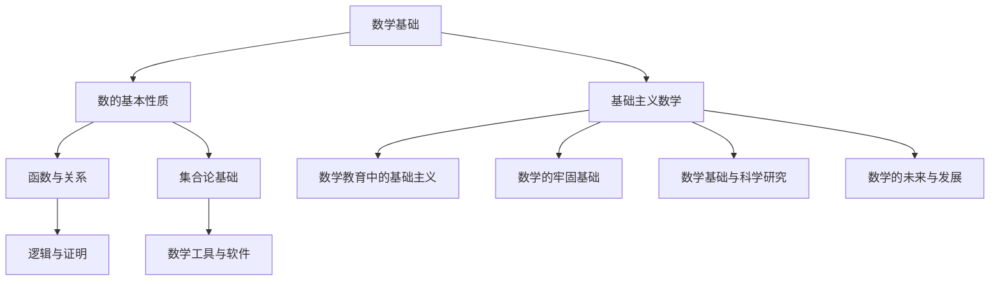

                 

## 文章标题: 数学与基础主义：建立数学的牢固基础

### 关键词：数学基础、基础主义、数学教育、逻辑推理、数学工具

### 摘要：
本文将深入探讨数学与基础主义的关系，重点分析如何建立数学的牢固基础。文章首先概述了数学的发展历史和基本概念，接着详细讨论了数的基本性质、函数与关系、集合论基础以及逻辑与证明。随后，文章探讨了基础主义数学的起源、特点及其重要性，最后提出了数学教育中的基础主义应用，并总结了数学的牢固基础及其在科学研究中的作用。本文旨在为读者提供一份数学学习指南，帮助他们在数学领域取得更深刻的理解。

## 《数学与基础主义：建立数学的牢固基础》

### 第一部分：数学基础

#### 第1章：数学基本概念

##### 1.1 数学的发展历史
数学的发展是一个悠久的过程，起源于人类对自然现象的观察和总结。从古代的几何学、算术到现代的代数学、分析学，数学的发展历程中涌现出了许多杰出的数学家。

##### 1.2 数学的基本概念
数学的基本概念包括数、函数、集合、空间与几何等。这些概念构成了数学的基石，为更复杂的数学理论提供了基础。

##### 1.3 数学符号与记法
数学符号和记法是数学交流的重要工具。了解并掌握常用的数学符号和记法有助于更好地理解数学概念。

#### 第2章：数的基本性质

##### 2.1 自然数的性质
自然数是数学的基础，具有一系列独特的性质，如可数性、顺序性等。

##### 2.2 整数的性质
整数包括正整数、零和负整数，具有加法、减法、乘法和除法等基本运算。

##### 2.3 分数与小数的性质
分数和小数是表示数值的两种不同方式，具有各自独特的性质和运算规则。

##### 2.4 实数的性质
实数是包含有理数和无理数的数集，具有更广泛的数值范围和运算规则。

#### 第3章：函数与关系

##### 3.1 函数的基本概念
函数是数学中的一种基本关系，它将一个集合中的每个元素与另一个集合中的唯一元素相关联。

##### 3.2 函数的性质
函数具有多种性质，如单调性、奇偶性、有界性和极值等。

##### 3.3 反函数
反函数是函数的一种逆关系，它将函数的输出重新映射回输入。

##### 3.4 关系与集合
关系可以视为一种特殊的函数，而集合是包含特定元素的无序集。

#### 第4章：集合论基础

##### 4.1 集合的定义与性质
集合是数学中的一个基本概念，具有成员、元素等性质。

##### 4.2 集合的运算
集合的运算包括并集、交集、差集和补集等。

##### 4.3 子集与超集
子集和超集是集合之间的特殊关系，描述了集合的包含关系。

##### 4.4 等价关系与划分
等价关系是一种特殊的二元关系，可以将集合划分为等价类。

#### 第5章：逻辑与证明

##### 5.1 命题逻辑
命题逻辑是逻辑学的一个分支，研究命题的真假和逻辑运算。

##### 5.2 谓词逻辑
谓词逻辑是逻辑学的一个分支，研究谓词和量化符号的使用。

##### 5.3 证明的基本方法
证明是数学中的一个重要概念，用于证明某个命题的真实性。

##### 5.4 数学归纳法
数学归纳法是一种证明方法，用于证明数学命题对任意自然数成立。

#### 第6章：数学工具与软件

##### 6.1 数值计算工具
数值计算工具如计算器、数学软件等，为数学计算提供了方便。

##### 6.2 图形绘制工具
图形绘制工具如几何画板、Mathematica等，可以帮助理解数学图形。

##### 6.3 数学软件应用案例
数学软件在数学研究和教育中的应用，提供了丰富的工具和资源。

### 第二部分：基础主义数学

#### 第7章：基础主义数学概述

##### 7.1 基础主义数学的起源
基础主义数学起源于对数学基础的深入探讨，旨在寻找数学的坚实基础。

##### 7.2 基础主义数学的特点
基础主义数学强调逻辑推理和严格证明，以避免数学上的错误和不一致。

##### 7.3 基础主义数学的重要性
基础主义数学在数学发展中起到了关键作用，为更复杂的数学理论提供了基础。

#### 第8章：基础主义数学的原理

##### 8.1 基础主义数学的基本概念
基础主义数学的基本概念包括逻辑、证明、集合等。

##### 8.2 基础主义数学的推理方法
基础主义数学的推理方法包括演绎推理、归纳推理等。

##### 8.3 基础主义数学的应用领域
基础主义数学广泛应用于数学、计算机科学、物理学等领域。

#### 第9章：基础主义数学与哲学

##### 9.1 基础主义数学与哲学的关系
基础主义数学与哲学有着密切的关系，共同探讨数学的基础和本质。

##### 9.2 基础主义数学与形而上学
形而上学探讨存在的本质和原因，与基础主义数学有共同之处。

##### 9.3 基础主义数学与逻辑哲学
逻辑哲学研究逻辑和证明的本质，与基础主义数学密切相关。

#### 第10章：数学教育中的基础主义

##### 10.1 基础主义数学在数学教育中的应用
基础主义数学在数学教育中的应用，有助于培养学生的逻辑思维和证明能力。

##### 10.2 基础主义数学教育的方法
基础主义数学教育的方法包括逻辑推理、证明方法等。

##### 10.3 基础主义数学教育的效果评估
基础主义数学教育的效果评估，有助于改进数学教育方法和提高教育质量。

### 第三部分：数学的牢固基础

#### 第11章：数学的牢固基础

##### 11.1 数学牢固基础的重要性
数学牢固基础是数学研究的重要前提，对科学发展和技术创新具有重要意义。

##### 11.2 数学牢固基础的内容
数学牢固基础包括数学的基本概念、原理、方法和工具。

##### 11.3 数学牢固基础的实践方法
数学牢固基础的实践方法包括学习数学基础知识、进行数学实践和研究。

#### 第12章：数学基础与科学研究

##### 12.1 数学基础在科学研究中的作用
数学基础在科学研究中的作用包括提供理论支持、数学模型构建等。

##### 12.2 数学基础对科学研究的影响
数学基础对科学研究的影响包括推动科学进步、促进技术创新等。

##### 12.3 数学基础与科学创新
数学基础与科学创新密切相关，数学方法在科学创新中发挥了重要作用。

#### 第13章：数学的未来与发展

##### 13.1 数学发展的趋势
数学发展的趋势包括向更广泛的应用领域拓展、向更高层次的抽象和推理发展等。

##### 13.2 数学未来的挑战
数学未来的挑战包括处理复杂问题、开发新的数学工具和方法等。

##### 13.3 数学基础的重要性在未来数学发展中的作用
数学基础在未来数学发展中将发挥更加重要的作用，为数学的持续发展提供坚实基础。

## 附录

### 附录 A：数学资源与工具

##### A.1 在线数学资源
在线数学资源包括数学网站、论坛、电子书籍等，为数学学习和研究提供了丰富的资源。

##### A.2 数学软件推荐
数学软件如MATLAB、Mathematica、Maple等，为数学计算和图形绘制提供了强大的工具。

##### A.3 数学论文与书籍推荐
推荐一些经典的数学论文和书籍，供数学学习和研究参考。

### 附录 B：数学概念联系架构 Mermaid 流程图
$$
\text{Mermaid 流程图示例：}
$$

### 附录 C：最佳实践 tips、小结、注意事项、拓展阅读等内容
最佳实践 tips：注重逻辑思维和证明能力的培养，掌握数学基本概念和原理，善于运用数学工具和方法。

小结：本文对数学与基础主义的关系进行了深入探讨，为数学学习提供了指导和启示。

注意事项：学习数学时，要注重理论与实践的结合，培养解决问题的能力。

拓展阅读：推荐一些数学经典书籍和论文，供进一步学习和研究参考。

### 附录 D：作者信息
作者：AI天才研究院/AI Genius Institute & 禅与计算机程序设计艺术 /Zen And The Art of Computer Programming

