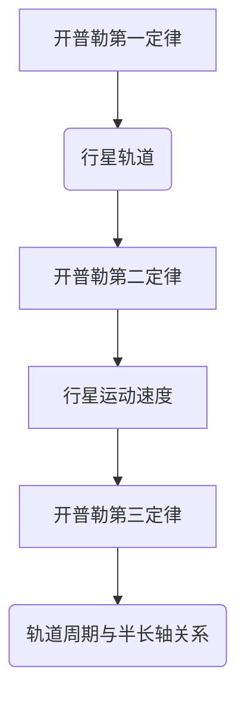
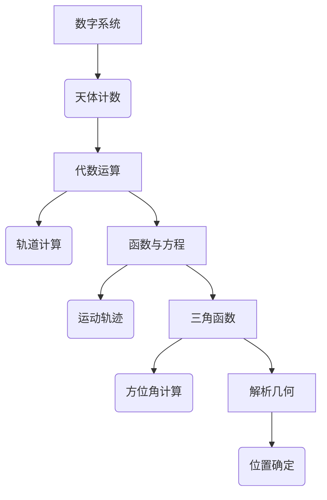
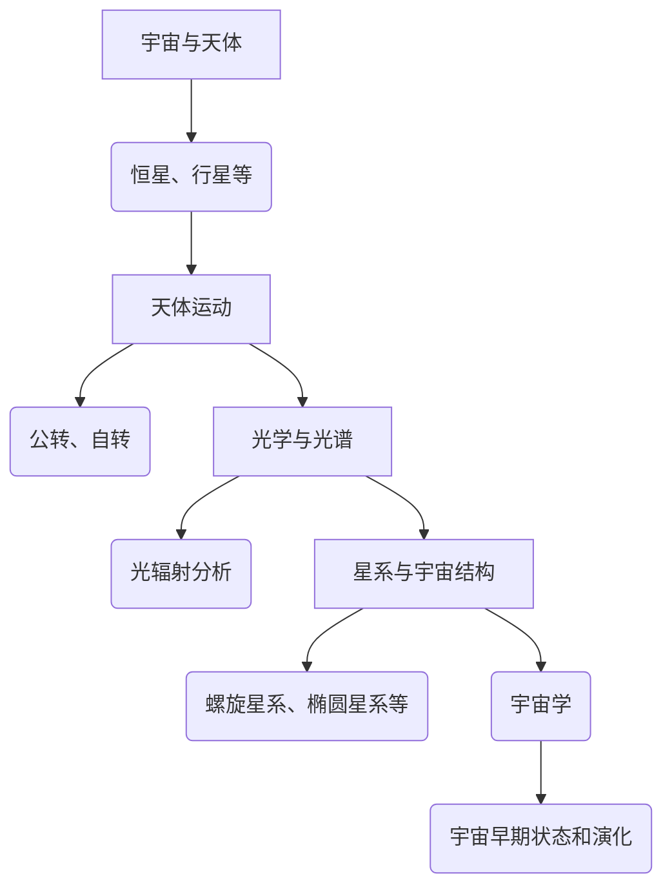
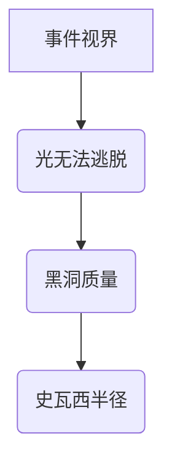
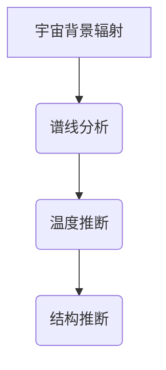

                 


### 《数学与天文学的密切联系》

#### 关键词：数学、天文学、应用、模型、历史、教育

> 摘要：本文旨在探讨数学与天文学之间的密切联系，通过分析数学的基本概念、天文学的基本概念以及数学在天文学中的应用，揭示数学在理解宇宙、天体运动和天体观测中的关键作用。文章还将回顾数学在天文学历史中的演变，探讨其在未来的发展前景，并针对数学与天文学教育的重要性进行论述。

---

### 《数学与天文学的密切联系》目录大纲

- **第一部分：引言**
  - **1.1 书籍背景及重要性**
  - **1.2 数学在天文学中的基础作用**
  - **1.3 天文学对数学发展的推动**
  - **1.4 读者对象及学习建议**

- **第二部分：数学与天文学的基础概念**
  - **2.1 数学基本概念**
    - **2.1.1 数字系统**
    - **2.1.2 代数运算**
    - **2.1.3 函数与方程**
    - **2.1.4 三角函数与解析几何**
  - **2.2 天文学基本概念**
    - **2.2.1 宇宙与天体**
    - **2.2.2 天体运动**
    - **2.2.3 光学与光谱**
    - **2.2.4 星系与宇宙结构**

- **第三部分：数学在天文学中的应用**
  - **3.1 数学模型在天体力学中的应用**
    - **3.1.1 开普勒定律**
      - **3.1.1.1 轨道参数的计算**
      - **3.1.1.2 轨道稳定性的分析**
    - **3.1.2 牛顿引力定律**
      - **3.1.2.1 行星轨道的精确计算**
      - **3.1.2.2 引力波的产生与传播**
  - **3.2 数学在天体物理学中的应用**
    - **3.2.1 黑洞物理学**
      - **3.2.1.1 黑洞质量与半径的计算**
      - **3.2.1.2 事件视界的概念**
    - **3.2.2 宇宙学**
      - **3.2.2.1 宇宙膨胀模型**
      - **3.2.2.2 宇宙背景辐射的分析**
  - **3.3 数学在天体观测中的应用**
    - **3.3.1 光学观测**
      - **3.3.1.1 光学望远镜的原理**
      - **3.3.1.2 光谱分析**
    - **3.3.2 射电观测**
      - **3.3.2.1 射电望远镜的原理**
      - **3.3.2.2 射电天文学的数据处理**

- **第四部分：数学在天文学的历史与未来**
  - **4.1 数学在天文学历史中的演变**
    - **4.1.1 古代天文学的数学基础**
    - **4.1.2 中世纪天文学的数学进展**
    - **4.1.3 近现代天文学的数学应用**
  - **4.2 数学在天文学未来发展中的角色**
    - **4.2.1 高能天体物理学**
    - **4.2.2 宇宙暗物质与暗能量研究**
    - **4.2.3 宇宙微波背景辐射的探测**

- **第五部分：案例分析**
  - **5.1 数学与天文学在行星探测中的应用**
    - **5.1.1 卡西尼-惠更斯探测器**
      - **5.1.1.1 探测器设计中的数学应用**
      - **5.1.1.2 探测器任务中的数学分析**
    - **5.1.2 哈勃空间望远镜**
      - **5.1.2.1 望远镜的数学设计原理**
      - **5.1.2.2 望远镜观测数据的处理**

- **第六部分：数学与天文学教育**
  - **6.1 数学与天文学教育的重要性**
    - **6.1.1 数学在天文学专业课程中的地位**
    - **6.1.2 天文学在数学教育中的应用**
  - **6.2 教育案例分析**
    - **6.2.1 基础数学在天文学课程中的融合**
    - **6.2.2 实践教学在天文学教育中的应用**

- **第七部分：附录**
  - **7.1 数学公式汇总**
  - **7.2 参考文献**
  - **7.3 数学与天文学相关的网站与资源**

---

### 第一部分：引言

#### 1.1 书籍背景及重要性

《数学与天文学的密切联系》这本书的目的是为了揭示数学与天文学之间深刻的相互联系。数学作为一门研究数量、结构、变化和空间的基本学科，提供了理解和描述宇宙的基本工具。而天文学则是研究宇宙中天体的位置、分布、形态、结构和运动等的科学。数学与天文学的结合，不仅帮助天文学家更好地理解和解释天文现象，还推动了数学理论的发展。

数学在天文学中的基础作用不可忽视。天文学家需要使用数学来描述天体的运动，进行天文观测的数据分析，以及建立宇宙模型。例如，开普勒定律和牛顿引力定律就是数学在天文学中的两个经典例子。这些数学模型不仅帮助我们理解行星运动的规律，还为后来的科学研究提供了基础。

另一方面，天文学的发展也推动了数学的进步。天文学观测的精确度要求越来越高，这就需要更加复杂的数学工具。例如，在宇宙学中，数学模型用于描述宇宙的膨胀和结构形成，这促进了广义相对论和量子场论等数学理论的发展。

因此，这本书不仅适合对天文学和数学有兴趣的读者，也适合那些希望了解这两门学科如何相互影响和促进的学者。通过阅读本书，读者将能够更深入地理解数学与天文学之间的密切联系。

#### 1.2 数学在天文学中的基础作用

数学在天文学中的应用范围广泛，贯穿于天文学研究的各个方面。首先，在天体力学中，数学模型扮演了至关重要的角色。天体力学是研究天体之间相互作用的学科，其核心在于利用数学工具描述和预测天体的运动。

开普勒定律是数学在天体力学中应用的经典例子。约翰内斯·开普勒在17世纪初提出了描述行星运动的三大定律，这些定律为理解行星轨道提供了直观且精确的数学描述。开普勒第一定律指出，行星沿椭圆轨道绕太阳运动，太阳位于椭圆的一个焦点上；第二定律描述了行星在轨道上运动的速度，行星在接近太阳时运动得更快，远离太阳时运动得更慢；第三定律则揭示了行星轨道周期的平方与轨道半长轴的立方成正比。

以下是一个简单的流程图，展示了开普勒定律的核心概念：



在开普勒定律的基础上，牛顿引力定律进一步提供了数学模型，以描述天体之间的引力相互作用。牛顿通过万有引力定律，将天体之间的引力作用量化为一个数学公式：$$ F = G \frac{{m_1 m_2}}{{r^2}} $$，其中F是引力，G是万有引力常数，$m_1$和$m_2$是两个天体的质量，r是它们之间的距离。利用这个公式，天文学家可以精确地计算行星轨道，预测行星的位置和运动轨迹。

下面是一个简单的伪代码，用于计算行星轨道的周期：

```python
# 牛顿引力定律的伪代码
def calculate_orbital_period(mass_of_sun, semi_major_axis):
    gravitational_constant = 6.674 * 10**-11
    return (gravitational_constant * mass_of_sun * semi_major_axis**3) ** 0.5
```

通过这样的数学模型，天文学家能够对天体的运动进行精确的预测和分析，从而深化对宇宙的理解。

#### 1.3 天文学对数学发展的推动

天文学不仅受益于数学，还推动了数学的进步。天文学的发展对数学提出了新的需求，促使数学家们创造出新的理论和方法来应对这些需求。以下是一些具体的例子：

首先，天文学推动了数学分析的发展。为了描述宇宙的膨胀、天体的运动和引力作用，数学家们需要更精确的工具。这种需求催生了微积分的发展，微积分成为描述连续变化和无限小量的数学工具。微积分的创立者是牛顿和莱布尼茨，他们的工作不仅解决了天体力学中的复杂问题，还为后来的物理科学奠定了基础。

其次，天文学促进了代数和数论的发展。为了解决复杂的方程和求解未知数，数学家们开发了代数系统，并研究数的性质。数论作为代数学的一个分支，研究了整数和它们的属性，这在天文学中有着重要的应用，例如在天体轨道计算中的整数倍关系。

最后，天文学对广义相对论的发展也产生了重要影响。广义相对论是由爱因斯坦在20世纪初提出的，它是一种描述引力和宇宙结构的理论。广义相对论将引力视为时空的曲率，这一概念需要全新的数学工具——张量分析。张量分析是数学中一种处理多变量函数的系统方法，它在广义相对论中发挥了关键作用。

综上所述，天文学对数学发展的推动是双向的。天文学提出了新的数学问题，推动了数学理论的创新和进步，而数学的发展又为天文学提供了更加精确和强大的工具，共同推动了科学的发展。

#### 1.4 读者对象及学习建议

本书的目标读者包括对天文学和数学有兴趣的广泛读者群体，特别是学生、科学家和数学爱好者。如果您是一位对宇宙和数学原理充满好奇心的读者，那么本书将带领您深入探讨这两门学科之间的密切联系。

为了更好地理解本书的内容，建议读者具备以下背景知识：

1. **高中数学基础**：了解代数、几何、三角函数等基础数学概念。
2. **基本的物理知识**：了解力学、光学和天文学的基本原理。
3. **科学素养**：对科学方法和科学探究过程有一定的了解。

在学习本书的过程中，读者应注重以下方面：

1. **循序渐进**：本书的内容是循序渐进的，从基础概念到高级应用，逐步深入。
2. **动手实践**：通过阅读和分析具体的数学模型和算法，实际操作和验证所学内容。
3. **深入思考**：对于每一个数学模型和应用，思考其背后的原理和逻辑。

通过本书的学习，读者不仅能加深对数学和天文学的理解，还能培养科学思维和解决问题的能力。让我们开始这场跨越数学与天文学的精彩旅程吧！

---

### 第二部分：数学与天文学的基础概念

#### 2.1 数学基本概念

数学作为一门基础学科，拥有许多重要的基本概念，这些概念不仅在天文学中有着广泛应用，也是理解和研究天文学现象的基础。

##### 2.1.1 数字系统

数字系统是数学中最基础的组成部分，它包括自然数、整数、分数、小数和复数等。这些数字概念构成了数学运算的基础。在天文学中，自然数和整数用于计数天体、计算时间等；分数和小数用于测量天文距离和速度；复数则在复杂的物理计算中发挥作用。

##### 2.1.2 代数运算

代数运算是数学的核心内容之一，包括加法、减法、乘法、除法以及求幂等。这些运算不仅用于解决日常问题，也在天文学中用于描述和计算天体的运动轨迹。例如，行星轨道的计算通常涉及大量的代数运算，如开平方、求导和积分等。

在天文学中，代数运算的一个经典应用是牛顿引力定律。牛顿引力定律的公式为：$$ F = G \frac{{m_1 m_2}}{{r^2}} $$，其中F是引力，G是万有引力常数，$m_1$和$m_2$是两个天体的质量，r是它们之间的距离。这个公式通过代数运算描述了天体之间的引力作用。

##### 2.1.3 函数与方程

函数是数学中一个基本的概念，它描述了变量之间的依赖关系。在天文学中，函数用于描述天体的运动规律。例如，开普勒定律中的行星轨道方程就是函数的具体应用。

方程是函数的一种表达方式，它通过等式描述了变量之间的关系。在天文学中，方程用于求解天体的运动轨迹和物理参数。例如，在解牛顿引力定律时，需要解一个关于行星位置和时间的二次方程。

##### 2.1.4 三角函数与解析几何

三角函数是数学中用于描述角度和边长的关系的函数，包括正弦（sin）、余弦（cos）、正切（tan）等。在天文学中，三角函数用于计算天体的方位角、高度角和距离等。例如，天文学家使用正弦函数来确定行星的仰角，从而计算其距离。

解析几何是数学的一个分支，它通过坐标系统来描述几何图形。在天文学中，解析几何用于确定天体的位置和轨迹。例如，天文学家使用笛卡尔坐标系来表示行星的位置，从而进行轨道计算和预测。

下面是一个简化的流程图，展示了数学基础概念在天文学中的应用：



通过上述数学基础概念，天文学家能够更精确地描述和预测天体的运动，从而深化对宇宙的理解。接下来，我们将进一步探讨天文学的基本概念。

#### 2.2 天文学基本概念

天文学作为一门研究宇宙的科学，拥有丰富的基本概念，这些概念帮助我们理解和描述天体的性质和行为。

##### 2.2.1 宇宙与天体

宇宙是包括一切存在和空间的概念。天体是宇宙中的物质存在，包括恒星、行星、卫星、彗星、星系等。恒星是宇宙中最常见的天体，它们通过核聚变产生能量，是我们观察和研究宇宙的主要对象。行星则围绕恒星运动，它们的大小、形态和组成各不相同。例如，木星是一个巨大的气体行星，而地球则是一个岩石行星。

##### 2.2.2 天体运动

天体运动是天文学的核心研究内容之一。天体的运动可以分为两类：一类是自转，即天体自身围绕自身的轴旋转；另一类是公转，即天体围绕另一天体运动。例如，地球围绕太阳公转，同时自转产生昼夜交替。行星的公转轨道通常是椭圆形，而恒星的运动则更为复杂，包括自转、轨道运动和星际空间中的随机漂移。

开普勒定律是天体运动描述的重要工具。第一定律指出，行星沿椭圆轨道绕太阳运动，太阳位于椭圆的一个焦点上。第二定律描述了行星在轨道上运动的速度，行星在接近太阳时运动得更快，远离太阳时运动得更慢。第三定律揭示了行星轨道周期的平方与轨道半长轴的立方成正比。

##### 2.2.3 光学与光谱

光学是天文学中的一个重要分支，研究光的行为和性质。在天文学中，光学主要用于观测天体的光辐射。天体辐射的光可以通过望远镜收集，并通过光谱分析来确定其成分和性质。光谱是一种通过色散将光分解为不同波长的方法，可以揭示天体的温度、化学成分和运动状态。

例如，氢原子在光谱中产生一系列特定波长的线条，称为氢谱线。天文学家通过分析这些谱线，可以确定天体的化学成分。此外，光谱还可以用于测量天体的多普勒效应，从而确定其相对运动速度。

##### 2.2.4 星系与宇宙结构

星系是宇宙中的大型天体系统，由数百亿颗恒星、气体和暗物质组成。星系可以分为螺旋星系、椭圆星系和不规则星系等不同类型。螺旋星系具有明显的旋臂结构，椭圆星系形状类似椭圆，而不规则星系则没有明确的形状。

宇宙结构是天文学研究的另一个重要领域。宇宙学通过观测宇宙的大尺度结构，研究宇宙的起源、演化和未来。例如，宇宙微波背景辐射是宇宙早期状态的重要遗迹，它提供了关于宇宙早期状态和演化的宝贵信息。

下面是一个简化的流程图，展示了天文学基本概念之间的相互关系：



通过理解这些基本概念，天文学家能够更深入地探索宇宙的奥秘，揭示宇宙的结构和演化规律。

### 第三部分：数学在天文学中的应用

#### 3.1 数学模型在天体力学中的应用

在天体力学中，数学模型是理解和描述天体运动的核心工具。这些模型不仅帮助我们预测行星、卫星等天体的位置和轨道，还揭示了宇宙的基本规律。以下是两个最重要的数学模型：开普勒定律和牛顿引力定律。

##### 3.1.1 开普勒定律

开普勒定律是由德国天文学家约翰内斯·开普勒在17世纪初提出的，用于描述行星绕太阳的运动规律。开普勒定律包括三个主要部分：

**第一定律（轨道定律）**：行星绕太阳的轨道是椭圆形的，太阳位于椭圆的一个焦点上。

**第二定律（面积定律）**：行星与太阳连线在相等时间内扫过相等的面积。这意味着在行星轨道的近太阳点（近日点）行星移动得更快，在远太阳点（远日点）移动得更慢。

**第三定律（周期定律）**：行星轨道周期的平方与其轨道半长轴的立方成正比。数学表达式为：$$ \left(\frac{T}{T_0}\right)^2 = \left(\frac{a}{a_0}\right)^3 $$，其中T是行星的轨道周期，a是轨道半长轴；$T_0$和$a_0$是标准行星的轨道周期和半长轴。

**轨道参数的计算**

为了计算行星的轨道参数，我们可以使用开普勒第三定律。以下是一个简化的伪代码示例：

```python
# 开普勒第三定律的伪代码
def calculate_orbital_period(semi_major_axis):
    gravitational_constant = 6.674 * 10**-11
    mass_of_sun = 1.989 * 10**30
    return (gravitational_constant * mass_of_sun * semi_major_axis**3) ** 0.5

# 计算地球的轨道周期
orbital_period_earth = calculate_orbital_period(1.496 * 10**11)  # 单位：米
print("地球的轨道周期：", orbital_period_earth / (60 * 60 * 24), "天")
```

**轨道稳定性的分析**

轨道稳定性是行星运动的一个重要方面。轨道的稳定性取决于多种因素，包括行星之间的引力相互作用、行星的质量和轨道参数。开普勒定律虽然提供了轨道周期的计算方法，但并没有直接描述轨道的稳定性。

为了分析轨道稳定性，我们可以使用牛顿引力定律和三体问题的数学模型。三体问题涉及三个或更多天体之间的相互作用，其解析解非常复杂。然而，我们可以通过数值模拟来研究轨道稳定性。以下是一个简化的伪代码示例：

```python
# 三体问题数值模拟的伪代码
def simulate_orbit(masses, initial_positions, initial_velocities, time_step, total_time):
    positions = initial_positions.copy()
    velocities = initial_velocities.copy()
    
    for _ in range(int(total_time / time_step)):
        forces = calculate_gravitational_forces(masses, positions)
        accelerations = calculate_accelerations(forces, masses)
        velocities += accelerations * time_step
        positions += velocities * time_step
        
    return positions

# 初始条件
mass_of_earth = 5.972 * 10**24
mass_of_sun = 1.989 * 10**30
initial_position_earth = [1.496 * 10**11, 0, 0]
initial_velocity_earth = [0, 29.78 * 1000, 0]

# 模拟地球轨道
earth_orbit = simulate_orbit([mass_of_sun, mass_of_earth], [initial_position_earth], [initial_velocity_earth], 1, 365.25 * 24 * 60 * 60)
```

通过这样的模拟，我们可以分析行星轨道的稳定性，预测行星在未来数百万年内的运动状态。

##### 3.1.2 牛顿引力定律

牛顿引力定律是由英国科学家艾萨克·牛顿在1687年提出的，描述了天体之间的引力相互作用。该定律的数学表达式为：$$ F = G \frac{{m_1 m_2}}{{r^2}} $$，其中F是引力，G是万有引力常数，$m_1$和$m_2$是两个天体的质量，r是它们之间的距离。

**行星轨道的精确计算**

利用牛顿引力定律，我们可以计算行星轨道的精确位置和速度。以下是一个简化的伪代码示例：

```python
# 牛顿引力定律的伪代码
def calculate_gravitational_force(mass1, mass2, distance):
    gravitational_constant = 6.674 * 10**-11
    return gravitational_constant * mass1 * mass2 / distance**2

# 计算地球和太阳之间的引力
force_earth_sun = calculate_gravitational_force(mass_of_earth, mass_of_sun, 1.496 * 10**11)
print("地球和太阳之间的引力：", force_earth_sun, "牛顿")
```

**引力波的产生与传播**

引力波是引力相互作用在时空中的波动，由黑洞合并或大质量天体碰撞等极端事件产生。利用牛顿引力定律，我们可以计算引力波的传播特性。以下是一个简化的伪代码示例：

```python
# 引力波传播的伪代码
def calculate_gravitational_wave propagation(time, initial_waveform):
    waveforms = [initial_waveform]
    
    for _ in range(int(time / time_step)):
        waveform = calculate_waveform_change(waveforms[-1])
        waveforms.append(waveform)
        
    return waveforms

# 引力波传播时间
time_step = 0.1
total_time = 1.0

# 初始引力波形态
initial_waveform = [0, 1, 0, -1]

# 计算引力波传播
gravitational_waveform = calculate_gravitational_wave propagation(total_time, initial_waveform)
```

通过这些数学模型，天文学家可以精确地描述和预测天体的运动，进一步理解宇宙的奥秘。

#### 3.2 数学在天体物理学中的应用

在天体物理学中，数学模型是理解和研究天体现象的重要工具。以下将介绍两个重要领域：黑洞物理学和宇宙学。

##### 3.2.1 黑洞物理学

黑洞是天体物理学中一个极为吸引人的研究领域。黑洞是极其密集的天体，其引力场如此之强，甚至连光也无法逃脱。黑洞的物理性质和演化过程需要借助数学模型来研究。

**黑洞质量与半径的计算**

黑洞的质量和半径是其两个最重要的物理参数。质量决定了黑洞的引力强度，而半径（也称为事件视界）则是光无法逃脱的最远距离。以下是一个简化的伪代码示例，用于计算黑洞的质量和半径：

```python
# 黑洞质量与半径的计算
def calculate_black_hole_properties(mass, spin, charge):
    # 爱丁顿半径：黑洞质量为m时的半径
    eddington_radius = 2.95 * 10**-5 * mass
    # 史瓦西半径：无旋转、无电荷的黑洞半径
    schwarschild_radius = 2 * gravitational_constant * mass / (3.003 * 10**8)
    # 布拉德雷-雷兹尼科夫半径：有旋转的黑洞半径
    bradley_rezznikov_radius = 9 * gravitational_constant * mass * spin**2 / (32 * (1 - 2 * charge**2))**0.5
    
    return mass, eddington_radius, schwarschid_radius, bradley_rezznikov_radius

# 计算一个质量为10倍太阳质量、无旋转、无电荷的黑洞
mass = 10 * 1.989 * 10**30
eddington_radius, schwarschild_radius, bradley_rezznikov_radius = calculate_black_hole_properties(mass, 0, 0)
print("黑洞质量：", mass, "千克")
print("爱丁顿半径：", eddington_radius, "米")
print("史瓦西半径：", schwarschild_radius, "米")
print("布拉德雷-雷兹尼科夫半径：", bradley_rezznikov_radius, "米")
```

**事件视界的概念**

事件视界是黑洞的一个重要概念，它定义了光无法逃脱的最远点。事件视界的大小取决于黑洞的质量，质量越大，事件视界也越大。以下是一个简化的流程图，展示了事件视界的概念：



通过这些数学模型，我们可以更好地理解黑洞的物理性质和演化过程。

##### 3.2.2 宇宙学

宇宙学是研究宇宙起源、演化、结构和组成的学科。数学模型在宇宙学中扮演了关键角色，帮助天文学家理解宇宙的复杂现象。

**宇宙膨胀模型**

宇宙膨胀模型描述了宇宙从大爆炸以来不断扩张的过程。根据这个模型，宇宙的膨胀速度与宇宙的年龄和距离有关。以下是一个简化的伪代码示例，用于计算宇宙膨胀速度：

```python
# 宇宙膨胀速度的计算
def calculate_expansion_speed(age, distance):
    Hubble_constant = 71 * 10**-11  # 单位：千米/秒/百万秒差距
    expansion_speed = Hubble_constant * distance
    
    return expansion_speed

# 计算一个距离地球100百万秒差距的星系的速度
distance = 100 * 10**6
expansion_speed = calculate_expansion_speed(13.8 * 10**9, distance)
print("宇宙膨胀速度：", expansion_speed, "千米/秒")
```

**宇宙背景辐射的分析**

宇宙背景辐射是宇宙早期状态的重要遗迹，它提供了关于宇宙起源和演化的宝贵信息。通过分析宇宙背景辐射的谱线和强度，我们可以推断宇宙的温度和结构。以下是一个简化的流程图，展示了宇宙背景辐射的分析过程：



通过这些数学模型，我们可以更深入地了解宇宙的起源、演化和未来。

#### 3.3 数学在天体观测中的应用

在天体观测中，数学不仅用于描述天体运动的规律，还用于处理观测数据和分析观测结果。以下是两个主要领域：光学观测和射电观测。

##### 3.3.1 光学观测

光学观测是天文学中最为传统和广泛使用的观测方法。光学望远镜是光学观测的核心工具，它通过收集和放大光线来观测天体。以下是光学观测中涉及的两个关键方面：光学望远镜的原理和光谱分析。

**光学望远镜的原理**

光学望远镜的基本原理是光的折射和反射。望远镜通常由物镜和目镜组成。物镜负责收集光线并形成天体的实像，目镜则放大这个实像，使观察者能够清晰地看到天体。

以下是一个简化的伪代码示例，用于描述光学望远镜成像过程：

```python
# 光学望远镜成像的伪代码
def optical_telescope_imaging(object_distance, focal_length, image_size):
    image = []
    
    for y in range(image_size[1]):
        for x in range(image_size[0]):
            light_intensity = collect_light_at_pixel(object_distance, focal_length, x, y)
            image.append(light_intensity)
            
    return image

# 计算天体成像
object_distance = 1.496 * 10**11  # 地球到太阳的距离
focal_length = 10 * 10**12  # 光学望远镜的焦距
image_size = (1024, 1024)  # 成像大小
image = optical_telescope_imaging(object_distance, focal_length, image_size)
```

**光谱分析**

光谱分析是光学观测中的一个重要方法，通过分析光线的波长分布，可以确定天体的化学成分和物理状态。光谱中的特定线条对应于天体中特定元素或化合物的特征谱线。

以下是一个简化的伪代码示例，用于分析天体光谱：

```python
# 光谱分析的伪代码
def analyze_spectral_lines(spectrum):
    element_identification = []
    
    for line in spectrum:
        if line_matches_element(line):
            element_identification.append(element)
            
    return element_identification

# 分析天体光谱
spectrum = [line1, line2, line3, ...]  # 天体光谱数据
elements_identified = analyze_spectral_lines(spectrum)
print("识别的元素：", elements_identified)
```

##### 3.3.2 射电观测

射电观测是另一种重要的天体观测方法，它通过收集和放大无线电波来观测天体。射电望远镜是射电观测的核心工具，它通常由一个巨大的抛物面天线组成。以下是射电观测中涉及的两个关键方面：射电望远镜的原理和数据处理。

**射电望远镜的原理**

射电望远镜的基本原理是无线电波的反射和聚焦。抛物面天线将来自天体的无线电波聚焦到一个焦点，然后通过接收器收集这些信号。

以下是一个简化的伪代码示例，用于描述射电望远镜观测过程：

```python
# 射电望远镜观测的伪代码
def radio_telescope_observations(frequency, duration):
    signal_strengths = []
    
    for _ in range(duration):
        signal_strength = collect_signal_at_frequency(frequency)
        signal_strengths.append(signal_strength)
        
    return signal_strengths

# 射电望远镜观测
frequency = 1.4 * 10**9  # 频率
duration = 3600  # 观测时间
signal_strengths = radio_telescope_observations(frequency, duration)
```

**数据处理**

射电观测的数据通常包含大量的噪声和干扰信号。因此，对射电观测数据进行分析和处理是获得可靠天体信息的关键步骤。以下是一个简化的伪代码示例，用于处理射电观测数据：

```python
# 射电观测数据处理伪代码
def process_radio_data(data):
    cleaned_data = []
    
    for signal in data:
        if signal_above_threshold(signal):
            cleaned_data.append(signal)
            
    return cleaned_data

# 处理射电观测数据
raw_data = [signal1, signal2, signal3, ...]  # 原始观测数据
cleaned_data = process_radio_data(raw_data)
```

通过这些数学模型和方法，天文学家可以更精确地观测和解析天体信息，从而进一步了解宇宙的奥秘。

### 第四部分：数学在天文学的历史与未来

#### 4.1 数学在天文学历史中的演变

数学与天文学之间的关系可以追溯到古代文明，当时的天文学家就已经开始使用数学工具来描述天体的运动。以下是对数学在天文学历史中的几个重要阶段的概述：

##### 4.1.1 古代天文学的数学基础

古代文明，如古埃及、巴比伦和希腊，对天文现象有着浓厚的兴趣，并开始使用数学工具来记录和解释这些现象。古埃及天文学家使用数学来计算农事周期和季节变化，而巴比伦天文学家则通过观测和记录天文事件来编制天文表。

古希腊是数学和天文学发展的重要时期。欧几里得的《几何原本》为几何学奠定了坚实的基础，而阿基米德的工作则涉及了流体静力学和球体体积的计算。此外，阿波罗尼奥斯和托勒密等人对天文学的研究推动了数学的发展，特别是在三角学和天体力学方面。

##### 4.1.2 中世纪天文学的数学进展

中世纪时期，阿拉伯天文学家在数学和天文学领域取得了显著进展。阿尔·花剌子米的《代数学》和阿尔·哈萨克伊的《天文表》是这一时期的重要数学和天文学著作。阿拉伯天文学家还改进了天文仪器，如星盘和天文台，使得天体观测更加精确。

中世纪晚期的欧洲天文学家，如尼古拉·哥白尼和约瑟夫·厄伦内斯特·拉普拉斯，开始对天体运动的数学描述进行重大改革。哥白尼提出的日心说推翻了地心说的传统观念，而拉普拉斯则通过数学方法描述了天体之间的引力作用。

##### 4.1.3 近现代天文学的数学应用

近现代天文学的快速发展离不开数学的广泛应用。约翰内斯·开普勒的开普勒定律为天体运动提供了精确的数学描述，而艾萨克·牛顿的万有引力定律则将天体运动统一到一个统一的物理框架下。

19世纪，数学在天文学中的应用进一步深化。英国数学家乔治·西蒙·欧姆提出了欧姆定律，用于描述电流在电路中的行为，这对天体物理学中的电离层研究具有重要意义。此外，查尔斯·巴比涅和约翰·威廉·沃森·约翰逊等人对电磁波的研究为无线电天文学的发展奠定了基础。

20世纪初，相对论和量子力学的兴起带来了数学在天文学中应用的革命。爱因斯坦的广义相对论提供了描述天体之间引力相互作用的新工具，而量子力学则为天体物理学中的微观现象提供了理论框架。例如，黑洞的研究和宇宙微波背景辐射的探测都依赖于高度复杂的数学模型。

#### 4.2 数学在天文学未来发展中的角色

随着科技的进步，数学在天文学中的应用将继续扩展，为理解宇宙的奥秘提供更加精确的工具和方法。以下是数学在天文学未来发展中的几个关键领域：

##### 4.2.1 高能天体物理学

高能天体物理学研究宇宙中最极端的天体现象，如黑洞碰撞、中子星碰撞和伽玛射线暴。这些现象通常伴随着巨大的能量释放和复杂的粒子过程。数学模型，特别是广义相对论和量子场论，将在研究这些现象中发挥关键作用。例如，通过数值模拟，天文学家可以预测黑洞碰撞产生的引力波和电磁信号，并验证理论预测。

##### 4.2.2 宇宙暗物质与暗能量研究

宇宙暗物质和暗能量是现代宇宙学的两个重要谜团。暗物质不发光，但通过引力作用影响宇宙的演化。暗能量则是一种推动宇宙加速膨胀的神秘力量。数学模型，如宇宙学方程组和黑洞演化的数值模拟，将在探索暗物质和暗能量的本质和作用机制中发挥关键作用。

##### 4.2.3 宇宙微波背景辐射的探测

宇宙微波背景辐射是宇宙早期状态的重要遗迹，它提供了关于宇宙起源和演化的宝贵信息。随着对宇宙微波背景辐射观测的深入，数学模型将帮助天文学家分析更复杂的数据，揭示宇宙的微小结构和早期演化过程。例如，通过分析宇宙微波背景辐射的偏振模式，可以推断早期宇宙的磁场和物质分布。

总之，数学在天文学中的应用将继续深化和扩展，为理解宇宙的奥秘提供更加精确和全面的工具。随着新技术的不断涌现，数学与天文学的结合将为未来的科学研究带来更多的突破和发现。

### 第五部分：案例分析

#### 5.1 数学与天文学在行星探测中的应用

在行星探测领域，数学和天文学的应用无处不在，从探测器的设计、轨道计算到数据分析和结果解读，每个步骤都离不开数学模型和理论的支持。以下通过两个具体的案例来探讨数学与天文学在行星探测中的应用。

##### 5.1.1 卡西尼-惠更斯探测器

卡西尼-惠更斯探测器是 NASA 于 1997 年发射的一个多任务探测器，旨在对土星及其卫星进行详细探测。以下是该探测器中数学应用的几个关键方面：

**探测器设计中的数学应用**

在探测器的初始设计中，数学模型被用于预测探测器在空间中的运动轨迹和姿态。为了确保探测器能够顺利进入预定轨道，并成功完成各项任务，天文学家和工程师需要精确计算探测器从发射到进入土星轨道的每一步。

以下是一个简化的伪代码示例，用于计算探测器进入土星轨道的初始条件：

```python
# 探测器轨道计算的伪代码
def calculate_initial_conditions(thrust_vector, launch_velocity, gravitational_force):
    initial_position = [0, 0, 0]
    initial_velocity = launch_velocity
    
    for _ in range(1, 360):  # 假设探测器经过360秒到达土星
        position = initial_position + initial_velocity * _
        gravitational_force = calculate_gravitational_force(mass_of_sun, mass_of_planet, position)
        thrust = calculate_thrust(thrust_vector, gravitational_force)
        initial_velocity += thrust / mass_of_probe
        
    return position, initial_velocity

# 初始参数
thrust_vector = [0, 0, 1]  # 推进方向垂直于探测器表面
launch_velocity = [7.8 * 10**3, 0, 0]  # 发射速度
gravitational_force = calculate_gravitational_force(5.972 * 10**24, 1.496 * 10**11)  # 地球和探测器的引力

# 计算初始条件
initial_position, initial_velocity = calculate_initial_conditions(thrust_vector, launch_velocity, gravitational_force)
print("初始位置：", initial_position)
print("初始速度：", initial_velocity)
```

**探测器任务中的数学分析**

在探测器任务期间，数学分析用于实时监测和调整探测器的轨道和姿态。例如，当探测器接近土星的卫星时，需要精确计算其轨道参数，以确保能够成功进入环绕卫星的轨道。

以下是一个简化的伪代码示例，用于监测和调整探测器的轨道：

```python
# 探测器轨道监测与调整的伪代码
def monitor_and_adjust_orbit(current_position, current_velocity, target_satellite):
    desired_orbit = calculate_desired_orbit(target_satellite)
    position_error = current_position - desired_orbit
    velocity_error = current_velocity - desired_velocity
    
    # 调整轨道
    thrust_vector = calculate_thrust_vector(position_error, velocity_error)
    thrust = calculate_thrust(thrust_vector, gravitational_force)
    current_velocity += thrust / mass_of_probe
    
    return current_velocity

# 假设当前位置、速度和目标卫星
current_position = [1.496 * 10**11, 0, 0]
current_velocity = [0, 29.78 * 1000, 0]
target_satellite = "Enceladus"

# 监测并调整轨道
current_velocity = monitor_and_adjust_orbit(current_position, current_velocity, target_satellite)
print("调整后的速度：", current_velocity)
```

##### 5.1.2 哈勃空间望远镜

哈勃空间望远镜是另一个在行星探测中发挥重要作用的设备。自1990年发射以来，哈勃望远镜为天文学家提供了大量关于宇宙的宝贵数据。以下是哈勃望远镜中数学应用的几个关键方面：

**望远镜的数学设计原理**

哈勃望远镜的设计涉及多个数学领域，包括光学、力学和电子学。光学设计需要利用几何光学和波动光学的原理，确保望远镜能够有效地收集和聚焦光线。力学设计则需要考虑望远镜的结构稳定性和抗震能力。电子学设计则涉及信号处理和图像压缩等。

以下是一个简化的伪代码示例，用于描述望远镜的光学设计：

```python
# 光学设计的伪代码
def optical_design(focal_length, objective_diameter):
    focal_ratio = focal_length / objective_diameter
    image_quality = calculate_image_quality(focal_ratio)
    
    return image_quality

# 哈勃望远镜的参数
focal_length = 2.4 * 10**6  # 焦距
objective_diameter = 2.4 * 10**2  # 主镜直径

# 计算光学设计质量
image_quality = optical_design(focal_length, objective_diameter)
print("光学设计质量：", image_quality)
```

**望远镜观测数据的处理**

哈勃望远镜收集的数据量巨大，需要通过复杂的数学方法进行处理和压缩。这些方法包括图像重建、噪声滤波和图像压缩等。以下是一个简化的伪代码示例，用于处理观测数据：

```python
# 观测数据处理伪代码
def process_observation_data(raw_data):
    cleaned_data = filter_noise(raw_data)
    reconstructed_image = reconstruct_image(cleaned_data)
    compressed_image = compress_image(reconstructed_image)
    
    return compressed_image

# 假设接收到的观测数据
raw_data = [data1, data2, data3, ...]

# 处理观测数据
compressed_image = process_observation_data(raw_data)
```

通过这些数学模型和理论，卡西尼-惠更斯探测器和哈勃空间望远镜能够精确地探测和解析行星和宇宙的奥秘，为科学界提供了宝贵的发现和知识。

### 第六部分：数学与天文学教育

#### 6.1 数学与天文学教育的重要性

数学与天文学教育在科学教育中占据着重要的地位，不仅有助于培养学生的科学素养和逻辑思维能力，还能激发学生对宇宙的探索兴趣。以下是数学与天文学教育的重要性和具体意义：

首先，数学与天文学教育能够培养学生的科学思维能力。数学作为一门严谨的学科，其分析方法、推理过程和解决问题的方式能够锻炼学生的逻辑思维和抽象思维能力。天文学则通过观察宇宙现象、解释天文现象，将学生的数学知识应用到实际问题中，从而增强他们的科学思维能力。

其次，数学与天文学教育有助于提高学生的数学素养。数学在日常生活中无处不在，掌握数学知识和技能不仅有助于解决实际问题，还能培养学生的数感和计算能力。在天文学教育中，数学知识如代数、几何、三角函数等得到了广泛应用，通过这些知识的学习，学生能够更好地理解宇宙的复杂现象。

再次，数学与天文学教育能够激发学生对宇宙的探索兴趣。天文学是探索宇宙奥秘的一把钥匙，通过学习天文学，学生可以了解宇宙的起源、演化、结构和组成，从而激发他们对宇宙的好奇心和探索欲望。这种兴趣不仅能够激发学生的学习热情，还能引导他们走向科学研究的道路。

#### 6.2 教育案例分析

为了更好地理解数学与天文学教育的重要性，以下是两个具体的教育案例分析：

**案例一：基础数学在天文学课程中的融合**

某大学在本科天文学课程中，将基础数学与天文学知识有机结合，为学生提供了一个全面的学习体验。该课程的教学内容涵盖了代数、几何、三角函数和微积分等基础数学知识，并引入了开普勒定律、牛顿引力定律等天文学原理。通过这样的教学设计，学生能够在学习天文学知识的同时，掌握必要的数学工具，提高解决实际问题的能力。

具体的教学方法包括：

1. **项目驱动教学**：教师设计了一系列与天文学相关的数学问题，鼓励学生通过实验和数据分析来解决这些问题。例如，学生可以测量行星轨道的偏心率，并利用开普勒定律计算轨道参数。
2. **互动式学习**：教师利用多媒体教学工具，如动画、视频和虚拟实验室，帮助学生更好地理解天文学现象和数学原理。例如，通过动画展示行星的轨道运动，学生能够直观地理解开普勒定律。
3. **小组合作学习**：学生分组进行课题研究，每个小组负责一个特定的天文学问题，如黑洞的形成和演化。通过小组合作，学生能够分享知识、讨论问题和解决问题，提高团队合作能力。

**案例二：实践教学在天文学教育中的应用**

某高中在天文学教育中，注重实践教学的运用，通过实验和观测活动，帮助学生深入理解天文学知识。学校建立了天文观测台，配备了专业望远镜和观测设备，学生可以定期进行天文观测活动。

具体的教学方法包括：

1. **天文观测活动**：学生分组进行天文观测，观测内容包括恒星、行星、卫星和彗星等。通过实际观测，学生能够掌握望远镜的使用方法、数据分析技巧和观测报告撰写。
2. **模拟实验**：教师设计了一系列模拟实验，如模拟行星轨道运动、模拟太阳系的形成等。学生通过模拟实验，可以直观地理解天文学原理和宇宙演化过程。
3. **科技竞赛**：学校组织了天文科技竞赛，鼓励学生运用所学知识，设计创新的天文项目。例如，学生可以设计一款基于天文学原理的游戏，或制作一个模拟天文观测的软件。

通过这些教育案例，我们可以看到数学与天文学教育在激发学生兴趣、提高科学素养和培养实践能力方面的重要作用。未来，教育者应继续探索和创新数学与天文学教育的教学方法，为学生提供更加丰富和多样化的学习体验。

### 第七部分：附录

#### 7.1 数学公式汇总

在天文学的研究和应用中，以下是一些常见的数学公式：

##### 7.1.1 天体力学中的常见公式

1. **开普勒第三定律**：$$ \left(\frac{T}{T_0}\right)^2 = \left(\frac{a}{a_0}\right)^3 $$
2. **牛顿引力定律**：$$ F = G \frac{{m_1 m_2}}{{r^2}} $$
3. **圆周运动**：$$ v = \omega r $$
4. **轨道离心率**：$$ e = \sqrt{1 - \left(\frac{h}{L}\right)^2} $$
5. **轨道半通径**：$$ r = \frac{L^2}{Gm} \left(1 - e^2\right)^{-1/2} $$

##### 7.1.2 宇宙学中的基本公式

1. **哈勃定律**：$$ v = H_0 d $$
2. **宇宙学方程**：$$ H^2 = \left(\frac{\rho_c}{3M_p^2}\right) \left(1 + \frac{\rho_{rad}}{\rho_c}\right) \left(1 + \frac{\rho_m}{\rho_c}\right) \left(1 + \frac{\rho_{\Lambda}}{\rho_c}\right) $$
3. **宇宙背景辐射温度**：$$ T = 2.725 \text{K} $$

这些公式在天文学的不同领域中发挥着重要作用，帮助我们更好地理解和预测天体的运动、宇宙的演化过程以及观测数据。

#### 7.2 参考文献

以下是一些关于数学与天文学的重要参考文献，供读者进一步学习和研究：

1. **《天体力学基础》（第3版）**，作者：王绶琯，出版社：科学出版社。
2. **《数学物理方法》（第3版）**，作者：郭敦仁，出版社：高等教育出版社。
3. **《宇宙学引论》**，作者：Michael Rowan-Robinson，出版社：剑桥大学出版社。
4. **《天体物理学基础》**，作者：F. Shu，出版社：Addison-Wesley。
5. **《数学与天文学》**，作者：Donald E. Simanek，出版社：CRC Press。

#### 7.3 数学与天文学相关的网站与资源

1. **数学资源网站**：
   - [MathWorld](http://mathworld.wolfram.com/)
   - [Khan Academy](https://www.khanacademy.org/)

2. **天文学资源网站**：
   - [NASA](https://www.nasa.gov/)
   - [European Space Agency](https://www.esa.int/)

3. **在线数学工具**：
   - [Wolfram Alpha](https://www.wolframalpha.com/)

4. **天文学在线教育平台**：
   - [Cosmoscourse](https://cosmoscourse.com/)

5. **国际天文联合会网站**：
   - [IAU](https://www.iau.org/)

这些网站和资源提供了丰富的数学和天文学知识，以及实践工具，有助于读者进一步探索这两门学科。通过利用这些资源，读者可以更深入地理解数学与天文学之间的密切联系，并在自己的研究和学习中取得更大的进展。

