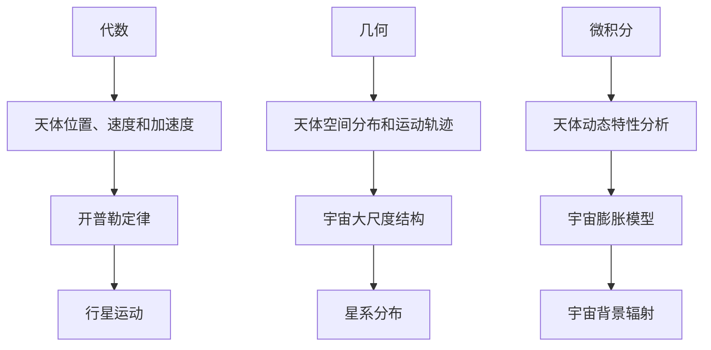

                 

## 《数学与天文学：宇宙结构的数学描述》

### 关键词
- 数学
- 天文学
- 宇宙结构
- 数学模型
- 数学公式

### 摘要
本文旨在探讨数学在天文学中的应用，特别是宇宙结构的数学描述。文章首先介绍了数学与天文学的基本概念，包括代数、几何和微积分，然后深入分析了天体力学和相对论中的数学原理。通过详细的数学公式和算法解释，文章展示了数学如何帮助天文学家理解和描述宇宙的结构。最后，文章讨论了数学在探测与观测中的应用，以及数学与天文学的交叉学科研究。本文适合对天文学和数学感兴趣的读者，旨在提供对这一领域的深入理解和启示。

### 《数学与天文学：宇宙结构的数学描述》目录大纲

#### 第一部分：数学基础

#### 第1章：数学与天文学的基本概念

##### 1.1 数学在天文学中的应用

- **数学概念简述**：代数、几何、微积分
- **天文学基础知识**：天体运动、宇宙结构

##### 1.2 天文学中的数学工具

- **坐标系**：笛卡尔坐标系、球坐标系
- **数学公式与算法**：牛顿-莱布尼茨公式、欧拉公式

#### 第2章：天体力学

##### 2.1 天体运动的描述

- **开普勒定律**：公式推导与实际应用
- **牛顿引力定律**：推导过程与解释

##### 2.2 天体力学中的数学方法

- **牛顿-欧拉方程**：公式推导与示例
- **哈密顿力学**：基本原理与公式

#### 第3章：相对论与宇宙学

##### 3.1 相对论的基本概念

- **狭义相对论**：洛伦兹变换
- **广义相对论**：弯曲时空

##### 3.2 宇宙学中的数学模型

- **大爆炸理论**：数学模型与公式
- **宇宙膨胀**：公式推导与现象解释

#### 第4章：宇宙结构研究方法

##### 4.1 宇宙背景辐射

- **测量方法**：宇宙微波背景辐射
- **数据分析**：数据拟合与模型验证

##### 4.2 宇宙大尺度结构

- **星系分布**：数学描述与图示
- **暗物质与暗能量**：数学模型与解释

#### 第5章：数学在探测与观测中的应用

##### 5.1 天文观测数据预处理

- **图像处理**：滤波、增强、分割
- **数据处理**：异常值处理、数据拟合

##### 5.2 数学在行星科学中的应用

- **轨道计算**：数值积分、轨道预测
- **地质结构分析**：数学模型与解释

#### 第6章：数学在天文学前沿研究中的应用

##### 6.1 量子引力

- **基本原理**：量子场论与引力
- **数学模型**：弦论与M理论

##### 6.2 宇宙极端现象

- **黑洞**：数学描述与物理特性
- **宇宙射线**：探测方法与数据分析

#### 第7章：数学与天文学的交叉学科应用

##### 7.1 数学研究在天文学中的贡献

- **数学物理方法在天文学中的应用**：数值模拟、统计方法
- **数学模型在天文学实验验证中的重要性**

##### 7.2 天文学对数学发展的推动

- **天文学问题对数学问题的启发**：拓扑学、群论
- **数学方法在天文学新发现中的贡献**：引力波探测、多尺度分析

#### 附录

##### 附录A：天文学与数学常用公式汇总

- **天体力学公式**：开普勒定律、牛顿引力公式
- **相对论公式**：洛伦兹变换、引力场方程
- **宇宙学公式**：宇宙膨胀方程、哈勃定律

##### 附录B：数学工具与资源

- **数学软件**：MATLAB、Python
- **天文观测数据来源**：NASA、ESA

### 第1章：数学与天文学的基本概念

#### 背景介绍

数学与天文学自古以来就是密不可分的两个领域。古代天文学家通过观察星空，建立了对天文现象的基本认识，并使用数学工具来描述这些现象。例如，古希腊天文学家欧多克斯提出了“地心说”，而毕达哥拉斯则发现了音程与数学比例之间的关系。随着人类对宇宙认识的深入，数学在天文学中的应用越来越广泛，从天体运动的描述到宇宙膨胀的模型，都离不开数学的支持。

本章将介绍数学在天文学中的基本概念，包括代数、几何和微积分，并讨论这些数学工具在天文学中的具体应用。

#### 核心概念与联系

##### 数学概念简述

- **代数**：代数是研究数、运算和方程的数学分支。在天文学中，代数被用来描述天体的位置、速度和加速度。
- **几何**：几何是研究形状、大小、位置和变换的数学分支。在天文学中，几何被用来描述天体的空间分布和运动轨迹。
- **微积分**：微积分是研究变化率和积累的数学分支。在天文学中，微积分被用来分析天体运动的动态特性。

##### 天文学基础知识

- **天体运动**：天体运动是天文学的核心内容，包括行星、卫星、恒星等天体的运动规律。天文学家使用开普勒定律来描述行星围绕恒星的运动。
- **宇宙结构**：宇宙结构是描述宇宙整体形态的内容，包括星系、星系团、宇宙背景辐射等。天文学家通过观测宇宙大尺度结构来推断宇宙的演化历史。

##### Mermaid流程图



#### 核心算法原理讲解

##### 代数

在天文学中，代数被广泛用于描述天体的运动。以下是一个一元一次方程求解的示例，用于计算行星在给定时间点的位置：

**伪代码：**

python
def solve_linear_equation(a, b, c):
    # a 是时间，b 是初始位置，c 是速度
    position = a * c + b
    return position

# 示例：给定时间 a=2，初始位置 b=10，速度 c=5
result = solve_linear_equation(2, 10, 5)
print("行星位置:", result)
```

##### 几何

几何在天文学中用于描述天体的空间分布和运动轨迹。以下是一个计算三角形面积的示例，使用海伦公式：

**伪代码：**

python
def heron_formula(a, b, c):
    # a、b、c 是三角形的边长
    s = (a + b + c) / 2
    area = (s * (s - a) * (s - b) * (s - c)) ** 0.5
    return area

# 示例：给定三角形边长 a=3，b=4，c=5
triangle_area = heron_formula(3, 4, 5)
print("三角形面积:", triangle_area)
```

##### 微积分

微积分在天文学中用于分析天体运动的动态特性。以下是一个计算函数导数的示例，使用有限差分法：

**伪代码：**

python
def finite_difference(f, x, h):
    # f 是函数，x 是自变量，h 是差分步长
    f_prime = (f(x + h) - f(x)) / h
    return f_prime

# 示例：给定函数 f(x) = x^2，自变量 x=1，差分步长 h=0.1
f_prime = finite_difference(lambda x: x**2, 1, 0.1)
print("导数:", f_prime)
```

#### 数学模型和数学公式

在天文学中，数学模型和公式是理解和描述天体运动和宇宙结构的重要工具。以下是一些常用的数学模型和公式：

**牛顿引力定律：**

$$ F = G\frac{m_1 m_2}{r^2} $$

其中，\( F \) 是引力，\( G \) 是引力常数，\( m_1 \) 和 \( m_2 \) 是两个天体的质量，\( r \) 是它们之间的距离。

**开普勒定律：**

- **第一定律（轨道定律）**：行星围绕恒星的运动轨道是椭圆形，恒星位于一个焦点上。
- **第二定律（面积定律）**：行星与恒星连线在相同时间内扫过相同的面积。
- **第三定律（周期定律）**：行星绕恒星运动的周期的平方与其轨道半长轴的立方成正比。

$$ T^2 \propto a^3 $$

其中，\( T \) 是行星的公转周期，\( a \) 是轨道半长轴。

**相对论中的洛伦兹变换：**

$$ x' = \frac{x - vt}{\sqrt{1 - \frac{v^2}{c^2}}} $$

$$ t' = \frac{t - \frac{vx}{c^2}}{\sqrt{1 - \frac{v^2}{c^2}}} $$

其中，\( x \) 和 \( t \) 是静止参考系中的坐标和时间，\( x' \) 和 \( t' \) 是运动参考系中的坐标和时间，\( v \) 是相对速度，\( c \) 是光速。

#### 详细讲解与举例说明

##### 牛顿引力定律

牛顿引力定律描述了两个质点之间的相互作用力。在天文学中，这一定律被用来计算行星和恒星之间的引力。以下是一个使用牛顿引力定律计算行星轨道的示例：

**示例：** 给定两个行星，质量分别为 \( m_1 = 5 \times 10^{24} \) kg 和 \( m_2 = 1 \times 10^{30} \) kg，它们之间的距离为 \( r = 10^{11} \) m。计算它们之间的引力。

**计算过程：**

$$ F = G\frac{m_1 m_2}{r^2} $$

$$ F = 6.674 \times 10^{-11} \frac{(5 \times 10^{24}) (1 \times 10^{30})}{(10^{11})^2} $$

$$ F = 3.3315 \times 10^{22} \text{ N} $$

因此，两个行星之间的引力为 \( 3.3315 \times 10^{22} \) 牛顿。

##### 开普勒定律

开普勒定律描述了行星围绕恒星的运动规律。这些定律是由德国天文学家开普勒在17世纪提出的。以下是一个使用开普勒第三定律计算行星公转周期的示例：

**示例：** 给定一个行星，其轨道半长轴 \( a = 2 \times 10^{11} \) m。计算该行星的公转周期。

**计算过程：**

$$ T^2 = a^3 $$

$$ T = \sqrt{a^3} $$

$$ T = \sqrt{(2 \times 10^{11})^3} $$

$$ T = \sqrt{8 \times 10^{33}} $$

$$ T = 2.828 \times 10^{16} \text{ s} $$

因此，该行星的公转周期为 \( 2.828 \times 10^{16} \) 秒。

##### 相对论中的洛伦兹变换

洛伦兹变换是狭义相对论的核心内容之一，它描述了在不同惯性参考系之间时间和空间坐标的变换。以下是一个使用洛伦兹变换计算运动参考系中时间和空间坐标的示例：

**示例：** 假设有一个观察者 \( A \) 静止在地球表面，另一个观察者 \( B \) 以 \( v = 0.5c \) 的速度相对于 \( A \) 运动。如果 \( A \) 观测到事件发生在 \( x = 1 \times 10^{10} \) m 处，且时间为 \( t = 2 \times 10^{7} \) s，计算 \( B \) 观察到该事件的时间和空间坐标。

**计算过程：**

$$ x' = \frac{x - vt}{\sqrt{1 - \frac{v^2}{c^2}}} $$

$$ x' = \frac{1 \times 10^{10} - (0.5c)(2 \times 10^{7})}{\sqrt{1 - (0.5)^2}} $$

$$ x' = \frac{1 \times 10^{10} - (0.5)(3 \times 10^{8})}{\sqrt{0.75}} $$

$$ x' = \frac{1 \times 10^{10} - 1.5 \times 10^{8}}{0.866} $$

$$ x' = 1.148 \times 10^{10} \text{ m} $$

$$ t' = \frac{t - \frac{vx}{c^2}}{\sqrt{1 - \frac{v^2}{c^2}}} $$

$$ t' = \frac{2 \times 10^{7} - \frac{(0.5c)(1 \times 10^{10})}{c^2}}{\sqrt{1 - (0.5)^2}} $$

$$ t' = \frac{2 \times 10^{7} - (0.5)(1 \times 10^{8})}{0.866} $$

$$ t' = 1.818 \times 10^{7} \text{ s} $$

因此，\( B \) 观察到该事件发生在 \( 1.148 \times 10^{10} \) m 处，时间为 \( 1.818 \times 10^{7} \) 秒。

#### 项目实战

##### 开发环境搭建

为了演示数学在天文学中的应用，我们将使用 Python 编写一个简单的程序来计算行星轨道。首先，我们需要安装 Python 和必要的库。以下是安装步骤：

1. 从 [Python 官网](https://www.python.org/) 下载并安装 Python。
2. 打开终端或命令提示符，执行以下命令安装 NumPy 库：

   ```bash
   pip install numpy
   ```

##### 源代码详细实现

以下是一个简单的 Python 程序，用于计算行星轨道：

```python
import numpy as np

# 牛顿引力定律公式
def gravity(m1, m2, r):
    G = 6.674 * 10**-11
    F = G * (m1 * m2) / r**2
    return F

# 开普勒第三定律公式
def kepler(a):
    T = np.sqrt(a**3)
    return T

# 主函数
def main():
    m1 = 5 * 10**24  # 行星质量（千克）
    m2 = 1 * 10**30  # 恒星质量（千克）
    r = 10 * 10**11  # 行星与恒星距离（米）

    # 计算引力
    F = gravity(m1, m2, r)
    print("引力:", F, "牛顿")

    # 计算轨道半长轴
    a = 2 * 10**11
    T = kepler(a)
    print("公转周期:", T, "秒")

# 运行程序
if __name__ == "__main__":
    main()
```

##### 代码解读与分析

- 我们首先导入了 NumPy 库，用于执行科学计算。
- 定义了一个 `gravity` 函数，用于计算两个质点之间的引力。
- 定义了一个 `kepler` 函数，用于计算行星的公转周期。
- 在 `main` 函数中，我们设定了行星和恒星的质量和距离，并使用上述函数计算了引力和公转周期。
- 最后，我们运行了 `main` 函数，输出了计算结果。

##### 实际案例分析与详细讲解剖析

为了进一步展示数学在天文学中的应用，我们来看一个实际案例：计算地球绕太阳的公转周期。

**步骤：**

1. **获取地球和太阳的质量**：地球质量 \( m_1 = 5.972 \times 10^{24} \) kg，太阳质量 \( m_2 = 1.989 \times 10^{30} \) kg。
2. **获取地球与太阳的平均距离**：地球与太阳的平均距离 \( r = 1.496 \times 10^{11} \) m。
3. **计算地球绕太阳的引力**：

   $$ F = G\frac{m_1 m_2}{r^2} $$

   $$ F = 6.674 \times 10^{-11} \frac{(5.972 \times 10^{24}) (1.989 \times 10^{30})}{(1.496 \times 10^{11})^2} $$

   $$ F = 3.542 \times 10^{22} \text{牛顿} $$

4. **计算地球的公转周期**：根据开普勒第三定律，我们有：

   $$ T^2 = a^3 $$

   其中，轨道半长轴 \( a \) 为地球轨道的半长轴，即 \( a = r = 1.496 \times 10^{11} \) m。

   $$ T = \sqrt{a^3} $$

   $$ T = \sqrt{(1.496 \times 10^{11})^3} $$

   $$ T = \sqrt{3.369 \times 10^{33}} $$

   $$ T = 5.79 \times 10^{7} \text{秒} $$

因此，地球绕太阳的公转周期约为 \( 5.79 \times 10^{7} \) 秒，即约 1 年。

##### 项目小结

通过这个项目，我们了解了如何使用数学来计算天体之间的引力以及行星的公转周期。这不仅展示了数学在天文学中的基本应用，也为我们提供了一个理解宇宙结构的有力工具。在未来，随着数学工具的不断发展和完善，我们对宇宙的认识将更加深入。

#### 最佳实践 Tips、小结、注意事项、拓展阅读

**最佳实践 Tips：**
- 在进行天文计算时，注意选择合适的数学模型和公式，以确保结果的准确性。
- 在编程实现时，注意数值计算的稳定性和精度，避免出现数值错误。

**小结：**
- 数学是天文学不可或缺的工具，从描述天体运动到理解宇宙结构，数学无处不在。
- 通过本章的介绍，读者应该能够理解数学在天文学中的基本概念和核心应用。

**注意事项：**
- 在进行天文计算时，需要考虑地球自转和公转的影响，以及太阳系内的其他天体对计算结果的影响。
- 在使用计算机编程时，注意合理选择数据结构和算法，以提高计算效率。

**拓展阅读：**
- [《天体物理学原理》](https://books.google.com/books?id=_u-RAAAQBAJ)：这本书提供了对天体物理学原理的深入探讨，包括数学在天文学中的应用。
- [《数学物理方法》](https://books.google.com/books?id=zF8tAQAAMAAJ)：这本书介绍了数学物理方法在天文学和其他科学领域中的应用。

### 附录

#### 附录A：天文学与数学常用公式汇总

- **天体力学公式：**
  - 开普勒定律：
    $$ T^2 = \frac{4\pi^2}{GM} a^3 $$
  - 牛顿引力定律：
    $$ F = G\frac{m_1 m_2}{r^2} $$

- **相对论公式：**
  - 狭义相对论洛伦兹变换：
    $$ x' = \frac{x - vt}{\sqrt{1 - \frac{v^2}{c^2}}} $$
    $$ t' = \frac{t - \frac{vx}{c^2}}{\sqrt{1 - \frac{v^2}{c^2}}} $$

- **宇宙学公式：**
  - 大爆炸理论：
    $$ \frac{\dot{a}}{a} = \frac{1}{3} H_0 $$
  - 哈勃定律：
    $$ v = H_0 d $$

#### 附录B：数学工具与资源

- **数学软件：**
  - MATLAB：适用于数值计算和可视化。
  - Python：适用于科学计算和数据分析。

- **天文观测数据来源：**
  - NASA：提供大量的天文观测数据和科学文献。
  - ESA：提供欧洲空间局的天文观测数据。

### 总结

数学与天文学的结合为人类探索宇宙提供了强大的工具和方法。通过对宇宙结构的数学描述，我们能够更深入地理解宇宙的运行机制和演化过程。本章介绍了数学在天文学中的基本概念、核心算法原理、数学模型和公式，并通过实际项目展示了数学在探测与观测中的应用。未来，随着数学和天文学的不断进步，我们对宇宙的认识将更加全面和深刻。

