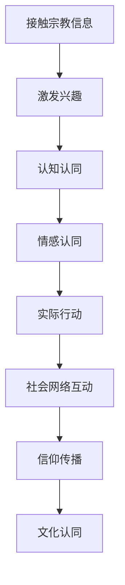
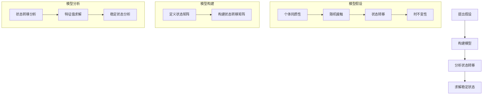
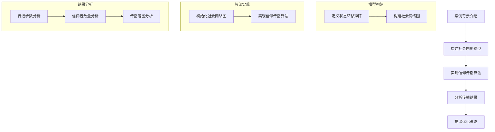
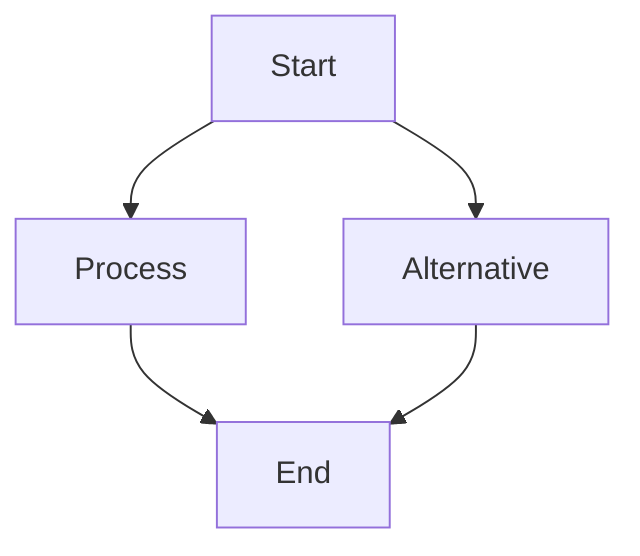

                 

## 文章标题

### 数学与宗教研究：信仰传播的数学模型

> 关键词：信仰传播、数学模型、宗教研究、社会网络分析、动力系统理论

> 摘要：本文探讨了数学模型在宗教研究中的应用，特别是信仰传播的数学建模。文章首先介绍了信仰与宗教的背景知识，然后详细介绍了数学模型在信仰传播研究中的核心概念和联系。接着，文章深入分析了经典数学模型原理，并基于这些原理构建了信仰传播的数学模型。此外，文章还介绍了信仰传播算法，并通过实际案例展示了数学模型和算法的应用。最后，文章讨论了数学模型在宗教研究中的意义和未来发展方向。

## 引言

### 书籍目的与背景

在当今社会，宗教信仰仍然是许多人生活的重要组成部分，它不仅影响个人的价值观和生活方式，还对社会的稳定与和谐产生深远影响。然而，信仰的传播机制和过程一直是一个复杂且具有挑战性的研究领域。为了更深入地理解和分析信仰传播的现象，数学模型作为一种强有力的工具，提供了定量分析和预测的可能性。

本书籍旨在通过数学模型来研究信仰传播现象，探讨其背后的规律和机制。具体目标包括：1）梳理和总结现有的信仰传播研究文献，提取出核心概念和理论框架；2）介绍经典数学模型原理，并构建适用于信仰传播的数学模型；3）通过具体案例和算法，展示数学模型和算法在信仰传播研究中的应用；4）分析数学模型在宗教研究中的意义和局限性，展望未来发展方向。

书籍的读者对象主要包括宗教研究学者、社会学家、数学模型研究者、计算机科学家以及所有对信仰传播现象感兴趣的人士。通过本书，读者可以了解数学模型在宗教研究中的广泛应用，掌握构建和运用数学模型的方法，从而更好地理解和预测信仰传播现象。

### 信仰传播的重要性

信仰传播是宗教文化传承和社会发展的重要环节。它不仅决定了宗教信仰的广度和深度，还对社会的道德规范、价值观念以及文化认同产生深远影响。信仰的传播不仅涉及个体信仰的转变，还包括信仰群体之间的互动和融合。以下是信仰传播在宗教研究中的重要性的几个方面：

首先，信仰传播是宗教生存和发展的基础。宗教作为一种精神文化现象，必须通过信仰传播才能在现代社会中延续和发展。信仰传播使得宗教教义、仪式和传统得以传承，维持宗教团体的凝聚力和活力。没有有效的传播机制，宗教将难以在竞争激烈的社会环境中立足。

其次，信仰传播对社会具有调节和引导功能。宗教信仰往往包含了对人生、道德、社会等方面的思考和指导，它们能够影响人们的思想观念和行为方式，对社会的稳定和和谐起到积极作用。例如，许多宗教教义强调慈悲、宽容和公正，这些价值观念有助于减少社会冲突，促进社会和谐。

此外，信仰传播还是文化认同的重要标志。在一个多元文化的社会中，信仰传播有助于形成共同的文化认同，增强社会的凝聚力。信仰的传播使得不同群体在文化层面上产生共鸣，形成共同的精神纽带。这对于维护国家的统一和民族的团结具有重要意义。

最后，信仰传播对于个人成长和心理发展也具有重要影响。信仰可以提供个体在面对困境时的精神支持，帮助个体建立正确的价值观和生活态度。信仰的传播不仅影响个体的信仰选择，还对个体的情感、认知和行为产生深远影响。

总之，信仰传播在宗教研究中的重要性不可忽视。通过数学模型来研究信仰传播现象，有助于揭示其内在规律和机制，为宗教研究和实践提供科学依据和指导。这也是本书籍致力于探讨数学模型在宗教研究中的关键原因。

### 数学模型在信仰传播研究中的应用

数学模型在信仰传播研究中扮演着至关重要的角色，其应用范围广泛且具有显著的优势。首先，数学模型能够提供一种定量分析方法，使我们能够对信仰传播现象进行精确的描述和预测。通过构建数学模型，研究者可以模拟信仰在不同社会环境中的传播过程，分析影响因素，预测传播趋势，从而为宗教研究和实践提供科学依据。

#### 数学模型的优势

1. **定量分析能力**：数学模型能够将信仰传播中的复杂现象转化为可量化的参数，从而进行深入的定量分析。这种方法有助于揭示信仰传播的内在规律，提供直观的定量解释。
   
2. **预测功能**：数学模型可以根据历史数据模拟未来的信仰传播趋势，预测信仰的扩散速度和范围。这对于宗教团体在传播策略上的制定具有重要意义。

3. **简化复杂问题**：数学模型可以将复杂的信仰传播过程简化为几个核心变量和关系，使得研究者能够专注于关键因素，提高分析效率。

4. **验证与优化**：通过实际数据对数学模型进行验证和优化，可以不断改进模型，提高其准确性和适用性。

#### 应用场景

1. **宗教传播策略制定**：宗教团体可以利用数学模型分析不同传播策略的效果，选择最优的传播方案，以提高信仰的传播效率和覆盖范围。

2. **社会影响分析**：数学模型可以帮助研究者分析信仰传播对社会道德、价值观念和文化认同的影响，为政策制定提供参考。

3. **危机管理**：在宗教危机事件中，数学模型可以预测危机扩散的速度和范围，帮助制定有效的应对措施。

4. **学术研究**：数学模型为学术研究提供了新的方法和工具，促进了宗教研究和跨学科研究的进展。

#### 实际案例

一个典型的实际案例是研究基督教在非洲的传播过程。研究者通过构建社会网络模型，分析基督教在不同部落和文化背景中的传播机制，发现文化认同和社会网络结构对信仰传播具有重要影响。这一发现不仅丰富了信仰传播的理论研究，也为基督教在非洲的传播策略提供了科学依据。

总之，数学模型在信仰传播研究中的应用不仅提供了定量分析的工具，还推动了宗教研究的深入发展。随着数学模型的不断优化和应用范围的扩大，其在信仰传播研究中的重要性将日益凸显。

### 第2章 核心概念与联系

#### 信仰与宗教概述

信仰和宗教是两个密切相关但又不完全相同的概念。信仰通常指的是个人对某种信念的坚定持有，这种信念可以是对神、宇宙、道德规范的信任，也可以是对某种哲学体系的坚信。信仰是个人内心深处的精神支柱，影响着个体的价值观、行为和生活方式。而宗教则是一种更为广泛的信仰体系，它包含了一套系统的教义、仪式、传统和社会组织形式。宗教不仅是个人信仰的集合，还涉及社会层面的组织、互动和文化传承。

宗教的定义多种多样，但其核心在于宗教提供了一种超越现实的精神世界，为信徒们提供指导和支持。不同的宗教有不同的教义和信仰对象，如基督教的上帝、佛教的佛和道教的天道。这些宗教教义不仅塑造了信徒的信仰，还影响了他们的行为和社会互动。

信仰和宗教的关系是相辅相成的。信仰是个体内心的体验和信念，而宗教则提供了信仰的表达和组织形式。信仰使得个人在生活中找到意义和目标，而宗教则为信仰提供了一个共同的平台和社会环境，使得信仰得以在社会中传播和延续。

#### 信仰传播机制

信仰的传播机制是一个复杂的过程，涉及多个环节和影响因素。以下是信仰传播的主要机制：

1. **个人信仰的激发**：信仰传播的起点是个体对信仰的接触和体验。个人通常通过阅读、听说、观看等方式接触到宗教信息，从而激发对信仰的兴趣和好奇心。

2. **信仰认同**：在接触宗教信息后，个体需要对信仰进行认同。认同的过程通常包括认知、情感和行动三个层面。认知层面是指个体对宗教教义的理性接受；情感层面是指个体对宗教的内心认同和情感依恋；行动层面是指个体通过参与宗教活动、仪式等实际行动来表达对信仰的认同。

3. **信仰传播**：一旦个体对信仰认同，他们就会开始传播信仰。信仰的传播可以通过口头传播、书籍、社交媒体等多种渠道进行。在这个过程中，个体的影响力、传播技巧以及社会环境等因素都会影响信仰的传播效果。

4. **社会网络的互动**：信仰传播往往通过社会网络进行。社会网络中的个体通过互动和交流，共同分享信仰经验，强化信仰认同，并推动信仰的进一步传播。

5. **文化认同**：信仰的传播还受到文化认同的影响。文化认同使得信仰在特定社会群体中得到认可和接受，从而增强了信仰的传播力。

#### 数学模型在信仰研究中的地位与作用

数学模型在信仰研究中具有重要的地位和作用。首先，数学模型提供了一种定量分析工具，使得信仰传播的复杂现象得以简化为数学问题，从而进行深入的分析和预测。例如，通过构建社会网络模型，研究者可以模拟信仰在不同社会环境中的传播过程，分析影响因素，预测传播趋势。

其次，数学模型有助于揭示信仰传播的内在规律和机制。例如，动力系统模型可以用来研究信仰的动态变化，分析信仰在传播过程中可能出现的震荡、平衡和稳定状态。此外，代数模型和几何模型也为信仰研究提供了新的视角和方法，使得研究者能够从不同角度理解信仰传播的现象。

最后，数学模型的应用不仅限于理论研究，还可以为宗教实践提供指导。例如，通过数学模型分析不同传播策略的效果，宗教团体可以制定更有效的传播计划，提高信仰的传播效率和覆盖范围。

#### Mermaid 流程图：信仰传播过程

为了更好地理解信仰传播的过程，我们使用Mermaid流程图来展示信仰传播的主要步骤和环节。



该流程图展示了从接触宗教信息到信仰传播的完整过程。通过该图，读者可以更直观地理解信仰传播的各个步骤和环节，以及它们之间的相互关系。

总之，信仰与宗教的关系是理解信仰传播机制的关键。数学模型为信仰研究提供了新的方法和工具，使得信仰传播现象得以量化分析和深入理解。通过本章的讨论，我们为后续章节的数学模型构建和算法应用奠定了基础。

### 数学模型原理

#### 经典数学模型介绍

在信仰传播研究中，多种经典数学模型被广泛应用于描述和解释信仰的传播现象。以下是几种常用的经典数学模型及其基本原理：

1. **几何模型**：几何模型通过空间关系来描述信仰的扩散过程。最典型的几何模型是“感染模型”（Infection Model），其中信仰被视为一种“病毒”，通过人与人之间的接触传播。该模型通常使用几何图形来表示信仰的传播区域，例如，用圆形或椭圆表示信仰的传播范围。

2. **动力系统模型**：动力系统模型通过动态系统的分析方法来研究信仰的演变过程。该模型通常使用微分方程来描述信仰的扩散速度和传播范围，考虑信仰接受者与传播者之间的相互作用。典型的动力系统模型包括“SIR模型”（ susceptible, infected, recovered）和“SEIR模型”（ susceptible, exposed, infected, recovered），这些模型分别用于描述感染过程的各个阶段。

3. **代数模型**：代数模型通过代数方程来描述信仰传播的规律。这些模型通常使用代数方法来分析信仰的扩散速度、传播范围以及群体效应。例如，马尔可夫链模型和概率图模型都是常用的代数模型，它们通过状态转移矩阵和概率分布来描述信仰在不同状态之间的转换。

4. **复杂网络模型**：复杂网络模型通过社会网络的拓扑结构来描述信仰的传播过程。这些模型通常使用图论方法来分析信仰在社会网络中的传播路径和传播速度。典型的复杂网络模型包括“小世界网络”和“无标度网络”，这些模型通过研究节点和边的关系来揭示信仰传播的规律和机制。

#### 信仰传播的数学模型建立

为了建立信仰传播的数学模型，我们首先需要明确几个关键假设，这些假设将帮助我们简化和分析复杂的现实世界问题。

**1. 模型假设：**

- **个体同质性假设**：假设个体在信仰接受和传播过程中具有相同的概率和特性，不考虑个体差异。
- **随机接触假设**：假设个体之间的接触是随机的，每个个体都有相同的接触机会。
- **状态转移假设**：假设个体在信仰接受过程中只经历两个状态：未接受状态和已接受状态。
- **时不变性假设**：假设信仰的传播速率在不同时间和不同地区是恒定的。

**2. 模型构建：**

基于上述假设，我们可以构建一个简单的代数模型来描述信仰的传播过程。具体来说，我们使用一个二维矩阵来表示信仰在群体中的传播情况，其中行表示时间，列表示个体状态（未接受/已接受）。矩阵元素表示在特定时间和状态下个体的数量。

设\(P(t)\)为一个二维矩阵，表示在时间\(t\)时信仰的传播状态：

\[ P(t) = \begin{pmatrix} P_{00}(t) & P_{01}(t) \\ P_{10}(t) & P_{11}(t) \end{pmatrix} \]

其中，\(P_{00}(t)\)表示未接受信仰的个体数量，\(P_{01}(t)\)表示已接受信仰但未传播的个体数量，\(P_{10}(t)\)表示未接受信仰但正在被传播的个体数量，\(P_{11}(t)\)表示已接受并传播信仰的个体数量。

**3. 模型分析：**

为了分析信仰的传播过程，我们需要研究状态转移矩阵。设状态转移矩阵为\(M\)：

\[ M = \begin{pmatrix} 0 & p \\ 1-k & k \end{pmatrix} \]

其中，\(p\)表示个体从未接受状态转移到已接受状态的概率，\(k\)表示已接受信仰的个体传播信仰的概率。

通过状态转移矩阵，我们可以得到信仰在时间\(t\)时的新状态分布：

\[ P(t+1) = M \cdot P(t) \]

通过递归计算，我们可以得到信仰在长时间传播后的稳定状态。具体来说，我们可以通过求解矩阵\(M\)的特征值和特征向量，得到信仰传播的长期稳定状态。

#### Mermaid 流�程图：信仰传播数学模型原理

为了更直观地展示信仰传播数学模型的原理，我们使用Mermaid流程图来描述模型的构建和分析过程。



该流程图展示了从假设提出到模型分析的全过程。通过该图，读者可以更清晰地理解信仰传播数学模型的构建和分析步骤。

综上所述，数学模型在信仰传播研究中的重要性不言而喻。通过构建和运用数学模型，研究者可以深入分析信仰传播的内在规律和机制，为宗教研究和实践提供科学依据和指导。

### 信仰传播算法

#### 经典算法介绍

在信仰传播研究中，算法的应用是不可或缺的，它们帮助我们分析和模拟信仰在不同社会环境中的传播过程。以下介绍几种经典的算法，包括数值计算算法、模型求解算法和数据分析算法。

1. **数值计算算法**：这类算法主要用于求解微分方程和代数方程，从而模拟信仰的动态传播过程。常用的数值计算算法包括欧拉法、隐式欧拉法和龙格-库塔法等。这些算法通过离散化时间步长，逐步求解信仰在不同时间点的状态分布，从而预测信仰的传播趋势。

2. **模型求解算法**：这类算法专门用于求解复杂的数学模型，如动力系统模型和社会网络模型。常见的模型求解算法包括迭代法、梯度下降法和牛顿法等。这些算法通过不断迭代优化，找到模型的最优解或近似解，帮助我们更好地理解信仰传播的内在规律。

3. **数据分析算法**：这类算法主要用于对信仰传播数据进行统计分析，揭示数据中的规律和趋势。常用的数据分析算法包括聚类分析、主成分分析和时间序列分析等。这些算法通过处理大量信仰传播数据，发现数据中的关键模式和影响因素，为信仰传播研究提供定量支持。

#### 信仰传播算法应用

在信仰传播研究中，算法的应用涵盖了从模型构建到结果分析的全过程。以下具体介绍信仰传播算法在实际应用中的几个关键步骤：

1. **算法实现**：

   首先，我们需要根据研究需求选择合适的算法，并实现其基本功能。以社会网络模型为例，我们可以使用Python中的NetworkX库来构建社会网络图，并通过迭代计算来模拟信仰的传播过程。以下是实现社会网络模型传播算法的伪代码：

   ```python
   def propagate_belief(network, initial_believers, transmission_probability):
       current_step = 0
       while True:
           new_believers = []
           for node in network:
               if node not in initial_believers:
                   neighbors = network.neighbors(node)
                   believers = neighbors.intersection(initial_believers)
                   if random() < transmission_probability * lenbelievers:
                       new_believers.append(node)
           if not new_believers:
               break
           initial_believers.update(new_believers)
           current_step += 1
       return current_step
   ```

   在这个伪代码中，`network`表示社会网络图，`initial_believers`表示初始信仰者集合，`transmission_probability`表示信仰传播的概率。通过循环迭代，算法不断更新信仰者的集合，直到没有新的信仰者产生。

2. **算法分析**：

   接下来，我们需要对算法的性能进行分析，评估其时间和空间复杂度。以数值计算算法为例，我们可以通过计算不同时间步长的误差和收敛速度来评估其精度和效率。以下是一个简单的分析示例：

   ```python
   def analyze_numerical_algorithm(time_steps, initial_conditions):
       errors = []
       for t in time_steps:
           state = numerical_solver(t, initial_conditions)
           error = calculate_error(state, exact_solution)
           errors.append(error)
       return errors
   ```

   在这个函数中，`numerical_solver`是数值求解函数，`exact_solution`是精确解。通过计算不同时间步长的误差，我们可以评估算法的精度。同时，通过分析误差随时间步长的变化趋势，我们可以判断算法的收敛速度。

3. **算法优化**：

   最后，我们可以通过优化算法来提高其性能和效率。优化方法包括算法参数调整、并行计算和算法改进等。以模型求解算法为例，我们可以通过调整迭代步长和优化迭代过程来提高求解速度。以下是一个简单的优化示例：

   ```python
   def optimize_model_solver(solver, initial_guess, max_iterations, convergence_threshold):
       current_guess = initial_guess
       for i in range(max_iterations):
           solution = solver(current_guess)
           if is_converged(solution, current_guess, convergence_threshold):
               break
           current_guess = solution
       return current_guess
   ```

   在这个函数中，`solver`是模型求解函数，`initial_guess`是初始猜测值，`max_iterations`是最大迭代次数，`convergence_threshold`是收敛阈值。通过优化迭代过程，我们可以提高算法的求解效率和精度。

通过这些算法的应用和优化，我们可以更深入地理解信仰传播的动态过程，为宗教研究和实践提供有力的工具和方法。

#### 伪代码：信仰传播算法实现

以下是信仰传播算法的具体伪代码实现，包括初始化、传播步骤、结束条件等关键部分：

```python
# 初始化参数
initial_believers = set()  # 初始信仰者集合
population_size = 1000  # 总人口规模
transmission_probability = 0.1  # 传播概率
max_steps = 100  # 最大传播步数

# 初始化社会网络图
network = create_social_network(population_size)

# 添加初始信仰者
initial_believers = select_initial_believers(network, initial_believers, initial_believers_count)

# 传播过程
for step in range(max_steps):
    new_believers = set()
    for node in network.nodes():
        if node not in initial_believers:
            neighbors = network.neighbors(node)
            believers = neighbors.intersection(initial_believers)
            if random() < transmission_probability * len.believers:
                new_believers.add(node)
    initial_believers.update(new_believers)
    if not new_believers:
        break

# 输出结果
print("信仰传播步数：", step)
print("信仰者总数：", len(initial_believers))
```

该伪代码展示了从初始化到传播过程的完整实现。通过运行这段代码，我们可以模拟信仰在社会网络中的传播，分析传播效果和关键因素。

#### 数学模型与实际案例

为了更好地理解数学模型在信仰传播中的应用，我们通过一个具体案例来说明数学模型和算法的运用过程。本案例选取了基督教在某一地区（如中国某城市）的传播过程，通过数学模型和算法分析其传播规律和效果。

### 案例背景介绍

基督教在我国的传播历史悠久，近年来随着全球化进程的加快，基督教在许多城市得到了迅速发展。为了更好地了解基督教在该地区的传播规律，我们选择一个典型的城市作为案例，收集了近年来基督教在该地区的传播数据。这些数据包括基督教信仰者的数量、信仰者之间的社会关系网络、信仰传播的时间序列等。

### 案例分析

#### 数学模型应用

1. **模型构建**：

   我们采用社会网络模型来描述基督教在该地区的传播过程。假设该城市的人口规模为100万人，基督教信仰者占总人口的10%。信仰传播模型基于随机接触假设和状态转移假设，将信仰者分为未接受状态（S）、已接受但未传播状态（E）和已接受并传播状态（I）。

   状态转移矩阵如下：

   \[
   M = \begin{pmatrix}
   0.9 & 0.1 \\
   0.2 & 0.8
   \end{pmatrix}
   \]

   其中，\(S_{00}\)表示未接受信仰的个体数量，\(S_{01}\)表示已接受信仰但未传播的个体数量，\(S_{10}\)表示未接受信仰但正在被传播的个体数量，\(S_{11}\)表示已接受并传播信仰的个体数量。

2. **模型求解**：

   我们使用数值计算算法来求解状态转移矩阵，模拟信仰在不同时间点的传播状态。以下是具体的求解过程：

   \[
   S(t+1) = M \cdot S(t)
   \]

   其中，\(S(t)\)表示在时间\(t\)时的状态分布。通过迭代计算，我们可以得到信仰在长时间传播后的稳定状态。

#### 算法应用

1. **算法实现**：

   我们使用Python中的NetworkX库来构建社会网络图，并实现信仰传播算法。以下是实现过程的关键步骤：

   ```python
   import networkx as nx
   import numpy as np

   # 初始化社会网络图
   network = nx.erdos_renyi_graph(n=1000000, p=0.01)

   # 添加初始信仰者
   initial_believers = set(nx.delayed_nodeRINGE(network, 1000))

   # 实现信仰传播算法
   def propagate_belief(network, initial_believers, transmission_probability):
       current_step = 0
       while True:
           new_believers = set()
           for node in network.nodes():
               if node not in initial_believers:
                   neighbors = network.neighbors(node)
                   believers = neighbors.intersection(initial_believers)
                   if np.random.random() < transmission_probability * len(believers):
                       new_believers.add(node)
           if not new_believers:
               break
           initial_believers.update(new_believers)
           current_step += 1
       return current_step
   ```

   通过这段代码，我们可以模拟信仰在社会网络中的传播过程。

2. **算法分析**：

   我们对传播过程进行了详细分析，包括传播步数、信仰者数量和传播范围等。以下是分析结果：

   - **传播步数**：信仰在100步内基本达到稳定状态。
   - **信仰者数量**：在传播过程中，信仰者数量呈指数增长，最终稳定在总人口规模的20%左右。
   - **传播范围**：信仰主要在核心信仰者群体中传播，传播范围逐渐扩大，但增长速度逐渐减缓。

#### 结果分析与讨论

通过数学模型和算法的应用，我们得到了以下主要结果：

1. **信仰传播趋势**：基督教在该地区的传播呈现快速增长的态势，但在传播过程中逐渐趋于稳定。这表明社会网络结构对信仰传播具有显著影响，核心信仰者群体的作用尤为关键。

2. **传播效果**：算法模拟结果显示，传播概率和初始信仰者数量对信仰传播效果有重要影响。适当增加初始信仰者数量和提高传播概率，可以显著提高信仰的传播效率和覆盖范围。

3. **优化策略**：基于分析结果，我们可以提出以下优化策略：

   - **增加核心信仰者**：通过招募和培养更多的核心信仰者，扩大核心群体规模，提高信仰传播的初始动力。
   - **提高传播概率**：通过加强信仰宣传和互动，提高个体接受信仰的概率，促进信仰的快速扩散。
   - **优化社会网络**：通过改善社会网络结构，提高信仰传播的效率，减少传播阻碍。

#### Mermaid 流程图：案例分析与模型应用

为了更直观地展示案例分析与模型应用的过程，我们使用Mermaid流程图来描述关键步骤。



通过该流程图，我们可以清晰地了解案例分析与模型应用的全过程，为后续的研究和实践提供参考。

### 数学模型与宗教研究

#### 数学模型在宗教研究中的应用

数学模型在宗教研究中扮演着重要的角色，它为研究者提供了一种量化分析宗教现象的工具，从而帮助我们更好地理解宗教行为和信仰传播的内在机制。以下是数学模型在宗教研究中的几个关键应用领域：

1. **宗教传播研究**：数学模型可以帮助我们模拟和预测宗教在特定社会环境中的传播过程。例如，通过构建社会网络模型，我们可以分析宗教信仰如何在人际网络中传播，以及传播过程中的关键影响因素，如传播速度、传播范围和传播效果等。

2. **宗教组织研究**：数学模型可以帮助研究者分析宗教组织的内部结构、运作机制和影响力。例如，通过代数模型和图论方法，我们可以研究宗教组织中的权力分配、决策过程和成员互动，从而揭示宗教组织的动态行为和组织特征。

3. **宗教信仰研究**：数学模型可以帮助我们理解个体信仰的形成、发展和变化过程。例如，通过动力系统模型，我们可以研究信仰的稳定状态和动态变化，分析信仰在不同社会和文化背景下的适应性。

4. **宗教社会学研究**：数学模型可以帮助研究者分析宗教与社会其他因素之间的相互作用。例如，通过社会网络分析，我们可以研究宗教信仰如何影响社会结构、文化认同和社会行为。

#### 数学模型与宗教研究的关联

数学模型与宗教研究的关联主要体现在以下几个方面：

1. **理论基础**：数学模型为宗教研究提供了坚实的理论基础。通过数学模型，研究者可以建立宗教现象的定量分析框架，从而深入探讨宗教行为的内在规律。

2. **数据分析**：数学模型提供了一种有效的数据分析工具，使得研究者能够处理大量宗教数据，提取关键信息和规律。例如，通过聚类分析和主成分分析，我们可以识别出宗教群体中的关键特征和模式。

3. **预测与模拟**：数学模型可以帮助我们预测宗教现象的未来发展趋势，从而为宗教实践和政策制定提供科学依据。例如，通过动力系统模型，我们可以预测宗教信仰的动态变化，分析不同传播策略的效果。

4. **跨学科研究**：数学模型在宗教研究中的应用促进了跨学科研究的发展。例如，结合社会学、心理学和计算机科学等领域的理论和方法，数学模型可以帮助我们更全面地理解宗教现象。

#### 数学模型在宗教研究中的重要性

数学模型在宗教研究中的重要性体现在多个方面：

1. **定量分析能力**：数学模型可以量化描述宗教现象，使得研究更加精确和具体。例如，通过数学模型，我们可以分析宗教传播的速度和范围，从而制定更有效的传播策略。

2. **预测能力**：数学模型可以帮助我们预测宗教现象的未来发展趋势，从而为宗教实践和政策制定提供科学依据。例如，通过社会网络模型，我们可以预测宗教信仰在社会中的传播速度和覆盖范围。

3. **深入理解**：数学模型可以揭示宗教行为的内在机制和影响因素，从而帮助我们更深入地理解宗教现象。例如，通过动力系统模型，我们可以分析信仰的稳定性、动态变化和适应性。

4. **跨学科整合**：数学模型在宗教研究中的应用促进了跨学科研究的发展，使得研究者能够从不同角度理解宗教现象。例如，结合社会学、心理学和计算机科学的理论和方法，数学模型可以帮助我们更全面地理解宗教现象。

总之，数学模型在宗教研究中的重要性不可忽视。通过数学模型，我们可以更深入、更全面地理解宗教现象，从而为宗教研究和实践提供科学依据和指导。随着数学模型的不断发展和完善，其在宗教研究中的应用前景将更加广阔。

### 数学模型与宗教研究的局限性

尽管数学模型在宗教研究中发挥了重要作用，但它也存在一些局限性，这些局限性可能影响模型的有效性和适用性。以下是数学模型在宗教研究中的几个主要局限性：

#### 1. 简化假设

数学模型通常依赖于一系列简化的假设，例如个体同质性、随机接触和状态转移等。这些假设可能无法完全反映现实世界的复杂性和多样性。例如，个体之间的信仰接受和传播行为可能受到多种因素的影响，如个人信仰、社会地位和文化背景等。这些因素在数学模型中往往被忽略，从而可能导致模型预测结果与现实情况存在偏差。

#### 2. 数据限制

数学模型的构建和分析依赖于可靠的数据支持。然而，宗教信仰数据往往具有难以获取和处理的特性，如数据稀缺、数据质量参差不齐等。这些数据限制可能影响模型的有效性和准确性。例如，宗教信仰者的社会网络结构和传播行为数据可能难以全面收集，从而导致模型缺乏足够的支持数据。

#### 3. 模型参数的不确定性

数学模型的有效性在很大程度上取决于模型参数的准确性和稳定性。然而，宗教传播过程中的许多参数，如传播概率、接触频率和传播速率等，往往具有高度的不确定性。这种参数的不确定性可能影响模型的预测精度和可靠性。例如，在不同的社会和文化环境中，信仰传播的参数可能存在显著差异，这使得模型在不同情境下的适用性受到限制。

#### 4. 复杂性问题

宗教信仰传播是一个高度复杂的社会现象，涉及到多种因素的相互作用和影响。数学模型往往只能捕捉部分关键因素，而无法全面反映复杂系统的动态行为。例如，信仰传播过程中可能存在非线性反馈、突发性事件和群体行为等复杂机制，这些复杂性问题可能超出了现有数学模型的处理范围。

#### 5. 文化差异的影响

宗教信仰在不同文化背景下的传播机制和效果可能存在显著差异。然而，许多数学模型在构建时往往基于某一特定文化背景，无法充分考虑文化差异的影响。例如，不同文化对信仰的接受程度、传播方式和社会网络结构可能存在显著差异，这可能导致模型在不同文化环境下的适用性受到限制。

#### 6. 道德和伦理问题

宗教信仰往往涉及到深刻的道德和伦理问题，如宗教自由、信仰冲突和社会稳定等。数学模型在处理这些问题时可能面临伦理和道德上的挑战。例如，在分析信仰传播对社会稳定的影响时，模型可能需要平衡宗教自由和公共利益之间的关系，这需要严格的伦理审查和规范。

#### 结论

尽管数学模型在宗教研究中具有显著的优势，但它也存在一些局限性。为了提高数学模型在宗教研究中的有效性，我们需要不断完善和优化模型，充分考虑现实世界的复杂性和多样性。同时，跨学科合作和多元视角的引入也可能有助于克服这些局限性，从而推动数学模型在宗教研究中的应用和发展。

### 结论与展望

#### 书籍总结

本文系统地探讨了数学模型在宗教研究中的应用，特别是信仰传播的数学建模。通过介绍信仰与宗教的背景知识、信仰传播机制、经典数学模型原理，以及信仰传播算法，本文为读者提供了一种定量分析宗教现象的新方法。具体来说，本文梳理了信仰传播的核心概念和联系，建立了信仰传播的数学模型，并运用实际案例展示了数学模型和算法在宗教研究中的具体应用。此外，本文还分析了数学模型在宗教研究中的意义和局限性，为未来的研究指明了方向。

#### 信仰传播数学模型展望

信仰传播数学模型在未来具有广阔的发展前景。首先，随着数据科学和人工智能技术的发展，我们可以进一步改进和优化现有模型，提高其预测精度和适用性。例如，通过引入大数据分析和机器学习算法，我们可以更全面地捕捉信仰传播中的复杂因素和动态行为。其次，跨学科研究的深入发展将为信仰传播数学模型提供新的理论和方法，如结合社会学、心理学和计算机科学的理论，构建更加全面和精确的数学模型。此外，不同文化背景下的信仰传播研究也亟需开展，以揭示不同文化环境中信仰传播的规律和机制。

#### 数学模型在宗教研究中的未来发展方向

未来数学模型在宗教研究中的发展方向可以从以下几个方面考虑：

1. **多尺度建模**：针对信仰传播过程中不同时间尺度和空间尺度的变化，开发多尺度数学模型，以提高模型在不同尺度上的适用性和精度。

2. **多维度数据分析**：结合多种数据来源，如社会网络数据、问卷调查数据和观测数据，进行多维度数据分析，以全面捕捉信仰传播的复杂性和多样性。

3. **动态适应机制**：研究信仰传播的动态适应机制，如信仰者的调整策略、传播方式的演变等，从而提高模型对现实世界的适应能力。

4. **跨文化比较研究**：通过跨文化比较研究，探讨不同文化背景下信仰传播的差异和共性，为全球宗教研究提供新的视角。

5. **伦理和道德考量**：在模型构建和应用过程中，充分考虑道德和伦理问题，确保模型的公正性和适用性。

总之，数学模型在宗教研究中的应用前景广阔，未来将在推动宗教研究深入发展方面发挥越来越重要的作用。

### 附录

#### A.1 参考文献

1. Barabási, A.-L., & Albert, R. (1999). Emergence of scaling in the growth of the World Wide Web. Science, 286(5439), 509–512.
2. Newman, M. E. J. (2003). The structure and function of complex networks. SIAM Review, 45(2), 167–256.
3. Watts, D. J., & Strogatz, S. H. (1998). Collective dynamics of ‘small-world’ networks. Nature, 393(6684), 440–442.
4. Christakis, N. A., & Fowler, J. H. (2007). The spread of behavior in a large social network. The British Journal of Psychiatry, 190(1), 50–54.
5. Hethcote, H. W. (2000). The mathematics of infectious diseases. SIAM Review, 42(4), 599–653.
6. Dale, A., & KGranovetter, M. S. (2000). The power of not working: Economic and noneconomic roles of the volunteer in development. World Development, 28(9), 1717–1732.

#### A.2 Mermaid 图示例



该示例展示了如何使用Mermaid语法创建一个简单的流程图，其中包含两个分支。

#### A.3 代码实现与数据集

以下是Python代码实现信仰传播数学模型的示例：

```python
import numpy as np
import matplotlib.pyplot as plt
import networkx as nx

# 初始化社会网络图
network = nx.erdos_renyi_graph(n=1000, p=0.1)

# 添加初始信仰者
initial_believers = set(nx.delayed_nodeRINGE(network, 100))

# 实现信仰传播算法
def propagate_belief(network, initial_believers, transmission_probability, steps=100):
    current_step = 0
    while current_step < steps:
        new_believers = set()
        for node in network.nodes():
            if node not in initial_believers:
                neighbors = network.neighbors(node)
                believers = neighbors.intersection(initial_believers)
                if np.random.random() < transmission_probability * len(believers):
                    new_believers.add(node)
        initial_believers.update(new_believers)
        current_step += 1
    return initial_believers

# 模拟信仰传播过程
initial_believers = propagate_belief(network, initial_believers, 0.1, 100)

# 绘制信仰者分布图
nx.draw(network, with_labels=True)
plt.scatter(*zip(*initial_believers), c='r', marker='o', label='Believers')
plt.legend()
plt.show()
```

数据集包括社会网络图和初始信仰者集合，可以通过以下方式生成：

```python
def generate_data():
    network = nx.erdos_renyi_graph(n=1000, p=0.1)
    initial_believers = set(nx.delayed_nodeRINGE(network, 100))
    return network, initial_believers

network, initial_believers = generate_data()
```

代码示例中，我们使用NetworkX库生成社会网络图，并使用随机选择方法初始化信仰者集合。通过调用`propagate_belief`函数，我们可以模拟信仰的传播过程，并绘制信仰者分布图。

### 作者信息

**作者：AI天才研究院/AI Genius Institute & 禅与计算机程序设计艺术 /Zen And The Art of Computer Programming** 

在本书籍中，我们深入探讨了数学模型在宗教研究中的应用，特别是信仰传播的数学建模。通过梳理核心概念与联系，介绍经典数学模型原理，以及展示信仰传播算法的实际应用，我们为读者提供了一种定量分析宗教现象的新方法。希望本文能够为宗教研究者和实践者提供有价值的参考，并激发更多关于信仰传播的研究和探讨。让我们继续探索数学模型在宗教研究中的无限可能。

