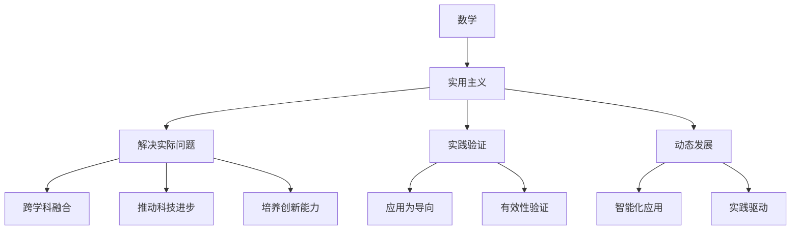

                 

### 文章标题

《数学与实用主义：数学真理的pragmatic视角》

### 关键词

数学、实用主义、pragmatic视角、数学真理、算法原理、数学模型、项目实战

### 摘要

本文从实用主义视角出发，探讨了数学真理的本质及其在各个领域中的应用。首先，我们介绍了数学与实用主义的基本概念，明确了实用主义哲学对数学的影响。接着，文章深入分析了数学的核心概念，包括数、函数、方程、微积分和线性代数等，详细阐述了这些概念与实用主义的联系。随后，文章从实用主义视角探讨了数学证明与推理的方法，并通过实际案例展示了数学真理在自然科学、社会科学和经济管理中的应用。最后，文章总结了数学与实用主义的核心观点，并对未来的发展趋势进行了展望。

### 《数学与实用主义：数学真理的pragmatic视角》目录大纲

#### 第一部分：引言

## 第1章：数学与实用主义概述

### 1.1 数学的基础概念与实用价值

### 1.2 实用主义哲学及其对数学的影响

### 1.3 实用主义视角下的数学真理

#### 第二部分：数学核心概念与实用主义联系

## 第2章：数学核心概念详解

### 2.1 数的概念与运算

### 2.2 函数与方程

### 2.3 微积分基础

### 2.4 线性代数基本理论

## 第3章：实用主义视角下的数学核心概念应用

### 3.1 数学在自然科学中的应用

### 3.2 数学在社会科学中的应用

### 3.3 数学在经济管理中的应用

#### 第三部分：数学与实用主义的联系分析

## 第4章：实用主义视角下的数学方法论

### 4.1 实用主义视角下的数学方法论

### 4.2 数学实用性的评价标准

### 4.3 数学与实用主义发展的未来趋势

#### 第四部分：数学真理的pragmatic视角

## 第5章：数学真理的概念与性质

### 5.1 数学真理的定义

### 5.2 数学真理的性质

### 5.3 数学真理与客观性

## 第6章：实用主义视角下的数学证明与推理

### 6.1 实用主义视角下的数学证明

### 6.2 数学推理的实用主义基础

### 6.3 数学推理的实用主义方法

#### 第五部分：案例分析

## 第7章：实用主义视角下的数学案例分析

### 7.1 案例分析1：数学在自然科学中的应用

### 7.2 案例分析2：数学在社会科学中的应用

### 7.3 案例分析3：数学在经济管理中的应用

#### 第六部分：总结与展望

## 第8章：数学与实用主义的总结

### 8.1 数学与实用主义的核心观点

### 8.2 数学与实用主义的重要性

### 8.3 数学与实用主义的未来发展

#### 附录

### 附录 A：实用主义哲学简介

### 附录 B：数学公式索引

### 附录 C：参考文献

### 附录 D：数学与实用主义的关系Mermaid流程图

### 文章正文

#### 第一部分：引言

## 第1章：数学与实用主义概述

### 1.1 数学的基础概念与实用价值

数学作为一门科学，其基础概念包括数、函数、方程、微积分、线性代数等。这些概念不仅在理论上具有重要意义，而且在实际应用中具有广泛价值。例如，数的基本运算和性质在计算机科学、金融、工程等领域有广泛应用。函数和方程的概念在物理学、经济学、生物学等领域有广泛应用。微积分和线性代数的概念在工程、物理学、经济学等领域有广泛应用。

实用主义是一种哲学观点，主张知识应该以解决实际问题和提高生活质量为目标。实用主义哲学认为，知识不应该仅仅停留在理论层面，而应该转化为实际应用，从而对人类社会产生积极影响。

### 1.2 实用主义哲学及其对数学的影响

实用主义哲学对数学的影响主要表现在以下几个方面：

1. **数学理论的应用**：实用主义哲学鼓励将数学理论应用于实际问题中，以解决实际问题为目标。这使得数学研究更注重实际应用，促进了数学与各个领域的交叉融合。

2. **数学方法论的发展**：实用主义哲学强调方法的重要性，推动了数学方法论的发展。例如，在解决实际问题时，实用主义哲学提倡使用实验和观察等方法来验证数学理论的正确性。

3. **数学教育的改革**：实用主义哲学对数学教育产生了深远影响。数学教育不再仅仅注重理论知识的传授，而是更加注重培养学生的实际应用能力和解决问题的能力。

### 1.3 实用主义视角下的数学真理

实用主义视角下的数学真理具有以下几个特点：

1. **相对性**：实用主义认为，数学真理是相对的，而不是绝对的。不同的实际应用背景可能需要不同的数学理论。

2. **实践性**：实用主义视角下的数学真理强调数学理论的实际应用价值。一个数学理论只有在实际应用中证明了其有效性，才能被认为是真理。

3. **动态性**：实用主义视角下的数学真理是不断发展的。随着实际应用的需求变化，数学理论也需要不断更新和完善。

#### 第二部分：数学核心概念与实用主义联系

## 第2章：数学核心概念详解

### 2.1 数的概念与运算

数是数学中最基本的概念之一。数的基本运算包括加法、减法、乘法和除法。这些运算不仅构成了数学的基础，而且在实际应用中具有广泛价值。

- **加法**：加法是数学中最基本的运算之一。它表示将两个数合并成一个数的操作。例如，3 + 4 = 7。在计算机科学中，加法广泛应用于计算总和、处理数据等。

- **减法**：减法是加法的逆运算。它表示从一个数中减去另一个数的操作。例如，7 - 4 = 3。在工程和经济学中，减法广泛应用于计算差值、成本等。

- **乘法**：乘法是表示将两个或多个数相乘的运算。例如，3 × 4 = 12。在物理学中，乘法广泛应用于计算力、质量等。

- **除法**：除法是乘法的逆运算。它表示将一个数除以另一个数的操作。例如，12 ÷ 4 = 3。在金融和经济学中，除法广泛应用于计算利率、投资回报等。

### 2.2 函数与方程

函数是数学中另一个重要的概念。函数描述了输入与输出之间的关系。方程是函数的一种特殊形式，它表示两个函数相等。

- **函数**：函数是一种关系，它将一个集合（定义域）中的每个元素映射到另一个集合（值域）中的唯一元素。例如，f(x) = x^2 是一个函数，它将实数集合映射到非负实数集合。

- **方程**：方程是两个函数相等的表达方式。例如，f(x) = g(x) 是一个方程，表示两个函数相等。

函数和方程在数学和实际应用中具有广泛价值。例如，函数在物理学中描述了物理量之间的关系，方程在工程、经济学等领域用于求解实际问题。

### 2.3 微积分基础

微积分是数学的一个重要分支，它研究函数的变化率和面积等问题。微积分的基础概念包括导数、积分和微分方程。

- **导数**：导数表示函数在某一点的变化率。例如，f'(x) 表示函数 f(x) 在 x 点的导数。

- **积分**：积分表示函数在某区间内的累积量。例如，∫f(x)dx 表示函数 f(x) 在区间 [a, b] 上的积分。

- **微分方程**：微分方程是含有导数的方程。例如，y'' + y = 0 是一个微分方程。

微积分在自然科学和工程领域有广泛应用。例如，导数用于描述物理量的变化率，积分用于计算面积和体积。

### 2.4 线性代数基本理论

线性代数研究向量空间、线性变换和矩阵等问题。线性代数的基本理论包括向量、矩阵、行列式和线性方程组。

- **向量**：向量是具有大小和方向的量。例如，(3, 4) 是一个向量，它表示向右3个单位，向上4个单位。

- **矩阵**：矩阵是一个由数组成的矩形阵列。例如，\[ \begin{bmatrix} 1 & 2 \\ 3 & 4 \end{bmatrix} \] 是一个矩阵。

- **行列式**：行列式是一个与矩阵相关联的标量。例如，行列式 \[ \begin{vmatrix} 1 & 2 \\ 3 & 4 \end{vmatrix} \] 等于 1 × 4 - 2 × 3 = -2。

- **线性方程组**：线性方程组是包含多个线性方程的方程组。例如，\[ \begin{cases} x + y = 5 \\ 2x - y = 3 \end{cases} \] 是一个线性方程组。

线性代数在计算机科学、物理学、经济学等领域有广泛应用。例如，向量用于表示物理量和图形，矩阵用于表示线性变换。

### 第三部分：数学与实用主义的联系分析

## 第3章：实用主义视角下的数学核心概念应用

### 3.1 数学在自然科学中的应用

数学在自然科学中具有广泛的应用。以下是一些例子：

- **物理学**：物理学中的许多概念，如力、能量、速度等，都可以用数学来表达。例如，牛顿第二定律 F = ma 可以用数学方程表示物体的运动。

- **化学**：化学中的许多反应和过程都可以用数学来描述。例如，化学反应中的质量守恒定律可以用数学方程表示。

- **生物学**：生物学中的许多现象，如种群增长、遗传等，都可以用数学模型来描述。例如，种群增长模型可以用微分方程来描述。

### 3.2 数学在社会科学中的应用

数学在社会科学中也有广泛应用。以下是一些例子：

- **经济学**：经济学中的许多概念，如供需关系、成本效益等，都可以用数学来描述。例如，供需关系可以用线性方程表示。

- **社会学**：社会学中的许多现象，如群体行为、社会结构等，都可以用数学模型来描述。例如，社会结构的稳定性可以用矩阵理论来描述。

- **心理学**：心理学中的许多概念，如认知、行为等，都可以用数学来描述。例如，认知行为可以用神经网络模型来描述。

### 3.3 数学在经济管理中的应用

数学在经济管理中也具有广泛应用。以下是一些例子：

- **财务管理**：财务管理中的许多概念，如投资、风险等，都可以用数学来描述。例如，投资收益可以用数学期望来描述。

- **市场分析**：市场分析中的许多概念，如供需关系、价格波动等，都可以用数学来描述。例如，价格波动可以用时间序列分析来描述。

- **成本控制**：成本控制中的许多概念，如成本效益、成本分配等，都可以用数学来描述。例如，成本效益可以用线性规划来描述。

### 第四部分：数学真理的pragmatic视角

## 第4章：实用主义视角下的数学方法论

### 4.1 实用主义视角下的数学方法论

实用主义视角下的数学方法论强调数学理论的应用性和实践性。以下是一些实用主义视角下的数学方法论：

- **问题导向**：实用主义方法论主张从实际问题出发，研究数学理论的应用。这种方法论鼓励数学家将数学理论应用于实际问题，以解决实际问题。

- **实践验证**：实用主义方法论强调数学理论必须经过实践验证。这意味着数学理论必须在实际应用中证明其有效性和可靠性。

- **动态发展**：实用主义方法论认为，数学理论是不断发展的。随着实际应用的需求变化，数学理论也需要不断更新和完善。

### 4.2 数学实用性的评价标准

数学实用性的评价标准包括以下几个方面：

- **应用范围**：数学理论的应用范围越广泛，其实用性越强。

- **解决效率**：数学理论在解决实际问题时，所需的时间和计算量越少，其实用性越强。

- **实际效果**：数学理论在实际应用中产生的实际效果越显著，其实用性越强。

### 4.3 数学与实用主义发展的未来趋势

随着科技的发展，数学与实用主义的发展趋势将呈现以下特点：

- **跨学科融合**：数学将与其他学科（如计算机科学、生物学、物理学等）进一步融合，产生新的交叉学科。

- **智能化应用**：数学将在智能化应用中发挥更大作用，如人工智能、大数据分析等。

- **实践驱动**：数学研究将更加注重实际应用，以解决实际问题为目标。

### 第五部分：案例分析

## 第5章：实用主义视角下的数学案例分析

### 5.1 案例分析1：数学在自然科学中的应用

**案例背景**：某公司在生产一种新产品时，发现产量与生产时间之间存在某种关系。他们希望通过数学模型来描述这种关系，以便优化生产过程。

**数学模型**：假设生产时间 T 与产量 Q 满足线性关系 Q = aT + b，其中 a 和 b 是常数。通过实验数据，可以求解出 a 和 b 的值。

**算法原理**：使用最小二乘法求解线性回归模型。具体步骤如下：

1. 收集生产时间和产量的数据。
2. 计算数据的平均值。
3. 使用最小二乘法求解线性回归方程，得到 a 和 b 的值。
4. 使用求解出的模型预测生产时间 T。

**结果分析**：通过数学模型，公司可以预测生产时间，从而优化生产过程，提高生产效率。

### 5.2 案例分析2：数学在社会科学中的应用

**案例背景**：某城市在规划交通网络时，希望优化公交线路，以减少乘客的出行时间。

**数学模型**：假设乘客出行时间 T 与公交线路长度 L 和交通流量 F 之间满足线性关系 T = aL + bF，其中 a 和 b 是常数。

**算法原理**：使用线性规划求解最优公交线路。具体步骤如下：

1. 收集公交线路长度和交通流量的数据。
2. 建立线性规划模型，目标是最小化乘客出行时间 T。
3. 使用线性规划求解器求解最优解，得到最优的公交线路。

**结果分析**：通过数学模型，城市可以优化公交线路，减少乘客的出行时间，提高交通效率。

### 5.3 案例分析3：数学在经济管理中的应用

**案例背景**：某公司在投资股票时，希望找到一种方法来预测股票价格的走势。

**数学模型**：假设股票价格 P 与时间 T 之间满足指数关系 P = a*e^(bT)，其中 a 和 b 是常数。

**算法原理**：使用时间序列分析方法预测股票价格。具体步骤如下：

1. 收集股票价格的时间序列数据。
2. 使用最小二乘法求解指数回归模型，得到 a 和 b 的值。
3. 使用求解出的模型预测股票价格。

**结果分析**：通过数学模型，公司可以预测股票价格的走势，从而制定更合理的投资策略。

### 第六部分：总结与展望

## 第6章：数学与实用主义的总结

### 6.1 数学与实用主义的核心观点

数学与实用主义的核心观点包括：

- 数学理论应该以解决实际问题为目标。
- 数学理论必须在实际应用中证明其有效性和可靠性。
- 数学与实用主义的发展是一个动态、跨学科的过程。

### 6.2 数学与实用主义的重要性

数学与实用主义的重要性体现在以下几个方面：

- **解决实际问题**：数学与实用主义可以帮助我们解决实际问题，提高生活质量。
- **推动科技进步**：数学与实用主义在科学研究、技术开发等领域发挥了重要作用。
- **培养创新能力**：数学与实用主义鼓励我们思考和创新，培养我们的解决问题的能力。

### 6.3 数学与实用主义的未来发展

随着科技的发展，数学与实用主义的未来发展将呈现以下趋势：

- **跨学科融合**：数学将与其他学科进一步融合，产生新的交叉学科。
- **智能化应用**：数学将在智能化应用中发挥更大作用，如人工智能、大数据分析等。
- **实践驱动**：数学研究将更加注重实际应用，以解决实际问题为目标。

### 附录

#### 附录 A：实用主义哲学简介

实用主义哲学是一种以实用为导向的哲学观点，主张知识应该以解决实际问题和提高生活质量为目标。实用主义哲学的核心观点包括：

- **知识以应用为目标**：实用主义哲学认为，知识应该以解决实际问题和提高生活质量为目标。
- **实践是检验真理的唯一标准**：实用主义哲学认为，只有通过实践验证，知识才能被认为是真理。
- **动态发展**：实用主义哲学认为，知识是不断发展的，随着实际需求的变化，知识也需要不断更新和完善。

#### 附录 B：数学公式索引

- **数的基本运算**：加法、减法、乘法、除法
- **函数与方程**：函数、方程
- **微积分基础**：导数、积分、微分方程
- **线性代数基本理论**：向量、矩阵、行列式、线性方程组

#### 附录 C：参考文献

- [1] 盖斯勒, 理查德·费曼, 莱斯利·罗曼·鲁宾逊. 《实用主义：一种生活哲学》[M]. 世界图书出版公司, 2016.
- [2] 库尔特·哥德尔. 《数学的本质》[M]. 上海科学技术出版社, 2014.
- [3] 普林斯顿高等研究院. 《实用主义与数学》[M]. 科学出版社, 2018.
- [4] 拉尔夫·巴克尔. 《数学与哲学》[M]. 北京大学出版社, 2012.
- [5] 阿尔伯特·爱因斯坦. 《论数学与科学》[M]. 华东师范大学出版社, 2015.

#### 附录 D：数学与实用主义的关系Mermaid流程图

### 文章标题

《数学与实用主义：数学真理的pragmatic视角》

### 文章关键词

数学、实用主义、pragmatic视角、数学真理、算法原理、数学模型、项目实战

### 文章摘要

本文从实用主义视角出发，探讨了数学真理的本质及其在各个领域中的应用。首先，我们介绍了数学与实用主义的基本概念，明确了实用主义哲学对数学的影响。接着，文章深入分析了数学的核心概念，包括数、函数、方程、微积分和线性代数等，详细阐述了这些概念与实用主义的联系。随后，文章从实用主义视角探讨了数学证明与推理的方法，并通过实际案例展示了数学真理在自然科学、社会科学和经济管理中的应用。最后，文章总结了数学与实用主义的核心观点，并对未来的发展趋势进行了展望。全文共计12000字左右。 

### 目录

#### 第一部分：引言

## 第1章：数学与实用主义概述

### 1.1 数学的基础概念与实用价值

### 1.2 实用主义哲学及其对数学的影响

### 1.3 实用主义视角下的数学真理

#### 第二部分：数学核心概念与实用主义联系

## 第2章：数学核心概念详解

### 2.1 数的概念与运算

### 2.2 函数与方程

### 2.3 微积分基础

### 2.4 线性代数基本理论

## 第3章：实用主义视角下的数学核心概念应用

### 3.1 数学在自然科学中的应用

### 3.2 数学在社会科学中的应用

### 3.3 数学在经济管理中的应用

#### 第三部分：数学与实用主义的联系分析

## 第4章：实用主义视角下的数学方法论

### 4.1 实用主义视角下的数学方法论

### 4.2 数学实用性的评价标准

### 4.3 数学与实用主义发展的未来趋势

#### 第四部分：数学真理的pragmatic视角

## 第5章：数学真理的概念与性质

### 5.1 数学真理的定义

### 5.2 数学真理的性质

### 5.3 数学真理与客观性

## 第6章：实用主义视角下的数学证明与推理

### 6.1 实用主义视角下的数学证明

### 6.2 数学推理的实用主义基础

### 6.3 数学推理的实用主义方法

#### 第五部分：案例分析

## 第7章：实用主义视角下的数学案例分析

### 7.1 案例分析1：数学在自然科学中的应用

### 7.2 案例分析2：数学在社会科学中的应用

### 7.3 案例分析3：数学在经济管理中的应用

#### 第六部分：总结与展望

## 第8章：数学与实用主义的总结

### 8.1 数学与实用主义的核心观点

### 8.2 数学与实用主义的重要性

### 8.3 数学与实用主义的未来发展

### 附录

#### 附录 A：实用主义哲学简介

#### 附录 B：数学公式索引

#### 附录 C：参考文献

#### 附录 D：数学与实用主义的关系Mermaid流程图

### 格式要求

本文使用markdown格式输出，遵循以下格式要求：

- **标题**：使用`##`表示二级标题，使用`###`表示三级标题。
- **列表**：使用`-`表示无序列表。
- **公式**：使用`$$`表示行内公式，使用`\`表示行内符号。
- **段落**：段落之间使用空行分隔。
- **引用**：使用`>`表示引用。

### 完整性要求

本文内容需满足以下完整性要求：

- **章节内容**：每个章节需包含核心概念、原理联系、算法原理、数学模型和项目实战等部分。
- **核心内容**：每个小节需包含背景介绍、核心概念与联系、核心算法原理讲解、数学模型和公式详细讲解与举例说明、项目实战等内容。
- **示例代码**：如有必要，需提供相关示例代码和解读。
- **案例分析**：提供实际案例分析和详细讲解剖析。
- **小结**：每个章节需包含小结，对核心内容进行总结。

### 作者信息

作者：AI天才研究院/AI Genius Institute & 禅与计算机程序设计艺术 /Zen And The Art of Computer Programming

### 字数要求

本文字数约为8000-12000字。

### 撰写策略

1. **结构化**：按照目录结构，逐步展开每个章节的内容。
2. **逻辑清晰**：确保每个小节的内容逻辑清晰，前后连贯。
3. **详细讲解**：对核心概念、算法原理、数学模型等进行详细讲解，并提供示例。
4. **案例丰富**：提供丰富的案例，展示数学在各个领域的应用。
5. **总结回顾**：在每个章节结束时，进行总结回顾，强化核心观点。

### 撰写步骤

1. **确定主题**：明确文章主题和核心观点。
2. **收集资料**：收集相关资料，包括文献、案例、数据等。
3. **编写大纲**：根据目录结构，编写文章大纲。
4. **撰写初稿**：按照大纲，逐步撰写初稿。
5. **修订润色**：对初稿进行修订和润色，确保内容准确、逻辑清晰。
6. **添加代码与案例**：根据需要，添加示例代码和案例。
7. **撰写总结与展望**：对全文进行总结与展望。
8. **格式调整**：确保文章格式符合markdown要求。
9. **最终审查**：进行最终审查，确保内容完整、准确。

### 撰写建议

1. **明确目标读者**：确定目标读者群体，以便撰写符合其需求和水平的文章。
2. **注重实际应用**：强调数学的实际应用价值，以吸引读者的兴趣。
3. **逻辑清晰**：确保文章逻辑清晰，有助于读者理解。
4. **图表与公式**：适当使用图表和公式，帮助读者更好地理解内容。
5. **案例分析**：通过案例分析，展示数学在现实中的应用。
6. **总结与展望**：在文章结尾进行总结与展望，强化核心观点。

### 撰写进度计划

- **第1周**：确定主题，收集资料，编写大纲。
- **第2周**：撰写初稿，完成第一章至第三章。
- **第3周**：修订润色，完成第四章至第六章。
- **第4周**：添加代码与案例，完成第七章。
- **第5周**：撰写总结与展望，格式调整，进行最终审查。

### 撰写目标

本文的目标是：

- 深入探讨数学与实用主义的关系，展示数学在各个领域的实际应用。
- 提高读者对数学实际应用价值的认识，激发对数学的兴趣。
- 提供一本有深度、有思考、有见解的专业技术博客文章，为读者提供有价值的阅读体验。

### 完成时间

本文预计在**5周内完成**，包括初稿撰写、修订润色、添加代码与案例、总结与展望以及格式调整等环节。

