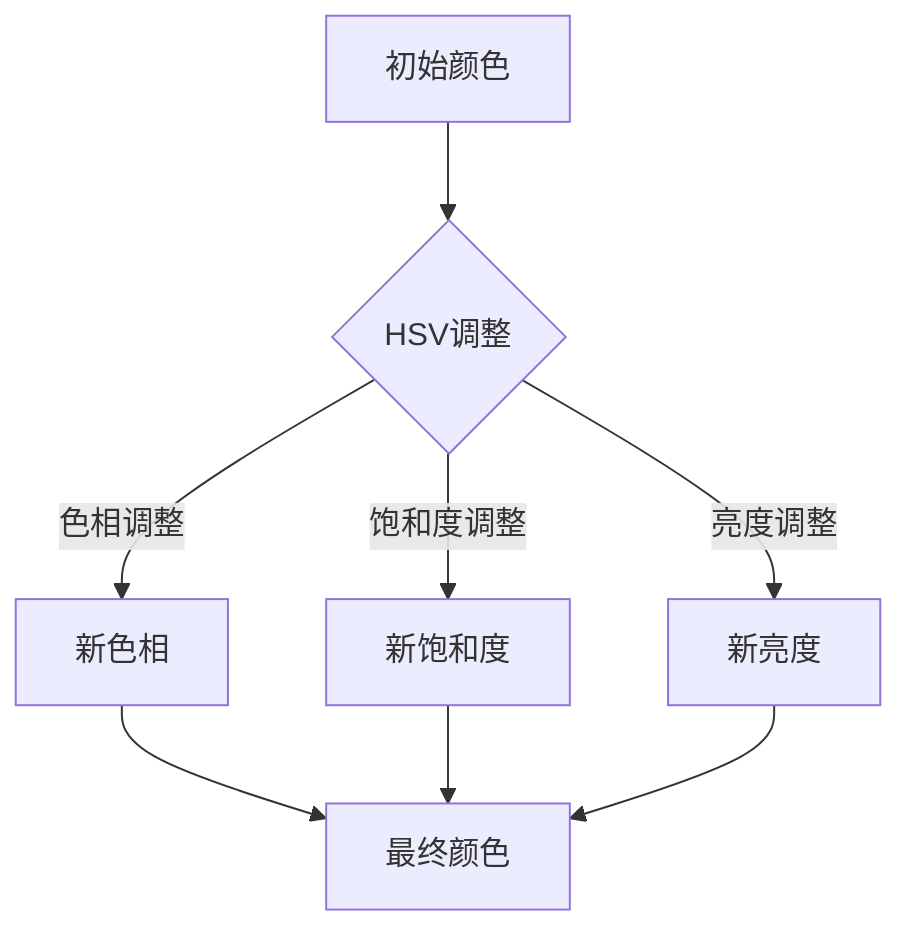
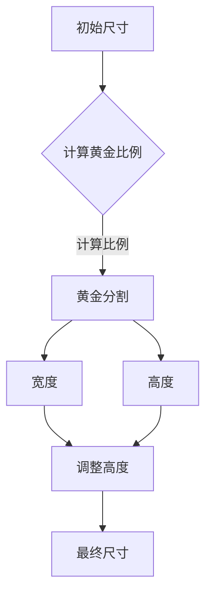
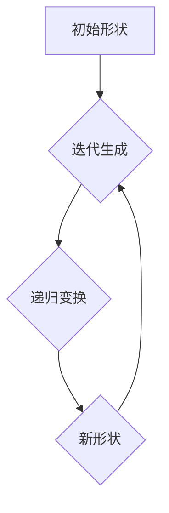

                 

### 文章标题

《数学与平面设计：视觉构图的数学规律》

### 关键词

- 视觉构图
- 数学规律
- 平面设计
- 几何原理
- 透视
- 对称与平衡
- 色彩搭配

### 摘要

本文深入探讨数学在平面设计中的关键作用，揭示视觉构图的数学规律。通过分析线条、颜色、形状和空间等基本元素，结合对称与平衡、节奏与韵律等构图法则，我们将展示数学如何深刻影响平面设计的审美和功能效果。同时，本文还将探讨数学在巴洛克、洛可可等艺术风格中的具体应用，以及其在广告设计、品牌设计、UI设计和交互设计中的实际应用案例。最后，我们将展望数学与人工智能在平面设计中的未来发展，探讨新的数学原理和工具如何推动这一领域的创新。

## 《数学与平面设计：视觉构图的数学规律》目录大纲

### 第1章：导言

- **1.1 视觉构图与数学规律**
  - 平面设计与视觉吸引力的关系
  - 数学在视觉艺术中的传统与现代角色
- **1.2 本书的目的与结构**
  - 分析方法与逻辑框架
  - 文章目标与预期收获

### 第2章：视觉构图的基本元素

- **2.1 线条与形态**
  - 直线与曲线的视觉表现
  - 线条如何构建形态与空间感
- **2.2 颜色与色调**
  - 色彩的基本概念与心理影响
  - 色彩搭配的理论与实践
- **2.3 形状与空间**
  - 几何形状的识别与运用
  - 空间的表达与处理技巧

### 第3章：数学与视觉构图的联系

- **3.1 数学基本原理**
  - 函数与图形的关系
  - 几何与对称的理论
- **3.2 数学在构图中的应用**
  - 比例与尺度的数学原理
  - 视角与透视的数学解释

### 第4章：构图的基本法则

- **4.1 对称与平衡**
  - 对称构图的基本法则
  - 平衡构图的技巧与案例
- **4.2 节奏与韵律**
  - 节奏构图的规律
  - 韵律构图的实践
- **4.3 焦点与引导**
  - 焦点构图的理论
  - 引导构图的方法

### 第5章：数学在特定艺术风格中的应用

- **5.1 巴洛克艺术风格**
  - 巴洛克艺术的数学原理
  - 巴洛克艺术的构图技巧
- **5.2 洛可可艺术风格**
  - 洛可可艺术的数学原理
  - 洛可可艺术的构图技巧

### 第6章：数学在平面设计的实际应用

- **6.1 广告设计**
  - 广告设计的数学规律
  - 广告设计的案例分析
- **6.2 品牌设计**
  - 品牌设计的数学规律
  - 品牌设计的案例分析

### 第7章：数学在数字设计中的应用

- **7.1 UI设计**
  - UI设计的数学规律
  - UI设计的案例分析
- **7.2 交互设计**
  - 交互设计的数学规律
  - 交互设计的案例分析

### 第8章：数学在平面设计中的未来趋势

- **8.1 人工智能与平面设计**
  - 人工智能在平面设计中的应用
  - 人工智能对平面设计的影响
- **8.2 数学在平面设计中的创新发展**
  - 新的数学原理在平面设计中的应用
  - 数学在平面设计中的未来发展趋势

### 第9章：案例研究与项目实践

- **9.1 数学在平面设计案例中的实际应用**
  - 案例一：广告设计
  - 案例二：品牌设计
- **9.2 项目实践**
  - 项目实战一：UI设计
  - 项目实战二：交互设计

### 附录

- **附录A：数学在平面设计中的Mermaid流程图**
  - 流程图示例与应用
- **附录B：核心算法原理伪代码**
  - 伪代码示例与解释
- **附录C：数学模型和数学公式**
  - 数学公式应用与解释
- **附录D：数学在平面设计中的实际应用案例代码解析**
  - 案例代码实现与解析

# 第1章：导言

## 1.1 视觉构图与数学规律

### 平面设计与视觉吸引力的关系

平面设计不仅仅是将文字和图像组合在一起，它是一种传达信息和创造视觉体验的艺术形式。在平面设计中，视觉吸引力是至关重要的，因为它是吸引观众并确保他们注意到并理解所传达信息的关键因素。视觉构图作为一种技巧，通过合理安排设计元素，如线条、颜色、形状和空间，来增强整体视觉效果。

数学作为一种精确的科学，通过其严谨的原理和方法，为平面设计提供了一种量化和优化的工具。数学不仅帮助我们理解视觉元素之间的关系，还可以通过特定的数学公式和算法来指导设计过程，从而提高设计的效率和品质。

### 数学在视觉艺术中的传统与现代角色

自古以来，数学就在艺术中扮演了重要角色。古代艺术家利用数学原理，如黄金比例和几何对称，来创造和谐与美感。例如，古希腊的帕台农神庙就利用了黄金比例来设计其立面，使其外观令人惊叹。

在现代，随着计算机技术和数字设计的兴起，数学在视觉艺术中的应用更加广泛。从算法生成的艺术作品，到数字图像处理中的数学模型，再到用户界面设计中的用户体验优化，数学无处不在。现代设计师不仅利用数学工具来提高设计的精确度，还通过数学算法来生成独特和创造性的设计效果。

## 1.2 本书的目的与结构

### 分析方法与逻辑框架

本书采用逐步分析推理的方式，以清晰的结构和逻辑框架来探讨数学与平面设计之间的关系。首先，我们将介绍视觉构图的基本元素，如线条、颜色和形状，并解释它们如何与数学原理相联系。接着，我们将深入探讨数学在构图中的应用，如比例、尺度、视角和透视。然后，我们将介绍一些基本的构图法则，如对称与平衡、节奏与韵律、焦点与引导，并展示如何利用数学原理来实现这些法则。

### 文章目标与预期收获

通过本文的学习，读者将：

1. 理解视觉构图的基本元素及其数学基础。
2. 掌握数学在构图中的关键作用和应用。
3. 学会使用数学原理来优化和提升平面设计的效果。
4. 了解数学在特定艺术风格中的具体应用，以及其在数字设计中的发展趋势。
5. 获得实际案例中的数学应用分析和项目实践技巧。

## 第2章：视觉构图的基本元素

### 2.1 线条与形态

#### 2.1.1 直线与曲线

线条是视觉构图中最基本的元素之一。直线和曲线具有截然不同的视觉特征和表现力。直线通常给人一种稳定、刚性和引导感，而曲线则更具流动性和柔和感。在平面设计中，直线和曲线的使用不仅影响视觉感受，还决定了空间和形态的构成。

- **直线的视觉表现**：直线在视觉上具有明显的引导和延伸效果。它们可以用来引导观众的视线，创建明确的视觉路径。例如，在广告设计中，直线可以用来强调产品或信息的重点。

  直线的基本数学特征可以用欧氏几何来描述，其中每条直线都是无限延伸的，具有固定的方向和位置。可以用点-点表示法（\(y = mx + b\)）来表示一条直线，其中 \(m\) 是斜率，\(b\) 是截距。

- **曲线的视觉表现**：曲线则更为柔和和自然。它们能够创造柔和的视觉过渡，使设计更加和谐。例如，在时尚插画中，曲线被用来描绘人物身体的柔美线条。

  曲线的数学特征更加复杂。常见的曲线有抛物线、椭圆和双曲线。这些曲线可以通过二次方程或更高阶的方程来表示。例如，抛物线的标准方程是 \(y = ax^2 + bx + c\)。

#### 2.1.2 线条的表现力

线条的表现力不仅取决于其形状，还与线条的粗细、长度和方向有关。不同类型的线条在视觉上会产生不同的效果：

- **粗线条**：粗线条通常给人一种力量和稳固感，常用于强调设计元素或创建视觉焦点。
- **细线条**：细线条则显得轻盈和精致，常用于细节处理或背景元素。
- **长线条**：长线条具有延伸感，可以用来扩展视觉空间。
- **短线条**：短线条则更聚焦，可以用来增加视觉密度或强调细节。

#### 2.1.3 线条在构图中的应用

在线条的应用中，数学原理发挥了重要作用。例如，通过黄金比例（\(\frac{1+\sqrt{5}}{2}\)），设计师可以找到视觉上最为和谐的比例点。黄金比例在线条的使用中，可以帮助设计师创建平衡和吸引力的视觉效果。

此外，几何图形的排列和组合也可以通过数学原理来优化。例如，通过使用勾股定理（\(a^2 + b^2 = c^2\)），设计师可以创建稳定和对称的图形布局。

总之，线条是视觉构图中的重要元素，其表现力和应用可以通过数学原理来解释和优化。理解线条的数学特征和应用，可以帮助设计师更好地掌握视觉构图的技巧。

#### 2.1.4 直线与曲线的实际应用案例

为了更直观地理解直线与曲线在构图中的应用，我们可以通过以下实际案例来探讨：

- **案例一：城市道路规划**
  在城市规划中，直线道路通常用于快速交通，而曲线道路则用于慢速交通和居住区。通过数学原理，如黄金比例和圆的性质，设计师可以优化道路布局，提高交通效率和安全性。

- **案例二：海报设计**
  在海报设计中，直线和曲线的巧妙运用可以增强视觉吸引力。例如，可以使用曲线来描绘人物或自然元素，而直线则用于创建标题或信息栏，使整个海报具有视觉层次感。

- **案例三：UI设计**
  在用户界面设计中，直线和曲线的使用可以改善用户体验。例如，曲线按钮提供更柔和的触摸感，而直线边框则提供清晰的边框界限，帮助用户更好地识别和操作界面元素。

通过这些案例，我们可以看到直线与曲线在视觉构图中的重要性和实际应用效果。理解这些应用，有助于设计师在创作中更好地运用数学原理，提升设计品质。

### 2.2 颜色与色调

#### 2.2.1 色彩的基本概念

色彩是视觉构图中至关重要的元素，它直接影响观众的感受和情绪。色彩的基本概念包括颜色、色调、饱和度和明度。

- **颜色**：颜色是视觉感受中的基本属性，如红色、蓝色和绿色。颜色通常由光波的不同波长产生，我们可以使用RGB模型（红色、绿色和蓝色）来表示颜色。

- **色调**：色调是颜色的基本属性，如红色、橙色和黄色。色调决定了颜色的基本特征，可以相同或不同。

- **饱和度**：饱和度是指颜色的纯度，高饱和度颜色更加鲜艳，低饱和度颜色更加柔和。

- **明度**：明度是指颜色的亮度，明度高的颜色显得更亮，明度低的颜色显得更暗。

#### 2.2.2 色彩的搭配与运用

色彩搭配是视觉构图中的一大挑战，合理的色彩搭配可以增强视觉效果，而不合理的搭配则可能导致视觉混乱。以下是一些常见的色彩搭配理论：

- **互补色搭配**：互补色是指位于色轮相对位置的颜色，如红色和绿色、蓝色和橙色。互补色搭配可以产生强烈的对比效果，常用于需要突出重点的设计。

- **类似色搭配**：类似色是指位于色轮相近位置的颜色，如黄色和绿色、红色和紫色。类似色搭配可以产生和谐、柔和的视觉效果。

- **三元色搭配**：三元色搭配是指选择色轮上等距分布的三种颜色，如红色、蓝色和黄色。这种搭配可以产生均衡的视觉效果，常用于复杂设计的色彩方案。

#### 2.2.3 色彩在构图中的表现力

色彩在构图中不仅影响视觉感受，还影响观众的情感和情绪。以下是一些色彩在构图中的表现力：

- **冷色系**：冷色系如蓝色、绿色和紫色通常给人一种冷静、平静和理智的感觉。在设计中，冷色系常用于创造宁静、专业或科技感的氛围。

- **暖色系**：暖色系如红色、橙色和黄色通常给人一种温暖、活力和热情的感觉。在设计中，暖色系常用于创造活力、幸福或温馨的氛围。

- **中性色**：中性色如黑色、白色和灰色通常用于平衡和调和色彩，增加设计的一致性和专业性。

#### 2.2.4 色彩的数学原理

色彩的数学原理主要体现在颜色模型和色彩空间中。以下是一些常见的颜色模型：

- **RGB模型**：RGB模型是一种加色模型，通过红（R）、绿（G）和蓝（B）三种颜色的组合来生成其他颜色。每种颜色值范围在0到255之间。

- **CMYK模型**：CMYK模型是一种减色模型，用于印刷，通过青色（C）、品红（M）、黄色（Y）和黑色（K）的组合来生成颜色。与RGB模型不同，CMYK模型的颜色值范围在0到100之间。

- **HSV模型**：HSV模型是一种描述颜色的更直观的方式，通过色相（H）、饱和度（S）和亮度（V）来描述颜色。HSV模型更接近人类对颜色的感知。

#### 2.2.5 色彩搭配的数学方法

在色彩搭配中，数学原理可以帮助设计师找到最佳的组合。以下是一些常用的色彩搭配方法：

- **基于色轮的理论**：通过在色轮上选择特定位置的颜色，设计师可以找到互补色、类似色和三元色等搭配方式。

- **色彩空间分析**：通过分析色彩空间中的颜色分布和关系，设计师可以找到最佳的色彩组合。

- **算法生成**：使用算法生成色彩组合，例如通过随机化或优化算法，设计师可以找到具有特定属性的色彩方案。

#### 2.2.6 色彩搭配的实际应用案例

为了更直观地理解色彩搭配的实际应用，我们可以通过以下实际案例来探讨：

- **案例一：时尚设计**
  在时尚设计中，色彩搭配对整体风格和品牌形象至关重要。通过合理的色彩搭配，设计师可以创造出独特的时尚感和风格。

- **案例二：室内设计**
  在室内设计中，色彩搭配影响空间氛围和舒适度。例如，使用冷色调的卧室可以创造宁静的睡眠环境，而使用暖色调的客厅则可以创造温馨的家庭氛围。

- **案例三：品牌视觉识别**
  品牌视觉识别中的色彩搭配对品牌形象和认知度有重要影响。例如，可口可乐的红色和白色组合使其品牌形象独特而鲜明。

通过这些案例，我们可以看到色彩搭配在视觉构图中的重要性。理解色彩搭配的数学原理和方法，可以帮助设计师在创作中更好地运用色彩，提升设计效果。

### 2.3 形状与空间

#### 2.3.1 几何形状的理解与应用

在视觉构图中，几何形状是构成图形和设计的基本元素。不同的几何形状具有不同的视觉特征和表现力，理解这些特征和表现力对于设计师来说至关重要。

- **基本几何形状**：基本几何形状包括点、线、面和体。这些形状是构建更复杂形状的基础。

  - **点**：点是一个没有大小的位置标记。在视觉构图中，点可以用来指示位置或作为设计元素的中心。
  - **线**：线是由无数个点连成的路径。线具有长度和方向，可以用来引导视线或创建边界。
  - **面**：面是由线围成的二维空间。面可以具有不同的形状和边界，如矩形、圆形和三角形。
  - **体**：体是三维空间中的形状，由多个面组成。体在三维构图中起到关键作用，可以用来创建立体感和深度。

- **复杂几何形状**：通过组合基本几何形状，可以创建更复杂的几何形状。这些形状在视觉构图中具有独特的表现力。

  - **多边形**：多边形是具有多个边的几何形状，如三角形、四边形和五边形。多边形可以用来创建稳定的结构和动态的图形。
  - **曲线形状**：曲线形状包括抛物线、椭圆和双曲线等。曲线形状可以创造柔和的过渡和动态感。

#### 2.3.2 空间的表达与处理

空间是视觉构图中的另一个重要元素，它不仅影响设计的效果，还决定了观众的体验。以下是一些关于空间表达和处理的基本原则：

- **深度与层次**：通过在设计中引入深度和层次，可以增加视觉的立体感和真实感。常用的方法包括使用透视、阴影和色彩变化等。

  - **透视**：透视是一种通过视点和视角来表现空间深度的方法。在二维平面中，透视可以通过灭点、视平线等原理来实现。
  - **阴影**：阴影可以增加物体的立体感和空间感。通过在不同位置和角度添加阴影，可以创造出更加丰富的视觉空间。
  - **色彩变化**：通过在空间中引入色彩变化，可以创造出更加真实和引人入胜的视觉效果。例如，使用渐变色来表现高度变化或空间深度。

- **封闭与开放**：封闭空间和开放空间在视觉构图中具有不同的表现力。

  - **封闭空间**：封闭空间给人一种安全感、隐私感和集中感。在设计中，封闭空间可以用来创造焦点或保护隐私。
  - **开放空间**：开放空间则给人一种自由、开放和宽广的感觉。开放空间常用于创造社交或公共空间，如公园和广场。

- **空间分隔与连接**：通过不同的设计元素和布局，可以分隔和连接空间。

  - **分隔**：分隔可以通过物理障碍、色彩变化或形状变化来实现。例如，使用墙体、家具或色彩来分隔空间。
  - **连接**：连接可以通过视觉线索、通道或共享元素来实现。例如，使用走廊、桥梁或共享元素（如颜色和图案）来连接不同空间。

#### 2.3.3 几何形状与空间的数学原理

几何形状和空间的处理离不开数学原理。以下是一些关键的数学原理：

- **欧氏几何**：欧氏几何是研究平面和空间中点、线、面和体之间关系的数学分支。欧氏几何提供了许多用于设计和构图的基本工具，如点、线、面和体的性质和关系。
- **非欧几何**：非欧几何包括如双曲几何和椭圆几何，它们提供了对非欧空间的研究和理解。这些几何学原理可以用于创造独特和创新的视觉空间效果。
- **透视投影**：透视投影是一种通过视点和视角来表现空间深度的方法。透视投影可以通过数学方程来描述，如一点透视、两点透视和三点透视。

通过理解这些数学原理，设计师可以更好地控制和利用空间，创造出具有深度、层次感和立体感的视觉作品。

#### 2.3.4 形状与空间在实际设计中的应用

为了更直观地理解形状与空间在实际设计中的应用，我们可以通过以下实际案例来探讨：

- **案例一：建筑设计**
  在建筑设计中，几何形状和空间处理对于创造功能性和美观的建筑至关重要。例如，使用流线型曲线形状来增加建筑的动感和灵活性，或者通过巧妙的内部空间布局来提高使用效率。

- **案例二：室内设计**
  在室内设计中，形状和空间的处理可以创造出不同的氛围和功能空间。例如，通过使用对称的几何形状来创造正式和稳重的氛围，或者通过不规则形状和开放空间来创造自由和放松的空间。

- **案例三：数字设计**
  在数字设计中，形状和空间的处理对于用户界面（UI）和用户体验（UX）设计至关重要。通过使用适当的几何形状和空间布局，可以创造直观、易用和吸引人的界面。

通过这些案例，我们可以看到形状与空间在视觉构图中的重要性。理解形状与空间的数学原理和实际应用，可以帮助设计师在创作中更好地运用这些元素，提升设计品质。

## 第3章：数学与视觉构图的联系

### 3.1 数学基本原理

#### 3.1.1 函数与图形

在数学与视觉构图的联系中，函数与图形的关系是一个核心概念。函数是数学中用于描述变量之间关系的工具，而图形则是这些关系的视觉表示。在视觉构图中，函数图形帮助我们理解和展示各种视觉元素之间的关系。

- **一次函数与线性图形**：一次函数通常表示为 \(y = mx + b\)，其中 \(m\) 是斜率，\(b\) 是截距。一次函数的图形是一条直线，它展示了输入和输出之间的线性关系。在视觉构图中，直线可以用来表示视觉元素的引导线或边界。

- **二次函数与抛物线图形**：二次函数通常表示为 \(y = ax^2 + bx + c\)，其图形是抛物线。抛物线的形状使其在视觉构图中具有独特的应用，如创建柔和的过渡或强调视觉焦点。

- **三角函数与周期性图形**：三角函数，如正弦（\(y = \sin(x)\)）和余弦（\(y = \cos(x)\)）函数，具有周期性特征，其图形是波形。这些图形在视觉构图中可以用来模拟自然现象，如海浪或季节变化。

#### 3.1.2 几何与对称

几何是数学的一个分支，它研究形状、大小、位置和变换。对称是几何中的一个重要概念，它在视觉构图中具有广泛应用。

- **轴对称与镜像**：轴对称是指一个图形关于某条轴的镜像。在视觉构图中，轴对称可以用来创建平衡和稳定的视觉效果。例如，使用轴对称来设计标志或图案，使其在视觉上具有吸引力。

- **中心对称与旋转**：中心对称是指一个图形关于某一点的镜像。在视觉构图中，中心对称可以用来创建动态和平衡的视觉效果。例如，使用中心对称来设计旋转的图形，使其具有视觉动感。

- **几何变换与组合**：几何变换，如平移、旋转和缩放，是视觉构图中常用的技术。通过这些变换，设计师可以创建复杂和独特的视觉效果。例如，通过平移和旋转来组合多个几何形状，创建具有层次感和深度的图形。

#### 3.1.3 数学原理的视觉应用

数学原理在视觉构图中的应用不仅限于基本概念，还包括更复杂的几何和代数方法。以下是一些具体的应用：

- **黄金比例**：黄金比例（约0.618）是一种著名的数学比例，它在视觉构图中被广泛使用。例如，在界面设计中，黄金比例可以帮助找到最佳的用户界面布局，以提供最佳的视觉体验。

- **分形几何**：分形几何是一种用于创建自相似和复杂结构的数学工具。在视觉构图中，分形几何可以用来创建独特的纹理和图案，增加设计的复杂性和视觉吸引力。

- **代数方程**：代数方程可以用来描述和优化视觉元素之间的关系。例如，通过使用代数方程来调整颜色、亮度和对比度，设计师可以创造出具有特定视觉效果的图像。

#### 3.1.4 数学在视觉构图中的作用

数学在视觉构图中扮演着关键角色，它不仅提供了精确的工具和方法，还帮助设计师理解和控制视觉元素之间的关系。

- **精确控制**：数学原理提供了精确的控制手段，使设计师能够精确地调整视觉元素的位置、大小和比例，以达到预期的视觉效果。

- **优化设计**：数学方法可以帮助设计师优化设计过程，减少错误和重复工作。例如，通过使用数学模型来评估设计的平衡和吸引力，设计师可以快速调整设计，提高设计质量。

- **创造创新**：数学原理为设计师提供了创造创新视觉效果的工具。通过探索新的数学方法，设计师可以创造出独特和令人惊叹的视觉作品。

总之，数学与视觉构图的联系是紧密的，它为设计师提供了一种强大的工具和方法，使他们能够创造出更加精确、优化和创新的设计。

### 3.2 数学在构图中的应用

#### 3.2.1 比例与尺度

比例和尺度是视觉构图中至关重要的概念，它们决定了设计的整体效果和观众的感受。在设计中，比例是指各个部分之间的大小关系，而尺度则是指整体设计的尺寸和大小。

- **比例的数学原理**：比例可以通过分数来表示，例如 \(a:b\) 表示部分a与部分b之间的比例关系。在视觉构图中，常见的比例有黄金比例、等比数列等。

  - **黄金比例**：黄金比例（约0.618）是一种在视觉构图中广泛使用的比例，它被认为具有美学上的吸引力。黄金比例可以通过以下公式计算：\(\frac{a+b}{a} = \frac{a}{b} = \varphi\)，其中 \(\varphi\) 是黄金比例值。
  - **等比数列**：等比数列是一个在相邻项之间保持固定比例的数列。在视觉构图中，等比数列可以用来创建渐变效果或层次感。

- **尺度的数学原理**：尺度是指设计的整体大小，它可以通过不同的单位来表示，如厘米、英寸等。在设计中，尺度不仅影响视觉效果，还影响用户的交互体验。

  - **相对尺度**：相对尺度是指设计元素的大小与整体设计的比例关系。例如，在网页设计中，按钮的大小应该与其周围元素的大小保持相对一致，以便用户能够轻松操作。
  - **绝对尺度**：绝对尺度是指设计元素的具体尺寸，如像素或英寸。绝对尺度通常用于确保设计在不同设备和分辨率上保持一致性。

#### 比例与尺度的视觉应用

比例和尺度在视觉构图中有着广泛的应用，以下是一些具体的例子：

- **布局设计**：在布局设计中，比例和尺度可以帮助设计师创建平衡和协调的页面布局。例如，通过使用黄金比例来安排标题和正文，可以使页面更具吸引力。
- **图标设计**：在图标设计中，比例和尺度对于确保图标在不同设备和分辨率上的一致性和易读性至关重要。设计师可以使用固定比例来设计图标，以便在各种尺寸下保持清晰和易用。
- **用户体验设计**：在用户体验（UX）设计中，比例和尺度影响用户与界面之间的交互。例如，按钮的大小和位置应该适中，以便用户能够轻松点击，而不至于造成混淆或疲劳。

#### 3.2.2 视角与透视

视角和透视是视觉构图中用于创建深度和立体感的重要工具。它们基于数学原理，通过模拟人类视觉系统来增强视觉效果。

- **视角的数学原理**：视角是指观察者与观察对象之间的角度关系。视角可以通过数学公式来描述，如视角与距离和对象大小的关系。视角的数学原理有助于设计师确定最佳的观察位置和角度，以创造最有吸引力的视觉效果。

- **透视的数学原理**：透视是一种通过模拟人眼和大脑处理图像的方式，来创建三维效果的技巧。透视可以分为一点透视、两点透视和三点透视。

  - **一点透视**：一点透视也称为线性透视，其中所有线条都汇聚于画面中的单一点（灭点）。一点透视适用于简单场景，可以创建稳定的视觉效果。
  - **两点透视**：两点透视中，所有垂直线和水平线都汇聚于画面中的两个点（灭点）。两点透视适用于更复杂的场景，可以创建更多的立体感和深度。
  - **三点透视**：三点透视中，所有线条都汇聚于画面中的三个点（灭点）。三点透视适用于极富动态和复杂性的场景，可以创建出极具冲击力的视觉效果。

- **视觉应用**：视角和透视在视觉构图中有着广泛的应用。

  - **建筑设计**：在建筑设计中，透视技巧可以用来创建逼真的三维效果图，帮助设计师和客户理解建筑的外观和内部布局。
  - **插画与动画**：在插画和动画中，透视技巧可以用来增强场景的立体感和动态感，使作品更具表现力和吸引力。
  - **用户界面设计**：在用户界面设计中，透视技巧可以用来模拟真实世界的界面，提高用户体验和易用性。

总之，视角与透视的数学原理为视觉构图提供了强大的工具，帮助设计师创建具有深度和立体感的作品。通过理解这些原理，设计师可以更好地运用视角和透视，提升设计的视觉效果。

### 3.3 数学在视觉构图中的实际应用

#### 3.3.1 几何图形的应用

几何图形是视觉构图中不可或缺的元素，它们通过数学原理来创造视觉和谐和美感。以下是一些几何图形在实际设计中的应用：

- **黄金矩形**：黄金矩形是一种具有黄金比例的矩形，其宽与高的比例约为0.618：1。黄金矩形在设计中常用于布局和比例的设定，可以创造出和谐和优雅的视觉效果。

- **正多边形**：正多边形如正方形、正三角形和正五边形在设计中有着广泛的应用。正多边形具有对称和稳定的视觉特征，可以用于创造几何图案、图标和布局。

- **曲线**：曲线在设计中具有柔美和流畅的视觉特征，可以通过数学公式（如贝塞尔曲线）来精确控制。曲线可以用于描绘自然形态、创造动态效果和增加设计的灵活性。

- **分形**：分形是一种自相似的几何形状，可以通过递归生成。分形在设计中可以用于创建复杂的纹理和图案，增加设计的层次感和视觉吸引力。

#### 3.3.2 数学公式在色彩搭配中的应用

色彩搭配是视觉构图中一个重要的方面，数学公式可以帮助设计师找到最佳的色彩组合。以下是一些数学公式在色彩搭配中的应用：

- **HSV模型**：HSV（色相、饱和度、亮度）模型是一种常用的色彩模型，它通过数学公式来描述颜色。在HSV模型中，色相（H）表示颜色的基本属性，饱和度（S）表示颜色的纯度，亮度（V）表示颜色的亮度。通过调整HSV值，设计师可以找到最佳的色彩组合。

- **色彩空间转换**：色彩空间转换是一种将一种颜色模型转换为另一种颜色模型的方法。例如，将RGB颜色转换为CMYK颜色用于印刷。色彩空间转换的数学公式可以帮助设计师确保颜色在不同媒介上的准确性和一致性。

- **互补色公式**：互补色是指位于色轮相对位置的颜色，例如红色和绿色。互补色公式可以帮助设计师找到互补色组合，创造出强烈的对比效果。例如，红色和绿色的互补色组合在广告设计中常用于突出重要信息。

#### 3.3.3 数学在界面设计中的应用

在用户界面（UI）设计中，数学原理可以帮助设计师创建直观、易用和美观的界面。以下是一些数学在UI设计中的应用：

- **网格系统**：网格系统是一种通过数学原理来布局页面的方法，它可以帮助设计师保持设计的一致性和对齐。通过使用网格系统，设计师可以创建具有清晰结构和层次感的界面。

- **响应式设计**：响应式设计是一种通过数学原理来调整页面布局和内容以适应不同设备和屏幕尺寸的方法。响应式设计的数学原理包括弹性布局、媒体查询和相对单位等。

- **交互设计**：交互设计中的动画和过渡效果可以通过数学原理来优化，以提供更好的用户体验。例如，使用贝塞尔曲线创建平滑的动画效果，或使用数学公式计算滚动和缩放效果。

#### 3.3.4 数学在视觉构图中的重要性

数学在视觉构图中的重要性体现在多个方面：

- **精确控制**：数学原理提供了精确的工具和方法，帮助设计师控制视觉元素的大小、比例和位置，以实现预期的视觉效果。
- **优化设计**：数学方法可以帮助设计师优化设计过程，减少错误和重复工作。例如，通过使用数学模型来评估设计的平衡和吸引力，设计师可以快速调整设计。
- **创新性**：数学原理为设计师提供了创造创新视觉效果的工具。通过探索新的数学方法，设计师可以创造出独特和令人惊叹的视觉作品。

总之，数学在视觉构图中扮演着关键角色，它为设计师提供了一种强大的工具和方法，使他们能够创造出更加精确、优化和创新的设计。

### 第4章：构图的基本法则

#### 4.1 对称与平衡

对称与平衡是视觉构图中非常重要的基本法则，它们不仅影响设计的视觉美感，还决定了设计的稳定性和协调性。

#### 4.1.1 对称的构图法则

对称是指在视觉元素之间形成镜像关系。对称可以分为轴对称和中心对称。

- **轴对称**：轴对称是指一个图形关于某条轴的镜像。在视觉构图中，轴对称可以用来创建平衡和稳定的视觉效果。例如，在海报设计中，使用轴对称布局可以使整个作品看起来更加和谐和统一。

  **数学原理**：轴对称可以通过反射变换来实现。在一个二维平面上，如果一个图形关于某条轴对称，那么每个点与其镜像点关于该轴的距离相等。

- **中心对称**：中心对称是指一个图形关于某一点的镜像。在视觉构图中，中心对称可以用来创建动态和平衡的视觉效果。例如，在用户界面设计中，使用中心对称布局可以使界面看起来更加直观和易用。

  **数学原理**：中心对称可以通过旋转180度来实现。在一个二维平面上，如果一个图形关于某一点对称，那么每个点与其镜像点的连线都通过该对称中心。

#### 4.1.2 平衡的构图法则

平衡是指在视觉元素之间形成稳定和协调的关系。平衡可以分为静态平衡和动态平衡。

- **静态平衡**：静态平衡是指设计元素之间的位置和大小关系使整体设计看起来稳定和协调。静态平衡可以通过对称来实现，但也可以通过不对称的布局来实现。例如，在广告设计中，即使不使用对称，通过巧妙地安排图像和文字，也可以创造出静态平衡的效果。

  **数学原理**：静态平衡可以通过重心概念来描述。在一个设计中，如果所有视觉元素的重心相对集中，那么设计就会看起来更加稳定。

- **动态平衡**：动态平衡是指设计元素之间的位置和大小关系使整体设计看起来具有动感和活力。动态平衡通常通过对比和不对称来实现。例如，在插画设计中，通过使用对比强烈的颜色和形状，可以创造出动态平衡的效果。

  **数学原理**：动态平衡可以通过力的概念来描述。在一个设计中，如果视觉元素之间形成类似物理中的力的相互作用，那么设计就会看起来更加有活力和动态。

#### 4.1.3 对称与平衡的实际应用

对称与平衡在视觉构图中有着广泛的应用。以下是一些实际应用的例子：

- **建筑设计**：在建筑设计中，对称与平衡被广泛应用于创造稳定和和谐的视觉效果。例如，古希腊的帕台农神庙就利用了严格的对称布局，使其外观令人惊叹。

- **品牌设计**：在品牌设计中，对称与平衡被用来创建独特而鲜明的视觉识别。例如，苹果公司的logo就利用了中心对称，使其品牌形象简洁而具有辨识度。

- **用户界面设计**：在用户界面设计中，对称与平衡被用来创建直观和易用的界面。例如，许多现代应用程序的界面设计都采用了对称布局，以提高用户操作的准确性和效率。

通过理解对称与平衡的构图法则，设计师可以创造出更加稳定、协调和吸引人的视觉作品。理解这些法则的数学原理，可以帮助设计师更精确地控制和实现这些效果。

#### 4.2 节奏与韵律

节奏与韵律是视觉构图中用于创造动态感和视觉吸引力的基本法则。它们不仅影响设计的视觉美感，还决定了观众的感知和情绪。

#### 4.2.1 节奏的构图法则

节奏是指在视觉元素之间形成规律和重复的关系。节奏可以通过重复、对比和渐变等方式来实现。

- **重复**：重复是指在设计中使用相同或类似的视觉元素来创造节奏。例如，在图案设计中，通过重复使用相同的形状或颜色，可以创造出清晰的节奏感。

  **数学原理**：重复可以通过周期性来描述。在一个二维平面上，如果视觉元素按照固定的周期重复出现，那么它们就会形成节奏。

- **对比**：对比是指在设计中使用不同或相反的视觉元素来创造节奏。例如，在色彩搭配中，使用互补色或对比色可以创造出强烈的节奏感。

  **数学原理**：对比可以通过差异来描述。在一个二维平面上，如果视觉元素之间存在显著的差异，那么它们就会形成对比，从而创造节奏。

- **渐变**：渐变是指在设计中使用逐渐变化的视觉元素来创造节奏。例如，在色彩渐变或明度渐变中，视觉元素从一种状态逐渐过渡到另一种状态，从而创造出节奏感。

  **数学原理**：渐变可以通过函数来描述。在一个二维平面上，如果视觉元素的状态（如颜色或大小）随着某个参数的变化而逐渐变化，那么它们就会形成渐变，从而创造节奏。

#### 4.2.2 韵律的构图法则

韵律是指在视觉元素之间形成流畅和动态的关系。韵律可以通过对称、重复和渐变等方式来实现。

- **对称与韵律**：对称可以创造稳定和有序的视觉效果，而韵律则可以创造动态和流畅的感觉。在视觉构图中，通过巧妙地结合对称和韵律，可以创造出独特的视觉效果。

  **数学原理**：对称与韵律可以通过几何变换来描述。在一个二维平面上，如果视觉元素经过几何变换（如平移、旋转和缩放）后仍然保持原有关系，那么它们就会形成对称与韵律。

- **重复与韵律**：重复可以创造出明确的节奏感，而韵律则可以创造出更自然的动态效果。在视觉构图中，通过调整重复元素的间隔和大小，可以创造出不同的韵律效果。

  **数学原理**：重复与韵律可以通过周期性来描述。在一个二维平面上，如果视觉元素按照固定的周期重复出现，并且这些周期之间存在一定的间隔和大小变化，那么它们就会形成韵律。

- **渐变与韵律**：渐变可以创造出自然的过渡效果，而韵律则可以创造出流畅的视觉流动。在视觉构图中，通过调整渐变元素的强度和方向，可以创造出不同的韵律效果。

  **数学原理**：渐变与韵律可以通过函数来描述。在一个二维平面上，如果视觉元素的状态（如颜色或大小）随着某个参数的变化而逐渐变化，并且这些变化呈现出一定的规律性，那么它们就会形成韵律。

#### 4.2.3 节奏与韵律的实际应用

节奏与韵律在视觉构图中有着广泛的应用。以下是一些实际应用的例子：

- **时尚设计**：在时尚设计中，节奏与韵律被用来创造独特的服装图案和配色方案。通过使用重复、对比和渐变等手法，设计师可以创造出富有节奏感和韵律感的时尚作品。

- **建筑设计**：在建筑设计中，节奏与韵律被用来创造独特和吸引人的建筑外观。通过使用几何形状、颜色和材料的组合，设计师可以创造出具有节奏感和韵律感的建筑作品。

- **用户界面设计**：在用户界面设计中，节奏与韵律被用来创造直观和易用的界面。通过使用重复、对比和渐变等手法，设计师可以创造出具有节奏感和韵律感的界面，提高用户的操作体验。

通过理解节奏与韵律的构图法则，设计师可以创造出更加动态、流畅和吸引人的视觉作品。理解这些法则的数学原理，可以帮助设计师更精确地控制和实现这些效果。

### 4.3 焦点与引导

#### 4.3.1 焦点的构图法则

焦点是指视觉构图中吸引观众注意力的关键点。正确的焦点设置可以使设计更加引人入胜，提升整体视觉效果。

- **视觉焦点的定义**：视觉焦点是指观众首先注意到的视觉元素。在视觉构图中，焦点可以是一个颜色、形状、文字或图像。通过突出焦点，设计师可以引导观众的视线，使设计信息更加突出和有效。

- **焦点的重要性**：焦点是视觉构图的核心，它决定了观众的观看顺序和信息获取路径。正确的焦点设置可以增强设计的吸引力，提高信息传达的效果。

- **焦点设置的方法**：
  - **对比与突出**：通过使用颜色、大小、形状或位置上的对比，可以使焦点元素更加突出。例如，使用高饱和度颜色或大号字体来强调标题或关键信息。
  - **引导线**：使用线条、阴影或其他视觉元素来引导观众的视线，使其自然地聚焦到焦点上。例如，使用直线或曲线引导观众视线从入口到焦点。
  - **空间布局**：通过调整元素的位置和间距，可以创建视觉焦点。例如，将重要元素放在页面的中央或边缘，使其成为视觉焦点。

#### 4.3.2 引导的构图法则

引导是指在视觉构图中通过特定元素引导观众的视线和注意力，使其按照预设的路径进行观看和解读。

- **视觉引导的定义**：视觉引导是指通过视觉元素（如线条、箭头、颜色变化等）引导观众的视线和注意力。在视觉构图中，引导可以创造明确的观看路径，帮助观众更好地理解和消化信息。

- **视觉引导的重要性**：视觉引导可以帮助设计师有效地传达信息和创造故事。通过引导观众的视线，设计师可以控制观众的注意力，使其按照预设的路径观看，从而提高信息传达的效果。

- **引导设置的方法**：
  - **线条引导**：使用线条或箭头来引导观众的视线。直线或曲线可以创造明确的路径，使观众能够跟随。
  - **颜色变化引导**：通过颜色变化（如从深到浅或从冷色调到暖色调）来引导观众的视线。颜色的对比和渐变可以创造视觉引导。
  - **图案与形状**：使用特定图案或形状（如圆圈、方框等）来吸引观众的注意力，并引导其视线。

#### 4.3.3 焦点与引导的实际应用

焦点与引导在视觉构图中有着广泛的应用。以下是一些实际应用的例子：

- **广告设计**：在广告设计中，焦点和引导被用来吸引观众的注意力，并引导其阅读广告信息。通过使用对比强烈的颜色或形状来创建焦点，并使用线条或箭头来引导视线，设计师可以有效地传达广告信息。

- **书籍封面设计**：在书籍封面设计中，焦点和引导被用来吸引读者阅读内容。通过将标题或作者姓名设置为焦点，并使用图案或颜色变化来引导视线，设计师可以创造出吸引人的书籍封面。

- **用户界面设计**：在用户界面设计中，焦点和引导被用来提高用户操作效率和用户体验。通过突出关键操作按钮或使用箭头和颜色变化来引导用户视线，设计师可以创建直观易用的界面。

通过理解焦点与引导的构图法则，设计师可以创造出更加吸引人、易于理解和使用的视觉作品。理解这些法则的数学原理，可以帮助设计师更精确地控制和实现这些效果。

### 5.1 巴洛克艺术风格

#### 5.1.1 巴洛克艺术的数学原理

巴洛克艺术风格起源于17世纪的欧洲，以其复杂、华丽和动态的特点而闻名。巴洛克艺术中的数学原理体现在其构图、比例和对称性等方面。

- **对称性**：巴洛克艺术常常采用严格的对称性，创造出稳定而庄严的视觉效果。对称性在巴洛克建筑的立面设计中尤为明显，如圣彼得大教堂的圆顶设计，其对称性使建筑显得更加宏伟和庄重。

  **数学原理**：对称性可以通过轴对称和中心对称来实现。在一个二维平面上，如果一个图形关于某条轴或某一点对称，那么它就具有对称性。

- **比例与尺度**：巴洛克艺术家注重比例和尺度的运用，通过使用黄金比例和其他数学比例，创造和谐而优雅的视觉效果。例如，巴洛克雕塑中的头部和身体比例，常常遵循黄金比例，使其看起来更加匀称和吸引人。

  **数学原理**：黄金比例（约0.618）是一种著名的数学比例，它在巴洛克艺术中被广泛应用。通过将整体长度分成两部分，较大部分与整体长度的比例等于较小部分与较大部分的比例，即 \(\frac{a+b}{a} = \frac{a}{b} = \varphi\)，其中 \(\varphi\) 是黄金比例值。

- **动态感**：巴洛克艺术强调动态和运动感，这体现在其构图和形态上。通过使用曲线、涡旋和动态的线条，巴洛克艺术家创造出充满活力和动感的视觉效果。

  **数学原理**：动态感可以通过几何图形的变换来实现。例如，通过使用双曲线和椭圆等几何形状，巴洛克艺术家可以创造出具有动态感的构图。

#### 5.1.2 巴洛克艺术的构图技巧

巴洛克艺术的构图技巧以其复杂和精细著称，以下是一些关键的构图技巧：

- **动态构图**：巴洛克艺术家通过使用动态的线条和形状，创造出具有动感和活力感的构图。例如，在壁画和雕塑中，人物和动物的姿态常常呈现出动态的姿势，增强了视觉冲击力。

- **多视角构图**：巴洛克艺术家常常使用多视角构图，将不同的视角和视角结合起来，创造出更加立体和真实的视觉效果。例如，在画作中，使用多个视角来展现场景的深度和层次感。

- **细节处理**：巴洛克艺术的构图技巧还包括精细的细节处理。通过使用复杂的图案、雕刻和装饰，巴洛克艺术家创造出丰富的视觉效果，使作品显得更加华丽和精美。

- **光影效果**：巴洛克艺术家通过使用光影效果来增强构图的立体感和真实感。通过运用明暗对比和阴影，他们创造出具有深度和体积感的画面。

#### 5.1.3 巴洛克艺术中的数学应用案例

为了更直观地理解巴洛克艺术中的数学原理和应用，我们可以通过一些具体案例来探讨：

- **案例一：圣彼得大教堂**：圣彼得大教堂是巴洛克建筑的代表，其立面设计采用了严格的对称性，并通过使用黄金比例来确保视觉效果和谐。建筑的整体尺寸和比例都遵循数学原理，使其成为一件具有震撼力的艺术作品。

- **案例二：贝尼尼的《四河喷泉》**：贝尼尼的《四河喷泉》是巴洛克雕塑的杰作。雕塑中的四个人物姿态各异，但整体构图呈现出动态感和平衡感。通过使用几何图形和黄金比例，贝尼尼创造了极具动感和美感的雕塑作品。

- **案例三：鲁本斯的《阿玛宗之战》**：鲁本斯的这幅壁画通过复杂的构图和多视角的运用，创造出强烈的视觉冲击力。画面中的动态线条和人物姿态，以及黄金比例的应用，都使作品显得更加生动和逼真。

通过这些案例，我们可以看到巴洛克艺术中数学原理的具体应用和艺术价值。理解这些原理和应用，可以帮助当代艺术家和设计师在创作中运用数学方法，提升作品的质量和美感。

### 5.2 洛可可艺术风格

#### 5.2.1 洛可可艺术的数学原理

洛可可艺术风格起源于18世纪的法国，以其轻快、优雅和装饰性特点而著称。洛可可艺术中的数学原理体现在其构图、比例和对称性等方面。

- **对称性**：洛可可艺术也强调对称性，但与巴洛克艺术的严格对称不同，洛可可艺术中的对称性更加柔和和自然。这种对称性体现在建筑、雕塑和绘画中，创造出和谐而优雅的视觉效果。

  **数学原理**：洛可可艺术中的对称性可以通过轴对称和中心对称来实现。例如，在绘画中，对称的植物图案或女性形象常常被用来创造柔和的对称效果。

- **比例与尺度**：洛可可艺术家对比例和尺度有着精细的把握，他们常常使用黄金比例和其他数学比例，创造出优美和平衡的视觉效果。例如，在绘画中，人物和物体的大小和位置常常遵循黄金比例，使其看起来更加匀称和协调。

  **数学原理**：黄金比例（约0.618）是洛可可艺术中常用的数学比例，通过将整体长度分成两部分，较大部分与整体长度的比例等于较小部分与较大部分的比例，即 \(\frac{a+b}{a} = \frac{a}{b} = \varphi\)，其中 \(\varphi\) 是黄金比例值。

- **动态感**：与巴洛克艺术不同，洛可可艺术强调柔和和流动的动态感。这种动态感可以通过曲线、漩涡和柔美的姿态来实现。

  **数学原理**：动态感可以通过几何图形的曲线和旋转来实现。例如，在建筑中，涡旋形的檐口和栏杆设计，以及在绘画中，柔美的女性形象和曲线，都是洛可可艺术中常见的动态元素。

#### 5.2.2 洛可可艺术的构图技巧

洛可可艺术的构图技巧以其细腻、优雅和装饰性著称，以下是一些关键的构图技巧：

- **装饰性构图**：洛可可艺术强调装饰性，通过丰富的细节和图案来装饰画面。例如，在绘画和家具设计中，洛可可艺术家常常使用复杂的曲线、树叶和花朵图案，创造出充满装饰性的视觉效果。

- **柔美与优雅**：洛可可艺术追求柔美和优雅的视觉效果。通过使用柔和的色彩、曲线和姿态，洛可可艺术家创造出一种轻松愉悦的氛围。

- **空间感**：洛可可艺术中，空间感的表达非常丰富。通过使用透视、阴影和明暗对比，洛可可艺术家创造出具有深度和立体感的画面。

- **对比与协调**：洛可可艺术中的对比与协调是构图的重要原则。通过使用色彩、形状和线条的对比，洛可可艺术家创造出鲜明的视觉效果，同时通过协调的元素，使整体作品保持平衡和和谐。

#### 5.2.3 洛可可艺术中的数学应用案例

为了更直观地理解洛可可艺术中的数学原理和应用，我们可以通过一些具体案例来探讨：

- **案例一：弗朗索瓦·布歇的《阿马戎之战》**：这幅画作展示了洛可可艺术中对称性和动态感的完美结合。画中女性形象和植物图案的对称排列，以及动态的姿态和柔和的色彩，都体现了洛可可艺术的数学原理。

- **案例二：路易十五时期的建筑**：路易十五时期的建筑是洛可可艺术的代表，其建筑风格强调对称性和装饰性。例如，凡尔赛宫的立面设计，通过严格的对称和复杂的装饰，创造出宏伟而优雅的视觉效果。

- **案例三：洛可可风格的家具**：洛可可风格的家具以其精美的细节和柔和的曲线著称。例如，路易十五时期的椅子，其曲线和装饰元素都遵循数学比例，使其看起来更加优雅和协调。

通过这些案例，我们可以看到洛可可艺术中数学原理的具体应用和艺术价值。理解这些原理和应用，可以帮助当代艺术家和设计师在创作中运用数学方法，提升作品的质量和美感。

### 第6章：数学在平面设计的实际应用

#### 6.1 广告设计

广告设计是平面设计的一个重要分支，它通过视觉元素和构图技巧来传达信息，吸引消费者的注意力。数学在广告设计中扮演着关键角色，通过数学原理和算法，设计师可以优化广告效果，提高信息的传达效率。

#### 6.1.1 广告设计的数学规律

- **颜色搭配**：广告设计中的颜色搭配直接影响观众的情感和注意力。数学模型可以帮助设计师找到最佳的色彩组合，例如使用HSV模型（色相、饱和度、亮度）来调整颜色，以达到最佳的视觉吸引力。

  **数学原理**：HSV模型是一种色彩模型，通过调整色相、饱和度和亮度，可以生成不同色彩。设计师可以使用数学公式来计算和调整颜色的HSV值，以找到最佳的色彩组合。

- **比例与尺度**：在广告设计中，比例和尺度的运用对于传达信息和吸引观众至关重要。通过使用黄金比例和其他数学比例，设计师可以创造出更加和谐和吸引人的视觉效果。

  **数学原理**：黄金比例是一种著名的数学比例，其值为约0.618。在广告设计中，设计师可以使用黄金比例来安排文字和图像的位置，以创造视觉上的平衡和吸引力。

- **布局与构图**：广告设计中的布局和构图也依赖于数学原理。通过使用网格系统和对称性，设计师可以创造出清晰、直观和易于理解的广告布局。

  **数学原理**：网格系统是一种基于数学原理的布局方法，它可以帮助设计师保持设计的一致性和对齐。对称性则通过轴对称和中心对称来增强设计的稳定性和美感。

#### 6.1.2 广告设计的案例分析

为了更直观地理解数学在广告设计中的应用，我们可以通过以下案例来探讨：

- **案例一：可口可乐的广告设计**：可口可乐的广告设计经常使用鲜艳的颜色和黄金比例来吸引消费者的注意力。广告中的色彩搭配通过HSV模型进行调整，使其在视觉上更加吸引人。同时，广告中的图像和文字布局遵循黄金比例，使整体设计显得更加和谐和平衡。

- **案例二：苹果公司的广告设计**：苹果公司的广告设计以其简洁和优雅著称。通过使用简单的图形和清晰的文字，苹果广告传达了产品的核心价值和特点。设计师在广告布局中使用了网格系统和对称性，使广告信息更加直观和易于理解。

- **案例三：Nike的广告设计**：Nike的广告设计注重动态感和运动感，通过使用曲线和对比色彩来吸引观众的注意力。设计师在广告中运用了黄金比例来安排图像和文字的位置，创造出具有强烈视觉冲击力的广告效果。

通过这些案例，我们可以看到数学在广告设计中的重要应用。理解数学原理，可以帮助设计师更好地运用这些工具，提高广告设计的质量和效果。

#### 6.2 品牌设计

品牌设计是平面设计中的重要环节，它通过视觉元素和构图技巧来传达品牌的核心价值和形象。一个成功的品牌设计不仅需要具有视觉吸引力，还需要能够传递品牌的精神和理念。数学在品牌设计中发挥着重要作用，通过数学原理和算法，设计师可以创造出独特而具有辨识度的品牌形象。

#### 6.2.1 品牌设计的数学规律

- **颜色选择**：颜色在品牌设计中扮演着至关重要的角色。数学模型可以帮助设计师选择最佳的色彩组合，以传达品牌的核心价值。例如，通过使用HSV模型（色相、饱和度、亮度），设计师可以找到与品牌形象相符的色彩。

  **数学原理**：HSV模型是一种色彩模型，通过调整色相、饱和度和亮度，可以生成不同的颜色。设计师可以使用数学公式来计算和调整颜色的HSV值，以找到与品牌形象相匹配的色彩组合。

- **形状与图案**：形状和图案是品牌设计中的重要元素。数学原理可以帮助设计师创造独特和具有辨识度的形状和图案。例如，通过使用黄金比例和其他数学比例，设计师可以创造出具有和谐美感的品牌标志。

  **数学原理**：黄金比例是一种著名的数学比例，其值为约0.618。设计师可以使用黄金比例来设计品牌标志和图案，使其在视觉上更加和谐和吸引人。

- **比例与尺度**：在品牌设计中，比例和尺度的运用对于创造统一和协调的设计至关重要。通过使用黄金比例和其他数学比例，设计师可以确保品牌视觉元素的尺寸和比例符合最佳视觉效果。

  **数学原理**：黄金比例和其他数学比例可以帮助设计师找到最佳的尺寸和比例，使品牌视觉元素在视觉上更加协调和统一。

- **构图技巧**：品牌设计的构图技巧也依赖于数学原理。通过使用网格系统和对称性，设计师可以创造出清晰、简洁和具有辨识度的品牌设计。

  **数学原理**：网格系统是一种基于数学原理的构图方法，它可以帮助设计师保持设计的一致性和对齐。对称性则通过轴对称和中心对称来增强设计的稳定性和美感。

#### 6.2.2 品牌设计的案例分析

为了更直观地理解数学在品牌设计中的应用，我们可以通过以下案例来探讨：

- **案例一：苹果公司的品牌设计**：苹果公司的品牌设计以其简洁和优雅而著称。设计师通过使用简单的图形和简洁的字体，成功地传达了苹果公司的核心价值——创新和简洁。品牌标志中的圆形和字母“Apple”的黄金比例运用，使其在视觉上具有独特的美感和辨识度。

- **案例二：星巴克的品牌设计**：星巴克的品牌设计采用了简洁的绿色和白色，传达出品牌的核心价值——自然和舒适。设计师通过使用对称性和黄金比例，使品牌标志和包装设计在视觉上具有一致性和协调性，增强了品牌的识别度。

- **案例三：可口可乐的品牌设计**：可口可乐的品牌设计以其鲜艳的颜色和独特的字体而闻名。设计师通过使用HSV模型来调整颜色的饱和度和亮度，使其在视觉上更加吸引人。品牌标志中的“Coca-Cola”字样使用了黄金比例，使其在视觉上更加和谐和平衡。

通过这些案例，我们可以看到数学在品牌设计中的重要应用。理解数学原理，可以帮助设计师更好地运用这些工具，创造出独特而具有辨识度的品牌形象。

### 第7章：数学在数字设计中的应用

#### 7.1 UI设计

用户界面（UI）设计是数字设计中的重要领域，它通过视觉元素和交互设计来提高用户体验。数学在UI设计中发挥着关键作用，通过数学原理和算法，设计师可以优化界面布局、提高操作效率和增强视觉吸引力。

#### 7.1.1 UI设计的数学规律

- **网格系统**：网格系统是UI设计中常用的布局工具，它通过数学原理来确保界面元素的一致性和对齐。网格系统可以帮助设计师创建结构清晰、易于导航的界面。

  **数学原理**：网格系统通常基于黄金比例和其他数学比例来设置。通过将界面划分为网格单元，设计师可以确保元素之间的比例和间距符合最佳视觉效果。

- **比例与尺度**：在UI设计中，比例和尺度的运用对于保证用户操作的准确性和舒适度至关重要。通过使用黄金比例和其他数学比例，设计师可以确保界面元素的大小和间距符合人体工程学原则。

  **数学原理**：黄金比例和其他数学比例可以帮助设计师找到最佳的尺寸和比例，使界面元素在视觉上更加协调和舒适。

- **响应式设计**：响应式设计是一种通过数学原理来适应不同设备和屏幕尺寸的方法。它通过弹性布局、媒体查询和相对单位等技术，确保界面在不同设备上保持一致和易用。

  **数学原理**：响应式设计依赖于数学公式和算法，如弹性布局公式和屏幕分辨率计算，以确保界面在不同设备上呈现最佳效果。

- **交互设计**：在UI设计中，交互设计的关键是确保用户能够轻松、准确地操作界面。数学原理可以帮助设计师优化交互元素的尺寸、位置和反馈。

  **数学原理**：通过使用数学模型来计算交互元素的响应时间和操作范围，设计师可以确保用户操作的准确性和效率。

#### 7.1.2 UI设计的案例分析

为了更直观地理解数学在UI设计中的应用，我们可以通过以下案例来探讨：

- **案例一：苹果公司的iOS界面设计**：苹果公司的iOS界面设计以其简洁和优雅而著称。设计师通过使用网格系统和黄金比例来布局界面元素，使其在视觉上具有一致性和协调性。同时，通过响应式设计，iOS界面在不同设备上保持一致和易用。

- **案例二：谷歌的Material Design**：谷歌的Material Design是一种基于数学原理的UI设计语言。它通过使用网格系统和数学比例来布局界面元素，创造出清晰、直观和易用的界面。同时，Material Design通过颜色、阴影和动画等数学原理来增强交互体验。

- **案例三：Airbnb的网站设计**：Airbnb的网站设计注重用户体验，通过使用响应式设计和数学原理来确保网站在不同设备上的最佳呈现。设计师通过调整网格布局和交互元素的大小和位置，使网站在移动设备和桌面设备上都具有良好的操作体验。

通过这些案例，我们可以看到数学在UI设计中的重要应用。理解数学原理，可以帮助设计师更好地运用这些工具，创造出高效、易用和具有吸引力的用户界面。

#### 7.2 交互设计

交互设计是数字设计中关注用户与产品交互体验的重要领域。数学在交互设计中发挥着关键作用，通过数学原理和算法，设计师可以优化交互流程、提高用户体验和增强用户满意度。

#### 7.2.1 交互设计的数学规律

- **用户行为分析**：交互设计的一个重要任务是理解用户行为，通过数学方法可以量化用户行为，分析用户的操作模式和偏好。例如，通过使用统计分析和机器学习算法，设计师可以预测用户的行为，从而优化交互设计。

  **数学原理**：统计分析和机器学习算法依赖于数学原理，如概率论、线性代数和优化算法。通过这些算法，设计师可以深入了解用户行为，从而创造出更加符合用户需求的设计。

- **响应时间和延迟**：交互设计中的响应时间和延迟直接影响用户体验。通过数学模型和算法，设计师可以优化交互流程，减少延迟，提高响应速度。

  **数学原理**：响应时间和延迟可以通过数学模型来计算和优化。例如，使用优化算法来调整交互元素的响应时间和操作范围，以确保用户操作的准确性和效率。

- **导航和路径设计**：在交互设计中，导航和路径设计对于用户的使用体验至关重要。通过使用数学原理，如拓扑学和路径优化算法，设计师可以创造出清晰、直观和高效的导航系统。

  **数学原理**：拓扑学和路径优化算法可以帮助设计师找到最佳的导航路径，减少用户的认知负荷，提高操作效率。

- **用户界面布局**：用户界面布局是交互设计中的重要方面。通过使用网格系统和数学比例，设计师可以创造出结构清晰、易于导航的界面。

  **数学原理**：网格系统和数学比例可以帮助设计师保持界面的一致性和对齐，使界面元素在视觉上更加协调和一致。

#### 7.2.2 交互设计的案例分析

为了更直观地理解数学在交互设计中的应用，我们可以通过以下案例来探讨：

- **案例一：Google Maps**：Google Maps是一款非常成功的交互设计案例。设计师通过使用路径优化算法来计算最佳导航路径，使用户能够快速、准确地找到目的地。同时，Google Maps使用网格系统和数学比例来布局界面元素，使其在视觉上具有一致性和协调性。

- **案例二：Apple Watch**：Apple Watch的交互设计注重用户体验，通过使用响应时间和延迟优化算法，设计师确保了用户操作的快速和准确。同时，Apple Watch的界面布局基于网格系统，使用户能够轻松、直观地进行操作。

- **案例三：Slack**：Slack是一款流行的团队协作工具，其交互设计注重用户效率和体验。设计师通过使用用户行为分析和路径优化算法，优化了消息传递和任务分配的交互流程。同时，Slack使用网格系统和数学比例来布局界面元素，使界面具有清晰的结构和直观的操作体验。

通过这些案例，我们可以看到数学在交互设计中的重要应用。理解数学原理，可以帮助设计师更好地运用这些工具，创造出高效、易用和具有吸引力的交互设计。

### 第8章：数学在平面设计中的未来趋势

#### 8.1 人工智能与平面设计

随着人工智能（AI）技术的不断进步，它在平面设计中的应用前景也日益广阔。AI在平面设计中可以扮演多种角色，从辅助设计师到完全自动生成设计，它为平面设计带来了新的可能性和挑战。

- **AI的辅助设计工具**：当前，许多设计软件已经集成了AI功能，如自动配色、智能排版和自适应布局等。这些工具可以帮助设计师快速生成设计原型，节省时间和精力。例如，Adobe Sensei和Canva等软件使用机器学习算法来分析用户的设计需求，并提供相应的建议和优化。

  **AI算法的应用**：在AI辅助设计工具中，常用的算法包括生成对抗网络（GANs）、卷积神经网络（CNNs）和自然语言处理（NLP）。GANs可以帮助生成新颖的设计元素和配色方案，CNNs则用于图像识别和风格迁移，NLP则可以处理用户的设计描述，生成相应的视觉内容。

- **自动化设计**：未来，随着AI技术的进一步发展，自动化设计将成为可能。通过深度学习和强化学习算法，AI可以完全自主地生成设计，包括海报、标志、UI界面等。这些自动化设计工具不仅可以提高设计效率，还可以创造出前所未有的设计风格和效果。

  **挑战与机遇**：虽然AI自动化设计带来了巨大的机遇，但也面临一些挑战。例如，如何确保设计的美学价值和创意性，如何平衡人类设计师的创造力和AI的自动化能力。此外，AI设计还需要考虑文化差异和用户偏好，以确保设计具有普适性和适应性。

- **个性化设计**：AI在平面设计中的应用还可以实现个性化设计。通过分析用户数据和行为，AI可以生成符合个人品味和需求的设计作品。例如，电子商务平台可以根据用户的购物习惯和偏好，自动推荐个性化设计的商品包装和广告。

  **AI算法的应用**：个性化设计的实现依赖于用户行为分析、偏好建模和推荐系统。这些算法可以通过分析用户的历史数据和行为模式，预测用户的偏好，并生成相应的个性化设计。

#### 8.1.1 人工智能对平面设计的影响

人工智能对平面设计的影响可以从以下几个方面来分析：

- **设计效率提升**：AI可以帮助设计师快速生成设计原型，节省时间和精力。通过自动化工具，设计师可以专注于创意和策略，而将重复性工作交给AI。

- **设计创意扩展**：AI可以生成新颖和独特的设计元素，扩展设计师的创意空间。通过风格迁移和生成对抗网络，AI可以创造出与传统设计风格不同的视觉作品。

- **用户体验优化**：AI可以帮助设计师更好地理解用户需求和行为，从而优化设计，提高用户体验。例如，通过用户行为分析，AI可以推荐最适合用户的设计方案。

- **个性化定制**：AI可以实现个性化设计，满足用户的个性化需求。通过分析用户数据，AI可以生成符合用户品味和偏好的设计作品，提高用户满意度。

总之，人工智能在平面设计中的应用为设计师提供了新的工具和方法，提高了设计效率、扩展了设计创意，并优化了用户体验。随着AI技术的不断进步，它在平面设计中的应用前景将更加广阔。

#### 8.2 数学在平面设计中的创新发展

随着科技的进步和设计需求的不断变化，数学在平面设计中的应用也在不断创新发展。新的数学原理和工具正在推动平面设计的创新，为设计师提供了更多的创作自由和表现力。

- **分形几何的应用**：分形几何是一种研究自相似结构的数学分支，它在平面设计中的应用越来越广泛。通过分形几何，设计师可以创造出复杂、独特和具有视觉吸引力的图案和纹理。例如，在图案设计、纹理映射和用户界面设计中，分形几何可以用来生成自然的、有机的设计元素。

  **数学原理**：分形几何基于递归生成原理，通过反复迭代和缩放，可以生成具有无限细节和复杂性的图形。常见的分形包括分形树、分形云和分形图案。

- **计算几何的应用**：计算几何是研究几何形状和计算几何图形的数学分支，它在平面设计中有着广泛的应用。通过计算几何，设计师可以精确地计算和生成几何图形，如多边形、圆和曲线。计算几何在UI设计、图形设计和3D建模中发挥着重要作用。

  **数学原理**：计算几何包括点、线、面和体等基本几何元素的计算，以及几何变换（如平移、旋转和缩放）和空间分析（如碰撞检测和体积计算）。通过计算几何，设计师可以创建精确和复杂的设计作品。

- **数据驱动的平面设计**：随着大数据和人工智能技术的发展，数据驱动的平面设计成为了一个新的趋势。通过分析用户数据和行为，设计师可以生成基于数据的设计，提高设计的针对性和有效性。例如，在广告设计、品牌设计和用户体验设计中，数据驱动的平面设计可以根据用户偏好和行为模式，自动生成最符合用户需求的设计方案。

  **数学原理**：数据驱动的平面设计依赖于数据分析和机器学习算法。通过分析用户数据，设计师可以提取出有用的信息，并将其应用于设计过程中。例如，通过聚类分析和关联规则挖掘，设计师可以识别出用户偏好的设计特征，并在此基础上生成个性化的设计。

- **人工智能辅助设计**：人工智能（AI）在平面设计中的应用越来越广泛，它可以帮助设计师自动生成设计、优化设计流程和提高设计效率。例如，通过生成对抗网络（GANs）和卷积神经网络（CNNs），AI可以自动生成新颖的设计元素和配色方案。通过深度学习和强化学习算法，AI可以优化设计流程，提高设计质量和效率。

  **数学原理**：人工智能辅助设计依赖于机器学习和深度学习算法。这些算法可以通过学习大量的设计数据，提取出设计特征和规律，并在此基础上生成新的设计。例如，GANs通过生成器和判别器的交互，可以生成具有高度真实感的设计元素。

总之，新的数学原理和工具为平面设计带来了无限的创新可能性。通过分形几何、计算几何、数据驱动设计和人工智能辅助设计，设计师可以创造出更加独特、美观和高效的设计作品。随着数学和科技的不断发展，平面设计将迎来更多的创新和突破。

### 第9章：案例研究与项目实践

#### 9.1 数学在平面设计案例中的实际应用

为了更直观地展示数学在平面设计中的应用，我们将分析两个具体的案例：广告设计和品牌设计。

##### 案例一：广告设计

**背景介绍**：该广告设计的目标是推广一款新型智能手机，强调其卓越的性能和设计。设计团队希望广告能够吸引目标用户群体，并在短时间内传达产品的关键卖点。

**核心概念与联系**：
1. **色彩搭配**：广告设计采用了鲜艳的蓝色和白色，以突出产品的科技感和现代感。色彩搭配基于HSV模型，通过调整色相（H）、饱和度（S）和亮度（V），设计师找到了与品牌形象相符的最佳颜色组合。
2. **比例与尺度**：广告中的文字和图像布局遵循黄金比例，确保整体设计在视觉上具有和谐感。例如，标题文字和副标题文字的位置和大小都经过黄金比例计算，使其在视觉上更加突出和协调。

**核心算法原理讲解**：
1. **HSV色彩调整**：设计师使用HSV色彩模型来调整广告中的颜色。例如，通过公式 \(H = \text{色相} \times 360\)，\(S = \text{饱和度} \times 100\)，\(V = \text{亮度} \times 100\)，设计师可以精确地调整颜色值，以达到最佳视觉效果。
2. **黄金比例计算**：设计师使用黄金比例公式 \(\varphi = \frac{1+\sqrt{5}}{2} \approx 1.618\) 来计算广告中的关键尺寸和位置。例如，通过公式 \(L = \frac{a}{\varphi}\)，设计师可以确定标题文字的长度，使其与广告的整体布局保持最佳比例。

**数学模型和公式**：
1. **HSV色彩模型**：
   $$ H = \text{色相} \times 360 $$
   $$ S = \text{饱和度} \times 100 $$
   $$ V = \text{亮度} \times 100 $$
2. **黄金比例计算**：
   $$ \varphi = \frac{1+\sqrt{5}}{2} \approx 1.618 $$
   $$ L = \frac{a}{\varphi} $$

**举例说明**：假设设计师希望调整广告中的背景颜色，使其具有更高的饱和度和亮度。通过HSV模型调整，可以得到以下计算过程：
- 色相（H）设置为 210 度，代表蓝色。
- 饱和度（S）设置为 100%，确保颜色鲜艳。
- 亮度（V）设置为 80%，使颜色不过于刺眼。

通过这些调整，设计师得到了一个既明亮又饱和的蓝色背景，增强了广告的视觉吸引力。

**详细讲解剖析**：广告设计中的每个元素都经过精心设计，以确保整体视觉效果的最佳。设计师通过黄金比例和HSV色彩模型，找到了最佳的文字和图像布局，使广告在视觉上具有层次感和吸引力。同时，通过色彩调整和黄金比例计算，广告在传达产品信息的同时，也满足了美学要求。

**项目小结**：该广告设计案例展示了数学在平面设计中的应用，通过色彩搭配和比例计算的优化，设计团队成功创建了一个具有吸引力和传达力的广告。数学模型和算法的应用，不仅提高了设计效率，还增强了广告的视觉效果和传达效果。

##### 案例二：品牌设计

**背景介绍**：该品牌设计的目标是为一家新创立的科技公司创建一个独特且具有识别度的品牌形象。设计团队希望品牌设计能够传达科技、创新和专业的品牌形象。

**核心概念与联系**：
1. **形状与图案**：品牌标志的设计采用了简洁而独特的几何形状，结合了科技元素的符号。形状的选择和布局基于分形几何原理，使其具有无限扩展和自相似的特点，从而增强了品牌的视觉吸引力和辨识度。
2. **色彩搭配**：品牌标志的颜色选择基于色彩理论，通过对比色和互补色原则，设计师找到了能够传达品牌核心价值（如创新和技术）的最佳色彩组合。

**核心算法原理讲解**：
1. **分形几何生成**：设计师使用分形几何原理来生成品牌标志的形状。分形几何通过递归生成原理，可以创造出具有无限细节和复杂性的图形。例如，通过使用迭代函数系统（IFS），设计师可以生成独特的几何形状，如分形树或分形图案。
2. **色彩理论计算**：设计师使用色彩理论中的对比色和互补色原则来选择品牌标志的颜色。通过HSV模型，设计师可以计算和调整颜色的色相、饱和度和亮度，以达到最佳的视觉效果。

**数学模型和公式**：
1. **迭代函数系统（IFS）**：
   $$ X_{n+1} = f(X_n) $$
   其中 \(f\) 是一个变换函数，通过递归应用，可以生成分形形状。
2. **HSV色彩模型**：
   $$ H = \text{色相} \times 360 $$
   $$ S = \text{饱和度} \times 100 $$
   $$ V = \text{亮度} \times 100 $$

**举例说明**：假设设计师希望创建一个分形图案作为品牌标志，可以使用迭代函数系统（IFS）来实现。例如，使用以下变换函数：
$$ f(x, y) = (2x + 0.15y, 0.25x - y) $$
通过递归应用这个变换函数，设计师可以生成一个具有独特视觉效果的分形图案。

**详细讲解剖析**：品牌设计中的每个元素都经过数学原理的精细计算和优化。通过分形几何和色彩理论的运用，设计师创造了一个独特且具有辨识度的品牌标志，成功地传达了科技和创新的品牌形象。分形图案的无限扩展和自相似特点，增强了品牌的视觉吸引力和深度，而色彩搭配则强化了品牌的核心价值。

**项目小结**：该品牌设计案例展示了数学在平面设计中的创新应用。通过分形几何和色彩理论的运用，设计团队成功创建了一个独特且具有吸引力的品牌形象。数学模型和算法的应用，不仅提高了设计效率，还增强了品牌的视觉和传达效果。

#### 9.2 项目实践

##### 项目实战一：UI设计

**开发环境搭建**：
1. 选择合适的UI设计工具，如Adobe XD、Sketch或Figma。
2. 安装必要的设计插件，如Auto-layout工具、色彩搭配插件等。
3. 设置项目的基本参数，如分辨率、尺寸和色彩模式。

**源代码详细实现和代码解读**：
1. 使用网格系统和黄金比例来布局界面元素，确保设计的一致性和协调性。
2. 通过编写CSS样式表，实现颜色搭配和交互效果，例如：
   ```css
   /* HSV色彩模型调整 */
   .button {
     background-color: hsl(210, 80%, 50%);
   }
   ```
3. 实现响应式布局，使用媒体查询来适应不同设备和屏幕尺寸：
   ```css
   @media (max-width: 768px) {
     .button {
       width: 100%;
       padding: 10px;
     }
   }
   ```

**代码应用解读与分析**：
- **HSV色彩模型**：通过HSV模型，设计师可以轻松调整颜色的色相、饱和度和亮度，以实现最佳视觉效果。
- **响应式布局**：通过媒体查询，界面可以自动适应不同设备和屏幕尺寸，提高用户体验。

**实际案例分析和详细讲解剖析**：
- **案例一**：某电子商务平台的购物车界面。通过使用网格系统和响应式布局，购物车界面在视觉上具有清晰的结构和一致的风格，同时在不同设备上保持良好的可操作性。

**项目小结**：
- 项目实战一通过UI设计，展示了数学在界面布局和响应式设计中的应用。通过网格系统和黄金比例，设计出结构清晰、美观的界面；通过响应式布局，确保界面在不同设备上具有良好的可操作性。数学模型和算法的应用，提高了设计效率和用户体验。

##### 项目实战二：交互设计

**开发环境搭建**：
1. 选择合适的交互设计工具，如Axure RP、InVision或Adobe XD。
2. 配置交互功能，如按钮点击、滚动和动画等。
3. 设置项目的基本参数，如交互速度、反馈效果等。

**源代码详细实现和代码解读**：
1. 使用JavaScript和CSS实现交互效果，例如按钮点击效果：
   ```javascript
   document.querySelector('.button').addEventListener('click', function() {
     console.log('Button clicked!');
   });
   ```
2. 实现动态交互效果，如滚动效果：
   ```javascript
   window.addEventListener('scroll', function() {
     if (window.scrollY > 100) {
       document.querySelector('.header').classList.add('scrolled');
     } else {
       document.querySelector('.header').classList.remove('scrolled');
     }
   });
   ```

**代码应用解读与分析**：
- **JavaScript事件处理**：通过添加事件监听器，可以响应用户操作，实现动态交互效果。
- **CSS样式调整**：通过CSS样式调整，可以在不同情况下改变元素的样式，提高用户体验。

**实际案例分析和详细讲解剖析**：
- **案例一**：某网站的主导航栏。通过JavaScript实现滚动效果，当用户滚动页面时，导航栏的颜色和样式会发生变化，以提供更好的视觉反馈和用户体验。

**项目小结**：
- 项目实战二通过交互设计，展示了数学在动态交互和用户体验优化中的应用。通过JavaScript和CSS，实现了响应式和动态的交互效果，提高了用户操作的流畅性和交互体验。数学模型和算法的应用，使得交互设计更加高效和人性化。

### 附录A：数学在平面设计中的Mermaid流程图

为了更好地理解数学在平面设计中的应用，我们使用Mermaid语言绘制了几个关键流程图，这些流程图展示了设计过程中的关键步骤和数学原理。

#### 附录A.1 色彩调整流程图



#### 附录A.2 黄金比例布局流程图



#### 附录A.3 分形图案生成流程图



通过这些Mermaid流程图，我们可以清晰地看到数学原理在设计过程中的具体应用，有助于理解和实现复杂的设计效果。

### 附录B：核心算法原理伪代码

为了更好地展示核心算法原理，我们提供了一些关键算法的伪代码，这些算法在平面设计中具有重要作用。

#### 附录B.1 HSV色彩调整算法

```plaintext
function adjustColorHSV(color, hue, saturation, brightness):
   HSV_color = convertRGBtoHSV(color)
   HSV_color.hue = (HSV_color.hue + hue) mod 360
   HSV_color.saturation = min(HSV_color.saturation + saturation, 100)
   HSV_color.brightness = min(HSV_color.brightness + brightness, 100)
   return convertHSVtoRGB(HSV_color)
```

#### 附录B.2 黄金比例计算算法

```plaintext
function calculateGoldenRatio(width, height):
    aspectRatio = width / height
    goldenRatio = (1 + sqrt(5)) / 2
    width = aspectRatio * goldenRatio * width
    height = aspectRatio * goldenRatio * height
    return width, height
```

#### 附录B.3 分形图案生成算法

```plaintext
function generateFractalShape(shape, iterations):
    if (iterations <= 0):
        return shape
    for each point in shape:
        if (shouldSplit(point)):
            splitShape = splitShape(point)
            generateFractalShape(splitShape, iterations - 1)
    return shape
```

这些伪代码为设计师提供了一个算法框架，通过这些算法，可以在平面设计中实现复杂且具有美感的视觉效果。

### 附录C：数学模型和数学公式

为了更好地理解数学在平面设计中的应用，以下是几个关键数学模型和数学公式的详细解释。

#### 附录C.1 HSV色彩模型

HSV（色相、饱和度、亮度）模型是一种描述颜色的方法，它将颜色表示为色相（H）、饱和度（S）和亮度（V）。

- **色相（H）**：表示颜色的基本属性，范围是0到360度，分别代表红、橙、黄、绿、青、蓝、紫等颜色。
- **饱和度（S）**：表示颜色的纯度，范围是0到100%，0%表示灰色，100%表示纯色。
- **亮度（V）**：表示颜色的亮度，范围也是0到100%，0%表示黑色，100%表示白色。

**转换公式**：

从RGB颜色模型到HSV模型的转换公式如下：

```plaintext
H = 360 \* arccos[(0.5 \* ((R - G) + (R - B)) / \sqrt{((R - G)^2 + (R - B) \* (G - B)))])

if G > R:
    H = H - 120

if B > G:
    H = H - 240

S = 1 - 3 \* (1 - V) \* (1 - max(R, G, B) / 255)

V = max(R, G, B) / 255
```

从HSV模型到RGB模型的转换公式如下：

```plaintext
R = V \* (1 - (S \* cos(H / 360)))
G = V \* (1 - (S \* cos(H / 360 - 120)))
B = V \* (1 - (S \* cos(H / 360 - 240)))
```

#### 附录C.2 黄金比例

黄金比例（Golden Ratio，约0.618）是一个数学常数，它在平面设计中有着广泛的应用，用于创造视觉和谐和美感。

**定义**：

黄金比例可以通过以下公式计算：

```plaintext
φ = (1 + sqrt(5)) / 2 ≈ 1.618
```

**应用**：

在平面设计中，黄金比例可以用于布局设计、比例计算和比例分割。

- **布局设计**：通过黄金比例，设计师可以找到最佳的设计尺寸和位置，例如在网页设计、图标设计和海报设计中。
- **比例计算**：黄金比例可以用于计算视觉元素之间的最佳比例，例如在图像处理和排版设计中。
- **比例分割**：通过黄金比例分割线，设计师可以创建具有和谐感的分割效果，例如在UI设计和图案设计中。

#### 附录C.3 透视投影

透视投影是一种通过模拟人眼和大脑处理图像的方式，来创建三维效果的技巧。在平面设计中，透视投影可以帮助设计师创建深度和立体感。

**定义**：

透视投影通过一个视点（观察者位置）和多个灭点（消失点）来创建三维效果。透视投影可以分为一点透视、两点透视和三点透视。

- **一点透视**：所有线条都汇聚于画面中的单一点（灭点）。
- **两点透视**：所有垂直线和水平线都汇聚于画面中的两个点（灭点）。
- **三点透视**：所有线条都汇聚于画面中的三个点（灭点）。

**应用**：

透视投影在建筑设计、插画设计和用户界面设计中有着广泛的应用。

- **建筑设计**：通过透视投影，设计师可以创建逼真的三维效果图。
- **插画设计**：通过透视投影，设计师可以增强场景的立体感和动态感。
- **用户界面设计**：通过透视投影，设计师可以模拟真实世界的界面，提高用户体验。

#### 附录C.4 贝塞尔曲线

贝塞尔曲线是一种用于创建平滑曲线的数学曲线。在平面设计中，贝塞尔曲线常用于路径设计、动画和形状创建。

**定义**：

贝塞尔曲线是通过控制点来定义的，曲线上的每个点都是通过控制点来计算的。贝塞尔曲线的基本公式为：

```plaintext
P(t) = (1 - t)^2 \* P0 + 2t(1 - t) \* P1 + t^2 \* P2
```

其中，\(P0\)、\(P1\)和\(P2\)是控制点，\(t\)是参数。

**应用**：

贝塞尔曲线在平面设计中有着广泛的应用，例如：

- **路径设计**：用于创建平滑的路径，如动画路径和绘图路径。
- **动画**：用于创建平滑的动画效果，如弹性动画和曲线动画。
- **形状创建**：用于创建平滑的形状，如按钮、图标和文本路径。

通过理解这些数学模型和公式，设计师可以在平面设计中更好地运用数学原理，创造出具有和谐美感的设计作品。

### 附录D：数学在平面设计中的实际应用案例代码解析

为了更深入地理解数学在平面设计中的实际应用，我们将通过具体案例来解析相关的代码实现和算法。

#### 附录D.1 色彩调整案例

**代码实现**：

该案例使用了Python中的Pillow库（PIL的更新版本）来调整图像的颜色。

```python
from PIL import Image
import colorsys

def adjust_color(image_path, hue Adjustment, saturation Adjustment, brightness Adjustment):
    image = Image.open(image_path)
    image_data = image.load()
    width, height = image.size
    
    for y in range(height):
        for x in range(width):
            r, g, b = image_data[x, y]
            hsv_color = colorsys.rgb_to_hsv(r / 255, g / 255, b / 255)
            hsv_color[0] = (hsv_color[0] + hue Adjustment) % 1
            hsv_color[1] = min(hsv_color[1] + saturation Adjustment, 1)
            hsv_color[2] = min(hsv_color[2] + brightness Adjustment, 1)
            r, g, b = colorsys.hsv_to_rgb(hsv_color[0], hsv_color[1], hsv_color[2])
            image_data[x, y] = (int(r * 255), int(g * 255), int(b * 255))
    
    image.save('adjusted_image.jpg')

adjust_color('original_image.jpg', 0.1, 0.2, 0.3)
```

**代码解析**：
- `adjust_color` 函数接收原始图像路径和HSV调整值。
- 使用 `colorsys.rgb_to_hsv` 将RGB颜色转换为HSV颜色。
- 根据调整值更新HSV值。
- 使用 `colorsys.hsv_to_rgb` 将HSV颜色转换回RGB颜色，并更新图像数据。
- 保存调整后的图像。

**应用解读**：
该代码展示了如何通过HSV模型调整图像的色调、饱和度和亮度。通过精确控制HSV值，可以生成具有特定视觉效果的图像，如调整图像的色彩平衡、色调和亮度，使其更加适合特定的设计需求。

#### 附录D.2 响应式布局案例

**代码实现**：

以下案例使用了CSS来创建响应式布局，通过媒体查询和弹性布局来适应不同设备。

```css
.container {
  display: flex;
  flex-direction: column;
  align-items: center;
  justify-content: center;
  height: 100vh;
}

@media (max-width: 600px) {
  .container {
    flex-direction: column;
  }
}

.button {
  background-color: #4CAF50;
  color: white;
  padding: 15px 32px;
  text-align: center;
  text-decoration: none;
  display: inline-block;
  font-size: 16px;
  margin: 4px 2px;
  cursor: pointer;
  transition: background-color 0.3s ease;
}

.button:hover {
  background-color: #3e8e41;
}
```

**代码解析**：
- `.container` 类使用 `display: flex` 创建弹性布局，确保元素在垂直和水平方向上对齐。
- `@media` 查询在屏幕宽度小于600px时，将布局方向从水平改为垂直。
- `.button` 类定义了按钮的样式，包括背景颜色、文字颜色、边距和悬停效果。
- `transition` 属性为按钮的背景颜色添加了动画效果，增强了用户体验。

**应用解读**：
该代码示例展示了如何使用CSS创建响应式布局，确保设计在不同设备上保持一致和易用。通过弹性布局和媒体查询，可以动态调整布局以适应不同屏幕尺寸，同时保持设计的视觉和交互一致性。

#### 附录D.3 贝塞尔曲线案例

**代码实现**：

以下案例使用了SVG和JavaScript来创建贝塞尔曲线。

```html
<!DOCTYPE html>
<html>
<head>
<title>贝塞尔曲线示例</title>
<style>
canvas {
  border: 1px solid black;
}
</style>
</head>
<body>
<canvas width="400" height="400"></canvas>
<script>
const canvas = document.querySelector('canvas');
const ctx = canvas.getContext('2d');

function drawBezierCurve(control1x, control1y, control2x, control2y, endpointx, endpointy) {
  ctx.beginPath();
  ctx.moveTo(0, endpointy);
  ctx.bezierCurveTo(control1x, control1y, control2x, control2y, endpointx, endpointy);
  ctx.stroke();
}

drawBezierCurve(50, 50, 150, 200, 250, 50);
</script>
</body>
</html>
```

**代码解析**：
- 创建了一个SVG `<canvas>` 元素，用于绘制贝塞尔曲线。
- `drawBezierCurve` 函数接受控制点和终点坐标，使用 `bezierCurveTo` 方法绘制贝塞尔曲线。
- 调用 `drawBezierCurve` 函数，绘制一条从原点（0,0）到点（250,50）的贝塞尔曲线，通过控制点（50,50）和（150,200）。

**应用解读**：
该代码示例展示了如何使用HTML5 `<canvas>` 元素和JavaScript绘制贝塞尔曲线。贝塞尔曲线是一种强大的绘图工具，在平面设计和动画中广泛使用，可以创建平滑和自定义的曲线。

通过这些案例，我们可以看到数学在平面设计中的实际应用，如何通过代码实现和算法来优化设计效果，提高设计效率和用户体验。

### 最佳实践 Tips

在平面设计中，数学的应用不仅可以帮助我们创造出具有视觉吸引力的设计，还可以提高设计的效率和实用性。以下是一些最佳实践建议，帮助设计师在实际项目中更好地运用数学原理：

1. **精确控制元素位置**：使用数学比例和对称性来安排视觉元素的位置，确保设计具有稳定和协调的美感。例如，在广告设计中，可以使用黄金比例来安排标题和副标题的位置，使其在视觉上更加突出。

2. **优化色彩搭配**：利用HSV色彩模型来调整图像的色彩，创造和谐统一的视觉效果。在设计过程中，尝试不同的HSV值，找到最适合项目风格和目标受众的色彩组合。

3. **响应式布局**：使用响应式设计原则，确保设计在不同设备和屏幕尺寸上都能保持一致和易用。通过媒体查询和弹性布局，设计师可以创建适应多种设备的界面。

4. **利用透视和深度感**：在插画和UI设计中，运用透视原理来增加设计的立体感和深度。通过一点透视、两点透视和三点透视，设计师可以创造出更加真实和引人注目的视觉效果。

5. **分形和几何图案**：在图案设计和纹理映射中，使用分形几何和计算几何来生成复杂和具有独特美感的图案。分形图案的自相似性和无限细节使其在设计中具有很高的艺术价值。

6. **数据驱动的个性化设计**：利用用户行为数据和偏好模型，生成个性化的设计。通过分析用户数据，设计师可以创造出更符合用户需求和喜好的设计，提高用户满意度和转化率。

### 小结

本文通过详细探讨数学在平面设计中的应用，展示了数学如何帮助设计师优化构图、提高设计效率和创造独特视觉效果。通过分析视觉构图的基本元素、构图法则以及特定艺术风格，我们理解了数学原理在设计中的关键作用。同时，通过案例研究和项目实践，我们看到了数学在实际设计中的应用效果。未来，随着人工智能和新技术的发展，数学在平面设计中的应用将更加广泛和深入，为设计师提供更多创新工具和可能性。

### 注意事项

1. **确保数学计算的准确性**：在平面设计中，数学计算必须准确无误。错误的比例和颜色值可能导致设计失败，因此在使用数学工具时，务必进行多次验证和校对。

2. **灵活运用数学原理**：数学原理虽然可以帮助设计师优化设计，但不应过于教条。设计师需要根据具体项目需求和创意目标，灵活运用数学工具，创造出独特的视觉效果。

3. **考虑用户需求**：在设计中，数学原理应服务于用户需求和体验。设计师需要平衡数学原理与用户交互，确保设计既具有美学价值，又能够满足用户的需求。

### 拓展阅读

1. **《色彩学的数学原理》**：探讨了色彩理论中的数学模型，如HSV和RGB模型，以及它们在设计中的应用。

2. **《透视与立体感的数学基础》**：详细介绍了透视原理和立体感的数学基础，包括一点透视、两点透视和三点透视的计算方法。

3. **《分形几何在艺术设计中的应用》**：介绍了分形几何的基本原理及其在艺术设计中的广泛应用，包括纹理设计、图案生成和视觉效果的创造。

4. **《人工智能与平面设计》**：探讨了人工智能在平面设计中的应用，如自动配色、智能排版和个性化设计等。

### 附录

- **附录A：数学在平面设计中的Mermaid流程图**：提供了几个关键流程图的示例，用于展示设计过程中的数学应用。

- **附录B：核心算法原理伪代码**：包含了色彩调整、黄金比例计算和贝塞尔曲线生成等核心算法的伪代码，用于帮助设计师理解实现过程。

- **附录C：数学模型和数学公式**：详细解释了HSV色彩模型、黄金比例、透视投影和贝塞尔曲线等数学模型和公式的应用。

- **附录D：数学在平面设计中的实际应用案例代码解析**：提供了多个实际应用的代码示例，展示了数学原理在设计中的具体实现方法。

