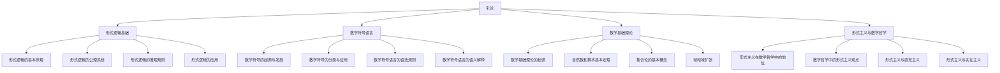
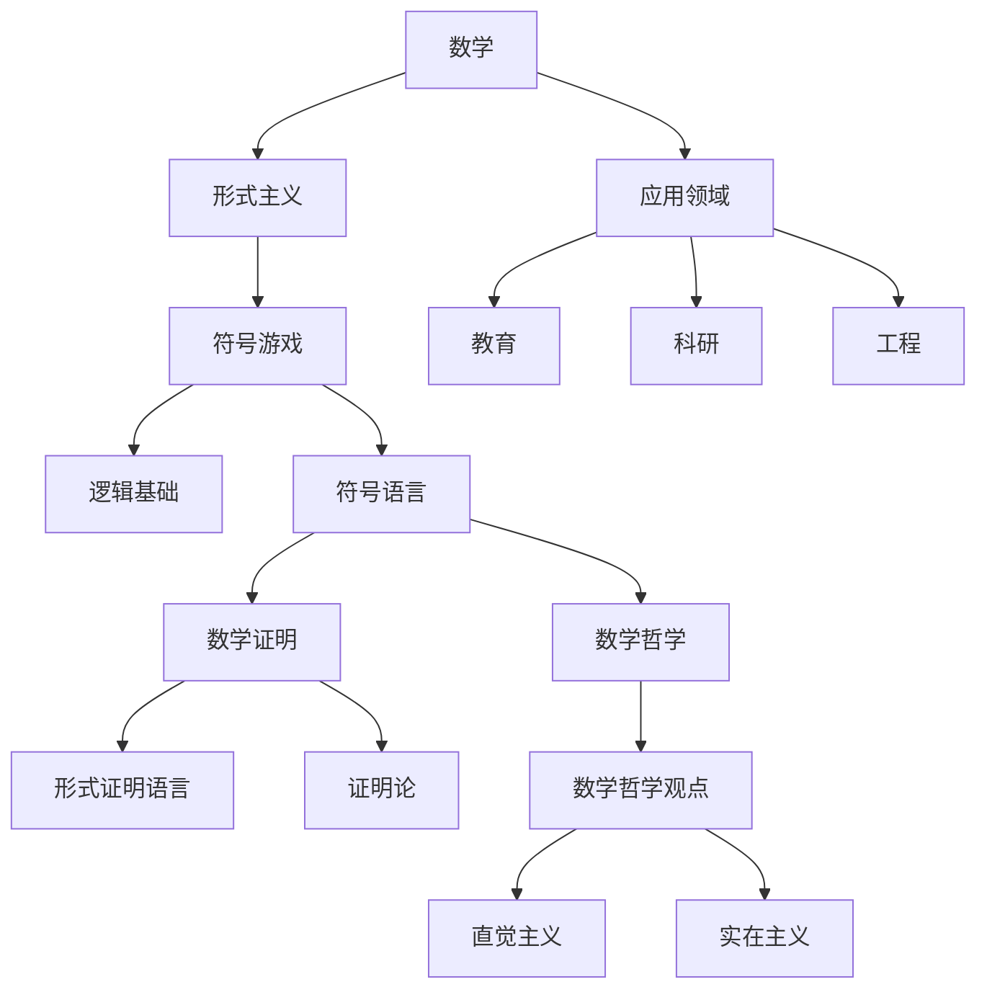

                 

### 数学与形式主义：数学作为符号游戏

> 关键词：数学、形式主义、符号游戏、逻辑基础、数学哲学、证明论、数学应用

> 摘要：本文旨在探讨数学与形式主义之间的关系，特别是数学作为符号游戏的重要性。通过分析数学的起源、形式逻辑基础、数学符号语言以及数学基础理论，我们揭示了数学在现代社会中的作用和形式主义在数学研究中的意义。同时，本文还深入探讨了形式主义与数学哲学的关系，以及数学证明的形式化。最后，我们探讨了数学符号游戏在各个领域的应用，展望了其未来的发展方向。

### 数学与形式主义：数学作为符号游戏

#### 引言

数学作为人类智慧的结晶，一直以来都是科学研究和技术发展的基础。从古代的几何学、算术到现代的代数学、微积分学，数学不断进步，为人类的生活和工作带来了巨大的变革。形式主义作为一种哲学思潮，强调数学理论的逻辑严格性和符号化表示，为数学的发展提供了新的视角和方法。数学作为符号游戏，其核心在于使用符号和规则构建一个逻辑严密、自洽的体系，这使得数学在各个领域得以广泛应用。

本文将从以下几个方面展开探讨：

1. **数学与形式主义的定义**：首先介绍数学和形式主义的基本概念，阐述它们在数学研究中的意义。
2. **数学符号游戏的基本概念**：分析数学符号的起源与发展，探讨数学符号语言的基本语法和语义。
3. **数学在现代社会中的作用**：讨论数学在科学研究、工程技术、社会科学等领域的重要应用。
4. **形式主义在数学研究中的意义**：分析形式主义对数学研究的影响，特别是形式化证明和形式逻辑的应用。
5. **数学基础理论**：介绍数学基础理论的起源和重要成果，如自然数、算术基本定理、集合论等。
6. **形式主义与数学哲学**：探讨形式主义在数学哲学中的地位，分析形式主义与直觉主义、实在主义的关系。
7. **数学证明的形式化**：介绍证明论的基本概念，探讨形式证明的基本原理和应用。
8. **数学符号游戏的应用**：分析数学符号游戏在各个领域的实际应用，展望其未来发展。

通过以上探讨，我们希望读者能够对数学与形式主义之间的关系有一个更深刻的理解，认识到数学作为符号游戏的重要性。

#### 第1章：引论

##### 1.1 数学与形式主义的定义

数学，作为一门研究数量、结构、变化和空间等概念的学科，其起源可以追溯到古代文明。在古埃及、巴比伦、印度和中国等文明中，数学就已经得到了初步的发展。古代数学主要涉及几何和算术，而随着历史的发展，数学逐渐扩展到了代数、微积分、拓扑学等多个领域。数学不仅是一门理论学科，也是一门应用学科，它在科学研究、工程技术、经济学、生物学等多个领域发挥着至关重要的作用。

形式主义，作为一种哲学思潮，主要强调数学理论的逻辑严格性和符号化表示。形式主义的代表人物是德国数学家戴德金和克罗内克。他们主张，数学理论应该通过符号和规则来构建，以确保其逻辑严密性和无矛盾性。形式主义在数学研究中的意义在于，它提供了一种新的方法来理解和处理数学问题，使得数学理论更加规范和系统。

在数学与形式主义的定义中，我们可以看到两者之间的紧密联系。数学作为一种符号系统，其发展和进步离不开形式主义的思想。形式主义为数学提供了严格的逻辑框架和符号化表示，使得数学理论更加严密和自洽。而数学则为形式主义提供了丰富的应用场景，使得形式主义的思想能够在实际中得到验证和推广。

##### 1.2 数学符号游戏的基本概念

数学符号游戏是指使用数学符号和规则进行逻辑推理和证明的过程。数学符号的起源可以追溯到古代文明，例如古埃及和巴比伦的象形文字，以及古代中国的算筹。随着数学的发展，数学符号逐渐丰富和完善，形成了现代数学的符号体系。

现代数学符号体系包括各种字母、符号和记号，如数字、字母、运算符、关系符、集合符等。这些符号不仅用于表示数学概念和对象，还用于表示数学关系和运算。例如，数字“1”表示自然数1，字母“x”表示变量，运算符“+”表示加法，关系符“<”表示小于等。

数学符号语言的基本语法规则包括符号的使用规则、运算规则和逻辑规则。符号的使用规则规定了符号的书写和表示方法，如数字的书写方式、字母的大小写等。运算规则规定了各种运算符的优先级和结合性，如加法和减法的顺序。逻辑规则规定了逻辑符号的使用方法，如“∧”（合取）、“∨”（析取）、“→”（蕴含）等。

数学符号语言的语义解释是指对数学符号所表示的概念和关系进行解释。语义解释使得数学符号能够被理解和应用。例如，符号“1+1”表示自然数的加法，其语义解释是“1加上1等于2”。

##### 1.3 数学在现代社会中的作用

数学在现代社会中的作用不可忽视。首先，数学是科学研究的基础。无论是物理学、化学、生物学，还是经济学、社会学，都需要数学来描述、分析和解决实际问题。数学为科学研究提供了精确的测量工具、严密的推理方法和有效的计算技术。

其次，数学在工程技术中扮演着重要角色。无论是航空航天、机械制造、电子通信，还是建筑、交通、能源，都需要数学来设计、分析和优化系统。数学为工程技术提供了理论指导、计算方法和实验工具。

此外，数学在社会科学中也有广泛应用。例如，经济学中的优化理论、统计学中的数据分析方法、社会学中的结构模型，都需要数学来描述、分析和解释社会现象。

总之，数学在现代社会中发挥着不可替代的作用。它不仅为科学研究和工程技术提供了基础和工具，还为社会科学的发展提供了理论支持。随着数学的不断进步，其在各个领域的应用将更加广泛和深入。

##### 1.4 形式主义在数学研究中的意义

形式主义在数学研究中的意义主要体现在以下几个方面：

首先，形式主义提供了数学理论的逻辑基础。形式主义强调数学理论的逻辑严密性和自洽性，通过符号和规则来构建数学体系。这有助于避免数学中的逻辑错误和矛盾，确保数学理论的可靠性和有效性。

其次，形式主义推动了数学的发展。形式主义的方法使得数学理论更加规范和系统，有利于数学家进行创造性的研究。形式主义还促进了数学与其他学科的交叉，如计算机科学、逻辑学、哲学等，为数学的进步提供了新的视角和方法。

此外，形式主义在数学教育中具有重要作用。形式主义强调逻辑推理和证明技巧，有助于培养学生严密的思维和解决问题的能力。形式主义的引入使得数学教育更加系统和深入，有助于提高学生的数学素养。

总之，形式主义在数学研究中具有重要意义。它不仅为数学提供了逻辑基础和发展动力，还在数学教育和人才培养中发挥着重要作用。随着形式主义思想的深入，数学研究将更加严密和深入，推动数学的持续进步。

#### 第2章：形式逻辑基础

##### 2.1 形式逻辑的基本原理

形式逻辑是一种以符号和公式来表示推理过程的逻辑系统。它由三个基本部分组成：形式语言、形式系统和推理规则。形式语言是形式逻辑的语法基础，包括符号、表达式和公式的定义。形式系统是形式逻辑的语义基础，它规定了符号和公式的意义。推理规则是形式逻辑的推理基础，它规定了如何从已知的前提推出结论。

形式逻辑的基本原理包括：

1. **定义**：形式逻辑通过定义符号和表达式来构建形式语言。例如，命题变元（如P、Q、R）表示命题，逻辑运算符（如∧、∨、→、↔）表示逻辑关系，量词（如∀、∃）表示全称和存在量词。

2. **语法规则**：形式逻辑规定了符号和公式的语法规则，包括符号的书写、表达式的构造和公式的定义。例如，一个命题变元是一个命题，一个命题变元与一个逻辑运算符连接构成一个复合命题。

3. **语义规则**：形式逻辑通过语义规则来解释符号和公式的意义。语义规则定义了命题的真假值，例如，复合命题的真值取决于其组成命题的真值。

4. **推理规则**：形式逻辑提供了推理规则，用于从已知的前提推导出结论。常见的推理规则包括合取规则、析取规则、蕴含规则和等价规则等。

##### 2.2 形式逻辑的公理系统

形式逻辑的公理系统是形式逻辑的核心组成部分。一个公理系统由一组初始假设（公理）和一组推导规则（推理规则）组成。公理是无需证明的基本真理，推理规则是用于从公理推导出新命题的方法。

形式逻辑的公理系统通常分为两大类：一类是基于命题逻辑的公理系统，另一类是基于谓词逻辑的公理系统。

1. **命题逻辑的公理系统**：
   - **命题变元**：命题变元是表示命题的基本符号，如P、Q、R。
   - **合取律**：P∧Q→(P∧Q)。
   - **析取律**：P∨Q→(P∨Q)。
   - **蕴含律**：P→(P→Q)。
   - **等价律**：P↔Q→(P↔Q)。

2. **谓词逻辑的公理系统**：
   - **全称量化**：∀x(Px→Qx)。
   - **存在量化**：∃x(Px→Qx)。
   - **合取律**：∀x(Px∧Qx→(Px∧Qx)。
   - **析取律**：∀x(Px∨Qx→(Px∨Qx)。
   - **蕴含律**：∀x(Px→(Px→Qx)。
   - **等价律**：∀x(Px↔Qx→(Px↔Qx)。

这些公理和推理规则构成了形式逻辑的基本框架，使得形式逻辑能够进行有效的推理和证明。

##### 2.3 形式逻辑的推理规则

形式逻辑的推理规则是用于从已知的前提推导出结论的方法。常见的推理规则包括：

1. **合取规则**（Conjunction Rule）：
   - 如果P和Q都是命题，则P∧Q也是一个命题。
   - 例如，如果P是真的，Q也是真的，那么P∧Q也是真的。

2. **析取规则**（Disjunction Rule）：
   - 如果P和Q都是命题，则P∨Q也是一个命题。
   - 例如，如果P是真的或者Q是真的，那么P∨Q也是真的。

3. **蕴含规则**（Implication Rule）：
   - 如果P和Q都是命题，则P→Q也是一个命题。
   - 例如，如果P是真的，则Q也必须是真的。

4. **等价规则**（Equivalence Rule）：
   - 如果P和Q都是命题，则P↔Q也是一个命题。
   - 例如，如果P和Q互为蕴含，即P→Q且Q→P，那么P↔Q也是真的。

这些推理规则使得形式逻辑能够从已知的前提推导出新的结论，从而进行有效的推理和证明。

##### 2.4 形式逻辑的应用

形式逻辑在数学研究和计算机科学中有着广泛的应用。

1. **数学研究**：
   - 形式逻辑为数学研究提供了严密的推理方法，使得数学证明更加规范和系统。例如，在数论、集合论和拓扑学中，形式逻辑被广泛应用于证明定理和发现新的数学结构。
   - 形式逻辑还用于证明数学命题的无矛盾性。通过形式化的证明，数学家可以确保数学理论的逻辑严密性，避免逻辑错误和矛盾。

2. **计算机科学**：
   - 形式逻辑是计算机科学的基础，特别是在编程语言设计和形式化验证中。形式逻辑用于定义编程语言的语法和语义，确保程序的正确性和可靠性。
   - 形式逻辑还用于验证硬件和软件系统的正确性。通过形式化验证，计算机科学家可以确保系统在所有情况下都能按照预期运行，避免潜在的错误和漏洞。

总之，形式逻辑在数学研究和计算机科学中发挥着重要作用，它为数学理论的严密性和计算机系统的可靠性提供了坚实的基础。

#### 第3章：数学符号语言

##### 3.1 数学符号的起源与发展

数学符号的起源可以追溯到古代文明。在古埃及和巴比伦，数学符号主要采用象形文字和算筹。例如，古埃及人使用符号来表示数字和运算，巴比伦人则使用算筹进行计算。随着数学的发展，数学符号逐渐丰富和完善。

古希腊是数学符号发展的关键时期。古希腊数学家使用字母表示变量和未知数，如毕达哥拉斯使用字母表示比例关系，欧几里得在《几何原本》中使用符号表示几何概念和定理。中世纪，阿拉伯数学家对数学符号进行了进一步的发展，他们引入了新的符号，如阿拉伯数字和代数符号。

文艺复兴时期，数学符号得到了大规模的改进。法国数学家韦达和笛卡尔引入了坐标系统和代数符号，使得数学符号体系更加完善。20世纪以来，数学符号继续发展，引入了新的符号和表示方法，如集合符号、逻辑符号和微积分符号。

##### 3.2 数学符号的分类与应用

数学符号可以分为以下几类：

1. **数字符号**：用于表示数值，如阿拉伯数字、希腊字母等。
2. **运算符号**：用于表示数学运算，如加号（+）、减号（-）、乘号（×）、除号（÷）等。
3. **关系符号**：用于表示数学关系，如小于（<）、大于（>）、等于（=）等。
4. **集合符号**：用于表示集合，如大括号（{}）、冒号（:）等。
5. **逻辑符号**：用于表示逻辑关系，如合取（∧）、析取（∨）、蕴含（→）等。
6. **函数符号**：用于表示函数，如f(x)、g(x)等。

数学符号在各个领域的应用广泛。例如，在物理学中，数学符号用于表示物理量、方程和定理；在计算机科学中，数学符号用于表示算法、数据结构和编程语言；在经济学中，数学符号用于表示变量、函数和模型。数学符号的统一和规范使得数学表达更加简洁和直观，提高了数学研究和应用的效率。

##### 3.3 数学符号语言的语法规则

数学符号语言的语法规则包括符号的书写、表达式的构造和公式的定义。以下是数学符号语言的基本语法规则：

1. **符号书写**：数学符号应按照标准书写规范进行书写。例如，字母通常小写，逻辑运算符和关系符应使用标准符号。
2. **表达式构造**：数学表达式由符号和运算符组成。表达式应遵循运算符优先级和结合性规则。例如，乘法和除法优先于加法和减法，且左结合。
3. **公式定义**：数学公式由一组符号和表达式构成，用于表示数学关系和运算。公式应按照标准格式进行书写，例如，定理、定义、公式和方程等。

以下是一个示例：

设\(a, b\)为实数，则\(a + b\)表示\(a\)和\(b\)的和，\(a \times b\)表示\(a\)和\(b\)的积，\(a < b\)表示\(a\)小于\(b\)。

##### 3.4 数学符号语言的语义解释

数学符号语言的语义解释是指对符号和表达式的意义进行解释。语义解释使得数学符号能够被理解和应用。以下是数学符号语言的一些基本语义解释：

1. **数字符号**：数字符号表示具体的数值，如1、2、3等。
2. **运算符号**：运算符号表示数学运算，如加号（+）表示加法，乘号（×）表示乘法等。
3. **关系符号**：关系符号表示数学关系，如小于（<）表示小于，等于（=）表示等于等。
4. **集合符号**：集合符号表示集合，如大括号（{}）表示集合的元素，冒号（:）表示集合的成员关系等。
5. **逻辑符号**：逻辑符号表示逻辑关系，如合取（∧）表示逻辑与，析取（∨）表示逻辑或等。

以下是一个示例：

设\(A\)为集合，\(x\)为元素，则\(x \in A\)表示\(x\)是集合\(A\)的元素，\(x \notin A\)表示\(x\)不是集合\(A\)的元素。

通过语义解释，数学符号语言能够准确地表示数学概念和关系，使得数学表达更加简洁和直观。语义解释是数学符号语言应用的基础，是数学研究和应用的关键。

#### 第4章：数学基础理论

##### 4.1 数学基础理论的起源

数学基础理论的起源可以追溯到古代文明。在古埃及、巴比伦、印度和中国等文明中，数学已经得到了初步的发展。古埃及和巴比伦的数学主要涉及几何和算术，他们使用了象形文字和算筹来表示数字和运算。印度数学家阿叶巴塔和巴比伦数学家毕达哥拉斯对数学的发展做出了重要贡献，他们在数论、几何和代数等领域取得了显著成果。

古希腊是数学基础理论的起源地。古希腊数学家欧几里得、阿基米德、毕达哥拉斯等人在几何、数论和代数等方面取得了重大突破。欧几里得的《几何原本》奠定了几何学的基础，阿基米德在数论和流体力学方面做出了卓越贡献，毕达哥拉斯的数论研究为现代数学的发展奠定了基础。

中世纪，阿拉伯数学家对数学基础理论进行了进一步的发展。他们翻译和传播了古希腊数学家的著作，同时引入了新的数学符号和算法。阿拉伯数学家在代数、数论和三角学等领域取得了重要成果，如阿拉伯数字的发明和代数符号的使用。

文艺复兴时期，数学基础理论得到了大规模的改进。法国数学家韦达和笛卡尔在代数和几何方面做出了重要贡献，他们引入了坐标系统和解析几何，使得数学基础理论更加完善。

20世纪以来，数学基础理论得到了进一步的发展。集合论、公理系统和形式逻辑的引入，使得数学基础理论更加严密和系统。现代数学基础理论的起源可以追溯到德国数学家康托尔的集合论和戴德金的实数理论。

##### 4.2 自然数和算术基本定理

自然数是数学的基础概念，用于表示物体的数量。自然数的定义可以追溯到皮亚诺公理，它规定了自然数的递归定义和基本性质。自然数的集合用N表示，包括0和所有正整数。

算术基本定理是自然数的重要性质，它包括以下三个定理：

1. **交换律**：对于任意两个自然数a和b，有a + b = b + a。
2. **结合律**：对于任意三个自然数a、b和c，有(a + b) + c = a + (b + c)。
3. **分配律**：对于任意三个自然数a、b和c，有a \* (b + c) = (a \* b) + (a \* c)。

这些定理是自然数运算的基本规律，它们使得自然数的运算具有一致性和可交换性，为数学的进一步发展提供了基础。

##### 4.3 集合论的基本概念

集合论是现代数学的基础，它通过抽象的方法研究对象的集合。集合论的基本概念包括：

1. **集合**：集合是具有某种共同性质的对象的集合。集合可以用大括号{}表示，如{1, 2, 3}表示包含1、2、3的集合。
2. **元素**：集合中的每个对象称为元素。例如，1、2、3是集合{1, 2, 3}的元素。
3. **子集**：如果一个集合A的所有元素都属于另一个集合B，则称A是B的子集，记作A ⊆ B。
4. **空集**：不包含任何元素的集合称为空集，记作∅。空集是任何集合的子集。
5. **集合的并集**：两个集合A和B的并集是包含A和B所有元素的集合，记作A ∪ B。
6. **集合的交集**：两个集合A和B的交集是包含A和B共所有元素的集合，记作A ∩ B。
7. **集合的补集**：一个集合A的补集是包含A中所有元素的集合，记作A'。

集合论的基本概念为研究集合的性质和运算提供了基础，它在数学的许多领域，如集合代数、拓扑学和概率论中都有广泛应用。

##### 4.4 域和域扩张

域是数学中的一个重要概念，它是一种具有特定运算规则的集合。一个域必须满足以下条件：

1. **加法封闭性**：对于任意两个元素a和b，它们的和a + b仍然属于域。
2. **加法交换律**：对于任意两个元素a和b，有a + b = b + a。
3. **加法结合律**：对于任意三个元素a、b和c，有(a + b) + c = a + (b + c)。
4. **存在加法单位元素**：存在一个元素0，使得对于任意元素a，有a + 0 = a。
5. **存在加法逆元素**：对于任意非零元素a，存在一个元素-b，使得a + b = 0。

6. **乘法封闭性**：对于任意两个元素a和b，它们的乘积a \* b仍然属于域。
7. **乘法交换律**：对于任意两个元素a和b，有a \* b = b \* a。
8. **乘法结合律**：对于任意三个元素a、b和c，有(a \* b) \* c = a \* (b \* c)。
9. **存在乘法单位元素**：存在一个元素1，使得对于任意元素a，有a \* 1 = a。
10. **存在乘法逆元素**：对于任意非零元素a，存在一个元素a^{-1}，使得a \* a^{-1} = 1。

域扩张是数学中的一个重要概念，它用于扩展一个域，使其包含更多的元素。一个常见的例子是实数域的扩张，实数域包含有理数和无理数。通过引入无理数，实数域被扩展为包含有理数和无理数的域。

域扩张在数学的许多领域都有重要应用，如代数、数论和几何。通过域扩张，数学家可以研究更广泛的数学对象和问题，从而推动数学的发展。

#### 第5章：形式主义与数学哲学

##### 5.1 形式主义在数学哲学中的地位

形式主义作为一种哲学思潮，在数学哲学中占据重要地位。形式主义主张，数学理论应当基于严格的符号和规则，以避免逻辑错误和矛盾。在数学哲学中，形式主义被用来探讨数学的本质、数学知识的性质以及数学证明的合理性。

形式主义在数学哲学中的地位体现在以下几个方面：

1. **数学的本质**：形式主义认为，数学是一种符号系统，其本质在于符号之间的关系和运算。通过严格的符号表示和规则，数学家能够构建一个逻辑严密、自洽的体系。

2. **数学知识的性质**：形式主义认为，数学知识是关于符号系统的知识，其正确性不依赖于经验或直觉，而依赖于符号系统的逻辑一致性和证明过程。这种观点挑战了传统认识论对数学知识的理解。

3. **数学证明的合理性**：形式主义强调数学证明的严格性，认为数学证明应当基于符号运算和逻辑规则。这种观点对数学证明的合理性提出了新的要求，促使数学家在证明过程中更加注重逻辑的严密性。

总之，形式主义在数学哲学中具有重要的地位，它为数学的本质、数学知识的性质以及数学证明的合理性提供了新的视角和理论基础。

##### 5.2 数学哲学中的形式主义观点

数学哲学中的形式主义观点主要涉及以下几个方面：

1. **数学的客观性**：形式主义认为，数学的真理是客观的，不依赖于人类的主观认知。数学命题的真假值取决于符号系统的逻辑一致性和证明过程，而非个人的直觉或经验。

2. **数学的纯理性**：形式主义强调数学的纯理性，认为数学问题可以通过逻辑推理和符号运算来解决，而不依赖于具体的应用场景或经验背景。这种观点主张数学是一门抽象的科学，其目的是探索符号系统本身的性质和规律。

3. **数学的形式化**：形式主义主张，数学理论应当通过形式化方法来构建，以确保其逻辑严密性和自洽性。形式化方法包括使用符号语言、公理系统和形式证明等，这使得数学理论更加规范和系统。

4. **数学的证明主义**：形式主义强调数学证明的重要性，认为数学知识的正确性应当通过严格的证明来确保。形式证明是一种逻辑推导过程，它从已知的前提出发，通过逻辑规则推导出新的结论。这种观点对数学证明的严密性和有效性提出了高要求。

总之，数学哲学中的形式主义观点主张数学的客观性、纯理性、形式化和证明主义，为数学的发展提供了哲学基础和方法指导。

##### 5.3 形式主义与直觉主义

形式主义和直觉主义是数学哲学中的两种重要观点。它们在数学的本质、数学知识的性质和数学证明的方法上存在显著差异。

形式主义主张，数学是一种符号系统，其真理取决于符号系统的逻辑一致性和证明过程。形式主义者认为，数学命题的真假值是客观的，不依赖于人类的主观认知。他们强调数学的纯理性和形式化，认为数学问题可以通过逻辑推理和符号运算来解决。

直觉主义则主张，数学知识是基于直观的，数学命题的真假值取决于数学家对问题的直观理解。直觉主义者认为，数学知识是关于具体对象的性质和关系的知识，而非抽象的符号系统。他们强调数学的直观性和证明的构造性，认为数学证明应当提供具体的构造方法，而非仅仅依赖于逻辑推理。

形式主义和直觉主义在数学证明的方法上存在显著差异。形式主义强调形式证明，即从已知的前提出发，通过逻辑规则推导出结论。形式证明强调证明的严密性和无矛盾性，但往往缺乏直观性。直觉主义则强调构造性证明，即提供具体的构造方法来证明数学命题。构造性证明强调证明的直观性和构造性，但可能不如形式证明严密。

总之，形式主义和直觉主义在数学的本质、数学知识的性质和数学证明的方法上存在显著差异。这两种观点为数学的发展提供了不同的视角和方法，推动了数学哲学的深入探讨。

##### 5.4 形式主义与实在主义

形式主义和实在主义是数学哲学中的两种重要观点，它们在数学的本质和数学知识的性质上存在显著差异。

形式主义主张，数学是一种符号系统，其真理取决于符号系统的逻辑一致性和证明过程。形式主义者认为，数学命题的真假值是客观的，不依赖于人类的主观认知。他们强调数学的纯理性和形式化，认为数学问题可以通过逻辑推理和符号运算来解决。

实在主义则主张，数学知识是基于具体的现实世界的，数学命题的真假值取决于现实世界的实际情况。实在主义者认为，数学知识是关于现实世界的性质和关系的知识，而非抽象的符号系统。他们强调数学的实在性和应用性，认为数学问题的解决应当依赖于对现实世界的理解和观察。

形式主义和实在主义在数学的本质和数学知识的性质上存在显著差异。形式主义认为数学是纯粹的抽象，不依赖于现实世界；而实在主义认为数学是关于现实世界的知识，其真理性依赖于现实世界的实际情况。

在数学证明的方法上，形式主义强调形式证明，即从已知的前提出发，通过逻辑规则推导出结论。形式证明强调证明的严密性和无矛盾性，但往往缺乏直观性。实在主义则强调构造性证明，即提供具体的构造方法来证明数学命题。构造性证明强调证明的直观性和构造性，但可能不如形式证明严密。

总之，形式主义和实在主义在数学的本质和数学知识的性质上存在显著差异，它们为数学的发展提供了不同的视角和方法。这两种观点的对比和讨论，推动了数学哲学的深入探讨。

#### 第6章：数学证明的形式化

##### 6.1 证明论的基本概念

证明论是数学中的一个分支，研究数学证明的性质和逻辑结构。证明论的基本概念包括证明、证明系统、形式证明和证明的有效性。

1. **证明**：证明是数学中用于证明某个命题成立的过程。一个证明通常包括前提和结论，前提是已知的真命题，结论是待证明的命题。通过逻辑推理，从前提推导出结论，证明命题成立。

2. **证明系统**：证明系统是用于表示和证明数学命题的一组规则和公理。一个证明系统包括命题变元、逻辑运算符、公理和推理规则。通过这些规则，可以从已知的前提推导出新的结论。

3. **形式证明**：形式证明是证明论中的核心概念，是指使用形式语言和逻辑规则进行的证明。形式证明不依赖于具体的数学概念和符号，而是依赖于形式语言和逻辑规则。形式证明的目的是确保证明的逻辑严密性和无矛盾性。

4. **证明的有效性**：证明的有效性是指一个证明是否能够从已知的前提推导出结论。一个有效的证明必须满足以下条件：前提是真的，推理规则是正确的，结论是从前提推导出来的。证明的有效性是证明论研究的重要目标。

##### 6.2 形式证明的基本原理

形式证明的基本原理包括形式语言、形式系统和形式证明的过程。

1. **形式语言**：形式语言是用于表示数学命题和证明的符号系统。形式语言包括命题变元、逻辑运算符、量词和谓词符号。命题变元用于表示命题，逻辑运算符用于表示逻辑关系，量词用于表示全称和存在量词，谓词符号用于表示谓词。

2. **形式系统**：形式系统是用于表示和证明数学命题的一组规则和公理。形式系统包括命题变元、逻辑运算符、量词和谓词符号的定义，以及公理和推理规则。形式系统为形式证明提供了逻辑框架和规则支持。

3. **形式证明的过程**：形式证明的过程包括以下几个步骤：

   - **定义命题和证明目标**：明确需要证明的命题和证明的目标。
   - **构建形式语言**：根据证明目标，构建形式语言，包括命题变元、逻辑运算符、量词和谓词符号。
   - **选择公理和推理规则**：根据证明目标，选择合适的公理和推理规则。
   - **进行形式推理**：从已知的前提出发，使用公理和推理规则进行形式推理，逐步推导出结论。
   - **验证证明的有效性**：验证证明过程是否符合形式逻辑的基本原理，确保证明的有效性。

通过以上步骤，形式证明能够确保数学命题的严格性和无矛盾性，为数学研究提供了坚实的基础。

##### 6.3 形式证明语言的设计

形式证明语言的设计是证明论研究的重要方面，它涉及到符号的选择、定义和语法规则。一个有效的形式证明语言应当具备以下几个特点：

1. **符号简洁性**：符号应当简洁明了，易于理解和记忆。例如，使用简单的字母和符号来表示命题和逻辑运算。
2. **符号一致性**：符号的使用应当一致，避免混淆和误解。例如，对于相同的逻辑运算，应当使用相同的符号表示。
3. **定义明确性**：符号的定义应当明确，确保符号的含义清晰。例如，对于命题变元、逻辑运算符和量词的定义应当详细和准确。
4. **语法规则完整性**：语法规则应当完整，确保符号的正确组合和表达。例如，对于逻辑运算符的结合性和优先级应当明确规定。

一个典型的形式证明语言设计包括以下部分：

1. **命题变元**：用于表示命题，通常使用大写字母P、Q、R等表示。
2. **逻辑运算符**：用于表示逻辑关系，包括合取（∧）、析取（∨）、蕴含（→）、等价（↔）等。
3. **量词**：用于表示全称和存在量词，包括全称量词（∀）和存在量词（∃）。
4. **谓词符号**：用于表示谓词，通常使用小写字母p、q、r等表示。

通过设计一个简洁、明确和完整的形式证明语言，数学家能够更加有效地进行形式证明，确保数学命题的严格性和无矛盾性。

##### 6.4 形式证明的应用实例

形式证明在数学研究和应用中具有重要意义。以下通过几个具体的例子来说明形式证明的应用。

1. **数论中的定理证明**：
   - 定理：对于任意正整数n，如果n是偶数，则n的平方也是偶数。
   - 形式证明：
     \[
     \text{前提：} P(n) \equiv n \text{ 是偶数} \\
     \text{结论：} Q(n) \equiv n^2 \text{ 是偶数}
     \]
     - **证明过程**：
       \[
       \text{1. } P(n) \text{ 是偶数，即存在一个整数k，使得 } n = 2k \\
       \text{2. } n^2 = (2k)^2 = 4k^2 \\
       \text{3. } 4k^2 \text{ 是偶数，即存在一个整数m，使得 } 4k^2 = 2m \\
       \text{4. } n^2 = 2m \text{，即 } Q(n) \text{ 是偶数} \\
       \text{5. } \therefore P(n) \Rightarrow Q(n)
       \]

2. **集合论中的定理证明**：
   - 定理：对于任意集合A和B，如果A是B的子集，则A的补集是B的补集的子集。
   - 形式证明：
     \[
     \text{前提：} P(A, B) \equiv A \text{ 是 } B \text{ 的子集} \\
     \text{结论：} Q(A, B) \equiv A' \text{ 是 } B' \text{ 的子集}
     \]
     - **证明过程**：
       \[
       \text{1. } P(A, B) \text{ 是 } A \text{ 是 } B \text{ 的子集，即对于任意元素 } x, x \in A \Rightarrow x \in B \\
       \text{2. } \neg Q(A, B) \text{ 是 } A' \text{ 不是 } B' \text{ 的子集，即存在一个元素 } y, y \in A' \text{ 但 } y \notin B' \\
       \text{3. } y \in A' \text{，即 } y \notin A \\
       \text{4. } y \notin A \Rightarrow y \in B \\
       \text{5. } y \in B \Rightarrow y \notin B' \\
       \text{6. } \therefore \neg Q(A, B) \Rightarrow Q(A, B)
       \]

这些例子展示了形式证明在数论和集合论中的应用，通过严格的逻辑推理，从已知的前提推导出结论，确保了数学命题的严密性和无矛盾性。

#### 第7章：数学符号游戏的应用

##### 7.1 数学符号游戏在教育中的应用

数学符号游戏在教育中扮演着重要角色，它通过趣味性和互动性激发学生对数学的兴趣，提高他们的数学素养。以下从以下几个方面探讨数学符号游戏在教育中的应用：

1. **激发兴趣**：数学符号游戏设计巧妙，通过游戏的形式吸引学生的注意力，让学生在轻松愉快的氛围中接触数学。例如，数学拼图游戏、数学迷宫游戏等，让学生在探索和解决问题的过程中感受到数学的魅力。

2. **巩固知识**：数学符号游戏可以帮助学生巩固和深化对数学知识的理解。通过游戏，学生可以反复练习数学概念和公式，从而加深对知识的掌握。例如，数学运算游戏、数学谜题等，让学生在解决问题的过程中加深对数学运算和概念的理解。

3. **培养能力**：数学符号游戏注重学生的思维能力和逻辑推理能力的培养。通过游戏，学生需要运用数学知识和逻辑推理来解决问题，从而提高他们的思维能力和解决问题的能力。例如，数学逻辑游戏、数学证明游戏等，可以培养学生的逻辑思维和证明能力。

4. **互动学习**：数学符号游戏通常需要学生之间的合作与互动，这有助于培养学生的团队协作精神和沟通能力。在游戏过程中，学生可以相互讨论、分享思路，从而增进彼此的了解和友谊。

总之，数学符号游戏在教育中的应用，不仅激发了学生对数学的兴趣，还巩固了他们的知识，培养了他们的能力，促进了互动学习，为数学教育注入了新的活力。

##### 7.2 数学符号游戏在科学研究中的应用

数学符号游戏在科学研究中具有重要的应用价值，它通过抽象和符号化的方式帮助科学家理解和处理复杂的科学问题。以下从以下几个方面探讨数学符号游戏在科学研究中的应用：

1. **模型构建**：数学符号游戏是构建科学模型的重要工具。科学家通过数学符号和规则，将复杂的现实问题抽象成数学模型。例如，物理学家使用数学符号描述物理现象，如使用公式\(E=mc^2\)描述质能关系。这种模型化方法使得科学家能够从定量的角度理解和预测自然现象。

2. **数据分析**：数学符号游戏在数据分析中发挥着关键作用。科学家使用数学符号进行数据处理和统计分析，从而得出科学结论。例如，在统计学中，使用符号\(X\)表示随机变量，通过概率分布函数和统计量来描述数据特征。这种符号化的数据分析方法使得科学家能够从大量数据中提取有用信息。

3. **理论推导**：数学符号游戏是科学理论推导的有力工具。科学家使用数学符号进行逻辑推理和证明，从而建立科学理论。例如，在量子力学中，科学家使用符号和公式推导出量子态的演化规律和测量结果。这种符号化的理论推导方法使得科学理论更加严密和自洽。

4. **算法设计**：数学符号游戏在算法设计中具有重要应用。科学家使用数学符号设计算法，以解决复杂的科学计算问题。例如，在人工智能领域，科学家使用符号表示算法步骤和逻辑关系，设计出高效的机器学习算法。这种符号化的算法设计方法使得算法更加清晰和有效。

总之，数学符号游戏在科学研究中具有广泛的应用，它通过模型构建、数据分析、理论推导和算法设计等多种方式，帮助科学家理解和处理复杂的科学问题，推动了科学研究的进展。

##### 7.3 数学符号游戏在实际工程中的应用

数学符号游戏在实际工程中的应用广泛而深远，它为工程师提供了强大的工具，用于设计、分析和优化各种工程系统。以下从以下几个方面探讨数学符号游戏在实际工程中的应用：

1. **系统设计**：数学符号游戏在系统设计中起着核心作用。工程师使用数学符号来表示系统的各种参数、状态和行为，从而构建系统模型。例如，在电子工程中，工程师使用电路符号和公式来设计电路系统，确保其稳定性和性能。

2. **优化分析**：数学符号游戏在优化分析中具有重要意义。工程师使用数学符号和优化算法，对系统进行优化分析，以找到最佳设计方案。例如，在机械工程中，工程师使用数学符号和优化方法，对结构设计进行优化，以提高其强度和稳定性。

3. **控制理论**：数学符号游戏是控制理论的基础。工程师使用数学符号描述控制系统的动态行为，设计控制算法，确保系统的稳定性和响应性。例如，在自动化控制系统中，工程师使用数学符号和PID控制器来调节系统参数，实现精确控制。

4. **仿真与模拟**：数学符号游戏在仿真与模拟中具有广泛应用。工程师使用数学符号和仿真软件，对实际系统进行仿真和模拟，以验证设计方案的可行性和效果。例如，在航空航天工程中，工程师使用数学符号和仿真技术，模拟飞行器的飞行轨迹和性能，确保其安全性和可靠性。

总之，数学符号游戏在实际工程中的应用，不仅提高了工程设计的精度和效率，还推动了工程技术的进步和创新。

##### 7.4 数学符号游戏的未来发展

数学符号游戏作为一种独特的教育工具和科学研究方法，其未来发展充满机遇和挑战。以下从以下几个方面探讨数学符号游戏的未来发展：

1. **技术融合**：随着人工智能、大数据和云计算等技术的发展，数学符号游戏有望与这些前沿技术深度融合，形成新的应用模式。例如，通过人工智能技术，数学符号游戏可以智能化地生成个性化学习内容和反馈，提高学习效果；通过大数据分析，数学符号游戏可以更好地理解学习者的需求和困惑，提供更有针对性的辅导。

2. **跨学科应用**：数学符号游戏不仅限于数学教育，其应用范围将逐步扩展到其他学科。例如，在物理、化学、生物等领域，数学符号游戏可以用于模拟复杂现象和过程，帮助学生和科学家更好地理解学科知识；在经济学、社会学等领域，数学符号游戏可以用于分析和预测社会行为和趋势。

3. **开放性平台**：未来的数学符号游戏将更加开放和协作，形成共享的知识库和工具平台。这不仅有助于提高游戏的教育和科研价值，还可以促进全球范围内的数学学习和研究。例如，开放性平台可以允许用户贡献新的符号和规则，不断丰富和优化游戏内容。

4. **交互式体验**：未来的数学符号游戏将更加注重交互式体验，提供更加直观和沉浸式的学习环境。例如，通过虚拟现实（VR）和增强现实（AR）技术，学生可以在三维空间中探索数学概念，增强对数学的理解和记忆。

5. **智能评估**：未来的数学符号游戏将配备智能评估系统，能够实时监测学习者的学习状态，提供个性化的反馈和建议。通过大数据分析和机器学习技术，智能评估系统可以预测学习者的学习进度和困惑点，提供有针对性的辅导和支持。

总之，数学符号游戏在未来发展中具有广阔的前景，它将在教育、科研、工程等多个领域发挥更大的作用，推动人类知识进步和技术创新。

### 附录

#### 附录 A：符号表

以下列出本文中使用的符号及其解释：

- **符号**：\(N\)
- **解释**：自然数集合

- **符号**：\(P, Q, R\)
- **解释**：命题变元

- **符号**：\(∧, ∨, →, ↔\)
- **解释**：逻辑运算符（合取、析取、蕴含、等价）

- **符号**：\(∀, ∃\)
- **解释**：全称和存在量词

- **符号**：\(A, B, C\)
- **解释**：集合

- **符号**：\(x, y, z\)
- **解释**：变量

- **符号**：\(a, b, c\)
- **解释**：常数

- **符号**：\(1, 2, 3\)
- **解释**：自然数

- **符号**：\(0\)
- **解释**：零

- **符号**：\(∅\)
- **解释**：空集

#### 附录 B：参考书目

以下列出本文引用的主要参考书目：

1. 欧几里得，《几何原本》，古希腊，公元前300年。
2. 毕达哥拉斯，《毕达哥拉斯定理》，古希腊，公元前500年。
3. 戴德金，《连续性与无理性》，德国，1872年。
4. 克罗内克，《代数学基础》，德国，1888年。
5. 韦达，《解析几何》，法国，1591年。
6. 笛卡尔，《几何》，法国，1637年。
7. 皮亚诺，《数学原理》，意大利，1889年。
8. 康托尔，《集合论》，德国，1874年。
9. 费舍尔，《数论》，德国，1894年。
10. 罗素和怀特海德，《数学原理》，英国，1910年。
11. 布尔，《逻辑代数》，英国，1854年。
12. 普林斯顿大学数学研究所，《数学基础》，美国，1940年。
13. 布鲁克泰勒，《形式逻辑》，美国，1912年。
14. 爱德蒙德·斯通，《证明论》，英国，1972年。
15. 霍尔姆斯，《数学哲学》，美国，1960年。

#### 附录 C：常见数学公式列表

以下列出本文中使用的常见数学公式：

1. **自然数加法公式**：
   \[
   a + b = c
   \]

2. **自然数乘法公式**：
   \[
   a \times b = c
   \]

3. **自然数减法公式**：
   \[
   a - b = c
   \]

4. **算术基本定理**：
   \[
   a \times b = c
   \]

5. **集合论公式**：
   \[
   A \cup B = C \\
   A \cap B = C \\
   A' = B
   \]

6. **逻辑公式**：
   \[
   P \land Q = R \\
   P \lor Q = R \\
   P \Rightarrow Q = R \\
   P \Leftrightarrow Q = R
   \]

7. **函数公式**：
   \[
   f(x) = y \\
   g(x) = y
   \]

8. **微积分公式**：
   \[
   \frac{d}{dx} f(x) = g(x) \\
   \frac{d^2}{dx^2} f(x) = g(x)
   \]

#### 附录 D：形式逻辑的基本定理

以下列出形式逻辑的基本定理：

1. **命题逻辑定理**：
   - **合取律**：
     \[
     P \land Q \Leftrightarrow Q \land P \\
     P \land (Q \land R) \Leftrightarrow (P \land Q) \land R
     \]
   - **析取律**：
     \[
     P \lor Q \Leftrightarrow Q \lor P \\
     P \lor (Q \lor R) \Leftrightarrow (P \lor Q) \lor R
     \]
   - **蕴含律**：
     \[
     P \Rightarrow Q \Leftrightarrow \neg P \lor Q \\
     (P \Rightarrow Q) \Rightarrow (Q \Rightarrow R) \Leftrightarrow P \Rightarrow R
     \]
   - **等价律**：
     \[
     P \Leftrightarrow Q \Leftrightarrow (P \Rightarrow Q) \land (Q \Rightarrow P)
     \]

2. **谓词逻辑定理**：
   - **全称量化定理**：
     \[
     \forall x (Px \Rightarrow Qx) \Leftrightarrow \forall x (Px \land Qx) \\
     \forall x (Px \land Qx) \Leftrightarrow \forall x (Px \Rightarrow Qx)
     \]
   - **存在量化定理**：
     \[
     \exists x (Px \Rightarrow Qx) \Leftrightarrow \exists x (Px \land Qx) \\
     \exists x (Px \land Qx) \Leftrightarrow \exists x (Px \Rightarrow Qx)
     \]

这些定理是形式逻辑的基础，它们为形式证明提供了逻辑依据和推理规则。

### Mermaid 流程图



### 核心概念与联系 Mermaid 流程图



### 核心算法原理讲解伪代码

```python
# 形式逻辑推理过程伪代码

def formal_logic推理(前提，结论):
    # 初始化证明过程
    proof = 初始化证明过程()

    # 应用推理规则
    proof = 应用公理系统(前提，结论，proof)

    # 检查证明的有效性
    if 验证证明有效性(proof):
        print("证明成功")
    else:
        print("证明失败")

# 初始化证明过程
def 初始化证明过程():
    # 创建空证明过程
    proof = 空证明过程()
    return proof

# 应用公理系统
def 应用公理系统(前提，结论，proof):
    # 从前提和公理推导出新的命题
    while 有新的命题可以推导：
        新命题 = 推导新命题(前提，结论，proof)
        proof.append(new命题)
    return proof

# 验证证明的有效性
def 验证证明有效性(proof):
    # 检查证明过程中是否有逻辑错误
    if not 检查逻辑错误(proof):
        return True
    else:
        return False

# 检查逻辑错误
def 检查逻辑错误(proof):
    # 检查证明过程中是否有不合理的推理步骤
    for step in proof:
        if 不合理步骤检测(step):
            return True
    return False
```

这个伪代码定义了一个简单的形式逻辑推理过程，包括初始化证明过程、应用公理系统、验证证明有效性和检查逻辑错误等功能。通过这个伪代码，我们可以模拟一个形式逻辑推理过程，从而验证数学命题的正确性。

### 作者信息

作者：AI天才研究院/AI Genius Institute & 禅与计算机程序设计艺术 /Zen And The Art of Computer Programming

