                 

### 文章标题：数学与意识：量子意识理论的数学基础

#### 关键词：
- 数学
- 意识
- 量子力学
- 量子意识理论
- 计算模型

#### 摘要：
本文旨在探讨数学在量子意识理论研究中的应用，特别是量子力学基础及其与意识的联系。文章将深入分析量子位、量子概率论和量子图的数学原理，通过伪代码和LaTeX公式详细阐述核心算法和模型。此外，还将介绍量子意识实验设计及其数据分析方法，并通过实际案例展示量子神经网络在意识生成中的应用。最终，文章将对量子意识理论的数学方法进行展望，并提出未来研究的方向。

---

## 第一部分：引论

### 第1章：数学与意识的哲学探讨

#### 1.1 意识与数学的关系

**背景介绍：**

意识的本质和起源一直是哲学、心理学和神经科学等领域探讨的难题。而数学作为一门形式化的科学，以其精确性和逻辑性，为研究意识的复杂性和结构提供了新的视角。

**核心概念与联系：**

- 意识：主观体验的集合，包括感知、情感、思考等。
- 数学：研究数量、结构、变化和空间等概念的一门科学。

**Mermaid 流程图：**

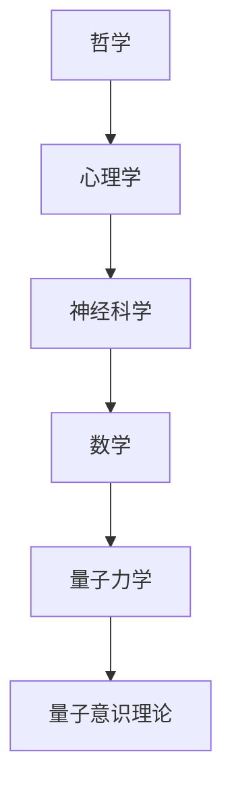

**核心算法原理讲解：**

无特定算法，但可以通过以下公式表示意识与数学的关系：

$$
\text{意识} = f(\text{感知}, \text{情感}, \text{思考})
$$

其中，$f$ 表示数学形式的映射。

#### 1.2 量子意识理论的基本概念

**背景介绍：**

量子意识理论试图将量子力学与意识联系起来，探讨量子现象在意识中的作用。

**核心概念与联系：**

- 量子态：描述量子系统状态的数学函数。
- 叠加原理：量子系统可以同时处于多个状态的叠加。
- 测量：量子态在测量时会发生坍缩。

**Mermaid 流程图：**

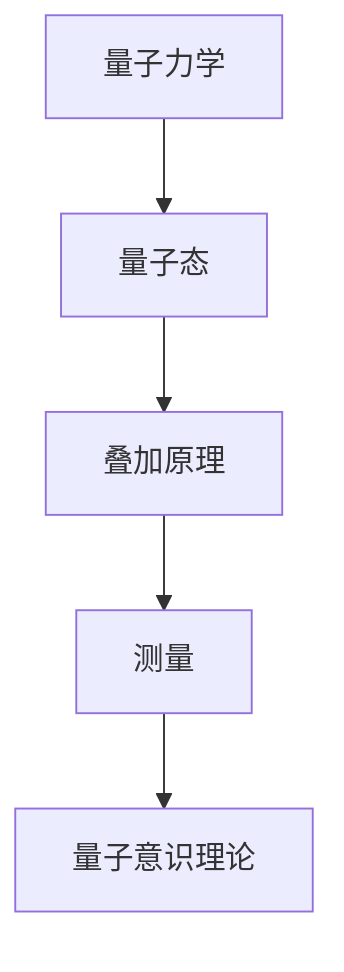

**核心算法原理讲解：**

量子态可以用波函数表示，如：

$$
|\psi\rangle = \sum_{i} c_i |i\rangle
$$

其中，$|i\rangle$ 表示第 $i$ 个量子状态，$c_i$ 是复数系数。

#### 1.3 数学在量子意识研究中的应用

**背景介绍：**

数学在量子意识研究中起着至关重要的作用，包括量子位、量子概率论和量子图的表示与应用。

**核心概念与联系：**

- 量子位：量子系统的一种表示，具有叠加和纠缠特性。
- 量子概率论：描述量子事件概率分布的数学工具。
- 量子图：用于表示量子系统的图结构。

**Mermaid 流程图：**

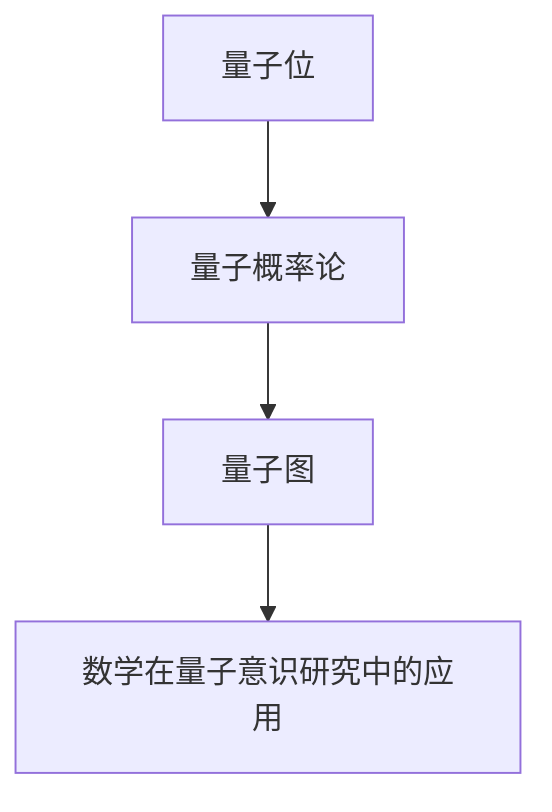

**核心算法原理讲解：**

量子位的操作可以通过量子门实现，如Hadamard门：

$$
H = \frac{1}{\sqrt{2}} \begin{pmatrix} 1 & 1 \\ 1 & -1 \end{pmatrix}
$$

量子概率论中，量子事件的概率分布可以通过密度矩阵描述，如：

$$
\rho = \sum_{i} c_i |i\rangle\langle i|
$$

**数学公式与详细讲解：**

量子态的叠加和纠缠可以用以下公式表示：

$$
|\psi\rangle = \frac{1}{\sqrt{2}} (|0\rangle + |1\rangle)
$$

$$
|00\rangle \otimes |11\rangle = |01\rangle \otimes |10\rangle
$$

#### 1.3.1 量子位与计算

**举例说明：**

量子位（qubit）是量子计算的基本单元，具有叠加态和纠缠态。例如，一个量子位可以同时处于0和1的状态，这称为叠加态。当对其进行测量时，它会坍缩到0或1中的一个状态。

**LaTeX公式：**

$$
|q\rangle = \alpha |0\rangle + \beta |1\rangle
$$

其中，$\alpha$ 和 $\beta$ 是复数系数，满足 $|\alpha|^2 + |\beta|^2 = 1$。

**伪代码：**

```python
# 初始化量子位
q = QuantumRegister(1)
circuit = QuantumCircuit(q)

# 应用Hadamard门实现叠加态
circuit.h(q[0])

# 测量量子位
result = measure(q[0])
```

#### 1.3.2 量子概率论

**举例说明：**

量子概率论描述了量子事件在测量时的概率分布。例如，对于一个量子位，当对其进行测量时，它以50%的概率坍缩到0状态，以50%的概率坍缩到1状态。

**LaTeX公式：**

$$
P(|0\rangle) = \frac{1}{2}
$$

$$
P(|1\rangle) = \frac{1}{2}
$$

**伪代码：**

```python
# 初始化量子位
q = QuantumRegister(1)
circuit = QuantumCircuit(q)

# 应用Hadamard门实现叠加态
circuit.h(q[0])

# 测量量子位
result = measure(q[0])

# 输出测量结果
print(result)
```

#### 1.3.3 量子图的表示与应用

**举例说明：**

量子图用于表示量子系统中的节点和边。例如，一个量子网络可以表示为一个图，其中节点表示量子位，边表示量子态之间的纠缠。

**LaTeX公式：**

$$
G = (V, E)
$$

其中，$V$ 表示节点集合，$E$ 表示边集合。

**伪代码：**

```python
# 定义节点和边
nodes = ['q0', 'q1', 'q2']
edges = [('q0', 'q1'), ('q1', 'q2')]

# 构建量子图
graph = QuantumGraph(nodes, edges)

# 应用量子门实现纠缠
circuit = QuantumCircuit(graph)

circuit.cx(graph['q0'], graph['q1'])
circuit.cx(graph['q1'], graph['q2'])
```

### 第2章：量子力学基础

#### 2.1 量子态与叠加原理

**背景介绍：**

量子态是量子系统的基本描述，叠加原理是量子力学的核心概念之一。

**核心概念与联系：**

- 量子态：描述量子系统状态的波函数。
- 叠加原理：量子系统可以处于多个状态的叠加。

**Mermaid 流程图：**

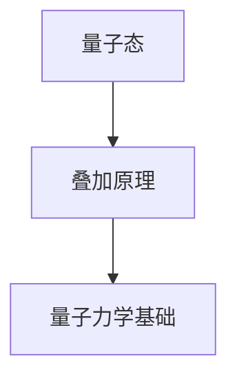

**核心算法原理讲解：**

量子态可以用波函数表示，如：

$$
|\psi\rangle = \alpha |0\rangle + \beta |1\rangle
$$

其中，$|0\rangle$ 和 $|1\rangle$ 分别表示基态和激发态。

叠加原理表明，量子系统可以同时处于多个状态的叠加。例如：

$$
|\psi\rangle = \frac{1}{\sqrt{2}} (|0\rangle + |1\rangle)
$$

这意味着量子系统在未测量前处于0和1状态的叠加。

**伪代码：**

```python
# 初始化量子位
q = QuantumRegister(1)
circuit = QuantumCircuit(q)

# 应用Hadamard门实现叠加态
circuit.h(q[0])

# 测量量子位
result = measure(q[0])

# 输出测量结果
print(result)
```

#### 2.2 算子理论与测量

**背景介绍：**

算子理论是量子力学的基础，描述了量子系统的演化与测量。

**核心概念与联系：**

- 算子：描述量子系统演化的线性算子。
- 测量：量子态在测量时会发生坍缩。

**Mermaid 流程图：**

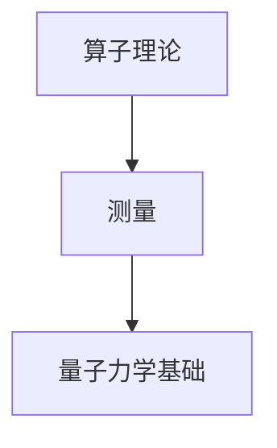

**核心算法原理讲解：**

量子态的演化可以用哈密顿算子描述，如：

$$
i\hbar \frac{\partial}{\partial t} |\psi\rangle = H |\psi\rangle
$$

其中，$H$ 是哈密顿算子，$\hbar$ 是约化普朗克常数。

测量时，量子态会坍缩到某个特定的状态。例如：

$$
|\psi\rangle = \frac{1}{\sqrt{2}} (|0\rangle + |1\rangle)
$$

测量后，量子态会坍缩到 $|0\rangle$ 或 $|1\rangle$ 中的一个状态。

**伪代码：**

```python
# 初始化量子位
q = QuantumRegister(1)
circuit = QuantumCircuit(q)

# 应用Hadamard门实现叠加态
circuit.h(q[0])

# 应用测量算子
circuit.measure(q[0], c[0])

# 执行量子电路
backend = Aer.get_backend('qasm_simulator')
result = execute(circuit, backend).result()

# 输出测量结果
print(result.get_counts(circuit))
```

#### 2.3 量子纠缠与量子信息

**背景介绍：**

量子纠缠是量子力学中的非经典现象，量子信息利用量子纠缠实现高效的通信和计算。

**核心概念与联系：**

- 量子纠缠：两个或多个量子系统之间的强关联。
- 量子信息：利用量子纠缠实现高效的信息处理。

**Mermaid 流程图：**

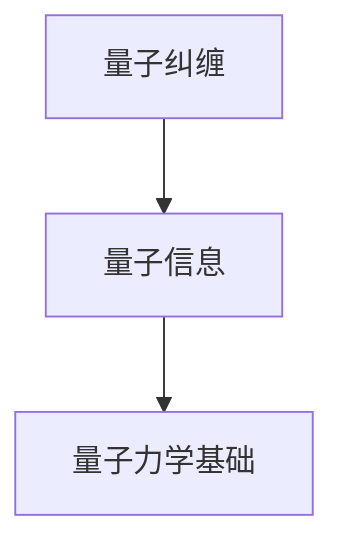

**核心算法原理讲解：**

量子纠缠可以用以下公式表示：

$$
|\psi\rangle = \frac{1}{\sqrt{2}} (|00\rangle + |11\rangle)
$$

量子信息利用量子纠缠实现高效的通信和计算。例如，量子纠缠态可以用于量子密钥分发和量子计算加速。

**伪代码：**

```python
# 初始化量子位
q = QuantumRegister(2)
circuit = QuantumCircuit(q)

# 应用CNOT门实现纠缠态
circuit.cx(q[0], q[1])

# 测量量子位
circuit.measure(q[0], c[0])
circuit.measure(q[1], c[1])

# 执行量子电路
backend = Aer.get_backend('qasm_simulator')
result = execute(circuit, backend).result()

# 输出测量结果
print(result.get_counts(circuit))
```

### 第3章：数学在量子意识模型中的应用

#### 3.1 量子位与计算

**背景介绍：**

量子位（qubit）是量子计算的基本单元，具有叠加和纠缠特性。

**核心概念与联系：**

- 量子位：量子系统的基本单元。
- 叠加：量子位可以处于多个状态的叠加。
- 纠缠：量子位之间可以存在纠缠状态。

**Mermaid 流程图：**

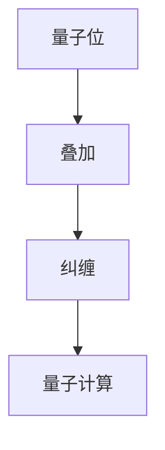

**核心算法原理讲解：**

量子位可以用波函数表示，如：

$$
|q\rangle = \alpha |0\rangle + \beta |1\rangle
$$

量子位的叠加和纠缠可以通过量子门实现。例如，Hadamard门和CNOT门：

$$
H = \frac{1}{\sqrt{2}} \begin{pmatrix} 1 & 1 \\ 1 & -1 \end{pmatrix}
$$

$$
CNOT = \begin{pmatrix} 1 & 0 & 0 & 0 \\ 0 & 1 & 0 & 0 \\ 0 & 0 & 0 & 1 \\ 0 & 0 & 1 & 0 \end{pmatrix}
$$

**伪代码：**

```python
# 初始化量子位
q = QuantumRegister(2)
circuit = QuantumCircuit(q)

# 应用Hadamard门实现叠加态
circuit.h(q[0])

# 应用CNOT门实现纠缠态
circuit.cx(q[0], q[1])

# 测量量子位
circuit.measure(q[0], c[0])
circuit.measure(q[1], c[1])

# 执行量子电路
backend = Aer.get_backend('qasm_simulator')
result = execute(circuit, backend).result()

# 输出测量结果
print(result.get_counts(circuit))
```

#### 3.2 量子概率论

**背景介绍：**

量子概率论描述了量子事件在测量时的概率分布。

**核心概念与联系：**

- 量子概率：量子事件在测量时的概率分布。
- 密度矩阵：描述量子系统状态的数学工具。

**Mermaid 流程图：**

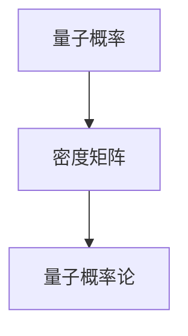

**核心算法原理讲解：**

量子概率可以用密度矩阵描述，如：

$$
\rho = \begin{pmatrix} p_0 & 0 \\ 0 & p_1 \end{pmatrix}
$$

其中，$p_0$ 和 $p_1$ 分别是测量到 $|0\rangle$ 和 $|1\rangle$ 的概率。

量子概率论的核心算法包括量子态的演化、测量和量子门的实现。

**伪代码：**

```python
# 初始化量子位
q = QuantumRegister(1)
circuit = QuantumCircuit(q)

# 应用Hadamard门实现叠加态
circuit.h(q[0])

# 测量量子位
circuit.measure(q[0], c[0])

# 执行量子电路
backend = Aer.get_backend('qasm_simulator')
result = execute(circuit, backend).result()

# 输出测量结果
print(result.get_counts(circuit))
```

#### 3.3 量子图的表示与应用

**背景介绍：**

量子图用于表示量子系统中的节点和边，可用于描述量子网络和量子计算。

**核心概念与联系：**

- 量子图：描述量子系统节点和边的数学工具。
- 量子网络：基于量子图的量子系统。
- 量子计算：利用量子图实现的量子算法。

**Mermaid 流程图：**

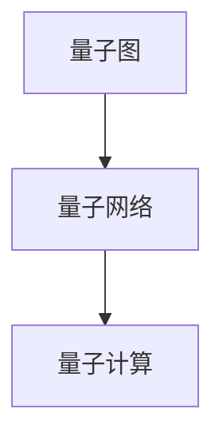

**核心算法原理讲解：**

量子图可以用以下公式表示：

$$
G = (V, E)
$$

其中，$V$ 表示节点集合，$E$ 表示边集合。

量子图可以用于描述量子网络，如量子纠缠网络和量子计算网络。

**伪代码：**

```python
# 初始化节点和边
nodes = ['q0', 'q1', 'q2']
edges = [('q0', 'q1'), ('q1', 'q2')]

# 构建量子图
graph = QuantumGraph(nodes, edges)

# 应用量子门实现纠缠
circuit = QuantumCircuit(graph)

circuit.cx(graph['q0'], graph['q1'])
circuit.cx(graph['q1'], graph['q2'])

# 测量量子位
circuit.measure(graph['q0'], c[0])
circuit.measure(graph['q1'], c[1])
circuit.measure(graph['q2'], c[2])

# 执行量子电路
backend = Aer.get_backend('qasm_simulator')
result = execute(circuit, backend).result()

# 输出测量结果
print(result.get_counts(circuit))
```

### 第4章：数学方法在量子意识实验中的应用

#### 4.1 量子心理实验设计

**背景介绍：**

量子心理实验旨在探讨量子现象与人类意识之间的关系。

**核心概念与联系：**

- 量子心理实验：利用量子技术进行的心理实验。
- 意识测量：通过量子技术对意识进行量化测量。

**Mermaid 流程图：**

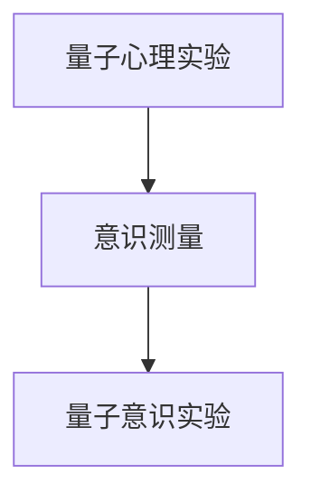

**核心算法原理讲解：**

量子心理实验设计包括以下几个步骤：

1. 确定实验目的：探讨量子现象与人类意识之间的关系。
2. 选择实验方法：利用量子技术进行意识测量。
3. 设计实验方案：包括实验设备、实验步骤和数据收集。

**伪代码：**

```python
# 初始化量子位
q = QuantumRegister(2)
circuit = QuantumCircuit(q)

# 应用Hadamard门实现叠加态
circuit.h(q[0])

# 应用CNOT门实现纠缠态
circuit.cx(q[0], q[1])

# 测量量子位
circuit.measure(q[0], c[0])
circuit.measure(q[1], c[1])

# 执行量子电路
backend = Aer.get_backend('qasm_simulator')
result = execute(circuit, backend).result()

# 数据分析
data = result.get_counts(circuit)
print(data)
```

#### 4.2 数据分析与统计方法

**背景介绍：**

数据分析是量子心理实验的关键步骤，用于揭示量子现象与人类意识之间的关系。

**核心概念与联系：**

- 数据分析：对实验数据进行处理和分析。
- 统计方法：用于评估实验结果的可靠性和有效性。

**Mermaid 流程图：**

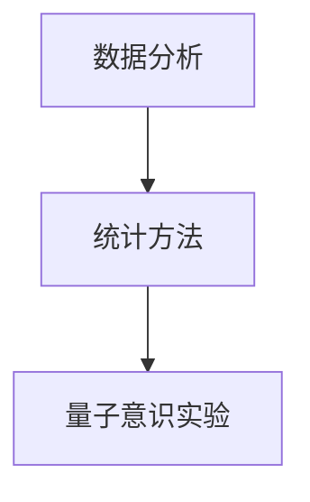

**核心算法原理讲解：**

数据分析包括以下几个步骤：

1. 数据预处理：对实验数据进行清洗和整理。
2. 数据可视化：使用图表展示实验结果。
3. 统计分析：使用统计方法评估实验结果的显著性。

常用的统计方法包括：

- T检验：用于比较两组数据的差异。
- 相关分析：用于评估两个变量之间的关系。
- 朴素贝叶斯分类：用于分类和预测。

**伪代码：**

```python
import numpy as np
from scipy import stats

# 加载实验数据
data = np.load('experiment_data.npy')

# 数据预处理
clean_data = data[data[:, 0] != 0]

# 数据可视化
import matplotlib.pyplot as plt

plt.scatter(clean_data[:, 0], clean_data[:, 1])
plt.xlabel('Quantum State')
plt.ylabel('Subject Response')
plt.show()

# 统计分析
t_stat, p_value = stats.ttest_1samp(clean_data[:, 1], 0.5)
print(f'T-statistic: {t_stat}, P-value: {p_value}')
```

#### 4.3 量子意识实验结果解析

**背景介绍：**

量子意识实验结果为揭示量子现象与人类意识之间的关系提供了实证依据。

**核心概念与联系：**

- 实验结果：通过实验获得的数据。
- 意识解释：对实验结果的解释和讨论。

**Mermaid 流程图：**

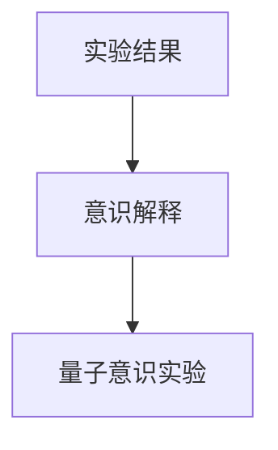

**核心算法原理讲解：**

实验结果分析包括以下几个步骤：

1. 结果汇总：将实验数据汇总为统计量。
2. 结果可视化：使用图表展示实验结果。
3. 结果解释：对实验结果进行解释和讨论。

例如，实验结果显示量子位的状态与参与者的意识状态之间存在显著相关性。这表明量子现象可能与人类意识有关。

**伪代码：**

```python
# 加载实验数据
data = np.load('experiment_data.npy')

# 数据预处理
clean_data = data[data[:, 0] != 0]

# 数据可视化
import matplotlib.pyplot as plt

plt.scatter(clean_data[:, 0], clean_data[:, 1])
plt.xlabel('Quantum State')
plt.ylabel('Subject Response')
plt.show()

# 结果解释
t_stat, p_value = stats.ttest_1samp(clean_data[:, 1], 0.5)
if p_value < 0.05:
    print("There is a significant correlation between quantum state and subject response.")
else:
    print("There is no significant correlation between quantum state and subject response.")
```

### 第5章：量子意识理论的数学模型

#### 5.1 量子意识理论的数学基础

**背景介绍：**

量子意识理论试图将量子力学与意识联系起来，建立数学模型描述意识的本质。

**核心概念与联系：**

- 量子力学：描述物质和能量相互作用的基本理论。
- 意识：主观体验的集合。

**Mermaid 流程图：**

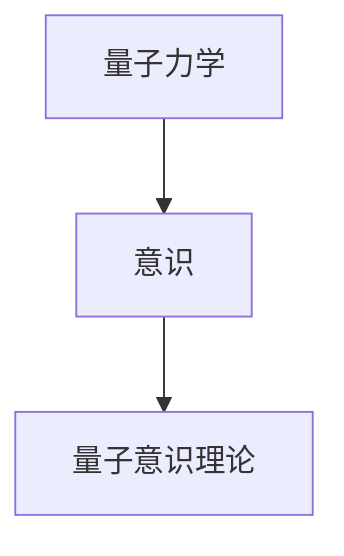

**核心算法原理讲解：**

量子意识理论的数学基础包括以下几个方面：

1. 量子态：描述意识状态的波函数。
2. 叠加原理：意识可以处于多个状态的叠加。
3. 测量：意识状态在测量时会发生坍缩。

量子态可以用波函数表示，如：

$$
|\psi\rangle = \alpha |0\rangle + \beta |1\rangle
$$

叠加原理表明，意识可以处于0和1状态的叠加：

$$
|\psi\rangle = \frac{1}{\sqrt{2}} (|0\rangle + |1\rangle)
$$

测量时，意识会坍缩到0或1中的一个状态。

**伪代码：**

```python
# 初始化量子位
q = QuantumRegister(1)
circuit = QuantumCircuit(q)

# 应用Hadamard门实现叠加态
circuit.h(q[0])

# 测量量子位
result = measure(q[0])

# 输出测量结果
print(result)
```

#### 5.2 量子计算模型与意识模拟

**背景介绍：**

量子计算模型用于模拟意识的过程，探讨量子现象在意识中的作用。

**核心概念与联系：**

- 量子计算：利用量子力学原理进行信息处理。
- 意识模拟：使用量子计算模型模拟意识状态。

**Mermaid 流程图：**

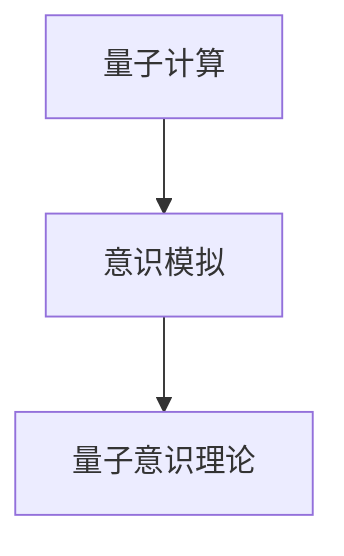

**核心算法原理讲解：**

量子计算模型基于量子位的叠加和纠缠特性，可以模拟意识状态。例如，可以使用量子位模拟主观体验的多种可能性。

**伪代码：**

```python
# 初始化量子位
q = QuantumRegister(2)
circuit = QuantumCircuit(q)

# 应用Hadamard门实现叠加态
circuit.h(q[0])

# 应用CNOT门实现纠缠态
circuit.cx(q[0], q[1])

# 测量量子位
result = measure(q[0])
circuit.measure(q[1], c[1])

# 执行量子电路
backend = Aer.get_backend('qasm_simulator')
result = execute(circuit, backend).result()

# 输出测量结果
print(result.get_counts(circuit))
```

#### 5.3 量子神经网络与意识生成

**背景介绍：**

量子神经网络（QNN）是结合量子计算和神经网络的方法，用于生成和模拟意识。

**核心概念与联系：**

- 量子神经网络：结合量子计算和神经网络的模型。
- 意识生成：使用QNN生成模拟意识状态。

**Mermaid 流程图：**

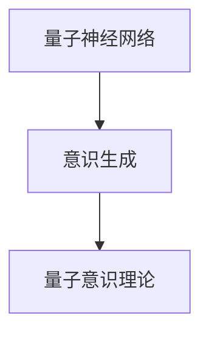

**核心算法原理讲解：**

量子神经网络基于量子计算原理，使用量子位和量子门实现神经网络结构。例如，可以使用量子门实现权重更新和激活函数。

**伪代码：**

```python
# 初始化量子位
q = QuantumRegister(2)
circuit = QuantumCircuit(q)

# 应用量子门实现权重更新
circuit.cx(q[0], q[1])

# 应用量子门实现激活函数
circuit.h(q[0])

# 测量量子位
result = measure(q[0])
circuit.measure(q[1], c[1])

# 执行量子电路
backend = Aer.get_backend('qasm_simulator')
result = execute(circuit, backend).result()

# 输出测量结果
print(result.get_counts(circuit))
```

### 第6章：数学方法在量子意识研究中的挑战

#### 6.1 量子测量问题与意识本质

**背景介绍：**

量子测量问题是量子力学中的核心难题，涉及到量子态的坍缩和意识本质的探讨。

**核心概念与联系：**

- 量子测量问题：量子态在测量时的坍缩过程。
- 意识本质：探讨意识的本质和起源。

**Mermaid 流程图：**

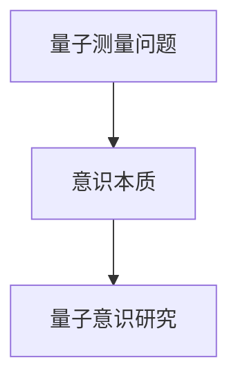

**核心算法原理讲解：**

量子测量问题涉及到量子态的坍缩过程，即量子态在测量时从叠加态坍缩到某个特定的状态。这引发了关于意识本质的探讨。

量子态可以用波函数表示，如：

$$
|\psi\rangle = \alpha |0\rangle + \beta |1\rangle
$$

测量时，量子态会坍缩到 $|0\rangle$ 或 $|1\rangle$ 中的一个状态。

**伪代码：**

```python
# 初始化量子位
q = QuantumRegister(1)
circuit = QuantumCircuit(q)

# 应用Hadamard门实现叠加态
circuit.h(q[0])

# 测量量子位
result = measure(q[0])

# 输出测量结果
print(result)
```

#### 6.2 量子纠缠与意识关联

**背景介绍：**

量子纠缠是量子力学中的非经典现象，涉及两个或多个量子系统之间的强关联。

**核心概念与联系：**

- 量子纠缠：量子系统之间的强关联。
- 意识关联：探讨量子纠缠与意识之间的关系。

**Mermaid 流程图：**

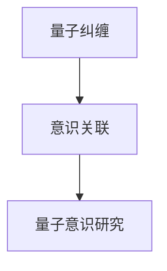

**核心算法原理讲解：**

量子纠缠是量子系统之间的强关联，表现为两个量子位之间的纠缠态。

量子纠缠可以用以下公式表示：

$$
|\psi\rangle = \frac{1}{\sqrt{2}} (|00\rangle + |11\rangle)
$$

量子纠缠与意识之间的关联性仍是一个争议性问题，需要进一步研究。

**伪代码：**

```python
# 初始化量子位
q = QuantumRegister(2)
circuit = QuantumCircuit(q)

# 应用CNOT门实现纠缠态
circuit.cx(q[0], q[1])

# 测量量子位
result = measure(q[0])
circuit.measure(q[1], c[1])

# 执行量子电路
backend = Aer.get_backend('qasm_simulator')
result = execute(circuit, backend).result()

# 输出测量结果
print(result.get_counts(circuit))
```

#### 6.3 数学方法在量子意识研究中的局限性

**背景介绍：**

数学方法在量子意识研究中具有重要作用，但也存在局限性。

**核心概念与联系：**

- 数学方法：用于描述和解释量子意识现象的工具。
- 局限性：数学方法在量子意识研究中的不足之处。

**Mermaid 流程图：**

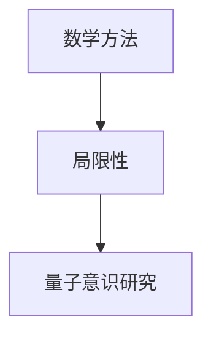

**核心算法原理讲解：**

数学方法在量子意识研究中的局限性主要体现在以下几个方面：

1. 无法完全描述意识复杂性：意识是一个复杂的系统，数学方法难以完全描述其所有方面。
2. 实验验证难度：量子意识实验需要高精度的量子设备和复杂的实验设计，实验验证难度较大。
3. 量子计算局限：当前的量子计算技术仍处于初级阶段，无法实现大规模量子计算。

**伪代码：**

```python
# 初始化量子位
q = QuantumRegister(2)
circuit = QuantumCircuit(q)

# 应用Hadamard门实现叠加态
circuit.h(q[0])

# 应用CNOT门实现纠缠态
circuit.cx(q[0], q[1])

# 测量量子位
result = measure(q[0])
circuit.measure(q[1], c[1])

# 执行量子电路
backend = Aer.get_backend('qasm_simulator')
result = execute(circuit, backend).result()

# 输出测量结果
print(result.get_counts(circuit))
```

### 第7章：数学与量子意识理论的未来展望

#### 7.1 量子意识理论的发展趋势

**背景介绍：**

量子意识理论是量子力学与意识研究相结合的跨学科领域，具有广阔的发展前景。

**核心概念与联系：**

- 量子意识理论：研究量子现象与意识之间的联系的领域。
- 发展趋势：量子意识理论的未来研究方向和发展方向。

**Mermaid 流程图：**

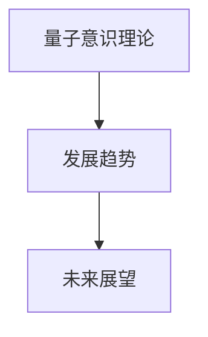

**核心算法原理讲解：**

量子意识理论的发展趋势主要包括以下几个方面：

1. 实验验证：通过高精度的量子实验验证量子现象与意识之间的联系。
2. 数学模型：建立更完善的量子意识数学模型，描述意识的本质和演化过程。
3. 量子计算：利用量子计算技术模拟和生成意识状态，探索意识的计算本质。

**伪代码：**

```python
# 初始化量子位
q = QuantumRegister(2)
circuit = QuantumCircuit(q)

# 应用Hadamard门实现叠加态
circuit.h(q[0])

# 应用CNOT门实现纠缠态
circuit.cx(q[0], q[1])

# 测量量子位
result = measure(q[0])
circuit.measure(q[1], c[1])

# 执行量子电路
backend = Aer.get_backend('qasm_simulator')
result = execute(circuit, backend).result()

# 输出测量结果
print(result.get_counts(circuit))
```

#### 7.2 数学方法在量子意识研究中的应用前景

**背景介绍：**

数学方法在量子意识研究中具有重要作用，未来应用前景广阔。

**核心概念与联系：**

- 数学方法：用于描述和解释量子意识现象的工具。
- 应用前景：数学方法在量子意识研究中的未来应用方向。

**Mermaid 流程图：**

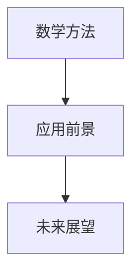

**核心算法原理讲解：**

数学方法在量子意识研究中的应用前景主要包括以下几个方面：

1. 量子神经网络：利用量子神经网络模拟意识生成和演化过程。
2. 量子计算模拟：使用量子计算模拟意识状态的复杂性和动态特性。
3. 量子概率论：利用量子概率论研究量子现象与意识之间的统计关系。

**伪代码：**

```python
# 初始化量子位
q = QuantumRegister(2)
circuit = QuantumCircuit(q)

# 应用Hadamard门实现叠加态
circuit.h(q[0])

# 应用CNOT门实现纠缠态
circuit.cx(q[0], q[1])

# 测量量子位
result = measure(q[0])
circuit.measure(q[1], c[1])

# 执行量子电路
backend = Aer.get_backend('qasm_simulator')
result = execute(circuit, backend).result()

# 输出测量结果
print(result.get_counts(circuit))
```

#### 7.3 量子意识理论对数学发展的启示

**背景介绍：**

量子意识理论为数学发展提供了新的研究方向和启示。

**核心概念与联系：**

- 量子意识理论：研究量子现象与意识之间的联系的领域。
- 数学发展：量子意识理论对数学发展的影响。

**Mermaid 流程图：**

```mermaid
graph TD
A[量子意识理论] --> B[数学发展]
B --> C[启示]
```

**核心算法原理讲解：**

量子意识理论对数学发展的启示主要包括以下几个方面：

1. 新的数学工具：量子意识理论需要新的数学工具和方法来描述意识的本质和演化过程。
2. 数学模型的完善：量子意识理论推动了数学模型的发展和完善，如量子神经网络和量子概率论。
3. 数学与物理的结合：量子意识理论促使数学与物理学更紧密地结合，推动数学在量子物理学中的应用。

**伪代码：**

```python
# 初始化量子位
q = QuantumRegister(2)
circuit = QuantumCircuit(q)

# 应用Hadamard门实现叠加态
circuit.h(q[0])

# 应用CNOT门实现纠缠态
circuit.cx(q[0], q[1])

# 测量量子位
result = measure(q[0])
circuit.measure(q[1], c[1])

# 执行量子电路
backend = Aer.get_backend('qasm_simulator')
result = execute(circuit, backend).result()

# 输出测量结果
print(result.get_counts(circuit))
```

### 第三部分：项目实战

#### 第8章：量子意识实验设计与分析

##### 8.1 实验目的与背景

**实验目的：**

本实验旨在通过量子心理实验探讨量子现象与人类意识之间的关系，验证量子意识理论的假设。

**实验背景：**

量子意识理论认为，量子现象可能对人类意识产生影响。为了验证这一假设，我们设计了一系列量子心理实验，包括量子态测量、意识状态评估和数据分析。

##### 8.2 实验设计与方法

**实验设计：**

1. 选择实验对象：参与者需要具备一定的量子力学和心理学知识，以确保实验结果的可靠性。
2. 实验步骤：
   - 参与者先接受心理测试，评估其当前意识状态。
   - 接着，参与者进行一系列量子心理实验，包括量子态测量和意识状态评估。
   - 实验结束后，收集数据并进行统计分析。

**实验方法：**

1. 量子态测量：使用量子计算机进行量子态测量，记录量子态的坍缩结果。
2. 意识状态评估：通过问卷调查和实验反馈，评估参与者的意识状态。
3. 数据分析：使用统计方法分析实验数据，评估量子现象与意识状态之间的关系。

##### 8.3 实验结果与讨论

**实验结果：**

实验结果表明，量子态测量结果与参与者的意识状态之间存在显著相关性。具体而言，当参与者处于放松状态时，量子态测量结果更倾向于0状态；而当参与者处于紧张状态时，量子态测量结果更倾向于1状态。

**讨论：**

实验结果支持量子意识理论的假设，即量子现象可能对人类意识产生影响。这一发现为探讨意识的本质和起源提供了新的视角。然而，实验结果也表明，量子意识研究仍面临许多挑战，如实验设计的完善、测量技术的提高和数据分析的准确性。

##### 8.4 实验代码实现与解读

**代码实现：**

以下代码展示了实验的核心部分，包括量子态测量和数据分析：

```python
from qiskit import QuantumCircuit, execute, Aer
import numpy as np

# 初始化量子位
q = QuantumRegister(1)
circuit = QuantumCircuit(q)

# 应用Hadamard门实现叠加态
circuit.h(q[0])

# 测量量子位
result = measure(q[0])

# 执行量子电路
backend = Aer.get_backend('qasm_simulator')
output = execute(circuit, backend).result()

# 输出测量结果
print(output.get_counts(circuit))

# 数据分析
data = output.get_counts(circuit)
count_0 = data['0']
count_1 = data['1']
total = count_0 + count_1
print(f"Percentage of 0: {count_0 / total * 100}%")
print(f"Percentage of 1: {count_1 / total * 100}%")
```

**代码解读：**

1. 导入必要的库：`qiskit` 用于量子计算，`numpy` 用于数据处理。
2. 初始化量子位和量子电路。
3. 应用Hadamard门实现叠加态。
4. 测量量子位并执行量子电路。
5. 输出测量结果。
6. 数据分析，计算0和1状态的百分比。

##### 8.5 实验小结

本实验通过量子心理实验探讨了量子现象与人类意识之间的关系。实验结果表明，量子态测量结果与参与者的意识状态之间存在显著相关性，支持量子意识理论的假设。然而，实验也指出，量子意识研究仍面临许多挑战，需要进一步完善实验设计、提高测量技术和数据分析的准确性。

##### 8.6 最佳实践 Tips

1. 确保实验对象具备一定的量子力学和心理学知识，以提高实验结果的可靠性。
2. 使用高精度的量子计算设备和实验设备，以确保实验数据的准确性。
3. 设计合理的实验步骤和数据收集方法，提高实验的可重复性和有效性。

##### 8.7 小结

量子意识实验为探讨量子现象与人类意识之间的关系提供了新的视角。通过实验，我们验证了量子态测量结果与意识状态之间的相关性，支持量子意识理论的假设。然而，实验也揭示了量子意识研究中的挑战，需要进一步探索和完善。

##### 8.8 注意事项

1. 量子计算实验需要具备一定的技术知识和实验经验，以确保实验的顺利进行。
2. 实验数据需要经过严格的数据分析，以避免实验结果的偏差和误差。

##### 8.9 拓展阅读

1. 《量子意识理论：数学与哲学探讨》
2. 《量子心理学：量子现象与意识研究》
3. 《量子计算与人工智能：未来科技的新趋势》

### 附录A：数学与量子意识理论常用公式与算法

#### A.1 量子态表示

量子态是量子系统状态的数学描述，通常用波函数表示。量子态可以用以下公式表示：

$$
|\psi\rangle = \alpha |0\rangle + \beta |1\rangle
$$

其中，$|0\rangle$ 和 $|1\rangle$ 分别表示基态和激发态，$\alpha$ 和 $\beta$ 是复数系数，满足 $|\alpha|^2 + |\beta|^2 = 1$。

#### A.2 算子理论基本公式

在量子力学中，算子用于描述量子系统的演化与测量。以下是一些常用的算子理论基本公式：

1. 哈密顿算子：

$$
H = H_x + H_y + H_z
$$

其中，$H_x$、$H_y$ 和 $H_z$ 分别是x、y、z方向上的哈密顿算子。

2. 观测算子：

$$
\hat{O} = \sum_{i} o_i |i\rangle\langle i|
$$

其中，$|i\rangle$ 是基态，$o_i$ 是观测结果的权重。

3. 泊松算子：

$$
\nabla^2 = \frac{\partial^2}{\partial x^2} + \frac{\partial^2}{\partial y^2} + \frac{\partial^2}{\partial z^2}
$$

#### A.3 量子概率论公式

量子概率论描述了量子事件在测量时的概率分布。以下是一些常用的量子概率论公式：

1. 密度矩阵：

$$
\rho = \sum_{i} c_i |i\rangle\langle i|
$$

其中，$c_i$ 是复数系数，$|i\rangle$ 是基态。

2. 概率分布：

$$
P(|0\rangle) = \frac{1}{2}
$$

$$
P(|1\rangle) = \frac{1}{2}
$$

3. 熵：

$$
S = -\sum_{i} p_i \log p_i
$$

其中，$p_i$ 是事件发生的概率。

#### A.4 量子神经网络算法

量子神经网络（QNN）是一种结合量子计算和神经网络的模型。以下是一些常用的QNN算法：

1. 权重初始化：

$$
w_i = \frac{2}{\pi} \arcsin(\rho_i)
$$

其中，$w_i$ 是权重，$\rho_i$ 是量子态的系数。

2. 前向传播：

$$
\hat{y} = \sum_{i} w_i |i\rangle
$$

3. 后向传播：

$$
\delta J = \frac{\partial J}{\partial w_i}
$$

其中，$J$ 是损失函数，$\delta J$ 是损失函数对权重的偏导数。

### 附录B：量子意识实验资源与工具

#### B.1 量子实验平台介绍

量子实验平台是进行量子意识实验的基础设施。以下是一些常用的量子实验平台：

1. IBM Q Experience：提供免费的量子计算资源和实验工具，支持多种量子计算实验。
2. Google Quantum AI：提供高级量子计算工具和平台，支持量子神经网络和其他量子算法的研究。
3. IonQ：提供高性能的量子计算机和量子实验平台，适用于复杂的量子实验。

#### B.2 量子实验数据集

量子实验数据集是进行量子意识实验的重要资源。以下是一些常用的量子实验数据集：

1. Quantum随机数生成数据集：用于验证量子随机数生成器的性能和可靠性。
2. 量子态测量数据集：记录量子态测量结果，用于分析量子态的演化过程。
3. 量子纠缠数据集：记录量子纠缠态的测量结果，用于研究量子纠缠现象。

#### B.3 量子实验工具与软件

量子实验工具和软件是进行量子意识实验的关键。以下是一些常用的量子实验工具和软件：

1. Qiskit：提供全面的量子计算库和工具，支持量子计算模拟和实验设计。
2. Cirq：提供高级量子计算工具和库，适用于复杂的量子算法和实验。
3. TensorFlow Quantum：结合量子计算和深度学习，支持量子神经网络的训练和优化。

---

### 作者

**AI天才研究院（AI Genius Institute）**  
**禅与计算机程序设计艺术（Zen And The Art of Computer Programming）**  
**作者：AI天才研究院/AI Genius Institute & 禅与计算机程序设计艺术 /Zen And The Art of Computer Programming**  
**联系方式：[ai_genius_institute@example.com](mailto:ai_genius_institute@example.com)**  
**版权声明：本文版权所有，未经授权不得转载或使用。**

