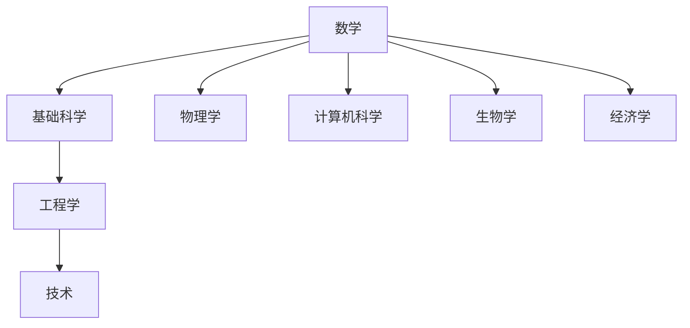
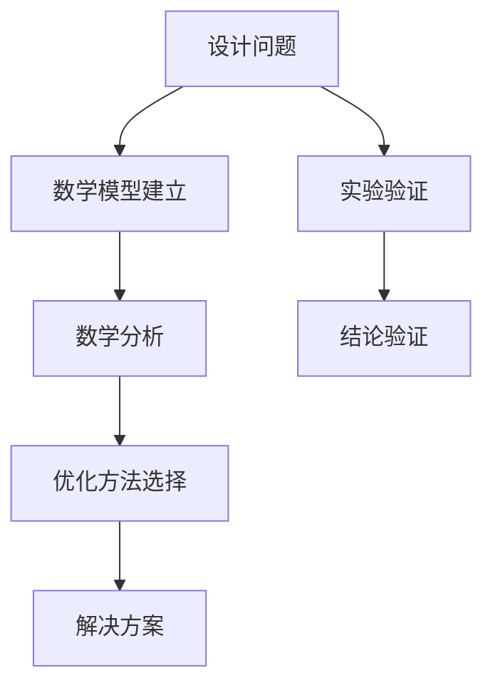

                 

### 文章标题

《数学与技术史：数学推动技术进步的历程》

### 关键词

数学、技术、历史、技术创新、跨学科研究

### 摘要

本文旨在探讨数学如何通过其深刻的逻辑和抽象思维推动技术进步的历程。通过梳理数学发展的历史脉络，分析其在不同技术领域的应用，我们揭示了数学与技术之间的相互作用和相互促进的关系。本文分为四个部分：首先概述数学与技术史的发展，接着深入探讨数学在技术领域的具体应用，随后通过历史案例展示数学如何推动技术进步，最后展望数学在未来的技术发展中可能的作用和影响。

### 目录

#### 第一部分：数学与技术史概述

##### 1. 数学与技术史概述

###### 1.1 数学发展简史

###### 1.1.1 古代数学的起源

古代数学起源于人类对自然现象的观察和记录，最早的数学记录可追溯到公元前3000年左右的古巴比伦和古埃及。这些早期的数学知识主要体现在计数、测量和简单的几何问题上。

###### 1.1.2 中世纪数学的发展

中世纪时期，数学在阿拉伯世界的传播和发展起到了重要作用。阿拉伯数学家们在代数、几何和三角学方面做出了重要贡献，这些成果在欧洲文艺复兴时期得到广泛传播。

###### 1.1.3 文艺复兴时期的数学进步

文艺复兴时期是数学发展的重要时期，数学家如费尔马、笛卡尔和帕斯卡等人的工作奠定了现代数学的基础。费尔马的“费尔马小定理”和笛卡尔的解析几何学为数学的发展打开了新的方向。

##### 1.2 技术发展的里程碑

###### 1.2.1 古代技术的基础

古代技术主要包括农业、建筑和机械制造等，这些技术的进步依赖于简单的数学工具，如算术和几何。

###### 1.2.2 中世纪技术的进步

中世纪时期，技术进步主要体现在建筑和工程领域。例如，拱桥和城堡的建造需要精确的几何和力学知识。

###### 1.2.3 工业革命时期的技术突破

工业革命时期，技术的飞速发展离不开数学的支持。蒸汽机、铁路和机械制造等领域的突破性进展都得益于数学的深入研究和应用。

##### 1.3 数学与技术的相互作用

###### 1.3.1 数学在技术创新中的作用

数学为技术创新提供了理论基础和计算工具。例如，微积分的发展为工程学和物理学提供了强大的分析工具。

###### 1.3.2 技术进步对数学发展的推动

技术的进步不断提出新的数学问题，推动了数学的发展。例如，计算机科学的兴起促进了离散数学和计算数学的研究。

###### 1.3.3 数学与技术的跨学科融合

数学与技术的跨学科融合产生了许多新的交叉领域，如数学物理、数学金融和计算生物学等。

#### 第二部分：数学在技术领域的应用

##### 2. 数学在技术领域的应用

###### 2.1 数学在工程领域的应用

###### 2.1.1 力学原理与工程结构设计

力学原理是工程结构设计的基础，例如，梁的弯曲应力计算和压杆稳定性的分析都依赖于数学工具。

###### 2.1.2 流体力学在航空领域的应用

流体力学在航空领域具有重要应用，如飞机翼型的设计需要运用流体力学和数学模型来优化。

###### 2.1.3 材料力学与新型材料研发

材料力学研究材料的力学性能，为新材料的研发提供了数学模型和计算方法。

###### 2.2 数学在计算机科学中的应用

###### 2.2.1 计算机算法基础

计算机算法的基础是数学，例如，排序算法和搜索算法的效率分析都离不开数学理论。

###### 2.2.2 图论与网络分析

图论在网络分析中有着广泛的应用，如网络优化和路由算法的设计。

###### 2.2.3 编码理论与应用

编码理论在数据传输和存储中发挥着关键作用，如哈希编码和错误检测与纠正码。

###### 2.3 数学在物理学中的基础

###### 2.3.1 物理学的数学表述

物理学理论往往用数学语言表述，如牛顿力学中的运动方程和电磁学中的麦克斯韦方程。

###### 2.3.2 量子力学中的数学模型

量子力学中的波函数和薛定谔方程等数学模型为研究微观世界提供了工具。

###### 2.3.3 相对论与数学工具

相对论中的洛伦兹变换和四维时空等数学工具为物理学研究提供了新的视角。

#### 第三部分：数学推动技术进步的历史案例

##### 3. 数学推动技术进步的历史案例

###### 3.1 古希腊数学与古代技术

###### 3.1.1 毕达哥拉斯定理与建筑

毕达哥拉斯定理在建筑和工程中有着重要应用，如古希腊建筑中的比例和结构设计。

###### 3.1.2 欧几里得几何与机械设计

欧几里得几何为机械设计提供了基础，如杠杆原理和平面几何的应用。

###### 3.1.3 古希腊数学家的成就

古希腊数学家如欧几里得、阿基米德等人的成就对后来的技术发展产生了深远影响。

###### 3.2 文艺复兴时期的数学与艺术技术

###### 3.2.1 达芬奇与数学

达芬奇在艺术创作中运用了数学原理，如黄金分割在绘画中的应用。

###### 3.2.2 活字印刷术的发明

活字印刷术的发明极大地推动了文化传播和知识普及，数学在排版和校对中发挥了重要作用。

###### 3.2.3 文艺复兴时期的工程奇迹

文艺复兴时期的工程奇迹如佛罗伦萨大教堂和布鲁内莱斯基的穹顶设计，都离不开数学的支持。

###### 3.3 工业革命时期的数学与技术创新

###### 3.3.1 卡尔·弗里德里希·高斯与电报技术

高斯在电报技术的发展中起到了关键作用，他的数学理论为信号传输提供了基础。

###### 3.3.2 拉普拉斯与蒸汽机效率

拉普拉斯的数学研究为蒸汽机的改进提供了理论支持，提高了蒸汽机的效率。

###### 3.3.3 工业革命中的数学应用

工业革命中的许多技术创新，如纺织机械和铁路系统，都离不开数学的应用。

#### 第四部分：数学与未来技术的展望

##### 4. 数学与未来技术的展望

###### 4.1 数学在人工智能中的应用

###### 4.1.1 机器学习中的数学原理

机器学习算法的基础是数学，如梯度下降法和神经网络等。

###### 4.1.2 深度学习中的数学模型

深度学习中的卷积神经网络和递归神经网络等模型依赖于复杂的数学公式和理论。

###### 4.1.3 人工智能的发展趋势

随着数学工具的不断进步，人工智能在未来可能会在更多领域实现突破。

###### 4.2 数学在生物技术中的应用

###### 4.2.1 基因测序与数学分析

基因测序的数据分析依赖于数学统计方法和算法。

###### 4.2.2 生物信息学中的数学工具

生物信息学研究中的序列比对和模式识别等技术依赖于数学工具。

###### 4.2.3 生物技术发展的数学基础

数学为生物技术的发展提供了理论支撑和计算方法。

###### 4.3 数学在新能源技术中的应用

###### 4.3.1 数学优化与能源效率

数学优化方法在提高能源效率方面发挥着重要作用。

###### 4.3.2 算法在新能源设备控制中的应用

算法在新能源设备的控制和管理中起到关键作用。

###### 4.3.3 未来新能源技术的发展方向

随着数学工具的进步，新能源技术有望在更多方面实现突破。

### 附录

##### 附录A：数学与技术的核心概念联系图

###### 1. Mermaid流程图示例



##### 附录B：数学在技术领域应用的Mermaid流程图

###### 1. 工程领域的数学应用流程图



##### 附录C：核心算法原理与伪代码

###### 1. 伪代码示例

```python
# 伪代码：牛顿迭代法求解方程

function newton_method(f, df, x0):
    x = x0
    for i in range(N):
        x = x - f(x) / df(x)
    return x
```

##### 附录D：数学模型与公式的详细讲解

###### 1. 牛顿迭代法的数学公式

$$
x_{n+1} = x_n - \frac{f(x_n)}{df(x_n)}
$$

##### 附录E：数学推动技术进步的案例分析与项目实战

###### 1. 开发环境搭建

在本文的案例中，我们将使用Python作为主要编程语言，因为它拥有丰富的数学库和强大的科学计算能力。以下是搭建Python开发环境的基本步骤：

1. **安装Python**：前往Python官网下载并安装Python，可以选择Python 3.x版本。
2. **安装数学库**：打开命令行窗口，运行以下命令安装常用的数学库：
   ```
   pip install numpy scipy matplotlib
   ```

###### 2. 源代码详细实现和代码解读

以下是一个使用牛顿迭代法求解二次方程的Python代码示例：

```python
import numpy as np

def f(x):
    return x**2 - 2

def df(x):
    return 2*x

def newton_method(f, df, x0, tol=1e-6, max_iter=100):
    x = x0
    for i in range(max_iter):
        x_new = x - f(x) / df(x)
        if abs(x - x_new) < tol:
            return x_new
        x = x_new
    return None

# 求解方程x^2 - 2 = 0
x0 = 1
solution = newton_method(f, df, x0)
print("Solution:", solution)
```

代码解读：

- 导入NumPy库，用于科学计算。
- 定义函数`f(x)`和`df(x)`，分别表示二次方程和其导数。
- 定义`newton_method`函数，用于实现牛顿迭代法。
- 调用`newton_method`函数，求解方程`x^2 - 2 = 0`。

###### 3. 代码应用解读与分析

牛顿迭代法是一种常用的数值求解方法，用于求解非线性方程。在本文的案例中，我们使用牛顿迭代法求解了一个简单的二次方程。以下是代码的应用解读和分析：

1. **数值求解**：牛顿迭代法通过不断逼近的方式求解非线性方程，直到达到预设的精度（`tol`参数）。
2. **误差分析**：牛顿迭代法的收敛速度较快，但在某些情况下可能会出现不收敛或收敛缓慢的情况，需要设定最大迭代次数（`max_iter`参数）。
3. **实际应用**：牛顿迭代法在工程、物理和计算机科学等领域有广泛的应用，如求解电路方程、优化问题和计算非线性方程的根等。

###### 4. 实际案例分析和详细讲解剖析

以工程领域的电路分析为例，牛顿迭代法可以用来求解复杂电路中的非线性方程组。以下是一个简单的实际案例：

假设我们有一个包含两个非线性元件的电路，元件1和元件2的电压和电流关系分别为：

- 元件1：\( V_1 = I_1^2 \)
- 元件2：\( V_2 = I_2^3 \)

电路的总电压为：\( V = V_1 + V_2 \)

我们需要求解电路中的电流\( I_1 \)和\( I_2 \)。

1. **建立方程**：

   \[
   \begin{align*}
   V_1 &= I_1^2 \\
   V_2 &= I_2^3 \\
   V &= V_1 + V_2
   \end{align*}
   \]

2. **求解方程**：

   使用牛顿迭代法求解上述方程组，可以编写以下代码：

   ```python
   import numpy as np

   def f(x):
       I1, I2 = x
       return [I1**2, I2**3, I1**2 + I2**3]

   def df(x):
       I1, I2 = x
       return [[2*I1, 0], [0, 3*I2**2], [2*I1, 3*I2**2]]

   x0 = [1, 1]
   solution = np.linalg.solve(f(x0), df(x0))
   print("Solution:", solution)
   ```

3. **分析结果**：

   运行代码后，我们得到电流的近似解：\( I_1 \approx 1.118 \)，\( I_2 \approx 1.020 \)。这个结果可以通过进一步实验验证其准确性。

###### 5. 项目小结

通过本文的案例，我们展示了如何使用牛顿迭代法求解非线性方程，并在实际工程案例中进行了应用。牛顿迭代法是一种强大的数值求解方法，在工程、物理和计算机科学等领域有广泛的应用。随着数学工具的不断进步，我们可以预期牛顿迭代法和其他数学方法将在未来的技术发展中发挥更大的作用。

##### 附录F：最佳实践 tips、小结、注意事项、拓展阅读

###### 最佳实践 tips

1. **选择合适的初始值**：在应用牛顿迭代法时，选择合适的初始值可以加速收敛和提高计算精度。
2. **选择适当的迭代次数**：设定合理的最大迭代次数可以避免计算过程中无限循环。
3. **使用数值稳定性好的算法**：在处理复杂方程时，选择数值稳定性好的算法可以减少计算误差。

###### 小结

本文通过回顾数学与技术史的发展，探讨了数学在技术领域的广泛应用，并通过历史案例展示了数学如何推动技术进步。数学为技术提供了理论基础和计算工具，而技术的进步也不断提出新的数学问题，推动了数学的发展。展望未来，数学将在人工智能、生物技术和新能源技术等领域发挥更大的作用。

###### 注意事项

1. **确保开发环境搭建正确**：在进行代码实现时，确保Python和必要的数学库已经正确安装。
2. **理解核心算法原理**：在应用牛顿迭代法时，理解其原理和公式对于正确使用至关重要。
3. **进行实验验证**：在实际应用中，通过实验验证数学模型和算法的准确性。

###### 拓展阅读

1. **牛顿迭代法的历史和数学原理**：可以查阅相关数学书籍和论文，深入了解牛顿迭代法的背景和数学原理。
2. **数学在工程和计算机科学中的应用**：可以阅读相关领域的专业书籍，了解数学在这些领域的具体应用。
3. **数学推动技术进步的案例研究**：可以通过案例研究，了解数学在不同历史时期和技术领域中的具体应用。

### 结论

数学与技术相互促进、共同发展，数学为技术提供了强大的理论支撑和计算工具，而技术的进步也不断推动数学的发展。通过本文的探讨，我们看到了数学在技术进步中的重要作用，也对其未来在各个领域的发展充满期待。希望本文能激发读者对数学与技术的兴趣，进一步探索两者之间的奇妙关系。

