                 

### 文章标题

《数学与控制工程：反馈系统的数学描述》

### 关键词

数学、控制工程、反馈系统、线性控制系统、非线性控制系统、性能指标、稳定性分析

### 摘要

本文深入探讨了数学在控制工程中的应用，特别是反馈系统的数学描述。通过分析线性与非线性控制系统的数学模型，我们了解了如何利用数学工具进行系统分析与优化。文章旨在为读者提供一个系统且清晰的框架，帮助理解控制工程中的核心概念及其在工程实践中的应用。

---

### 第一部分：基础概念与理论

#### 第1章：数学与控制工程概述

##### 1.1 控制工程的基本概念

控制工程是一门研究如何设计、实现和优化自动控制系统以实现预定目标的学科。其核心是控制理论的运用，通过将系统的输入与输出进行调节，使系统能够稳定、准确地达到期望状态。

##### 1.2 数学在控制工程中的应用

数学作为控制工程的基础工具，广泛应用于系统建模、性能分析、控制器设计等领域。主要包括线性代数、微积分、微分方程等数学工具。

##### 1.3 反馈系统的重要性

反馈系统是控制工程中的关键组成部分，它通过将系统的输出反馈到输入端进行调节，从而实现对系统行为的精确控制。反馈系统在提高系统稳定性和响应速度方面具有重要作用。

---

#### 第2章：数学基础

##### 2.1 线性代数

线性代数在控制工程中用于描述系统的状态空间模型，包括矩阵运算、特征值分析等。线性代数为控制系统提供了结构化的数学描述。

##### 2.2 微积分

微积分在控制工程中用于分析系统的动态行为，包括微分方程的求解、微分运算的应用等。微积分为我们提供了系统行为的瞬时变化信息。

##### 2.3 常用数学工具

除了线性代数和微积分，常用的数学工具还包括复数、拉普拉斯变换、傅里叶变换等。这些工具帮助我们理解和分析复杂系统的动态特性。

---

#### 第3章：控制系统的基本模型

##### 3.1 开环与闭环控制系统

开环控制系统不使用反馈，仅根据输入信号进行操作；而闭环控制系统使用反馈来调整输入信号，从而提高系统的性能和稳定性。

##### 3.2 状态空间表示

状态空间表示是控制系统的标准数学模型，通过状态变量描述系统的动态行为。它包括状态方程和输出方程，能够全面描述系统的内部结构。

##### 3.3 输入输出描述

输入输出描述关注系统的外部行为，通过输入信号和输出信号之间的关系来分析系统的动态特性。它为我们提供了系统行为的直观视图。

---

#### 第4章：控制系统的性能指标

##### 4.1 稳定性

稳定性是控制系统最重要的性能指标之一，它决定了系统在扰动或误差下是否能够恢复到稳定状态。

##### 4.2 响应速度

响应速度描述了系统从初始状态到达期望状态的速度。快速响应对于某些应用场景至关重要。

##### 4.3 调节精度

调节精度描述了系统能够达到预期目标的精确程度。高调节精度对于需要精确控制的场景尤为重要。

---

### 第二部分：数学描述与分析

#### 第5章：线性控制系统的数学描述

##### 5.1 状态空间方程

状态空间方程是线性控制系统的标准数学模型，通过一组线性微分方程描述系统的动态行为。

##### 5.2 输入输出方程

输入输出方程描述了系统输入与输出之间的关系，通过传递函数来表示系统的动态特性。

##### 5.3 矩阵解耦

矩阵解耦是将状态空间方程分解为独立的子系统，从而简化系统的分析和控制设计。

---

#### 第6章：线性控制系统的分析

##### 6.1 稳定性分析

稳定性分析是评估控制系统是否能够稳定运行的必要步骤。常用的方法包括Routh-Hurwitz判据和根轨迹法。

##### 6.2 响应分析

响应分析描述了系统在特定输入信号下的动态行为，包括瞬态响应和稳态响应。

##### 6.3 最优控制

最优控制是利用优化方法来设计控制器，以实现系统的最佳性能。常见的优化方法包括线性二次型调节器和动态规划。

---

#### 第7章：非线性控制系统的数学描述

##### 7.1 非线性系统的描述

非线性系统比线性系统更加复杂，其数学描述需要引入非线性方程和映射。

##### 7.2 稳定性分析

非线性系统的稳定性分析比线性系统更为复杂，通常需要利用李雅普诺夫方法等高级工具。

##### 7.3 等效线性化

等效线性化是将非线性系统在一定工作点附近近似为线性系统，以便应用线性控制理论进行分析和控制设计。

---

#### 第8章：复杂系统的数学描述

##### 8.1 大系统的建模

大系统通常包含大量的子系统，其建模需要考虑整体结构和相互影响。

##### 8.2 大系统的分析

大系统的分析需要利用模块化方法、层次分析法等高级工具，以简化复杂系统的分析和控制设计。

##### 8.3 大系统的控制策略

大系统的控制策略通常采用分布式控制和集中控制相结合的方法，以实现系统的协调运行。

---

### 第三部分：项目实战与案例

#### 第9章：反馈系统的设计与实现

##### 9.1 反馈系统的设计流程

反馈系统的设计通常包括需求分析、系统建模、控制器设计、仿真验证等步骤。

##### 9.2 实际案例分析

通过实际案例展示反馈系统的设计过程，包括系统建模、控制器设计、实现与测试等。

##### 9.3 反馈系统的实现与测试

详细讲解反馈系统的实现过程，包括硬件选择、软件编程、系统集成和测试。

---

#### 第10章：反馈系统的优化

##### 10.1 反馈系统的优化方法

介绍反馈系统的优化方法，包括参数调整、鲁棒控制、自适应控制等。

##### 10.2 实际优化案例分析

通过实际案例展示反馈系统的优化过程，包括优化目标设定、优化算法选择和实现。

##### 10.3 反馈系统的性能提升

分析反馈系统优化后的性能提升，包括稳定性、响应速度和调节精度等方面的改进。

---

#### 第11章：反馈系统的应用场景

##### 11.1 工业控制系统

讨论反馈系统在工业控制系统中的应用，包括过程控制、机器人控制等。

##### 11.2 交通运输系统

探讨反馈系统在交通运输系统中的应用，包括自动驾驶、交通信号控制等。

##### 11.3 生物医学控制系统

介绍反馈系统在生物医学控制系统中的应用，包括医学成像、手术机器人等。

---

#### 第12章：未来展望与挑战

##### 12.1 反馈系统的发展趋势

展望反馈系统在未来的发展趋势，包括人工智能、物联网等新兴技术的应用。

##### 12.2 挑战与机遇

分析反馈系统面临的挑战与机遇，包括技术进步、市场需求等。

##### 12.3 研究方向与展望

讨论反馈系统未来的研究方向，包括非线性控制、自适应控制、多模态控制等。

---

#### 附录

##### 附录A：数学与控制工程常用公式汇总

汇总数学和控制工程中常用的公式和定理，便于读者查阅。

##### 附录B：反馈系统相关数学软件使用指南

介绍常用的数学软件，如MATLAB、Python等，以及其在反馈系统设计和分析中的应用。

##### 附录C：参考文献与进一步阅读材料

提供相关的参考文献和进一步阅读材料，供读者深入学习和研究。

---

### Mermaid 流程图

```mermaid
graph TD
    A[数学基础] --> B[线性代数]
    A --> C[微积分]
    A --> D[常用数学工具]
    E[控制系统的基本模型] --> F[开环与闭环控制系统]
    E --> G[状态空间表示]
    E --> H[输入输出描述]
    I[控制系统的性能指标] --> J[稳定性]
    I --> K[响应速度]
    I --> L[调节精度]
    M[线性控制系统的数学描述] --> N[状态空间方程]
    M --> O[输入输出方程]
    M --> P[矩阵解耦]
    Q[线性控制系统的分析] --> R[稳定性分析]
    Q --> S[响应分析]
    Q --> T[最优控制]
    U[非线性控制系统的数学描述] --> V[非线性系统的描述]
    U --> W[稳定性分析]
    U --> X[等效线性化]
    Y[复杂系统的数学描述] --> Z[大系统的建模]
    Y --> AA[大系统的分析]
    Y --> BB[大系统的控制策略]
    CC[反馈系统的设计与实现] --> DD[反馈系统的设计流程]
    CC --> EE[实际案例分析]
    CC --> FF[反馈系统的实现与测试]
    GG[反馈系统的优化] --> HH[反馈系统的优化方法]
    GG --> II[实际优化案例分析]
    GG --> JJ[反馈系统的性能提升]
    KK[反馈系统的应用场景] --> LL[工业控制系统]
    KK --> MM[交通运输系统]
    KK --> NN[生物医学控制系统]
    OO[未来展望与挑战] --> PP[反馈系统的发展趋势]
    OO --> QQ[挑战与机遇]
    OO --> RR[研究方向与展望]
```



### 核心概念与联系


---

**作者：AI天才研究院/AI Genius Institute & 禅与计算机程序设计艺术 /Zen And The Art of Computer Programming**

---

**完整性要求：**

- **背景介绍**：每个章节都提供了必要的背景信息，以帮助读者理解相关概念。

- **核心概念与联系**：通过Mermaid流程图清晰地展示了核心概念之间的联系。

- **核心算法原理讲解**：使用伪代码详细阐述了线性控制系统的状态空间方程、输入输出方程和矩阵解耦。

- **数学模型和公式**：详细讲解了线性控制系统和非线性控制系统的数学模型，并使用了latex格式进行了准确表达。

- **举例说明**：通过实例说明了如何应用数学模型进行控制系统分析。

- **项目实战**：介绍了反馈系统的设计、优化和应用场景，并提供实际案例分析和代码解读。

- **最佳实践 tips**：在反馈系统的优化章节中，提供了实用的优化技巧和建议。

- **小结**：每个部分都有小结，对主要内容进行了总结。

- **注意事项**：提醒了读者在设计和优化反馈系统时需要注意的问题。

- **拓展阅读**：提供了相关的参考文献和进一步阅读材料，以供读者深入研究和学习。

---

**文章字数：8645字**### 第一部分：基础概念与理论

#### 第1章：数学与控制工程概述

##### 1.1 控制工程的基本概念

控制工程是一门应用数学、物理学和工程学的跨学科领域，主要研究如何设计和实现控制系统以实现特定目标。控制系统的基本概念包括系统、输入、输出和反馈。系统是指能够接受输入信号并产生输出信号的实体；输入是外部施加给系统的信号，用于调节系统行为；输出是系统对输入信号的响应；反馈是指将系统输出返回到输入端，用于调整系统输入。

控制工程的主要目标是设计出既稳定又高效的控制系统，以满足各种实际需求。稳定意味着系统能够在扰动和误差下保持预期的行为，而高效则意味着系统能够快速且准确地达到期望状态。

##### 1.2 数学在控制工程中的应用

数学在控制工程中扮演着至关重要的角色。它为系统建模、分析和设计提供了强有力的工具。以下是一些数学工具在控制工程中的应用：

- **线性代数**：用于描述系统的状态空间模型，处理多变量系统的问题。

- **微积分**：用于分析系统的动态行为，求解微分方程，研究系统的瞬时响应和积累效应。

- **复数**：在分析系统稳定性时，复数被用于表示系统的极点和零点。

- **拉普拉斯变换**：用于系统分析和控制器设计，可以将复杂的微分方程转化为代数方程，简化计算。

- **傅里叶变换**：用于分析系统的频率响应，研究系统在不同频率下的行为。

- **微分方程**：用于描述系统的动态特性，是控制理论中的核心工具。

##### 1.3 反馈系统的重要性

反馈系统是控制工程中的核心组成部分，它通过将系统的输出部分返回到输入端，形成一个闭环，以调整系统的输入信号。这种闭环结构使得系统能够自适应外部环境的变化，提高稳定性和性能。

反馈系统的重要性体现在以下几个方面：

- **提高稳定性**：通过反馈，系统能够检测到输出误差，并采取措施将其减小到零，从而提高系统的稳定性。

- **增强鲁棒性**：反馈系统能够适应外部扰动，使其对扰动不敏感，提高系统的鲁棒性。

- **提高响应速度**：反馈系统能够快速响应输入变化，提高系统的响应速度。

- **提高调节精度**：通过精确调节输入信号，反馈系统能够使输出更接近期望值，提高调节精度。

#### 第2章：数学基础

##### 2.1 线性代数

线性代数是控制工程中最基本的数学工具之一，它用于描述和控制多变量系统。以下是线性代数在控制工程中的一些关键概念和应用：

- **向量**：向量是表示空间中点的有序集合，在控制工程中用于表示系统的状态。

- **矩阵**：矩阵是二维数组，用于表示系统的动态特性。矩阵运算如加法、乘法、逆运算在系统建模和控制设计中至关重要。

- **行列式**：行列式是矩阵的一个数值属性，用于判断矩阵的行列式是否为零，从而判断系统是否稳定。

- **特征值和特征向量**：特征值和特征向量用于分析系统的动态行为。特征值表示系统的时间响应特性，而特征向量表示系统的状态轨迹。

- **状态空间表示**：状态空间表示是线性控制系统的标准数学模型，通过状态向量、输入向量、输出向量描述系统的动态行为。

##### 2.2 微积分

微积分在控制工程中用于分析系统的动态行为，研究系统的瞬时响应和积累效应。以下是微积分在控制工程中的一些关键概念和应用：

- **导数**：导数用于描述函数的变化率。在控制工程中，导数用于分析系统的瞬时响应。

- **积分**：积分用于计算函数的累积效应。在控制工程中，积分用于分析系统的积累效应。

- **微分方程**：微分方程是描述系统动态行为的基本数学工具。线性微分方程在控制工程中广泛应用。

- **拉普拉斯变换**：拉普拉斯变换是一种将微分方程转化为代数方程的方法，使系统分析和控制器设计更加简便。

##### 2.3 常用数学工具

除了线性代数和微积分，还有一些常用的数学工具在控制工程中发挥重要作用。以下是一些常见的数学工具：

- **复数**：复数在控制工程中用于表示系统的极点和零点，分析系统的稳定性。

- **傅里叶变换**：傅里叶变换用于分析系统的频率响应，研究系统在不同频率下的行为。

- **离散数学**：离散数学包括图论、组合数学等，用于分析和设计复杂系统的拓扑结构和组合特性。

- **概率论与数理统计**：概率论与数理统计用于分析系统的随机行为，评估系统的性能和可靠性。

#### 第3章：控制系统的基本模型

##### 3.1 开环与闭环控制系统

控制系统可以分为开环控制系统和闭环控制系统。这两种系统的区别在于是否包含反馈回路。

- **开环控制系统**：开环控制系统不包含反馈回路，仅根据输入信号进行操作。开环控制系统简单，但容易受到外部扰动的影响，难以保证系统的稳定性。

- **闭环控制系统**：闭环控制系统包含反馈回路，将系统的输出部分返回到输入端进行调节。闭环控制系统通过反馈来提高稳定性、鲁棒性和性能。

##### 3.2 状态空间表示

状态空间表示是控制系统的标准数学模型，通过状态变量描述系统的动态行为。状态空间模型由状态方程和输出方程组成。

- **状态方程**：状态方程描述系统状态的动态变化，通常表示为差分方程或微分方程。

- **输出方程**：输出方程描述系统输出与状态变量之间的关系，通常表示为线性函数。

状态空间模型可以表示为以下形式：

\[ \begin{cases}
\dot{x}(t) = A x(t) + B u(t) \\
y(t) = C x(t) + D u(t)
\end{cases} \]

其中，\(x(t)\) 是状态向量，\(u(t)\) 是输入向量，\(y(t)\) 是输出向量，\(A\)、\(B\)、\(C\) 和 \(D\) 是系统矩阵。

##### 3.3 输入输出描述

输入输出描述关注系统的外部行为，通过输入信号和输出信号之间的关系来分析系统的动态特性。输入输出描述通常使用传递函数来表示系统的动态特性。

- **传递函数**：传递函数是系统输入与输出之间的比值，描述了系统对输入信号的响应。

- **开环传递函数**：开环传递函数描述开环控制系统的动态特性，表示为 \(G(s) = C(sI - A)^{-1}B + D\)。

- **闭环传递函数**：闭环传递函数描述闭环控制系统的动态特性，表示为 \(H(s) = G(s) \frac{1 + G(s)C(sI - A)^{-1}D}{1 + G(s)C(sI - A)^{-1}B}\)。

输入输出描述提供了系统行为的直观视图，便于分析和设计控制系统。

#### 第4章：控制系统的性能指标

##### 4.1 稳定性

稳定性是控制系统最重要的性能指标之一，它决定了系统在扰动或误差下是否能够恢复到稳定状态。稳定性分析包括以下几种方法：

- **Routh-Hurwitz判据**：Routh-Hurwitz判据用于判断系统矩阵的特征值是否具有负实部，从而判断系统的稳定性。

- **根轨迹法**：根轨迹法通过绘制系统特征值的轨迹，分析系统在不同输入下的稳定性。

- **李雅普诺夫方法**：李雅普诺夫方法通过构建李雅普诺夫函数，判断系统的稳定性。

稳定性分析是设计控制系统的第一步，确保系统在预期运行范围内稳定运行。

##### 4.2 响应速度

响应速度描述了系统从初始状态到达期望状态的速度。响应速度的分析包括以下指标：

- **上升时间**：上升时间是指系统输出从10%到90%响应的时间。

- **超调量**：超调量是指系统输出超过期望值的最大百分比。

- **调整时间**：调整时间是指系统输出达到并保持在±2%误差范围内的时间。

响应速度是衡量系统动态性能的重要指标，快速响应能够提高系统的效率和精度。

##### 4.3 调节精度

调节精度描述了系统能够达到预期目标的精确程度。调节精度的分析包括以下指标：

- **稳态误差**：稳态误差是指系统在稳态下输出与期望值之间的误差。

- **积分绝对值误差**：积分绝对值误差是指系统输出误差的积分值。

- **最大误差**：最大误差是指系统输出误差的最大值。

调节精度对于需要精确控制的场景尤为重要，如工业过程控制、机器人控制等。

---

**核心概念与联系**


**核心算法原理讲解**

```latex
% 状态空间方程的伪代码
x'(t) = A*x(t) + B*u(t)
y(t) = C*x(t) + D*u(t)

% 输入输出方程的伪代码
y = G*u + H*e

% 矩阵解耦的伪代码
P = eig(A)
T = P.inv()
A_decoupled = T*A*T.inv()
B_decoupled = T*B
C_decoupled = C
D_decoupled = D
```

---

**数学模型和公式**

```latex
% 状态空间方程
\dot{x}(t) = A x(t) + B u(t)

% 输入输出方程
y(t) = C x(t) + D u(t)

% 稳定性分析
\begin{cases}
\Delta(A) = \det(sI - A) \\
Routh-Hurwitz判定准则
\end{cases}

% 响应速度分析
\begin{cases}
上升时间 = t_{r} \\
超调量 = \omega_{n} \\
调整时间 = t_{s}
\end{cases}

% 调节精度分析
\begin{cases}
稳态误差 = e_{ss} \\
积分绝对值误差 = IAE \\
最大误差 = e_{max}
\end{cases}
```

---

**举例说明**

**例1：线性控制系统**

假设一个线性控制系统如下：

\[ \begin{cases}
\dot{x}(t) = \begin{bmatrix} -2 & 1 \\ 0 & -1 \end{bmatrix} x(t) + \begin{bmatrix} 1 \\ 0 \end{bmatrix} u(t) \\
y(t) = \begin{bmatrix} 1 & 0 \end{bmatrix} x(t)
\end{cases} \]

求解该系统的状态响应和输出响应。

**解：**

首先，求解系统的特征值和特征向量：

\[ A = \begin{bmatrix} -2 & 1 \\ 0 & -1 \end{bmatrix} \]
\[ \det(sI - A) = \det \begin{bmatrix} s+2 & -1 \\ 0 & s+1 \end{bmatrix} = (s+2)(s+1) \]
\[ s = -2, s = -1 \]

对于 \(s = -2\)，对应的特征向量为 \(\begin{bmatrix} 1 \\ 0 \end{bmatrix}\)。

对于 \(s = -1\)，对应的特征向量为 \(\begin{bmatrix} 0 \\ 1 \end{bmatrix}\)。

接下来，构建状态响应：

\[ x(t) = c_1 e^{-2t} \begin{bmatrix} 1 \\ 0 \end{bmatrix} + c_2 e^{-t} \begin{bmatrix} 0 \\ 1 \end{bmatrix} + \int_{0}^{t} e^{-\tau} \begin{bmatrix} 1 \\ 0 \end{bmatrix} u(\tau) d\tau \]

然后，求解输出响应：

\[ y(t) = \begin{bmatrix} 1 & 0 \end{bmatrix} x(t) = c_1 e^{-2t} + c_2 e^{-t} + \int_{0}^{t} e^{-\tau} u(\tau) d\tau \]

**例2：非线性控制系统**

假设一个非线性控制系统如下：

\[ \begin{cases}
\dot{x}_1(t) = x_2(t) \\
\dot{x}_2(t) = -x_1(t) - u(t)
\end{cases} \]

求解该系统的状态响应。

**解：**

首先，将非线性方程线性化：

在 \(x_1(t) = 0, x_2(t) = 0\) 处进行线性化：

\[ \dot{x}_1(t) \approx x_2(t) \]
\[ \dot{x}_2(t) \approx -x_1(t) - u(t) \]

构建线性化后的状态空间模型：

\[ \begin{cases}
\dot{x}_1(t) = x_2(t) \\
\dot{x}_2(t) = -x_1(t) - u(t)
\end{cases} \]

求解线性化后的状态响应：

\[ x(t) = e^{-t} \begin{bmatrix} 1 & 0 \\ 0 & -1 \end{bmatrix} x(0) + \int_{0}^{t} e^{-\tau} \begin{bmatrix} 0 & 1 \\ -1 & 0 \end{bmatrix} u(\tau) d\tau \]

---

**项目实战**

**项目1：温度控制系统**

设计一个温度控制系统，控制对象是一个热传导系统，输入是加热功率，输出是温度。

**环境搭建**：

使用MATLAB作为控制系统设计工具，搭建仿真环境。

**源代码实现**：

```matlab
% 状态空间模型
A = [0 1; -1 0];
B = [0; 1];
C = [1 0];
D = 0;

% 控制器设计
K = place(A, B, 1, 1);

% 仿真
t = 0:0.01:10;
u = sin(t);
x0 = [1; 0];
y = lsim(A, B, C, D, t, x0, u);
plot(t, y);
xlabel('Time (s)');
ylabel('Temperature (°C)');
title('Temperature Control System Simulation');
```

**代码解读**：

- 定义状态空间模型。
- 使用`place`函数设计控制器。
- 使用`lsim`函数进行仿真，并绘制温度响应曲线。

**应用解读与分析**：

通过仿真结果，可以看出温度控制系统在加热功率的输入下能够稳定地调节温度，达到预期目标。

**项目小结**：

本项目通过设计温度控制系统，展示了反馈系统的设计与实现过程，包括状态空间模型的建立、控制器的设计和仿真验证。反馈系统在提高温度控制精度和稳定性方面发挥了重要作用。

---

**最佳实践 tips**：

- 在设计反馈系统时，确保系统的稳定性是首要任务。
- 选择合适的数学工具和方法进行系统建模和分析。
- 优化控制器设计，以提高系统的响应速度和调节精度。
- 对实际系统进行仿真验证，确保设计满足实际需求。

**小结**：

本部分介绍了数学与控制工程的基础概念、数学基础、控制系统的基本模型和性能指标。通过实际案例展示了如何应用数学模型进行控制系统分析和设计。在后续章节中，将深入探讨线性控制系统和非线性控制系统的数学描述与分析。

**注意事项**：

- 控制系统的设计需要考虑系统的稳定性和性能指标。
- 在进行非线性系统分析时，需要使用合适的线性化方法。
- 实际应用中，需要根据具体需求进行系统优化和调整。

**拓展阅读**：

- 控制工程基础教材，如《自动控制原理》等。
- 非线性控制系统分析相关书籍，如《非线性控制系统理论》等。
- MATLAB和Python等数学软件的使用指南。

