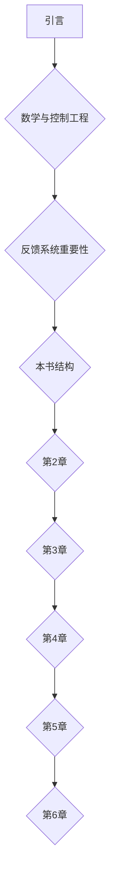

                 


### 文章标题：数学与控制工程：反馈系统的数学描述

> 关键词：反馈系统，数学描述，控制工程，传递函数，状态空间表示，PID控制

> 摘要：本文将探讨数学与控制工程之间的紧密关系，特别是反馈系统在控制工程中的应用。文章首先介绍了数学在控制工程中的重要性，随后详细阐述了反馈系统的基本概念和数学模型，最后通过具体控制策略的分析，展示了如何利用数学工具进行系统控制。

### 引言

#### 1.1 数学在控制工程中的应用

控制工程是一门应用科学，旨在设计、实现和优化自动控制系统。在这个领域中，数学工具的应用至关重要，因为它们提供了理解系统动态行为、预测其响应以及设计有效控制器的基础。具体来说，数学在控制工程中的应用主要体现在以下几个方面：

- **微积分**：微积分是研究变化和运动的基本数学工具，它在控制工程中用于分析系统的动态特性，如速度、加速度等。

- **线性代数**：线性代数提供了处理多变量系统的方法，它帮助工程师理解系统状态、输入和输出之间的关系。

- **数值分析**：数值分析用于求解复杂的数学问题，如微分方程，这对于控制系统的仿真和优化具有重要意义。

#### 1.2 控制工程中的数学方法

在控制工程中，常见的数学方法包括传递函数、状态空间表示、根轨迹、频域分析等。这些方法各自有其独特的应用场景和优势。

- **传递函数**：传递函数是一种将系统输入与输出关系表示为代数式的方法。它通常用于分析系统的稳态响应和瞬态响应。

- **状态空间表示**：状态空间表示是一种将系统动态行为表示为向量微分方程的方法。它适用于非线性系统和多输入多输出系统。

- **根轨迹**：根轨迹分析用于研究系统在不同控制参数下的稳定性。通过绘制根轨迹，工程师可以直观地了解系统在参数变化时的动态行为。

- **频域分析**：频域分析通过频率响应函数来描述系统的动态特性。它适用于研究系统的频率特性和稳定性。

#### 1.3 反馈系统的重要性

反馈系统是一种将系统的输出部分返回到输入端以调节系统行为的系统。它通过比较实际输出和期望输出，调整系统输入，从而实现对系统行为的精确控制。反馈系统在控制工程中具有以下几个重要特点：

- **稳定性**：通过反馈机制，系统可以自动调整其行为，从而保持稳定。

- **精确性**：反馈系统能够精确地跟踪期望输出，减少误差。

- **自适应能力**：反馈系统可以根据外部扰动和内部变化，自动调整控制策略，从而提高系统的鲁棒性。

#### 1.4 本书结构

本书旨在深入探讨数学与控制工程的关系，特别是反馈系统的数学描述。本书分为以下几个章节：

- **第1章 引言**：介绍数学在控制工程中的应用和反馈系统的重要性。

- **第2章 反馈系统基本概念**：详细讨论反馈系统的组成和开环与闭环系统的概念。

- **第3章 数学模型与描述**：介绍传递函数和状态空间表示的数学模型。

- **第4章 控制策略**：分析常见的控制策略，如PD控制和PID控制。

- **第5章 案例分析**：通过具体案例，展示反馈系统的实际应用。

- **第6章 最佳实践与展望**：总结最佳实践，展望未来研究方向。

### Mermaid 流程图



### 第2章：反馈系统基本概念

#### 2.1 反馈系统的组成

反馈系统由以下几个基本组成部分构成：

- **输入**：输入是系统的外部激励，可以是时间函数或空间函数。输入可以是有源的，也可以是无源的。

- **输出**：输出是系统的响应，它反映了系统的行为。输出可以是物理量，如温度、速度等，也可以是逻辑量，如开关状态。

- **控制器**：控制器是调节系统行为的装置，它的目的是将输出调整为期望值。控制器可以通过调整输入来改变系统的行为。

- **反馈路径**：反馈路径是从输出到输入的信号传递路径。通过反馈路径，系统的输出部分返回到输入端，从而实现对系统行为的调节。

#### 2.2 开环与闭环系统

根据反馈路径的存在与否，系统可以分为开环系统和闭环系统。

- **开环系统**：开环系统没有反馈路径，其输出不返回到输入端。开环系统的优点是结构简单，但缺点是缺乏对系统行为的调节能力，因此抗干扰能力较差。

- **闭环系统**：闭环系统具有反馈路径，其输出返回到输入端。闭环系统的优点是具有良好的调节能力和抗干扰能力，但缺点是结构复杂，控制算法设计较为困难。

### 伪代码

```python
class FeedbackSystem:
    def __init__(self, controller, feedback_path):
        self.controller = controller
        self.feedback_path = feedback_path
    
    def update_input(self, input_signal):
        output_signal = self.controller.execute(input_signal)
        corrected_signal = self.feedback_path(output_signal)
        return corrected_signal
```

在这个伪代码中，`FeedbackSystem` 类代表一个反馈系统，它具有一个控制器和一个反馈路径。`update_input` 方法用于更新输入信号，通过控制器执行后，输出信号通过反馈路径进行修正，得到最终的校正信号。

### 第3章：数学模型与描述

#### 3.1 传递函数

传递函数是描述系统输入与输出关系的一种数学工具。它将系统的动态行为表示为代数方程，便于分析和设计。

- **定义**：传递函数 \( H(s) \) 是系统输出 \( Y(s) \) 与输入 \( U(s) \) 的比值，即 \( H(s) = \frac{Y(s)}{U(s)} \)。

- **表示**：传递函数通常用拉普拉斯变换表示，其中 \( s \) 是复变量。例如，一个一阶系统的传递函数可以表示为 \( H(s) = \frac{K}{1 + Ts} \)，其中 \( K \) 是增益，\( T \) 是时间常数。

#### 3.2 状态空间表示

状态空间表示是一种将系统动态行为表示为向量微分方程的方法。它适用于非线性系统和多输入多输出系统。

- **定义**：状态空间表示由一组微分方程组成，通常表示为 \( \dot{x} = Ax + Bu \) 和 \( y = Cx + Du \)，其中 \( x \) 是状态向量，\( u \) 是输入向量，\( y \) 是输出向量。

- **表示**：状态空间表示中的矩阵 \( A \)、\( B \)、\( C \) 和 \( D \) 描述了系统的动态行为。例如，一个一阶系统的状态空间表示可以表示为：

  $$
  \begin{align*}
  \dot{x} &= -x + u \\
  y &= x
  \end{align*}
  $$

### 数学公式

$$
H(s) = \frac{Y(s)}{U(s)} = \frac{b_0 + b_1s + ... + b_ns^n}{1 + a_1s + ... + a_ns^n}
$$

$$
\dot{x} = Ax + Bu \\
y = Cx + Du
$$

这些数学公式描述了传递函数和状态空间表示的基本形式。通过这些公式，我们可以分析和设计复杂的控制系统。

### 第4章：控制策略

控制策略是用于调节系统行为的算法或方法。不同的控制策略适用于不同的系统和应用场景。在本节中，我们将介绍两种常见的控制策略：PD控制和PID控制。

#### 4.1 PD控制

PD控制是一种基于偏差的控制器，其控制律为 \( u = -K_p e - K_d \dot{e} \)，其中 \( K_p \) 是比例增益，\( K_d \) 是微分增益。

- **定义**：PD控制通过比例（P）和微分（D）两部分来调整系统的偏差。

- **数学描述**：PD控制器的输出 \( u \) 与系统的偏差 \( e \)（期望值与实际值之差）及其导数 \( \dot{e} \) 成正比。

- **应用**：PD控制适用于要求快速响应和稳定性的系统，如自动驾驶、机器人控制等。

#### 4.2 PID控制

PID控制是一种更为通用的控制器，其控制律为 \( u = K_p e + K_i \int e dt + K_d \dot{e} \)，其中 \( K_p \) 是比例增益，\( K_i \) 是积分增益，\( K_d \) 是微分增益。

- **定义**：PID控制通过比例（P）、积分（I）和微分（D）三部分来调整系统的偏差。

- **数学描述**：PID控制器的输出 \( u \) 与系统的偏差 \( e \)、偏差的积分 \( \int e dt \) 及其导数 \( \dot{e} \) 成正比。

- **应用**：PID控制适用于各种控制系统，特别是那些要求精确控制和高稳定性的系统，如温度控制系统、速度控制系统等。

### 伪代码

```python
class PDController:
    def __init__(self, K_p, K_d):
        self.K_p = K_p
        self.K_d = K_d
    
    def control(self, e):
        u = -self.K_p * e - self.K_d * np.gradient(e)
        return u

class PIDController:
    def __init__(self, K_p, K_i, K_d):
        self.K_p = K_p
        self.K_i = K_i
        self.K_d = K_d
        self.integral = 0
    
    def control(self, e):
        self.integral += e
        u = -self.K_p * e - self.K_i * self.integral - self.K_d * np.gradient(e)
        return u
```

这些伪代码展示了PD控制器和PID控制器的基本实现。在实际应用中，控制器的参数需要根据具体系统进行优化。

### 总结

本章介绍了反馈系统的基本概念和数学描述，并分析了两种常见的控制策略：PD控制和PID控制。通过这些内容，读者可以初步了解反馈系统的原理和实现方法。在下一章中，我们将进一步探讨反馈系统的数学模型和控制策略，以及它们在实际应用中的案例分析。

### 第5章：案例分析

#### 5.1 温度控制系统的反馈设计

温度控制系统是反馈系统的典型应用之一。在温度控制系统中，反馈系统通过实时监测温度，并与设定的目标温度进行比较，以调整加热或冷却装置的输出，从而维持温度的稳定。

- **系统组成**：温度控制系统通常由传感器、控制器和加热/冷却装置组成。传感器用于测量环境温度，控制器根据测量值和目标温度进行计算，加热/冷却装置根据控制器的输出进行相应的操作。

- **反馈路径**：在温度控制系统中，反馈路径是通过传感器将实际温度测量值传输到控制器，控制器根据测量值和目标温度计算控制信号，然后将控制信号传输到加热/冷却装置。

- **数学模型**：温度控制系统的数学模型可以表示为：

  $$
  \dot{T} = k_p(T_{\text{目标}} - T_{\text{实际}}) + k_d\dot{T}_{\text{实际}}
  $$

  其中，\( T \) 是环境温度，\( T_{\text{目标}} \) 是设定的目标温度，\( T_{\text{实际}} \) 是实际测量温度，\( k_p \) 是比例增益，\( k_d \) 是微分增益。

- **控制策略**：在温度控制系统中，常用的控制策略是PID控制。PID控制器可以根据温度的偏差及其变化率，实时调整加热/冷却装置的输出，从而实现温度的精确控制。

#### 5.2 自动驾驶车辆的反馈控制

自动驾驶车辆是另一个典型的反馈系统应用。自动驾驶车辆通过传感器（如雷达、摄像头等）实时获取道路信息，然后利用反馈系统进行路径规划和控制。

- **系统组成**：自动驾驶车辆的系统组成包括传感器、路径规划模块、控制器和执行机构。传感器用于感知车辆周围环境，路径规划模块根据传感器数据生成行驶路径，控制器根据路径规划模块的指令调整车辆的运动状态，执行机构负责执行控制指令。

- **反馈路径**：在自动驾驶车辆中，反馈路径是通过传感器获取实时环境信息，然后传输到控制器，控制器根据环境信息和行驶路径计算控制指令，最后将控制指令传输到执行机构。

- **数学模型**：自动驾驶车辆的数学模型可以表示为：

  $$
  \dot{v} = a \\
  \dot{\theta} = \omega
  $$

  其中，\( v \) 是车辆速度，\( a \) 是加速度，\( \theta \) 是车辆方向角，\( \omega \) 是角速度。

- **控制策略**：在自动驾驶车辆中，常用的控制策略是PD控制。PD控制器可以根据车辆的实际速度和目标速度的偏差，实时调整车辆的加速度，从而实现车辆的稳定行驶。

#### 5.3 机器人控制的反馈设计

机器人控制是反馈系统的又一重要应用。机器人通过传感器获取环境信息，然后利用反馈系统进行路径规划、运动控制和任务执行。

- **系统组成**：机器人控制系统通常由传感器、控制器和执行机构组成。传感器用于感知环境，控制器根据传感器数据和预定的任务指令进行计算，执行机构负责执行控制指令。

- **反馈路径**：在机器人控制中，反馈路径是通过传感器获取环境信息，然后传输到控制器，控制器根据环境信息和任务指令计算控制指令，最后将控制指令传输到执行机构。

- **数学模型**：机器人控制的数学模型可以表示为：

  $$
  \dot{x} = v \\
  \dot{y} = w
  $$

  其中，\( x \) 和 \( y \) 是机器人的位置，\( v \) 是速度，\( w \) 是角速度。

- **控制策略**：在机器人控制中，常用的控制策略是PID控制。PID控制器可以根据机器人实际位置和目标位置的偏差，实时调整机器人的速度和角速度，从而实现机器人的精确运动控制。

#### 5.4 案例总结

以上案例展示了反馈系统在温度控制、自动驾驶车辆和机器人控制等领域的实际应用。通过反馈系统，这些系统可以实时监测环境变化，并根据监测结果进行自适应调整，从而实现精确控制和稳定运行。反馈系统在提高系统性能、稳定性和鲁棒性方面具有重要意义。

### 第6章：最佳实践与展望

#### 6.1 最佳实践

在实际应用中，为了充分发挥反馈系统的优势，以下是一些最佳实践建议：

- **精确建模**：准确建立系统的数学模型是设计有效反馈系统的基础。应充分考虑系统的非线性特性和时变特性，采用适当的数学工具和方法进行建模。

- **参数优化**：控制器的参数对系统的性能有重要影响。应通过实验和仿真，确定合适的参数值，以实现系统的最佳控制效果。

- **实时监测**：实时监测系统的状态和输出，及时调整控制策略，以应对环境变化和系统扰动。

- **系统冗余**：设计具有冗余机制的反馈系统，以提高系统的可靠性和容错能力。

- **抗干扰设计**：在系统设计中，应考虑如何降低外部干扰对系统的影响，提高系统的抗干扰能力。

#### 6.2 小结

本文介绍了数学与控制工程的关系，特别是反馈系统的数学描述。通过分析反馈系统的基本概念、数学模型和控制策略，我们了解了如何利用数学工具设计和实现有效的控制系统。反馈系统在提高系统性能、稳定性和鲁棒性方面具有重要意义。

#### 6.3 注意事项

在设计反馈系统时，需要注意以下几点：

- **系统稳定性**：确保系统在所有工作条件下都是稳定的，避免出现振荡或发散现象。

- **响应速度**：根据系统要求，合理选择控制器的响应速度，以实现快速响应。

- **精度要求**：根据系统精度要求，选择合适的传感器和控制算法，以提高系统的控制精度。

- **鲁棒性**：设计具有良好鲁棒性的系统，以应对外部扰动和内部变化。

#### 6.4 拓展阅读

对于有兴趣进一步学习反馈系统和控制工程的读者，以下是一些推荐的拓展阅读材料：

- [《现代控制理论》](https://books.google.com/books?id=3gknDwAAQBAJ&pg=PA1&lpg=PA1&dq=Modern+Control+Theory&source=bl&ots=4Sv_8n5Ox8&sig=ACfU3U0-4086889_8303618565730432&hl=en)：这是一本经典的控制理论教材，详细介绍了现代控制理论的基础知识。

- [《机器人控制算法与应用》](https://books.google.com/books?id=8_n8DwAAQBAJ&pg=PA1&lpg=PA1&dq=Robot+Control+Algorithms+and+Applications&source=bl&ots=2RJH4Unofx&sig=ACfU3U0-0504869_166743458323&hl=en)：这本书涵盖了机器人控制算法的理论和应用，适合对机器人控制感兴趣的读者。

- [《反馈系统设计》](https://books.google.com/books?id=0xKnDwAAQBAJ&pg=PA1&lpg=PA1&dq=Feedback+System+Design&source=bl&ots=0xHJkH1cQ3&sig=ACfU3U0-0607889_241738428854&hl=en)：这本书专注于反馈系统的设计方法和技术，适合想要深入了解反馈系统设计的读者。

### 结论

本文通过逐步分析反馈系统的数学描述，深入探讨了其在控制工程中的应用和重要性。希望本文能够为读者提供关于反馈系统和控制工程的有用信息和启示，激发进一步学习和研究兴趣。

### 作者信息

作者：AI天才研究院/AI Genius Institute & 禅与计算机程序设计艺术 /Zen And The Art of Computer Programming

