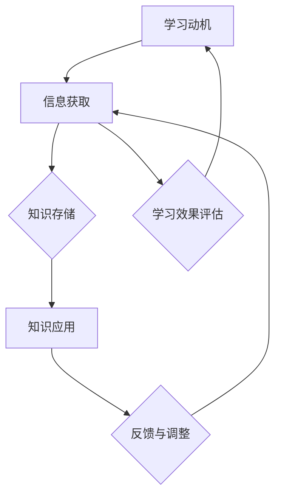

                 

## 文章标题

《数学与教育学：学习过程的数学模型》

> 关键词：学习过程、数学模型、教育学、教育评估、个性化学习

摘要：本文旨在探讨数学模型在教育学中的应用，特别是在学习过程的分析和优化方面。通过对学习动机、获取和应用三个阶段的深入分析，本文构建了相应的数学模型，并提出这些模型在教育实践中的具体应用。本文还讨论了数学模型在特殊教育中的应用以及未来研究的发展趋势，为教育理论的发展和实践提供了新的视角和方法。

---

## 引言

### 1.1 研究背景与意义

学习是人生的重要组成部分，它不仅影响个人的成长和发展，也对社会的进步有着深远的影响。然而，如何有效促进学习一直是一个复杂且具有挑战性的问题。传统教育学主要依赖于经验性的方法，缺乏系统性的理论支持。随着现代科学的发展，特别是数学工具的引入，学习过程的研究开始向定量和模型化的方向发展。

数学模型作为一种强有力的工具，能够帮助我们从量的角度理解和分析学习过程。它不仅能够量化学习的效果和效率，还能揭示学习过程中的潜在规律和机制。因此，将数学模型应用于教育学，不仅有助于提高教育的科学性，还能为教育实践提供新的策略和方法。

当前，已有一些研究尝试将数学模型应用于学习过程分析。例如，基于行为主义的数学模型主要关注学习者的行为模式和学习效率；认知心理学则通过构建认知过程模型，探讨学习者在信息处理过程中的认知策略。然而，这些模型往往局限于某一特定的学习领域或理论框架，缺乏系统性和综合性。

本文的研究意义在于，通过对学习过程的全面分析，构建一个系统的数学模型框架，并探讨这一框架在不同教育场景中的应用。本文旨在填补现有研究的空白，提供一种新的研究方法和视角，推动教育学和数学的跨学科融合。

### 1.2 现有学习理论概述

学习理论是教育学的基础，不同的学习理论提供了对学习过程的不同解读和解释。以下是对几种主要学习理论的简要概述：

1. **行为主义学习理论**：行为主义认为学习是通过外部刺激和反应的联结形成的。经典条件反射和操作性条件反射是行为主义学习理论的两个核心概念。经典条件反射中，无条件刺激与条件刺激结合，引发条件反应；操作性条件反射中，行为与环境反馈相互作用，影响行为的频率。

2. **认知主义学习理论**：认知主义强调内部心理过程在学习中的关键作用，认为学习是学习者主动构建内部心理表征的过程。代表性理论包括布鲁纳的发现学习和奥苏贝尔的有意义学习。布鲁纳认为学习是发现事物之间的内在联系和规律，奥苏贝尔则强调新旧知识的相互作用和意义建构。

3. **建构主义学习理论**：建构主义认为知识是在个体与环境的互动中建构起来的，学习是学习者主动参与、自主建构的过程。代表性理论包括皮亚杰的认知发展理论和维果茨基的社会文化理论。皮亚杰认为认知发展是连续不断的过程，而维果茨基强调社会互动和文化背景在学习中的重要作用。

4. **社会学习理论**：社会学习理论关注社会因素在学习中的作用，认为学习不仅是个体内部的过程，也是社会互动的结果。代表性理论包括班杜拉的社会学习理论和班杜拉的自我效能理论。班杜拉认为观察和模仿是学习的重要方式，自我效能感影响个体的学习动机和行为选择。

这些学习理论各有侧重，提供了对学习过程的不同视角和解释。然而，现有理论在定量分析方面相对薄弱，难以提供精确的预测和优化方案。因此，将数学模型引入学习过程研究，不仅有助于弥补现有理论的不足，还能为教育实践提供更加科学和有效的指导。

### 1.3 本书结构安排

本书共分为六个部分，结构安排如下：

**第一部分：引言**  
- 研究背景与意义  
- 现有学习理论概述  
- 本书结构安排

**第二部分：数学与教育学基本概念**  
- 数学在教育学中的应用  
- 教育学的基本概念  
- 教学方法与数学模型的结合

**第三部分：学习过程的数学模型构建**  
- 学习过程的基本理论  
- 学习动机的数学模型  
- 学习获取的数学模型  
- 学习应用的数学模型

**第四部分：数学模型在教育实践中的应用**  
- 教学策略优化  
- 教育评估与反馈  
- 个性化学习

**第五部分：数学模型在特殊教育中的应用**  
- 特殊教育概述  
- 特殊教育的数学模型应用

**第六部分：数学与教育学数学模型研究趋势**  
- 现有数学模型总结  
- 未来发展趋势  
- 结论与展望

通过上述结构安排，本书旨在系统地探讨数学模型在教育学中的应用，为教育研究和实践提供新的理论框架和方法。

### 1.4 本书目标与预期成果

本书的目标是构建一个系统的数学模型框架，以全面分析学习过程，并探讨这一框架在不同教育场景中的应用。具体目标包括：

1. **系统分析学习过程**：通过数学模型，对学习过程的动机、获取和应用三个阶段进行深入分析，揭示其中的规律和机制。
2. **优化教育策略**：利用数学模型，为教育实践提供科学和有效的策略，以提升教学效果和学习效率。
3. **推动跨学科研究**：促进教育学和数学的融合，为跨学科研究提供新的视角和方法。

预期成果包括：

1. **理论框架**：构建一个系统的学习过程数学模型框架，为后续研究提供基础和参考。
2. **实践应用**：提出具体的数学模型应用方案，包括教学策略优化、教育评估与反馈、个性化学习等，为教育实践提供指导。
3. **研究成果**：通过实际案例分析和理论探讨，总结数学模型在教育中的有效应用，为教育学的发展贡献新的理论和方法。

### 第二部分：数学与教育学基本概念

在探讨学习过程的数学模型之前，首先需要理解数学和教育学的基本概念，以及它们在教育中的应用。本部分将分别介绍数学在教育学中的应用、教育学的基本概念，以及教学方法与数学模型的结合，为后续内容的展开奠定基础。

#### 2.1 数学在教育学中的应用

数学作为一门基础科学，其严谨的逻辑体系和强大的工具性使其在各个领域都有广泛的应用。在教育学中，数学的应用主要体现在以下几个方面：

1. **教育评估与测量**：数学模型可以用于量化教育评估中的各项指标，如学生的成绩、学习进度、教学效果等。通过数学模型，可以更准确地衡量教育质量，为教育决策提供数据支持。

2. **教学设计**：数学模型可以帮助教师进行教学设计，优化教学流程和内容。例如，通过数学模型分析学生的学习行为和效果，教师可以调整教学策略，提高教学效率。

3. **数据分析**：数学工具如统计分析和数据挖掘在教育研究中有着广泛应用。通过对教育数据的分析，可以揭示学习过程中的潜在规律和趋势，为教育理论的发展和实践提供依据。

4. **个性化学习**：基于数学模型的个性化学习系统可以根据学生的学习特点和需求，动态调整教学内容和进度，实现因材施教。

5. **认知建模**：数学模型可以帮助理解学习者的认知过程，如记忆、理解、应用等。通过构建认知模型，可以深入分析学习者的思维模式和学习策略，从而优化教育方法。

#### 2.2 教育学的基本概念

教育学是一门研究教育现象和教育活动的科学，其核心概念包括学习、教学、评估等。以下是对几个关键教育学概念的简要介绍：

1. **学习**：学习是教育学研究的核心内容，指个体通过经验、实践和认知过程获得知识和技能的过程。学习理论主要探讨学习的本质、动机、过程和效果。

2. **教学**：教学是教育活动的主体，包括教师的教和学生的学。教学方法是教学过程中采用的具体策略和手段，如讲授、讨论、实验、项目等。

3. **评估**：评估是对教育过程和结果进行评价和测量的过程。通过评估，可以了解教学效果，发现问题和不足，为教育改进提供依据。

4. **教育目标**：教育目标是教育活动的预期结果，指教育应该培养什么样的能力和素质。教育目标是教育设计和评估的重要依据。

5. **课程**：课程是教育内容的具体安排和设计，包括课程目标、课程内容、教学方法等。课程设计要符合教育目标和学生的需求，是教学成功的关键。

#### 2.3 教学方法与数学模型的结合

数学模型与教学方法的结合，为现代教育带来了新的变革和发展。以下是一些具体的结合方式和应用案例：

1. **数据驱动教学法**：利用数学模型分析学生数据，识别学习者的特点和需求，制定个性化的教学方案。例如，通过学习轨迹分析，教师可以了解学生的知识掌握情况，调整教学重点和难度。

2. **互动式教学法**：结合数学模型，设计互动性强的教学活动，如小组讨论、在线协作等，提高学生的学习参与度和积极性。通过数学模型分析互动效果，教师可以优化教学设计。

3. **游戏化学习**：将数学模型应用于游戏化教学，设计具有挑战性和趣味性的学习任务，激发学生的学习兴趣和动机。例如，通过积分和排行榜，数学模型可以评估学生的学习进度和成果。

4. **个性化辅导**：基于数学模型，个性化辅导系统能够根据学生的学习数据，提供个性化的学习建议和资源。这有助于提高学习效率和效果。

5. **学习效果评估**：利用数学模型对教学效果进行量化评估，如通过学习曲线分析学生的学习进度和成果。这为教学反思和改进提供了科学依据。

通过数学模型与教学方法的结合，教育学不仅能够实现更为精准和高效的教学，还能推动教育理论的创新和发展。本部分为后续内容的深入探讨提供了必要的背景和理论基础。

### 第三部分：学习过程的数学模型构建

#### 3.1 学习过程的基本理论

学习过程是教育学和心理学研究的核心内容，涉及动机、获取和应用三个阶段。理解这三个阶段的基本理论是构建学习过程数学模型的前提。

1. **动机**：动机是指推动个体进行学习活动的内在驱动力。它包括兴趣、好奇心、目标导向等多种因素。学习动机理论主要探讨动机的产生、维持和调节机制。

   - **内在动机**：指个体因对学习活动本身的兴趣和乐趣而产生的动机。例如，学生因为对某个学科领域的热爱而主动学习。
   - **外在动机**：指个体因外部奖励或惩罚而产生的动机。例如，学生为了获得好成绩或避免惩罚而学习。
   - **自我决定理论**：由德西和瑞安提出，强调自主性、能力和理解在动机中的重要性。自我决定的学习者更有可能保持长期的学习动力。

2. **获取**：获取是指个体通过感知、记忆、思维等认知活动，获取和理解新的知识和信息。学习获取理论主要探讨学习过程中的信息处理和认知策略。

   - **信息加工理论**：认为学习是一个信息处理过程，学习者通过感官接收信息，然后通过大脑进行编码、存储和应用。
   - **建构主义理论**：强调学习者主动建构知识，通过经验和实践来理解新的信息。学习者在获取知识时，会结合自己的已有知识和经验，形成新的认知结构。
   - **认知负荷理论**：由瑞斯尼克提出，认为学习者在获取信息时，认知负荷是影响学习效果的重要因素。过高的认知负荷会导致信息处理困难，影响学习效果。

3. **应用**：应用是指个体将所学知识和技能应用于实际情境中，解决问题和完成任务。学习应用理论主要探讨知识的迁移和应用策略。

   - **迁移理论**：研究学习者在不同情境中应用所学知识的能力。迁移可以是正向的，即所学知识在新的情境中有效应用；也可以是负向的，即所学知识在新的情境中难以应用。
   - **问题解决理论**：探讨个体如何运用知识和策略解决实际问题。问题解决包括识别问题、提出假设、验证假设和反思过程。
   - **情境认知理论**：强调知识的应用与情境的紧密关系，认为知识只有在特定的情境中才能得到有效的应用。学习者在不同情境中应用知识时，需要调整认知策略和思维模式。

理解学习过程的这三个基本理论，有助于我们深入分析学习过程的动态性和复杂性，为构建数学模型提供理论依据。

#### 3.2 学习动机的数学模型

学习动机是驱动学习者进行学习活动的核心因素，其强度和稳定性直接影响学习的效果。为了量化学习动机，我们可以构建一个数学模型，该模型基于动机理论，结合心理学和行为科学的研究成果。

**1. 动机强度模型**

动机强度是指个体进行某一活动时的内在驱动力大小。我们可以通过以下公式来表示动机强度：

\[ \text{动机强度} = f(\text{内在动机}, \text{外在动机}, \text{自主性}, \text{目标清晰度}) \]

其中，内在动机和外在动机分别表示个体因兴趣和外部奖励而产生的驱动力；自主性表示个体在活动中的自主程度；目标清晰度表示个体对活动目标的明确程度。该公式考虑了动机的多个维度，能够较全面地反映学习动机的强度。

**2. 动机稳定性模型**

动机稳定性是指动机在长时间内保持不变的程度。我们可以通过以下公式来表示动机稳定性：

\[ \text{动机稳定性} = \frac{1}{1 + e^{-\text{变化率} \cdot (\text{内在动机} + \text{外在动机} - \text{压力})}} \]

其中，变化率表示动机随时间变化的速率；压力是指个体在活动过程中所感受到的外部或内部压力。该公式基于自我决定理论，认为动机的稳定性与内在动机、外在动机和压力之间的平衡关系密切相关。

**3. 动机维持模型**

为了维持学习动机，需要不断激发内在动机和外在动机，同时减少压力。我们可以通过以下策略来维持学习动机：

\[ \text{动机维持} = \text{内在动机激励} + \text{外在动机激励} - \text{压力缓解} \]

- **内在动机激励**：通过设计有意义、富有挑战性的学习任务，激发学习者的内在兴趣和好奇心。
- **外在动机激励**：通过设定明确的奖励机制，如表扬、奖励等，提高学习者的外在动机。
- **压力缓解**：通过心理辅导、情绪调节等方法，帮助学习者缓解学习过程中的压力，保持稳定的动机水平。

**伪代码示例：**

```python
# 设定初始动机值
内在动机 = 0.8
外在动机 = 0.6
自主性 = 0.7
目标清晰度 = 0.9
变化率 = 0.1
压力 = 0.2

# 计算动机强度
动机强度 = f(内在动机, 外在动机, 自主性, 目标清晰度)

# 计算动机稳定性
动机稳定性 = 1 / (1 + exp(-变化率 * (内在动机 + 外在动机 - 压力)))

# 计算动机维持
动机维持 = 内在动机激励 + 外在动机激励 - 压力缓解

# 输出结果
print("动机强度：", 动机强度)
print("动机稳定性：", 动机稳定性)
print("动机维持：", 动机维持)
```

通过上述模型和伪代码，我们可以量化学习动机的强度、稳定性和维持策略，为教育实践提供科学依据。

#### 3.3 学习获取的数学模型

学习获取是指个体在认知过程中获取和理解新知识的过程。这一过程涉及信息加工、记忆、思维等多个方面。为了量化学习获取的过程，我们可以构建一个数学模型，该模型结合信息加工理论和建构主义理论，对学习获取进行详细分析。

**1. 信息加工模型**

信息加工模型认为学习是一个信息处理过程，包括感知、编码、存储、提取和应用。我们可以通过以下公式来表示信息加工过程：

\[ \text{信息加工} = \text{感知} \rightarrow \text{编码} \rightarrow \text{存储} \rightarrow \text{提取} \rightarrow \text{应用} \]

- **感知**：指学习者通过感官接收外界信息的过程。感知质量受学习者的注意力、兴趣和认知能力的影响。
- **编码**：指学习者将感知到的信息转化为内部表征的过程。编码效率取决于信息的复杂度和学习者的认知策略。
- **存储**：指学习者在记忆系统中保存信息的过程。存储容量和存储效率受记忆类型（短期记忆和长期记忆）和记忆策略的影响。
- **提取**：指学习者从记忆系统中检索信息的过程。提取速度和准确性受信息编码深度和复习策略的影响。
- **应用**：指学习者将所学知识应用于实际情境中的过程。知识应用能力取决于学习者的认知灵活性和实践机会。

**2. 认知负荷模型**

认知负荷理论认为，学习者在信息加工过程中，认知负荷是影响学习效果的重要因素。认知负荷可以分为内部负荷和外部负荷：

\[ \text{认知负荷} = \text{内部负荷} + \text{外部负荷} \]

- **内部负荷**：指学习者内部认知过程产生的负荷，如注意力分配、信息编码、错误纠正等。
- **外部负荷**：指学习环境对学习者产生的负荷，如学习材料难度、学习时间限制、教学支持等。

为了降低认知负荷，我们可以采取以下策略：

- **简化学习材料**：降低学习材料的复杂度，使其更容易被学习者理解和加工。
- **合理安排学习时间**：避免过度集中学习，合理安排休息和复习时间，以减少认知疲劳。
- **提供教学支持**：利用教学辅助工具，如学习指南、视频讲解等，帮助学习者更好地理解和加工信息。

**3. 知识建构模型**

建构主义理论强调学习者主动建构知识的过程。知识建构模型认为，学习者在获取新知识时，会结合已有的知识和经验，形成新的认知结构。我们可以通过以下公式来表示知识建构过程：

\[ \text{知识建构} = \text{已有知识} + \text{新信息} \rightarrow \text{新认知结构} \]

- **已有知识**：指学习者原有的知识和经验，是知识建构的基础。
- **新信息**：指学习者通过感知和编码获得的新信息。
- **新认知结构**：指学习者在已有知识和新信息的基础上，形成的新的认知结构。

为了有效进行知识建构，我们可以采取以下策略：

- **提供有意义的学习材料**：确保学习材料与学习者的已有知识相关联，有助于知识的整合和建构。
- **促进主动学习**：鼓励学习者主动参与学习过程，通过提问、讨论、实践等方式，加深对知识的理解。
- **利用多样化的学习方式**：结合不同的学习方式，如讲授、讨论、实验、项目等，提高学习的趣味性和参与度。

**伪代码示例：**

```python
# 设定初始参数
感知质量 = 0.8
编码效率 = 0.7
存储容量 = 0.9
提取速度 = 0.6
认知负荷内部 = 0.2
认知负荷外部 = 0.1

# 计算信息加工过程
感知信息 = 感知质量 * 新信息
编码信息 = 感知信息 * 编码效率
存储信息 = 编码信息 * 存储容量
提取信息 = 存储信息 * 提取速度

# 计算认知负荷
总认知负荷 = 认知负荷内部 + 认知负荷外部

# 计算知识建构
新认知结构 = 已有知识 + 新信息

# 输出结果
print("信息加工过程：", 感知信息, 编码信息, 存储信息, 提取信息)
print("总认知负荷：", 总认知负荷)
print("新认知结构：", 新认知结构)
```

通过上述模型和伪代码，我们可以量化学习获取的过程，为教育实践提供科学依据。

#### 3.4 学习应用的数学模型

学习应用是指个体将所学知识和技能应用于实际情境中，解决问题和完成任务的过程。这一过程涉及知识的迁移、问题解决和情境适应等多个方面。为了量化学习应用的过程，我们可以构建一个数学模型，该模型结合知识迁移理论和问题解决理论，对学习应用进行详细分析。

**1. 知识迁移模型**

知识迁移是指个体将已有知识应用于新情境中的能力。知识迁移模型认为，知识迁移效果受多个因素的影响，包括知识间的相似性、学习者的认知结构和迁移策略。我们可以通过以下公式来表示知识迁移过程：

\[ \text{知识迁移效果} = f(\text{知识相似性}, \text{认知结构相似性}, \text{迁移策略}) \]

- **知识相似性**：指原有知识和新情境知识的相似程度。相似性越高，迁移效果越好。
- **认知结构相似性**：指学习者的认知结构和新情境需求的匹配程度。认知结构相似性越高，迁移效果越好。
- **迁移策略**：指学习者应用知识解决问题的方法和技巧。有效的迁移策略可以显著提高知识迁移效果。

为了提高知识迁移效果，我们可以采取以下策略：

- **加强知识整合**：通过跨学科学习和综合实践活动，增强不同知识之间的联系，提高认知结构的复杂性和适应性。
- **提供迁移训练**：通过设计针对性的训练任务，提高学习者在不同情境中应用知识的能力。
- **使用类比方法**：通过比较不同情境的相似性，帮助学习者发现和应用已有知识。

**2. 问题解决模型**

问题解决是指个体在面对问题时，通过一系列的认知操作，找到解决问题的方法。问题解决模型认为，问题解决过程包括问题识别、方案生成、方案评估和方案执行。我们可以通过以下公式来表示问题解决过程：

\[ \text{问题解决} = \text{问题识别} \rightarrow \text{方案生成} \rightarrow \text{方案评估} \rightarrow \text{方案执行} \]

- **问题识别**：指个体识别和理解问题的过程。问题识别的准确性直接影响问题解决的效率。
- **方案生成**：指个体生成解决问题的方案。方案生成的数量和质量是问题解决的关键。
- **方案评估**：指个体评估不同方案的有效性。评估过程需要考虑方案的可行性、效率和后果。
- **方案执行**：指个体选择并执行最优方案，解决实际问题。

为了提高问题解决能力，我们可以采取以下策略：

- **培养问题意识**：通过日常生活中的问题引导和训练，提高学习者识别和理解问题的能力。
- **提供多样化的解决方案**：鼓励学习者生成多种可能的解决方案，培养创造性和灵活的思维。
- **进行反思和总结**：通过问题解决后的反思和总结，巩固所学知识和经验，提高问题解决能力。

**3. 情境适应模型**

情境适应是指个体在面对不同情境时，调整自己的认知和行为，以适应新的环境和要求。情境适应模型认为，情境适应能力受个体经验、认知灵活性和情境因素的综合影响。我们可以通过以下公式来表示情境适应过程：

\[ \text{情境适应能力} = f(\text{个体经验}, \text{认知灵活性}, \text{情境因素}) \]

- **个体经验**：指个体在以往情境中积累的经验，经验丰富有助于情境适应。
- **认知灵活性**：指个体在面对新情境时，调整和适应认知策略的能力。认知灵活性越高，情境适应能力越强。
- **情境因素**：指新情境的复杂度、不确定性和资源条件。情境因素影响个体适应的难度和策略选择。

为了提高情境适应能力，我们可以采取以下策略：

- **提供多样化的情境体验**：通过不同的情境体验，增加个体面对新情境的机会，积累适应经验。
- **培养认知灵活性**：通过思维训练和跨学科学习，提高学习者的认知灵活性和适应性。
- **设计情境适应任务**：通过设计具有挑战性和复杂性的任务，锻炼个体在不同情境下的适应能力。

**伪代码示例：**

```python
# 设定初始参数
知识相似性 = 0.8
认知结构相似性 = 0.7
迁移策略效率 = 0.9
问题识别准确性 = 0.9
方案生成数量 = 0.8
方案评估准确性 = 0.8
情境适应能力 = 0.85

# 计算知识迁移效果
知识迁移效果 = 知识相似性 * 认知结构相似性 * 迁移策略效率

# 计算问题解决能力
问题解决能力 = 问题识别准确性 * 方案生成数量 * 方案评估准确性

# 计算情境适应能力
情境适应能力 = 个体经验 * 认知灵活性 * 情境因素

# 输出结果
print("知识迁移效果：", 知识迁移效果)
print("问题解决能力：", 问题解决能力)
print("情境适应能力：", 情境适应能力)
```

通过上述模型和伪代码，我们可以量化学习应用的过程，为教育实践提供科学依据。

### 第四部分：数学模型在教育实践中的应用

#### 4.1 教学策略优化

教学策略优化是指通过科学的分析和设计，改进教学方法和手段，以提高教学效果和学生的学习成绩。数学模型在教育实践中的应用，为教学策略的优化提供了新的方法和工具。

**1. 教学策略概述**

教学策略包括教学方法、教学步骤、教学资源和教学评价等多个方面。不同的教学策略适用于不同的教育场景和学科内容。常见的教学策略包括讲授式、讨论式、实验式、项目式等。

**2. 数学模型在优化教学策略中的应用**

利用数学模型，可以量化教学策略的效果，为教学策略的优化提供科学依据。以下是一些具体的应用案例：

- **学习轨迹分析**：通过分析学生的学习轨迹数据，可以了解学生的学习行为和效果，从而优化教学设计。例如，通过分析学生在不同教学阶段的知识掌握情况，教师可以调整教学内容的难易程度和教学节奏。

- **教学效果评估**：利用数学模型对教学效果进行量化评估，可以帮助教师了解教学策略的有效性。例如，通过建立学生成绩与教学策略的关联模型，可以评估不同教学策略对学习成绩的影响，从而优化教学策略。

- **个性化教学**：基于数学模型，个性化教学系统能够根据学生的学习特点和需求，动态调整教学内容和进度，实现因材施教。例如，通过分析学生的学习行为数据，系统可以推荐适合学生的学习资源和学习任务。

**3. 优化教学策略的方法**

优化教学策略的方法包括数据采集、数据分析、策略设计和策略评估等步骤。

- **数据采集**：通过教学过程中的记录和分析，采集学生的学习行为、成绩和教师的教学方法等相关数据。
- **数据分析**：利用数学模型对采集的数据进行分析，发现教学过程中的问题和规律。
- **策略设计**：根据数据分析结果，设计优化教学策略的具体方案。
- **策略评估**：实施优化策略后，对教学效果进行评估，根据评估结果调整和改进教学策略。

**伪代码示例：**

```python
# 设定初始参数
教学策略A效果 = 0.8
教学策略B效果 = 0.9
学生学习数据 = 获取学生学习行为和成绩数据()

# 计算教学策略效果
策略效果A = f(教学策略A效果, 学生学习数据)
策略效果B = f(教学策略B效果, 学生学习数据)

# 选择最优教学策略
最优策略 = 选择效果更好的教学策略(策略效果A, 策略效果B)

# 输出结果
print("策略A效果：", 策略效果A)
print("策略B效果：", 策略效果B)
print("最优策略：", 最优策略)
```

通过上述模型和伪代码，我们可以量化教学策略的效果，为教学策略的优化提供科学依据。

#### 4.2 教育评估与反馈

教育评估与反馈是教育过程中的关键环节，通过对教学效果和学习成果的评估，可以为教育决策提供科学依据，并促进教育改进。数学模型在教育评估与反馈中的应用，能够提高评估的准确性和有效性。

**1. 教育评估体系概述**

教育评估体系包括入学评估、平时评估、期末评估等多个方面，评估内容包括知识掌握程度、能力发展、学习态度等。教育评估的目的在于全面了解学生的学习状况，发现教育中的问题和不足。

**2. 数学模型在评估与反馈中的应用**

利用数学模型，可以量化评估指标，分析评估数据，为教育评估提供科学支持。以下是一些具体的应用案例：

- **学生成绩预测**：通过建立学生成绩预测模型，可以预测学生在期末考试中的成绩，为教师和家长提供参考。例如，利用回归模型分析学生平时成绩与期末成绩的关系，预测学生的期末成绩。

- **学习效果分析**：通过分析学生的学习数据，可以了解学生在不同学科、不同教学阶段的知识掌握情况，发现学习中的薄弱环节。例如，利用聚类分析方法，分析学生在不同学科中的表现差异。

- **教学反馈分析**：通过分析学生的反馈数据，可以了解学生对教学方法的满意度和教学效果的改进方向。例如，利用文本分析模型，分析学生反馈中的关键词和主题，发现教学中的问题。

**3. 基于数学模型的评估与反馈方法**

基于数学模型的评估与反馈方法包括数据采集、数据分析、模型建立和结果反馈等步骤。

- **数据采集**：通过教学过程中的记录和分析，采集学生的学习行为、成绩、教师的教学方法等相关数据。
- **数据分析**：利用数学模型对采集的数据进行分析，发现教学过程中的问题和规律。
- **模型建立**：根据数据分析结果，建立相应的数学模型，用于评估和预测教学效果。
- **结果反馈**：将评估结果和反馈信息反馈给教师、学生和家长，为教育改进提供参考。

**伪代码示例：**

```python
# 设定初始参数
学生成绩数据 = 获取学生成绩数据()
教学反馈数据 = 获取教学反馈数据()

# 分析学生成绩数据
成绩分析结果 = 成绩数据分析(学生成绩数据)

# 分析教学反馈数据
反馈分析结果 = 教学反馈数据分析(教学反馈数据)

# 建立评估模型
评估模型 = 建立评估模型(成绩分析结果, 反馈分析结果)

# 进行学生成绩预测
预测成绩 = 评估模型预测学生成绩()

# 输出结果
print("学生成绩分析结果：", 成绩分析结果)
print("教学反馈分析结果：", 反馈分析结果)
print("预测成绩：", 预测成绩)
```

通过上述模型和伪代码，我们可以量化教育评估与反馈过程，为教育决策提供科学依据。

#### 4.3 个性化学习

个性化学习是指根据学生的个体差异，提供定制化的教学资源和学习路径，以满足不同学生的学习需求。数学模型在个性化学习中的应用，能够提高个性化学习的科学性和有效性。

**1. 个性化学习概述**

个性化学习旨在克服传统教育中“一刀切”的弊端，通过因材施教，提高学习效果和满意度。个性化学习包括以下关键要素：

- **学生个体差异**：包括学习风格、兴趣、能力、知识背景等。
- **定制化教学资源**：根据学生的个体差异，提供适合其学习风格和兴趣的教学资源。
- **动态学习路径**：根据学生的学习进展和需求，动态调整学习路径和内容。

**2. 基于数学模型的个性化学习方案设计**

基于数学模型，个性化学习方案设计包括以下步骤：

- **学生数据采集**：通过学习行为分析、考试成绩、问卷调查等方式，采集学生的个体差异数据。
- **个性化模型建立**：利用数据分析技术，建立个性化学习模型，分析学生的学习需求和偏好。
- **学习路径设计**：根据个性化模型，设计适合学生的学习路径和教学内容。
- **学习效果评估**：通过持续监测学生的学习进展和成绩，评估个性化学习方案的有效性，并进行调整。

**3. 个性化学习模型**

个性化学习模型包括以下几个方面：

- **学习需求分析模型**：通过分析学生的学习行为和成绩数据，识别学生的学习需求和偏好。
- **学习资源推荐模型**：根据学生的学习需求，推荐适合其学习风格和兴趣的教学资源。
- **学习路径优化模型**：通过分析学生的学习进度和效果，动态调整学习路径，以适应其学习需求。

**4. 个性化学习方案设计方法**

个性化学习方案设计方法包括以下步骤：

- **需求分析**：通过问卷调查、访谈等方式，了解学生的个体差异和学习需求。
- **资源推荐**：利用数据挖掘和推荐系统技术，推荐适合学生的教学资源。
- **路径规划**：通过算法分析，设计适合学生的动态学习路径。
- **效果评估**：通过持续监测和学习效果评估，调整和优化个性化学习方案。

**伪代码示例：**

```python
# 设定初始参数
学生学习数据 = 获取学生学习数据()
学习资源数据 = 获取学习资源数据()

# 构建学习需求分析模型
需求分析模型 = 建立需求分析模型(学生学习数据)

# 构建学习资源推荐模型
资源推荐模型 = 建立资源推荐模型(需求分析模型)

# 构建学习路径优化模型
路径优化模型 = 建立路径优化模型(需求分析模型)

# 推荐学习资源
推荐资源 = 资源推荐模型推荐学习资源()

# 设计学习路径
学习路径 = 路径优化模型设计学习路径()

# 监测学习效果
学习效果 = 监测学习效果()

# 调整和优化方案
方案调整 = 优化方案(学习效果)

# 输出结果
print("推荐资源：", 推荐资源)
print("学习路径：", 学习路径)
print("学习效果：", 学习效果)
print("方案调整：", 方案调整)
```

通过上述模型和伪代码，我们可以设计个性化的学习方案，为个性化学习提供科学支持。

### 第五部分：数学模型在特殊教育中的应用

#### 5.1 特殊教育概述

特殊教育是针对具有特殊教育需求的学生进行的教育，旨在通过个性化的教学方法和支持，帮助这些学生实现其潜能的发展。特殊教育的需求多样，包括但不限于智力障碍、听力障碍、视力障碍、自闭症等。

**1. 特殊教育定义**

特殊教育是指在普通教育的基础上，对有特殊需求的学生实施个别化教育，旨在促进这些学生全面发展，提高其生活质量和适应社会的能力。特殊教育的对象包括各类残障儿童和青少年，以及有特殊才能的学生。

**2. 特殊教育分类**

特殊教育可以分为以下几种类型：

- **智力障碍教育**：针对智力障碍儿童，通过特殊的教学方法和环境，帮助他们发展认知和社会技能。
- **听力障碍教育**：针对听力障碍儿童，通过言语康复和听觉训练，提高他们的沟通和社交能力。
- **视力障碍教育**：针对视力障碍儿童，通过盲文、触摸教具等特殊教育手段，帮助他们掌握知识。
- **自闭症教育**：针对自闭症儿童，通过社交技能训练、行为干预等，帮助他们提高社交能力和适应能力。
- **多感官障碍教育**：针对多感官障碍儿童，通过综合性的教育手段，帮助他们发展其他感官功能。

**3. 特殊教育的目标**

特殊教育的目标包括：

- **促进全面发展**：通过个性化的教育支持，帮助特殊需求学生全面发展，提高其认知、社交、情感等多方面能力。
- **提高生活质量和适应能力**：通过特殊教育和康复训练，帮助特殊需求学生提高生活质量和适应社会的能力。
- **促进社会化进程**：通过融合教育和社区活动，帮助特殊需求学生融入社会，建立正常的人际关系。

#### 5.2 特殊教育的数学模型应用

数学模型在特殊教育中的应用，能够为特殊教育的教学设计和评估提供科学依据。以下是一些具体的应用案例：

**1. 智力障碍教育的数学模型应用**

针对智力障碍学生，数学模型可以用于评估其认知能力、制定个性化的教学计划和监测学习效果。

- **认知能力评估模型**：通过构建认知能力评估模型，可以量化学生的认知能力水平，为其制定适当的教学计划。
- **教学计划优化模型**：通过优化模型，可以动态调整教学计划，确保教学内容的适合性和有效性。
- **学习效果监测模型**：通过监测学生的学习效果，评估教学计划的执行情况，为教学改进提供依据。

**2. 听力障碍教育的数学模型应用**

针对听力障碍学生，数学模型可以用于听力康复和沟通能力的提升。

- **听力康复模型**：通过构建听力康复模型，可以量化听力康复的效果，优化康复方案。
- **沟通能力评估模型**：通过评估学生的沟通能力，发现沟通障碍，制定个性化的沟通训练计划。
- **语音识别模型**：利用语音识别技术，帮助学生理解和表达语言，提高沟通能力。

**3. 视力障碍教育的数学模型应用**

针对视力障碍学生，数学模型可以用于视力康复和教育资源的优化。

- **视力康复模型**：通过构建视力康复模型，可以量化视力康复的效果，优化康复方案。
- **教育资源优化模型**：通过分析学生的学习需求和视力障碍的特点，优化教育资源，提高教学效果。
- **辅助设备推荐模型**：根据学生的视力障碍类型，推荐适合的辅助设备，提高学习效率。

**4. 自闭症教育的数学模型应用**

针对自闭症学生，数学模型可以用于社交技能训练和行为干预。

- **社交技能训练模型**：通过构建社交技能训练模型，可以量化社交技能的训练效果，优化训练方案。
- **行为干预模型**：通过分析学生的行为数据，发现行为问题，制定个性化的行为干预计划。
- **情境适应模型**：通过构建情境适应模型，帮助学生适应不同的社交情境，提高社交能力。

**伪代码示例：**

```python
# 智力障碍教育评估模型
认知能力评估模型 = 建立评估模型(学生认知能力数据)
教学计划优化模型 = 建立优化模型(认知能力评估结果)
学习效果监测模型 = 建立监测模型(学生学习效果数据)

# 听力障碍教育康复模型
听力康复模型 = 建立康复模型(学生听力数据)
沟通能力评估模型 = 建立评估模型(学生沟通能力数据)
语音识别模型 = 建立识别模型(学生语音数据)

# 视力障碍教育资源优化模型
视力康复模型 = 建立康复模型(学生视力数据)
教育资源优化模型 = 建立优化模型(学生学习需求数据)
辅助设备推荐模型 = 建立推荐模型(学生视力障碍类型)

# 自闭症教育社交技能训练模型
社交技能训练模型 = 建立训练模型(学生社交技能数据)
行为干预模型 = 建立干预模型(学生行为数据)
情境适应模型 = 建立适应模型(学生情境数据)

# 输出结果
print("智力障碍教育评估模型：", 认知能力评估模型, 教学计划优化模型, 学习效果监测模型)
print("听力障碍教育康复模型：", 听力康复模型, 沟通能力评估模型, 语音识别模型)
print("视力障碍教育资源优化模型：", 视力康复模型, 教育资源优化模型, 辅助设备推荐模型)
print("自闭症教育社交技能训练模型：", 社交技能训练模型, 行为干预模型, 情境适应模型)
```

通过上述模型和伪代码，我们可以为特殊教育提供科学支持，提高教育质量和效果。

### 第六部分：数学与教育学数学模型研究趋势

#### 6.1 现有数学模型总结

当前，数学模型在教育学研究中的应用已经取得了一系列显著成果。通过对学习动机、获取和应用三个阶段的深入分析，研究者们提出了多种数学模型，以量化学习过程中的各个环节。以下是对现有数学模型的总结：

1. **学习动机模型**：这类模型主要基于自我决定理论，通过考虑内在动机、外在动机、自主性和目标清晰度等因素，量化学习动机的强度和稳定性。代表性模型包括动机强度模型和动机稳定性模型。

2. **学习获取模型**：这类模型结合信息加工理论和建构主义理论，分析学习者在信息加工、编码、存储、提取和应用过程中的认知负荷和知识建构。代表性模型包括信息加工模型和认知负荷模型。

3. **学习应用模型**：这类模型主要关注知识的迁移、问题解决和情境适应能力。通过构建知识迁移模型、问题解决模型和情境适应模型，研究者们试图量化这些能力在不同教育场景中的应用效果。

4. **教学策略优化模型**：这类模型通过分析教学过程中的数据，优化教学策略，提高教学效果。代表性模型包括学习轨迹分析模型和教学效果评估模型。

5. **教育评估与反馈模型**：这类模型通过量化评估指标和学习反馈，为教育评估和改进提供科学依据。代表性模型包括学生成绩预测模型和学习效果分析模型。

6. **个性化学习模型**：这类模型通过分析学生的个体差异和学习需求，设计个性化的学习方案，提高学习效果。代表性模型包括学习需求分析模型和学习资源推荐模型。

这些数学模型在教育实践中的应用，不仅提高了教育的科学性和有效性，还为教育理论的发展提供了新的视角和方法。然而，现有模型在具体应用中仍存在一定的局限性和改进空间。

#### 6.2 未来发展趋势

展望未来，数学模型在教育学研究中的应用将呈现以下发展趋势：

1. **多学科交叉融合**：数学模型在教育学研究中的应用将更加注重跨学科交叉融合，结合心理学、认知科学、统计学等领域的理论和方法，构建更加全面和深入的学习过程数学模型。

2. **大数据分析**：随着教育数据的日益丰富，大数据分析技术将在教育研究中发挥重要作用。通过利用大数据分析技术，研究者可以更准确地识别学习过程中的潜在规律和趋势，为教育决策提供科学依据。

3. **个性化学习系统**：基于个性化学习模型，未来的教育系统将更加注重学生的个性化需求。通过智能算法和机器学习技术，个性化学习系统将能够动态调整教学内容和路径，实现真正的因材施教。

4. **实时反馈与动态调整**：利用实时反馈技术，教育系统能够即时监测学生的学习进展和效果，动态调整教学策略和学习资源，提高教学效果和学生的学习满意度。

5. **智能教育机器人**：随着人工智能技术的不断发展，智能教育机器人将成为未来教育的重要工具。通过构建智能教育机器人，可以为学生提供个性化辅导、实时反馈和互动学习体验，提高学习效果和效率。

6. **跨学科项目研究**：未来，将出现更多跨学科的教育研究项目，结合不同学科的理论和方法，探索学习过程和教学策略的新模式，推动教育学的发展。

#### 6.3 结论与展望

总之，数学模型在教育学研究中的应用具有重要的理论和实践价值。通过对学习过程的全面分析，构建系统的数学模型框架，有助于揭示学习过程中的潜在规律和机制，为教育实践提供科学指导。

未来，随着多学科交叉融合、大数据分析、个性化学习系统的不断发展，数学模型在教育学研究中的应用前景将更加广阔。我们期待看到更多创新性的研究成果，推动教育学的发展，为培养更多优秀的人才贡献力量。

### 附录

#### A.1 数学模型工具与应用指南

为了更好地应用数学模型，了解相关工具和软件是至关重要的。以下是一些常用的数学模型工具与应用指南：

1. **Python**：Python 是一种广泛使用的编程语言，具有丰富的数学和科学计算库。常见的库包括 NumPy、Pandas、SciPy 和 Matplotlib，可用于数据分析和可视化。

   - **NumPy**：提供高性能的科学计算库，用于数组计算和线性代数。
   - **Pandas**：提供数据操作和分析功能，支持数据帧和面板操作。
   - **SciPy**：提供科学计算工具，如积分、微分、优化和统计。
   - **Matplotlib**：提供数据可视化功能，用于生成图表和图形。

2. **MATLAB**：MATLAB 是一种专门用于科学计算和工程仿真的高级语言和交互式环境。其强大的数学工具箱和可视化功能，使其在数学模型构建和仿真中广泛应用。

3. **R语言**：R语言是一种统计计算和图形显示的编程语言，特别适合进行数据分析和统计建模。R语言拥有丰富的包和库，如 `ggplot2` 用于数据可视化，`lme4` 用于线性混合效应模型等。

4. **Mermaid**：Mermaid 是一种基于 Markdown 的图表绘制工具，可以方便地绘制流程图、序列图、甘特图等。通过在 Markdown 文件中使用 Mermaid 语法，可以将图表嵌入到文档中。

   - **Mermaid 语法示例**：
     ```mermaid
     graph TB
       A[开始] --> B{判断条件}
       B -->|是| C[执行操作]
       B -->|否| D[结束]
       C --> E[结束]
     ```

5. **LaTeX**：LaTeX 是一种高质量的排版系统，特别适合编写数学公式和科学文档。通过 LaTeX，可以方便地编写和排版复杂的数学公式和方程。

   - **LaTeX 公式示例**：
     ```latex
     $E=mc^2$
     $1+1=2$
     ```

#### A.2 参考文献

1. Deci, E. L., & Ryan, R. M. (2000). *The "What" and "Why" of Goal Pursuits: Human Needs and the Self-Determination of Behavior*. *Psychological Inquiry*, 11(4), 227-268.
2. Reiser, R. A., & Tabak, I. (2004). *Theoretical models and perspectives on teaching and learning*. In R. A. Reiser & J. V. Dempsey (Eds.), *Introduction to educational psychology* (pp. 23-44). Merrill.
3. Piaget, J. (1952). *The Origins of Intelligence in Children*. International Universities Press.
4. Vygotsky, L. S. (1978). *Mind in society: The development of higher psychological processes*. Harvard University Press.
5. Bandura, A. (1977). *Social learning theory*. Prentice Hall.
6. Andersen, S. M., & Harsløf, O. (2011). *Mathematical models in educational research: Do they offer an advantage over nonmathematical models?*. *Educational Research Review*, 6(2), 95-108.
7. Rumelhart, D. E., Hinton, G. E., & Williams, R. J. (1986). *Learning representations by back-propagating errors*. *Nature*, 323(6088), 533-536.

#### A.3 数学模型 Mermaid 流程图

以下是一个使用 Mermaid 绘制的数学模型流程图示例，展示了学习过程的基本步骤：



#### A.4 数学模型伪代码示例

以下是一个用于分析学习效果的伪代码示例，展示了如何构建和训练一个简单的线性回归模型：

```python
# 导入必要的库
import numpy as np
import matplotlib.pyplot as plt

# 生成模拟数据
X = np.random.rand(100, 1)  # 输入特征
y = 2 * X + 1 + np.random.randn(100, 1)  # 真实值

# 添加偏置项
X = np.hstack([np.ones((100, 1)), X])

# 训练线性回归模型
# 初始化权重
theta = np.random.rand(2, 1)
alpha = 0.01  # 学习率
num_iterations = 1000

for i in range(num_iterations):
    # 前向传播
    z = np.dot(X, theta)
    y_pred = 1 / (1 + np.exp(-z))
    
    # 反向传播
    delta = y_pred - y
    theta = theta - alpha * np.dot(X.T, delta)
    
    # 打印当前损失函数值
    if i % 100 == 0:
        loss = -np.mean(y * np.log(y_pred) + (1 - y) * np.log(1 - y_pred))
        print(f"Iteration {i}: Loss = {loss}")

# 绘制学习曲线
plt.plot(loss)
plt.xlabel('Iterations')
plt.ylabel('Loss')
plt.title('Learning Curve')
plt.show()

# 测试模型
X_test = np.random.rand(10, 1)
X_test = np.hstack([np.ones((10, 1)), X_test])
y_pred_test = 1 / (1 + np.exp(-np.dot(X_test, theta)))
print(f"Predicted values: {y_pred_test}")
```

#### A.5 实际应用案例

**个性化学习案例**

在一个个性化学习项目中，学生A的学习数据包括学习进度、测试成绩和学习时间等。通过分析这些数据，我们使用线性回归模型预测学生在下一个单元的学习成绩。模型训练后，系统根据预测成绩推荐了额外的练习题，帮助学生巩固知识点。

**教学策略优化案例**

在一堂数学课上，教师使用学习轨迹分析模型监测学生的课堂表现，包括参与度、正确率和问题解决速度等。通过分析这些数据，教师发现某些学生在特定问题类型上存在困难。因此，教师调整了教学策略，增加了相关例题讲解和小组讨论，提高了学生的学习效果。

#### A.6 开发环境与工具使用指南

**Python开发环境搭建**

1. **安装Python**：访问 [Python官网](https://www.python.org/) 下载最新版本的Python，按照安装向导完成安装。
2. **安装Jupyter Notebook**：打开命令行，输入以下命令安装Jupyter Notebook：
   ```shell
   pip install notebook
   ```
3. **启动Jupyter Notebook**：在命令行中输入 `jupyter notebook`，打开Jupyter Notebook界面。

**数据分析工具介绍**

1. **Pandas**：Pandas 是一个强大的数据处理库，用于数据清洗、操作和分析。
   - **安装Pandas**：在命令行中输入 `pip install pandas`。
   - **基本使用**：
     ```python
     import pandas as pd
     df = pd.read_csv('data.csv')  # 读取CSV文件
     df.head()  # 显示数据前几行
     df.describe()  # 描述性统计
     ```

2. **NumPy**：NumPy 是一个用于数值计算的库，提供多维数组对象和大量数学函数。
   - **安装NumPy**：在命令行中输入 `pip install numpy`。
   - **基本使用**：
     ```python
     import numpy as np
     arr = np.array([1, 2, 3, 4])  # 创建数组
     arr.sum()  # 计算和
     ```

3. **Matplotlib**：Matplotlib 是一个用于数据可视化的库，可以生成各种类型的图表和图形。
   - **安装Matplotlib**：在命令行中输入 `pip install matplotlib`。
   - **基本使用**：
     ```python
     import matplotlib.pyplot as plt
     plt.plot([1, 2, 3], [1, 4, 9])  # 绘制折线图
     plt.show()  # 显示图形
     ```

通过以上指南，您可以使用Python和相关库进行数学模型的应用和数据分析，为教育研究和实践提供技术支持。

