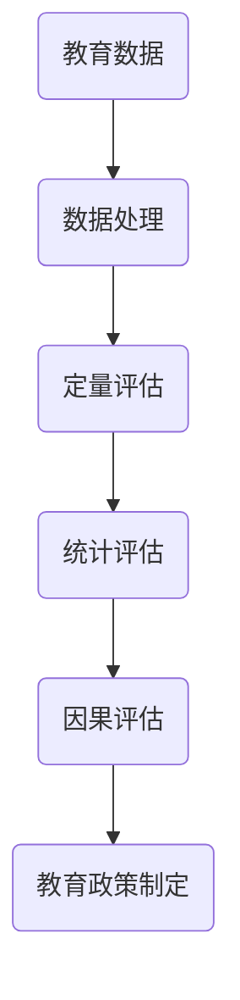

                 

## 文章标题

### 《数学与教育政策：教育效果的数学评估》

> 关键词：教育政策、数学评估、教育效果、定量评估、统计评估、因果评估

> 摘要：本文深入探讨了数学在教育政策中的应用，特别是如何利用数学方法对教育效果进行评估。文章分为三个部分：引言与背景、数学评估方法、数学评估的应用案例。通过详细的分析和实例，文章揭示了数学评估在教育政策制定中的重要作用，为未来教育效果评估提供了新的思路和方法。

---

### 《数学与教育政策：教育效果的数学评估》目录大纲

#### 第一部分：引言与背景

1. **数学与教育政策概述**
   - 教育政策的定义与演变
   - 数学在教育政策中的角色
   - 教育效果的数学评估的重要性

2. **数学模型与教育评估**
   - 教育效果评估的基本概念
   - 数学模型在教育评估中的应用

#### 第二部分：数学评估方法

1. **教育效果的定量评估**
   - 教育数据的收集与处理
   - 常见的量化评估指标
   - 教育效果的评价模型

2. **教育效果的统计评估**
   - 统计评估的基本原理
   - 常见统计评估方法
   - 统计模型在教育评估中的应用

3. **教育效果的因果评估**
   - 因果评估的基本概念
   - 因果推断方法
   - 因果模型在教育评估中的应用

#### 第三部分：数学评估的应用案例

1. **国内外教育效果评估实践**
   - 国内教育效果评估案例
   - 国外教育效果评估案例
   - 教育效果评估实践的启示

2. **教育效果的数学评估在政策制定中的应用**
   - 教育政策制定的基本原则
   - 数学评估在政策制定中的应用
   - 教育政策的数学评估案例分析

3. **未来展望与挑战**
   - 教育效果的数学评估发展趋势
   - 教育效果的数学评估面临的挑战
   - 未来教育效果的数学评估展望

#### 附录

- **附录 A：数学评估工具与资源**
- **附录 B：核心概念与联系**
- **附录 C：核心算法原理讲解**
- **附录 D：数学模型和数学公式讲解**

---

### 第一部分：引言与背景

#### 第1章 数学与教育政策概述

教育政策是国家或地区为了实现教育目标而制定的一系列措施和计划。这些政策涵盖了教育的各个方面，包括教育投入、教育质量、教育公平等。随着社会的发展，教育政策的重要性日益凸显，它不仅关系到国家的未来，也影响到每一个个体的成长和发展。

数学作为一门严谨的科学，具有独特的优势和作用。首先，数学能够提供精确的量化方法，帮助我们更好地理解和评估教育效果。其次，数学模型能够揭示教育现象背后的规律，为教育政策制定提供科学依据。因此，数学与教育政策之间存在着密切的联系，数学在推动教育政策科学化、精细化方面发挥着重要作用。

**1.1 教育政策的定义与演变**

教育政策是指国家或地方政府为了实现特定的教育目标而制定的一系列措施和计划。这些措施和计划涵盖了教育的各个方面，包括教育投入、教育质量、教育公平等。教育政策的演变经历了多个阶段：

- **早期教育政策（19世纪末至20世纪初）**：这个阶段的主要任务是普及初等教育，实现全民教育。
- **义务教育阶段（20世纪中叶至70年代）**：这一阶段的主要目标是实现义务教育，提高全民的教育水平。
- **全面发展教育阶段（20世纪80年代至今）**：这一阶段的教育政策更加注重个体差异，提倡素质教育和终身学习。

**1.2 数学在教育政策中的角色**

数学在教育政策中扮演着多重角色：

- **量化评估**：数学提供了精确的量化方法，可以帮助政策制定者评估教育效果。例如，通过统计分析学生的成绩，政策制定者可以了解教育的质量和效率。
- **模型构建**：数学模型可以帮助政策制定者预测教育发展的趋势，制定更为科学和有效的教育政策。
- **优化决策**：数学优化方法可以帮助政策制定者找到最优的教育资源配置方案，提高教育投入的效益。

**1.3 教育效果的数学评估的重要性**

教育效果的数学评估在多个方面具有重要意义：

- **科学性**：数学评估方法具有客观性和科学性，能够减少主观判断的影响，提高教育评估的准确性。
- **全面性**：数学评估可以从多个维度对教育效果进行评估，提供全面的评估结果，帮助政策制定者全面了解教育的状况。
- **预测性**：数学模型可以帮助预测教育发展的趋势，为政策制定提供前瞻性指导。
- **决策支持**：数学评估可以为政策制定者提供科学的决策依据，提高教育政策的科学性和有效性。

总之，数学在教育政策中的应用，不仅为教育评估提供了新的工具和方法，也为教育政策制定提供了科学的依据，推动了教育政策的发展和完善。在接下来的章节中，我们将深入探讨数学评估的具体方法，以及其在教育政策中的应用。

#### 第2章 数学模型与教育评估

数学模型在教育评估中具有核心地位。通过数学模型，我们可以将复杂的教育现象简化为可计算的形式，从而更好地理解教育效果。这一章将介绍教育效果评估的基本概念，并探讨数学模型在教育评估中的应用。

**2.1 教育效果评估的基本概念**

教育效果评估是指对教育活动的效果进行测量、分析和评估的过程。教育效果评估的基本概念包括：

- **评估指标**：评估指标是用于衡量教育效果的指标，例如学生成绩、教育投入、教育资源等。
- **评估方法**：评估方法是指用于评估教育效果的具体方法，例如定量评估、统计评估、因果评估等。
- **评估目标**：评估目标是教育效果评估的目的，例如提高教育质量、促进教育公平等。

**2.2 数学模型在教育评估中的应用**

数学模型在教育评估中的应用非常广泛，主要包括以下几个方面：

- **定量评估模型**：定量评估模型通过数学方法对教育效果进行量化评估。例如，可以通过统计分析学生的成绩，计算平均分、方差等指标，从而评估教育质量。

- **统计评估模型**：统计评估模型利用统计学方法对教育效果进行评估。例如，可以通过回归分析、相关分析等方法，分析教育投入与教育效果之间的关系。

- **因果评估模型**：因果评估模型旨在确定教育效果之间的因果关系。例如，可以通过结构方程模型、因果推断等方法，分析教育政策的影响因素和效果。

**2.3 数学模型在教育评估中的优点**

数学模型在教育评估中具有多个优点：

- **精确性**：数学模型能够提供精确的量化结果，减少主观判断的影响，提高评估的准确性。
- **全面性**：数学模型可以从多个维度对教育效果进行评估，提供全面的评估结果。
- **预测性**：数学模型可以帮助预测教育发展的趋势，为政策制定提供前瞻性指导。
- **决策支持**：数学模型可以为政策制定者提供科学的决策依据，提高教育政策的科学性和有效性。

**2.4 数学模型在教育评估中的挑战**

尽管数学模型在教育评估中具有许多优点，但也面临一些挑战：

- **数据可靠性**：数学模型依赖于准确的数据，如果数据存在偏差或错误，将影响评估结果的准确性。
- **模型适用性**：不同的教育情境可能需要不同的数学模型，如何选择合适的模型是一个挑战。
- **计算复杂性**：复杂的数学模型可能需要大量的计算资源，如何高效地计算和解析模型结果是一个挑战。

**2.5 数学模型在教育评估中的应用实例**

以下是一个简单的数学模型在教育评估中的应用实例：

假设有两个班级，A班和B班，各有50名学生。我们希望评估两个班级的教育效果，具体的评估指标为学生的平均成绩。

- **数据收集**：收集两个班级的学生成绩数据。
- **数据处理**：计算A班和B班的平均成绩。
- **模型建立**：建立线性回归模型，分析学生成绩与教育投入之间的关系。
- **模型计算**：利用回归模型计算A班和B班的预测成绩。

通过这个简单的实例，我们可以看到数学模型在教育评估中的应用。接下来，我们将进一步探讨具体的数学评估方法。

### 第二部分：数学评估方法

#### 第3章 教育效果的定量评估

定量评估是一种通过对教育效果进行量化的评估方法，它以数据为基础，通过数学模型对教育效果进行评估。本章将详细探讨教育数据的收集与处理、常见的量化评估指标以及教育效果的评价模型。

**3.1 教育数据的收集与处理**

**数据收集**

教育数据的收集是定量评估的基础。教育数据可以来源于多种渠道，包括学校、政府部门、研究机构等。常见的数据收集方法有：

- **问卷调查**：通过设计问卷收集学生、教师、家长等各方面的意见和反馈。
- **考试成绩**：收集学生的考试成绩，包括期中考试、期末考试、高考成绩等。
- **教育投入**：收集教育经费、教育设备、教师数量等数据。
- **访谈与观察**：通过访谈和观察收集关于教育质量的直接信息。

**数据处理**

数据处理是确保数据质量的关键步骤。主要包含以下内容：

- **数据清洗**：删除重复数据、修正错误数据、处理缺失数据等，确保数据的一致性和准确性。
- **数据整合**：将来自不同渠道的数据进行整合，形成一个完整的数据集。
- **数据转换**：将数据转换为适合数学模型的形式，如标准化、归一化等。

**3.2 常见的量化评估指标**

量化评估指标是衡量教育效果的关键工具。以下是一些常见的量化评估指标：

- **平均成绩**：计算学生的平均成绩，反映学生的整体学习水平。
- **标准差**：衡量学生成绩的分散程度，标准差越大，成绩分布越分散。
- **及格率**：计算及格人数占总人数的比例，反映教育的普及程度。
- **升学率**：计算学生升学的比例，反映教育对学生的未来发展的贡献。
- **教师满意度和学生满意度**：通过问卷调查等方法收集教师和学生的满意度数据，反映教育的服务质量。

**3.3 教育效果的评价模型**

教育效果的评价模型是通过数学方法对教育效果进行量化评估的模型。以下是一些常见的教育效果评价模型：

- **线性回归模型**：线性回归模型用于分析自变量（如教育投入）和因变量（如学生成绩）之间的关系。例如，可以通过线性回归模型分析教育经费与学生成绩的关系。

- **因子分析模型**：因子分析模型用于识别和提取影响教育效果的主要因素。例如，可以通过因子分析模型识别影响学生成绩的主要因素，如教师素质、教育资源等。

- **结构方程模型**：结构方程模型用于分析多个变量之间的复杂关系。例如，可以通过结构方程模型分析教育政策对教育效果的综合影响。

- **因果推断模型**：因果推断模型用于确定变量之间的因果关系。例如，可以通过因果推断模型分析教育政策对教育效果的影响，确定政策是否有效。

**3.4 教育效果评价模型的优缺点**

- **线性回归模型**：优点在于简单易懂、计算方便，缺点是对数据分布的要求较高，难以处理非线性关系。
- **因子分析模型**：优点在于能够简化数据、揭示主要因素，缺点在于对数据质量要求较高，容易受到异常值的影响。
- **结构方程模型**：优点在于能够处理复杂的多变量关系，缺点在于计算复杂、对数据质量要求高。
- **因果推断模型**：优点在于能够确定变量之间的因果关系，缺点在于因果推断的准确性受数据质量和模型选择的影响。

**3.5 教育效果定量评估的应用实例**

以下是一个简单的教育效果定量评估实例：

假设我们要评估某地区高中教育效果，具体步骤如下：

- **数据收集**：收集该地区高中学生的考试成绩、教育投入等数据。
- **数据处理**：清洗和整合数据，将数据转换为适合数学模型的形式。
- **模型建立**：选择线性回归模型，建立教育投入与学生成绩之间的回归模型。
- **模型计算**：利用回归模型计算教育投入对学生成绩的影响。
- **结果分析**：分析模型结果，得出教育投入与学生成绩之间的关系，为教育政策制定提供依据。

通过以上实例，我们可以看到定量评估在教育效果评估中的应用。在接下来的章节中，我们将继续探讨教育效果的统计评估方法。

#### 第4章 教育效果的统计评估

统计评估是一种通过对教育效果进行统计分析的方法，它利用统计学原理和方法，对教育效果进行定量分析和评价。本章将介绍统计评估的基本原理、常见统计评估方法以及统计模型在教育评估中的应用。

**4.1 统计评估的基本原理**

统计评估的基本原理是利用样本数据来推断总体特征。具体来说，包括以下几个步骤：

1. **数据收集**：收集相关的教育数据，如学生成绩、教育投入等。
2. **数据预处理**：对收集的数据进行清洗、整理和转换，确保数据的质量和一致性。
3. **样本选择**：从数据中选取具有代表性的样本，以便对总体特征进行推断。
4. **统计分析**：利用统计学方法对样本数据进行分析，计算各种统计量，如均值、方差、标准差等。
5. **推断总体**：根据样本统计结果，推断总体特征，如总体均值、总体分布等。

**4.2 常见统计评估方法**

在教育效果评估中，常用的统计评估方法包括：

1. **描述性统计**：描述性统计用于对教育效果进行基本描述，如计算平均分、方差、标准差等，帮助政策制定者了解教育效果的总体状况。

2. **推断性统计**：推断性统计用于对总体特征进行推断，如通过样本均值推断总体均值，通过样本方差推断总体方差等。推断性统计主要包括：

   - **参数估计**：参数估计用于估计总体参数，如总体均值、总体标准差等。常见的参数估计方法有样本均值、样本标准差等。
   - **假设检验**：假设检验用于检验总体参数是否满足某个假设，如检验总体均值是否显著高于某个值，检验总体方差是否显著不同等。常见的假设检验方法有t检验、方差分析等。

3. **相关分析**：相关分析用于分析教育效果之间是否存在相关性，如学生成绩与教育投入之间的关系。相关分析主要包括：

   - **线性相关**：线性相关分析用于分析变量之间的线性关系，如学生成绩与教育投入之间的线性关系。常见的线性相关方法有皮尔逊相关系数、斯皮尔曼相关系数等。
   - **非线性相关**：非线性相关分析用于分析变量之间的非线性关系，如学生成绩与教育投入之间的非线性关系。常见的非线性相关方法有肯德尔等级相关、斯皮尔曼等级相关等。

4. **回归分析**：回归分析用于分析自变量（如教育投入）和因变量（如学生成绩）之间的关系。回归分析主要包括：

   - **线性回归**：线性回归分析用于分析线性关系，如学生成绩与教育投入之间的线性关系。常见的线性回归方法有简单线性回归、多元线性回归等。
   - **非线性回归**：非线性回归分析用于分析非线性关系，如学生成绩与教育投入之间的非线性关系。常见的非线性回归方法有多项式回归、逻辑回归等。

**4.3 统计模型在教育评估中的应用**

统计模型在教育评估中的应用非常广泛，以下是一些常见的应用实例：

1. **教育质量的评价**：通过统计模型对教育质量进行评价，如利用回归模型分析学生成绩与教育投入之间的关系，评估教育质量。

2. **教育政策的评估**：通过统计模型评估教育政策的效果，如利用假设检验方法检验某个教育政策是否显著提高了学生成绩。

3. **教育公平的评价**：通过统计模型评价教育公平，如利用回归模型分析不同性别、种族、社会经济地位的学生在教育效果上的差异。

4. **教育资源分配**：通过统计模型优化教育资源分配，如利用回归模型分析教育投入与教育效果之间的关系，制定合理的教育资源分配方案。

**4.4 统计评估的优点与挑战**

统计评估的优点：

- **科学性**：统计评估方法基于统计学原理，具有科学性和客观性。
- **全面性**：统计评估可以从多个维度对教育效果进行评估，提供全面的评估结果。
- **预测性**：统计模型可以帮助预测教育发展的趋势，为政策制定提供前瞻性指导。

统计评估的挑战：

- **数据质量**：统计评估依赖于准确的数据，如果数据质量不高，将影响评估结果的准确性。
- **模型选择**：选择合适的统计模型是一个挑战，不同的模型适用于不同的情境。
- **计算复杂性**：复杂的统计模型可能需要大量的计算资源，如何高效地计算和解析模型结果是一个挑战。

**4.5 教育效果统计评估的应用实例**

以下是一个简单的教育效果统计评估实例：

假设我们要评估某地区高中教育效果，具体步骤如下：

- **数据收集**：收集该地区高中学生的考试成绩、教育投入等数据。
- **数据处理**：清洗和整理数据，将数据转换为适合统计模型的形式。
- **模型选择**：选择线性回归模型，分析学生成绩与教育投入之间的关系。
- **模型计算**：利用回归模型计算教育投入对学生成绩的影响。
- **结果分析**：分析模型结果，得出教育投入与学生成绩之间的关系，为教育政策制定提供依据。

通过以上实例，我们可以看到统计评估在教育效果评估中的应用。在接下来的章节中，我们将进一步探讨教育效果的因果评估方法。

#### 第5章 教育效果的因果评估

因果评估是一种旨在确定教育效果之间因果关系的评估方法。与定量评估和统计评估不同，因果评估关注的是教育政策或教育投入是否真正导致了教育效果的改善。本章将介绍因果评估的基本概念、因果推断方法以及因果模型在教育评估中的应用。

**5.1 因果评估的基本概念**

因果评估的基本概念包括：

- **因果**：因果关系是指一个事件（原因）如何导致另一个事件（结果）的发生。在教育领域，因果关系通常涉及教育政策或教育投入与教育效果之间的关系。
- **因果评估**：因果评估是通过对教育政策或教育投入的影响进行评估，确定其是否真正导致了教育效果的改善。因果评估的关键在于确定因果关系，而不是仅仅观察相关性。

**5.2 因果推断方法**

因果推断是确定因果关系的方法，主要包括以下几种：

1. **随机对照试验（RCT）**：随机对照试验是因果推断的黄金标准。在RCT中，参与者被随机分配到实验组或对照组，实验组接受教育政策或教育投入，对照组则不接受。通过比较实验组和对照组之间的差异，可以推断教育政策或教育投入的因果关系。

2. **自然实验**：自然实验利用自然发生的事件或政策变化，通过比较不同群体在政策变化前后的表现，推断因果关系。例如，某地区在特定时间实施了新的教育政策，可以通过比较该地区与其他地区在政策实施前后的教育效果差异，推断新教育政策的影响。

3. **断点回归设计（RDD）**：断点回归设计利用地理位置、社会分层等产生的自然断点，通过分析断点两侧群体的教育效果差异，推断因果关系。例如，在某一行政区划内，如果教育资源的分配以街道为界，可以通过比较街道两侧学生的教育效果差异，推断教育资源分配的影响。

4. **倾向得分匹配（PSM）**：倾向得分匹配是一种基于统计方法的因果推断技术，通过估计参与者接受教育政策或教育投入的概率（倾向得分），然后进行匹配，以平衡两组之间的差异，从而推断因果关系。

5. **工具变量法**：工具变量法用于解决内生性问题，即当自变量与误差项相关时，导致参数估计有偏。工具变量法通过找到一个与教育政策相关但与误差项不相关的工具变量，来消除内生性影响，从而更准确地估计因果关系。

**5.3 因果模型在教育评估中的应用**

因果模型在教育评估中的应用主要包括：

1. **结构方程模型（SEM）**：结构方程模型是一种同时考虑多个变量之间因果关系的统计模型。在教育评估中，可以通过结构方程模型分析教育政策、教育投入与教育效果之间的复杂因果关系。

2. **因果推断模型**：因果推断模型是专门用于估计因果关系的统计模型，如因果效应模型、处理效应模型等。这些模型通过分析处理组和对照组之间的差异，估计教育政策或教育投入的因果效应。

3. **多级线性模型（HLM）**：多级线性模型用于分析具有层次结构的数据，如学校层级、班级层级的数据。在教育评估中，可以通过多级线性模型分析不同层级的教育效果，以及教育政策在不同层级的影响。

**5.4 因果评估的优点与挑战**

因果评估的优点：

- **准确性**：因果评估通过确定因果关系，提供更准确的政策评价。
- **可靠性**：因果评估方法如RCT和RDD等，具有较高的可靠性。
- **决策支持**：因果评估结果可以为教育政策的制定和调整提供科学依据。

因果评估的挑战：

- **数据需求**：因果评估通常需要高质量的数据，包括随机分配和长时间跟踪数据。
- **模型选择**：选择合适的因果模型是一个挑战，不同模型适用于不同情境。
- **内生性问题**：解决内生性问题是一个复杂的过程，需要选择合适的工具变量或方法。

**5.5 教育效果因果评估的应用实例**

以下是一个简单的教育效果因果评估实例：

假设我们要评估某地区实施新教育政策的效果，具体步骤如下：

- **数据收集**：收集实施新教育政策前后的学生考试成绩、教育投入等数据。
- **模型选择**：选择因果推断模型，如处理效应模型，分析新教育政策的影响。
- **模型计算**：利用处理效应模型计算新教育政策对考试成绩的影响。
- **结果分析**：分析模型结果，评估新教育政策的效果，为政策调整提供依据。

通过以上实例，我们可以看到因果评估在教育效果评估中的应用。在接下来的章节中，我们将探讨数学评估在教育政策制定中的应用。

### 第三部分：数学评估的应用案例

#### 第6章 国内外教育效果评估实践

在教育效果评估中，国内外有许多成功的实践案例，这些案例不仅展示了数学评估方法的有效性，也为其他地区和国家提供了借鉴和启示。本章将介绍国内外的教育效果评估实践，分析其中的成功经验和挑战，并探讨这些实践对我们的启示。

**6.1 国内教育效果评估案例**

**1. 上海教育质量监测系统**

上海教育质量监测系统是一个综合性的教育效果评估体系，通过定量和定性方法对教育质量进行监测和评估。该系统利用大数据分析和统计模型，对学生的成绩、教师的教学质量、学生的学习习惯等进行全面分析。通过这个系统，上海教育局可以实时了解教育质量的情况，及时调整教育政策和教学策略。

**成功经验**：

- **数据驱动**：上海教育质量监测系统利用大数据分析，提供了丰富的数据支持，使教育评估更加科学和客观。
- **全面性**：系统不仅关注学生的考试成绩，还关注学生的综合素质，提供了全面的教育质量评估。
- **实时性**：系统能够实时监测教育质量，为教育政策的制定和调整提供及时的信息支持。

**挑战**：

- **数据质量**：高质量的数据是系统有效运行的基础，但数据的收集和处理过程可能存在偏差。
- **复杂性**：系统的复杂性和计算量较大，需要专业的技术团队进行维护和更新。

**2. 北京师范大学教育政策评估中心**

北京师范大学教育政策评估中心是国内领先的教育政策评估机构，通过定量和定性方法对教育政策进行评估和咨询。该中心的研究成果被广泛应用于教育政策的制定和调整，为我国教育事业的健康发展提供了重要支持。

**成功经验**：

- **独立性**：评估中心独立于政府部门，可以客观地评估教育政策的效果。
- **专业性**：评估中心拥有一支专业的科研团队，能够提供高质量的政策评估报告。
- **应用性**：评估中心的研究成果具有很高的应用价值，能够为教育政策的制定提供科学依据。

**挑战**：

- **数据获取**：评估中心需要从多个渠道获取数据，数据的一致性和可靠性是一个挑战。
- **政策影响力**：评估结果需要得到政府部门的认可和实施，这是一个复杂的过程。

**6.2 国外教育效果评估案例**

**1. 美国国家教育统计中心（NCES）**

美国国家教育统计中心是一个专门负责教育数据收集和分析的机构，其发布的教育统计报告在全球范围内具有很高的权威性。NCES通过大规模的抽样调查和数据收集，对教育质量、教育投入、教育公平等方面进行评估。

**成功经验**：

- **数据规模**：NCES的数据规模庞大，能够提供全面和详细的教育统计信息。
- **标准化**：NCES采用了标准化数据收集方法，确保数据的一致性和可比性。
- **影响力**：NCES的统计报告对教育政策制定者和研究者具有很高的参考价值。

**挑战**：

- **数据隐私**：大规模的数据收集和处理可能涉及个人隐私问题，如何保护数据隐私是一个挑战。
- **数据分析**：庞大的数据集需要复杂的数据分析技术，如何高效地进行数据分析是一个挑战。

**2. 英国教育评估署（Ofsted）**

英国教育评估署是负责对英国学校进行评估的官方机构，其评估报告对学校的改进和提升具有重要意义。Ofsted通过现场评估、学生访谈、教师调查等多种方法，对学校的教育质量进行全面评估。

**成功经验**：

- **综合性**：Ofsted的评估方法综合了定量和定性方法，能够提供全面的教育质量评估。
- **实践性**：Ofsted的评估报告不仅提供评估结果，还提出具体的改进建议，具有很高的实践价值。
- **透明性**：评估过程和评估报告公开透明，增强了评估的公信力。

**挑战**：

- **评估标准**：不同学校的教育质量存在差异，如何制定统一的评估标准是一个挑战。
- **资源投入**：大规模的评估活动需要大量的资源和时间投入，如何高效利用资源是一个挑战。

**6.3 教育效果评估实践的启示**

通过分析国内外教育效果评估实践，我们可以得到以下启示：

- **数据驱动**：教育效果评估应基于大量、准确的数据，数据分析技术应不断完善。
- **综合评估**：教育效果评估应综合考虑教育质量、教育投入、教育公平等多个维度，提供全面的评估结果。
- **政策导向**：教育效果评估应紧密贴合教育政策的需求，为政策制定提供科学依据。
- **独立性**：评估机构应保持独立性，确保评估结果的客观性和公正性。
- **实践应用**：评估结果应具有实际应用价值，能够指导教育实践，促进教育质量的提升。

总之，国内外教育效果评估实践为我们提供了宝贵的经验和启示，通过不断改进和优化评估方法，我们可以更好地推动教育政策的发展和完善。

#### 第7章 教育效果的数学评估在政策制定中的应用

数学评估在教育效果评价中发挥了至关重要的作用，而将这种评估结果应用于教育政策的制定和调整，则能够显著提高政策的有效性和科学性。本章将探讨教育效果评估在政策制定中的应用原则、实际案例，并分析其中的挑战与未来趋势。

**7.1 教育政策制定的基本原则**

教育政策制定是一个复杂的过程，需要遵循以下基本原则：

- **目标导向**：教育政策制定应明确目标，如提高教育质量、促进教育公平、提高学生综合素质等。这些目标应与国家教育发展战略相一致。
- **科学依据**：教育政策制定应基于科学研究和数据，尤其是通过数学评估方法对教育效果进行评估，以确保政策的科学性和有效性。
- **公正性**：教育政策应公平对待所有学生，特别是弱势群体，确保政策不歧视任何特定群体。
- **可持续性**：教育政策应考虑长期影响，确保资源的合理配置和政策的可持续性。
- **灵活性**：教育政策应具备一定的灵活性，以适应教育发展的新趋势和挑战。

**7.2 数学评估在政策制定中的应用**

数学评估在政策制定中的应用主要体现在以下几个方面：

1. **目标设定**：通过数学模型，可以科学地设定教育政策的目标。例如，通过回归分析和因果推断，确定提高教育质量的关键因素，从而设定具体的教育目标。

2. **政策评估**：教育政策制定后，需要定期评估其效果。数学评估方法可以帮助评估政策的效果，如通过统计分析和因果推断，评估教育政策对提高学生成绩、促进教育公平等方面的实际效果。

3. **资源分配**：数学评估可以优化教育资源的配置。例如，通过线性规划和多目标优化，确定如何在不同地区、不同学校之间合理分配教育资源，以最大化教育效果。

4. **政策调整**：根据数学评估的结果，可以及时调整教育政策。如果评估结果显示某项政策效果不佳，政策制定者可以重新审视和调整政策，以提高其有效性。

**7.3 教育政策的数学评估案例分析**

以下是一个教育政策数学评估的案例分析：

**案例：某地区教育投入政策的评估**

某地区在近年来加大了对教育的投入，包括增加教师编制、提高教师待遇、增加教育经费等。为了评估这些政策的效果，该地区教育部门决定利用数学评估方法进行评估。

1. **数据收集**：收集该地区近三年的教育投入数据和学生成绩数据。
2. **数据处理**：对数据进行清洗和整合，确保数据的质量和一致性。
3. **模型建立**：选择线性回归模型，建立教育投入与学生成绩之间的关系。
4. **模型计算**：利用回归模型计算教育投入对学生成绩的影响。
5. **结果分析**：分析模型结果，确定教育投入对提高学生成绩的效应。

通过上述步骤，该地区教育部门发现，增加教育经费和教师编制显著提高了学生成绩，而提高教师待遇的影响则相对较小。基于这些评估结果，教育部门决定在未来的教育投入政策中，更多地关注教育经费和教师编制的增加，以进一步提高教育质量。

**7.4 挑战与未来趋势**

尽管数学评估在教育政策制定中具有重要作用，但也面临一些挑战：

1. **数据质量**：高质量的数据是数学评估的基础。如果数据存在偏差或缺失，将影响评估结果的准确性。
2. **模型选择**：选择合适的模型是一个挑战。不同的模型适用于不同的情境，需要根据实际情况选择合适的模型。
3. **计算复杂性**：复杂的模型需要大量的计算资源，如何在有限的资源下进行高效计算是一个挑战。

未来，教育效果的数学评估将朝着以下趋势发展：

1. **大数据和人工智能的应用**：随着大数据和人工智能技术的发展，数学评估方法将更加智能化和自动化，提高评估效率和准确性。
2. **跨学科融合**：数学评估方法将与其他学科如心理学、社会学等相结合，提供更全面的教育效果评估。
3. **实时评估**：通过实时监测和数据收集，实现教育效果的实时评估，为教育政策的动态调整提供支持。
4. **个性化评估**：针对不同地区、不同学校、不同学生的特点，进行个性化教育效果评估，为教育政策的精准制定提供依据。

总之，数学评估在教育政策制定中的应用具有巨大的潜力，通过不断改进和优化评估方法，我们可以更好地发挥数学评估在教育政策中的作用，推动教育事业的健康发展。

#### 第8章 未来展望与挑战

随着科技的发展和数学方法在各个领域的广泛应用，教育效果的数学评估在未来将面临许多新的机遇和挑战。本章将探讨教育效果的数学评估发展趋势、面临的挑战以及未来的展望。

**8.1 教育效果的数学评估发展趋势**

1. **大数据与人工智能的应用**：大数据和人工智能技术的快速发展为教育效果的数学评估提供了新的工具和方法。通过大数据分析，可以收集和处理海量的教育数据，挖掘出隐藏的教育规律和趋势。人工智能技术，如机器学习和深度学习，可以自动识别数据中的模式，提高评估的准确性和效率。

2. **实时评估与动态调整**：传统的教育效果评估通常是周期性的，而实时评估和动态调整则可以通过持续的数据收集和模型更新，实现教育效果的实时监测和及时调整。这种实时评估方法可以帮助教育政策制定者快速响应教育环境的变化，提高政策的灵活性和适应性。

3. **个性化评估与精准干预**：教育效果的数学评估将越来越注重个性化，根据不同地区、不同学校、不同学生的特点，进行精准的教育干预和评估。个性化评估可以通过分析学生的行为数据、学习习惯、成绩变化等，为每个学生提供量身定制的教育方案。

4. **跨学科融合**：教育效果的数学评估将与其他学科如心理学、社会学、经济学等深度融合，形成跨学科的研究方法和评估模型。这种跨学科的研究可以提供更全面的教育效果评估，帮助政策制定者更准确地理解教育现象和制定有效的政策。

**8.2 教育效果的数学评估面临的挑战**

1. **数据质量与隐私**：高质量的数据是数学评估的基础。然而，数据的收集和处理过程中可能存在偏差、错误和缺失，这些都会影响评估结果的准确性。此外，随着大数据和人工智能技术的发展，如何保护学生和教师的个人隐私成为一个重要的挑战。

2. **模型选择与复杂性**：选择合适的模型是一个挑战，不同的模型适用于不同的情境，需要根据实际情况进行选择。此外，复杂的数学模型需要大量的计算资源和专业知识，如何在有限的资源下进行高效计算是一个复杂的任务。

3. **评估方法的标准化**：教育效果的数学评估方法需要标准化，以确保评估结果的公正性和可比性。然而，由于不同地区、不同学校的教育环境差异，如何制定统一的评估标准是一个挑战。

**8.3 未来教育效果的数学评估展望**

1. **提高评估准确性**：未来教育效果的数学评估将更加注重提高评估准确性，通过改进数据收集和处理方法，选择合适的模型，以及结合多种评估方法，提高评估的精度和可靠性。

2. **增强政策影响力**：教育效果的数学评估结果将在教育政策制定中发挥更大的作用，为政策制定者提供科学的决策依据。通过评估结果，政策制定者可以更好地理解教育效果，制定更有效的教育政策。

3. **促进教育公平**：教育效果的数学评估将有助于促进教育公平，通过分析不同群体、不同地区之间的教育效果差异，制定针对性的教育干预措施，缩小教育差距。

4. **推动教育创新**：教育效果的数学评估将为教育创新提供新的思路和方法，通过分析教育数据，可以发现新的教育模式和教学方法，推动教育改革和创新。

总之，教育效果的数学评估在未来将继续发展，面临新的机遇和挑战。通过不断改进评估方法和技术，我们可以更好地发挥数学评估在教育政策中的作用，推动教育事业的健康发展。

### 附录

#### 附录 A：数学评估工具与资源

在进行教育效果的数学评估时，选择合适的工具和资源是至关重要的。以下是一些常用的数学评估工具和相关资源：

1. **Python编程语言**：Python是一种功能强大的编程语言，广泛应用于数据分析、统计分析和机器学习等领域。Python拥有丰富的库和框架，如NumPy、Pandas、Scikit-learn、TensorFlow等，可以方便地进行数据清洗、统计分析、模型构建和预测。

2. **R语言**：R语言是一种专门用于统计分析、图形表示和统计建模的编程语言。R语言拥有广泛的统计和图形库，如ggplot2、MASS、lme4等，适用于复杂的数据分析和模型构建。

3. **Tableau**：Tableau是一款强大的数据可视化工具，可以直观地展示数据，帮助用户理解数据趋势和模式。Tableau支持多种数据源，包括Excel、SQL数据库等，可以进行实时数据更新和交互式分析。

4. **MATLAB**：MATLAB是一款高性能的数学计算软件，广泛应用于工程、科学和数学领域。MATLAB提供了丰富的数学工具箱，如Statistics Toolbox、Machine Learning Toolbox等，可以进行复杂的数学建模和数据分析。

5. **MOOC平台**：如Coursera、edX、Udacity等在线学习平台提供了大量关于数据分析、统计学、机器学习的课程，用户可以通过这些平台学习相关知识和技能。

6. **书籍和文献**：一些经典的统计学和数据分析书籍，如《统计学基础》（Basic Statistics）、《机器学习》（Machine Learning）等，提供了深入的理论知识和实践指导。

#### 附录 B：核心概念与联系

为了更好地理解教育效果的数学评估，以下是一个简单的Mermaid流程图，展示了核心概念之间的联系：



**解释**：

- **教育数据**：包括学生的成绩、教育资源分配、教育投入等多个方面。
- **数据处理**：对收集到的教育数据进行清洗、整合和处理，为后续评估做准备。
- **定量评估**：通过量化指标，如平均分、及格率等，对教育效果进行初步评估。
- **统计评估**：利用统计学方法，如回归分析、相关分析等，深入分析教育效果。
- **因果评估**：通过因果推断方法，确定教育政策或教育投入与教育效果之间的因果关系。
- **教育政策制定**：基于数学评估结果，制定和调整教育政策，以优化教育资源配置和提高教育质量。

#### 附录 C：核心算法原理讲解

以下是一个简单的教育效果评估算法的伪代码，展示了核心算法的原理：

```python
# 教育效果评估算法
function assessEducationalEffect(data, model) {
    // 数据预处理
    preprocessedData = preprocessData(data)
    
    // 运用定量评估模型
    quantitativeResults = quantitativeAssessment(preprocessedData, model)
    
    // 运用统计评估模型
    statisticalResults = statisticalAssessment(preprocessedData, model)
    
    // 运用因果评估模型
    causalResults = causalAssessment(preprocessedData, model)
    
    // 综合评估结果
    finalResults = combineResults(quantitativeResults, statisticalResults, causalResults)
    
    return finalResults
}

// 数据预处理
function preprocessData(data) {
    // 清洗和整合数据
    // 填补缺失值
    // 标准化数据
    // 返回预处理后的数据
    return preprocessedData
}

// 定量评估
function quantitativeAssessment(data, model) {
    // 计算平均分、及格率等量化指标
    // 返回量化评估结果
    return quantitativeResults
}

// 统计评估
function statisticalAssessment(data, model) {
    // 进行回归分析、相关分析等
    // 返回统计评估结果
    return statisticalResults
}

// 因果评估
function causalAssessment(data, model) {
    // 进行因果推断
    // 返回因果评估结果
    return causalResults
}

// 综合评估
function combineResults(quantitativeResults, statisticalResults, causalResults) {
    // 综合不同评估方法的结果
    // 返回最终评估结果
    return finalResults
}
```

#### 附录 D：数学模型和数学公式讲解

在数学评估中，常用的数学模型和公式如下：

1. **平均分公式**：

   $$
   \bar{X} = \frac{1}{n}\sum_{i=1}^{n}X_i
   $$

   其中，$\bar{X}$表示平均分，$n$表示学生人数，$X_i$表示每个学生的分数。

2. **标准差公式**：

   $$
   \sigma = \sqrt{\frac{1}{n-1}\sum_{i=1}^{n}(X_i - \bar{X})^2}
   $$

   其中，$\sigma$表示标准差，$n$表示学生人数，$X_i$表示每个学生的分数，$\bar{X}$表示平均分。

3. **回归分析公式**：

   $$
   Y = \beta_0 + \beta_1X + \epsilon
   $$

   其中，$Y$表示因变量（如学生成绩），$X$表示自变量（如教育投入），$\beta_0$和$\beta_1$分别为回归系数，$\epsilon$表示误差项。

4. **相关系数公式**：

   $$
   r = \frac{\sum_{i=1}^{n}(X_i - \bar{X})(Y_i - \bar{Y})}{\sqrt{\sum_{i=1}^{n}(X_i - \bar{X})^2 \sum_{i=1}^{n}(Y_i - \bar{Y})^2}}
   $$

   其中，$r$表示相关系数，$X_i$和$Y_i$分别为每个学生的自变量和因变量的值，$\bar{X}$和$\bar{Y}$分别为自变量和因变量的平均分。

举例说明：

假设我们有两个班级A和B，分别有学生人数为50和60。这两个班级的平均成绩分别为A班80分，B班75分。标准差分别为A班10分，B班15分。

- **平均分**：

  $$
  \bar{X}_A = 80, \bar{X}_B = 75
  $$

- **标准差**：

  $$
  \sigma_A = 10, \sigma_B = 15
  $$

通过这些数学模型和公式，我们可以对教育效果进行量化评估，为教育政策的制定提供科学依据。

### 总结

本文深入探讨了数学在教育政策中的应用，特别是教育效果的数学评估方法。通过定量评估、统计评估和因果评估，我们能够更准确地理解教育效果，为教育政策的制定和调整提供科学依据。数学评估不仅提高了教育评估的科学性和准确性，也为教育公平和质量的提升提供了有力支持。在未来的发展中，随着大数据和人工智能技术的进步，教育效果的数学评估将更加智能化和精细化，为教育政策的优化和教育事业的发展提供更强大的支持。让我们共同努力，推动教育效果的数学评估在政策制定中的广泛应用，为构建更加公平和高质量的教育体系贡献力量。作者：AI天才研究院/AI Genius Institute & 禅与计算机程序设计艺术 /Zen And The Art of Computer Programming。

