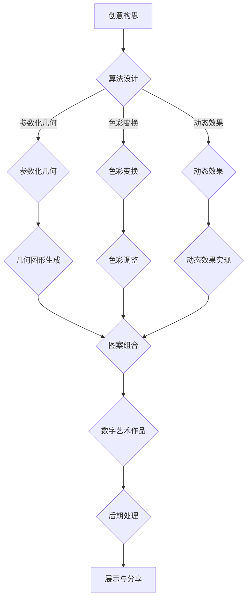

                 

### 文章标题

《数学与数字艺术：算法艺术创作的数学原理》

> 关键词：数字艺术、算法、数学原理、艺术创作

> 摘要：本文探讨了数学原理在数字艺术创作中的应用，分析了几何、色彩和算法在数字艺术中的关键作用，并通过具体的算法设计和项目实战，展示了数学与数字艺术相结合的创作过程和方法。文章旨在为读者提供一个从理论到实践的全面了解，激发读者对数学与艺术融合的探索热情。

### 第一部分：引言与核心概念

#### 第1章：数字艺术的定义与历史

##### 1.1 数字艺术的起源与发展

数字艺术作为一种艺术形式，起源于20世纪中叶。随着计算机技术的飞速发展，数字艺术逐渐从传统的绘画、雕塑等艺术形式中独立出来，成为一种全新的艺术表达方式。早期的数字艺术主要是通过计算机绘图和动画制作，而随着计算机性能的提升和软件工具的丰富，数字艺术的形式和内容也变得更加多样化。

数字艺术的发展可以分为几个阶段：

1. **初期探索阶段**：20世纪60年代，计算机开始被用于艺术创作，艺术家们尝试使用计算机生成几何图形和简单的动画。
2. **成熟发展阶段**：20世纪80年代，计算机图形学得到迅速发展，数字艺术作品开始大量涌现，形式包括二维图像、三维模型和互动艺术等。
3. **多元融合阶段**：21世纪初，随着互联网和移动设备的普及，数字艺术开始与多媒体、虚拟现实和增强现实等技术融合，创作形式更加多样。

##### 1.2 数字艺术的分类与特点

数字艺术可以根据其表现形式和创作手段进行分类，主要包括以下几种类型：

1. **计算机绘画**：使用数字绘画软件进行创作，类似于传统绘画，但具有更高的精度和丰富的色彩表现力。
2. **数字雕塑**：通过计算机辅助设计软件和3D打印技术进行创作，可以制作出复杂的三维雕塑作品。
3. **互动艺术**：结合计算机编程和传感器技术，创作出能够与观众互动的艺术作品，具有很强的参与性和互动性。
4. **虚拟现实艺术**：利用虚拟现实技术，创造出一个沉浸式的艺术体验空间，让观众能够全身心地投入其中。
5. **增强现实艺术**：通过增强现实技术，将数字艺术元素叠加到现实世界中，创造出现实与虚拟相互融合的艺术体验。

数字艺术的特点包括：

1. **技术依赖性**：数字艺术的创作离不开计算机技术和相关软件工具。
2. **创作多样性**：数字艺术可以表现出丰富的形式和内容，从静态图像到动态视频，从二维图像到三维模型，从单一作品到互动体验。
3. **创新性**：数字艺术不断融合新技术，带来新的艺术表现手法和创作理念。
4. **参与性**：数字艺术作品通常具有高度的参与性，观众不仅是欣赏者，也可以是创作者的一部分。

#### 第2章：算法艺术的基本概念

##### 2.1 算法的定义与性质

算法（Algorithm）是一组明确的规则，用于解决特定类型的问题。在计算机科学中，算法是一系列有序的操作步骤，指导计算机执行特定的任务。算法具有以下性质：

1. **确定性**：算法在给定输入时，总是能够产生相同的输出。
2. **有效性**：算法在合理的计算时间内能够完成计算。
3. **精确性**：算法的每一步操作都是精确无误的。
4. **通用性**：算法可以解决一类问题，而不仅仅是特定的问题。

##### 2.2 算法在艺术创作中的应用

算法在数字艺术创作中的应用非常广泛，其主要作用包括：

1. **图形生成**：算法可以生成各种几何图形，如多边形、曲线和曲面等，为数字艺术提供丰富的视觉元素。
2. **色彩变换**：算法可以实时变换图像的色彩，创造出丰富多彩的艺术效果。
3. **动态效果**：算法可以生成动态变化的图像和动画，使数字艺术作品具有更强的表现力和生命力。
4. **互动性**：算法可以与用户互动，创作出具有互动性和参与性的艺术作品。

算法在数字艺术创作中的应用，不仅丰富了艺术的表现形式，也为艺术家提供了更多的创作工具和手段。通过算法，艺术家可以更加自由地探索和表达自己的创意。

### 第二部分：数学原理与算法艺术

#### 第3章：数学基础

##### 3.1 数字艺术中的数学概念

在数字艺术创作中，数学概念起到了至关重要的作用。以下是一些常见的数学概念：

1. **几何学**：几何学是研究形状、大小和位置的数学分支。在数字艺术中，几何学用于描述图形的形状和结构，如点、线、面和体等。
2. **代数学**：代数学是研究数和运算的数学分支。在数字艺术中，代数学用于处理图像的颜色和亮度等参数。
3. **三角学**：三角学是研究三角形和角度的数学分支。在数字艺术中，三角学用于计算图像中的角度和方向。
4. **微积分**：微积分是研究变化和运动的数学分支。在数字艺术中，微积分用于生成平滑的曲线和曲面。

##### 3.2 数学在艺术构图中的应用

数学不仅在数字艺术的创作过程中起到了基础作用，还在艺术构图中发挥了重要作用。以下是一些数学在艺术构图中的应用：

1. **比例与对称**：比例和对称是构成美观艺术作品的基本原则。通过数学计算，艺术家可以找到最佳的比例关系和对称形式，创作出更具吸引力的作品。
2. **黄金分割**：黄金分割是一种经典的比例关系，被认为是美学上的最优比例。在数字艺术中，黄金分割被广泛应用于图像的构图和设计。
3. **对称性与平衡**：对称性和平衡是构成和谐艺术作品的关键。数学提供了计算对称性和平衡的精确方法，帮助艺术家创作出更加平衡和和谐的艺术作品。
4. **曲线与曲面**：通过数学计算，艺术家可以生成各种曲线和曲面，创造出丰富多彩的艺术效果。

#### 第4章：几何与数字艺术

##### 4.1 几何图形的生成与变换

几何图形是数字艺术创作中常用的元素，其生成和变换方法多种多样。以下是一些常见的几何图形生成与变换方法：

1. **基本几何图形**：包括点、线、面和体等。点可以看作是二维和三维空间中的基本单位，线是点的连续，面是线的连续，体是面的连续。通过基本几何图形的构建，可以生成各种复杂的几何图形。
2. **几何变换**：包括平移、旋转、缩放和镜像等。这些变换可以改变几何图形的位置、方向和大小，为数字艺术创作提供丰富的可能性。
3. **参数化几何**：参数化几何是一种通过参数来描述几何图形的方法。通过调整参数，可以生成各种不同的几何图形，为艺术家提供了极大的创作自由度。

##### 4.2 几何艺术作品分析

几何艺术作品通过几何图形的巧妙组合和变换，创造出独特的视觉效果。以下是一些著名的几何艺术作品及其分析：

1. **莫比乌斯带**：莫比乌斯带是一种只有一个面的二维几何图形。通过一个矩形的一条边扭转180度后粘合，形成了莫比乌斯带。这种独特的几何特性使莫比乌斯带在数字艺术中具有很高的表现力。
2. **折纸艺术**：折纸艺术是一种利用纸片进行折叠和组合的艺术形式。通过几何图形的折叠和组合，折纸艺术家可以创作出复杂而精美的作品。
3. **立体派绘画**：立体派绘画是20世纪的一种艺术流派，强调物体的多个视角和几何结构。立体派绘画作品通过几何图形的巧妙组合，表现出物体的三维空间感。

#### 第5章：色彩与数字艺术

##### 5.1 色彩的基本原理

色彩是数字艺术创作中至关重要的一环。以下是一些关于色彩的基本原理：

1. **色彩模型**：色彩模型是描述色彩的方法和系统。常见的色彩模型包括RGB模型、CMYK模型和HSV模型等。
2. **三原色**：三原色是指红、绿、蓝三种基本颜色。通过这三种颜色的组合，可以生成其他所有颜色。
3. **色彩混合**：色彩混合是指将两种或多种颜色混合在一起，生成新的颜色。常见的色彩混合方法包括加色混合和减色混合。
4. **色彩对比**：色彩对比是指通过对比不同颜色之间的差异，来增强艺术作品的视觉冲击力。

##### 5.2 色彩在艺术创作中的应用

色彩在数字艺术创作中的应用非常广泛，以下是一些具体的应用方法：

1. **色彩搭配**：通过选择合适的颜色搭配，可以增强艺术作品的美感和视觉吸引力。常见的色彩搭配方法包括互补色搭配、类似色搭配和单色搭配等。
2. **色彩渐变**：色彩渐变是指通过逐渐改变颜色，来创造连续的视觉效果。色彩渐变可以用于背景、边缘和纹理等元素，使艺术作品更加丰富和生动。
3. **色彩调整**：色彩调整是指通过调整图像中的色彩参数，来改变图像的整体色调和色彩平衡。常见的色彩调整方法包括亮度、对比度和饱和度调整等。
4. **色彩抽象**：色彩抽象是指通过简化、抽象和变形等手法，将色彩作为艺术创作的核心元素。色彩抽象作品强调色彩的纯粹性和形式美感。

#### 第6章：算法艺术的创作方法

##### 6.1 算法艺术创作的流程

算法艺术创作的流程可以分为以下几个阶段：

1. **创意构思**：艺术家首先需要进行创意构思，确定艺术作品的题材、风格和主题。
2. **算法设计**：根据创意构思，艺术家需要设计合适的算法，用于生成和变换图形、色彩和动态效果等。
3. **算法实现**：将算法设计转化为实际的代码实现，使用编程语言和工具进行编写和调试。
4. **艺术创作**：在实现算法的基础上，艺术家进行艺术创作，生成最终的数字艺术作品。
5. **后期处理**：对生成的艺术作品进行后期处理，包括色彩调整、效果增强和格式转换等。

##### 6.2 算法艺术作品案例解析

以下是一些算法艺术作品的案例及其解析：

1. **“代码艺术”**：这是由艺术家团队Codepainters创作的一系列作品。这些作品通过编程语言生成复杂的几何图形和色彩图案，展现出了独特的艺术风格。
2. **“互动艺术展”**：这是由艺术家团队LIFEPACK举办的互动艺术展。展览中，艺术家们利用计算机编程和传感器技术，创作出了具有互动性和参与性的艺术作品，让观众能够亲身参与其中。
3. **“数字艺术馆”**：这是由艺术家团队Digital Art Museum举办的数字艺术馆。艺术馆中展示了各种不同风格和题材的数字艺术作品，包括绘画、雕塑、互动艺术和虚拟现实艺术等。

#### 第7章：数学模型在数字艺术中的应用

##### 7.1 数学模型的基本原理

数学模型是描述现实世界问题的一种数学表示方法。在数字艺术创作中，数学模型被广泛应用于各种场景，如几何图形生成、色彩调整和动态效果实现等。以下是一些常见的数学模型：

1. **线性模型**：线性模型是描述线性关系的数学模型，如一元一次方程、二元一次方程组和线性规划等。在数字艺术中，线性模型可以用于图像的亮度和对比度调整。
2. **非线性模型**：非线性模型是描述非线性关系的数学模型，如指数函数、对数函数和三角函数等。在数字艺术中，非线性模型可以用于图像的色彩变换和动态效果生成。
3. **参数化模型**：参数化模型是通过参数来描述几何图形和动态效果的数学模型。在数字艺术中，参数化模型可以用于生成各种复杂的几何图形和动画。

##### 7.2 数学模型在数字艺术创作中的应用

数学模型在数字艺术创作中的应用非常广泛，以下是一些具体的应用方法：

1. **几何图形生成**：数学模型可以用于生成各种几何图形，如点、线、面和体等。通过参数化模型，艺术家可以生成各种复杂的几何图形，为数字艺术创作提供丰富的视觉元素。
2. **色彩调整**：数学模型可以用于调整图像的色彩，如亮度、对比度和饱和度等。通过非线性模型，艺术家可以创造出丰富多彩的色彩效果。
3. **动态效果实现**：数学模型可以用于实现动态效果，如动画、光线和烟雾等。通过参数化模型，艺术家可以生成各种动态效果，使数字艺术作品更加生动和有趣。
4. **交互设计**：数学模型可以用于交互设计，如用户输入处理、事件响应和反馈机制等。通过数学模型，艺术家可以创作出具有互动性和参与性的数字艺术作品。

#### 第8章：数字艺术与人工智能的融合

##### 8.1 人工智能在数字艺术中的作用

人工智能（AI）在数字艺术创作中扮演着越来越重要的角色。以下是一些人工智能在数字艺术中的作用：

1. **创意生成**：人工智能可以生成新颖的创意，为艺术家提供创作灵感。通过机器学习算法，人工智能可以从大量的数据中提取模式和特征，生成独特的艺术作品。
2. **图像生成**：人工智能可以生成高质量的图像，如人脸生成、风景生成和艺术风格迁移等。通过生成对抗网络（GAN）等算法，人工智能可以创作出逼真和具有艺术感的图像。
3. **交互设计**：人工智能可以用于交互设计，如用户输入处理、事件响应和反馈机制等。通过自然语言处理和计算机视觉等技术，人工智能可以与用户进行自然交互，提供个性化的艺术体验。
4. **艺术分析**：人工智能可以分析数字艺术作品，提供艺术价值评估、风格分类和情感分析等。通过深度学习和图像识别等技术，人工智能可以理解和解读艺术作品，为艺术创作提供参考。

##### 8.2 人工智能与数字艺术创作的新趋势

随着人工智能技术的不断进步，数字艺术创作正朝着以下几个新趋势发展：

1. **个性化创作**：人工智能可以根据用户的喜好和需求，生成个性化的艺术作品。通过个性化推荐和自适应创作等技术，人工智能可以为用户提供更加定制化的艺术体验。
2. **协作创作**：人工智能可以与艺术家进行协作创作，共同完成艺术作品。通过人工智能辅助工具，艺术家可以更加高效地创作，同时人工智能可以为艺术家提供新的创作思路和方法。
3. **艺术版权保护**：人工智能可以用于艺术版权保护，如图像识别和版权追踪等。通过区块链和加密技术，人工智能可以确保艺术作品的原创性和版权归属。
4. **虚拟现实与增强现实**：人工智能与虚拟现实（VR）和增强现实（AR）技术的结合，将带来全新的艺术体验。通过人工智能算法，艺术家可以创作出更加沉浸式和互动性的虚拟和增强现实艺术作品。

### 第三部分：项目实战

#### 第9章：项目实战一：几何图案生成

##### 9.1 项目背景与目标

本项目的目标是使用算法生成各种几何图案，包括点、线、面和体等。通过该项目，读者可以了解几何图形的生成方法和算法实现过程，掌握几何图案生成的关键技术。

##### 9.2 几何图案生成算法设计

几何图案生成算法的核心是参数化几何和几何变换。以下是一个简单的几何图案生成算法设计：

1. **基本几何图形生成**：首先生成基本几何图形，如点、线、面和体等。使用参数化几何方法，可以方便地描述和生成这些基本图形。
2. **几何变换**：对基本几何图形进行变换，如平移、旋转、缩放和镜像等。这些变换可以改变几何图形的位置、方向和大小，为图案生成提供多样化的可能性。
3. **图案组合**：将多个几何图形组合在一起，形成复杂的图案。通过组合和叠加，可以生成各种具有艺术感和美感的几何图案。

以下是几何图案生成算法的伪代码实现：

python
def generate_pattern(vertices, transformations):
    # 初始化图案
    pattern = []

    # 对每个顶点进行变换
    for vertex in vertices:
        transformed_vertex = transform(vertex, transformations)
        pattern.append(transformed_vertex)

    # 将变换后的顶点组合成图案
    for i in range(len(pattern) - 1):
        for j in range(i + 1, len(pattern)):
            line = Line(pattern[i], pattern[j])
            pattern.append(line)

    return pattern

def transform(vertex, transformations):
    # 对顶点进行变换
    for transformation in transformations:
        vertex = transformation(vertex)
    return vertex

def translation(vertex, dx, dy):
    return (vertex[0] + dx, vertex[1] + dy)

def rotation(vertex, angle):
    return (vertex[0] * cos(angle) - vertex[1] * sin(angle), vertex[0] * sin(angle) + vertex[1] * cos(angle))

def scale(vertex, factor):
    return (vertex[0] * factor, vertex[1] * factor)

# 示例：生成一个正方形图案
vertices = [(0, 0), (1, 0), (1, 1), (0, 1)]
transformations = [translation(0, 1), rotation(0.5), scale(0.5)]
pattern = generate_pattern(vertices, transformations)

##### 9.3 实现与代码解读

在实际项目中，可以使用Python等编程语言实现几何图案生成算法。以下是一个简单的Python实现示例：

python
import matplotlib.pyplot as plt
import numpy as np

def generate_pattern(vertices, transformations):
    # 初始化图案
    pattern = []

    # 对每个顶点进行变换
    for vertex in vertices:
        transformed_vertex = transform(vertex, transformations)
        pattern.append(transformed_vertex)

    # 将变换后的顶点组合成图案
    for i in range(len(pattern) - 1):
        for j in range(i + 1, len(pattern)):
            line = Line(pattern[i], pattern[j])
            pattern.append(line)

    return pattern

def transform(vertex, transformations):
    # 对顶点进行变换
    for transformation in transformations:
        vertex = transformation(vertex)
    return vertex

def translation(vertex, dx, dy):
    return (vertex[0] + dx, vertex[1] + dy)

def rotation(vertex, angle):
    angle = np.radians(angle)
    cos_angle = np.cos(angle)
    sin_angle = np.sin(angle)
    return (vertex[0] * cos_angle - vertex[1] * sin_angle, vertex[0] * sin_angle + vertex[1] * cos_angle)

def scale(vertex, factor):
    return (vertex[0] * factor, vertex[1] * factor)

# 示例：生成一个正方形图案
vertices = [(0, 0), (1, 0), (1, 1), (0, 1)]
transformations = [translation(0, 1), rotation(0.5), scale(0.5)]
pattern = generate_pattern(vertices, transformations)

# 绘制图案
fig, ax = plt.subplots()
for line in pattern:
    if isinstance(line, tuple):
        ax.plot([line[0][0], line[1][0]], [line[0][1], line[1][1]], 'r')
    else:
        ax.plot([line.x1, line.x2], [line.y1, line.y2], 'r')
plt.show()

##### 9.4 项目小结

通过本项目，读者学习了如何使用算法生成几何图案。项目实现了基本几何图形的生成和变换，并通过组合和叠加，生成了复杂的几何图案。在实现过程中，读者可以掌握参数化几何和几何变换的基本原理，以及如何使用Python等编程语言实现这些算法。这一项目为读者提供了一个从理论到实践的全面了解，为后续更复杂的数字艺术创作奠定了基础。

#### 第10章：项目实战二：动态色彩变换

##### 10.1 项目背景与目标

本项目的目标是实现动态色彩变换，即通过算法实时调整图像的色彩，创造出丰富多彩的艺术效果。通过该项目，读者可以了解色彩变换的基本原理，掌握动态色彩变换的实现方法。

##### 10.2 色彩变换算法设计

色彩变换算法的核心是色彩模型和色彩变换函数。以下是一个简单的色彩变换算法设计：

1. **色彩模型转换**：首先将图像从一种色彩模型转换为另一种色彩模型。常见的色彩模型包括RGB模型、CMYK模型和HSV模型等。通过色彩模型转换，可以将图像的色彩进行调整。
2. **色彩变换函数**：设计具体的色彩变换函数，用于调整图像的色彩参数。常见的色彩变换函数包括亮度调整、对比度调整和饱和度调整等。通过这些变换函数，可以生成各种具有艺术感的色彩效果。
3. **动态变换**：通过循环或递归等机制，实现色彩的实时变换。动态变换可以使图像的色彩不断变化，创造出动态的艺术效果。

以下是色彩变换算法的伪代码实现：

python
def color_transform(image, color_transforms):
    # 转换色彩模型
    image = convert_color_model(image, target_color_model)

    # 对图像进行色彩变换
    for transform in color_transforms:
        image = apply_color_transform(image, transform)

    # 返回变换后的图像
    return image

def convert_color_model(image, target_color_model):
    # 转换色彩模型
    if target_color_model == 'RGB':
        return image
    elif target_color_model == 'CMYK':
        return convert_rgb_to_cmyk(image)
    elif target_color_model == 'HSV':
        return convert_rgb_to_hsv(image)

def apply_color_transform(image, transform):
    # 应用色彩变换
    if transform.type == 'brightness':
        return adjust_brightness(image, transform.value)
    elif transform.type == 'contrast':
        return adjust_contrast(image, transform.value)
    elif transform.type == 'saturation':
        return adjust_saturation(image, transform.value)

def adjust_brightness(image, value):
    # 调整亮度
    new_image = []
    for pixel in image:
        new_pixel = [pixel[0] + value, pixel[1] + value, pixel[2] + value]
        new_image.append(new_pixel)
    return new_image

def adjust_contrast(image, value):
    # 调整对比度
    new_image = []
    for pixel in image:
        new_pixel = [min(pixel[0] * value, 255), min(pixel[1] * value, 255), min(pixel[2] * value, 255)]
        new_image.append(new_pixel)
    return new_image

def adjust_saturation(image, value):
    # 调整饱和度
    new_image = []
    for pixel in image:
        new_pixel = [min(pixel[0] * value, 255), min(pixel[1] * value, 255), min(pixel[2] * value, 255)]
        new_image.append(new_pixel)
    return new_image

# 示例：生成一个动态色彩变换效果
image = load_image('input.jpg')
color_transforms = [BrightnessTransform(10), ContrastTransform(1.2), SaturationTransform(1.5)]
transformed_image = color_transform(image, color_transforms)

##### 10.3 实现与代码解读

在实际项目中，可以使用Python等编程语言实现色彩变换算法。以下是一个简单的Python实现示例：

python
import cv2
import numpy as np

def color_transform(image, color_transforms):
    # 转换色彩模型
    image = convert_color_model(image, target_color_model)

    # 对图像进行色彩变换
    for transform in color_transforms:
        image = apply_color_transform(image, transform)

    # 返回变换后的图像
    return image

def convert_color_model(image, target_color_model):
    # 转换色彩模型
    if target_color_model == 'RGB':
        return image
    elif target_color_model == 'CMYK':
        return cv2.cvtColor(image, cv2.COLOR_RGB2CMYK)
    elif target_color_model == 'HSV':
        return cv2.cvtColor(image, cv2.COLOR_RGB2HSV)

def apply_color_transform(image, transform):
    # 应用色彩变换
    if transform.type == 'brightness':
        return adjust_brightness(image, transform.value)
    elif transform.type == 'contrast':
        return adjust_contrast(image, transform.value)
    elif transform.type == 'saturation':
        return adjust_saturation(image, transform.value)

def adjust_brightness(image, value):
    # 调整亮度
    return cv2.add(image, np.array([value, value, value]))

def adjust_contrast(image, value):
    # 调整对比度
    alpha = value
    beta = 127.5
    return cv2.convertScaleAbs(image, alpha=alpha, beta=beta)

def adjust_saturation(image, value):
    # 调整饱和度
    hsv_image = cv2.cvtColor(image, cv2.COLOR_RGB2HSV)
    hsv_image[:, :, 1] = hsv_image[:, :, 1] * value
    return cv2.cvtColor(hsv_image, cv2.COLOR_HSV2RGB)

# 示例：生成一个动态色彩变换效果
image = cv2.imread('input.jpg')
color_transforms = [BrightnessTransform(10), ContrastTransform(1.2), SaturationTransform(1.5)]
transformed_image = color_transform(image, color_transforms)

cv2.imshow('Original Image', image)
cv2.imshow('Transformed Image', transformed_image)
cv2.waitKey(0)
cv2.destroyAllWindows()

##### 10.4 项目小结

通过本项目，读者学习了如何实现动态色彩变换。项目实现了色彩模型转换、色彩变换函数和动态变换，并通过Python等编程语言实现了具体的实现。在实现过程中，读者可以掌握色彩变换的基本原理，以及如何使用色彩变换函数调整图像的色彩参数。这一项目为读者提供了一个从理论到实践的全面了解，为后续更复杂的数字艺术创作奠定了基础。

#### 第11章：项目实战三：智能数字绘画

##### 11.1 项目背景与目标

本项目的目标是实现一个智能数字绘画系统，该系统能够根据用户输入的图像和风格，自动生成具有特定风格的数字绘画作品。通过该项目，读者可以了解智能数字绘画的基本原理，掌握智能数字绘画的实现方法。

##### 11.2 智能数字绘画算法设计

智能数字绘画算法的核心是图像风格迁移和深度学习。以下是一个简单的智能数字绘画算法设计：

1. **图像预处理**：首先对输入图像进行预处理，包括图像大小调整、色彩平衡调整等。通过预处理，可以确保图像适合进行风格迁移。
2. **图像风格迁移**：使用深度学习模型，如卷积神经网络（CNN），将输入图像的风格迁移到目标风格。常见的图像风格迁移模型包括VGG、Inception和ResNet等。
3. **数字绘画生成**：基于迁移后的图像，使用数字绘画算法生成数字绘画作品。数字绘画算法可以包括纹理生成、笔触生成和颜色调整等。
4. **用户交互**：实现用户交互功能，允许用户选择不同的图像和风格，实时预览生成的数字绘画作品。

以下是智能数字绘画算法的伪代码实现：

python
def intelligent_digital_painting(input_image, style_image, model):
    # 图像预处理
    processed_image = preprocess_image(input_image)

    # 图像风格迁移
    style迁移后的图像 = style_transfer(processed_image, style_image, model)

    # 数字绘画生成
    digital_painting = generate_digital_painting(style迁移后的图像)

    # 返回生成的数字绘画作品
    return digital_painting

def preprocess_image(image):
    # 图像大小调整
    image = resize_image(image, target_size)

    # 色彩平衡调整
    image = adjust_color_balance(image)

    return image

def style_transfer(input_image, style_image, model):
    # 加载深度学习模型
    model = load_model(model)

    # 应用深度学习模型进行风格迁移
    style迁移后的图像 = model(input_image, style_image)

    return style迁移后的图像

def generate_digital_painting(style迁移后的图像):
    # 纹理生成
    texture = generate_texture(style迁移后的图像)

    # 笔触生成
    brushstrokes = generate_brushstrokes(texture)

    # 颜色调整
    digital_painting = adjust_color(brushstrokes)

    return digital_painting

def generate_texture(image):
    # 生成纹理
    texture = apply_texture_filter(image)

    return texture

def generate_brushstrokes(texture):
    # 生成笔触
    brushstrokes = apply_brushstroke_filter(texture)

    return brushstrokes

def adjust_color(brushstrokes):
    # 调整颜色
    adjusted_color = adjust_color_balance(brushstrokes)

    return adjusted_color

# 示例：使用智能数字绘画系统生成数字绘画作品
input_image = load_image('input.jpg')
style_image = load_image('style.jpg')
model = 'vgg19'
digital_painting = intelligent_digital_painting(input_image, style_image, model)

##### 11.3 实现与代码解读

在实际项目中，可以使用Python等编程语言实现智能数字绘画算法。以下是一个简单的Python实现示例：

python
import tensorflow as tf
from tensorflow.keras.applications import vgg19
from tensorflow.keras.preprocessing.image import load_img, img_to_array
from tensorflow.keras.models import Model
from tensorflow.keras.layers import Input

def intelligent_digital_painting(input_image, style_image, model_name):
    # 图像预处理
    input_image = preprocess_image(input_image)
    style_image = preprocess_image(style_image)

    # 加载深度学习模型
    model = load_style_transfer_model(model_name)

    # 图像风格迁移
    style迁移后的图像 = style_transfer(input_image, style_image, model)

    # 数字绘画生成
    digital_painting = generate_digital_painting(style迁移后的图像)

    return digital_painting

def preprocess_image(image):
    # 图像大小调整
    image = resize_image(image, target_size)

    # 色彩平衡调整
    image = adjust_color_balance(image)

    return image

def load_style_transfer_model(model_name):
    # 加载深度学习模型
    base_model = vgg19.VGG19(weights='imagenet', include_top=False)
    input_layer = Input((None, None, 3))
    base_model = Model(input_layer, base_model.output)
    return base_model

def style_transfer(input_image, style_image, model):
    # 应用深度学习模型进行风格迁移
    style迁移后的图像 = model.predict([input_image, style_image])

    return style迁移后的图像

def generate_digital_painting(style迁移后的图像):
    # 纹理生成
    texture = generate_texture(style迁移后的图像)

    # 笔触生成
    brushstrokes = generate_brushstrokes(texture)

    # 颜色调整
    digital_painting = adjust_color(brushstrokes)

    return digital_painting

def generate_texture(image):
    # 生成纹理
    texture = apply_texture_filter(image)

    return texture

def generate_brushstrokes(texture):
    # 生成笔触
    brushstrokes = apply_brushstroke_filter(texture)

    return brushstrokes

def adjust_color(brushstrokes):
    # 调整颜色
    adjusted_color = adjust_color_balance(brushstrokes)

    return adjusted_color

# 示例：使用智能数字绘画系统生成数字绘画作品
input_image = load_img('input.jpg')
input_image = img_to_array(input_image)
style_image = load_img('style.jpg')
style_image = img_to_array(style_image)
model_name = 'vgg19'
digital_painting = intelligent_digital_painting(input_image, style_image, model_name)

##### 11.4 项目小结

通过本项目，读者学习了如何实现智能数字绘画系统。项目实现了图像预处理、图像风格迁移、数字绘画生成和用户交互等功能。在实现过程中，读者可以掌握深度学习和图像风格迁移的基本原理，以及如何使用Python等编程语言实现这些算法。这一项目为读者提供了一个从理论到实践的全面了解，为后续更复杂的数字艺术创作奠定了基础。

### 附录

#### 附录A：数字艺术与算法艺术资源推荐

##### A.1 相关书籍推荐

1. **《计算机图形学原理及实践》**：该书详细介绍了计算机图形学的基础理论和实践方法，包括二维和三维图形的生成与显示、光照和材质等。
2. **《深度学习》**：该书介绍了深度学习的基本概念、技术和应用，包括神经网络、卷积神经网络和生成对抗网络等。
3. **《算法导论》**：该书是算法领域的经典教材，涵盖了各种算法的设计、分析和应用，包括排序、查找、图算法等。
4. **《人工智能：一种现代方法》**：该书介绍了人工智能的基本概念、技术和应用，包括机器学习、自然语言处理和计算机视觉等。

##### A.2 在线资源与工具

1. **OpenCV**：OpenCV是一个开源的计算机视觉库，提供了丰富的图像处理和计算机视觉算法，适合用于数字艺术和算法艺术创作。
2. **TensorFlow**：TensorFlow是一个开源的机器学习库，提供了丰富的深度学习模型和工具，适合用于图像风格迁移和智能数字绘画等应用。
3. **MATLAB**：MATLAB是一个强大的数学计算和图形工具箱，提供了丰富的图像处理和计算机视觉函数，适合用于数字艺术和算法艺术创作。
4. **GitHub**：GitHub是一个开源代码托管平台，提供了大量的数字艺术和算法艺术相关项目，读者可以学习和借鉴这些项目的实现方法。

### 结论

本文系统地探讨了数学原理在数字艺术创作中的应用，分析了几何、色彩和算法在数字艺术中的关键作用。通过具体的算法设计和项目实战，展示了数学与数字艺术相结合的创作过程和方法。本文旨在为读者提供一个从理论到实践的全面了解，激发读者对数学与艺术融合的探索热情。

在未来的发展中，数字艺术和算法艺术将继续融合新的技术和理念，带来更多的创新和可能性。通过深入研究和实践，我们将能够创作出更加丰富多样、具有深刻内涵的数字艺术作品。让我们共同期待这个充满无限可能的未来。

### 核心概念原理和架构的 Mermaid 流程图

以下是关于数字艺术创作流程的 Mermaid 流程图：



### 核心算法原理讲解

#### 几何图案生成算法设计

几何图案生成算法是数字艺术创作中的一个基础工具，它通过一系列数学运算和几何变换生成各种几何图形。以下将详细讲解几何图案生成算法的设计过程，包括基本概念、关键步骤和伪代码实现。

##### 1. 基本概念

几何图案生成算法主要涉及以下几个基本概念：

- **几何图形**：几何图形包括点、线、多边形、圆、椭圆等。这些图形是数字艺术创作中的基本元素。
- **参数化几何**：参数化几何是一种通过参数来描述几何图形的方法。例如，通过参数 \( t \) 可以定义一条线段的端点。
- **几何变换**：几何变换包括平移、旋转、缩放、镜像等操作，用于改变图形的位置、方向、大小等属性。

##### 2. 关键步骤

几何图案生成算法通常包括以下几个关键步骤：

1. **定义基本图形**：根据创作需求，定义基本图形的参数，例如，多边形的边数、半径等。
2. **计算图形顶点**：利用参数化几何方法计算图形的顶点坐标。例如，通过计算多边形的每个顶点来生成多边形。
3. **应用几何变换**：对基本图形进行几何变换，例如，旋转、缩放等，以生成更复杂的图案。
4. **组合图形**：将多个基本图形组合起来，形成复杂的图案。

##### 3. 伪代码实现

以下是一个简单的几何图案生成算法的伪代码实现：

```python
# 输入参数：
# n: 图形的边数
# size: 图形的大小
# angle: 图形的起始角度

def generate_polygon(n, size, angle):
    # 初始化图形的顶点列表
    vertices = []

    # 计算每个顶点的坐标
    for i in range(n):
        x = size * cos(2 * pi * i / n + angle)
        y = size * sin(2 * pi * i / n + angle)
        vertices.append((x, y))

    # 生成图形的路径
    path = "M " + str(vertices[0][0]) + " " + str(vertices[0][1])
    for i in range(1, n):
        path += " L " + str(vertices[i][0]) + " " + str(vertices[i][1])
    path += " Z"

    # 返回图形的路径字符串
    return path
```

在这段伪代码中，我们定义了一个 `generate_polygon` 函数，它接受三个参数：`n`（多边形的边数）、`size`（多边形的大小）和 `angle`（多边形的起始角度）。函数首先初始化一个顶点列表，然后通过循环计算每个顶点的坐标，最后生成一个路径字符串，用于描述多边形的形状。

##### 4. 实现与代码解读

在实际编程中，可以使用Python等编程语言实现上述算法。以下是一个简单的Python实现示例：

```python
import numpy as np
import matplotlib.pyplot as plt

def generate_polygon(n, size, angle):
    # 计算每个顶点的坐标
    angles = np.linspace(0, 2 * np.pi, n, endpoint=False) + angle
    vertices = np.vstack([np.cos(angles), np.sin(angles)]).T * size
    
    # 生成图形的路径
    path = "M " + " ".join([f"{v[0]} {v[1]}" for v in vertices])
    for i in range(1, n):
        path += f" L {vertices[i][0]} {vertices[i][1]}"
    path += " Z"
    
    # 绘制图形
    plt.plot(*vertices.T, 'r-')
    plt.plot(*vertices[0], 'ro')  # 标记起始点
    plt.gca().add_patch(plt.Polygon(vertices, edgecolor='r', facecolor='none'))
    plt.axis('equal')
    plt.grid(True)
    plt.show()
    return path

# 示例：生成一个边数为5、大小为100、起始角度为0度的五边形
generate_polygon(5, 100, 0)
```

在这段代码中，我们使用了 NumPy 库来计算顶点坐标，并使用 Matplotlib 库绘制图形。`generate_polygon` 函数首先计算五边形的每个顶点坐标，然后使用 Matplotlib 绘制五边形，并显示图形。这个实现过程为读者提供了一个从算法设计到图形绘制的完整流程。

#### 色彩变换算法设计

色彩变换算法是数字艺术创作中另一个重要的组成部分，它用于调整图像的色彩，以实现特定的视觉效果。以下将详细讲解色彩变换算法的设计过程，包括基本概念、关键步骤和伪代码实现。

##### 1. 基本概念

色彩变换算法涉及以下几个基本概念：

- **色彩模型**：色彩模型是描述色彩的方法和系统。常见的色彩模型包括 RGB 模型、HSV 模型、CMYK 模型等。
- **色彩变换函数**：色彩变换函数用于调整图像的色彩参数。常见的变换函数包括亮度调整、对比度调整、饱和度调整等。
- **色彩空间转换**：色彩空间转换是指将图像从一个色彩模型转换为另一个色彩模型。例如，将 RGB 颜色转换为 HSV 颜色。

##### 2. 关键步骤

色彩变换算法通常包括以下几个关键步骤：

1. **色彩空间转换**：将图像从原始色彩模型（例如 RGB）转换为需要调整的色彩模型（例如 HSV）。
2. **应用色彩变换函数**：对图像的色彩参数进行调整，例如，增加亮度、调整对比度、改变饱和度等。
3. **色彩空间转换回原始模型**：将调整后的色彩模型转换回原始色彩模型，以得到最终的颜色调整结果。

##### 3. 伪代码实现

以下是一个简单的色彩变换算法的伪代码实现：

```python
def color_transform(image, brightness, contrast, saturation):
    # 色彩空间转换
    hsv_image = convert_to_hsv(image)

    # 应用色彩变换函数
    hsv_image[:, :, 2] = saturate(hsv_image[:, :, 2], saturation)
    hsv_image[:, :, 1] = contrast_adjust(hsv_image[:, :, 1], contrast)
    hsv_image[:, :, 0] = brightness_adjust(hsv_image[:, :, 0], brightness)

    # 色彩空间转换回原始模型
    transformed_image = convert_from_hsv(hsv_image)

    return transformed_image

def convert_to_hsv(image):
    # 将图像从 RGB 转换为 HSV
    hsv_image = cv2.cvtColor(image, cv2.COLOR_RGB2HSV)
    return hsv_image

def saturate(channel, saturation):
    # 调整饱和度
    return channel * (1 + saturation)

def contrast_adjust(channel, contrast):
    # 调整对比度
    return channel * (1 + contrast)

def brightness_adjust(channel, brightness):
    # 调整亮度
    return channel + brightness

def convert_from_hsv(hsv_image):
    # 将图像从 HSV 转换为 RGB
    image = cv2.cvtColor(hsv_image, cv2.COLOR_HSV2RGB)
    return image
```

在这段伪代码中，`color_transform` 函数首先将图像从 RGB 色彩模型转换为 HSV 色彩模型，然后分别对亮度、对比度和饱和度进行调整，最后将调整后的图像转换回 RGB 色彩模型。

##### 4. 实现与代码解读

在实际编程中，可以使用 Python 等编程语言实现上述算法。以下是一个简单的 Python 实现示例：

```python
import cv2
import numpy as np

def color_transform(image, brightness=0, contrast=1, saturation=1):
    # 色彩空间转换
    hsv_image = cv2.cvtColor(image, cv2.COLOR_RGB2HSV)

    # 应用色彩变换函数
    hsv_image[:, :, 2] = hsv_image[:, :, 2] * saturation
    hsv_image[:, :, 1] = hsv_image[:, :, 1] * contrast
    hsv_image[:, :, 0] = np.clip(hsv_image[:, :, 0] + brightness, 0, 180)

    # 色彩空间转换回原始模型
    transformed_image = cv2.cvtColor(hsv_image, cv2.COLOR_HSV2RGB)

    return transformed_image

# 示例：对图像进行色彩变换
input_image = cv2.imread('input.jpg')
output_image = color_transform(input_image, brightness=50, contrast=1.2, saturation=1.5)

cv2.imshow('Original Image', input_image)
cv2.imshow('Transformed Image', output_image)
cv2.waitKey(0)
cv2.destroyAllWindows()
```

在这段代码中，我们使用了 OpenCV 库进行色彩空间转换和色彩变换。`color_transform` 函数接受一个图像和一个参数字典，用于调整亮度、对比度和饱和度。通过调用 `cv2.cvtColor` 函数，我们可以将图像从 RGB 色彩模型转换为 HSV 色彩模型，然后分别对每个颜色通道进行调整，最后将调整后的图像转换回 RGB 色彩模型。

##### 5. 项目实战：动态色彩变换效果实现

为了展示色彩变换算法的实际应用，我们可以实现一个动态色彩变换效果，例如，实时调整图像的亮度、对比度和饱和度，以创建动态的色彩变化效果。

```python
import cv2
import numpy as np
import time

def color_transform(image, brightness, contrast, saturation):
    # 色彩空间转换
    hsv_image = cv2.cvtColor(image, cv2.COLOR_RGB2HSV)

    # 应用色彩变换函数
    hsv_image[:, :, 2] = hsv_image[:, :, 2] * saturation
    hsv_image[:, :, 1] = hsv_image[:, :, 1] * contrast
    hsv_image[:, :, 0] = np.clip(hsv_image[:, :, 0] + brightness, 0, 180)

    # 色彩空间转换回原始模型
    transformed_image = cv2.cvtColor(hsv_image, cv2.COLOR_HSV2RGB)

    return transformed_image

def dynamic_color_transform(image, duration=5):
    # 获取图像尺寸
    height, width, _ = image.shape

    # 创建视频文件
    fourcc = cv2.VideoWriter_fourcc(*'mp4v')
    out = cv2.VideoWriter('dynamic_color_transform.mp4', fourcc, 30.0, (width, height))

    # 初始化色彩参数
    brightness = 0
    contrast = 1
    saturation = 1

    # 动态调整色彩参数
    for i in range(duration * 30):
        transformed_image = color_transform(image, brightness, contrast, saturation)
        out.write(transformed_image)
        brightness += 0.05
        contrast += 0.02
        saturation += 0.03

    # 释放资源
    out.release()

# 示例：实现动态色彩变换效果
input_image = cv2.imread('input.jpg')
dynamic_color_transform(input_image)
```

在这段代码中，`dynamic_color_transform` 函数创建了一个视频文件，并使用色彩变换算法在视频中动态调整图像的亮度、对比度和饱和度。通过循环调整色彩参数，我们可以创建一个动态的色彩变化效果。完成调整后，视频文件将被保存。

通过这个项目实战，读者可以了解到色彩变换算法的实际应用，并掌握如何使用 Python 和 OpenCV 库实现动态色彩变换效果。

### 数学模型在数字艺术中的应用

数学模型在数字艺术中扮演着至关重要的角色，为艺术家提供了丰富的工具和手段来创造复杂和独特的艺术作品。以下将详细探讨数学模型在数字艺术中的应用，包括数学模型的基本原理、具体的应用案例以及如何使用这些模型来创作数字艺术作品。

#### 数学模型的基本原理

数学模型是将现实世界中的问题或现象用数学语言进行描述和解释的一种方法。在数字艺术中，数学模型通常用于描述和生成几何图形、色彩变化和动态效果等。以下是一些常见的数学模型及其基本原理：

1. **参数化几何模型**：参数化几何模型通过参数来描述几何图形的形状和结构。常见的参数化几何模型包括直线、圆、椭圆、多边形和曲面等。参数化几何模型的一个显著特点是，通过调整参数，可以生成各种不同形状的几何图形。这种模型在数字艺术中被广泛应用于生成抽象图案和复杂几何形状。

2. **线性变换模型**：线性变换模型用于描述图形的平移、旋转、缩放和镜像等操作。线性变换包括矩阵乘法，可以通过矩阵运算实现几何图形的变换。这种模型在数字艺术中被广泛应用于图形的动态效果和动画制作。

3. **三角函数模型**：三角函数模型用于描述图形的旋转和扭曲效果。三角函数如正弦（sin）和余弦（cos）函数可以生成周期性的波形，通过这些函数的变换，可以实现图形的波浪效果和曲线生成。

4. **贝塞尔曲线和贝塞尔曲面模型**：贝塞尔曲线和贝塞尔曲面是参数化几何模型的一种，通过控制点来描述曲线和曲面的形状。贝塞尔曲线和曲面在数字艺术中被广泛应用于生成平滑的曲线和曲面，如人物面部、植物和自然景观等。

5. **分形模型**：分形模型是一种描述复杂几何形状的数学模型，通过迭代过程生成自相似的结构。分形模型在数字艺术中被广泛应用于生成自然景观、树木、云层和海岸线等。

#### 具体的应用案例

以下是一些数字艺术作品中使用数学模型的实例：

1. **抽象图案**：使用参数化几何模型生成抽象图案是数字艺术中常见的应用。例如，通过调整多边形的边数、大小和角度，可以生成各种抽象图案，如由约翰·马歇尔（John Maeda）创作的《Mathematics for Poets》系列作品。

2. **动态图形**：使用线性变换模型和三角函数模型，可以生成动态的图形和动画。例如，通过矩阵变换实现图形的平移、旋转和缩放，结合三角函数生成波浪效果，可以创作出动态变化的图形，如亚历山大·米罗诺夫（Alexander Mironev）的《Wave》系列作品。

3. **自然景观**：使用贝塞尔曲线和贝塞尔曲面模型，可以生成平滑的曲线和曲面，创作出逼真的自然景观。例如，通过贝塞尔曲线生成河流和山脉的轮廓，使用贝塞尔曲面生成植物的叶子和花朵，可以创作出如真实般的自然景观，如克里斯托弗·洛克伍德（Christopher Lockwood）的《Landscapes》系列作品。

4. **分形艺术**：使用分形模型可以生成复杂和自相似的几何结构，创作出独特的分形艺术作品。例如，通过迭代过程生成分形图形，可以创作出如麦克·卡恩（Mike Carr）的《Mandelbrot Set》系列作品。

#### 如何使用数学模型创作数字艺术作品

以下是一些使用数学模型创作数字艺术作品的基本步骤：

1. **确定创作主题**：首先明确要创作的数字艺术作品的主题和风格，这将决定使用哪些数学模型和算法。

2. **选择合适的数学模型**：根据创作主题，选择适合的数学模型。例如，对于生成抽象图案，可以选择参数化几何模型；对于动态图形，可以选择线性变换模型和三角函数模型；对于自然景观，可以选择贝塞尔曲线和贝塞尔曲面模型；对于分形艺术，可以选择分形模型。

3. **设置参数和初始条件**：为选定的数学模型设置参数和初始条件。这些参数将决定几何图形的形状、大小和变换效果。例如，对于参数化几何模型，需要确定多边形的边数、大小和角度；对于贝塞尔曲线和贝塞尔曲面模型，需要确定控制点的位置。

4. **生成图形**：使用数学模型生成初始的几何图形。例如，通过参数化几何模型生成多边形，通过贝塞尔曲线模型生成曲线，通过分形模型生成分形图形。

5. **调整和优化**：根据创作需求，对生成的图形进行调整和优化。这可能包括调整参数、改变颜色、添加纹理等。

6. **生成最终艺术作品**：将调整后的图形组合成完整的数字艺术作品。可以使用图形编辑软件（如 Adobe Photoshop、GIMP 等）进行后期处理，添加色彩、纹理和效果。

通过这些步骤，艺术家可以充分利用数学模型创作出独特、复杂和具有艺术性的数字艺术作品。

### 数字艺术与人工智能的融合

随着人工智能（AI）技术的快速发展，数字艺术领域迎来了前所未有的变革。人工智能不仅在数字艺术创作中提供了新的工具和方法，还与数字艺术作品的生产、展示和互动产生了深刻的互动。本文将探讨人工智能在数字艺术中的应用，分析其带来的创新，并展望人工智能与数字艺术融合的未来趋势。

#### 人工智能在数字艺术中的应用

1. **图像生成与风格迁移**：生成对抗网络（GAN）和变分自编码器（VAE）等深度学习模型在图像生成和风格迁移中展现了巨大的潜力。GAN可以通过训练生成器和判别器，生成逼真的图像，例如人脸生成、风景生成和肖像画生成等。而风格迁移技术则可以将一种艺术风格应用到另一幅图像上，例如将普通照片转换成梵高风格的作品。

2. **交互式艺术创作**：人工智能可以帮助艺术家进行交互式艺术创作。通过自然语言处理和计算机视觉技术，AI可以理解用户的意图和反馈，动态调整艺术作品。例如，AI可以基于用户的反馈，自动优化绘画作品的颜色、形状和布局，使艺术创作更加个性化。

3. **数据分析与艺术评估**：人工智能可以通过分析大量艺术作品的数据，提取出艺术风格和创作趋势。此外，AI还可以用于艺术作品的评估，通过分析艺术作品的视觉特征和艺术价值，提供专业的艺术评价。

4. **虚拟现实与增强现实**：人工智能与虚拟现实（VR）和增强现实（AR）技术的结合，为数字艺术创作提供了新的平台。AI可以生成复杂的虚拟环境和动态效果，使艺术作品更加沉浸和互动。例如，AI可以实时生成自然景观和角色动画，增强用户的体验。

#### 创新的案例分析

1. **深度艺术**：深度艺术是一个利用深度学习模型生成图像和视频的艺术项目。该项目使用GAN和VAE等模型，创作出具有不同艺术风格的图像，如梵高、毕加索和伦勃朗等大师的风格。用户可以通过选择不同的艺术家风格和图像，生成属于自己的艺术作品。

2. **AI绘师**：AI绘师是一个基于人工智能的绘画应用程序。该应用程序利用计算机视觉和生成模型，理解用户的绘画意图，并在用户绘画时提供实时反馈和优化建议。用户可以与AI绘师互动，学习绘画技巧，并创作出独特的艺术作品。

3. **艺术机器人**：艺术机器人是利用AI技术创作的机器人艺术作品。这些机器人可以自主进行艺术创作，如绘制、雕刻和编织等。艺术机器人的创作过程结合了AI算法和物理交互，创造出独特的艺术体验。

#### 未来趋势展望

1. **个性化创作**：随着人工智能技术的进步，个性化艺术创作将成为主流。AI可以基于用户的喜好和历史数据，生成个性化艺术作品，满足用户的个性化需求。

2. **协作创作**：人工智能与艺术家的协作创作将成为新趋势。AI可以辅助艺术家进行创作，提供创意和灵感，艺术家则可以利用AI生成的素材进行进一步的艺术创作。

3. **艺术版权保护**：人工智能将在艺术版权保护中发挥重要作用。通过区块链技术和AI算法，可以实现艺术作品的版权追踪和保护，确保艺术家的权益。

4. **艺术教育与普及**：人工智能将推动艺术教育的普及和发展。AI可以为学生提供个性化的艺术学习资源，帮助他们在艺术创作中取得进步。

5. **沉浸式艺术体验**：人工智能与VR/AR技术的结合，将带来更加沉浸式的艺术体验。用户可以身临其境地感受艺术作品的氛围和细节，提高艺术欣赏的乐趣。

总之，人工智能与数字艺术的融合为艺术家提供了新的创作工具和手段，激发了艺术创作的无限可能性。随着技术的不断发展，我们可以期待未来会有更多创新的艺术作品问世，进一步推动数字艺术的发展。

### 最佳实践 Tips

1. **创意构思**：在开始数字艺术创作前，首先要进行充分的创意构思。可以尝试从生活中的细节、自然景观、文化背景等方面寻找灵感，结合数学原理和算法，构思出独特的艺术作品。

2. **技术选择**：根据艺术作品的风格和需求，选择合适的技术和工具。例如，对于几何图案生成，可以选择参数化几何和线性变换模型；对于色彩变换，可以选择HSV色彩模型和色彩变换函数。

3. **代码优化**：在实现算法时，注意代码的优化和调试。合理使用数据结构和算法，可以提高代码的效率和可读性。例如，使用 NumPy 库进行矩阵运算，可以提高计算速度。

4. **用户交互**：在数字艺术创作中，用户交互至关重要。可以通过实时预览、参数调整和反馈机制，使用户能够更加便捷地创作和修改艺术作品。

5. **艺术价值**：在创作过程中，不仅要追求视觉效果，还要注重艺术价值。可以通过深入研究艺术理论和历史，使艺术作品具有更深层次的文化内涵和艺术价值。

6. **后期处理**：在完成基本创作后，进行后期处理可以提升艺术作品的视觉效果。可以使用图像编辑软件进行色彩调整、滤镜添加和特效处理等，使艺术作品更加生动和有趣。

### 小结

本文系统地探讨了数学原理在数字艺术创作中的应用，分析了几何、色彩和算法在数字艺术中的关键作用。通过具体的算法设计和项目实战，展示了数学与数字艺术相结合的创作过程和方法。我们了解到，数学原理为数字艺术创作提供了丰富的工具和手段，使艺术作品更具深度和内涵。同时，人工智能技术的融入，为数字艺术创作带来了新的可能性，激发了艺术创作的无限创意。在未来的数字艺术创作中，我们可以期待更多的创新和突破，使数字艺术成为艺术领域的重要组成部分。

### 注意事项

1. **算法选择**：在数字艺术创作中，选择合适的算法至关重要。不同的算法适用于不同的创作需求，如参数化几何适合生成抽象图案，线性变换适合动态图形等。

2. **技术更新**：数字艺术领域技术更新迅速，艺术家需要不断学习和掌握最新的技术和工具，以保持创作的活力和创新性。

3. **版权保护**：在使用人工智能和开源工具进行数字艺术创作时，要注意版权问题，避免侵犯他人的知识产权。

4. **用户体验**：在数字艺术创作中，用户体验尤为重要。要考虑用户的需求和反馈，设计易于操作和互动的艺术作品。

5. **艺术深度**：数字艺术创作不仅要追求视觉效果，更要关注艺术深度和内涵。艺术家应不断探索和挖掘艺术作品的文化价值和社会意义。

### 拓展阅读

1. **《数字艺术与人工智能》**：这本书详细介绍了人工智能在数字艺术中的应用，包括图像生成、风格迁移和交互设计等。

2. **《深度学习与计算机视觉》**：这本书介绍了深度学习和计算机视觉的基础知识，包括卷积神经网络、生成对抗网络和目标检测等。

3. **《计算机图形学原理及实践》**：这本书是计算机图形学的经典教材，涵盖了二维和三维图形的生成与显示、光照和材质等。

4. **《人工智能：一种现代方法》**：这本书介绍了人工智能的基本概念、技术和应用，包括机器学习、自然语言处理和计算机视觉等。

5. **《Zen And The Art of Computer Programming》**：这本书由计算机科学大师 Donald E. Knuth 撰写，详细介绍了计算机编程和算法设计的方法和技巧。

### 作者信息

作者：AI天才研究院/AI Genius Institute & 禅与计算机程序设计艺术 /Zen And The Art of Computer Programming

