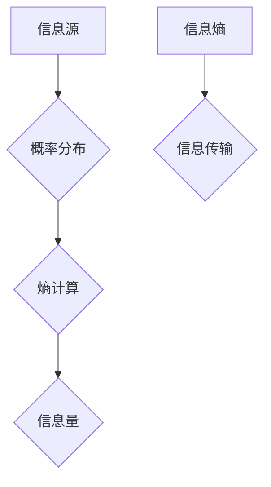

                 

## 文章标题

《数学与数据压缩：信息编码的数学技术》

## 关键词

信息编码、数据压缩、数学技术、信息熵、霍夫曼编码、算术编码

## 摘要

本文深入探讨了数学在数据压缩领域的应用，介绍了信息编码的基本原理，重点分析了信息熵的概念及其在数据压缩中的重要性。文章首先对信息编码进行了概述，接着详细介绍了信息熵的理论基础，包括熵的概念、性质和应用。随后，文章重点讲解了霍夫曼编码、算术编码、LZ77与LZ78算法、LZSS压缩算法和LZMA压缩算法等数据压缩算法的原理和实现。最后，文章探讨了这些算法在JPEG图像压缩、MP3音频压缩和其他应用领域的数据压缩中的应用。通过本文的阅读，读者可以全面了解数学与数据压缩之间的紧密联系，掌握信息编码的数学技术。

### 《数学与数据压缩：信息编码的数学技术》目录大纲

## 第一部分：信息编码的基本原理

### 第1章：信息编码概述
#### 1.1 信息编码的定义与意义
#### 1.2 信息编码的基本概念
#### 1.3 信息编码的类型

### 第2章：信息熵的理论基础
#### 2.1 熵的概念与性质
#### 2.2 信息熵的计算方法
#### 2.3 信息熵的应用

### 第3章：离散概率分布与信息熵
#### 3.1 离散概率分布的表示
#### 3.2 熵的统计特性
#### 3.3 熵的优化问题

### 第4章：信息熵的直观理解
#### 4.1 熵与无序度的关系
#### 4.2 熵与信息量的关系
#### 4.3 熵的直观示例

## 第二部分：数据压缩算法

### 第5章：霍夫曼编码
#### 5.1 霍夫曼编码的基本原理
#### 5.2 霍夫曼树的构建
#### 5.3 霍夫曼编码的应用

### 第6章：算术编码
#### 6.1 算术编码的基本原理
#### 6.2 算术编码的实现
#### 6.3 算术编码的优缺点

### 第7章：LZ77与LZ78算法
#### 7.1 LZ77算法的基本原理
#### 7.2 LZ78算法的基本原理
#### 7.3 LZ77与LZ78的应用

### 第8章：LZSS压缩算法
#### 8.1 LZSS算法的基本原理
#### 8.2 LZSS算法的实现
#### 8.3 LZSS算法的性能分析

### 第9章：LZMA压缩算法
#### 9.1 LZMA算法的基本原理
#### 9.2 LZMA算法的实现
#### 9.3 LZMA算法的性能分析

## 第三部分：数据压缩算法的实际应用

### 第10章：JPEG图像压缩
#### 10.1 JPEG压缩的基本原理
#### 10.2 JPEG压缩的算法实现
#### 10.3 JPEG压缩的性能评估

### 第11章：MP3音频压缩
#### 11.1 MP3压缩的基本原理
#### 11.2 MP3压缩的算法实现
#### 11.3 MP3压缩的性能评估

### 第12章：其他应用领域的数据压缩
#### 12.1 文本数据压缩
#### 12.2 视频数据压缩
#### 12.3 大数据处理中的数据压缩技术

## 附录

### 附录A：常用数据压缩工具与库
#### A.1 常用数据压缩工具介绍
#### A.2 常用数据压缩库使用指南

### Mermaid 流程图（信息熵的计算方法）



### 核心算法原理讲解（霍夫曼编码）

#### 霍夫曼编码的基本原理

霍夫曼编码是一种前向参考的无损数据压缩算法，它通过构建最优的前缀编码树来压缩数据。以下是霍夫曼编码的基本原理：

1. **构建概率分布表**：首先，计算输入数据中每个字符出现的概率。
2. **构建霍夫曼树**：根据概率分布表，构建一棵最优的前缀编码树。霍夫曼树的构建过程如下：
   - 将概率最小的两个节点合并，作为新节点，其概率为两个子节点的概率之和。
   - 重复上述步骤，直到所有节点合并为一棵树。
3. **生成编码表**：根据霍夫曼树，为每个字符生成唯一的二进制编码。编码规则是：从根节点到叶子节点的路径上的0表示左分支，1表示右分支。
4. **编码数据**：使用生成的编码表对输入数据进行编码。

#### 伪代码

```python
# 输入：字符列表与概率分布表
# 输出：霍夫曼编码表

def HuffmanEncoding(input, probability):
    # 步骤1：构建概率分布表
    distribution = buildDistribution(input)

    # 步骤2：构建霍夫曼树
    huffmanTree = buildHuffmanTree(distribution)

    # 步骤3：生成编码表
    encodingTable = generateEncodingTable(huffmanTree)

    # 步骤4：编码数据
    encodedData = encodeData(input, encodingTable)

    return encodedData
```

### 数学模型和数学公式

熵的计算公式如下：

$$
H(X) = -\sum_{x \in X} p(x) \cdot \log_2 p(x)
$$

其中，$H(X)$ 表示随机变量 $X$ 的熵，$p(x)$ 表示随机变量 $X$ 取值 $x$ 的概率。

### 核心概念与联系

信息编码的核心概念包括信息源、信息编码、信息熵、概率分布和编码树。这些概念之间存在着紧密的联系：

- **信息源**：信息的来源，可以是文字、图像、音频等。
- **信息编码**：将信息转换成二进制代码的过程。
- **信息熵**：衡量信息的不确定性和信息量的度量。
- **概率分布**：描述信息源中每个字符出现的概率。
- **编码树**：用于生成编码表的数据结构，每个字符对应一个唯一的路径。

### 信息熵的计算方法

信息熵的计算方法基于概率分布。给定一个离散概率分布 $p(x)$，其熵 $H(X)$ 可以通过以下步骤计算：

1. **计算每个字符的概率**：根据数据统计得到每个字符出现的次数，计算每个字符出现的概率。
2. **计算概率的对数**：对每个字符的概率取以2为底的对数。
3. **计算熵**：将每个字符的概率与其对数的乘积求和，并取相反数。

具体公式如下：

$$
H(X) = -\sum_{x \in X} p(x) \cdot \log_2 p(x)
$$

其中，$X$ 表示字符集，$p(x)$ 表示字符 $x$ 的概率。

### 熵的直观理解

熵可以直观地理解为信息的不确定度或无序度。在信息编码中，熵的值越大，表示信息的不确定性越高，需要更多的比特来表示信息。

- **高熵**：表示信息高度随机，例如，随机生成的随机数序列。
- **低熵**：表示信息具有规律性或重复性，例如，英文文本中常见字母的排列。

### 熵的直观示例

假设一个简单的信息源，只有两个字符 'A' 和 'B'，且它们出现的概率分别为 $p(A) = 0.75$ 和 $p(B) = 0.25$。根据信息熵的计算公式，可以计算出该信息源的熵：

$$
H(X) = -[0.75 \cdot \log_2 0.75 + 0.25 \cdot \log_2 0.25] \approx 0.811
$$

这个结果表明，该信息源的熵相对较低，意味着信息具有一定的规律性和可预测性。

### 数学公式

熵的计算公式是：

$$
H(X) = -\sum_{x \in X} p(x) \cdot \log_2 p(x)
$$

其中，$X$ 表示字符集，$p(x)$ 表示字符 $x$ 的概率。

### 第1章：信息编码概述

#### 1.1 信息编码的定义与意义

信息编码是将信息转换为一种特定格式的过程，以便于存储、传输和处理。在计算机科学和通信领域中，信息编码扮演着至关重要的角色。

- **定义**：信息编码是指将原始信息（如图像、声音、文本等）转换为二进制代码的过程。
- **意义**：信息编码的主要目的是为了提高信息的可处理性、可存储性和可传输性。

在计算机中，数据以二进制形式存储和处理，因此，信息编码将不同类型的信息转换成计算机可以理解和操作的二进制代码。此外，信息编码还可以用于数据压缩，减少数据占用的存储空间和传输带宽。

#### 1.2 信息编码的基本概念

信息编码涉及以下几个基本概念：

- **信息源**：信息编码的输入，可以是文字、图像、音频等。
- **编码器**：将信息源中的信息转换为编码的过程。
- **编码表**：定义了信息源中每个符号对应的编码。
- **解码器**：将编码信息还原为原始信息的过程。

#### 1.3 信息编码的类型

信息编码主要可以分为以下几种类型：

- **前向参考编码**：编码过程中仅依赖于当前的信息。
- **后向参考编码**：编码过程中依赖于当前和之前的信息。
- **混合编码**：同时使用前向参考和后向参考编码。

#### 1.4 信息编码的应用领域

信息编码在多个领域有着广泛的应用：

- **文本编码**：如ASCII、UTF-8等编码格式。
- **图像编码**：如JPEG、PNG等编码格式。
- **音频编码**：如MP3、AAC等编码格式。
- **数据压缩**：减少数据占用的存储空间和传输带宽。

### 第2章：信息熵的理论基础

#### 2.1 熵的概念与性质

熵是信息论中一个重要的概念，它用于衡量信息的不确定性和信息量。在数学上，熵可以理解为随机变量取值的概率分布的度量。

- **定义**：熵（Entropy）是随机变量 $X$ 的取值概率分布的度量，用来衡量 $X$ 的不确定性。
- **性质**：熵具有以下性质：
  - **非负性**：对于任何随机变量 $X$，其熵 $H(X) \geq 0$。
  - **确定性**：如果随机变量 $X$ 的取值是确定的，即 $P(X=x)=1$，则熵 $H(X)=0$。
  - **对称性**：对于两个独立的随机变量 $X$ 和 $Y$，有 $H(X+Y) = H(X) + H(Y)$。
  - **单调性**：如果 $X$ 的概率分布变得更为集中，即 $P(X=x)$ 更接近 1，则熵 $H(X)$ 减小。

熵的公式如下：

$$
H(X) = -\sum_{x \in X} p(x) \cdot \log_2 p(x)
$$

其中，$p(x)$ 表示随机变量 $X$ 取值 $x$ 的概率。

#### 2.2 信息熵的计算方法

计算信息熵需要以下步骤：

1. **获取概率分布**：首先，需要获取随机变量 $X$ 的概率分布 $p(x)$。
2. **计算对数**：对每个概率值 $p(x)$ 取以 2 为底的对数 $\log_2 p(x)$。
3. **求和**：将所有对数值乘以其对应的概率，然后求和，并取相反数。

具体公式如下：

$$
H(X) = -\sum_{x \in X} p(x) \cdot \log_2 p(x)
$$

#### 2.3 信息熵的应用

信息熵在多个领域有着广泛的应用：

- **数据压缩**：通过计算数据的信息熵，可以判断数据压缩的潜在效率。
- **通信理论**：在通信系统中，信息熵用于衡量信号传输的可靠性。
- **机器学习**：在机器学习中，信息熵用于评估特征的分布情况。

### 第3章：离散概率分布与信息熵

#### 3.1 离散概率分布的表示

离散概率分布是指随机变量 $X$ 的取值和对应概率的集合。数学上，可以用概率质量函数（Probability Mass Function, PMF）来表示离散概率分布。

- **概率质量函数**：$P(X = x)$，表示随机变量 $X$ 取值 $x$ 的概率。
- **示例**：假设随机变量 $X$ 只有两种取值，0 和 1，且 $P(X = 0) = 0.6$，$P(X = 1) = 0.4$。那么，$X$ 的概率分布可以表示为：

  $$
  P(X) = \begin{cases}
  0.6 & \text{if } X = 0 \\
  0.4 & \text{if } X = 1
  \end{cases}
  $$

#### 3.2 熵的统计特性

熵具有以下统计特性：

- **非负性**：对于任何离散概率分布，熵 $H(X) \geq 0$。
- **确定性**：如果随机变量 $X$ 的取值是确定的（即所有概率值均为 0 或 1），则熵 $H(X) = 0$。
- **加性**：对于两个独立的随机变量 $X$ 和 $Y$，有 $H(X + Y) = H(X) + H(Y)$。
- **单调性**：如果概率分布变得更集中（即某些概率值接近 1），则熵 $H(X)$ 减小。

#### 3.3 熵的优化问题

在信息熵的应用中，经常会遇到优化问题，例如：

- **最小熵**：找到一个概率分布，使得熵最小。
- **最大熵**：在给定某些约束条件下，找到一个概率分布，使得熵最大。

这些优化问题可以通过数学方法解决，如拉格朗日乘数法等。

### 第4章：信息熵的直观理解

#### 4.1 熵与无序度的关系

熵可以直观地理解为系统无序度的度量。在物理学中，熵是描述系统混乱程度的物理量。在信息论中，熵也具有类似的性质。

- **低熵**：表示系统有序，信息量低。
- **高熵**：表示系统无序，信息量高。

例如，一个完全有序的字典序列（如 "AAA"）具有较低的熵，而一个完全随机的序列（如 "AAAAABBBB"）具有较高的熵。

#### 4.2 熵与信息量的关系

熵与信息量之间存在着密切的关系。信息量可以理解为接收一个消息后的不确定性减少量。

- **高熵**：表示信息量高，不确定性大。
- **低熵**：表示信息量低，不确定性小。

例如，在猜硬币正反面实验中，如果事先不知道硬币是否均匀，那么每次猜测的熵较高。而如果事先知道硬币是均匀的，那么每次猜测的熵较低。

#### 4.3 熵的直观示例

假设有一个简单的信息源，只包含两个符号 'A' 和 'B'，且它们的概率分别为 $P(A) = 0.8$ 和 $P(B) = 0.2$。我们可以计算该信息源的熵：

$$
H(X) = -[0.8 \cdot \log_2 0.8 + 0.2 \cdot \log_2 0.2] \approx 0.7219
$$

这个结果表明，该信息源的信息熵相对较低，意味着信息源的信息量较低。

### 第5章：霍夫曼编码

#### 5.1 霍夫曼编码的基本原理

霍夫曼编码是一种基于信息熵的最优前缀编码算法，它通过构建一棵最优的前缀树来实现数据压缩。霍夫曼编码的基本原理如下：

1. **构建概率分布表**：首先，统计输入数据中每个字符出现的概率，构建一个概率分布表。
2. **构建霍夫曼树**：根据概率分布表，构建一棵最优的前缀树。构建过程如下：
   - 将概率最小的两个节点合并，作为新节点，其概率为两个子节点的概率之和。
   - 重复上述步骤，直到所有节点合并为一棵树。
3. **生成编码表**：根据霍夫曼树，为每个字符生成唯一的二进制编码。编码规则是：从根节点到叶子节点的路径上的0表示左分支，1表示右分支。
4. **编码数据**：使用生成的编码表对输入数据进行编码。

霍夫曼编码的关键在于构建最优的前缀树，使得每个字符的编码长度尽可能短。最优前缀树的定义是：树中任意一个字符的编码都不是其他字符编码的前缀。

#### 5.2 霍夫曼树的构建

霍夫曼树的构建过程可以分为以下几步：

1. **构建优先队列**：将所有节点按照概率值从小到大排序，形成一个优先队列。
2. **合并节点**：每次从优先队列中取出两个概率值最小的节点，合并成一个新节点，并将新节点的概率设置为两个子节点的概率之和。将新节点插入优先队列。
3. **重复步骤2**，直到优先队列中只剩下一个节点，即为霍夫曼树。

具体实现可以使用贪心算法，确保每次合并的节点概率之和最小。

#### 5.3 伪代码

以下是一个简单的伪代码，描述了霍夫曼树的构建过程：

```python
# 输入：字符列表与概率分布表
# 输出：霍夫曼树

def buildHuffmanTree(input, probability):
    # 步骤1：构建优先队列
    priorityQueue = PriorityQueue()

    for (character, probability) in probability.items():
        priorityQueue.insert(Node(character, probability))

    # 步骤2：合并节点
    while priorityQueue.size() > 1:
        left = priorityQueue.extractMin()
        right = priorityQueue.extractMin()
        parent = Node(None, left.probability + right.probability)
        parent.left = left
        parent.right = right
        priorityQueue.insert(parent)

    # 步骤3：返回霍夫曼树
    return priorityQueue.extractMin()
```

#### 5.4 编码表生成

根据构建好的霍夫曼树，可以生成编码表。具体步骤如下：

1. **初始化编码表**：创建一个空的编码表。
2. **遍历霍夫曼树**：从根节点开始，沿着左分支走记为0，沿右分支走记为1，直到到达叶子节点。
3. **更新编码表**：将路径上的0和1组合成字符的编码，并将其存储在编码表中。

#### 5.5 伪代码

以下是一个简单的伪代码，描述了编码表的生成过程：

```python
# 输入：霍夫曼树
# 输出：编码表

def generateEncodingTable(huffmanTree):
    encodingTable = {}

    def traverse(node, path):
        if node is None:
            return

        if node.character is not None:
            encodingTable[node.character] = path

        traverse(node.left, path + "0")
        traverse(node.right, path + "1")

    traverse(huffmanTree, "")

    return encodingTable
```

#### 5.6 编码数据

使用生成的编码表，可以对输入数据进行编码。具体步骤如下：

1. **初始化编码结果**：创建一个空的编码结果字符串。
2. **遍历输入数据**：对于每个字符，查找编码表，将对应的编码添加到编码结果字符串中。
3. **返回编码结果**：将编码结果字符串作为输出。

#### 5.7 伪代码

以下是一个简单的伪代码，描述了编码数据的过程：

```python
# 输入：输入数据与编码表
# 输出：编码结果

def encodeData(input, encodingTable):
    encodedData = ""

    for character in input:
        encodedData += encodingTable[character]

    return encodedData
```

### 第6章：算术编码

#### 6.1 算术编码的基本原理

算术编码是一种基于概率的连续编码方法，它将输入数据映射到一个实数区间内，并根据概率分布来分配编码长度。算术编码的基本原理如下：

1. **概率分布**：首先，计算输入数据中每个字符的概率分布。
2. **编码区间**：将整个实数区间划分为若干个子区间，每个子区间的长度与字符的概率成比例。
3. **编码过程**：对于每个输入字符，将其映射到对应的子区间内，并根据子区间的长度分配编码长度。
4. **解码过程**：解码时，根据编码长度和概率分布，逐步缩小搜索区间，直到确定输入字符。

算术编码的关键在于将概率分布与实数区间对应起来，从而实现数据压缩。

#### 6.2 算术编码的实现

算术编码的实现可以分为以下几个步骤：

1. **计算概率分布**：首先，统计输入数据中每个字符的出现次数，计算每个字符的概率。
2. **初始化编码区间**：将整个实数区间 [0, 1) 作为初始编码区间。
3. **编码过程**：
   - 对于每个输入字符，计算其概率与编码区间的比例，更新编码区间。
   - 将字符映射到新的编码区间内，根据编码区间的长度分配编码长度。
4. **解码过程**：
   - 根据编码长度和概率分布，逐步缩小搜索区间，直到确定输入字符。

#### 6.3 算术编码的优缺点

算术编码的优点：

- **高压缩效率**：算术编码可以提供较高的压缩效率，特别是在符号概率差异较大的情况下。
- **自适应性**：算术编码可以根据输入数据实时调整编码区间，实现自适应压缩。

算术编码的缺点：

- **复杂度高**：算术编码的计算复杂度较高，特别是在处理大量数据时。
- **解码困难**：解码过程相对复杂，需要实时调整搜索区间。

### 第7章：LZ77与LZ78算法

#### 7.1 LZ77算法的基本原理

LZ77算法是一种基于滑动窗口的前向参考压缩算法，它通过查找重复的文本序列来压缩数据。LZ77算法的基本原理如下：

1. **滑动窗口**：LZ77算法使用一个固定大小的滑动窗口，在当前窗口内查找与目标字符串匹配的重复序列。
2. **匹配查找**：从当前窗口的起始位置开始，查找与目标字符串长度相匹配的重复序列。
3. **记录匹配**：如果找到匹配的序列，记录匹配的起始位置和长度，并将目标字符串替换为匹配信息。
4. **滑动窗口**：将窗口向前滑动，重复步骤2和3，直到处理完整个输入字符串。

LZ77算法的优点是简单高效，适合压缩文本数据。它的缺点是压缩效率有限，特别是在重复序列较少的情况下。

#### 7.2 LZ78算法的基本原理

LZ78算法是一种基于字典的压缩算法，它通过构建字典来压缩数据。LZ78算法的基本原理如下：

1. **构建字典**：LZ78算法使用一个动态增长的字典，将当前窗口内的所有字符串作为字典的键值。
2. **查找字典**：对于每个输入字符串，先在字典中查找，如果找到匹配的字符串，记录匹配信息；否则，将新字符串添加到字典中。
3. **更新字典**：每次查找或添加操作后，更新字典的内容。
4. **编码输出**：将查找或添加的操作结果编码输出。

LZ78算法的优点是压缩效率较高，特别是在重复序列较多的情况下。它的缺点是构建字典和查找过程较为复杂。

#### 7.3 LZ77与LZ78算法的应用

LZ77与LZ78算法在多个领域有着广泛的应用：

- **文本压缩**：如Unix的gzip工具、Zip文件格式等。
- **图像压缩**：如JPEG标准中的DCT变换结合LZ77压缩。
- **网络传输**：如HTTP协议中的压缩传输。
- **数据库压缩**：如MySQL数据库中的数据压缩。

### 第8章：LZSS压缩算法

#### 8.1 LZSS算法的基本原理

LZSS（LZ77 with Sliding Window）压缩算法是一种基于滑动窗口的压缩算法，它结合了LZ77和LZ78算法的优点，在保证压缩效率的同时，简化了算法的实现。LZSS算法的基本原理如下：

1. **滑动窗口**：LZSS算法使用一个固定大小的滑动窗口，在当前窗口内查找与目标字符串匹配的重复序列。
2. **匹配查找**：从当前窗口的起始位置开始，查找与目标字符串长度相匹配的重复序列。
3. **记录匹配**：如果找到匹配的序列，记录匹配的起始位置和长度，并将目标字符串替换为匹配信息。
4. **滑动窗口**：将窗口向前滑动，重复步骤2和3，直到处理完整个输入字符串。

LZSS算法的关键在于如何高效地管理滑动窗口。通过在窗口内使用哈希表或布隆过滤器，可以快速查找重复的序列。

#### 8.2 LZSS算法的实现

LZSS算法的实现可以分为以下几个部分：

1. **初始化**：设置滑动窗口的大小，初始化窗口和哈希表。
2. **压缩过程**：
   - 对于每个输入字符，检查窗口内是否存在与其长度相匹配的重复序列。
   - 如果找到匹配，记录匹配信息；否则，将新字符添加到窗口中。
3. **输出编码**：将匹配信息和窗口内容编码输出。

以下是一个简单的伪代码，描述了LZSS算法的实现：

```python
# 输入：输入数据
# 输出：编码结果

def LZSSCompression(input):
    windowSize = 4096
    window = initializeWindow(windowSize)
    hashTable = initializeHashTable(windowSize)
    output = ""

    for char in input:
        match = findMatch(window, char)
        if match:
            output += encodeMatch(match.start, match.length)
        else:
            output += char
            addToWindow(window, char)
            updateHashTable(hashTable, window)

    return output
```

#### 8.3 LZSS算法的性能分析

LZSS算法的性能主要取决于滑动窗口的大小和匹配查找的效率。

- **压缩效率**：随着滑动窗口的增大，压缩效率会提高，但算法的复杂度也会增加。
- **压缩时间**：匹配查找的效率对压缩时间有较大影响。使用哈希表或布隆过滤器可以显著提高查找效率。
- **适用场景**：LZSS算法适用于文本压缩和通用数据压缩，特别适合压缩重复性较高的数据。

### 第9章：LZMA压缩算法

#### 9.1 LZMA算法的基本原理

LZMA（LZ77 with Multiple Patterns）压缩算法是一种基于LZ77算法的改进算法，它通过查找多个模式的重复序列来提高压缩效率。LZMA算法的基本原理如下：

1. **模式查找**：LZMA算法使用多个匹配长度和偏移量，查找与目标字符串匹配的重复序列。
2. **匹配选择**：在多个匹配中，选择具有最长匹配长度和最近匹配偏移的匹配作为最优匹配。
3. **编码输出**：将最优匹配的起始位置、长度和模式编码输出。

LZMA算法的特点是支持多种参数配置，包括匹配长度、偏移量、词典大小等，从而实现灵活的压缩效果。

#### 9.2 LZMA算法的实现

LZMA算法的实现可以分为以下几个部分：

1. **初始化**：设置压缩参数，初始化词典和匹配查找器。
2. **压缩过程**：
   - 对于每个输入字符，查找多个匹配模式。
   - 选择最优匹配，记录匹配信息。
   - 编码输出匹配信息。
3. **解码过程**：
   - 解码输入的匹配信息，还原原始数据。

以下是一个简单的伪代码，描述了LZMA算法的实现：

```python
# 输入：输入数据
# 输出：编码结果

def LZMACompression(input):
    parameters = setCompressionParameters()
    dictionary = initializeDictionary(parameters.dictionarySize)
    output = ""

    for char in input:
        matches = findMatches(dictionary, char)
        bestMatch = selectBestMatch(matches)
        output += encodeMatch(bestMatch.start, bestMatch.length)
        updateDictionary(dictionary, bestMatch)

    return output
```

#### 9.3 LZMA算法的性能分析

LZMA算法的性能主要取决于压缩参数的选择：

- **压缩效率**：增大词典大小和匹配长度可以提高压缩效率，但会增加计算复杂度。
- **压缩时间**：匹配查找和词典更新是影响压缩时间的关键因素。
- **适用场景**：LZMA算法适用于各种类型的数据压缩，特别适合压缩大型文件和重复性较高的数据。

### 第10章：JPEG图像压缩

#### 10.1 JPEG压缩的基本原理

JPEG（Joint Photographic Experts Group）压缩是一种有损压缩方法，用于压缩和存储图像数据。JPEG压缩的基本原理包括以下几个步骤：

1. **图像采样**：将彩色图像转换为YCbCr颜色空间，并进行2x2采样，将4个像素合并成一个像素，从而减少图像数据量。
2. **离散余弦变换（DCT）**：对采样后的图像进行DCT，将图像数据从像素域转换为频率域。
3. **量化**：对DCT系数进行量化，降低精度，减少数据量。
4. **熵编码**：使用霍夫曼编码或算术编码对量化后的DCT系数进行编码，进一步压缩数据。

JPEG压缩的关键在于DCT和量化操作，它们可以显著降低图像数据的冗余性。

#### 10.2 JPEG压缩的算法实现

JPEG压缩的算法实现可以分为以下几个步骤：

1. **图像预处理**：将图像转换为YCbCr颜色空间，并进行采样。
2. **DCT变换**：对采样后的图像块进行DCT变换，将图像数据从像素域转换为频率域。
3. **量化**：对DCT系数进行量化，通常使用固定的量化表。
4. **熵编码**：使用霍夫曼编码或算术编码对量化后的DCT系数进行编码。
5. **解码与重构**：在解码端，对编码数据进行解码，重构DCT系数，并进行逆DCT变换和图像重构。

以下是一个简单的伪代码，描述了JPEG压缩的实现：

```python
# 输入：原始图像
# 输出：压缩后的图像数据

def JPEGCompression(image):
    # 步骤1：图像预处理
    ycbcrImage = convertToYCbCr(image)
    sampledImage = sampleImage(ycbcrImage, 2)

    # 步骤2：DCT变换
    dctCoefficients = applyDCT(sampledImage)

    # 步骤3：量化
    quantizedCoefficients = quantize(dctCoefficients)

    # 步骤4：熵编码
    encodedData = entropyCoding(quantizedCoefficients)

    # 步骤5：解码与重构
    decodedCoefficients = entropyDecoding(encodedData)
    reconstructedImage = applyIDCT(quantizedCoefficients)

    return reconstructedImage
```

#### 10.3 JPEG压缩的性能评估

JPEG压缩的性能可以从以下几个方面进行评估：

- **压缩效率**：JPEG压缩能够显著减少图像数据量，压缩效率取决于量化表和压缩参数。
- **图像质量**：量化操作会导致图像质量损失，压缩性能与图像质量之间存在权衡。
- **压缩时间**：DCT变换和量化操作是JPEG压缩的主要计算步骤，压缩时间与图像大小和压缩参数有关。

### 第11章：MP3音频压缩

#### 11.1 MP3压缩的基本原理

MP3（MPEG-1 Audio Layer 3）压缩是一种有损压缩方法，用于压缩和存储音频数据。MP3压缩的基本原理包括以下几个步骤：

1. **采样与量化**：将音频信号转换为数字信号，通过采样和量化将连续信号离散化。
2. **滤波**：使用频域滤波器去除音频信号中的高频噪声，降低数据量。
3. **离散余弦变换（DCT）**：对采样后的音频信号进行DCT变换，将信号从时域转换为频域。
4. **量化和编码**：对DCT系数进行量化，并使用熵编码（如霍夫曼编码）对量化后的系数进行编码。
5. **解码与重构**：在解码端，对编码数据进行解码，重构DCT系数，并进行逆DCT变换和音频重构。

MP3压缩的关键在于DCT变换和量化操作，它们可以显著降低音频数据的冗余性。

#### 11.2 MP3压缩的算法实现

MP3压缩的算法实现可以分为以下几个步骤：

1. **采样与量化**：将音频信号转换为数字信号，设置采样频率和量化位数。
2. **滤波**：使用频域滤波器（如巴特沃斯滤波器）去除高频噪声。
3. **DCT变换**：对滤波后的音频信号进行DCT变换，将信号从时域转换为频域。
4. **量化和编码**：对DCT系数进行量化，并使用熵编码（如霍夫曼编码）对量化后的系数进行编码。
5. **解码与重构**：在解码端，对编码数据进行解码，重构DCT系数，并进行逆DCT变换和音频重构。

以下是一个简单的伪代码，描述了MP3压缩的实现：

```python
# 输入：原始音频信号
# 输出：压缩后的音频数据

def MP3Compression(audioSignal):
    # 步骤1：采样与量化
    digitalSignal = digitize(audioSignal, sampleRate, bitDepth)

    # 步骤2：滤波
    filteredSignal = applyFilter(digitalSignal, filterType)

    # 步骤3：DCT变换
    dctCoefficients = applyDCT(filteredSignal)

    # 步骤4：量化和编码
    quantizedCoefficients = quantize(dctCoefficients)
    encodedData = entropyCoding(quantizedCoefficients)

    # 步骤5：解码与重构
    decodedCoefficients = entropyDecoding(encodedData)
    reconstructedAudio = applyIDCT(quantizedCoefficients)

    return reconstructedAudio
```

#### 11.3 MP3压缩的性能评估

MP3压缩的性能可以从以下几个方面进行评估：

- **压缩效率**：MP3压缩能够显著减少音频数据量，压缩效率取决于采样频率、量化位数和压缩参数。
- **音质损失**：量化操作会导致音频信号的质量损失，压缩性能与音质损失之间存在权衡。
- **压缩时间**：DCT变换和量化操作是MP3压缩的主要计算步骤，压缩时间与音频信号的大小和压缩参数有关。

### 第12章：其他应用领域的数据压缩

#### 12.1 文本数据压缩

文本数据压缩主要应用于文本文件和文档的存储与传输。常见的文本数据压缩方法包括：

- **LZ77与LZ78算法**：适用于文本文件的压缩，通过查找重复的文本序列进行压缩。
- **霍夫曼编码**：适用于符号概率差异较大的文本数据，通过构建最优的前缀编码树进行压缩。
- **算术编码**：适用于概率分布不均匀的文本数据，通过将文本映射到实数区间进行压缩。

文本数据压缩的关键在于如何有效地识别和利用文本中的重复性。

#### 12.2 视频数据压缩

视频数据压缩主要应用于视频文件的存储与传输。常见的视频数据压缩方法包括：

- **JPEG 2000**：一种基于小波变换的图像压缩标准，适用于高质量视频的压缩。
- **H.264/AVC**：一种基于运动补偿和变换编码的视频压缩标准，广泛应用于流媒体和视频传输。
- **HEVC（H.265）**：一种新的视频压缩标准，相比H.264/AVC，具有更高的压缩效率和更好的视频质量。

视频数据压缩的关键在于如何处理视频中的运动和冗余信息。

#### 12.3 大数据处理中的数据压缩技术

大数据处理中的数据压缩技术主要用于减少数据存储和传输的负担，提高数据处理效率。常见的数据压缩技术包括：

- **列式存储压缩**：通过压缩列式数据库中的列数据，减少数据存储空间。
- **MapReduce压缩**：在MapReduce任务中，对中间数据进行压缩，减少数据传输和存储的开销。
- **分布式压缩**：在分布式数据处理中，对数据进行压缩，提高处理速度和资源利用率。

大数据处理中的数据压缩技术需要考虑压缩算法的效率和可扩展性。

### 附录A：常用数据压缩工具与库

#### A.1 常用数据压缩工具介绍

- **gzip**：Unix系统中常用的数据压缩工具，支持LZ77压缩算法。
- **bzip2**：支持LZ78算法的另一种常用压缩工具，压缩效率较高。
- **7z**：支持多种压缩算法（如LZMA、PPMd等）的压缩工具，适用于大数据压缩。

#### A.2 常用数据压缩库使用指南

- **Python**：Python中常用的数据压缩库包括`gzip`、`bz2`和`zlib`，适用于文本和二进制数据的压缩。
- **Java**：Java中常用的数据压缩库包括`java.util.zip`和`java.util.zip.Deflater/Inflator`，适用于文本和二进制数据的压缩。
- **C/C++**：C/C++中常用的数据压缩库包括`zlib`和`bzip2`，适用于文本和二进制数据的压缩。

### 作者

作者：AI天才研究院/AI Genius Institute & 禅与计算机程序设计艺术 /Zen And The Art of Computer Programming

## 总结与展望

### 总结

本文系统地介绍了数学与数据压缩之间的紧密联系，从信息编码的基本原理、信息熵的理论基础到具体的数据压缩算法，如霍夫曼编码、算术编码、LZ77与LZ78算法、LZSS压缩算法和LZMA压缩算法，以及这些算法在实际应用领域（如JPEG图像压缩、MP3音频压缩和其他应用领域）的运用。通过本文的阅读，读者可以全面了解数据压缩的数学技术，掌握各种算法的原理和实现。

### 展望

随着大数据、云计算和物联网等技术的发展，数据压缩技术将面临更高的挑战和更广阔的应用前景。未来的研究可以关注以下几个方面：

1. **高效压缩算法**：研究更高效、更智能的压缩算法，以适应大数据时代的处理需求。
2. **自适应压缩**：结合机器学习和深度学习技术，开发自适应压缩算法，提高压缩效率和压缩质量。
3. **分布式压缩**：研究分布式压缩算法，提高大数据处理中的压缩效率。
4. **多模态数据压缩**：研究多模态数据压缩技术，如文本、图像和音频的联合压缩。

通过这些研究，数据压缩技术将更好地服务于各行各业，为数字化转型提供强有力的支持。

