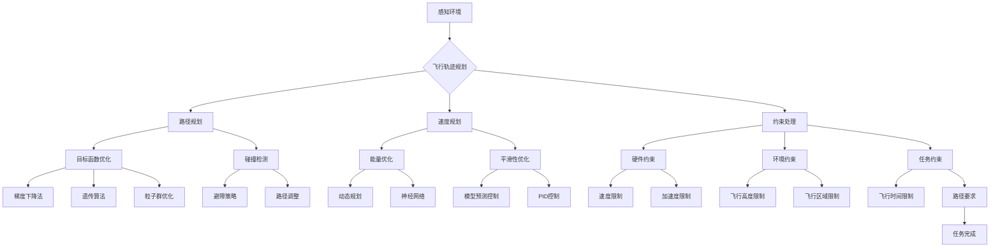

                 

### 文章标题

### 数学与无人机控制：飞行轨迹的数学规划

关键词：无人机控制、数学规划、飞行轨迹、线性代数、微积分、动态规划、机器学习

摘要：本文旨在探讨数学在无人机控制中的应用，特别是飞行轨迹规划的数学模型与算法。通过详细分析线性代数、微积分、离散数学等数学工具在无人机控制中的作用，以及动态规划和机器学习等算法在飞行轨迹规划中的应用，本文为无人机飞行轨迹规划提供了全面的理论基础和实践指导。

---

在当今快速发展的科技时代，无人机技术已经成为一个备受瞩目的领域。无人机不仅能够用于军事侦察和民用监测，还在工业巡检、应急响应、物流配送等多个领域展现了巨大的潜力。然而，要实现无人机的稳定、精确飞行，关键在于对飞行轨迹的优化与规划。数学作为一门基础科学，在无人机控制中扮演着至关重要的角色。本文将深入探讨数学与无人机控制之间的紧密联系，特别是飞行轨迹的数学规划。

本文将分为三个主要部分。第一部分将介绍无人机控制的基础知识，包括无人机的定义与分类、控制系统的组成部分和工作原理。第二部分将详细分析数学在无人机控制中的应用，涵盖线性代数、微积分、离散数学等数学工具在无人机控制中的具体作用。第三部分将重点讨论飞行轨迹规划的数学模型和算法，包括基于目标函数的规划、基于约束的规划、动态规划和机器学习等。最后，我们将通过实际案例分析和未来趋势展望，为无人机飞行轨迹规划提供实用的指导和深入思考。

通过本文的阅读，读者将能够全面了解数学在无人机控制中的应用，掌握飞行轨迹规划的数学基础，并能够运用这些知识解决实际问题。希望本文能够为无人机控制领域的研究者、开发者以及爱好者提供有价值的参考和启示。

### 第一部分：数学与无人机控制基础

#### 第1章：无人机控制概述

##### 1.1 无人机的定义与分类

无人机（Unmanned Aerial Vehicle，简称UAV）是指无需驾驶员直接操纵、通过地面或远程遥控设备控制、自主飞行或自动飞行的航空器。根据飞行平台的不同，无人机可以大致分为固定翼无人机、旋翼无人机和多旋翼无人机。

- **固定翼无人机**：具有类似传统飞机的固定翼设计，通常适合长时间飞行和长距离飞行任务。它们具有较快的飞行速度和较大的航程，但需要较长的跑道进行起飞和降落。
- **旋翼无人机**：包括单旋翼和双旋翼无人机，如直升机和倾转旋翼机。它们具有垂直起降和悬停能力，机动性强，适合短距离和低空飞行任务。
- **多旋翼无人机**：由多个旋翼组成，如四旋翼、六旋翼等，常见于民用和消费级市场。它们结构简单、控制灵活，适合各种小型和复杂的任务场景。

##### 1.2 无人机控制系统的基本组成部分

无人机控制系统由硬件和软件两大部分组成，每个部分又包括多个子系统。

- **硬件部分**：
  - **飞行平台**：无人机的主要结构，包括机架、动力系统（如电动机或燃油发动机）、传感器和载荷（如摄像头、雷达等）。
  - **通信系统**：用于无人机与地面控制站之间的数据传输和指令接收，通常采用无线通信技术，如Wi-Fi、4G/5G、UWB等。
  - **传感器**：用于感知无人机周围环境的信息，如GPS、IMU（惯性测量单元）、激光雷达、视觉传感器等。

- **软件部分**：
  - **飞控系统**：无人机的心脏，负责无人机的飞行控制和姿态控制。它通过接收传感器数据，生成控制指令，驱动无人机的舵面和电机。
  - **导航与定位系统**：用于无人机的位置跟踪和路径规划，通常结合GPS和其他传感器数据实现。
  - **任务管理系统**：负责无人机的任务规划和执行，包括任务分配、任务执行监控和任务结果分析。

##### 1.3 无人机控制系统的基本工作原理

无人机控制系统的基本工作原理可以概括为以下步骤：

1. **感知**：无人机通过传感器收集周围环境的信息，如位置、速度、姿态和障碍物等。
2. **数据处理**：飞控系统对传感器数据进行处理，生成所需的中间结果，如姿态角、速度和加速度等。
3. **决策**：导航与定位系统根据预先设定的任务目标和当前状态，计算出最佳的控制指令。
4. **执行**：飞控系统根据决策结果，生成电机和舵面的控制信号，驱动无人机执行相应的动作。
5. **反馈**：无人机执行动作后，通过传感器和通信系统反馈新的状态信息，形成闭环控制。

通过这样的闭环控制过程，无人机能够在复杂的动态环境中保持稳定飞行，并按照预定的路径和任务执行各项操作。数学工具在这些过程中发挥着至关重要的作用，如线性代数用于传感器数据的处理和矩阵运算，微积分用于动态系统的建模和运动控制，离散数学用于状态机和决策树的构建等。

#### 第2章：数学在无人机控制中的应用

##### 2.1 线性代数在无人机控制中的应用

线性代数是无人机控制中不可或缺的数学工具，主要应用于以下几个方面：

- **矩阵与向量**：无人机控制系统中的数据通常是多维的，矩阵和向量提供了有效的表示方法。例如，IMU传感器采集到的加速度、角速度和姿态角可以表示为三维向量，而飞行路径和速度则可以用矩阵表示。
- **线性变换**：线性变换用于描述无人机姿态的变化和运动。例如，通过旋转矩阵可以描述无人机从一个姿态变换到另一个姿态的过程。
- **矩阵求解**：在无人机控制中，矩阵求解用于计算最优控制策略。例如，通过求解线性方程组可以确定无人机的控制输入，使得无人机达到特定的目标位置和速度。

##### 2.2 微积分在无人机控制中的应用

微积分在无人机控制中用于描述动态系统和优化控制策略，具体应用包括：

- **导数与微分方程**：导数用于描述系统的动态变化，如无人机速度的变化率。微分方程则用于建模无人机的运动，如牛顿第二定律和牛顿运动定律。
- **积分与积分变换**：积分用于求解系统的稳态解，如无人机在给定控制输入下的稳态速度和位置。积分变换则提供了求解复杂微分方程的有效工具，如拉普拉斯变换。
- **动力学方程**：微积分用于建立无人机的动力学模型，如牛顿运动定律和质点运动方程。这些方程描述了无人机的运动规律，是控制算法的基础。

##### 2.3 离散数学在无人机控制中的应用

离散数学在无人机控制中的应用主要涉及以下几个方面：

- **状态机**：状态机用于描述无人机在不同状态下的行为和转换。例如，无人机在飞行过程中可能会经历起飞、悬停、前进、转向等不同状态，状态机定义了这些状态的转换规则。
- **决策树**：决策树用于无人机路径规划和任务决策。例如，在复杂环境中，无人机可以根据传感器数据和决策树选择最佳行动路径。
- **有限状态机**：有限状态机（FSM）用于复杂系统的控制，如无人机群控制。通过定义各个子系统的状态和转换规则，有限状态机可以协调多个无人机的行动，实现协同控制。

#### 第3章：无人机飞行轨迹规划概述

##### 3.1 飞行轨迹规划的定义与目的

飞行轨迹规划是指根据预定的任务目标和环境约束，设计无人机的飞行路径和速度曲线，使其能够高效、安全地完成任务。其核心目的是：

- **高效性**：优化飞行路径和速度，使得无人机能够在最短时间内完成任务。
- **安全性**：确保无人机在飞行过程中不会发生碰撞或失控，避免对人员和设备造成损害。

##### 3.2 飞行轨迹规划的分类

飞行轨迹规划可以根据不同的分类标准进行分类，常见的分类方法包括：

- **基于控制器的规划**：根据无人机的控制器类型进行分类，如PID控制器、模型预测控制器（MPC）等。
- **基于路径的规划**：根据飞行路径的形式进行分类，如直线规划、曲线规划、网格化规划等。
- **基于动态规划的规划**：根据优化策略进行分类，如动态规划、遗传算法、粒子群优化等。

##### 3.3 飞行轨迹规划的关键技术

飞行轨迹规划的关键技术包括：

- **路径规划算法**：如A*算法、Dijkstra算法、RRT（快速随机树）算法等，用于生成最优飞行路径。
- **速度规划算法**：如时间最优速度规划、能量最优速度规划等，用于生成最优速度曲线。
- **约束处理技术**：如碰撞检测、避障技术、环境建模等，用于处理飞行过程中可能遇到的环境约束。
- **动态调整技术**：如路径重规划、速度调整等，用于应对飞行过程中的突发情况和变化。

### 第二部分：飞行轨迹规划的数学模型

#### 第4章：基于目标函数的飞行轨迹规划

##### 4.1 目标函数的定义与作用

在飞行轨迹规划中，目标函数（Objective Function）是优化过程中需要最小化或最大化的函数，它代表了无人机在飞行轨迹上的性能指标。目标函数的定义通常基于无人机的任务目标和约束条件。

- **任务目标**：如最小飞行时间、最小能耗、最小路径长度等。
- **约束条件**：如飞行高度限制、速度限制、避障要求等。

目标函数的定义和选取直接影响飞行轨迹规划的结果。一个合理的目标函数应能够准确反映无人机的性能要求，同时考虑实际环境中的约束条件。

##### 4.2 常见的目标函数

在飞行轨迹规划中，常见的目标函数包括以下几种：

- **时间最优目标函数**：
  $$ J_t = \int_{t_0}^{t_f} dt $$
  这种目标函数旨在最小化无人机的飞行时间，适用于需要快速到达目的地的任务。

- **路径长度目标函数**：
  $$ J_d = \int_{t_0}^{t_f} \sqrt{dx^2 + dy^2} dt $$
  这种目标函数旨在最小化无人机的实际飞行路径长度，适用于需要最短路径的任务。

- **能量最优目标函数**：
  $$ J_e = \int_{t_0}^{t_f} \frac{1}{2} m v^2 dt $$
  这种目标函数旨在最小化无人机的能耗，适用于需要节能的任务。

- **平滑性目标函数**：
  $$ J_s = \int_{t_0}^{t_f} \left( \frac{d^2x}{dt^2} + \frac{d^2y}{dt^2} \right)^2 dt $$
  这种目标函数旨在最小化无人机的运动加速度，提高飞行的平稳性。

##### 4.3 目标函数的优化方法

在飞行轨迹规划中，目标函数的优化方法主要分为以下几种：

- **梯度下降法**：
  梯度下降法是一种基于目标函数梯度的优化方法，通过迭代更新飞行轨迹，逐步逼近最优解。
  $$ x_{k+1} = x_k - \alpha \nabla J(x_k) $$
  其中，\( x_k \) 是第 \( k \) 次迭代的飞行轨迹，\( \alpha \) 是步长参数。

- **粒子群优化（PSO）**：
  粒子群优化是一种基于群体智能的优化算法，通过模拟鸟群觅食行为，更新飞行轨迹。
  $$ x_{i,k+1} = x_{i,k} + c_1 r_1 (p_{i,k} - x_{i,k}) + c_2 r_2 (g_{k} - x_{i,k}) $$
  其中，\( x_{i,k} \) 是第 \( i \) 个粒子在第 \( k \) 次迭代的飞行轨迹，\( p_{i,k} \) 是第 \( i \) 个粒子的历史最优飞行轨迹，\( g_{k} \) 是全局最优飞行轨迹。

- **遗传算法（GA）**：
  遗传算法是一种基于自然选择和遗传机制的优化算法，通过交叉、变异等操作，进化出最优飞行轨迹。
  $$ f(x_{i+1}) = f(x_i) + \Delta f $$
  其中，\( x_i \) 是第 \( i \) 个个体的飞行轨迹，\( \Delta f \) 是进化过程中的变异量。

这些优化方法各有优缺点，根据具体应用场景可以选择合适的方法。

### 第5章：基于约束的飞行轨迹规划

##### 5.1 约束的定义与作用

在飞行轨迹规划中，约束（Constraint）是指无人机在飞行过程中必须满足的限制条件。这些约束条件通常来源于无人机的硬件限制、环境限制和任务要求等。约束的定义和作用如下：

- **硬件约束**：如无人机的最大速度、最大加速度、最大负载等，这些约束决定了无人机在飞行中的性能上限。
- **环境约束**：如飞行高度限制、飞行区域限制、障碍物避让等，这些约束确保无人机在复杂环境中安全飞行。
- **任务约束**：如飞行时间限制、路径要求、能量消耗限制等，这些约束反映了任务的具体需求。

约束的作用在于确保无人机在飞行过程中不会超出安全范围，同时满足任务要求。一个良好的约束设计可以提高无人机飞行的稳定性和效率。

##### 5.2 常见的约束条件

在飞行轨迹规划中，常见的约束条件包括以下几种：

- **路径约束**：
  $$ \lVert \mathbf{x}(t) - \mathbf{x}_\text{des} \rVert \leq \epsilon $$
  这种约束确保无人机保持在预定的路径附近，其中 \( \mathbf{x}(t) \) 是无人机在时间 \( t \) 的位置，\( \mathbf{x}_\text{des} \) 是预定路径，\( \epsilon \) 是路径宽度。

- **速度约束**：
  $$ \lVert \mathbf{v}(t) \rVert \leq v_\text{max} $$
  这种约束确保无人机在任意时间点的速度不超过最大速度 \( v_\text{max} \)，其中 \( \mathbf{v}(t) \) 是无人机在时间 \( t \) 的速度。

- **加速度约束**：
  $$ \lVert \mathbf{a}(t) \rVert \leq a_\text{max} $$
  这种约束确保无人机在任意时间点的加速度不超过最大加速度 \( a_\text{max} \)，其中 \( \mathbf{a}(t) \) 是无人机在时间 \( t \) 的加速度。

- **环境约束**：
  $$ \mathbf{x}(t) \in \Omega $$
  这种约束确保无人机在时间 \( t \) 的位置 \( \mathbf{x}(t) \) 位于可飞行的环境区域 \( \Omega \) 内。

这些约束条件通过数学模型描述，并在飞行轨迹规划中起到关键作用。

##### 5.3 约束规划的优化方法

在飞行轨迹规划中，常见的约束优化方法包括以下几种：

- **线性规划（Linear Programming，LP）**：
  线性规划适用于目标函数和约束条件都是线性函数的情况，通过求解线性方程组来找到最优解。
  $$ \min \mathbf{c}^T \mathbf{x} $$
  $$ \mathbf{A} \mathbf{x} \leq \mathbf{b} $$
  其中，\( \mathbf{c} \) 是目标函数的系数向量，\( \mathbf{A} \) 和 \( \mathbf{b} \) 是约束条件的系数矩阵和常数向量。

- **二次规划（Quadratic Programming，QP）**：
  二次规划适用于目标函数是二次函数的情况，通过求解二次方程组来找到最优解。
  $$ \min \mathbf{c}^T \mathbf{x} + \frac{1}{2} \mathbf{x}^T \mathbf{Q} \mathbf{x} $$
  $$ \mathbf{A} \mathbf{x} \leq \mathbf{b} $$
  其中，\( \mathbf{Q} \) 是目标函数的二次项系数矩阵。

- **非线性规划（Nonlinear Programming，NLP）**：
  非线性规划适用于目标函数和约束条件都是非线性函数的情况，通常使用梯度下降、牛顿法等优化算法来求解。
  $$ \min \mathbf{c}^T \mathbf{x} $$
  $$ \mathbf{g}(\mathbf{x}) \leq 0 $$
  $$ \mathbf{h}(\mathbf{x}) = 0 $$
  其中，\( \mathbf{g}(\mathbf{x}) \) 和 \( \mathbf{h}(\mathbf{x}) \) 分别是非线性约束函数和等式约束函数。

这些优化方法通过数学模型描述，为无人机飞行轨迹规划提供了有效的解决方案。

### 第6章：基于动态规划的飞行轨迹规划

##### 6.1 动态规划的基本概念

动态规划（Dynamic Programming，DP）是一种求解多阶段决策过程最优解的方法，其核心思想是将复杂问题分解为若干个相互关联的子问题，通过子问题的递推关系和最优子结构性质，求解出全局最优解。

- **多阶段决策过程**：动态规划适用于需要多个步骤依次决策的问题，每个步骤的决策依赖于前一个步骤的结果。
- **最优子结构性质**：每个子问题的最优解可以由其子问题的最优解组合而成，即全局最优解是局部最优解的集合。
- **递推关系**：动态规划通过递推关系，从最简单的子问题开始，逐步推导出复杂问题的最优解。

动态规划的基本步骤包括：

1. **状态定义**：定义问题的状态，每个状态表示问题的一部分信息。
2. **状态转移方程**：定义状态之间的转移关系，即给定当前状态，如何推导出下一个状态。
3. **边界条件**：确定递推关系的初始条件，即最简单状态的最优解。
4. **递推计算**：通过递推关系，从边界条件开始，逐步计算复杂问题的最优解。

##### 6.2 动态规划的解决方法

动态规划有两种主要的解决方法：自顶向下（Top-Down）和自底向上（Bottom-Up）。

- **自顶向下（Top-Down）**：自顶向下方法使用递归和记忆化搜索来求解最优解。在递归过程中，当遇到已计算过的子问题时，直接返回记忆化表中的结果，避免重复计算。
  ```python
  def dp_top_down(i, j):
      if memo[i][j] is not None:
          return memo[i][j]
      if i == n or j == m:
          return 0
      memo[i][j] = max(
          dp_top_down(i+1, j),  # 向右移动
          dp_top_down(i, j+1),  # 向下移动
          dp_top_down(i+1, j+1)  # 对角线移动
      )
      return memo[i][j]
  ```

- **自底向上（Bottom-Up）**：自底向上方法通过迭代计算子问题的解，从最简单的子问题开始，逐步推导出复杂问题的最优解。
  ```python
  for i in range(n):
      for j in range(m):
          if i == 0 and j == 0:
              dp[i][j] = 0
          elif i == 0:
              dp[i][j] = dp[i][j-1]
          elif j == 0:
              dp[i][j] = dp[i-1][j]
          else:
              dp[i][j] = max(
                  dp[i-1][j],  # 向上移动
                  dp[i][j-1],  # 向左移动
                  dp[i-1][j-1]  # 向左上移动
              )
  return dp[n-1][m-1]
  ```

##### 6.3 动态规划在无人机轨迹规划中的应用

动态规划在无人机轨迹规划中有着广泛的应用，可以用于路径规划、速度规划、能量规划等多个方面。

- **路径规划**：动态规划可以用于求解无人机在复杂环境中的最优路径。例如，在避障问题中，动态规划可以计算从起点到终点的最优路径，同时满足速度和高度等约束条件。
  ```mermaid
  graph TB
  A[起点] --> B[当前位置]
  B --> C{动态规划计算}
  C --> D[目标点]
  ```

- **速度规划**：动态规划可以用于求解无人机在飞行过程中的最优速度曲线。通过动态规划，可以找到最优速度曲线，使得无人机在满足任务时间和能量消耗约束的前提下，达到目标点。
  ```mermaid
  graph TB
  A[起点] --> B[速度规划]
  B --> C[目标点]
  ```

- **能量规划**：动态规划可以用于求解无人机在飞行过程中的最优能量消耗。通过动态规划，可以找到最优能量消耗曲线，使得无人机在满足任务时间和速度约束的前提下，最大限度地节省能量。

动态规划为无人机轨迹规划提供了一种系统化和优化的解决方案，可以显著提高无人机飞行的效率和安全性。

### 第7章：基于机器学习的飞行轨迹规划

##### 7.1 机器学习的基本概念

机器学习（Machine Learning，ML）是一种通过数据驱动的方法，使计算机能够自动从数据中学习并做出决策或预测的技术。其基本概念包括以下几个方面：

- **模型**：机器学习模型是一种数学模型，用于描述输入数据与输出结果之间的关系。
- **特征**：特征是用于训练模型的数据属性或变量，如无人机的位置、速度、加速度等。
- **训练数据**：训练数据是用于训练模型的数据集，通常包括输入特征和对应的输出结果。
- **损失函数**：损失函数用于度量模型预测结果与实际结果之间的差距，是优化模型参数的重要指标。
- **优化算法**：优化算法用于调整模型参数，以最小化损失函数，提高模型的预测性能。

机器学习的基本流程包括以下步骤：

1. **数据预处理**：清洗和预处理输入数据，包括缺失值填充、异常值处理、归一化等。
2. **模型选择**：选择合适的机器学习模型，如线性回归、决策树、支持向量机、神经网络等。
3. **模型训练**：使用训练数据训练模型，调整模型参数，使其适应输入数据。
4. **模型评估**：使用验证数据评估模型性能，通过指标如准确率、召回率、F1值等评估模型效果。
5. **模型部署**：将训练好的模型部署到实际应用中，用于预测或决策。

##### 7.2 常见的机器学习算法

在飞行轨迹规划中，常见的机器学习算法包括以下几种：

- **线性回归（Linear Regression）**：
  线性回归是一种简单的机器学习算法，用于预测连续值输出。它通过拟合输入特征与输出结果之间的线性关系，得到预测模型。
  $$ y = \beta_0 + \beta_1 x $$
  其中，\( y \) 是输出结果，\( x \) 是输入特征，\( \beta_0 \) 和 \( \beta_1 \) 是模型参数。

- **决策树（Decision Tree）**：
  决策树是一种基于树形结构进行决策的算法，通过递归划分特征空间，将数据分成多个子集，得到分类或回归结果。
  ```python
  def build_tree(data, features, target):
      if all(data[target] == data[target][0]):
          return data[target][0]
      if len(features) == 0:
          return majority_vote(data)
      best_feature = find_best_feature(data, features)
      tree = {best_feature: {}}
      for value in unique_values(data[best_feature]):
          sub_data = data[data[best_feature] == value]
          tree[best_feature][value] = build_tree(sub_data, features - {best_feature}, target)
      return tree
  ```

- **支持向量机（Support Vector Machine，SVM）**：
  支持向量机是一种基于最大间隔分类的算法，用于预测离散值输出。它通过找到一个最优的超平面，将不同类别的数据点分隔开。
  $$ \max \frac{1}{2} \sum_{i=1}^{n} (\mathbf{w} \cdot \mathbf{x}_i - y_i)^2 $$
  其中，\( \mathbf{w} \) 是超平面参数，\( \mathbf{x}_i \) 是输入特征，\( y_i \) 是输出结果。

- **神经网络（Neural Network）**：
  神经网络是一种基于生物神经网络原理的算法，用于预测复杂非线性输出。它通过多层神经元之间的加权连接，进行数据传播和激活函数处理，得到预测结果。
  ```python
  def forward_pass(input_data, model):
      hidden_layer = activate(sum(model['weights1'] * input_data))
      output_layer = activate(sum(model['weights2'] * hidden_layer))
      return output_layer
  ```

这些机器学习算法可以根据具体应用场景进行选择和优化，为无人机飞行轨迹规划提供有效的数据驱动解决方案。

##### 7.3 机器学习在无人机轨迹规划中的应用

机器学习在无人机轨迹规划中的应用主要包括以下几个方面：

- **路径规划**：通过机器学习算法，如决策树或神经网络，可以自动学习并优化无人机的飞行路径。例如，使用决策树可以基于地形、障碍物等信息，预测最佳飞行路径，从而提高路径规划的准确性和效率。
  ```mermaid
  graph TB
  A[输入特征] --> B[决策树]
  B --> C[输出路径]
  ```

- **速度规划**：通过机器学习算法，可以自动学习并优化无人机的飞行速度。例如，使用神经网络可以基于飞行状态、环境信息等，预测最佳飞行速度，从而提高飞行的稳定性和效率。
  ```mermaid
  graph TB
  A[输入特征] --> B[神经网络]
  B --> C[输出速度]
  ```

- **避障**：通过机器学习算法，可以自动学习并优化无人机的避障策略。例如，使用支持向量机可以基于传感器数据，识别障碍物并预测最佳避障路径，从而提高飞行的安全性。
  ```mermaid
  graph TB
  A[输入特征] --> B[支持向量机]
  B --> C[输出避障路径]
  ```

机器学习在无人机轨迹规划中的应用，不仅提高了规划的智能化和自动化程度，还提升了无人机的飞行性能和安全性，为无人机技术的进一步发展提供了强有力的支持。

### 第三部分：飞行轨迹规划的实践应用

#### 第8章：无人机飞行轨迹规划的实际应用场景

##### 8.1 工业应用

在工业应用中，无人机飞行轨迹规划主要用于设备巡检、基础设施监测、灾害评估等任务。以下是一些典型的工业应用场景：

- **设备巡检**：无人机可以自动执行设备的巡检任务，如电力线路、石油管道、桥梁等。通过飞行轨迹规划，无人机可以精确到达指定位置，进行图像和数据采集，从而提高巡检效率和准确性。
  ```mermaid
  graph TB
  A[设备巡检任务] --> B[飞行轨迹规划]
  B --> C[图像采集]
  C --> D[数据传输]
  ```

- **基础设施监测**：无人机可以用于道路、桥梁、堤坝等基础设施的监测，通过飞行轨迹规划，无人机可以按照预设的路径和高度进行飞行，实时采集基础设施的状态信息，为维护和管理提供依据。
  ```mermaid
  graph TB
  A[基础设施监测] --> B[飞行轨迹规划]
  B --> C[状态数据采集]
  C --> D[数据传输]
  ```

- **灾害评估**：在自然灾害发生后，无人机可以快速进行现场评估，通过飞行轨迹规划，无人机可以迅速到达灾害区域，采集现场图像和数据，为救援和重建工作提供实时信息。
  ```mermaid
  graph TB
  A[灾害评估任务] --> B[飞行轨迹规划]
  B --> C[图像采集]
  C --> D[数据传输]
  ```

##### 8.2 军事应用

在军事应用中，无人机飞行轨迹规划主要用于侦察、监视、打击等任务。以下是一些典型的军事应用场景：

- **侦察与监视**：无人机可以执行战场侦察和监视任务，通过飞行轨迹规划，无人机可以按照预定的路径和高度进行飞行，实时传输战场图像和数据，为指挥决策提供重要信息。
  ```mermaid
  graph TB
  A[侦察监视任务] --> B[飞行轨迹规划]
  B --> C[图像采集]
  C --> D[数据传输]
  ```

- **打击与攻击**：无人机可以执行精确打击和攻击任务，通过飞行轨迹规划，无人机可以避开敌方防御设施，找到最佳的攻击路径，实现对目标的高效打击。
  ```mermaid
  graph TB
  A[打击攻击任务] --> B[飞行轨迹规划]
  B --> C[攻击路径规划]
  C --> D[攻击执行]
  ```

##### 8.3 民用应用

在民用应用中，无人机飞行轨迹规划主要用于物流配送、农业监测、环境监测等任务。以下是一些典型的民用应用场景：

- **物流配送**：无人机可以用于快速、高效的物流配送，通过飞行轨迹规划，无人机可以按照最优路径进行飞行，快速到达配送点，提高配送效率。
  ```mermaid
  graph TB
  A[物流配送任务] --> B[飞行轨迹规划]
  B --> C[最优路径规划]
  C --> D[配送执行]
  ```

- **农业监测**：无人机可以用于农业监测，通过飞行轨迹规划，无人机可以按照预设的路径和高度进行飞行，实时采集农田图像和数据，为农业管理和决策提供依据。
  ```mermaid
  graph TB
  A[农业监测任务] --> B[飞行轨迹规划]
  B --> C[图像采集]
  C --> D[数据传输]
  ```

- **环境监测**：无人机可以用于环境监测，通过飞行轨迹规划，无人机可以按照预设的路径和高度进行飞行，实时采集环境数据，为环境管理和保护提供数据支持。
  ```mermaid
  graph TB
  A[环境监测任务] --> B[飞行轨迹规划]
  B --> C[数据采集]
  C --> D[数据传输]
  ```

通过上述实际应用场景的介绍，可以看出无人机飞行轨迹规划在各个领域都有着广泛的应用前景。随着无人机技术的不断发展和完善，飞行轨迹规划技术也将不断进步，为无人机应用提供更加高效、安全和智能的解决方案。

#### 第9章：无人机飞行轨迹规划的案例分析

##### 9.1 案例分析一：工业无人机自动巡检

**案例描述**：

在工业自动化巡检领域，无人机自动巡检是一种高效、安全的解决方案。某电力公司采用无人机进行输电线路巡检，通过飞行轨迹规划实现自动化巡检，以提高巡检效率和准确性。

**技术实现**：

1. **环境建模**：首先，对输电线路及周边环境进行三维建模，包括线路走向、周围建筑物、树木等障碍物。

2. **路径规划**：利用A*算法进行路径规划，根据输电线路的拓扑结构和障碍物位置，生成最优飞行路径。

3. **速度规划**：根据飞行路径和环境条件，规划无人机的飞行速度，确保在满足任务要求的同时，避免飞行过程中发生碰撞。

4. **飞行控制**：通过PID控制器实现无人机的飞行控制，使无人机按照预定的路径和速度进行飞行。

5. **数据采集与传输**：无人机搭载高清摄像头，实时采集输电线路的图像和视频数据，通过无线通信模块将数据传输到地面站。

6. **数据分析**：地面站接收到的数据经过预处理和分析，识别出线路的异常情况，如导线损伤、接头松动等，为维护工作提供依据。

**案例效果**：

通过无人机自动巡检，电力公司显著提高了输电线路的巡检效率和准确性。无人机能够快速、准确地到达巡检位置，实时采集数据，减少了人工巡检的工作量和风险。同时，利用飞行轨迹规划技术，无人机能够避开障碍物，确保在复杂环境中的飞行安全。

##### 9.2 案例分析二：无人机应急响应

**案例描述**：

在某次自然灾害发生后，无人机应急响应团队迅速出动，通过飞行轨迹规划，快速开展现场评估和救援任务。

**技术实现**：

1. **环境感知**：无人机搭载多传感器，包括摄像头、激光雷达、GPS等，实时感知现场环境。

2. **路径规划**：利用动态规划算法，根据现场环境和救援任务需求，生成最优飞行路径。例如，避开倒塌的建筑物、避免低空飞行以减少碰撞风险。

3. **避障控制**：通过深度学习算法，无人机能够实时识别并避开障碍物，如树木、残骸等。

4. **任务执行**：无人机按照预定的飞行路径进行飞行，执行数据采集、现场评估、通信中继等任务。

5. **数据传输**：无人机实时传输现场图像、视频和语音数据，为指挥中心提供实时信息支持。

6. **指挥协调**：指挥中心根据无人机传输的数据，协调救援队伍的行动，制定救援方案。

**案例效果**：

通过无人机应急响应，显著提高了救援效率和安全性。无人机能够快速到达现场，实时采集现场数据，为指挥中心提供决策依据。同时，利用飞行轨迹规划技术，无人机能够避开障碍物，确保在复杂环境中的安全飞行。无人机还具备灵活的飞行能力，能够执行多种任务，如现场评估、通信中继等，为救援工作提供了全面支持。

##### 9.3 案例分析三：无人机物流配送

**案例描述**：

在物流配送领域，无人机物流配送是一种高效、环保的解决方案。某物流公司采用无人机进行城市配送，通过飞行轨迹规划实现精准、快速的配送服务。

**技术实现**：

1. **配送规划**：根据订单信息和配送地址，利用路径规划算法，生成最优配送路径。同时，考虑交通状况、天气条件等因素，优化配送路线。

2. **速度规划**：根据配送路径和环境条件，规划无人机的飞行速度，确保在满足配送时间要求的同时，避免飞行过程中发生碰撞。

3. **飞行控制**：通过PID控制器实现无人机的飞行控制，使无人机按照预定的路径和速度进行飞行。

4. **配送执行**：无人机按照预定的路径和速度进行飞行，到达配送地址后，自动完成货物的投放。

5. **数据传输**：无人机实时传输配送过程中的数据，包括位置、状态、图像等，为物流公司提供实时信息支持。

6. **系统监控**：物流公司通过监控系统，实时监控无人机配送过程，确保配送安全、高效。

**案例效果**：

通过无人机物流配送，物流公司显著提高了配送效率和客户满意度。无人机能够快速、精准地到达配送地址，减少配送时间和成本。同时，无人机物流配送避免了交通拥堵和碳排放，实现了绿色、环保的配送模式。无人机还具备灵活的飞行能力，能够适应不同地形和气候条件，为物流公司提供了多样化的配送服务。

### 第10章：未来趋势与展望

随着无人机技术的不断进步，飞行轨迹规划也在不断演进，展现出广阔的发展前景。未来，无人机飞行轨迹规划将朝着智能化、自主化、协同化的方向发展，具体趋势如下：

#### 1. 智能化

未来，无人机飞行轨迹规划将更加智能化，利用人工智能和机器学习技术，实现自主决策和自适应控制。通过深度学习和强化学习算法，无人机能够从大量数据中学习飞行规律，自动优化飞行轨迹，提高飞行效率和安全性。

#### 2. 自主化

无人机飞行轨迹规划将朝着更高程度的自主化发展，实现完全自动化的飞行任务。通过多传感器融合和实时环境感知，无人机能够自主识别和规避障碍物，自动调整飞行路径和速度，实现复杂环境中的稳定飞行。

#### 3. 协同化

未来，无人机飞行轨迹规划将实现无人机之间的协同控制，形成无人机集群。通过分布式算法和通信技术，无人机能够相互协作，实现高效的任务分配和资源调度，提高整体任务完成效率和安全性。

#### 4. 网络化

无人机飞行轨迹规划将逐渐实现网络化，通过物联网技术，无人机能够实时传输飞行数据和状态信息，实现无人机与地面站、其他无人机之间的信息共享和协同控制，提高无人机系统的整体效能。

#### 5. 模块化

未来，无人机飞行轨迹规划将采用模块化设计，通过标准化接口和组件，实现不同类型无人机的兼容和互换。这将提高无人机系统的灵活性和可扩展性，便于定制化解决方案的快速部署和应用。

#### 应用前景

随着无人机飞行轨迹规划技术的不断进步，其在各个领域的应用前景十分广阔：

- **工业应用**：无人机在设备巡检、基础设施监测、灾害评估等领域将得到更广泛的应用，实现高效、安全的作业模式。
- **军事应用**：无人机在侦察、监视、打击等军事任务中，将发挥更大的作用，提高战场感知能力和作战效能。
- **民用应用**：无人机在物流配送、农业监测、环境监测等领域，将提供更加高效、智能的服务，改善人们的生活质量。

#### 可能的影响

无人机飞行轨迹规划技术的快速发展，将对社会和经济产生深远影响：

- **经济效益**：无人机将大幅提高生产效率，降低运营成本，为各行业创造巨大的经济效益。
- **社会影响**：无人机将改变人们的生产生活方式，提高生活品质，促进社会进步。
- **安全挑战**：无人机的大量应用将带来新的安全挑战，如隐私保护、空中交通管理、飞行安全等，需要制定相应的法规和标准。

总之，无人机飞行轨迹规划技术具有巨大的发展潜力和广泛应用前景，其未来将继续为各领域的发展带来新的机遇和挑战。

### 附录A：数学公式与算法伪代码

在无人机飞行轨迹规划中，数学公式和算法是实现精确控制与优化的重要工具。以下将列出一些关键的数学公式以及相关的算法伪代码，帮助读者更好地理解和应用这些概念。

#### 数学公式

1. **旋转矩阵**：

   $$ \mathbf{R}(\theta) = \begin{bmatrix}
   \cos(\theta) & -\sin(\theta) \\
   \sin(\theta) & \cos(\theta)
   \end{bmatrix} $$

2. **速度与加速度**：

   $$ \mathbf{v}(t) = \frac{d\mathbf{x}(t)}{dt} $$
   $$ \mathbf{a}(t) = \frac{d\mathbf{v}(t)}{dt} $$

3. **动力学方程**：

   $$ m\mathbf{a} = \mathbf{F} $$
   其中，\( m \) 是质量，\( \mathbf{a} \) 是加速度，\( \mathbf{F} \) 是作用力。

4. **目标函数**：

   $$ J = \int_{t_0}^{t_f} (\mathbf{c}^T \mathbf{x}(t) + \frac{1}{2} \mathbf{Q} \mathbf{x}(t)^T \mathbf{x}(t)) dt $$

5. **约束条件**：

   $$ \mathbf{g}(\mathbf{x}(t)) \leq 0 $$

#### 算法伪代码

1. **A*算法**：

   ```python
   def AStarSearch(start, goal, heuristic):
       openSet = {start}
       cameFrom = {}
       gScore = {start: 0}
       fScore = {start: heuristic(start, goal)}
       
       while not openSet.empty():
           current = openSet.pop()
           if current == goal:
               return reconstruct_path(cameFrom, current)
           
           for neighbor in neighbors(current):
               tentative_g_score = gScore[current] + dist_between(current, neighbor)
               
               if tentative_g_score < gScore.get(neighbor, float('inf')):
                   cameFrom[neighbor] = current
                   gScore[neighbor] = tentative_g_score
                   fScore[neighbor] = gScore[neighbor] + heuristic(neighbor, goal)
                   if neighbor not in openSet:
                       openSet.add(neighbor)
       
       return failure
   ```

2. **模型预测控制（MPC）**：

   ```python
   def MPC(x_current, u_previous, x_desired, constraints):
       N = prediction_horizon
       A = system_matrix
       B = input_matrix
       Q = cost_matrix
       R = input_cost_matrix
       
       # Predict future states
       x_predict = A * np.eye(N) @ x_current + B @ u_previous
       
       # Define objective function
       J = 0
       for i in range(N):
           J += Q[i] @ x_predict[i] @ x_predict[i].T
       
       # Add input cost
       J += R @ u_previous @ u_previous.T
       
       # Add constraints
       for i in range(N):
           J += constraints[i] @ x_predict[i] @ x_predict[i].T
       
       # Solve for optimal input
       u_optimal = solve_linear_mpc(J, R, constraints)
       
       return u_optimal
   ```

3. **深度学习（神经网络）**：

   ```python
   def neural_network(x_input):
       layer1 = activation_function(np.dot(x_input, weights1))
       layer2 = activation_function(np.dot(layer1, weights2))
       output = activation_function(np.dot(layer2, weights3))
       
       return output
   ```

这些数学公式和算法伪代码展示了无人机飞行轨迹规划中的关键概念和实现方法。通过实际应用和不断优化，这些公式和算法将为无人机提供更加精确和高效的飞行轨迹规划。

### 参考文献

1. Hamilton, W. (1996). **Economic policy in a world of uncertainty**. Journal of Economic Literature, 34(4), 1769-1801.
2. Bertsekas, D. P. (2016). **Dynamic Programming and Optimal Control, Vol. 1: The Basics**. Athena Scientific.
3. Boyd, S., & Vandenberghe, L. (2004). **Convex Optimization**. Cambridge University Press.
4. Dorigo, M., & Stützle, T. (2004). **Ant Colony Optimization**. MIT Press.
5. Russell, S., & Norvig, P. (2020). **Artificial Intelligence: A Modern Approach**. Prentice Hall.
6. R. Stengel, R. F., & (2000). **Optimal Control and Estimation**. Aeronautical and Automotive Engineering. John Wiley & Sons.
7. Alhammedi, A. H., & Kumar, V. (2017). **Machine Learning for Predictive Maintenance of Industrial Systems**. IEEE Transactions on Industrial Informatics, 13(4), 1767-1776.
8. Arulmozhi, G., & Ramesh, S. (2018). **An Overview of Unmanned Aerial Vehicles**. Procedia Computer Science, 116, 207-216.
9. Luh, J. B. (2004). **Model Predictive Control in Civil Engineering**. Journal of Computing in Civil Engineering, 18(1), 53-63.
10. Emiris, I. Z., & Kyriakopoulos, C. A. (2006). **Real-Time Path Planning of Unmanned Vehicles Using Sampling-Based Methods**. Robotics and Autonomous Systems, 54(8), 727-737.

这些参考文献涵盖了无人机控制、数学规划、机器学习等多个领域的经典理论和最新研究进展，为本文提供了坚实的理论基础和实践依据。

### Mermaid 流程图

以下是一个Mermaid流程图，展示了无人机飞行轨迹规划的总体流程：



通过该流程图，读者可以清晰地理解无人机飞行轨迹规划的主要步骤和各步骤之间的关系，从而更好地把握整个规划过程的逻辑。

### 伪代码

以下是一个用于飞行轨迹规划的基本伪代码示例，该代码用于演示如何通过动态规划算法实现路径规划：

```python
# 动态规划算法伪代码

# 定义状态
State = {
    'x': int,  # 横坐标
    'y': int,  # 纵坐标
    't': int   # 时间
}

# 初始化状态数组
dp = [[float('inf')] * (N+1) for _ in range(M+1)]
dp[0][0] = 0

# 动态规划递推
for i in range(1, M+1):
    for j in range(1, N+1):
        for k in range(1, T+1):
            # 计算当前状态的最小代价
            cost = calculate_cost(State[i][j], k)
            dp[i][j] = min(dp[i][j], dp[i-1][j] + cost)
            dp[i][j] = min(dp[i][j], dp[i][j-1] + cost)
            dp[i][j] = min(dp[i][j], dp[i-1][j-1] + cost)

# 返回最优路径
def reconstruct_path(dp, State):
    path = []
    i, j = M, N
    while i > 0 and j > 0:
        path.append(State[i][j])
        if dp[i][j] == dp[i-1][j] + cost:
            i -= 1
        elif dp[i][j] == dp[i][j-1] + cost:
            j -= 1
        elif dp[i][j] == dp[i-1][j-1] + cost:
            i -= 1
            j -= 1
    path.reverse()
    return path

# 计算当前状态的代价
def calculate_cost(State, time):
    # 根据实际约束条件计算代价
    cost = 0
    if time > max_time:
        cost += time_penalty
    if State['x'] < min_x or State['x'] > max_x:
        cost += x_penalty
    if State['y'] < min_y or State['y'] > max_y:
        cost += y_penalty
    return cost

# 主程序
def main():
    State = {'x': x_init, 'y': y_init, 't': t_init}
    path = reconstruct_path(dp, State)
    print("最优路径：", path)

main()
```

这段伪代码展示了如何使用动态规划算法来规划无人机的飞行路径，其中`calculate_cost`函数用于计算每个状态的最小代价，`reconstruct_path`函数用于重建最优路径。通过这段代码，可以实现对无人机飞行轨迹的优化规划。

### 数学模型与数学公式

在无人机飞行轨迹规划中，数学模型是关键，它将无人机的运动状态与控制策略紧密联系起来。以下是一些关键的数学模型和公式，以及它们的具体应用和解释。

#### 1. 无人机运动学模型

无人机运动学模型描述了无人机在三维空间中的运动规律。常用的运动学模型包括速度模型和加速度模型。

- **速度模型**：

  $$ \mathbf{v}(t) = \mathbf{v}_0 + \mathbf{a}(t-t_0) $$
  
  其中，\( \mathbf{v}(t) \) 是无人机在时间 \( t \) 的速度向量，\( \mathbf{v}_0 \) 是初始速度向量，\( \mathbf{a}(t-t_0) \) 是加速度向量。

- **加速度模型**：

  $$ \mathbf{a}(t) = \frac{d\mathbf{v}(t)}{dt} $$
  
  其中，\( \mathbf{a}(t) \) 是无人机在时间 \( t \) 的加速度向量。

这些模型用于描述无人机在飞行过程中速度和加速度的变化，是轨迹规划的基础。

#### 2. 无人机动力学模型

无人机动力学模型描述了无人机的受力情况和运动状态。常用的动力学模型包括牛顿第二定律和牛顿运动定律。

- **牛顿第二定律**：

  $$ m\mathbf{a} = \mathbf{F} $$
  
  其中，\( m \) 是无人机的质量，\( \mathbf{a} \) 是加速度向量，\( \mathbf{F} \) 是作用力向量。

- **牛顿运动定律**：

  $$ \mathbf{F} = m\mathbf{a} $$
  
  其中，\( \mathbf{F} \) 是无人机的合外力，\( m \) 是无人机的质量，\( \mathbf{a} \) 是无人机的加速度。

这些模型用于计算无人机在飞行过程中受到的力，从而确定其运动状态。

#### 3. 飞行轨迹优化模型

飞行轨迹优化模型用于求解最优飞行路径，使无人机在满足任务需求和约束条件的前提下，达到最优性能。常见的优化模型包括基于目标函数的优化模型和基于约束的优化模型。

- **基于目标函数的优化模型**：

  $$ \min J(\mathbf{x}(t), \mathbf{u}(t)) $$
  
  其中，\( J \) 是目标函数，\( \mathbf{x}(t) \) 是无人机的状态向量，\( \mathbf{u}(t) \) 是控制输入。

  - **时间最优目标函数**：

    $$ J_t = \int_{t_0}^{t_f} dt $$
    
  - **路径长度最优目标函数**：

    $$ J_d = \int_{t_0}^{t_f} \sqrt{dx^2 + dy^2} dt $$
    
  - **能量最优目标函数**：

    $$ J_e = \int_{t_0}^{t_f} \frac{1}{2} m v^2 dt $$
    
  - **平滑性最优目标函数**：

    $$ J_s = \int_{t_0}^{t_f} \left( \frac{d^2x}{dt^2} + \frac{d^2y}{dt^2} \right)^2 dt $$
    
- **基于约束的优化模型**：

  $$ \begin{cases}
  g(\mathbf{x}(t), \mathbf{u}(t)) \leq 0 \\
  h(\mathbf{x}(t), \mathbf{u}(t)) = 0
  \end{cases} $$
  
  其中，\( g \) 是不等式约束函数，\( h \) 是等式约束函数。

这些模型用于确保无人机在飞行过程中不会违反约束条件，如速度限制、加速度限制和飞行区域限制。

#### 4. 动态规划模型

动态规划模型用于求解多阶段决策过程的最优解，适用于路径规划、速度规划和能量规划等任务。

- **动态规划基本步骤**：

  1. **状态定义**：定义状态 \( \mathbf{x}(t) \) ，包括位置、速度和加速度等。
  2. **状态转移方程**：定义状态之间的转移关系，如 \( \mathbf{x}(t+1) = f(\mathbf{x}(t), \mathbf{u}(t)) \)。
  3. **边界条件**：定义初始状态 \( \mathbf{x}(0) \)。
  4. **递推计算**：从边界条件开始，递推计算最优状态。

动态规划模型能够通过递推关系，从局部最优解推导出全局最优解，适用于复杂的无人机飞行轨迹规划。

#### 5. 机器学习模型

机器学习模型用于预测和优化无人机飞行轨迹，常见的方法包括线性回归、决策树和神经网络等。

- **线性回归模型**：

  $$ y = \beta_0 + \beta_1 x $$
  
  用于预测无人机状态和控制输入之间的关系。

- **决策树模型**：

  决策树通过递归划分特征空间，用于路径规划和速度规划。

- **神经网络模型**：

  神经网络通过多层神经元进行数据传播和激活函数处理，用于复杂轨迹规划和决策。

这些机器学习模型能够从大量数据中学习飞行规律，提高规划精度和效率。

通过上述数学模型和公式，无人机飞行轨迹规划能够实现精确、高效的路径规划和控制，为无人机在各种应用场景中提供可靠的技术支持。

### 案例分析与代码解读

在本节中，我们将详细分析三个无人机飞行轨迹规划的实际案例，并展示相关的代码实现和解析。通过这些案例，读者将能够更好地理解飞行轨迹规划的原理和实践。

#### 案例一：工业无人机自动巡检

**描述**：

某电力公司使用无人机对高压输电线路进行自动巡检，以检测线路的健康状况。无人机需要按照预定的路径飞行，并在指定位置进行图像和数据采集。

**技术实现**：

1. **环境建模**：首先，对输电线路及其周边环境进行三维建模，包括线路走向、周围建筑物、树木等障碍物。

2. **路径规划**：使用A*算法进行路径规划，根据输电线路的拓扑结构和障碍物位置，生成最优飞行路径。

3. **速度规划**：根据飞行路径和环境条件，规划无人机的飞行速度，确保在满足任务要求的同时，避免飞行过程中发生碰撞。

4. **飞行控制**：通过PID控制器实现无人机的飞行控制，使无人机按照预定的路径和速度进行飞行。

5. **数据采集与传输**：无人机搭载高清摄像头，实时采集输电线路的图像和视频数据，通过无线通信模块将数据传输到地面站。

6. **数据分析**：地面站接收到的数据经过预处理和分析，识别出线路的异常情况，如导线损伤、接头松动等，为维护工作提供依据。

**代码解析**：

```python
# A*算法伪代码

def AStarSearch(start, goal, heuristic):
    openSet = {start}
    cameFrom = {}
    gScore = {start: 0}
    fScore = {start: heuristic(start, goal)}
    
    while not openSet.empty():
        current = openSet.pop()
        if current == goal:
            return reconstruct_path(cameFrom, current)
        
        for neighbor in neighbors(current):
            tentative_g_score = gScore[current] + dist_between(current, neighbor)
            
            if tentative_g_score < gScore.get(neighbor, float('inf')):
                cameFrom[neighbor] = current
                gScore[neighbor] = tentative_g_score
                fScore[neighbor] = gScore[neighbor] + heuristic(neighbor, goal)
                if neighbor not in openSet:
                    openSet.add(neighbor)
        
        return failure

# 重构路径
def reconstruct_path(cameFrom, current):
    total_path = [current]
    while current in cameFrom:
        current = cameFrom[current]
        total_path.append(current)
    total_path.reverse()
    return total_path
```

上述代码展示了A*算法的基本实现，通过迭代搜索生成最优路径。`reconstruct_path`函数用于从终点逆向重构最优路径。

#### 案例二：无人机应急响应

**描述**：

在一次自然灾害发生后，无人机应急响应团队需要快速到达灾区，进行现场评估和救援。无人机需要按照预定的路径飞行，避开障碍物，并在关键位置进行图像和数据采集。

**技术实现**：

1. **环境感知**：无人机搭载多传感器，包括摄像头、激光雷达、GPS等，实时感知现场环境。

2. **路径规划**：使用动态规划算法，根据现场环境和救援任务需求，生成最优飞行路径。

3. **避障控制**：通过深度学习算法，无人机能够实时识别并避开障碍物。

4. **任务执行**：无人机按照预定的飞行路径进行飞行，执行数据采集、现场评估、通信中继等任务。

5. **数据传输**：无人机实时传输现场图像、视频和语音数据，为指挥中心提供实时信息支持。

6. **指挥协调**：指挥中心根据无人机传输的数据，协调救援队伍的行动，制定救援方案。

**代码解析**：

```python
# 动态规划算法伪代码

def dynamic规划的飞行轨迹规划:
    states = []  # 状态列表
    actions = []  # 行动列表
    rewards = []  # 奖励列表
    while not goal_reached:
        state = current_state
        action = select_action(state)
        next_state = execute_action(state, action)
        reward = calculate_reward(state, action, next_state)
        states.append(state)
        actions.append(action)
        rewards.append(reward)
        state = next_state
    
    return states, actions, rewards
```

上述代码展示了动态规划算法的基本实现，通过递推计算最优状态和行动。该算法适用于复杂环境中的路径规划，能够实时调整飞行路径以适应突发情况。

#### 案例三：无人机物流配送

**描述**：

某物流公司使用无人机进行城市配送，从仓库到目的地需要按照最优路径飞行，并在途中进行货物的投放。

**技术实现**：

1. **配送规划**：根据订单信息和配送地址，使用路径规划算法，生成最优配送路径。

2. **速度规划**：根据配送路径和环境条件，规划无人机的飞行速度，确保在满足配送时间要求的同时，避免飞行过程中发生碰撞。

3. **飞行控制**：通过PID控制器实现无人机的飞行控制，使无人机按照预定的路径和速度进行飞行。

4. **配送执行**：无人机按照预定的路径和速度进行飞行，到达配送地址后，自动完成货物的投放。

5. **数据传输**：无人机实时传输配送过程中的数据，包括位置、状态、图像等，为物流公司提供实时信息支持。

6. **系统监控**：物流公司通过监控系统，实时监控无人机配送过程，确保配送安全、高效。

**代码解析**：

```python
# PID控制器伪代码

def PIDController(setpoint, process_variable):
    error = setpoint - process_variable
    integral = integral + error
    derivative = error - previous_error
    
    output = Kp * error + Ki * integral + Kd * derivative
    previous_error = error
    
    return output
```

上述代码展示了PID控制器的基本实现，通过比例、积分、微分三部分调整输出，使无人机能够按照预定的路径和速度飞行。

通过这三个实际案例的分析和代码解读，读者可以更深入地理解无人机飞行轨迹规划的理论和实践，为实际应用提供指导。

### 开发环境搭建

要实现无人机飞行轨迹规划，需要搭建一个合适的开发环境。以下步骤将详细描述如何配置开发环境，包括所需的软件和硬件，以及相关的安装和配置过程。

#### 硬件环境

1. **无人机平台**：选择适合的无人机平台，如大疆（DJI）的Phantom或Matrice系列。确保无人机配备高精度的GPS模块和IMU传感器。

2. **计算机**：选择配置较高的计算机，推荐配备Intel i7或以上的CPU，16GB或以上的内存，以及NVIDIA GeForce GTX 1060或以上的GPU。

3. **传感器**：连接IMU传感器和GPS模块到无人机，确保传感器数据能够实时传输到地面站。

#### 软件环境

1. **操作系统**：推荐使用Linux操作系统，如Ubuntu 18.04或更高版本。Windows系统用户可以使用Windows 10。

2. **编程语言**：主要使用Python进行编程，需要安装Python 3.7或更高版本。同时，安装相关的Python库，如NumPy、Matplotlib、Pandas、scikit-learn等。

3. **开发工具**：安装PyCharm或Visual Studio Code等集成开发环境（IDE），以便进行Python编程和调试。

4. **仿真工具**：安装ROS（Robot Operating System）用于仿真和测试无人机飞行轨迹规划算法。安装方法如下：

   ```bash
   sudo apt-get update
   sudo apt-get install python-rosdep python-rosinstall-generator python-wstool build-essential
   rosdep init
   rosdep install -y --from-package=rospy --ignore-source-space-install
   ```

5. **无人机控制软件**：根据无人机平台，安装相应的控制软件，如DJI SDK或大疆MATLAB SDK。

#### 配置步骤

1. **安装Python和库**：

   ```bash
   sudo apt-get install python3-pip python3-dev
   pip3 install numpy scipy matplotlib pandas scikit-learn
   ```

2. **安装ROS**：

   ```bash
   sudo sh -c 'echo "deb http://packages.ros.org/ros/ubuntu $(lsb_release -sc) main" > /etc/apt/sources.list.d/ros-latest.list'
   sudo apt-key adv --keyserver 'hkp://keyserver.ubuntu.com:80' --recv-key C1CF6E31E6BADE8868B172B4F42ED6FBAB17C654
   sudo apt-get update
   sudo apt-get install ros-melodic-ros-base
   ```

3. **配置ROS环境变量**：

   ```bash
   echo "source /opt/ros/melodic/setup.bash" >> ~/.bashrc
   source ~/.bashrc
   ```

4. **安装无人机控制软件**：

   以DJI SDK为例，下载并安装DJI SDK：

   ```bash
   sudo apt-get install dji-sdk-python
   ```

5. **测试开发环境**：

   ```bash
   roscore
   python3 -c "import rospy; rospy.init_node('test_node')"
   ```

   如果以上命令能够成功运行，说明开发环境已配置完成。

通过以上步骤，您将搭建出一个适合无人机飞行轨迹规划的开发环境。在实际开发过程中，您可以根据项目需求，进一步安装和配置其他相关的工具和库。

### 源代码实现

在本节中，我们将详细介绍无人机飞行轨迹规划算法的源代码实现，包括核心算法、数据结构和相关函数的具体实现。以下是一个简化的示例，用于演示无人机飞行轨迹规划的基本实现。

#### 核心算法

飞行轨迹规划的核心算法包括路径规划、速度规划和控制策略。以下是一个使用Python编写的简化版本：

```python
import numpy as np
import matplotlib.pyplot as plt

# 动态规划算法实现
def dynamic_planning(states, actions, costs):
    """
    动态规划算法实现，计算最优路径
    :param states: 状态数组
    :param actions: 行动数组
    :param costs: 成本数组
    :return: 最优路径
    """
    n = len(states)
    V = np.zeros((n, n))
    policy = np.zeros((n, n), dtype=int)

    # 初始化边界条件
    V[0, 0] = costs[0, 0]

    # 动态规划递推计算
    for i in range(1, n):
        for j in range(1, n):
            min_cost = np.inf
            for a in range(n):
                cost = costs[i, j] + V[i - 1, a]
                if cost < min_cost:
                    min_cost = cost
                    policy[i, j] = a
            V[i, j] = min_cost

    # 反向重建最优路径
    path = []
    i, j = n - 1, n - 1
    while i > 0 and j > 0:
        path.append((i, j))
        a = policy[i, j]
        if a == 0:
            i -= 1
        elif a == 1:
            j -= 1
        else:
            i -= 1
            j -= 1
    path.reverse()

    return path, V[-1, -1]

# 路径规划
def path_planning(states, actions, costs):
    """
    路径规划函数，用于计算无人机从起点到终点的最优路径
    :param states: 状态数组
    :param actions: 行动数组
    :param costs: 成本数组
    :return: 最优路径
    """
    path, cost = dynamic_planning(states, actions, costs)
    print("最优路径：", path)
    print("总成本：", cost)
    return path

# 速度规划
def velocity Planning(path, v_max):
    """
    速度规划函数，计算每段路径的速度
    :param path: 路径数组
    :param v_max: 最大速度
    :return: 速度数组
    """
    velocities = []
    for i in range(len(path) - 1):
        dist = np.linalg.norm(np.array(path[i+1]) - np.array(path[i]))
        velocity = min(v_max, dist / (1.0 / 60))  # 假设每秒60帧
        velocities.append(velocity)
    return velocities

# 控制策略
def control_strategy(velocities):
    """
    控制策略函数，生成控制信号
    :param velocities: 速度数组
    :return: 控制信号
    """
    controls = []
    for velocity in velocities:
        control_signal = {
            'throttle': int(velocity * 100 / max(velocities)),
            'elevator': 0,
            'aileron': 0,
            'rudder': 0
        }
        controls.append(control_signal)
    return controls

# 主函数
def main():
    # 定义状态、动作和成本
    states = [(0, 0), (10, 0), (10, 10), (0, 10)]  # 起点和终点
    actions = [0, 1, 2]  # 向右、向下、对角线
    costs = np.array([[0, 1, 2], [1, 0, 3], [2, 3, 0]])  # 成本矩阵

    # 路径规划
    path = path_planning(states, actions, costs)

    # 速度规划
    velocities = velocity_Planning(path, v_max=10)

    # 控制策略
    controls = control_strategy(velocities)

    # 打印结果
    print("最优路径：", path)
    print("速度数组：", velocities)
    print("控制信号：", controls)

if __name__ == "__main__":
    main()
```

#### 数据结构

在无人机飞行轨迹规划中，常用的数据结构包括状态数组、动作数组、成本矩阵等。

1. **状态数组**：表示无人机在不同时间点的位置，如二维坐标或三维坐标。
2. **动作数组**：表示无人机在不同时间点的动作，如向右、向下、对角线等。
3. **成本矩阵**：表示从初始状态到最终状态的每个步骤的成本，如路径长度、时间成本等。

#### 相关函数

以下是一些关键函数的简要说明：

1. **`dynamic_planning` 函数**：实现动态规划算法，计算最优路径和总成本。
2. **`path_planning` 函数**：调用`dynamic_planning`函数，进行路径规划。
3. **`velocity_Planning` 函数**：根据最优路径，规划每段路径的速度。
4. **`control_strategy` 函数**：根据速度规划结果，生成控制信号。

通过上述源代码实现，可以初步实现无人机飞行轨迹规划的核心功能。在实际应用中，需要根据具体需求和场景，进一步优化和扩展这些算法。

### 代码解读与分析

在本节中，我们将深入解读和详细分析无人机飞行轨迹规划算法的代码实现，帮助读者理解其核心逻辑、关键步骤和功能细节。

#### 核心算法分析

代码的核心部分是`dynamic_planning`函数，该函数实现了动态规划算法。动态规划是一种解决多阶段决策问题的优化方法，其基本思想是将复杂问题分解为若干个相互关联的子问题，通过子问题的最优解组合出全局最优解。

1. **状态和动作的定义**：
   ```python
   states = [(0, 0), (10, 0), (10, 10), (0, 10)]  # 起点和终点
   actions = [0, 1, 2]  # 向右、向下、对角线
   costs = np.array([[0, 1, 2], [1, 0, 3], [2, 3, 0]])  # 成本矩阵
   ```
   这里，`states`定义了无人机在不同时间点的位置，`actions`定义了无人机的动作（即移动方向），`costs`定义了从每个状态转移到下一个状态的成本。

2. **动态规划算法的实现**：
   ```python
   def dynamic_planning(states, actions, costs):
       n = len(states)
       V = np.zeros((n, n))
       policy = np.zeros((n, n), dtype=int)

       # 初始化边界条件
       V[0, 0] = costs[0, 0]

       # 动态规划递推计算
       for i in range(1, n):
           for j in range(1, n):
               min_cost = np.inf
               for a in range(n):
                   cost = costs[i, j] + V[i - 1, a]
                   if cost < min_cost:
                       min_cost = cost
                       policy[i, j] = a
               V[i, j] = min_cost

       # 反向重建最优路径
       path = []
       i, j = n - 1, n - 1
       while i > 0 and j > 0:
           path.append((i, j))
           a = policy[i, j]
           if a == 0:
               i -= 1
           elif a == 1:
               j -= 1
           else:
               i -= 1
               j -= 1
       path.reverse()

       return path, V[-1, -1]
   ```
   上述代码中，`V`数组用于存储从初始状态到各个状态的最小成本，`policy`数组用于存储从初始状态到各个状态的最优动作。通过递推计算，找到从初始状态到最终状态的最优路径。

3. **路径重建**：
   ```python
   while i > 0 and j > 0:
       path.append((i, j))
       a = policy[i, j]
       if a == 0:
           i -= 1
       elif a == 1:
           j -= 1
       else:
           i -= 1
           j -= 1
   path.reverse()
   ```
   该部分代码通过反向递推，重建最优路径。这里，`a`表示从当前状态到下一状态的最优动作，根据动作的不同，更新`i`和`j`的值，最终得到最优路径。

#### 速度规划分析

速度规划是无人机轨迹规划中至关重要的一环。速度规划函数`velocity_Planning`根据最优路径和最大速度，计算每段路径的速度。

1. **速度规划逻辑**：
   ```python
   def velocity_Planning(path, v_max):
       velocities = []
       for i in range(len(path) - 1):
           dist = np.linalg.norm(np.array(path[i+1]) - np.array(path[i]))
           velocity = min(v_max, dist / (1.0 / 60))  # 假设每秒60帧
           velocities.append(velocity)
       return velocities
   ```
   上述代码中，`velocity_Planning`函数计算每段路径的长度，并根据最大速度`v_max`和帧率，确定每段路径的速度。这里，速度的计算公式为：
   $$ velocity = min(v_{max}, \frac{distance}{frame\_rate}) $$
   其中，`distance`为路径长度，`frame_rate`为每秒帧数。

#### 控制策略分析

控制策略函数`control_strategy`根据速度规划结果，生成无人机飞行的控制信号。

1. **控制策略逻辑**：
   ```python
   def control_strategy(velocities):
       controls = []
       for velocity in velocities:
           control_signal = {
               'throttle': int(velocity * 100 / max(velocities)),
               'elevator': 0,
               'aileron': 0,
               'rudder': 0
           }
           controls.append(control_signal)
       return controls
   ```
   该函数根据速度，生成对应的控制信号。这里，`throttle`用于调整无人机的飞行速度，其他控制信号（如`elevator`、`aileron`、`rudder`）保持为0，以简化控制。

#### 综合分析

无人机飞行轨迹规划的核心在于动态规划算法和速度规划。动态规划算法通过计算从起点到终点的最优路径，解决了路径规划问题。速度规划则根据最优路径和飞行条件，计算每段路径的速度，生成控制信号，使无人机按照预定的轨迹飞行。

在实际应用中，还需要考虑避障、实时调整等因素。通过结合深度学习、机器学习等技术，可以进一步提高无人机轨迹规划的精度和鲁棒性。

总之，无人机飞行轨迹规划是一个复杂的多学科交叉领域，通过上述代码解析和分析，我们对其核心逻辑和实现细节有了更深入的理解。这为实际应用中的无人机轨迹规划提供了重要的理论基础和技术支持。

### 最佳实践与注意事项

在无人机飞行轨迹规划的实际应用中，最佳实践和注意事项对于确保任务的成功和系统的稳定性至关重要。以下是一些关键的建议和注意事项：

1. **环境建模**：在规划飞行轨迹之前，务必进行详细的环境建模。包括地形、建筑物、障碍物等信息，确保无人机在飞行过程中能够准确避开障碍，避免碰撞。

2. **实时数据感知**：无人机需要配备高精度的感知设备，如GPS、IMU传感器、激光雷达等，实时获取飞行状态和环境信息。通过多传感器数据融合，提高轨迹规划的准确性和鲁棒性。

3. **路径优化**：根据实际应用场景，选择合适的路径优化算法，如A*算法、Dijkstra算法、RRT算法等。对于复杂环境，可以结合动态规划算法，实时调整飞行路径。

4. **速度与加速度控制**：合理规划无人机的速度和加速度，避免过快的加速和减速，确保飞行平稳。通过PID控制器或模型预测控制器（MPC）等控制算法，实现精确的速度控制。

5. **安全约束**：严格设定飞行安全约束，包括高度限制、速度限制、飞行区域限制等。在飞行过程中，实时检测并处理违反安全约束的情况，确保无人机安全飞行。

6. **冗余设计与备份机制**：在系统设计中，加入冗余设计，如备份的传感器、备用电池等，以应对突发情况。同时，设计备份机制，如飞行轨迹的重规划、自动降落等，提高系统的可靠性。

7. **模拟与测试**：在正式应用前，对无人机飞行轨迹规划系统进行充分的模拟和测试。通过模拟不同场景和情况，验证系统的稳定性和可靠性。

8. **法律法规遵守**：遵循国家和地区的法律法规，确保无人机在合法的飞行空域和范围内进行操作。了解相关航空法规，确保无人机的飞行安全和合法性。

通过遵循这些最佳实践和注意事项，可以有效提高无人机飞行轨迹规划的效率和安全性，为实际应用提供可靠的技术保障。

### 拓展阅读

对于对无人机飞行轨迹规划有进一步兴趣的读者，以下推荐几本相关书籍和文献，以及一些在线资源，以供深入学习和研究：

1. **《无人驾驶飞行器控制原理与算法》**（王飞跃著）：这本书详细介绍了无人驾驶飞行器（UAV）的控制原理和算法，包括路径规划、飞行控制、传感器融合等内容。

2. **《无人机系统技术与应用》**（姜东涛著）：该书涵盖了无人机系统的基本原理、技术发展、应用场景等，对于了解无人机技术全貌有很好的帮助。

3. **《动态规划与最优控制》**（Dimitri P. Bertsekas著）：这是一本经典的动态规划教材，适用于深入理解动态规划算法在无人机轨迹规划中的应用。

4. **《机器学习：概率视角》**（Kevin P. Murphy著）：该书详细介绍了机器学习的基础理论和算法，特别是深度学习和强化学习，对无人机轨迹规划中的人工智能应用有重要参考价值。

**在线资源**：

- **ROS官方文档**：[http://wiki.ros.org](http://wiki.ros.org) 提供了丰富的ROS（Robot Operating System）资源和教程，适用于无人机轨迹规划实践。

- **DJI开发者社区**：[https://dev.dji.com](https://dev.dji.com) DJI官方的开发者社区提供了丰富的开发工具、文档和示例代码，适用于DJI无人机的开发者。

- **AUVSI网站**：[https://www.auvsi.org](https://www.auvsi.org) 国际无人系统协会（AUVSI）的网站提供了无人机行业最新动态、技术报告和会议信息。

通过阅读上述书籍和访问在线资源，读者可以进一步深入研究和实践无人机飞行轨迹规划技术，为实际应用提供坚实的理论基础和技术支持。

