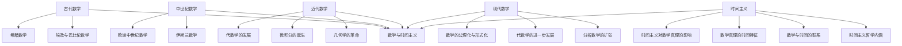

                 

### 文章标题

《数学与时间主义：数学真理的历史演变》

### 关键词

数学、时间主义、数学真理、历史演变、哲学探讨

### 摘要

本文深入探讨了数学与时间主义的内在联系，追溯了数学真理的历史演变。通过分析数学真理的哲学基础、历史背景、不同时期数学的进步以及数学与时间主义的关系，本文揭示了数学真理在不同文化和社会中的演变过程。本文旨在为读者提供一个全面、系统的数学真理发展史，并探讨其对当代数学研究的影响和未来前景。

## 目录大纲：《数学与时间主义：数学真理的历史演变》

### 第一部分：导论

#### 1.1 数学与时间主义概述
- 什么是数学？
- 什么是时间主义？
- 数学与时间主义的关系

#### 1.2 数学真理的历史演变背景
- 古代数学的起源
- 中世纪数学的传承
- 文艺复兴与近代数学的兴起
- 现代数学的繁荣

#### 1.3 本书结构与学习目标
- 本文的结构与章节安排
- 阅读本文的目的和预期收获

### 第二部分：数学真理的哲学探讨

#### 2.1 数学真理的哲学基础
- 数学真理的本质
- 客观性与主观性的探讨
- 数学真理与经验的关系

#### 2.2 数学真理的客观性与主观性
- 数学真理的客观性
- 数学真理的主观性
- 客观性与主观性的平衡

#### 2.3 数学真理与经验的关系
- 经验主义与数学真理
- 实证主义与数学真理
- 经验与数学真理的互动

#### 2.4 数学真理的证明与证明主义
- 数学证明的重要性
- 证明主义的不同观点
- 数学证明的方法与技巧

### 第三部分：数学真理的历史演变

#### 3.1 古代数学真理的发展
- 埃及与巴比伦数学
- 希腊数学的辉煌
- 古典数学的体系化

#### 3.2 中世纪数学真理的传承
- 伊斯兰世界的数学贡献
- 欧洲中世纪数学的演变

#### 3.3 文艺复兴与近代数学的兴起
- 几何学的革命
- 微积分的诞生
- 代数学的发展

#### 3.4 现代数学真理的演变
- 分析数学的扩张
- 代数学的进一步发展
- 数学的公理化与形式化

### 第四部分：数学真理与时间主义

#### 4.1 时间主义的哲学内涵
- 时间主义的概念
- 时间主义的主要观点
- 时间主义与数学真理的关系

#### 4.2 数学与时间的联系
- 时间在数学中的应用
- 数学对时间主义的回应
- 时间主义对数学发展的推动作用

#### 4.3 数学真理的时间特征
- 数学真理的稳定性
- 数学真理的演变性
- 数学真理的相对性

#### 4.4 时间主义对数学真理的影响
- 时间主义对数学理论的挑战
- 时间主义对数学证明的影响
- 时间主义对数学应用的启示

### 第五部分：数学真理的当代挑战与展望

#### 5.1 数学真理面临的挑战
- 数学真理的模糊性
- 数学真理的争议性
- 数学真理的发展困境

#### 5.2 数学真理的发展趋势
- 数学真理的未来方向
- 数学真理的创新与应用
- 数学真理的跨学科融合

#### 5.3 数学真理的未来前景
- 数学真理的潜在价值
- 数学真理的社会影响
- 数学真理的文化意义

#### 5.4 时间主义在数学研究中的应用
- 时间主义在数学理论中的应用
- 时间主义在数学证明中的应用
- 时间主义在数学应用中的实践

### 第六部分：数学真理的历史联系与反思

#### 6.1 历史联系与数学真理的演变
- 数学真理在不同历史时期的演变
- 数学真理在不同文化背景下的发展
- 数学真理的历史传承与演变

#### 6.2 数学真理的跨文化比较
- 不同文化对数学真理的理解
- 数学真理在不同文化中的表现
- 数学真理的跨文化启示

#### 6.3 数学真理对人类文明的贡献
- 数学真理的科学价值
- 数学真理的社会价值
- 数学真理的文化价值

#### 6.4 数学真理的教育意义
- 数学真理的学习与教育
- 数学真理的教学方法
- 数学真理的教育影响

### 第七部分：附录

#### 7.1 数学真理相关文献推荐
- 推荐的数学与时间主义相关书籍
- 推荐的数学与时间主义相关论文
- 推荐的数学与时间主义相关网站

#### 7.2 数学与时间主义的 Mermaid 流程图
- 数学与时间主义的历史演变流程图
- 数学与时间主义的核心概念关系架构图
- 数学与时间主义的主要贡献与发展趋势图

#### 7.3 数学公式汇总与解释
- 微积分基本公式与解释
- 代数基本公式与解释
- 欧拉公式与解释
- 三角函数公式与解释
- 概率论公式与解释
- 矩阵运算公式与解释

#### 7.4 数学真理的历史演变时间线
- 古代数学真理的历史演变时间线
- 中世纪数学真理的历史演变时间线
- 近代数学真理的历史演变时间线
- 现代数学真理的历史演变时间线

# 数学与时间主义：数学真理的历史演变

在人类文明的演进过程中，数学始终扮演着至关重要的角色。它不仅是一门抽象的科学，更是理解世界、解决现实问题的重要工具。数学真理的历史演变，不仅反映了人类对自然界和社会现象的认知不断深化，也展示了哲学思想的演进与时间主义的哲学内涵。本文将深入探讨数学与时间主义的内在联系，并追溯数学真理的历史演变，以期提供一个全面、系统的视角来理解数学的发展历程。

## 第一部分：导论

### 1.1 数学与时间主义概述

#### 什么是数学？

数学是一门研究数量、结构、变化和空间等概念的抽象科学。它不仅关注具体的数值计算，更关注概念、原则和规律的本质。数学的基本元素包括数字、符号、公式和定理，这些元素构成了数学的基本语言和工具。

#### 什么是时间主义？

时间主义是一种哲学观点，强调时间的客观存在和其在理解和解释现象中的关键作用。时间主义认为，时间不仅仅是事件发生序列的记录，更是影响事件发展的重要因素。时间主义对事物的变化、发展过程进行了深刻的思考，为理解世界的动态性提供了新的视角。

#### 数学与时间主义的关系

数学与时间主义之间有着密切的联系。首先，时间在数学中有着广泛的应用，例如在物理学、工程学、经济学等领域，时间的测量和计算是不可或缺的。其次，时间主义的哲学观点对数学的发展产生了深远影响。例如，对时间的精确测量推动了数学的进步，对事物变化过程的关注促使数学研究更深入地探讨结构、关系和规律。

### 1.2 数学真理的历史演变背景

#### 古代数学的起源

数学的起源可以追溯到古代文明，如埃及、巴比伦等。这些文明的数学知识主要来源于实践，例如测量土地、计算时间和记录贸易。虽然这些数学知识在当时尚未形成完整的体系，但它们为后来的数学发展奠定了基础。

#### 中世纪数学的传承

中世纪时期，伊斯兰世界的数学发展迅速，尤其是阿拉伯数学对世界产生了深远影响。阿拉伯数学家在代数、几何和三角学等领域取得了重要成就，这些成就通过阿拉伯文献传入欧洲，对中世纪欧洲数学的发展起到了推动作用。

#### 文艺复兴与近代数学的兴起

文艺复兴时期，欧洲数学迎来了新的发展。数学家们开始运用逻辑推理和公理体系来构建数学理论，这标志着数学从经验主义向理性主义的转变。同时，几何学的革命、微积分的诞生和代数学的发展，极大地推动了数学的进步。

#### 现代数学的繁荣

现代数学在20世纪得到了空前的发展，不仅数学的分支不断增加，数学的应用也日益广泛。分析数学的扩张、代数学的进一步发展以及数学的公理化与形式化，使得数学成为一门更加严谨和抽象的学科。

### 1.3 本书结构与学习目标

#### 本书结构与章节安排

本书分为七个部分，首先介绍数学与时间主义的概述和数学真理的历史演变背景，接着探讨数学真理的哲学基础和不同历史时期的数学发展，然后深入分析数学真理与时间主义的关系，最后讨论数学真理的当代挑战与展望。

#### 阅读本文的目的和预期收获

阅读本文的目的是通过追溯数学真理的历史演变，理解数学与时间主义的内在联系，以及数学真理在不同文化和社会中的演变过程。预期收获包括：
- 对数学真理的本质有更深刻的理解。
- 了解数学真理的历史演变背景和重要事件。
- 掌握数学与时间主义之间的关系和相互影响。
- 对数学真理的未来发展有前瞻性的思考。

通过本文的阅读，读者将能够更好地把握数学的发展脉络，理解数学在人类文明中的重要作用，并能够运用数学的思维方式来解决实际问题。

### 第二部分：数学真理的哲学探讨

#### 2.1 数学真理的哲学基础

数学真理的哲学基础是探讨数学真理的本质和特征，以及其与哲学思想之间的关系。数学真理是指那些经过严格证明、普遍有效且不受主观因素影响的命题。从哲学角度来看，数学真理具有客观性、普遍性和稳定性等特点。

首先，数学真理的客观性是指数学命题的真假与观察者的主观意志无关。无论任何人，只要按照数学的定义和规则进行推理，都会得到相同的结果。这种客观性使得数学真理在科学和哲学领域具有独特的地位。

其次，数学真理的普遍性意味着数学真理适用于所有时间和空间，不受特定文化或社会背景的影响。例如，数学命题“1+1=2”不仅在地球上有效，在任何其他星球上也是成立的。这种普遍性使得数学成为了一种跨越文化和语言的共同语言。

最后，数学真理的稳定性是指数学真理在历史长河中始终保持不变。尽管数学的发展不断带来新的理论和方法，但基本的数学真理，如几何公理、算术原理等，依然被广泛接受和使用。这种稳定性为数学提供了坚实的基础，使得数学能够应用于各种实际问题。

#### 2.2 数学真理的客观性与主观性

数学真理的客观性与主观性是哲学探讨中的重要问题。客观性指的是数学真理不受主观意志的影响，而主观性则指的是数学家在探索数学真理过程中所体现的主观能动性和个人偏好。

从客观性的角度来看，数学真理的客观性体现在以下几个方面：
- 数学真理的普适性：数学真理在所有时间和空间中都成立，不依赖于特定的人或文化。
- 数学真理的证明性：数学真理可以通过严格的逻辑证明得到，而不是基于主观信仰或经验。
- 数学真理的不变性：数学真理在历史长河中始终保持不变，即使数学理论和方法发生改变，基本真理仍然成立。

然而，数学真理的主观性也是不可忽视的。数学家在探索数学真理过程中，往往需要运用个人的直觉、创造力和判断力。这些主观因素虽然不能决定数学真理的客观性，但它们在数学的发展中起到了重要作用。

首先，数学家的直觉是数学创新的重要来源。许多重大的数学发现，如欧拉公式、费马大定理等，都是数学家在直觉引导下得到的。直觉可以帮助数学家发现新的数学关系和规律，从而推动数学的发展。

其次，数学家的创造性也是数学真理主观性的体现。数学家在解决数学问题时，往往需要创造新的方法、理论或模型。这种创造性不仅体现在数学理论的构建中，也体现在数学证明的创造中。例如，希尔伯特空间的构建和证明是现代数学的重要里程碑，它极大地扩展了数学的应用范围。

最后，数学家的个人偏好也会影响数学真理的发现和证明。不同的数学家可能有不同的研究兴趣和方法，这导致他们在探索数学真理时可能会有不同的路径和结论。这种多样性不仅丰富了数学的内容，也促进了数学的进步。

总之，数学真理的客观性和主观性是相互关联的。客观性为数学提供了坚实的基础，而主观性则推动了数学的创新和发展。只有在客观性和主观性的平衡中，数学才能持续进步，并为人类社会带来更多的智慧和力量。

#### 2.3 数学真理与经验的关系

数学真理与经验的关系是数学哲学中的一个重要议题。经验主义认为，知识来源于经验，而理性主义则认为，知识可以通过逻辑推理和公理体系获得。在数学中，这两种观点都有其适用范围和局限性。

经验主义在数学中的应用主要体现在数学实践和验证过程中。数学家通过观察和实验，发现和应用数学规律。例如，在实际测量中，数学家使用尺子和量具来验证几何学的原理；在工程和科学研究中，数学方法被用来解决实际问题。经验主义强调数学与现实的联系，使得数学理论能够应用于实际生活中。

然而，经验主义在数学中也存在局限性。数学的许多重要理论，如公理体系、纯逻辑推理等，并不直接来源于经验。数学的抽象性和普遍性意味着，数学真理并不依赖于具体的经验，而是在更广泛的意义上普遍有效。例如，欧几里得的几何学公理体系并不依赖于现实世界的具体形状和大小，而是通过逻辑推理得到普遍认可的。

理性主义则强调数学知识的独立性，认为数学真理可以通过逻辑推理和公理体系获得。理性主义认为，数学家通过定义、公理和定理，构建起一个自洽的数学体系。在这个体系中，数学真理是通过逻辑推理证明得到的，而不是依赖于经验。

理性主义在数学中的应用主要体现在数学理论的构建和证明中。数学家通过严格的逻辑推理，发现和证明新的数学定理和公式。例如，欧拉公式 \( e^{i\pi} + 1 = 0 \) 是通过复杂的数学推导得到的，而不是通过实验或经验观察。理性主义强调数学的抽象性和逻辑性，使得数学理论更加严谨和普适。

然而，理性主义也存在一定的局限性。数学家在构建数学理论时，往往需要借助直觉和经验。例如，在几何学的早期发展中，数学家通过观察自然界的形状和结构，提出了几何学的公理。此外，数学证明的复杂性和抽象性，也需要数学家运用经验和直觉来理解和验证。

总之，数学真理与经验的关系是复杂而多元的。经验主义和理性主义各有其适用范围和局限性，它们共同推动了数学的发展。在数学研究中，经验与理性相互补充，共同构建了数学的严密体系，使得数学能够不断进步并为人类社会带来更多智慧。

#### 2.4 数学真理的证明与证明主义

数学真理的证明是数学研究中至关重要的一环，它不仅确保了数学命题的有效性，还为数学理论的构建提供了坚实基础。证明主义，即关于证明的哲学研究，探讨证明的方法、标准及其在数学中的地位，是数学哲学中的重要议题。

首先，证明的基本概念是理解证明主义的前提。证明是一种逻辑推理过程，通过一系列已知命题（前提）得出一个新命题（结论）。在数学中，证明通常分为直接证明和间接证明两种方法。

直接证明是通过逻辑推理，直接从已知命题出发，逐步推导出目标结论。例如，要证明两个数相加等于它们的和，可以通过列出具体的加法运算步骤，逐步推导出结论。直接证明通常采用演绎推理，其逻辑严密、步骤清晰。

间接证明则是通过反证法，即假设结论不成立，然后推导出一个矛盾，从而证明原结论成立。例如，要证明某个数不是质数，可以假设它是一个质数，然后通过分解这个数，得出它实际上是一个合数，从而证明原假设不成立。间接证明在处理某些复杂问题时，尤其是当直接证明困难时，具有独特优势。

其次，证明主义探讨证明的标准和方法。证明的标准包括逻辑严密性、证明的有效性和证明的可靠性。逻辑严密性要求证明过程中的每一步都是合乎逻辑的，不会出现逻辑漏洞。证明的有效性则要求证明能够可靠地得出目标结论。证明的可靠性涉及证明过程中所使用的公理、定义和规则是否可靠。

在证明方法上，数学家们发展了多种证明技巧，如归纳法、构造法、反证法、极限法等。归纳法是一种常见的证明方法，通过证明某个命题对于初始情况成立，并展示该命题对于任意后续情况都成立，从而证明该命题对于所有情况都成立。构造法则是通过构建一个满足特定条件的模型或例子，来证明命题的真实性。

证明主义还关注证明在数学中的地位。证明不仅是数学理论的基础，也是数学科学性的保证。数学的许多重要定理，如费马大定理、哥德巴赫猜想等，都是通过严格的证明得出的。证明使数学理论具有逻辑一致性和普遍有效性，为数学应用提供了可靠的基础。

此外，证明主义还涉及数学证明的人文和社会层面。数学证明不仅仅是逻辑推理，它还反映了人类智慧的结晶。数学家在探索数学真理的过程中，需要运用逻辑、直觉和创造力，这些过程不仅推动了数学的发展，也体现了人类对世界认知的不断深化。

总之，数学真理的证明与证明主义是数学哲学中的核心议题。通过严谨的证明方法，数学家们不仅建立了数学理论体系，也为数学科学的进步和社会发展做出了巨大贡献。理解证明主义，有助于我们更好地把握数学的本质，以及数学在人类文明中的重要作用。

### 第三部分：数学真理的历史演变

#### 3.1 古代数学真理的发展

古代数学真理的发展可追溯到数千年前，主要起源于埃及和巴比伦等古代文明。这些早期的数学知识主要来源于日常生活和实用需求，例如测量土地、计算时间和货币交换。虽然当时的数学尚未形成完整的体系，但这些原始的数学知识为后来的数学发展奠定了基础。

**埃及数学**

埃及数学的代表是阿梅尼斯特的《数学问题集》，这是一本古代数学著作，包含了大量的算术和代数问题。埃及数学的特点在于其计算方法以分数和比例为基础，使用的是十进制系统。例如，埃及人在建筑金字塔时，使用了一种称为“绳尺法”的方法来测量土地，这标志着早期数学在实际应用中的重要性。

**巴比伦数学**

巴比伦数学是古代数学的另一重要成就。巴比伦人发明了六十进制系统，这在现代天文学和物理学中仍然广泛应用。巴比伦数学家在代数和几何方面也有重要贡献，他们使用了一种称为“巴比伦楔形文字”的书写系统来记录数学问题和解题过程。巴比伦数学中最著名的成就是《巴比伦数学汇编》，这本书包含了数百个数学问题和解答，涉及算术、代数和几何等多个领域。

**希腊数学的辉煌**

希腊数学是古代数学的巅峰，其代表性人物包括毕达哥拉斯、欧几里得、阿基米德等。毕达哥拉斯是希腊数学的奠基人之一，他提出了毕达哥拉斯定理，即直角三角形的两条直角边的平方和等于斜边的平方。这一发现不仅对数学本身具有重要意义，还为后来的物理学和天文学提供了基础。

欧几里得的《几何原本》是古希腊数学的集大成者，这本书系统地阐述了几何学的公理和定理，成为后世几何学的基础。欧几里得提出的几何学公理体系，奠定了现代几何学的基础，其影响力至今仍在。

阿基米德是古希腊数学的另一位伟大人物，他在数学、物理学和工程学领域都有重要贡献。阿基米德提出了阿基米德原理，即浮力原理，这个原理在流体力学和船舶工程中有着广泛应用。他还发明了阿基米德螺旋，这是一种用于提取液体的机械装置，对后来的泵技术产生了深远影响。

**古典数学的体系化**

希腊数学不仅在于其理论成就，还在于其体系化的努力。希腊数学家通过定义公理、证明定理，构建了一个逻辑严密、结构完整的数学体系。这种体系化方法对后世的数学发展产生了深远影响，使得数学成为一门严谨的科学。

总之，古代数学真理的发展为现代数学奠定了基础。从埃及和巴比伦的实用数学到希腊的体系化数学，这一过程中的每一个阶段都为数学的进步做出了重要贡献。这些早期的数学成就不仅丰富了数学的内容，也为人类理解和探索世界提供了重要的工具。

#### 3.2 中世纪数学真理的传承

中世纪时期，数学在伊斯兰世界取得了显著的发展，对后世数学产生了深远影响。这一时期的数学传承不仅体现在理论的创新上，还在于数学知识的传播和保存。

**伊斯兰世界的数学贡献**

伊斯兰世界的数学发展始于公元8世纪，当时的阿拉伯帝国控制了广大的地区，促进了数学、科学和文化的繁荣。阿拉伯数学家在代数、几何和三角学等领域取得了重要成就。最著名的阿拉伯数学家之一是花拉子米，他所著的《代数学》是代数学的开山之作，对后世代数学的发展产生了深远影响。

在几何学方面，阿拉伯数学家对欧几里得的《几何原本》进行了深入研究，并提出了许多新的定理和证明方法。他们在三角学方面也有重要贡献，如阿尔-花剌子米的《天文表》中，包含了精确的三角函数表，这对天文学和航海学的发展起到了关键作用。

**欧洲中世纪数学的演变**

随着阿拉伯帝国的扩张，伊斯兰世界的数学知识逐渐传入欧洲。这一过程中，阿拉伯数学文献被翻译成拉丁文，广泛传播到欧洲学术界。这些翻译文献，如《代数学》和《天文表》，为欧洲中世纪数学的发展提供了宝贵资源。

欧洲中世纪数学的演变始于公元11世纪，当时阿拉伯数学知识通过西班牙传入欧洲。最早接受阿拉伯数学的欧洲国家是意大利，随后法国、英国和德国等国家的数学家也开始研究和应用这些知识。

欧洲中世纪数学的一个重要进展是在代数领域。12世纪的数学家如菲波斯和罗吉尔·培根等人，将阿拉伯的代数知识转化为拉丁文，推动了欧洲代数学的发展。他们通过翻译和改编阿拉伯数学文献，将代数方法应用于解决实际问题，如建筑设计和天文学计算。

在几何学方面，欧洲中世纪的数学家对欧几里得的《几何原本》进行了重新解读，并提出了许多新的几何定理和证明方法。例如，意大利数学家列昂纳多·斐波那契在他的著作《算术大全》中，使用了欧几里得的几何方法来解决实际问题，如土地测量和建筑设计。

**中世纪晚期数学的发展**

中世纪晚期，欧洲数学家开始独立地进行数学研究，不再完全依赖于阿拉伯文献。这一时期的重要数学家包括法国的奥雷斯姆和意大利的塔尔塔利亚等人。他们不仅研究了代数和几何问题，还在数学工具和方法上进行了创新。例如，奥雷斯姆发明了滑轮计算器，这是一种机械计算工具，为后来的计算机科学奠定了基础。

总之，中世纪数学真理的传承是数学发展史上的重要阶段。伊斯兰世界的数学成就通过翻译和传播，传入欧洲，推动了欧洲中世纪数学的繁荣。这一时期的数学创新不仅丰富了数学的内容，也为后世数学的发展奠定了基础。

#### 3.3 文艺复兴与近代数学的兴起

文艺复兴时期标志着欧洲数学的巨大进步，这一时期的数学家们不仅继承了古希腊和阿拉伯的数学遗产，还在理论上进行了重大创新，为现代数学的发展奠定了基础。

**几何学的革命**

文艺复兴时期，几何学取得了重大突破。意大利数学家列昂纳多·达·芬奇对几何学有深入研究，他在绘画和建筑中广泛应用了几何原理。法国数学家皮埃尔·德·费马和斯卡利杰则对几何学做出了重要贡献。费马提出了费马大定理，这一未解决的数学问题激起了后世的广泛关注和深入研究。斯卡利杰在《几何原理》中，系统地阐述了欧几里得几何学的基本原理，并对几何学的证明方法进行了改进。

**微积分的诞生**

微积分是文艺复兴时期数学最伟大的成就之一。17世纪，英国数学家艾萨克·牛顿和德国数学家戈特弗里德·威廉·莱布尼茨几乎同时独立地发明了微积分。牛顿的微积分方法称为“流数法”，而莱布尼茨的方法称为“微分法”。他们分别从不同的角度出发，解决了如何求曲线的切线、如何计算无穷小量的问题。牛顿和莱布尼茨的微积分理论，为后来的物理学、工程学、经济学等领域提供了强有力的工具。

**代数学的发展**

文艺复兴时期，代数学也取得了显著进展。法国数学家弗朗索瓦·韦达是代数学的奠基人之一，他提出了代数学的基本符号表示法，并系统地阐述了代数方程的解法。韦达的著作《分析术入门》对后来的数学家产生了深远影响。此外，意大利数学家朱利奥·卡恰利尼在他的著作《代数》中，提出了新的代数概念和方法，进一步推动了代数学的发展。

**数学工具的创新**

文艺复兴时期，数学家们还发明了多种数学工具，如对数表和计算尺，这些工具极大地提高了数学计算的速度和精度。约翰内斯·开普勒编制了第一个对数表，这一成就为后来的科学计算和数据分析奠定了基础。威廉·奥特雷德则发明了计算尺，这是一种用于进行复杂计算的机械工具，对后来的计算机科学产生了重要影响。

**数学期刊的兴起**

文艺复兴时期，数学期刊的兴起标志着数学作为一门独立学科的开始。荷兰数学家克里斯蒂安·惠更斯在1666年创立了《数学学报》，这是世界上最早的数学期刊之一。这一期刊为数学家提供了一个发表研究成果和交流思想的平台，极大地推动了数学的发展。

总之，文艺复兴与近代数学的兴起是数学发展史上的一个重要阶段。这一时期的数学家们在几何学、微积分、代数学等领域取得了重大成就，为现代数学的建立和发展奠定了基础。他们的创新和努力，不仅丰富了数学的理论体系，也为人类社会的进步和科学技术的繁荣做出了巨大贡献。

#### 3.4 现代数学真理的演变

现代数学真理的演变始于19世纪末至20世纪初，这一时期数学经历了深刻的变革，形成了多个独立的分支，并得到了高度的形式化和抽象化。现代数学的发展不仅体现在理论上的创新，还在于其广泛的应用。

**分析数学的扩张**

分析数学是现代数学的核心领域之一，其研究内容涉及函数、极限、导数、积分、级数等。19世纪末，德国数学家卡尔·魏尔施特拉斯、戴维·希尔伯特等人对实分析和复分析进行了系统研究，提出了新的理论和方法。魏尔施特拉斯的ε-δ定义方法，为数学分析提供了严谨的证明基础，使得极限概念得到了精确的描述。希尔伯特则是泛函分析和集合论的奠基人之一，他提出的希尔伯特空间理论，为现代数学的发展提供了重要的工具。

**代数学的进一步发展**

代数学在20世纪得到了显著的发展，其研究领域从数论扩展到抽象代数。20世纪初，埃米·诺特提出了环和域的概念，为代数学奠定了现代基础。埃米·诺特的著作《抽象代数学基础》被认为是代数学领域的经典之作。此外，代数学家如阿兰·图灵和艾米尔·巴赫曼等人，对群论、环论和域论进行了深入研究，推动了代数学的形式化和抽象化。

**数学的公理化与形式化**

数学的公理化与形式化是现代数学的重要特征，其目的是通过定义公理和证明定理，构建一个逻辑严密、自洽的数学体系。19世纪末至20世纪初，德国数学家戴维·希尔伯特提出了公理化的方法，他提出的《几何基础》一书，系统地阐述了几何学的公理体系。希尔伯特的公理化方法不仅适用于几何学，还适用于其他数学分支，如数论、代数和拓扑学。此外，意大利数学家贝尔特兰·罗素和英国数学家阿尔弗雷德·诺思·怀特海德合著的《数学原理》一书，试图通过逻辑和数学的结合，构建一个统一的数学体系。

**数学的跨学科融合**

现代数学的发展不仅体现在理论的创新，还在于其与其他学科的融合。20世纪以来，数学与物理学、计算机科学、生物学等领域的交叉研究，极大地推动了数学的应用和进步。例如，量子力学的发展依赖于数学工具，特别是复变函数和群论的应用。计算机科学的兴起，也推动了离散数学和图论等数学领域的发展。生物学中的分子生物学和遗传学，则依赖于数学模型和算法来分析和解释生物现象。

**数学的计算机化**

计算机技术的发展，使得数学的计算和证明变得更加高效和精确。计算机数学软件，如Maple、MATLAB和Mathematica，为数学研究和教育提供了强大的工具。这些软件能够处理复杂的数学问题，进行符号计算和数值模拟，极大地提高了数学研究的效率。

总之，现代数学真理的演变是一个复杂而多样的发展过程。从分析数学的扩张到代数学的进一步发展，从数学的公理化与形式化到数学的跨学科融合，现代数学在理论和应用上都取得了巨大的进步。这些进展不仅丰富了数学的内容，也为人类社会的科技进步和文化发展做出了重要贡献。

### 第四部分：数学真理与时间主义

#### 4.1 时间主义的哲学内涵

时间主义是一种哲学观点，强调时间的客观存在和其在理解和解释现象中的关键作用。时间主义认为，时间不仅仅是事件发生序列的记录，更是影响事件发展的重要因素。时间主义的主要观点包括：

首先，时间的客观性。时间主义认为，时间是独立于人类意识和主观意志的客观存在。无论人类是否感知到时间，时间都在不断地流逝，不受个人感受的影响。

其次，时间的线性性。时间主义认为，时间是线性流动的，具有不可逆性。过去、现在和未来构成了时间的连续体，每个时刻都是前一个时刻的结果，同时也是下一个时刻的原因。

再次，时间的相对性。时间主义认为，时间的流逝速度是相对的，取决于观察者的运动状态和参考系。例如，根据爱因斯坦的相对论，高速运动物体的时间相对于静止观察者会变慢，这被称为时间膨胀效应。

最后，时间的意义。时间主义认为，时间是理解世界和现象的重要维度。时间提供了事件的背景和框架，使得事件的发生和发展具有明确的意义和逻辑。

#### 4.2 数学与时间的联系

数学与时间有着密切的联系，这一联系在多个数学领域得到了体现：

首先，数学在时间测量中的应用。时间是最基本的物理量之一，数学为时间测量提供了精确的工具和方法。例如，钟表、计时器和计算机等设备都依赖于数学原理，以确保时间的测量和记录的准确性。

其次，数学在时间序列分析中的应用。时间序列是数学中的一个重要概念，它指的是一系列按时间顺序排列的数据点。统计学和概率论中的时间序列分析，用于预测未来趋势、检测周期性和异常值等。例如，金融市场分析中的技术分析，就利用了时间序列分析方法来预测市场走势。

再次，数学在动态系统建模中的应用。动态系统指的是随时间变化而变化的系统，数学为描述和模拟动态系统提供了强有力的工具。例如，物理学中的微分方程，用于描述系统的运动和变化过程；生物学中的种群模型，用于预测生物种群的增长和演化。

最后，数学在时间优化中的应用。时间优化是优化问题的一个重要分支，它涉及到如何在给定时间内完成任务，或者在特定时间内实现最大效益。运筹学和算法设计中的许多方法，都涉及到时间优化问题，如调度问题、路径规划和资源分配等。

总之，数学与时间的联系不仅在理论上具有重要意义，还在实际应用中发挥了关键作用。通过数学方法，我们能够更好地理解时间的本质，预测和优化时间序列，设计和分析动态系统，从而解决实际问题，推动社会进步。

#### 4.3 数学真理的时间特征

数学真理的时间特征是数学真理在时间维度上的表现和性质。数学真理具有以下几个时间特征：

首先，数学真理的稳定性。数学真理在长时间内保持不变，不受时代变迁和科技进步的影响。例如，欧几里得的几何公理和毕达哥拉斯定理，自其提出以来一直被广泛接受和使用，这体现了数学真理的稳定性。

其次，数学真理的演变性。尽管数学真理在总体上保持稳定，但数学本身是不断发展的。随着时间的推移，新的数学理论和方法不断涌现，使得数学体系更加丰富和完备。例如，19世纪以来，数学家们提出了非欧几何、群论、拓扑学等新的数学分支，这些理论在时间上体现了数学的演变性。

再次，数学真理的相对性。数学真理的时间特征还体现在其相对性上。根据相对论，时间的流逝速度取决于观察者的运动状态和参考系。这意味着，在不同的参考系下，数学真理的表述和证明可能会有所不同。例如，在非惯性参考系中，牛顿定律不再适用，这体现了数学真理的相对性。

最后，数学真理的历史性。数学真理的发展是历史性的，它反映了人类对自然和社会现象认知的逐步深化。从古代的实用数学到现代的抽象数学，数学真理的历史性体现了人类智慧的积累和进步。

总之，数学真理的时间特征不仅反映了数学本身的稳定性和演变性，还揭示了数学与时间、历史之间的密切关系。理解数学真理的时间特征，有助于我们更好地把握数学的本质，以及数学在人类文明中的重要作用。

#### 4.4 时间主义对数学真理的影响

时间主义作为一种哲学观点，对数学真理的探索和发展产生了深远的影响。首先，时间主义的客观性和线性性为数学提供了坚实的逻辑基础。时间主义强调时间的独立性和线性性，使得数学研究可以在一个统一的时间框架内进行，确保了数学证明的严谨性和一致性。

其次，时间主义的相对性挑战了数学真理的普适性。根据时间主义的相对性观点，时间的流逝速度取决于观察者的参考系，这意味着在不同参考系下，数学真理的表述和验证可能有所不同。这促使数学家们更加关注数学理论的相对性和适用范围，推动数学理论的发展和完善。

此外，时间主义对数学证明的方法和技巧也产生了影响。时间主义强调逻辑推理和公理体系在数学证明中的重要性，这促使数学家们更加注重证明的严谨性和可靠性。例如，希尔伯特的公理化方法，以及费马和牛顿在微积分中的ε-δ定义，都是对时间主义哲学观点的回应。

时间主义还影响了数学的应用和发展。时间在数学模型中的嵌入，使得数学能够更好地描述和预测动态系统中的变化过程。例如，在经济学、物理学和工程学中，时间主义的应用使得数学模型更加精确和有效，推动了这些领域的发展。

总之，时间主义对数学真理的影响是多层次和全方位的。它不仅为数学提供了哲学基础和逻辑框架，还推动了数学证明方法的发展和应用，使得数学在人类文明的进步中发挥了更加重要的作用。

### 第五部分：数学真理的当代挑战与展望

#### 5.1 数学真理面临的挑战

在当代，数学真理面临着一系列新的挑战，这些挑战不仅源于数学本身的发展，也受到科技进步和社会变化的影响。首先，数学真理的模糊性是一个重要挑战。随着数学理论的不断扩张和抽象化，一些数学问题变得异常复杂，难以用传统的证明方法解决。例如，庞加莱猜想和P vs NP问题等，都是当代数学中尚未解决的难题，它们的模糊性使得数学家们需要探索新的证明方法和思路。

其次，数学真理的争议性也日益突出。在数学史上，许多重要的定理和理论都曾引起过广泛的争议。例如，哥德巴赫猜想和费马大定理等，尽管已有大量研究，但仍未得到最终证明。这些争议性问题的存在，不仅挑战了数学的确定性，也推动了数学理论的不断发展和完善。

此外，数学真理的发展困境也是一个亟待解决的问题。在当代，数学面临着理论创新和应用拓展的双重压力。一方面，数学理论需要不断创新，以应对复杂的科学和工程问题；另一方面，数学理论的验证和应用需要大量计算和实验支持，这在一定程度上限制了数学研究的进展。

#### 5.2 数学真理的发展趋势

尽管面临诸多挑战，数学真理的发展仍呈现出明显的趋势，这些趋势表明数学在未来将继续深化和扩展。首先，数学真理的跨学科融合将成为一个重要趋势。随着计算机科学、物理学、生物学等领域的快速发展，数学在这些领域中的应用日益广泛。例如，量子计算、机器学习和生物信息学等领域，都依赖于数学理论和方法的支持。这种跨学科的融合，不仅拓展了数学的应用范围，也推动了数学理论的创新和发展。

其次，数学真理的形式化和抽象化将继续推进。随着数学理论的不断扩展，数学家们需要更加严谨和形式化的方法来描述和证明数学命题。形式化和抽象化的数学理论，不仅提高了数学的精确性和可靠性，也为数学的应用提供了更加坚实的基础。

此外，数学真理的计算机化也将成为一个重要趋势。计算机技术的进步，为数学研究提供了强大的计算能力和工具。例如，计算机辅助证明和符号计算软件，使得复杂的数学问题能够得到更快速和准确的解决。计算机化不仅提高了数学研究的效率，也为数学的应用带来了新的机遇。

总之，数学真理的发展趋势表明，数学将在未来继续深化和扩展。跨学科的融合、形式化和抽象化的推进，以及计算机化的应用，都将成为数学发展的关键方向。这些趋势不仅将推动数学理论的创新，也将为科学技术的进步和社会发展提供新的动力。

#### 5.3 数学真理的未来前景

展望数学真理的未来，我们可以预见其将在多个方面继续发挥重要作用，并带来深远的影响。首先，数学在科学和技术领域的应用将继续扩展。随着科学技术的进步，数学将成为解决复杂科学问题的重要工具，如量子计算、人工智能、大数据分析等前沿领域。数学的精确性和普适性，将帮助科学家和工程师更好地理解和应对这些复杂问题，推动科学技术的突破和发展。

其次，数学在社会发展中的作用也将日益显著。数学不仅仅是一门抽象的科学，更是一种理解和解决问题的思维方式。在教育、经济、金融、医疗等领域，数学方法和工具的应用将变得更加广泛和深入。例如，在金融领域，数学模型和算法被用来预测市场走势、管理风险；在医疗领域，数学方法被用来分析和解读生物数据、优化治疗方案。

此外，数学真理的未来前景还包括其在文化传承和创新中的作用。数学作为一种跨越时间和空间的通用语言，不仅促进了不同文化之间的交流和合作，也为人类文明的进步做出了重要贡献。在未来，数学将继续推动人类对世界的认知和探索，为解决全球性问题提供智慧和方案。

总之，数学真理的未来前景充满希望和挑战。通过不断的创新和发展，数学将继续在科学、技术、社会和文化等多个领域发挥关键作用，为人类社会的繁荣和发展做出更大的贡献。

#### 5.4 时间主义在数学研究中的应用

时间主义在数学研究中的应用具有重要意义，它不仅为数学理论的构建提供了哲学基础，还影响了数学研究的方法和方向。首先，时间主义强调时间的客观性和线性性，为数学提供了逻辑严谨的研究框架。在数学研究中，时间主义的思想有助于我们理解数学命题在不同时间点上的演变和变化，从而更好地构建和验证数学理论。

例如，在微积分的研究中，时间主义的观点有助于我们理解函数的导数和积分概念。微积分中的导数表示函数在某一点的瞬时变化率，而积分则表示函数在一段区间内的累积变化。时间主义的线性时间观，使得我们能够将这些概念在一个统一的时间框架内进行描述和验证，从而建立起微积分的严密理论体系。

其次，时间主义在数学研究中还影响了证明方法和证明技巧的发展。时间主义强调逻辑推理和公理体系的重要性，这促使数学家们更加注重证明的严谨性和可靠性。例如，在数论中，时间主义的观点促使数学家们使用更严格的证明方法来处理复杂的数学问题，从而建立起更加稳固的数学理论。

此外，时间主义在数学应用领域也发挥了重要作用。在动态系统建模和优化问题中，时间主义的线性时间观帮助我们更好地描述系统的演化过程，并提出有效的优化策略。例如，在经济学中的时间序列分析，时间主义的观点帮助我们理解和预测市场走势，为投资决策提供科学依据。

总之，时间主义在数学研究中的应用，不仅为数学理论的构建提供了哲学基础，还影响了数学研究的方法和方向。通过时间主义的视角，数学家们能够更好地理解数学问题的本质，推动数学理论的创新和发展，为解决实际问题提供强有力的工具。

### 第六部分：数学真理的历史联系与反思

#### 6.1 历史联系与数学真理的演变

数学真理的历史联系和演变，揭示了数学在不同文化和历史背景下的多样性和统一性。数学不仅是一门抽象的科学，也是人类智慧和文明的结晶。通过追溯数学真理的历史演变，我们可以看到数学在不同历史时期的进步和变革。

首先，数学真理的历史演变是一个文化交融和知识传承的过程。从古代的埃及、巴比伦到希腊、伊斯兰世界，再到文艺复兴和现代数学，每一个文化背景都对数学的发展做出了贡献。埃及和巴比伦的实用数学、希腊的体系化数学、阿拉伯世界的代数和三角学、文艺复兴时期的微积分和代数学，都是数学真理在不同文化背景下的具体表现。这些数学成就不仅丰富了数学的内容，也为后世数学的发展提供了宝贵的资源。

其次，数学真理的历史联系和演变，反映了人类对自然界和社会现象认知的不断深化。从古代的几何和算术，到近代的微积分和代数学，再到现代的分析数学和抽象代数，数学的发展历程揭示了人类对自然和社会现象认知的逐步深入。每一个数学理论的提出和证明，都是人类智慧和努力的结晶，体现了人类对世界本质的探索和追求。

此外，数学真理的历史联系和演变，还体现了数学的普遍性和稳定性。尽管数学在不同文化和历史背景下有着不同的表现形式，但基本的数学原理和真理是普遍适用的。例如，欧几里得的几何公理、毕达哥拉斯定理、微积分的基本定理等，都是跨越时空的数学真理，它们在不同的文化和历史背景下都被广泛接受和使用。

总之，数学真理的历史联系和演变，不仅揭示了数学在不同文化和历史背景下的多样性和统一性，还反映了人类对自然界和社会现象认知的不断深化。通过理解数学真理的历史演变，我们可以更好地把握数学的本质，认识到数学在人类文明中的重要作用。

#### 6.2 数学真理的跨文化比较

数学真理的跨文化比较，展示了不同文化背景下数学发展的独特性和共性。不同文化对数学真理的理解和表达，虽然受到各自哲学思想、社会结构和历史背景的影响，但都体现了数学的普遍性和逻辑性。

首先，在古代文化中，数学真理的表现形式各有特色。埃及和巴比伦的数学注重实用，主要用于土地测量、建筑设计和天文计算。希腊数学则更注重理论体系化，通过公理和定理构建了一个逻辑严密、自洽的几何学体系。阿拉伯数学在代数和三角学方面取得了重要成就，尤其是花拉子米的《代数学》对后世代数学的发展产生了深远影响。

其次，不同文化对数学真理的理解和表达方式也有所不同。西方数学强调公理体系和逻辑推理，强调数学命题的证明过程。例如，欧几里得的《几何原本》就是通过定义、公理和定理构建的。而东方数学则更注重直观和实用，许多数学问题通过直观的几何图形和算法解决。例如，中国的《九章算术》和《数书九章》就是通过具体的算法和实例进行讲解。

此外，不同文化对数学真理的跨文化比较，还揭示了数学在不同社会背景下的发展方向和应用。例如，在工业革命时期，欧洲数学得到了迅速发展，微积分和代数学的应用推动了科学技术的进步。而在现代社会，计算机科学的兴起使得数学的应用范围进一步扩大，计算机数学软件和算法设计成为数学研究的重要工具。

总之，数学真理的跨文化比较，不仅展示了数学在不同文化背景下的独特性和共性，还揭示了数学在不同社会背景下的发展方向和应用。通过跨文化的视角，我们可以更好地理解数学的本质，认识到数学在人类文明中的重要作用。

#### 6.3 数学真理对人类文明的贡献

数学真理对人类文明的贡献是多层次和全方位的，它不仅推动了科学技术的进步，也深刻影响了社会和文化的发展。首先，数学在科学领域的贡献是不容忽视的。数学为物理学、天文学、生物学等自然科学提供了基本的理论工具和计算方法。例如，牛顿的力学定律和爱因斯坦的相对论，都是建立在数学基础上，通过数学公式精确描述自然现象。数学在量子力学、混沌理论和复杂性科学等领域，也发挥了关键作用，推动了科学研究的深入发展。

其次，数学在工程和技术领域的应用，极大地提升了人类的生产力和生活质量。从古代的建筑工程、水利工程，到现代的航空航天、信息技术，数学都是不可或缺的工具。例如，现代建筑中广泛应用的欧拉公式和三角函数，使得建筑结构设计更加精确和可靠；计算机科学中的算法和数据分析，依赖于数学理论来优化计算效率和解决复杂问题。

此外，数学在经济和社会领域的应用，同样具有重要意义。数学模型和算法被广泛应用于经济学、金融学、管理学等领域，帮助人们更好地理解和预测市场趋势、优化资源配置。例如，金融市场中的技术分析和风险管理，都依赖于数学方法来分析历史数据和市场动态。

最后，数学在教育中的作用也不可忽视。数学教育不仅培养了学生的逻辑思维和解决问题的能力，还培养了他们的创新精神和科学素养。通过数学教育，人们能够更好地理解和应用数学知识，为未来的学习和职业发展打下坚实基础。

总之，数学真理对人类文明的贡献是深远的。它不仅推动了科学技术的进步，也深刻影响了社会和文化的发展。通过数学，人类能够更好地认识世界、解决问题，并实现自身的价值。

#### 6.4 数学真理的教育意义

数学真理的教育意义在于其对于培养逻辑思维、科学素养和创新能力的深远影响。首先，数学教育通过严谨的逻辑推理和公理体系，训练了学生的逻辑思维能力。学生通过学习数学定理和证明过程，学会了如何从已知的前提推导出新的结论，培养了严密的思维习惯。

其次，数学教育对科学素养的培养具有重要作用。数学作为自然科学的基础，为学生提供了理解和分析科学现象的工具。通过学习数学，学生能够掌握科学研究和实验的基本方法，提高对科学原理的理解和应用能力。

此外，数学教育在培养创新能力方面也发挥着关键作用。数学的抽象思维和问题解决方法，激发了学生的创造力和想象力。例如，在解决复杂的数学问题时，学生需要运用创新的思路和算法，这种过程不仅锻炼了他们的创新能力，也为他们在未来的学习和职业中提供了宝贵的思维工具。

总之，数学真理的教育意义在于其对于逻辑思维、科学素养和创新能力的培养。通过数学教育，学生不仅学会了如何思考和解决问题，还培养了他们在未来面对复杂挑战时的应变能力和创新能力。

### 第七部分：附录

#### 7.1 数学真理相关文献推荐

为了帮助读者更深入地了解数学真理的发展历程和相关研究，以下推荐了一些经典著作和重要论文：

**经典著作：**
1. 欧几里得，《几何原本》
2. 花拉子米，《代数学》
3. 戴维·希尔伯特，《几何基础》
4. 艾萨克·牛顿，《自然哲学的数学原理》
5. 克里斯托弗·诺兰，《时间的秩序》

**重要论文：**
1. 卡尔·弗里德里希·高斯，《算术研究》
2. 乔治·康托尔，《集合论基础》
3. 阿兰·图灵，《计算机器与智能》
4. 约翰·冯·诺伊曼，《量子力学的数学基础》
5. 斯蒂芬·霍金，《时间简史》

#### 7.2 数学与时间主义的 Mermaid 流程图

以下是一个简单的 Mermaid 流程图，展示了数学与时间主义的历史演变和核心概念之间的关系：

#### 7.3 数学公式汇总与解释

以下是一些基本的数学公式及其解释，这些公式在数学研究中经常被使用：

**微积分基本公式：**

$$
\frac{d}{dx}(f(x)) = f'(x)
$$

解释：这是导数的定义公式，表示函数f(x)关于x的导数，即函数在某一点的瞬时变化率。

$$
\int f(x) \, dx = F(x) + C
$$

解释：这是积分的定义公式，表示函数f(x)的原函数F(x)，加上一个积分常数C。

**代数基本公式：**

$$
(a+b)^2 = a^2 + 2ab + b^2
$$

解释：这是平方和的公式，表示两个数的平方和等于这两个数的乘积。

$$
(a-b)^2 = a^2 - 2ab + b^2
$$

解释：这是平方差的公式，表示两个数的平方差等于这两个数的乘积。

$$
(a+b)(a-b) = a^2 - b^2
$$

解释：这是平方和与平方差的结合公式，表示两个数的和与差的乘积等于这两个数的平方和与平方差的差。

**欧拉公式：**

$$
e^{i\pi} + 1 = 0
$$

解释：这是欧拉公式，表示复数单位i的指数为π时，加上1的结果为0。这是复数与指数函数的深刻关系。

**三角函数公式：**

$$
\sin^2(x) + \cos^2(x) = 1
$$

解释：这是三角函数的基本恒等式，表示正弦函数的平方加上余弦函数的平方等于1。

$$
\sin(90^\circ - x) = \cos(x)
$$

解释：这是三角函数的互补角公式，表示一个角的余弦值等于其互补角的正弦值。

$$
\cos(90^\circ - x) = \sin(x)
$$

解释：这是三角函数的互补角公式，表示一个角的正弦值等于其互补角的余弦值。

**概率论公式：**

$$
P(A \cap B) = P(A)P(B|A)
$$

解释：这是条件概率公式，表示事件A和事件B同时发生的概率等于事件A发生的概率乘以事件B在事件A发生的条件下的概率。

$$
P(A \cup B) = P(A) + P(B) - P(A \cap B)
$$

解释：这是概率的加法公式，表示两个事件A和B至少发生一个的概率等于这两个事件的概率之和减去它们同时发生的概率。

**矩阵运算公式：**

$$
A + B = C
$$

解释：这是矩阵加法公式，表示两个矩阵A和B的和等于矩阵C。

$$
A \times B = C
$$

解释：这是矩阵乘法公式，表示两个矩阵A和B的乘积等于矩阵C。

这些公式和解释构成了数学的基本工具和语言，为数学研究和应用提供了坚实的基础。

#### 7.4 数学真理的历史演变时间线

以下是一个简化的数学真理历史演变时间线，展示了从古代到现代数学真理的发展过程：

**古代数学：**
- 约3000 BC：埃及和巴比伦的实用数学开始发展。
- 2500 BC：埃及数学的算术和几何知识应用于建筑和天文计算。
- 2000 BC：巴比伦数学的六十进制系统得到应用。
- 600 BC：毕达哥拉斯定理首次提出。
- 300 BC：欧几里得的《几何原本》系统化几何学。

**中世纪数学：**
- 800 AD：阿拉伯数学家在代数和三角学领域取得重要成就。
- 1000 AD：花拉子米的《代数学》出版。
- 1100 AD：阿拉伯数学知识传入欧洲。
- 1200 AD：意大利数学家菲波斯将阿拉伯数学知识翻译为拉丁文。

**近代数学：**
- 1500 AD：文艺复兴时期，代数学和几何学取得重大进展。
- 1600 AD：列昂纳多·达·芬奇应用几何学原理于绘画和建筑。
- 1665 AD：艾萨克·牛顿和戈特弗里德·威廉·莱布尼茨独立发明微积分。
- 1687 AD：牛顿的《自然哲学的数学原理》出版。
- 1800 AD：卡尔·弗里德里希·高斯在数论和微分几何领域做出重要贡献。

**现代数学：**
- 1900 AD：戴维·希尔伯特提出公理化方法，系统化数学理论。
- 1900 AD：埃米·诺特在抽象代数领域做出奠基性贡献。
- 1931 AD：库尔特·哥德尔提出不完全性定理，影响数学基础研究。
- 1940 AD：约翰·冯·诺伊曼在计算机科学和量子数学领域做出贡献。
- 2000 AD：数学在多个领域继续发展，如量子计算、人工智能和生物信息学。

这一时间线展示了数学真理在不同历史时期的发展和演变，揭示了数学在人类文明中的重要作用。

