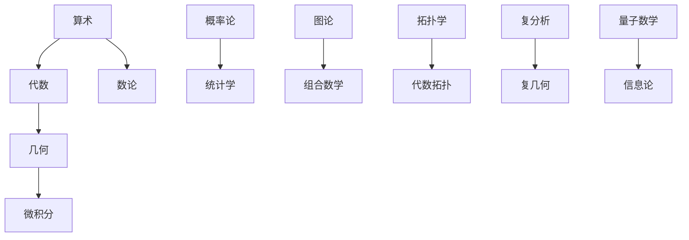

                 

### 文章标题

《数学与时间主义：数学真理随时间演化》

关键词：数学、时间主义、数学真理、演化、相对性、探索、应用

摘要：本文旨在探讨数学与时间主义之间的关系，特别是数学真理随着时间演化的现象。文章首先介绍了数学与时间主义的起源，然后从数学基础、数学真理的演化、数学真理的相对性以及数学真理的探索四个方面进行了详细分析。通过历史角度、科学革命和时代变迁等视角，深入探讨了数学真理的演变过程。同时，本文还讨论了数学真理的相对性原理及其在社会中的应用，并展望了数学真理探索的未来方向。最后，文章总结了数学与时间主义在科学、工程和社会等领域的综合应用，强调了其在人类社会发展中的重要性。

### 引言

#### 1.1 数学与时间主义的起源

数学与时间主义是两个看似独立的领域，但它们之间却有着深刻的联系。数学作为一种形式化的科学，起源于古代文明的计数和测量需求。最早的数学记录可以追溯到古埃及和美索不达米亚，他们在建筑、天文和农业等领域运用了基本的数学知识。随着时间的推移，数学逐渐发展为一门独立的学科，涉及代数、几何、微积分等多个分支。

时间主义（Chronism）则是一个较为新颖的概念，主要探讨时间在科学、哲学和人类生活中的作用。时间主义认为，时间不仅是事件的顺序记录，还影响了事物的本质和演化。时间主义最早可追溯到古希腊哲学家赫拉克利特（Heraclitus）的观点：“一切皆流，无物常驻。”

数学与时间主义的起源可以追溯到古希腊，当时的数学家们开始思考时间和运动的关系。例如，欧几里得的《几何原本》中就包含了对时间和空间的研究。在随后的历史中，数学和物理学的发展进一步深化了数学与时间主义之间的联系。

#### 1.2 本书结构与目标

本书旨在通过逻辑清晰、结构紧凑、简单易懂的叙述，深入探讨数学与时间主义之间的关系。全书分为七个部分：

1. **第一部分：引言**：介绍数学与时间主义的起源及其在本书中的重要性。
2. **第二部分：数学基础**：阐述数学概念、定理、模型和方法的基本原理。
3. **第三部分：数学真理的演化**：从历史、科学革命和时代变迁的角度分析数学真理的演变。
4. **第四部分：数学真理的相对性**：探讨数学真理的相对性原理及其应用。
5. **第五部分：数学真理的探索**：分析数学真理的探索方法及其在历史上的典型案例。
6. **第六部分：数学与时间主义的综合应用**：讨论数学与时间主义在科学、工程和社会等领域的应用。
7. **第七部分：结论**：总结本书的主要观点，并展望数学与时间主义在未来的发展方向。

通过以上结构，本书旨在帮助读者全面理解数学与时间主义之间的关系，以及数学真理如何随着时间演化。本文的目标是让读者不仅能够掌握数学与时间主义的基本概念，还能通过历史的视角和现实的案例分析，深入理解数学真理的复杂性和动态性。

### 1.2.1 全书框架

全书框架如下：

1. **第一部分：引言**：介绍数学与时间主义的起源及其在本书中的重要性。
   - 1.1 数学与时间主义的起源
   - 1.2 本书结构与目标

2. **第二部分：数学基础**：
   - 2.1 数学概念与定理
   - 2.2 数学模型与公式
   - 2.3 数学方法与应用

3. **第三部分：数学真理的演化**：
   - 3.1 历史角度下的数学真理
   - 3.2 科学革命对数学的影响
   - 3.3 时代变迁下的数学真理

4. **第四部分：数学真理的相对性**：
   - 4.1 数学真理的相对性原理
   - 4.2 数学真理的实证与证伪
   - 4.3 数学真理与社会影响

5. **第五部分：数学真理的探索**：
   - 5.1 数学真理的探索方法
   - 5.2 数学真理的探索案例
   - 5.3 数学真理的探索未来

6. **第六部分：数学与时间主义的综合应用**：
   - 6.1 数学与时间主义在科学中的应用
   - 6.2 数学与时间主义在工程中的应用
   - 6.3 数学与时间主义在社会中的应用

7. **第七部分：结论**：
   - 7.1 数学与时间主义的重要性
   - 7.2 本书总结

通过以上框架，本书旨在系统性地探讨数学与时间主义之间的关系，揭示数学真理如何随着时间演化，并分析其在不同领域的应用。

#### 1.2.2 阅读建议

为了更好地理解本文的内容，以下是一些阅读建议：

1. **逐章阅读**：按照章节顺序逐章阅读，以便逐步建立起对数学与时间主义的整体认识。
2. **重点章节**：在阅读过程中，重点关注第三部分“数学真理的演化”、第四部分“数学真理的相对性”和第五部分“数学真理的探索”，这些部分包含了对数学真理的深入分析。
3. **结合历史背景**：对于历史角度下的数学真理，建议结合具体历史时期和背景进行思考，这有助于理解数学真理的演变过程。
4. **案例分析**：在阅读第五部分的数学真理探索案例时，注意分析案例中的方法论和实际问题，这有助于理解数学真理的探索过程。
5. **综合应用**：在第六部分中，结合实际应用场景，思考数学与时间主义在不同领域的综合应用。

通过以上阅读建议，读者可以更全面、深入地理解数学与时间主义的关系，以及数学真理的演化过程。

## 第二部分：数学基础

### 2.1 数学概念与定理

#### 2.1.1 数学概念的定义

数学概念是构建数学理论大厦的基础。从最基础的算术运算到复杂的代数、几何、微积分，每一个概念都有其独特的定义和应用场景。

**算术**是数学的起点，主要包括加法、减法、乘法和除法。算术的基础是自然数，自然数的概念来自于我们对物体的计数。

**代数**是研究数和形的变换的数学分支。代数的基本对象是代数表达式，它由数字、变量和运算符号组成。代数公式如\(a^2 + b^2 = c^2\)（勾股定理）是代数的核心内容。

**几何**是研究空间结构的数学分支。几何学的基本概念包括点、线、面、角和三角形等。欧几里得几何是经典几何，而非欧几何则是对传统几何的扩展，例如黎曼几何。

**微积分**是研究变化和积累的数学工具。微积分的核心概念包括导数、积分和极限。导数用于描述函数的变化率，而积分则用于计算面积和体积。

#### 2.1.2 基本定理的阐述

数学定理是对数学概念和公理的证明和扩展。以下是一些重要的数学定理：

**勾股定理**：在直角三角形中，直角边的平方和等于斜边的平方，即\(a^2 + b^2 = c^2\)。

**欧拉公式**：欧拉公式是复数分析中的一个重要公式，表达为\(e^{i\pi} + 1 = 0\)。它将指数函数、正弦函数和余弦函数联系在一起，是复分析中的基石。

**欧拉-拉格朗日方程**：这是经典力学的核心方程，描述了系统的动态行为。其形式为\(\frac{d}{dt}\left(\frac{\partial L}{\partial \dot{q}_i}\right) - \frac{\partial L}{\partial q_i} = 0\)，其中\(L\)是拉格朗日量，\(q_i\)是广义坐标。

**黎曼几何**：黎曼几何是研究弯曲空间的几何学。黎曼曲率张量是描述空间弯曲程度的重要工具。

#### 2.1.3 历史背景与演变

数学概念和定理的演变与人类文明的进步紧密相连。在古代，数学主要用于天文学、建筑和农业。随着时代的发展，数学逐渐从应用科学中独立出来，成为一门抽象的学科。

古希腊是数学发展的黄金时期。欧几里得的《几何原本》是数学史上最重要的著作之一，它奠定了平面几何的基础。亚里士多德则对数学进行了哲学上的探讨，提出了形式逻辑和因果关系。

中世纪的阿拉伯数学家对代数和三角学做出了重大贡献。阿尔-花剌子米的《代数学》是代数学的重要文献，提出了代数方程的解法。

文艺复兴时期，数学迎来了新的发展。意大利数学家费尔马和帕斯卡在概率论和组合数学领域取得了重要成果。牛顿和莱布尼茨几乎同时发明了微积分，奠定了现代数学的基础。

19世纪，数学经历了巨大的变革。高斯和黎曼在数论和几何学领域取得了重大突破，开创了非欧几何。康托尔提出了集合论，为数学的严谨性奠定了基础。

20世纪，数学进一步扩展到新的领域。希尔伯特和哥德尔的工作为数学逻辑和形式系统提供了深刻的理解。庞加莱和相对论为物理学提供了新的数学工具。

#### 2.1.4 核心概念与联系

数学的核心概念之间存在着深刻的联系，这些联系构成了数学理论的框架。以下是一个简单的 Mermaid 流程图，展示了数学核心概念之间的联系：

通过上述流程图，我们可以看到数学各个分支之间的交织与互补。算术、代数、几何和微积分构成了数学的基础，而数论、概率论、图论和组合数学等分支则扩展了数学的应用领域。拓扑学、代数拓扑、复分析和复几何等现代数学分支则提供了对数学和物理现象的更深刻理解。

#### 2.1.5 数学模型与公式的推导

数学模型与公式是数学理论的核心内容，它们用于描述现实世界中的各种现象。以下是一些基本的数学模型和公式的推导：

**线性回归模型**：

线性回归模型用于描述两个变量之间的关系。其公式为：

\[ y = \beta_0 + \beta_1x + \epsilon \]

其中，\(y\)是因变量，\(x\)是自变量，\(\beta_0\)和\(\beta_1\)是参数，\(\epsilon\)是误差项。

推导过程：

1. **最小二乘法**：选择参数\(\beta_0\)和\(\beta_1\)，使得因变量\(y\)与自变量\(x\)之间的误差平方和最小。

2. **目标函数**：设误差平方和为\(S\)，即

\[ S = \sum_{i=1}^{n}(y_i - (\beta_0 + \beta_1x_i))^2 \]

3. **求导并设导数为零**：对\(S\)关于\(\beta_0\)和\(\beta_1\)求偏导数，并设导数为零，解出\(\beta_0\)和\(\beta_1\)的值。

\[ \frac{\partial S}{\partial \beta_0} = -2\sum_{i=1}^{n}(y_i - (\beta_0 + \beta_1x_i)) = 0 \]
\[ \frac{\partial S}{\partial \beta_1} = -2\sum_{i=1}^{n}(x_i(y_i - (\beta_0 + \beta_1x_i))) = 0 \]

4. **解方程组**：解上述方程组，得到线性回归模型的参数\(\beta_0\)和\(\beta_1\)。

**牛顿第二定律**：

牛顿第二定律描述了力和运动之间的关系。其公式为：

\[ F = ma \]

其中，\(F\)是作用在物体上的合外力，\(m\)是物体的质量，\(a\)是物体的加速度。

推导过程：

1. **运动方程**：设物体从静止开始做匀加速直线运动，其位移\(s\)与时间\(t\)的关系为：

\[ s = \frac{1}{2}at^2 \]

2. **加速度**：根据加速度的定义，加速度\(a\)是速度的变化率，即：

\[ a = \frac{dv}{dt} \]

3. **速度**：设物体的速度为\(v\)，则根据位移和时间的关系，可以解出速度：

\[ v = at \]

4. **力**：根据牛顿第一定律，物体所受合外力等于其质量与加速度的乘积：

\[ F = ma \]

通过上述推导，我们可以看到牛顿第二定律是如何从基本的运动方程和加速度定义推导出来的。

#### 2.1.6 数学模型与公式在实践中的应用

数学模型与公式在各个领域有着广泛的应用。以下是一些具体的实践应用案例：

**经济学中的应用**：

在经济学中，线性回归模型广泛应用于预测和分析市场需求。例如，一家企业可以基于历史销售数据，利用线性回归模型预测未来的销售情况。通过调整模型参数，企业可以制定更加有效的营销策略。

**物理学中的应用**：

牛顿第二定律是物理学中的基本定律之一，它广泛应用于力学和天体物理学。例如，在航天工程中，通过牛顿第二定律可以计算航天器在飞行过程中的受力情况，从而设计出更加高效的飞行轨道。

**工程学中的应用**：

线性代数在工程学中的应用非常广泛，例如在电路分析、信号处理和图像处理等领域。通过矩阵运算和线性变换，工程师可以更加高效地解决复杂的工程问题。

**计算机科学中的应用**：

概率论和统计学在计算机科学中有着重要的应用，例如在算法分析、数据挖掘和机器学习等领域。通过概率模型和统计方法，计算机科学家可以更好地理解数据，开发出更加智能的算法和应用。

通过这些应用案例，我们可以看到数学模型与公式在解决实际问题中的巨大作用。数学不仅提供了理论框架，还提供了具体的方法和工具，使得我们在面对复杂问题时能够找到有效的解决方案。

### 2.2 数学模型与公式

#### 2.2.1 常用数学模型

数学模型是数学理论在实际应用中的具体体现，它通过数学语言和符号描述现实世界中的各种现象。以下是一些常用的数学模型：

**线性模型**：

线性模型是最基本的数学模型之一，广泛应用于统计学、经济学和工程学等领域。线性模型的基本形式为：

\[ y = \beta_0 + \beta_1x + \epsilon \]

其中，\(y\)是因变量，\(x\)是自变量，\(\beta_0\)和\(\beta_1\)是模型的参数，\(\epsilon\)是误差项。

线性模型可以通过最小二乘法来估计参数，从而实现因变量与自变量之间的关系预测。

**非线性模型**：

非线性模型在描述复杂现象时具有更大的灵活性。常见的非线性模型包括多项式模型、指数模型和对数模型等。非线性模型的一般形式为：

\[ y = \beta_0 + \beta_1x + \beta_2x^2 + ... + \beta_nx^n + \epsilon \]

其中，\(n\)是多项式的最高次项。

非线性模型在经济学、生物学和物理学等领域有着广泛的应用，例如在非线性动力学系统和复杂系统的建模中。

**微分方程模型**：

微分方程模型用于描述动态系统的时间演化，其在物理学、工程学和经济学中有着重要的应用。常见的微分方程模型包括常微分方程和偏微分方程。

常微分方程的一般形式为：

\[ \frac{dy}{dx} = f(x, y) \]

偏微分方程的一般形式为：

\[ \frac{\partial^2 u}{\partial t^2} = c^2 \frac{\partial^2 u}{\partial x^2} \]

微分方程模型可以用于描述热传导、波动和流体力学等物理现象。

**概率模型**：

概率模型用于描述随机现象的概率分布。常见的概率模型包括二项分布、泊松分布和高斯分布等。

二项分布用于描述在固定次数的独立试验中，成功次数的概率分布。

泊松分布用于描述在一定时间内，事件发生的次数的概率分布。

高斯分布（正态分布）是概率分布中最常见的模型，其形式为：

\[ f(x) = \frac{1}{\sqrt{2\pi\sigma^2}}e^{-\frac{(x-\mu)^2}{2\sigma^2}} \]

其中，\(\mu\)是均值，\(\sigma^2\)是方差。

#### 2.2.2 数学公式推导

数学公式是数学模型的核心组成部分，其推导过程往往涉及到数学定理和原理的应用。以下是一些重要的数学公式及其推导过程：

**牛顿-莱布尼茨公式**：

牛顿-莱布尼茨公式（微积分基本定理）是微积分学中的核心公式，描述了微分和积分之间的关系。其形式为：

\[ \int_a^b f(x)dx = F(b) - F(a) \]

其中，\(f(x)\)是连续函数，\(F(x)\)是\(f(x)\)的原函数，\(a\)和\(b\)是积分的上下限。

推导过程：

1. **积分的定义**：设\(F(x)\)是\(f(x)\)的一个原函数，即\(F'(x) = f(x)\)。

2. **积分和微分的关系**：根据微分和积分的互逆关系，我们有：

\[ \frac{d}{dx}\left(\int_a^x f(t)dt\right) = f(x) \]

3. **应用链式法则**：将上式中的积分变量从\(t\)变为\(x\)，得到：

\[ \frac{d}{dx}\left(F(x) - F(a)\right) = f(x) \]

4. **化简**：由于\(F'(x) = f(x)\)，所以：

\[ f(x) = \frac{d}{dx}(F(x) - F(a)) \]

5. **积分上下限的应用**：将\(x = b\)代入上式，得到：

\[ \int_a^b f(x)dx = F(b) - F(a) \]

**泰勒公式**：

泰勒公式用于在某个点附近展开函数，其形式为：

\[ f(x) = f(a) + f'(a)(x-a) + \frac{f''(a)}{2!}(x-a)^2 + ... + \frac{f^{(n)}(a)}{n!}(x-a)^n + R_n(x) \]

其中，\(R_n(x)\)是余项，\(n\)是展开的阶数。

推导过程：

1. **微分的基本概念**：设\(f(x)\)在点\(a\)处可导，则：

\[ f(x) - f(a) = f'(a)(x-a) + \epsilon(x-a) \]

其中，\(\epsilon(x-a)\)是高阶无穷小。

2. **高阶导数的定义**：对上式两边求导，得到：

\[ f'(x) - f'(a) = f''(a)(x-a) + \epsilon'(x-a) \]

其中，\(\epsilon'(x-a)\)也是高阶无穷小。

3. **重复求导**：继续对上式进行求导，得到高阶导数的表达式。

4. **代入原函数**：将高阶导数的表达式代入原函数的展开式中，得到泰勒公式。

#### 2.2.3 数学公式在实践中的应用

数学公式在各个领域都有广泛的应用，以下是一些典型的应用案例：

**物理学中的应用**：

在物理学中，牛顿第二定律、能量守恒定律和动量守恒定律等基本公式用于描述物理现象。例如，在航天工程中，通过牛顿第二定律可以计算航天器的受力情况，从而设计出更高效的飞行轨道。

**工程学中的应用**：

线性代数和微分方程在工程学中有着广泛的应用。例如，在电路分析中，通过欧姆定律和基尔霍夫定律可以计算电路中的电流和电压。在结构力学中，通过应力-应变关系可以分析材料受力后的变形情况。

**经济学中的应用**：

经济学中的许多模型都基于数学公式。例如，线性回归模型用于预测市场需求，预算约束模型用于分析消费者行为，效用函数模型用于描述消费者偏好。

**计算机科学中的应用**：

概率论和统计学在计算机科学中有着重要的应用。例如，在算法分析中，通过概率模型可以评估算法的运行时间，在机器学习中，通过统计方法可以训练出高性能的模型。

通过以上应用案例，我们可以看到数学公式在解决实际问题中的巨大作用。数学不仅提供了理论框架，还提供了具体的方法和工具，使得我们在面对复杂问题时能够找到有效的解决方案。

### 2.3 数学方法与应用

#### 2.3.1 数学方法介绍

数学方法是在数学理论基础上发展起来的一系列解决问题的方法和技巧。这些方法不仅用于纯数学的研究，还在科学、工程和经济学等领域有着广泛的应用。以下是一些常见的数学方法及其基本原理：

**代数方法**：代数方法包括代数运算、方程求解、矩阵运算等。代数方法的基本原理是通过建立数学模型，利用代数运算求解未知数。例如，通过解线性方程组可以求解线性规划问题。

**几何方法**：几何方法包括平面几何、立体几何、解析几何等。几何方法的基本原理是通过研究空间结构，利用几何图形的性质解决问题。例如，利用三角形的性质可以解决测量问题，利用球面几何可以研究天体运动。

**微积分方法**：微积分方法包括微分和积分。微分用于研究函数的变化率，积分用于计算面积和体积。微积分方法的基本原理是通过微分和积分之间的关系，解决动态系统的建模和计算问题。例如，利用微分方程可以描述物理系统的运动状态。

**概率方法**：概率方法用于研究随机现象的概率分布。概率方法的基本原理是通过概率模型和统计方法，对随机事件进行预测和评估。例如，利用二项分布可以预测抛硬币出现正面的次数。

**数学建模方法**：数学建模方法是将实际问题转化为数学模型，通过数学方法求解模型，从而得到问题的解决方案。数学建模方法的基本原理是通过建立数学模型，将实际问题抽象成数学问题，利用数学方法求解。

**数值方法**：数值方法包括数值积分、数值微分、数值求解微分方程等。数值方法的基本原理是通过离散化方法，将连续问题转化为离散问题，利用计算机算法求解。例如，利用蒙特卡洛方法可以求解复杂的积分问题。

#### 2.3.2 数学方法在数学定理中的应用

数学方法在数学定理的证明和应用中起着关键作用。以下是一些具体的例子：

**代数方法在代数定理中的应用**：

代数方法在证明代数定理中发挥着重要作用。例如，在证明二次方程有实根时，可以运用代数方法求解判别式，进而判断方程的根的性质。

**几何方法在几何定理中的应用**：

几何方法在证明几何定理时有着广泛的应用。例如，在证明圆的性质时，可以利用几何方法证明圆的周长与直径的比例关系，从而得出圆周率的值。

**微积分方法在微积分定理中的应用**：

微积分方法在证明微积分定理时具有关键作用。例如，在证明拉格朗日中值定理时，可以利用微分方法求解函数的平均变化率，进而证明存在一点满足微分中值定理。

**概率方法在概率定理中的应用**：

概率方法在证明概率定理时也有着重要的应用。例如，在证明大数定律时，可以利用概率方法分析随机变量的分布，从而证明随机变量在大量试验中的收敛性质。

**数学建模方法在经济学中的应用**：

数学建模方法在经济学中的应用非常广泛。例如，在经济学中，利用线性规划和微分方程模型可以分析市场均衡和经济增长问题。

#### 2.3.3 数学方法在其他学科中的应用

数学方法不仅应用于数学本身，还在其他学科中发挥着重要作用。以下是一些典型的应用案例：

**物理学中的应用**：

在物理学中，数学方法被广泛应用于描述物理现象和解决问题。例如，通过微分方程可以描述质点的运动，通过矩阵可以分析量子力学的状态。

**工程学中的应用**：

在工程学中，数学方法被广泛应用于设计、分析和优化工程系统。例如，通过线性代数可以分析电路，通过微分方程可以模拟流体流动。

**生物学中的应用**：

在生物学中，数学方法被广泛应用于生物系统的建模和预测。例如，通过概率方法可以分析基因遗传，通过微分方程可以描述生态系统的动态变化。

**经济学中的应用**：

在经济学中，数学方法被广泛应用于经济分析和预测。例如，通过线性规划可以优化资源配置，通过微分方程可以分析经济增长。

通过以上应用案例，我们可以看到数学方法在各个学科中的重要性。数学不仅为其他学科提供了理论工具，还通过具体的数学方法帮助解决实际问题。

### 3.1 历史角度下的数学真理

数学真理的发展历程充满了人类智慧的火花，从古代文明到现代科学，每一个时期的数学成就都对后世产生了深远的影响。本文将从历史角度探讨数学真理的演变过程，重点关注古代数学、中世纪与文艺复兴时期的数学以及近代数学的发展。

#### 3.1.1 古代数学的演变

古代数学起源于对日常生活需求的响应，如测量土地、计算时间和进行贸易。古埃及和美索不达米亚是数学发展的早期中心。古埃及人使用十进制计数系统，他们的数学主要用于建筑和天文。例如，古埃及的绳尺法是一种通过简单的几何形状（如正方形和三角形）进行测量的技术。美索不达米亚的数学家则发展了更为复杂的代数和三角学知识。

古希腊是数学发展史上的一个重要时期。古希腊数学家如欧几里得、毕达哥拉斯和阿基米德等人，对数学做出了卓越的贡献。欧几里得的《几何原本》是数学史上的一部杰作，它系统化了平面几何的基本原理，并奠定了几何学的基础。毕达哥拉斯定理是古希腊数学的重要成就之一，它描述了直角三角形边长之间的关系，即直角边的平方和等于斜边的平方（\(a^2 + b^2 = c^2\)）。

中世纪时期，阿拉伯数学家对数学的发展也做出了巨大贡献。阿尔-花剌子米的《代数学》是代数学的重要文献，提出了代数方程的解法，对后来的代数学产生了深远的影响。阿拉伯数学家还对三角学、天文学和地理学等领域做出了重要贡献，他们的数学知识通过翻译传入欧洲，对欧洲中世纪的数学发展产生了重要影响。

#### 3.1.2 中世纪与文艺复兴时期的数学

中世纪时期，欧洲的数学发展相对缓慢，但也有一些重要的数学成就。阿拉伯数学知识通过翻译传入欧洲，促进了欧洲数学的复兴。12世纪，意大利数学家斐波那契（Leonardo Fibonacci）编写了《算经》，介绍了阿拉伯数字和代数方法，对欧洲的数学发展产生了深远影响。

文艺复兴时期，数学迎来了新的发展。意大利数学家费尔马和帕斯卡在概率论和组合数学领域取得了重要成果。费尔马提出了费尔马小定理，这是数论中的一个重要定理。帕斯卡则通过帕斯卡三角形研究了组合数学中的二项式系数。

与此同时，欧洲的数学家开始关注几何学的发展。笛卡尔提出了坐标几何，将几何和代数结合起来，开创了分析几何的新领域。笛卡尔的《几何》一书，标志着数学发展史上的一个重要里程碑。

#### 3.1.3 近代数学的发展

17世纪，牛顿和莱布尼茨几乎同时发明了微积分，奠定了现代数学的基础。微积分的发展使得数学在物理学和工程学中得到了广泛应用，推动了科学革命。牛顿的《自然哲学的数学原理》和莱布尼茨的《无穷小分析》是微积分学的经典著作。

18世纪，数学继续发展，高斯在数论和代数学领域取得了重要成果。高斯的工作为后来的代数学和数论奠定了基础。19世纪，数学进一步扩展到新的领域。康托尔提出了集合论，为数学的严谨性奠定了基础。黎曼则在几何学中提出了黎曼几何，这是非欧几何的奠基之作。

20世纪，数学继续繁荣发展。希尔伯特和哥德尔的工作为数学逻辑和形式系统提供了深刻的理解。庞加莱和相对论为物理学提供了新的数学工具。数学不仅继续在传统领域（如代数、几何、微积分）发展，还扩展到新的领域（如信息论、量子数学、图论）。

#### 3.1.4 历史角度下的数学真理演变分析

从历史角度来看，数学真理的演变是一个不断扩展和深化的过程。以下是一些关键点：

1. **数学概念的扩展**：从古代的自然数和几何形状，到现代的复数、矢量、矩阵和集合，数学概念不断扩展，以适应更复杂的现实问题。

2. **数学定理的完善**：数学家通过不断证明和反驳，不断完善数学定理。例如，欧几里得的《几何原本》中的许多定理在后来的发展中得到了修正或扩展。

3. **数学方法的创新**：从简单的几何和代数方法，到微积分、概率论和数值分析，数学方法不断进步，为解决更复杂的数学问题提供了新的工具。

4. **数学与现实世界的联系**：数学不仅在纯数学领域发展，还广泛应用于科学、工程、经济学和社会科学等领域。数学与现实世界的联系越来越紧密，数学真理的演化也越来越贴近现实。

通过历史的视角，我们可以看到数学真理是如何随着时间演化的。从古代的几何和算术，到中世纪的代数和三角学，再到近代的微积分和现代数学，数学真理的演化是一个不断扩展、深化和创新的过程。

### 3.2 科学革命对数学的影响

科学革命是历史上知识体系的重大变革，其不仅在物理学、天文学和生物学等领域带来了革命性的变化，也对数学的发展产生了深远影响。本文将从科学革命与数学进步、数学对科学革命的反作用以及数学在科学革命后的演变三个方面，探讨科学革命对数学的推动作用。

#### 3.2.1 科学革命与数学进步

科学革命的一个重要特征是观测和实验方法的应用，这为数学提供了新的问题和挑战，推动了数学的发展。以下是一些科学革命与数学进步的关键点：

1. **天文学革命**：16世纪，哥白尼提出了日心说，推翻了亚里士多德的地心说。这一革命性的观点需要新的数学工具来验证和描述天体的运动。开普勒利用椭圆轨道定律描述行星运动，这需要精确的数学计算和几何分析，推动了三角学和解析几何的发展。

2. **物理学革命**：17世纪，牛顿的经典力学奠定了现代物理学的基石。牛顿的运动定律和万有引力定律需要精确的数学工具来描述和验证。微积分的发明为物理学提供了强大的工具，使得科学家能够处理复杂的动态系统。

3. **生物学革命**：19世纪，达尔文的进化论改变了人们对生命和物种起源的理解。生物学中的统计方法和概率论得到了广泛应用，以描述物种的多样性和演化过程。

这些科学革命不仅带来了新的数学问题，也促进了数学工具和方法的发展。例如，微积分的发明不仅为物理学提供了强大的工具，也为经济学、工程学和计算机科学等领域奠定了基础。

#### 3.2.2 数学对科学革命的反作用

数学不仅受益于科学革命，也在一定程度上推动了科学革命。数学为科学革命提供了新的工具和理论框架，这些工具和框架反过来又推动了科学的进步。以下是一些数学对科学革命的反作用的例子：

1. **数学工具的应用**：微积分的发明为牛顿和莱布尼茨的物理学理论提供了强有力的工具。通过微积分，科学家能够处理复杂的动态系统，从而推动了经典力学的建立。

2. **几何学的发展**：笛卡尔的坐标几何为物理学和天文学提供了新的视角，使得空间和时间的描述变得更加精确。笛卡尔的几何方法为后来的相对论奠定了基础。

3. **统计学和概率论**：19世纪的统计学家如高斯和泊松，通过概率论和统计学方法，为生物学和医学提供了新的分析工具。这些方法帮助科学家理解物种的多样性和进化过程。

通过提供精确的数学工具和理论框架，数学不仅推动了科学革命，也改变了科学的思维方式，使得科学能够以更加系统和精确的方式进行探索。

#### 3.2.3 数学在科学革命后的演变

科学革命后，数学不仅继续在传统领域发展，还出现了许多新的分支和理论。以下是一些数学在科学革命后的演变的关键点：

1. **抽象化和形式化**：19世纪，数学家如康托尔和希尔伯特推动了数学的抽象化和形式化。集合论和形式逻辑为数学的严谨性提供了基础，使得数学能够更加精确地描述概念和证明定理。

2. **现代数学的发展**：20世纪，数学扩展到了新的领域，如量子数学、信息论、拓扑学和图论。这些新分支不仅丰富了数学的理论体系，也为其他科学领域提供了新的工具和方法。

3. **计算机科学的影响**：随着计算机科学的兴起，数学在算法设计、密码学和人工智能等领域得到了广泛应用。计算机科学中的许多问题需要高效的数学算法和理论支持。

通过科学革命，数学不仅得到了极大的发展，也深刻地改变了科学的思维方式。数学不仅为科学革命提供了工具，也在科学革命后继续演变，为现代科学和技术的发展做出了巨大贡献。

### 3.3 时代变迁下的数学真理

随着时代的变迁，数学真理经历了从古代到现代的深刻演变。这种演变不仅体现在数学概念的扩展和数学方法的创新上，还反映在数学在各个时期的应用和社会影响中。以下将从工业革命时期的数学变革、现代数学的多元化以及数学真理的未来趋势三个方面，探讨时代变迁对数学真理的影响。

#### 3.3.1 工业革命时期的数学变革

工业革命是历史上一个重要的转折点，它不仅推动了生产力的大幅提升，也深刻影响了科学和数学的发展。在工业革命时期，数学经历了重大变革，这些变革为现代工业和技术奠定了基础。

1. **应用数学的兴起**：工业革命时期，数学从纯理论研究转向实际应用。数学家开始关注如何将数学理论应用于实际问题，如工程设计、机械制造和运输系统。这推动了应用数学的兴起，为工业发展提供了强大的理论支持。

2. **概率论和统计学的应用**：工业革命时期，概率论和统计学得到了广泛应用。这些数学工具帮助工程师和科学家分析复杂系统的不确定性，提高了生产效率和安全性。例如，通过概率模型和统计方法，工程师可以优化机械设计，预测设备故障。

3. **数学模型的构建**：工业革命时期，数学家开始构建复杂的数学模型来描述工业过程和自然现象。这些模型不仅用于解决实际问题，也为后来的理论发展提供了新的视角。

#### 3.3.2 现代数学的多元化

进入20世纪，数学发展进入了多元化的阶段，数学不仅继续在传统领域（如代数、几何、微积分）发展，还扩展到了新的领域，如量子数学、信息论、拓扑学和图论。以下是一些现代数学多元化的重要特征：

1. **数学分支的扩展**：20世纪，数学家在传统领域的基础上，发展了新的数学分支，如抽象代数、拓扑学、泛函分析等。这些新分支不仅丰富了数学的理论体系，也为其他科学领域提供了新的工具。

2. **跨学科研究**：现代数学不再局限于纯理论研究，而是与物理学、生物学、经济学、计算机科学等学科紧密交织。例如，量子数学和量子力学的发展，为物理学提供了新的数学工具。

3. **信息时代的数学**：随着信息技术的飞速发展，数学在计算机科学中的应用日益广泛。算法设计、密码学、数据挖掘等领域都需要高效的数学算法和理论支持。

#### 3.3.3 数学真理的未来趋势

未来，数学真理将继续随着时代的发展而演变，以下是一些可能的数学真理的未来趋势：

1. **量子数学的发展**：量子数学是现代数学的前沿领域，它研究量子系统的数学性质。随着量子计算机和量子通信的发展，量子数学将在未来发挥更加重要的作用。

2. **复杂性科学**：复杂性科学是研究复杂系统的数学分支，它关注如何描述和分析复杂系统的行为。未来，复杂性科学将提供新的数学工具和方法，帮助我们更好地理解复杂现象。

3. **可持续发展的数学**：随着全球环境问题的加剧，数学将在可持续发展的研究中发挥重要作用。通过数学模型和算法，科学家和工程师可以设计出更加环保和高效的系统和流程。

4. **人工智能与数学**：人工智能是当代科技发展的热点，而数学是人工智能的基础。未来，数学将与人工智能紧密结合，为智能系统提供更加精准和高效的数学算法。

通过以上分析，我们可以看到，时代变迁对数学真理产生了深远的影响。从工业革命时期的数学变革，到现代数学的多元化，再到数学真理的未来趋势，数学不仅随着时代的发展而演变，也继续在各个领域发挥着重要作用。

### 4.1 数学真理的相对性原理

数学真理的相对性原理指出，数学真理并不是绝对的，而是在特定条件下成立的。这一原理揭示了数学真理的相对性和条件性，对于理解数学理论及其应用具有重要意义。以下从相对性概念在数学中的体现、数学真理的相对性分析以及数学相对性理论的应用三个方面，探讨数学真理的相对性原理。

#### 4.1.1 相对性概念在数学中的体现

相对性概念在数学中有着广泛的体现，以下是一些具体例子：

1. **度量空间的相对性**：在数学中，度量空间是研究距离和测量的基础。不同的度量方式可以定义不同的距离空间，例如欧几里得空间和曼哈顿空间。尽管这些度量方式不同，但它们在数学上具有等价性，即在不同度量方式下，某些数学结论仍然成立。

2. **坐标系的选择**：在解析几何中，坐标系的选择会影响几何图形的表示。例如，笛卡尔坐标系和极坐标系可以互相转换，但它们描述的几何性质是相同的。这表明，数学真理并不依赖于特定的坐标系。

3. **数学基础的不同**：数学基础的选择会影响数学理论的构建。例如，非欧几何是基于不同的公理系统，尽管它与欧几里得几何在直观上有所不同，但在数学上仍然是自洽的。

#### 4.1.2 数学真理的相对性分析

数学真理的相对性分析涉及到数学真理的条件性和应用环境。以下是一些分析要点：

1. **数学真理的条件性**：数学真理通常是在特定条件下成立的。例如，欧几里得几何中的许多定理在非欧几何中不一定成立。这表明，数学真理并不是绝对的，而是在特定条件下成立的。

2. **应用环境的限制**：数学真理的应用往往受到特定环境的限制。例如，概率论中的大数定律和中心极限定理在理想条件下成立，但在实际应用中可能需要额外的假设和条件。

3. **数学真理的相对性**：数学真理的相对性体现在不同数学体系之间的对比。例如，传统的实分析与现代的泛函分析在方法和结论上有所不同，但它们在数学上都是自洽的。

#### 4.1.3 数学相对性理论的应用

数学相对性理论在多个领域有着广泛的应用，以下是一些应用案例：

1. **量子力学**：量子力学中的许多结论与传统经典力学不同，这反映了量子世界的相对性。例如，波函数的平方表示粒子的概率分布，这与经典力学的确定性描述有所不同。

2. **信息论**：信息论中的许多定理，如香农的熵和信道容量定理，揭示了信息在通信中的相对性。这些定理表明，信息的价值取决于接收者的先验知识和通信环境。

3. **计算机科学**：计算机科学中的算法设计和复杂性理论也反映了数学真理的相对性。例如，P vs NP 问题涉及算法的效率与问题的解空间，这表明在不同计算模型下，某些问题可能是相对容易或相对困难的。

通过相对性原理，我们可以更加深入地理解数学真理的本质，以及数学理论在不同领域和条件下的应用。数学相对性原理不仅丰富了数学的理论体系，也为跨学科研究提供了新的视角。

### 4.2 数学真理的实证与证伪

数学真理的实证与证伪是数学研究过程中至关重要的环节。通过严格的实证方法和证伪策略，数学家能够验证和推翻数学理论，推动数学的发展。以下从数学真理的实证方法、数学真理的证伪策略以及实证与证伪案例分析三个方面，详细探讨数学真理的实证与证伪过程。

#### 4.2.1 数学真理的实证方法

数学真理的实证方法包括多种手段，以下是一些常见的方法：

1. **逻辑证明**：逻辑证明是数学实证的核心方法。通过演绎推理，数学家从公理和定义出发，逐步推导出数学定理。例如，欧几里得的《几何原本》通过逻辑证明建立了平面几何的基本原理。

2. **模型构建**：在数学中，模型构建用于验证数学理论。数学家通过构建具体的数学模型，模拟现实世界的现象，从而验证理论的正确性。例如，微分方程模型用于描述物理系统的动态行为。

3. **实验验证**：虽然数学主要是抽象的理论学科，但一些数学理论可以通过实验方法进行验证。例如，在数论中，可以通过计算机程序验证大素数的存在性。

4. **数学归纳法**：数学归纳法是一种常用的实证方法。通过验证基础情况，并证明在某个条件下结论成立时，结论对下一个条件也成立，从而证明整个序列的结论。

#### 4.2.2 数学真理的证伪策略

数学真理的证伪策略用于推翻或质疑数学理论。以下是一些常见的证伪策略：

1. **反例构造**：通过构造一个反例，数学家可以证明一个数学命题不成立。例如，在证明“所有偶数都能被3整除”时，构造一个反例4即可证伪。

2. **逻辑矛盾**：通过揭示数学理论中的逻辑矛盾，数学家可以证伪某个理论。例如，在哥德尔的不完备性定理中，他证明了在形式系统中，存在无法证明也难以证伪的命题。

3. **数学悖论**：数学悖论揭示了数学系统的矛盾性，从而推翻某些数学理论。例如，罗素悖论揭示了集合论中的矛盾，促使数学家对集合论进行修正。

4. **实验数据**：虽然数学主要依赖于理论证明，但实验数据有时也可以用于证伪。例如，在数论中，通过计算机验证某些命题可能不成立。

#### 4.2.3 实证与证伪案例分析

以下是一些数学真理实证与证伪的案例分析：

1. **费马大定理**：费马大定理是一个经典的数学问题，其表述为“对于任何大于2的自然数n，方程\(a^n + b^n = c^n\)没有正整数解”。这一命题在数学界流传了数百年。安德鲁·怀尔斯在1995年通过复杂的证明方法证明了费马大定理，这一实证过程经历了多年的努力和多次修正。

2. **哥德尔的不完备性定理**：哥德尔的不完备性定理指出，在形式系统中，存在一些命题是无法证明也不可证伪的。这一定理通过逻辑证明和反证法得出，揭示了形式系统的内在矛盾性。

3. **罗素悖论**：罗素悖论是集合论中的一个经典悖论。通过构造一个既属于又不属于自身的集合，罗素揭示了集合论中的矛盾。这一悖论促使数学家对集合论进行修正，产生了更加严谨的公理系统。

4. **哥本哈根悖论**：哥本哈根悖论是量子力学中的一个重要问题。它揭示了量子系统的测量问题，即测量结果的不确定性。这一悖论通过实验数据和理论分析得出，推动了量子力学的发展。

通过以上案例分析，我们可以看到实证与证伪在数学研究中的重要性。实证方法用于验证数学理论，证伪策略则用于质疑和推翻错误理论，两者共同推动了数学的进步。

### 4.3 数学真理与社会影响

数学真理不仅在理论层面具有重要意义，在社会生活中也产生了深远的影响。从教育、科技、经济和政治等多个角度，数学真理的普及和应用改变了社会的方方面面。以下从数学真理对社会的影响、社会对数学真理的反馈以及数学真理的伦理思考三个方面，探讨数学真理与社会的关系。

#### 4.3.1 数学真理对社会的影响

1. **科技进步**：数学是科技进步的基石。从经典的物理学到现代的量子力学，从传统的机械工程到现代的信息技术，数学提供了精确的描述和分析方法，推动了科技的快速发展。例如，微积分在物理学中的应用，使得牛顿力学和量子力学能够精确描述自然界的运动规律。

2. **经济发展**：数学在经济领域的应用同样深远。统计学和概率论在金融市场、经济学和市场营销中发挥着关键作用。例如，线性回归模型在预测市场需求和制定营销策略中广泛应用，提高了企业的经济效益。

3. **教育普及**：数学教育的普及提高了人们的科学素养和逻辑思维能力。数学作为一门基础学科，贯穿于从小学到大学的各个阶段，培养了一代又一代具有逻辑思维和创新能力的年轻人。

4. **社会管理**：数学在社会管理中也发挥着重要作用。例如，统计学和运筹学在公共事务管理、交通规划和社会福利分配中广泛应用，提高了社会管理的效率和公正性。

#### 4.3.2 社会对数学真理的反馈

社会对数学真理的反馈体现在多个方面，以下是一些具体表现：

1. **数学教育的需求**：随着科技的进步和社会的发展，社会对数学教育的需求不断增加。人们更加重视逻辑思维和数学能力的培养，数学教育成为社会发展的关键因素。

2. **数学应用的推广**：社会各个领域对数学真理的应用日益广泛。例如，在商业、金融、医疗、工程和信息技术等领域，数学方法成为不可或缺的工具。

3. **数学理论的接受与批判**：社会对数学理论的接受和批判是一个动态的过程。一些新的数学理论，如非欧几何和量子力学，在提出之初可能遭到质疑，但随着时间的推移，它们逐渐被社会接受，并成为数学和科学的重要分支。

4. **数学伦理的讨论**：随着数学在各个领域的广泛应用，数学伦理问题日益突出。社会对数学伦理的讨论，如数据隐私、算法公正性和人工智能的伦理问题，成为数学界和社会关注的焦点。

#### 4.3.3 数学真理的伦理思考

数学真理的伦理思考涉及到数学在社会应用中的道德责任和影响。以下是一些关键点：

1. **数据隐私**：在信息时代，数学在数据分析和挖掘中发挥着重要作用。数据隐私成为数学伦理的重要问题。如何在保护个人隐私的同时，利用数据进行分析和预测，是一个需要平衡的问题。

2. **算法公正性**：算法在决策中扮演着越来越重要的角色，如招聘、信用评分和医疗诊断等。算法公正性成为一个重要伦理问题。如何确保算法的公平性和透明性，避免歧视和不公正，是社会关注的焦点。

3. **人工智能伦理**：人工智能的发展离不开数学，特别是在机器学习和深度学习领域。人工智能伦理问题，如机器人权利、自主决策和道德责任，引发了广泛的伦理讨论。

4. **教育公平**：数学教育的公平性是一个重要的社会问题。如何确保所有学生都能够接受良好的数学教育，避免教育资源的分配不公，是数学伦理的重要议题。

通过数学真理与社会影响的探讨，我们可以看到数学在社会发展中的重要作用。数学不仅推动了科技进步和经济发展，也在教育、社会管理和伦理思考中发挥了关键作用。社会对数学真理的反馈和伦理思考，进一步推动了数学的发展和应用，为社会的可持续发展提供了强大的智力支持。

### 4.3.1 数学真理的探索方法

数学真理的探索是一个复杂且充满挑战的过程，它涉及多种方法和策略。以下是几种常见的数学探索方法：

#### 4.3.1.1 经验主义方法

经验主义方法强调通过观察和实验来发现数学规律。这种方法通常基于实际数据和现象，通过归纳和类比来提出新的猜想和假设。例如，天文学家通过观测天文现象，发现了行星运动的规律，从而提出了开普勒定律。

**应用示例**：在概率论中，费马和帕斯卡通过分析扑克牌游戏的概率，提出了概率论的基本原理。

#### 4.3.1.2 理论主义方法

理论主义方法强调通过逻辑推理和证明来发现数学真理。这种方法依赖于严格的公理系统和演绎推理，通过逻辑证明来验证数学命题的正确性。例如，欧几里得的《几何原本》通过逻辑推理建立了平面几何的基本原理。

**应用示例**：在数论中，哥德巴赫猜想提出了关于素数的分布规律，虽然尚未被证明，但通过逻辑推理和数学证明，数学家对其进行了深入的研究。

#### 4.3.1.3 实证主义方法

实证主义方法强调通过实验和数学模型来验证数学理论的正确性。这种方法通常涉及计算机模拟和数据分析，通过实验数据来验证数学模型和猜想。例如，在统计学中，通过大量数据进行分析，验证概率分布和统计模型的正确性。

**应用示例**：在物理学中，通过计算机模拟和实验验证，科学家验证了广义相对论和量子力学的一些关键假设。

#### 4.3.1.4 集合论方法

集合论方法强调通过集合的概念和运算来构建数学理论。集合论为数学提供了一个形式化的基础，使得数学命题的证明更加严谨和可靠。例如，康托尔的集合论为现代数学的发展奠定了基础。

**应用示例**：在拓扑学中，集合论方法被用来研究空间的性质和结构。

#### 4.3.1.5 形式化方法

形式化方法强调通过形式化语言和逻辑系统来表述和证明数学理论。这种方法通常涉及形式逻辑和形式系统，通过符号化表述和证明来验证数学命题的正确性。例如，哥德尔和图灵的工作通过形式化方法，探讨了数学和逻辑的基础问题。

**应用示例**：在计算机科学中，形式化方法被用来验证程序的正确性和安全性。

#### 4.3.1.6 计算方法

计算方法强调通过计算机算法和计算工具来探索和验证数学问题。这种方法在解决复杂问题和大规模数据处理方面具有巨大优势。例如，数值计算方法被广泛应用于科学计算和工程问题。

**应用示例**：在物理学和工程学中，通过数值计算方法，科学家可以模拟复杂的物理现象和工程系统。

通过上述探索方法，数学家能够从不同角度和层面来理解和证明数学真理，推动数学的发展。这些方法不仅丰富了数学的理论体系，也为科学和工程提供了强大的工具。

### 4.3.2 数学真理的探索案例

数学真理的探索过程充满了智慧和挑战，历史上许多数学家通过不懈的努力和创新的思维，解决了许多重大难题。以下列举几个著名的数学真理探索案例，详细介绍其背景、解题过程和影响。

#### 4.3.2.1 费马大定理的证明

**背景**：费马大定理，又称费马最后定理，是数学史上最为著名的未解问题之一。其表述为：“对于任何大于2的自然数n，方程\(a^n + b^n = c^n\)没有正整数解。”

**解题过程**：安德鲁·怀尔斯在1995年证明了费马大定理。他的证明基于椭圆曲线和模形式的理论，这是数论和代数几何中的前沿领域。怀尔斯的证明过程非常复杂，他首先证明了广义费马大定理，然后通过反证法证明了原始的费马大定理。

**影响**：费马大定理的证明不仅解决了数学史上一个长期悬而未决的问题，还推动了数论和代数几何领域的发展。该证明也展示了数学理论在解决实际问题中的巨大潜力。

#### 4.3.2.2 默比乌斯带的发现

**背景**：默比乌斯带是一个仅由一条带子扭转180度后粘合而成的奇特表面。它的发现揭示了拓扑学中的一个重要性质，即某些表面在扭转后并不会改变其拓扑结构。

**解题过程**：德国数学家奥古斯特·默比乌斯在1858年首次发现了默比乌斯带。他的发现是在研究地图投影和闭合曲线的性质时得到的。默比乌斯通过实验发现，一个扭转后的带子可以使其一维边缘变成二维的边界，从而形成了一个具有单一侧面的封闭表面。

**影响**：默比乌斯带的发现为拓扑学的发展提供了重要启示，它揭示了拓扑结构在物理学和工程学中的应用。默比乌斯带在电缆、管道和包装等领域也有广泛的应用。

#### 4.3.2.3 黎曼猜想的证明

**背景**：黎曼猜想是数论中的一个重要问题，它涉及素数分布的性质。黎曼猜想指出，黎曼ζ函数的零点只可能位于复平面上的某些特定区域。

**解题过程**：英国数学家艾伦·图灵在20世纪中叶提出了证明黎曼猜想的方法，这一方法基于计算机和数值分析。虽然图灵的方法并未直接证明黎曼猜想，但它为后续研究提供了重要的理论框架。近年来，许多数学家在图灵方法的基础上，通过复杂的计算和理论分析，逐步推进了黎曼猜想的证明。

**影响**：黎曼猜想的证明对于理解素数分布和数论的性质具有重要意义。它不仅丰富了数学理论，还为计算机科学和数值分析提供了新的应用场景。

#### 4.3.2.4 超对称理论的诞生

**背景**：超对称理论是粒子物理学中的一个重要理论，它提出在微观尺度上，粒子和反粒子之间存在一种对称性。这一理论对于理解基本粒子的性质和相互作用具有重要意义。

**解题过程**：超对称理论的提出者是法国物理学家爱德华·维索夫和比利时物理学家约翰·贝斯。他们通过对称性原理和量子场论的方法，构建了超对称理论的基本框架。这一理论在解释粒子物理实验数据方面取得了显著成功。

**影响**：超对称理论的提出和证明，为粒子物理学的发展提供了新的视角和工具。它不仅推动了粒子物理学的进展，还为数学和物理学之间的交叉研究提供了新的机会。

通过这些数学真理的探索案例，我们可以看到数学家在解决复杂问题时的智慧和毅力。这些案例不仅解决了重要的数学问题，还为数学和科学的发展提供了新的思路和方法。

### 4.3.3 数学真理的探索未来

数学真理的探索是一个持续的过程，随着科学技术的进步和社会需求的变化，数学将面临新的挑战和机遇。以下从数学真理探索的挑战、探索方向以及伦理思考三个方面，展望数学真理的探索未来。

#### 4.3.3.1 数学真理探索的挑战

1. **复杂性的增加**：随着科技的进步，许多现实世界问题变得越来越复杂，需要更高层次的数学模型和更复杂的算法来处理。例如，量子计算和复杂系统的建模需要新的数学工具和方法。

2. **跨学科融合**：数学与其他学科的交叉融合将带来新的挑战。例如，生物信息学、数据科学和人工智能等领域对数学提出了新的需求，要求数学家能够开发出适应这些领域的数学模型和算法。

3. **大数据的挑战**：大数据的兴起对数学提出了新的挑战。如何从海量数据中提取有用信息，如何处理和分析大数据，这些都需要新的数学方法和技术。

4. **计算能力的限制**：尽管计算能力不断提高，但面对一些复杂的数学问题，现有的计算资源仍然有限。如何利用有限的计算资源解决复杂问题，是数学探索的一个重要挑战。

#### 4.3.3.2 数学真理探索的方向

1. **量子数学**：随着量子计算机的发展，量子数学将成为数学探索的重要方向。量子数学研究量子系统的数学性质，将为量子计算和量子信息提供新的理论基础。

2. **复杂系统**：复杂系统的研究将推动数学在生物学、生态学和经济学等领域的应用。如何描述和预测复杂系统的行为，是数学探索的一个重要方向。

3. **数据科学**：数据科学的发展需要新的数学工具和方法。例如，机器学习、深度学习和统计模型等都需要数学理论的支撑。

4. **不确定性数学**：在不确定性的背景下，如何处理和建模不确定性问题，是数学探索的一个重要方向。概率论、统计学和随机过程等数学分支将在不确定性数学中发挥重要作用。

5. **代数几何与拓扑学**：代数几何和拓扑学在解决一些基础数学问题上具有重要意义。例如，弦理论和量子场论中的许多问题需要代数几何和拓扑学的支持。

#### 4.3.3.3 数学真理探索的伦理思考

1. **数据隐私**：在数据科学和人工智能领域，数据隐私是一个重要伦理问题。如何在利用数据的同时，保护个人隐私，是数学探索中的一个重要伦理议题。

2. **算法公正性**：算法在决策中扮演着越来越重要的角色，算法公正性成为一个重要伦理问题。如何确保算法的公平性和透明性，避免歧视和不公正，是数学探索中的另一个重要伦理议题。

3. **人工智能伦理**：人工智能的发展带来了许多伦理挑战。例如，如何确保人工智能系统的道德责任和自主性，如何处理人工智能系统中的伦理决策，这些都是需要深入探讨的问题。

4. **数学教育伦理**：数学教育中如何确保公平和机会均等，避免教育资源的不公，是数学教育伦理的一个重要议题。

通过上述展望，我们可以看到数学真理的探索未来充满了机遇和挑战。数学不仅将在科学技术和社会发展中发挥重要作用，也将面临新的伦理和道德挑战。数学探索的未来，将是数学与其他学科深度融合、跨领域协作和伦理思考相结合的未来。

### 4.4.1 数学与时间主义在科学中的应用

数学与时间主义在科学中的应用无处不在，为科学研究提供了强大的工具和理论基础。以下从天文学、物理学和生物学三个领域，探讨数学与时间主义在科学中的应用。

#### 4.4.1.1 天文学中的数学真理

在天文学中，数学真理是理解宇宙结构和天体运动的关键。以下是一些具体应用：

1. **牛顿力学**：牛顿力学是描述天体运动的基本理论，其核心公式为\(F = ma\)。牛顿力学利用微积分方法，精确描述了天体的运动轨迹和受力情况。

2. **开普勒定律**：开普勒定律描述了行星围绕太阳的运动规律。这些定律通过数学模型，揭示了行星运动的周期性和椭圆轨道。

3. **相对论**：广义相对论是描述天体运动和宇宙结构的现代理论。爱因斯坦利用黎曼几何，将引力描述为时空的弯曲，这一理论成功解释了水星轨道的异常和光线在引力场中的弯曲现象。

4. **哈勃定律**：哈勃定律描述了宇宙的膨胀。哈勃利用数学模型和观测数据，发现宇宙正在加速膨胀，这一发现揭示了宇宙的大尺度结构和演化。

#### 4.4.1.2 物理学中的数学真理

物理学中的许多理论都依赖于数学工具，以下是一些具体应用：

1. **量子力学**：量子力学描述了微观粒子的行为，其核心概念包括波函数、量子态和量子纠缠。量子力学利用复数和概率论，提供了对微观世界精确的数学描述。

2. **统计物理**：统计物理研究大量粒子系统的宏观行为。通过概率论和统计方法，统计物理揭示了相变、热力学和凝聚态物理的基本原理。

3. **场论**：场论是描述粒子与场相互作用的物理学理论。例如，量子场论描述了粒子如何在时空中的传播和相互作用。

4. **弦理论**：弦理论是试图统一量子力学和广义相对论的理论框架。弦理论利用超对称性和几何方法，提供了一种可能的宇宙理论。

#### 4.4.1.3 生物学中的数学真理

生物学中的数学真理用于描述生物系统的动态行为和演化过程，以下是一些具体应用：

1. **生态系统模型**：生态系统模型通过数学方程描述生物种群的增长、竞争和相互作用。这些模型帮助科学家理解生态系统的稳定性和动态变化。

2. **基因遗传学**：基因遗传学利用概率论和统计方法，研究基因的传递和变异。通过遗传方程和概率模型，科学家能够预测基因的表达和生物的性状。

3. **神经网络**：神经网络模型是模仿生物大脑信息处理机制的计算模型。通过微分方程和优化算法，神经网络能够学习和处理复杂的数据。

4. **进化论**：进化论利用数学模型和概率论，研究物种的演化和适应性。进化论的数学模型帮助科学家理解物种多样性和生态平衡。

通过上述应用，我们可以看到数学与时间主义在科学中的重要性。数学不仅为科学研究提供了精确的描述和理论框架，还推动了科学理论的发展和技术的进步。数学与时间主义在科学研究中的应用，将继续为人类探索宇宙、理解自然和推动科技进步提供强有力的支持。

### 4.4.2 数学与时间主义在工程中的应用

数学与时间主义在工程领域中的应用是推动技术进步和创新的关键因素。以下从建筑工程、通信工程和计算机科学三个领域，探讨数学与时间主义在工程中的应用。

#### 4.4.2.1 建筑工程中的数学真理

在建筑工程中，数学真理被广泛应用于设计、分析和优化各类结构和系统，以下是一些具体应用：

1. **结构力学**：结构力学利用数学模型和方程，分析建筑结构在各种载荷下的稳定性和应力分布。通过有限元分析和计算力学，工程师可以精确预测建筑结构的响应，从而设计出更安全和经济的结构。

2. **材料力学**：材料力学研究材料的力学性质和失效机制，其理论基础依赖于数学模型和实验数据。通过材料力学的数学分析，工程师可以优化材料的选择和结构设计，提高建筑结构的性能。

3. **建筑优化**：建筑优化利用数学优化方法和算法，通过目标函数和约束条件，寻找最优的建筑设计方案。优化方法如线性规划、非线性规划和多目标优化，帮助工程师在满足功能和安全要求的同时，最大限度地降低成本。

4. **建筑信息模型（BIM）**：BIM是一种基于三维建模和参数化设计的建筑信息管理系统。BIM利用数学模型和可视化技术，提供设计、施工和运营阶段的全生命周期管理。BIM的数学基础包括几何学、拓扑学和数据库管理。

#### 4.4.2.2 通信工程中的数学真理

通信工程是现代信息技术的核心领域，数学与时间主义在通信工程中的应用如下：

1. **信号处理**：信号处理是通信工程的基础，它利用数学方法和算法，对信号进行调制、解调、滤波和压缩。傅里叶变换、拉普拉斯变换和Z变换等数学工具，用于分析和处理各种通信信号。

2. **信息论**：信息论由香农创立，研究通信系统的传输效率和可靠性。信息论的数学模型包括熵、信道容量和错误概率，这些模型帮助工程师设计高效和可靠的通信系统。

3. **编码理论**：编码理论研究如何将信息编码成信号，以抵抗噪声和误差。汉明码、卷积码和低密度奇偶校验码等编码方法，基于数学原理，提高通信的可靠性和抗干扰能力。

4. **无线通信**：无线通信利用数学模型描述电磁波传播和信道特性。通过波束成形、多输入多输出（MIMO）技术和蜂窝网络设计，无线通信系统实现了更高的传输速率和更广的覆盖范围。

#### 4.4.2.3 计算机科学中的数学真理

计算机科学是现代工程技术的支柱，数学与时间主义在计算机科学中的应用如下：

1. **算法设计**：算法设计是计算机科学的核心，它利用数学方法优化算法的时间和空间复杂度。排序算法、搜索算法和图算法等，基于数学原理，实现高效的计算和数据管理。

2. **密码学**：密码学研究如何保护信息的安全和隐私。密码学利用数学理论，设计加密算法和数字签名，确保数据在传输和存储过程中的保密性和完整性。

3. **人工智能**：人工智能依赖于数学模型和算法，包括机器学习、深度学习和强化学习等。数学方法帮助人工智能系统处理复杂的数据和任务，实现智能决策和自动化。

4. **并行计算**：并行计算利用数学模型和算法，提高计算效率和速度。并行算法和分布式计算方法，通过数学原理，实现大规模数据的快速处理。

通过上述应用，我们可以看到数学与时间主义在工程领域中的重要性。数学不仅为工程问题提供了理论框架和解决方案，还推动了工程技术的不断进步和创新。

### 4.4.3 数学与时间主义在社会中的应用

数学与时间主义在社会中的应用极为广泛，对社会发展产生了深远的影响。以下从社会科学、经济学和教育三个领域，探讨数学与时间主义在社会中的应用。

#### 4.4.3.1 社会科学中的数学真理

在社会科学中，数学真理被广泛应用于数据分析和预测，以下是一些具体应用：

1. **统计学**：统计学是社会科学的重要工具，它利用数学模型和算法，分析和解释社会现象。通过统计方法，社会科学家可以评估社会问题的严重性，制定政策建议。

2. **经济学**：经济学利用数学模型，研究市场机制、资源配置和经济增长。例如，供求模型、消费函数和生产函数等，都是经济学中的基本模型。

3. **社会学**：社会学利用数学方法，研究社会结构和行为模式。例如，社会网络分析、群体行为和决策理论等，都是社会学中的关键概念。

4. **政治学**：政治学利用数学模型，研究选举策略、政策分析和公共选择。投票理论、博弈论和政治经济学等，都是政治学中的数学工具。

#### 4.4.3.2 经济学中的数学真理

经济学是数学应用最为广泛的领域之一，以下是一些具体应用：

1. **宏观经济学**：宏观经济学利用数学模型，研究总体经济行为。例如，IS-LM模型、菲利普斯曲线和经济增长模型等，都是宏观经济学中的基本模型。

2. **微观经济学**：微观经济学利用数学模型，研究个体经济行为。例如，消费者行为、生产函数和市场结构等，都是微观经济学中的关键概念。

3. **金融学**：金融学利用数学工具，研究金融市场的运作和风险管理。例如，随机过程、期权定价和资产组合管理等，都是金融学中的核心内容。

4. **计量经济学**：计量经济学利用数学方法，评估经济政策和市场行为。例如，回归分析、协整分析和面板数据分析等，都是计量经济学中的基本方法。

#### 4.4.3.3 教育中的数学真理

教育是社会发展的重要基石，数学在教育中的应用如下：

1. **数学教育**：数学教育是培养学生的逻辑思维和问题解决能力。通过数学教学，学生可以理解数学的基本概念和原理，培养批判性思维和创新能力。

2. **课程设计**：数学课程设计利用数学理论和教育心理学，开发出适合学生学习的课程。例如，基于项目的学习、探究性学习和混合式教学等，都是现代数学教育中的重要策略。

3. **教育评价**：教育评价利用数学方法，评估学生的学习效果和教师的教学质量。例如，标准化考试、学业成绩分析和学生心理测评等，都是教育评价中的关键环节。

4. **数据驱动教育**：数据驱动教育利用数学模型和数据分析，优化教育资源和教学策略。例如，学习分析、个性化推荐和自适应学习等，都是数据驱动教育中的重要应用。

通过上述应用，我们可以看到数学与时间主义在社会发展中的重要作用。数学不仅为社会科学、经济和教育提供了理论框架和工具，还推动了社会进步和可持续发展。数学与时间主义在社会中的应用，将继续为社会发展和人类福祉做出贡献。

### 4.4.4 数学与时间主义在法律和伦理领域的应用

数学与时间主义在法律和伦理领域的应用越来越受到重视，尤其是在数据隐私、算法公正性和法律证据分析等方面。以下从数据隐私、算法公正性和法律证据分析三个方面，探讨数学与时间主义在法律和伦理领域的应用。

#### 4.4.4.1 数据隐私

随着大数据和人工智能技术的发展，数据隐私问题日益突出。数学与时间主义在数据隐私中的应用主要体现在以下几个方面：

1. **加密技术**：加密技术是保护数据隐私的重要手段。数学中的密码学提供了强大的加密算法，如RSA加密、椭圆曲线加密和哈希函数等。这些算法确保数据在传输和存储过程中的保密性。

2. **匿名化**：匿名化技术通过数学方法，将个人数据中的敏感信息去除，保护个人隐私。例如，差分隐私和混淆技术等，都是利用数学原理来保护数据隐私。

3. **数据安全**：数据安全涉及到如何防止数据泄露和未经授权的访问。数学中的计算复杂性理论和信息论为数据安全提供了理论基础。例如，基于复杂性理论的安全协议和基于信息论的数据加密技术，都是保障数据安全的重要工具。

#### 4.4.4.2 算法公正性

随着算法在决策过程中的应用越来越广泛，算法公正性成为一个重要的伦理和法律问题。数学与时间主义在算法公正性中的应用如下：

1. **公平性检测**：数学方法可以帮助检测和评估算法的公平性。例如，利用统计学中的回归分析和假设检验，可以分析算法在不同群体中的表现，识别潜在的歧视问题。

2. **优化算法**：通过数学优化方法，可以设计出更公平和透明的算法。例如，公平优化和公平分配算法等，都是利用数学原理来优化算法的决策过程，减少歧视和不公正。

3. **算法透明度**：数学方法可以帮助提高算法的透明度。例如，通过解释性模型和可视化技术，可以将复杂的算法决策过程简化，使其更容易被理解和审计。

#### 4.4.4.3 法律证据分析

在法律领域，数学与时间主义在证据分析和判决支持方面发挥了重要作用。以下是一些具体应用：

1. **概率论**：概率论在法律证据分析中广泛应用。通过概率模型，可以评估证据的可靠性和可信度。例如，贝叶斯推理和蒙特卡洛模拟等，都是利用概率论的方法来评估证据。

2. **统计分析**：统计分析在法律证据分析中具有重要意义。通过数据分析，可以揭示证据之间的相关性，识别潜在的欺诈行为。例如，回归分析、聚类分析和主成分分析等，都是常用的统计分析方法。

3. **图像处理和生物特征识别**：数学方法在图像处理和生物特征识别领域有着广泛应用。例如，通过图像处理技术，可以识别和验证法律文件的真实性。生物特征识别技术，如指纹识别和面部识别等，也为法律证据分析提供了有力的支持。

4. **人工智能**：人工智能在法律证据分析中发挥着越来越重要的作用。通过机器学习和深度学习技术，可以自动识别和处理大量的法律文件和证据，提高法律证据分析的效率和准确性。

通过上述应用，我们可以看到数学与时间主义在法律和伦理领域的重要性。数学不仅为数据隐私、算法公正性和法律证据分析提供了理论框架和工具，还推动了法律和伦理领域的发展和创新。数学与时间主义在法律和伦理领域的应用，将继续为社会的法治和公平做出贡献。

### 7.1 数学与时间主义的重要性

数学与时间主义在人类社会发展中的重要性不可低估。从科学技术的进步、经济的繁荣到文化的繁荣，数学与时间主义起到了关键的推动作用。以下从数学与时间主义对人类社会的影响、数学与时间主义在未来的意义两个方面，探讨数学与时间主义的重要性。

#### 7.1.1 数学与时间主义对人类社会的影响

1. **科技进步**：数学作为科学的基础，为科技进步提供了不可或缺的工具。从经典力学到量子力学，从计算机科学到人工智能，数学理论和方法推动了科学技术的不断创新和进步。

2. **经济发展**：数学在经济学中的应用，为市场分析和决策提供了理论依据。例如，经济学中的供求模型、消费函数和生产函数等，都是基于数学模型建立的。数学方法帮助经济学家更好地理解经济规律，优化资源配置，促进经济增长。

3. **教育普及**：数学教育是培养逻辑思维和问题解决能力的重要途径。数学教育的普及提高了人们的科学素养，为社会的可持续发展提供了智力支持。

4. **社会管理**：数学在社会管理中发挥着重要作用。例如，在公共事务管理、交通规划和社会福利分配等领域，数学模型和算法被广泛应用，提高了社会管理的效率和公正性。

5. **文化繁荣**：数学不仅是一种科学工具，也是一种文化符号。数学符号和公式的美感和简洁性，激发了人们对美的追求和探索。数学文化成为人类文明的重要组成部分。

#### 7.1.2 数学与时间主义在未来的意义

1. **人工智能时代**：随着人工智能的快速发展，数学与时间主义将在未来发挥更加重要的作用。人工智能依赖于数学模型和算法，而时间主义将帮助理解人工智能的动态行为和演化规律。

2. **量子计算**：量子计算是未来计算技术的重要发展方向。量子计算依赖于量子数学，而时间主义将帮助理解量子系统的演化规律，推动量子计算的理论和应用。

3. **可持续发展**：数学与时间主义在可持续发展中具有重要意义。通过数学模型和算法，可以更好地理解生态系统的动态行为，优化资源分配，促进可持续发展。

4. **跨学科研究**：数学与时间主义将在跨学科研究中发挥关键作用。例如，在生命科学、环境科学和社会科学等领域，数学与时间主义将帮助解决复杂问题，推动跨学科合作。

5. **伦理思考**：随着数学与时间主义在各个领域的应用，伦理思考变得尤为重要。如何在利用数学与时间主义解决实际问题的同时，保护个人隐私、确保算法公正性和实现社会公平，是未来需要深入探讨的重要议题。

通过上述分析，我们可以看到数学与时间主义在人类社会发展中的重要性。数学不仅为科学技术、经济和文化的发展提供了强大的工具和理论支持，还在未来面临的新挑战和机遇中发挥着关键作用。数学与时间主义的未来，将是人类智慧不断探索和创新的未来。

### 7.2 本书总结

本书从数学与时间主义的起源、数学基础、数学真理的演化、数学真理的相对性、数学真理的探索、数学与时间主义的综合应用以及数学与时间主义在法律和伦理领域的应用等方面，系统性地探讨了数学与时间主义之间的关系。以下是对本书主要观点的回顾：

1. **数学与时间主义的起源**：数学起源于对日常生活的需求，如计数、测量和计算。时间主义则探讨时间在科学、哲学和人类生活中的作用。两者在古希腊哲学中找到了共同的起点。

2. **数学基础**：数学基础包括算术、代数、几何和微积分等基本概念和定理。这些基础为数学理论的发展提供了坚实的支撑。

3. **数学真理的演化**：数学真理随着时间不断演化，从古代的几何和算术，到中世纪的代数和三角学，再到近代的微积分和现代数学，数学真理的发展是一个不断扩展和深化的过程。

4. **数学真理的相对性**：数学真理具有相对性，即数学真理在不同条件下和不同体系中可能有所不同。数学真理的相对性原理揭示了数学理论的多样性和条件性。

5. **数学真理的探索**：数学真理的探索方法包括经验主义、理论主义和实证主义等。通过历史案例，如费马大定理和默比乌斯带的发现，我们看到了数学探索的智慧和创新。

6. **数学与时间主义的综合应用**：数学与时间主义在科学、工程、社会科学和伦理领域有着广泛的应用。从天文学到计算机科学，从经济学到法律，数学与时间主义为各个领域的发展提供了理论工具和解决方案。

7. **数学与时间主义在法律和伦理领域的应用**：数据隐私、算法公正性和法律证据分析等领域，数学与时间主义的应用为法治和社会公平提供了有力支持。

本书的贡献在于提供了一个全面、系统的视角，探讨数学与时间主义的关系，揭示了数学真理的复杂性和动态性。然而，本书也存在一定的局限，如对某些领域（如心理学、生物学）的探讨较为有限，未来研究方向包括进一步拓展数学与时间主义在其他学科中的应用，以及深入探讨数学与时间主义的伦理问题。

### 7.2.2 本书贡献与局限

本书的主要贡献在于：

1. **系统性探讨**：通过系统性地探讨数学与时间主义的关系，本书提供了一个全面、系统的视角，揭示了数学真理的复杂性和动态性。

2. **深入分析**：本书深入分析了数学与时间主义在各个领域的应用，包括科学、工程、社会科学和法律伦理等，为这些领域的理论和实践提供了新的视角和工具。

3. **历史视角**：本书从历史角度探讨了数学真理的演变，展示了数学真理如何随着时间发展，为理解数学理论的历史背景和演变过程提供了重要参考。

然而，本书也存在一定的局限：

1. **学科拓展有限**：本书主要关注数学与时间主义在科学和工程领域的应用，对心理学、生物学等学科的应用探讨较为有限。

2. **理论深度不足**：虽然本书涉及了数学与时间主义的基本概念和原理，但在某些领域的理论深度仍有待加强。

3. **实证研究不足**：本书的案例分析主要集中在历史和理论层面，对实证研究的探讨较为有限，未来可以结合更多的实证数据进行分析。

通过识别这些贡献和局限，我们可以更好地理解本书的价值和改进方向，为未来的研究提供参考。

### 7.2.3 未来研究方向

展望未来，数学与时间主义的研究将继续深入和拓展，以下是一些潜在的研究方向：

1. **跨学科研究**：未来研究可以进一步探讨数学与时间主义在心理学、生物学、经济学等领域的应用，通过跨学科合作，挖掘数学与时间主义在不同领域的交叉点。

2. **数据驱动研究**：随着大数据和人工智能的发展，数据驱动研究将成为数学与时间主义的重要研究方向。利用海量数据，可以更精确地分析数学模型和理论的适用性和局限性。

3. **数学教育**：数学教育研究是未来重要的研究方向。通过改进数学教学方法，提高学生的数学素养和逻辑思维能力，可以为社会培养更多具备创新能力和问题解决能力的人才。

4. **数学与时间主义的伦理问题**：在数学与时间主义的应用过程中，伦理问题日益突出。未来研究应关注如何在利用数学与时间主义解决实际问题的同时，保护个人隐私、确保算法公正性和实现社会公平。

5. **数学模型优化**：随着数学模型的广泛应用，如何优化数学模型，提高模型的预测精度和稳定性，是未来研究的重要方向。通过引入新的数学方法和算法，可以进一步提高数学模型的应用效果。

6. **量子数学与时间主义**：量子计算和量子信息的发展为量子数学与时间主义的研究提供了新的机遇。未来研究可以探讨量子系统的动态行为和演化规律，为量子计算和量子信息的发展提供理论支持。

通过这些未来研究方向，我们可以看到数学与时间主义在未来的广阔前景和巨大潜力，为科学、技术和人类社会的发展做出更多贡献。

