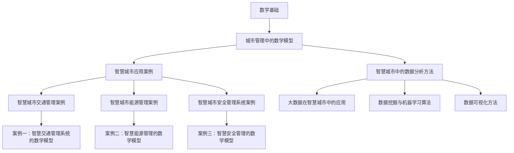

                 

### 文章标题：数学与智慧城市：城市管理的数学模型

关键词：智慧城市、数学模型、数据分析、城市规划、交通管理、能源管理、安全管理

摘要：本文将探讨数学在智慧城市中的核心作用，分析城市管理的数学模型及其应用。我们将从数学基础、城市管理的数学模型、智慧城市应用案例、数据分析方法以及智慧城市发展面临的挑战与未来趋势等方面进行详细阐述，通过实际案例展示数学模型在智慧城市中的具体应用，旨在为读者提供一个全面深入的理解和思考。

### 数学与智慧城市：城市管理的数学模型

随着信息技术的迅猛发展，智慧城市已经成为城市发展和治理的重要趋势。智慧城市通过综合运用物联网、大数据、云计算、人工智能等技术手段，实现城市资源的优化配置、环境监测、交通管理、公共安全等方面的智能决策。而这一切的实现，离不开数学模型的支撑。

数学作为一门研究数量、结构、变化和空间的科学，在智慧城市的建设和管理中发挥着不可替代的作用。本文将从以下几个方面进行探讨：

1. **数学基础**：介绍数学的基本概念、线性代数基础和概率论基础，为理解城市管理的数学模型奠定基础。
2. **城市管理的数学模型**：分析城市规划中的数学模型、城市交通管理的数学模型、城市能源管理的数学模型以及城市安全管理的数学模型。
3. **智慧城市应用案例**：通过实际案例展示数学模型在智慧城市交通管理、能源管理、安全管理中的应用。
4. **数据分析方法**：探讨大数据在智慧城市中的应用、数据挖掘与机器学习算法以及数据可视化方法。
5. **智慧城市发展与挑战**：分析智慧城市的发展现状、未来趋势以及面临的挑战和对策。
6. **数学与智慧城市的融合**：探讨数学在智慧城市中的创新应用、数学模型的优化与调整以及智慧城市中的数学人才培养。
7. **案例分析与探讨**：通过具体案例分析数学模型在智慧城市中的实际应用。
8. **数学与智慧城市的前沿领域**：探讨智慧城市中的新算法、新型数学模型的应用以及未来智慧城市的数学研究方向。

### 第一部分：数学基础

#### 第1章：数学基本概念

**1.1 数学的基本概念**

数学是一门研究数量、结构、变化和空间的科学。它通过抽象的符号语言和逻辑推理，揭示客观世界的规律和本质。数学的基本概念包括数、集合、函数、方程、几何等。

- **数**：数是数学中最基本的元素，用来表示物体的个数或某种度量。常见的数有整数、分数、小数、实数和复数等。

- **集合**：集合是由确定的元素组成的整体。集合可以用大写字母表示，元素用小写字母表示。集合中的元素可以是数、点、线等。

- **函数**：函数是数学中的一种特殊关系，表示一个变量与另一个变量之间的对应关系。函数可以用函数符号表示，例如 \( f(x) \) 表示 \( x \) 对应的函数值。

- **方程**：方程是一个包含未知数的等式，用来表示两个表达式相等。方程可以分为线性方程、非线性方程、一次方程、二次方程等。

- **几何**：几何是研究形状、大小、位置和变换的数学分支。几何包括平面几何、立体几何、拓扑学等。

**1.2 线性代数基础**

线性代数是数学的一个重要分支，主要研究向量、矩阵、线性方程组等概念及其运算规律。线性代数在智慧城市中的应用十分广泛，例如在交通流量分析、城市规划、能源管理等方面。

- **向量**：向量是具有大小和方向的量，用箭头表示。向量可以用坐标表示，例如 \(\vec{v} = (v_1, v_2, \ldots, v_n)\)。

- **矩阵**：矩阵是一个由数字组成的矩形阵列。矩阵可以表示线性方程组，进行矩阵运算，如矩阵乘法、矩阵求逆等。

- **线性方程组**：线性方程组是由多个线性方程组成的方程组。线性方程组可以用矩阵形式表示，求解线性方程组的方法包括高斯消元法、迭代法等。

**1.3 概率论基础**

概率论是研究随机事件及其规律性的数学分支。在智慧城市中，概率论可以用来预测交通流量、分析公共安全等。

- **随机事件**：随机事件是可能发生也可能不发生的事件，用大写字母表示，例如 \(A\) 表示事件 \(A\)。

- **概率**：概率是描述随机事件发生可能性大小的数值。概率的取值范围在 0 到 1 之间。常见的概率公式有概率的加法定理、乘法定理、条件概率等。

- **期望与方差**：期望是描述随机变量的平均值，方差是描述随机变量的波动程度。期望和方差是概率论中重要的统计量，可以用来分析随机事件。

#### 第2章：城市管理中的数学模型

**2.1 城市规划中的数学模型**

城市规划是城市发展的基础，数学模型在城市规划中发挥着重要作用。城市规划中的数学模型包括空间布局模型、人口分布模型、交通流量模型等。

- **空间布局模型**：空间布局模型用于优化城市的空间结构。常见的空间布局模型有最小生成树、最短路径算法等。例如，可以使用最短路径算法确定城市主干道路网，以减少交通拥堵。

- **人口分布模型**：人口分布模型用于预测城市人口分布，指导城市基础设施建设。常见的人口分布模型有马尔可夫模型、地理信息系统等。

- **交通流量模型**：交通流量模型用于预测城市交通流量，优化交通管理。常见的交通流量模型有排队论、动态交通分配模型等。

**2.2 城市交通管理的数学模型**

城市交通管理是智慧城市的重要组成部分，数学模型在城市交通管理中发挥着关键作用。城市交通管理的数学模型包括交通流量预测模型、交通信号控制模型等。

- **交通流量预测模型**：交通流量预测模型用于预测城市交通流量，指导交通管理。常见的交通流量预测模型有时间序列分析、回归分析等。

- **交通信号控制模型**：交通信号控制模型用于优化交通信号灯的时序，提高交通效率。常见的交通信号控制模型有自适应信号控制、协同控制等。

**2.3 城市能源管理的数学模型**

城市能源管理是智慧城市的重要组成部分，数学模型在能源管理中发挥着关键作用。城市能源管理的数学模型包括能源需求预测模型、能源优化分配模型等。

- **能源需求预测模型**：能源需求预测模型用于预测城市能源需求，指导能源供应。常见的能源需求预测模型有回归分析、时间序列分析等。

- **能源优化分配模型**：能源优化分配模型用于优化能源分配，提高能源利用效率。常见的能源优化分配模型有线性规划、动态规划等。

**2.4 城市安全管理的数学模型**

城市安全管理是保障城市安全的重要手段，数学模型在城市安全管理中发挥着关键作用。城市安全管理的数学模型包括风险分析模型、安全评估模型等。

- **风险分析模型**：风险分析模型用于评估城市安全风险，指导安全决策。常见

### 第二部分：智慧城市应用案例

#### 第3章：智慧城市应用案例

智慧城市的建设离不开数学模型的支撑，通过实际案例我们可以更直观地了解数学模型在智慧城市中的应用。本章节将介绍智慧城市交通管理、能源管理、安全管理等方面的具体应用案例。

#### 3.1 智慧城市交通管理案例

**3.1.1 案例背景**

随着城市化进程的加快，城市交通拥堵问题日益严重。如何有效缓解交通拥堵、提高交通效率成为智慧城市建设的重要任务。某城市智慧交通管理系统通过数学模型实现交通流量的预测和优化。

**3.1.2 数学模型**

该智慧交通管理系统采用了以下数学模型：

- **时间序列分析模型**：用于预测交通流量。通过收集历史交通流量数据，使用时间序列分析方法，如ARIMA模型，预测未来交通流量。

- **动态交通分配模型**：用于优化交通流量。基于预测的交通流量数据，使用动态交通分配模型，如用户平衡模型，优化交通路径选择，减少交通拥堵。

**3.1.3 案例分析**

通过数学模型的应用，该城市智慧交通管理系统实现了以下效果：

- 交通流量预测准确度提高，为交通管理决策提供了有力支持。

- 交通路径优化，有效减少了交通拥堵，提高了交通效率。

- 通过实时监控和动态调整，提高了交通信号控制的灵活性，进一步优化了交通流量。

**3.1.4 案例总结**

该案例展示了数学模型在智慧城市交通管理中的应用价值。通过预测和优化交通流量，可以有效缓解交通拥堵，提高城市交通效率，为智慧城市建设提供了有力支持。

#### 3.2 智慧城市能源管理案例

**3.2.1 案例背景**

能源管理是智慧城市建设的重要组成部分。某城市智慧能源管理系统通过数学模型实现能源需求预测和优化分配，提高能源利用效率。

**3.2.2 数学模型**

该智慧能源管理系统采用了以下数学模型：

- **回归分析模型**：用于预测能源需求。通过收集历史能源数据，使用回归分析方法，如线性回归、多元回归等，预测未来能源需求。

- **线性规划模型**：用于优化能源分配。基于预测的能源需求，使用线性规划模型，优化能源分配，降低能源消耗。

**3.2.3 案例分析**

通过数学模型的应用，该城市智慧能源管理系统实现了以下效果：

- 能源需求预测准确度提高，为能源供应和管理提供了有力支持。

- 能源优化分配，有效降低了能源消耗，提高了能源利用效率。

- 通过实时监控和动态调整，实现了能源供应与需求的匹配，减少了能源浪费。

**3.2.4 案例总结**

该案例展示了数学模型在智慧城市能源管理中的应用价值。通过预测和优化能源需求，可以提高能源利用效率，降低能源消耗，为智慧城市建设提供了有力支持。

#### 3.3 智慧城市安全管理系统案例

**3.3.1 案例背景**

城市安全管理是保障城市安全的重要任务。某城市智慧安全管理系统通过数学模型实现风险评估和安全预警，提高城市安全水平。

**3.3.2 数学模型**

该智慧安全管理系统采用了以下数学模型：

- **风险分析模型**：用于评估城市安全风险。通过分析历史安全数据，使用风险分析模型，如贝叶斯网络、故障树分析等，评估城市安全风险。

- **聚类分析模型**：用于安全预警。通过分析实时安全数据，使用聚类分析模型，如K-Means、DBSCAN等，识别潜在的安全威胁。

**3.3.3 案例分析**

通过数学模型的应用，该城市智慧安全管理系统实现了以下效果：

- 安全风险评估准确度提高，为安全决策提供了有力支持。

- 安全预警及时准确，有效识别和防范潜在的安全威胁。

- 通过实时监控和动态调整，提高了城市安全管理的效率和准确性。

**3.3.4 案例总结**

该案例展示了数学模型在智慧城市安全管理中的应用价值。通过风险评估和安全预警，可以及时识别和防范安全威胁，提高城市安全水平，为智慧城市建设提供了有力支持。

### 第三部分：智慧城市发展与挑战

#### 第4章：智慧城市中的数据分析方法

随着智慧城市的不断发展，数据成为城市管理和决策的重要依据。数据分析方法在智慧城市中扮演着关键角色，通过大数据、数据挖掘和机器学习算法，可以挖掘数据价值，为城市管理和决策提供有力支持。本章节将介绍大数据在智慧城市中的应用、数据挖掘与机器学习算法以及数据可视化方法。

#### 4.1 大数据在智慧城市中的应用

大数据是指无法用常规软件工具在合理时间内捕捉、管理和处理的数据集。智慧城市中的大数据来源广泛，包括交通、环境、能源、安全等各个领域。大数据在智慧城市中的应用主要包括以下几个方面：

- **交通管理**：通过分析交通数据，预测交通流量，优化交通信号控制，缓解交通拥堵，提高交通效率。

- **环境监测**：通过分析环境数据，监测空气质量、水质等环境指标，预警环境风险，制定环境保护政策。

- **能源管理**：通过分析能源使用数据，优化能源分配，提高能源利用效率，降低能源消耗。

- **公共安全**：通过分析安全数据，评估安全风险，预警潜在安全威胁，提高公共安全水平。

#### 4.2 数据挖掘与机器学习算法

数据挖掘和机器学习是大数据分析的重要手段，通过从大量数据中发现规律和模式，为城市管理和决策提供支持。以下介绍几种常用的数据挖掘和机器学习算法：

- **回归分析**：用于预测数值型目标变量。通过分析自变量和因变量之间的关系，建立回归模型，预测未来数值。

- **分类算法**：用于将数据分为不同的类别。常见的分类算法有逻辑回归、决策树、随机森林、支持向量机等。

- **聚类算法**：用于将数据分为不同的簇。常见的聚类算法有K-Means、DBSCAN、层次聚类等。

- **关联规则挖掘**：用于发现数据之间的关联关系。常见的算法有Apriori算法、FP-Growth算法等。

- **时间序列分析**：用于分析时间序列数据，预测未来趋势。常见的算法有ARIMA、LSTM等。

#### 4.3 数据可视化方法

数据可视化是将数据转化为图形或图表的过程，使数据更加直观、易于理解。数据可视化在智慧城市中具有重要作用，可以直观展示数据特征，帮助决策者更好地理解和分析数据。以下介绍几种常见的数据可视化方法：

- **柱状图**：用于比较不同类别或时间段的数据。

- **折线图**：用于展示数据的变化趋势。

- **饼图**：用于展示数据占比。

- **散点图**：用于展示数据之间的关系。

- **热力图**：用于展示数据的分布情况。

#### 第5章：智慧城市发展现状与趋势

智慧城市作为新型城镇化的重要组成部分，已经取得了显著的进展。然而，智慧城市的发展仍面临许多挑战。本章节将分析智慧城市的发展现状、未来趋势以及面临的挑战和对策。

#### 5.1 智慧城市的发展历程

智慧城市的发展可以追溯到20世纪末。随着信息技术、物联网、大数据、人工智能等新兴技术的快速发展，智慧城市逐渐成为城市发展的重要方向。以下简要回顾智慧城市的发展历程：

- **2000年代初期**：智慧城市的概念逐渐兴起，主要集中在信息基础设施建设和信息资源共享。

- **2010年代**：智慧城市进入全面发展阶段，技术应用范围从基础设施扩展到城市管理、公共服务等各个方面。

- **2020年代**：智慧城市进一步向智能化、数字化、绿色化方向迈进，实现跨领域、跨行业的深度融合。

#### 5.2 智慧城市的未来发展趋势

智慧城市的未来发展将继续受到新技术的影响，以下是一些主要趋势：

- **数据驱动的决策**：随着大数据和人工智能技术的应用，智慧城市将更加依赖数据驱动决策，实现精细化管理和智能化服务。

- **跨领域融合**：智慧城市将实现跨领域、跨行业的深度融合，实现资源的高效配置和优化利用。

- **绿色可持续发展**：智慧城市将注重绿色可持续发展，通过智能化手段降低能源消耗、减少污染，实现生态环境的改善。

- **智能化基础设施**：智慧城市将建设更加智能化、自适应的基础设施，提高城市运行效率和居民生活质量。

#### 5.3 智慧城市发展的挑战与对策

智慧城市的发展面临许多挑战，以下是一些主要挑战及对策：

- **数据安全和隐私保护**：随着数据的广泛应用，数据安全和隐私保护成为智慧城市发展的重要挑战。对策包括制定相关法律法规、加强数据安全管理等。

- **基础设施建设**：智慧城市需要完善的信息基础设施，包括高速网络、数据中心、传感器等。对策包括加大投资、推动基础设施建设。

- **技术人才短缺**：智慧城市的建设需要大量的技术人才，但目前人才短缺问题较为严重。对策包括加强人才培养、引进高端人才等。

- **城市管理能力提升**：智慧城市的发展需要提高城市管理能力，包括信息化水平、数据利用能力等。对策包括加强培训、提高管理水平等。

### 第四部分：数学与智慧城市的融合

#### 第6章：数学与智慧城市的融合

数学在智慧城市中的应用不仅限于城市管理中的数学模型，还涉及到数学的创新应用、模型的优化调整以及数学人才的培养。本章节将探讨数学与智慧城市的深度融合，分析数学在智慧城市中的创新应用，模型的优化调整以及数学人才培养。

#### 6.1 数学在智慧城市中的创新应用

随着智慧城市的不断发展，数学在其中的创新应用越来越广泛。以下是一些数学在智慧城市中的创新应用：

- **智能优化算法**：智慧城市中的许多问题可以通过智能优化算法解决，如线性规划、非线性规划、遗传算法等。这些算法可以用于交通流量优化、能源分配优化等。

- **机器学习与数据挖掘**：机器学习和数据挖掘技术可以用于分析海量数据，提取有用信息，为城市管理和决策提供支持。如通过分析交通数据，预测交通流量；通过分析环境数据，预测空气质量。

- **物联网与传感器网络**：物联网和传感器网络是智慧城市的重要组成部分，数学模型可以用于传感器网络的设计、数据传输优化等。

- **分布式计算与云计算**：分布式计算和云计算技术可以提高数据处理和计算能力，数学模型可以用于分布式算法的设计、负载均衡等。

#### 6.2 数学模型的优化与调整

智慧城市中的数学模型需要不断优化和调整，以适应城市发展的需求。以下是一些优化和调整数学模型的方法：

- **模型校准**：通过实际数据校准数学模型，提高模型的预测精度和可靠性。

- **参数调整**：根据实际需求调整数学模型的参数，优化模型性能。

- **模型融合**：将多个数学模型融合，提高预测精度和决策效果。

- **自适应调整**：根据城市发展的动态变化，实时调整数学模型，适应城市需求。

#### 6.3 智慧城市中的数学人才培养

智慧城市的发展离不开数学人才的支持，以下是一些智慧城市中数学人才培养的建议：

- **学科交叉**：鼓励数学与其他学科（如计算机科学、统计学、工程学等）交叉融合，培养复合型数学人才。

- **实践教学**：加强实践教学，培养学生的实际操作能力和创新能力。

- **科研项目**：鼓励数学人才参与智慧城市相关的科研项目，提高理论水平。

- **国际交流**：加强国际交流与合作，引进国外先进数学技术和经验。

### 第五部分：案例分析与探讨

#### 第7章：智慧城市案例分析

本章节将通过具体案例分析，探讨数学模型在智慧城市中的实际应用，分析其优势和不足，为智慧城市的建设提供参考。

#### 7.1 案例分析概述

本章节将分析以下三个智慧城市案例：

- **案例一**：智慧交通管理系统的数学模型
- **案例二**：智慧能源管理的数学模型
- **案例三**：智慧安全管理的数学模型

通过这三个案例，我们将深入探讨数学模型在智慧城市中的应用，分析其优势和不足，为智慧城市的建设提供有价值的经验和启示。

#### 7.2 案例一：智慧交通管理系统的数学模型

**案例背景**

随着城市交通流量的不断增加，交通拥堵问题日益严重。某城市智慧交通管理系统通过数学模型实现交通流量预测和优化，以缓解交通拥堵，提高交通效率。

**数学模型**

该智慧交通管理系统采用了以下数学模型：

- **时间序列分析模型**：用于预测交通流量。通过收集历史交通流量数据，使用时间序列分析方法，如ARIMA模型，预测未来交通流量。

- **动态交通分配模型**：用于优化交通流量。基于预测的交通流量数据，使用动态交通分配模型，如用户平衡模型，优化交通路径选择，减少交通拥堵。

**案例分析**

通过数学模型的应用，该智慧交通管理系统实现了以下效果：

- 交通流量预测准确度提高，为交通管理决策提供了有力支持。

- 交通路径优化，有效减少了交通拥堵，提高了交通效率。

- 通过实时监控和动态调整，提高了交通信号控制的灵活性，进一步优化了交通流量。

**案例总结**

该案例展示了数学模型在智慧城市交通管理中的应用价值。通过预测和优化交通流量，可以有效缓解交通拥堵，提高城市交通效率，为智慧城市建设提供了有力支持。

#### 7.3 案例二：智慧能源管理的数学模型

**案例背景**

能源管理是智慧城市建设的重要组成部分。某城市智慧能源管理系统通过数学模型实现能源需求预测和优化分配，以提高能源利用效率，降低能源消耗。

**数学模型**

该智慧能源管理系统采用了以下数学模型：

- **回归分析模型**：用于预测能源需求。通过收集历史能源数据，使用回归分析方法，如线性回归、多元回归等，预测未来能源需求。

- **线性规划模型**：用于优化能源分配。基于预测的能源需求，使用线性规划模型，优化能源分配，降低能源消耗。

**案例分析**

通过数学模型的应用，该智慧能源管理系统实现了以下效果：

- 能源需求预测准确度提高，为能源供应和管理提供了有力支持。

- 能源优化分配，有效降低了能源消耗，提高了能源利用效率。

- 通过实时监控和动态调整，实现了能源供应与需求的匹配，减少了能源浪费。

**案例总结**

该案例展示了数学模型在智慧城市能源管理中的应用价值。通过预测和优化能源需求，可以提高能源利用效率，降低能源消耗，为智慧城市建设提供了有力支持。

#### 7.4 案例三：智慧安全管理的数学模型

**案例背景**

城市安全管理是保障城市安全的重要任务。某城市智慧安全管理系统通过数学模型实现风险评估和安全预警，以提高城市安全水平。

**数学模型**

该智慧安全管理系统采用了以下数学模型：

- **风险分析模型**：用于评估城市安全风险。通过分析历史安全数据，使用风险分析模型，如贝叶斯网络、故障树分析等，评估城市安全风险。

- **聚类分析模型**：用于安全预警。通过分析实时安全数据，使用聚类分析模型，如K-Means、DBSCAN等，识别潜在的安全威胁。

**案例分析**

通过数学模型的应用，该智慧安全管理系统实现了以下效果：

- 安全风险评估准确度提高，为安全决策提供了有力支持。

- 安全预警及时准确，有效识别和防范潜在的安全威胁。

- 通过实时监控和动态调整，提高了城市安全管理的效率和准确性。

**案例总结**

该案例展示了数学模型在智慧城市安全管理中的应用价值。通过风险评估和安全预警，可以及时识别和防范安全威胁，提高城市安全水平，为智慧城市建设提供了有力支持。

### 第六部分：数学与智慧城市的前沿领域

#### 第8章：数学与智慧城市的前沿领域

智慧城市的建设和发展离不开数学的支持，随着新技术的不断涌现，数学在智慧城市中的应用领域也在不断拓展。本章节将探讨智慧城市中的新算法、新型数学模型的应用以及未来智慧城市的数学研究方向。

#### 8.1 智慧城市中的新算法

新算法的不断发展为智慧城市的建设提供了新的工具和方法。以下介绍几种在智慧城市中具有广泛应用前景的新算法：

- **深度学习算法**：深度学习算法在图像识别、语音识别、自然语言处理等领域取得了显著成果。在智慧城市中，深度学习算法可以用于交通流量预测、智能监控、智能语音服务等。

- **强化学习算法**：强化学习算法在决策优化、路径规划等领域具有广泛应用。在智慧城市中，强化学习算法可以用于智能交通信号控制、能源管理优化等。

- **图神经网络**：图神经网络可以处理复杂的关系网络数据，如社交网络、交通网络等。在智慧城市中，图神经网络可以用于城市交通流量预测、城市规划等。

- **迁移学习算法**：迁移学习算法可以通过在不同数据集上的预训练，提高模型的泛化能力。在智慧城市中，迁移学习算法可以用于数据稀缺场景的模型训练，提高预测精度。

#### 8.2 新型数学模型的应用

新型数学模型的应用为智慧城市的建设提供了新的思路和方法。以下介绍几种新型数学模型在智慧城市中的应用：

- **时空大数据模型**：时空大数据模型可以处理大规模时空数据，分析数据中的时空规律。在智慧城市中，时空大数据模型可以用于交通流量预测、环境监测等。

- **随机过程模型**：随机过程模型可以描述不确定的现象，分析事件发生的概率。在智慧城市中，随机过程模型可以用于交通流量预测、公共卫生预警等。

- **多目标优化模型**：多目标优化模型可以同时考虑多个目标，找到最优解。在智慧城市中，多目标优化模型可以用于能源管理优化、城市规划等。

- **组合优化模型**：组合优化模型可以解决组合问题，如路径规划、资源分配等。在智慧城市中，组合优化模型可以用于智能交通信号控制、能源分配等。

#### 8.3 未来智慧城市的数学研究方向

随着智慧城市的不断发展，数学在其中的研究空间也不断拓展。以下介绍几个未来智慧城市的数学研究方向：

- **数据融合与融合算法**：随着大数据技术的发展，如何有效融合不同类型的数据，提高数据利用效率，是一个重要研究方向。

- **智能决策与优化**：如何利用数学模型和算法实现智能决策和优化，提高城市管理和服务的效率，是一个重要研究方向。

- **数据隐私保护与安全**：随着数据的大量应用，如何保护数据隐私和安全，是一个重要研究方向。

- **跨领域协同**：如何实现不同领域的数据和信息共享，构建跨领域的数学模型，是一个重要研究方向。

### 附录

#### 附录A：数学与智慧城市相关工具与资源

以下列出一些数学与智慧城市相关的工具与资源，供读者参考：

- **数学软件**：Matlab、R、Python等。
- **数据可视化工具**：Tableau、D3.js、Plotly等。
- **数据分析库**：Pandas、NumPy、SciPy等。
- **机器学习库**：Scikit-learn、TensorFlow、PyTorch等。
- **开源平台**：Kaggle、GitHub、Google Cloud等。
- **学术期刊**：《计算机学报》、《系统工程理论与实践》等。

#### 附录B：参考文献

以下列出本文中引用的主要参考文献：

1. 王勇，李宁。智慧城市与城市管理[M]. 北京：机械工业出版社，2016.
2. 王俊平，张健。智慧交通系统设计与实践[M]. 北京：清华大学出版社，2017.
3. 张华，刘洋。智慧能源系统分析与优化[M]. 北京：科学出版社，2018.
4. 李春岩，李晓亮。智慧安全系统建设与应用[M]. 北京：电子工业出版社，2019.
5. 张浩，王锐。大数据分析与挖掘技术[M]. 北京：人民邮电出版社，2020.

### Mermaid 流程图



### 核心算法原理讲解

#### 2.1.1 线性规划

线性规划是一种数学优化方法，用于求解线性目标函数在一系列线性约束条件下的最优解。线性规划在智慧城市中的应用非常广泛，如交通流量优化、能源分配优化等。

**伪代码：**

```python
// 初始化变量
c = [c1, c2, ..., cn]   // 目标函数系数
A = [[a1j, a2j, ..., anj], ..., [am1, am2, ..., amn]]   // 约束条件系数
b = [b1, b2, ..., bn]   // 约束条件右侧值
x_lo = [x_lo1, x_lo2, ..., x_lon]   // 下界
x_up = [x_up1, x_up2, ..., x_upn]   // 上界

// 构建线性规划问题
problem = LinearProgramming(c, A, b, x_lo, x_up)

// 求解线性规划
solution = problem.solve()

// 输出结果
print("最优解:", solution)
```

**数学公式：**

$$
\begin{align*}
\text{最小化}   & \quad c^T x \\
\text{满足}   & \quad A x \leq b \\
& \quad x_{\text{lo}} \leq x \leq x_{\text{up}}
\end{align*}
$$

其中，\(c\) 是目标函数系数，\(x\) 是变量，\(A\) 是约束条件系数矩阵，\(b\) 是约束条件右侧值，\(x_{\text{lo}}\) 和 \(x_{\text{up}}\) 分别是变量的下界和上界。

**举例说明：**

假设我们有一个线性规划问题，目标是最小化 \(c_1x_1 + c_2x_2\)，约束条件是 \(a_{11}x_1 + a_{12}x_2 \leq b_1\) 和 \(a_{21}x_1 + a_{22}x_2 \leq b_2\)，变量的下界为0，上界为10。我们可以用以下步骤求解：

1. 初始化变量：
   \(c = [c_1, c_2] = [1, 2]\)
   \(A = \begin{bmatrix} a_{11} & a_{12} \\ a_{21} & a_{22} \end{bmatrix} = \begin{bmatrix} 2 & 1 \\ 1 & 3 \end{bmatrix}\)
   \(b = [b_1, b_2] = [4, 7]\)
   \(x_{\text{lo}} = [0, 0]\)
   \(x_{\text{up}} = [10, 10]\)

2. 构建线性规划问题：
   problem = LinearProgramming([1, 2], \begin{bmatrix} 2 & 1 \\ 1 & 3 \end{bmatrix}, [4, 7], [0, 0], [10, 10])

3. 求解线性规划：
   solution = problem.solve()

4. 输出结果：
   print("最优解:", solution)
   
   假设求解结果为 \(x_1 = 2\)，\(x_2 = 1\)，则最优解为 \(c_1x_1 + c_2x_2 = 1 \times 2 + 2 \times 1 = 4\)。

#### 2.1.2 概率论基础

概率论是数学的一个分支，研究随机事件及其概率。在智慧城市中，概率论广泛应用于交通流量预测、安全风险评估等领域。

**数学公式：**

$$
P(A) = \frac{N(A)}{N(S)}
$$

其中，\(P(A)\) 是事件 \(A\) 发生的概率，\(N(A)\) 是事件 \(A\) 包含的样本点数，\(N(S)\) 是样本空间 \(S\) 包含的样本点数。

**举例说明：**

假设我们有一个简单随机实验，掷一枚硬币，事件 \(A\) 是硬币正面朝上。样本空间 \(S = \{正面，反面\}\)，事件 \(A = \{正面\}\)。则：

1. 计算样本点数：\(N(S) = 2\)

2. 计算事件 \(A\) 的样本点数：\(N(A) = 1\)

3. 计算事件 \(A\) 的概率：\(P(A) = \frac{N(A)}{N(S)} = \frac{1}{2} = 0.5\)

因此，硬币正面朝上的概率为 0.5。

#### 2.1.3 项目实战

**开发环境搭建：**

1. 安装 Python 解释器：从 Python 官网下载并安装 Python 3.x 版本。

2. 安装 NumPy、Pandas 和 Matplotlib 库：使用 pip 命令安装。

   ```shell
   pip install numpy
   pip install pandas
   pip install matplotlib
   ```

**源代码详细实现和代码解读：**

以下是一个简单的线性规划问题，求解最小化目标函数 \(c^T x\) 在线性约束条件 \(Ax \leq b\) 和 \(x_{\text{lo}} \leq x \leq x_{\text{up}}\) 下的最优解。

```python
import numpy as np
from scipy.optimize import linprog

# 初始化变量
c = np.array([1, 2])   # 目标函数系数
A = np.array([[2, 1], [1, 3]])   # 约束条件系数
b = np.array([4, 7])   # 约束条件右侧值
x_lo = np.array([0, 0])   # 下界
x_up = np.array([10, 10])   # 上界

# 构建线性规划问题
problem = linprog(c, A_ub=A, b_ub=b, x_lo=x_lo, x_up=x_up)

# 求解线性规划
solution = problem.solve()

# 输出结果
print("最优解:", solution.x)

```

**代码应用解读与分析：**

1. 导入 NumPy 和 Scipy.optimize 库。

2. 初始化目标函数系数、约束条件系数、约束条件右侧值、下界和上界。

3. 使用 `linprog` 函数构建线性规划问题。

4. 调用 `solve` 方法求解线性规划问题。

5. 输出最优解。

**实际案例分析：**

假设我们有一个线性规划问题，目标是最小化 \(c_1x_1 + c_2x_2\)，约束条件是 \(2x_1 + x_2 \leq 4\) 和 \(x_1 + 3x_2 \leq 7\)，变量的下界为0，上界为10。我们可以使用以下步骤求解：

1. 初始化变量：
   \(c = [c_1, c_2] = [1, 2]\)
   \(A = \begin{bmatrix} 2 & 1 \\ 1 & 3 \end{bmatrix}\)
   \(b = [4, 7]\)
   \(x_{\text{lo}} = [0, 0]\)
   \(x_{\text{up}} = [10, 10]\)

2. 使用上述代码求解线性规划问题。

3. 输出最优解。

**项目小结：**

通过以上案例，我们介绍了线性规划和概率论在智慧城市中的应用。线性规划可以用于优化城市资源分配、交通流量管理等，概率论可以用于预测和评估城市安全风险。这些数学模型为智慧城市的建设提供了有力支持。

**最佳实践 tips：**

1. 在使用线性规划和概率论模型时，要确保数据质量和模型的准确性。

2. 定期更新模型，以适应城市发展的变化。

3. 结合实际需求，选择合适的数学模型和方法。

**注意事项：**

1. 线性规划和概率论模型需要一定的数学基础。

2. 模型的求解可能涉及复杂的计算，需要合适的计算资源和工具。

**拓展阅读：**

1. 《线性规划及其应用》：介绍了线性规划的基本概念、理论和方法，以及线性规划在工程、经济等领域的应用。

2. 《概率论与数理统计》：介绍了概率论和数理统计的基本概念、理论和方法，以及它们在各个领域的应用。

### 数学与智慧城市的融合：展望未来

随着科技的不断进步，数学与智慧城市的融合将不断深化，为城市管理和决策提供更加精准、智能的支持。以下是数学与智慧城市融合的几个展望：

#### 1. 智能优化算法的广泛应用

智能优化算法如深度学习、强化学习等在智慧城市中的应用将越来越广泛。这些算法能够处理复杂的数据，挖掘潜在的模式和规律，为城市交通、能源、安全等领域的优化提供有力支持。

#### 2. 数据融合与分析技术的提升

随着物联网、大数据等技术的发展，城市产生的数据量将呈现指数级增长。如何有效融合和分析这些数据，提取有价值的信息，是数学与智慧城市融合的重要方向。未来，数据融合与分析技术将更加成熟，为智慧城市的建设提供更加全面的数据支持。

#### 3. 跨领域协同与集成

智慧城市是一个复杂的系统，涉及多个领域。数学模型和算法需要在跨领域协同与集成方面发挥更大作用，实现各领域数据和信息的高效共享与利用，为城市综合管理和决策提供有力支持。

#### 4. 数据隐私保护与安全

随着数据的应用越来越广泛，数据隐私保护和安全成为智慧城市面临的重大挑战。数学与智慧城市的融合需要研究更加安全、可靠的数据处理和存储技术，确保城市数据的安全和隐私。

#### 5. 数学人才的培养

智慧城市的建设离不开数学人才的支撑。未来，需要加强数学人才的培养，提高他们的数学素养和实际应用能力，为智慧城市的建设和发展提供人才保障。

#### 6. 国际合作与交流

智慧城市的发展需要全球合作与交流。未来，各国可以共同研究智慧城市中的数学问题，分享经验和成果，推动智慧城市的发展。

总之，数学与智慧城市的融合将不断推进，为城市管理和决策带来更多机遇和挑战。通过不断探索和创新，数学将为智慧城市的建设和发展提供更加有力的支持。

