                 


### 文章标题：数学与未来基因工程的发展方向

> 关键词：基因工程、数学模型、计算生物学、CRISPR、基因组学、机器学习、个性化医疗

> 摘要：
本文将探讨数学在基因工程中的应用，从基本概念到发展方向的全面分析。通过引入数学原理，我们能够更深入地理解基因序列、基因调控网络以及基因编辑技术。文章将结合具体的实例，展示数学方法在基因表达数据分析、基因编辑和基因调控网络建模中的实际应用。同时，我们将探讨数学与未来基因工程面临的挑战和机遇，为这一领域的进一步发展提供思路。

---

### 第一部分：数学与基因工程的基本概念

#### 第1章：数学在基因工程中的应用

##### 1.1 数学与基因工程的关系

**数学原理的引入**

在基因工程中，数学原理起到了基础性的作用。线性代数、概率论和统计学是基因工程中最常用的数学工具。例如，线性代数帮助我们理解和分析基因表达数据中的相关性；概率论和统计学则用于基因组序列的统计分析，如序列比对和序列编辑距离。

**核心概念与联系**

我们可以用Mermaid流程图来展示数学原理在基因工程中的应用：

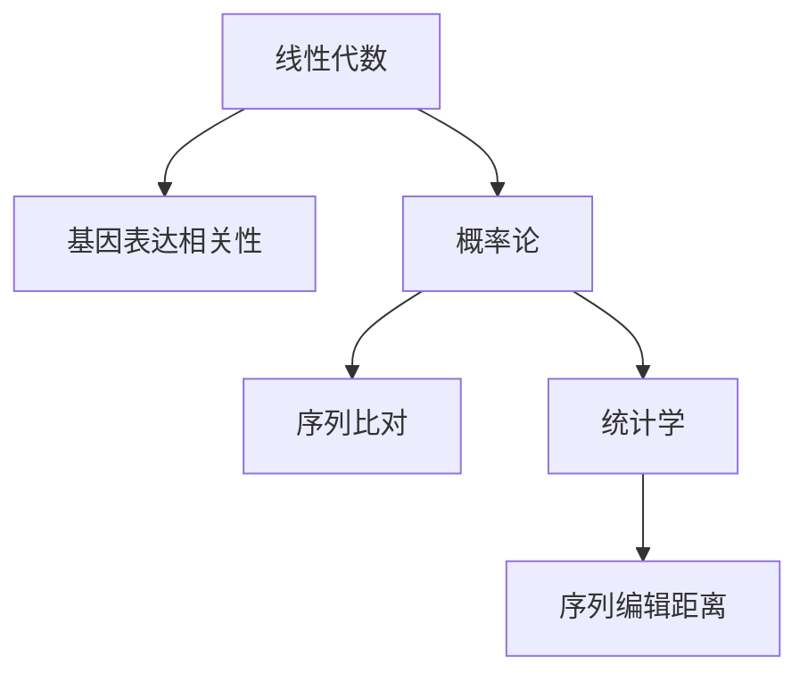

**数学模型的应用**

线性代数中的矩阵和向量用于表示基因表达数据，通过矩阵运算可以揭示基因之间的相关性。概率论中的统计方法，如卡方检验，用于验证基因序列的差异性。统计学中的序列比对和序列编辑距离，帮助我们识别基因序列中的相似性和差异性。

**数学公式与详细讲解**

1. **基因表达相关性公式**：

   $$ \text{Corr}(X, Y) = \frac{\sum_{i=1}^{n}(X_i - \bar{X})(Y_i - \bar{Y})}{\sqrt{\sum_{i=1}^{n}(X_i - \bar{X})^2 \sum_{i=1}^{n}(Y_i - \bar{Y})^2}} $$

   其中，$X$和$Y$表示两组基因表达数据，$\bar{X}$和$\bar{Y}$表示它们的平均值。

2. **序列编辑距离公式**：

   $$ d(X, Y) = \min_{i, j} \sum_{k=1}^{m} |X_k - Y_k| $$

   其中，$X$和$Y$表示两个基因序列，$m$表示序列的长度。

**举例说明**

假设有两个基因序列$A=AGTACG$和$B=ACTGAC$，它们的编辑距离可以通过以下步骤计算：

1. 初始化距离矩阵：
   $$ \begin{matrix} 0 & 1 & 2 & 3 & 4 & 5 & 6 & 7 & 8 \\ 0 & 0 & 1 & 2 & 3 & 4 & 5 & 6 & 7 \\ 1 & 1 & 0 & 1 & 2 & 3 & 4 & 5 & 6 \\ 2 & 2 & 1 & 0 & 1 & 2 & 3 & 4 & 5 \\ 3 & 3 & 2 & 1 & 0 & 1 & 2 & 3 & 4 \\ 4 & 4 & 3 & 2 & 1 & 0 & 1 & 2 & 3 \\ 5 & 5 & 4 & 3 & 2 & 1 & 0 & 1 & 2 \\ 6 & 6 & 5 & 4 & 3 & 2 & 1 & 0 & 1 \\ 7 & 7 & 6 & 5 & 4 & 3 & 2 & 1 & 0 \end{matrix} $$

2. 计算每个单元格的值：
   $$ \begin{matrix} 0 & 1 & 2 & 3 & 4 & 5 & 6 & 7 & 8 \\ 0 & 0 & 1 & 2 & 3 & 4 & 5 & 6 & 7 \\ 1 & 1 & 0 & 1 & 2 & 3 & 4 & 5 & 6 \\ 2 & 2 & 1 & 0 & 1 & 2 & 3 & 4 & 5 \\ 3 & 3 & 2 & 1 & 0 & 1 & 2 & 3 & 4 \\ 4 & 4 & 3 & 2 & 1 & 0 & 1 & 2 & 3 \\ 5 & 5 & 4 & 3 & 2 & 1 & 0 & 1 & 2 \\ 6 & 6 & 5 & 4 & 3 & 2 & 1 & 0 & 1 \\ 7 & 7 & 6 & 5 & 4 & 3 & 2 & 1 & 0 \end{matrix} $$

3. 找到最小值：$d(A, B) = 4$

---

##### 1.2 基因序列的数学建模

**DNA序列表示**

DNA序列可以被视为一个字符串，每个字符代表一种核苷酸（A、T、C、G）。通过这种表示方法，我们可以将DNA序列转换为数学模型，如向量或矩阵。

**核心概念与联系**

用Mermaid流程图展示DNA序列的数学建模：

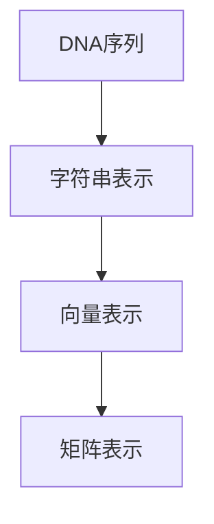

**数学模型的应用**

1. **向量表示**：每个核苷酸可以用一个唯一的数字表示（如A=0，T=1，C=2，G=3），则一个基因序列可以表示为一个向量。例如，基因序列AGTACG可以表示为向量[0, 2, 1, 3, 2, 1]。

2. **矩阵表示**：多个基因序列可以组成一个矩阵。例如，有两个基因序列AGTACG和ACTGAC，可以组成一个2x6的矩阵：

   $$ \begin{matrix} 0 & 2 & 1 & 3 & 2 & 1 \\ 1 & 3 & 2 & 1 & 3 & 2 \end{matrix} $$

**举例说明**

假设有三个基因序列：

1. AGTACG（向量[0, 2, 1, 3, 2, 1]）
2. ACTGAC（向量[1, 3, 2, 1, 3, 2]）
3. AACCGT（向量[2, 1, 3, 2, 1, 0]）

它们的矩阵表示为：

$$ \begin{matrix} 0 & 2 & 1 \\ 1 & 3 & 2 \\ 2 & 1 & 3 \end{matrix} $$

---

##### 1.3 基因组的统计学分析

**序列分析**

基因组的统计学分析是基因工程中的一个重要环节，通过分析基因组序列，我们可以识别基因家族、基因家族模式、基因功能等。

**核心概念与联系**

用Mermaid流程图展示基因组的统计学分析：

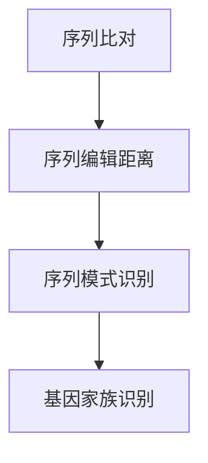

**序列分析的方法**

1. **序列比对**：通过比较两个或多个基因序列，找出它们之间的相似性和差异性。常用的算法有BLAST（Basic Local Alignment Search Tool）和Smith-Waterman算法。

2. **序列编辑距离**：如前所述，序列编辑距离可以衡量两个序列之间的差异程度。

3. **序列模式识别**：通过识别基因序列中的特定模式，如基因家族模式、启动子序列等，可以揭示基因的功能和调控机制。

**举例说明**

假设有两个基因序列：

1. AAGCTTG（序列1）
2. AACCTTG（序列2）

通过序列比对，我们可以发现它们在第三个位置有一个差异（C和T）。序列编辑距离为2，因为需要两个编辑操作（替换C为T）来使它们完全匹配。

---

##### 1.4 遗传算法与基因优化

**遗传算法的基本概念**

遗传算法是一种基于自然选择和遗传学原理的优化算法，通过模拟生物进化的过程来寻找最优解。

**核心概念与联系**

用Mermaid流程图展示遗传算法的基本概念：

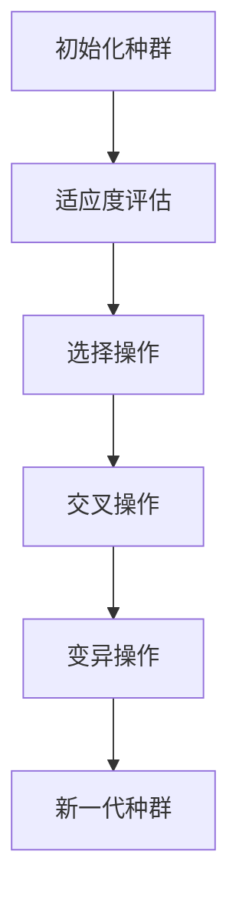

**遗传算法在基因工程中的应用**

遗传算法可以用于基因序列的优化，如基因突变、基因融合等。通过模拟生物进化的过程，我们可以找到具有更好适应性的基因序列。

**举例说明**

假设我们要优化一个基因序列，使其具有更高的表达水平。初始种群为AGTACG，适应度评估基于基因表达数据的统计分析。通过遗传算法的操作，我们可以得到新一代的种群，其中每个个体的适应度更高。

---

##### 1.5 数学模型在基因调控中的应用

**基因调控网络**

基因调控网络是由基因和它们之间的调控关系组成的复杂网络。数学模型可以用于描述和预测基因调控网络中的动态行为。

**核心概念与联系**

用Mermaid流程图展示基因调控网络的数学模型：

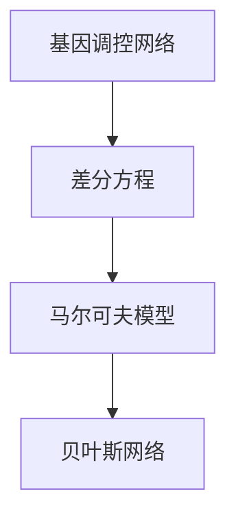

**数学模型的应用**

1. **差分方程**：差分方程可以用于描述基因调控网络的动态行为。例如，一个简单的线性模型：

   $$ \frac{dX}{dt} = \alpha X + \beta $$

   其中，$X$表示基因表达水平，$\alpha$和$\beta$为调控参数。

2. **马尔可夫模型**：马尔可夫模型可以用于预测基因调控网络中的状态转移。例如，一个简单的二状态马尔可夫模型：

   $$ P(X_{t+1} = 1 | X_t = 0) = p $$
   $$ P(X_{t+1} = 0 | X_t = 1) = 1 - p $$

   其中，$X_t$表示基因在时间$t$的状态，$p$为状态转移概率。

3. **贝叶斯网络**：贝叶斯网络可以用于描述基因调控网络中的概率关系。例如，一个简单的贝叶斯网络：

   $$ \begin{matrix} X_1 & X_2 & X_3 \\ P(X_1) & P(X_2 | X_1) & P(X_3 | X_1, X_2) \end{matrix} $$

   其中，$X_1$、$X_2$和$X_3$表示三个基因的状态。

---

#### 第2章：数学模型与基因工程的发展方向

##### 2.1 机器学习在基因工程中的应用

**基因预测与分类**

机器学习技术在基因功能预测和基因分类中具有广泛应用。通过训练机器学习模型，我们可以预测基因的功能，并进行基因分类。

**核心概念与联系**

用Mermaid流程图展示机器学习在基因工程中的应用：

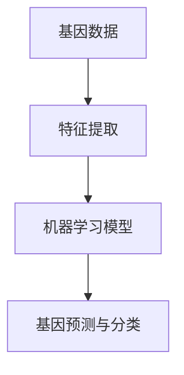

**机器学习模型的应用**

1. **支持向量机（SVM）**：SVM是一种常用的分类模型，可以通过找到最佳的超平面来分隔不同的基因类别。

2. **决策树**：决策树是一种易于理解的分类模型，可以通过树形结构来表示基因特征和类别的关系。

3. **神经网络**：神经网络是一种复杂的分类模型，可以通过多层神经网络来提取基因特征的复杂关系。

**举例说明**

假设我们有一个基因数据集，其中每个基因都有若干特征（如基因序列、基因表达水平等）。通过训练一个神经网络模型，我们可以预测基因的功能，并将其分类到不同的类别中。

---

##### 2.2 计算生物学与基因组学

**高通量测序数据分析**

计算生物学方法在高通量测序数据分析中发挥了重要作用。通过分析高通量测序数据，我们可以识别基因突变、基因表达变化等生物学信息。

**核心概念与联系**

用Mermaid流程图展示计算生物学方法在高通量测序数据分析中的应用：

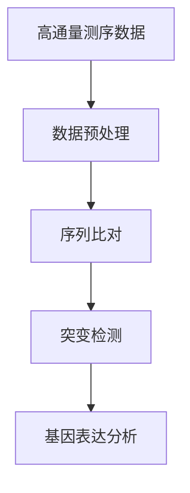

**计算生物学方法的应用**

1. **数据预处理**：高通量测序数据通常包含大量的噪声和错误，通过数据预处理可以去除噪声、校正错误，提高数据分析的准确性。

2. **序列比对**：通过序列比对，我们可以识别不同基因序列之间的相似性和差异性，从而揭示基因的功能和调控关系。

3. **突变检测**：通过突变检测，我们可以识别基因序列中的突变位点，从而揭示基因的致病性。

4. **基因表达分析**：通过基因表达分析，我们可以识别基因在不同细胞类型、不同环境条件下的表达模式，从而揭示基因的调控机制。

**举例说明**

假设我们有一个高通量测序数据集，其中包含一个人的基因组序列。通过序列比对，我们可以识别该个体的基因突变位点，并通过突变检测来评估这些突变位点的致病性。

---

##### 2.3 数理生物学在基因治疗中的应用

**基因编辑技术**

数理生物学方法在基因编辑技术中发挥了重要作用。通过数学模型和计算生物学方法，我们可以优化基因编辑策略，提高基因编辑的准确性和效率。

**核心概念与联系**

用Mermaid流程图展示数理生物学方法在基因编辑技术中的应用：

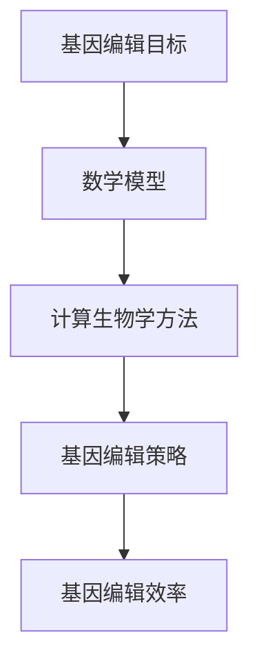

**基因编辑技术的方法**

1. **CRISPR-Cas9技术**：CRISPR-Cas9技术是一种常用的基因编辑技术，通过引入特定的DNA序列（sgRNA）来指导Cas9核酸酶切割目标DNA序列。

2. **基因编辑策略**：通过优化基因编辑策略，如引导RNA（gRNA）的选择、编辑位点的选择等，可以提高基因编辑的准确性和效率。

3. **计算生物学方法**：通过计算生物学方法，如序列比对、突变检测等，我们可以评估基因编辑的效果和潜在的风险。

**举例说明**

假设我们要通过CRISPR-Cas9技术编辑一个基因，以治疗某种遗传病。通过数学模型和计算生物学方法，我们可以优化编辑策略，提高基因编辑的准确性和效率。

---

##### 2.4 生物信息学中的数学问题

**生物信息学中的挑战**

生物信息学是一门跨学科领域，涉及生物学、计算机科学和数学等多个学科。在生物信息学中，存在着许多复杂的数学问题，如大规模数据管理、基因表达数据分析等。

**核心概念与联系**

用Mermaid流程图展示生物信息学中的数学问题：

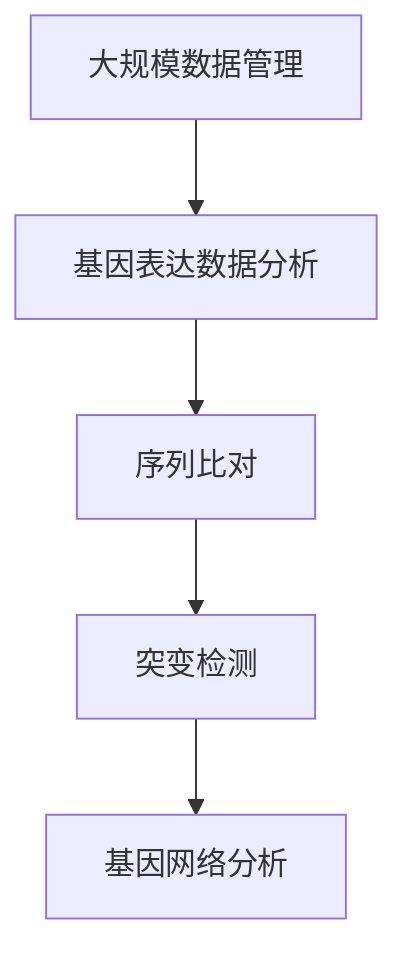

**数学问题的解决方法**

1. **大规模数据管理**：通过分布式计算和并行处理技术，我们可以高效地管理大规模生物信息数据。

2. **基因表达数据分析**：通过统计学方法和机器学习技术，我们可以分析基因表达数据，识别差异表达基因和基因网络。

3. **序列比对**：通过序列比对算法，我们可以高效地比较基因序列，识别基因家族和基因调控关系。

4. **突变检测**：通过突变检测算法，我们可以识别基因序列中的突变位点，评估突变对基因功能的影响。

5. **基因网络分析**：通过基因网络分析算法，我们可以揭示基因之间的调控关系，构建基因网络模型。

**举例说明**

假设我们要分析一个人类基因组的基因表达数据。通过统计学方法和机器学习技术，我们可以识别差异表达基因，并构建基因网络模型，揭示基因之间的调控关系。

---

##### 2.5 未来基因工程的数学模型展望

**未来趋势**

随着基因工程技术的不断发展，数学模型在基因工程中的应用也将不断拓展。未来基因工程的数学模型将更加复杂和精确，以应对基因工程中的复杂问题和挑战。

**数学模型的应用前景**

1. **个性化医疗**：通过数学模型，我们可以实现个性化医疗，为患者提供定制化的治疗方案。

2. **基因编辑技术的优化**：通过数学模型，我们可以优化基因编辑策略，提高基因编辑的准确性和效率。

3. **基因驱动的生物合成**：通过数学模型，我们可以设计和优化基因驱动的生物合成途径，提高生物合成效率。

4. **跨学科合作**：数学模型与其他领域的结合，如生物化学、计算机科学等，将推动基因工程的跨学科发展。

**举例说明**

假设我们要设计一个基因驱动的生物合成途径，通过数学模型优化基因表达和生物合成过程，提高生物合成效率。这将为药物研发、新材料合成等领域带来巨大潜力。

---

### 第二部分：数学方法在基因工程中的应用实例

#### 第3章：数学方法在基因工程中的应用实例

##### 3.1 基因表达数据分析

**数据分析方法**

基因表达数据分析是基因工程中的一个重要环节，通过分析基因表达数据，我们可以揭示基因在不同细胞类型、不同环境条件下的表达模式。

**核心概念与联系**

用Mermaid流程图展示基因表达数据分析的方法：

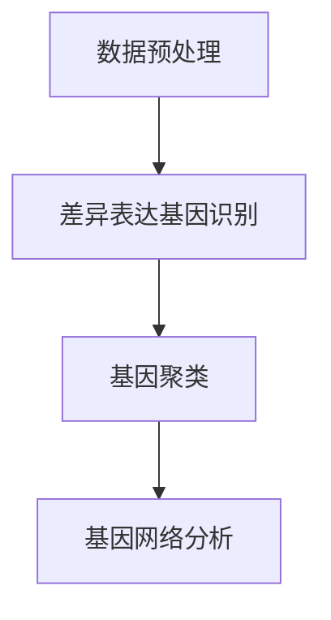

**数据分析方法的应用**

1. **数据预处理**：通过数据预处理，我们可以去除噪声、校正错误，提高基因表达数据的准确性。

2. **差异表达基因识别**：通过统计学方法和机器学习技术，我们可以识别差异表达基因，从而揭示基因在不同条件下的调控关系。

3. **基因聚类**：通过聚类分析方法，我们可以将相似基因归为一类，从而揭示基因的功能和调控关系。

4. **基因网络分析**：通过基因网络分析，我们可以揭示基因之间的调控关系，构建基因网络模型。

**举例说明**

假设我们有一个基因表达数据集，其中包含不同细胞类型下的基因表达数据。通过差异表达基因识别，我们可以识别出在不同细胞类型下差异表达的基因，并通过基因聚类和基因网络分析，揭示基因之间的调控关系。

---

##### 3.2 基因编辑与基因敲除

**CRISPR-Cas9技术**

CRISPR-Cas9技术是一种常用的基因编辑技术，通过引入特定的DNA序列（sgRNA）来指导Cas9核酸酶切割目标DNA序列。

**核心概念与联系**

用Mermaid流程图展示CRISPR-Cas9技术的原理：

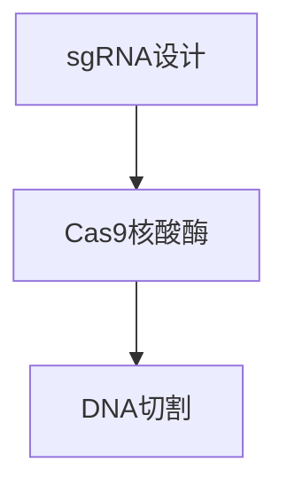

**CRISPR-Cas9技术的优化策略**

1. **sgRNA设计**：通过优化sgRNA序列，可以提高CRISPR-Cas9技术的编辑效率和特异性。

2. **编辑位点选择**：通过选择合适的编辑位点，可以减少脱靶效应，提高基因编辑的准确性。

3. **计算生物学方法**：通过计算生物学方法，如序列比对和突变检测，我们可以评估编辑位点的选择和优化策略。

**举例说明**

假设我们要通过CRISPR-Cas9技术编辑一个基因，以治疗某种遗传病。通过优化sgRNA设计和编辑位点选择，我们可以提高基因编辑的准确性和效率。

---

##### 3.3 基因调控网络建模

**网络模型**

基因调控网络是由基因和它们之间的调控关系组成的复杂网络。通过数学模型，我们可以描述和预测基因调控网络中的动态行为。

**核心概念与联系**

用Mermaid流程图展示基因调控网络的数学模型：


**基因调控网络建模的应用**

1. **差分方程**：通过差分方程，我们可以描述基因调控网络的动态行为。例如，一个简单的线性模型：

   $$ \frac{dX}{dt} = \alpha X + \beta $$

   其中，$X$表示基因表达水平，$\alpha$和$\beta$为调控参数。

2. **马尔可夫模型**：通过马尔可夫模型，我们可以预测基因调控网络中的状态转移。例如，一个简单的二状态马尔可夫模型：

   $$ P(X_{t+1} = 1 | X_t = 0) = p $$
   $$ P(X_{t+1} = 0 | X_t = 1) = 1 - p $$

   其中，$X_t$表示基因在时间$t$的状态，$p$为状态转移概率。

3. **贝叶斯网络**：通过贝叶斯网络，我们可以描述基因调控网络中的概率关系。例如，一个简单的贝叶斯网络：

   $$ \begin{matrix} X_1 & X_2 & X_3 \\ P(X_1) & P(X_2 | X_1) & P(X_3 | X_1, X_2) \end{matrix} $$

   其中，$X_1$、$X_2$和$X_3$表示三个基因的状态。

**举例说明**

假设我们要建模一个基因调控网络，其中包含三个基因$X_1$、$X_2$和$X_3$。通过差分方程、马尔可夫模型和贝叶斯网络，我们可以描述和预测基因调控网络中的动态行为。

---

##### 3.4 基因驱动的生物合成

**生物合成途径设计**

基因驱动的生物合成是一种通过基因编辑和调控来实现特定生物合成的技术。通过数学方法，我们可以优化和设计基因驱动的生物合成途径。

**核心概念与联系**

用Mermaid流程图展示基因驱动的生物合成途径设计：

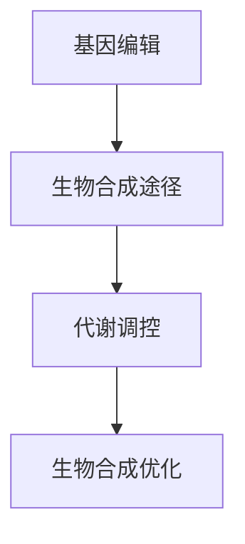

**生物合成途径设计的方法**

1. **基因编辑**：通过基因编辑技术，如CRISPR-Cas9，我们可以编辑和优化生物合成途径中的关键基因。

2. **代谢调控**：通过调控代谢途径中的关键酶和调节因子，我们可以优化生物合成途径的效率和产物产量。

3. **生物合成优化**：通过计算生物学方法，如数学模型和机器学习技术，我们可以优化生物合成途径，提高生物合成效率和产物产量。

**举例说明**

假设我们要设计一个基因驱动的生物合成途径，以生产某种药物。通过基因编辑、代谢调控和生物合成优化，我们可以提高药物的合成效率和产量。

---

##### 3.5 基因工程在药物研发中的应用

**药物靶点筛选与优化**

基因工程在药物研发中发挥着重要作用，通过基因编辑和基因调控技术，我们可以筛选和优化药物靶点，提高药物的治疗效果。

**核心概念与联系**

用Mermaid流程图展示基因工程在药物研发中的应用：

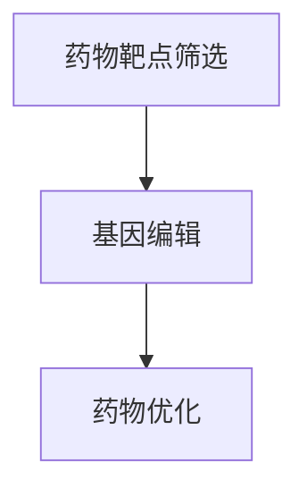

**药物靶点筛选与优化的方法**

1. **药物靶点筛选**：通过基因编辑技术，如CRISPR-Cas9，我们可以编辑和筛选潜在的药物靶点。

2. **药物优化**：通过基因调控技术，如基因编辑和代谢调控，我们可以优化药物的设计和合成，提高药物的治疗效果。

3. **计算生物学方法**：通过计算生物学方法，如机器学习技术和数学模型，我们可以预测药物与靶点的相互作用，优化药物的设计和筛选。

**举例说明**

假设我们要研发一种抗癌药物，通过基因编辑技术，我们可以筛选和优化潜在的药物靶点，并通过基因调控技术，优化药物的设计和合成，提高药物的治疗效果。

---

### 第三部分：数学与未来基因工程的挑战与机遇

#### 第4章：数学与未来基因工程的挑战

##### 4.1 大数据时代的基因工程

**数据分析挑战**

随着基因工程技术的不断发展，基因数据量呈现爆炸式增长。大数据时代的基因工程面临着巨大的数据分析挑战，如何处理和解析海量基因数据成为了一个重要问题。

**核心概念与联系**

用Mermaid流程图展示大数据时代基因工程的数据分析挑战：

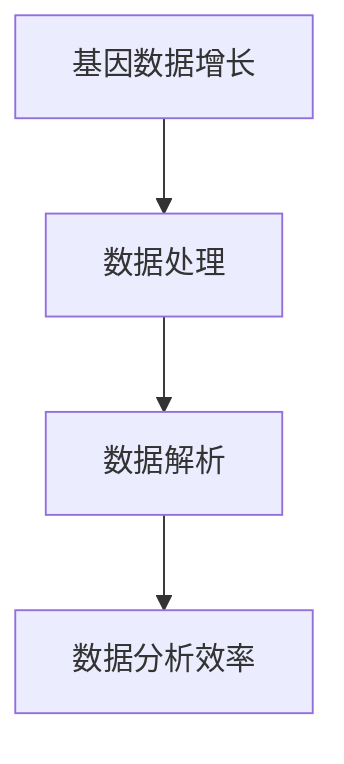

**数据分析方法的优化**

1. **并行计算**：通过分布式计算和并行处理技术，我们可以提高数据分析的效率和速度。

2. **数据挖掘**：通过数据挖掘技术，我们可以从海量基因数据中提取有价值的信息和知识。

3. **机器学习**：通过机器学习技术，我们可以训练模型来预测基因的功能和调控关系，提高数据分析的准确性。

**举例说明**

假设我们有一个包含数百万个基因序列的基因数据集。通过并行计算、数据挖掘和机器学习技术，我们可以高效地处理和解析这些海量基因数据，从中提取有价值的信息和知识。

---

##### 4.2 基因编辑的安全性和伦理问题

**安全性问题**

基因编辑技术在带来巨大潜力的同时，也带来了一系列安全性的挑战。如何确保基因编辑操作的安全性和减少潜在的副作用是一个重要问题。

**核心概念与联系**

用Mermaid流程图展示基因编辑的安全性问题：

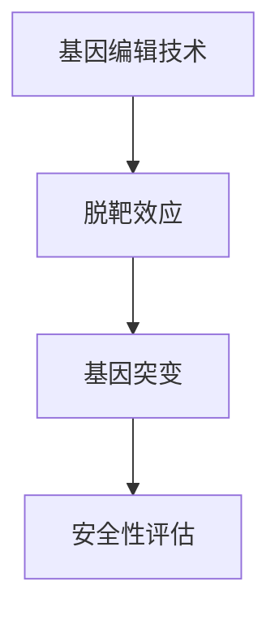

**安全性评估方法**

1. **脱靶效应评估**：通过计算生物学方法，如序列比对和突变检测，我们可以评估基因编辑操作的脱靶效应，从而减少潜在的副作用。

2. **基因突变评估**：通过基因测序技术，我们可以检测基因编辑后产生的基因突变，从而评估基因编辑的安全性和潜在风险。

3. **多学科合作**：通过跨学科合作，如生物学、医学和计算机科学等，我们可以综合评估基因编辑操作的安全性和风险，提出优化策略。

**举例说明**

假设我们要通过CRISPR-Cas9技术编辑一个基因，以治疗某种遗传病。通过脱靶效应评估和基因突变评估，我们可以确保基因编辑操作的安全性，并减少潜在的副作用。

---

**伦理问题**

基因编辑技术不仅带来了安全性的挑战，还引发了一系列伦理问题。如何处理基因编辑带来的伦理挑战和社会影响是一个重要议题。

**核心概念与联系**

用Mermaid流程图展示基因编辑的伦理问题：

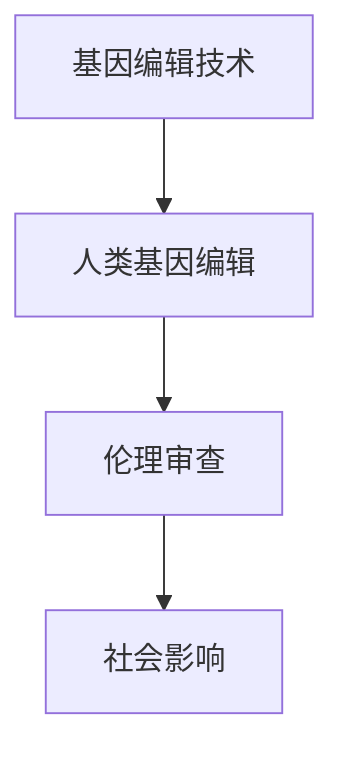

**伦理问题的讨论**

1. **人类基因编辑**：基因编辑技术应用于人类基因组的编辑，引发了关于人类基因编辑的伦理问题，如基因增强、基因修复等。

2. **伦理审查**：通过建立伦理审查机制，我们可以规范基因编辑操作，确保基因编辑技术的安全和合理使用。

3. **社会影响**：基因编辑技术可能会对社会产生深远的影响，如种族、性别和阶级等方面的影响，我们需要审慎对待。

**举例说明**

假设我们要通过CRISPR-Cas9技术编辑一个人类基因，以治疗某种遗传病。在伦理审查和社会影响的讨论中，我们需要综合考虑基因编辑技术的潜在风险和社会影响，确保其合理和公正的使用。

---

##### 4.3 数学模型在基因编辑中的局限性

**模型准确性**

虽然数学模型在基因编辑中发挥了重要作用，但现有数学模型在基因编辑中的应用仍存在一定的局限性，如模型准确性问题。

**核心概念与联系**

用Mermaid流程图展示数学模型在基因编辑中的局限性：

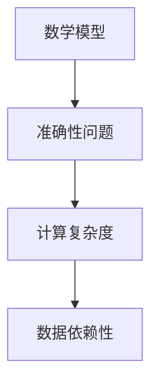

**模型准确性的改进方法**

1. **数据增强**：通过增加基因编辑实验的数据量，可以提高数学模型的准确性。

2. **算法优化**：通过优化数学模型的算法，如改进遗传算法、神经网络等，可以提高模型的准确性和效率。

3. **跨学科合作**：通过跨学科合作，如生物学、医学和计算机科学等，我们可以共同改进数学模型，提高其在基因编辑中的应用准确性。

**举例说明**

假设我们使用CRISPR-Cas9技术编辑一个基因，通过增加实验数据量、优化算法和跨学科合作，我们可以改进数学模型，提高基因编辑的准确性和效率。

---

##### 4.4 基因编辑技术的监管与法规

**法规与监管**

基因编辑技术在全球范围内面临着不同的监管和法规挑战。如何建立有效的监管框架和法规，以确保基因编辑技术的安全和合理使用，是一个重要议题。

**核心概念与联系**

用Mermaid流程图展示基因编辑技术的监管与法规：

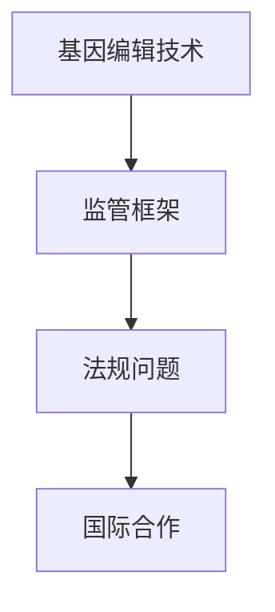

**法规与监管的方法**

1. **国际协调**：通过国际合作，建立统一的基因编辑技术监管框架，确保基因编辑技术的全球安全和合理使用。

2. **法规制定**：制定详细的法规和标准，明确基因编辑技术的使用范围、安全标准和法律责任。

3. **公众参与**：通过公众参与，加强社会对基因编辑技术的理解和监督，确保其合理和公正的使用。

**举例说明**

假设我们要制定一项关于CRISPR-Cas9技术的法规，通过国际协调、法规制定和公众参与，我们可以确保这项技术在全球范围内的安全和合理使用。

---

#### 第5章：数学与未来基因工程的机遇

##### 5.1 新兴数学方法在基因工程中的应用

**新兴方法**

随着人工智能和机器学习等新兴数学方法的不断发展，这些方法在基因工程中的应用前景广阔。

**核心概念与联系**

用Mermaid流程图展示新兴数学方法在基因工程中的应用：

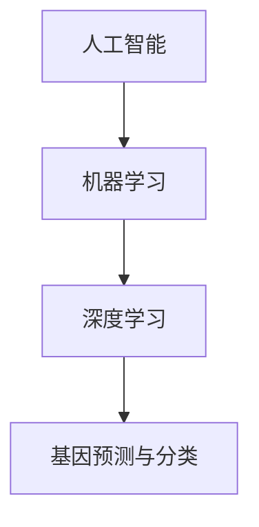

**新兴方法的应用**

1. **机器学习**：通过机器学习技术，我们可以训练模型来预测基因的功能和调控关系，提高基因预测和分类的准确性。

2. **深度学习**：通过深度学习技术，我们可以构建复杂的神经网络模型，用于基因表达数据分析、基因编辑优化等。

3. **强化学习**：通过强化学习技术，我们可以优化基因编辑策略，提高基因编辑的准确性和效率。

**举例说明**

假设我们要通过机器学习和深度学习技术来预测基因的功能，通过强化学习技术来优化基因编辑策略，从而提高基因编辑的准确性和效率。

---

##### 5.2 数学模型在个性化医疗中的应用

**个性化医疗**

个性化医疗是一种基于患者个体差异的医疗服务模式，通过数学模型，我们可以实现个性化医疗，提高治疗效果。

**核心概念与联系**

用Mermaid流程图展示数学模型在个性化医疗中的应用：

```mermaid
graph TD
    A[基因数据] --> B[数学模型]
    B --> C[个性化医疗]
    C --> D[治疗效果]
```

**数学模型在个性化医疗中的应用**

1. **基因检测**：通过基因检测，我们可以获取患者的基因信息，用于构建个性化医疗模型。

2. **药物筛选**：通过数学模型，我们可以筛选出适合患者个体的药物，提高治疗效果。

3. **治疗方案优化**：通过数学模型，我们可以优化治疗方案，提高患者的治疗效果。

**举例说明**

假设我们要为一名患者制定个性化的治疗方案，通过基因检测和数学模型，我们可以筛选出适合该患者的药物，并优化治疗方案，提高治疗效果。

---

##### 5.3 基因编辑技术的创新与发展

**技术创新**

随着基因编辑技术的不断发展，新的基因编辑工具和策略不断涌现，这些技术创新为基因编辑技术的应用提供了新的机遇。

**核心概念与联系**

用Mermaid流程图展示基因编辑技术的创新与发展：

```mermaid
graph TD
    A[基因编辑工具] --> B[编辑精度]
    B --> C[编辑效率]
    C --> D[编辑策略]
```

**技术创新的应用**

1. **基因编辑工具**：通过开发新的基因编辑工具，如CRISPR-Cas13、CRISPR-Cas12等，可以提高基因编辑的精度和效率。

2. **编辑策略**：通过优化编辑策略，如多靶点编辑、基因融合等，可以提高基因编辑的准确性和效率。

3. **计算生物学方法**：通过计算生物学方法，如机器学习和深度学习等，可以优化基因编辑策略，提高基因编辑的准确性和效率。

**举例说明**

假设我们要通过CRISPR-Cas13技术编辑一个基因，通过计算生物学方法优化编辑策略，提高基因编辑的准确性和效率。

---

##### 5.4 跨学科合作与多领域融合

**跨学科合作**

基因工程是一个跨学科领域，涉及生物学、计算机科学、数学等多个学科。跨学科合作和多领域融合为基因工程的进一步发展提供了新的机遇。

**核心概念与联系**

用Mermaid流程图展示跨学科合作与多领域融合：

```mermaid
graph TD
    A[生物学] --> B[计算机科学]
    B --> C[数学]
    C --> D[基因工程]
```

**跨学科合作与多领域融合的应用**

1. **生物信息学**：通过生物信息学方法，我们可以处理和解析基因数据，揭示基因的功能和调控关系。

2. **计算生物学**：通过计算生物学方法，我们可以构建和优化基因调控模型，预测基因编辑的效果。

3. **人工智能**：通过人工智能技术，我们可以开发智能化的基因编辑工具和策略，提高基因编辑的准确性和效率。

**举例说明**

假设我们要开发一种智能化的基因编辑工具，通过生物信息学、计算生物学和人工智能等跨学科合作，我们可以优化基因编辑策略，提高基因编辑的准确性和效率。

---

### 总结与展望

基因工程是一门跨学科领域，涉及生物学、计算机科学、数学等多个学科。随着基因编辑技术的不断发展，数学方法在基因工程中的应用越来越广泛。本文通过探讨数学在基因工程中的应用，从基本概念到发展方向的全面分析，展示了数学方法在基因序列分析、基因调控网络建模、基因编辑技术等方面的应用实例。

**总结**

1. **数学原理在基因工程中的应用**：线性代数、概率论和统计学等数学原理在基因工程中发挥了基础性作用，帮助我们理解和分析基因序列、基因调控网络以及基因编辑技术。

2. **数学模型在基因工程中的重要性**：通过数学建模，我们可以揭示基因的功能和调控关系，优化基因编辑策略，提高基因编辑的准确性和效率。

3. **机器学习在基因工程中的应用**：机器学习技术在基因功能预测、基因分类、药物研发等方面具有广泛应用，为基因工程的进一步发展提供了新机遇。

**展望**

1. **大数据时代的基因工程**：随着基因数据量的增长，大数据时代的基因工程面临着巨大的数据分析挑战。通过优化数据分析方法，提高数据分析的效率和准确性，将有助于揭示基因的复杂调控关系。

2. **基因编辑技术的创新与发展**：新兴基因编辑工具和策略的涌现，为基因编辑技术的进一步发展提供了新的机遇。通过跨学科合作和多领域融合，我们可以开发更加精准和高效的基因编辑技术。

3. **个性化医疗的推进**：个性化医疗是一种基于患者个体差异的医疗服务模式，通过数学模型和基因编辑技术，我们可以实现个性化医疗，提高治疗效果。

4. **跨学科合作与多领域融合**：基因工程是一个跨学科领域，通过跨学科合作和多领域融合，我们可以开发更加综合和高效的基因工程技术，推动基因工程的进一步发展。

**结语**

数学与基因工程的结合为基因工程的进一步发展提供了新的机遇和挑战。通过深入研究和探索，我们可以更好地理解和应用数学方法，推动基因工程领域的发展，为人类健康和社会进步做出更大贡献。

---

### 作者信息

作者：AI天才研究院/AI Genius Institute & 禅与计算机程序设计艺术 /Zen And The Art of Computer Programming

---

### 拓展阅读

1. **《基因工程原理》**：这是一本经典的基因工程教材，涵盖了基因工程的基本原理、技术方法和应用领域。通过学习这本书，您可以深入了解基因工程的基本概念和技术。

2. **《计算生物学导论》**：这本书介绍了计算生物学的基本概念、方法和应用，涵盖了基因组学、蛋白质组学、代谢组学等多个领域。通过学习这本书，您可以了解计算生物学在基因工程中的应用。

3. **《机器学习与基因工程》**：这本书探讨了机器学习在基因工程中的应用，包括基因表达数据分析、基因功能预测、药物研发等方面。通过学习这本书，您可以了解机器学习在基因工程中的实际应用案例。

4. **《深度学习：入门到实践》**：这本书介绍了深度学习的基本概念、方法和应用，是深度学习领域的经典教材。通过学习这本书，您可以了解深度学习在基因工程中的应用潜力。

---

### 注意事项

1. **数据安全与隐私**：在进行基因工程实验和数据解析时，要严格遵守数据安全与隐私的规定，确保患者的隐私和权益。

2. **基因编辑技术的伦理问题**：在进行基因编辑实验时，要充分考虑伦理问题，确保基因编辑技术的安全和合理使用。

3. **跨学科合作与多领域融合**：基因工程是一个跨学科领域，要积极与其他学科合作，如生物学、计算机科学、数学等，以推动基因工程的进一步发展。

4. **持续学习与更新**：基因工程和数学方法是一个快速发展的领域，要持续学习和更新知识，以适应这一领域的发展趋势。

