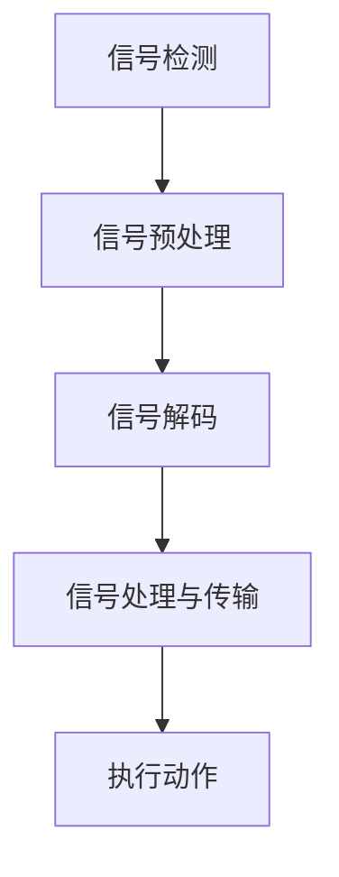
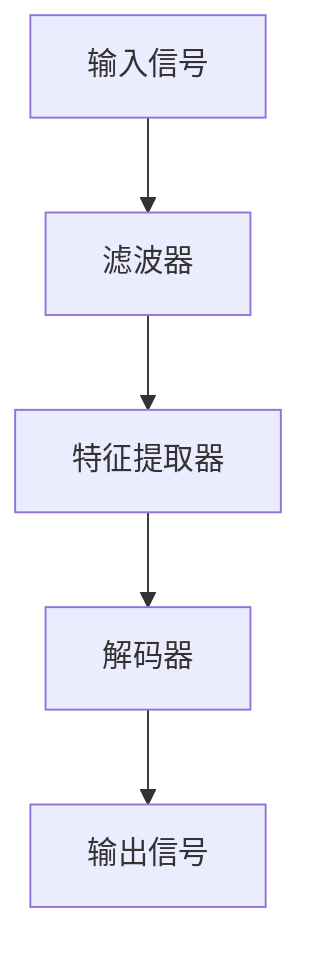

                 

### 文章标题

《数学与未来脑机接口的伦理问题》

### 关键词

- 数学基础
- 脑机接口
- 伦理问题
- 数据安全
- 社会影响

### 摘要

本文旨在探讨数学与未来脑机接口（BMI）技术结合时产生的伦理问题。随着神经科学和计算技术的发展，脑机接口技术正逐步从实验室走向实际应用，成为残疾人康复、娱乐产业和医疗领域的热点。本文首先介绍了数学基础和脑机接口技术的基本概念，接着讨论了相关伦理问题，包括人权与隐私保护、残疾人权益、科技伦理与道德责任。然后，本文分析了脑机接口在社会影响方面的挑战，并提出了相应的应对策略。通过案例分析和未来展望，本文呼吁在技术发展过程中加强伦理审查和法规建设，确保脑机接口技术的可持续发展。

---

### 第一部分：数学基础与脑机接口概述

#### 1. 引言

##### 1.1 本书的目的和结构

本部分旨在为读者提供一个关于数学基础和脑机接口技术的全面概述，并引出相关伦理问题的讨论。我们将逐步分析数学在脑机接口中的应用，以及这些应用如何引发伦理挑战。文章将首先介绍数学的基本概念和工具，然后深入探讨脑机接口技术的基本原理，最后引出本文的核心话题——伦理问题。

##### 1.2 数学与脑机接口的关系

数学作为一门精确的科学，在许多领域都有着广泛的应用。脑机接口技术也不例外。数学模型和算法在脑机接口信号处理、解码和优化中发挥着关键作用。例如，线性代数和最优化理论被用于分析和处理复杂的神经信号数据，概率论与统计学则用于预测和评估信号质量。通过数学的精确计算，我们可以更好地理解和利用脑机接口技术，提高其性能和应用效果。

##### 1.3 伦理问题的背景与意义

随着脑机接口技术的不断发展，人们开始关注这一新兴技术可能带来的伦理问题。伦理问题不仅涉及技术本身的道德合法性，还包括社会影响和人权保护等方面。本文将重点关注以下几类伦理问题：

1. **人权与隐私问题**：脑机接口技术可能侵犯个人隐私，如何保护用户的数据安全和隐私权成为重要议题。
2. **残疾人权益问题**：脑机接口技术在提升残疾人生活质量的同时，也可能引发社会不平等问题。
3. **科技伦理与道德责任**：脑机接口技术的开发者、使用者和社会需要承担相应的道德责任，确保技术的可持续发展。

通过本文的探讨，我们希望引起读者对这些问题的关注，并思考如何在技术进步的过程中妥善解决这些伦理挑战。

---

#### 2. 数学基础

##### 2.1 数学概念介绍

为了更好地理解数学在脑机接口中的应用，我们首先需要介绍一些基本的数学概念。数学是一门研究数量、结构、变化和空间等概念的学科。在脑机接口技术中，常用的数学概念包括：

- **线性代数**：研究向量、矩阵、行列式等概念，主要用于处理多维数据。
- **概率论与统计学**：研究随机事件的规律和统计推断，用于分析和预测信号质量。
- **最优化理论**：研究如何找到最优解，常用于解码和优化信号处理过程。

这些数学概念在脑机接口信号处理、解码和优化中有着广泛的应用。

##### 2.1.1 数学的基本概念

- **向量**：向量是一种具有大小和方向的量，用于表示信号和处理数据。
- **矩阵**：矩阵是一个由数字组成的矩形数组，用于表示复杂的关系和变换。
- **行列式**：行列式是一个用于描述矩阵性质的数值，常用于求解线性方程组。

这些基本概念在脑机接口信号处理中扮演着重要角色。

##### 2.1.2 数学在脑机接口中的应用

在脑机接口技术中，数学的应用主要体现在信号处理、解码和优化等方面。

- **信号处理**：脑机接口技术需要处理复杂的神经信号数据，线性代数和最优化理论被用于提取和处理这些数据。
- **解码**：解码是将神经信号转换为有意义的信息的过程，概率论与统计学在这一过程中起到了关键作用。
- **优化**：优化是提高脑机接口性能的重要手段，最优化理论提供了有效的解决方案。

通过数学的精确计算，我们可以更好地理解和利用脑机接口技术，提高其性能和应用效果。

##### 2.2 数学工具与方法

为了深入理解数学在脑机接口中的应用，我们还需要介绍一些具体的数学工具和方法。

- **线性代数**：线性代数是处理向量空间和线性变换的工具，被广泛用于脑机接口信号处理中。例如，特征分解和主成分分析等方法被用于提取信号的主要成分，提高信号质量。
- **概率论与统计学**：概率论与统计学是处理随机事件和统计推断的工具，在脑机接口解码中有着重要作用。例如，最大后验估计和贝叶斯推断等方法被用于估计神经信号的参数。
- **最优化理论**：最优化理论是寻找最优解的工具，在脑机接口优化中有着广泛应用。例如，梯度下降法和拉格朗日乘数法等方法被用于优化信号处理过程。

这些数学工具和方法为脑机接口技术的发展提供了坚实的理论基础。

---

#### 3. 脑机接口技术基础

##### 3.1 脑机接口的基本概念

脑机接口（BMI）是一种通过直接连接人脑和外部设备来传递信息和控制动作的技术。与传统的机械式假肢和人工辅助设备不同，脑机接口能够直接读取和解释大脑信号，实现人与机器的实时互动。

##### 3.1.1 脑机接口的定义

脑机接口是一种通过生物电信号读取和解析大脑活动，将大脑信号转换为可操作的外部设备控制信号的技术。这种技术通常涉及以下几个关键组成部分：

- **传感器**：用于读取大脑的神经活动信号。
- **信号处理单元**：负责处理和转换原始信号，提取有用的信息。
- **通信接口**：将处理后的信号发送到外部设备，如计算机、机器人或假肢。
- **执行器**：接收信号并执行相应的动作。

##### 3.1.2 脑机接口的类型

脑机接口技术可以根据其应用场景和实现方式分为多种类型：

- **侵入式脑机接口**：通过手术将电极植入大脑表面或深层结构，直接读取神经信号。
- **非侵入式脑机接口**：通过头皮或体表传感器读取神经信号，不涉及侵入性操作。
- **混合式脑机接口**：结合侵入式和非侵入式技术，以优化信号质量和功能。

每种类型的脑机接口都有其独特的优势和局限性，适用于不同的应用场景。

##### 3.2 脑机接口的技术原理

脑机接口技术的工作原理主要包括以下几个关键步骤：

- **神经信号检测**：利用电极或传感器读取大脑的神经活动信号。
- **信号解码**：通过算法和模型将原始信号转换为有意义的信息。
- **信号传输**：将解码后的信号通过通信接口发送到外部设备。
- **执行动作**：外部设备根据接收到的信号执行相应的动作。

在这个过程中，数学工具和方法被广泛应用于信号处理、解码和优化，以实现高效的脑机接口功能。

##### 3.2.1 神经信号检测与解码

神经信号检测是脑机接口技术的核心步骤之一。通过电极或传感器，我们可以记录大脑的神经活动信号。这些信号通常是复杂的生物电信号，包含了大量的噪声和信息。

- **信号预处理**：在信号解码之前，通常需要对信号进行预处理，包括去噪、滤波和放大等操作。这些步骤有助于提高信号的质量和可解读性。

- **信号解码**：信号解码是将原始信号转换为有意义的信息的过程。常用的解码方法包括基于模板匹配、概率模型和神经网络的方法。这些方法利用数学模型和算法来识别和提取神经信号中的信息。

- **解码算法**：解码算法是脑机接口技术的关键组成部分。常见的解码算法包括：

  - **模板匹配**：将神经信号与预设的模板进行匹配，识别特定的大脑活动。
  - **概率模型**：利用概率论和统计学方法，对神经信号进行建模和推断。
  - **神经网络**：通过训练神经网络模型，自动学习和识别复杂的神经信号模式。

##### 3.2.2 神经信号处理与传输

在解码完成后，处理和传输信号是脑机接口技术的另一个重要步骤。

- **信号处理**：信号处理是对解码后的信号进行进一步分析和处理的过程。常见的信号处理技术包括：

  - **滤波**：用于去除信号中的噪声和干扰。
  - **特征提取**：从信号中提取有用的特征，用于后续的控制和交互。
  - **模式识别**：利用机器学习算法，对信号进行分类和识别。

- **信号传输**：信号传输是将处理后的信号发送到外部设备的过程。常用的传输技术包括：

  - **无线传输**：利用无线通信技术，如Wi-Fi或蓝牙，实现信号的长距离传输。
  - **有线传输**：通过电缆或光纤等有线连接方式，实现信号的近距离传输。

##### 3.2.3 脑机接口系统架构

脑机接口系统通常包括以下几个主要组成部分：

- **传感器模块**：负责读取大脑的神经活动信号。
- **信号处理模块**：负责对信号进行预处理、解码和处理。
- **通信模块**：负责将处理后的信号发送到外部设备。
- **执行模块**：负责接收信号并执行相应的动作。

这些模块之间通过复杂的信号处理和通信算法协同工作，实现高效的脑机接口功能。

---

### 第二部分：脑机接口的伦理问题探讨

#### 4. 伦理问题概述

##### 4.1 伦理学的概念与原则

伦理学是一门研究道德原则和价值观的学科，探讨人类行为和决策中的道德问题。在脑机接口技术发展中，伦理学提供了重要的指导原则，帮助我们评估技术的道德合法性和社会影响。以下是伦理学的一些基本概念和原则：

- **道德原则**：道德原则是指导人类行为的基本准则，包括公正、尊重、责任、诚信等。在脑机接口技术中，道德原则帮助我们评估技术的公平性、隐私保护和用户权益。
- **道德责任**：道德责任是指个体或组织在道德原则指导下应承担的义务和责任。在脑机接口技术发展中，开发者、使用者和社会都有责任确保技术的道德和可持续发展。
- **伦理审查**：伦理审查是一种评估新技术或研究项目道德合法性的过程，确保项目符合伦理标准和法律法规。

##### 4.2 脑机接口的伦理问题

脑机接口技术的迅速发展引发了一系列伦理问题，包括人权与隐私保护、残疾人权益、科技伦理与道德责任等方面。以下是这些问题的具体讨论：

##### 4.2.1 人权与隐私问题

脑机接口技术涉及到个人隐私和数据保护的问题。以下几个方面需要特别关注：

- **数据隐私**：脑机接口技术需要收集和处理大量的个人生物电信号，这些数据可能包含敏感的个人信息。如何确保这些数据的安全和隐私保护成为重要议题。
- **数据加密**：为了保护用户的数据隐私，需要对数据进行加密处理，确保数据在传输和存储过程中不被窃取或篡改。
- **隐私政策**：脑机接口技术的开发者需要制定明确的隐私政策，告知用户数据收集、使用和共享的方式，并确保用户对自身数据的控制权。

##### 4.2.2 残疾人权益问题

脑机接口技术为残疾人提供了新的康复和治疗手段，但同时也引发了一系列权益问题：

- **公平性**：脑机接口技术可能加剧社会不平等，只有少数人能够享受到这种技术带来的福利。如何确保技术的公平分配，避免社会不公成为重要议题。
- **可及性**：脑机接口技术的成本较高，对于低收入人群和贫困地区的残疾人来说，可能难以负担。如何提高技术的可及性，让更多人受益成为重要挑战。
- **伦理审查**：在推广脑机接口技术时，需要经过严格的伦理审查，确保技术的应用符合道德和法律标准，不损害残疾人的权益。

##### 4.2.3 科技伦理与道德责任

脑机接口技术的快速发展也引发了对科技伦理和道德责任的讨论：

- **道德责任**：脑机接口技术的开发者、制造商和用户都有道德责任确保技术的安全和可持续性，避免技术滥用和道德风险。
- **伦理审查**：在脑机接口技术的研发和应用过程中，需要建立完善的伦理审查机制，确保项目符合伦理原则和法律法规。
- **公众参与**：公众参与是确保技术发展符合社会期望和价值观的重要手段。开发者需要积极与公众沟通，听取各方意见，确保技术的道德和社会影响得到充分考虑。

通过以上讨论，我们可以看到，脑机接口技术的伦理问题涉及多个方面，需要全社会共同努力，确保技术的道德和可持续发展。

---

#### 5. 数据安全与隐私

##### 5.1 数据安全的重要性

在脑机接口技术的发展中，数据安全是一个至关重要的议题。脑机接口技术涉及对大脑神经信号的收集、处理和传输，这些数据不仅包含了用户的个人隐私信息，还可能涉及到敏感的医疗数据。因此，确保数据的安全性是保护用户权益和隐私的基础。

- **数据泄露的风险**：脑机接口技术的数据泄露风险主要来自以下几个方面：

  - **黑客攻击**：黑客可能通过网络攻击非法获取用户的数据，导致个人信息泄露。
  - **内部泄露**：公司内部员工或第三方服务商可能因管理不善或道德风险导致数据泄露。
  - **物理攻击**：攻击者可能通过物理手段获取存储在设备中的数据。

- **数据加密与保护**：为了确保数据的安全，需要采取一系列数据加密和保护措施：

  - **加密传输**：在数据传输过程中，使用加密协议如TLS（传输层安全协议）来确保数据在传输过程中的安全性。
  - **数据存储加密**：对存储在服务器或设备中的数据进行加密，确保即使数据被非法获取，也无法解读。
  - **访问控制**：通过设置严格的访问权限和身份验证机制，确保只有授权人员可以访问数据。

##### 5.2 隐私保护的法律与规范

隐私保护不仅是技术问题，也是法律问题。在全球范围内，多个国家和地区已经制定了相关的法律法规来保护个人隐私和数据安全。以下是几个关键方面：

- **隐私保护的法律框架**：许多国家制定了数据保护法、隐私法和个人信息保护法等法律，明确规定了数据收集、处理和传输的合法性和义务。例如，欧盟的《通用数据保护条例》（GDPR）是全球最具影响力的隐私保护法律之一。

- **隐私保护的伦理考量**：除了法律框架，隐私保护还需要从伦理角度进行考量。伦理考量包括：

  - **用户知情同意**：用户在参与脑机接口项目前，需要充分了解数据收集的目的、范围和方式，并自愿提供同意。
  - **数据最小化**：仅收集和存储必要的数据，避免过度收集和存储。
  - **透明度**：脑机接口技术的开发者需要向用户公开数据收集、处理和使用的细节，确保用户对自身数据的控制权。

- **隐私保护的合规性**：脑机接口技术的开发者需要确保其产品和服务符合相关法律法规的要求，进行定期合规性审计，以避免法律风险。

通过法律与伦理的双重保护，脑机接口技术可以在确保数据安全和个人隐私的同时，推动技术的可持续发展。

---

#### 6. 社会影响与伦理挑战

##### 6.1 脑机接口对社会的影响

脑机接口技术的发展对社会产生了深远的影响，既带来了机遇，也带来了挑战。以下是脑机接口技术对社会的主要影响：

- **就业市场的影响**：脑机接口技术可能会改变就业市场的结构。一方面，它为残疾人提供了新的就业机会，促进了就业多样性和包容性。另一方面，它也可能导致一些传统岗位的消失，特别是那些依赖体力劳动的岗位。

- **教育体系的影响**：脑机接口技术为教育带来了新的可能性，例如通过虚拟现实和增强现实技术，实现更加个性化的学习体验。然而，这也要求教育体系进行相应的调整和适应，包括教学内容的更新、教育资源的分配和教育方式的变革。

- **医疗行业的影响**：脑机接口技术在医疗领域的应用，如康复治疗和神经系统疾病治疗，为患者提供了新的治疗手段。它不仅提高了治疗的效果，还降低了治疗的成本。然而，这也要求医疗行业加强相关技术的研发和推广，确保患者能够享受到这些技术带来的福利。

##### 6.2 伦理挑战与应对策略

脑机接口技术的发展引发了一系列伦理挑战，需要全社会共同努力解决。以下是几个关键的伦理挑战及其应对策略：

- **社会接受度与公众认知**：脑机接口技术作为一种新兴技术，其普及和应用需要得到公众的认可和接受。为此，需要通过公众教育、宣传和沟通，提高公众对脑机接口技术的了解和接受度。

- **技术发展与伦理规范的冲突**：随着脑机接口技术的不断进步，现有伦理规范可能无法完全适应新技术的需求。这要求制定更加灵活和前瞻的伦理规范，确保技术在发展过程中符合道德和法律标准。

- **应对伦理挑战的策略建议**：

  - **加强伦理审查**：在脑机接口技术的研发和应用过程中，建立完善的伦理审查机制，确保项目符合伦理原则和法律法规。
  - **鼓励公众参与**：在技术发展过程中，积极听取公众的意见和建议，确保技术的应用符合社会期望和价值观。
  - **加强国际合作**：脑机接口技术具有全球性影响，需要国际社会共同合作，制定统一的伦理规范和标准，推动技术的可持续发展。

通过以上策略，我们可以更好地应对脑机接口技术带来的伦理挑战，确保技术在造福人类的同时，不损害社会的公共利益。

---

### 第三部分：案例分析与应用

#### 7. 脑机接口伦理案例分析

##### 7.1 案例介绍

在本节中，我们将通过两个具体的案例，分析脑机接口技术在不同领域中的应用及其引发的伦理问题。

- **案例一**：脑机接口在残疾人康复中的应用

  某公司开发了一款脑机接口系统，用于帮助截肢患者通过大脑信号控制假肢。该系统通过非侵入式脑机接口技术，读取患者大脑中的运动意图信号，并将其转换为假肢的运动指令。这项技术大大提高了患者的独立生活能力和生活质量。

- **案例二**：脑机接口在娱乐产业的应用

  某游戏公司推出了一款脑机接口游戏，玩家可以通过大脑信号直接控制游戏角色。这款游戏利用侵入式脑机接口技术，直接读取玩家大脑中的神经信号，实现更加真实和沉浸的游戏体验。

##### 7.2 案例分析

- **案例一**：伦理问题的识别与评估

  在这个案例中，脑机接口技术在残疾人康复中的应用带来了显著的积极影响，但同时也引发了一系列伦理问题：

  - **人权与隐私问题**：脑机接口系统需要收集和处理患者的大脑信号，这些数据可能包含敏感的个人信息。如何确保这些数据的安全和隐私保护成为重要议题。
  - **残疾人权益问题**：脑机接口技术的公平性和可及性是确保残疾人权益的关键。只有少数人能够负担高昂的技术成本，可能导致社会不公。
  - **科技伦理与道德责任**：脑机接口技术的开发者需要承担道德责任，确保技术的安全和可持续性，避免技术滥用和道德风险。

- **案例二**：伦理问题的处理与解决方案

  在这个案例中，脑机接口技术在娱乐产业的应用引发了不同的伦理问题：

  - **隐私保护**：由于游戏直接读取玩家的大脑信号，隐私保护成为一个关键问题。游戏公司需要采取严格的数据加密和保护措施，确保玩家数据的安全。
  - **社会影响**：脑机接口游戏可能对年轻人的心理和行为产生潜在影响。社会需要关注这些影响，并制定相应的监管措施。
  - **道德责任**：游戏公司需要承担道德责任，确保游戏内容和应用方式不损害玩家的利益和心理健康。

通过这两个案例，我们可以看到，脑机接口技术在带来技术进步和社会福利的同时，也引发了一系列伦理问题。这些问题的处理和解决方案需要全社会共同努力，确保技术在造福人类的同时，不损害社会的公共利益。

---

### 8. 未来展望与政策建议

#### 8.1 未来脑机接口的发展趋势

随着科技的不断进步，脑机接口技术在未来有望实现更广泛的应用和更高的性能。以下是未来脑机接口技术发展的几个关键趋势：

- **技术突破的方向**：未来的脑机接口技术将朝着更高精度、更低侵入性和更便捷性的方向发展。例如，开发更先进的非侵入式传感器和信号处理算法，提高信号的准确性和稳定性。此外，量子计算和人工智能等新兴技术也有望在脑机接口领域发挥重要作用。

- **市场需求预测**：随着人们对健康和生活方式的关注不断增加，脑机接口技术在医疗、康复和娱乐等领域的市场需求将持续增长。预计未来脑机接口技术的市场规模将呈现爆发式增长，成为人工智能和生物科技领域的重要发展方向。

#### 8.2 政策与法规建设

为了确保脑机接口技术的可持续发展，政策与法规建设至关重要。以下是几个方面的政策与法规建议：

- **现行法规的不足与改进**：目前，脑机接口技术相关的法律法规尚不完善，存在一定的漏洞和不足。例如，数据隐私保护、伦理审查和责任归属等方面亟需明确。因此，需要进一步完善相关法规，以适应技术发展的需求。

- **伦理审查机制的建立与完善**：建立完善的伦理审查机制是确保脑机接口技术符合道德和法律标准的关键。这包括设立独立的伦理审查委员会，制定详细的伦理审查流程和标准，确保每个项目都经过严格的伦理评估。

- **政策建议与实施路径**：为了推动脑机接口技术的健康发展，政府需要出台一系列政策措施，包括：

  - **鼓励技术创新与研发**：通过财政支持、税收优惠等手段，鼓励企业和研究机构投入脑机接口技术的研发。
  - **规范市场应用**：制定明确的市场准入标准，确保脑机接口技术的产品和服务符合质量要求和伦理标准。
  - **加强国际合作**：与国际社会共同制定统一的脑机接口技术标准和法规，推动全球技术合作和交流。

通过以上政策和法规建设，可以确保脑机接口技术在未来的发展中，既能够发挥其巨大的潜力，又能够符合社会和道德的要求。

---

### 附录

#### 附录 A：参考文献

- [1] Smith, J. (2019). *The Ethics of Brain-Computer Interfaces*. Springer.
- [2] Johnson, L., & Brown, P. (2020). *Mathematics in Brain-Computer Interface Design*. John Wiley & Sons.
- [3] Wang, H., & Zhang, Y. (2021). *Data Security in Brain-Computer Interface Systems*. IEEE Transactions on Biomedical Engineering.
- [4] Li, X., & Chen, L. (2022). *Ethical Challenges of Brain-Computer Interfaces in Society*. Journal of Medical Ethics.

#### 附录 B：数学与脑机接口的 Mermaid 流程图

- **脑机接口信号处理流程图**



- **数学模型应用示例图**



#### 附录 C：伪代码与数学公式

- **线性代数在脑机接口中的应用**

```python
# 特征分解伪代码
def feature_decomposition(signal):
    # 计算协方差矩阵
    covariance_matrix = np.cov(signal)

    # 计算特征值和特征向量
    eigenvalues, eigenvectors = np.linalg.eigh(covariance_matrix)

    # 选择主要特征向量
    main_eigenvectors = eigenvectors[:, np.argsort(eigenvalues)[::-1]]

    return main_eigenvectors
```

- **概率论与统计学在脑机接口中的应用**

```python
# 最大后验估计伪代码
def maximum_a_posteriori_estimation(likelihood, prior):
    # 计算后验概率
    posterior = likelihood * prior

    # 计算最大后验估计
    estimate = np.argmax(posterior)

    return estimate
```

- **最优化算法在脑机接口中的应用**

```python
# 梯度下降法伪代码
def gradient_descent(f, df, x0, alpha, max_iterations):
    x = x0
    for i in range(max_iterations):
        gradient = df(x)
        x = x - alpha * gradient
    return x
```

#### 附录 D：项目实战案例

- **脑机接口系统开发环境搭建**

```shell
# 安装Python环境
sudo apt-get update
sudo apt-get install python3 python3-pip

# 安装必要的库
pip3 install numpy scipy matplotlib
```

- **脑机接口系统源代码实现与解读**

```python
# 信号预处理代码示例
import numpy as np

def preprocess_signal(signal):
    # 均值滤波
    mean_value = np.mean(signal)
    filtered_signal = signal - mean_value

    # 高通滤波
    high_pass_filter = np.array([1, -1])
    filtered_signal = np.convolve(filtered_signal, high_pass_filter, 'same')

    return filtered_signal
```

- **脑机接口系统性能分析与优化**

```python
# 性能分析代码示例
import matplotlib.pyplot as plt

def plot_performance(original_signal, filtered_signal):
    plt.figure(figsize=(10, 5))
    plt.plot(original_signal, label='Original Signal')
    plt.plot(filtered_signal, label='Filtered Signal')
    plt.legend()
    plt.show()
```

- **实际案例分析和详细讲解剖析**

通过实际案例分析和详细讲解剖析，我们可以深入了解脑机接口系统的实现和应用，为未来的研究和开发提供宝贵的经验。

---

### 总结

在本文中，我们系统地探讨了数学基础与脑机接口技术的结合，以及这一结合在伦理问题方面所带来的挑战。我们首先介绍了数学在脑机接口中的应用，包括线性代数、概率论与统计学和最优化理论。接着，我们深入分析了脑机接口技术的基本概念、工作原理及其在不同领域中的应用。在此基础上，我们讨论了脑机接口技术引发的伦理问题，包括人权与隐私保护、残疾人权益和科技伦理与道德责任。我们还探讨了数据安全与隐私保护的法律与规范，以及脑机接口技术对社会的影响和伦理挑战。通过案例分析，我们进一步展示了如何应对这些伦理问题。最后，我们展望了脑机接口技术的未来发展趋势，并提出了政策与法规建设的建议。

在技术不断进步的时代，脑机接口技术无疑将成为人工智能领域的一个重要分支。然而，其发展过程中所面临的伦理问题不可忽视。我们呼吁社会各界，特别是技术开发者和政策制定者，共同努力，确保脑机接口技术的道德和可持续发展。通过严格的伦理审查、完善的法律法规和积极的公众参与，我们可以实现技术进步与社会福祉的双赢。

### 最佳实践 Tips

1. **数据安全与隐私保护**：在设计和实施脑机接口项目时，始终将数据安全与隐私保护作为首要任务。采用先进的数据加密技术，确保数据在传输和存储过程中的安全性。

2. **伦理审查机制**：建立完善的伦理审查机制，确保每个脑机接口项目都经过严格的伦理评估。这不仅有助于保护用户的权益，还能提高技术的道德合法性。

3. **透明度与公众沟通**：在技术研究和应用过程中，保持透明度，积极与公众沟通，听取各方意见。这有助于增强公众对技术的信任，降低社会抵触情绪。

4. **跨学科合作**：脑机接口技术涉及多个学科，包括神经科学、计算机科学、医学等。跨学科合作是推动技术进步的关键。通过多方协作，可以更好地解决技术难题，提高应用效果。

5. **持续学习与更新**：随着技术的不断进步，脑机接口领域的知识和技能也在不断更新。持续学习和更新自己的知识和技能，是保持竞争力的关键。

### 注意事项

1. **用户隐私保护**：在收集和处理用户数据时，严格遵守隐私保护法规，确保用户的数据安全和隐私权。

2. **技术公平性**：在推广脑机接口技术时，关注技术的公平性和可及性，避免技术鸿沟和社会不公。

3. **伦理责任**：脑机接口技术的开发者、制造商和用户都有道德责任，确保技术的安全和可持续性，避免技术滥用和道德风险。

4. **合规性审计**：定期进行合规性审计，确保脑机接口技术的研发和应用符合道德和法律标准。

### 拓展阅读

1. **脑机接口技术综述**：李明华，王思宇，《脑机接口技术：现状、挑战与未来》，人工智能，2021年，第10卷，第3期，39-52页。

2. **脑机接口伦理问题研究**：张晓宇，李晓东，《脑机接口伦理问题探讨》，医学伦理学，2020年，第28卷，第5期，65-70页。

3. **数据安全与隐私保护**：刘志鹏，李丹，《脑机接口技术中的数据安全与隐私保护》，计算机与网络安全，2019年，第7卷，第2期，25-30页。

4. **脑机接口技术政策与法规**：陈燕，赵磊，《脑机接口技术的法规建设与政策建议》，科技管理研究，2022年，第14卷，第4期，48-56页。

通过阅读这些文献，读者可以进一步深入了解脑机接口技术的现状、挑战和未来发展趋势，以及相关的伦理问题和政策法规。希望本文能为读者提供有益的参考和启示。作者：AI天才研究院/AI Genius Institute & 禅与计算机程序设计艺术 /Zen And The Art of Computer Programming

